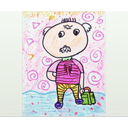

叶
============================

|  |  |
| :--: | :-- |
| [ 叶](https://emumo.xiami.com/album/2009575879) | **艺人**: [鲸鱼马戏团](../index.md) **语种**: 国语 **唱片公司**: 独立发行 **发行时间**: 2014年09月01日 **专辑类别**: EP, 单曲 **专辑风格**: 原声 Soundtrack, 轻音乐 Easy Listening, 独立流行 Indie Pop **播放数**: 141432 **收藏数**: 202 **评论数**: 14  |

## 简介

“人生就这么步履不停地前行着，那些舍得的舍不得的人和事总会一一远去，以至再也无法望见。你可能偶尔怀念，也可能丢了命似的道不了别。” 
 

 

在去巴西旅行的第二天，我接到爷爷离世的消息。他走的如此安静，甚至都没来得及和家人打一声招呼。我还记得一个星期前，我们在饭桌上的谈话；记得我总答应给他看我的演出录像，却从来没有兑现过；记得他爱看着我笑；给我讲他年轻的故事。。那些回忆是带着温度的，它编织起松软的布盖，将我们的快乐与幸福，默默保护着。
 

&nbsp;
 

特别感谢朱函润小朋友的画。

## 曲目

## 评论

|  |  |  |  |
| :-- | :-- | :-- | :-- |
|  [虾米用户](https://emumo.xiami.com/u/187455362) 人间值得 我也值得 2018-08-15 23:17 赞(0) 踩(0) | 
叶叶，爷爷。
 |
|  [虾米用户](https://emumo.xiami.com/u/278051428)  2018-01-29 11:04 赞(0) 踩(0) | 
一直很好奇这个封面的说
 |
|  [虾米用户](https://emumo.xiami.com/u/478527) 好想跟衣服在洗衣机里滚 2016-07-20 16:41 赞(1) 踩(0) | 
感恩生命中所有的相遇，祝福世间所有的美好。
 |
|  [虾米用户](https://emumo.xiami.com/u/478527) 好想跟衣服在洗衣机里滚 2016-07-20 16:41 赞(0) 踩(0) | 
感恩生命中所有的相遇，祝福世间所有的美好。
 |
|  [虾米用户](https://emumo.xiami.com/u/8395195) 何必呢 2016-05-29 20:34 赞(3) 踩(0) | 
外公走的也很平静。之前鼻癌晚期，在受太多苦之前走了也好。而老家传来消息外公的哥哥差不多时间也走了，老人家们。实际除了外婆并没有多少人有多少悲伤，外公让家里人造了很多不必要的矛盾与敌对。外婆是个老好人，受了外公一辈子气，长辈们说外公这一走，外婆能多活些安心日子了。按习俗外公生前大部分东西都要烧掉或扔掉，想着外婆望着空荡荡的家，不知会想些什么。希望外公上了天脾气能好些，祝愿没得过什么病的外婆继续乘着晚风在矮旧的小房子和对面高楼大厦间的小路上、悠悠地、吟赏烟霞
 |
| ⇒ |  [虾米用户](https://emumo.xiami.com/u/855191)  2016-05-30 00:37 赞(0) 踩(0) | 
他一定会是个特别好脾气的小BABY的~
 |
| ⇒ |  [虾米用户](https://emumo.xiami.com/u/8395195) 何必呢 2016-05-30 01:08 赞(0) 踩(0) | 
<q><b>鲸鱼马戏团说：</b></q>
 |
|  [虾米用户](https://emumo.xiami.com/u/1498042) 我还没想好要写什么... 2015-03-16 16:38 赞(0) 踩(0) | 
✌️
 |
|  [虾米用户](https://emumo.xiami.com/u/749885)   2015-03-13 23:27 赞(0) 踩(0) | 
好温暖，谢谢你。
 |
|  [虾米用户](https://emumo.xiami.com/u/46061541)   2015-01-15 17:30 赞(2) 踩(0) | 
一个人的离开总是很匆忙，有时候只是一夜之间的事儿，所以我讨厌离别。现在还记得爷爷给我讲，他骑着28自行车穿过西山到兵工厂跟奶奶谈恋爱的那些故事。
 |
|  [虾米用户](https://emumo.xiami.com/u/43167305)  2014-10-30 20:32 赞(0) 踩(0) | 
安静，适合睡前听
 |
|  [虾米用户](https://emumo.xiami.com/u/13073595)  2014-09-20 21:20 赞(0) 踩(0) | 
不错AA
 |
|  [虾米用户](https://emumo.xiami.com/u/40774573)  2014-09-02 22:25 赞(3) 踩(0) | 
时间永远都在一直一直向前，让我们一步一步离开失去，可却依然是那么那么爱你。小心的怀揣着我们相处的回忆，直到我也失去了自己，离开这个世界。亲人，从蹒跚学步到撒手而去，会永远都在我心里，我也会在你心里。
 |
|  [虾米用户](https://emumo.xiami.com/u/17330125) 想象音乐的另一种可能 2014-09-02 14:37 赞(1) 踩(0) | 
T-T
 |
