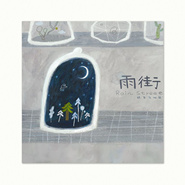

雨街Rain Street
============================

|  |  |
| :--: | :-- |
| [ 雨街Rain Street](https://emumo.xiami.com/album/2100373147) | **艺人**: [鲸鱼马戏团](../index.md) **语种**: 国语 **唱片公司**: 风潮音乐 **发行时间**: 2016年07月28日 **专辑类别**: EP, 单曲 **专辑风格**: 轻音乐 Easy Listening **播放数**: 427169 **收藏数**: 1914 **评论数**: 99  |

## 简介

乘坐李星宇的奇幻音乐飞船，让琴声带你划向寂静的宇宙远离喧嚣的城市。  
  
李星宇，台北大地知音全球华人原创音乐大赛冠军，独立音乐製作人、声学空间设计师，更以音乐跨足舞台剧、动画的演出及配乐创作，网路音乐点击突破百万。  
  
把宇宙间最灰暗的声音化成绮丽的音符，用琴键敲亮眼前的风景，他用音乐建构一座奇幻宇宙，用钢琴带你看见美丽的声影、听见心的期待，这次更结合配音演员苏子芜，让人声和音乐激发出宇宙孤寂的风景。  
  
《雨街》音乐小说 　/　文：李星宇  
人造阳光开放的天数越来越少了，弗雷德努力用眼睛吸进窗外最后一缕光。世界就像一台运转的机器被按下停止键，光在瞳孔中远去，黑暗中有那么一瞬，静的只剩下心跳。  
一、二、三…远空的寂静中，星星点点的光斑打破沉默。数秒内，城市变为一个巨大的光环，原本灰暗的天空蒙上一层透明的光膜。又回到了它原本的样子，弗雷德敲敲自己的脑袋，发出砰砰两声。  
自第二次大规模生物嫁接后，已过去十年，人类的数量正稳定减少，距离最后的目标还有不到半年时间。  
弗雷德GTP-204人工智慧机械工程师。NO.20 雨街实验室，时间17：30。今日完成四组未成年男性与女性的生物嫁接。生命体状态稳定，一周后脱离培养基，移栽至273号森林……完毕。  
结束报告，弗雷德走进自己的房间。除了定时工作外，剩下的时间他都用来学习人类文化。读书、绘画和音乐都是他的最爱，他喜欢听著21世纪的音乐，画几幅融合印象派和新隐约派（21世纪晚期的一种艺术流派，特点是使用接近极致的空来体现深长的意义）的作品。  
  
今天的几幅画梵古先生不大满意，弗雷德总爱用资料来揣摩过去艺术家的思维，然后对自己的画作进行点评。或许高更会喜欢吧，下次换他的头脑试试。不过，又要回去工作了，新的人类样本已经送到。  
弗雷德自言自语，或许是因为世界的空旷，又或者是他的习惯，弗雷德的声音特别大又吵，像一台巨大的搅拌机搅拌金属发出的嘈杂轰鸣。  
  
实验室裡活像个热带雨林，各式各样的植物热闹非凡。目前生物体征最稳定的是无刺仙人掌，但智慧资料嫁接最理想的是银杏。弗雷德会依据各个人类的智力水淮以及工作性质来分配嫁接的植物类型，并建立起稳定的森林系统。  
我们的地球气候环境在22世纪中期，出现了极大的波动，由于长期的资源开发和工业污染，地球上开始出现红色气候效应，像这样城市上空的全息公告屏上闪出地球的画面，接著原本蓝色的部分渐渐变为红色，一声刺耳的警报出现。  
我们人类因极端天气和有毒气体的影响，寿命在逐渐减少，同时疾病率急速上升，解决生存的问题刻不容缓。  
画面出现几株植物，然后出现人类的符号。在危难关头，科学家J博士提出了生物嫁接计画，将人类基因逐渐转移至生命力强大，并适应地球原始生态的植物中。利用自然本身的自癒能力，待地球再次适宜人类生存的时候，我们将利用克隆技术再次恢复人类的本体。  
  
动态画面反复播放人类变成植物，再变回人类的过程。请各位不要担心，你们的DNA和头脑资讯也同样培育在植物体内，等我们恢复的时候这些资讯也会一併复原哦！可爱女孩子的声音回荡在空旷的建筑物之间，每天这样的资讯要播放很多次。  
  
最后一批人类嫁接几近完成了，弗雷德敲敲脑袋，砰砰两声。房间裡的画已经堆满，他后来创作了很多石器时代风格的岩壁画，他很好奇那个没有语言的时代，人类是如何通过图像来传达资讯，而语言又是在什么样的机缘下诞生，人类的古老文明让他如痴如醉。  
  
不过，这些即将变成一个谜，就留给下一代的智慧生命来解答吧。弗雷德略带调侃却又有些伤感地说著。  
星空再次照亮大地，无数排月光下反射著银辉的太空船安静地等候发射。周围只剩下寂静和深远的黑夜，还有栖息著无数灵魂，轻轻摇摆的森林和草原。 

## 曲目

## 评论

|  |  |  |
| :-- | :-- | :-- |
|  [虾米用户](https://emumo.xiami.com/u/9764786)  2019-04-09 11:43 赞(1) 踩(0) | 
喜欢这个设定，让植物带着人类的意识，地球回归，宁静伤感的故事。。。像脉冲一样的电声，最有永恒感什么的了。。。
 |
|  [虾米用户](https://emumo.xiami.com/u/339191478)   2018-11-04 12:34 赞(0) 踩(0) | 

 |
|  [虾米用户](https://emumo.xiami.com/u/188185305) 上海的南京路  ”南京的... 2017-07-22 14:30 赞(0) 踩(0) | 
嘿，马戏团会回复的哎，等你喽 
 |
|  [虾米用户](https://emumo.xiami.com/u/201391232) 最快的方法是先抱抱 2017-05-15 00:26 赞(1) 踩(0) | 
Ｇｅｔ.
 |
|  [虾米用户](https://emumo.xiami.com/u/9247594) 7月6日 2017-05-06 21:49 赞(0) 踩(0) | 
蓝色的果冻弹
 |
|  [虾米用户](https://emumo.xiami.com/u/113086204)  2017-04-26 12:28 赞(0) 踩(0) | 
春雨，微凉
 |
|  [虾米用户](https://emumo.xiami.com/u/1157436) 跳跳糖 2017-04-22 10:23 赞(0) 踩(0) | 
旋律好美聽著很有想像空間，能感受到意境，真的好棒
 |
|  [虾米用户](https://emumo.xiami.com/u/2215829)   2016-10-11 10:48 赞(2) 踩(0) | 
雨街好听，生物嫁接23333……我脑子里蹦出的都是驾笼的机械嫁接法去了（玩坏
 |
|  [虾米用户](https://emumo.xiami.com/u/1065860) 一生悬命。 2016-09-28 15:52 赞(2) 踩(0) | 
嫁接计划有点囧
 |
|  [虾米用户](https://emumo.xiami.com/u/123104844) 不能舍弃音乐 2016-09-17 19:49 赞(2) 踩(0) | 
厉害了   萌萌哒的金属感...我是说内个嫁接计划 
 |
|  [虾米用户](https://emumo.xiami.com/u/42682176)  2016-09-11 22:03 赞(0) 踩(0) | 
睡前音乐
 |
|  [虾米用户](https://emumo.xiami.com/u/24098114)  2016-08-27 07:48 赞(0) 踩(0) | 
無腦點贊，腦殘粉了已經…喜歡你的音樂，氛圍音樂讓人浮想聯翩…後來和Endy聊天，原來你來過金華
 |
| ⇒ |  [虾米用户](https://emumo.xiami.com/u/855191)  2016-09-05 22:39 赞(0) 踩(0) | 
嗯，我前一个乐队在金华演出过哈哈
 |
|  [虾米用户](https://emumo.xiami.com/u/119957598)  2016-08-16 10:21 赞(0) 踩(0) | 
真的好听 丝丝柔柔的声音从你耳旁滑过，几种乐器的结合听起来很舒服，围绕着主旋律进行一些变化
 |
|  [虾米用户](https://emumo.xiami.com/u/39569237) 永远年轻 永远热泪盈眶 2016-08-12 04:20 赞(1) 踩(0) | 
纯音乐,鲸鱼马戏团,
 |
|  [虾米用户](https://emumo.xiami.com/u/185473352) 逗比，范二。。呵呵，有时... 2016-08-11 23:59 赞(0) 踩(0) | 
喜欢这样的音乐风格
 |
|  [虾米用户](https://emumo.xiami.com/u/124999710) 电子音乐人 2016-08-09 11:49 赞(0) 踩(0) | 

 |
|  [虾米用户](https://emumo.xiami.com/u/208549512) onlyStart 2016-08-03 19:10 赞(0) 踩(0) | 
雨街
 |
|  [虾米用户](https://emumo.xiami.com/u/191494138) 努力的你现在会不舒服，不... 2016-08-03 11:44 赞(2) 踩(0) | 
这张专辑听着风格偏科幻，有一种迷幻的超现代感
 |
|  [虾米用户](https://emumo.xiami.com/u/43135317) 别做空想家！ 2016-08-03 07:20 赞(1) 踩(0) | 
找到咯，《落雨》很棒很棒的
 |
| ⇒ |  [虾米用户](https://emumo.xiami.com/u/44911791) 太平洋的猫 2016-08-05 17:13 赞(0) 踩(0) | 
我也觉得哦！还有类似的自然卷的《下雨了》
 |
| ⇒ |  [虾米用户](https://emumo.xiami.com/u/43135317) 别做空想家！ 2016-08-05 17:55 赞(0) 踩(0) | 
<q><b>悉 棪说：</b></q>
 |
| ⇒ |  [虾米用户](https://emumo.xiami.com/u/43135317) 别做空想家！ 2016-08-05 17:57 赞(0) 踩(0) | 
<q><b>悉 棪说：</b></q>
 |
|  [虾米用户](https://emumo.xiami.com/u/43135317) 别做空想家！ 2016-08-03 07:12 赞(0) 踩(0) | 
原来记得听过你的一首歌……让我想想
 |
|  [虾米用户](https://emumo.xiami.com/u/39370914) 解开安全带，闭上双眼，开... 2016-08-03 02:09 赞(0) 踩(0) | 
喜欢的音乐全开始单曲付费，怀念那个用mp3自由听歌的年代
 |
| ⇒ |  [虾米用户](https://emumo.xiami.com/u/11267013) 我还没想好要写什么... 2019-12-01 09:56 赞(0) 踩(0) | 
音乐人也要生存的
 |
|  [虾米用户](https://emumo.xiami.com/u/23019766)  2016-08-02 19:23 赞(1) 踩(0) | 
被『鲸鱼马戏团』的名字吸引进来，原来是这样的轻音乐 
 |
|  [虾米用户](https://emumo.xiami.com/u/6851231) 没有旋律 会死 2016-08-02 13:07 赞(0) 踩(0) | 
棒棒棒的寂静音乐 在城市里找到平息心情的理由
 |
|  [虾米用户](https://emumo.xiami.com/u/8244559)  2016-08-02 11:00 赞(0) 踩(0) | 
******
 |
|  [虾米用户](https://emumo.xiami.com/u/13120462) 声音 2016-08-01 21:56 赞(0) 踩(0) | 
终于等到你
 |
|  [虾米用户](https://emumo.xiami.com/u/162979530)  2016-08-01 19:45 赞(0) 踩(0) | 

 |
|  [虾米用户](https://emumo.xiami.com/u/162979530)  2016-08-01 19:44 赞(0) 踩(0) | 
[文字cool]
 |
|  [虾米用户](https://emumo.xiami.com/u/2712243)   2016-08-01 10:07 赞(0) 踩(0) | 
男神出新砖了~~
 |
|  [虾米用户](https://emumo.xiami.com/u/3612332)   2016-08-01 00:45 赞(0) 踩(0) | 
最爱星大白哈哈哈
 |
|  [虾米用户](https://emumo.xiami.com/u/478527) 好想跟衣服在洗衣机里滚 2016-07-31 23:17 赞(0) 踩(0) | 
为什么叫雨街，其中的这几首歌跟这个名字有什么关系
 |
|  [虾米用户](https://emumo.xiami.com/u/478527) 好想跟衣服在洗衣机里滚 2016-07-31 23:17 赞(0) 踩(0) | 
为什么叫雨街，其中的这几首歌跟这个名字有什么关系
 |
|  [虾米用户](https://emumo.xiami.com/u/3969007)  2016-07-31 22:47 赞(0) 踩(0) | 
******
 |
|  [虾米用户](https://emumo.xiami.com/u/6361118) 黑洞無始終，音樂無疆界 2016-07-31 22:11 赞(0) 踩(0) | 
鲸鱼马戏团新作来了！
 |
|  [虾米用户](https://emumo.xiami.com/u/49594378)  2016-07-31 22:08 赞(0) 踩(0) | 
认识鲸鱼马戏团，是因为一首《风》，唤醒耳朵又净化心灵的音乐，从此记住了这个可爱名字创作的纯音乐
 |
|  [虾米用户](https://emumo.xiami.com/u/7918736) ここにいるよ。 2016-07-31 11:51 赞(0) 踩(0) | 
Σ(っ °Д °;)っ好厉害 果然还是没变 一直喜欢这个
 |
|  [虾米用户](https://emumo.xiami.com/u/7841494)   2016-07-31 09:12 赞(0) 踩(0) | 
看看
 |
|  [虾米用户](https://emumo.xiami.com/u/502485)   2016-07-31 07:38 赞(2) 踩(0) | 
结果没有成功。。于是人类毁灭了。。地球变成原始森林。。
 |
| ⇒ |  [虾米用户](https://emumo.xiami.com/u/855191)  2016-07-31 19:31 赞(0) 踩(0) | 
我就是这么想的其实
 |
|  [虾米用户](https://emumo.xiami.com/u/47450223)   2016-07-31 02:19 赞(0) 踩(0) | 

 |
|  [虾米用户](https://emumo.xiami.com/u/15398833)  2016-07-31 01:10 赞(0) 踩(0) | 
感觉像植物大战僵尸
 |
|  [虾米用户](https://emumo.xiami.com/u/21395301)   2016-07-30 23:56 赞(0) 踩(0) | 
什么鬼…
 |
|  [虾米用户](https://emumo.xiami.com/u/13534960) 江湖再见了 2016-07-30 22:11 赞(0) 踩(0) | 
  
 |
|  [虾米用户](https://emumo.xiami.com/u/200014336)  2016-07-30 20:30 赞(0) 踩(0) | 
赞
 |
|  [虾米用户](https://emumo.xiami.com/u/4771470) 暂无签名~ 2016-07-30 20:12 赞(4) 踩(0) | 
卧槽，唱片公司是风潮音乐！！我以前都没发现，风潮出的所有音乐都是精品中的精品。
 |
| ⇒ |  [虾米用户](https://emumo.xiami.com/u/15843617)  2016-08-01 14:37 赞(0) 踩(0) | 
謝謝妙妙...鲸鱼马戏团, 是風潮很喜歡的年輕音樂家! 未來還有更精彩的合作..敬請期待~~
 |
|  [虾米用户](https://emumo.xiami.com/u/201402272) 且活且开心 2016-07-30 19:54 赞(0) 踩(0) | 
好听
 |
|  [虾米用户](https://emumo.xiami.com/u/157570618) 笑问客从何处来 2016-07-30 19:31 赞(0) 踩(0) | 
厉害了
 |
|  [虾米用户](https://emumo.xiami.com/u/103730820) 派对不停 2016-07-30 17:54 赞(0) 踩(0) | 
很棒的呀 
 |
|  [虾米用户](https://emumo.xiami.com/u/16565346) QQ音乐：rainbri... 2016-07-30 17:46 赞(0) 踩(0) | 
很有意思哈哈
 |
|  [虾米用户](https://emumo.xiami.com/u/105666500) 只要相信，期待就会成真。 2016-07-30 14:28 赞(0) 踩(0) | 
很有意思
 |
|  [虾米用户](https://emumo.xiami.com/u/7205091) 胡同串子 2016-07-30 13:58 赞(1) 踩(0) | 
太迷幻了 ，要飘起来了，扶我。。。
 |
|  [虾米用户](https://emumo.xiami.com/u/197512721)   2016-07-30 11:54 赞(0) 踩(0) | 
一直很喜欢鲸鱼马戏团！！！
 |
|  [虾米用户](https://emumo.xiami.com/u/206799866)  2016-07-30 11:05 赞(0) 踩(0) | 
人体企鹅的清
 |
|  [虾米用户](https://emumo.xiami.com/u/12561661) 暂无签名~ 2016-07-30 10:03 赞(6) 踩(0) | 
生物嫁接是什么鬼
 |
|  [虾米用户](https://emumo.xiami.com/u/48310097)  2016-07-30 09:59 赞(0) 踩(0) | 
棒棒哒
 |
|  [虾米用户](https://emumo.xiami.com/u/45639735) 我还没想好要写什么...... 2016-07-30 09:59 赞(0) 踩(0) | 
什么鬼
 |
|  [虾米用户](https://emumo.xiami.com/u/47365062) windy 2016-07-30 09:55 赞(0) 踩(0) | 

 |
|  [虾米用户](https://emumo.xiami.com/u/73474410) 尝试远离人群，会找到自己... 2016-07-30 09:24 赞(0) 踩(0) | 
。。。很棒
 |
|  [虾米用户](https://emumo.xiami.com/u/14539607) weibo：PeachM... 2016-07-30 09:01 赞(0) 踩(0) | 
温柔
 |
|  [虾米用户](https://emumo.xiami.com/u/72666568)  2016-07-30 08:50 赞(0) 踩(0) | 
啊啊啊啊啊啊啊啊啊啊啊啊，新的梦。
 |
|  [虾米用户](https://emumo.xiami.com/u/29247161) Let me photo... 2016-07-30 07:55 赞(0) 踩(0) | 
谢谢星宇，每次的梦都是异常美好  
 |
|  [虾米用户](https://emumo.xiami.com/u/40380592) 上帝他一声不响  上帝他... 2016-07-30 05:56 赞(0) 踩(0) | 
来这里，听你们给我织出来的梦
 |
|  [虾米用户](https://emumo.xiami.com/u/124737674)  2016-07-30 00:31 赞(0) 踩(0) | 
喜欢你们
 |
|  [虾米用户](https://emumo.xiami.com/u/39966001)  2016-07-29 21:49 赞(0) 踩(0) | 
超爱
 |
|  [虾米用户](https://emumo.xiami.com/u/560540) 勇敢的好姑娘永垂不朽 2016-07-29 14:25 赞(1) 踩(0) | 
满足幻想系列
 |
|  [虾米用户](https://emumo.xiami.com/u/2781560) 想把它一直留存下去 2016-07-29 09:18 赞(0) 踩(0) | 
我来听你胡编乱造啦！～
 |
|  [虾米用户](https://emumo.xiami.com/u/11421497) dont act lik... 2016-07-29 07:32 赞(0) 踩(0) | 
好
 |
|  [虾米用户](https://emumo.xiami.com/u/1568042) 不信抬头看，苍天绕过谁 2016-07-28 23:09 赞(3) 踩(0) | 
让我来装个逼！我觉得鲸鱼真的是可以把很多开脑洞的问题用最温柔的方式表达出来
 |
|  [虾米用户](https://emumo.xiami.com/u/855191)  2016-07-28 18:38 赞(48) 踩(0) | 
胡编乱造哈哈哈哈哈
 |
| ⇒ |  [虾米用户](https://emumo.xiami.com/u/226356992) 飞完这趟我们就结婚 2017-06-08 19:35 赞(0) 踩(0) | 
故事的主人公是pattismith的爱人
 |
|  [虾米用户](https://emumo.xiami.com/u/32275254)   2016-07-28 17:40 赞(0) 踩(0) | 
雨街
 |
|  [虾米用户](https://emumo.xiami.com/u/12876004) ` 2016-07-28 16:47 赞(0) 踩(0) | 
= =
 |
|  [虾米用户](https://emumo.xiami.com/u/50584946) 说话像在吐泡泡的人 2016-07-28 14:42 赞(0) 踩(0) | 
看见了更新马上跑来
 |
|  [虾米用户](https://emumo.xiami.com/u/9902531) 浪漫指南 2016-07-28 14:35 赞(0) 踩(0) | 
你的世界住着一个小王子
 |
|  [虾米用户](https://emumo.xiami.com/u/43624727) 这家伙一点也不聪明 2016-07-28 14:28 赞(0) 踩(0) | 

 |
|  [虾米用户](https://emumo.xiami.com/u/1123381)  2016-07-28 14:13 赞(1) 踩(0) | 
音乐当然很爱，封面也喜欢到不行呢~~~
 |
|  [虾米用户](https://emumo.xiami.com/u/47408902) 半亩方塘 2016-07-28 13:52 赞(0) 踩(0) | 
冷不丁就来啦 吓了一跳
 |
|  [虾米用户](https://emumo.xiami.com/u/50800133) 生生不息。 2016-07-28 13:04 赞(0) 踩(0) | 
一直关注着你们的微信！特别特别喜欢！ 
 |
|  [虾米用户](https://emumo.xiami.com/u/52716530) 平安喜乐 2016-07-28 12:59 赞(0) 踩(0) | 
好厉害！！好厉害！！！
 |
|  [虾米用户](https://emumo.xiami.com/u/43418234) ^_−☆ 2016-07-28 12:51 赞(0) 踩(0) | 
ho
 |
|  [虾米用户](https://emumo.xiami.com/u/42164095)   2016-07-28 12:29 赞(0) 踩(0) | 
啦～啦啦啦！
 |
|  [虾米用户](https://emumo.xiami.com/u/146209750) 想和喜欢坂本慎太郎的人谈... 2016-07-28 12:26 赞(0) 踩(0) | 
！！！
 |
|  [虾米用户](https://emumo.xiami.com/u/6760433) 绚丽的烟火在夜空静静消失... 2016-07-28 12:11 赞(0) 踩(0) | 
wow不错不错
 |
|  [虾米用户](https://emumo.xiami.com/u/26070224) 你不要吃我，我唱好听的歌... 2016-07-28 12:07 赞(0) 踩(0) | 
都到了最后啊……
 |
|  [虾米用户](https://emumo.xiami.com/u/9480639) 宇宙公民 2016-07-28 12:03 赞(0) 踩(0) | 
:）
 |
|  [虾米用户](https://emumo.xiami.com/u/52997940) No music,no ... 2016-07-28 12:02 赞(0) 踩(0) | 
前排
 |
|  [虾米用户](https://emumo.xiami.com/u/50474475)  2016-07-28 12:02 赞(0) 踩(0) | 
heyy
 |
|  [虾米用户](https://emumo.xiami.com/u/31696713) 轻音乐群88876205 2016-07-28 12:00 赞(0) 踩(0) | 
0.0
 |
|  [虾米用户](https://emumo.xiami.com/u/13704947) 豆瓣见：无悲渊。 2016-07-28 12:00 赞(0) 踩(0) | 
迫不及待的第一颗五星来报到！
 |
|  [虾米用户](https://emumo.xiami.com/u/49107516) take you to ... 2016-07-28 11:59 赞(0) 踩(0) | 
我终于也可以前排了
 |
|  [虾米用户](https://emumo.xiami.com/u/44018214) 我还没想好要写什么... 2016-07-28 11:58 赞(0) 踩(0) | 
好好听！
 |
|  [虾米用户](https://emumo.xiami.com/u/36057872) 网易/BC: Breat... 2016-07-28 11:58 赞(0) 踩(0) | 
啊嘞
 |
|  [虾米用户](https://emumo.xiami.com/u/3815293) baby Jesus s... 2016-07-28 11:56 赞(0) 踩(0) | 
hey
 |
|  [虾米用户](https://emumo.xiami.com/u/12760969) 我还没想好要写什么... 2016-07-28 11:56 赞(0) 踩(0) | 
奇妙~
 |
