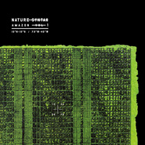

自然的法则
============================

|  |  |
| :--: | :-- |
| [ 自然的法则](https://emumo.xiami.com/album/2102662415) | **艺人**: [鲸鱼马戏团](../index.md) **语种**: 其他 **唱片公司**: 独立发行 **发行时间**: 2016年12月12日 **专辑类别**: EP, 单曲 **专辑风格**: 轻音乐 Easy Listening, 管弦乐 Orchestral **播放数**: 60937 **收藏数**: 2334 **评论数**: 49  |

## 简介

  
在亚马逊雨林的种种自然法则中，有一个便是声音的法则。深入雨林仔细聆听，就会发现每一种声音，都有自己的频率区间。它们有序排布、互不干扰：虫鸣在极高的高频，紧接着是鸟类发出的中高频，然后是被哺乳动物占据的中频，最后是环境与气候等背景声——它们通常处在低频区。  
  
这个法则的核心地带，是1k-4kHZ的中高频“寂静区”。没有任何一种生物或环境发出的声音，会长时间保持在这个区域。雨林中的声音交流，正是集中在这个频段：这里是绝大部分动物留给警示、求偶、社交等重要声音信号的专属区，堪称雨林声音法则中的“黄金沟通区”。  
  
然而，当我们整个工作团队身处其中，我们说话、歌唱、喊叫，只要稍稍有一点距离，便很难听到彼此。我们的声音在这里传不出去，人类的声音竟不属于动物们的黄金沟通区，自然的法则并非包含万物——我们根本不在这个法则之中。  
  
自从人类的口中说出第一个词语，我们的嗓音就与自然声音的系统渐行渐远。我试图在自然声音的系统中，寻找人类的声音可以与之共处的区域，但并未找到。是人类诞生于自然的突变，还是自然受制于人类的进化？是自然规定了我们，还是我们重新塑造了自己？是境由心生，还是万法归一？  
  
自然的法则，包含着人的部分，同时也并未包含。自然不是人的对立面，却也不是我们的母体。这其中的关系，发人深思，更感人至深。  
  
  

## 曲目

## 评论

|  |  |  |  |
| :-- | :-- | :-- | :-- |
|  [虾米用户](https://emumo.xiami.com/u/322751995) EXO사랑하자 2019-03-09 11:49 赞(0) 踩(0) | 
这首歌在哪里能听到啊！求指路！
 |
|  [虾米用户](https://emumo.xiami.com/u/238300984) 世界很大 时间太少 2018-02-07 00:11 赞(0) 踩(0) | 
：
 |
|  [虾米用户](https://emumo.xiami.com/u/50383241)   2017-03-23 09:39 赞(4) 踩(0) | 
实专有惊喜！！！
 |
| ⇒ |  [虾米用户](https://emumo.xiami.com/u/36908387)  2017-11-28 04:28 赞(0) 踩(0) | 
有什么惊喜！
 |
| ⇒ |  [虾米用户](https://emumo.xiami.com/u/238530197)  2018-11-13 22:32 赞(0) 踩(0) | 
哪里能买
 |
|  [虾米用户](https://emumo.xiami.com/u/266156524)  2017-03-03 18:24 赞(0) 踩(0) | 
支持鲸鱼
 |
|  [虾米用户](https://emumo.xiami.com/u/71478) 这里住着未在任何世界露脸... 2017-01-31 07:49 赞(2) 踩(0) | 
这张专辑的其余曲目都没有在网上发布，已购买实体专辑的表示其余曲目3D效果十分惊喜 
 |
| ⇒ |  [虾米用户](https://emumo.xiami.com/u/855191)  2017-01-31 09:55 赞(0) 踩(0) | 
这首曲子也不在专辑里~
 |
| ⇒ |  [虾米用户](https://emumo.xiami.com/u/71478) 这里住着未在任何世界露脸... 2017-02-04 02:49 赞(0) 踩(0) | 
<q><b>鲸鱼马戏团说：</b></q>
 |
| ⇒ |  [虾米用户](https://emumo.xiami.com/u/238530197)  2018-11-13 22:32 赞(0) 踩(0) | 
哪里能买？
 |
|  [虾米用户](https://emumo.xiami.com/u/123104844) 不能舍弃音乐 2017-01-20 14:04 赞(0) 踩(0) | 

 |
|  [虾米用户](https://emumo.xiami.com/u/244482657)  2017-01-14 21:35 赞(0) 踩(0) | 
人与自然之间微妙的联系 感知与永恒世界的触碰
 |
|  [虾米用户](https://emumo.xiami.com/u/7249200) 用音乐点缀生命怒放人生 2017-01-11 22:41 赞(0) 踩(0) | 
期待
 |
|  [虾米用户](https://emumo.xiami.com/u/348580) 真的要糊了 2017-01-08 13:28 赞(0) 踩(0) | 
感觉自己在旋转，抱膝旋转，不停的太空式旋转、翻腾；紧接着全身开始微麻，像刚吃了一碗老麻抄手；后面有种森林里的动物欢腾的画面，但要超慢速的画~面~
 |
|  [虾米用户](https://emumo.xiami.com/u/7465383) 暂无签名~ 2016-12-15 09:48 赞(2) 踩(0) | 
5:20那儿小提琴突然亮起来那一下鸡皮疙瘩都出来了，太苏了！听完有种生命在有序地脉动的感觉，很感动~~
 |
|  [虾米用户](https://emumo.xiami.com/u/41290765) 我要回去冥王星了，一起走... 2016-12-14 13:52 赞(0) 踩(0) | 
沉寂的巨兽
 |
|  [虾米用户](https://emumo.xiami.com/u/2458107) 很奇怪吗？一个从来没写过... 2016-12-14 13:10 赞(1) 踩(0) | 
希望早日出一张实体精选集，鲸鱼马戏团值得收藏。
 |
|  [虾米用户](https://emumo.xiami.com/u/130521046)  2016-12-13 08:58 赞(0) 踩(0) | 
好专辑就要支持
 |
|  [虾米用户](https://emumo.xiami.com/u/10042646)  2016-12-12 22:42 赞(10) 踩(0) | 
带着耳机以为隔壁在用电钻开墙，我说室友咋都就没反应。。。
 |
| ⇒ |  [虾米用户](https://emumo.xiami.com/u/41017493)   2016-12-12 23:07 赞(0) 踩(0) | 
有趣 有趣！
 |
| ⇒ |  [虾米用户](https://emumo.xiami.com/u/12251076)   2016-12-26 15:58 赞(0) 踩(0) | 
哈哈哈哈我是用音响听而隔壁真的在用电钻开墙
 |
| ⇒ |  [虾米用户](https://emumo.xiami.com/u/189701064) 用一个月来告别，用一生去... 2017-06-07 21:17 赞(0) 踩(0) | 
突然跳戏 忍不住想笑
 |
| ⇒ |  [虾米用户](https://emumo.xiami.com/u/206758094) 滚回去听歌 2017-12-14 17:45 赞(0) 踩(0) | 
<q><b>PHILLIP-SONG说：</b></q>
 |
|  [虾米用户](https://emumo.xiami.com/u/135325378)  2016-12-12 22:10 赞(0) 踩(0) | 
好听
 |
|  [虾米用户](https://emumo.xiami.com/u/201391232) 最快的方法是先抱抱 2016-12-12 21:10 赞(1) 踩(0) | 
+
 |
|  [虾米用户](https://emumo.xiami.com/u/1549842)  2016-12-12 20:49 赞(3) 踩(0) | 
感觉像是来自《interstellar》（星际穿越）的配乐，非常有画面感。
 |
|  [虾米用户](https://emumo.xiami.com/u/29045154) 新的一年 继续爱着顾医生 2016-12-12 20:00 赞(0) 踩(0) | 
终于等到 超级喜欢啊
 |
|  [虾米用户](https://emumo.xiami.com/u/35167460) La vie elle ... 2016-12-12 19:20 赞(0) 踩(0) | 
很棒啊！
 |
|  [虾米用户](https://emumo.xiami.com/u/508481) 不要认为自己没有用 2016-12-12 18:54 赞(1) 踩(0) | 
天啊，闭上眼睛，像在看电影
 |
|  [虾米用户](https://emumo.xiami.com/u/3815293) baby Jesus s... 2016-12-12 18:03 赞(0) 踩(0) | 
来听
 |
|  [虾米用户](https://emumo.xiami.com/u/124999710) 电子音乐人 2016-12-12 17:53 赞(0) 踩(0) | 
嘿嘿嘿
 |
|  [虾米用户](https://emumo.xiami.com/u/12930904) 月亮与六便士 2016-12-12 17:36 赞(0) 踩(0) | 
阅
 |
|  [虾米用户](https://emumo.xiami.com/u/8395195) 何必呢 2016-12-12 17:08 赞(0) 踩(0) | 
哈，从亚马逊回来啦
 |
|  [虾米用户](https://emumo.xiami.com/u/45445943) 记忆给他的礼物..... 2016-12-12 16:16 赞(0) 踩(0) | 
666666666666666666666666虾米最早接触的就是大鲸鱼！
 |
|  [虾米用户](https://emumo.xiami.com/u/560540) 勇敢的好姑娘永垂不朽 2016-12-12 15:58 赞(0) 踩(0) | 
膜拜
 |
|  [虾米用户](https://emumo.xiami.com/u/37072536) Music makes ... 2016-12-12 15:57 赞(2) 踩(0) | 
我会说 我听 鲸鱼马戏团 都能听哭
 |
| ⇒ |  [虾米用户](https://emumo.xiami.com/u/21213058)   2017-06-14 10:06 赞(0) 踩(0) | 
我也是我也是啊
 |
|  [虾米用户](https://emumo.xiami.com/u/118618978)  2016-12-12 15:07 赞(0) 踩(0) | 
看好这条大大大鲸鱼，哈哈哈
 |
|  [虾米用户](https://emumo.xiami.com/u/54871311)  2016-12-12 13:58 赞(0) 踩(0) | 
听听 
 |
|  [虾米用户](https://emumo.xiami.com/u/6426098)   2016-12-12 13:10 赞(0) 踩(0) | 
前十嘻嘻嘻
 |
|  [虾米用户](https://emumo.xiami.com/u/71478) 这里住着未在任何世界露脸... 2016-12-12 12:57 赞(0) 踩(0) | 
鲸鱼大大留言前十
 |
|  [虾米用户](https://emumo.xiami.com/u/16306277)  2016-12-12 12:37 赞(2) 踩(0) | 
前一分钟我还以为自己点开了煲机音乐
 |
|  [虾米用户](https://emumo.xiami.com/u/2933707) Live my pace 2016-12-12 12:23 赞(1) 踩(0) | 
我擦 前一分钟我以为电脑要爆炸了
 |
|  [虾米用户](https://emumo.xiami.com/u/3512370) 关于美好的一切 2016-12-12 12:08 赞(0) 踩(0) | 
有点长
 |
|  [虾米用户](https://emumo.xiami.com/u/12251076)   2016-12-12 10:50 赞(1) 踩(0) | 
18号票都买好啦！
 |
|  [虾米用户](https://emumo.xiami.com/u/8244559)  2016-12-12 10:22 赞(0) 踩(0) | 
******
 |
| ⇒ |  [虾米用户](https://emumo.xiami.com/u/9327772)   2016-12-12 11:01 赞(0) 踩(0) | 
哪里都有你哎
 |
| ⇒ |  [虾米用户](https://emumo.xiami.com/u/1032029) 我还没想好要写什么... 2016-12-12 11:04 赞(0) 踩(0) | 
<q><b>贞子琪琪琪说：</b></q>
 |
|  [虾米用户](https://emumo.xiami.com/u/1156476) 四体不勤，五谷不分 2016-12-12 10:11 赞(0) 踩(0) | 
沙发~~~~~~
 |
