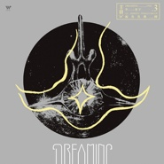

鲸鱼马戏团 Vol.3 梦 DreamingWhale Circus Vol. 3 Dreaming
============================

|  |  |
| :--: | :-- |
| [ 鲸鱼马戏团 Vol.3 梦 DreamingWhale Circus Vol. 3 Dreaming](https://emumo.xiami.com/album/2102738073) | **艺人**: [鲸鱼马戏团](../index.md) **语种**: 纯音乐 **唱片公司**: 风潮音乐 **发行时间**: 2017年04月26日 **专辑类别**: 录音室专辑 **专辑风格**: 轻音乐 Easy Listening **播放数**: 3425327 **收藏数**: 7777 **评论数**: 284  |

## 简介

鲸鱼马戏团 Vol. 3  
Whale Circus Vol. 3  
梦 Dreaming   
李星宇 Li Xing-yu  
  
我一直对梦有着某种执着和迷恋，儿时的夜晚，是我幻想的起点。我仍清晰记得那个透过薄薄纱门可以看到星空与萤火虫的阳台，记得那些漫长夏日里无休无止重复的虫奏。我期待每一个阖眼入梦的时刻，因为似乎我可以在那时通往另一个世界——我的第二生命。  
  
于是我在这一个又一个梦的轮回中成长，从孩童渐渐步入而立。但当我发现人生终究是没有边界的迷墙的时候，我知道，其实每个人的世界，便是如一场永不落幕的电影般真实的梦。  
  
天真随性的梦，充满理想和期待的梦，伤心的梦，回忆的梦，甚至，毫无逻辑与预兆的梦。哪些真实与否，早已不重要。我们可以独自做梦，可以将梦传递给另一个人，或者和某人，和某些人一起，做同一场梦。  
  
－李星宇  
  
1. 梦之四 Dream 4  
2. 未来之约 You Will Get Better  
3. 晚安，布丁 Good Night Buddy  
4. 木马国 Wooden Horse Kingdom  
5. 梦之一 Dream 1  
6. 7 P.M.   
7. 波兰火车 Polish Train  
8. 废墟 Nepal  
9. 梦之五 Dream 5  
10. 吉普赛铃铛 Gypsy Bells  
11. 圣马丁广场Plaza San Martin walk  
12. 爱丽丝 Alice  
13. 梦之二 Dream 2  
14. 漂浮记忆 Floating Memory  
15. 背影 Father’s Story  
16. 鲸鱼 The Whales  
17. 梦之三 Dream 3  
  
<strong>歌曲介绍：</strong>  
2. 未来之约 You Will Get Better  
治愈我自己的曲子，写在2016年新年  
  
3. 晚安，布丁 Good Night Buddy  
布丁是我妈妈的小狗，在外公老年痴呆严重的日子帮助她走出那段阴霾，它在去年过世了，我想象它变成了天上的某颗星星，继续陪伴着家人。  
  
4. 木马国 Wooden Horse Kingdom  
梦里有一个国家，在王子当上国王的时候，他必须烧死心爱的妻子，然后把她们雕刻成木马。木马被锁在深深的皇宫里，只有每年七夕的那天才能被放进国王寝室，与其相聚一个短暂的夜晚。  
  
这样的习俗沿袭了数百年，直到有一天，一个个性贞烈的女孩拒绝自己被雕刻成木马。可她又深爱着国王，于是她把自己的心挖出来烧掉，让国王雕刻成黑色的唱片。那是一首凄美空灵的旋律，但又如此浪漫充满爱意。  
  
5. 梦之一 Dream 1  
梦见去一座山，那里之前刚刚结束一场战役，路上遇到一队人马带着很多野猪。我爬到山顶后发现一处宗教遗迹，有铃铛和钟在风中叮叮当当的响。  
月光下有一队猴子，排成一列从遗迹的侧边经过。  
  
6. 7 P.M.   
老旧的木制公寓，墙壁因年久失修而有了裂纹，时常发出咯吱咯吱的响声。大堂很宽阔，是一个巨大的天井。抬头望去，向上盘旋着的楼梯似乎可以通向天堂。我便住在这里，在离开D市后。这所公寓多是老年人和靠救济生活的穷人，每天从各种房间里传出的声音，不是死讯就是那些伤心的歌谣。我也不清楚自己为什么会在此落脚，也许是一种缘分，或是所谓的命中注定。我只记得在这里遇见了穿着酒红色洋装的她，然后便从此搬进了这座旧公寓。搬进这里后，我试图寻找各种见面的机会，在大堂读书，给邻居送礼物，睡前大声弹琴唱歌…… 但却一直没有再遇见她。住户们说从未见过这个女孩，只是每天晚上都会从墙壁传来一个女子微弱的歌声。  
  
某一天晚上，我和朋友吃完饭独自回到公寓。外面正下着小雨，被淋湿的我感觉有点冷，于是留在大堂准备在壁炉边把衣服烤干。大堂很安静，没有一个人。我四下张望，突然在天井顶层的逃生梯上看见了她。一样是那件酒红色的洋装，她背对着我，独自望着远方。我看了看表，7PM。原来她这个时候才出现，我心想。就在我准备上前搭讪的时候，她突然爬出救生梯，兀自跳了下去。可，没有坠落的声音，她就这么又消失了，只留下周身淡淡的落雨声。第二天，我再次在7点钟来到大堂。她还在那里，酒红色洋装，清丽脱俗但却憔悴的面容。似乎在哼着歌，但无法听清。“是个可怜的人啊……”不知什么时候管理员大叔走到我身旁。“她一直在等她爱的那个人，他们约好在晚上7点见面，可他却再也没有回来。她不甘心，于是每天留在这里，永远重复着她的最后一幕画面。”  
  
Someone’s crying   
someone dead   
someone's sleeping  
someone’s laughing   
someone sink  
someone’s leaving  
  
everyday at 7  
she’s there waiting  
everyday at 7  
she’s singing  
  
just leave me here to die  
please give me your soul  
  
7. 波兰火车 Polish Train  
一觉醒来，火车已经路过匈牙利北上进入了波兰。这是一个充满忧伤和浪漫的地方，从她的过去看来。火车最终停在距离华沙市区不远的小站，我提着似乎一直跟随我的那只棕色皮质的手提箱走下站台。  
  
古老的车站，看不出战火的痕迹，青灰色的碎砖石小路提示着周身这些建筑的意义。在欧洲的小城，车站总是建在中心，像是他们的符号，因为我很少能叫出这些小城的名字，倒是能清楚的分辨那些绿色的，红色的或是蓝色的站台。每次看到，似乎像是在海上漂流的水手，那种望见港湾的期待和偶尔突然出现的乡愁。  
  
“希望可以遇见黑色眼睛的姑娘吧”，我推开一间似乎是旅店的建筑的房门。里面没有开灯，黑漆漆的一片，但可以感觉到无数轻微的气息，时而紧促，时而深沉，随着某一种韵律在海面上摇摆——那是一段幽美的钢琴。在乐曲完结的短暂安静后，灯亮了，身旁爆发出热烈的掌声，欢呼和轻轻的啜泣声。一个瘦弱但身材高挑的男人向我走来。“你好，我是弗里德里克•肖邦＂他微笑着说。  
  
8. 废墟 Nepal  
受斯里兰卡的见华法师的邀请，为尼泊尔地震募捐而作  
  
10. 吉普赛铃铛 Gypsy Bells  
由朋友在琴房的练习展开的一个钢琴小品。  
  
11. 圣马丁广场Plaza San Martin walk  
好友知道我热爱声音，于是传来布宜诺斯艾利斯的圣马丁广场录音，我听着声音创作了这个歌曲。  
  
12. 爱丽丝 Alice  
〜震动〜  
2分30秒后停止。我好像已经习惯了这种生活中的经常会发生的事情，我甚至忘记了它是什么时候开始的。从我出生的时候？还是在某个普通的清晨？似乎它从不曾存在过，又或是，它本就该如此，如同日升日落，如同我出门要先穿上衣服。  
  
〜震动〜  
头顶的吊灯晃了一下。艾丽斯喜欢早起，每天早晨，她都会骑上她心爱的自行车，经过一片树林围绕的盘山路，去给爷爷送牛奶。爷爷总是赖床，但只要一听到艾丽斯的车铃声，他便能腾得一下从床上跳起，用最快的速度洗漱完毕，站在门口微笑地迎接她。他们会把牛奶倒入已经烧成黑色的小钢锅中，然后摆在点燃的牛粪饼上熬煮。一起看着气泡在乳白色的表面涌出，让热气打湿面颊。这是爷爷最开心的时候，他一定要把他最能拿出手的牛皮讲给艾丽斯。16岁的她早已不是那个无知少女了，不过她依然每天耐心听着那些故事，笑着，一起看着那些气泡升起，看它们咕嘟咕嘟地释放出热气。就像那些故事，永远不知道它们会在何时处冒起。2分30秒。奶熟了。  
  
〜震动〜  
2分30秒后停止。  
  
13. 梦之二 Dream 2  
梦见我的工作室在扎克伯格的隔壁，我最近在研究残障人士的声音感知。突然想到可不可以用节奏来创造一种语言，给听障的人来传递信号，就像电报或者摩斯密码那样。  
  
14. 漂浮记忆 Floating Memory  
声音是万物降临的预兆，  
你留下线索。  
  
遍寻城市，一座空的回忆。  
脚印与鹅卵石。  
  
世上最美的溺水者，  
被雕琢了的容貌。  
  
日落时，  
漫洒尘埃。  
  
15. 背影 Father’s Story  
我并不真正了解自己父亲，有时候就像看着他的背影那样，可能父子之间总会有一些阻拦，但又无比的相似。  
  
16. 鲸鱼 The Whales  
数十人呼吸构成的海浪声，每个人都是这海里独一无二的鲸鱼。 

## 曲目

- [波兰火车 (Polish Train)](./2102738073/bCmvUKj44f25.md)

## 评论

|  |  |  |  |
| :-- | :-- | :-- | :-- |
|  [虾米用户](https://emumo.xiami.com/u/410208648) 蛋糕蛋糕 2020-07-29 22:56 赞(0) 踩(0) | 
您的专辑与贝拉&amp;middot;塔尔的一部电影同名
 |
|  [虾米用户](https://emumo.xiami.com/u/40708198) 我还没想好要写什么... 2020-07-22 14:55 赞(0) 踩(0) | 
我也很喜欢工作的时候听，谢谢你。
 |
|  [虾米用户](https://emumo.xiami.com/u/9313636)   2020-07-21 19:30 赞(0) 踩(0) | 
谢谢你
 |
|  [虾米用户](https://emumo.xiami.com/u/12128984) 我讨厌一切不押韵的歌，感... 2020-07-21 17:08 赞(0) 踩(0) | 
感觉这个女孩易燃易炸哈哈
 |
|  [虾米用户](https://emumo.xiami.com/u/10816542) zm 2020-07-03 08:35 赞(2) 踩(0) | 
鲸鱼、52赫兹，一种孤独，一种自由，一种解放；马戏团，中东欧城市感，夜晚清冷却又处处灯光闪闪。此专音乐里我们能听到这些特质。音乐很有城市感，确切说是夜晚行人稀冷的城市感，也许白天属于别人的世界，而只有十一点以后才是音乐人的世界，他们从阁楼的幽暗灯光里越出，化为一天鲸鱼，傲游在城市街道上空，发出白天的人类听不到声音。这是一张不能专注的专辑，需要你漫无目的的坐在鲸鱼背上让它带你去看看不一样的城市，这里悲伤不再是悲伤，喜悦也不再是喜悦。
 |
|  [虾米用户](https://emumo.xiami.com/u/443130102)  2020-06-09 16:30 赞(0) 踩(0) | 
很喜欢，特别是未来之约～太好听了吧！
 |
|  [虾米用户](https://emumo.xiami.com/u/16572603) 只有爱和自由 把我们联结... 2020-05-11 19:46 赞(0) 踩(0) | 
为什么两个人可以睡在同一张床上，却不能做同一个梦呢
 |
|  [虾米用户](https://emumo.xiami.com/u/431890066)  2020-04-03 03:09 赞(0) 踩(0) | 
好喜欢 好心安
 |
|  [虾米用户](https://emumo.xiami.com/u/427217471)  2020-03-14 22:24 赞(0) 踩(0) | 
真的很好听
 |
|  [虾米用户](https://emumo.xiami.com/u/337185561) 离别倒计时。无妨。 2020-03-12 15:07 赞(0) 踩(0) | 
第一次买数字专辑。你真的值得&amp;hearts;
 |
|  [虾米用户](https://emumo.xiami.com/u/441084557) Dreamer 2020-03-05 01:06 赞(0) 踩(0) | 
我也是一个执着于做梦的人，我喜欢记录我那些千奇百怪，情感复杂的梦境，每晚听鲸鱼马戏团的时候总能想象出一些模糊画面，然后听着音乐很快入睡
 |
|  [虾米用户](https://emumo.xiami.com/u/400715332) 留白 2020-02-07 22:41 赞(2) 踩(0) | 
·
 |
|  [虾米用户](https://emumo.xiami.com/u/432642686) _(:з」∠)_ 2019-11-24 23:05 赞(1) 踩(0) | 
我做了一个梦
 |
|  [虾米用户](https://emumo.xiami.com/u/187491951)   2019-11-17 00:06 赞(1) 踩(0) | 
特别想问一下李星宇:鲸鱼马戏团这个名字到底有什么含义呢？我想了很久 也特别好奇
 |
|  [虾米用户](https://emumo.xiami.com/u/312335301) 修合無人見，存心有天知。 2019-11-15 22:40 赞(1) 踩(0) | 
这张专辑的概念真的是当下中国内地乐坛里少见的完整，每一首曲子都与主题微妙呼应，多一分少一分都不好，唯有现在的平衡最奇妙。而且曲子本身真的太美了，很少有专辑让我想把每一首都收藏下载下来。我好爱，想买实体专！最好能有黑胶！
 |
|  [虾米用户](https://emumo.xiami.com/u/431785905) 我最喜欢笑起来甜甜的人 2019-11-09 23:16 赞(0) 踩(0) | 
我最喜欢
 |
|  [虾米用户](https://emumo.xiami.com/u/58782616) 人艰不拆 2019-11-09 15:05 赞(12) 踩(0) | 
爱上两个人 爱上一首歌
 |
|  [虾米用户](https://emumo.xiami.com/u/8688260) 我还没想好要写什么... 2019-11-08 23:46 赞(0) 踩(0) | 
突然哭出来，好多坏情绪没有出口谢谢。
 |
|  [虾米用户](https://emumo.xiami.com/u/431792985)  2019-11-07 19:50 赞(0) 踩(0) | 
我好喜欢工作的时候听啊！神奇减压
 |
|  [虾米用户](https://emumo.xiami.com/u/848683)  2019-10-31 11:47 赞(0) 踩(0) | 
还是比较喜欢《鲸鱼马戏团》那张同名专辑。其他专辑感觉背景音太多太杂，而且有种概念大于音乐本身的感觉，音乐的成分太少，也不大适合连续静听。拉低总体水平，不好。
 |
|  [虾米用户](https://emumo.xiami.com/u/422825486)  2019-10-12 15:51 赞(0) 踩(0) | 
最棒的专辑
 |
|  [虾米用户](https://emumo.xiami.com/u/276944698) 不要自我设限..... 2019-10-09 23:58 赞(1) 踩(0) | 

 |
|  [虾米用户](https://emumo.xiami.com/u/335884225)  2019-09-18 14:01 赞(0) 踩(0) | 
我好像在其他的号买过……啊随便
 |
|  [虾米用户](https://emumo.xiami.com/u/298154317) 至少释怀吧 在风里 2019-07-30 12:07 赞(0) 踩(0) | 
李星宇是一个好温柔的小朋友谢谢李星宇小朋友
 |
|  [虾米用户](https://emumo.xiami.com/u/297574005) 不疯魔不成活。 2019-07-29 00:52 赞(0) 踩(0) | 
专辑的音乐都听的很舒服。很喜欢。
 |
|  [虾米用户](https://emumo.xiami.com/u/221807949) 我还没想好要写什么... 2019-06-27 05:44 赞(1) 踩(0) | 
这张专永远是最爱
 |
|  [虾米用户](https://emumo.xiami.com/u/5976322)  2019-06-25 18:14 赞(0) 踩(0) | 
非常治愈的专辑！之前偶然的机会听了别人推荐的老友，当时就非常喜欢。看到有新的专辑立刻购买支持。社畜下班走在阵雨过后城市的街道，插上耳机耳边只有舒缓的旋律，车水马龙的喧嚣被隔离，内心的躁动被抚平，一切都很好！一切都会更好！
 |
|  [虾米用户](https://emumo.xiami.com/u/50366467) 不言不语都是好风景 2019-06-19 08:59 赞(0) 踩(0) | 
这张专辑是我听的最多，最喜欢的。心情不好时，内心慌乱时，做方案找灵感时，每一个音符都与我的内在频率一致。它真的就像梦。我也有诸多的梦，时常分不清现实与梦境。谁说活着不是一场梦。醒着不是在另一个梦里呢。
 |
|  [虾米用户](https://emumo.xiami.com/u/168656086) 不说再见。 2019-05-10 23:23 赞(1) 踩(0) | 
听这个专辑也快一年多了吧，会在做事情的时候拎出来听听，有时候偶尔想起某个旋律也会翻来覆去的听这个专辑，有时心情不好也会听几遍这个专辑，我是真的很喜欢，并且，能遇到李星宇这样的制作者，是我的三生有幸。这个专辑会成为我的私藏，从此只放给我爱的人听。
 |
|  [虾米用户](https://emumo.xiami.com/u/157621436) 我还没想好要写什么... 2019-04-28 01:21 赞(0) 踩(0) | 
好听，
 |
|  [虾米用户](https://emumo.xiami.com/u/43743996)   2019-04-12 01:01 赞(0) 踩(0) | 
多久出4啊  
 |
| ⇒ |  [虾米用户](https://emumo.xiami.com/u/410866210) 鲸鱼马戏团正义！ 2019-07-18 22:25 赞(0) 踩(0) | 
现在在预售啦！！
 |
|  [虾米用户](https://emumo.xiami.com/u/415041069)  2019-03-21 19:36 赞(0) 踩(0) | 
喜欢！
 |
|  [虾米用户](https://emumo.xiami.com/u/277919837) 数学好难啊 2019-03-18 02:08 赞(1) 踩(0) | 
想象力惊人，我爱这梦，这比我做的噩梦要好太多。。。
 |
|  [虾米用户](https://emumo.xiami.com/u/71130498) 平静无奇 淡 2019-03-07 16:06 赞(0) 踩(0) | 
很喜欢的专辑
 |
|  [虾米用户](https://emumo.xiami.com/u/410016458)  2019-03-05 20:24 赞(0) 踩(0) | 
很好听
 |
|  [虾米用户](https://emumo.xiami.com/u/71478) 这里住着未在任何世界露脸... 2019-02-17 04:34 赞(0) 踩(0) | 
听了vol.2快4年，过来vol.3换下睡眠曲目吧
 |
|  [虾米用户](https://emumo.xiami.com/u/364323395)  2019-02-11 22:25 赞(0) 踩(0) | 
合适
 |
|  [虾米用户](https://emumo.xiami.com/u/306756496) ? 2019-02-02 16:01 赞(0) 踩(0) | 
第一次 买了一张数字专辑
 |
|  [虾米用户](https://emumo.xiami.com/u/221807949) 我还没想好要写什么... 2019-01-23 22:40 赞(2) 踩(0) | 
天知道我有多喜欢这张专 买了实体专辑 真的太爱了 星宇啊希望能等到你巡演 希望有这张专的歌 祈祷
 |
|  [虾米用户](https://emumo.xiami.com/u/2472729) 嘘 2019-01-16 14:34 赞(0) 踩(0) | 
有点耳鸣 他说听舒缓的音乐试试 毫不犹豫想到老星 最爱你了 不管2019还是2091
 |
|  [虾米用户](https://emumo.xiami.com/u/35961615) Rage,rage ag... 2018-11-14 03:15 赞(0) 踩(0) | 
感官的浪漫太难，因为生活里苟且太多，诗和远方太少。
 |
|  [虾米用户](https://emumo.xiami.com/u/478527) 好想跟衣服在洗衣机里滚 2018-10-12 12:22 赞(2) 踩(0) | 
我们看世界，往往看别人的太多，所以我们才会看不见自己。
 |
|  [虾米用户](https://emumo.xiami.com/u/40975819) 嗯，完犊子了。 2018-07-03 01:56 赞(1) 踩(0) | 
我永远爱你
 |
|  [虾米用户](https://emumo.xiami.com/u/291002036) 蓝•鲸 2018-03-18 07:59 赞(2) 踩(0) | 
听了现场，不会遗憾
 |
|  [虾米用户](https://emumo.xiami.com/u/43714694) WeChat：96529... 2018-03-14 19:35 赞(0) 踩(0) | 
吱/音
 |
|  [虾米用户](https://emumo.xiami.com/u/238300984) 世界很大 时间太少 2018-02-07 00:10 赞(0) 踩(0) | 
：
 |
|  [虾米用户](https://emumo.xiami.com/u/244162410) . 2018-01-22 21:30 赞(1) 踩(0) | 
我要回海里了
 |
|  [虾米用户](https://emumo.xiami.com/u/114458052) 吞下无意义想法 2018-01-09 01:36 赞(0) 踩(0) | 
又游远了
 |
|  [虾米用户](https://emumo.xiami.com/u/37555293)   2018-01-02 23:09 赞(1) 踩(0) | 
我的年度专辑
 |
| ⇒ |  [虾米用户](https://emumo.xiami.com/u/8939226) 我还没想好要写什么... 2018-03-14 19:04 赞(0) 踩(0) | 
+1
 |
|  [虾米用户](https://emumo.xiami.com/u/33439074) 听的比较杂:) 2017-12-08 23:49 赞(0) 踩(0) | 
明天成都场见，有一起约的小伙伴吗
 |
|  [虾米用户](https://emumo.xiami.com/u/502127) 我还没想好要写什么... 2017-11-24 00:29 赞(0) 踩(0) | 
做了件傻事 
 |
|  [虾米用户](https://emumo.xiami.com/u/52062837) 喜欢核，djent，新派... 2017-11-14 08:57 赞(0) 踩(0) | 
国内难得的音乐人
 |
|  [虾米用户](https://emumo.xiami.com/u/13159213) 罐子罐子 2017-10-28 00:01 赞(5) 踩(0) | 
这张太棒了。看到波兰火车，确认了下微信的历史推送，果然没记错啊~  十分感慨。希望越来越好~
 |
|  [虾米用户](https://emumo.xiami.com/u/247358999) 在荒野上跳舞 2017-10-07 16:28 赞(0) 踩(0) | 

 |
|  [虾米用户](https://emumo.xiami.com/u/259118269)  2017-09-16 12:23 赞(1) 踩(0) | 
躺在床上，听着灵感，自言自语，。
 |
|  [虾米用户](https://emumo.xiami.com/u/96296322)  2017-08-28 14:19 赞(0) 踩(0) | 
.
 |
|  [虾米用户](https://emumo.xiami.com/u/39563509)  2017-08-25 13:36 赞(0) 踩(0) | 
鲸鱼
 |
|  [虾米用户](https://emumo.xiami.com/u/106742828)  2017-07-05 00:37 赞(2) 踩(0) | 
一直以为付费版权歌曲是不能免费收听的 
 |
| ⇒ |  [虾米用户](https://emumo.xiami.com/u/777675) 事物发生研究员 2017-11-03 16:24 赞(0) 踩(0) | 
可以免费收听，下载就需要付费了哈。
 |
|  [虾米用户](https://emumo.xiami.com/u/285223312)  2017-06-25 20:34 赞(1) 踩(0) | 
单那首《鲸鱼》就值五星啦！
 |
|  [虾米用户](https://emumo.xiami.com/u/272654206)  2017-06-24 17:54 赞(0) 踩(0) | 
根据经验，果断时间会免费的
 |
|  [虾米用户](https://emumo.xiami.com/u/6799887)   2017-06-16 19:20 赞(0) 踩(0) | 
听
 |
|  [虾米用户](https://emumo.xiami.com/u/34463308) 故人江海别，几度隔山川 2017-06-09 15:26 赞(4) 踩(0) | 
实体专辑有第十八首&amp;ldquo;Bonus Track &amp;rdquo;,别问我怎么知道，因为我有实体专辑
 |
| ⇒ |  [虾米用户](https://emumo.xiami.com/u/777675) 事物发生研究员 2017-06-09 15:27 赞(0) 踩(0) | 
哈哈哈 厉害了
 |
| ⇒ |  [虾米用户](https://emumo.xiami.com/u/34463308) 故人江海别，几度隔山川 2017-06-09 15:46 赞(0) 踩(0) | 
<q><b>LX_兔子小姐说：</b></q>
 |
| ⇒ |  [虾米用户](https://emumo.xiami.com/u/71478) 这里住着未在任何世界露脸... 2017-10-04 06:09 赞(0) 踩(0) | 
买了都没打开过现在才知道又有隐藏曲目
 |
| ⇒ |  [虾米用户](https://emumo.xiami.com/u/34463308) 故人江海别，几度隔山川 2017-10-04 10:09 赞(0) 踩(0) | 
<q><b>dumplings说：</b></q>
 |
| ⇒ |  [虾米用户](https://emumo.xiami.com/u/36908387)  2017-11-28 05:42 赞(0) 踩(0) | 
<q><b>dumplings说：</b></q>
 |
|  [虾米用户](https://emumo.xiami.com/u/92686490)  2017-06-08 01:39 赞(13) 踩(0) | 
最怕詩人有邏輯 最服理工男有詩意 剛好兩個都佔了
 |
|  [虾米用户](https://emumo.xiami.com/u/302117402) 喜欢一切时间越久越有质感... 2017-06-07 07:24 赞(0) 踩(0) | 
从昨晚到现在 一直在循环这张专辑平静 满足 今天一定会正常发挥 
 |
|  [虾米用户](https://emumo.xiami.com/u/2655721)  2017-06-03 16:11 赞(0) 踩(0) | 
为啥我都买了，还是下载不了。
 |
|  [虾米用户](https://emumo.xiami.com/u/73229094) 哲学小包子，喵喵 2017-05-28 19:52 赞(0) 踩(0) | 
喜欢
 |
|  [虾米用户](https://emumo.xiami.com/u/50733161) 我还没想好要写什么... 2017-05-28 15:30 赞(0) 踩(0) | 
有没有买了数字专辑的旁友 。。。你们网页版能下载嘛
 |
| ⇒ |  [虾米用户](https://emumo.xiami.com/u/92686490)  2017-06-08 01:37 赞(0) 踩(0) | 
我也發現網頁版下載不了啊
 |
| ⇒ |  [虾米用户](https://emumo.xiami.com/u/1219018) 你好，我叫谢有君。估计大... 2017-06-09 08:59 赞(0) 踩(0) | 
<q><b>ZERO.Z.A说：</b></q>
 |
| ⇒ |  [虾米用户](https://emumo.xiami.com/u/92686490)  2017-06-09 09:09 赞(0) 踩(0) | 
<q><b>谢有君说：</b></q>
 |
|  [虾米用户](https://emumo.xiami.com/u/87374098)   2017-05-22 02:47 赞(0) 踩(0) | 
鲸鱼马戏团的音乐总能为我的内心带来平静。
 |
|  [虾米用户](https://emumo.xiami.com/u/34463308) 故人江海别，几度隔山川 2017-05-21 18:57 赞(0) 踩(0) | 
买了买了，第46个支持者，不过想做第69个支持者，因为是我生日哈哈哈
 |
|  [虾米用户](https://emumo.xiami.com/u/47054992) 听听能听的不能听的爱听的... 2017-05-21 11:37 赞(2) 踩(0) | 
支持，上次买第二辑还是在上高三
 |
|  [虾米用户](https://emumo.xiami.com/u/777675) 事物发生研究员 2017-05-20 15:07 赞(2) 踩(0) | 
实体专辑乐童众筹发售中，大家关注 鲸鱼马戏团的微信订阅号及时购买哈～～限量再限量 
 |
|  [虾米用户](https://emumo.xiami.com/u/251426391) Thank you, K... 2017-05-17 22:50 赞(0) 踩(0) | 
听着这种舒服的大自然声音的音乐睡觉真的很舒服
 |
|  [虾米用户](https://emumo.xiami.com/u/5395224)  2017-05-10 17:37 赞(0) 踩(0) | 
风潮音乐
 |
|  [虾米用户](https://emumo.xiami.com/u/7216855) 来吧，伴我飞 2017-05-10 11:16 赞(0) 踩(0) | 
之前淘宝买过一张，话说我们的CD不太容易买到啊，而且... ...真的小贵（委屈脸）
 |
| ⇒ |  [虾米用户](https://emumo.xiami.com/u/777675) 事物发生研究员 2017-05-20 15:05 赞(0) 踩(0) | 
都是限量再限量的专辑，而且星爷非常要求质量品质～哈哈 Vol.3 新专辑上架了 可以去看看[带墨镜笑]
 |
|  [虾米用户](https://emumo.xiami.com/u/182448154) 离我远一点，你压到我的翅... 2017-05-07 20:16 赞(15) 踩(0) | 
真的太好听了！我特别喜欢一边听这张专辑的歌一边写作业！觉得这个世界只有我会写这道题的感觉！
 |
|  [虾米用户](https://emumo.xiami.com/u/280612908) 我还没想好要写什么... 2017-05-06 18:36 赞(1) 踩(0) | 
Love this album☺️ Makes my mind calm.
 |
|  [虾米用户](https://emumo.xiami.com/u/2718291)  2017-05-06 17:25 赞(0) 踩(0) | 
谁还没听过陈绮贞？抄都抄不好
 |
| ⇒ |  [虾米用户](https://emumo.xiami.com/u/42783618) Miss u more ... 2017-05-07 00:29 赞(0) 踩(0) | 
你在说啥
 |
|  [虾米用户](https://emumo.xiami.com/u/244545672) 音乐是一种记忆，更是一种... 2017-05-06 14:09 赞(0) 踩(0) | 
  
 |
|  [虾米用户](https://emumo.xiami.com/u/293519596)  2017-05-06 11:38 赞(0) 踩(0) | 
梦之四好少
 |
|  [虾米用户](https://emumo.xiami.com/u/39283474) 你活在哪 2017-05-06 09:29 赞(0) 踩(0) | 
梦之四，抓住了我
 |
|  [虾米用户](https://emumo.xiami.com/u/293498427)  2017-05-03 12:20 赞(0) 踩(0) | 
只能购买才能下载吗？
 |
| ⇒ |  [虾米用户](https://emumo.xiami.com/u/777675) 事物发生研究员 2017-05-03 19:30 赞(0) 踩(0) | 
是的呢~免费收听，下载的话是付费的哦~更多支持星宇的创作
 |
|  [虾米用户](https://emumo.xiami.com/u/78158310)   2017-05-02 19:01 赞(1) 踩(0) | 
好喜欢好喜欢
 |
|  [虾米用户](https://emumo.xiami.com/u/6234804) 寻找 兴趣相似者 2017-05-02 15:02 赞(1) 踩(0) | 
天呀还上架APPLE MUSIC了！
 |
| ⇒ |  [虾米用户](https://emumo.xiami.com/u/777675) 事物发生研究员 2017-05-03 19:31 赞(0) 踩(0) | 
对的呢，Apple music也可以收听鲸鱼马戏团的全碟新专辑~
 |
|  [虾米用户](https://emumo.xiami.com/u/13529947) 请大家通过【个人中心】-... 2017-05-02 13:27 赞(1) 踩(0) | 
纯真大男孩的绮梦世界&amp;mdash;&amp;mdash;这些梦，来自他的生活，来自他的行走印记，来自他的异想空间，却都是永远澄澈的李星宇。所以每次听，都有被暖到美到。这听感就像是明媚午后咖啡馆里晒着太阳，看着行人笑靥如花，自己也会被周遭所打动一样。
 |
|  [虾米用户](https://emumo.xiami.com/u/8818260) 梦里不知身是客。 2017-05-02 10:00 赞(1) 踩(0) | 
做梦啊 哪里来那么多规则可言 。
 |
|  [虾米用户](https://emumo.xiami.com/u/289004674)  2017-05-02 01:45 赞(1) 踩(0) | 
看封面是羊蝎子还以为是个金属，白兴奋了
 |
| ⇒ |  [虾米用户](https://emumo.xiami.com/u/855191)  2017-05-02 04:45 赞(0) 踩(0) | 
马科老师你怎么这么淘气
 |
|  [虾米用户](https://emumo.xiami.com/u/16306277)  2017-05-01 11:08 赞(3) 踩(0) | 
与梦的非逻辑排列相似 若是打乱整个专辑的顺序也可以听到些不一样的东西
 |
| ⇒ |  [虾米用户](https://emumo.xiami.com/u/36908387)  2017-11-28 05:47 赞(0) 踩(0) | 
随机播放就好
 |
|  [虾米用户](https://emumo.xiami.com/u/71475064) 克服，恢复。 2017-04-30 17:36 赞(1) 踩(0) | 
人声可以的 
 |
|  [虾米用户](https://emumo.xiami.com/u/287166063)  2017-04-30 16:32 赞(0) 踩(0) | 
。。。
 |
|  [虾米用户](https://emumo.xiami.com/u/7471823)  2017-04-30 16:30 赞(0) 踩(0) | 
在哪可以买到实体专辑啊？？？
 |
| ⇒ |  [虾米用户](https://emumo.xiami.com/u/777675) 事物发生研究员 2017-05-03 19:32 赞(0) 踩(0) | 
实体专辑销售在筹备中~可以关注 鲸鱼马戏团音乐人微信公众号：whale_circus。（或者添加客服alice_whalecircus进入乐迷微信群围观follow各类讯息~ ：）
 |
| ⇒ |  [虾米用户](https://emumo.xiami.com/u/270309432)  2017-05-06 06:15 赞(0) 踩(0) | 
<q><b>LX_兔子小姐说：</b></q>
 |
|  [虾米用户](https://emumo.xiami.com/u/3566813) 菩萨，祝您身体健康！34... 2017-04-29 23:53 赞(0) 踩(0) | 
前阵子有个  30一遇的，现在是一个小半年不到  年度最佳，扣帽子总让人觉得言过其实    
 |
| ⇒ |  [虾米用户](https://emumo.xiami.com/u/5612430) 假如生活欺騙了你，你仍然... 2017-04-29 23:57 赞(0) 踩(0) | 
可能那是粉絲自己的內心感受哈，對於不同的人來說會有不同的意義。但自己覺得歡喜就好 : ）
 |
| ⇒ |  [虾米用户](https://emumo.xiami.com/u/3566813) 菩萨，祝您身体健康！34... 2017-04-30 00:33 赞(0) 踩(0) | 
<q><b>秋天家的旅行家说：</b></q>
 |
| ⇒ |  [虾米用户](https://emumo.xiami.com/u/5612430) 假如生活欺騙了你，你仍然... 2017-04-30 01:10 赞(0) 踩(0) | 
<q><b>苍茫中传灯说：</b></q>
 |
| ⇒ |  [虾米用户](https://emumo.xiami.com/u/3566813) 菩萨，祝您身体健康！34... 2017-04-30 01:21 赞(0) 踩(0) | 
<q><b>秋天家的旅行家说：</b></q>
 |
|  [虾米用户](https://emumo.xiami.com/u/5612430) 假如生活欺騙了你，你仍然... 2017-04-29 23:52 赞(0) 踩(0) | 
好吧 大晚上的忽然又想來表白一番
 |
|  [虾米用户](https://emumo.xiami.com/u/44015836)  2017-04-28 22:25 赞(0) 踩(0) | 
好奇为什么四个梦不按顺序
 |
| ⇒ |  [虾米用户](https://emumo.xiami.com/u/855191)  2017-04-29 04:40 赞(0) 踩(0) | 
梦是没有逻辑的
 |
| ⇒ |  [虾米用户](https://emumo.xiami.com/u/44015836)  2017-04-29 11:35 赞(0) 踩(0) | 
<q><b>鲸鱼马戏团说：</b></q>
 |
|  [虾米用户](https://emumo.xiami.com/u/15400059) 暂无签名~ 2017-04-28 17:23 赞(0) 踩(0) | 
李星宇老师的音乐总是如此打动人心～
 |
|  [虾米用户](https://emumo.xiami.com/u/288858737) 此去经年，应是良辰好景虚... 2017-04-28 15:15 赞(0) 踩(0) | 
看到这个名字的时候不由自主的点进来，听了他的之后，就知道点对了
 |
|  [虾米用户](https://emumo.xiami.com/u/1557601) 暂无签名~ 2017-04-28 09:51 赞(2) 踩(0) | 
像是内心有个小玩偶在无忧无虑的踮着脚旋转～无数个下雨值班的夜晚，都是鲸鱼陪伴着，感谢老友～
 |
|  [虾米用户](https://emumo.xiami.com/u/166128338)   2017-04-28 09:43 赞(0) 踩(0) | 
好美  只想说好美
 |
|  [虾米用户](https://emumo.xiami.com/u/256376273) 我还没想好要写什么... 2017-04-28 08:17 赞(1) 踩(0) | 
听完以后真的感觉整个人飞起来
 |
|  [虾米用户](https://emumo.xiami.com/u/118900592) 这家伙超级聪明只留下你…... 2017-04-28 01:40 赞(1) 踩(0) | 
因为你，我更加喜欢上鲸鱼了
 |
|  [虾米用户](https://emumo.xiami.com/u/211031909) ฅ(⌯͒•̩̩̩́ ˑ̫... 2017-04-27 21:40 赞(21) 踩(0) | 
居然是前两天才出的vol.3，赶上考试月，治愈一番我是一个旅人，随着鲸鱼马戏团，去过海岛，去过森林，看过烟火，看过星光&amp;hellip;&amp;hellip;这一次，入梦
 |
|  [虾米用户](https://emumo.xiami.com/u/794813)  2017-04-27 21:13 赞(0) 踩(0) | 
good
 |
|  [虾米用户](https://emumo.xiami.com/u/221023599)  2017-04-27 20:29 赞(0) 踩(0) | 
真的特别喜欢。尤其是口白的那几首。感觉哇。真的很暖。加油加油。
 |
|  [虾米用户](https://emumo.xiami.com/u/36997313) 暂无签名~ 2017-04-27 20:25 赞(4) 踩(0) | 
保持善良，保持乐观，期待未来。 
 |
|  [虾米用户](https://emumo.xiami.com/u/8930771)  2017-04-27 20:06 赞(0) 踩(0) | 
棒棒哒！
 |
|  [虾米用户](https://emumo.xiami.com/u/214578657)   2017-04-27 19:53 赞(1) 踩(0) | 
好有才啊，既有纯音乐又有填词的，你的每个梦都好美，让我沉醉其中，让我认识音乐声音的美好
 |
|  [虾米用户](https://emumo.xiami.com/u/1270333) 无目的的快乐 2017-04-27 18:05 赞(0) 踩(0) | 
终于出新
 |
|  [虾米用户](https://emumo.xiami.com/u/4279405)   2017-04-27 16:44 赞(2) 踩(0) | 
瞬间被圈粉   
 |
|  [虾米用户](https://emumo.xiami.com/u/37072536) Music makes ... 2017-04-27 16:22 赞(1) 踩(0) | 
专辑循环听了很多遍。真的很丰富呢。《梦之四》画面太唯美了！
 |
|  [虾米用户](https://emumo.xiami.com/u/4736323) 你在听吗？ 2017-04-27 14:49 赞(0) 踩(0) | 
个人感觉曲目的排列没有按顺序。梦境不应该是一二三排嘛？难道有特别设计？ 
 |
| ⇒ |  [虾米用户](https://emumo.xiami.com/u/855191)  2017-04-27 17:00 赞(0) 踩(0) | 
你的梦里是123的顺序吗？哈哈 
 |
| ⇒ |  [虾米用户](https://emumo.xiami.com/u/4736323) 你在听吗？ 2017-04-28 14:27 赞(0) 踩(0) | 
<q><b>鲸鱼马戏团说：</b></q>
 |
|  [虾米用户](https://emumo.xiami.com/u/92686490)  2017-04-27 14:09 赞(0) 踩(0) | 
莫名有點喪
 |
|  [虾米用户](https://emumo.xiami.com/u/12983562)  2017-04-27 12:26 赞(0) 踩(0) | 
好久没听
 |
|  [虾米用户](https://emumo.xiami.com/u/3697267) 廿七 2017-04-27 11:26 赞(1) 踩(0) | 
超级棒的新专 
 |
|  [虾米用户](https://emumo.xiami.com/u/252450) 复行数十步，豁然开朗。 2017-04-27 10:57 赞(0) 踩(0) | 
特别支持你
 |
|  [虾米用户](https://emumo.xiami.com/u/291753756)  2017-04-27 10:27 赞(17) 踩(0) | 
期待专辑，我是那个小胖胖的妈妈，谢谢您给孩子们这样的机会！
 |
|  [虾米用户](https://emumo.xiami.com/u/25662854) 我还没想好要写什么... 2017-04-27 10:03 赞(16) 踩(0) | 
很少有专辑让人想点全部红心
 |
| ⇒ |  [虾米用户](https://emumo.xiami.com/u/15843617)  2017-04-28 11:27 赞(0) 踩(0) | 
我有同感~ 而且也有愈聽愈好聽的fu...
 |
|  [虾米用户](https://emumo.xiami.com/u/134045860)  2017-04-27 09:49 赞(0) 踩(0) | 
adas
 |
|  [虾米用户](https://emumo.xiami.com/u/8433395) poper 2017-04-27 09:34 赞(8) 踩(0) | 
目前为止 我心中的年度最佳专辑
 |
|  [虾米用户](https://emumo.xiami.com/u/50792813) 爱你 虾米 2017-04-27 09:03 赞(2) 踩(0) | 
我等6月见你！鲸鱼先生
 |
|  [虾米用户](https://emumo.xiami.com/u/3097064) 听音乐，画画，捏泥巴 2017-04-27 08:31 赞(6) 踩(0) | 
新专辑就像小绘本一样，真令人向往！喜欢木马国和7P.M.，喜欢那个身体里有烟火的女孩。
 |
| ⇒ |  [虾米用户](https://emumo.xiami.com/u/15843617)  2017-04-28 11:28 赞(0) 踩(0) | 
是阿....星宇的新專輯, 好有畫面...
 |
|  [虾米用户](https://emumo.xiami.com/u/39367852)  2017-04-27 06:57 赞(0) 踩(0) | 
&amp;hellip;&amp;hellip;
 |
|  [虾米用户](https://emumo.xiami.com/u/9902531) 浪漫指南 2017-04-27 05:15 赞(0) 踩(0) | 
封面 是一颗星球嘛
 |
|  [虾米用户](https://emumo.xiami.com/u/45998099) 我还没想好要写什么... 2017-04-27 01:20 赞(1) 踩(0) | 
鲸鱼马戏团对我来说就是一颗巨大的催泪弹
 |
|  [虾米用户](https://emumo.xiami.com/u/34420559) 我还没想好要写什么... 2017-04-27 01:07 赞(0) 踩(0) | 
  
 |
|  [虾米用户](https://emumo.xiami.com/u/3506293) To see behin... 2017-04-27 01:00 赞(1) 踩(0) | 
窗外雨声未歇，而我已再次出发，探索深邃大海与神秘星空
 |
|  [虾米用户](https://emumo.xiami.com/u/105977630) Deer my deer 2017-04-27 00:51 赞(0) 踩(0) | 
谢谢你
 |
|  [虾米用户](https://emumo.xiami.com/u/71478) 这里住着未在任何世界露脸... 2017-04-27 00:45 赞(19) 踩(0) | 
一路看着vol.1 vol.2到vol.3，从以前大小事都是李大大独自一人去处理，到现在vol.3终于成立了小团队，感觉就像52Hz的鲸鱼从孤独领域，发展到现在有越来越多喜欢她帮助她的人聚起来。感觉这张专比前两张音乐听起来热闹了，温暖了，更有希望的感觉。虽然很喜欢李大大以前与粉丝们保持着安静的距离感，每次留言或信件被回复都会开心很久印象很深，但比起私心，更希望鲸鱼大大能走更远，让星更发光发亮：）
 |
| ⇒ |  [虾米用户](https://emumo.xiami.com/u/777675) 事物发生研究员 2017-04-27 02:12 赞(0) 踩(0) | 
太有感触～我们一起走～❤️
 |
| ⇒ |  [虾米用户](https://emumo.xiami.com/u/71478) 这里住着未在任何世界露脸... 2017-04-27 02:33 赞(0) 踩(0) | 
<q><b>LX_兔子小姐说：</b></q>
 |
| ⇒ |  [虾米用户](https://emumo.xiami.com/u/777675) 事物发生研究员 2017-04-27 02:33 赞(0) 踩(0) | 
<q><b>dumplings说：</b></q>
 |
| ⇒ |  [虾米用户](https://emumo.xiami.com/u/855191)  2017-04-27 04:22 赞(0) 踩(0) | 
我就想知道为什么是她不是他&amp;hellip;&amp;hellip;
 |
| ⇒ |  [虾米用户](https://emumo.xiami.com/u/71478) 这里住着未在任何世界露脸... 2017-04-27 07:47 赞(0) 踩(0) | 
<q><b>鲸鱼马戏团说：</b></q>
 |
| ⇒ |  [虾米用户](https://emumo.xiami.com/u/50792813) 爱你 虾米 2017-04-27 09:03 赞(0) 踩(0) | 
<q><b>鲸鱼马戏团说：</b></q>
 |
| ⇒ |  [虾米用户](https://emumo.xiami.com/u/40708198) 我还没想好要写什么... 2020-06-24 12:57 赞(0) 踩(0) | 
<q><b>鲸鱼马戏团说：</b></q>
 |
|  [虾米用户](https://emumo.xiami.com/u/84779848) Back to life... 2017-04-27 00:39 赞(1) 踩(0) | 
织乐师   织梦者
 |
|  [虾米用户](https://emumo.xiami.com/u/114700646)  2017-04-27 00:18 赞(4) 踩(0) | 
我的身体里有一群深海鱼类。每遇到一个我爱的人。他都会给我一条。它们慢慢长大。。。。。前年的想法。与你不谋而合。奇妙的事情。
 |
|  [虾米用户](https://emumo.xiami.com/u/6869784) 豐平川日落 2017-04-26 23:53 赞(2) 踩(0) | 
自己的文字浅薄没办法很好地表达。只想感谢星宇，给我们带来了这样好的一个世界。
 |
|  [虾米用户](https://emumo.xiami.com/u/9399881)  2017-04-26 23:22 赞(0) 踩(0) | 
等实体专辑 送给妈妈
 |
|  [虾米用户](https://emumo.xiami.com/u/255575981)  2017-04-26 23:13 赞(0) 踩(0) | 
太好听了
 |
|  [虾米用户](https://emumo.xiami.com/u/6503393) To be an Elk 2017-04-26 22:59 赞(0) 踩(0) | 
Highly Recommended!!!
 |
|  [虾米用户](https://emumo.xiami.com/u/22044057)  2017-04-26 22:19 赞(3) 踩(0) | 
&amp;quot;可我固执的不去看它背后的含义 固执的把它当作 所有生活的旋律&amp;quot;
 |
|  [虾米用户](https://emumo.xiami.com/u/29045154) 新的一年 继续爱着顾医生 2017-04-26 21:58 赞(0) 踩(0) | 
终于等到 一如既往的好听
 |
|  [虾米用户](https://emumo.xiami.com/u/43058213) I'm with you... 2017-04-26 21:41 赞(1) 踩(0) | 
等了4个多月 总算出了
 |
|  [虾米用户](https://emumo.xiami.com/u/1158363) 我还没想好要写什么... 2017-04-26 21:30 赞(0) 踩(0) | 
怎么讲，这就是一种天赋。
 |
|  [虾米用户](https://emumo.xiami.com/u/13465367) RANDOMSIDE 2017-04-26 20:43 赞(3) 踩(0) | 
鲸鱼听得我鸡皮疙瘩都起来了 太妙了
 |
|  [虾米用户](https://emumo.xiami.com/u/610177) 加油吖！ 2017-04-26 20:34 赞(1) 踩(0) | 
必须买~
 |
|  [虾米用户](https://emumo.xiami.com/u/221049957) 这里阿星，五个音乐app... 2017-04-26 20:11 赞(3) 踩(0) | 
真的真的好好听啊，全部收藏！而且创作者名字居然和我的一样。我以为有一个和我名字一样的韩国明星已经很巧合了，居然还有一个音乐才华出众的人和我名字一样。
 |
|  [虾米用户](https://emumo.xiami.com/u/7797443) / / 2017-04-26 20:06 赞(0) 踩(0) | 
又可以听着睡觉了
 |
|  [虾米用户](https://emumo.xiami.com/u/253643714)  2017-04-26 20:06 赞(0) 踩(0) | 
已经买了Vol 1和Vol2，就等这张出CD了
 |
|  [虾米用户](https://emumo.xiami.com/u/127055962) emmm........... 2017-04-26 19:56 赞(0) 踩(0) | 
我去，这个真的好听！！！惊呆了
 |
|  [虾米用户](https://emumo.xiami.com/u/93493476) 应尽便须尽，无复独多虑。 2017-04-26 19:38 赞(3) 踩(0) | 
在十八岁生日这天等到了新专，不能更开心
 |
| ⇒ |  [虾米用户](https://emumo.xiami.com/u/52868849) 风潮音乐 2017-04-26 20:53 赞(0) 踩(0) | 
祝你生日快乐!!!
 |
| ⇒ |  [虾米用户](https://emumo.xiami.com/u/93493476) 应尽便须尽，无复独多虑。 2017-04-26 21:02 赞(0) 踩(0) | 
<q><b>风潮音乐说：</b></q>
 |
| ⇒ |  [虾米用户](https://emumo.xiami.com/u/777675) 事物发生研究员 2017-04-26 22:38 赞(0) 踩(0) | 
生日快乐babe 
 |
| ⇒ |  [虾米用户](https://emumo.xiami.com/u/93493476) 应尽便须尽，无复独多虑。 2017-04-26 22:53 赞(0) 踩(0) | 
<q><b>LX_兔子小姐说：</b></q>
 |
|  [虾米用户](https://emumo.xiami.com/u/2781560) 想把它一直留存下去 2017-04-26 19:08 赞(1) 踩(0) | 
来啦！～
 |
|  [虾米用户](https://emumo.xiami.com/u/777675) 事物发生研究员 2017-04-26 19:03 赞(19) 踩(0) | 
内容已删除
 |
| ⇒ |  [虾米用户](https://emumo.xiami.com/u/33514232) 喜欢来这里找我喜欢的 2017-06-19 09:18 赞(0) 踩(0) | 
活捉兔姐一只
 |
| ⇒ |  [虾米用户](https://emumo.xiami.com/u/777675) 事物发生研究员 2017-06-19 22:44 赞(0) 踩(0) | 
<q><b>穆瑾说：</b></q>
 |
|  [虾米用户](https://emumo.xiami.com/u/251158780) 五月天.FM 2017-04-26 18:45 赞(1) 踩(0) | 
嗯，很棒的音乐。从你开始爱上纯音乐
 |
|  [虾米用户](https://emumo.xiami.com/u/153465826) 你不可能迷恋一辈子 2017-04-26 18:42 赞(0) 踩(0) | 
哪里可以买实体？
 |
| ⇒ |  [虾米用户](https://emumo.xiami.com/u/71478) 这里住着未在任何世界露脸... 2017-04-26 19:08 赞(0) 踩(0) | 
5月中旬实体才会上市呢
 |
| ⇒ |  [虾米用户](https://emumo.xiami.com/u/153465826) 你不可能迷恋一辈子 2017-04-26 19:12 赞(0) 踩(0) | 
<q><b>dumplings说：</b></q>
 |
|  [虾米用户](https://emumo.xiami.com/u/31696713) 轻音乐群88876205 2017-04-26 18:37 赞(0) 踩(0) | 
  
 |
|  [虾米用户](https://emumo.xiami.com/u/283178174) 聽 2017-04-26 18:36 赞(1) 踩(0) | 
看到有新专辑，赶了过来
 |
|  [虾米用户](https://emumo.xiami.com/u/35334267) 暂无签名~ 2017-04-26 18:13 赞(1) 踩(0) | 
买实体！
 |
|  [虾米用户](https://emumo.xiami.com/u/4832144)  2017-04-26 17:48 赞(0) 踩(0) | 
我要买实体噢耶
 |
| ⇒ |  [虾米用户](https://emumo.xiami.com/u/777675) 事物发生研究员 2017-04-26 17:57 赞(0) 踩(0) | 
快到乐迷群里来～～
 |
| ⇒ |  [虾米用户](https://emumo.xiami.com/u/52868849) 风潮音乐 2017-04-26 18:56 赞(0) 踩(0) | 
<q><b>LX_兔子小姐说：</b></q>
 |
|  [虾米用户](https://emumo.xiami.com/u/36169085) . . .  2017-04-26 17:15 赞(0) 踩(0) | 
what the fuck going on
 |
|  [虾米用户](https://emumo.xiami.com/u/1006550) 束缚胜无界 2017-04-26 17:14 赞(2) 踩(0) | 
Vol.3把1和2都比下去了 星宇大大
 |
|  [虾米用户](https://emumo.xiami.com/u/12930904) 月亮与六便士 2017-04-26 17:06 赞(1) 踩(0) | 
呀，虽然不是他们的粉丝~
 |
|  [虾米用户](https://emumo.xiami.com/u/12196978) 我在这 2017-04-26 17:02 赞(1) 踩(0) | 
谢谢你 一个奇妙的午后 外部刮风被窝温暖
 |
| ⇒ |  [虾米用户](https://emumo.xiami.com/u/52868849) 风潮音乐 2017-04-26 18:59 赞(0) 踩(0) | 
哎呀台北的午后也下起了一阵如猫如狗般大的雨，听着Vol.3感觉真不错~
 |
|  [虾米用户](https://emumo.xiami.com/u/9636873) 我还没想好要写什么... 2017-04-26 16:50 赞(1) 踩(0) | 
支持星宇！好听！
 |
|  [虾米用户](https://emumo.xiami.com/u/245128848) 虾米，随心所欲 2017-04-26 16:38 赞(0) 踩(0) | 
好听
 |
|  [虾米用户](https://emumo.xiami.com/u/290341061)  2017-04-26 15:55 赞(1) 踩(0) | 
深入骨髓的音符
 |
|  [虾米用户](https://emumo.xiami.com/u/1108892)  2017-04-26 15:41 赞(0) 踩(0) | 
可以不错
 |
|  [虾米用户](https://emumo.xiami.com/u/48785649) 你好，再见！ 2017-04-26 15:36 赞(0) 踩(0) | 
鲸鱼你好，鲸鱼再见~
 |
|  [虾米用户](https://emumo.xiami.com/u/5721145) 三观超正 2017-04-26 15:32 赞(0) 踩(0) | 
难道没人看得出来 封面是脊椎吗
 |
|  [虾米用户](https://emumo.xiami.com/u/15725146) 最棒： 2017-04-26 15:01 赞(0) 踩(0) | 
想比心
 |
|  [虾米用户](https://emumo.xiami.com/u/85012724) less is more... 2017-04-26 14:56 赞(0) 踩(0) | 
请问哪里可以买到新砖？
 |
|  [虾米用户](https://emumo.xiami.com/u/47408902) 半亩方塘 2017-04-26 14:16 赞(3) 踩(0) | 
真的该存钱等新砖了 
 |
|  [虾米用户](https://emumo.xiami.com/u/14053796) Holman 2017-04-26 14:15 赞(0) 踩(0) | 
棒
 |
|  [虾米用户](https://emumo.xiami.com/u/6859201) 僕は嫌だ 2017-04-26 14:11 赞(0) 踩(0) | 
梦✨
 |
|  [虾米用户](https://emumo.xiami.com/u/13704947) 豆瓣见：无悲渊。 2017-04-26 14:04 赞(1) 踩(0) | 
今天是过年啊旁友们！【唯美背景春音乐是什么鬼标签】
 |
|  [虾米用户](https://emumo.xiami.com/u/2544270)   2017-04-26 14:01 赞(0) 踩(0) | 
放松、舒服
 |
| ⇒ |  [虾米用户](https://emumo.xiami.com/u/274033600)  2017-04-26 14:58 赞(0) 踩(0) | 
33嘎嘎嘎
 |
|  [虾米用户](https://emumo.xiami.com/u/41162455) 片刻时光 2017-04-26 13:45 赞(2) 踩(0) | 
最爱的鲸鱼
 |
|  [虾米用户](https://emumo.xiami.com/u/52659630) 草木也成愁 2017-04-26 13:44 赞(1) 踩(0) | 
早上来看了还是未上架 后来接到更新消息又断网了好气哦 现在才想到来 每次听鲸鱼 很快进入画画状态。。
 |
|  [虾米用户](https://emumo.xiami.com/u/8086222)  2017-04-26 13:40 赞(0) 踩(0) | 
非常好听，很棒，谢谢      
 |
|  [虾米用户](https://emumo.xiami.com/u/41190273) 你！到底，怎么肥四啊？！ 2017-04-26 13:26 赞(3) 踩(0) | 
工作BGM根本停不下来，循环到醉晕！
 |
|  [虾米用户](https://emumo.xiami.com/u/189701064) 用一个月来告别，用一生去... 2017-04-26 13:26 赞(1) 踩(0) | 
每首有故事的曲后都有一群有故事的人。默默的听完了整张专，真的好喜欢(♡˙︶˙♡)
 |
|  [虾米用户](https://emumo.xiami.com/u/9902531) 浪漫指南 2017-04-26 13:11 赞(1) 踩(0) | 
你梦见了女孩 而我梦见了你
 |
|  [虾米用户](https://emumo.xiami.com/u/719995) 事出有音 2017-04-26 13:01 赞(3) 踩(0) | 
废墟：Nepal，你在文字上的小心机太有魅力
 |
|  [虾米用户](https://emumo.xiami.com/u/23975012) 音乐拯救生活 2017-04-26 12:52 赞(1) 踩(0) | 
昨晚梦见鲸鱼马戏团，今天就看到新曲发行.. 好巧啊 
 |
|  [虾米用户](https://emumo.xiami.com/u/6361118) 黑洞無始終，音樂無疆界 2017-04-26 12:52 赞(1) 踩(0) | 
喜欢废墟，最喜欢4分半开始的笛子，有种灵光闪烁、羽化升仙的幻觉。
 |
|  [虾米用户](https://emumo.xiami.com/u/719995) 事出有音 2017-04-26 12:39 赞(1) 踩(0) | 
会有实体发行吗？想买
 |
| ⇒ |  [虾米用户](https://emumo.xiami.com/u/855191)  2017-04-26 13:07 赞(0) 踩(0) | 
有的放心吧~
 |
| ⇒ |  [虾米用户](https://emumo.xiami.com/u/47494497) 李志、陈升，“虾米也没有... 2019-08-10 17:53 赞(0) 踩(0) | 
<q><b>鲸鱼马戏团说：</b></q>
 |
| ⇒ |  [虾米用户](https://emumo.xiami.com/u/39371674) 没有边际以及永无止境的想... 2020-08-05 22:14 赞(0) 踩(0) | 
<q><b>鲸鱼马戏团说：</b></q>
 |
|  [虾米用户](https://emumo.xiami.com/u/52506830) 再见 2017-04-26 12:37 赞(0) 踩(0) | 
︶
 |
|  [虾米用户](https://emumo.xiami.com/u/96757912) 看生活一步步将你逼向深渊... 2017-04-26 12:36 赞(2) 踩(0) | 
老友开始  一直喜欢 且习惯鲸鱼马戏团
 |
| ⇒ |  [虾米用户](https://emumo.xiami.com/u/189701064) 用一个月来告别，用一生去... 2017-04-26 12:59 赞(0) 踩(0) | 
喜欢了，就成了一种习惯 
 |
| ⇒ |  [虾米用户](https://emumo.xiami.com/u/52868849) 风潮音乐 2017-04-26 13:13 赞(0) 踩(0) | 
哈哈是老朋友来着~知己知己
 |
| ⇒ |  [虾米用户](https://emumo.xiami.com/u/96757912) 看生活一步步将你逼向深渊... 2017-04-27 21:53 赞(0) 踩(0) | 
<q><b>(´▽｀)ノ♪说：</b></q>
 |
|  [虾米用户](https://emumo.xiami.com/u/50165104) 还未找到那位与我相配的恋... 2017-04-26 12:36 赞(0) 踩(0) | 

 |
|  [虾米用户](https://emumo.xiami.com/u/5742061) 想要的都拥有，得不到的都... 2017-04-26 12:32 赞(0) 踩(0) | 
好听不解释
 |
|  [虾米用户](https://emumo.xiami.com/u/45452251)  2017-04-26 12:29 赞(3) 踩(0) | 
你好哇
 |
|  [虾米用户](https://emumo.xiami.com/u/44362004) ： 2017-04-26 12:28 赞(0) 踩(0) | 
♡
 |
|  [虾米用户](https://emumo.xiami.com/u/11278437)  2017-04-26 12:21 赞(1) 踩(0) | 
星宇  新专真的很棒  一如既往地喜欢 
 |
|  [虾米用户](https://emumo.xiami.com/u/32231042) 没 个 性 2017-04-26 12:11 赞(0) 踩(0) | 
mua！
 |
|  [虾米用户](https://emumo.xiami.com/u/189701064) 用一个月来告别，用一生去... 2017-04-26 12:09 赞(1) 踩(0) | 
来啦来啦٩(๑^o^๑)۶
 |
|  [虾米用户](https://emumo.xiami.com/u/201391232) 最快的方法是先抱抱 2017-04-26 11:47 赞(1) 踩(0) | 
来了！
 |
|  [虾米用户](https://emumo.xiami.com/u/9000219) it's me 2017-04-26 11:24 赞(0) 踩(0) | 
未来之约，旋律有毒  
 |
| ⇒ |  [虾米用户](https://emumo.xiami.com/u/189701064) 用一个月来告别，用一生去... 2017-04-26 12:14 赞(0) 踩(0) | 
特别喜欢 
 |
|  [虾米用户](https://emumo.xiami.com/u/37555293)   2017-04-26 11:06 赞(0) 踩(0) | 
好喜欢梦啊
 |
|  [虾米用户](https://emumo.xiami.com/u/48180976) 哦 2017-04-26 11:05 赞(0) 踩(0) | 
來了！
 |
|  [虾米用户](https://emumo.xiami.com/u/89058572) 把握拥有的,探索未知的 2017-04-26 10:53 赞(0) 踩(0) | 
something is fresh, something is going on   
 |
|  [虾米用户](https://emumo.xiami.com/u/92334668) 深怀感恩之心并独自远行 2017-04-26 10:38 赞(1) 踩(0) | 
开星开星
 |
|  [虾米用户](https://emumo.xiami.com/u/11708960) 世界变化太快。 2017-04-26 10:38 赞(0) 踩(0) | 
好听 
 |
|  [虾米用户](https://emumo.xiami.com/u/1618810) 毙 2017-04-26 10:33 赞(0) 踩(0) | 
,
 |
|  [虾米用户](https://emumo.xiami.com/u/777675) 事物发生研究员 2017-04-26 10:26 赞(2) 踩(0) | 
推荐大家下载收听高品质，一整天的BGM都由鲸鱼带来了～～
 |
|  [虾米用户](https://emumo.xiami.com/u/52838741) 在别人的陪同下迷路是一件... 2017-04-26 10:21 赞(2) 踩(0) | 
刚到教室就看到发布了，鲸鱼的脊椎骨封面 
 |
|  [虾米用户](https://emumo.xiami.com/u/262104917)  2017-04-26 10:16 赞(0) 踩(0) | 
❤
 |
|  [虾米用户](https://emumo.xiami.com/u/50112506) Start with s... 2017-04-26 10:13 赞(0) 踩(0) | 
等了好久好久的
 |
|  [虾米用户](https://emumo.xiami.com/u/7744903) 一本假正经。 2017-04-26 10:11 赞(0) 踩(0) | 
这次的封面是个啥？感觉像个菱角&amp;hellip;哈哈
 |
| ⇒ |  [虾米用户](https://emumo.xiami.com/u/23572171)   2017-04-26 10:14 赞(0) 踩(0) | 
鲸鱼的脊椎骨：）
 |
| ⇒ |  [虾米用户](https://emumo.xiami.com/u/7744903) 一本假正经。 2017-04-26 10:15 赞(0) 踩(0) | 
<q><b>deeralice说：</b></q>
 |
|  [虾米用户](https://emumo.xiami.com/u/2472729) 嘘 2017-04-26 10:11 赞(0) 踩(0) | 
板凳搬好啦
 |
|  [虾米用户](https://emumo.xiami.com/u/3815293) baby Jesus s... 2017-04-26 10:10 赞(1) 踩(0) | 
来了~
 |
|  [虾米用户](https://emumo.xiami.com/u/50792813) 爱你 虾米 2017-04-26 10:09 赞(0) 踩(0) | 
终于来啦！
 |
|  [虾米用户](https://emumo.xiami.com/u/9386748) 胸无大志，不期许不失望。 2017-04-26 10:08 赞(0) 踩(0) | 
前排
 |
|  [虾米用户](https://emumo.xiami.com/u/27821353) 我还没想好要写什么... 2017-04-26 10:08 赞(0) 踩(0) | 
替王哲赶第一波
 |
|  [虾米用户](https://emumo.xiami.com/u/164599) 打死我!我想死! 2017-04-26 10:07 赞(0) 踩(0) | 
mark
 |
|  [虾米用户](https://emumo.xiami.com/u/4131849) 网易云：非人類兔子Agy... 2017-04-26 10:04 赞(0) 踩(0) | 
(&amp;deg;_&amp;deg;)morning
 |
|  [虾米用户](https://emumo.xiami.com/u/1641504) 潜意识里是一只失控的胖子 2017-04-26 10:03 赞(0) 踩(0) | 
立马过来听 
 |
|  [虾米用户](https://emumo.xiami.com/u/4913905) 盛开，你从虚空里走来 2017-04-26 10:03 赞(0) 踩(0) | 
Prendre mon pied~~
 |
|  [虾米用户](https://emumo.xiami.com/u/240315164) 面向未來⋯⋯ 2017-04-26 10:02 赞(0) 踩(0) | 
新专辑 
 |
|  [虾米用户](https://emumo.xiami.com/u/240315164) 面向未來⋯⋯ 2017-04-26 10:02 赞(0) 踩(0) | 
来啦
 |
|  [虾米用户](https://emumo.xiami.com/u/162792732) SASA 2017-04-26 10:00 赞(0) 踩(0) | 
立马就赶了过来 期待已久
 |
|  [虾米用户](https://emumo.xiami.com/u/10868443) 沙土与星粒混沌着一堆杂钉 2017-04-26 10:00 赞(0) 踩(0) | 
哇！
 |
|  [虾米用户](https://emumo.xiami.com/u/71478) 这里住着未在任何世界露脸... 2017-04-26 02:17 赞(2) 踩(0) | 
发现这次vol.3新专封面把李大大名字也和鲸鱼马戏团放一起啦
 |
|  [虾米用户](https://emumo.xiami.com/u/71478) 这里住着未在任何世界露脸... 2017-04-26 02:13 赞(0) 踩(0) | 
发现上架！！！！
 |
|  [虾米用户](https://emumo.xiami.com/u/201391232) 最快的方法是先抱抱 2017-04-26 00:07 赞(0) 踩(0) | 

 |
|  [虾米用户](https://emumo.xiami.com/u/16318231)   2017-04-26 00:01 赞(1) 踩(0) | 
公众号里面说早上10点上线
 |
|  [虾米用户](https://emumo.xiami.com/u/55320153) 鞠志阳是糖分控 2017-04-26 00:00 赞(0) 踩(0) | 
咋还不能发布
 |
| ⇒ |  [虾米用户](https://emumo.xiami.com/u/23572171)   2017-04-26 00:37 赞(0) 踩(0) | 
10点哦～
 |
| ⇒ |  [虾米用户](https://emumo.xiami.com/u/5612430) 假如生活欺騙了你，你仍然... 2017-04-26 01:39 赞(0) 踩(0) | 
<q><b>deeralice说：</b></q>
 |
| ⇒ |  [虾米用户](https://emumo.xiami.com/u/23572171)   2017-04-26 01:46 赞(0) 踩(0) | 
<q><b>秋天家的旅行家说：</b></q>
 |
|  [虾米用户](https://emumo.xiami.com/u/41190273) 你！到底，怎么肥四啊？！ 2017-04-25 21:25 赞(5) 踩(0) | 
明天10点上线哦，大家耐心等待下呢
 |
| ⇒ |  [虾米用户](https://emumo.xiami.com/u/24704510)  2017-04-26 17:26 赞(0) 踩(0) | 
∵，↗&amp;or;了\∵∵o广厂
 |
|  [虾米用户](https://emumo.xiami.com/u/6967638) 对于杂食动物来说，音乐素... 2017-04-25 20:58 赞(0) 踩(0) | 
还有三个小时就发布了吗？ 好期待～
 |
|  [虾米用户](https://emumo.xiami.com/u/52868849) 风潮音乐 2017-04-25 19:32 赞(28) 踩(0) | 
今天听见星宇上节目，好期待明天就可以聆听这次新专辑呢~
 |
| ⇒ |  [虾米用户](https://emumo.xiami.com/u/9156158) 心 月似钩三星挂 2017-04-26 14:46 赞(0) 踩(0) | 
请问，我想买风潮唱片发行的这张专辑实体CD，有没有链接？
 |
| ⇒ |  [虾米用户](https://emumo.xiami.com/u/288682668)  2017-04-27 16:47 赞(0) 踩(0) | 

 |
|  [虾米用户](https://emumo.xiami.com/u/2591642) 空有长河 2017-04-25 18:23 赞(1) 踩(0) | 
唉，没有发布吗&amp;hellip;&amp;hellip;
 |
