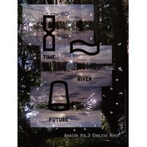

时间之河与未知 Endless River
============================

|  |  |
| :--: | :-- |
| [ 时间之河与未知 Endless River](https://emumo.xiami.com/album/2103589039) | **艺人**: [鲸鱼马戏团](../index.md) **语种**: 国语 **唱片公司**: 52Hz声音馆 **发行时间**: 2018年03月06日 **专辑类别**: 录音室专辑 **专辑风格**:  **播放数**: 329 **收藏数**: 87 **评论数**: 16  |

## 简介

跟随“52Hz声音馆”走进雨林声景秘境，李星宇“亚马逊三部曲”系列作品之：  
亚马逊 Amazon Vol.3《时间之河与未知 Endless River》  
「记得小时候的夏夜里我常常犯哮喘病，躺在床上呼吸困难。于是我总会起身走到阳台上透气，那距离仿佛一段时空隧道，打开门的一瞬，微风和着虫鸣逐渐吹干身上的汗水。我就这么静止地望向天空，想象这个小小的阳台成为宇宙飞船，带我进入浩瀚无边的银河，去探寻这个世界上最神秘的未知。」  
――李星宇  
这是亚马逊三部曲的最后一部，也是三部作品从客观审视逐渐走向主观情感的最终过程。我开启了三条不同的主线，分别探讨想象、真实与未知。三条主线相互交叠穿插，而“我”则是连接一切的桥梁。  
这片神奇的亚马逊雨林还有着太多未解之谜，可事实上这些秘密也正在不断地消失。人类对于未知的探索，源于每一个生命与生俱来的恐惧心和想象力。而这趟无尽的旅程，就像暗夜里繁星闪耀的银河，折射着古老的浪漫与悲悯。  
最后，我想再次感谢众筹支持我的朋友们，没有你们也不会有亚马逊三部曲和52Hz声音馆，以及，现在的我。

## 曲目

## 评论

|  |  |  |
| :-- | :-- | :-- |
|  [虾米用户](https://emumo.xiami.com/u/347798130)  2020-03-10 15:40 赞(0) 踩(0) | 
求版权啊呜呜呜
 |
|  [虾米用户](https://emumo.xiami.com/u/378691779) 平安喜乐 2020-02-09 15:53 赞(0) 踩(0) | 
求求班权
 |
|  [虾米用户](https://emumo.xiami.com/u/10916668)   2019-10-15 14:20 赞(0) 踩(0) | 
虾米虾米 若你求得版权，我愿十年会员呀 
 |
|  [虾米用户](https://emumo.xiami.com/u/419909374) 嗯 2019-04-11 16:50 赞(0) 踩(0) | 
也许人心藏深底的海   温度很久很久都是春天的暖
 |
|  [虾米用户](https://emumo.xiami.com/u/353834160) Alle tanzten... 2019-03-26 00:22 赞(0) 踩(0) | 
版权版权
 |
|  [虾米用户](https://emumo.xiami.com/u/191107647)  2019-02-22 01:20 赞(1) 踩(0) | 
希望争取到版权呐
 |
|  [虾米用户](https://emumo.xiami.com/u/168656086) 不说再见。 2019-01-17 23:10 赞(0) 踩(0) | 
嘤嘤嘤求版权啊啊啊
 |
|  [虾米用户](https://emumo.xiami.com/u/204156231) 梦想是留给永不放弃的人。 2018-09-11 17:43 赞(0) 踩(0) | 
好期待啊  
 |
|  [虾米用户](https://emumo.xiami.com/u/9902531) 浪漫指南 2018-09-03 09:30 赞(0) 踩(0) | 
快点拿到版权
 |
|  [虾米用户](https://emumo.xiami.com/u/96296322)  2018-07-05 01:12 赞(0) 踩(0) | 
.
 |
|  [虾米用户](https://emumo.xiami.com/u/71478) 这里住着未在任何世界露脸... 2018-06-18 02:02 赞(2) 踩(0) | 
这张的实体专辑装帧设计真的非常非常棒！目前最爱的专辑设计！
 |
|  [虾米用户](https://emumo.xiami.com/u/127444946) 我在哪漂荡 2018-06-09 22:34 赞(0) 踩(0) | 
感谢评论，我就纳闷未发布为什么还有60多次收听？
 |
|  [虾米用户](https://emumo.xiami.com/u/5099159) 把错过的都补回来 2018-03-27 17:09 赞(0) 踩(0) | 
Qq音乐独家卡，什么时候虾米搞起来？
 |
|  [虾米用户](https://emumo.xiami.com/u/8939226) 我还没想好要写什么... 2018-03-14 17:08 赞(1) 踩(0) | 
QQ音乐过来评论
 |
|  [虾米用户](https://emumo.xiami.com/u/201391232) 最快的方法是先抱抱 2018-03-06 22:26 赞(0) 踩(0) | 
得嘞 转移阵地
 |
|  [虾米用户](https://emumo.xiami.com/u/201391232) 最快的方法是先抱抱 2018-03-06 22:04 赞(0) 踩(0) | 
彡
 |
