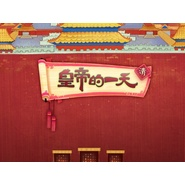

皇帝的一天
============================

|  |  |
| :--: | :-- |
| [ 皇帝的一天](https://emumo.xiami.com/album/216298091) | **艺人**: [鲸鱼马戏团](../index.md) **语种**: 国语 **唱片公司**: 独立发行 **发行时间**: 2014年10月31日 **专辑类别**: 原声带, 影视音乐 **专辑风格**: 原声 Soundtrack, 游戏配乐 Video Game Music **播放数**: 160304 **收藏数**: 507 **评论数**: 39  |

## 简介

《皇帝的一天》是故宫博物院出品的首款儿童类iPad版应用，该应用带领孩子们深入清代宫廷，了解皇帝一天的衣食起居、办公学习和休闲娱乐。 

## 曲目

## 评论

|  |  |  |  |
| :-- | :-- | :-- | :-- |
|  [虾米用户](https://emumo.xiami.com/u/440495301)  2020-02-22 13:39 赞(0) 踩(0) | 
一张专辑连起来就是一个故事，建议戴耳机听，有画面感
 |
|  [虾米用户](https://emumo.xiami.com/u/32613999) just a dream... 2017-10-28 00:16 赞(0) 踩(0) | 
好聽哭啦 星宇大爺我是你腦殘粉哈哈
 |
|  [虾米用户](https://emumo.xiami.com/u/5724824)  2017-10-28 00:00 赞(0) 踩(0) | 
好喜欢！鲸鱼大大的每张都反复听好多遍，时不时拿出来听！
 |
|  [虾米用户](https://emumo.xiami.com/u/64402358) keyi 2017-04-05 23:11 赞(0) 踩(0) | 
太喜欢了    
 |
|  [虾米用户](https://emumo.xiami.com/u/634749)  2015-12-30 16:48 赞(0) 踩(0) | 
先从尾声听起得人。。。
 |
|  [虾米用户](https://emumo.xiami.com/u/634749)  2015-12-30 16:43 赞(0) 踩(0) | 
so interesting
 |
|  [虾米用户](https://emumo.xiami.com/u/4786007) 你好，地球。 2015-08-17 09:51 赞(0) 踩(0) | 
嗯你也去玩了吗哈哈哈，我就记得批奏折的时候，我大笔一挥落下了破儿西三个字，不知你留的可是鲸鱼？
 |
|  [虾米用户](https://emumo.xiami.com/u/4786007) 你好，地球。 2015-07-04 11:33 赞(1) 踩(0) | 
话说我还玩过那个游戏。。。世事难料啊，居然鲸鱼配乐
 |
| ⇒ |  [虾米用户](https://emumo.xiami.com/u/855191)  2015-07-04 12:39 赞(0) 踩(0) | 
那个还挺好玩的呢别说
 |
| ⇒ |  [虾米用户](https://emumo.xiami.com/u/704068) 醉饮千觞不知愁 2017-12-06 09:23 赞(0) 踩(0) | 
那个游戏？近二十年前的《皇帝》么？
 |
|  [虾米用户](https://emumo.xiami.com/u/49486275)  2015-06-20 21:23 赞(0) 踩(0) | 
鲸鱼马戏团
 |
|  [虾米用户](https://emumo.xiami.com/u/38814095) 暂无签名~ 2015-06-03 21:33 赞(0) 踩(0) | 
好棒！
 |
|  [虾米用户](https://emumo.xiami.com/u/4020867)  2015-04-26 20:40 赞(0) 踩(0) | 
鲸大大～居然是你做的音乐
 |
| ⇒ |  [虾米用户](https://emumo.xiami.com/u/855191)  2015-04-26 22:13 赞(0) 踩(0) | 
嗯~ 被你发现了~
 |
|  [虾米用户](https://emumo.xiami.com/u/10168312) forever 2015-03-04 15:45 赞(0) 踩(0) | 
听着静心···
 |
|  [虾米用户](https://emumo.xiami.com/u/39631955) 人随己愿 2014-12-19 16:08 赞(0) 踩(0) | 
╮(╯3╰)╭
 |
|  [虾米用户](https://emumo.xiami.com/u/233819) visionary 2014-12-16 04:39 赞(0) 踩(0) | 
idea is terrific
 |
|  [虾米用户](https://emumo.xiami.com/u/233819) visionary 2014-12-16 04:38 赞(0) 踩(0) | 
melody is too repetitive
 |
|  [虾米用户](https://emumo.xiami.com/u/29247161) Let me photo... 2014-12-03 20:11 赞(0) 踩(0) | 
哦天惹、高产的音乐人、
 |
|  [虾米用户](https://emumo.xiami.com/u/2183770)  2014-11-26 23:37 赞(0) 踩(0) | 
漂亮漂亮！
 |
|  [虾米用户](https://emumo.xiami.com/u/16306277)  2014-11-20 21:02 赞(0) 踩(0) | 
棒！
 |
|  [虾米用户](https://emumo.xiami.com/u/17015117)  2014-11-20 15:36 赞(0) 踩(0) | 
。
 |
|  [虾米用户](https://emumo.xiami.com/u/16496294) YISTER! 2014-11-19 19:59 赞(0) 踩(0) | 
原来是鲸鱼配的！玩游戏的时候觉得配曲超赞的！
 |
| ⇒ |  [虾米用户](https://emumo.xiami.com/u/855191)  2014-11-19 20:53 赞(0) 踩(0) | 
^ - ^
 |
|  [虾米用户](https://emumo.xiami.com/u/36889449)  2014-11-19 10:11 赞(0) 踩(0) | 
HI, 大鲸鱼！
 |
|  [虾米用户](https://emumo.xiami.com/u/6806893)  2014-11-19 08:55 赞(0) 踩(0) | 
原来是鲸鱼大大！游戏我玩了~~音乐配的真好~~~
 |
| ⇒ |  [虾米用户](https://emumo.xiami.com/u/855191)  2014-11-19 11:39 赞(0) 踩(0) | 
特别寓教于乐，可以学到不少知识哈哈。。
 |
|  [虾米用户](https://emumo.xiami.com/u/4308674) (๑و•̀ㅂ•́๑)و✧... 2014-11-18 23:29 赞(0) 踩(0) | 
听啦听啦～好短不够听，好欢乐的皇宫（≧∇≦）
 |
|  [虾米用户](https://emumo.xiami.com/u/31588534) 真诚 理性 努力 2014-11-18 22:46 赞(0) 踩(0) | 
逗乐，不过很喜欢，谢谢你
 |
|  [虾米用户](https://emumo.xiami.com/u/2145177)  2014-11-18 22:41 赞(0) 踩(0) | 
自从听了落雨，我就开始喜欢上了
 |
|  [虾米用户](https://emumo.xiami.com/u/11533545) □ 2014-11-18 22:08 赞(0) 踩(0) | 
原来这是你做的配乐
 |
| ⇒ |  [虾米用户](https://emumo.xiami.com/u/855191)  2014-11-18 23:52 赞(0) 踩(0) | 
嗯 ：P
 |
| ⇒ |  [虾米用户](https://emumo.xiami.com/u/11533545) □ 2014-11-19 00:23 赞(0) 踩(0) | 
<q><b>鲸鱼马戏团说：</b></q>
 |
|  [虾米用户](https://emumo.xiami.com/u/33405891) 我还没想好要写什么... 2014-11-18 22:02 赞(0) 踩(0) | 
又可以洗去浮躁啦
 |
|  [虾米用户](https://emumo.xiami.com/u/43129148)  2014-11-18 21:56 赞(0) 踩(0) | 
又是另一种风格！唱戏的不错呢。
 |
|  [虾米用户](https://emumo.xiami.com/u/4458409)  2014-11-18 21:38 赞(0) 踩(0) | 
想起了大明宫词里太平小时候
 |
|  [虾米用户](https://emumo.xiami.com/u/3601926) 到了独自行走的时候。 2014-11-18 21:32 赞(0) 踩(0) | 
啦啦啦来啦~
 |
|  [虾米用户](https://emumo.xiami.com/u/32202185) 这家伙很帅很机智什么都没... 2014-11-18 21:16 赞(0) 踩(0) | 
噜
 |
|  [虾米用户](https://emumo.xiami.com/u/5604492) ‪‪♬✧訂閱號：Morn... 2014-11-18 21:14 赞(0) 踩(0) | 
來啦~
 |
