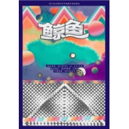

鲸鱼 音乐剧原声带
============================

|  |  |
| :--: | :-- |
| [ 鲸鱼 音乐剧原声带](https://emumo.xiami.com/album/608206144) | **艺人**: [鲸鱼马戏团](../index.md) **语种**: 国语 **唱片公司**: 独立发行 **发行时间**: 2011年09月10日 **专辑类别**: 原声带, 影视音乐 **专辑风格**:  **播放数**: 346790 **收藏数**: 406 **评论数**: 10  |

## 简介

多媒体四维体验  
  
《鲸鱼》是一部集即兴说唱、原创动画、原创音乐于一体的多媒体音乐剧。当小老虎扮演的诗人船长冲下台抓住观众的领子开始即兴说唱时，台下坐着的专业剧评人们对这种突然袭击猝不及防，但很快就跟着他语言的律动摇摆起身体，爆发出一阵阵尖叫和掌声。  
  
走进《鲸鱼》的剧场，好像进入了另一个世界。记者随机采访了几位现场观众，都表示有身临其境的感觉。资深戏剧爱好者小冯很感慨：“以前看戏，都是后半程慢慢进入剧情，投入感情。这次看《鲸鱼》，一进剧场，海浪声就从身后涌上来，听见海风，看到鲸鱼，还能闻到大海的气味，不可思议！”  
  
这些奇妙的体验，都是《鲸鱼》剧组特别设计的。作为《鲸鱼》的声响设计，李星宇大胆采用了5.1环绕声声场的设计，甚至拆开座椅改造剧场来布置音响。由雷磊全程监督制作的多媒体动画，在现场VJ的操纵下，演绎成了惊人的绚丽效果。宇宙，新星，狂喜的泼墨，多变的万花筒……配合着音乐和剧情，整个剧场的视觉也在不停变换。  
  
除了音乐和影像的多媒体交叉，气味设计的加入，成为《鲸鱼》最具革新性的创意元素。由气味图书馆提供的多种空气喷雾，在看剧的同时，可以真切地嗅到诸如“太空”、“大海”、“酒馆”、“篝火”、“暴风雨后”等气味，真正地全感官身临其境。  
  
嘿！！！戏剧需要跨界  
  
《鲸鱼》的主创，是一个多媒体跨界团体，他们有一个有趣的名字，叫做“嘿！！！”，成员是三个才华横溢的年轻人，三个不同领域的明星：小老虎，国内知名的说唱歌手，蝉联两届中国MC Battle大赛“龙虎斗”的冠军，代表华人赴伦敦皇家大剧院演出，泰晤士报曾深度报道；雷磊，国内知名独立动画家，其作品曾获加拿大渥太华国际动画节最佳短片奖，多次入围世界各大动画节；李星宇，国内优秀独立音乐制作人，曾操刀多位流行歌手专辑。“嘿！！！”在2010年发行了首张专辑《嘿！流行音乐》， 这张专辑无论包装设计、创作思路还是整体运作，都突破了传统的“流行音乐”唱片模式，受到圈内音乐人的热力追捧。  
  
这一次“嘿！！！”团体的跨界从音乐、动画、文学跨界到了舞台音乐剧，包办剧本创作、多媒体设计、音乐音效设计……三人还是这次音乐剧的主演。借用导演储智勇的话说，“戏剧的魅力，就在于它的可能性”，这一次他把“嘿！！！”的这三个“业余演员”从各自领域带上了戏剧舞台，“一定会产生奇妙的化学反应。”而观剧后，另很多专业话剧人感动的，正是他们身上充满业余气味的才华和热情。  
  
&nbsp;

## 曲目

## 评论

|  |  |  |
| :-- | :-- | :-- |
|  [虾米用户](https://emumo.xiami.com/u/16178749) 愿各自安好………………  2020-01-24 22:28 赞(0) 踩(0) | 

 |
|  [虾米用户](https://emumo.xiami.com/u/137297518)  2018-07-14 23:54 赞(1) 踩(0) | 
一瞥当年的音乐剧
 |
|  [虾米用户](https://emumo.xiami.com/u/12221090) 逍遥于天地而心意自得 2017-06-27 13:54 赞(1) 踩(0) | 
赞
 |
|  [虾米用户](https://emumo.xiami.com/u/32725777)  2017-04-19 05:23 赞(1) 踩(0) | 
都听出了coldplay的感觉了，很棒
 |
|  [虾米用户](https://emumo.xiami.com/u/5847530) 杂食动物 2015-03-31 10:52 赞(1) 踩(0) | 
居然有小老虎 和雷~
 |
|  [虾米用户](https://emumo.xiami.com/u/5847530) 杂食动物 2015-03-31 10:46 赞(2) 踩(0) | 
小老虎 雷 音乐剧
 |
|  [虾米用户](https://emumo.xiami.com/u/47165555) 我有我的梦，你有你的事。 2015-02-12 01:48 赞(1) 踩(0) | 
鲸鱼马戏团很赞啦=￣ω￣=  各种风格都有。
 |
|  [虾米用户](https://emumo.xiami.com/u/14364706) 暂无签名~ 2014-12-22 13:13 赞(1) 踩(0) | 
好听，可以让人安静下来。
 |
|  [虾米用户](https://emumo.xiami.com/u/42164095)   2014-10-13 22:13 赞(0) 踩(0) | 
好赞，自由part都很棒，有种感动的感觉。很用心，感受得到，加油！加油！
 |
| ⇒ |  [虾米用户](https://emumo.xiami.com/u/38674805) BAT 2014-10-30 03:10 赞(0) 踩(0) | 
心境.
 |
