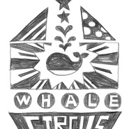
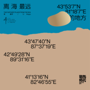
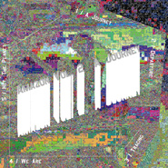
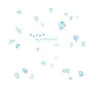
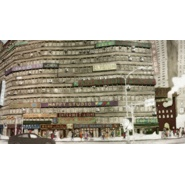

鲸鱼马戏团
============================

|  |  |
| :--: | :-- |
| [ 鲸鱼马戏团](https://i.xiami.com/whalecircus) | **地区**: China 中国大陆 **风格**: 根源唱作人 Singer-Songwriter, 电影原声 Film Score, 轻音乐 Easy Listening **播放数**: 60479322 **粉丝数**: 52246 **评论数**: 1116  |

## 档案

音乐人档案： 
名称：鲸鱼马戏团 
成立时间：2013年 
成立地点：中国-北京 
简介： 
[鲸鱼马戏团] 为李星宇的个人音乐人项目，音乐风格多元。透过创作，李星宇希望传达这样的理念： “我永远不会给自己设定框架，我希望大家在我的音乐里找到各自的影子，那些熟知的生活细碎，共同编织起的这个世界。我希望大家听到的，是来自一个真实的人说给自己听、说给每一个人听，与每一个生命所共通的、发自内心的言语。” 
艺人档案： 
姓名：李星宇 
民族：汉族 
星座：双鱼座 
血型：B型 
出生地：中国-北京 
毕业院校/专业：中国传媒大学/录音工程专业 
简介： 
[李星宇] (Weibo ID:李星宇 Stars)来自北京的独立音乐人、独立音乐制作人、声音设计师、录音工程师、声学空间设计师、音乐教师。拥有个人音乐人[鲸鱼马戏团]，还发起声音艺术项目“52Hz 声音馆”，首个子项目“亚马逊寻声计划”广受关注。07年起，作为声学空间设计师，参与设计录音棚及各类声响设施及建筑100余座，遍及中国各地。 
获奖/荣誉经历： 
2006年：台北大地之音全球华人音乐大赛原创组冠军——SNP小生物《雨后的咖啡》 
2012年：北京青年戏剧节人气最高独立戏剧——多媒体戏剧《鲸鱼》主演及音乐制作 
2015年：入选柏林电影节天才训练营，成为第一个入选的中国作曲家，完成在德国的学习 
2015年：第五届阿比鹿音乐奖-最受欢迎-轻音乐/世界音乐——《鲸鱼马戏团 Vol.2 Whisper》 
2015年：华语金曲奖 最佳新世纪音乐唱片 
2017年：良仓生活方式大赏 52Hz声音馆 “听而不觉”的声音博物馆，认知世界的新维度 
[鲸鱼马戏团工作室] 
工作联系： xingyu@soundcabinet.org 
[I'm just another whale in the universe.]

## 专辑

| 名称 | 语种 | 唱片公司 | 发行时间 | 专辑类别 | 专辑风格 |
| :--: | :-- | :-- | :-- | :-- | :-- |
| [ 离海最远的地方](./albums/5021554623.md) | 纯音乐 | 战马时代 | 2020年10月04日 | 录音室专辑 | 世界音乐 World Music |
| [ 情爱江南 唐乐版](./albums/5022377958.md) | 纯音乐 |  | 2019年10月12日 | EP, 单曲 |  |
| [ 穿越城市的回响](./albums/2104643625.md) | 纯音乐 | 独立发行 | 2019年03月04日 | EP, 单曲 |  |
| [ 时间之河与未知 Endless River](./albums/2103589039.md) | 国语 | 52Hz声音馆 | 2018年03月06日 | 录音室专辑 |  |
| [ 未尽之旅 A JOURNEY](./albums/2103505406.md) | 国语 | 独立发行 | 2018年01月28日 | EP, 单曲 |  |
| [ 瓶行宇宙2.0BOTTLEDREAM](./albums/2102757542.md) | 国语 | 独立发行 | 2017年05月20日 | 原声带, 影视音乐 | 电子 Electronic, 原声 Soundtrack |
| [ 鲸鱼马戏团 Vol.3 梦 DreamingWhale Circus Vol. 3 Dreaming](./albums/2102738073.md) | 纯音乐 | 风潮音乐 | 2017年04月26日 | 录音室专辑 | 轻音乐 Easy Listening |
| [ 自然的法则](./albums/2102662415.md) | 其他 | 独立发行 | 2016年12月12日 | EP, 单曲 | 轻音乐 Easy Listening, 管弦乐 Orchestral |
| [ 雨街Rain Street](./albums/2100373147.md) | 国语 | 风潮音乐 | 2016年07月28日 | EP, 单曲 | 轻音乐 Easy Listening |
| [ 芸谣传OST](./albums/2100274688.md) | 国语 | 独立发行 | 2016年02月14日 | 原声带, 影视音乐 | 原声 Soundtrack, 中国民乐 Chinese Folk Music, 中国风 China-Wave |
| [ 你们不知道的鲸鱼马戏团THE OTHER SIDE](./albums/2100252880.md) | 国语 | 独立发行 | 2015年12月31日 | EP, 单曲 | 声效拼贴 Sound Collage, 独立摇滚 Indie Rock, 独立电子乐 Indietronica |
| [ 创变者OST](./albums/1234461729.md) | 国语 | BOTTLEDREAM | 2015年06月01日 | 原声带, 影视音乐 | 原声 Soundtrack, 电影原声 Film Score |
| [ 鲸鱼马戏团 Vol.2 Whisper](./albums/1125401563.md) | 其他 | 虾米音乐人 | 2015年03月25日 | 录音室专辑 | 极简主义 Minimalism, 自然采样 Field Recordings |
| [ 小野兽花店OST](./albums/825092013.md) | 国语 | 独立发行 | 2015年02月14日 | 原声带, 影视音乐 | 原声 Soundtrack, 电视原声 Television Music |
| [ 幻境三国 OST](./albums/2100265380.md) | 国语 | 独立发行 | 2014年12月26日 | 原声带, 影视音乐 | 原声 Soundtrack, 游戏配乐 Video Game Music, 中国风 China-Wave |
| [ 皇帝的一天](./albums/216298091.md) | 国语 | 独立发行 | 2014年10月31日 | 原声带, 影视音乐 | 原声 Soundtrack, 游戏配乐 Video Game Music |
| [ 鲸鱼马戏团 Vol.1](./albums/1814380641.md) | 国语 | 独立发行 | 2014年10月27日 | 录音室专辑 | 轻音乐 Easy Listening |
| [ 叶](./albums/2009575879.md) | 国语 | 独立发行 | 2014年09月01日 | EP, 单曲 | 原声 Soundtrack, 轻音乐 Easy Listening, 独立流行 Indie Pop |
| [ 皮皮鲁送你100条命OST](./albums/105155617.md) | 国语 | 斑马奇技 | 2013年08月17日 | 原声带, 影视音乐 | 原声 Soundtrack, 游戏配乐 Video Game Music, 卡通配乐 Cartoon Music |
| [ 罗兰的大桥The Roland Bridge](./albums/8290216.md) | 国语 | 独立发行 | 2013年08月15日 | EP, 单曲 | 边缘音乐人 Obscuro, 原声 Soundtrack, 轻音乐 Easy Listening, 另类唱作人 Alternative Singer-Songwriter |
| [ 大手啊大手，越大越好](./albums/701269496.md) | 国语 | 独立发行 | 2013年01月21日 | 原声带, 影视音乐 | 原声 Soundtrack, 卡通配乐 Cartoon Music, 儿童音乐 Children's Music, 儿歌 Nursery Rhyme |
| [ 麋鹿森林](./albums/1407677740.md) | 国语 | 独立发行 | 2012年06月01日 | EP, 单曲 | 有声书 Audio Book, 广播剧 Radio Drama |
| [ Happy Life独立动画 Happy Life 配乐](./albums/1301268416.md) | 其他 | 独立发行 | 2012年02月01日 | 原声带, 影视音乐 | 原声 Soundtrack, 卡通配乐 Cartoon Music |
| [ @伴娘OST](./albums/1401270350.md) | 国语 | 录客 | 2012年01月04日 | 原声带, 影视音乐 | 原声 Soundtrack, 电影原声 Film Score |
| [ 夏日时光 微电影原声带](./albums/772861124.md) | 国语 | 独立发行 | 2012年01月01日 | 原声带, 影视音乐 | 电影原声 Film Score |
| [ 鲸鱼 音乐剧原声带](./albums/608206144.md) | 国语 | 独立发行 | 2011年09月10日 | 原声带, 影视音乐 |  |
| [ 鲸鱼岛的冬天](./albums/1301266966.md) | 国语 | 斑马奇技 | 2011年06月01日 | 原声带, 影视音乐 | 游戏配乐 Video Game Music, 轻音乐 Easy Listening |

## 评论

|  |  |  |
| :-- | :-- | :-- |
|  [虾米用户](https://emumo.xiami.com/u/14291768) 我还没想好要写什么... 2021-01-14 22:53 赞(2) 踩(0) | 
「鲸鱼马戏团是你在虾米最钟情的人」
 |
|  [虾米用户](https://emumo.xiami.com/u/851674)  2020-12-25 01:18 赞(1) 踩(0) | 
又失眠了，需要
 |
|  [虾米用户](https://emumo.xiami.com/u/45382586)   2020-12-01 01:35 赞(2) 踩(0) | 
为什么你的每一首歌都触人心弦。
 |
|  [虾米用户](https://emumo.xiami.com/u/198170141)  2020-11-13 15:41 赞(3) 踩(0) | 
第一次认识鲸鱼，是华为音乐日推（当时的版本签的是虾米），听鲸鱼的第一首歌叫《夜空》。谢谢鲸鱼，谢谢虾米，谢谢华为 
 |
|  [虾米用户](https://emumo.xiami.com/u/69836094) 「终极手残」 2020-11-02 23:15 赞(1) 踩(0) | 
谢谢你。
 |
|  [虾米用户](https://emumo.xiami.com/u/851674)  2020-10-25 01:49 赞(0) 踩(0) | 
小星星怎么没有了？昨天前天还在听呢&amp;hellip;&amp;hellip;失眠的夜晚就靠它了TvT
 |
|  [虾米用户](https://emumo.xiami.com/u/2364175)   2020-09-19 22:16 赞(1) 踩(0) | 
去看了8月在武汉的live，那一天还看到了很美丽的彩虹，乐队成员还在演出时过了生日，很开心的一个晚上。
 |
|  [虾米用户](https://emumo.xiami.com/u/340903899) 我还没想好要写什么... 2020-08-14 11:19 赞(1) 踩(0) | 
&amp;hellip;
 |
|  [虾米用户](https://emumo.xiami.com/u/244764751) Alive,Alone. 2020-08-07 18:49 赞(1) 踩(0) | 
被一个，有人觉得很好，但也有人觉得他不好的人，安利来了。 真的很好听啊！ 佩服用心做音乐的人。 希望他也能很好。
 |
|  [虾米用户](https://emumo.xiami.com/u/10916668)   2020-08-06 20:44 赞(0) 踩(0) | 
为什么不来长沙呢，哎呀
 |
|  [虾米用户](https://emumo.xiami.com/u/426272961) (:3_\)_ 2020-08-01 11:28 赞(0) 踩(0) | 
吉普赛人
 |
|  [虾米用户](https://emumo.xiami.com/u/32357204) 春有百花秋有月 夏有凉风... 2020-07-25 19:18 赞(1) 踩(0) | 
南京蹲一个同好:D
 |
| ⇒ |  [虾米用户](https://emumo.xiami.com/u/113814652) 安溥唱出我的灵魂 2020-10-08 22:38 赞(0) 踩(0) | 
南京 
 |
|  [虾米用户](https://emumo.xiami.com/u/443932285)  2020-07-22 23:13 赞(0) 踩(0) | 
祝福越来越好，有一个灿烂的前程
 |
|  [虾米用户](https://emumo.xiami.com/u/10956957) 我还没想好要写什么... 2020-07-18 09:56 赞(1) 踩(0) | 
珠海巡演蹲一个同好ಥ_ಥ
 |
|  [虾米用户](https://emumo.xiami.com/u/379162683) 我想要记住你们，我想要你... 2020-07-17 23:08 赞(0) 踩(0) | 

 |
|  [虾米用户](https://emumo.xiami.com/u/37167743) 若无其事 穿越整片森林海... 2020-07-16 20:29 赞(2) 踩(0) | 
深圳巡演蹲一个同好ಥ_ಥ
 |
|  [虾米用户](https://emumo.xiami.com/u/45810215) 似木头似石头的话得到注意... 2020-07-15 01:29 赞(0) 踩(0) | 

 |
|  [虾米用户](https://emumo.xiami.com/u/49286118) 节制的人生 2020-07-14 21:31 赞(0) 踩(0) | 

 |
|  [虾米用户](https://emumo.xiami.com/u/73740960)  2020-07-14 16:52 赞(0) 踩(0) | 

 |
|  [虾米用户](https://emumo.xiami.com/u/71478) 这里住着未在任何世界露脸... 2020-06-29 03:02 赞(2) 踩(0) | 
来园长远去之地日常打卡
 |
|  [虾米用户](https://emumo.xiami.com/u/407815216) 爱比讨厌更有力量 2020-05-31 10:12 赞(0) 踩(0) | 

 |
|  [虾米用户](https://emumo.xiami.com/u/85786202) 暂无 2020-04-13 11:42 赞(0) 踩(0) | 
1
 |
|  [虾米用户](https://emumo.xiami.com/u/96592584) 经得起这世界考验，还欣赏... 2020-04-08 00:51 赞(1) 踩(0) | 
&amp;hearts;️.
 |
|  [虾米用户](https://emumo.xiami.com/u/434152246) 聪明少一些大智慧多一些，... 2020-02-29 20:55 赞(0) 踩(0) | 

 |
|  [虾米用户](https://emumo.xiami.com/u/427885960)  2020-02-26 20:31 赞(1) 踩(0) | 
从网易云专门追到虾米，我真的好喜欢好喜欢
 |
|  [虾米用户](https://emumo.xiami.com/u/401245724) 少不更事，老而无为 2020-02-13 00:29 赞(3) 踩(0) | 
好喜欢他们的曲子，都是清新淡淡的纯音，但是首首命中❤️啊。而且！原来小星星变奏也是他们的吗！惊喜！ 
 |
|  [虾米用户](https://emumo.xiami.com/u/5109027)  2020-02-09 19:20 赞(0) 踩(0) | 
安静又暗潮汹涌
 |
|  [虾米用户](https://emumo.xiami.com/u/428079722) 能否知行合一 2020-02-07 11:44 赞(1) 踩(0) | 
希望在未来的某一天，我能站在台下望着台上的你们，像望着那闪闪的星星⭐️一样。
 |
|  [虾米用户](https://emumo.xiami.com/u/400715332) 留白 2020-02-03 00:06 赞(0) 踩(0) | 
你……
 |
|  [虾米用户](https://emumo.xiami.com/u/358104299) 悲观的唯心存在现实解构虚... 2020-01-09 14:49 赞(0) 踩(0) | 
14639
 |
|  [虾米用户](https://emumo.xiami.com/u/111251724) 我还没想好要写什么... 2019-12-13 15:32 赞(3) 踩(0) | 
2019.12.21 北京专场演出 【鲸鱼马戏团 ——地球上最后的夜晚】 关于这个夜晚入场券 大家详见鲸鱼马戏团的官博吧！
 |
|  [虾米用户](https://emumo.xiami.com/u/6005918) 网易云账号同名：pans... 2019-12-11 00:58 赞(1) 踩(0) | 
好希望你再来上海巡演 不想再错过了 
 |
|  [虾米用户](https://emumo.xiami.com/u/50091850)  2019-12-02 09:22 赞(3) 踩(0) | 
我觉得是 奇妙的 其实，我们能在虾米音乐找到你 是我们的幸运 我们就是你的观众 鲸鱼马戏团 真的让我感动到了 无论是钢琴还是来自大自然的收音 都让我感叹，纯音乐是有力量的 
 |
|  [虾米用户](https://emumo.xiami.com/u/374260276) 有趣的灵魂、 2019-11-19 14:09 赞(3) 踩(0) | 
卧槽我好喜欢你！！！！！！！！！！！！！！！！！！！！ ！！！！！！！！！超级喜欢！！！！！！！！！！！！！！！
 |
|  [虾米用户](https://emumo.xiami.com/u/306345361)  2019-11-16 07:31 赞(2) 踩(0) | 
美好的让人想哭
 |
|  [虾米用户](https://emumo.xiami.com/u/407661999)  2019-11-10 23:28 赞(0) 踩(0) | 
apj J wp！251317 197111 在 17380 天  他2413264 .313113 79 0 0
 |
|  [虾米用户](https://emumo.xiami.com/u/407661999)  2019-11-10 23:27 赞(0) 踩(0) | 
apj J wp！
 |
|  [虾米用户](https://emumo.xiami.com/u/407661999)  2019-11-10 23:27 赞(0) 踩(0) | 
J wpt
 |
|  [虾米用户](https://emumo.xiami.com/u/283029505) 你说自己带出来的小孩自己... 2019-11-09 07:37 赞(1) 踩(0) | 
战哥安利来的 520805
 |
|  [虾米用户](https://emumo.xiami.com/u/411204131) 这个人很懒 2019-11-07 18:46 赞(1) 踩(0) | 
好舒适 好惬意
 |
|  [虾米用户](https://emumo.xiami.com/u/127444946) 我在哪漂荡 2019-10-29 22:03 赞(0) 踩(0) | 
求新专上线虾米
 |
|  [虾米用户](https://emumo.xiami.com/u/24173805)   2019-10-19 11:13 赞(1) 踩(0) | 
你是宝藏
 |
|  [虾米用户](https://emumo.xiami.com/u/238022999)   2019-10-16 02:14 赞(1) 踩(0) | 
gg安利我来的
 |
|  [虾米用户](https://emumo.xiami.com/u/256696322)  2019-09-06 00:22 赞(1) 踩(0) | 
喜欢
 |
|  [虾米用户](https://emumo.xiami.com/u/71478) 这里住着未在任何世界露脸... 2019-08-30 01:15 赞(13) 踩(0) | 
喜欢鲸鱼马戏团的小哥哥小姐姐们，希望能多少都音乐付费或到众筹那支持一下吧。鲸鱼马戏团什么时候才能多赚点钱，别老是每年都是为了做想做的音乐发行专辑而负债，亏钱巡演。作为老粉真的操碎了心 
 |
|  [虾米用户](https://emumo.xiami.com/u/383899) 独立摄影师 2019-08-01 16:47 赞(3) 踩(0) | 
来日方长
 |
|  [虾米用户](https://emumo.xiami.com/u/42963872) 我还没想好要写什么... 2019-07-20 18:57 赞(1) 踩(0) | 
-
 |
|  [虾米用户](https://emumo.xiami.com/u/187444857)  2019-07-01 20:58 赞(2) 踩(0) | 
好喜欢   听着听着  人都变得安静了
 |
|  [虾米用户](https://emumo.xiami.com/u/76869222) 人生来便是为了探求无限。 2019-06-29 08:58 赞(2) 踩(0) | 
终于不用听北欧的了……
 |
|  [虾米用户](https://emumo.xiami.com/u/425914590) 离别总是让人难过 2019-06-21 15:24 赞(1) 踩(0) | 
我总会莫名感动 而我听你时 我的感动便不那么莫名
 |
|  [虾米用户](https://emumo.xiami.com/u/3815293) baby Jesus s... 2019-06-15 16:57 赞(0) 踩(0) | 
过来踩踩
 |
|  [虾米用户](https://emumo.xiami.com/u/50171518) 此号报销 2019-05-08 18:29 赞(0) 踩(0) | 
.
 |
|  [虾米用户](https://emumo.xiami.com/u/66823378)  2019-05-07 23:06 赞(1) 踩(0) | 

 |
|  [虾米用户](https://emumo.xiami.com/u/271709079) 不气馁，有召唤，爱自由 2019-05-04 02:24 赞(1) 踩(0) | 
<a href="http://emumo.xiami.com/u/855191" target="_blank" rel="nofollow" name_card="855191">@鲸鱼马戏团</a> 每晚安眠必备！比杨千嬅的长岛冰茶还管用
 |
|  [虾米用户](https://emumo.xiami.com/u/9902531) 浪漫指南 2019-04-26 23:41 赞(3) 踩(0) | 
今晚现场最后一首老友 哭了出来
 |
|  [虾米用户](https://emumo.xiami.com/u/281428) 活得自己 2019-04-26 20:30 赞(1) 踩(0) | 
4月26日 广州在现场
 |
|  [虾米用户](https://emumo.xiami.com/u/9902531) 浪漫指南 2019-04-24 01:24 赞(0) 踩(0) | 
4.26  终于能见到您了
 |
|  [虾米用户](https://emumo.xiami.com/u/9902531) 浪漫指南 2019-04-24 01:23 赞(3) 踩(0) | 
听您的歌 有一种被爱感觉
 |
|  [虾米用户](https://emumo.xiami.com/u/37373236)   2019-04-16 00:51 赞(0) 踩(0) | 
曾经丢失了你，最近把你又给找回来了，你的音乐始终能感动我  
 |
|  [虾米用户](https://emumo.xiami.com/u/37373236)   2019-04-16 00:51 赞(0) 踩(0) | 
曾经丢失了你，最近把你又给找回来了，你的音乐始终能感动我  
 |
|  [虾米用户](https://emumo.xiami.com/u/31588534) 真诚 理性 努力 2019-04-12 10:03 赞(0) 踩(0) | 
爱您
 |
|  [虾米用户](https://emumo.xiami.com/u/43495971)  2019-04-07 08:36 赞(0) 踩(0) | 
贝拉 塔尔?
 |
|  [虾米用户](https://emumo.xiami.com/u/194725063) 我还没想好要写什么... 2019-03-25 13:12 赞(0) 踩(0) | 
4月27日深圳等你❤️
 |
|  [虾米用户](https://emumo.xiami.com/u/25997141)  2019-03-22 17:30 赞(2) 踩(0) | 
羡慕那些年少就认识鲸鱼马戏团的人，今年我22岁了，才认识你
 |
|  [虾米用户](https://emumo.xiami.com/u/276944698) 不要自我设限..... 2019-03-08 22:49 赞(1) 踩(0) | 

 |
|  [虾米用户](https://emumo.xiami.com/u/420454747)  2019-03-08 18:57 赞(0) 踩(0) | 

 |
| ⇒ |  [虾米用户](https://emumo.xiami.com/u/420454747)  2019-03-09 16:29 赞(0) 踩(0) | 
总觉得歌很李星宇（个人），是送给自己的歌呐
 |
|  [虾米用户](https://emumo.xiami.com/u/49899951) you are the ... 2019-03-06 21:09 赞(0) 踩(0) | 
鲸鱼马戏团有一股温柔的治愈能量，陪我度过了很多个心情不好的时刻
 |
|  [虾米用户](https://emumo.xiami.com/u/123987172)   2019-03-05 10:30 赞(0) 踩(0) | 
还真有
 |
|  [虾米用户](https://emumo.xiami.com/u/123987172)   2019-03-05 10:27 赞(0) 踩(0) | 
有没有纯海声
 |
|  [虾米用户](https://emumo.xiami.com/u/45810215) 似木头似石头的话得到注意... 2019-02-20 20:21 赞(0) 踩(0) | 
  
 |
|  [虾米用户](https://emumo.xiami.com/u/318788993) 至上 2019-02-08 00:30 赞(0) 踩(0) | 
支持
 |
|  [虾米用户](https://emumo.xiami.com/u/41214171) 文质彬彬好青年 2018-12-19 21:38 赞(2) 踩(0) | 
李星宇是位伟大的录音师。
 |
|  [虾米用户](https://emumo.xiami.com/u/405858695) 快乐听歌 2018-12-14 22:18 赞(6) 踩(0) | 
犬吠水声中，桃花带露浓。 树深时见鹿，溪午不闻钟。 野竹分青霭，飞泉挂碧峰。 无人知所去，愁倚两三松。
 |
|  [虾米用户](https://emumo.xiami.com/u/405858695) 快乐听歌 2018-12-14 22:17 赞(4) 踩(0) | 
热评第一好尴尬呀……只有“林深时见鹿”是李白的原句
 |
|  [虾米用户](https://emumo.xiami.com/u/226081577) 人生总要有点喜欢的事情吧... 2018-11-21 10:55 赞(2) 踩(0) | 
很庆幸在vue上发现了你们
 |
|  [虾米用户](https://emumo.xiami.com/u/101636444) ❤️一只喜欢闵玧其的疯姑... 2018-11-20 23:26 赞(0) 踩(0) | 
❤️
 |
|  [虾米用户](https://emumo.xiami.com/u/339191478)   2018-11-04 12:33 赞(0) 踩(0) | 

 |
|  [虾米用户](https://emumo.xiami.com/u/261180302) 噢 2018-10-23 18:19 赞(0) 踩(0) | 
最后一幕：保重。
 |
|  [虾米用户](https://emumo.xiami.com/u/1194310) 学吉他好多年了，依然在起... 2018-10-18 12:07 赞(0) 踩(0) | 
星宇加油
 |
|  [虾米用户](https://emumo.xiami.com/u/7916875) (￣Д￣)ﾉ 2018-10-06 19:31 赞(0) 踩(0) | 
想听现场呢
 |
| ⇒ |  [虾米用户](https://emumo.xiami.com/u/36081313) 听 2019-02-28 14:32 赞(0) 踩(0) | 
3.8号上海 3.10杭州有现场诶
 |
| ⇒ |  [虾米用户](https://emumo.xiami.com/u/7916875) (￣Д￣)ﾉ 2019-02-28 14:45 赞(0) 踩(0) | 
<q><b>苏打说：</b></q>
 |
| ⇒ |  [虾米用户](https://emumo.xiami.com/u/36081313) 听 2019-02-28 22:13 赞(0) 踩(0) | 
<q><b>奈酱说：</b></q>
 |
|  [虾米用户](https://emumo.xiami.com/u/306348201) 有花有酒春常在 2018-09-28 22:40 赞(5) 踩(0) | 
一直以来都没有意识到本土音乐人除了窦唯 谁还会搞出一首像样的纯音 看来是我孤落寡闻了 惭愧
 |
|  [虾米用户](https://emumo.xiami.com/u/11427737) ♥ 2018-09-16 01:38 赞(0) 踩(0) | 
一直喜欢着你们
 |
|  [虾米用户](https://emumo.xiami.com/u/326232608)  2018-09-07 10:09 赞(2) 踩(0) | 
适合发呆呀，忧郁的心情，放空着循环，不需要刻意地听
 |
|  [虾米用户](https://emumo.xiami.com/u/52716530) 平安喜乐 2018-09-06 09:30 赞(13) 踩(0) | 
鲸鱼马戏团新动态（又有玩儿的啦！ Vol.2 -新疆篇「寻声西游记」 云养计划 正式上线！ &amp;ldquo;一方面想去记录和发掘那些和中国传统音乐有着血缘关系的古老新疆音乐，另一方面也想记录下如赛里木湖、戈壁滩、胡杨林的独特声音，同时还会和非常出色的音乐家们共同完成一系列全新的世界音乐创作。&amp;rdquo;  期待你的参与： 点击本链接 【摩点网-鲸鱼马戏团】 <a href="https://t.modian.com/project/30378" target="_blank" rel="nofollow noreferrer noopener">https://t.modian.com/project/30378</a> 加入云养计划，即可进入「寻声西游记」声音分享群，获得寻声项目未公开的一手音频、视频资料，抢先试听新专辑的Demo。我们更是会定期举办线上的声音展，定制专属的声音礼物。
 |
|  [虾米用户](https://emumo.xiami.com/u/127444946) 我在哪漂荡 2018-09-06 08:40 赞(1) 踩(0) | 
问下下：为啥鲸鱼工作室的淘宝店铺找不到了⊙&amp;omega;⊙
 |
| ⇒ |  [虾米用户](https://emumo.xiami.com/u/777675) 事物发生研究员 2018-09-11 22:25 赞(0) 踩(0) | 
宝宝可以关注下 有赞店铺也是一样【52Hz声音馆】或者加Alice咨询，在热评那里找她
 |
|  [虾米用户](https://emumo.xiami.com/u/358534096) 一個人 2018-08-24 15:31 赞(2) 踩(0) | 
喜欢你。
 |
|  [虾米用户](https://emumo.xiami.com/u/359699312) 習慣。 2018-08-19 13:44 赞(0) 踩(0) | 
下雨的时候，正好走在食堂出来的路上，听到第1分4秒，很欣喜。
 |
|  [虾米用户](https://emumo.xiami.com/u/301913954) 为爱而生 2018-08-12 22:50 赞(3) 踩(0) | 
我感觉到了自然的力量和温度，也感受到平静音乐下隐藏的炽热情感。我只想说，我很喜欢 
 |
|  [虾米用户](https://emumo.xiami.com/u/256591443) 潜意识作祟 2018-08-11 02:13 赞(2) 踩(0) | 
凌晨 一切都回归平静 音乐充斥在这个房间 我把窗帘拉开 好让那点光透进来 把窗户开到最大，以呼吸凌晨的新鲜空气
 |
|  [虾米用户](https://emumo.xiami.com/u/84607574) 我还没想好要写什么... 2018-07-28 13:49 赞(13) 踩(0) | 
你好，很喜欢你的音乐，我听了将近三年，我画过一幅关于鲸鱼的插画，不知道你有没有兴趣 
 |
|  [虾米用户](https://emumo.xiami.com/u/49655313) 除了再见还可以说些什么呢 2018-07-12 07:51 赞(0) 踩(0) | 
早 :)
 |
|  [虾米用户](https://emumo.xiami.com/u/996277) ‏‏ 2018-07-02 06:57 赞(2) 踩(0) | 
好喜欢你李星宇
 |
| ⇒ |  [虾米用户](https://emumo.xiami.com/u/379828286) 知我者 谓我心忧不知我者... 2018-08-10 10:50 赞(0) 踩(0) | 
我前座就叫李星宇  
 |
|  [虾米用户](https://emumo.xiami.com/u/347767289)  2018-07-01 19:55 赞(1) 踩(0) | 
喜欢你的歌，我也是b血型，但我是水平双鱼座的
 |
|  [虾米用户](https://emumo.xiami.com/u/46300616)  2018-06-26 06:04 赞(0) 踩(0) | 
太喜欢
 |
|  [虾米用户](https://emumo.xiami.com/u/276147027) say somethin... 2018-06-24 09:26 赞(1) 踩(0) | 
听到烟火的声音 想起了过年除夕夜在家里看烟花的情景 想家 所以还会听着觉得难过吧
 |
|  [虾米用户](https://emumo.xiami.com/u/49423107) 普通女士。 2018-06-24 04:30 赞(0) 踩(0) | 
好。
 |
|  [虾米用户](https://emumo.xiami.com/u/9914981)  2018-06-18 22:45 赞(0) 踩(0) | 
不错 加油小哥
 |
|  [虾米用户](https://emumo.xiami.com/u/38086631) 版权就和自由一样，永远属... 2018-06-08 22:54 赞(0) 踩(0) | 
谢谢你，鲸鱼马戏团
 |
|  [虾米用户](https://emumo.xiami.com/u/175411678) 慢摇少女 2018-05-28 00:27 赞(0) 踩(0) | 
1010圆满
 |
|  [虾米用户](https://emumo.xiami.com/u/316502674) 在最后陪着你吧，我的虾米 2018-05-19 09:47 赞(0) 踩(0) | 
请继续加油↖(^&amp;omega;^)↗
 |
|  [虾米用户](https://emumo.xiami.com/u/40694721) 不能把听歌这个习惯丢了  2018-05-16 07:25 赞(1) 踩(0) | 
偶然间听到了鲸鱼，对做视频记录的我来说，音乐一直都是我灵感的源泉。我想说：能听到鲸鱼是件幸运的事情，真好。
 |
|  [虾米用户](https://emumo.xiami.com/u/2763753) The best is ... 2018-05-08 15:13 赞(0) 踩(0) | 
来晚了呢～
 |
|  [虾米用户](https://emumo.xiami.com/u/188902054) born in 2002 2018-05-01 17:34 赞(1) 踩(0) | 
特别棒的音乐 鲸 漫游于无边蔚蓝 予之以蓝色大海 岚岚之音
 |
|  [虾米用户](https://emumo.xiami.com/u/264328095)  2018-04-20 17:20 赞(2) 踩(0) | 
名字来自于贝拉塔尔的同名电影？
 |
|  [虾米用户](https://emumo.xiami.com/u/111251724) 我还没想好要写什么... 2018-04-20 12:56 赞(0) 踩(0) | 
哎呀呀！1001！就是我！
 |
| ⇒ |  [虾米用户](https://emumo.xiami.com/u/111251724) 我还没想好要写什么... 2018-04-20 12:57 赞(0) 踩(0) | 
春天的最后一个节气，今天听的是《鲸鱼》: )
 |
|  [虾米用户](https://emumo.xiami.com/u/8194637) 飘浮 2018-04-18 12:28 赞(0) 踩(0) | 
1000。瓶行宇宙单曲循环中&amp;hellip;
 |
| ⇒ |  [虾米用户](https://emumo.xiami.com/u/777675) 事物发生研究员 2018-05-03 17:11 赞(0) 踩(0) | 
很cool的数字~
 |
|  [虾米用户](https://emumo.xiami.com/u/2403528) 你们点赞，我就再听一遍，... 2018-04-17 23:10 赞(0) 踩(0) | 
发现收藏已久的张萱唱的《消失》是李星宇作曲
 |
|  [虾米用户](https://emumo.xiami.com/u/83591380) 哼一首淡淡的歌。 2018-04-17 15:59 赞(0) 踩(0) | 
太棒了
 |
|  [虾米用户](https://emumo.xiami.com/u/339191478)   2018-04-16 12:51 赞(0) 踩(0) | 
:-)
 |
|  [虾米用户](https://emumo.xiami.com/u/352389662) 我喜欢你 真诚野蛮 没有... 2018-04-14 13:39 赞(0) 踩(0) | 
0325要久久
 |
|  [虾米用户](https://emumo.xiami.com/u/352389662) 我喜欢你 真诚野蛮 没有... 2018-04-14 13:38 赞(0) 踩(0) | 
喜欢
 |
|  [虾米用户](https://emumo.xiami.com/u/1953419)  2018-04-03 09:54 赞(0) 踩(0) | 
听出了Hans Zimmur的感觉，喜欢，加油！
 |
|  [虾米用户](https://emumo.xiami.com/u/9182217)  2018-03-27 09:35 赞(0) 踩(0) | 
  喜欢鲸鱼，加油
 |
|  [虾米用户](https://emumo.xiami.com/u/48252970) 你我都在，山和大海。 2018-03-14 07:48 赞(0) 踩(0) | 
转了一大圈，我又回来了。挺好的，就是经历了。
 |
|  [虾米用户](https://emumo.xiami.com/u/297122998) 这世界唯一的你 2018-03-13 22:28 赞(0) 踩(0) | 
啥时候来澳门一场国际化演出，期待！！！！珠海也行!!!
 |
|  [虾米用户](https://emumo.xiami.com/u/1559338) What? 2018-03-12 15:18 赞(0) 踩(0) | 
园长下次来上海啥时候呀！
 |
|  [虾米用户](https://emumo.xiami.com/u/13994668) Biubiu 2018-03-07 21:01 赞(0) 踩(0) | 
梦境深处的呢喃
 |
|  [虾米用户](https://emumo.xiami.com/u/272185535) 吾宁爱与憎. 2018-02-20 02:15 赞(0) 踩(0) | 
被音乐温柔相待，大概就是这个样子了。
 |
|  [虾米用户](https://emumo.xiami.com/u/257871028)  2018-02-16 16:35 赞(1) 踩(0) | 
很喜欢风。但总觉得还是少了点什么。
 |
|  [虾米用户](https://emumo.xiami.com/u/328420007) 郁金香开满的地方，曼珠沙... 2018-02-09 16:07 赞(0) 踩(0) | 
好听
 |
|  [虾米用户](https://emumo.xiami.com/u/44792633) 野花过草原 2018-02-09 02:10 赞(0) 踩(0) | 
今天是听你的音乐的第一天
 |
|  [虾米用户](https://emumo.xiami.com/u/50792813) 爱你 虾米 2018-02-07 21:41 赞(1) 踩(0) | 
今年一定要见啊
 |
|  [虾米用户](https://emumo.xiami.com/u/238300984) 世界很大 时间太少 2018-02-07 00:08 赞(2) 踩(0) | 
无论如何也要听
 |
|  [虾米用户](https://emumo.xiami.com/u/346873153)  2018-02-06 13:54 赞(0) 踩(0) | 
星宇哥哥你的发际线在哪里（好奇）
 |
|  [虾米用户](https://emumo.xiami.com/u/213412453) 心软预示着要重蹈覆辙 2018-01-30 12:12 赞(6) 踩(0) | 
每次听的时候感觉有好多话想说，但打字打着打着就删完了，，
 |
|  [虾米用户](https://emumo.xiami.com/u/226081577) 人生总要有点喜欢的事情吧... 2018-01-24 22:08 赞(2) 踩(0) | 
今天第一次听你们的音乐，期待能再次来深圳，下一次我不会错过哈
 |
|  [虾米用户](https://emumo.xiami.com/u/226081577) 人生总要有点喜欢的事情吧... 2018-01-24 22:03 赞(0) 踩(0) | 
好喜欢呐
 |
|  [虾米用户](https://emumo.xiami.com/u/41963105) 你又抑郁啦？ 2018-01-21 12:06 赞(1) 踩(0) | 
贝拉塔尔
 |
|  [虾米用户](https://emumo.xiami.com/u/114458052) 吞下无意义想法 2018-01-09 01:34 赞(0) 踩(0) | 
鲸鱼卡 
 |
| ⇒ |  [虾米用户](https://emumo.xiami.com/u/777675) 事物发生研究员 2018-01-25 23:16 赞(0) 踩(0) | 
滴！
 |
|  [虾米用户](https://emumo.xiami.com/u/189701064) 用一个月来告别，用一生去... 2018-01-03 20:39 赞(2) 踩(0) | 
要期末了？！园长靠你啦  【各种年度top1都奉献给园长的乖宝宝 】
 |
|  [虾米用户](https://emumo.xiami.com/u/495299)  2018-01-03 09:08 赞(0) 踩(0) | 
来来来，来粉你～～哈哈哈哈
 |
|  [虾米用户](https://emumo.xiami.com/u/71478) 这里住着未在任何世界露脸... 2018-01-03 00:47 赞(1) 踩(0) | 
承包了年度歌曲，年度专辑，年度全部的都是园长 
 |
|  [虾米用户](https://emumo.xiami.com/u/37555293)   2018-01-02 23:10 赞(1) 踩(0) | 
我的年度艺人
 |
|  [虾米用户](https://emumo.xiami.com/u/10577530)   2017-12-22 14:59 赞(0) 踩(0) | 
杭州有演出嘛
 |
|  [虾米用户](https://emumo.xiami.com/u/14265718) wx:osakarock... 2017-12-10 01:05 赞(12) 踩(0) | 
谢谢成都场的演出 
 |
|  [虾米用户](https://emumo.xiami.com/u/9597157) ， 2017-12-10 00:03 赞(3) 踩(0) | 
今天的成都场很棒  谢谢你们音乐的陪伴  李星宇呀  下次冬天再来开现场的话 要多穿点噢  或者下次有机会再来的话  夏天来也行啊～就不冷啦
 |
|  [虾米用户](https://emumo.xiami.com/u/2251993) 没有指纹的人。 2017-12-09 23:49 赞(1) 踩(0) | 
成都站打卡
 |
|  [虾米用户](https://emumo.xiami.com/u/9597157) ， 2017-12-09 01:37 赞(0) 踩(0) | 
明天见
 |
|  [虾米用户](https://emumo.xiami.com/u/33140138) stupid life 2017-12-01 23:27 赞(0) 踩(0) | 
到时候见
 |
|  [虾米用户](https://emumo.xiami.com/u/4462144) Unvernunft. 2017-11-26 18:05 赞(2) 踩(0) | 
李星宇是不是很早之前和雷磊合作的啊？？
 |
| ⇒ |  [虾米用户](https://emumo.xiami.com/u/777675) 事物发生研究员 2017-12-06 17:21 赞(0) 踩(0) | 
是呀，一直是好朋友。早前 老虎 雷 星宇 还一起合作了&amp;ldquo;嘿！！！&amp;rdquo;小组合，虾米上也可以听他们之前合作的作品。超级有意思了：<a href="http://i.xiami.com/hhheeeiii?spm=a1z1s.6632057.226669510.11.wxhgk5&amp;amp;amp;from=search_popup_artist" target="_blank" rel="nofollow noreferrer noopener">http://i.xiami.com/hhheeeiii?spm=a1z1s.6632057.226669510.11.wxhgk5&amp;amp;amp;from=search_popup_artist</a>
 |
| ⇒ |  [虾米用户](https://emumo.xiami.com/u/855191)  2018-07-25 15:15 赞(0) 踩(0) | 
对
 |
|  [虾米用户](https://emumo.xiami.com/u/502127) 我还没想好要写什么... 2017-11-24 18:07 赞(0) 踩(0) | 
奇幻织乐师
 |
|  [虾米用户](https://emumo.xiami.com/u/13863655)  2017-11-24 00:20 赞(1) 踩(0) | 
今晚刚听完live show～ 棒棒哒！现场听感觉特别好 
 |
|  [虾米用户](https://emumo.xiami.com/u/277156572)   2017-11-18 14:29 赞(1) 踩(0) | 
11.25在广州是开工作室吗
 |
|  [虾米用户](https://emumo.xiami.com/u/197298355)  2017-11-11 23:01 赞(0) 踩(0) | 
好想去现场啊，可惜我高三了唉，不过毕业是一定要去的
 |
|  [虾米用户](https://emumo.xiami.com/u/3875307) 身体只受音乐控制 2017-11-11 11:05 赞(2) 踩(0) | 
鲸鱼，你们在深圳的B10的演出，会演奏老友吗
 |
| ⇒ |  [虾米用户](https://emumo.xiami.com/u/3815293) baby Jesus s... 2017-11-16 19:44 赞(0) 踩(0) | 
嘻嘻，你猜呢
 |
|  [虾米用户](https://emumo.xiami.com/u/334073802)  2017-11-09 14:06 赞(0) 踩(0) | 
因为&amp;rdquo;左岸&amp;ldquo;知道的鲸鱼马戏团，李星宇。
 |
|  [虾米用户](https://emumo.xiami.com/u/71809736)  2017-11-07 00:39 赞(0) 踩(0) | 
我也很喜欢你哇
 |
|  [虾米用户](https://emumo.xiami.com/u/206758094) 滚回去听歌 2017-11-02 18:13 赞(0) 踩(0) | 
真的好想去现场
 |
|  [虾米用户](https://emumo.xiami.com/u/458808)  2017-10-29 20:51 赞(3) 踩(0) | 
啥时候出摇滚碟，还记得live说最想出摇滚碟
 |
| ⇒ |  [虾米用户](https://emumo.xiami.com/u/855191)  2017-11-05 07:49 赞(0) 踩(0) | 
慢慢来~
 |
|  [虾米用户](https://emumo.xiami.com/u/71478) 这里住着未在任何世界露脸... 2017-10-28 00:41 赞(1) 踩(0) | 
从专辑发布第二天听到现在，在公司午睡和每晚都听半小时伴着入睡呢，开着Whisper感觉比不开睡得更安稳。最近被工作忙得没时间关注鲸鱼先生的微博了，这里报个到吧嘻嘻。期待新专辑的到来~
 |
|  [虾米用户](https://emumo.xiami.com/u/198170141)  2017-10-28 00:41 赞(4) 踩(0) | 
很喜欢这个乐团，我认识它的时候仅仅只是在华为音乐随便一听的时候就喜欢上了。现在华为音乐改提供商了，QQ音乐里面再也见不到鲸鱼马戏团了，让我很失望
 |
| ⇒ |  [虾米用户](https://emumo.xiami.com/u/3815293) baby Jesus s... 2017-11-16 19:45 赞(0) 踩(0) | 
但是很快你就可以在广州的现场听到鲸鱼啦
 |
|  [虾米用户](https://emumo.xiami.com/u/14859338) 凌晨四点钟，看到海棠花未... 2017-10-28 00:05 赞(0) 踩(0) | 
落雨，最近单曲循环中~
 |
|  [虾米用户](https://emumo.xiami.com/u/42955058)   2017-10-27 23:58 赞(1) 踩(0) | 
因为你下载了虾米音乐，因为你第一次忍不住留言。在静心、工作、阅读的时候，听你的音乐再适合不过了。感谢有这样的你存在，创造了这么美妙的音乐，陪我度过那些弥足珍贵的美好时光。会持续关注你的，感恩感谢
 |
|  [虾米用户](https://emumo.xiami.com/u/3390953) 童颜巨脸 2017-10-27 23:56 赞(9) 踩(0) | 
那个疯狂搜罗和攒钱买打口的年代早已远去，卡带和CD的年代也逐渐无迹可寻，所谓对音乐的热爱，只是换了一种更直接的方式  为自己的广告选择音乐，也是一件美妙的事情
 |
|  [虾米用户](https://emumo.xiami.com/u/32993979)  2017-10-27 23:52 赞(0) 踩(0) | 
鲸鱼马戏团，纯音乐的领地，安静的听，让心灵随音符的组合常驻于近乎安静的情景之中。
 |
|  [虾米用户](https://emumo.xiami.com/u/8525201)   2017-10-27 23:25 赞(1) 踩(0) | 
简直太喜欢！一秒沦为鲸鱼的脑残粉。舒适安静，每首都能带我去一个地方。期待新作品。
 |
|  [虾米用户](https://emumo.xiami.com/u/30244459) “I need you,... 2017-10-27 23:24 赞(1) 踩(0) | 
啊啊好多曲子都是一个个有趣的故事——好像在一个色彩斑斓的世界自由地飞来飞去没有边际… 画画的时候听感觉真是太棒啦//////////// 最喜欢的是太空w
 |
|  [虾米用户](https://emumo.xiami.com/u/8939226) 我还没想好要写什么... 2017-10-27 13:43 赞(0) 踩(0) | 
我刚刚买了两张11月25号广州场的票
 |
| ⇒ |  [虾米用户](https://emumo.xiami.com/u/3815293) baby Jesus s... 2017-10-29 23:31 赞(0) 踩(0) | 
现场见~
 |
| ⇒ |  [虾米用户](https://emumo.xiami.com/u/8939226) 我还没想好要写什么... 2017-10-31 02:07 赞(0) 踩(0) | 
<q><b>Null说：</b></q>
 |
| ⇒ |  [虾米用户](https://emumo.xiami.com/u/8939226) 我还没想好要写什么... 2017-11-08 22:54 赞(0) 踩(0) | 
<q><b>Null说：</b></q>
 |
|  [虾米用户](https://emumo.xiami.com/u/71478) 这里住着未在任何世界露脸... 2017-10-27 01:15 赞(1) 踩(0) | 
好棒啊！深圳广州两场都要去！
 |
| ⇒ |  [虾米用户](https://emumo.xiami.com/u/3815293) baby Jesus s... 2017-10-29 23:31 赞(0) 踩(0) | 
厉害啦 点赞
 |
| ⇒ |  [虾米用户](https://emumo.xiami.com/u/3815293) baby Jesus s... 2017-12-05 00:33 赞(0) 踩(0) | 
一个好奇，最终两场都去了吗～什么感受～？
 |
|  [虾米用户](https://emumo.xiami.com/u/9597157) ， 2017-10-26 22:01 赞(1) 踩(0) | 
真棒！有成都！激动
 |
|  [虾米用户](https://emumo.xiami.com/u/14265718) wx:osakarock... 2017-10-26 21:57 赞(1) 踩(0) | 
巡演了！真好！
 |
|  [虾米用户](https://emumo.xiami.com/u/73740960)  2017-10-22 15:29 赞(0) 踩(0) | 
0.0
 |
|  [虾米用户](https://emumo.xiami.com/u/330197865) 美人如花隔云端 2017-10-18 22:42 赞(2) 踩(0) | 
几年前在《文艺风象》看到你，第一次就惊艳了，之前在QQ音乐上听的，后来没了版权，直到昨天想起在虾米上搜索，一路听下来，真好。
 |
|  [虾米用户](https://emumo.xiami.com/u/112237602) 我嫉妒太阳的耀眼 2017-10-16 12:38 赞(2) 踩(0) | 
听他们的时候是最孤独的一段时间，时隔一年后再次听到仍然会想起那段黑暗的时光，好在已经开始慢慢战胜它了。
 |
|  [虾米用户](https://emumo.xiami.com/u/9902531) 浪漫指南 2017-10-10 01:32 赞(3) 踩(0) | 
想见你 想跟歌迷一起听着你的音乐 一起沉浸在你的音乐里 一起冥想 一起抱头哭泣 一起安慰 .. 一起喜欢你 。
 |
| ⇒ |  [虾米用户](https://emumo.xiami.com/u/23572171)   2017-11-16 01:59 赞(0) 踩(0) | 
喜欢你
 |
|  [虾米用户](https://emumo.xiami.com/u/3120361)  2017-10-09 08:22 赞(0) 踩(0) | 
静心
 |
|  [虾米用户](https://emumo.xiami.com/u/212922807) ᴄᴏᴏʟ ᴀs ɪᴄᴇ ... 2017-09-22 13:18 赞(0) 踩(0) | 
  
 |
|  [虾米用户](https://emumo.xiami.com/u/43635231) 我还没想好要写什么... 2017-09-20 14:00 赞(1) 踩(0) | 
铁阳《又见他 宇宙答录篇》歌名下 演唱者里的&amp;ldquo;你猜&amp;rdquo; 是你吗？
 |
|  [虾米用户](https://emumo.xiami.com/u/71478) 这里住着未在任何世界露脸... 2017-09-17 03:47 赞(1) 踩(0) | 
滿懷心事，睡不著，來看看園長打卡
 |
|  [虾米用户](https://emumo.xiami.com/u/5142635) 。 2017-09-14 23:09 赞(0) 踩(0) | 
真的，每次听鲸鱼马戏团的时候，什么气都没了。
 |
|  [虾米用户](https://emumo.xiami.com/u/47762018) 虾米我永远爱你 2017-09-04 10:52 赞(0) 踩(0) | 
6.17在杭州，可是那天是考六级的日子&amp;hellip;&amp;hellip;
 |
|  [虾米用户](https://emumo.xiami.com/u/41659921)  2017-09-04 02:16 赞(0) 踩(0) | 
现场炒鸡好听～～～ 
 |
|  [虾米用户](https://emumo.xiami.com/u/323006029) 这家伙很聪明什么也没留下... 2017-09-02 20:18 赞(1) 踩(0) | 
我是第920条评论
 |
|  [虾米用户](https://emumo.xiami.com/u/323006029) 这家伙很聪明什么也没留下... 2017-09-02 20:17 赞(1) 踩(0) | 
我就是李星宇的小迷妹
 |
|  [虾米用户](https://emumo.xiami.com/u/323006029) 这家伙很聪明什么也没留下... 2017-09-02 20:17 赞(1) 踩(0) | 
哈哈哈传说中的我来了
 |
|  [虾米用户](https://emumo.xiami.com/u/44756609) 哈哈哈 2017-08-23 10:16 赞(2) 踩(0) | 
很有才华的中国音乐人，钢琴曲及其氛围有很浓郁的个人特色，浪漫，宁静
 |
|  [虾米用户](https://emumo.xiami.com/u/176710716) 无也 2017-08-20 08:28 赞(1) 踩(0) | 
感谢一条，让我相遇你
 |
|  [虾米用户](https://emumo.xiami.com/u/36513362) 我还没想好要写什么... 2017-08-06 20:19 赞(1) 踩(0) | 
hi
 |
|  [虾米用户](https://emumo.xiami.com/u/3583995) 一個人的戰爭 2017-08-02 00:32 赞(1) 踩(0) | 
.
 |
|  [虾米用户](https://emumo.xiami.com/u/309962668) Without 2017-07-29 17:02 赞(2) 踩(0) | 
喜欢你们的歌曲 温暖又坚强 像少女内心的期盼与隐秘
 |
|  [虾米用户](https://emumo.xiami.com/u/3817709) 电视柜音乐人 2017-07-25 23:02 赞(1) 踩(0) | 
好奇现场是什么形式
 |
| ⇒ |  [虾米用户](https://emumo.xiami.com/u/301602733) 千里江山寒色远  芦花深... 2017-08-20 17:28 赞(0) 踩(0) | 
我有鲸鱼杭州场的录屏你要看么⊙&amp;forall;⊙
 |
| ⇒ |  [虾米用户](https://emumo.xiami.com/u/3817709) 电视柜音乐人 2017-08-21 13:03 赞(0) 踩(0) | 
<q><b>放弃我吧说：</b></q>
 |
| ⇒ |  [虾米用户](https://emumo.xiami.com/u/301602733) 千里江山寒色远  芦花深... 2017-08-21 20:37 赞(0) 踩(0) | 
<q><b>Birdqueen说：</b></q>
 |
|  [虾米用户](https://emumo.xiami.com/u/314655242)  2017-07-24 15:45 赞(1) 踩(0) | 
第一次遇见就已经爱上
 |
|  [虾米用户](https://emumo.xiami.com/u/52721383)  信者得爱 2017-07-24 15:28 赞(0) 踩(0) | 
喜欢❤️
 |
|  [虾米用户](https://emumo.xiami.com/u/36576635) 冰岛游客热带地区唯一指定... 2017-07-09 03:21 赞(0) 踩(0) | 
咦才发现
 |
|  [虾米用户](https://emumo.xiami.com/u/48436220) Oblivīate 2017-06-27 21:15 赞(0) 踩(0) | 
900
 |
|  [虾米用户](https://emumo.xiami.com/u/54726915)  2017-06-25 17:51 赞(0) 踩(0) | 
要是能来哈尔滨就好啦
 |
|  [虾米用户](https://emumo.xiami.com/u/1631900) . 2017-06-24 10:54 赞(23) 踩(0) | 
昨天看了北京演唱会。超棒。 惊喜是，李霄云还来助演了一曲。
 |
|  [虾米用户](https://emumo.xiami.com/u/255287545) 嗨，你好啊 2017-06-19 13:55 赞(3) 踩(0) | 
第一次是在文艺风象上了解到鲸鱼马戏团，从此一发不可收拾
 |
|  [虾米用户](https://emumo.xiami.com/u/10825322) @Bside1 2017-06-18 23:58 赞(1) 踩(0) | 
上海场可以 ❤️
 |
|  [虾米用户](https://emumo.xiami.com/u/40080369) . 2017-06-18 22:15 赞(0) 踩(0) | 
做了一个梦 梦里和一头鲸鱼谈了场恋爱
 |
|  [虾米用户](https://emumo.xiami.com/u/238300984) 世界很大 时间太少 2017-06-18 21:55 赞(2) 踩(0) | 
刚听完上海现场 不想醒过来的梦境
 |
|  [虾米用户](https://emumo.xiami.com/u/54728613) 我还没想好要写什么... 2017-06-18 21:16 赞(0) 踩(0) | 
今天意外的发现这个乐队的，就像发现新大陆一样，每首音乐都好喜欢
 |
|  [虾米用户](https://emumo.xiami.com/u/19187945) 我试试能不能在这找到男朋... 2017-06-18 11:15 赞(0) 踩(0) | 
杭州场很好哦，是我第一次听LIVE叻
 |
|  [虾米用户](https://emumo.xiami.com/u/9902531) 浪漫指南 2017-06-17 04:00 赞(2) 踩(0) | 
为什么 这么喜欢你
 |
|  [虾米用户](https://emumo.xiami.com/u/45323236) 必有所获 2017-06-10 13:07 赞(0) 踩(0) | 
马戏团么？一个人的......
 |
|  [虾米用户](https://emumo.xiami.com/u/37555293)   2017-06-08 21:39 赞(1) 踩(0) | 
我来做园长颜粉～
 |
|  [虾米用户](https://emumo.xiami.com/u/4392847)  2017-06-06 22:50 赞(0) 踩(0) | 
好想要琴谱
 |
|  [虾米用户](https://emumo.xiami.com/u/293498427)  2017-06-05 22:28 赞(0) 踩(0) | 
想买鲸鱼马戏团cd放车里听，哪里可以买到整套鲸鱼的cd，每一首都不想错过，求回答
 |
| ⇒ |  [虾米用户](https://emumo.xiami.com/u/777675) 事物发生研究员 2017-06-08 03:31 赞(0) 踩(0) | 
鲸鱼马戏团TB店 可以搜一下
 |
|  [虾米用户](https://emumo.xiami.com/u/42725114) ThistheshitI... 2017-06-04 22:36 赞(0) 踩(0) | 

 |
|  [虾米用户](https://emumo.xiami.com/u/8083328)  2017-06-04 22:17 赞(0) 踩(0) | 
高考完想去!!!可是不来厦门？twt
 |
|  [虾米用户](https://emumo.xiami.com/u/98423670) 不二女生嘻嘻 2017-06-02 15:28 赞(2) 踩(0) | 
北京见喽&amp;hellip;&amp;hellip;
 |
|  [虾米用户](https://emumo.xiami.com/u/3556002) wubba lubba 2017-06-01 15:24 赞(2) 踩(0) | 
hmmmmm你要来上海了。还是在我生日那天来啊
 |
| ⇒ |  [虾米用户](https://emumo.xiami.com/u/51909427)   2017-06-01 18:18 赞(0) 踩(0) | 
杭州那天是我生日 
 |
| ⇒ |  [虾米用户](https://emumo.xiami.com/u/3556002) wubba lubba 2017-06-01 18:39 赞(0) 踩(0) | 
<q><b>sd龙葵说：</b></q>
 |
| ⇒ |  [虾米用户](https://emumo.xiami.com/u/51909427)   2017-06-01 18:49 赞(0) 踩(0) | 
<q><b>cello说：</b></q>
 |
| ⇒ |  [虾米用户](https://emumo.xiami.com/u/855191)  2017-06-05 11:54 赞(0) 踩(0) | 
给你庆生！
 |
| ⇒ |  [虾米用户](https://emumo.xiami.com/u/3556002) wubba lubba 2017-06-05 11:55 赞(0) 踩(0) | 
<q><b>鲸鱼马戏团说：</b></q>
 |
| ⇒ |  [虾米用户](https://emumo.xiami.com/u/777675) 事物发生研究员 2017-06-08 03:32 赞(0) 踩(0) | 
<q><b>sd龙葵说：</b></q>
 |
| ⇒ |  [虾米用户](https://emumo.xiami.com/u/51909427)   2017-06-09 11:49 赞(0) 踩(0) | 
<q><b>鲸鱼马戏团说：</b></q>
 |
| ⇒ |  [虾米用户](https://emumo.xiami.com/u/51909427)   2017-06-09 11:49 赞(0) 踩(0) | 
<q><b>LX_兔子小姐说：</b></q>
 |
|  [虾米用户](https://emumo.xiami.com/u/105933778)  2017-06-01 00:08 赞(0) 踩(0) | 
什么时候游到广州
 |
| ⇒ |  [虾米用户](https://emumo.xiami.com/u/3815293) baby Jesus s... 2017-10-08 19:12 赞(0) 踩(0) | 
今年会有的ʕ &amp;bull;ᴥ&amp;bull;ʔ
 |
| ⇒ |  [虾米用户](https://emumo.xiami.com/u/3815293) baby Jesus s... 2017-10-26 23:15 赞(0) 踩(0) | 
来广州巡演啦～看公告
 |
| ⇒ |  [虾米用户](https://emumo.xiami.com/u/105933778)  2017-12-24 12:48 赞(0) 踩(0) | 
<q><b>Null说：</b></q>
 |
| ⇒ |  [虾米用户](https://emumo.xiami.com/u/105933778)  2018-04-29 00:21 赞(0) 踩(0) | 
哈哈 又错过了
 |
|  [虾米用户](https://emumo.xiami.com/u/24814862) - 2017-05-31 15:28 赞(1) 踩(0) | 
-
 |
|  [虾米用户](https://emumo.xiami.com/u/1601859) 想啊想啊，想起你了。 2017-05-31 12:04 赞(0) 踩(0) | 
6.23见。
 |
|  [虾米用户](https://emumo.xiami.com/u/13610419) Be myself. 2017-05-28 04:29 赞(1) 踩(0) | 
啊啊啊杭州要去要去！！！
 |
|  [虾米用户](https://emumo.xiami.com/u/36081313) 听 2017-05-27 22:23 赞(2) 踩(0) | 
上海见咯～
 |
|  [虾米用户](https://emumo.xiami.com/u/32231042) 没 个 性 2017-05-27 19:49 赞(2) 踩(0) | 
南京欧啦哈哈哈哈去去去
 |
|  [虾米用户](https://emumo.xiami.com/u/777675) 事物发生研究员 2017-05-27 19:17 赞(1) 踩(0) | 
搬板凳 买票看演出了～～～
 |
|  [虾米用户](https://emumo.xiami.com/u/40080369) . 2017-05-27 11:00 赞(0) 踩(0) | 
就这样错过了早鸟票&amp;hellip;&amp;hellip;
 |
|  [虾米用户](https://emumo.xiami.com/u/274269926) 帅气，自卑，活力，坠落，... 2017-05-23 22:13 赞(0) 踩(0) | 
我看见你的评论了，铁阳小姐姐的粉丝(&amp;nbsp;ｰ̀&amp;epsilon;ｰ́&amp;nbsp;)
 |
|  [虾米用户](https://emumo.xiami.com/u/297974687) We.    are. ... 2017-05-21 09:22 赞(0) 踩(0) | 
棒极了
 |
|  [虾米用户](https://emumo.xiami.com/u/23572171)   2017-05-20 15:34 赞(3) 踩(0) | 
《鲸鱼马戏团Vol.3 梦 Dreaming》 实体专辑 x 2017巡演早鸟票 众筹 现已正式上线☻ 期待你的支持~【乐童音乐】项目链接<a href="http://www.musikid.com/new/project/3042" target="_blank" rel="nofollow noreferrer noopener">http://www.musikid.com/new/project/3042</a>
 |
|  [虾米用户](https://emumo.xiami.com/u/777675) 事物发生研究员 2017-05-20 15:00 赞(3) 踩(0) | 
顺便剧透一下下巡演计划，买票信息近期公布大家多关注～现场来玩～：6月16日 南京 欧拉艺术空间/6月17日 杭州 MAO Livehouse/6月18日 上海 万代南梦宫上海文化中心 未来剧场：6月23日 北京 乐空间
 |
|  [虾米用户](https://emumo.xiami.com/u/14024057) 会守到最后一刻。 2017-05-19 00:43 赞(0) 踩(0) | 
巡演会来郑州吗
 |
|  [虾米用户](https://emumo.xiami.com/u/297063791)  2017-05-17 18:55 赞(0) 踩(0) | 
太赞了
 |
|  [虾米用户](https://emumo.xiami.com/u/6666778)  2017-05-17 10:29 赞(0) 踩(0) | 
好听啊
 |
|  [虾米用户](https://emumo.xiami.com/u/47123643) 早睡晚起身体好 2017-05-15 22:21 赞(0) 踩(0) | 
好久了 只要写作业就开始循环 没考好也无所谓啦 开心就好 
 |
|  [虾米用户](https://emumo.xiami.com/u/222928832)   2017-05-15 21:25 赞(0) 踩(0) | 
音乐很棒 
 |
|  [虾米用户](https://emumo.xiami.com/u/278336253) 我还没想好要写什么... 2017-05-08 23:09 赞(2) 踩(0) | 
很想把你推荐给一个人，然后告诉她你的曲子和电影里的配乐一样美。所以你那天拍电影了一定要听听这些曲子可好？
 |
|  [虾米用户](https://emumo.xiami.com/u/39824608) 童子身合唱团 2017-05-08 14:13 赞(0) 踩(0) | 
就那样吧
 |
|  [虾米用户](https://emumo.xiami.com/u/289136742)  2017-05-07 22:32 赞(0) 踩(0) | 
很好
 |
|  [虾米用户](https://emumo.xiami.com/u/42783618) Miss u more ... 2017-05-07 00:25 赞(0) 踩(0) | 
爱死你们了 
 |
|  [虾米用户](https://emumo.xiami.com/u/293832553) 喂 2017-05-06 14:32 赞(1) 踩(0) | 
梦的通道 亦死亦生 不愿醒
 |
|  [虾米用户](https://emumo.xiami.com/u/132119586)  2017-05-06 07:35 赞(4) 踩(0) | 
星宇一定是个温柔而有趣的男生
 |
|  [虾米用户](https://emumo.xiami.com/u/9535910) 两只狗 2017-05-04 13:39 赞(0) 踩(0) | 
❤
 |
|  [虾米用户](https://emumo.xiami.com/u/269684677)   2017-05-03 21:08 赞(0) 踩(0) | 
喜欢你鲸鱼   
 |
|  [虾米用户](https://emumo.xiami.com/u/293062557)  2017-05-01 20:02 赞(1) 踩(0) | 
我的梦好像会在海底飞&amp;hellip;&amp;hellip;像鲸鱼那样
 |
|  [虾米用户](https://emumo.xiami.com/u/52868849) 风潮音乐 2017-05-01 18:29 赞(1) 踩(0) | 
開啟一段奇異之旅
 |
|  [虾米用户](https://emumo.xiami.com/u/102488866) 想要一个很大的水晶球 2017-04-30 09:33 赞(0) 踩(0) | 
846  
 |
|  [虾米用户](https://emumo.xiami.com/u/5612430) 假如生活欺騙了你，你仍然... 2017-04-30 00:03 赞(0) 踩(0) | 
845。嗯，還沒睡著的我，決定再留個言。愛。比心
 |
|  [虾米用户](https://emumo.xiami.com/u/4418928)  2017-04-29 18:43 赞(0) 踩(0) | 
梦醒 大海 潜下去 遇见你 to:Vol.3
 |
|  [虾米用户](https://emumo.xiami.com/u/270226308)  2017-04-27 23:35 赞(0) 踩(0) | 
不同的风格，我们需要更多这样的你
 |
|  [虾米用户](https://emumo.xiami.com/u/6240854) 虽然我是个饭团 2017-04-27 15:15 赞(0) 踩(0) | 
喜欢
 |
|  [虾米用户](https://emumo.xiami.com/u/7437874)  2017-04-27 13:43 赞(1) 踩(0) | 
喧嚣世界，安静角落
 |
|  [虾米用户](https://emumo.xiami.com/u/291453934)  2017-04-27 11:40 赞(0) 踩(0) | 
偶然点进 偶然听了整张专辑   表白！
 |
|  [虾米用户](https://emumo.xiami.com/u/2876237) 闹呢 2017-04-26 23:16 赞(0) 踩(0) | 
★
 |
|  [虾米用户](https://emumo.xiami.com/u/290863524)  2017-04-26 23:13 赞(0) 踩(0) | 
旋律很优美
 |
|  [虾米用户](https://emumo.xiami.com/u/34702075) 暂无签名~ 2017-04-26 13:36 赞(0) 踩(0) | 
喜欢
 |
|  [虾米用户](https://emumo.xiami.com/u/37828931) 我还没想好要写什么... 2017-04-26 13:12 赞(1) 踩(0) | 
谢谢你呀 星宇
 |
|  [虾米用户](https://emumo.xiami.com/u/52716530) 平安喜乐 2017-04-26 10:06 赞(0) 踩(0) | 
等到新专啦！！！
 |
|  [虾米用户](https://emumo.xiami.com/u/291476426) 狼行天下七肉，狗行天下七... 2017-04-26 06:27 赞(0) 踩(0) | 

 |
|  [虾米用户](https://emumo.xiami.com/u/201391232) 最快的方法是先抱抱 2017-04-26 00:11 赞(0) 踩(0) | 
感谢您。
 |
|  [虾米用户](https://emumo.xiami.com/u/201391232) 最快的方法是先抱抱 2017-04-26 00:02 赞(0) 踩(0) | 
期待新专 
 |
|  [虾米用户](https://emumo.xiami.com/u/114238236)  2017-04-23 12:13 赞(1) 踩(0) | 
相见恨晚
 |
|  [虾米用户](https://emumo.xiami.com/u/55174686)   2017-04-22 14:01 赞(1) 踩(0) | 
超级喜欢的星宇
 |
|  [虾米用户](https://emumo.xiami.com/u/49792777) 昼短苦夜长，何不秉烛游 2017-04-22 09:44 赞(0) 踩(0) | 
充满幻想
 |
|  [虾米用户](https://emumo.xiami.com/u/290266982)  2017-04-21 10:37 赞(0) 踩(0) | 
very different
 |
|  [虾米用户](https://emumo.xiami.com/u/262328139) 我们在一起，还稀罕什么天... 2017-04-20 22:44 赞(1) 踩(0) | 
好特别的音乐
 |
|  [虾米用户](https://emumo.xiami.com/u/201391232) 最快的方法是先抱抱 2017-04-20 01:07 赞(0) 踩(0) | 

 |
|  [虾米用户](https://emumo.xiami.com/u/170211738) 上帝在开始爱着了 2017-04-19 12:39 赞(0) 踩(0) | 

 |
|  [虾米用户](https://emumo.xiami.com/u/116662352) 等待与你再次相逢的那天 2017-04-19 00:47 赞(0) 踩(0) | 
作业好多 刷题好累
 |
|  [虾米用户](https://emumo.xiami.com/u/10338548) unless missi... 2017-04-18 20:39 赞(0) 踩(0) | 
非常喜欢这种轻音乐的风格，希望可以走得更好。
 |
|  [虾米用户](https://emumo.xiami.com/u/108892684)  2017-04-16 23:07 赞(3) 踩(0) | 
听完一堆烂大街纯音来这被感动糊涂了
 |
|  [虾米用户](https://emumo.xiami.com/u/15345034) . 2017-04-14 19:12 赞(1) 踩(0) | 
更新啦
 |
|  [虾米用户](https://emumo.xiami.com/u/777675) 事物发生研究员 2017-04-14 18:39 赞(2) 踩(0) | 
档案更新了更新了更新了~~~
 |
|  [虾米用户](https://emumo.xiami.com/u/50552924) 我还没想好要写什么... 2017-04-13 00:20 赞(0) 踩(0) | 
晚安
 |
|  [虾米用户](https://emumo.xiami.com/u/9902531) 浪漫指南 2017-04-12 14:53 赞(1) 踩(0) | 
谢谢你
 |
|  [虾米用户](https://emumo.xiami.com/u/34940658)  2017-04-06 21:06 赞(0) 踩(0) | 
人们喜欢，因为每个人心里都有一段故事，自己伴着旋律唱
 |
|  [虾米用户](https://emumo.xiami.com/u/64402358) keyi 2017-04-06 10:28 赞(3) 踩(0) | 
不可多得的珍宝
 |
|  [虾米用户](https://emumo.xiami.com/u/5496438) 凡尘俗事，改变了你我！ 2017-04-05 18:04 赞(0) 踩(0) | 
喜欢。
 |
|  [虾米用户](https://emumo.xiami.com/u/50278750)  2017-04-04 20:56 赞(0) 踩(0) | 
清新音乐
 |
|  [虾米用户](https://emumo.xiami.com/u/279615839)  2017-04-04 19:12 赞(1) 踩(0) | 
真的好喜欢这些音乐啊！   
 |
|  [虾米用户](https://emumo.xiami.com/u/4407734) 我还没想好要写什么... 2017-04-03 22:04 赞(0) 踩(0) | 
很喜欢你的创作
 |
|  [虾米用户](https://emumo.xiami.com/u/23572171)   2017-03-30 02:12 赞(131) 踩(0) | 
晚上好，这里是鲸鱼马戏团工作室：） 今天我们建群了。 【鲸鱼马戏团官方wechat群】 欢迎你的加入：） 星爷在这里等你~  入会请联系会长， wechat 13027556699（垂安） 请备注虾米ID 和 所在地区：）  助理小余。
 |
| ⇒ |  [虾米用户](https://emumo.xiami.com/u/3338788) 世界就是我们的实验品 2017-03-30 23:58 赞(0) 踩(0) | 
像我这种10年老粉丝 怎能不入群
 |
| ⇒ |  [虾米用户](https://emumo.xiami.com/u/92334668) 深怀感恩之心并独自远行 2017-04-12 15:29 赞(0) 踩(0) | 
太棒啦  笔芯
 |
| ⇒ |  [虾米用户](https://emumo.xiami.com/u/34029100)   2017-08-02 11:40 赞(0) 踩(0) | 
wechat是什么？有微信或者QQ么？
 |
| ⇒ |  [虾米用户](https://emumo.xiami.com/u/40498269) 欲念深重 2017-08-08 17:57 赞(0) 踩(0) | 
<q><b>sisi说：</b></q>
 |
| ⇒ |  [虾米用户](https://emumo.xiami.com/u/323006029) 这家伙很聪明什么也没留下... 2017-09-02 20:14 赞(0) 踩(0) | 
<q><b>sisi说：</b></q>
 |
| ⇒ |  [虾米用户](https://emumo.xiami.com/u/34029100)   2017-09-02 20:31 赞(0) 踩(0) | 
<q><b>1668说：</b></q>
 |
| ⇒ |  [虾米用户](https://emumo.xiami.com/u/34029100)   2017-09-02 20:31 赞(0) 踩(0) | 
<q><b>心魔说：</b></q>
 |
| ⇒ |  [虾米用户](https://emumo.xiami.com/u/48810842)         2018-03-15 21:50 赞(0) 踩(0) | 
好棒
 |
| ⇒ |  [虾米用户](https://emumo.xiami.com/u/346449933) goodnight 2018-05-17 01:15 赞(0) 踩(0) | 
搜不到呢&amp;hellip;
 |
| ⇒ |  [虾米用户](https://emumo.xiami.com/u/23572171)   2018-05-17 01:31 赞(0) 踩(0) | 
<q><b>黄头阿姑说：</b></q>
 |
| ⇒ |  [虾米用户](https://emumo.xiami.com/u/346449933) goodnight 2018-05-19 01:46 赞(0) 踩(0) | 
<q><b>deeralice说：</b></q>
 |
| ⇒ |  [虾米用户](https://emumo.xiami.com/u/52716530) 平安喜乐 2019-01-17 14:26 赞(0) 踩(0) | 
大家好，因为本人微信号有所变动不再方便拉人进群，想要进微信群的朋友们，请联系这里：alice033447，欢迎大家的到来~
 |
|  [虾米用户](https://emumo.xiami.com/u/263446445)  2017-03-26 19:07 赞(1) 踩(0) | 
美炸
 |
|  [虾米用户](https://emumo.xiami.com/u/54163019) 早睡 2017-03-26 08:00 赞(1) 踩(0) | 
一四年的时候特别爱 最近再听 以前睡在一起的人 却已经不在身边一年多了
 |
|  [虾米用户](https://emumo.xiami.com/u/50383241)   2017-03-23 09:40 赞(2) 踩(0) | 
今天又变成33天是为什么&amp;hellip;&amp;hellip;ಥ_ಥ
 |
|  [虾米用户](https://emumo.xiami.com/u/244364836)  2017-03-18 19:46 赞(0) 踩(0) | 
安静  沉醉
 |
|  [虾米用户](https://emumo.xiami.com/u/30470787) 温柔宁静宇宙 2017-03-13 10:45 赞(0) 踩(0) | 
谢谢你
 |
|  [虾米用户](https://emumo.xiami.com/u/31390029) 我很帅气的！ 2017-03-09 18:00 赞(4) 踩(0) | 
生活那么糟糕，还有鲸鱼马戏团能让我做做梦，真好
 |
|  [虾米用户](https://emumo.xiami.com/u/12805732) 心之所向，素履所往。 2017-03-08 20:39 赞(0) 踩(0) | 
等～
 |
|  [虾米用户](https://emumo.xiami.com/u/54816392)  2017-03-01 16:25 赞(3) 踩(0) | 
期待Vol.3啊～李星宇你要hold住！
 |
|  [虾米用户](https://emumo.xiami.com/u/10174351) 百解忧 2017-02-25 20:41 赞(0) 踩(0) | 
有才华！
 |
|  [虾米用户](https://emumo.xiami.com/u/11803096)  2017-02-15 01:14 赞(30) 踩(0) | 
感觉唯一干得过日本的大师
 |
| ⇒ |  [虾米用户](https://emumo.xiami.com/u/252783556)  2020-08-31 22:53 赞(0) 踩(0) | 
第一次听现场时，觉得这是中国版的久石让。
 |
|  [虾米用户](https://emumo.xiami.com/u/39465301)  2017-02-14 14:29 赞(0) 踩(0) | 
太美了。让人沉醉的音乐
 |
|  [虾米用户](https://emumo.xiami.com/u/1208081)   2017-02-12 11:05 赞(3) 踩(0) | 
一个人的时候一本书，一杯热饮，戴上耳机坐上个一下午；感觉好极了
 |
|  [虾米用户](https://emumo.xiami.com/u/13945602) 美好肉体，穿透迷妄，向现... 2017-02-01 12:46 赞(0) 踩(0) | 
你们好棒！
 |
|  [虾米用户](https://emumo.xiami.com/u/49574663) 你 愛 了 整 個 宇 ... 2017-01-16 23:26 赞(0) 踩(0) | 
和老友九九
 |
|  [虾米用户](https://emumo.xiami.com/u/32950018) 一朵花跟森林 你未决定哪... 2017-01-15 02:31 赞(1) 踩(0) | 
音乐真的很棒 很喜欢 会一直继续支持
 |
|  [虾米用户](https://emumo.xiami.com/u/4131849) 网易云：非人類兔子Agy... 2017-01-15 00:57 赞(0) 踩(0) | 
羅蘭大橋
 |
|  [虾米用户](https://emumo.xiami.com/u/7036837)  2017-01-07 18:57 赞(0) 踩(0) | 
偶像偶像偶像 用心做的音乐果真不一样
 |
|  [虾米用户](https://emumo.xiami.com/u/9902531) 浪漫指南 2017-01-07 05:53 赞(4) 踩(0) | 
你的世界 是否是一个比迪士尼还要美的童话世界
 |
|  [虾米用户](https://emumo.xiami.com/u/195690068) 我还没想好要写什么... 2017-01-02 20:27 赞(1) 踩(0) | 
陪伴高中到大学 喜欢 请一直做音乐吧 爱你们
 |
|  [虾米用户](https://emumo.xiami.com/u/50383241)   2016-12-31 10:49 赞(0) 踩(0) | 
新专快来吧 等了好久啊
 |
|  [虾米用户](https://emumo.xiami.com/u/18862956) 用舍由时，行藏在我 2016-12-29 20:22 赞(0) 踩(0) | 
大椰子！！！
 |
|  [虾米用户](https://emumo.xiami.com/u/18862956) 用舍由时，行藏在我 2016-12-29 20:22 赞(1) 踩(0) | 
嘿！！！
 |
|  [虾米用户](https://emumo.xiami.com/u/194880639) 感谢虾米 2016-12-23 14:26 赞(3) 踩(0) | 
作曲编曲都好厉害，绝对的组乐队的实力啊
 |
|  [虾米用户](https://emumo.xiami.com/u/3815293) baby Jesus s... 2016-12-18 23:51 赞(3) 踩(0) | 
鲸鱼马戏团现场打卡
 |
| ⇒ |  [虾米用户](https://emumo.xiami.com/u/25843431) ┗|｀O′|┛ 嗷~~ 2016-12-19 02:32 赞(0) 踩(0) | 
厉害了，我现场都没打卡 
 |
|  [虾米用户](https://emumo.xiami.com/u/173199126) 妈妈，这个世界会好吗？ 2016-12-18 13:52 赞(1) 踩(0) | 
听完十五次的约定，感觉自己活的真糟糕。
 |
|  [虾米用户](https://emumo.xiami.com/u/706664)   2016-12-13 13:35 赞(0) 踩(0) | 
cool 从bottledream 过来
 |
|  [虾米用户](https://emumo.xiami.com/u/32029763) 。 2016-12-13 10:37 赞(0) 踩(0) | 
标准文案
 |
|  [虾米用户](https://emumo.xiami.com/u/43135317) 别做空想家！ 2016-12-12 22:22 赞(0) 踩(0) | 
加油
 |
|  [虾米用户](https://emumo.xiami.com/u/10955411) 无 2016-12-12 13:58 赞(3) 踩(0) | 
李星宇老师高产似母猪 学生期待新作喔
 |
| ⇒ |  [虾米用户](https://emumo.xiami.com/u/20410248)  2017-02-19 18:23 赞(0) 踩(0) | 
  
 |
|  [虾米用户](https://emumo.xiami.com/u/139562092) 你还没想好说什么 2016-12-09 21:08 赞(0) 踩(0) | 

 |
|  [虾米用户](https://emumo.xiami.com/u/47494029)   2016-12-06 17:04 赞(0) 踩(0) | 
只是单纯的喜欢这种声音
 |
|  [虾米用户](https://emumo.xiami.com/u/28489284)   2016-12-02 16:01 赞(1) 踩(0) | 
适合一个人独处的时候听，不慌不忙，安静的做事～很治愈
 |
|  [虾米用户](https://emumo.xiami.com/u/7396204)   2016-11-30 09:46 赞(2) 踩(0) | 
两年前偶然听到了你的音乐   从此就深深的被迷住了，几乎没有一首是不喜欢的    每个故事都很好听，很特别。希望有天能有机会跟你合作，为你的专辑做插画。
 |
|  [虾米用户](https://emumo.xiami.com/u/221749517) 勿扰 2016-11-26 14:10 赞(0) 踩(0) | 
忘了第一次听是什么时候了
 |
|  [虾米用户](https://emumo.xiami.com/u/120207278)   2016-11-21 18:18 赞(0) 踩(0) | 
没有为什么就是喜欢 好舒服的音乐
 |
|  [虾米用户](https://emumo.xiami.com/u/162789046)  2016-11-18 16:21 赞(0) 踩(0) | 
一直挺喜欢的，美得让人心里发疼，还有铁阳也是
 |
|  [虾米用户](https://emumo.xiami.com/u/44015836)  2016-11-17 22:18 赞(1) 踩(0) | 
我所认为最纯粹的事，便是创作这样的音乐。
 |
|  [虾米用户](https://emumo.xiami.com/u/210898901)  2016-11-17 02:33 赞(0) 踩(0) | 
期待新专辑
 |
|  [虾米用户](https://emumo.xiami.com/u/40036097)   2016-11-16 21:37 赞(0) 踩(0) | 
有没有海水拍打船的声音？
 |
|  [虾米用户](https://emumo.xiami.com/u/201391232) 最快的方法是先抱抱 2016-11-16 00:15 赞(0) 踩(0) | 
love  
 |
|  [虾米用户](https://emumo.xiami.com/u/201391232) 最快的方法是先抱抱 2016-11-16 00:15 赞(1) 踩(0) | 
在哪里可以买到专辑呀。
 |
|  [虾米用户](https://emumo.xiami.com/u/13077500)  2016-11-11 19:53 赞(0) 踩(0) | 
我挺讨厌《小星星变奏曲》后面那个括号 什么叫“给小朋友的”？ 在音乐世界中 这是一种不成熟的观点
 |
| ⇒ |  [虾米用户](https://emumo.xiami.com/u/855191)  2016-11-15 15:22 赞(0) 踩(0) | 
因为你不知道这个曲子是我送给我好朋友刚出生的小孩子的：P
 |
|  [虾米用户](https://emumo.xiami.com/u/237725297)   2016-11-08 17:14 赞(0) 踩(0) | 
好棒
 |
|  [虾米用户](https://emumo.xiami.com/u/895849)  2016-11-06 01:36 赞(0) 踩(0) | 
在
 |
|  [虾米用户](https://emumo.xiami.com/u/69648962)  2016-11-05 16:14 赞(0) 踩(0) | 
感谢
 |
|  [虾米用户](https://emumo.xiami.com/u/227630220) 赞美光 又一次 2016-10-24 01:21 赞(0) 踩(0) | 
晚安wanan⭐️
 |
|  [虾米用户](https://emumo.xiami.com/u/5714342) 重度文艺少女症患者 2016-10-17 09:57 赞(0) 踩(0) | 
超爱你的歌！
 |
|  [虾米用户](https://emumo.xiami.com/u/45452251)  2016-10-10 01:18 赞(0) 踩(0) | 
你好呀
 |
|  [虾米用户](https://emumo.xiami.com/u/51859909)  2016-10-09 16:20 赞(0) 踩(0) | 
偶然间听到你的音乐    甚是 喜欢
 |
|  [虾米用户](https://emumo.xiami.com/u/8274855) 暂无签名~ 2016-10-04 11:33 赞(0) 踩(0) | 
从最初的几首demo到现在 一直被你感动 爱你鲸鱼马戏团
 |
|  [虾米用户](https://emumo.xiami.com/u/6009548) 足控覺醒！ 2016-10-03 02:26 赞(0) 踩(0) | 
请问《鲸鱼马戏团 Vol.1》还能买到吗？如果能的话哪里有？
 |
| ⇒ |  [虾米用户](https://emumo.xiami.com/u/6009548) 足控覺醒！ 2016-10-06 20:55 赞(0) 踩(0) | 
<q><b>鲸鱼马戏团说：</b></q>
 |
| ⇒ |  [虾米用户](https://emumo.xiami.com/u/855191)  2017-10-27 23:43 赞(0) 踩(0) | 
大陆版售罄了，台版淘宝上有很多
 |
|  [虾米用户](https://emumo.xiami.com/u/47421433) 群居动物 2016-09-27 12:16 赞(1) 踩(0) | 
好棒呀，大陆的音乐人～ 
 |
|  [虾米用户](https://emumo.xiami.com/u/229496361)   2016-09-24 14:11 赞(1) 踩(0) | 
鲸鱼男神有女朋友嘛
 |
|  [虾米用户](https://emumo.xiami.com/u/17496269)   2016-09-20 15:45 赞(0) 踩(0) | 
好听，心音乐
 |
|  [虾米用户](https://emumo.xiami.com/u/47772409)  2016-09-14 01:28 赞(3) 踩(0) | 
请问如何取得鲸鱼马戏团音乐的使用版权，怎么联系鲸鱼马戏团的著作权人？谢谢
 |
| ⇒ |  [虾米用户](https://emumo.xiami.com/u/855191)  2016-09-14 07:54 赞(0) 踩(0) | 
微博搜索“李星宇Stars”，然后私信我吧
 |
| ⇒ |  [虾米用户](https://emumo.xiami.com/u/47772409)  2017-10-27 23:49 赞(0) 踩(0) | 
<q><b>鲸鱼马戏团说：</b></q>
 |
|  [虾米用户](https://emumo.xiami.com/u/40036097)   2016-08-22 23:02 赞(2) 踩(0) | 
那些海浪的声音，下雨的声音，还有各种是不是都是像电影演的一样，拿着录音的麦去录的啊
 |
| ⇒ |  [虾米用户](https://emumo.xiami.com/u/47494497) 李志、陈升，“虾米也没有... 2016-08-24 22:03 赞(0) 踩(0) | 
什么电影
 |
|  [虾米用户](https://emumo.xiami.com/u/40036097)   2016-08-22 22:59 赞(0) 踩(0) | 
喜欢每次听着你的音乐看书，听着你的音乐入眠
 |
|  [虾米用户](https://emumo.xiami.com/u/2457245)  音乐如毒药 上瘾不知足... 2016-08-17 23:29 赞(4) 踩(0) | 
我觉得您的音乐与大鱼海棠那种中国动画甚是相投
 |
|  [虾米用户](https://emumo.xiami.com/u/105749784) 我还没想好要写什么... 2016-08-14 23:48 赞(0) 踩(0) | 

 |
|  [虾米用户](https://emumo.xiami.com/u/105749784) 我还没想好要写什么... 2016-08-14 23:45 赞(1) 踩(0) | 
我第一次来，但是听了几首觉得我爱这样的氛围，安静的力量，简单而美好
 |
|  [虾米用户](https://emumo.xiami.com/u/45308228)  2016-08-13 12:52 赞(0) 踩(0) | 
第一次听到，真的很特别。
 |
|  [虾米用户](https://emumo.xiami.com/u/86056446) 杀了它 顺便杀了我 拜托... 2016-08-12 13:21 赞(1) 踩(0) | 
现在爱上 会不会晚
 |
|  [虾米用户](https://emumo.xiami.com/u/6302851)  2016-08-11 15:13 赞(1) 踩(0) | 
可以多唱些歌吗？声音很好听，不唱可惜了。
 |
|  [虾米用户](https://emumo.xiami.com/u/188612714)   2016-08-09 14:21 赞(2) 踩(0) | 
喜欢那种安静的氛围，心都沉静下来的感觉。
 |
|  [虾米用户](https://emumo.xiami.com/u/210099746)  2016-08-07 16:29 赞(0) 踩(0) | 
简单
 |
|  [虾米用户](https://emumo.xiami.com/u/187383321)  2016-08-02 19:50 赞(1) 踩(0) | 
听程璧的新专，被编曲惊艳到了，特别是我和小鸟和铃铛，可惜我不会扒谱 
 |
|  [虾米用户](https://emumo.xiami.com/u/8486856) 嫌だ！ 2016-08-02 10:01 赞(0) 踩(0) | 
不能付费。。。
 |
|  [虾米用户](https://emumo.xiami.com/u/162979530)  2016-08-01 08:38 赞(1) 踩(0) | 

 |
|  [虾米用户](https://emumo.xiami.com/u/111914210) 我还没想好要写什么... 2016-07-31 20:16 赞(1) 踩(0) | 
别人推，路转粉~
 |
|  [虾米用户](https://emumo.xiami.com/u/33723295)   2016-07-30 09:46 赞(0) 踩(0) | 
早上刷牙时低头看见被子里有一只硕大无比的蟑螂在抖动着它的须须。鸣娜卒。
 |
|  [虾米用户](https://emumo.xiami.com/u/4771470) 暂无签名~ 2016-07-29 18:43 赞(1) 踩(0) | 
新砖比以前好听哦。
 |
|  [虾米用户](https://emumo.xiami.com/u/15260085)  2016-07-27 23:11 赞(0) 踩(0) | 
每次听罗兰的大桥，都能一念之慈万物皆善。谢谢你。
 |
|  [虾米用户](https://emumo.xiami.com/u/16868435)  2016-07-25 18:01 赞(3) 踩(0) | 
听说去给陈璧新专做吉他手了？
 |
| ⇒ |  [虾米用户](https://emumo.xiami.com/u/855191)  2016-07-25 22:21 赞(0) 踩(0) | 
嗯对。。
 |
|  [虾米用户](https://emumo.xiami.com/u/9902531) 浪漫指南 2016-07-25 10:49 赞(0) 踩(0) | 
好久没来听你的音乐了 ₍ᐢ •̥ ̫ •̥ ᐢ₎
 |
|  [虾米用户](https://emumo.xiami.com/u/89190252) 对不起啊，我真的不知道我... 2016-07-24 15:29 赞(0) 踩(0) | 
不同角度对水的诠释
 |
|  [虾米用户](https://emumo.xiami.com/u/4859395)  2016-07-22 16:51 赞(1) 踩(0) | 
好好听，太好听了，喜欢
 |
|  [虾米用户](https://emumo.xiami.com/u/2865247) 我还没想好要写什么... 2016-07-21 09:01 赞(0) 踩(0) | 
祝在雨林的日子一切顺利，平安喜乐。
 |
|  [虾米用户](https://emumo.xiami.com/u/16859871) N e v e r   ... 2016-07-21 08:51 赞(0) 踩(0) | 
在南美辛苦啦 谢谢你
 |
|  [虾米用户](https://emumo.xiami.com/u/9799795) 喷子 2016-07-14 19:28 赞(0) 踩(0) | 
为什么不上乐童众筹
 |
| ⇒ |  [虾米用户](https://emumo.xiami.com/u/855191)  2016-07-24 04:06 赞(0) 踩(0) | 
已经上了~
 |
|  [虾米用户](https://emumo.xiami.com/u/85691346)  2016-07-13 16:44 赞(0) 踩(0) | 
哈哈哈哈
 |
|  [虾米用户](https://emumo.xiami.com/u/186259374) 若你喜欢怪人. 2016-07-09 01:46 赞(0) 踩(0) | 
在文艺风象上看见的这个。今天突然想起，果然很喜欢
 |
|  [虾米用户](https://emumo.xiami.com/u/14286832) 华灯初上，暮色弥漫。 2016-07-02 21:32 赞(0) 踩(0) | 
安利了好多同学 买了专辑 喜欢的心情 不言而喻
 |
|  [虾米用户](https://emumo.xiami.com/u/48890411) 我们贫乏却去到金禧。 2016-07-02 00:23 赞(4) 踩(0) | 
听到落雨 听到夜空 听到深海 听到鲸鱼 听到风 听到“再见 地球”
 |
|  [虾米用户](https://emumo.xiami.com/u/50584946) 说话像在吐泡泡的人 2016-06-29 21:21 赞(0) 踩(0) | 
谢谢 真的
 |
|  [虾米用户](https://emumo.xiami.com/u/47014665) 如同时光 总是滚滚向黄昏... 2016-06-27 12:06 赞(0) 踩(0) | 
加油，为了生活。
 |
|  [虾米用户](https://emumo.xiami.com/u/23048500)  2016-06-24 21:53 赞(0) 踩(0) | 
好
 |
|  [虾米用户](https://emumo.xiami.com/u/6717745) 不 要 告 别 2016-06-24 14:45 赞(0) 踩(0) | 
teahouse
 |
|  [虾米用户](https://emumo.xiami.com/u/1751320)  2016-06-24 11:14 赞(0) 踩(0) | 
安静 白噪音
 |
|  [虾米用户](https://emumo.xiami.com/u/6426098)   2016-06-24 09:22 赞(0) 踩(0) | 
嗯 为什么说我评论失败 我不管反正我是群友
 |
|  [虾米用户](https://emumo.xiami.com/u/3130940)  2016-06-24 09:20 赞(0) 踩(0) | 
鲸鱼男神好帅啊！群友加我
 |
|  [虾米用户](https://emumo.xiami.com/u/48785649) 你好，再见！ 2016-06-24 09:20 赞(1) 踩(0) | 
鲸鱼男神声音太有磁性了，群友加我。
 |
|  [虾米用户](https://emumo.xiami.com/u/136858038)  2016-06-24 09:18 赞(0) 踩(0) | 
鲸鱼男神好帅啊！群友加我
 |
|  [虾米用户](https://emumo.xiami.com/u/580965) 来自内心的一点光一点亮 2016-06-21 08:53 赞(1) 踩(0) | 
支持了！好期待收到这张专辑=)
 |
|  [虾米用户](https://emumo.xiami.com/u/71478) 这里住着未在任何世界露脸... 2016-06-20 13:10 赞(0) 踩(0) | 
午休完我就要去众筹付款！太好了要发新专
 |
|  [虾米用户](https://emumo.xiami.com/u/31777842) 生活打我，我打生活。 2016-06-20 12:38 赞(0) 踩(0) | 
声音博物馆
 |
|  [虾米用户](https://emumo.xiami.com/u/11074570) 一个专注纯音乐的吃瓜群众 2016-06-16 16:48 赞(2) 踩(0) | 
谢谢，至少我还有你们！
 |
|  [虾米用户](https://emumo.xiami.com/u/3815293) baby Jesus s... 2016-06-16 00:47 赞(0) 踩(0) | 
马上！
 |
|  [虾米用户](https://emumo.xiami.com/u/50901429) 速く走れ 2016-06-11 14:44 赞(0) 踩(0) | 
爱屋及乌？？
 |
|  [虾米用户](https://emumo.xiami.com/u/50464090) 我还没想好要写什么... 2016-06-10 13:53 赞(3) 踩(0) | 
会唱歌的钢琴，会流泪的鲸鱼。
 |
|  [虾米用户](https://emumo.xiami.com/u/33514232) 喜欢来这里找我喜欢的 2016-06-07 13:46 赞(0) 踩(0) | 
我想要尸体专辑
 |
|  [虾米用户](https://emumo.xiami.com/u/13828958) 我啊，我正忙着改变世界呢 2016-06-04 22:07 赞(0) 踩(0) | 
好喜欢你啊，也好喜欢我自己啊
 |
|  [虾米用户](https://emumo.xiami.com/u/50483454) 摇摇欲坠 2016-06-04 13:19 赞(0) 踩(0) | 
喜欢
 |
|  [虾米用户](https://emumo.xiami.com/u/7380532)   2016-06-01 09:53 赞(0) 踩(0) | 
雨天翻出来听听
 |
|  [虾米用户](https://emumo.xiami.com/u/7987622) 暂无签名~ 2016-05-31 22:23 赞(1) 踩(0) | 
在南大等你！
 |
|  [虾米用户](https://emumo.xiami.com/u/16575650)  2016-05-28 16:34 赞(0) 踩(0) | 
用心感受
 |
|  [虾米用户](https://emumo.xiami.com/u/12331655) 沐月 2016-05-25 07:55 赞(0) 踩(0) | 
独自旅行的跃动音符
 |
|  [虾米用户](https://emumo.xiami.com/u/2493237) Star never l... 2016-05-21 02:07 赞(0) 踩(0) | 

 |
|  [虾米用户](https://emumo.xiami.com/u/49118319) 不懂音乐，却不能没有音乐... 2016-05-20 01:14 赞(1) 踩(0) | 
很美
 |
|  [虾米用户](https://emumo.xiami.com/u/49959033) 一只误入人世的猫 2016-05-16 17:39 赞(1) 踩(0) | 
我竟不能用华丽的辞藻来形容
 |
|  [虾米用户](https://emumo.xiami.com/u/4418928)  2016-05-15 10:06 赞(0) 踩(0) | 
从无意中听到落雨开始 一发不可收拾 我知道 我终会在某个时刻遇到你 肯定会在千万人之中认出你
 |
|  [虾米用户](https://emumo.xiami.com/u/50605928) The distance... 2016-05-11 13:20 赞(3) 踩(0) | 
再一次深深体会到虾米和别的播放器的区别
 |
|  [虾米用户](https://emumo.xiami.com/u/6869784) 豐平川日落 2016-05-08 19:53 赞(2) 踩(0) | 
就這麼靜靜地聽著輕輕的曲，感受著軟軟的風
 |
|  [虾米用户](https://emumo.xiami.com/u/27299772)  2016-05-08 17:20 赞(0) 踩(0) | 
大男孩
 |
|  [虾米用户](https://emumo.xiami.com/u/123104844) 不能舍弃音乐 2016-05-03 18:44 赞(1) 踩(0) | 
   星星 看我
 |
|  [虾米用户](https://emumo.xiami.com/u/19579226)  2016-04-24 14:19 赞(0) 踩(0) | 
寧靜
 |
|  [虾米用户](https://emumo.xiami.com/u/4901803)  2016-04-23 10:30 赞(1) 踩(0) | 
安静又不不普通的声音
 |
|  [虾米用户](https://emumo.xiami.com/u/10489464)  2016-04-18 21:20 赞(0) 踩(0) | 
别走 
 |
|  [虾米用户](https://emumo.xiami.com/u/50792813) 爱你 虾米 2016-04-18 01:16 赞(0) 踩(0) | 
来听 然后睡觉 晚安星宇
 |
|  [虾米用户](https://emumo.xiami.com/u/142117344) be water 2016-04-15 19:56 赞(0) 踩(0) | 
be water
 |
|  [虾米用户](https://emumo.xiami.com/u/35167460) La vie elle ... 2016-04-11 18:51 赞(0) 踩(0) | 
今天微信推送 虽然是别人的设计主打 但是你的配乐很好 
 |
|  [虾米用户](https://emumo.xiami.com/u/39833541)   2016-04-10 20:22 赞(0) 踩(0) | 
第一张怎么就绝版了呢
 |
| ⇒ |  [虾米用户](https://emumo.xiami.com/u/16868435)  2016-04-13 10:21 赞(0) 踩(0) | 
很希望能再版
 |
| ⇒ |  [虾米用户](https://emumo.xiami.com/u/855191)  2016-04-13 16:10 赞(0) 踩(0) | 
<q><b>居凌宇说：</b></q>
 |
|  [虾米用户](https://emumo.xiami.com/u/15851834) 广播爱好者，随性听歌 2016-04-06 18:37 赞(0) 踩(0) | 
鲸鱼马戏团
 |
|  [虾米用户](https://emumo.xiami.com/u/605182) 人人都是精神病 2016-04-05 13:23 赞(0) 踩(0) | 
无论再烦再累再加班再失眠，只要一听你，不出半首歌就能平静下来。叫我如何不爱你。
 |
|  [虾米用户](https://emumo.xiami.com/u/4079400)  2016-04-05 11:39 赞(0) 踩(0) | 
李星宇，声音艺术家，一定要用好耳机静静聆听的好声音。
 |
|  [虾米用户](https://emumo.xiami.com/u/3655900) 暂无签名~ 2016-03-29 22:23 赞(0) 踩(0) | 
棒！
 |
|  [虾米用户](https://emumo.xiami.com/u/52523126)  2016-03-28 23:23 赞(0) 踩(0) | 
喜欢啊(╯3╰)
 |
|  [虾米用户](https://emumo.xiami.com/u/89058572) 把握拥有的,探索未知的 2016-03-28 20:26 赞(1) 踩(0) | 
谢谢星爷的音乐，陪伴我度过亲人离开的悲伤 
 |
|  [虾米用户](https://emumo.xiami.com/u/12984609)  2016-03-27 22:41 赞(0) 踩(0) | 
没有什么理由。
 |
|  [虾米用户](https://emumo.xiami.com/u/31530234) Wasted,Exist... 2016-03-26 04:05 赞(0) 踩(0) | 
听了最新一期的坏蛋调频 没想到居然是你
 |
|  [虾米用户](https://emumo.xiami.com/u/71475064) 克服，恢复。 2016-03-24 23:53 赞(0) 踩(0) | 
不要离开
 |
|  [虾米用户](https://emumo.xiami.com/u/49424437)  2016-03-24 03:25 赞(0) 踩(0) | 
你的曲子真的好适合当动画短片的插曲啊 看到我~ 嘿~
 |
|  [虾米用户](https://emumo.xiami.com/u/49424437)  2016-03-24 03:01 赞(1) 踩(0) | 
小鲸鱼 喜欢你很久了 每次画画听你的曲子都会特别投入  感觉自己就在画里一样 你应该也喜欢画画吧
 |
| ⇒ |  [虾米用户](https://emumo.xiami.com/u/855191)  2016-04-05 07:47 赞(0) 踩(0) | 
我。。只会一点点素描哈哈。。
 |
|  [虾米用户](https://emumo.xiami.com/u/35167460) La vie elle ... 2016-03-23 16:10 赞(0) 踩(0) | 
离开前要说一声吗？
 |
|  [虾米用户](https://emumo.xiami.com/u/937204) 我还没想好要写什么... 2016-03-23 11:28 赞(1) 踩(0) | 
Simple living.
 |
|  [虾米用户](https://emumo.xiami.com/u/8943891) 你咋那么可爱？ 2016-03-21 15:56 赞(0) 踩(0) | 
I
 |
|  [虾米用户](https://emumo.xiami.com/u/36057872) 网易/BC: Breat... 2016-03-21 12:15 赞(1) 踩(0) | 
虾米至少还有鲸鱼马戏团
 |
|  [虾米用户](https://emumo.xiami.com/u/47525062) 想要没心没肺  无牵无挂... 2016-03-19 14:22 赞(1) 踩(0) | 
允许我的自私心    想要偷偷的自己听  这样是不是不太好
 |
|  [虾米用户](https://emumo.xiami.com/u/54163019) 早睡 2016-03-18 01:31 赞(0) 踩(0) | 
永远珍藏你 不要和别人分享
 |
|  [虾米用户](https://emumo.xiami.com/u/45968380)  2016-03-15 21:22 赞(0) 踩(0) | 
鲸鱼
 |
|  [虾米用户](https://emumo.xiami.com/u/10291411) WAV 2016-03-12 01:07 赞(0) 踩(0) | 
awesome music
 |
|  [虾米用户](https://emumo.xiami.com/u/118496874)   2016-03-08 17:41 赞(0) 踩(0) | 
虾米音乐人交流群 245563426 就等你来 
 |
|  [虾米用户](https://emumo.xiami.com/u/937204) 我还没想好要写什么... 2016-03-06 23:10 赞(0) 踩(0) | 
能轻易入心的音律。相见恨晚了。
 |
|  [虾米用户](https://emumo.xiami.com/u/87621310) 啦啦啦啦！完蛋！ 2016-03-05 13:11 赞(0) 踩(0) | 
完蛋！
 |
|  [虾米用户](https://emumo.xiami.com/u/25815015) 我还没想好要写什么... 2016-03-03 22:59 赞(0) 踩(0) | 
深夜听你的歌，觉得明天的自己肯定比今天可爱！！！！
 |
|  [虾米用户](https://emumo.xiami.com/u/73638642) 再见了各位 我永远爱虾米... 2016-03-03 17:04 赞(1) 踩(0) | 
我想去北京，可是我在老家重庆读了一个三流大学艺术专业，我想在做音乐的传媒行业工作，但是专业是播音主持。我特别困惑，才开学，没什么课，讨厌现在的生活。塞上耳机，掩盖寝室吵闹的综艺韩剧声，背单词。。。 还有想说我喜欢李霄云~
 |
| ⇒ |  [虾米用户](https://emumo.xiami.com/u/855191)  2016-03-03 22:08 赞(0) 踩(0) | 
学什么专业和你做什么没有必然联系的，想做什么就去做咯~ 话说你在我这里向她表白是要我转达吗。。。。我才不要。。
 |
| ⇒ |  [虾米用户](https://emumo.xiami.com/u/87621310) 啦啦啦啦！完蛋！ 2016-03-05 13:11 赞(0) 踩(0) | 
<q><b>鲸鱼马戏团说：</b></q>
 |
| ⇒ |  [虾米用户](https://emumo.xiami.com/u/98001582) 声音酥 脸像饼 2016-03-06 08:23 赞(0) 踩(0) | 
<q><b>鲸鱼马戏团说：</b></q>
 |
|  [虾米用户](https://emumo.xiami.com/u/54940985) 暂无签名~ 2016-02-26 23:12 赞(0) 踩(0) | 
在一天爱一天。千万要坚持！
 |
|  [虾米用户](https://emumo.xiami.com/u/115485708)  2016-02-19 14:47 赞(0) 踩(0) | 
清新
 |
|  [虾米用户](https://emumo.xiami.com/u/78390188) 海神之子，无所畏惧，au... 2016-02-18 14:28 赞(0) 踩(0) | 
居然和我重名，让我来听听。。
 |
|  [虾米用户](https://emumo.xiami.com/u/48289585)   2016-02-16 13:46 赞(0) 踩(0) | 

 |
|  [虾米用户](https://emumo.xiami.com/u/48289585)   2016-02-16 13:41 赞(0) 踩(0) | 

 |
|  [虾米用户](https://emumo.xiami.com/u/3601926) 到了独自行走的时候。 2016-02-14 20:13 赞(1) 踩(0) | 
呀你都成北现教师啦
 |
| ⇒ |  [虾米用户](https://emumo.xiami.com/u/855191)  2016-02-14 20:17 赞(0) 踩(0) | 
都教了8年了。。
 |
| ⇒ |  [虾米用户](https://emumo.xiami.com/u/3601926) 到了独自行走的时候。 2016-02-14 20:33 赞(0) 踩(0) | 
<q><b>鲸鱼马戏团说：</b></q>
 |
| ⇒ |  [虾米用户](https://emumo.xiami.com/u/52716530) 平安喜乐 2016-02-19 23:55 赞(0) 踩(0) | 
<q><b>鲸鱼马戏团说：</b></q>
 |
| ⇒ |  [虾米用户](https://emumo.xiami.com/u/855191)  2016-02-28 19:41 赞(0) 踩(0) | 
<q><b>周垂安说：</b></q>
 |
| ⇒ |  [虾米用户](https://emumo.xiami.com/u/42786239) 我还没想好要写什么... 2016-03-20 09:24 赞(0) 踩(0) | 
<q><b>鲸鱼马戏团说：</b></q>
 |
|  [虾米用户](https://emumo.xiami.com/u/36607290) 为什么要去掉百分比 2016-02-13 17:30 赞(0) 踩(0) | 
我 很喜欢 李星宇
 |
| ⇒ |  [虾米用户](https://emumo.xiami.com/u/52716530) 平安喜乐 2016-02-19 23:55 赞(0) 踩(0) | 
我也是
 |
|  [虾米用户](https://emumo.xiami.com/u/52141047) 爱音乐，爱阅读，幻想旅行... 2016-02-13 10:59 赞(0) 踩(0) | 
李星宇，早安，不午安 
 |
|  [虾米用户](https://emumo.xiami.com/u/30716226) 你看 这是嘉兴在下雪 2016-02-08 21:52 赞(0) 踩(0) | 
Liu m
 |
|  [虾米用户](https://emumo.xiami.com/u/29286394)  2016-02-01 16:38 赞(0) 踩(0) | 
宁静
 |
|  [虾米用户](https://emumo.xiami.com/u/33075711)   2016-01-31 12:04 赞(2) 踩(0) | 
每当我难过 迷茫 孤独到无法自已 就会来听鲸鱼马戏团。你是最好的慰借，最好的朋友。谢谢你的音乐。有这样的音乐，活着感觉真好。
 |
|  [虾米用户](https://emumo.xiami.com/u/49075538) 爱笑 简单 清澈 温暖而... 2016-01-26 20:30 赞(0) 踩(0) | 

 |
|  [虾米用户](https://emumo.xiami.com/u/39147363)   2016-01-23 23:57 赞(0) 踩(0) | 

 |
|  [虾米用户](https://emumo.xiami.com/u/55668816)  2016-01-23 22:37 赞(0) 踩(0) | 
必须留名，太喜欢了，每一首都很棒★
 |
|  [虾米用户](https://emumo.xiami.com/u/45452251)  2016-01-23 22:05 赞(2) 踩(0) | 
我想问问，手机推送音乐人公告栏更新但是点开是艺人简介啊怎么看公告栏
 |
| ⇒ |  [虾米用户](https://emumo.xiami.com/u/49757593) 这个妹妹我曾见过的 2016-01-23 23:26 赞(0) 踩(0) | 
同问，，，
 |
| ⇒ |  [虾米用户](https://emumo.xiami.com/u/52141047) 爱音乐，爱阅读，幻想旅行... 2016-01-25 15:15 赞(0) 踩(0) | 
<q><b>怕怕不怕说：</b></q>
 |
|  [虾米用户](https://emumo.xiami.com/u/81337954) 不必再问记着谁 2016-01-20 11:06 赞(1) 踩(0) | 
边看书边听，不动声色地感动着，也欢喜着。生活的美好在那里跳跃不尽，不是吗
 |
|  [虾米用户](https://emumo.xiami.com/u/10990571) 花花世界，生生不息。 2016-01-18 15:38 赞(0) 踩(0) | 
收了
 |
|  [虾米用户](https://emumo.xiami.com/u/11180862)  2016-01-17 10:37 赞(0) 踩(0) | 
适合码字。☕️
 |
|  [虾米用户](https://emumo.xiami.com/u/11180862)  2016-01-17 10:36 赞(0) 踩(0) | 
适合码字。☕️
 |
|  [虾米用户](https://emumo.xiami.com/u/41310723) @MelodySpeed 2016-01-10 15:59 赞(0) 踩(0) | 
阿里年度音乐人投票大家快去投鲸鱼马戏团啊啊啊啊啊! 看了一圈没几个特别喜欢的…所以吧20票都给了
 |
|  [虾米用户](https://emumo.xiami.com/u/98507554) 如梦 2016-01-08 20:35 赞(0) 踩(0) | 
因七月而来，妙
 |
|  [虾米用户](https://emumo.xiami.com/u/20635248)  2016-01-05 11:11 赞(0) 踩(0) | 
回荡起记忆的旋律
 |
|  [虾米用户](https://emumo.xiami.com/u/96610908)   2016-01-02 21:01 赞(1) 踩(0) | 
你好，你让我的生活重新有风，有雨，它又会下雪了，偶尔还会有彩虹。拂去人事的尘土，这才是它最真实的一面，感谢有你。
 |
|  [虾米用户](https://emumo.xiami.com/u/8105280) 朱宝宝、刚好遇见你 2016-01-01 06:54 赞(1) 踩(0) | 
新年快乐，万事如意～
 |
|  [虾米用户](https://emumo.xiami.com/u/3204789) 生活吧 就像今天是末日一... 2015-12-31 14:01 赞(0) 踩(0) | 
听他的音乐，从名字到音乐气质，一直以为是宝岛台湾的
 |
|  [虾米用户](https://emumo.xiami.com/u/992452)   2015-12-31 13:43 赞(0) 踩(0) | 
一直都好喜欢
 |
|  [虾米用户](https://emumo.xiami.com/u/50792813) 爱你 虾米 2015-12-31 08:52 赞(0) 踩(0) | 
一大早发现公告栏有更新 过来看看哈哈
 |
|  [虾米用户](https://emumo.xiami.com/u/32275254)   2015-12-29 20:45 赞(0) 踩(0) | 
谢谢有这么用心的音乐
 |
|  [虾米用户](https://emumo.xiami.com/u/87137978) 人生不如一行波德莱尔 2015-12-29 00:16 赞(0) 踩(0) | 
你很好了
 |
|  [虾米用户](https://emumo.xiami.com/u/87904530)  2015-12-28 17:32 赞(0) 踩(0) | 
1
 |
|  [虾米用户](https://emumo.xiami.com/u/90903056)  2015-12-25 21:32 赞(0) 踩(0) | 
谢谢你，在这个浮躁的世界陪伴我，陪我入睡
 |
|  [虾米用户](https://emumo.xiami.com/u/8003150) 这家伙很聪明什么也没留下... 2015-12-22 22:33 赞(1) 踩(0) | 
最近很爆炸快要崩溃…还好听到这音乐给我跟多慰藉。留言以感谢
 |
|  [虾米用户](https://emumo.xiami.com/u/38970181)  2015-12-22 19:43 赞(0) 踩(0) | 
这么一看喜欢你好久了上次和同学安利你还是去年这个时候期末考试每天听着复习…放假回家要买专辑 星爷棒棒哒！还有那些哭着喊着要看长什么样的少女们啊为什么不去百度百科看一下呢
 |
|  [虾米用户](https://emumo.xiami.com/u/61052498)   2015-12-21 22:29 赞(0) 踩(0) | 
E=PAQ
 |
|  [虾米用户](https://emumo.xiami.com/u/39840774)  2015-12-20 09:20 赞(0) 踩(0) | 
QAQ喜欢
 |
|  [虾米用户](https://emumo.xiami.com/u/49024854)  2015-12-16 16:35 赞(0) 踩(0) | 
与电影有关吗、
 |
|  [虾米用户](https://emumo.xiami.com/u/23166295)   2015-12-14 21:26 赞(0) 踩(0) | 
好好听
 |
|  [虾米用户](https://emumo.xiami.com/u/6914613) 我还没想好要写什么... 2015-12-12 00:47 赞(0) 踩(0) | 
我是第600条 
 |
|  [虾米用户](https://emumo.xiami.com/u/49757593) 这个妹妹我曾见过的 2015-12-10 12:51 赞(2) 踩(0) | 
hi~鲸鱼！鲸鱼！
 |
|  [虾米用户](https://emumo.xiami.com/u/8833102) 伟❤️375882267 2015-12-10 07:07 赞(0) 踩(0) | 
；         2015.12.10
 |
|  [虾米用户](https://emumo.xiami.com/u/12275967)   2015-12-08 00:34 赞(0) 踩(0) | 
失眠了，却不想打扰他，来这里静静心。
 |
|  [虾米用户](https://emumo.xiami.com/u/45392099)  2015-12-03 22:38 赞(0) 踩(0) | 
   
 |
|  [虾米用户](https://emumo.xiami.com/u/88110078)  2015-12-02 10:12 赞(0) 踩(0) | 
很喜欢旅行的时候听你的音乐
 |
|  [虾米用户](https://emumo.xiami.com/u/47014665) 如同时光 总是滚滚向黄昏... 2015-11-30 23:21 赞(0) 踩(0) | 
就这自然的声音也够我喜欢的了，
 |
|  [虾米用户](https://emumo.xiami.com/u/32275254)   2015-11-29 11:13 赞(0) 踩(0) | 
有故事的音乐
 |
|  [虾米用户](https://emumo.xiami.com/u/50100872)   2015-11-28 18:36 赞(0) 踩(0) | 
支持支持！加油噢
 |
|  [虾米用户](https://emumo.xiami.com/u/80741746)  2015-11-28 00:47 赞(1) 踩(0) | 
好喜欢你的音乐啊 听着特别安心 仿佛都是我在给你诉说我的心情
 |
|  [虾米用户](https://emumo.xiami.com/u/3338788) 世界就是我们的实验品 2015-11-23 21:52 赞(4) 踩(0) | 
星哥 很感慨，很多年前你还在人人网上出SNP小样的时候我就有听到你们的作品了~~当时还是“即将开始的旅程”的DEMO版~~~还说要跟你拿CD  看到“售罄”的站内信的时候，我挺感慨的~加油！！
 |
| ⇒ |  [虾米用户](https://emumo.xiami.com/u/855191)  2015-11-23 22:14 赞(0) 踩(0) | 
啊哈~ 谢谢你啊~ 我还记得你呢！
 |
| ⇒ |  [虾米用户](https://emumo.xiami.com/u/3338788) 世界就是我们的实验品 2015-11-25 14:32 赞(0) 踩(0) | 
<q><b>鲸鱼马戏团说：</b></q>
 |
| ⇒ |  [虾米用户](https://emumo.xiami.com/u/855191)  2015-11-25 23:59 赞(0) 踩(0) | 
<q><b>逊仔说：</b></q>
 |
| ⇒ |  [虾米用户](https://emumo.xiami.com/u/3338788) 世界就是我们的实验品 2015-11-26 01:18 赞(0) 踩(0) | 
<q><b>鲸鱼马戏团说：</b></q>
 |
| ⇒ |  [虾米用户](https://emumo.xiami.com/u/855191)  2015-11-26 08:55 赞(0) 踩(0) | 
<q><b>逊仔说：</b></q>
 |
| ⇒ |  [虾米用户](https://emumo.xiami.com/u/3338788) 世界就是我们的实验品 2015-11-26 12:01 赞(0) 踩(0) | 
<q><b>鲸鱼马戏团说：</b></q>
 |
| ⇒ |  [虾米用户](https://emumo.xiami.com/u/3338788) 世界就是我们的实验品 2015-11-26 12:02 赞(0) 踩(0) | 
<q><b>鲸鱼马戏团说：</b></q>
 |
| ⇒ |  [虾米用户](https://emumo.xiami.com/u/855191)  2015-11-26 12:49 赞(0) 踩(0) | 
<q><b>逊仔说：</b></q>
 |
| ⇒ |  [虾米用户](https://emumo.xiami.com/u/3338788) 世界就是我们的实验品 2015-11-26 12:52 赞(0) 踩(0) | 
<q><b>鲸鱼马戏团说：</b></q>
 |
| ⇒ |  [虾米用户](https://emumo.xiami.com/u/3338788) 世界就是我们的实验品 2015-12-03 18:48 赞(0) 踩(0) | 
<q><b>鲸鱼马戏团说：</b></q>
 |
| ⇒ |  [虾米用户](https://emumo.xiami.com/u/855191)  2015-12-03 21:20 赞(0) 踩(0) | 
<q><b>逊仔说：</b></q>
 |
|  [虾米用户](https://emumo.xiami.com/u/16116149)  2015-11-22 20:14 赞(0) 踩(0) | 
写论文的时候听最好了
 |
|  [虾米用户](https://emumo.xiami.com/u/84198910)  2015-11-18 14:28 赞(0) 踩(0) | 
心情都好了
 |
|  [虾米用户](https://emumo.xiami.com/u/940238)  2015-11-18 14:03 赞(0) 踩(0) | 
喜欢这个风格
 |
|  [虾米用户](https://emumo.xiami.com/u/5577839) ☯☯☯ 2015-11-18 04:03 赞(0) 踩(0) | 
你们陪我入眠
 |
|  [虾米用户](https://emumo.xiami.com/u/15392991)  2015-11-17 17:23 赞(0) 踩(0) | 
好喜欢啊
 |
|  [虾米用户](https://emumo.xiami.com/u/49913485) 古老的夜晚、远方的音乐是... 2015-11-16 23:30 赞(0) 踩(0) | 
宁静，希望我希望的人能听到，在忙碌的城市里，静下心来，爱自己吧！
 |
|  [虾米用户](https://emumo.xiami.com/u/50792813) 爱你 虾米 2015-11-15 01:11 赞(0) 踩(0) | 
希望听现场
 |
|  [虾米用户](https://emumo.xiami.com/u/10135948) ⭐️ 2015-11-13 19:50 赞(0) 踩(0) | 
你的歌真的需要在特定条件下听，不然就是一种辱没
 |
|  [虾米用户](https://emumo.xiami.com/u/81889478) ... 2015-11-10 22:49 赞(0) 踩(0) | 
很不错
 |
|  [虾米用户](https://emumo.xiami.com/u/395167)  2015-11-10 16:56 赞(0) 踩(0) | 
哭哭，好棒，适合看文件的时候听
 |
|  [虾米用户](https://emumo.xiami.com/u/2712243)   2015-11-10 15:11 赞(1) 踩(0) | 
爱上了这位音乐人~
 |
|  [虾米用户](https://emumo.xiami.com/u/27900363) What you nee... 2015-11-09 00:58 赞(0) 踩(0) | 
每一曲都是一个故事。interesting, special &amp; songful.
 |
|  [虾米用户](https://emumo.xiami.com/u/59216874) 让时间说真话 虽然我也害... 2015-11-01 13:20 赞(1) 踩(0) | 
一首曲子可以单曲一天 温暖的在阳光下读书 那么美好 谢谢你鲸鱼先生 ：）
 |
|  [虾米用户](https://emumo.xiami.com/u/3601926) 到了独自行走的时候。 2015-10-31 13:54 赞(0) 踩(0) | 
原来最早听到的雨后的咖啡就是你们的作品啊。现在还在苦等嘿！！！的新作品QAQ！！！鲸鱼先生，请感人的创作下去吧！！！
 |
|  [虾米用户](https://emumo.xiami.com/u/48436220) Oblivīate 2015-10-29 09:38 赞(0) 踩(0) | 
海蓝时见鲸
 |
|  [虾米用户](https://emumo.xiami.com/u/48436220) Oblivīate 2015-10-29 09:37 赞(0) 踩(0) | 
不知不觉就从声音里听到了自然 回到小时候
 |
|  [虾米用户](https://emumo.xiami.com/u/45435466) Learn By Hea... 2015-10-25 10:52 赞(2) 踩(0) | 
不懂你为什么这么火=_=
 |
|  [虾米用户](https://emumo.xiami.com/u/40407744) 我还没想好要写什么... 2015-10-24 12:18 赞(0) 踩(0) | 
每一曲都超好听 
 |
|  [虾米用户](https://emumo.xiami.com/u/4848371)  2015-10-21 22:30 赞(0) 踩(0) | 
在人来人往剧场中，也许，只是期待一个单纯的眼神，懂得。 是孤独的鲸鱼，是热闹的马戏团，是孤独而热闹的【鲸鱼马戏团】。
 |
|  [虾米用户](https://emumo.xiami.com/u/8944564) morbid. 2015-10-21 21:40 赞(3) 踩(0) | 
看了电影《鲸鱼马戏团》，本想来虾米找里面的背景音乐的，结果没有。听了几首曲子，嗯，也没白找。
 |
|  [虾米用户](https://emumo.xiami.com/u/55872868)  2015-10-14 16:08 赞(2) 踩(0) | 
鲸鱼刚开始听你的曲子的时候根本没有那么多人知道你 现在看你被大家认可我好开心 …爱你
 |
|  [虾米用户](https://emumo.xiami.com/u/7862251)  2015-10-14 11:50 赞(0) 踩(0) | 
怎么现在才发现你！！！
 |
|  [虾米用户](https://emumo.xiami.com/u/48785649) 你好，再见！ 2015-10-10 09:11 赞(400) 踩(0) | 
林深时见鹿 海蓝时见鲸 梦醒时见你
 |
| ⇒ |  [虾米用户](https://emumo.xiami.com/u/45626927)  2015-11-05 00:13 赞(0) 踩(0) | 
好喜欢你的话。。。
 |
| ⇒ |  [虾米用户](https://emumo.xiami.com/u/52716530) 平安喜乐 2015-11-06 21:18 赞(0) 踩(0) | 
耳中下雨 心中有你
 |
| ⇒ |  [虾米用户](https://emumo.xiami.com/u/71744276)  2015-11-07 05:02 赞(0) 踩(0) | 
喜欢你的话～然后发现也是90后射手座啦啦啦！
 |
| ⇒ |  [虾米用户](https://emumo.xiami.com/u/50792813) 爱你 虾米 2015-11-15 01:12 赞(0) 踩(0) | 
晚安
 |
| ⇒ |  [虾米用户](https://emumo.xiami.com/u/48785649) 你好，再见！ 2015-11-15 14:20 赞(0) 踩(0) | 
<q><b>陶神奇说：</b></q>
 |
| ⇒ |  [虾米用户](https://emumo.xiami.com/u/311696742) 要有光，就有光 2017-07-12 20:06 赞(0) 踩(0) | 
夏安
 |
| ⇒ |  [虾米用户](https://emumo.xiami.com/u/48785649) 你好，再见！ 2017-07-12 21:14 赞(0) 踩(0) | 
<q><b>山崎小姐说：</b></q>
 |
| ⇒ |  [虾米用户](https://emumo.xiami.com/u/42774580) 城市很小装满了我的难过。... 2017-09-17 00:52 赞(0) 踩(0) | 
写的真的很好。已收藏。
 |
| ⇒ |  [虾米用户](https://emumo.xiami.com/u/327405162)  2017-10-31 20:48 赞(0) 踩(0) | 
林深时雾起 海蓝时浪涌， 梦醒时失措， 不见鹿，不见鲸，亦不见你
 |
| ⇒ |  [虾米用户](https://emumo.xiami.com/u/48785649) 你好，再见！ 2017-11-04 21:45 赞(0) 踩(0) | 
<q><b>衍勺说：</b></q>
 |
| ⇒ |  [虾米用户](https://emumo.xiami.com/u/322325502)  2018-04-07 22:25 赞(0) 踩(0) | 
<q><b>Shenjo说：</b></q>
 |
| ⇒ |  [虾米用户](https://emumo.xiami.com/u/409143579)  2019-03-04 22:23 赞(0) 踩(0) | 
:^r:…∵凸 
 |
| ⇒ |  [虾米用户](https://emumo.xiami.com/u/272190069) I want someo... 2020-03-28 22:35 赞(0) 踩(0) | 
真喜欢
 |
|  [虾米用户](https://emumo.xiami.com/u/48785649) 你好，再见！ 2015-10-10 09:07 赞(0) 踩(0) | 
我也想认识你    我知道你不想认识我 
 |
|  [虾米用户](https://emumo.xiami.com/u/9281542) 。 2015-10-09 22:57 赞(0) 踩(0) | 
风 是我听的鲸鱼第一支曲子 很高兴认识你们。吾爱
 |
|  [虾米用户](https://emumo.xiami.com/u/8194637) 飘浮 2015-10-07 23:28 赞(0) 踩(0) | 
鲸鱼，我想认识你。 
 |
|  [虾米用户](https://emumo.xiami.com/u/23975012) 音乐拯救生活 2015-10-02 20:26 赞(1) 踩(0) | 
很想知道是什么样的一个人，能作出这样有自然感觉的曲子。就像活在森林里，从丛林深处、雾霭飘渺的地方缓缓走来。
 |
| ⇒ |  [虾米用户](https://emumo.xiami.com/u/855191)  2015-10-02 22:59 赞(0) 踩(0) | 
见面你就会毁三观的 ：P
 |
| ⇒ |  [虾米用户](https://emumo.xiami.com/u/23975012) 音乐拯救生活 2015-10-03 08:33 赞(0) 踩(0) | 
<q><b>鲸鱼马戏团说：</b></q>
 |
| ⇒ |  [虾米用户](https://emumo.xiami.com/u/1200713) 暂无签名~ 2015-10-14 14:56 赞(0) 踩(0) | 
<q><b>鲸鱼马戏团说：</b></q>
 |
|  [虾米用户](https://emumo.xiami.com/u/5982372)  2015-10-02 00:14 赞(0) 踩(0) | 
晚上睡觉的时候不知道听什么就会翻出来听，加油！很不错。 
 |
|  [虾米用户](https://emumo.xiami.com/u/31813733) 相信每个人都有自己生长的... 2015-10-01 22:54 赞(0) 踩(0) | 
创变者的OST真的很好听 李先生加油哦 期待新的充满正能量的作品！
 |
|  [虾米用户](https://emumo.xiami.com/u/45096403) 琴弦上的宿命人生 2015-09-21 21:53 赞(0) 踩(0) | 
喜欢同名电影
 |
|  [虾米用户](https://emumo.xiami.com/u/7723532)  2015-09-19 23:43 赞(0) 踩(0) | 

 |
|  [虾米用户](https://emumo.xiami.com/u/50349632)   2015-09-18 18:19 赞(0) 踩(0) | 
舒适，清新
 |
|  [虾米用户](https://emumo.xiami.com/u/2201924)  2015-09-16 09:32 赞(0) 踩(0) | 
vol1可以再出CD吗，真的真的好想买。
 |
| ⇒ |  [虾米用户](https://emumo.xiami.com/u/855191)  2015-09-16 10:10 赞(0) 踩(0) | 
即将发台版，会比大陆版多一首曲子：）
 |
| ⇒ |  [虾米用户](https://emumo.xiami.com/u/2201924)  2015-09-16 14:03 赞(0) 踩(0) | 
<q><b>鲸鱼马戏团说：</b></q>
 |
| ⇒ |  [虾米用户](https://emumo.xiami.com/u/31813733) 相信每个人都有自己生长的... 2015-10-01 22:55 赞(0) 踩(0) | 
<q><b>鲸鱼马戏团说：</b></q>
 |
|  [虾米用户](https://emumo.xiami.com/u/1216440) argue polite... 2015-09-14 20:39 赞(0) 踩(0) | 
在荔枝有听他的电台 没想到虾米有这个音乐人 棒
 |
|  [虾米用户](https://emumo.xiami.com/u/8233040)  2015-09-13 14:34 赞(0) 踩(0) | 
喜欢你的音乐！加油！
 |
|  [虾米用户](https://emumo.xiami.com/u/31813733) 相信每个人都有自己生长的... 2015-09-12 09:17 赞(0) 踩(0) | 
做得很棒 很喜欢 加油
 |
|  [虾米用户](https://emumo.xiami.com/u/681476) 衣不如新，人不如故 2015-09-12 02:21 赞(0) 踩(0) | 
半夜里复习考试时候听到的，突然就觉得好温馨。
 |
|  [虾米用户](https://emumo.xiami.com/u/20342304)   2015-09-12 00:22 赞(0) 踩(0) | 
MV做的很棒 让我想起了独自一人在青岛的时候
 |
|  [虾米用户](https://emumo.xiami.com/u/39147363)   2015-09-10 01:10 赞(0) 踩(0) | 
又找到一只shuangyu
 |
|  [虾米用户](https://emumo.xiami.com/u/16306277)  2015-09-07 21:52 赞(0) 踩(0) | 
唔。。。好吧。我很幸运的买到了一专。。。好开心
 |
|  [虾米用户](https://emumo.xiami.com/u/16306277)  2015-09-07 21:52 赞(0) 踩(0) | 
唔。。。好吧。我很幸运的买到了一专。。。好开心
 |
|  [虾米用户](https://emumo.xiami.com/u/5577839) ☯☯☯ 2015-09-06 00:58 赞(0) 踩(0) | 
很平静.很安心
 |
|  [虾米用户](https://emumo.xiami.com/u/16306277)  2015-09-05 22:00 赞(0) 踩(0) | 
明明我在淘宝还买到了专辑！
 |
|  [虾米用户](https://emumo.xiami.com/u/16306277)  2015-09-05 22:00 赞(0) 踩(0) | 
明明我在淘宝还买到了专辑！
 |
|  [虾米用户](https://emumo.xiami.com/u/37153606) 我是被弄丢了还是被找到了 2015-09-05 21:39 赞(0) 踩(0) | 
请继续加油！(｡･ω･｡)ﾉ♡
 |
|  [虾米用户](https://emumo.xiami.com/u/57193388)   2015-09-04 02:36 赞(0) 踩(0) | 
在回忆里撕扯的天籁
 |
|  [虾米用户](https://emumo.xiami.com/u/2997796) new 2015-09-01 19:27 赞(0) 踩(0) | 
干净的钢琴
 |
|  [虾米用户](https://emumo.xiami.com/u/9806134)  2015-08-29 11:38 赞(0) 踩(0) | 
｡･ω･
 |
|  [虾米用户](https://emumo.xiami.com/u/10902507)  2015-08-26 23:23 赞(0) 踩(0) | 
对于给了我心灵以极大伤害的贝拉塔尔的沉重悲怆的电影鲸鱼马戏团来说，同名乐队实在是太小清新了【(　′_ゝ｀)
 |
|  [虾米用户](https://emumo.xiami.com/u/48905571) Beats Pro.哈曼... 2015-08-25 22:28 赞(0) 踩(0) | 

 |
|  [虾米用户](https://emumo.xiami.com/u/11413456)  2015-08-25 14:50 赞(0) 踩(0) | 
hao
 |
|  [虾米用户](https://emumo.xiami.com/u/1379968)  2015-08-24 23:48 赞(0) 踩(0) | 
想问下，Vol.2有CD吗？
 |
| ⇒ |  [虾米用户](https://emumo.xiami.com/u/855191)  2015-08-25 06:56 赞(0) 踩(0) | 
台湾版有
 |
| ⇒ |  [虾米用户](https://emumo.xiami.com/u/7046853) 我还没想好要写什么... 2015-09-08 19:47 赞(0) 踩(0) | 
<q><b>鲸鱼马戏团说：</b></q>
 |
|  [虾米用户](https://emumo.xiami.com/u/9258259) 删音乐中 2015-08-21 20:47 赞(0) 踩(0) | 
很有意境
 |
|  [虾米用户](https://emumo.xiami.com/u/5845987)  2015-08-21 16:25 赞(0) 踩(0) | 
喜欢听自然的声音。。。或回家路上靠着车窗，闭着眼。或深夜，关上灯，月光下，音乐和心情一起慢慢流淌。。。
 |
|  [虾米用户](https://emumo.xiami.com/u/46572087)  2015-08-16 23:47 赞(1) 踩(0) | 
无论多少遍我都非常喜欢你的音乐，而且本身也很喜欢鲸鱼这种动物！鲸鱼马戏团这个名字开始就觉得很可爱。试听的时候真是被惊艳到，觉得《老友》是最打动我的曲子了，无论多么痛苦这首曲子听了就会很安慰。支持你的音乐！！会看到吧
 |
| ⇒ |  [虾米用户](https://emumo.xiami.com/u/855191)  2015-08-17 08:54 赞(0) 踩(0) | 
嗯：）
 |
|  [虾米用户](https://emumo.xiami.com/u/8628178) 好好做个红苹果 2015-08-15 12:14 赞(0) 踩(0) | 
非常有意境
 |
|  [虾米用户](https://emumo.xiami.com/u/7916875) (￣Д￣)ﾉ 2015-08-14 13:40 赞(0) 踩(0) | 
喜欢 
 |
|  [虾米用户](https://emumo.xiami.com/u/33039156) 等你开完会我们就回家好不... 2015-08-09 08:45 赞(1) 踩(0) | 
时间过得真快 喜欢你的人越来越多 超级开心 也很复杂 不管怎样 星你不要不开心 ~
 |
|  [虾米用户](https://emumo.xiami.com/u/47934744)   2015-08-06 18:57 赞(0) 踩(0) | 
500 我来。
 |
|  [虾米用户](https://emumo.xiami.com/u/36917973) love makes m... 2015-08-05 23:28 赞(1) 踩(0) | 
我能触及的。这世界的每一个细微的声音感受。仿佛都可以在你的音乐里体会到，甚至幻想到你可能所感怀的。
 |
|  [虾米用户](https://emumo.xiami.com/u/7434336)  2015-08-05 21:27 赞(0) 踩(0) | 
有水准的音乐人， 给听者带来享受。曲风不一， 或欢乐或沉浸或热烈。心随乐动
 |
|  [虾米用户](https://emumo.xiami.com/u/5612430) 假如生活欺騙了你，你仍然... 2015-08-05 10:06 赞(0) 踩(0) | 
李星宇先生，請問你能看到我這條留言嗎？如果看得到，能否給予我一個回復呢？淘寶上的【鲸鱼马戏团Vol.2 Whisper】黑膠唱片不能再有了嗎？可我真的很想買……好難過最近才知道鯨魚馬戲團那麼好的音樂，然而來不及買到【鲸鱼马戏团Vol.2 Whisper】……感覺真的很遺憾……
 |
| ⇒ |  [虾米用户](https://emumo.xiami.com/u/855191)  2015-08-05 13:07 赞(0) 踩(0) | 
哈罗，不要担心，还有的~ 我过几天会上架，因为之前黑胶还没有全部带回国，所以数量不多。不过话说Vol.1是真的要没有了，淘宝上剩下的就是唯一的库存。
 |
| ⇒ |  [虾米用户](https://emumo.xiami.com/u/5612430) 假如生活欺騙了你，你仍然... 2015-08-05 18:40 赞(0) 踩(0) | 
<q><b>鲸鱼马戏团说：</b></q>
 |
|  [虾米用户](https://emumo.xiami.com/u/35167460) La vie elle ... 2015-08-05 08:35 赞(0) 踩(0) | 
好舒服~
 |
|  [虾米用户](https://emumo.xiami.com/u/49558116)   2015-08-04 11:04 赞(0) 踩(0) | 
无意间发现的音乐 日常陪伴必备
 |
|  [虾米用户](https://emumo.xiami.com/u/1434288)  2015-08-01 15:55 赞(0) 踩(0) | 
画面感很灵，审美表达清晰。推荐给了患焦虑症的朋友。
 |
|  [虾米用户](https://emumo.xiami.com/u/50640749) 好时光都该被宝贝 2015-07-28 21:50 赞(0) 踩(0) | 
纯净的声音
 |
|  [虾米用户](https://emumo.xiami.com/u/9806134)  2015-07-28 12:22 赞(0) 踩(0) | 
#
 |
|  [虾米用户](https://emumo.xiami.com/u/44609211) xq 2015-07-28 10:59 赞(1) 踩(0) | 
(:3▓▒听老友第一声的时候 就知道了啊大概就是它了吧…期待你有更多的原创音乐w加油。
 |
| ⇒ |  [虾米用户](https://emumo.xiami.com/u/19908263)  2015-08-09 10:56 赞(0) 踩(0) | 
账号名真可怕唉(￣▽￣)
 |
| ⇒ |  [虾米用户](https://emumo.xiami.com/u/19908263)  2015-08-09 10:56 赞(0) 踩(0) | 
账号名真可怕唉(￣▽￣)
 |
| ⇒ |  [虾米用户](https://emumo.xiami.com/u/44609211) xq 2015-08-10 09:16 赞(0) 踩(0) | 
<q><b>永远的耶格尔说：</b></q>
 |
|  [虾米用户](https://emumo.xiami.com/u/16876753) 食草 2015-07-26 16:28 赞(0) 踩(0) | 
不能更美 
 |
|  [虾米用户](https://emumo.xiami.com/u/50694450)  2015-07-25 19:33 赞(0) 踩(0) | 
好听
 |
|  [虾米用户](https://emumo.xiami.com/u/48930535) 坚持… 2015-07-21 20:45 赞(0) 踩(0) | 
      加油～
 |
|  [虾米用户](https://emumo.xiami.com/u/36057872) 网易/BC: Breat... 2015-07-20 08:08 赞(0) 踩(0) | 
~好乐队
 |
|  [虾米用户](https://emumo.xiami.com/u/42535021) 暂无签名~ 2015-07-15 11:05 赞(0) 踩(0) | 
你好，我是中国好歌曲节目组工作人员，不知道你是否有兴趣参加？
 |
| ⇒ |  [虾米用户](https://emumo.xiami.com/u/855191)  2015-07-19 21:13 赞(0) 踩(0) | 
不好意思不参加选秀，谢谢邀请~
 |
| ⇒ |  [虾米用户](https://emumo.xiami.com/u/1816945) 再见了，虾米。 2015-07-21 12:47 赞(0) 踩(0) | 
<q><b>鲸鱼马戏团说：</b></q>
 |
| ⇒ |  [虾米用户](https://emumo.xiami.com/u/855191)  2015-07-21 22:04 赞(0) 踩(0) | 
<q><b>福满多生生门说：</b></q>
 |
| ⇒ |  [虾米用户](https://emumo.xiami.com/u/7978566) 微博@热腾海浪 2015-08-05 14:09 赞(0) 踩(0) | 
<q><b>鲸鱼马戏团说：</b></q>
 |
| ⇒ |  [虾米用户](https://emumo.xiami.com/u/855191)  2015-08-05 14:59 赞(0) 踩(0) | 
<q><b>熱騰海浪说：</b></q>
 |
| ⇒ |  [虾米用户](https://emumo.xiami.com/u/7978566) 微博@热腾海浪 2015-08-05 14:59 赞(0) 踩(0) | 
<q><b>鲸鱼马戏团说：</b></q>
 |
|  [虾米用户](https://emumo.xiami.com/u/48485091) 祝 你 开 ★ 2015-07-14 21:05 赞(0) 踩(0) | 
总要在雨天或某支音乐，逃避某段从前。
 |
|  [虾米用户](https://emumo.xiami.com/u/44624907)   2015-07-14 00:23 赞(1) 踩(0) | 
刚入1，钱够了买2  感觉我会笑醒的
 |
|  [虾米用户](https://emumo.xiami.com/u/44624907)   2015-07-14 00:20 赞(2) 踩(0) | 
想知道你和鲸鱼的故事
 |
|  [虾米用户](https://emumo.xiami.com/u/1006550) 束缚胜无界 2015-07-11 23:01 赞(0) 踩(0) | 
下半年会有演出吗
 |
| ⇒ |  [虾米用户](https://emumo.xiami.com/u/855191)  2015-07-11 23:43 赞(0) 踩(0) | 
会，不过可能不是以鲸鱼马戏团的身份
 |
|  [虾米用户](https://emumo.xiami.com/u/43453825)  2015-07-10 13:48 赞(1) 踩(0) | 
国人对音乐的尊重远不及文学，如果我们这些自称离不开音乐的乐迷，买坚持创新创作的音乐人他们的正版专辑，至少帮助解决他们营生问题，是不是中国乐坛的前景会好一些？
 |
|  [虾米用户](https://emumo.xiami.com/u/43453825)  2015-07-10 13:48 赞(68) 踩(0) | 
国人对音乐的尊重远不及文学，如果我们这些自称离不开音乐的乐迷，买坚持创新创作的音乐人他们的正版专辑，至少帮助解决他们营生问题，是不是中国乐坛的前景会好一些？
 |
|  [虾米用户](https://emumo.xiami.com/u/1006550) 束缚胜无界 2015-07-08 11:15 赞(1) 踩(0) | 
李星宇谈此专辑的音乐理念：“我不大喜欢被贴标签或是被定义，就和我的创作一样，永远不会给自己设定框架。我希望大家听到的是来自一个真实的人说给自己的听，说给每一个人听，与每一个生命所共通的、发自内心的言语。”
 |
|  [虾米用户](https://emumo.xiami.com/u/39047779)  2015-07-03 16:16 赞(0) 踩(0) | 
想听
 |
|  [虾米用户](https://emumo.xiami.com/u/36536789) 深锁广寒宫殿 2015-07-02 00:28 赞(0) 踩(0) | 
红红火火
 |
|  [虾米用户](https://emumo.xiami.com/u/3342890) 音乐是传送门 2015-06-26 05:49 赞(0) 踩(0) | 
几年以来最喜欢的，首首出色
 |
|  [虾米用户](https://emumo.xiami.com/u/32840428) 看一次签名一百万。 2015-06-20 22:14 赞(0) 踩(0) | 
“毫无防备的拥抱”
 |
|  [虾米用户](https://emumo.xiami.com/u/11848160) 我还没想好要写什么... 2015-06-19 13:36 赞(0) 踩(0) | 
喜欢
 |
|  [虾米用户](https://emumo.xiami.com/u/7249200) 用音乐点缀生命怒放人生 2015-06-18 23:18 赞(3) 踩(0) | 
1和2都买了，哈哈，无比的优越感 
 |
| ⇒ |  [虾米用户](https://emumo.xiami.com/u/855191)  2015-06-29 11:39 赞(0) 踩(0) | 
有看到你的ID哈哈~
 |
|  [虾米用户](https://emumo.xiami.com/u/3630892)  2015-06-18 00:02 赞(0) 踩(0) | 
无意中路过，听完一首就不可自拔，真的好棒~！超赞~~！！
 |
|  [虾米用户](https://emumo.xiami.com/u/49101127)   2015-06-14 23:05 赞(0) 踩(0) | 
看书和听歌 整个人都平静了 挺好～
 |
|  [虾米用户](https://emumo.xiami.com/u/47365062) windy 2015-06-14 10:49 赞(0) 踩(0) | 
想入1和2 
 |
|  [虾米用户](https://emumo.xiami.com/u/33075711)   2015-06-10 10:22 赞(1) 踩(0) | 
在忙碌的生活中，偶尔抽身出来听听你的音乐，就觉得世界怎么可以这么宁静和美好。 谢谢鲸鱼马戏团，把最纯粹的完美世界带给我们。
 |
|  [虾米用户](https://emumo.xiami.com/u/41920904) 这个人很懒，什么也没有留... 2015-06-07 21:04 赞(1) 踩(0) | 
哈哈哈越来越多人喜欢你了！
 |
|  [虾米用户](https://emumo.xiami.com/u/50507303) 新情绪疗法 2015-06-07 13:35 赞(0) 踩(0) | 
我也是想买vol.1 淘宝上没有呢～当然也准备入手vol.2 真的爱上  
 |
| ⇒ |  [虾米用户](https://emumo.xiami.com/u/855191)  2015-06-08 16:44 赞(0) 踩(0) | 
1快没了，我要统计下数量再上架
 |
|  [虾米用户](https://emumo.xiami.com/u/13747134) relax 2015-06-07 11:21 赞(0) 踩(0) | 
mv蛮好看的
 |
|  [虾米用户](https://emumo.xiami.com/u/44861924) 你在我怀里下起了雨 2015-06-06 23:06 赞(3) 踩(0) | 
六月的文艺风象上介绍了鲸鱼马戏团!!真希望更多的人认识你们。
 |
|  [虾米用户](https://emumo.xiami.com/u/10326911) 来无影去无踪，外号人称江... 2015-06-06 17:23 赞(0) 踩(0) | 
左岸，很好听。
 |
|  [虾米用户](https://emumo.xiami.com/u/9505962)  2015-06-04 16:22 赞(0) 踩(0) | 
钢琴
 |
|  [虾米用户](https://emumo.xiami.com/u/13816477)   2015-05-31 21:55 赞(0) 踩(0) | 
old friend
 |
|  [虾米用户](https://emumo.xiami.com/u/8194637) 飘浮 2015-05-31 02:28 赞(1) 踩(0) | 
鲸鱼…我想你。
 |
|  [虾米用户](https://emumo.xiami.com/u/28776945) 。 2015-05-30 00:13 赞(0) 踩(0) | 
在我心里 你是温柔而 疯狂的。
 |
|  [虾米用户](https://emumo.xiami.com/u/2251993) 没有指纹的人。 2015-05-29 17:34 赞(0) 踩(0) | 
来成都嘛(ಥ_ಥ)
 |
|  [虾米用户](https://emumo.xiami.com/u/50393935)  2015-05-28 18:42 赞(0) 踩(0) | 
原来《面》是你们做的，超喜欢那种风格！
 |
|  [虾米用户](https://emumo.xiami.com/u/11755620)  2015-05-28 12:35 赞(0) 踩(0) | 
仿佛身置大海，光线昏暗，只瞧得见太阳。
 |
|  [虾米用户](https://emumo.xiami.com/u/799990)  2015-05-28 10:14 赞(0) 踩(0) | 
安静
 |
|  [虾米用户](https://emumo.xiami.com/u/31915754) 有限的可能性 2015-05-27 11:12 赞(1) 踩(0) | 
爱你们
 |
|  [虾米用户](https://emumo.xiami.com/u/48621096)  2015-05-26 18:24 赞(0) 踩(0) | 
love it 
 |
|  [虾米用户](https://emumo.xiami.com/u/44869234)  2015-05-21 23:26 赞(0) 踩(0) | 
喜欢
 |
|  [虾米用户](https://emumo.xiami.com/u/10653894)   2015-05-20 17:24 赞(0) 踩(0) | 
幽静，意境感十足，今天的大收获
 |
|  [虾米用户](https://emumo.xiami.com/u/13181773) 我还没想好要写什么... 2015-05-19 23:42 赞(0) 踩(0) | 
一首就爱上了
 |
|  [虾米用户](https://emumo.xiami.com/u/5831289)  2015-05-19 21:32 赞(0) 踩(0) | 
即將擁有你第二張專輯, 不管是ipod, 車載, 挂壁CD机, 有你音樂伴隨
 |
|  [虾米用户](https://emumo.xiami.com/u/30470787) 温柔宁静宇宙 2015-05-19 12:11 赞(1) 踩(0) | 
能写出这样的音乐来 一定有颗纯净的心
 |
|  [虾米用户](https://emumo.xiami.com/u/50127667)  2015-05-17 10:21 赞(1) 踩(0) | 
I like it
 |
|  [虾米用户](https://emumo.xiami.com/u/4200868)  2015-05-17 10:12 赞(16) 踩(0) | 
国内原创轻音乐有希望了 
 |
|  [虾米用户](https://emumo.xiami.com/u/21373854)  2015-05-15 21:42 赞(0) 踩(0) | 
简单纯洁。
 |
|  [虾米用户](https://emumo.xiami.com/u/10864089)  2015-05-13 23:10 赞(0) 踩(0) | 
写作业听
 |
|  [虾米用户](https://emumo.xiami.com/u/4380909)  2015-05-13 19:56 赞(0) 踩(0) | 
shishi
 |
|  [虾米用户](https://emumo.xiami.com/u/5569588) 一个人的交响乐 2015-05-13 15:58 赞(0) 踩(0) | 
星宇大哥原来在此！好久不见，最近怎么样啊？前两天在虾米上按分类搜索原声音乐，排在第一名的原来是你，比舌尖的那个阿鲲还靠前，哈哈~ 原来你早就名声在外啦，膜拜一下！ 然后我听了你的那首小星星变奏曲，觉得甚是有感觉，也给了我灵感，然后我偷用上班时间也编了一首小星星变奏曲，见笑啦~来凑凑热闹，沾沾人气！ <a href="http://i.xiami.com/oasis/demo/1774302774?spm=a1z1s.6639473.471965917.2.9l78PO" target="_blank" rel="nofollow noreferrer noopener">http://i.xiami.com/oasis/demo/1774302774?spm=a1z1s.6639473.471965917.2.9l78PO</a>
 |
|  [虾米用户](https://emumo.xiami.com/u/2381235) 喜欢所有喜欢音乐的你们 2015-05-09 14:40 赞(2) 踩(0) | 
之前因为whisper的封面进来 随便点了一首 听着很是舒服，很喜欢里面大自然的声音，看书做题的时候听让人很静 很喜欢 继续做好的音乐 :)
 |
|  [虾米用户](https://emumo.xiami.com/u/5060729)  2015-05-07 23:48 赞(0) 踩(0) | 
好听
 |
|  [虾米用户](https://emumo.xiami.com/u/1730251)  2015-05-07 01:09 赞(0) 踩(0) | 
Yister介绍来的
 |
|  [虾米用户](https://emumo.xiami.com/u/4207155) loop 2015-05-06 23:27 赞(0) 踩(0) | 
棒
 |
|  [虾米用户](https://emumo.xiami.com/u/8900611) ● 2015-05-02 19:43 赞(1) 踩(0) | 
加油↖(^ω^)↗
 |
|  [虾米用户](https://emumo.xiami.com/u/37609417) 是有过几个不错对象、 2015-05-01 09:26 赞(1) 踩(0) | 
网易云上面找不到你的歌了，又回到虾米 
 |
|  [虾米用户](https://emumo.xiami.com/u/37609417) 是有过几个不错对象、 2015-05-01 09:25 赞(0) 踩(0) | 
喜欢～
 |
|  [虾米用户](https://emumo.xiami.com/u/49707758)  2015-04-30 17:00 赞(0) 踩(0) | 
如此别致
 |
|  [虾米用户](https://emumo.xiami.com/u/5896172) 浮世清欢 2015-04-30 10:30 赞(0) 踩(0) | 
优美的旋律 娓娓道来
 |
|  [虾米用户](https://emumo.xiami.com/u/39400928)  2015-04-29 00:19 赞(0) 踩(0) | 
最近新发现
 |
|  [虾米用户](https://emumo.xiami.com/u/4913905) 盛开，你从虚空里走来 2015-04-28 20:39 赞(96) 踩(0) | 
长大了，我会成为你 。
 |
| ⇒ |  [虾米用户](https://emumo.xiami.com/u/7156658) 听歌是人世间最美好的事情... 2015-12-17 14:55 赞(0) 踩(0) | 
加油
 |
|  [虾米用户](https://emumo.xiami.com/u/9400550) 呃……I Love Mu... 2015-04-27 23:39 赞(0) 踩(0) | 
很喜欢，很喜欢
 |
|  [虾米用户](https://emumo.xiami.com/u/828715)  2015-04-26 14:51 赞(0) 踩(0) | 
很好的故事音乐
 |
|  [虾米用户](https://emumo.xiami.com/u/15452208) 虾米是这几年唯一的听歌软... 2015-04-23 05:28 赞(0) 踩(0) | 

 |
|  [虾米用户](https://emumo.xiami.com/u/17157808) It's ok, I a... 2015-04-22 15:22 赞(1) 踩(0) | 
好喜欢你的音乐，存好钱要买来当礼物。
 |
|  [虾米用户](https://emumo.xiami.com/u/8155582)   2015-04-21 17:13 赞(0) 踩(0) | 
好喜欢
 |
|  [虾米用户](https://emumo.xiami.com/u/42781532)  2015-04-21 13:44 赞(0) 踩(0) | 
看书 背景音乐
 |
|  [虾米用户](https://emumo.xiami.com/u/24874571) 稳 2015-04-18 23:44 赞(0) 踩(0) | 
@跆拳道小强
 |
|  [虾米用户](https://emumo.xiami.com/u/928156)  2015-04-17 22:59 赞(0) 踩(0) | 
很喜欢,谢谢^_^
 |
|  [虾米用户](https://emumo.xiami.com/u/49304113) 不是您的牛逼让我沉默了，... 2015-04-17 19:14 赞(0) 踩(0) | 
我超想要万圣的BGM    真的跪求了！！
 |
| ⇒ |  [虾米用户](https://emumo.xiami.com/u/855191)  2015-04-24 22:11 赞(0) 踩(0) | 
BGM？万圣本身不就是BGM吗
 |
|  [虾米用户](https://emumo.xiami.com/u/47992852) Across the U... 2015-04-16 15:34 赞(0) 踩(0) | 
好听到要哭～好想与你一起去发现自然的声音 
 |
| ⇒ |  [虾米用户](https://emumo.xiami.com/u/28277248) 你在哪 2015-04-23 00:53 赞(0) 踩(0) | 
同T_T
 |
| ⇒ |  [虾米用户](https://emumo.xiami.com/u/47992852) Across the U... 2015-04-24 10:26 赞(0) 踩(0) | 
<q><b>央沁荔说：</b></q>
 |
|  [虾米用户](https://emumo.xiami.com/u/451700) ㊙️ 2015-04-16 02:39 赞(0) 踩(0) | 
嘿，你怎么还不睡。
 |
|  [虾米用户](https://emumo.xiami.com/u/43358920) 别来无恙 2015-04-15 17:04 赞(0) 踩(0) | 
我饿
 |
|  [虾米用户](https://emumo.xiami.com/u/885215) 唯有音乐抚慰我心 2015-04-15 15:41 赞(0) 踩(0) | 
听了几首都还不错，很适合我现在做的项目，非常感谢音乐人
 |
|  [虾米用户](https://emumo.xiami.com/u/49193580) 我还没想好要写什么... 2015-04-14 06:04 赞(0) 踩(0) | 
大爱
 |
|  [虾米用户](https://emumo.xiami.com/u/1863945) 其实连你自己也不知道 2015-04-13 14:45 赞(0) 踩(0) | 
好感谢X宝的某网店，衣服漂亮，背景音乐也让我来到这里。喜欢《风景》
 |
|  [虾米用户](https://emumo.xiami.com/u/45195311) 抑郁了吧 2015-04-12 01:03 赞(1) 踩(0) | 
深夜，一篇文章，一曲音乐。
 |
|  [虾米用户](https://emumo.xiami.com/u/24395688)   2015-04-11 22:40 赞(0) 踩(0) | 
Hi
 |
|  [虾米用户](https://emumo.xiami.com/u/6954406) 欢迎光临～ 2015-04-11 11:51 赞(0) 踩(0) | 
噢！大爱这种风格 
 |
|  [虾米用户](https://emumo.xiami.com/u/48226782) 我的灵魂里不会有一丝白发 2015-04-10 14:02 赞(0) 踩(0) | 
氛围音乐
 |
|  [虾米用户](https://emumo.xiami.com/u/9780908)  2015-04-10 02:17 赞(0) 踩(0) | 
一个温暖的地方。
 |
|  [虾米用户](https://emumo.xiami.com/u/48785649) 你好，再见！ 2015-04-09 21:53 赞(0) 踩(0) | 
期待，欢喜，悲伤，回忆。。。 落雨...
 |
|  [虾米用户](https://emumo.xiami.com/u/48785649) 你好，再见！ 2015-04-09 21:50 赞(0) 踩(0) | 
初见，尔后戛然而止。。。
 |
|  [虾米用户](https://emumo.xiami.com/u/3201351)  2015-04-08 23:32 赞(0) 踩(0) | 
深夜里最无边的漫步
 |
|  [虾米用户](https://emumo.xiami.com/u/13861333) nice 2015-04-08 18:18 赞(0) 踩(0) | 
这个马戏团很有爱
 |
|  [虾米用户](https://emumo.xiami.com/u/16868435)  2015-04-06 22:00 赞(0) 踩(0) | 
今天才发现这么一个静谧的地方
 |
|  [虾米用户](https://emumo.xiami.com/u/8226204) ≡ 2015-04-06 18:29 赞(0) 踩(0) | 
nice。
 |
|  [虾米用户](https://emumo.xiami.com/u/3486575) hola 2015-04-06 15:55 赞(0) 踩(0) | 
自然采样有创意，《再见地球》开头真的像被抛向太空里的感觉，《雪》就像才在雪地里。虽然很难，但有时候把本质还给本质就好。
 |
|  [虾米用户](https://emumo.xiami.com/u/30849035) 请让我宁静的悬浮。做世界... 2015-04-04 11:22 赞(1) 踩(0) | 
遇见他们的第一首歌，是海浪的声音那首。纯粹的海岸带给我宁静的感受，令人印象深刻。 『落雨』给了我遇见Issac的钢琴时同样的感动。终于明白为什么这么喜欢他们， 因为有着相似的灵魂。
 |
|  [虾米用户](https://emumo.xiami.com/u/46024768)  2015-04-04 08:57 赞(0) 踩(0) | 
感谢让我遇见你 
 |
|  [虾米用户](https://emumo.xiami.com/u/48821663)  2015-04-03 10:49 赞(0) 踩(0) | 
遇见这种音乐是幸运
 |
|  [虾米用户](https://emumo.xiami.com/u/48721720) i just know! 2015-04-02 22:24 赞(0) 踩(0) | 
这些曲子是谁作的？
 |
|  [虾米用户](https://emumo.xiami.com/u/199246) 无我 无用 2015-04-02 08:17 赞(0) 踩(0) | 
叫马戏团的乐队都很
 |
|  [虾米用户](https://emumo.xiami.com/u/25911933)   2015-04-01 14:14 赞(0) 踩(0) | 
好听。
 |
|  [虾米用户](https://emumo.xiami.com/u/9007856) 做一个内心温暖的女子，清... 2015-03-31 19:37 赞(0) 踩(0) | 
大爱！每一首都值得收藏！
 |
|  [虾米用户](https://emumo.xiami.com/u/41107968) 我还没想好要写什么... 2015-03-31 15:19 赞(0) 踩(0) | 
静。
 |
|  [虾米用户](https://emumo.xiami.com/u/13086315) love coding 2015-03-31 13:37 赞(0) 踩(0) | 
来晚了，多亏<a href="http://emumo.xiami.com/u/4877368" target="_blank" rel="nofollow" name_card="4877368">@百慕大</a> 才找到的~
 |
|  [虾米用户](https://emumo.xiami.com/u/44175372)  2015-03-30 21:37 赞(2) 踩(0) | 
一曲《老友》，工作读书的时侯单曲循环无数遍，真的像老友一样，呆在一起无论多久都不会腻！！！
 |
|  [虾米用户](https://emumo.xiami.com/u/39927172)  2015-03-30 08:32 赞(0) 踩(0) | 
前些天看到Vol.2 来晚了，刚开始听。 春天开始蔓延。听着左岸忍不住想跳舞。
 |
|  [虾米用户](https://emumo.xiami.com/u/44371088) 梦想开始的地方！ 2015-03-29 15:21 赞(0) 踩(0) | 
新歌是不是应景这春天的脚步，清新，柔美。像轻风拂过面庞，似小河潺潺流水。轻轻的，不经意与我相遇春风里。滋润着你我最柔软的心田……
 |
|  [虾米用户](https://emumo.xiami.com/u/48513459) 暂无签名~ 2015-03-29 13:02 赞(0) 踩(0) | 
好安静的世界
 |
|  [虾米用户](https://emumo.xiami.com/u/10135948) ⭐️ 2015-03-29 12:37 赞(0) 踩(0) | 
怎么就听哭了
 |
|  [虾米用户](https://emumo.xiami.com/u/98914) 耳朵具有自动过滤歌词功能 2015-03-29 00:35 赞(0) 踩(0) | 
有才
 |
|  [虾米用户](https://emumo.xiami.com/u/43539943) 暂无签名~ 2015-03-28 23:42 赞(0) 踩(0) | 
很久没听过这么简单却入心的音乐了，每一个音符都像弹在心上。
 |
|  [虾米用户](https://emumo.xiami.com/u/48605147)  2015-03-28 23:38 赞(0) 踩(0) | 
治愈系
 |
|  [虾米用户](https://emumo.xiami.com/u/1043339)  2015-03-28 17:22 赞(0) 踩(0) | 
我不得不说，很不错的一张专辑
 |
|  [虾米用户](https://emumo.xiami.com/u/22119249) 爱shei shei~ 2015-03-28 16:37 赞(0) 踩(0) | 
有专辑买吗？
 |
|  [虾米用户](https://emumo.xiami.com/u/27013602) 听到好歌就好想转圈圈~ 2015-03-28 00:30 赞(0) 踩(0) | 
好听到想要转圈圈~转圈圈~
 |
|  [虾米用户](https://emumo.xiami.com/u/6392005) 挚爱纯音乐 2015-03-27 22:41 赞(0) 踩(0) | 
柔软
 |
|  [虾米用户](https://emumo.xiami.com/u/6392005) 挚爱纯音乐 2015-03-27 22:41 赞(0) 踩(0) | 
太美了 我爱你
 |
|  [虾米用户](https://emumo.xiami.com/u/46902537) 我还没想好要写什么... 2015-03-27 15:56 赞(0) 踩(0) | 
为什么艺人和用户是连动的？？不爽 只想加艺人不想加用户办不到 0 0
 |
|  [虾米用户](https://emumo.xiami.com/u/19760305) 我还没想好要写什么... 2015-03-27 14:45 赞(0) 踩(0) | 
是真可以感动的
 |
|  [虾米用户](https://emumo.xiami.com/u/12690979)  2015-03-27 14:10 赞(0) 踩(0) | 
原来是 嘿！！！
 |
| ⇒ |  [虾米用户](https://emumo.xiami.com/u/855191)  2015-03-28 14:37 赞(0) 踩(0) | 
嘿！！！
 |
|  [虾米用户](https://emumo.xiami.com/u/9902531) 浪漫指南 2015-03-26 23:57 赞(0) 踩(0) | 
爱你们更爱你们的作品 要给赞！新作加油！
 |
|  [虾米用户](https://emumo.xiami.com/u/44852800)  2015-03-26 22:49 赞(0) 踩(0) | 
闭上眼睛世界都在眼前，感觉就像是把会飞的鲸鱼所到过的每个地方都用音符画出来了一样。喜欢～
 |
|  [虾米用户](https://emumo.xiami.com/u/2476758)  2015-03-26 22:38 赞(0) 踩(0) | 

 |
|  [虾米用户](https://emumo.xiami.com/u/3611027)  2015-03-26 22:14 赞(0) 踩(0) | 
鲸鱼马戏团,
 |
|  [虾米用户](https://emumo.xiami.com/u/43379487) 暂无签名~ 2015-03-26 21:08 赞(1) 踩(0) | 
意境优于歌曲本身
 |
|  [虾米用户](https://emumo.xiami.com/u/9594951) 不能没有音乐。 2015-03-26 21:06 赞(2) 踩(0) | 
小王子一样的世界。心都柔软下来了。
 |
|  [虾米用户](https://emumo.xiami.com/u/13149768)  2015-03-26 20:14 赞(0) 踩(0) | 
天啊噜
 |
|  [虾米用户](https://emumo.xiami.com/u/4901669) 我还没想好要写什么... 2015-03-26 15:42 赞(0) 踩(0) | 
萨帕推荐的
 |
|  [虾米用户](https://emumo.xiami.com/u/1477205) Oh~Yeah 2015-03-26 11:23 赞(0) 踩(0) | 
极简主义 Minimalism , 氛围音乐 Ambient , 自然采样 Field Recordings~好喜欢~
 |
|  [虾米用户](https://emumo.xiami.com/u/16470897)  2015-03-25 19:04 赞(0) 踩(0) | 
自然。恬静。美
 |
|  [虾米用户](https://emumo.xiami.com/u/13816404) 可爱的人难道不是我吗 2015-03-25 15:07 赞(0) 踩(0) | 
这里比微博热闹多了~
 |
|  [虾米用户](https://emumo.xiami.com/u/38888104) 我好像穿梭在一个平行世界... 2015-03-25 14:11 赞(0) 踩(0) | 
这么有才
 |
|  [虾米用户](https://emumo.xiami.com/u/1892469) All Right 2015-03-25 13:49 赞(0) 踩(0) | 
深深的被吸引了，仿佛被带入到一个梦境里。
 |
|  [虾米用户](https://emumo.xiami.com/u/32187440) 古典小清新摇滚金属核都听... 2015-03-24 21:53 赞(0) 踩(0) | 
好喜欢
 |
|  [虾米用户](https://emumo.xiami.com/u/3294925) 无话可说 2015-03-23 17:35 赞(0) 踩(0) | 
左岸也好听  开头好像肖邦的风格啊 还有每个专辑的主题性都好强啊，每个专辑的收录的歌曲包括歌曲的排序很有趣呢 真是越来越喜欢~~~~~
 |
|  [虾米用户](https://emumo.xiami.com/u/3294925) 无话可说 2015-03-23 17:18 赞(0) 踩(0) | 
我今天第一次听鲸鱼马戏团  我听了主页所有的歌，最喜欢grey
 |
|  [虾米用户](https://emumo.xiami.com/u/3294925) 无话可说 2015-03-23 15:15 赞(0) 踩(0) | 
哇 很好听耶
 |
|  [虾米用户](https://emumo.xiami.com/u/454860)  2015-03-22 22:49 赞(0) 踩(0) | 
今天才刚发现你的音乐，真的很棒
 |
|  [虾米用户](https://emumo.xiami.com/u/32020911) 绝体绝命。 2015-03-22 22:39 赞(0) 踩(0) | 
好安静，初心的感动。
 |
|  [虾米用户](https://emumo.xiami.com/u/2661299) 不虚 2015-03-22 18:04 赞(0) 踩(0) | 
想成為你
 |
|  [虾米用户](https://emumo.xiami.com/u/41221294)   2015-03-21 23:20 赞(0) 踩(0) | 
赞，偶然听到，很喜欢，即使周围很闹但给自己一种安静独处的感觉，已推荐给朋友。
 |
|  [虾米用户](https://emumo.xiami.com/u/37541065)  2015-03-20 22:43 赞(1) 踩(0) | 
意外时间听到的觉得很美妙，查出来出处好开心，好几年没静下来听到这么入心的音乐了，一万个赞！
 |
|  [虾米用户](https://emumo.xiami.com/u/6225318)  2015-03-20 14:18 赞(0) 踩(0) | 
I hear you. I&amp;#039;ll pick it up, so you can keep going.
 |
|  [虾米用户](https://emumo.xiami.com/u/47826120) 你是我爱的他 2015-03-20 00:30 赞(0) 踩(0) | 
这种宁静的曲子很少了啊╮(╯▽╰)╭好喜欢=￣ω￣=
 |
|  [虾米用户](https://emumo.xiami.com/u/41310723) @MelodySpeed 2015-03-19 23:34 赞(0) 踩(0) | 
夜晚听觉得自己的世界都被点亮了
 |
| ⇒ |  [虾米用户](https://emumo.xiami.com/u/37541065)  2015-03-20 22:38 赞(0) 踩(0) | 
同感同感
 |
|  [虾米用户](https://emumo.xiami.com/u/41310723) @MelodySpeed 2015-03-19 23:34 赞(1) 踩(0) | 
太喜欢了太喜欢了太喜欢了
 |
|  [虾米用户](https://emumo.xiami.com/u/7201527)  2015-03-19 19:44 赞(0) 踩(0) | 
你们知道吗 他和别人还合作了基本概念专辑《嘿》 真的也很不错《爱情 鲸鱼 海洋》特别棒
 |
| ⇒ |  [虾米用户](https://emumo.xiami.com/u/855191)  2015-03-20 00:08 赞(0) 踩(0) | 
我最喜欢《一封信》~
 |
|  [虾米用户](https://emumo.xiami.com/u/1727906)  2015-03-19 19:23 赞(0) 踩(0) | 
喜欢喜欢
 |
|  [虾米用户](https://emumo.xiami.com/u/32015175) 一杯茶，一首歌，一轮月 2015-03-19 13:11 赞(0) 踩(0) | 
哇卡卡，喜欢
 |
|  [虾米用户](https://emumo.xiami.com/u/46514921)  2015-03-19 09:17 赞(0) 踩(0) | 
怎么说 还是谢谢你们吧。
 |
|  [虾米用户](https://emumo.xiami.com/u/39658866) ？(๑˙ー˙๑) 2015-03-18 19:29 赞(0) 踩(0) | 
好棒ww
 |
|  [虾米用户](https://emumo.xiami.com/u/7339667) 嗯，好的。 2015-03-18 03:22 赞(0) 踩(0) | 
是不是梦想家的四个夜晚和记忆的永恒之海里的歌，都是whisper这个专辑里的歌？whisper什么时候发售呀
 |
| ⇒ |  [虾米用户](https://emumo.xiami.com/u/855191)  2015-03-19 00:12 赞(0) 踩(0) | 
实体要多等一些日子，因为这一次做了一个很特别的设计，需要花更多的时间制造。
 |
|  [虾米用户](https://emumo.xiami.com/u/9415006) 摇滚乐并不重要 重要的是... 2015-03-17 22:33 赞(0) 踩(0) | 
+
 |
|  [虾米用户](https://emumo.xiami.com/u/29153996) cold crush. 2015-03-17 11:52 赞(0) 踩(0) | 
今天才听到！我的菜啊啊啊！果断就去收了专辑！好想学钢琴QAQ
 |
|  [虾米用户](https://emumo.xiami.com/u/2595798)  2015-03-16 20:37 赞(0) 踩(0) | 
国内的好音乐人还真不少
 |
|  [虾米用户](https://emumo.xiami.com/u/2223122) 我还没想好要写什么... 2015-03-16 18:00 赞(0) 踩(0) | 
啊 喜欢你
 |
|  [虾米用户](https://emumo.xiami.com/u/37454158) 头很油的喵星人 2015-03-15 16:57 赞(0) 踩(0) | 
网络 很大很大 有好多好多声音 记得 带着我们这些喜欢 继续前行就好:-)
 |
|  [虾米用户](https://emumo.xiami.com/u/37454158) 头很油的喵星人 2015-03-15 16:54 赞(0) 踩(0) | 
我要去买专辑嗷嗷嗷嗷嗷嗷真的好棒嗷嗷嗷嗷嗷嗷QwQ也不知道能不能被看到 你们要加油啊你们超级棒的
 |
| ⇒ |  [虾米用户](https://emumo.xiami.com/u/855191)  2015-03-15 17:22 赞(0) 踩(0) | 
能~
 |
| ⇒ |  [虾米用户](https://emumo.xiami.com/u/37454158) 头很油的喵星人 2015-03-15 17:32 赞(0) 踩(0) | 
<q><b>鲸鱼马戏团说：</b></q>
 |
|  [虾米用户](https://emumo.xiami.com/u/7404853)  2015-03-15 13:32 赞(0) 踩(0) | 
原创的氛围配乐。李星宇。
 |
|  [虾米用户](https://emumo.xiami.com/u/31671800)  2015-03-15 00:13 赞(0) 踩(0) | 
I am here!!
 |
| ⇒ |  [虾米用户](https://emumo.xiami.com/u/657144) 暂无签名~ 2015-03-15 00:14 赞(0) 踩(0) | 
你好傻波～～～
 |
|  [虾米用户](https://emumo.xiami.com/u/43415779) 暂无签名~ 2015-03-14 17:58 赞(0) 踩(0) | 
赞赞赞
 |
|  [虾米用户](https://emumo.xiami.com/u/43332926)  2015-03-14 10:36 赞(0) 踩(0) | 
一直在循环老友，有种在无人的海边坐看日升日落的即视感，广阔宁静的感动，非常感谢这么美好的旋律！如果可以把谱集出版就好了，可以吗？
 |
| ⇒ |  [虾米用户](https://emumo.xiami.com/u/855191)  2015-03-14 13:11 赞(0) 踩(0) | 
争取在第二张实体发布前：）
 |
|  [虾米用户](https://emumo.xiami.com/u/47350433)   2015-03-13 07:18 赞(0) 踩(0) | 
迷上了。。。。太好听了。。。所有的曲子。。。。
 |
|  [虾米用户](https://emumo.xiami.com/u/46619104) 已经决定跟文字死磕到底 2015-03-13 05:23 赞(0) 踩(0) | 
好听到哭。李先生！！！！！
 |
|  [虾米用户](https://emumo.xiami.com/u/29125787) 我还没想好要写什么... 2015-03-12 20:55 赞(0) 踩(0) | 
无意之爱
 |
|  [虾米用户](https://emumo.xiami.com/u/2349) 看不到星星.. 2015-03-12 19:22 赞(2) 踩(0) | 
《左岸》百分之一万不是原创。MUJI BGM的合集中有过。我是不会告诉你们原曲是哪一首的。
 |
| ⇒ |  [虾米用户](https://emumo.xiami.com/u/2349) 看不到星星.. 2015-03-12 23:36 赞(0) 踩(0) | 
<q><b>说：</b></q>
 |
| ⇒ |  [虾米用户](https://emumo.xiami.com/u/855191)  2015-03-13 01:27 赞(0) 踩(0) | 
<q><b>zhangsir说：</b></q>
 |
| ⇒ |  [虾米用户](https://emumo.xiami.com/u/855191)  2015-03-13 01:56 赞(0) 踩(0) | 
<q><b>说：</b></q>
 |
| ⇒ |  [虾米用户](https://emumo.xiami.com/u/855191)  2015-03-13 02:05 赞(0) 踩(0) | 
<q><b>zhangsir说：</b></q>
 |
| ⇒ |  [虾米用户](https://emumo.xiami.com/u/7339667) 嗯，好的。 2015-03-13 03:02 赞(0) 踩(0) | 
这真的只能算致敬。。那么老的曲子即使直接拿来全曲照搬都无法在法律上构成抄袭，最多依据偷懒程度构成一定的道德问题。 但是左岸相较原曲有着大程度的（且有趣的）改编，改编的作曲分量是大于原曲部分的，可以称作原创了。（而且这种一听就知道是古典名曲类的甚至不需要标注原作者。） 况且李先生在左岸末段直接放进了一段带环境声采样的原曲，致敬的意思已经十分明显了，这放眼整个音乐史上比比皆是。硬要往抄袭上面掰，还扯到“在日本，要切腹了。”这种浅薄的言论，我只能说同学，你也听得太少了。。。 讲真，说话的时候最好少带点戾气。如果你能认识到你言论中的不当之处，还请麻烦你自行删除评论。
 |
| ⇒ |  [虾米用户](https://emumo.xiami.com/u/45226276)  2015-03-14 21:34 赞(0) 踩(0) | 
<q><b>silëntcøre说：</b></q>
 |
| ⇒ |  [虾米用户](https://emumo.xiami.com/u/45226276)  2015-03-14 21:34 赞(0) 踩(0) | 
<q><b>silëntcøre说：</b></q>
 |
| ⇒ |  [虾米用户](https://emumo.xiami.com/u/7172752) 让寂寞狼狈偏安 2017-10-28 00:05 赞(0) 踩(0) | 
装逼失败啊哈哈. 既然事实已经查明, 不妨把这条删了吧. 已经变成热门评论置顶了, 我想这会对Lee造成很大的困扰吧, 毕竟一切源自于误会.
 |
|  [虾米用户](https://emumo.xiami.com/u/1463117)  2015-03-12 06:33 赞(0) 踩(0) | 
Nature. They are the stories from the nature.
 |
|  [虾米用户](https://emumo.xiami.com/u/48051644)  2015-03-12 00:32 赞(0) 踩(0) | 
无意中点开的 所有的曲子都很喜欢。很舒服
 |
|  [虾米用户](https://emumo.xiami.com/u/43894413)  2015-03-12 00:11 赞(0) 踩(0) | 
用爱都不能表达感情了 感觉任何时候听都有不一样的感触❤️
 |
|  [虾米用户](https://emumo.xiami.com/u/31749205)  2015-03-11 23:26 赞(0) 踩(0) | 
******
 |
|  [虾米用户](https://emumo.xiami.com/u/32219948) 那么多歌 唱的都是爱的故... 2015-03-11 21:35 赞(0) 踩(0) | 
我觉得喜欢和爱都不能完全表达心里的感受了
 |
|  [虾米用户](https://emumo.xiami.com/u/17082776)  2015-03-11 20:17 赞(0) 踩(0) | 
爱爱爱
 |
|  [虾米用户](https://emumo.xiami.com/u/1467803) 置身于炎夏的乐园 2015-03-11 20:02 赞(0) 踩(0) | 
我就想知道!!!什么时候出!!琴!!谱!!买买买!!!
 |
|  [虾米用户](https://emumo.xiami.com/u/1467803) 置身于炎夏的乐园 2015-03-11 19:57 赞(0) 踩(0) | 
越来越棒
 |
|  [虾米用户](https://emumo.xiami.com/u/8105280) 朱宝宝、刚好遇见你 2015-03-11 19:28 赞(0) 踩(0) | 
喜欢
 |
|  [虾米用户](https://emumo.xiami.com/u/27692103)  2015-03-11 18:23 赞(0) 踩(0) | 
喜欢
 |
|  [虾米用户](https://emumo.xiami.com/u/45759342) 唯音乐与爱情不可辜负！ 2015-03-11 18:00 赞(0) 踩(0) | 
鲸鱼马戏团,
 |
|  [虾米用户](https://emumo.xiami.com/u/2208838) 愿我永生 2015-03-11 14:49 赞(0) 踩(0) | 
午后在办公室听见了就那么惬意
 |
|  [虾米用户](https://emumo.xiami.com/u/7491403)  2015-03-11 14:14 赞(0) 踩(0) | 
很不错，平静而强大。
 |
|  [虾米用户](https://emumo.xiami.com/u/37857071)  2015-03-11 13:23 赞(0) 踩(0) | 
有什么活动吗最近
 |
|  [虾米用户](https://emumo.xiami.com/u/4531239)   2015-03-11 11:19 赞(0) 踩(0) | 
很舒服的音乐，很平静又感觉充满生命力，很适合发呆放空的时候听
 |
|  [虾米用户](https://emumo.xiami.com/u/13816404) 可爱的人难道不是我吗 2015-03-11 11:17 赞(0) 踩(0) | 
太高产啦 ฅ( ̳• ◡ • ̳)ฅ
 |
|  [虾米用户](https://emumo.xiami.com/u/139996) 暂无签名~ 2015-03-10 19:19 赞(1) 踩(0) | 
喜欢的音乐就是一张柔软游动的外壳，在里面栖息几分钟
 |
|  [虾米用户](https://emumo.xiami.com/u/11138809) 凪洛 2015-03-10 14:18 赞(0) 踩(0) | 
好多曲子都让我听得心塞塞的，想起了好多以前发生的事情，错过的，没错过的。
 |
|  [虾米用户](https://emumo.xiami.com/u/44418679)  2015-03-09 08:11 赞(0) 踩(0) | 
风景耳语呢
 |
| ⇒ |  [虾米用户](https://emumo.xiami.com/u/855191)  2015-03-09 13:57 赞(0) 踩(0) | 
哈哈你会知道的：）
 |
| ⇒ |  [虾米用户](https://emumo.xiami.com/u/13816404) 可爱的人难道不是我吗 2015-03-09 22:13 赞(0) 踩(0) | 
<q><b>鲸鱼马戏团说：</b></q>
 |
|  [虾米用户](https://emumo.xiami.com/u/39927172)  2015-03-07 08:47 赞(0) 踩(0) | 
beautiful
 |
|  [虾米用户](https://emumo.xiami.com/u/39927172)  2015-03-07 08:44 赞(0) 踩(0) | 

 |
|  [虾米用户](https://emumo.xiami.com/u/44025838) Sweet soul w... 2015-03-07 02:02 赞(0) 踩(0) | 
生日快乐 是不是晚了点
 |
| ⇒ |  [虾米用户](https://emumo.xiami.com/u/855191)  2015-03-07 08:33 赞(0) 踩(0) | 
不晚：）
 |
|  [虾米用户](https://emumo.xiami.com/u/7964014)   2015-03-06 16:07 赞(0) 踩(0) | 
嗷 好想买专辑收藏起来！太美了！感觉水声鸟声雨声这些自然之音和音乐配的太美好惹！可是找不到地方买_(:з」∠)_
 |
| ⇒ |  [虾米用户](https://emumo.xiami.com/u/7964014)   2017-10-28 00:04 赞(0) 踩(0) | 
<q><b>鲸鱼马戏团说：</b></q>
 |
| ⇒ |  [虾米用户](https://emumo.xiami.com/u/855191)  2017-12-18 10:27 赞(0) 踩(0) | 
请淘宝搜索《鲸鱼马戏团VOL.1》~
 |
|  [虾米用户](https://emumo.xiami.com/u/39962249) suede never ... 2015-03-06 11:32 赞(0) 踩(0) | 
生日快乐
 |
|  [虾米用户](https://emumo.xiami.com/u/10322483) 还好 2015-03-06 10:13 赞(0) 踩(0) | 
老友太棒，像一个轻柔的梦，漂浮在海上
 |
|  [虾米用户](https://emumo.xiami.com/u/9902531) 浪漫指南 2015-03-06 02:11 赞(0) 踩(0) | 
太棒！ 加油
 |
|  [虾米用户](https://emumo.xiami.com/u/16071065) “比兰州拉面还要普通” 2015-03-05 23:03 赞(0) 踩(0) | 
超赞。
 |
|  [虾米用户](https://emumo.xiami.com/u/1137473) 我还没想好要写什么... 2015-03-05 21:37 赞(0) 踩(0) | 
联想到&amp;lt;盗梦空间&amp;gt;
 |
|  [虾米用户](https://emumo.xiami.com/u/31813733) 相信每个人都有自己生长的... 2015-03-05 20:16 赞(0) 踩(0) | 
太喜欢 第一次听纯音乐听得幸福感爆棚
 |
|  [虾米用户](https://emumo.xiami.com/u/4230459) 嘿 2015-03-05 18:22 赞(0) 踩(0) | 
谢谢在孤独的时候你们给我力量
 |
|  [虾米用户](https://emumo.xiami.com/u/2339249)  2015-03-05 13:17 赞(0) 踩(0) | 
青春是什么？是执迷是执念是无路可退都不畏惧，是一片情意需要去追寻。
 |
|  [虾米用户](https://emumo.xiami.com/u/3520042)  2015-03-05 11:36 赞(0) 踩(0) | 
海的声音
 |
|  [虾米用户](https://emumo.xiami.com/u/142729) you must bel... 2015-03-05 10:58 赞(0) 踩(0) | 
世界上最神秘的 藏在世界上最深 世界上最神秘的 我们早已经知道
 |
|  [虾米用户](https://emumo.xiami.com/u/45201936)   2015-03-05 09:41 赞(0) 踩(0) | 
...
 |
|  [虾米用户](https://emumo.xiami.com/u/12831881) 汪 2015-03-05 06:19 赞(0) 踩(0) | 
小星星棒棒的！
 |
|  [虾米用户](https://emumo.xiami.com/u/9632628)   2015-03-05 02:50 赞(0) 踩(0) | 
安魂曲
 |
|  [虾米用户](https://emumo.xiami.com/u/25131952) 我还没想好要写什么... 2015-03-04 23:06 赞(0) 踩(0) | 
太喜欢了！谢谢！
 |
|  [虾米用户](https://emumo.xiami.com/u/6505843)  2015-03-04 22:30 赞(0) 踩(0) | 
喜欢
 |
|  [虾米用户](https://emumo.xiami.com/u/12957661) 我还没想好要写什么... 2015-03-04 22:21 赞(0) 踩(0) | 
有“这个夏天”的谱子吗？
 |
| ⇒ |  [虾米用户](https://emumo.xiami.com/u/855191)  2015-03-04 22:40 赞(0) 踩(0) | 
暂时都没有。。
 |
|  [虾米用户](https://emumo.xiami.com/u/12957661) 我还没想好要写什么... 2015-03-04 21:27 赞(0) 踩(0) | 
能出本钢琴谱集吗，这样就不用自己扒谱那么累了～没有绝对音高的人扒谱真的很煎熬……
 |
| ⇒ |  [虾米用户](https://emumo.xiami.com/u/855191)  2015-03-04 22:12 赞(0) 踩(0) | 
昨天整理了那首《落雨》的总谱，发现当时做的是四手联弹加弦乐队。。。。
 |
| ⇒ |  [虾米用户](https://emumo.xiami.com/u/12957661) 我还没想好要写什么... 2015-03-04 22:18 赞(0) 踩(0) | 
<q><b>鲸鱼马戏团说：</b></q>
 |
| ⇒ |  [虾米用户](https://emumo.xiami.com/u/855191)  2015-03-04 22:37 赞(0) 踩(0) | 
<q><b> 。Bo.zart说：</b></q>
 |
| ⇒ |  [虾米用户](https://emumo.xiami.com/u/12957661) 我还没想好要写什么... 2015-03-04 22:45 赞(0) 踩(0) | 
<q><b>鲸鱼马戏团说：</b></q>
 |
|  [虾米用户](https://emumo.xiami.com/u/6830783) I can break ... 2015-03-04 21:24 赞(0) 踩(0) | 
我想确切的知道这首故事讲的是什么
 |
| ⇒ |  [虾米用户](https://emumo.xiami.com/u/855191)  2015-03-04 22:40 赞(0) 踩(0) | 
哪首？
 |
| ⇒ |  [虾米用户](https://emumo.xiami.com/u/6830783) I can break ... 2015-03-04 23:51 赞(0) 踩(0) | 
<q><b>鲸鱼马戏团说：</b></q>
 |
| ⇒ |  [虾米用户](https://emumo.xiami.com/u/11684395) 小清新重口味来者不拒=_... 2015-03-07 09:50 赞(0) 踩(0) | 
这首曲子讲的不是一名宇航员克隆人引爆炸药的故事吗？貌似是为了拯救地球，作为克隆人教授的他，表达出离别前对地球的留恋…… 唉 ，当时听这首曲子静静流过眼泪，那种既怀念又不舍得可同时又是释然情绪，通过宇宙浩瀚的星空旋转着……喜欢在焦虑的时候听一听它，治愈效果良好~
 |
| ⇒ |  [虾米用户](https://emumo.xiami.com/u/6830783) I can break ... 2015-03-09 07:23 赞(0) 踩(0) | 
<q><b>小钰说：</b></q>
 |
| ⇒ |  [虾米用户](https://emumo.xiami.com/u/6830783) I can break ... 2015-03-09 07:24 赞(0) 踩(0) | 
<q><b>小钰说：</b></q>
 |
|  [虾米用户](https://emumo.xiami.com/u/14031109)   2015-03-04 21:22 赞(0) 踩(0) | 
我已经很久没有这样安心的感觉了 没时间去体会 没时间照顾自己 现在躺着床上 放松心情 一边听着音乐 真的很棒 很适合慵懒的时间听
 |
|  [虾米用户](https://emumo.xiami.com/u/10295262) 胶片人 weibo名 2015-03-04 17:28 赞(0) 踩(0) | 
让我听到太多别人的“影子”了
 |
|  [虾米用户](https://emumo.xiami.com/u/12690979)  2015-03-04 15:29 赞(0) 踩(0) | 
好听
 |
|  [虾米用户](https://emumo.xiami.com/u/44384762)  2015-03-04 15:11 赞(0) 踩(0) | 
录音工程学~ 挺起来就蛮高大上的额
 |
|  [虾米用户](https://emumo.xiami.com/u/7776931) ☁ 2015-03-04 13:25 赞(0) 踩(0) | 
宇哥，很想成为你这样的人呢 
 |
| ⇒ |  [虾米用户](https://emumo.xiami.com/u/1242629) 来吧来吧来吧来吧嘀嘀嘀嗒 2015-03-04 13:32 赞(0) 踩(0) | 
我就是宇哥
 |
| ⇒ |  [虾米用户](https://emumo.xiami.com/u/7776931) ☁ 2015-03-04 13:37 赞(0) 踩(0) | 
<q><b>哟哟切克闹说：</b></q>
 |
| ⇒ |  [虾米用户](https://emumo.xiami.com/u/1242629) 来吧来吧来吧来吧嘀嘀嘀嗒 2015-03-04 15:09 赞(0) 踩(0) | 
<q><b>leeorleo说：</b></q>
 |
| ⇒ |  [虾米用户](https://emumo.xiami.com/u/7776931) ☁ 2015-03-04 15:10 赞(0) 踩(0) | 
<q><b>哟哟切克闹说：</b></q>
 |
|  [虾米用户](https://emumo.xiami.com/u/8231674) 与日俱在 和光同尘 2015-03-04 12:39 赞(0) 踩(0) | 
大海
 |
|  [虾米用户](https://emumo.xiami.com/u/11684395) 小清新重口味来者不拒=_... 2015-03-04 11:31 赞(0) 踩(0) | 
突然想起来《大鱼海棠》……不知道为什么总感觉和这部历时多年现依旧在创作的动画电影很相似~
 |
| ⇒ |  [虾米用户](https://emumo.xiami.com/u/23443417) shit 2015-03-04 13:49 赞(0) 踩(0) | 
大鱼海棠等好多年了
 |
|  [虾米用户](https://emumo.xiami.com/u/11684395) 小清新重口味来者不拒=_... 2015-03-04 11:27 赞(0) 踩(0) | 
超喜欢~！再见，地球~
 |
|  [虾米用户](https://emumo.xiami.com/u/7494948) 音乐始于言尽之处 2015-03-04 11:26 赞(0) 踩(0) | 
让浮躁的心灵沉静
 |
|  [虾米用户](https://emumo.xiami.com/u/12205980) 123456749 2015-03-04 10:13 赞(0) 踩(0) | 
情境构建师！
 |
|  [虾米用户](https://emumo.xiami.com/u/871412) 最多12个字符。 2015-03-04 10:03 赞(0) 踩(0) | 

 |
|  [虾米用户](https://emumo.xiami.com/u/33297625)  2015-03-04 08:32 赞(0) 踩(0) | 
好喜欢！太安静了～
 |
|  [虾米用户](https://emumo.xiami.com/u/2574589)   2015-02-13 00:45 赞(0) 踩(0) | 
一开始以为是电影《鲸鱼马戏团》的原声音乐呢…
 |
|  [虾米用户](https://emumo.xiami.com/u/6374841)  2015-02-11 14:24 赞(0) 踩(0) | 
落雨惊艳！！
 |
|  [虾米用户](https://emumo.xiami.com/u/36260606)  2015-02-10 13:48 赞(0) 踩(0) | 
哈哈
 |
|  [虾米用户](https://emumo.xiami.com/u/6806893)  2015-02-10 12:01 赞(1) 踩(0) | 
能写出这么温柔的歌，人也一定很温柔
 |
|  [虾米用户](https://emumo.xiami.com/u/7339667) 嗯，好的。 2015-02-07 04:31 赞(0) 踩(0) | 
加油，新砖出了必买。
 |
|  [虾米用户](https://emumo.xiami.com/u/11039974) 没有任何一种品格可以高枕... 2015-02-06 06:20 赞(0) 踩(0) | 
为什么分享不了微信
 |
| ⇒ |  [虾米用户](https://emumo.xiami.com/u/8037668) 爱上小爱克 2015-03-04 01:23 赞(0) 踩(0) | 
也是更新了虾米吧，，，吐槽了一晚，，，
 |
| ⇒ |  [虾米用户](https://emumo.xiami.com/u/32613999) just a dream... 2017-10-27 23:56 赞(0) 踩(0) | 
<q><b>bluegate说：</b></q>
 |
|  [虾米用户](https://emumo.xiami.com/u/46975422)  2015-02-05 19:55 赞(0) 踩(0) | 
星宇偶吧的音乐跟他人一样，安静
 |
|  [虾米用户](https://emumo.xiami.com/u/40715315)  2015-02-05 17:00 赞(0) 踩(0) | 
不能再爱了。
 |
|  [虾米用户](https://emumo.xiami.com/u/11009271) 热爱艺术 2015-02-05 04:02 赞(0) 踩(0) | 
喜欢
 |
|  [虾米用户](https://emumo.xiami.com/u/46506243)  2015-01-26 17:37 赞(0) 踩(0) | 
从每一首音乐中感受到创作者对于每一个音符的用心！赞！
 |
|  [虾米用户](https://emumo.xiami.com/u/24223765)  2015-01-18 00:09 赞(0) 踩(0) | 
嘿帆雷
 |
|  [虾米用户](https://emumo.xiami.com/u/36974336)  2015-01-15 21:31 赞(0) 踩(0) | 
挺喜欢的
 |
|  [虾米用户](https://emumo.xiami.com/u/43678596)   2015-01-12 15:24 赞(0) 踩(0) | 
love u
 |
|  [虾米用户](https://emumo.xiami.com/u/3819867)  2015-01-12 01:42 赞(0) 踩(0) | 
人老了有时候会喜欢一些安静的音乐，例如鲸鱼马戏团的～ 听着心里很平静。
 |
|  [虾米用户](https://emumo.xiami.com/u/42755035) 我所追求的是虚无。 2015-01-11 18:22 赞(0) 踩(0) | 
真的好喜欢啊！很安静的音乐！太喜欢这种风格了
 |
|  [虾米用户](https://emumo.xiami.com/u/42755035) 我所追求的是虚无。 2015-01-11 18:22 赞(0) 踩(0) | 
真的好喜欢啊！很安静的音乐！太喜欢这种风格了
 |
|  [虾米用户](https://emumo.xiami.com/u/1727906)  2015-01-09 12:25 赞(0) 踩(0) | 
赞~喜欢
 |
|  [虾米用户](https://emumo.xiami.com/u/21761594)  2015-01-08 21:31 赞(0) 踩(0) | 
因为他们有故事！
 |
|  [虾米用户](https://emumo.xiami.com/u/6248229)  2015-01-04 16:55 赞(0) 踩(0) | 
李星宇
 |
|  [虾米用户](https://emumo.xiami.com/u/45474655)  2014-12-31 00:04 赞(0) 踩(0) | 
作品干净舒服
 |
|  [虾米用户](https://emumo.xiami.com/u/39773947) 现在，现实是一个可以逃避... 2014-12-29 01:23 赞(0) 踩(0) | 
静镜
 |
|  [虾米用户](https://emumo.xiami.com/u/8833102) 伟❤️375882267 2014-12-23 01:15 赞(0) 踩(0) | 
爱生活 爱音乐 更爱虾米! 路过 支持下。
 |
|  [虾米用户](https://emumo.xiami.com/u/11179037)  2014-12-22 13:50 赞(0) 踩(0) | 
风格： 根源唱作人 Singer/Songwriter , 极简主义 Minimalism , 氛围音乐 Ambient , 电影原声 Film Score , 自然采样 Field Recordings
 |
|  [虾米用户](https://emumo.xiami.com/u/24030470)  2014-12-20 19:07 赞(0) 踩(0) | 
好听 支持
 |
|  [虾米用户](https://emumo.xiami.com/u/17672210)  2014-12-19 14:53 赞(0) 踩(0) | 
首先被你们的纯音乐吸引，更被你们的名字感到欣慰
 |
|  [虾米用户](https://emumo.xiami.com/u/43422121)  2014-12-16 09:04 赞(0) 踩(0) | 
很美 尤其是烟火
 |
|  [虾米用户](https://emumo.xiami.com/u/15313657) 让我走 2014-12-13 15:15 赞(0) 踩(0) | 
一直 一直 听你
 |
|  [虾米用户](https://emumo.xiami.com/u/2151037)  2014-12-11 15:03 赞(0) 踩(0) | 
收到你道歉的小卡片了～（我朋友说你好萌呆～她可是正太控～可惜刚结婚。。。）哈哈哈～为什么不能买两张呢～好的音乐当然是要买来和朋友分享的～
 |
| ⇒ |  [虾米用户](https://emumo.xiami.com/u/855191)  2014-12-11 16:10 赞(0) 踩(0) | 
我这奔着大叔去了还正什么太啊。。不过谢谢你们的分享：）
 |
| ⇒ |  [虾米用户](https://emumo.xiami.com/u/2151037)  2014-12-12 20:42 赞(0) 踩(0) | 
<q><b>鲸鱼马戏团说：</b></q>
 |
| ⇒ |  [虾米用户](https://emumo.xiami.com/u/2151037)  2015-06-05 01:40 赞(0) 踩(0) | 
<q><b>鲸鱼马戏团说：</b></q>
 |
| ⇒ |  [虾米用户](https://emumo.xiami.com/u/855191)  2015-06-05 16:01 赞(0) 踩(0) | 
<q><b>alex说：</b></q>
 |
| ⇒ |  [虾米用户](https://emumo.xiami.com/u/2151037)  2015-06-06 01:27 赞(0) 踩(0) | 
<q><b>鲸鱼马戏团说：</b></q>
 |
| ⇒ |  [虾米用户](https://emumo.xiami.com/u/855191)  2015-06-06 07:51 赞(0) 踩(0) | 
<q><b>alex说：</b></q>
 |
| ⇒ |  [虾米用户](https://emumo.xiami.com/u/2151037)  2015-06-06 08:48 赞(0) 踩(0) | 
<q><b>鲸鱼马戏团说：</b></q>
 |
| ⇒ |  [虾米用户](https://emumo.xiami.com/u/855191)  2015-06-06 10:27 赞(0) 踩(0) | 
<q><b>alex说：</b></q>
 |
| ⇒ |  [虾米用户](https://emumo.xiami.com/u/2151037)  2015-06-06 10:28 赞(0) 踩(0) | 
<q><b>鲸鱼马戏团说：</b></q>
 |
| ⇒ |  [虾米用户](https://emumo.xiami.com/u/855191)  2015-06-07 01:09 赞(0) 踩(0) | 
<q><b>alex说：</b></q>
 |
| ⇒ |  [虾米用户](https://emumo.xiami.com/u/2151037)  2015-06-07 01:11 赞(0) 踩(0) | 
<q><b>鲸鱼马戏团说：</b></q>
 |
| ⇒ |  [虾米用户](https://emumo.xiami.com/u/855191)  2015-06-07 01:40 赞(0) 踩(0) | 
<q><b>alex说：</b></q>
 |
| ⇒ |  [虾米用户](https://emumo.xiami.com/u/2151037)  2015-06-07 02:00 赞(0) 踩(0) | 
<q><b>鲸鱼马戏团说：</b></q>
 |
|  [虾米用户](https://emumo.xiami.com/u/44646426)  2014-12-10 11:49 赞(0) 踩(0) | 
喜欢
 |
|  [虾米用户](https://emumo.xiami.com/u/26477097)   2014-12-09 20:10 赞(0) 踩(0) | 
难得好作品能这么高产！加油！
 |
|  [虾米用户](https://emumo.xiami.com/u/33075711)   2014-12-08 21:19 赞(0) 踩(0) | 
喜欢 让我放松 真的很难得
 |
|  [虾米用户](https://emumo.xiami.com/u/16396825) do you ? 2014-12-05 21:39 赞(0) 踩(0) | 
名字取得爱极了  当然歌曲才是最重要的
 |
|  [虾米用户](https://emumo.xiami.com/u/12309879)   2014-12-05 00:14 赞(0) 踩(0) | 
好安静，谢谢你
 |
|  [虾米用户](https://emumo.xiami.com/u/32461398) 曾在云上浮想联翩如今也终... 2014-12-04 20:10 赞(0) 踩(0) | 
~
 |
|  [虾米用户](https://emumo.xiami.com/u/1611583)  2014-12-03 13:53 赞(0) 踩(0) | 
好難得。
 |
|  [虾米用户](https://emumo.xiami.com/u/9375566) ED 2014-12-01 21:50 赞(0) 踩(0) | 
像童话故事一样美丽
 |
|  [虾米用户](https://emumo.xiami.com/u/12706878) 当森林陷入寂静，森林便开... 2014-11-29 10:14 赞(0) 踩(0) | 
自带情境的音乐
 |
|  [虾米用户](https://emumo.xiami.com/u/7339667) 嗯，好的。 2014-11-28 16:43 赞(0) 踩(0) | 
啊，有个电影也叫鲸鱼马戏团，是个长镜头用到腻的电影。
 |
|  [虾米用户](https://emumo.xiami.com/u/2115561)  2014-11-28 01:27 赞(0) 踩(0) | 
期待新作品
 |
|  [虾米用户](https://emumo.xiami.com/u/38909885)   2014-11-17 19:38 赞(0) 踩(0) | 
偶然搜到的，好喜欢！这种纯音乐听着好放松。
 |
|  [虾米用户](https://emumo.xiami.com/u/37454853) 过去心不可得，未来心不可... 2014-11-17 18:53 赞(0) 踩(0) | 
又安静又美好，像住进了森林里
 |
|  [虾米用户](https://emumo.xiami.com/u/12172873) XJ-Lneeo 2014-11-16 22:34 赞(0) 踩(0) | 
赞赞赞！！！
 |
|  [虾米用户](https://emumo.xiami.com/u/11428127) 可爱迷人的反派角色 2014-11-16 16:55 赞(0) 踩(0) | 
麋鹿是很美的动物
 |
|  [虾米用户](https://emumo.xiami.com/u/34133074)  2014-11-16 12:19 赞(0) 踩(0) | 
请继续加油！！很喜欢你！我又来了！
 |
|  [虾米用户](https://emumo.xiami.com/u/43396796) 我还没想好要写什么... 2014-11-15 03:18 赞(0) 踩(0) | 
有没有高质的CD 我想开车的时候听
 |
| ⇒ |  [虾米用户](https://emumo.xiami.com/u/855191)  2014-11-15 15:29 赞(0) 踩(0) | 
公告栏里有淘宝链接，或者下载无损版的自己刻盘也行~
 |
| ⇒ |  [虾米用户](https://emumo.xiami.com/u/3601926) 到了独自行走的时候。 2014-11-22 00:47 赞(0) 踩(0) | 
<q><b>鲸鱼马戏团说：</b></q>
 |
|  [虾米用户](https://emumo.xiami.com/u/7172752) 让寂寞狼狈偏安 2014-11-13 20:48 赞(0) 踩(0) | 
能让人在寂夜中关灯抽噎的好音乐
 |
|  [虾米用户](https://emumo.xiami.com/u/4294931) 胯下一匹駿馬，心中一只蝸... 2014-11-13 16:48 赞(0) 踩(0) | 
偶然听朋友介绍，一听便喜欢了，赞！
 |
|  [虾米用户](https://emumo.xiami.com/u/55800) 用耳朵倾听生活 2014-11-13 13:07 赞(0) 踩(0) | 
太喜欢了，买了CD，期待更多作品哦！还可以出点周边什么的，萌萌的鲸鱼什么的哈哈！
 |
| ⇒ |  [虾米用户](https://emumo.xiami.com/u/855191)  2014-11-13 14:03 赞(0) 踩(0) | 
还真有。。不过要等些日子，我一个人真心忙不过来。。
 |
|  [虾米用户](https://emumo.xiami.com/u/37763029)  2014-11-12 18:56 赞(0) 踩(0) | 
喜欢这样的，美美的音乐
 |
|  [虾米用户](https://emumo.xiami.com/u/6806893)  2014-11-11 11:09 赞(0) 踩(0) | 
嘿！！！
 |
|  [虾米用户](https://emumo.xiami.com/u/43521956)  2014-11-10 10:54 赞(0) 踩(0) | 
喜欢
 |
|  [虾米用户](https://emumo.xiami.com/u/2031836)  2014-11-09 23:07 赞(0) 踩(0) | 
cd不买了，买了也只是收藏积灰啊。有没有支付宝账户，可以赞助一杯咖啡钱啥子的，谢谢。
 |
| ⇒ |  [虾米用户](https://emumo.xiami.com/u/855191)  2014-11-10 17:56 赞(0) 踩(0) | 
没事，喜欢听就OK啦~
 |
|  [虾米用户](https://emumo.xiami.com/u/3439697) 都可以也都不可以 2014-11-09 11:26 赞(0) 踩(0) | 
我是也鲸鱼
 |
|  [虾米用户](https://emumo.xiami.com/u/8037668) 爱上小爱克 2014-11-09 03:21 赞(0) 踩(0) | 
突然好想见见真人那哈哈哈哈哈，你们分享的视频都蛮好看~那些动画也蛮有趣，其实音乐和任何一种艺术都是互通的·~~是吧
 |
|  [虾米用户](https://emumo.xiami.com/u/14640062) 我还没想好要写什么... 2014-11-07 18:31 赞(0) 踩(0) | 
《鲸鱼马戏团》-贝拉.塔尔
 |
|  [虾米用户](https://emumo.xiami.com/u/43422121)  2014-11-07 15:26 赞(0) 踩(0) | 
很美 静谧而美好
 |
|  [虾米用户](https://emumo.xiami.com/u/1064349) 感觉虾米一点点的没落了 2014-11-07 12:21 赞(0) 踩(0) | 
每天午睡都听鲸鱼马戏团
 |
|  [虾米用户](https://emumo.xiami.com/u/5797876)  2014-11-07 00:14 赞(0) 踩(0) | 
很好听
 |
|  [虾米用户](https://emumo.xiami.com/u/5797876)  2014-11-07 00:13 赞(0) 踩(0) | 
很好听
 |
|  [虾米用户](https://emumo.xiami.com/u/23449315)  2014-11-06 20:30 赞(0) 踩(0) | 
好稀饭啊！晚自习时拯救学习的神曲呀！爱死了。！！！！！
 |
|  [虾米用户](https://emumo.xiami.com/u/42849744) 勿忘初心 2014-11-06 12:14 赞(0) 踩(0) | 
终于可以静下心了。
 |
|  [虾米用户](https://emumo.xiami.com/u/39551175)  2014-11-04 23:40 赞(0) 踩(0) | 
最新纯音乐
 |
|  [虾米用户](https://emumo.xiami.com/u/915398)  2014-11-04 16:13 赞(0) 踩(0) | 
不错
 |
|  [虾米用户](https://emumo.xiami.com/u/8833676)  2014-11-03 14:32 赞(252) 踩(0) | 
情境构建师
 |
|  [虾米用户](https://emumo.xiami.com/u/15955125) 90后。。V信：1294... 2014-11-02 18:12 赞(0) 踩(0) | 
稳到张好好噶纯音乐碟，【鲸鱼马戏团】……
 |
|  [虾米用户](https://emumo.xiami.com/u/11427737) ♥ 2014-11-02 17:32 赞(0) 踩(0) | 
美哭的纯音乐~
 |
|  [虾米用户](https://emumo.xiami.com/u/1369150) 我还没想好要写什么... 2014-10-31 09:20 赞(0) 踩(0) | 
感动！
 |
|  [虾米用户](https://emumo.xiami.com/u/2846874) 万事皆一体两面 2014-10-30 14:35 赞(0) 踩(0) | 
买了专辑  觉得很值得收  一方面是好听的太耐循环了  另一方面也是很期待下一张的继续  很有画面感和情绪的音乐 ：）
 |
| ⇒ |  [虾米用户](https://emumo.xiami.com/u/4004288) 青春如荧荧灯火，稍纵即逝 2014-11-01 01:30 赞(0) 踩(0) | 
在哪里买的？
 |
| ⇒ |  [虾米用户](https://emumo.xiami.com/u/3095983) 雪中智代雨中杏 2014-11-01 19:50 赞(0) 踩(0) | 
<q><b>Оutsider°说：</b></q>
 |
| ⇒ |  [虾米用户](https://emumo.xiami.com/u/2846874) 万事皆一体两面 2014-11-01 20:00 赞(0) 踩(0) | 
<q><b>Оutsider°说：</b></q>
 |
| ⇒ |  [虾米用户](https://emumo.xiami.com/u/4004288) 青春如荧荧灯火，稍纵即逝 2014-11-04 00:27 赞(0) 踩(0) | 
<q><b>TG、说：</b></q>
 |
|  [虾米用户](https://emumo.xiami.com/u/3758106)  2014-10-30 14:22 赞(0) 踩(0) | 
让人安静的音乐......
 |
|  [虾米用户](https://emumo.xiami.com/u/960607) 随遇而安 2014-10-30 09:40 赞(0) 踩(0) | 
意外发现
 |
|  [虾米用户](https://emumo.xiami.com/u/5553540) STAY REAL! 2014-10-30 09:16 赞(0) 踩(0) | 
非常好听音乐~能让人安静暖心的音乐~
 |
|  [虾米用户](https://emumo.xiami.com/u/41117636)  2014-10-29 21:48 赞(0) 踩(0) | 
风听不见qaq
 |
|  [虾米用户](https://emumo.xiami.com/u/478527) 好想跟衣服在洗衣机里滚 2014-10-29 12:14 赞(0) 踩(0) | 
从纯音专题看过来的，不错的小清新氛围，m下
 |
|  [虾米用户](https://emumo.xiami.com/u/1364373) 铅色reiRei 2014-10-29 12:12 赞(0) 踩(0) | 
不错的氛围音乐
 |
|  [虾米用户](https://emumo.xiami.com/u/35991231)   2014-10-29 12:02 赞(0) 踩(0) | 
棒哭了
 |
|  [虾米用户](https://emumo.xiami.com/u/594145)   2014-10-29 11:30 赞(0) 踩(0) | 
清轻
 |
|  [虾米用户](https://emumo.xiami.com/u/155947) 一期一会 2014-10-28 18:31 赞(2) 踩(0) | 
同样是马戏团，怎么差别就这么大呢
 |
|  [虾米用户](https://emumo.xiami.com/u/6144066)  2014-10-28 11:30 赞(0) 踩(0) | 
喜欢就是喜欢罗
 |
|  [虾米用户](https://emumo.xiami.com/u/40881751) 我还没想好要写什么... 2014-10-28 11:22 赞(0) 踩(0) | 
hi！你的音乐真好！帮你投票了～你也帮我投一票好吗？～寻光计划第五页最后一个Moona Lee，谢谢～我们可以每天互投～如果有意向的话私信我吧！<a href="http://www.xiami.com/market/music/act/xunguangjihua201401.php?spm=a1z1s.6626025.1392350033.1.w7Hvk7" target="_blank" rel="nofollow noreferrer noopener">http://www.xiami.com/market/music/act/xunguangjihua201401.php?spm=a1z1s.6626025.1392350033.1.w7Hvk7</a>
 |
|  [虾米用户](https://emumo.xiami.com/u/3014948) 我还没想好要写什么... 2014-10-28 09:39 赞(0) 踩(0) | 
宁静而干净的风格，像温暖的阳光和风笼罩着自己。听着听着，心情就会变得愉悦。
 |
|  [虾米用户](https://emumo.xiami.com/u/4274466) 把酒黄昏后  醉卧水云间 2014-10-28 09:28 赞(0) 踩(0) | 
NICE
 |
|  [虾米用户](https://emumo.xiami.com/u/1180294)  2014-10-28 07:14 赞(0) 踩(0) | 
美！
 |
| ⇒ |  [虾米用户](https://emumo.xiami.com/u/855191)  2014-10-28 22:49 赞(0) 踩(0) | 
：）
 |
|  [虾米用户](https://emumo.xiami.com/u/1180294)  2014-10-28 07:12 赞(0) 踩(0) | 
愛愛愛愛愛愛！
 |
|  [虾米用户](https://emumo.xiami.com/u/2107031) 拉哈秒杀一切女歌手 2014-10-27 22:52 赞(0) 踩(0) | 
一般 可以听听
 |
|  [虾米用户](https://emumo.xiami.com/u/39566950) 暂无签名~ 2014-10-27 22:10 赞(0) 踩(0) | 
我是你的脑残粉，不能再爱
 |
|  [虾米用户](https://emumo.xiami.com/u/6404288)  2014-10-27 21:13 赞(0) 踩(0) | 
“天真又倔强的男人”……囧 说明还木有长大，嘛，这样也好吧
 |
|  [虾米用户](https://emumo.xiami.com/u/4314972) 知足常乐，长乐 2014-10-27 18:48 赞(1) 踩(0) | 
作业做到一半 随便找到的你让我感到放松 。
 |
|  [虾米用户](https://emumo.xiami.com/u/953975) Real 2014-10-27 15:01 赞(0) 踩(0) | 
（T——————————T）喜欢！！！！！！！！
 |
|  [虾米用户](https://emumo.xiami.com/u/15807816)  2014-10-27 14:43 赞(0) 踩(0) | 
听完脑海中无数的画面 哈哈 好像记录下来  很喜欢
 |
|  [虾米用户](https://emumo.xiami.com/u/11159124) 今生都是第一次。 2014-10-26 16:27 赞(0) 踩(0) | 
=3=听不够啊。
 |
|  [虾米用户](https://emumo.xiami.com/u/33405891) 我还没想好要写什么... 2014-10-26 14:17 赞(0) 踩(0) | 
一些音符 几行泪 很自然得
 |
|  [虾米用户](https://emumo.xiami.com/u/11783589) look how the... 2014-10-26 10:36 赞(1) 踩(0) | 
昨天晚上听落雨很舒服的睡着了 今天清晨就有一场秋雨 你们加油~
 |
|  [虾米用户](https://emumo.xiami.com/u/8433395) poper 2014-10-26 09:13 赞(1) 踩(0) | 
做事情的时候放着这些调子 于是生活舒缓的就仿佛一场原声带超赞的电影
 |
|  [虾米用户](https://emumo.xiami.com/u/4771470) 暂无签名~ 2014-10-26 07:50 赞(1) 踩(0) | 
加油↖(^ω^)↗任何时候都不要忘了自己心底的声音！！！从知道以来就跟朋友推荐你的音乐~因为我觉得你的作品值得被更多人知道~~
 |
|  [虾米用户](https://emumo.xiami.com/u/3601926) 到了独自行走的时候。 2014-10-26 02:21 赞(0) 踩(0) | 
从 鲸鱼马戏团，再包括你的 嘿！！！ ，我都在我的一个 类似电台节目的每天都会发的说说 里边推荐过好几次。简直比推我最爱的酷玩啊蔡健雅啊萨满的次数还多。请不要问我为什么，因为我说不清。或许我自己还不知道呢。  除了投票，我只能说这样一句话： 好好做。  因为现在是学生所以不一定会买专辑。自己不挣钱花了都是罪。退一步说对于我来说买了也没啥用。 但是还是支持：因为想必你心里一定知道怎样能够做出好的音乐。  这就够了。
 |
| ⇒ |  [虾米用户](https://emumo.xiami.com/u/34344183) i started th... 2014-10-26 17:33 赞(0) 踩(0) | 
大的一B
 |
| ⇒ |  [虾米用户](https://emumo.xiami.com/u/3601926) 到了独自行走的时候。 2014-10-26 23:14 赞(0) 踩(0) | 
<q><b>remembers说：</b></q>
 |
|  [虾米用户](https://emumo.xiami.com/u/8128176) 好好活着 2014-10-25 22:15 赞(0) 踩(0) | 
支持你，我也一直在思考我到底是怎样的一个人
 |
|  [虾米用户](https://emumo.xiami.com/u/7118978) 我们都生活在阴沟里，但仍... 2014-10-25 18:27 赞(0) 踩(0) | 
喜欢的调调，抬头看看星空，仿佛星星也在注视着我。
 |
|  [虾米用户](https://emumo.xiami.com/u/4826663) 感谢您的这个浮躁的世界里... 2014-10-25 18:22 赞(0) 踩(0) | 
你好，我给你投票了，回投一个呗！【王磊】《三十年》现在参选项目第7页
 |
|  [虾米用户](https://emumo.xiami.com/u/32332386) 祝虾米团队一切顺利 再见 2014-10-25 17:29 赞(0) 踩(0) | 
歌词很赞。
 |
|  [虾米用户](https://emumo.xiami.com/u/5409422)   2014-10-24 23:11 赞(0) 踩(0) | 
其实《万圣》适合当催眠的最后一首，好像睡前故事。
 |
|  [虾米用户](https://emumo.xiami.com/u/298615) 暂无签名~ 2014-10-24 23:07 赞(0) 踩(0) | 
舒服
 |
|  [虾米用户](https://emumo.xiami.com/u/4087264)  2014-10-24 00:20 赞(0) 踩(0) | 
干得漂亮~!
 |
|  [虾米用户](https://emumo.xiami.com/u/8194637) 飘浮 2014-10-22 19:09 赞(0) 踩(0) | 
情绪走低，戴上耳机单曲循环《落雨》，埋头在夜色中游荡。 鲸鱼…谢谢你宁静的陪伴。沁心的清凉。
 |
| ⇒ |  [虾米用户](https://emumo.xiami.com/u/855191)  2014-10-22 21:46 赞(0) 踩(0) | 
希望你能开心起来：）
 |
| ⇒ |  [虾米用户](https://emumo.xiami.com/u/8194637) 飘浮 2014-10-23 19:51 赞(0) 踩(0) | 
<q><b>鲸鱼马戏团说：</b></q>
 |
|  [虾米用户](https://emumo.xiami.com/u/2225196)  2014-10-19 00:07 赞(0) 踩(0) | 
听你入眠
 |
|  [虾米用户](https://emumo.xiami.com/u/4771470) 暂无签名~ 2014-10-18 21:24 赞(0) 踩(0) | 
喜欢。加油↖(^ω^)↗
 |
|  [虾米用户](https://emumo.xiami.com/u/4338626)  2014-10-18 11:12 赞(0) 踩(0) | 
真想知道 这的“鲸鱼马戏团”和同名电影“鲸鱼马戏团”是否有联系呢呢
 |
| ⇒ |  [虾米用户](https://emumo.xiami.com/u/855191)  2014-10-18 11:37 赞(0) 踩(0) | 
哈哈哈没有联系，不过那个匈牙利电影我很喜欢
 |
|  [虾米用户](https://emumo.xiami.com/u/3601926) 到了独自行走的时候。 2014-10-17 22:23 赞(0) 踩(0) | 
万圣真是棒。
 |
|  [虾米用户](https://emumo.xiami.com/u/7471482)  2014-10-16 23:53 赞(0) 踩(0) | 
偶然点开一首万圣 作为晚安曲 结果就没完了
 |
|  [虾米用户](https://emumo.xiami.com/u/1288867) 000999# 9016... 2014-10-16 20:39 赞(0) 踩(0) | 
我对声音没多少鉴赏力，但是好喜欢那些词
 |
|  [虾米用户](https://emumo.xiami.com/u/32384650)  2014-10-15 23:40 赞(0) 踩(0) | 
太赞不能言语
 |
|  [虾米用户](https://emumo.xiami.com/u/8150447)   2014-10-15 20:18 赞(0) 踩(0) | 
棒
 |
|  [虾米用户](https://emumo.xiami.com/u/38483302) 荔枝fm191415 2014-10-15 19:34 赞(0) 踩(0) | 
落雨真的好美 好有才 T^T
 |
|  [虾米用户](https://emumo.xiami.com/u/30992454)   2014-10-15 19:16 赞(0) 踩(0) | 
支持你 加油。
 |
|  [虾米用户](https://emumo.xiami.com/u/33113721) 你是世上的奇女子呀 我就... 2014-10-15 07:58 赞(0) 踩(0) | 
不错哦 加油
 |
|  [虾米用户](https://emumo.xiami.com/u/5282049)  2014-10-15 00:07 赞(0) 踩(0) | 
听万圣意外听哭了 喜欢你们的歌
 |
| ⇒ |  [虾米用户](https://emumo.xiami.com/u/855191)  2014-10-15 18:59 赞(0) 踩(0) | 
:)
 |
|  [虾米用户](https://emumo.xiami.com/u/4004288) 青春如荧荧灯火，稍纵即逝 2014-10-14 23:27 赞(0) 踩(0) | 
无意中听到你们的音乐！加油！很棒！想要买专辑来收藏了！想问问哪里能买到？
 |
| ⇒ |  [虾米用户](https://emumo.xiami.com/u/855191)  2014-10-15 09:16 赞(0) 踩(0) | 
月底发布：）
 |
|  [虾米用户](https://emumo.xiami.com/u/6066442) 音乐是我唯一的救赎 2014-10-14 22:25 赞(0) 踩(0) | 
可不可以告诉我你们什么时候有演出！
 |
| ⇒ |  [虾米用户](https://emumo.xiami.com/u/855191)  2014-10-14 22:43 赞(0) 踩(0) | 
要明年了。。
 |
|  [虾米用户](https://emumo.xiami.com/u/13103720) 雲端工業 2014-10-13 01:47 赞(0) 踩(0) | 
能让人缅怀又安眠的音乐 闭上眼睛 抽离了肉身会飘到云端 真的很舒服你很享受 谢谢作曲的人 真的太黏腻太舒服太舒服了
 |
| ⇒ |  [虾米用户](https://emumo.xiami.com/u/855191)  2014-10-13 10:06 赞(0) 踩(0) | 
:P
 |
|  [虾米用户](https://emumo.xiami.com/u/3506406)  2014-10-10 17:45 赞(0) 踩(0) | 
喔喔喔！ 我喜欢你天马行空的想象！ 什么时候可以看到你的现场？
 |
| ⇒ |  [虾米用户](https://emumo.xiami.com/u/855191)  2014-10-10 18:33 赞(0) 踩(0) | 
我自己的演出应该会在明年
 |
|  [虾米用户](https://emumo.xiami.com/u/2112590)  2014-10-10 15:37 赞(0) 踩(0) | 
星爷现场怎么搞想好了么
 |
| ⇒ |  [虾米用户](https://emumo.xiami.com/u/855191)  2014-10-10 15:55 赞(0) 踩(0) | 
嗯，一直在考虑，可能和我之前做乐队那种不大一样
 |
|  [虾米用户](https://emumo.xiami.com/u/3686677) Z-MUSIC王梓 2014-10-08 09:43 赞(0) 踩(0) | 
给落雨和地球点赞~
 |
|  [虾米用户](https://emumo.xiami.com/u/13622814) 事无好坏、诠释在人 2014-10-05 09:20 赞(0) 踩(0) | 
好舒服的曲子
 |
|  [虾米用户](https://emumo.xiami.com/u/36081313) 听 2014-10-05 00:19 赞(0) 踩(0) | 
手指一滑 才发现 配合音乐的文字。 即是渲染 又是融合 无论是文字还是音乐 都能带给我一份远离喧嚣的力量 加油 期待更多作品~
 |
| ⇒ |  [虾米用户](https://emumo.xiami.com/u/855191)  2014-10-05 09:46 赞(0) 踩(0) | 
谢谢：）
 |
|  [虾米用户](https://emumo.xiami.com/u/34927262)   2014-10-04 19:03 赞(0) 踩(0) | 
喜欢钢琴和声线配合的声音～～
 |
|  [虾米用户](https://emumo.xiami.com/u/8093932) 天一说的对，像闹鬼的歌都... 2014-10-04 18:52 赞(0) 踩(0) | 
和Béla Tarr有什么关系？
 |
| ⇒ |  [虾米用户](https://emumo.xiami.com/u/855191)  2014-10-04 21:18 赞(0) 踩(0) | 
没关系。。
 |
|  [虾米用户](https://emumo.xiami.com/u/13863238)  2014-10-04 04:57 赞(0) 踩(0) | 
周末总能给我带来好心情~谢谢鲸鱼的音乐
 |
|  [虾米用户](https://emumo.xiami.com/u/6066442) 音乐是我唯一的救赎 2014-10-03 22:19 赞(0) 踩(0) | 
很喜欢你们想不到中国也有这样的乐队 希望你们能出更好的作品 演唱会神马的一定来
 |
| ⇒ |  [虾米用户](https://emumo.xiami.com/u/855191)  2014-10-03 23:03 赞(0) 踩(0) | 
哈哈哈谢谢~
 |
|  [虾米用户](https://emumo.xiami.com/u/3506406)  2014-09-29 19:53 赞(0) 踩(0) | 
大鲸鱼 你有微博咩！
 |
| ⇒ |  [虾米用户](https://emumo.xiami.com/u/855191)  2014-09-29 23:10 赞(0) 踩(0) | 
李星宇stars
 |
|  [虾米用户](https://emumo.xiami.com/u/202633) 添加签名 2014-09-27 23:32 赞(0) 踩(0) | 
多么有画面感的音符，可以就这样一直听下去...
 |
| ⇒ |  [虾米用户](https://emumo.xiami.com/u/17093414)  2014-10-13 00:53 赞(0) 踩(0) | 
对！听再见地球总感觉好像在看电影！从不知道音乐也能讲述画面
 |
|  [虾米用户](https://emumo.xiami.com/u/4272063)  2014-09-27 22:25 赞(0) 踩(0) | 
落雨 太棒~~！！静谧的力量让人心安~
 |
|  [虾米用户](https://emumo.xiami.com/u/3506406)  2014-09-26 21:23 赞(0) 踩(0) | 
爱情,鲸鱼,海洋！！ 我也听了 现在每天就是听你的作品。 话说这歌念白前面2句是什么语言。
 |
| ⇒ |  [虾米用户](https://emumo.xiami.com/u/855191)  2014-09-26 23:22 赞(0) 踩(0) | 
是随意编的文字
 |
| ⇒ |  [虾米用户](https://emumo.xiami.com/u/3506406)  2014-09-27 22:41 赞(0) 踩(0) | 
<q><b>鲸鱼马戏团说：</b></q>
 |
|  [虾米用户](https://emumo.xiami.com/u/3506406)  2014-09-26 21:11 赞(0) 踩(0) | 
天天来捧场！！！鲸鱼马戏团和一部电影的名字一样呢！ 不过你的网上资料真的好少。 有时声音比影像更让人有画面感！
 |
|  [虾米用户](https://emumo.xiami.com/u/307883)   2014-09-26 00:53 赞(0) 踩(0) | 
有点赞啊 萌小鲸鱼
 |
|  [虾米用户](https://emumo.xiami.com/u/19422489)  2014-09-25 22:59 赞(0) 踩(0) | 
能和久石让的音乐一样给我感动
 |
|  [虾米用户](https://emumo.xiami.com/u/2151037)  2014-09-25 17:27 赞(0) 踩(0) | 
已经中毒。不能自拔。
 |
|  [虾米用户](https://emumo.xiami.com/u/8194637) 飘浮 2014-09-25 16:04 赞(0) 踩(0) | 
喜欢这个乐队的名字，喜欢你们收集的各种小声音小心情
 |
|  [虾米用户](https://emumo.xiami.com/u/3506406)  2014-09-25 02:03 赞(0) 踩(0) | 
我关注你了  真是太棒了！ 我要下载给我朋友听！！ 我发现一位能够有着蓝色童话的梦想家了。。。
 |
|  [虾米用户](https://emumo.xiami.com/u/3506406)  2014-09-25 01:56 赞(0) 踩(0) | 
真是要赞一下了，在虾米第一次留言！你真是让我惊艳了， 文案和曲子都很棒！ 我也是喜欢就是边听音乐，边写文字。 这些都是原创么！？ 难得有这么让我喜欢！O(∩_∩)O
 |
| ⇒ |  [虾米用户](https://emumo.xiami.com/u/855191)  2014-09-25 07:41 赞(0) 踩(0) | 
谢谢，还会有更多的：）
 |
|  [虾米用户](https://emumo.xiami.com/u/13824837) 十一月四日风雨大作 2014-09-24 23:21 赞(0) 踩(0) | 
一级棒！！
 |
|  [虾米用户](https://emumo.xiami.com/u/37070002)  2014-09-24 22:16 赞(0) 踩(0) | 
很有自己的想法
 |
| ⇒ |  [虾米用户](https://emumo.xiami.com/u/37070002)  2014-09-24 22:17 赞(0) 踩(0) | 
好听 赞一个～
 |
|  [虾米用户](https://emumo.xiami.com/u/26352870) 地 狱 天 堂 皆 在 ... 2014-09-24 13:50 赞(0) 踩(0) | 
我找不到形容词，只能说好听了，比较放松的音乐
 |
|  [虾米用户](https://emumo.xiami.com/u/7173023) oh ma douce ... 2014-09-24 10:11 赞(0) 踩(0) | 
是不是学古典出身？赞一个
 |
| ⇒ |  [虾米用户](https://emumo.xiami.com/u/855191)  2014-09-24 10:53 赞(0) 踩(0) | 
很惭愧，我从两年前才爱听古典。。以前太偏激了
 |
| ⇒ |  [虾米用户](https://emumo.xiami.com/u/3601926) 到了独自行走的时候。 2014-09-26 02:45 赞(0) 踩(0) | 
<q><b>鲸鱼马戏团说：</b></q>
 |
| ⇒ |  [虾米用户](https://emumo.xiami.com/u/855191)  2014-09-26 08:02 赞(0) 踩(0) | 
<q><b>贾义秉说：</b></q>
 |
| ⇒ |  [虾米用户](https://emumo.xiami.com/u/3601926) 到了独自行走的时候。 2014-09-26 13:01 赞(0) 踩(0) | 
<q><b>鲸鱼马戏团说：</b></q>
 |
| ⇒ |  [虾米用户](https://emumo.xiami.com/u/855191)  2014-09-26 15:22 赞(0) 踩(0) | 
<q><b>贾义秉说：</b></q>
 |
| ⇒ |  [虾米用户](https://emumo.xiami.com/u/3601926) 到了独自行走的时候。 2014-09-26 23:13 赞(0) 踩(0) | 
<q><b>鲸鱼马戏团说：</b></q>
 |
|  [虾米用户](https://emumo.xiami.com/u/4308674) (๑و•̀ㅂ•́๑)و✧... 2014-09-24 07:43 赞(0) 踩(0) | 
无意听到，好喜欢~~~期待更多作品。落雨的文案和曲子都好爱
 |
| ⇒ |  [虾米用户](https://emumo.xiami.com/u/855191)  2014-09-24 10:53 赞(0) 踩(0) | 
谢谢~
 |
|  [虾米用户](https://emumo.xiami.com/u/8854264) Hypocrite. 2014-09-23 19:08 赞(0) 踩(0) | 
听他的歌一定要看歌词。
 |
|  [虾米用户](https://emumo.xiami.com/u/8854264) Hypocrite. 2014-09-23 18:42 赞(0) 踩(0) | 
这是一个人的乐队?
 |
| ⇒ |  [虾米用户](https://emumo.xiami.com/u/855191)  2014-09-23 19:49 赞(0) 踩(0) | 
不算是乐队吧，就是以这个名义来发表个人作品而已：）
 |
|  [虾米用户](https://emumo.xiami.com/u/29230195) Gubba nub nu... 2014-09-23 13:50 赞(0) 踩(0) | 
。
 |
|  [虾米用户](https://emumo.xiami.com/u/19457210) 你就像夜晚，拥有寂寞与群... 2014-09-20 23:39 赞(0) 踩(0) | 
太棒了！边听边画画手根本停不下来！小星星变奏曲要飙出泪来了！
 |
|  [虾米用户](https://emumo.xiami.com/u/687576) 分享疲惫灵魂中高贵的梦想 2014-09-20 12:16 赞(0) 踩(0) | 
梦想还是要有的，万一实现了呢？
 |
|  [虾米用户](https://emumo.xiami.com/u/1568042) 不信抬头看，苍天绕过谁 2014-09-18 22:21 赞(0) 踩(0) | 
我来看看那些听小星星变奏曲的无耻老朋友
 |
|  [虾米用户](https://emumo.xiami.com/u/248823)  2014-09-18 11:14 赞(0) 踩(0) | 
见过
 |
|  [虾米用户](https://emumo.xiami.com/u/18249650)  2014-09-17 20:31 赞(0) 踩(0) | 
棒
 |
|  [虾米用户](https://emumo.xiami.com/u/32613999) just a dream... 2014-09-17 19:22 赞(0) 踩(0) | 
好棒好棒 加油啊
 |
|  [虾米用户](https://emumo.xiami.com/u/4909464)  2014-09-17 14:23 赞(0) 踩(0) | 
鲸鱼马戏团
 |
|  [虾米用户](https://emumo.xiami.com/u/8217850)  2014-09-17 09:48 赞(0) 踩(0) | 
被《再见，地球》带入外太空，慢慢的飘离眼前这蔚蓝的星球
 |
|  [虾米用户](https://emumo.xiami.com/u/12537784)  2014-09-16 23:55 赞(0) 踩(0) | 
很喜欢这一首再见地球，好有深度……
 |
|  [虾米用户](https://emumo.xiami.com/u/33039156) 等你开完会我们就回家好不... 2014-08-22 05:08 赞(0) 踩(0) | 
I&amp;#039;m here~ oh yeah~!
 |
|  [虾米用户](https://emumo.xiami.com/u/6335319) 我还没想好要写什么... 2014-07-11 00:15 赞(0) 踩(0) | 
钢琴纯净
 |
|  [虾米用户](https://emumo.xiami.com/u/777675) 事物发生研究员 2014-06-03 11:42 赞(1) 踩(0) | 
我是听 小星星变奏曲 长大的 小朋友~
 |
|  [虾米用户](https://emumo.xiami.com/u/27490798) 我还没想好要写什么... 2014-06-01 13:26 赞(0) 踩(0) | 
我是听小星星变奏曲的小朋友&amp;lt;(￣︶￣)&amp;gt;
 |
|  [虾米用户](https://emumo.xiami.com/u/5429478) 唯有音乐和亲情不可遗落！ 2014-05-29 11:48 赞(0) 踩(0) | 
加油哦。等会来听
 |
| ⇒ |  [虾米用户](https://emumo.xiami.com/u/855191)  2014-05-29 17:40 赞(0) 踩(0) | 
：）
 |
|  [虾米用户](https://emumo.xiami.com/u/14145188) Don’t touch ... 2013-10-29 19:03 赞(0) 踩(0) | 
新发现！！！！特别番外的音乐有着落了！！
 |
|  [虾米用户](https://emumo.xiami.com/u/9) 不来都得死 2013-07-17 17:32 赞(0) 踩(0) | 
特别推荐，Demo非常好听啊～
 |
|  [虾米用户](https://emumo.xiami.com/u/777675) 事物发生研究员 2013-07-16 22:49 赞(0) 踩(0) | 
用尽全力顶！
 |
| ⇒ |  [虾米用户](https://emumo.xiami.com/u/855191)  2014-05-29 17:40 赞(0) 踩(0) | 
顶！
 |
|  [虾米用户](https://emumo.xiami.com/u/3143689)  2013-07-16 15:16 赞(0) 踩(0) | 
很好听。
 |
|  [虾米用户](https://emumo.xiami.com/u/855191)  2013-07-16 14:37 赞(0) 踩(0) | 
我在虾米上的小站，试试看~ @孩子气的南瓜 @老唐喜乐
 |
