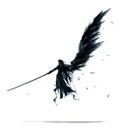
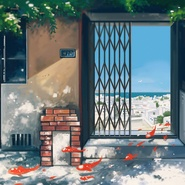
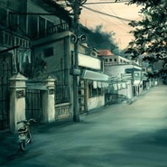

姚老师
============================

|  |  |
| :--: | :-- |
| [ 姚老师](https://i.xiami.com/phounius) | **地区**: China 中国大陆 **风格**: 器乐独奏 Solo Instrumental, 轻音乐 Easy Listening, 同人音乐 DouJin, 键盘音乐 Keyboard, 日本动漫游戏 Japanese ACG **播放数**: 2643708 **粉丝数**: 1131 **评论数**: 49  |

## 档案

## 专辑

| 名称 | 语种 | 唱片公司 | 发行时间 | 专辑类别 | 专辑风格 |
| :--: | :-- | :-- | :-- | :-- | :-- |
| [ ALL THAT FATEop/ed 串烧](./albums/2103868922.md) | 其他 | 独立发行 | 2018年07月29日 | EP, 单曲 | 器乐独奏 Solo Instrumental, 日本动漫游戏 Japanese ACG, 同人音乐 DouJin |
| [ プレリュード Final Fantasy Dissidia bgmCover まらしぃ](./albums/2103866768.md) | 纯音乐 | 独立发行 | 2018年07月29日 | EP, 单曲 | 器乐独奏 Solo Instrumental |
| [ 慢慢喜欢你 钢琴版Cover 莫文蔚](./albums/2103864835.md) | 纯音乐 | 独立发行 | 2018年07月28日 | EP, 单曲 | 器乐独奏 Solo Instrumental |
| [ I'm in Love 钢琴版Cover Ra.D](./albums/2102801370.md) | 其他 | 独立发行 | 2017年07月22日 | 录音室专辑 | 轻音乐 Easy Listening, 新世纪音乐 New Age, 器乐独奏 Solo Instrumental |
| [ YOU & 夏影 钢琴连奏](./albums/2100357358.md) | 其他 | 独立发行 | 2016年06月22日 | EP, 单曲 | 器乐独奏 Solo Instrumental, 同人音乐 DouJin |
| [ 龙猫 双钢琴版My Neighbour Totoro (Two Pianos Ver.)](./albums/2100357377.md) | 其他 | 独立发行 | 2016年05月25日 | EP, 单曲 | 器乐独奏 Solo Instrumental, 同人音乐 DouJin |
| [ IPhone 马林巴琴钢琴即兴曲](./albums/2100279114.md) | 其他 | 独立发行 | 2015年08月28日 | EP, 单曲 | 器乐独奏 Solo Instrumental, 轻音乐 Easy Listening |
| [ ALL IN ONE 动漫金曲串烧纪念数码宝贝15周年](./albums/632357378.md) | 其他 | 独立发行 | 2015年05月20日 | EP, 单曲 | 同人音乐 DouJin |
| [ 风居住的街道钢琴版](./albums/2100279080.md) | 其他 | 独立发行 | 2015年03月07日 | EP, 单曲 | 器乐独奏 Solo Instrumental, 轻音乐 Easy Listening |

## 评论

|  |  |  |
| :-- | :-- | :-- |
|  [虾米用户](https://emumo.xiami.com/u/405856882) 晨钟暮鼓，安之若素 2020-10-23 11:59 赞(2) 踩(0) | 
风居住的街道 钢琴版里你的是最好的 听哭多少次了
 |
|  [虾米用户](https://emumo.xiami.com/u/229483448)   2020-03-07 12:47 赞(1) 踩(0) | 
all that fate有纯钢琴版的吗？我记得以前有来着，怎么虾米上找不到了？
 |
|  [虾米用户](https://emumo.xiami.com/u/411220544)  2020-03-07 10:34 赞(3) 踩(0) | 
求风居住的街道谱子
 |
|  [虾米用户](https://emumo.xiami.com/u/327948003)   2019-09-01 12:57 赞(1) 踩(0) | 
喜欢风居住的街道
 |
|  [虾米用户](https://emumo.xiami.com/u/324879742)   2019-06-05 18:04 赞(1) 踩(0) | 
.
 |
|  [虾米用户](https://emumo.xiami.com/u/234886) I SEE THE WI... 2019-05-04 10:15 赞(0) 踩(0) | 
大神，可以把《风居住的街道》谱子发给我吗？？？准备开始学这首曲子了
 |
|  [虾米用户](https://emumo.xiami.com/u/315285299) 我还没想好要写什么... 2018-03-20 20:00 赞(4) 踩(0) | 
如果你也喜欢黄昏
 |
|  [虾米用户](https://emumo.xiami.com/u/302390592)  2018-02-26 09:31 赞(2) 踩(0) | 
很好听，谢谢你。
 |
|  [虾米用户](https://emumo.xiami.com/u/129767690)  2017-12-25 15:51 赞(4) 踩(0) | 
听了风居住的街道我就来了 
 |
| ⇒ |  [虾米用户](https://emumo.xiami.com/u/46338953)  2018-08-02 19:01 赞(0) 踩(0) | 
我也是呢！
 |
| ⇒ |  [虾米用户](https://emumo.xiami.com/u/129767690)  2018-08-03 14:29 赞(0) 踩(0) | 
<q><b>芸儿l1说：</b></q>
 |
|  [虾米用户](https://emumo.xiami.com/u/9878283) 歌单很乱 将就听吧 新歌... 2017-10-27 20:24 赞(0) 踩(0) | 
什么的不说了！想嫁！
 |
|  [虾米用户](https://emumo.xiami.com/u/326859152)  2017-09-28 10:00 赞(3) 踩(0) | 
喜欢风居住的街道！
 |
|  [虾米用户](https://emumo.xiami.com/u/37165782) 钢琴20级 2017-07-26 10:58 赞(4) 踩(0) | 
华理校友，真厉害！真希望能有all in one的谱子，太美了！
 |
|  [虾米用户](https://emumo.xiami.com/u/306459889)  2017-06-22 08:49 赞(3) 踩(0) | 
喜欢
 |
|  [虾米用户](https://emumo.xiami.com/u/306459889)  2017-06-22 08:48 赞(2) 踩(0) | 
龙猫双钢好听，跪求谱
 |
|  [虾米用户](https://emumo.xiami.com/u/11724710)   2017-05-06 09:04 赞(0) 踩(0) | 
周末的早上起床听，心情觉得舒畅，加油
 |
|  [虾米用户](https://emumo.xiami.com/u/116459930) 音乐伴我重生！ 2017-05-02 22:25 赞(0) 踩(0) | 
好听所以关注走一波
 |
|  [虾米用户](https://emumo.xiami.com/u/201391232) 最快的方法是先抱抱 2017-04-14 00:28 赞(0) 踩(0) | 
Ｇｅｔ
 |
|  [虾米用户](https://emumo.xiami.com/u/49582465)   2017-04-03 20:43 赞(1) 踩(0) | 
姚学长！！！
 |
|  [虾米用户](https://emumo.xiami.com/u/49812580) 无定向间接性全身机能失调... 2017-03-28 19:07 赞(1) 踩(0) | 
作者阿 为什么网易云没有这首歌！感觉要是在网易云 早就火了阿
 |
|  [虾米用户](https://emumo.xiami.com/u/188174778)  2016-11-29 19:33 赞(0) 踩(0) | 
加油
 |
|  [虾米用户](https://emumo.xiami.com/u/39109295) 所爱隔山海，山海不可平。 2016-08-19 21:11 赞(0) 踩(0) | 
Demo真的好美。 每次听到不管心情怎样都会马上变好。 而且总觉得旋律很熟悉总想唱出来呢。 谢谢这样的音乐出现，更谢谢创作者
 |
|  [虾米用户](https://emumo.xiami.com/u/115779146) 你若盛开  清风自来 2016-08-12 12:30 赞(0) 踩(0) | 
钢琴王子！居然能在虾米听到姚学长的曲子真的是又惊喜又感动～毕竟高考结束听了一整个暑假～
 |
|  [虾米用户](https://emumo.xiami.com/u/13719815)  2016-07-21 16:40 赞(0) 踩(0) | 
牛逼的钢琴 对动漫歌曲有自己的理解
 |
|  [虾米用户](https://emumo.xiami.com/u/116946920)   2016-04-23 16:52 赞(0) 踩(0) | 
喜欢
 |
|  [虾米用户](https://emumo.xiami.com/u/8424657) 海岸线 2016-03-12 18:56 赞(0) 踩(0) | 

 |
|  [虾米用户](https://emumo.xiami.com/u/42820440)   2016-01-27 05:27 赞(1) 踩(0) | 
简直赞
 |
|  [虾米用户](https://emumo.xiami.com/u/20980316)   2016-01-10 17:21 赞(2) 踩(0) | 
我能把all in one 转载到b站上么，求同意
 |
|  [虾米用户](https://emumo.xiami.com/u/97424456)  2016-01-04 17:14 赞(0) 踩(0) | 
好牛的啊
 |
|  [虾米用户](https://emumo.xiami.com/u/97424456)  2016-01-04 17:13 赞(0) 踩(0) | 
all  in  one有谱子吗，给我一份呗，谢谢
 |
|  [虾米用户](https://emumo.xiami.com/u/4400366) 再也不见 2015-11-20 19:28 赞(0) 踩(0) | 
囍
 |
|  [虾米用户](https://emumo.xiami.com/u/46908865)  2015-11-15 22:58 赞(0) 踩(0) | 
头像很可爱嘛。不会是个小朋友吧。
 |
|  [虾米用户](https://emumo.xiami.com/u/48108534)  2015-08-17 20:10 赞(4) 踩(0) | 

 |
|  [虾米用户](https://emumo.xiami.com/u/50452182)   2015-05-30 23:12 赞(0) 踩(0) | 
喜欢安安静静的听每一首歌，感受每一次的感动，继续加油，永远支持哟！！
 |
|  [虾米用户](https://emumo.xiami.com/u/44131609)  2015-05-26 15:01 赞(1) 踩(0) | 
可以把你的主题曲DEMO谱子发给我吗？很喜欢你的歌！
 |
| ⇒ |  [虾米用户](https://emumo.xiami.com/u/39788841)  . 2015-07-21 14:25 赞(0) 踩(0) | 
<q><b>说：</b></q>
 |
| ⇒ |  [虾米用户](https://emumo.xiami.com/u/20980316)   2016-01-19 02:43 赞(0) 踩(0) | 
<q><b>说：</b></q>
 |
|  [虾米用户](https://emumo.xiami.com/u/7859162) 就算是我最开心的时候，也... 2015-05-21 23:43 赞(0) 踩(0) | 
很喜欢这种优雅的曲风，期待你的更多作品哦~
 |
|  [虾米用户](https://emumo.xiami.com/u/27773429) 爱我 2015-05-13 00:17 赞(0) 踩(0) | 
2015/03/13_主题曲DEMO——今晚偶然听到这个，超好听~
 |
|  [虾米用户](https://emumo.xiami.com/u/3897127) 这家伙很聪明什么都没留下 2015-05-07 18:10 赞(0) 踩(0) | 
姚总~赞赞的~期待更多作品
 |
|  [虾米用户](https://emumo.xiami.com/u/45947999)  2015-05-05 13:48 赞(0) 踩(0) | 
很喜欢这种感觉与风格呐，老板很棒，加油！！
 |
|  [虾米用户](https://emumo.xiami.com/u/42870241) 百無禁忌 2015-03-25 18:34 赞(0) 踩(0) | 
很棒 无意戳进来的
 |
|  [虾米用户](https://emumo.xiami.com/u/48354637)  2015-03-24 17:18 赞(0) 踩(0) | 
钢琴王子.....
 |
|  [虾米用户](https://emumo.xiami.com/u/30198325)  2015-03-10 13:52 赞(0) 踩(0) | 
姚总好
 |
|  [虾米用户](https://emumo.xiami.com/u/48002981)   2015-03-10 13:47 赞(0) 踩(0) | 
呀～男神帮帮哒！小粉丝尾随前来
 |
|  [虾米用户](https://emumo.xiami.com/u/28190484) ♡voice♡melod... 2015-03-10 12:58 赞(0) 踩(0) | 
yao男神入驻虾米了
 |
|  [虾米用户](https://emumo.xiami.com/u/41641418)  2015-03-10 12:54 赞(0) 踩(0) | 
大大好！
 |
|  [虾米用户](https://emumo.xiami.com/u/4855774) 笑嘻嘻 2015-01-17 00:01 赞(0) 踩(0) | 
听歌快乐
 |
