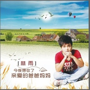

今夜想你了亲爱的爸爸妈妈
============================

|  |  |
| :--: | :-- |
| [ 今夜想你了亲爱的爸爸妈妈](https://emumo.xiami.com/album/2103574537) | **艺人**: [乐天](../index.md) **语种**: 国语 **唱片公司**: 独立发行 **发行时间**: 2018年03月02日 **专辑类别**: EP, 单曲 **专辑风格**: 国语流行 Mandarin Pop **播放数**: 2777 **收藏数**: 0 **评论数**: 0  |

## 简介

  
 

写了很多流行情歌，随着时间推移，品味不同人生还有更重要的感情需要用音乐去诠释，那就是从小到大伴随我们成长的“亲情”。每当想起《格言联璧》里的“为人父母天下至善；为人子女天下大孝”的诗句，自己很想用心创作一首亲情歌曲送给自己的爸爸妈妈，感恩他们对自己的养育和陪伴。同时他希望通过歌曲《今夜想你了亲爱的妈妈爸爸》，呼吁那些在外的游子，无论工作再忙也别忘了给父母多一点陪伴，尽到自己的一份孝心，并祝每一个家庭幸福美满，阖家欢乐。
 

 
 

 

## 曲目

## 评论

|  |  |  |  |
| :-- | :-- | :-- | :-- |
