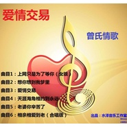

曾水付
============================

|  |  |
| :--: | :-- |
| [ 曾水付](https://i.xiami.com/zsf1088) | **播放数**: 2620276 **粉丝数**: 106 **评论数**: 8 **地区**: China 中国大陆 **风格**:   |

## 档案

大陆原创音乐歌手，以伤感路线走红，代表作品有（为什么爱到尽头却是分手）（上网只是为了等你）（没有怪过谁）等

## 专辑

| 名称 | 语种 | 唱片公司 | 发行时间 | 专辑类别 | 专辑风格 |
| :--: | :-- | :-- | :-- | :-- | :-- |
| [ 我的爱你不配](./albums/2105164310.md) | 国语 | 推星传媒 | 2019年08月06日 | EP, 单曲 |  |
| [ 感谢你成为我的依靠](./albums/2104999032.md) | 国语 | 推星传媒 | 2019年07月16日 | EP, 单曲 |  |
| [ 不会再挽留](./albums/2104912392.md) | 国语 | 推星传媒 | 2019年05月17日 | EP, 单曲 |  |
| [ 你就是我今生最美的遇见曾氏情歌](./albums/2104594438.md) | 国语 | 独立发行 | 2019年02月13日 | 录音室专辑 | 流行 Pop |
| [ 爱情交易曾氏情歌](./albums/2102967644.md) | 国语 | 独立发行 | 2017年12月06日 | 录音室专辑 | 国语流行 Mandarin Pop |
| [ 不再为你流一滴泪曾氏情歌](./albums/2102676490.md) | 国语 | 独立发行 | 2017年01月05日 | 录音室专辑 | 流行 Pop |
| [ 悲催的泪曾氏情歌](./albums/2100321722.md) | 国语 | 独立发行 | 2016年04月25日 | 录音室专辑 | 国语流行 Mandarin Pop |
| [ 爱你不能失去你曾氏情歌](./albums/2100291648.md) | 国语 | 独立发行 | 2016年03月12日 | 录音室专辑 | 流行说唱 Pop Rap, 国语流行 Mandarin Pop |
| [ 告诉自己不许哭曾氏情歌](./albums/2100243150.md) | 国语 | 独立发行 | 2015年12月01日 | 录音室专辑 | 流行说唱 Pop Rap, 国语流行 Mandarin Pop |
| [ 选择忘记曾氏情歌](./albums/2100216770.md) | 国语 | 独立发行 | 2015年10月11日 | 录音室专辑 | 流行说唱 Pop Rap, 流行摇滚 Pop Rock, 国语流行 Mandarin Pop |
| [ 痴心的人最可悲曾氏情歌](./albums/2100191004.md) | 国语 | 独立发行 | 2015年09月05日 | 录音室专辑 | 流行说唱 Pop Rap, 流行摇滚 Pop Rock, 国语流行 Mandarin Pop |
| [ 我走了你别后悔曾氏情歌](./albums/2100174002.md) | 国语 | 独立发行 | 2015年08月03日 | 录音室专辑 | 流行摇滚 Pop Rock, 独立电子乐 Indietronica, 国语流行 Mandarin Pop |
| [ 没有怪过谁曾氏情歌](./albums/434768836.md) | 国语 | 独立发行 | 2015年06月20日 | 录音室专辑 | 国语流行 Mandarin Pop, 华语唱作人 Chinese Singer-Songwriter |
| [ 难道我只是你今生的过客曾氏情歌](./albums/1933734486.md) | 国语 | 独立发行 | 2015年06月08日 | 录音室专辑 | 流行说唱 Pop Rap, 国语流行 Mandarin Pop, 华语唱作人 Chinese Singer-Songwriter |

## 评论

|  |  |  |  |
| :-- | :-- | :-- | :-- |
|  [虾米用户](https://emumo.xiami.com/u/271169707) 找个爱人的啊 2018-05-19 12:34 赞(1) 踩(0) | 
你好棒哒好听      
 |
|  [虾米用户](https://emumo.xiami.com/u/293692544) 你敢给我说话吗？我咬你 2017-12-22 17:35 赞(2) 踩(0) | 
好听
 |
|  [虾米用户](https://emumo.xiami.com/u/293692544) 你敢给我说话吗？我咬你 2017-12-09 17:39 赞(3) 踩(0) | 
好听
 |
|  [虾米用户](https://emumo.xiami.com/u/289883200)  2017-04-19 21:09 赞(3) 踩(0) | 
很有意义，真心好听
 |
|  [虾米用户](https://emumo.xiami.com/u/285460097)  2017-04-04 19:10 赞(4) 踩(0) | 
不用谢！应该的，嘻嘻我喜欢你唱的歌。谢谢  
 |
|  [虾米用户](https://emumo.xiami.com/u/265743116)  2017-02-23 14:48 赞(2) 踩(0) | 
歌曲真的很好听。 
 |
| ⇒ |  [虾米用户](https://emumo.xiami.com/u/285360577)  2017-04-02 15:35 赞(0) 踩(0) | 
我也姓曾，喜欢你的歌        
 |
|  [虾米用户](https://emumo.xiami.com/u/48252035)  2015-06-05 10:16 赞(4) 踩(0) | 
我刚入驻了虾米音乐人，欢迎大家来我的个人主页，收听我的最新音乐
 |
