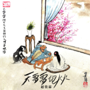
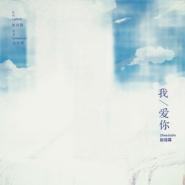

赵佳霖
============================

|  |  |
| :--: | :-- |
| [ 赵佳霖](https://i.xiami.com/zhaoliangh) | **地区**: China 中国大陆 **风格**: 流行摇滚 Pop Rock, 民谣 Folk, 国语流行 Mandarin Pop **播放数**: 33604119 **粉丝数**: 417 **评论数**: 25  |

## 档案

音乐制作人、歌手。 
筷子兄弟《小苹果》编曲/制作人 
电视剧《琅琊榜》插曲《红颜旧》作曲/制作人

## 专辑

| 名称 | 语种 | 唱片公司 | 发行时间 | 专辑类别 | 专辑风格 |
| :--: | :-- | :-- | :-- | :-- | :-- |
| [ 我那么想你](./albums/5021971205.md) | 国语 | 川合音乐 | 2020年11月23日 | EP, 单曲 | 国语流行 Mandarin Pop |
| [ 下一站希望](./albums/5021476682.md) | 国语 | 川合音乐 | 2020年09月25日 | EP, 单曲 | 国语流行 Mandarin Pop |
| [ 天雷雷地火火](./albums/5021206071.md) | 国语 | 川合音乐 | 2020年08月03日 | EP, 单曲 | 国语流行 Mandarin Pop |
| [ 多少](./albums/5021143528.md) | 国语 | 川合音乐 | 2020年07月24日 | EP, 单曲 | 国语流行 Mandarin Pop |
| [ 我爱你](./albums/2105703650.md) | 国语 | 大格娱乐 | 2020年01月15日 | EP, 单曲 | 国语流行 Mandarin Pop |
| [ 光影铭刻](./albums/2104298917.md) | 国语 | 新律文化 | 2018年11月29日 | EP, 单曲 | 国语流行 Mandarin Pop |
| [ 长安乱（《喜乐长安》主题曲）](./albums/5020983379.md) | 国语 | 北京大格娱乐文化有限公司 | 2016年03月17日 | EP, 单曲 | 流行 Pop |
| [ 难听的歌](./albums/2100254226.md) | 国语 | 乐享天承 | 2016年01月04日 | EP, 单曲 | 国语流行 Mandarin Pop, 华语唱作人 Chinese Singer-Songwriter |
| [ 爱上幼儿园](./albums/2100239856.md) | 国语 | 独立发行 | 2015年11月20日 | 原声带, 影视音乐 | 国语流行 Mandarin Pop |
| [ 红颜旧 琅琊榜电视原声插曲](./albums/2100218822.md) | 国语 | 独立发行 | 2015年10月14日 | EP, 单曲 | 电视原声 Television Music, 古风 GuFeng Music |
| [ 难听的歌(单人版)](./albums/1701476114.md) | 国语 | 独立发行 | 2014年05月31日 | EP, 单曲 | 国语流行 Mandarin Pop, 华语唱作人 Chinese Singer-Songwriter |
| [ 龙腾剑](./albums/2000818459.md) | 国语 | 独立发行 | 2014年05月23日 | 原声带, 影视音乐 | 流行摇滚 Pop Rock |
| [ 我要穿秋裤](./albums/1581984711.md) | 国语 | 独立发行 | 2013年10月17日 | EP, 单曲 |  |

## 评论

|  |  |  |
| :-- | :-- | :-- |
|  [虾米用户](https://emumo.xiami.com/u/116847352)  2021-01-18 07:55 赞(0) 踩(0) | 
        
 |
|  [虾米用户](https://emumo.xiami.com/u/358104299) 悲观的唯心存在现实解构虚... 2020-05-09 10:51 赞(0) 踩(0) | 
41064
 |
|  [虾米用户](https://emumo.xiami.com/u/434152246) 聪明少一些大智慧多一些，... 2020-02-11 21:40 赞(0) 踩(0) | 

 |
|  [虾米用户](https://emumo.xiami.com/u/434152246) 聪明少一些大智慧多一些，... 2020-02-09 16:10 赞(1) 踩(0) | 

 |
|  [虾米用户](https://emumo.xiami.com/u/6873363)  2018-12-01 21:24 赞(0) 踩(0) | 
g?n'.f/ddh/x?hg./ ;lk,lbn; op bpgti96
 |
|  [虾米用户](https://emumo.xiami.com/u/405590637)  2018-11-23 18:02 赞(0) 踩(0) | 
这首用萧深情演绎的红颜旧，刚开始特别特别的惊艳，它千回百转，柔肠寸断，一年多以来，一直是我的手机铃声。也许小苹果能给你带来很多的经济效益，但是我想说，佳霖，这才是你真正的灵魂。在这个纷乱繁杂的世界，不要丢失了自己，佳霖，加油！
 |
|  [虾米用户](https://emumo.xiami.com/u/309284171)  2018-08-07 17:04 赞(3) 踩(0) | 
没想到你是个汉子，一直以为你是女儿身，这么哀婉戚恻的歌，好歌
 |
|  [虾米用户](https://emumo.xiami.com/u/9159766) 我还没想好要写什么... 2018-01-21 14:57 赞(0) 踩(0) | 
既然你也叫佳霖
 |
|  [虾米用户](https://emumo.xiami.com/u/4711333) 我还没想好要写什么... 2017-10-30 10:20 赞(1) 踩(0) | 
太好听了,终于出了.表示电视剧播放期间一直在搜啊....这个实在太好听了,一开始只是在北京台预告出现过,疯狂找都未果. 期待更多ost的流出.
 |
|  [虾米用户](https://emumo.xiami.com/u/246918623)  2017-09-21 22:06 赞(1) 踩(0) | 
老同学！加油！！
 |
|  [虾米用户](https://emumo.xiami.com/u/38181906)  2016-06-02 13:53 赞(0) 踩(0) | 
爱上幼儿园旋律很清新，朗朗上口挺好听
 |
|  [虾米用户](https://emumo.xiami.com/u/38181906)  2016-06-02 12:02 赞(1) 踩(0) | 
这是不是有问题，封面是男的，演唱者是女的声音？
 |
| ⇒ |  [虾米用户](https://emumo.xiami.com/u/2701140)  2016-07-13 23:46 赞(0) 踩(0) | 
作曲  演唱     曲目有曲目艺术家
 |
| ⇒ |  [虾米用户](https://emumo.xiami.com/u/405590637)  2018-11-23 17:56 赞(0) 踩(0) | 
<q><b>Kloisiie说：</b></q>
 |
|  [虾米用户](https://emumo.xiami.com/u/9943562) 多数盗版碟在02年发行 2015-11-23 00:19 赞(0) 踩(0) | 
我在想，这张要不要也归属过来…… <a href="http://www.xiami.com/album/632886443" target="_blank" rel="nofollow noreferrer noopener">http://www.xiami.com/album/632886443</a>  <a href="http://emumo.xiami.com/u/5737411" target="_blank" rel="nofollow" name_card="5737411">@大莱</a> <a href="http://emumo.xiami.com/u/41190273" target="_blank" rel="nofollow" name_card="41190273">@爆棚的傲娇气</a>
 |
| ⇒ |  [虾米用户](https://emumo.xiami.com/u/18282119) 我就是我，独一无二 2016-04-22 12:13 赞(0) 踩(0) | 
小苹果的编曲就是他。
 |
|  [虾米用户](https://emumo.xiami.com/u/73254240) 梧桐树，三更雨，不道离情... 2015-11-03 20:25 赞(0) 踩(0) | 
加油
 |
|  [虾米用户](https://emumo.xiami.com/u/355865) Let it go, l... 2015-10-18 13:15 赞(0) 踩(0) | 
重返十七岁，写的不错～
 |
|  [虾米用户](https://emumo.xiami.com/u/547627) 一台漫游银河系的机器人 2015-10-14 09:12 赞(8) 踩(0) | 
马上就要到穿秋裤的季节了哇``(#￣▽￣#)``
 |
|  [虾米用户](https://emumo.xiami.com/u/4189102) 我是我。 2015-02-27 18:18 赞(0) 踩(0) | 
编曲哈哈哈哈哈哈哈哈
 |
|  [虾米用户](https://emumo.xiami.com/u/44206499)  2014-11-30 22:59 赞(0) 踩(0) | 
好棒诶广播站决定播这个
 |
|  [虾米用户](https://emumo.xiami.com/u/2653771) 嘿 2014-06-16 22:33 赞(1) 踩(0) | 
是《小苹果》的编曲赵佳霖？<a href="http://www.xiami.com/song/1773228254" target="_blank" rel="nofollow noreferrer noopener">http://www.xiami.com/song/1773228254</a>
 |
| ⇒ |  [虾米用户](https://emumo.xiami.com/u/18282119) 我就是我，独一无二 2015-04-16 20:52 赞(0) 踩(0) | 
是滴。
 |
|  [虾米用户](https://emumo.xiami.com/u/9741887)  2013-07-16 10:21 赞(0) 踩(0) | 
没有demo。。。。。。
 |
