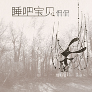

睡吧 宝贝
============================

|  |  |
| :--: | :-- |
| [ 睡吧 宝贝](https://emumo.xiami.com/album/2100390751) | **艺人**: [侃侃](../index.md) **语种**: 国语 **唱片公司**: 星外星音乐 **发行时间**: 2016年09月20日 **专辑类别**: 录音室专辑 **专辑风格**:  **播放数**: 426937 **收藏数**: 341 **评论数**: 79  |

## 简介

充满西部色彩的女声民歌，在歌声的风景中摇曳，颠覆了以往我们对西部特色民歌的看法，原来这些民歌是如此亲切动人。歌手侃侃，一个来自南方水乡的姑娘，在这些歌曲中展示了自己演唱的功底。整张专辑没有华丽、只有清新。吉他、手风琴与人声缠绵交织，让人听后回味无穷。配器上非常简约，女声的娓娓道来，伴奏仿佛是萦绕在周围的芳香，在声部定位和录音技术上，都体现出精良的层次感。哈萨克、蒙古等民族的民歌，经过重新改编，更具别样的风情。侃侃的柔声倾诉，加之拨弦、伴唱，在夜晚听来这就是一首首动人的小夜曲。专辑的每首歌曲对比原作都有较大的突破，例如《吉尔拉》把速度降缓，别出心裁，少了诙谐，但是多了深远。在喧闹的城市中，也许正需要这样温馨的声音，能让我们每一个人都聆听徜徉在这心扉静寂的音乐花园里。

## 曲目

- [花儿额济纳蒙古民歌](./2100390751/8G4Cj8edacb.md)
- [山峰 (哈萨克语)哈萨克民歌](./2100390751/mQYE6z78c71.md)
- [白桦林维吾尔民歌](./2100390751/mQYE608d47e.md)
- [故乡哈萨克民歌](./2100390751/8G4CjBf4175.md)
- [吉尔拉塔塔尔民歌](./2100390751/8G4CjC25bca.md)
- [母亲图瓦民歌](./2100390751/mQYE6371d31.md)
- [睡吧宝贝  (哈萨克语)哈萨克民歌](./2100390751/xLJDvea867c.md)
- [疼爱俄罗斯民歌](./2100390751/mQYE659223f.md)
- [白色的巴彦哈萨克民歌](./2100390751/bqv670a36b91.md)
- [患难与共的朋友](./2100390751/8G4CjHe2418.md)
- [猎人](./2100390751/8G4CjIf9e70.md)
- [睡吧宝贝 (清唱版)哈萨克民歌](./2100390751/xLJDvjc1b16.md)

## 评论

|  |  |  |  |
| :-- | :-- | :-- | :-- |
|  [虾米用户](https://emumo.xiami.com/u/412464867)  2019-06-15 06:44 赞(0) 踩(0) | 
听了十年侃侃的歌才花了10块钱，感觉还欠你的 
 |
|  [虾米用户](https://emumo.xiami.com/u/246602186)  2018-11-21 11:00 赞(0) 踩(0) | 
侃侃，我欠你一张CD
 |
|  [虾米用户](https://emumo.xiami.com/u/246602186)  2018-09-07 15:54 赞(0) 踩(0) | 
这10块花的值！！！！
 |
|  [虾米用户](https://emumo.xiami.com/u/8337431) 以乐会友 2018-07-08 21:02 赞(0) 踩(0) | 
支持新专和新的尝试75
 |
|  [虾米用户](https://emumo.xiami.com/u/96308462)  2017-08-22 12:49 赞(0) 踩(0) | 
侃侃从前发行的每一首歌我都觉得特别好听，相信这专辑也不例外。
 |
|  [虾米用户](https://emumo.xiami.com/u/286500231)  2017-04-28 00:48 赞(0) 踩(0) | 
  
 |
|  [虾米用户](https://emumo.xiami.com/u/206526326) 歌能清晰mind 2017-03-28 23:51 赞(0) 踩(0) | 
大爱
 |
|  [虾米用户](https://emumo.xiami.com/u/50485736)   2017-02-27 12:54 赞(1) 踩(0) | 
清幽，婉转，悠长。最爱听故乡一首。
 |
|  [虾米用户](https://emumo.xiami.com/u/407745) 音乐音乐 2016-12-27 13:39 赞(0) 踩(0) | 
对于想听的音乐，第一时间就是购买了再听。不管是否给试听。毕竟也不贵。
 |
| ⇒ |  [虾米用户](https://emumo.xiami.com/u/3745142)  2018-10-29 09:27 赞(0) 踩(0) | 
老板，199.80元/张，如果不喜欢怎么办，应该有试听才行。
 |
|  [虾米用户](https://emumo.xiami.com/u/125903446)  2016-12-15 15:03 赞(0) 踩(0) | 
诗一样的歌词，悠扬古老的节奏。10元真是超值，其实只是偶尔在搜索睡吧宝贝，想听摇篮曲的，没想到淘到宝了。真希望有更多这样的好音乐和音乐人出来！
 |
|  [虾米用户](https://emumo.xiami.com/u/45986407)  2016-11-20 02:03 赞(1) 踩(0) | 
210..希望喜欢侃侃的人都能购买，，这样才能有更多的作品～～
 |
|  [虾米用户](https://emumo.xiami.com/u/243099126)  2016-11-05 16:58 赞(0) 踩(0) | 
不好
 |
|  [虾米用户](https://emumo.xiami.com/u/12880377)  2016-10-21 08:22 赞(0) 踩(0) | 
有点安睡的感觉
 |
|  [虾米用户](https://emumo.xiami.com/u/3300801)  2016-10-04 09:02 赞(0) 踩(0) | 
正版签名CD 已经上架了有需要的自己想办法联系组织www.kkmusic.org/hi
 |
|  [虾米用户](https://emumo.xiami.com/u/228316255)  2016-09-30 12:50 赞(2) 踩(0) | 
水是脑残粉，哈哈哈
 |
| ⇒ |  [虾米用户](https://emumo.xiami.com/u/3300801)  2016-10-04 08:59 赞(0) 踩(0) | 
这么多的回复我就服你哈哈哈
 |
| ⇒ |  [虾米用户](https://emumo.xiami.com/u/229162451)  2016-12-29 22:20 赞(0) 踩(0) | 

 |
|  [虾米用户](https://emumo.xiami.com/u/197844301)  2016-09-29 01:42 赞(0) 踩(0) | 
果断购买只为听你8年歌声
 |
|  [虾米用户](https://emumo.xiami.com/u/228316255)  2016-09-28 20:50 赞(1) 踩(0) | 
超级喜欢吉尔拉的蚂蚁蚂蚁 
 |
| ⇒ |  [虾米用户](https://emumo.xiami.com/u/3300801)  2016-10-04 09:00 赞(0) 踩(0) | 
蚂蚁牙黑 他看不见
 |
|  [虾米用户](https://emumo.xiami.com/u/6652575) mbz2006 2016-09-28 16:01 赞(1) 踩(0) | 
ok
 |
|  [虾米用户](https://emumo.xiami.com/u/230817785)  2016-09-28 15:14 赞(1) 踩(0) | 
猎人，回味好长！
 |
|  [虾米用户](https://emumo.xiami.com/u/229178568)  2016-09-27 10:06 赞(1) 踩(0) | 
果断买，还是有点晚，排位112 继续等光碟！
 |
|  [虾米用户](https://emumo.xiami.com/u/228349187)  2016-09-26 14:36 赞(0) 踩(0) | 
睡觉听哄娃听催眠镇静效果岗岗的
 |
|  [虾米用户](https://emumo.xiami.com/u/8244559)  2016-09-26 09:26 赞(0) 踩(0) | 
******
 |
|  [虾米用户](https://emumo.xiami.com/u/125756880)  2016-09-24 13:17 赞(1) 踩(0) | 
很好听的音乐，我喜欢
 |
|  [虾米用户](https://emumo.xiami.com/u/229433477)  2016-09-24 10:52 赞(1) 踩(0) | 
很动听的旋律，有种安详幸福的感觉。我很喜欢
 |
|  [虾米用户](https://emumo.xiami.com/u/229395045)  2016-09-24 08:27 赞(1) 踩(0) | 
听着很不错的音乐，非常舒缓轻柔。音色很美。词也写的棒。
 |
|  [虾米用户](https://emumo.xiami.com/u/43199225)  2016-09-24 08:25 赞(2) 踩(0) | 
试听了”睡吧 宝贝”后果断买了！这真是值得收藏的一张专辑!
 |
| ⇒ |  [虾米用户](https://emumo.xiami.com/u/228316255)  2016-09-28 20:46 赞(0) 踩(0) | 
灰灰啊 
 |
|  [虾米用户](https://emumo.xiami.com/u/79508364)  2016-09-24 00:04 赞(1) 踩(0) | 
唱的真不错，很喜欢，我很喜欢，听着就是舒服！
 |
|  [虾米用户](https://emumo.xiami.com/u/229317989)  2016-09-23 22:31 赞(1) 踩(0) | 
听着很舒缓，睡前必听，女声有一种安心的感觉
 |
|  [虾米用户](https://emumo.xiami.com/u/229238838)  2016-09-23 19:12 赞(1) 踩(0) | 
好听，第一次听付费歌曲呢！  
 |
|  [虾米用户](https://emumo.xiami.com/u/3300801)  2016-09-23 18:15 赞(3) 踩(0) | 
《睡吧宝贝》整张专辑为你讲述了一个完整的爱情故事思念家乡想念母亲思念丈夫疼爱孩子！一个花儿般美丽的姑娘 离开有着圣杰的湖水蓝的天纯洁白色的巴彦远嫁他乡！哄着孩子睡觉唱着摇篮曲想起自己的母亲， 每次拉着母亲的手就回到小时候，母亲 唱着摇篮曲睡吧宝贝哄着自己的情景！一朵花一粒沙都明白被疼爱很愉快！母亲思念女儿在村口小溪旁盼望女儿回来！天上的云也睡了，树上的叶子也睡了！想起远方丈夫弹唱着吉尔拉聚会时幸福的情景这个时候也该睡着了！他的骏马也睡了！妻子和孩子等着你回来！自己的母亲也等一家人回去！人和人或许里就这样相互着等待吧！睡吧宝贝！睡吧！天上的星星睡了！花儿也睡了！睡吧宝贝！
 |
|  [虾米用户](https://emumo.xiami.com/u/229211046)  2016-09-23 17:46 赞(0) 踩(0) | 
歌曲非常好听，推荐大家听听，音质非常好，好音乐大力支持！
 |
|  [虾米用户](https://emumo.xiami.com/u/24961897)  2016-09-23 16:59 赞(2) 踩(0) | 
很喜欢听
 |
|  [虾米用户](https://emumo.xiami.com/u/36747702) 要么忍，要么残忍！ 2016-09-23 15:12 赞(3) 踩(0) | 
好听，喜欢！听完一首还想听所有，果断买全张      
 |
| ⇒ |  [虾米用户](https://emumo.xiami.com/u/3300801)  2016-09-23 18:26 赞(0) 踩(0) | 
干的漂浪
 |
|  [虾米用户](https://emumo.xiami.com/u/44435770) 我还没想好要写什么... 2016-09-22 21:12 赞(2) 踩(0) | 
一口气买了两张 
 |
| ⇒ |  [虾米用户](https://emumo.xiami.com/u/3300801)  2016-09-24 09:30 赞(0) 踩(0) | 
什么节奏？
 |
|  [虾米用户](https://emumo.xiami.com/u/54505469)  2016-09-22 20:43 赞(1) 踩(0) | 

 |
|  [虾米用户](https://emumo.xiami.com/u/228821687)  2016-09-22 11:10 赞(1) 踩(0) | 
光侃侃这两个字就超值，不了解的可以去听听她的其他歌，喜欢是没办法的事，有些事是强求不了的！
 |
|  [虾米用户](https://emumo.xiami.com/u/103639920) 生活有点酷 2016-09-22 09:29 赞(2) 踩(0) | 
滴答滴，滴答滴答滴答滴
 |
|  [虾米用户](https://emumo.xiami.com/u/13119103)   2016-09-22 00:46 赞(0) 踩(0) | 
没有试听我不知道我想不想买
 |
| ⇒ |  [虾米用户](https://emumo.xiami.com/u/218818746)  2016-09-22 08:14 赞(0) 踩(0) | 
睡吧 宝贝 是免费试听的
 |
|  [虾米用户](https://emumo.xiami.com/u/189957)  2016-09-21 20:32 赞(1) 踩(0) | 
铁杆粉丝
 |
|  [虾米用户](https://emumo.xiami.com/u/9270434) 桃花运余额不足 2016-09-21 12:42 赞(0) 踩(0) | 
年费会员至少得能试听吧，不然买你会员干啥用？为了情怀？
 |
|  [虾米用户](https://emumo.xiami.com/u/8244559)  2016-09-21 12:24 赞(1) 踩(0) | 
******
 |
|  [虾米用户](https://emumo.xiami.com/u/3496718) idle space 2016-09-20 23:19 赞(1) 踩(0) | 
应该是一张好专辑~~~~
 |
|  [虾米用户](https://emumo.xiami.com/u/3496718) idle space 2016-09-20 23:18 赞(1) 踩(0) | 
应该是一张好专辑~~~~
 |
|  [虾米用户](https://emumo.xiami.com/u/3496718) idle space 2016-09-20 22:52 赞(0) 踩(0) | 
为什么其他的听不了的~~~~
 |
| ⇒ |  [虾米用户](https://emumo.xiami.com/u/218818746)  2016-09-22 08:14 赞(0) 踩(0) | 
其它需要付费，整张专辑10元。
 |
|  [虾米用户](https://emumo.xiami.com/u/228316255)  2016-09-20 22:33 赞(0) 踩(0) | 
好听，喜欢
 |
| ⇒ |  [虾米用户](https://emumo.xiami.com/u/3300801)  2016-09-21 15:44 赞(0) 踩(0) | 
每天听一听 健康好心情！睡吧 宝贝！：）
 |
|  [虾米用户](https://emumo.xiami.com/u/228385994)   2016-09-20 21:02 赞(1) 踩(0) | 
 终于等到新专辑
 |
|  [虾米用户](https://emumo.xiami.com/u/3300801)  2016-09-20 20:51 赞(2) 踩(0) | 
用心的民歌专辑
 |
|  [虾米用户](https://emumo.xiami.com/u/10434930)   2016-09-20 20:32 赞(1) 踩(0) | 
第一次听到侃侃是在古城的街道上，感觉蛮清新的。
 |
|  [虾米用户](https://emumo.xiami.com/u/228316255)  2016-09-20 18:53 赞(1) 踩(0) | 
我是铁杆粉 
 |
| ⇒ |  [虾米用户](https://emumo.xiami.com/u/3300801)  2016-09-20 20:46 赞(0) 踩(0) | 
我信！！
 |
| ⇒ |  [虾米用户](https://emumo.xiami.com/u/88359416) 无所畏惧……一路向前..... 2016-09-22 10:55 赞(0) 踩(0) | 
好吧
 |
|  [虾米用户](https://emumo.xiami.com/u/228346760)  2016-09-20 18:44 赞(1) 踩(0) | 
虾米音乐8小时前关注#阿里音乐推荐# 侃侃最新专辑《睡吧 宝贝》已正式发布！睡吧 宝贝充满西部色彩的女声民歌，在歌声的风景中摇曳，颠覆了以往我们对西部特色民歌的看法，原来这些民歌是如此亲切动人。歌手侃侃，一个来自南方水乡的姑娘，在这些歌曲中展示了自己演唱的功底。整张专辑没有华丽、只有清新。吉他、手风琴与人声缠绵交织，让人听后回味无穷。配器上非常简约，女声的娓娓道来，伴奏仿佛是萦绕在周围的芳香，在声部定位和录音技术上，都体现出精良的层次感。哈萨克、蒙古等民族的民歌，经过重新改编，更具别样的风情。侃侃的柔声倾诉，加之拨弦、伴唱，在夜晚听来这就是一首首动人的小夜曲。专辑的每首歌曲对比原作都有
 |
|  [虾米用户](https://emumo.xiami.com/u/228337340)  2016-09-20 18:15 赞(1) 踩(0) | 
先前听过故乡，非常好，所以来了
 |
|  [虾米用户](https://emumo.xiami.com/u/228298545)  2016-09-20 15:49 赞(2) 踩(0) | 
惊艳，十元的付费不止是给歌者的，也是灵魂的给养。
 |
|  [虾米用户](https://emumo.xiami.com/u/211605132)  2016-09-20 15:10 赞(9) 踩(0) | 
好音乐必须支持 
 |
|  [虾米用户](https://emumo.xiami.com/u/682046)  2016-09-20 14:28 赞(24) 踩(0) | 
关于试听这个，我是真心想买好音乐，但是不想买彩票。希望现在的音乐应用可以做一些新歌打榜的方式，跟电台一样，起码让我听听好不好听，才决定购买。我不是脑残粉，但我觉得五月天，田馥甄都算质量保证，一些没听过的歌手，我也真心想支持，但是喜欢的类型有限，希望能给机会试听一下。毕竟好歌不是只听一次的
 |
| ⇒ |  [虾米用户](https://emumo.xiami.com/u/103427238)  2016-09-20 15:01 赞(0) 踩(0) | 
谢谢认可我五只 
 |
| ⇒ |  [虾米用户](https://emumo.xiami.com/u/218818746)  2016-09-20 16:11 赞(0) 踩(0) | 
睡吧宝贝 哈萨克语版本是免费试听的
 |
| ⇒ |  [虾米用户](https://emumo.xiami.com/u/682046)  2016-09-20 16:44 赞(0) 踩(0) | 
<q><b>侃侃说：</b></q>
 |
| ⇒ |  [虾米用户](https://emumo.xiami.com/u/193662929)  2016-09-20 17:59 赞(0) 踩(0) | 
谢谢你认可我五只，认可我大信信
 |
| ⇒ |  [虾米用户](https://emumo.xiami.com/u/39776164)  2016-09-20 20:26 赞(0) 踩(0) | 
应该这样才对
 |
|  [虾米用户](https://emumo.xiami.com/u/18327100) 一张巨型的棉花 2016-09-20 12:44 赞(2) 踩(0) | 
讲真，如果连试听都没有了。音乐就真的只是个商品了
 |
| ⇒ |  [虾米用户](https://emumo.xiami.com/u/937423)   2016-09-20 13:48 赞(0) 踩(0) | 
唱片不是商品么？音乐人不需要吃饭么？音乐人以做音乐为生，音乐作品是商品，理所应当你免费试听了那么多年音乐，不感恩戴德，还谴责现在为什么不能免费试听了？你是干什么工作的，你的劳动成果如果免费给老百姓使用，估计你也饿死了！
 |
| ⇒ |  [虾米用户](https://emumo.xiami.com/u/3790861)  2016-09-20 14:03 赞(0) 踩(0) | 
音乐从海顿巴赫时代开始就是商品了哥们，不然你以为音乐是什么？
 |
| ⇒ |  [虾米用户](https://emumo.xiami.com/u/228053748)  2016-09-22 09:42 赞(0) 踩(0) | 
<q><b>new_rocker说：</b></q>
 |
|  [虾米用户](https://emumo.xiami.com/u/222595531)   2016-09-20 12:36 赞(0) 踩(0) | 
什么鬼
 |
|  [虾米用户](https://emumo.xiami.com/u/211605132)  2016-09-20 12:12 赞(1) 踩(0) | 

 |
|  [虾米用户](https://emumo.xiami.com/u/706942)   2016-09-20 11:49 赞(0) 踩(0) | 
10元，效果如何呀
 |
|  [虾米用户](https://emumo.xiami.com/u/49593204) 我还没想好要写什么... 2016-09-20 10:16 赞(0) 踩(0) | 

 |
