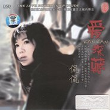

爱深藏
============================

|  |  |
| :--: | :-- |
| [ 爱深藏](https://emumo.xiami.com/album/429492) | **艺人**: [侃侃](../index.md) **语种**: 国语 **唱片公司**: 广东音像 **发行时间**: 2011年03月02日 **专辑类别**: 录音室专辑 **专辑风格**: 国语流行 Mandarin Pop **播放数**: 5566761 **收藏数**: 1302 **评论数**: 269  |

## 简介

侃侃.丽江清音流韵  
唯一全新唱作 一张真正回到聆听的专辑  
回到音乐本质的美丽境界 来自灵魂最深处的歌唱  
灵魂深处最纯洁的歌 抚摩尘世里功利和浮躁的灵魂  
释放与慰籍那都市最纯洁的情感 

## 曲目

- [把爱深藏MV](./429492/xLtbuxbbdc2.md)
- [隔世离空的红颜](./429492/U59XMi28c74.md)
- [黄玫瑰](./429492/bCkBTc34633c.md)
- [滴答MV电视剧《北京爱情故事》插曲](./429492/xLtbu09f64a.md)
- [飘摇](./429492/xLtbu1cf8cc.md)
- [爱的箴言](./429492/mQ8c5Secd6a.md)
- [山楂树之恋](./429492/bCkBTc7478a7.md)
- [那江烟花](./429492/xLtbu4c094b.md)
- [橄榄树](./429492/8Geajff75f7.md)
- [叶子](./429492/xLtbu616799.md)
- [有没有人告诉你](./429492/8Geajh195a7.md)
- [星语心愿](./429492/xLtbu8d71d9.md)

## 评论

|  |  |  |
| :-- | :-- | :-- |
|  [虾米用户](https://emumo.xiami.com/u/430499067)  2019-12-19 12:32 赞(0) 踩(0) | 
听这声音就是故事
 |
|  [虾米用户](https://emumo.xiami.com/u/410769617) 生活就要在音乐中开心的过 2019-01-28 07:03 赞(0) 踩(0) | 
嗓音很有磁性。喜欢！
 |
|  [虾米用户](https://emumo.xiami.com/u/311479018)   2017-12-28 16:33 赞(0) 踩(0) | 
666
 |
|  [虾米用户](https://emumo.xiami.com/u/28108371) 我还没想好要写什么... 2017-11-16 11:50 赞(0) 踩(0) | 
听你的歌，娓娓道来，让烦燥的内心得到宁静。
 |
|  [虾米用户](https://emumo.xiami.com/u/28108371) 我还没想好要写什么... 2017-11-16 11:31 赞(2) 踩(0) | 
清新自然，淳朴简洁不渲啸，听着很接地气！舒服，遐想
 |
|  [虾米用户](https://emumo.xiami.com/u/1207576)  2017-10-27 23:59 赞(0) 踩(0) | 
因为丽江知道了侃侃，每当听起她的歌，就会有在丽江的感觉！侃侃的音乐，没有商业化的浮躁，来自心灵深处纯净的歌曲！
 |
|  [虾米用户](https://emumo.xiami.com/u/207626626) Derek 2017-06-03 18:37 赞(0) 踩(0) | 
這集CD我都有,好聽
 |
|  [虾米用户](https://emumo.xiami.com/u/1874334)  2015-10-23 10:43 赞(0) 踩(0) | 
橄榄树
 |
|  [虾米用户](https://emumo.xiami.com/u/26399451) 音乐的美只有心知道 2015-05-06 23:17 赞(0) 踩(0) | 
“滴答”是标志啊，喜欢！
 |
|  [虾米用户](https://emumo.xiami.com/u/37408422)  2015-02-09 20:08 赞(1) 踩(0) | 
清新安静
 |
|  [虾米用户](https://emumo.xiami.com/u/64554)  2014-11-21 18:36 赞(0) 踩(0) | 
安静
 |
|  [虾米用户](https://emumo.xiami.com/u/31805673) 暂无签名~ 2014-11-17 19:46 赞(0) 踩(0) | 
喜欢她的声音，很舒服，很好听
 |
|  [虾米用户](https://emumo.xiami.com/u/11259253) 听靓歌 2014-10-09 12:10 赞(0) 踩(0) | 
不错。
 |
|  [虾米用户](https://emumo.xiami.com/u/6763057) 逍遙；解脫！ 2014-08-02 19:45 赞(0) 踩(0) | 
舒服的聲音
 |
|  [虾米用户](https://emumo.xiami.com/u/1665304) 自由  散漫  随性☁ 2014-06-29 18:35 赞(6) 踩(0) | 
那英和田震不对付，侃侃把这两人融合得很好咯！
 |
| ⇒ |  [虾米用户](https://emumo.xiami.com/u/50573039)  2015-06-09 15:49 赞(0) 踩(0) | 
那狗不配比田震和侃侃！别提那狗！！……
 |
| ⇒ |  [虾米用户](https://emumo.xiami.com/u/1665304) 自由  散漫  随性☁ 2020-01-14 15:46 赞(0) 踩(0) | 
<q><b>shy18958说：</b></q>
 |
|  [虾米用户](https://emumo.xiami.com/u/14104978)  2014-06-11 08:15 赞(1) 踩(0) | 
爱自己才是真理！
 |
|  [虾米用户](https://emumo.xiami.com/u/11006248)  2014-05-05 23:23 赞(1) 踩(0) | 
喜欢
 |
|  [虾米用户](https://emumo.xiami.com/u/902969)  2014-04-24 18:40 赞(1) 踩(0) | 
听着有想哭的冲动，送给未来的自己和想像中的他。。。
 |
|  [虾米用户](https://emumo.xiami.com/u/3353453)  2014-03-29 22:39 赞(1) 踩(0) | 
经历是一种成长.
 |
|  [虾米用户](https://emumo.xiami.com/u/7867049)  2014-01-20 16:15 赞(1) 踩(0) | 
精品
 |
|  [虾米用户](https://emumo.xiami.com/u/11162396) 快乐生活，少不了音乐相伴 2013-12-30 23:54 赞(1) 踩(0) | 
侃侃.丽江清音流韵 唯一全新唱作 一张真正回到聆听的专辑 回到音乐本质的美丽境界 来自灵魂最深处的歌唱 灵魂深处最纯洁的歌 抚摩尘世里功利和浮躁的灵魂
 |
|  [虾米用户](https://emumo.xiami.com/u/28351328)  2013-12-15 11:30 赞(1) 踩(0) | 
非常喜欢这种感觉！宁静中透着点谈谈的忧伤！
 |
|  [虾米用户](https://emumo.xiami.com/u/9932431)  2013-11-29 11:56 赞(0) 踩(0) | 
不一样的声音
 |
|  [虾米用户](https://emumo.xiami.com/u/15995576)  2013-11-26 09:01 赞(0) 踩(0) | 
喜欢侃侃的淳朴
 |
|  [虾米用户](https://emumo.xiami.com/u/16315021)  2013-10-06 09:58 赞(0) 踩(0) | 
撒旦啊
 |
|  [虾米用户](https://emumo.xiami.com/u/20549712)  2013-10-04 21:05 赞(0) 踩(0) | 
適合秋天聽的音樂
 |
|  [虾米用户](https://emumo.xiami.com/u/8782582)  2013-08-30 22:58 赞(0) 踩(0) | 
超喜欢侃侃的歌喉.第一首是我经常听的歌之一.
 |
|  [虾米用户](https://emumo.xiami.com/u/9492032) 一个理想主义者的坚持～ 2013-08-20 15:33 赞(0) 踩(0) | 
孤独有质感女声  喜欢这种安静的歌
 |
|  [虾米用户](https://emumo.xiami.com/u/16190930)  2013-08-16 15:50 赞(1) 踩(0) | 
沒有虛華
 |
|  [虾米用户](https://emumo.xiami.com/u/16887565)  2013-07-06 15:54 赞(0) 踩(0) | 
侃侃的歌真是好听啊
 |
|  [虾米用户](https://emumo.xiami.com/u/8244559)  2013-06-19 16:34 赞(0) 踩(0) | 
******
 |
|  [虾米用户](https://emumo.xiami.com/u/12382486)  2013-04-05 17:58 赞(0) 踩(0) | 
好清純的聲音 喜歡
 |
|  [虾米用户](https://emumo.xiami.com/u/3204939) 人生如茶，静心以对。对错... 2013-03-28 09:29 赞(1) 踩(0) | 
侃侃.丽江清音流韵 唯一全新唱作 一张真正回到聆听的专辑 回到音乐本质的美丽境界 来自灵魂最深处的歌唱 灵魂深处最纯洁的歌 抚摩尘世里功利和浮躁的灵魂
 |
|  [虾米用户](https://emumo.xiami.com/u/9838211)  2013-03-24 16:54 赞(0) 踩(0) | 
丫头喜欢的声音
 |
|  [虾米用户](https://emumo.xiami.com/u/11699681)  2013-03-20 13:54 赞(0) 踩(0) | 
收了
 |
|  [虾米用户](https://emumo.xiami.com/u/6228896)  2013-03-17 23:56 赞(0) 踩(0) | 
喜欢
 |
|  [虾米用户](https://emumo.xiami.com/u/1746570) 寧静致遠 2013-03-08 00:18 赞(0) 踩(0) | 
恭喜你已连续签到一年，获得虾小米禽兽奖励的红包50枚，再接再厉哟 48秒前------减半！ 无所谓，顺便更新CD Cover。
 |
|  [虾米用户](https://emumo.xiami.com/u/9134017)  2013-03-03 15:23 赞(0) 踩(0) | 
好听
 |
|  [虾米用户](https://emumo.xiami.com/u/13314999)  2013-03-01 22:10 赞(0) 踩(0) | 
喜欢
 |
|  [虾米用户](https://emumo.xiami.com/u/8782582)  2013-02-13 19:44 赞(0) 踩(0) | 
最喜欢1,4,8.
 |
|  [虾米用户](https://emumo.xiami.com/u/12023385) 暂无签名~ 2013-02-08 23:33 赞(0) 踩(0) | 
纯净 舒缓
 |
|  [虾米用户](https://emumo.xiami.com/u/11036479)  2013-01-18 11:29 赞(0) 踩(0) | 
纯净的音色，深情的倾诉，悄悄地打动着你的心灵
 |
|  [虾米用户](https://emumo.xiami.com/u/5190816)  2013-01-10 10:36 赞(0) 踩(0) | 
安静的歌
 |
|  [虾米用户](https://emumo.xiami.com/u/6437000)  2013-01-02 12:32 赞(0) 踩(0) | 
侃侃的声音里充满了故事，特别能打动人心
 |
|  [虾米用户](https://emumo.xiami.com/u/8337431) 以乐会友 2012-12-28 03:47 赞(0) 踩(0) | 
全新编排
 |
|  [虾米用户](https://emumo.xiami.com/u/11963132)  2012-12-16 21:08 赞(0) 踩(0) | 
喜欢
 |
|  [虾米用户](https://emumo.xiami.com/u/11061863) 海歌18727 2012-11-19 13:26 赞(0) 踩(0) | 
感动一点
 |
|  [虾米用户](https://emumo.xiami.com/u/2376315)  2012-10-08 12:05 赞(0) 踩(0) | 
好听，舒服的喉音～～
 |
|  [虾米用户](https://emumo.xiami.com/u/10142104)  2012-10-07 10:53 赞(0) 踩(0) | 
好喜欢这慵懒舒服的声音...
 |
|  [虾米用户](https://emumo.xiami.com/u/10750592) 逆水寒 2012-09-23 13:05 赞(0) 踩(0) | 
超喜欢
 |
|  [虾米用户](https://emumo.xiami.com/u/10639335)  2012-09-16 17:55 赞(0) 踩(0) | 
太喜欢
 |
|  [虾米用户](https://emumo.xiami.com/u/4261281)  2012-09-13 06:49 赞(1) 踩(0) | 
滴答滴答总在滴答滴答全都在滴答滴答所有的调调都在滴答滴答。
 |
|  [虾米用户](https://emumo.xiami.com/u/5714248)  2012-09-12 19:37 赞(0) 踩(0) | 
喜欢她的声音
 |
|  [虾米用户](https://emumo.xiami.com/u/10579079)  2012-09-11 13:24 赞(0) 踩(0) | 
深思，回味
 |
|  [虾米用户](https://emumo.xiami.com/u/20019)  2012-09-11 09:50 赞(0) 踩(0) | 
有些爱，只能深藏
 |
|  [虾米用户](https://emumo.xiami.com/u/10360354) az 2012-08-27 17:15 赞(0) 踩(0) | 
没什么好说的
 |
|  [虾米用户](https://emumo.xiami.com/u/10343865)  2012-08-24 09:17 赞(0) 踩(0) | 
纯净的音乐给我精神的享受！
 |
|  [虾米用户](https://emumo.xiami.com/u/3490632)  2012-08-09 13:24 赞(0) 踩(0) | 
挺有特色的
 |
|  [虾米用户](https://emumo.xiami.com/u/9963792)  2012-07-26 15:57 赞(0) 踩(0) | 
好听
 |
|  [虾米用户](https://emumo.xiami.com/u/9917415)  2012-07-22 21:36 赞(0) 踩(0) | 
从 那首滴答开始着迷于侃侃  喜欢她的声音和音乐风格  纯净
 |
|  [虾米用户](https://emumo.xiami.com/u/3964211)  2012-07-17 22:37 赞(0) 踩(0) | 
嗓音微微沙哑~很有感觉~
 |
|  [虾米用户](https://emumo.xiami.com/u/3442087) Dust To Dust 2012-07-15 16:14 赞(0) 踩(0) | 
嘀嗒前几年很喜欢的一首歌
 |
|  [虾米用户](https://emumo.xiami.com/u/6229958) 音乐天下最美的东西 2012-07-13 20:45 赞(0) 踩(0) | 
4
 |
|  [虾米用户](https://emumo.xiami.com/u/9793104)  2012-07-13 15:04 赞(0) 踩(0) | 
想听听
 |
|  [虾米用户](https://emumo.xiami.com/u/1951930)  2012-07-13 12:41 赞(0) 踩(0) | 
有味道
 |
|  [虾米用户](https://emumo.xiami.com/u/1097699)  2012-07-07 23:00 赞(0) 踩(0) | 
侃侃2011
 |
|  [虾米用户](https://emumo.xiami.com/u/7812712) 707070 2012-06-06 02:35 赞(0) 踩(0) | 
。。。。
 |
|  [虾米用户](https://emumo.xiami.com/u/8307411) 回家的票号难买 2012-05-28 06:03 赞(0) 踩(0) | 
喜欢没道理
 |
|  [虾米用户](https://emumo.xiami.com/u/9236402) 佛一 2012-05-22 00:23 赞(0) 踩(0) | 
中
 |
|  [虾米用户](https://emumo.xiami.com/u/9208306)  2012-05-21 21:48 赞(0) 踩(0) | 
音乐非常的好听
 |
|  [虾米用户](https://emumo.xiami.com/u/6566738)  2012-05-20 11:02 赞(0) 踩(0) | 
爱深藏
 |
|  [虾米用户](https://emumo.xiami.com/u/9017151)  2012-05-08 17:28 赞(0) 踩(0) | 
那江烟花
 |
|  [虾米用户](https://emumo.xiami.com/u/8822963)  2012-05-03 21:12 赞(0) 踩(0) | 
翻唱得别具特色，更入人心。
 |
|  [虾米用户](https://emumo.xiami.com/u/9053909)  2012-05-03 15:16 赞(0) 踩(0) | 
非常喜欢侃侃
 |
|  [虾米用户](https://emumo.xiami.com/u/8608948)  2012-04-29 18:10 赞(0) 踩(0) | 
喜欢
 |
|  [虾米用户](https://emumo.xiami.com/u/1858640) 末路.狂花. 2012-04-24 09:16 赞(0) 踩(0) | 
云南的记忆，丽江，纳西，雨水及鼓
 |
|  [虾米用户](https://emumo.xiami.com/u/6585343)  2012-04-22 13:16 赞(0) 踩(0) | 
去年在丽江第一次听到这首歌，就感觉和当地风景特别相称。美妙至极、天籁之音，难以忘怀！
 |
|  [虾米用户](https://emumo.xiami.com/u/6585343)  2012-04-22 13:15 赞(0) 踩(0) | 
去年在丽江第一次听到这首歌，就感觉和当地风景特别相称。美妙至极、天籁之音，难以忘怀！
 |
|  [虾米用户](https://emumo.xiami.com/u/6585343)  2012-04-22 13:14 赞(0) 踩(0) | 
去年在丽江第一次听到这首歌，就感觉和当地风景特别相称。美妙至极、天籁之音，难以忘怀！
 |
|  [虾米用户](https://emumo.xiami.com/u/6585343)  2012-04-22 13:14 赞(0) 踩(0) | 
uttretrett
 |
|  [虾米用户](https://emumo.xiami.com/u/6585343)  2012-04-22 13:14 赞(0) 踩(0) | 
规范和规范和规范化
 |
|  [虾米用户](https://emumo.xiami.com/u/8937113) 我还没想好要写什么... 2012-04-21 12:51 赞(0) 踩(0) | 
不错
 |
|  [虾米用户](https://emumo.xiami.com/u/8878899)  2012-04-15 22:11 赞(0) 踩(0) | 
喜欢
 |
|  [虾米用户](https://emumo.xiami.com/u/1438991)  2012-04-15 21:50 赞(0) 踩(0) | 
无理由喜欢！！
 |
|  [虾米用户](https://emumo.xiami.com/u/8626855)  2012-04-06 15:14 赞(0) 踩(0) | 
慢生活
 |
|  [虾米用户](https://emumo.xiami.com/u/8756754)  2012-04-06 02:37 赞(0) 踩(0) | 
喜欢侃侃
 |
|  [虾米用户](https://emumo.xiami.com/u/727708)  2012-04-05 15:27 赞(0) 踩(0) | 
发呆绝好的背景音乐，身未动心已远。
 |
|  [虾米用户](https://emumo.xiami.com/u/7190400)  2012-04-03 21:52 赞(0) 踩(0) | 
喜欢侃侃磁美的音色
 |
|  [虾米用户](https://emumo.xiami.com/u/893525)  2012-04-02 13:33 赞(0) 踩(0) | 
去年在丽江第一次听到这首歌，就感觉和当地风景特别相称。美妙至极、天籁之音，难以忘怀！
 |
|  [虾米用户](https://emumo.xiami.com/u/6851685)  2012-04-02 02:48 赞(0) 踩(0) | 
发呆的时候，想听的声音
 |
|  [虾米用户](https://emumo.xiami.com/u/2412711)  2012-03-27 20:04 赞(0) 踩(0) | 
通透。
 |
|  [虾米用户](https://emumo.xiami.com/u/4319569)  2012-03-26 00:28 赞(0) 踩(0) | 
喜欢
 |
|  [虾米用户](https://emumo.xiami.com/u/6789370) 不忧昨日，不期明日 2012-03-25 14:18 赞(0) 踩(0) | 
过耳难忘的声音。
 |
|  [虾米用户](https://emumo.xiami.com/u/8544124)  2012-03-22 19:15 赞(0) 踩(0) | 
喜欢
 |
|  [虾米用户](https://emumo.xiami.com/u/2186856) 暂无签名~ 2012-03-21 23:38 赞(0) 踩(0) | 
侃侃.丽江清音流韵 唯一全新唱作 一张真正回到聆听的专辑 回到音乐本质的美丽境界 来自灵魂最深处的歌唱 灵魂深处最纯洁的歌 抚摩尘世里功利和浮躁的灵魂
 |
|  [虾米用户](https://emumo.xiami.com/u/1556346)  2012-03-20 17:03 赞(0) 踩(0) | 
寂寥
 |
|  [虾米用户](https://emumo.xiami.com/u/8484845)  2012-03-19 16:53 赞(0) 踩(0) | 
时间是良药，良药是苦口
 |
|  [虾米用户](https://emumo.xiami.com/u/8486252)  2012-03-18 17:57 赞(0) 踩(0) | 
单纯的音乐，单纯的忧伤。
 |
|  [虾米用户](https://emumo.xiami.com/u/8427814)  2012-03-14 20:34 赞(0) 踩(0) | 
把爱深藏
 |
|  [虾米用户](https://emumo.xiami.com/u/8427814)  2012-03-14 20:29 赞(0) 踩(0) | 
忽然发现生活原来很美好
 |
|  [虾米用户](https://emumo.xiami.com/u/8182381)  2012-03-14 19:25 赞(0) 踩(0) | 
美妙每一刻
 |
|  [虾米用户](https://emumo.xiami.com/u/3130313)  2012-03-09 19:32 赞(0) 踩(0) | 
我不是不想你，我不是不爱你，我只能把爱深藏在心底。
 |
|  [虾米用户](https://emumo.xiami.com/u/8017752)  2012-03-09 14:24 赞(0) 踩(0) | 
第一次听她，蛮好听的。。。
 |
|  [虾米用户](https://emumo.xiami.com/u/6996501)  2012-03-09 12:19 赞(0) 踩(0) | 
我有无损的！
 |
|  [虾米用户](https://emumo.xiami.com/u/8170577)  2012-03-06 22:15 赞(0) 踩(0) | 
很深沉，低迷的声音，虽然都是翻唱，可是另有一番味道
 |
|  [虾米用户](https://emumo.xiami.com/u/8319432)  2012-03-06 16:41 赞(0) 踩(0) | 
就是喜欢
 |
|  [虾米用户](https://emumo.xiami.com/u/6968495)  2012-03-04 12:37 赞(0) 踩(0) | 
几年前就听到的声音 如今依旧难忘
 |
|  [虾米用户](https://emumo.xiami.com/u/8253907)  2012-03-02 01:53 赞(0) 踩(0) | 
喜欢她，为她的歌疯狂
 |
|  [虾米用户](https://emumo.xiami.com/u/4987134)  2012-02-29 16:19 赞(0) 踩(0) | 
喜欢侃侃的歌就跟喜欢自己的爱人，这个不需要理由的
 |
|  [虾米用户](https://emumo.xiami.com/u/8117885)  2012-02-28 22:55 赞(0) 踩(0) | 
可是怎麼辦啊？滿園都是回憶，我越離你越來越近~
 |
|  [虾米用户](https://emumo.xiami.com/u/6317276)  2012-02-28 22:23 赞(0) 踩(0) | 
喜欢
 |
|  [虾米用户](https://emumo.xiami.com/u/8189980)  2012-02-26 10:24 赞(0) 踩(0) | 
好听
 |
|  [虾米用户](https://emumo.xiami.com/u/8187720)  2012-02-26 01:16 赞(0) 踩(0) | 
挺好
 |
|  [虾米用户](https://emumo.xiami.com/u/8160598)  2012-02-24 22:37 赞(0) 踩(0) | 
好听
 |
|  [虾米用户](https://emumo.xiami.com/u/7356332)  2012-02-23 21:14 赞(0) 踩(0) | 
喜欢这音色！
 |
|  [虾米用户](https://emumo.xiami.com/u/7600499)  2012-02-23 20:38 赞(0) 踩(0) | 
灵魂深处最纯洁的歌 抚摩尘世里功利和浮躁的灵魂
 |
|  [虾米用户](https://emumo.xiami.com/u/4752128)  2012-02-22 14:19 赞(0) 踩(0) | 
滴答的追逐~
 |
|  [虾米用户](https://emumo.xiami.com/u/7915674)  2012-02-21 20:28 赞(0) 踩(0) | 
追忆往事
 |
|  [虾米用户](https://emumo.xiami.com/u/8129623)  2012-02-21 10:34 赞(0) 踩(0) | 
不用多言 你懂得
 |
|  [虾米用户](https://emumo.xiami.com/u/8121975)  2012-02-20 15:48 赞(0) 踩(0) | 
完美无瑕
 |
|  [虾米用户](https://emumo.xiami.com/u/3107013) what the... 2012-02-20 11:04 赞(0) 踩(0) | 
很感人的滴答，曾经的感觉
 |
|  [虾米用户](https://emumo.xiami.com/u/8114109)  2012-02-19 20:00 赞(0) 踩(0) | 
收藏以后慢慢听
 |
|  [虾米用户](https://emumo.xiami.com/u/3326854)  2012-02-18 13:08 赞(0) 踩(0) | 
嘀嗒 ~~~~~
 |
|  [虾米用户](https://emumo.xiami.com/u/869296)  2012-02-18 10:41 赞(0) 踩(0) | 
好听
 |
|  [虾米用户](https://emumo.xiami.com/u/1296318) 透支了眼泪，便会没心没肺... 2012-02-17 22:33 赞(0) 踩(0) | 
纯净的声音，好听
 |
|  [虾米用户](https://emumo.xiami.com/u/738074)  2012-02-17 18:22 赞(0) 踩(0) | 
好
 |
|  [虾米用户](https://emumo.xiami.com/u/8023413)  2012-02-13 00:44 赞(0) 踩(0) | 
太好听了，因她的声音而陶醉感动
 |
|  [虾米用户](https://emumo.xiami.com/u/5097812) 我的内心总有一处宁静的圣 2012-02-12 23:34 赞(0) 踩(0) | 
从内心走过的声音！！
 |
|  [虾米用户](https://emumo.xiami.com/u/1143966)  2012-02-12 22:38 赞(0) 踩(0) | 
侃侃
 |
|  [虾米用户](https://emumo.xiami.com/u/1318344)  2012-02-11 23:05 赞(0) 踩(0) | 
喜欢声音
 |
|  [虾米用户](https://emumo.xiami.com/u/708621) 追梦人 2012-02-11 10:31 赞(0) 踩(0) | 
女版许魏，安抚人心的声音。
 |
|  [虾米用户](https://emumo.xiami.com/u/7970018)  2012-02-09 00:33 赞(0) 踩(0) | 
有味
 |
|  [虾米用户](https://emumo.xiami.com/u/7949157)  2012-02-08 17:06 赞(0) 踩(0) | 
因一首蝴蝶知道了这名歌手，太有味了
 |
|  [虾米用户](https://emumo.xiami.com/u/5985104)  2012-02-08 12:28 赞(0) 踩(0) | 
去年一月份第一次在丽江听到了《滴答》，立刻被迷住了。最近看《北京爱情故事》再次听到，太好听了！
 |
|  [虾米用户](https://emumo.xiami.com/u/7961033)  2012-02-08 11:54 赞(0) 踩(0) | 
丽江让我认识了侃侃，让我找到了纯净的音乐。谢谢你。
 |
|  [虾米用户](https://emumo.xiami.com/u/7916354)  2012-02-07 13:49 赞(0) 踩(0) | 
静静的淡淡的讲述
 |
|  [虾米用户](https://emumo.xiami.com/u/6845759)  2012-02-06 23:05 赞(0) 踩(0) | 
当时去丽江，住在古城里，满大街的唱片店都在放这首歌，一下子就喜欢上了。
 |
|  [虾米用户](https://emumo.xiami.com/u/7313290)  2012-02-06 23:02 赞(0) 踩(0) | 
喜欢她的歌
 |
|  [虾米用户](https://emumo.xiami.com/u/7905559)  2012-02-05 15:57 赞(0) 踩(0) | 
清新、深情、脱俗的声音加上优美的编曲、配乐值得聆听和收藏！
 |
|  [虾米用户](https://emumo.xiami.com/u/7346601)  2012-02-05 09:20 赞(0) 踩(0) | 
喜欢！
 |
|  [虾米用户](https://emumo.xiami.com/u/5584426) 我从火星来 2012-02-05 01:03 赞(0) 踩(0) | 
《北京爱情故事》 滴答
 |
|  [虾米用户](https://emumo.xiami.com/u/7898380)  2012-02-03 14:32 赞(0) 踩(0) | 
我喜欢
 |
|  [虾米用户](https://emumo.xiami.com/u/7898380)  2012-02-03 14:31 赞(0) 踩(0) | 
!!!!!!!!!!!!!!!!!!!!!!!!!!!!!!
 |
|  [虾米用户](https://emumo.xiami.com/u/7882448)  2012-02-02 09:35 赞(0) 踩(0) | 
很喜欢这种味道
 |
|  [虾米用户](https://emumo.xiami.com/u/7874493)  2012-02-01 16:41 赞(0) 踩(0) | 
脱尘的味道
 |
|  [虾米用户](https://emumo.xiami.com/u/164174) 暂无签名~ 2012-02-01 15:56 赞(0) 踩(0) | 
！
 |
|  [虾米用户](https://emumo.xiami.com/u/7845617)  2012-01-30 13:00 赞(0) 踩(0) | 
******
 |
|  [虾米用户](https://emumo.xiami.com/u/7780349)  2012-01-24 13:15 赞(0) 踩(0) | 
丽江感觉
 |
|  [虾米用户](https://emumo.xiami.com/u/7609678)  2012-01-11 16:10 赞(0) 踩(0) | 
喜欢没理由
 |
|  [虾米用户](https://emumo.xiami.com/u/7609678)  2012-01-10 17:10 赞(0) 踩(0) | 
浅吟低唱，总是最好听，喜欢丽江侃侃的呤唱
 |
|  [虾米用户](https://emumo.xiami.com/u/7514425)  2012-01-02 18:35 赞(0) 踩(0) | 
非常好听
 |
|  [虾米用户](https://emumo.xiami.com/u/3255139)  2012-01-01 22:10 赞(0) 踩(0) | 
感觉
 |
|  [虾米用户](https://emumo.xiami.com/u/7481406)  2012-01-01 21:01 赞(0) 踩(0) | 
唱入人心灵
 |
|  [虾米用户](https://emumo.xiami.com/u/6807568)  2011-12-30 14:25 赞(0) 踩(0) | 
好
 |
|  [虾米用户](https://emumo.xiami.com/u/7466185)  2011-12-30 10:56 赞(0) 踩(0) | 
干净
 |
|  [虾米用户](https://emumo.xiami.com/u/3237286)  2011-12-16 21:21 赞(0) 踩(0) | 
爱深藏
 |
|  [虾米用户](https://emumo.xiami.com/u/3762064)  2011-12-13 16:29 赞(0) 踩(0) | 
我想去丽江。。。。
 |
|  [虾米用户](https://emumo.xiami.com/u/4757554)  2011-12-05 01:38 赞(0) 踩(0) | 
穿过丽江古城，你会发现不只古城，不只丽江，侃侃的声音也会洗涤灵魂！
 |
|  [虾米用户](https://emumo.xiami.com/u/7054668)  2011-12-01 22:39 赞(0) 踩(0) | 
好听
 |
|  [虾米用户](https://emumo.xiami.com/u/7019885)  2011-11-30 09:43 赞(0) 踩(0) | 
淡淡的歌，淡淡的音乐！
 |
|  [虾米用户](https://emumo.xiami.com/u/7019885)  2011-11-29 17:57 赞(0) 踩(0) | 
还原！
 |
|  [虾米用户](https://emumo.xiami.com/u/6474871)  2011-11-25 15:23 赞(0) 踩(0) | 
感觉上的突然而至，不一样，另一种的喜欢
 |
|  [虾米用户](https://emumo.xiami.com/u/6936885)  2011-11-24 14:12 赞(0) 踩(0) | 
安静的陪伴
 |
|  [虾米用户](https://emumo.xiami.com/u/6936885)  2011-11-24 14:12 赞(0) 踩(0) | 
安静陪伴
 |
|  [虾米用户](https://emumo.xiami.com/u/6927348)  2011-11-23 20:15 赞(0) 踩(0) | 
喜欢就喜欢！
 |
|  [虾米用户](https://emumo.xiami.com/u/4723216)  2011-11-22 11:57 赞(0) 踩(0) | 
非常好
 |
|  [虾米用户](https://emumo.xiami.com/u/4723216)  2011-11-22 11:57 赞(0) 踩(0) | 
就是喜欢
 |
|  [虾米用户](https://emumo.xiami.com/u/6876410)  2011-11-20 14:19 赞(0) 踩(0) | 
喜欢这种安静的感觉.很美...
 |
|  [虾米用户](https://emumo.xiami.com/u/6876410)  2011-11-20 14:01 赞(0) 踩(0) | 
喜欢这种安静的感觉.很美...
 |
|  [虾米用户](https://emumo.xiami.com/u/4991086)  2011-11-18 20:53 赞(0) 踩(0) | 
丽江心情
 |
|  [虾米用户](https://emumo.xiami.com/u/2094955)  2011-11-18 13:38 赞(0) 踩(0) | 
好安静的声音
 |
|  [虾米用户](https://emumo.xiami.com/u/6825045)  2011-11-18 09:16 赞(0) 踩(0) | 
宁静
 |
|  [虾米用户](https://emumo.xiami.com/u/6807568)  2011-11-16 16:22 赞(0) 踩(0) | 
声线好细好甜
 |
|  [虾米用户](https://emumo.xiami.com/u/6719372)  2011-11-10 21:55 赞(0) 踩(0) | 
侃侃的歌曲是一种朴素，没有技巧雕刻，素雅的歌曲。在吉他的音乐伴奏下，低声述说，述说那心中的故事，低沉、婉转、如泣如述、如歌如唱，声音很美，歌词也很真实。让人感受到虚幻世界里的真情，让人感受到自己纯真的一面。
 |
|  [虾米用户](https://emumo.xiami.com/u/6669780)  2011-11-08 11:33 赞(0) 踩(0) | 
你，听听就知道了
 |
|  [虾米用户](https://emumo.xiami.com/u/6626447)  2011-11-07 14:07 赞(0) 踩(0) | 
因一首嘀嗒就喜欢上了她。
 |
|  [虾米用户](https://emumo.xiami.com/u/6626447)  2011-11-07 14:07 赞(0) 踩(0) | 
爱极了她的声音，丽江的。
 |
|  [虾米用户](https://emumo.xiami.com/u/6648765)  2011-11-06 17:00 赞(0) 踩(0) | 
旋律舒缓熨帖，从容诉说，触及内心
 |
|  [虾米用户](https://emumo.xiami.com/u/646880) I LOVE SEAN 2011-10-30 16:29 赞(0) 踩(0) | 
滴答这首歌在丽江古城的一直回荡着，伴随着泉水叮咚 无限惬意啊
 |
|  [虾米用户](https://emumo.xiami.com/u/6482981)  2011-10-28 22:07 赞(0) 踩(0) | 
没什么理由，听的这个音乐的第一次就深深的被吸引了，喜欢侃侃低吟浅唱，娓娓道来的感觉。。。
 |
|  [虾米用户](https://emumo.xiami.com/u/6436751)  2011-10-26 06:40 赞(0) 踩(0) | 
听到她的歌，又勾起在丽江的回忆。
 |
|  [虾米用户](https://emumo.xiami.com/u/2446956)  2011-10-20 17:34 赞(0) 踩(0) | 
淘碟~
 |
|  [虾米用户](https://emumo.xiami.com/u/6343499)  2011-10-20 13:42 赞(0) 踩(0) | 
超喜欢侃侃的声音。
 |
|  [虾米用户](https://emumo.xiami.com/u/6296452)  2011-10-20 12:45 赞(0) 踩(0) | 
特别柔特别静的歌，是侃侃的歌一次又一次的把我的心带回丽江。
 |
|  [虾米用户](https://emumo.xiami.com/u/6296452)  2011-10-20 12:40 赞(0) 踩(0) | 
喜欢到无需理由
 |
|  [虾米用户](https://emumo.xiami.com/u/6339590)  2011-10-20 09:59 赞(0) 踩(0) | 
喜欢
 |
|  [虾米用户](https://emumo.xiami.com/u/6339590)  2011-10-20 09:58 赞(0) 踩(0) | 
喜欢
 |
|  [虾米用户](https://emumo.xiami.com/u/6260844)  2011-10-18 12:52 赞(0) 踩(0) | 
.hao
 |
|  [虾米用户](https://emumo.xiami.com/u/934010)  2011-10-17 14:42 赞(0) 踩(0) | 
午后的窗台，阳光斜斜的照进来，一本书在手，一杯茶在侧，萦绕耳畔的就应是这样的音乐吧……
 |
|  [虾米用户](https://emumo.xiami.com/u/1581231) 音乐与我同在 2011-10-16 20:08 赞(0) 踩(0) | 
情动,动情
 |
|  [虾米用户](https://emumo.xiami.com/u/1767569)  2011-10-16 10:12 赞(0) 踩(0) | 
灵魂深处最纯洁的歌 抚摩尘世里功利和浮躁的灵魂 一张真正回到聆听的专辑
 |
|  [虾米用户](https://emumo.xiami.com/u/6224265)  2011-10-12 20:45 赞(0) 踩(0) | 
好听的声音回到音乐本质的美丽境界 来自灵魂最深处的歌唱
 |
|  [虾米用户](https://emumo.xiami.com/u/6211714)  2011-10-11 23:23 赞(0) 踩(0) | 
杨柳依依，昔我往矣，今我来思，雨雪霏霏！
 |
|  [虾米用户](https://emumo.xiami.com/u/6211714)  2011-10-11 23:21 赞(0) 踩(0) | 
还是保持着侃侃特有的演唱风格，只是专辑里翻唱歌曲太多，原创太少了，不过还是值得一听
 |
|  [虾米用户](https://emumo.xiami.com/u/6205601)  2011-10-11 14:35 赞(0) 踩(0) | 
喜欢她的声音
 |
|  [虾米用户](https://emumo.xiami.com/u/6084341)  2011-10-10 21:35 赞(0) 踩(0) | 
,./, /;
 |
|  [虾米用户](https://emumo.xiami.com/u/5890429)  2011-10-09 16:30 赞(0) 踩(0) | 
舒服，可以让人在浮躁中得到一丝安宁
 |
|  [虾米用户](https://emumo.xiami.com/u/5974732)  2011-10-09 12:59 赞(0) 踩(0) | 
有味道
 |
|  [虾米用户](https://emumo.xiami.com/u/6166115)  2011-10-08 20:12 赞(0) 踩(0) | 
滴嗒让我回到了丽江..回归了那熟悉的感觉~
 |
|  [虾米用户](https://emumo.xiami.com/u/6166115)  2011-10-08 20:04 赞(0) 踩(0) | 
丽江
 |
|  [虾米用户](https://emumo.xiami.com/u/4796)  2011-10-08 12:40 赞(0) 踩(0) | 
缓缓流淌
 |
|  [虾米用户](https://emumo.xiami.com/u/6124043)  2011-10-08 12:32 赞(0) 踩(0) | 
目前丽江的代表，每个淘碟的小店里都在播放！！！
 |
|  [虾米用户](https://emumo.xiami.com/u/6159292)  2011-10-08 11:40 赞(0) 踩(0) | 
被丽江标签吸引进来，典型的女文青曲风，淡淡的民族风。
 |
|  [虾米用户](https://emumo.xiami.com/u/2289667)  2011-10-07 21:30 赞(0) 踩(0) | 
干净、舒缓的音乐，很好听
 |
|  [虾米用户](https://emumo.xiami.com/u/6138742)   2011-10-07 01:04 赞(0) 踩(0) | 
还是依然干净的声音！
 |
|  [虾米用户](https://emumo.xiami.com/u/5928107)  2011-10-06 17:26 赞(0) 踩(0) | 
爱侃侃的声音  让心灵有了安息的地方  舒服 随心  的满意
 |
|  [虾米用户](https://emumo.xiami.com/u/194864)  2011-10-06 16:39 赞(0) 踩(0) | 
其中一首歌曲在丽江很红。滴答。也是从丽江知道了侃侃。
 |
|  [虾米用户](https://emumo.xiami.com/u/6127697)  2011-10-06 05:13 赞(0) 踩(0) | 
美丽的声音。
 |
|  [虾米用户](https://emumo.xiami.com/u/6120405)  2011-10-05 18:49 赞(0) 踩(0) | 
侃侃.丽江清音流韵 唯一全新唱作 一张真正回到聆听的专辑 回到音乐本质的美丽境界 来自灵魂最深处的歌唱 灵魂深处最纯洁的歌 抚摩尘世里功利和浮躁的灵魂
 |
|  [虾米用户](https://emumo.xiami.com/u/1594979)  2011-10-05 17:36 赞(0) 踩(0) | 
声音不错，选歌不错
 |
|  [虾米用户](https://emumo.xiami.com/u/1388763)  2011-10-05 08:13 赞(0) 踩(0) | 
didadida
 |
|  [虾米用户](https://emumo.xiami.com/u/3144980)  2011-10-05 00:50 赞(0) 踩(0) | 
翻唱的几首还不错。
 |
|  [虾米用户](https://emumo.xiami.com/u/6097005)  2011-10-03 23:00 赞(0) 踩(0) | 
干净的声音，直达心的端底。。。
 |
|  [虾米用户](https://emumo.xiami.com/u/6061268) 青丝柳黛流光舞，玉人如画... 2011-10-02 21:56 赞(0) 踩(0) | 
关于丽江的记忆。
 |
|  [虾米用户](https://emumo.xiami.com/u/2832573)  2011-10-02 17:45 赞(0) 踩(0) | 
丽江流淌的声音 爱上云南 想念云南
 |
|  [虾米用户](https://emumo.xiami.com/u/1697182)  2011-10-02 10:55 赞(0) 踩(0) | 
女杀手啊
 |
|  [虾米用户](https://emumo.xiami.com/u/6030142)  2011-09-30 16:25 赞(0) 踩(0) | 
还不错啊 滴答
 |
|  [虾米用户](https://emumo.xiami.com/u/102660)  2011-09-29 22:25 赞(0) 踩(0) | 
静静的~
 |
|  [虾米用户](https://emumo.xiami.com/u/102660)  2011-09-29 22:24 赞(0) 踩(0) | 
静静的   静吧~
 |
|  [虾米用户](https://emumo.xiami.com/u/4110070)  2011-09-29 21:06 赞(0) 踩(0) | 
aa
 |
|  [虾米用户](https://emumo.xiami.com/u/6032637)  2011-09-29 16:02 赞(0) 踩(0) | 
我喜欢滴答
 |
|  [虾米用户](https://emumo.xiami.com/u/6030725)  2011-09-29 13:22 赞(0) 踩(0) | 
去丽江，听到了这声音，非常喜欢
 |
|  [虾米用户](https://emumo.xiami.com/u/6030725)  2011-09-29 13:18 赞(0) 踩(0) | 
去丽江的时候，买的碟里有一首嘀嗒，一直不知道谁唱得，但是超喜欢，竟然在这里看到了，喜欢她的声音
 |
|  [虾米用户](https://emumo.xiami.com/u/5613592)  2011-09-28 14:42 赞(0) 踩(0) | 
唱出内心深处的纠结。祝福她侃侃幸福快乐
 |
|  [虾米用户](https://emumo.xiami.com/u/5989917)  2011-09-27 18:50 赞(0) 踩(0) | 
侃侃,
 |
|  [虾米用户](https://emumo.xiami.com/u/5972517)  2011-09-27 05:55 赞(0) 踩(0) | 
平静。。。。。静静。。。。
 |
|  [虾米用户](https://emumo.xiami.com/u/3503065)  2011-09-26 23:45 赞(0) 踩(0) | 
喜欢，不需要理由。
 |
|  [虾米用户](https://emumo.xiami.com/u/5455413)  2011-09-26 15:27 赞(0) 踩(0) | 
喜欢这种风格，有种说不出的舒缓和平静。
 |
|  [虾米用户](https://emumo.xiami.com/u/5985526)  2011-09-26 13:41 赞(0) 踩(0) | 
清新，舒服，动感。
 |
|  [虾米用户](https://emumo.xiami.com/u/5945738)  2011-09-26 10:37 赞(0) 踩(0) | 
里面的嘀嗒这首歌是去过丽江很多人喜欢的
 |
|  [虾米用户](https://emumo.xiami.com/u/5945738)  2011-09-26 10:35 赞(0) 踩(0) | 
去丽江的时候喜欢上了这些歌，那种感觉像一种神话
 |
|  [虾米用户](https://emumo.xiami.com/u/5931883)  2011-09-24 14:24 赞(0) 踩(0) | 
家
 |
|  [虾米用户](https://emumo.xiami.com/u/1695767)  2011-09-20 17:49 赞(0) 踩(0) | 
嗓音很有磁性
 |
|  [虾米用户](https://emumo.xiami.com/u/5897174)  2011-09-20 15:10 赞(0) 踩(0) | 
一听再听，就是喜欢 ！！
 |
|  [虾米用户](https://emumo.xiami.com/u/5897819)  2011-09-20 13:10 赞(0) 踩(0) | 
侃侃
 |
|  [虾米用户](https://emumo.xiami.com/u/5894539)  2011-09-20 06:24 赞(0) 踩(0) | 
这张专辑听过后更让我留恋丽江啦 呵呵
 |
|  [虾米用户](https://emumo.xiami.com/u/5865384)  2011-09-18 14:07 赞(0) 踩(0) | 
不该被埋没的,
 |
|  [虾米用户](https://emumo.xiami.com/u/5746487)  2011-09-08 11:24 赞(0) 踩(0) | 
xh
 |
|  [虾米用户](https://emumo.xiami.com/u/5727930)  2011-09-06 17:33 赞(0) 踩(0) | 
从丽江回来，就知道了侃侃。于是疯狂地听...........
 |
|  [虾米用户](https://emumo.xiami.com/u/819864)  2011-09-05 10:31 赞(0) 踩(0) | 
喜欢侃侃的歌
 |
|  [虾米用户](https://emumo.xiami.com/u/5672061)  2011-09-02 15:35 赞(0) 踩(0) | 
深远、清澈、干净、静心！
 |
|  [虾米用户](https://emumo.xiami.com/u/5572856)  2011-08-25 20:26 赞(0) 踩(0) | 
漓江的思念
 |
|  [虾米用户](https://emumo.xiami.com/u/5499941)  2011-08-20 21:38 赞(0) 踩(0) | 
我就是个小虾米，咿呀咿呀哟 好听，就是好听
 |
|  [虾米用户](https://emumo.xiami.com/u/5442488)  2011-08-16 13:20 赞(0) 踩(0) | 
just love it
 |
|  [虾米用户](https://emumo.xiami.com/u/5384560)  2011-08-12 08:43 赞(0) 踩(0) | 
就是喜欢
 |
|  [虾米用户](https://emumo.xiami.com/u/5199525)  2011-08-09 21:53 赞(0) 踩(0) | 
好听
 |
|  [虾米用户](https://emumo.xiami.com/u/5199525)  2011-08-09 21:53 赞(0) 踩(0) | 
侃侃2011-3
 |
|  [虾米用户](https://emumo.xiami.com/u/3591043) 我回来啦 2011-06-15 10:40 赞(0) 踩(0) | 
我不是不想你，只是把爱深藏
 |
|  [虾米用户](https://emumo.xiami.com/u/4184988)  2011-06-05 14:25 赞(0) 踩(0) | 
忧伤
 |
|  [虾米用户](https://emumo.xiami.com/u/4135509)  2011-05-31 21:53 赞(0) 踩(0) | 
天籁般的声音，纯净的音乐，感人！
 |
|  [虾米用户](https://emumo.xiami.com/u/4062977)  2011-05-27 18:39 赞(0) 踩(0) | 
喜欢
 |
|  [虾米用户](https://emumo.xiami.com/u/3984592)  2011-05-25 23:05 赞(0) 踩(0) | 
喜欢的歌手 听着会安静
 |
|  [虾米用户](https://emumo.xiami.com/u/4013017)  2011-05-21 15:36 赞(0) 踩(0) | 
纯粹
 |
|  [虾米用户](https://emumo.xiami.com/u/3979870)  2011-05-18 16:06 赞(0) 踩(0) | 
好听、感人
 |
|  [虾米用户](https://emumo.xiami.com/u/3978287)  2011-05-18 13:35 赞(0) 踩(0) | 
下载听听，很好听的声音
 |
|  [虾米用户](https://emumo.xiami.com/u/3953569)  2011-05-15 21:54 赞(0) 踩(0) | 
一张真正回到聆听的专辑，回到音乐本质的美丽境界，来自灵魂深处的歌唱，灵魂深处最纯洁的歌，抚摩尘世功利和浮躁的灵魂，释放与慰藉那都市最纯洁的情感
 |
|  [虾米用户](https://emumo.xiami.com/u/2233548)  2011-04-07 16:39 赞(0) 踩(0) | 
丽江归来,始终在耳边挥之不去
 |
|  [虾米用户](https://emumo.xiami.com/u/181801)  2011-04-05 14:27 赞(0) 踩(0) | 
说不出的感觉。
 |
|  [虾米用户](https://emumo.xiami.com/u/3474685)  2011-04-04 12:18 赞(0) 踩(0) | 
感动！
 |
|  [虾米用户](https://emumo.xiami.com/u/3340580)  2011-03-27 18:02 赞(0) 踩(0) | 
无需文字和语言，发自内心的感觉……
 |
|  [虾米用户](https://emumo.xiami.com/u/3377121)  2011-03-27 13:53 赞(0) 踩(0) | 
音乐好自然
 |
|  [虾米用户](https://emumo.xiami.com/u/1266419)  2011-03-24 10:57 赞(0) 踩(0) | 
喜欢喜欢....
 |
|  [虾米用户](https://emumo.xiami.com/u/3272544)  2011-03-19 22:19 赞(0) 踩(0) | 
2008听到了侃侃的歌，感动至今···
 |
|  [虾米用户](https://emumo.xiami.com/u/1051594)  2011-03-13 21:10 赞(0) 踩(0) | 
想不到又发新专辑了，激动啊
 |
|  [虾米用户](https://emumo.xiami.com/u/604822)  2011-03-11 16:28 赞(0) 踩(0) | 
喜欢这个声音
 |
|  [虾米用户](https://emumo.xiami.com/u/1188672)  2011-03-10 18:10 赞(0) 踩(0) | 
声音和田震有点像，下班路上听很适合
 |
|  [虾米用户](https://emumo.xiami.com/u/729382) 现在的夏只是在窗外而已 2011-03-09 19:52 赞(0) 踩(0) | 
一种凄凉的感觉。。
 |
