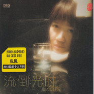

时光倒流
============================

|  |  |
| :--: | :-- |
| [ 时光倒流](https://emumo.xiami.com/album/498275) | **艺人**: [侃侃](../index.md) **语种**: 国语 **唱片公司**: 东升文化 **发行时间**: 2012年02月18日 **专辑类别**: 录音室专辑 **专辑风格**:  **播放数**: 1759685 **收藏数**: 954 **评论数**: 199  |

## 简介

侃侃继热播剧《北京爱情故事》插曲《滴答》风靡全国各大音乐平台  
且音乐网点击率占据NO.1。最新专辑《2012 时光倒流》，重磅上市！  
专辑选曲制作首首选精敲细磨，呕心沥血。诚邀业界顶级制作团队量身打造，回归音乐本质。  
这纯洁懒散而磁性的声音，在这暖暖的春日里最适合聆听的音色！  
聆听每一寸打动的声音，享受清音流韵的美感。  
  
时光静静地流淌，如水般悄无声息，那些人，那些事，已成为记忆中泛黄的风景，  某个夜晚，在一束灯光的温暖下，思念，回忆，青春，爱情，  如潮涌般重现，带你穿越时空，回到从前，  这里的每一首歌，都唱给那些如烟的过往，还有爱与被爱过的人，  略带沙哑的声线，忧伤感性的演绎，一起追忆逝去的青春，回味沧桑岁月的爱情。

## 曲目

- [寂静的天空](./498275/mQBrJL7ef38.md)
- [南飞雁](./498275/xLwq8wa4e77.md)
- [一江水](./498275/mQBrJN574be.md)
- [我最亲爱的](./498275/mQBrJO8035b.md)
- [灞桥](./498275/mQBrJPf3ba7.md)
- [知道不知道](./498275/mQBrJQ88581.md)
- [梦田](./498275/xLwq81a8479.md)
- [红蔷薇](./498275/bqvjkDw34aae.md)
- [时光倒流](./498275/bqvjkDx3b2d5.md)
- [细说往事](./498275/8Ghpxef8f4c.md)
- [溺爱](./498275/mQBrJVb9575.md)
- [雪莲花](./498275/xLwq86b790f.md)

## 评论

|  |  |  |  |
| :-- | :-- | :-- | :-- |
|  [虾米用户](https://emumo.xiami.com/u/3191610)  2017-10-27 23:24 赞(0) 踩(0) | 
单曲循环静静看书复习突然感觉内心很宁静。真的没有必要那么执着
 |
|  [虾米用户](https://emumo.xiami.com/u/228316255)  2016-09-20 22:33 赞(0) 踩(0) | 
我是铁杆粉
 |
|  [虾米用户](https://emumo.xiami.com/u/116686256)  2016-03-18 11:40 赞(0) 踩(0) | 
侃侃的歌很好听
 |
|  [虾米用户](https://emumo.xiami.com/u/1582050)  2015-11-08 22:30 赞(0) 踩(0) | 
喜欢侃侃的声音，很真，没有造作......是从心里流出的......， 音乐需要真诚。着急忙慌写的音乐都不成功，借用下，比韩红唱的好，他造作
 |
|  [虾米用户](https://emumo.xiami.com/u/26399451) 音乐的美只有心知道 2015-05-06 23:12 赞(0) 踩(0) | 
侃侃好好写歌啊。
 |
|  [虾米用户](https://emumo.xiami.com/u/5658563)  2015-04-06 11:07 赞(0) 踩(0) | 
好听，象多年的老朋友。
 |
|  [虾米用户](https://emumo.xiami.com/u/13732353) 寻找那美好的旋律。。。 2015-04-01 17:34 赞(0) 踩(0) | 
侃侃  时光倒流
 |
|  [虾米用户](https://emumo.xiami.com/u/48175496)  2015-03-15 21:33 赞(0) 踩(0) | 
纯净，时光倒流，给人安静的力量
 |
|  [虾米用户](https://emumo.xiami.com/u/21165466) 像风一样自由 2015-01-30 21:02 赞(0) 踩(0) | 
穿透力好强！喜欢这嗓音！能带着意去会那意！
 |
|  [虾米用户](https://emumo.xiami.com/u/4736915) 吸血鬼 2014-12-18 23:39 赞(0) 踩(0) | 
时光是多么纯粹的，这舒缓，这年代感，像烟雾缭绕，延绵不绝几千里。而我们置身其中，如风如飘，渺而不虚，仿佛顺时光倒流，遇见最初。
 |
|  [虾米用户](https://emumo.xiami.com/u/42434411)  2014-11-17 10:43 赞(0) 踩(0) | 
特别的嗓音...
 |
|  [虾米用户](https://emumo.xiami.com/u/6227075)  2014-11-11 19:46 赞(0) 踩(0) | 
欣赏
 |
|  [虾米用户](https://emumo.xiami.com/u/64554)  2014-11-10 15:50 赞(0) 踩(0) | 
自然流出的声音
 |
|  [虾米用户](https://emumo.xiami.com/u/36393417) 爱古典 2014-08-12 17:41 赞(0) 踩(0) | 
喜欢寂静的天空
 |
|  [虾米用户](https://emumo.xiami.com/u/6763057) 逍遙；解脫！ 2014-08-02 19:56 赞(0) 踩(0) | 
舒服的聲音
 |
|  [虾米用户](https://emumo.xiami.com/u/35616976)  2014-07-22 19:34 赞(0) 踩(0) | 
心里的话
 |
|  [虾米用户](https://emumo.xiami.com/u/11006248)  2014-05-05 23:23 赞(0) 踩(0) | 
喜欢的
 |
|  [虾米用户](https://emumo.xiami.com/u/6192202)  2014-04-12 04:32 赞(0) 踩(0) | 
听完整张专辑感觉是一首歌。。。一首《红蔷薇》就足够了。。。
 |
|  [虾米用户](https://emumo.xiami.com/u/33358545)  2014-03-08 09:27 赞(0) 踩(0) | 
我最爱听的音乐
 |
|  [虾米用户](https://emumo.xiami.com/u/33054830)  2014-02-21 16:16 赞(0) 踩(0) | 
好听
 |
|  [虾米用户](https://emumo.xiami.com/u/1609946) 一即一切 2014-02-20 22:29 赞(0) 踩(0) | 
心 境不二
 |
|  [虾米用户](https://emumo.xiami.com/u/31608192)  2014-01-14 09:45 赞(0) 踩(0) | 
很喜欢
 |
|  [虾米用户](https://emumo.xiami.com/u/7659334)  2014-01-02 16:29 赞(0) 踩(0) | 
赞！红蔷薇。
 |
|  [虾米用户](https://emumo.xiami.com/u/9932431)  2013-11-29 11:56 赞(0) 踩(0) | 
好听。。。
 |
|  [虾米用户](https://emumo.xiami.com/u/15995576)  2013-11-26 09:00 赞(0) 踩(0) | 
喜欢侃侃的淳朴
 |
|  [虾米用户](https://emumo.xiami.com/u/3416701)  2013-11-23 07:31 赞(0) 踩(0) | 
侃侃继热播剧《北京爱情故事》插曲《滴答》风靡全国各大音乐平台且音乐网点击率占据NO.1。最新专辑《2012 时光倒流》，重磅上市！专辑选曲制作首首选精敲细磨，呕心沥血。诚邀业界顶级制作团队量身打造，回归音乐本质。此唱片获2012最佳情歌专辑
 |
|  [虾米用户](https://emumo.xiami.com/u/9529780)  2013-11-17 12:06 赞(0) 踩(0) | 
真造作！！！
 |
|  [虾米用户](https://emumo.xiami.com/u/15296547) 南国风采 2013-11-09 05:17 赞(0) 踩(0) | 
时光静静地流淌，如水般悄无声息，那些人，那些事，已成为记忆中泛黄的风景， 某个夜晚，在一束灯光的温暖下，思念，回忆，青春，爱情， 如潮涌般重现，带你穿越时空，回到从前。
 |
|  [虾米用户](https://emumo.xiami.com/u/7558516)  2013-11-01 01:29 赞(0) 踩(0) | 
想念
 |
|  [虾米用户](https://emumo.xiami.com/u/8782582)  2013-10-31 23:23 赞(0) 踩(0) | 
清澈有魅力的声音.
 |
|  [虾米用户](https://emumo.xiami.com/u/16315021)  2013-10-06 09:56 赞(0) 踩(0) | 
撒旦啊
 |
|  [虾米用户](https://emumo.xiami.com/u/6741399)  2013-08-29 14:55 赞(0) 踩(0) | 
仿佛带我们到静静的河边
 |
|  [虾米用户](https://emumo.xiami.com/u/19436625)  2013-08-16 12:35 赞(0) 踩(0) | 
静听
 |
|  [虾米用户](https://emumo.xiami.com/u/18612057)  2013-08-07 15:23 赞(0) 踩(0) | 
喜欢
 |
|  [虾米用户](https://emumo.xiami.com/u/12346299)  2013-07-16 15:34 赞(0) 踩(0) | 
很清，很静
 |
|  [虾米用户](https://emumo.xiami.com/u/8029693)  2013-06-20 13:57 赞(0) 踩(0) | 
安静的、舒缓的、给人感伤的吟唱，喜欢！！！
 |
|  [虾米用户](https://emumo.xiami.com/u/27546) MArCo 2013-05-04 14:36 赞(0) 踩(0) | 
好歌者，可惜只能唱唱别人的歌，希望有更多好的原创歌曲给她唱啊。
 |
|  [虾米用户](https://emumo.xiami.com/u/14060320)  2013-04-25 01:52 赞(0) 踩(0) | 
侃侃的歌声可以让心安静沉醉，听了就难以放弃
 |
|  [虾米用户](https://emumo.xiami.com/u/11101576)  2013-04-06 13:38 赞(0) 踩(0) | 
喜欢低低的，安静的声音
 |
|  [虾米用户](https://emumo.xiami.com/u/4874803)  2013-03-07 18:15 赞(0) 踩(0) | 
喜欢
 |
|  [虾米用户](https://emumo.xiami.com/u/1191461)  2013-03-05 22:29 赞(0) 踩(0) | 
在旅行中听得歌曲
 |
|  [虾米用户](https://emumo.xiami.com/u/13254889)  2013-03-04 19:24 赞(0) 踩(0) | 
脚步太快，放慢些吧
 |
|  [虾米用户](https://emumo.xiami.com/u/13369897) 侃侃的歌听一辈子都不厌 2013-03-04 16:12 赞(0) 踩(0) | 
喜欢就是喜欢，没有理由。
 |
|  [虾米用户](https://emumo.xiami.com/u/13369897) 侃侃的歌听一辈子都不厌 2013-03-04 16:10 赞(0) 踩(0) | 
淡淡的、优雅的歌，听起来特别舒服。
 |
|  [虾米用户](https://emumo.xiami.com/u/9134017)  2013-03-03 15:25 赞(0) 踩(0) | 
好听
 |
|  [虾米用户](https://emumo.xiami.com/u/13120779)  2013-02-26 11:15 赞(0) 踩(0) | 
喜欢的她的舒缓和安静
 |
|  [虾米用户](https://emumo.xiami.com/u/9466240)  2013-02-21 13:59 赞(0) 踩(0) | 
时光 慢慢 静听心声
 |
|  [虾米用户](https://emumo.xiami.com/u/6106545)  2013-02-21 11:54 赞(0) 踩(0) | 
4年侃粉了，支持！
 |
|  [虾米用户](https://emumo.xiami.com/u/7966663)  2013-02-07 18:28 赞(0) 踩(0) | 
很舒服
 |
|  [虾米用户](https://emumo.xiami.com/u/11390869)  2013-02-01 12:38 赞(0) 踩(0) | 
ok
 |
|  [虾米用户](https://emumo.xiami.com/u/11567660) 大小世界 2013-01-14 22:46 赞(0) 踩(0) | 
空灵的声音，永远支持侃侃
 |
|  [虾米用户](https://emumo.xiami.com/u/10425458) I MISS MY D 2013-01-08 20:28 赞(0) 踩(0) | 
感同身受
 |
|  [虾米用户](https://emumo.xiami.com/u/7120787)  2012-12-28 09:53 赞(0) 踩(0) | 
纯洁而磁性的声音
 |
|  [虾米用户](https://emumo.xiami.com/u/8337431) 以乐会友 2012-12-28 04:40 赞(0) 踩(0) | 
改发烧了？
 |
|  [虾米用户](https://emumo.xiami.com/u/5742840) 云中游 2012-12-22 14:48 赞(0) 踩(0) | 
喜欢她的平静却充满了感情的声音，让我感到温暖、平静……
 |
|  [虾米用户](https://emumo.xiami.com/u/11773636)  2012-12-03 18:38 赞(0) 踩(0) | 
喜欢这种空灵的声音，永远支持侃侃
 |
|  [虾米用户](https://emumo.xiami.com/u/11210854)  2012-11-22 09:00 赞(0) 踩(0) | 
老婆喜欢，我就喜欢
 |
|  [虾米用户](https://emumo.xiami.com/u/4458242)  2012-10-29 12:28 赞(0) 踩(0) | 
太好听啦！
 |
|  [虾米用户](https://emumo.xiami.com/u/11183859)  2012-10-24 19:25 赞(0) 踩(0) | 
喜欢她的安静
 |
|  [虾米用户](https://emumo.xiami.com/u/3347377)  2012-09-30 23:43 赞(0) 踩(0) | 
喜欢侃侃
 |
|  [虾米用户](https://emumo.xiami.com/u/7040525)  2012-09-20 23:31 赞(0) 踩(0) | 
唱的很有味道，很像在讲着故事，歌声触心底
 |
|  [虾米用户](https://emumo.xiami.com/u/2836959) 我还没想好要写什么... 2012-09-20 01:40 赞(0) 踩(0) | 
“灞桥”唱得太好听了
 |
|  [虾米用户](https://emumo.xiami.com/u/10639335)  2012-09-16 17:51 赞(0) 踩(0) | 
太喜欢
 |
|  [虾米用户](https://emumo.xiami.com/u/9866974)  2012-09-12 12:55 赞(0) 踩(0) | 
很喜欢侃侃独特的嗓音，纯净，慵懒，浑厚，有一种混合的风味。希望继续听到她的好歌。她这张专辑中翻唱的歌，都唱出了自己的风格，相较于原唱，我更喜欢她唱的版本。
 |
|  [虾米用户](https://emumo.xiami.com/u/8542367) 这样  就好 2012-09-10 16:50 赞(0) 踩(0) | 
好听  喜欢   让人进到心底的声音……
 |
|  [虾米用户](https://emumo.xiami.com/u/6792324)   2012-09-06 21:48 赞(0) 踩(0) | 
时光倒流
 |
|  [虾米用户](https://emumo.xiami.com/u/10507645)  2012-09-05 15:46 赞(0) 踩(0) | 
飘~
 |
|  [虾米用户](https://emumo.xiami.com/u/9206613)  2012-09-03 21:00 赞(0) 踩(0) | 
很亲切的声音，很随和的唱法。百听不厌的音乐
 |
|  [虾米用户](https://emumo.xiami.com/u/10349449) 音乐无极限 2012-08-24 16:57 赞(0) 踩(0) | 
纯净质朴的声音，唱到了心灵的深处，太喜欢了
 |
|  [虾米用户](https://emumo.xiami.com/u/10343865)  2012-08-24 09:16 赞(0) 踩(0) | 
纯净的音乐给我精神的享受！
 |
|  [虾米用户](https://emumo.xiami.com/u/10125560)  2012-08-20 10:55 赞(0) 踩(0) | 
不知道为什么，就是喜欢，没办法。
 |
|  [虾米用户](https://emumo.xiami.com/u/10273438)  2012-08-19 00:52 赞(0) 踩(0) | 
甜美的孩子。。超级喜欢
 |
|  [虾米用户](https://emumo.xiami.com/u/9996163)  2012-08-18 16:54 赞(0) 踩(0) | 
安静 侃侃
 |
|  [虾米用户](https://emumo.xiami.com/u/9996163)  2012-08-18 16:41 赞(0) 踩(0) | 
好听
 |
|  [虾米用户](https://emumo.xiami.com/u/7625088)  2012-08-14 15:17 赞(0) 踩(0) | 
喜欢你很久很久咯............................
 |
|  [虾米用户](https://emumo.xiami.com/u/10038806)  2012-07-31 18:08 赞(0) 踩(0) | 
好好好
 |
|  [虾米用户](https://emumo.xiami.com/u/5719404) 放松心情 2012-07-31 15:48 赞(0) 踩(0) | 
一直情衷于汪峰的歌，没想到侃侃翻唱的《时光倒流》比起汪峰也是别有一番味道。支持！
 |
|  [虾米用户](https://emumo.xiami.com/u/9801862)  2012-07-29 06:46 赞(0) 踩(0) | 
好听，喜欢
 |
|  [虾米用户](https://emumo.xiami.com/u/9320001)  2012-07-27 19:20 赞(0) 踩(0) | 
纯净的声音~
 |
|  [虾米用户](https://emumo.xiami.com/u/9963792)  2012-07-26 16:05 赞(0) 踩(0) | 
好听
 |
|  [虾米用户](https://emumo.xiami.com/u/2226254)  2012-07-25 00:44 赞(0) 踩(0) | 
喜欢侃侃
 |
|  [虾米用户](https://emumo.xiami.com/u/9917415)  2012-07-22 21:34 赞(0) 踩(0) | 
喜欢这种风格的  动人心弦
 |
|  [虾米用户](https://emumo.xiami.com/u/9808123) 信封 2012-07-14 17:37 赞(0) 踩(0) | 
喜欢侃侃
 |
|  [虾米用户](https://emumo.xiami.com/u/9800605)  2012-07-14 00:53 赞(0) 踩(0) | 
安静　忧伤
 |
|  [虾米用户](https://emumo.xiami.com/u/6229958) 音乐天下最美的东西 2012-07-13 20:44 赞(0) 踩(0) | 
3
 |
|  [虾米用户](https://emumo.xiami.com/u/1097699)  2012-07-07 23:00 赞(0) 踩(0) | 
侃侃2012
 |
|  [虾米用户](https://emumo.xiami.com/u/7394508)  2012-07-06 19:21 赞(0) 踩(0) | 
很好
 |
|  [虾米用户](https://emumo.xiami.com/u/6211714)  2012-06-29 00:41 赞(0) 踩(0) | 
侃侃第五张专辑
 |
|  [虾米用户](https://emumo.xiami.com/u/9602485)  2012-06-27 01:22 赞(0) 踩(0) | 
舒缓，安静，爱上她，自然如水的诉说，魂魄之音
 |
|  [虾米用户](https://emumo.xiami.com/u/6243185)  2012-06-25 10:12 赞(0) 踩(0) | 
安静的灵魂之音
 |
|  [虾米用户](https://emumo.xiami.com/u/393034)  2012-06-23 10:55 赞(0) 踩(0) | 
清新
 |
|  [虾米用户](https://emumo.xiami.com/u/9448200) bbowen 2012-06-21 09:13 赞(0) 踩(0) | 
好听
 |
|  [虾米用户](https://emumo.xiami.com/u/8190439)  2012-06-16 09:42 赞(0) 踩(0) | 
好听，喜欢
 |
|  [虾米用户](https://emumo.xiami.com/u/9404806) 心无羁，行不止 2012-06-14 12:13 赞(0) 踩(0) | 
非常喜欢这种声音，纯净而略带伤感，让人听出流浪的味道
 |
|  [虾米用户](https://emumo.xiami.com/u/8840424)  2012-06-14 11:22 赞(0) 踩(0) | 
从嘀嗒找到了侃侃，才发现曾经喜欢的网络情歌也是她唱的，喜欢老家，喜欢侃侃
 |
|  [虾米用户](https://emumo.xiami.com/u/9404806) 心无羁，行不止 2012-06-11 11:19 赞(0) 踩(0) | 
非常喜欢的声音，从中听到了流浪的思绪，爱情的浪漫。。。
 |
|  [虾米用户](https://emumo.xiami.com/u/9335368)  2012-05-31 11:00 赞(0) 踩(0) | 
就这样听着发呆让思绪自由流淌吧
 |
|  [虾米用户](https://emumo.xiami.com/u/9322721)  2012-05-29 22:39 赞(0) 踩(0) | 
我喜欢非常爱听
 |
|  [虾米用户](https://emumo.xiami.com/u/9046113)  2012-05-29 17:36 赞(0) 踩(0) | 
声音很好听不错
 |
|  [虾米用户](https://emumo.xiami.com/u/8307411) 回家的票号难买 2012-05-28 06:06 赞(0) 踩(0) | 
不为什么就是喜欢
 |
|  [虾米用户](https://emumo.xiami.com/u/9301254)  2012-05-27 19:59 赞(0) 踩(0) | 
侃侃的歌总让人思绪侃侃
 |
|  [虾米用户](https://emumo.xiami.com/u/9272238)  2012-05-24 23:27 赞(0) 踩(0) | 
安静纯净
 |
|  [虾米用户](https://emumo.xiami.com/u/8829206)  2012-05-23 15:56 赞(0) 踩(0) | 
侃侃
 |
|  [虾米用户](https://emumo.xiami.com/u/9210879)  2012-05-22 13:34 赞(0) 踩(0) | 
丽江大理早就有侃侃的滴答了
 |
|  [虾米用户](https://emumo.xiami.com/u/9211554)  2012-05-18 17:42 赞(0) 踩(0) | 
喜欢这样慵懒的感觉去回味却又害怕伤心
 |
|  [虾米用户](https://emumo.xiami.com/u/9199455)  2012-05-17 17:15 赞(0) 踩(0) | 
磁性的声音令人神往
 |
|  [虾米用户](https://emumo.xiami.com/u/9189437)  2012-05-16 10:28 赞(0) 踩(0) | 
喜欢
 |
|  [虾米用户](https://emumo.xiami.com/u/9141276)  2012-05-14 11:47 赞(0) 踩(0) | 
好喜欢
 |
|  [虾米用户](https://emumo.xiami.com/u/7679475)  2012-05-12 12:58 赞(0) 踩(0) | 
民谣风格，清新动人
 |
|  [虾米用户](https://emumo.xiami.com/u/4985696)  2012-05-10 15:23 赞(0) 踩(0) | 
触及我的内心，有共鸣！
 |
|  [虾米用户](https://emumo.xiami.com/u/6772197)  2012-05-08 12:02 赞(0) 踩(0) | 
挺自然的声音，没有任何修饰的痕迹，从心里自然的流出。
 |
|  [虾米用户](https://emumo.xiami.com/u/8542367) 这样  就好 2012-05-07 18:31 赞(0) 踩(0) | 
干净  舒畅  静心  飘远^-^
 |
|  [虾米用户](https://emumo.xiami.com/u/9056833)  2012-05-07 09:29 赞(0) 踩(0) | 
很美的声音
 |
|  [虾米用户](https://emumo.xiami.com/u/9028509)  2012-04-29 19:58 赞(0) 踩(0) | 
超喜欢
 |
|  [虾米用户](https://emumo.xiami.com/u/7542452)  2012-04-25 13:25 赞(0) 踩(0) | 
很喜欢侃侃的歌声
 |
|  [虾米用户](https://emumo.xiami.com/u/8927264)  2012-04-25 11:31 赞(0) 踩(0) | 
空旷安静神往喜欢
 |
|  [虾米用户](https://emumo.xiami.com/u/3110255)  2012-04-24 13:49 赞(0) 踩(0) | 
四十岁老男孩不可救药地喜欢这些歌
 |
|  [虾米用户](https://emumo.xiami.com/u/8947025)  2012-04-24 10:02 赞(0) 踩(0) | 
沙哑的声音带有怀旧的情怀
 |
|  [虾米用户](https://emumo.xiami.com/u/8811757)  2012-04-22 12:19 赞(0) 踩(0) | 
喜欢侃侃的歌
 |
|  [虾米用户](https://emumo.xiami.com/u/677055)  2012-04-21 09:12 赞(0) 踩(0) | 
******
 |
|  [虾米用户](https://emumo.xiami.com/u/657457)  2012-04-20 22:00 赞(0) 踩(0) | 
多年来 唯一的
 |
|  [虾米用户](https://emumo.xiami.com/u/8918414)  2012-04-20 11:49 赞(0) 踩(0) | 
像丽江的小桥流水
 |
|  [虾米用户](https://emumo.xiami.com/u/8917853)  2012-04-19 21:33 赞(0) 踩(0) | 
因为寂静的天空
 |
|  [虾米用户](https://emumo.xiami.com/u/8905717)  2012-04-18 13:59 赞(0) 踩(0) | 
很好听的音乐很有实力的创作歌手
 |
|  [虾米用户](https://emumo.xiami.com/u/8889458)  2012-04-16 21:18 赞(0) 踩(0) | 
喜欢就是喜欢
 |
|  [虾米用户](https://emumo.xiami.com/u/8231013)  2012-04-13 07:51 赞(0) 踩(0) | 
侃侃新专辑啊，总有惊艳的表现
 |
|  [虾米用户](https://emumo.xiami.com/u/8619657)  2012-04-12 22:29 赞(0) 踩(0) | 
南飞燕，寂静的天空，一句话：纯洁的音乐
 |
|  [虾米用户](https://emumo.xiami.com/u/3391897) 我还没想好要写什么... 2012-04-12 01:52 赞(0) 踩(0) | 
多了份成熟的淡然
 |
|  [虾米用户](https://emumo.xiami.com/u/8822963)  2012-04-11 10:07 赞(0) 踩(0) | 
就是喜欢侃侃的声音淡泊干净百听不厌
 |
|  [虾米用户](https://emumo.xiami.com/u/8811757)  2012-04-10 10:33 赞(0) 踩(0) | 
喜欢侃侃的歌
 |
|  [虾米用户](https://emumo.xiami.com/u/8802242)  2012-04-09 14:05 赞(0) 踩(0) | 
纯净的声音有感觉
 |
|  [虾米用户](https://emumo.xiami.com/u/7872137) 音乐抚慰心灵 2012-04-09 10:19 赞(0) 踩(0) | 
在静静的吟唱中，从心底流淌出涓涓细流，是歌声更是心与心的对白……
 |
|  [虾米用户](https://emumo.xiami.com/u/5443073)  2012-04-08 15:12 赞(0) 踩(0) | 
声音独特
 |
|  [虾米用户](https://emumo.xiami.com/u/8634337)  2012-04-06 09:10 赞(0) 踩(0) | 
好特别的音色
 |
|  [虾米用户](https://emumo.xiami.com/u/8756754)  2012-04-06 02:35 赞(0) 踩(0) | 
喜欢侃侃1
 |
|  [虾米用户](https://emumo.xiami.com/u/8383069)  2012-04-03 20:47 赞(1) 踩(0) | 
感染力，无论原创还是翻唱，都具有渗透力极强的感染力，很幸运发现了这位歌手，虽然晚了一点
 |
|  [虾米用户](https://emumo.xiami.com/u/8410527)  2012-04-02 01:55 赞(0) 踩(0) | 
可以用心去听的歌现在真的不多了，侃侃的歌声不去做多的解释，自己听
 |
|  [虾米用户](https://emumo.xiami.com/u/8622618)  2012-03-31 21:11 赞(0) 踩(0) | 
声音挺有吸引力的
 |
|  [虾米用户](https://emumo.xiami.com/u/7591660)  2012-03-31 16:51 赞(0) 踩(0) | 
侃侃
 |
|  [虾米用户](https://emumo.xiami.com/u/8650487)  2012-03-30 23:42 赞(0) 踩(0) | 
很喜欢她忧郁的声音
 |
|  [虾米用户](https://emumo.xiami.com/u/8400035)  2012-03-29 11:18 赞(0) 踩(0) | 
一直喜欢
 |
|  [虾米用户](https://emumo.xiami.com/u/8400035)  2012-03-29 11:17 赞(0) 踩(0) | 
一直喜欢 从未改变
 |
|  [虾米用户](https://emumo.xiami.com/u/8608948)  2012-03-28 22:22 赞(0) 踩(0) | 
天籁之音
 |
|  [虾米用户](https://emumo.xiami.com/u/8606276)  2012-03-28 16:11 赞(0) 踩(0) | 
天籁以前只知道中国有朱哲琴和田震现在有了侃侃
 |
|  [虾米用户](https://emumo.xiami.com/u/8391970)  2012-03-28 11:35 赞(0) 踩(0) | 
侃侃的声音真的很好听，喜欢！
 |
|  [虾米用户](https://emumo.xiami.com/u/2291475) 爱拼才会赢 2012-03-28 09:18 赞(0) 踩(0) | 
侃侃,舒缓歌曲,时光倒流,喜欢,
 |
|  [虾米用户](https://emumo.xiami.com/u/8620257)  2012-03-27 20:00 赞(0) 踩(0) | 
很有年轻的感觉
 |
|  [虾米用户](https://emumo.xiami.com/u/4263142)  2012-03-27 13:37 赞(0) 踩(0) | 
喜欢
 |
|  [虾米用户](https://emumo.xiami.com/u/3224578)  2012-03-26 11:51 赞(0) 踩(0) | 
《滴答》这首歌我也是通过《北京爱情故事》片尾曲开始有所接触，最后是在虾米推荐上听到这首歌，歌词简单，嗓音醇和有种慵懒小蚕桑的感觉在里面，可以说这个歌手嗓音特别容易分别，不错不错。
 |
|  [虾米用户](https://emumo.xiami.com/u/5748805)  2012-03-26 09:35 赞(0) 踩(0) | 
声音好纯
 |
|  [虾米用户](https://emumo.xiami.com/u/665707)  2012-03-26 00:42 赞(0) 踩(0) | 
喜欢
 |
|  [虾米用户](https://emumo.xiami.com/u/5766470)  2012-03-25 12:48 赞(0) 踩(0) | 
纯净的从心灵里流淌出来的呢喃
 |
|  [虾米用户](https://emumo.xiami.com/u/3482788)  2012-03-25 11:51 赞(0) 踩(0) | 
最喜欢 寂静的天空，灞桥，细说往事
 |
|  [虾米用户](https://emumo.xiami.com/u/7755011) 我还没想好要写什么... 2012-03-25 09:53 赞(0) 踩(0) | 
喜欢侃侃的声音，很真，没有造作......是从心里流出的......， 音乐需要真诚。着急忙慌写的音乐都不成功，反而小时候写的歌流传更广。那是的作品也许幼稚，但是真诚。
 |
|  [虾米用户](https://emumo.xiami.com/u/623985)  2012-03-23 23:09 赞(0) 踩(0) | 
喜欢没有原因
 |
|  [虾米用户](https://emumo.xiami.com/u/8490330)  2012-03-23 12:33 赞(0) 踩(0) | 
就在她的歌声中 让时光缓缓倒流
 |
|  [虾米用户](https://emumo.xiami.com/u/8551498)  2012-03-23 08:18 赞(0) 踩(0) | 
henhaoting
 |
|  [虾米用户](https://emumo.xiami.com/u/8544124)  2012-03-22 19:12 赞(0) 踩(0) | 
侃侃的歌清纯，伤感，能够抚慰伤痛。
 |
|  [虾米用户](https://emumo.xiami.com/u/8328805)  2012-03-22 11:42 赞(0) 踩(0) | 
超级喜欢她的歌
 |
|  [虾米用户](https://emumo.xiami.com/u/651403) 像一片叶子默默承受季节的... 2012-03-21 20:46 赞(0) 踩(0) | 
突然侃侃那么红了
 |
| ⇒ |  [虾米用户](https://emumo.xiami.com/u/3210792) Podcast@频率FM 2012-03-23 11:08 赞(0) 踩(0) | 
人在丽江红了好几年了。养活了一个产业链呢。。。
 |
|  [虾米用户](https://emumo.xiami.com/u/661739)  2012-03-21 09:40 赞(0) 踩(0) | 
喜欢她的声音和歌
 |
|  [虾米用户](https://emumo.xiami.com/u/728392) SHCJ。而立。 2012-03-21 00:25 赞(0) 踩(0) | 
我去！这首《寂静的天空》如果侃侃没说是翻唱，那就坏了，这歌和珊妈的《Old Melodie》百分之九十九相似啊！！！！！！！！！！！！！！！！！！！！！！！！！！！！！！！！！
 |
|  [虾米用户](https://emumo.xiami.com/u/6143971)  2012-03-20 11:55 赞(0) 踩(0) | 
听侃侃的音乐是一种享受
 |
|  [虾米用户](https://emumo.xiami.com/u/5515499)  2012-03-19 19:52 赞(0) 踩(0) | 
嘀嗒的女声，侃侃，首张个人专辑
 |
|  [虾米用户](https://emumo.xiami.com/u/8152500)  2012-03-19 15:35 赞(0) 踩(0) | 
2010年和爱人一起去云南丽江，大街小巷都是侃侃吉他版的《滴答》，影响深刻......
 |
|  [虾米用户](https://emumo.xiami.com/u/2160605) 醉了 2012-03-18 18:48 赞(0) 踩(0) | 
侃侃
 |
|  [虾米用户](https://emumo.xiami.com/u/8485560)  2012-03-18 16:46 赞(0) 踩(0) | 
不错啊
 |
|  [虾米用户](https://emumo.xiami.com/u/8461332)  2012-03-17 12:24 赞(0) 踩(0) | 
用了我好多虾米。。。。55
 |
|  [虾米用户](https://emumo.xiami.com/u/5073144)  2012-03-17 10:51 赞(0) 踩(0) | 
适合在有太阳的慵懒的午后听，特别美
 |
|  [虾米用户](https://emumo.xiami.com/u/8461385)  2012-03-17 09:09 赞(0) 踩(0) | 
通透清泽,
 |
|  [虾米用户](https://emumo.xiami.com/u/106271)  2012-03-16 17:43 赞(0) 踩(0) | 
这张翻唱不如上一张啊，歌曲选的有些失败， 瞎了《细说往事》，就别翻唱同样是爱翻唱的小娟的了。。。。
 |
|  [虾米用户](https://emumo.xiami.com/u/3505883)  2012-03-16 14:27 赞(0) 踩(0) | 
连主打都是翻的汪峰 可惜没原唱好
 |
|  [虾米用户](https://emumo.xiami.com/u/3505883)  2012-03-16 14:21 赞(0) 踩(0) | 
这难道是翻唱大聚会咩！！！
 |
|  [虾米用户](https://emumo.xiami.com/u/4751654)  2012-03-16 13:24 赞(0) 踩(0) | 
喜欢的风格，关注
 |
|  [虾米用户](https://emumo.xiami.com/u/8427814)  2012-03-14 20:31 赞(0) 踩(0) | 
声音很纯净
 |
|  [虾米用户](https://emumo.xiami.com/u/8423085)  2012-03-14 14:08 赞(0) 踩(0) | 
喜欢
 |
|  [虾米用户](https://emumo.xiami.com/u/8406978)  2012-03-12 22:18 赞(0) 踩(0) | 
第一次听的是滴答，那是在世博会里面看西塘河里面册插曲。后来找了好久才找到，但是现在不一样了，这首歌火起来了。。。。声音好听，赞一个。
 |
|  [虾米用户](https://emumo.xiami.com/u/8390291)  2012-03-11 18:11 赞(0) 踩(0) | 
为什么下载一直不成功？
 |
|  [虾米用户](https://emumo.xiami.com/u/2695519)  2012-03-11 11:27 赞(0) 踩(0) | 
喜欢
 |
|  [虾米用户](https://emumo.xiami.com/u/8362868)  2012-03-09 23:16 赞(0) 踩(0) | 
好听，怀旧，纯净。
 |
|  [虾米用户](https://emumo.xiami.com/u/3482788)  2012-03-09 21:35 赞(0) 踩(0) | 
初听小三和弦是04年的夏天。以后的岁月里，关注你的每首歌曲。新专辑延续了以往的风格，声音依然动人。可惜没有原创。
 |
|  [虾米用户](https://emumo.xiami.com/u/3130313)  2012-03-09 21:13 赞(0) 踩(0) | 
略带沙哑的声线，忧伤感性的演绎，爱静的我，好喜欢。
 |
|  [虾米用户](https://emumo.xiami.com/u/8304117)  2012-03-09 08:01 赞(0) 踩(0) | 
从《滴答》开始喜欢上的侃侃，喜欢她那慵懒的声音，听着心情宁静
 |
|  [虾米用户](https://emumo.xiami.com/u/3482788)  2012-03-08 07:50 赞(0) 踩(0) | 
喜欢
 |
|  [虾米用户](https://emumo.xiami.com/u/3769677)  2012-03-07 22:40 赞(0) 踩(0) | 
一直就喜欢！
 |
|  [虾米用户](https://emumo.xiami.com/u/3769677)  2012-03-07 22:40 赞(0) 踩(0) | 
柔柔的淡淡的有些伤感的声音，纯纯的声声慢！
 |
|  [虾米用户](https://emumo.xiami.com/u/665217) 老马 2012-03-07 11:55 赞(0) 踩(0) | 
温暖的声音
 |
|  [虾米用户](https://emumo.xiami.com/u/7483889)  2012-03-07 10:07 赞(0) 踩(0) | 
很清爽安静的女声.
 |
|  [虾米用户](https://emumo.xiami.com/u/3490632)  2012-03-07 09:29 赞(0) 踩(0) | 
新砖耶
 |
|  [虾米用户](https://emumo.xiami.com/u/7417757) 音乐无国界 2012-03-07 00:12 赞(0) 踩(0) | 
挺好
 |
|  [虾米用户](https://emumo.xiami.com/u/8254590)  2012-03-06 22:26 赞(0) 踩(0) | 
专辑介绍：侃侃最新专辑《2012 时光倒流》，重磅上市！专辑选曲制作首首选精敲细磨，呕心沥血。诚邀业界顶级制作团队量身打造，回归音乐本质。这纯洁懒散而磁性的声音，在这暖暖的春日里最适合聆听的音色！聆听每一寸打动的声音，享受清音流韵的美感。
 |
|  [虾米用户](https://emumo.xiami.com/u/7269818) 士多啤梨屋...... 2012-03-06 20:46 赞(0) 踩(0) | 
喜欢她的声音
 |
|  [虾米用户](https://emumo.xiami.com/u/179780) 快乐的时候你听的是音乐。... 2012-03-06 19:22 赞(0) 踩(0) | 
喜欢她的音乐。
 |
|  [虾米用户](https://emumo.xiami.com/u/6775561) 我还没想好要写什么... 2012-03-06 19:15 赞(0) 踩(0) | 
不错！
 |
|  [虾米用户](https://emumo.xiami.com/u/1232996)  2012-03-06 19:02 赞(0) 踩(0) | 
猪八戒
 |
|  [虾米用户](https://emumo.xiami.com/u/8319432)  2012-03-06 16:34 赞(0) 踩(0) | 
流行
 |
|  [虾米用户](https://emumo.xiami.com/u/8272754)  2012-03-06 14:20 赞(0) 踩(0) | 
听完第一首，很好听！
 |
|  [虾米用户](https://emumo.xiami.com/u/8272754)  2012-03-06 14:14 赞(0) 踩(0) | 
听完第一首，很好听！
 |
