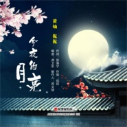
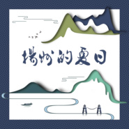
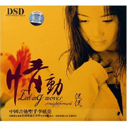

侃侃
============================

|  |  |
| :--: | :-- |
| [<br>侃侃](https://i.xiami.com/kankan) | **地区**: China 中国大陆<br>**风格**: 城市民谣 Urban Folk, 民谣流行 Folk Pop<br>**播放数**: 42004226<br>**粉丝数**: 41642<br>**评论数**: 894<br> |

## 档案

<div>
小档案<br>
中   文   名：侃侃<br>
外   文   名：  Kan Kan<br>
国        籍：中国<br>
民        族：汉族<br>
星        座：白羊座<br>
血        型：  A  型<br>
出   生   地：江苏省扬州市<br>
出生日期：   4  月  16  日<br>
职        业：歌手<br>
代表作品：滴答<br>
主要成就：  2012  年“第  11  届  CCTV-MTV  音乐盛典”年度最受欢迎网络歌曲奖：滴答<br>
简介<br>
侃侃，出生于江苏省扬州市，中国内地女歌手。<br>
演艺经历<br>
2004  年，推出首张个人音乐专辑《我是侃侃》，从而正式出道。<br>
2006  年，推出第二张个人音乐专辑《老家》，收录了包括《滴答》、《网络情缘》等在内的  11  首歌曲及  1  首伴奏。<br>
2007  年  2  月，推出第三张个人音乐专辑《情动》，收录了包括《生日圆舞》、《大礼堂》等在内的  11  首歌曲。<br>
2011  年，其演唱的歌曲《滴答》被选为电视剧《北京爱情故事》的插曲；同年  3  月，推出第四张个人音乐专辑《爱深藏》，收录了包括《把爱深藏》、《滴答》等在内的  12  首歌曲。<br>
2012  年  2  月，推出第五张个人音乐专辑《时光倒流》，收录了包括《我最亲爱的》、《知道不知道》等在内的  12  首歌曲；同年，签约广东火烈鸟文化有限公司；同年  8  月，推出第六张个人音乐专辑《清音流韵》，收录了包括《滴答（特别海外珍藏音乐编曲版）》、《爱情啊》等在内的  12  首歌曲及  1  首伴奏；同年  8  月  21  日，出席“第  11  届  CCTV-MTV  音乐盛典”，凭借歌曲《滴答》获得年度最受欢迎网络歌曲奖；同年  12  月，推出第七张个人音乐专辑《穿过生命散发的芬芳》，收录了包括《所事事的夏天》、《青春碎语》等在内的  11  首歌曲。<br>
2013  年  2  月，参加央视“蛇年春节联欢晚会”，并与李晨合唱歌曲《滴答》；同年  5  月，推出第八张个人音乐专辑《快乐时光》，收录了包括《听妈妈讲那过去的事情》、《爷爷为我打月饼》等在内的  12  首歌曲；同年  6  月，推出个人单曲《谢幕》；同年  8  月，推出个人单曲《再爱》，并作为电影《痒婚之十年再爱你》的主题曲。<br>
2014  年  9  月，推出第九张个人音乐专辑《味道》，收录了包括《滴答   （吉它演唱版）》、《天亮了   我一个人上路》等在内的  13  首歌曲。<br>
2015  年  6  月，推出个人单曲《盛世中国美》，并作为“  2015  世界小姐”中国区总决赛的主题曲；同年  8  月，推出个人民谣单曲《仙女山的月亮》。
</div>

## 专辑

| 名称 | 语种 | 唱片公司 | 发行时间 | 专辑类别 | 专辑风格 |
| :--: | :-- | :-- | :-- | :-- | :-- |
| [<br>夕阳下的伊雷木湖](./albums/2105536653.md) | 国语 | 富蕴欢喜 | 2019年11月30日 | 录音室专辑 | 新世纪音乐 New Age, 世界音乐 World Music |
| [<br>小小少年](./albums/2105523393.md) | 国语 | 富蕴欢喜 | 2019年11月26日 | 录音室专辑 | 儿童音乐 Children's Music, 儿歌 Nursery Rhyme |
| [<br>今夜的月亮](./albums/2105233702.md) | 国语 | 星外星音乐 | 2019年09月13日 | EP, 单曲 |  |
| [<br>夫妻树](./albums/2105222676.md) | 国语 | 富蕴欢喜 | 2019年09月05日 | 录音室专辑 | 民谣 Folk |
| [<br>豆梨树](./albums/2105182084.md) | 国语 | 富蕴欢喜 | 2019年08月26日 | 录音室专辑 | 城市民谣 Urban Folk |
| [<br>多伦路的夏天](./albums/2104972053.md) | 国语 | 星外星音乐 | 2019年07月08日 | EP, 单曲 |  |
| [<br>我是可可苏里苏珊](./albums/2104938936.md) | 国语 |  | 2019年06月11日 | EP, 单曲 | 民谣流行 Folk Pop |
| [<br>光之崀](./albums/2104037354.md) | 国语 | 独立发行 | 2018年09月15日 | EP, 单曲 | 民谣流行 Folk Pop |
| [<br>植觉](./albums/2102665712.md) | 国语 | 乐升唱片 | 2018年09月01日 | 录音室专辑 |  |
| [<br>ADD LOVE](./albums/2103931730.md) | 英语 | 独立发行 | 2018年08月17日 | EP, 单曲 | 民谣 Folk, 福音 Gospel, 世界音乐 World Music |
| [<br>射阳湖畔](./albums/2105159948.md) | 国语 |  | 2018年05月15日 | EP, 单曲 | 古风 GuFeng Music, 民谣流行 Folk Pop |
| [<br>想家了 念家了 你就往回走](./albums/2103511906.md) | 国语 | 星外星音乐 | 2018年02月06日 | EP, 单曲 |  |
| [<br>再见北京](./albums/2102975405.md) | 国语 | 星外星音乐 | 2017年12月19日 | EP, 单曲 |  |
| [<br>扬州的夏日](./albums/2102817922.md) | 国语 | 十三月唱片 | 2017年08月21日 | EP, 单曲 | 民谣流行 Folk Pop |
| [<br>扬州故事](./albums/2102744616.md) | 国语 | 星外星音乐 | 2017年05月10日 | EP, 单曲 | 中国风 China-Wave, 国语流行 Mandarin Pop |
| [<br>时光回](./albums/2100373265.md) | 国语 | 星外星音乐 | 2016年12月12日 | EP, 单曲 |  |
| [<br>睡吧 宝贝](./albums/2100390751.md) | 国语 | 星外星音乐 | 2016年09月20日 | 录音室专辑 |  |
| [<br>在远方](./albums/2100234398.md) | 国语 | 禾信科技 | 2015年11月07日 | 录音室专辑 |  |
| [<br>蝴蝶](./albums/2100216534.md) | 国语 | 通力唱片 | 2015年10月10日 | EP, 单曲 |  |
| [<br>仙女山的月亮](./albums/2100181194.md) | 国语 | 星外星音乐 | 2015年08月17日 | EP, 单曲 |  |
| [<br>盛世中国美](./albums/574614.md) | 国语 | 星外星音乐 | 2015年06月19日 | EP, 单曲 | 国语流行 Mandarin Pop |
| [<br>短信家书](./albums/2100373056.md) | 国语 | 星外星音乐 | 2015年01月01日 | EP, 单曲 |  |
| [<br>味道](./albums/611881796.md) | 国语 | 天艺唱片 | 2014年09月25日 | 录音室专辑 | 国语流行 Mandarin Pop |
| [<br>再爱](./albums/1920684111.md) | 国语 | 掌上精彩 | 2013年08月28日 | EP, 单曲 |  |
| [<br>谢幕](./albums/573315.md) | 国语 | 中视华影 | 2013年06月19日 | EP, 单曲 |  |
| [<br>快乐时光Happy Time](./albums/669274168.md) | 国语 | 东昇魔音 | 2013年05月17日 | 录音室专辑 |  |
| [<br>穿过生命散发的芬芳](./albums/565741.md) | 国语 | 火烈鸟文化 | 2012年12月01日 | 录音室专辑 |  |
| [<br>清音流韵](./albums/539883.md) | 国语 | 广东音像 | 2012年08月20日 | 录音室专辑 | 国语流行 Mandarin Pop |
| [<br>时光倒流](./albums/498275.md) | 国语 | 东升文化 | 2012年02月18日 | 录音室专辑 |  |
| [<br>爱深藏](./albums/429492.md) | 国语 | 广东音像 | 2011年03月02日 | 录音室专辑 | 国语流行 Mandarin Pop |
| [<br>情动](./albums/9622.md) | 国语 | 乐满天文化 | 2007年02月01日 | 录音室专辑 | 校园民谣 Campus Folk, 城市民谣 Urban Folk, 民谣流行 Folk Pop |
| [<br>老家](./albums/9623.md) | 国语 | 美美音像 | 2006年03月01日 | 录音室专辑 | 校园民谣 Campus Folk, 城市民谣 Urban Folk, 民谣流行 Folk Pop |
| [<br>我是侃侃](./albums/9624.md) | 国语 | 上海声像 | 2004年07月09日 | 录音室专辑 | 城市民谣 Urban Folk, 校园民谣 Campus Folk, 华语唱作人 Chinese Singer-Songwriter |

## 评论

|  |  |  |
| :-- | :-- | :-- |
| <br>[虾米用户](https://emumo.xiami.com/u/4198380)<br><br>2021-01-13 22:56<br>赞(0) 踩(0) | <div>网络情缘让我想起qq的初恋</div> |
| <br>[虾米用户](https://emumo.xiami.com/u/345748010)<br>自然<br>2021-01-08 21:39<br>赞(0) 踩(0) | <div>珍重</div> |
| <br>[虾米用户](https://emumo.xiami.com/u/280951595)<br><br>2020-10-31 20:23<br>赞(0) 踩(0) | <div>请问为什么我经常在歌舞厅或者某些网上搜索&amp;ldquo;网络情缘&amp;rdquo;这首歌搜不到&amp;ldquo;网上一个你，网上一个我&amp;rdquo;这首而是另外一首歌，是有别的名字吗？</div> |
| <br>[虾米用户](https://emumo.xiami.com/u/402745091)<br><br>2020-10-19 22:32<br>赞(1) 踩(0) | <div>喜欢你的声音。加油！你会越来越棒的！</div> |
| <br>[虾米用户](https://emumo.xiami.com/u/423103990)<br><br>2020-09-23 14:52<br>赞(0) 踩(0) | <div>喜欢你的嗓子。加油！你会越来越棒的！ </div> |
| <br>[虾米用户](https://emumo.xiami.com/u/412116291)<br><br>2020-09-15 19:20<br>赞(0) 踩(0) | <div>嗯嗯，虽然不认识你，但是滴答确实很慵懒，喜欢！</div> |
| <br>[虾米用户](https://emumo.xiami.com/u/3677774)<br><br>2020-08-26 10:05<br>赞(0) 踩(0) | <div>一把好嗓子，不错不错。</div> |
| <br>[虾米用户](https://emumo.xiami.com/u/432601938)<br>我爱我老婆。<br>2020-06-09 00:09<br>赞(0) 踩(0) | <div>你最近过的好吗？</div> |
| <br>[虾米用户](https://emumo.xiami.com/u/337277612)<br><br>2020-05-30 22:18<br>赞(0) 踩(0) | <div>现在上下班的途中，播放的是侃侃的歌曲，很好听！</div> |
| <br>[虾米用户](https://emumo.xiami.com/u/427526651)<br><br>2020-03-19 18:03<br>赞(1) 踩(0) | <div>好喜欢你的&amp;ldquo;嘀嗒&amp;rdquo;这首歌！ </div> |
| <br>[虾米用户](https://emumo.xiami.com/u/268898591)<br>我爱你。永远都爱，一直都...<br>2020-03-15 23:47<br>赞(1) 踩(0) | <div>侃侃现在也是&amp;ldquo;贵人&amp;rdquo;了，听她的歌，有些是要付钱的。虽然卖得很贱，但也是卖。</div> |
| <br>[虾米用户](https://emumo.xiami.com/u/268898591)<br>我爱你。永远都爱，一直都...<br>2020-03-15 05:09<br>赞(0) 踩(0) | <div>侃侃的笑容真甜！真美！</div> |
| <br>[虾米用户](https://emumo.xiami.com/u/441400862)<br><br>2020-03-15 02:35<br>赞(0) 踩(0) | <div>歌声甜美，谢谢您的歌声带来的好心情，谢谢 </div> |
| <br>[虾米用户](https://emumo.xiami.com/u/211880387)<br>Smile and La...<br>2020-02-28 12:34<br>赞(0) 踩(0) | <div>侃侃的嗓子真的很好。但歌词好的不多，直白地表达是美中不足。陈粒的嗓子也好，歌词更是奇幻，所以她的歌迷更加稳定下。这或许是侃侃可以借鉴的</div> |
| <br>[虾米用户](https://emumo.xiami.com/u/211880387)<br>Smile and La...<br>2020-02-28 12:31<br>赞(0) 踩(0) | <div>一个看脸的娱乐圈，不成熟的审美观念，耽误了多少人，浪费了多少好嗓子。没有好的机会，没有好的歌曲，受到很多人的排斥歧视。这也是乐坛近年来光辉不复的原因吧……老一辈的歌手依旧如日中天，新一代不再以实力派为支柱，金砂还得从小众的歌手中淘出。</div> |
| <br>[虾米用户](https://emumo.xiami.com/u/366312646)<br><br>2020-01-16 15:58<br>赞(0) 踩(0) | <div>喜欢你的歌</div> |
| <br>[虾米用户](https://emumo.xiami.com/u/339710707)<br><br>2020-01-12 20:10<br>赞(0) 踩(0) | <div>有谁知道小三和弦论坛的。侃侃你说我是不是很早的歌迷啊  </div> |
| <br>[虾米用户](https://emumo.xiami.com/u/339710707)<br><br>2020-01-12 19:51<br>赞(0) 踩(0) | <div>有谁知道kankan.CC。当年还没出名时我就知道   </div> |
| <br>[虾米用户](https://emumo.xiami.com/u/428019682)<br>一念到天堂，一念到地狱。...<br>2019-12-24 19:36<br>赞(1) 踩(0) | <div>很喜欢你的歌</div> |
| <br>[虾米用户](https://emumo.xiami.com/u/325205625)<br><br>2019-12-15 16:49<br>赞(0) 踩(0) | <div>，</div> |
| <br>[虾米用户](https://emumo.xiami.com/u/305651893)<br><br>2019-12-03 16:05<br>赞(0) 踩(0) | <div>您的名字怎么念</div> |
| <br>[虾米用户](https://emumo.xiami.com/u/408066836)<br>这世界只剩下音乐是纯粹的...<br>2019-11-10 20:11<br>赞(1) 踩(0) | <div>侃侃的声音和她的相貌如此贴切和谐，这就是完美，这正是我最喜欢的。</div> |
| <br>[虾米用户](https://emumo.xiami.com/u/430778956)<br><br>2019-11-09 15:15<br>赞(0) 踩(0) | <div>真好听</div> |
| <br>[虾米用户](https://emumo.xiami.com/u/429818518)<br><br>2019-09-15 19:56<br>赞(0) 踩(0) | <div>没次听到这首歌都感觉回到了从前，有一种莫名的悲伤。</div> |
| <br>[虾米用户](https://emumo.xiami.com/u/425300905)<br><br>2019-09-06 18:48<br>赞(0) 踩(0) | <div>可以多出作品吗</div> |
| <br>[虾米用户](https://emumo.xiami.com/u/425300905)<br><br>2019-09-06 18:48<br>赞(1) 踩(0) | <div>好好听</div> |
| <br>[虾米用户](https://emumo.xiami.com/u/305220717)<br>虾米配茶<br>2019-08-31 00:58<br>赞(0) 踩(0) | <div>好</div> |
| <br>[虾米用户](https://emumo.xiami.com/u/427971400)<br>仲夏五月各花开，一品众花...<br>2019-08-17 22:55<br>赞(3) 踩(0) | <div>侃侃之歌，天籁之音，净化心灵。   </div> |
| <br>[虾米用户](https://emumo.xiami.com/u/409499271)<br><br>2019-08-15 19:27<br>赞(0) 踩(0) | <div>就因你也是白羊座呀</div> |
| <br>[虾米用户](https://emumo.xiami.com/u/428420515)<br>随便听听<br>2019-08-09 16:03<br>赞(1) 踩(0) | <div>从09年春节在丽江，经过一家银铺听到“滴答”（那时还不知道歌名）就对你的嗓音痴心不改。回家后抓心挠肝，后悔没去问问歌名！！！次年，外甥女到丽江谋生。我让她帮我找这首歌，我却说不出歌名。还好她听懂了我对这首歌的感觉和描述。给我找到了一张你的专辑（抱歉，不记得专辑名了）。。。“滴答滴答”，这首歌叫“滴答滴答”。。。侃侃，祝你幸福哈！  </div> |
| <br>[虾米用户](https://emumo.xiami.com/u/163799750)<br><br>2019-07-23 05:08<br>赞(1) 踩(0) | <div>你的声音很好听，配乐也好听，当然关键是你的声音很甜美。</div> |
| <br>[虾米用户](https://emumo.xiami.com/u/163799750)<br><br>2019-07-23 05:07<br>赞(0) 踩(0) | <div>我一直喜欢你的歌！</div> |
| <br>[虾米用户](https://emumo.xiami.com/u/2796166)<br>最爱莫文蔚.....<br>2019-07-08 23:45<br>赞(1) 踩(0) | <div>加油！！！！！！</div> |
| <br>[虾米用户](https://emumo.xiami.com/u/401449904)<br><br>2019-06-13 20:12<br>赞(1) 踩(0) | <div>好的声音， </div> |
| <br>[虾米用户](https://emumo.xiami.com/u/282973120)<br>我还没想好要写什么...<br>2019-04-20 19:24<br>赞(2) 踩(0) | <div>好想买一张CD，上面有你的签名！</div> |
| <br>[虾米用户](https://emumo.xiami.com/u/423206984)<br><br>2019-04-17 21:10<br>赞(2) 踩(0) | <div>喜欢侃侃唯一的无人能比的音质，让我们陶醉。感谢你给我们带来这么好的歌曲！！</div> |
| <br>[虾米用户](https://emumo.xiami.com/u/16356561)<br>暂无签名~<br>2019-04-05 19:02<br>赞(2) 踩(0) | <div>好纯粹的嗓音，爱你</div> |
| <br>[虾米用户](https://emumo.xiami.com/u/293692544)<br>你敢给我说话吗？我咬你<br>2019-04-04 05:16<br>赞(3) 踩(0) | <div>好听</div> |
| <br>[虾米用户](https://emumo.xiami.com/u/364304073)<br>半生缘<br>2019-03-31 08:24<br>赞(2) 踩(0) | <div>小学时大街上很多放滴答和网络情缘的，那会只觉得很好听，时光飞逝，如今大学已毕业，变得是时代，不变的是歌，不论何时，依然动听依然耐人寻味。加油，侃侃，你是真正的音乐人</div> |
| <br>[虾米用户](https://emumo.xiami.com/u/229704698)<br><br>2019-03-26 04:06<br>赞(2) 踩(0) | <div>这首歌好听接近现实生活音乐优美美哒哒！</div> |
| <br>[虾米用户](https://emumo.xiami.com/u/329508172)<br>音乐，为你发狂，为你发烧...<br>2019-03-20 15:18<br>赞(1) 踩(0) | <div>你的声音很独特，特喜欢！滴答，一江烟花等歌曲，好听啊！</div> |
| <br>[虾米用户](https://emumo.xiami.com/u/341875754)<br><br>2019-03-19 22:18<br>赞(1) 踩(0) | <div>晚上好侃侃，我是你忠实的歌迷粉丝很喜欢你的歌曲很想和你交个朋友可以吗？</div> |
| <br>[虾米用户](https://emumo.xiami.com/u/369761183)<br><br>2019-03-12 13:40<br>赞(2) 踩(0) | <div>大学期间，第一次听到了《七月》，容畅女士演唱的，感觉词曲都很优美，多年后听到您的新乐府现场版，感觉旋律又更优美</div> |
| <br>[虾米用户](https://emumo.xiami.com/u/419497669)<br><br>2019-02-19 02:48<br>赞(2) 踩(0) | <div>滴答！侃侃姐好听！</div> |
| <br>[虾米用户](https://emumo.xiami.com/u/352739227)<br><br>2019-01-21 23:49<br>赞(2) 踩(0) | <div>侃侃的声音很好听啊，我喜欢</div> |
| <br>[虾米用户](https://emumo.xiami.com/u/361037631)<br><br>2019-01-03 13:08<br>赞(1) 踩(0) | <div>******</div> |
| <br>[虾米用户](https://emumo.xiami.com/u/409695422)<br><br>2018-12-12 23:52<br>赞(4) 踩(0) | <div>穿过生命散发的芬芳，什么时候能下载啊，太好听 </div> |
| <br>[虾米用户](https://emumo.xiami.com/u/17480741)<br><br>2018-12-10 23:43<br>赞(3) 踩(0) | <div>喜欢这种静的感觉</div> |
| <br>[虾米用户](https://emumo.xiami.com/u/380013698)<br><br>2018-12-10 19:56<br>赞(4) 踩(0) | <div>侃侃而谈，淡淡而听 </div> |
| <br>[虾米用户](https://emumo.xiami.com/u/407778768)<br><br>2018-12-04 00:02<br>赞(3) 踩(0) | <div>我走到大西北，去到俄罗斯，去到深圳，听的依然是你！</div> |
| <br>[虾米用户](https://emumo.xiami.com/u/380198762)<br><br>2018-11-26 04:43<br>赞(2) 踩(0) | <div>好听  </div> |
| <br>[虾米用户](https://emumo.xiami.com/u/335037789)<br> <br>2018-11-17 22:06<br>赞(1) 踩(0) | <div>怎么和以前的听到的有些不一样？   </div> |
| <br>[虾米用户](https://emumo.xiami.com/u/285030199)<br>吹落一池寂寞<br>2018-10-20 20:40<br>赞(2) 踩(0) | <div>侃侃我好喜欢你呦</div> |
| <br>[虾米用户](https://emumo.xiami.com/u/404429025)<br><br>2018-09-19 15:29<br>赞(1) 踩(0) | <div>    </div> |
| <br>[虾米用户](https://emumo.xiami.com/u/8144661)<br>唱歌，旅行，犯二，耍贫。<br>2018-08-15 09:42<br>赞(51) 踩(0) | <div>终于可以自己管理了，有啥错误信息，尽请提出更正。</div> |
| ⇒ | <br>[虾米用户](https://emumo.xiami.com/u/240427564)<br>我还没想好要写什么...<br>2018-10-23 20:05<br>赞(0) 踩(0) | <div>非常不错的嗓音，你的歌很早就听过了，特别适合一个人静听。</div> |
| ⇒ | <br>[虾米用户](https://emumo.xiami.com/u/345748010)<br>自然<br>2020-08-08 01:05<br>赞(0) 踩(0) | <div>想看你自己的照片，有吗？ </div> |
| ⇒ | <br>[虾米用户](https://emumo.xiami.com/u/29764297)<br>后窗<br>2020-09-05 16:28<br>赞(0) 踩(0) | <div>未完</div> |
| <br>[虾米用户](https://emumo.xiami.com/u/268898591)<br>我爱你。永远都爱，一直都...<br>2018-07-23 03:03<br>赞(1) 踩(0) | <div>侃侃，有没有唱过《山河故人》？很想听你唱这首歌。</div> |
| ⇒ | <br>[虾米用户](https://emumo.xiami.com/u/8144661)<br>唱歌，旅行，犯二，耍贫。<br>2018-08-15 09:43<br>赞(0) 踩(0) | <div>没有</div> |
| ⇒ | <br>[虾米用户](https://emumo.xiami.com/u/268898591)<br>我爱你。永远都爱，一直都...<br>2018-08-15 18:00<br>赞(0) 踩(0) | <div><q><b>侃侃说：</b></q></div> |
| <br>[虾米用户](https://emumo.xiami.com/u/3264924)<br>朋友们，网易云有缘再见，...<br>2018-07-13 21:32<br>赞(1) 踩(0) | <div>我喜欢你很久了</div> |
| ⇒ | <br>[虾米用户](https://emumo.xiami.com/u/8144661)<br>唱歌，旅行，犯二，耍贫。<br>2018-08-15 09:43<br>赞(0) 踩(0) | <div>谢谢你</div> |
| <br>[虾米用户](https://emumo.xiami.com/u/336516835)<br>来是偶然，走是必然。你我...<br>2018-07-11 15:11<br>赞(0) 踩(0) | <div>......Look back on your life, making us the pain, not failure, but no experience everything I want to experience.~回首人生，最使得我们痛的，不是失败，而是没有经历我所想要经历的一切。来是偶然，走是必然～出生✪死亡。你我都在路上&amp;hellip;&amp;hellip;欢乐只是记忆，痛苦也只是记忆，一切都只是记忆，让我们慢慢地回忆&amp;hellip;&amp;hellip;愿那些灵魂的深处依然&amp;hellip;&amp;hellip;不保留的， 才叫青春。 不解释的， 才叫从容。 不放手的， 才叫真爱。 不完美的， 才叫人生.</div> |
| <br>[虾米用户](https://emumo.xiami.com/u/268898591)<br>我爱你。永远都爱，一直都...<br>2018-07-01 22:25<br>赞(0) 踩(0) | <div>很喜欢你的歌。尤其是那首《母亲》。有什么新作品吗？</div> |
| ⇒ | <br>[虾米用户](https://emumo.xiami.com/u/8144661)<br>唱歌，旅行，犯二，耍贫。<br>2018-08-15 09:43<br>赞(0) 踩(0) | <div>很多，等着^_^</div> |
| <br>[虾米用户](https://emumo.xiami.com/u/376234277)<br>在这沉醉！在这里陶醉！也...<br>2018-06-20 06:22<br>赞(0) 踩(0) | <div>我好喜欢你的歌曲！更喜欢你的人品！</div> |
| <br>[虾米用户](https://emumo.xiami.com/u/346007847)<br><br>2018-06-15 21:43<br>赞(0) 踩(0) | <div>你唱的歌很好听，不懂如何用文字去形容，总之就是听的整个人非常的精神 </div> |
| <br>[虾米用户](https://emumo.xiami.com/u/357909020)<br>嚎哥  走西口<br>2018-06-08 02:16<br>赞(0) 踩(0) | <div>歌声太好听</div> |
| <br>[虾米用户](https://emumo.xiami.com/u/374597561)<br><br>2018-06-04 09:39<br>赞(1) 踩(0) | <div>为了侃侃的滴答放弃了酷狗来虾米了，请多关照</div> |
| <br>[虾米用户](https://emumo.xiami.com/u/374223251)<br><br>2018-06-02 09:50<br>赞(0) 踩(0) | <div>你的小三和弦呢，怎么找不到？</div> |
| ⇒ | <br>[虾米用户](https://emumo.xiami.com/u/8144661)<br>唱歌，旅行，犯二，耍贫。<br>2018-08-15 09:44<br>赞(0) 踩(0) | <div>今年正式制作上线</div> |
| <br>[虾米用户](https://emumo.xiami.com/u/252423457)<br>逍遥乐<br>2018-05-21 15:35<br>赞(0) 踩(0) | <div>超级喜欢你的歌，</div> |
| <br>[虾米用户](https://emumo.xiami.com/u/369916936)<br><br>2018-05-21 14:00<br>赞(0) 踩(0) | <div>张姐姐的歌酷狗上有的就是没dj版的，我很想听张姐姐的</div> |
| <br>[虾米用户](https://emumo.xiami.com/u/369916936)<br><br>2018-05-21 13:57<br>赞(0) 踩(0) | <div>他的歌就是好听就是没dj的</div> |
| <br>[虾米用户](https://emumo.xiami.com/u/206804754)<br><br>2018-05-19 20:55<br>赞(2) 踩(0) | <div>今天看了《中华情》，知道了你。最触动我的是和你一样的经历，我也是个外祖母一起长大的，有很多美好回忆。在她走的那天，我也很心痛。希望大家可以珍惜现在的人。</div> |
| <br>[虾米用户](https://emumo.xiami.com/u/363511680)<br><br>2018-05-05 09:09<br>赞(1) 踩(0) | <div>张姐姐您的歌怎么在QQ音乐上您的滴答怎么没有呀</div> |
| <br>[虾米用户](https://emumo.xiami.com/u/363452736)<br><br>2018-05-04 20:08<br>赞(0) 踩(0) | <div>侃侃这首滴答，对我来说听得太完美了，特别是我伤心的时候听到这首歌的时候我的眼泪都流来了，但是对我是一种疗伤吧，现在我都再学吉他滴答&amp;hellip;我太喜欢这首歌了，侃<br>侃你能把你的滴答标准吉他谱给我吗？</div> |
| <br>[虾米用户](https://emumo.xiami.com/u/276054175)<br><br>2018-04-23 19:11<br>赞(0) 踩(0) | <div>你把（爱的誓言）唱出了新的高度！！大赞！！</div> |
| <br>[虾米用户](https://emumo.xiami.com/u/355656727)<br><br>2018-04-23 12:27<br>赞(0) 踩(0) | <div>是的。听得旋律静流，心入思雨</div> |
| <br>[虾米用户](https://emumo.xiami.com/u/294998461)<br> <br>2018-04-20 13:57<br>赞(1) 踩(0) | <div>突然发现是我们扬州人 </div> |
| <br>[虾米用户](https://emumo.xiami.com/u/356402849)<br><br>2018-04-13 00:38<br>赞(1) 踩(0) | <div>20180411上海－武汉的火车上不停的重复听 超好听</div> |
| <br>[虾米用户](https://emumo.xiami.com/u/335814310)<br><br>2018-03-24 10:00<br>赞(1) 踩(0) | <div>他说，我一定喜欢！这是他送给我的歌！从此，侃侃，滴答，就印刻在我的生命里！有一次，我们在成都青城山，走的很累很累，叫了一辆出租车，一上车&amp;hellip;&amp;hellip;&amp;hellip;&amp;hellip;滴答，侃侃，天呢&amp;hellip;&amp;hellip;我们手牵手上车依偎在一起，默默无言  </div> |
| <br>[虾米用户](https://emumo.xiami.com/u/344787167)<br><br>2018-02-09 20:38<br>赞(1) 踩(0) | <div>好听，很个性新奇</div> |
| <br>[虾米用户](https://emumo.xiami.com/u/346110690)<br><br>2018-02-09 13:04<br>赞(1) 踩(0) | <div>喜欢你的歌</div> |
| <br>[虾米用户](https://emumo.xiami.com/u/343750976)<br><br>2018-02-07 11:52<br>赞(0) 踩(0) | <div></div> |
| <br>[虾米用户](https://emumo.xiami.com/u/339801727)<br>与虾米分离在即，纵有千般...<br>2018-01-28 07:03<br>赞(0) 踩(0) | <div>侃侃该出新歌了。。。有空代问康康好！</div> |
| <br>[虾米用户](https://emumo.xiami.com/u/339801727)<br>与虾米分离在即，纵有千般...<br>2018-01-28 07:00<br>赞(1) 踩(0) | <div>听着侃侃纯净而独特的声音，思绪一下回到2012年的丽江，那时满街都是滴答，每天傍晚都是一场瓢泼大雨，走在雨夜的青石路上，和着这首歌，那个感觉再也没有了。。。。。丽江的味道，真美！</div> |
| <br>[虾米用户](https://emumo.xiami.com/u/342819720)<br><br>2018-01-15 23:44<br>赞(1) 踩(0) | <div>想起深夜的八大处</div> |
| <br>[虾米用户](https://emumo.xiami.com/u/337016688)<br><br>2017-12-25 23:51<br>赞(0) 踩(0) | <div>最近的新歌是什么歌。</div> |
| <br>[虾米用户](https://emumo.xiami.com/u/5640124)<br><br>2017-12-20 21:11<br>赞(1) 踩(0) | <div>论天赋还是侃侃比程璧厉害些。</div> |
| <br>[虾米用户](https://emumo.xiami.com/u/337182071)<br><br>2017-12-20 14:37<br>赞(2) 踩(0) | <div>为民谣女歌手点赞</div> |
| <br>[虾米用户](https://emumo.xiami.com/u/50733634)<br><br>2017-11-12 20:03<br>赞(3) 踩(0) | <div>静静地听，画面一幅幅地出来，好极了！值得点赞！</div> |
| <br>[虾米用户](https://emumo.xiami.com/u/1713558)<br>音乐——音之快乐<br>2017-10-31 14:07<br>赞(10) 踩(0) | <div>轰隆的雷声。滂沱的大雨。匆忙的脚步。一杯温暖的热茶。一个无人接听的电话。《滴答》就此营造了一种深夜怀人而不得的略带伤感和失落的气氛，令人在不经意间时常想起这旋律。第一次听到这歌声是在二○一二年和二○一三年那会儿，深入内心，难以忘怀。后来或者由于心境的转变，渐渐听得少了，到了昨天，忽然于无意中想起这《滴答》，仿佛又回到了五年前的夏天，于是忍不住再次聆听，收藏。经典的魅力之一就在于，无论时光如何流逝，她总会让你在某个平常日子里无端地忆起她，从而不由自主地通过她回味曾经的岁月……</div> |
| <br>[虾米用户](https://emumo.xiami.com/u/6230129)<br>无我<br>2017-10-30 10:01<br>赞(4) 踩(0) | <div>宁静平淡侃侃而来。。。。。</div> |
| <br>[虾米用户](https://emumo.xiami.com/u/9842933)<br><br>2017-10-27 23:18<br>赞(2) 踩(0) | <div>江苏扬州<br>爱好：音乐<br>喜欢的颜色：黑、白、所有美丽的颜色<br>人生理想：平安、快乐一生<br>星座：白羊<br>生日：4月16日</div> |
| <br>[虾米用户](https://emumo.xiami.com/u/326520749)<br>nibiru<br>2017-10-26 06:24<br>赞(2) 踩(0) | <div>第一次聽到你歌，是五年前在雲南丽江。</div> |
| <br>[虾米用户](https://emumo.xiami.com/u/298948030)<br>中國詩音樂電影创始人作曲...<br>2017-10-17 21:58<br>赞(0) 踩(0) | <div>你好</div> |
| <br>[虾米用户](https://emumo.xiami.com/u/330303029)<br><br>2017-10-15 18:27<br>赞(0) 踩(0) | <div>喜欢你的歌</div> |
| <br>[虾米用户](https://emumo.xiami.com/u/31472881)<br>我还没想好要写什么...<br>2017-10-12 21:21<br>赞(0) 踩(0) | <div>好就是好! 不好也不会说好？支持祢発展,永远在聽祢的声音！祝愿祢。</div> |
| <br>[虾米用户](https://emumo.xiami.com/u/326896747)<br><br>2017-09-26 10:43<br>赞(0) 踩(0) | <div>就是喜欢！！</div> |
| <br>[虾米用户](https://emumo.xiami.com/u/12075061)<br><br>2017-09-25 19:55<br>赞(2) 踩(0) | <div>好听</div> |
| <br>[虾米用户](https://emumo.xiami.com/u/305189939)<br><br>2017-08-31 01:45<br>赞(1) 踩(0) | <div>侃侃歌曲真是老少咸宜，我儿子，我丈人和我都喜欢听。</div> |
| <br>[虾米用户](https://emumo.xiami.com/u/41267158)<br>生活离不开音乐<br>2017-08-21 15:03<br>赞(1) 踩(0) | <div>声音越来越美，越来越醇，成熟的美</div> |
| <br>[虾米用户](https://emumo.xiami.com/u/316602601)<br><br>2017-08-01 19:02<br>赞(0) 踩(0) | <div>加油！</div> |
| <br>[虾米用户](https://emumo.xiami.com/u/310199644)<br><br>2017-07-06 20:34<br>赞(0) 踩(0) | <div>滴答  滴答 就爱听了</div> |
| <br>[虾米用户](https://emumo.xiami.com/u/298312011)<br> <br>2017-07-03 11:13<br>赞(1) 踩(0) | <div>扬州人支持你  </div> |
| <br>[虾米用户](https://emumo.xiami.com/u/248250135)<br>我酷故我在，我帅我摇摆！<br>2017-06-13 20:25<br>赞(0) 踩(0) | <div>支持你！</div> |
| <br>[虾米用户](https://emumo.xiami.com/u/207626626)<br>Derek<br>2017-06-03 18:54<br>赞(1) 踩(0) | <div>爱深藏  侃侃</div> |
| <br>[虾米用户](https://emumo.xiami.com/u/45723644)<br>我还没想好要写什么...<br>2017-05-25 17:57<br>赞(0) 踩(0) | <div>韵味韵味韵味</div> |
| <br>[虾米用户](https://emumo.xiami.com/u/38070906)<br> <br>2017-05-21 14:41<br>赞(0) 踩(0) | <div>刚看了一下资料，竟然跟我同年同月同日生的  </div> |
| <br>[虾米用户](https://emumo.xiami.com/u/295700623)<br><br>2017-05-16 10:56<br>赞(1) 踩(0) | <div>我也是扬州人  第一次听到&amp;ldquo;扬州故事&amp;rdquo;的时候好兴奋啊  你能想象一个北漂女孩听到歌里那些熟悉的地名的时候的那种兴奋和热泪盈眶嘛 </div> |
| <br>[虾米用户](https://emumo.xiami.com/u/288303601)<br><br>2017-05-14 19:27<br>赞(0) 踩(0) | <div>很好听</div> |
| <br>[虾米用户](https://emumo.xiami.com/u/275373487)<br><br>2017-05-06 16:53<br>赞(2) 踩(0) | <div>很喜欢这首歌，总有想哭的冲动</div> |
| <br>[虾米用户](https://emumo.xiami.com/u/293942196)<br><br>2017-05-05 13:40<br>赞(0) 踩(0) | <div>好听</div> |
| <br>[虾米用户](https://emumo.xiami.com/u/253082078)<br><br>2017-04-26 11:06<br>赞(0) 踩(0) | <div>不声不响，默默发专辑</div> |
| <br>[虾米用户](https://emumo.xiami.com/u/280345625)<br><br>2017-04-25 17:15<br>赞(0) 踩(0) | <div>kaikai</div> |
| <br>[虾米用户](https://emumo.xiami.com/u/287600789)<br><br>2017-04-11 21:51<br>赞(0) 踩(0) | <div>希望听见你唱支蓝调加节奏明快的歌，例齐秦(思念是一种病)类型。</div> |
| <br>[虾米用户](https://emumo.xiami.com/u/287600789)<br><br>2017-04-11 21:44<br>赞(0) 踩(0) | <div>爱情啊，啊能否拖长音以示旷凉之意，此歌完美了</div> |
| <br>[虾米用户](https://emumo.xiami.com/u/287600789)<br><br>2017-04-11 21:37<br>赞(0) 踩(0) | <div>沙且清淅，比老那可以。</div> |
| <br>[虾米用户](https://emumo.xiami.com/u/284975121)<br><br>2017-04-10 07:48<br>赞(0) 踩(0) | <div>侃侃，你是个有故事的人吧</div> |
| <br>[虾米用户](https://emumo.xiami.com/u/283400453)<br>开心就好<br>2017-04-07 08:21<br>赞(0) 踩(0) | <div>非常好听</div> |
| <br>[虾米用户](https://emumo.xiami.com/u/284634554)<br>要做自己角色里的主角<br>2017-04-04 22:17<br>赞(0) 踩(0) | <div>真的是我的最爱、侃侃的歌真的很好很好听！    </div> |
| ⇒ | <br>[虾米用户](https://emumo.xiami.com/u/32078604)<br><br>2017-04-18 11:45<br>赞(0) 踩(0) | <div>同感</div> |
| <br>[虾米用户](https://emumo.xiami.com/u/285845539)<br><br>2017-04-04 21:09<br>赞(0) 踩(0) | <div>2</div> |
| <br>[虾米用户](https://emumo.xiami.com/u/172710686)<br><br>2017-03-31 06:40<br>赞(0) 踩(0) | <div>《啊朋友再见》这首歌很喜欢</div> |
| <br>[虾米用户](https://emumo.xiami.com/u/280043409)<br>随缘<br>2017-03-19 10:42<br>赞(0) 踩(0) | <div>非常喜欢侃侃的音色，宁静悠远，听她的歌，心里非常安静，大爱</div> |
| <br>[虾米用户](https://emumo.xiami.com/u/80983986)<br><br>2017-03-03 09:32<br>赞(1) 踩(0) | <div>词曲本就该有灵魂，那样才能引起共鸣！</div> |
| <br>[虾米用户](https://emumo.xiami.com/u/267437205)<br><br>2017-01-30 23:25<br>赞(0) 踩(0) | <div>超好听         </div> |
| <br>[虾米用户](https://emumo.xiami.com/u/259687214)<br>开心就好！！！<br>2017-01-27 22:02<br>赞(0) 踩(0) | <div>新年快乐！</div> |
| <br>[虾米用户](https://emumo.xiami.com/u/260667587)<br><br>2017-01-09 19:43<br>赞(0) 踩(0) | <div>很好听,声音不错,我喜欢.</div> |
| <br>[虾米用户](https://emumo.xiami.com/u/258001199)<br><br>2016-12-30 12:44<br>赞(0) 踩(0) | <div>享受动心之声</div> |
| <br>[虾米用户](https://emumo.xiami.com/u/117904722)<br><br>2016-12-20 02:35<br>赞(1) 踩(0) | <div>纯洁而自然的天籁之音，清澈如泉！</div> |
| <br>[虾米用户](https://emumo.xiami.com/u/4288511)<br><br>2016-12-06 17:51<br>赞(0) 踩(0) | <div>好听</div> |
| <br>[虾米用户](https://emumo.xiami.com/u/251587335)<br><br>2016-12-02 20:15<br>赞(0) 踩(0) | <div>柔美</div> |
| <br>[虾米用户](https://emumo.xiami.com/u/41202876)<br><br>2016-11-27 01:11<br>赞(0) 踩(0) | <div>好。</div> |
| <br>[虾米用户](https://emumo.xiami.com/u/33385349)<br>臭板儿是个傻逼。<br>2016-11-15 23:43<br>赞(0) 踩(0) | <div>没有版权的，企鹅有</div> |
| <br>[虾米用户](https://emumo.xiami.com/u/207641687)<br>狗狗羊羊猪<br>2016-11-15 23:21<br>赞(0) 踩(0) | <div>真好听，很舒服。</div> |
| <br>[虾米用户](https://emumo.xiami.com/u/245579945)<br><br>2016-11-14 23:25<br>赞(0) 踩(0) | <div>什么意思啊?</div> |
| <br>[虾米用户](https://emumo.xiami.com/u/245579945)<br><br>2016-11-14 23:24<br>赞(0) 踩(0) | <div>对你无限的爱 </div> |
| <br>[虾米用户](https://emumo.xiami.com/u/241289998)<br><br>2016-11-13 23:10<br>赞(0) 踩(0) | <div>纯净的感觉，自然悠悠共鸣。与同为70后的内心和出一个共同的节拍！来吧，继续，侃侃，带着你的音乐，从心灵到远方……</div> |
| <br>[虾米用户](https://emumo.xiami.com/u/241742184)<br><br>2016-11-05 02:29<br>赞(0) 踩(0) | <div>Kazakh！ Forever</div> |
| <br>[虾米用户](https://emumo.xiami.com/u/9327494)<br>http://www.x...<br>2016-10-22 17:47<br>赞(0) 踩(0) | <div>南山南</div> |
| <br>[虾米用户](https://emumo.xiami.com/u/54505469)<br><br>2016-09-22 20:41<br>赞(0) 踩(0) | <div></div> |
| <br>[虾米用户](https://emumo.xiami.com/u/228316255)<br><br>2016-09-20 18:44<br>赞(0) 踩(0) | <div>我家妞 </div> |
| <br>[虾米用户](https://emumo.xiami.com/u/218818746)<br><br>2016-09-20 16:12<br>赞(184) 踩(0) | <div>我刚入驻了虾米音乐人，欢迎大家来我的个人主页，收听我的最新音乐</div> |
| ⇒ | <br>[虾米用户](https://emumo.xiami.com/u/24599692)<br> <br>2016-11-18 20:58<br>赞(0) 踩(0) | <div>加油</div> |
| ⇒ | <br>[虾米用户](https://emumo.xiami.com/u/279344156)<br><br>2017-03-17 23:06<br>赞(0) 踩(0) | <div>你好，好喜欢你的作品，你的每首歌我都听过。</div> |
| ⇒ | <br>[虾米用户](https://emumo.xiami.com/u/285142741)<br><br>2017-04-03 15:10<br>赞(0) 踩(0) | <div>赞</div> |
| ⇒ | <br>[虾米用户](https://emumo.xiami.com/u/220135525)<br><br>2017-05-11 06:36<br>赞(0) 踩(0) | <div>喜欢</div> |
| ⇒ | <br>[虾米用户](https://emumo.xiami.com/u/263508011)<br><br>2017-05-11 21:02<br>赞(0) 踩(0) | <div>我喜欢你的哥，也喜欢你圆圆的脸蛋 </div> |
| ⇒ | <br>[虾米用户](https://emumo.xiami.com/u/266307603)<br><br>2017-05-22 20:50<br>赞(0) 踩(0) | <div>     </div> |
| ⇒ | <br>[虾米用户](https://emumo.xiami.com/u/300277802)<br><br>2017-07-06 21:55<br>赞(0) 踩(0) | <div>别具风情，韵味十足，很美：</div> |
| ⇒ | <br>[虾米用户](https://emumo.xiami.com/u/312544428)<br><br>2017-07-19 11:25<br>赞(0) 踩(0) | <div>声调别具一格.特喜欢希望出更多的专辑</div> |
| ⇒ | <br>[虾米用户](https://emumo.xiami.com/u/194864069)<br><br>2017-07-24 15:16<br>赞(0) 踩(0) | <div>支持！  </div> |
| ⇒ | <br>[虾米用户](https://emumo.xiami.com/u/31472881)<br>我还没想好要写什么...<br>2017-10-12 21:22<br>赞(0) 踩(0) | <div>与众不同！</div> |
| ⇒ | <br>[虾米用户](https://emumo.xiami.com/u/31472881)<br>我还没想好要写什么...<br>2017-10-12 21:24<br>赞(0) 踩(0) | <div>等待新的创作；好就是好! 不好也不会说好？支持祢発展,永远在聽祢的声音！祝愿祢。</div> |
| ⇒ | <br>[虾米用户](https://emumo.xiami.com/u/336686314)<br><br>2017-12-26 20:22<br>赞(0) 踩(0) | <div>滴答在心头从未磨灭</div> |
| ⇒ | <br>[虾米用户](https://emumo.xiami.com/u/344488528)<br><br>2018-01-12 23:24<br>赞(0) 踩(0) | <div>加油</div> |
| ⇒ | <br>[虾米用户](https://emumo.xiami.com/u/345264436)<br><br>2018-01-18 10:07<br>赞(0) 踩(0) | <div>自从这三四年以来，听了您的歌就再也不想听其他的歌了</div> |
| ⇒ | <br>[虾米用户](https://emumo.xiami.com/u/239721859)<br><br>2018-02-01 15:38<br>赞(0) 踩(0) | <div>喜欢，加油！</div> |
| ⇒ | <br>[虾米用户](https://emumo.xiami.com/u/343508782)<br><br>2018-02-08 21:02<br>赞(0) 踩(0) | <div>特好听 </div> |
| ⇒ | <br>[虾米用户](https://emumo.xiami.com/u/344787167)<br><br>2018-02-09 20:38<br>赞(0) 踩(0) | <div>，好听很有个性的歌</div> |
| ⇒ | <br>[虾米用户](https://emumo.xiami.com/u/348362480)<br><br>2018-03-23 06:36<br>赞(0) 踩(0) | <div>非常喜欢你的歌儿，你的歌声给我的感觉就像，遥远又亲切的絮语。 能让自己安定沉淀下来，非常棒   </div> |
| ⇒ | <br>[虾米用户](https://emumo.xiami.com/u/362167781)<br><br>2018-04-30 20:26<br>赞(0) 踩(0) | <div>这首滴答陪伴我多少年了，我还记得我在老家大街小巷都在放这首歌曲。转眼时间很快的飞逝过去了，回不去的时间，抹不去的青春。</div> |
| ⇒ | <br>[虾米用户](https://emumo.xiami.com/u/366160819)<br><br>2018-05-13 18:44<br>赞(0) 踩(0) | <div>好听</div> |
| ⇒ | <br>[虾米用户](https://emumo.xiami.com/u/340415019)<br><br>2018-05-31 07:16<br>赞(0) 踩(0) | <div>虾米干净利落，我所有的电子设备都有它，我喜欢它。</div> |
| ⇒ | <br>[虾米用户](https://emumo.xiami.com/u/330537638)<br><br>2018-06-15 22:26<br>赞(0) 踩(0) | <div>你的那首那江烟花听着入心，里面象是讲述了一个凄美的爱情，让人久久回味在那曲调中&amp;hellip;，难已忘怀。</div> |
| ⇒ | <br>[虾米用户](https://emumo.xiami.com/u/344407497)<br><br>2018-07-28 01:10<br>赞(0) 踩(0) | <div>很喜欢你的曲风和嗓音。</div> |
| ⇒ | <br>[虾米用户](https://emumo.xiami.com/u/8144661)<br>唱歌，旅行，犯二，耍贫。<br>2018-08-15 09:45<br>赞(0) 踩(0) | <div>讨厌</div> |
| ⇒ | <br>[虾米用户](https://emumo.xiami.com/u/268898591)<br>我爱你。永远都爱，一直都...<br>2020-03-15 05:10<br>赞(0) 踩(0) | <div><q><b>侃侃说：</b></q></div> |
| ⇒ | <br>[虾米用户](https://emumo.xiami.com/u/238954725)<br>每首歌曲都是那一刻的心情<br>2020-05-01 13:16<br>赞(0) 踩(0) | <div><q><b>侃侃说：</b></q></div> |
| ⇒ | <br>[虾米用户](https://emumo.xiami.com/u/240847262)<br><br>2020-06-07 23:21<br>赞(0) 踩(0) | <div>会持续关注</div> |
| <br>[虾米用户](https://emumo.xiami.com/u/223456542)<br>长天一笑空遗恨，天地不仁...<br>2016-09-13 04:27<br>赞(0) 踩(0) | <div>好！这位美女我就不用脏话骂你了，因为有首歌在我手机里，是你唱的。其它的我都骂娘了。 </div> |
| <br>[虾米用户](https://emumo.xiami.com/u/225353695)<br><br>2016-09-11 21:46<br>赞(0) 踩(0) | <div>看不见你白天黑夜不过是个词语</div> |
| <br>[虾米用户](https://emumo.xiami.com/u/30498005)<br>下次你路过，人间已无我。<br>2016-09-11 01:08<br>赞(1) 踩(0) | <div>侃侃是少有的唱孤独的歌的歌者。恰巧我爱孤独的歌。</div> |
| <br>[虾米用户](https://emumo.xiami.com/u/197844301)<br><br>2016-09-01 01:22<br>赞(0) 踩(0) | <div>记得08年这首隔世离空的红颜，在幽静的夜晚电台听到深深迷上，已然8年了。一直深爱</div> |
| <br>[虾米用户](https://emumo.xiami.com/u/43980967)<br><br>2016-08-19 14:52<br>赞(0) 踩(0) | <div>滴答滴答滴</div> |
| <br>[虾米用户](https://emumo.xiami.com/u/146740466)<br>爱的男人~莫过于分手之后...<br>2016-07-24 11:32<br>赞(1) 踩(0) | <div>每次駕車出差，沒有其他的歌，只有侃侃的，一曲一曲的循環⋯⋯心理特別寧靜！</div> |
| <br>[虾米用户](https://emumo.xiami.com/u/196652094)<br><br>2016-07-02 21:54<br>赞(1) 踩(0) | <div>非常有个性的声音 从《滴答》开始蔓延开来…</div> |
| <br>[虾米用户](https://emumo.xiami.com/u/97554972)<br><br>2016-06-28 22:20<br>赞(1) 踩(0) | <div>喜欢侃侃 大爱</div> |
| <br>[虾米用户](https://emumo.xiami.com/u/3069378)<br>你从海上来<br>2016-06-03 21:20<br>赞(24) 踩(0) | <div>5年前，丽江满大街放的就是这首滴答，觉得这个声音和丽江静逸的生活真是和谐。后来被北京爱情故事里的一群演员唱进了春晚，完全没了在丽江时候的感觉。3年后再去，满街放的变成了小倩的一瞬间，丽江也变了，变得满街都是热闹的酒吧。</div> |
| ⇒ | <br>[虾米用户](https://emumo.xiami.com/u/15391348)<br><br>2020-10-16 07:12<br>赞(0) 踩(0) | <div>有时候喜欢的歌手真希望不要那么出名 </div> |
| <br>[虾米用户](https://emumo.xiami.com/u/14833671)<br>这家伙很勤劳，什么都清理...<br>2016-05-13 09:24<br>赞(1) 踩(0) | <div>不错的歌手</div> |
| <br>[虾米用户](https://emumo.xiami.com/u/97747450)<br>我还没想好要写什么...<br>2016-04-11 21:17<br>赞(0) 踩(0) | <div>136</div> |
| <br>[虾米用户](https://emumo.xiami.com/u/10257403)<br><br>2016-03-15 13:49<br>赞(0) 踩(0) | <div>侃侃</div> |
| <br>[虾米用户](https://emumo.xiami.com/u/119821386)<br><br>2016-03-10 01:33<br>赞(1) 踩(0) | <div>太好听了！会花钱买碟的歌声</div> |
| <br>[虾米用户](https://emumo.xiami.com/u/27197143)<br>听音乐不仅是享受更是力量<br>2016-01-29 16:36<br>赞(0) 踩(0) | <div>喜欢欧的音质</div> |
| <br>[虾米用户](https://emumo.xiami.com/u/99896970)<br>爱上摄<br>2016-01-14 03:02<br>赞(1) 踩(0) | <div>纯净的让人心疼。</div> |
| <br>[虾米用户](https://emumo.xiami.com/u/99896970)<br>爱上摄<br>2016-01-14 03:01<br>赞(2) 踩(0) | <div>侃侃的声音，纯净的让人心疼</div> |
| <br>[虾米用户](https://emumo.xiami.com/u/43264082)<br>听听音乐 好好工作<br>2016-01-08 14:17<br>赞(1) 踩(0) | <div>卧槽  刚看到  居然和我同一天生日啊  </div> |
| <br>[虾米用户](https://emumo.xiami.com/u/33385774)<br><br>2016-01-06 02:15<br>赞(0) 踩(0) | <div>就喜欢 管那多</div> |
| <br>[虾米用户](https://emumo.xiami.com/u/3502219)<br>爷做事，一为名，二为利，...<br>2015-12-24 09:15<br>赞(1) 踩(0) | <div>声音好听，歌曲的感觉好。</div> |
| <br>[虾米用户](https://emumo.xiami.com/u/2832559)<br><br>2015-12-18 17:02<br>赞(0) 踩(0) | <div>那首嘀嗒真的很难听，公司里的电梯还经常放，每天晚上下班听到都感觉像鬼叫，后背一阵凉气</div> |
| <br>[虾米用户](https://emumo.xiami.com/u/75508152)<br>爱民谣，爱生活<br>2015-12-17 12:34<br>赞(1) 踩(0) | <div>我要自驾去大理，一路放着你们的歌</div> |
| <br>[虾米用户](https://emumo.xiami.com/u/90121054)<br><br>2015-12-15 13:55<br>赞(1) 踩(0) | <div>无法形容的感触、有点入心、有点刺激泪腺...</div> |
| <br>[虾米用户](https://emumo.xiami.com/u/9494700)<br>繁华沉寂，此心安。<br>2015-12-07 23:16<br>赞(1) 踩(0) | <div>侃侃的橄榄树会听哭</div> |
| <br>[虾米用户](https://emumo.xiami.com/u/86147330)<br><br>2015-12-05 22:18<br>赞(0) 踩(0) | <div></div> |
| <br>[虾米用户](https://emumo.xiami.com/u/51676250)<br><br>2015-11-26 18:41<br>赞(1) 踩(0) | <div>总觉得女声民谣中很少有侃侃这样有味道的，喜欢她的声音，一喜欢就是好几年。</div> |
| <br>[虾米用户](https://emumo.xiami.com/u/61593786)<br>吾赤条条来去无牵挂！<br>2015-11-16 23:03<br>赞(2) 踩(0) | <div>扬州人民发来贺电！扬州人的骄傲 </div> |
| <br>[虾米用户](https://emumo.xiami.com/u/81439824)<br>沙河没有勤劳致富的土财主...<br>2015-11-11 20:58<br>赞(0) 踩(0) | <div>出新歌啦！我爱你！要不要参加几个音乐节啊！！</div> |
| <br>[虾米用户](https://emumo.xiami.com/u/712925)<br>别扯有的没的<br>2015-10-06 15:22<br>赞(2) 踩(0) | <div>她的声音感觉非常与世无争又很入世</div> |
| <br>[虾米用户](https://emumo.xiami.com/u/59191538)<br><br>2015-08-30 23:06<br>赞(0) 踩(0) | <div>喜欢，很喜欢</div> |
| <br>[虾米用户](https://emumo.xiami.com/u/57843380)<br><br>2015-08-26 00:06<br>赞(1) 踩(0) | <div>声音干净无瑕</div> |
| <br>[虾米用户](https://emumo.xiami.com/u/12839046)<br><br>2015-08-16 23:05<br>赞(46) 踩(0) | <div>最喜欢侃侃纯净无暇的声音了，听着很舒服！特别喜欢在寂静的深夜里，安静的听她唱歌，这仿佛让我的内心格外平静。侃侃，加油，永远支持！</div> |
| ⇒ | <br>[虾米用户](https://emumo.xiami.com/u/426513187)<br>音乐是桥梁<br>2020-01-30 02:58<br>赞(0) 踩(0) | <div>你好，在艺术的长廊里荣幸的认识你太幸福了。我相信喜欢纯艺术的朋友心都是相同的，衷心的感谢你带给大家丰盛的艺术作品，真诚冀盼更优秀的新作品问世！</div> |
| <br>[虾米用户](https://emumo.xiami.com/u/41405458)<br>聆听最棒的音质<br>2015-07-27 09:19<br>赞(2) 踩(0) | <div>爱她的纯真，还有声音</div> |
| <br>[虾米用户](https://emumo.xiami.com/u/53571307)<br><br>2015-07-27 05:44<br>赞(0) 踩(0) | <div>爱她的嗓音</div> |
| <br>[虾米用户](https://emumo.xiami.com/u/50519364)<br><br>2015-07-20 18:27<br>赞(0) 踩(0) | <div>清澈的眼神，喜欢</div> |
| <br>[虾米用户](https://emumo.xiami.com/u/492590)<br><br>2015-06-24 22:02<br>赞(1) 踩(0) | <div>滴答</div> |
| <br>[虾米用户](https://emumo.xiami.com/u/47572382)<br>暂无签名~<br>2015-06-13 01:44<br>赞(12) 踩(0) | <div>半夜又来听《知道不知道》 那天在丽江 刚下完雨 空气很清新有点凉 街上人不多 突然听到远处传来的歌声 一下子呆住了 我叫你帮我记着歌词 好让我百度</div> |
| <br>[虾米用户](https://emumo.xiami.com/u/10543171)<br><br>2015-05-29 10:08<br>赞(2) 踩(0) | <div>我说怎么每次打kankan 本来想要打看看两个字 结果出来侃侃 原来是个歌手</div> |
| <br>[虾米用户](https://emumo.xiami.com/u/43417904)<br>Please KISS ...<br>2015-05-14 23:03<br>赞(1) 踩(0) | <div>侃侃的歌种给人一种秒泪的感觉 好像一下回到了以前度过了童年的老家 乡愁</div> |
| ⇒ | <br>[虾米用户](https://emumo.xiami.com/u/492590)<br><br>2015-06-24 22:03<br>赞(0) 踩(0) | <div>秒泪的感觉</div> |
| <br>[虾米用户](https://emumo.xiami.com/u/6859994)<br>LL024jLlzGNT<br>2015-05-01 16:54<br>赞(0) 踩(0) | <div>喜欢这纯净的声音直入内心</div> |
| <br>[虾米用户](https://emumo.xiami.com/u/39192810)<br><br>2015-04-22 17:48<br>赞(0) 踩(0) | <div>很舒服的声音</div> |
| <br>[虾米用户](https://emumo.xiami.com/u/10614358)<br>暂无签名~<br>2015-04-19 22:09<br>赞(1) 踩(0) | <div>最喜欢的歌手之一，声音和歌词给我安慰和感悟。</div> |
| <br>[虾米用户](https://emumo.xiami.com/u/15087141)<br><br>2015-04-15 16:12<br>赞(0) 踩(0) | <div>平淡而安静</div> |
| <br>[虾米用户](https://emumo.xiami.com/u/39871268)<br>好声音、不妨一听再听！<br>2015-04-14 09:34<br>赞(1) 踩(0) | <div>这声音娓娓道来，太赞了！！！！     </div> |
| <br>[虾米用户](https://emumo.xiami.com/u/13734699)<br> <br>2015-03-14 15:32<br>赞(1) 踩(0) | <div>支持！加油↖(^ω^)↗</div> |
| <br>[虾米用户](https://emumo.xiami.com/u/43888261)<br><br>2015-03-09 23:53<br>赞(0) 踩(0) | <div>好听</div> |
| <br>[虾米用户](https://emumo.xiami.com/u/47336148)<br><br>2015-03-09 20:32<br>赞(0) 踩(0) | <div>好有磁性的嗓音啊！赞~</div> |
| <br>[虾米用户](https://emumo.xiami.com/u/4207927)<br> <br>2015-01-29 09:59<br>赞(0) 踩(0) | <div>创作型歌手</div> |
| <br>[虾米用户](https://emumo.xiami.com/u/10850905)<br>音乐是为了更好的活着！<br>2014-12-31 15:43<br>赞(0) 踩(0) | <div>声音真空灵啊！</div> |
| <br>[虾米用户](https://emumo.xiami.com/u/36133376)<br>暂无签名~<br>2014-12-07 17:12<br>赞(1) 踩(0) | <div>清新还好 绝对不脱俗</div> |
| <br>[虾米用户](https://emumo.xiami.com/u/8686845)<br>\<br>2014-11-30 18:51<br>赞(0) 踩(0) | <div>田震</div> |
| <br>[虾米用户](https://emumo.xiami.com/u/273917)<br><br>2014-11-21 23:37<br>赞(0) 踩(0) | <div>一开始以为是田震的声音</div> |
| <br>[虾米用户](https://emumo.xiami.com/u/10475129)<br><br>2014-11-11 21:55<br>赞(0) 踩(0) | <div>沉淀的美</div> |
| <br>[虾米用户](https://emumo.xiami.com/u/10983386)<br>瘦子 朝夕奔梦<br>2014-11-10 16:34<br>赞(0) 踩(0) | <div>音色的感情度堪比E神呐</div> |
| <br>[虾米用户](https://emumo.xiami.com/u/6529928)<br><br>2014-11-02 22:28<br>赞(0) 踩(0) | <div>很喜欢她的声音</div> |
| <br>[虾米用户](https://emumo.xiami.com/u/42673583)<br>顺风不浪 逆风不怂<br>2014-10-30 22:00<br>赞(0) 踩(0) | <div>❤</div> |
| <br>[虾米用户](https://emumo.xiami.com/u/33570603)<br><br>2014-09-27 16:28<br>赞(0) 踩(0) | <div>喜欢</div> |
| <br>[虾米用户](https://emumo.xiami.com/u/13552)<br><br>2014-09-13 18:18<br>赞(1) 踩(0) | <div>大礼堂、追、蝴蝶、嘀答(吉它版)、飘摇、把爱深藏、寂静的天空、一江水、梦田、穿过生命散发的芬芳、谢幕</div> |
| <br>[虾米用户](https://emumo.xiami.com/u/37892423)<br>我还没想好要写什么...<br>2014-08-18 21:46<br>赞(28) 踩(0) | <div>听到这个声音就来了</div> |
| <br>[虾米用户](https://emumo.xiami.com/u/588121)<br>我还没想好要写什么...<br>2014-07-15 19:37<br>赞(1) 踩(0) | <div>嘀答(吉它版)  头像有点像汤唯的感觉</div> |
| <br>[虾米用户](https://emumo.xiami.com/u/26380831)<br>无音乐不能快乐玩耍<br>2014-07-09 22:30<br>赞(0) 踩(0) | <div>清新 舒服</div> |
| <br>[虾米用户](https://emumo.xiami.com/u/2833368)<br><br>2014-06-25 11:31<br>赞(0) 踩(0) | <div>声音好听</div> |
| <br>[虾米用户](https://emumo.xiami.com/u/4154642)<br><br>2014-04-30 18:19<br>赞(0) 踩(0) | <div>聆听的民谣</div> |
| <br>[虾米用户](https://emumo.xiami.com/u/10435106)<br>听靓歌<br>2014-04-30 04:09<br>赞(0) 踩(0) | <div>不错。</div> |
| <br>[虾米用户](https://emumo.xiami.com/u/31627975)<br>真想一觉醒来，我还在小学<br>2014-04-29 19:36<br>赞(0) 踩(0) | <div>《快乐时光》的  雨花石  唱的荡气回肠。<br>《穿过生命散发的芬芳》的 蒲公英  蓝调也精彩</div> |
| <br>[虾米用户](https://emumo.xiami.com/u/34710805)<br><br>2014-04-28 08:52<br>赞(0) 踩(0) | <div>中国好歌手</div> |
| <br>[虾米用户](https://emumo.xiami.com/u/3344334)<br><br>2014-04-21 23:42<br>赞(0) 踩(0) | <div>因为以前一个同事的铃声就是这个！！！不管是手机铃声还是接电话里的那铃声全是这首！！神烦！！害我跟她关系都要不好了！！！</div> |
| <br>[虾米用户](https://emumo.xiami.com/u/6207905)<br>伊人在线君意天方<br>2014-03-31 13:16<br>赞(1) 踩(0) | <div>磁性的声音，准确的表达</div> |
| <br>[虾米用户](https://emumo.xiami.com/u/33318837)<br><br>2014-03-11 11:58<br>赞(0) 踩(0) | <div>真的是因情因景啊！！！</div> |
| <br>[虾米用户](https://emumo.xiami.com/u/33094570)<br>我还没想好要写什么...<br>2014-03-09 06:07<br>赞(0) 踩(0) | <div>很纯粹，跟干净</div> |
| <br>[虾米用户](https://emumo.xiami.com/u/4855774)<br>笑嘻嘻<br>2014-01-18 08:02<br>赞(0) 踩(0) | <div>xh（*@ο@*） 喜欢～</div> |
| <br>[虾米用户](https://emumo.xiami.com/u/1672493)<br><br>2014-01-15 14:50<br>赞(0) 踩(0) | <div>轻柔，干净！</div> |
| <br>[虾米用户](https://emumo.xiami.com/u/29774316)<br><br>2013-12-31 15:33<br>赞(0) 踩(0) | <div>深情的声音总是那么让人想流泪</div> |
| <br>[虾米用户](https://emumo.xiami.com/u/13139634)<br><br>2013-12-17 16:26<br>赞(0) 踩(0) | <div>喜欢</div> |
| <br>[虾米用户](https://emumo.xiami.com/u/29740126)<br><br>2013-12-14 18:14<br>赞(0) 踩(0) | <div>好听</div> |
| <br>[虾米用户](https://emumo.xiami.com/u/6207905)<br>伊人在线君意天方<br>2013-12-10 08:35<br>赞(0) 踩(0) | <div>好人好歌</div> |
| <br>[虾米用户](https://emumo.xiami.com/u/15670392)<br><br>2013-12-08 11:58<br>赞(0) 踩(0) | <div>声音很干净。</div> |
| <br>[虾米用户](https://emumo.xiami.com/u/13903382)<br><br>2013-11-24 15:53<br>赞(0) 踩(0) | <div>真美的妹子</div> |
| <br>[虾米用户](https://emumo.xiami.com/u/3505779)<br><br>2013-11-22 20:41<br>赞(0) 踩(0) | <div>质朴 清纯好听。</div> |
| <br>[虾米用户](https://emumo.xiami.com/u/8153314)<br><br>2013-11-19 23:29<br>赞(0) 踩(0) | <div>乐曲平和，给人以宁静安然的心态。</div> |
| <br>[虾米用户](https://emumo.xiami.com/u/2427939)<br><br>2013-11-19 22:55<br>赞(0) 踩(0) | <div>喜欢就是喜欢！</div> |
| <br>[虾米用户](https://emumo.xiami.com/u/9529780)<br><br>2013-11-17 12:07<br>赞(2) 踩(0) | <div>太造作了！假装的清纯！</div> |
| <br>[虾米用户](https://emumo.xiami.com/u/15768675)<br>笑傲江湖<br>2013-10-28 21:31<br>赞(0) 踩(0) | <div>纯美如水珠的声音， 却有着老调的配乐， 应该试一下好的原创歌曲和不同的配乐， 好马也要配好鞍啊。</div> |
| <br>[虾米用户](https://emumo.xiami.com/u/3660047)<br>当我的心脏靠近大地的时候...<br>2013-10-17 11:56<br>赞(0) 踩(0) | <div>好久没听中文歌了，感觉好亲切啊</div> |
| <br>[虾米用户](https://emumo.xiami.com/u/24500115)<br><br>2013-10-14 22:15<br>赞(0) 踩(0) | <div>hehe</div> |
| <br>[虾米用户](https://emumo.xiami.com/u/1548279)<br><br>2013-10-01 14:36<br>赞(0) 踩(0) | <div>特别喜欢滴答这首歌</div> |
| <br>[虾米用户](https://emumo.xiami.com/u/13949306)<br><br>2013-09-29 09:09<br>赞(0) 踩(0) | <div>好聽</div> |
| <br>[虾米用户](https://emumo.xiami.com/u/9777922)<br>金属米<br>2013-09-19 09:32<br>赞(0) 踩(0) | <div>不错 好听</div> |
| <br>[虾米用户](https://emumo.xiami.com/u/18623602)<br>我是一棵草，风雨欲飘摇。<br>2013-09-13 00:26<br>赞(0) 踩(0) | <div>滴答滴答滴..</div> |
| <br>[虾米用户](https://emumo.xiami.com/u/6965372)<br><br>2013-08-27 07:48<br>赞(0) 踩(0) | <div>她喜欢</div> |
| <br>[虾米用户](https://emumo.xiami.com/u/19456355)<br>流水带花去，随风听雨来。<br>2013-08-24 22:57<br>赞(0) 踩(0) | <div>听了小猫唱的，只怕没人敢翻唱</div> |
| <br>[虾米用户](https://emumo.xiami.com/u/19960314)<br><br>2013-08-22 14:19<br>赞(0) 踩(0) | <div>好听</div> |
| <br>[虾米用户](https://emumo.xiami.com/u/18700625)<br>喜欢看看历史琢磨音乐<br>2013-08-07 20:35<br>赞(0) 踩(0) | <div>那声音真不错，有更多好听的歌等你演绎</div> |
| <br>[虾米用户](https://emumo.xiami.com/u/865309)<br><br>2013-07-20 23:30<br>赞(0) 踩(0) | <div>就是蛮好听的啊</div> |
| <br>[虾米用户](https://emumo.xiami.com/u/16481074)<br><br>2013-06-28 09:42<br>赞(1) 踩(0) | <div>08年在丽江古城街头巷尾到处是她的声音后,那天籁般的纯净的声音，老在耳边环绕.</div> |
| <br>[虾米用户](https://emumo.xiami.com/u/16384077)<br><br>2013-06-26 10:13<br>赞(0) 踩(0) | <div>好听</div> |
| <br>[虾米用户](https://emumo.xiami.com/u/16114821)<br><br>2013-06-24 11:11<br>赞(1) 踩(0) | <div>輕柔的美聲  淺淺的進入深深的感觸</div> |
| <br>[虾米用户](https://emumo.xiami.com/u/7522826)<br><br>2013-06-23 22:26<br>赞(1) 踩(0) | <div>天籁一样的纯净的声音，在耳边轻轻环绕</div> |
| <br>[虾米用户](https://emumo.xiami.com/u/223589)<br><br>2013-06-23 13:44<br>赞(3) 踩(0) | <div>只听吉他版的滴答跟谢幕这两首就行了，其他的实在……。尤其是网络情缘，什么啊！！！！！</div> |
| ⇒ | <br>[虾米用户](https://emumo.xiami.com/u/223589)<br><br>2014-06-14 09:30<br>赞(0) 踩(0) | <div><q><b>兵兵安说：</b></q></div> |
| ⇒ | <br>[虾米用户](https://emumo.xiami.com/u/36257942)<br>最爱侃侃<br>2017-10-27 23:24<br>赞(0) 踩(0) | <div>不喜勿近</div> |
| <br>[虾米用户](https://emumo.xiami.com/u/5165426)<br>听...<br>2013-06-23 12:39<br>赞(0) 踩(0) | <div>没有丝毫做作有故事的好声音</div> |
| <br>[虾米用户](https://emumo.xiami.com/u/8187187)<br>wild and fre...<br>2013-06-22 20:46<br>赞(0) 踩(0) | <div>丽江带回的声音，回来后才顿悟你不仅属于丽江~</div> |
| <br>[虾米用户](https://emumo.xiami.com/u/7511094)<br><br>2013-06-22 18:40<br>赞(0) 踩(0) | <div>好听的声音</div> |
| <br>[虾米用户](https://emumo.xiami.com/u/16201704)<br>空谷回音<br>2013-06-22 17:55<br>赞(0) 踩(0) | <div>舒缓心境</div> |
| <br>[虾米用户](https://emumo.xiami.com/u/16057983)<br><br>2013-06-22 14:06<br>赞(0) 踩(0) | <div>````</div> |
| <br>[虾米用户](https://emumo.xiami.com/u/6477103)<br><br>2013-06-22 07:05<br>赞(0) 踩(0) | <div>清新，纯净</div> |
| <br>[虾米用户](https://emumo.xiami.com/u/14152306)<br>無法入眠<br>2013-06-21 17:49<br>赞(0) 踩(0) | <div>清新,</div> |
| <br>[虾米用户](https://emumo.xiami.com/u/12798023)<br>生活就像洋葱<br>2013-06-21 09:38<br>赞(0) 踩(0) | <div>喜欢这种调调</div> |
| <br>[虾米用户](https://emumo.xiami.com/u/15742501)<br><br>2013-06-21 00:43<br>赞(0) 踩(0) | <div>文艺 清闲</div> |
| <br>[虾米用户](https://emumo.xiami.com/u/10510904)<br><br>2013-06-20 17:09<br>赞(0) 踩(0) | <div>听她的歌时间仿佛变慢了</div> |
| <br>[虾米用户](https://emumo.xiami.com/u/15369060)<br><br>2013-06-20 14:23<br>赞(0) 踩(0) | <div>她的声音其实是很不错的，但我不喜欢滴答</div> |
| <br>[虾米用户](https://emumo.xiami.com/u/1000925)<br>其实我是那谁谁谁。<br>2013-06-20 12:18<br>赞(0) 踩(0) | <div>我怎么觉得艺人相册里有好多个人。= =</div> |
| ⇒ | <br>[虾米用户](https://emumo.xiami.com/u/6131680)<br>动手吧!<br>2013-06-21 09:22<br>赞(0) 踩(0) | <div>正想问侃侃的头像怎么用了别人的照片……</div> |
| <br>[虾米用户](https://emumo.xiami.com/u/8814244)<br>我还没想好要写什么...<br>2013-06-20 11:33<br>赞(0) 踩(0) | <div>支持有个性有水准的原创</div> |
| <br>[虾米用户](https://emumo.xiami.com/u/787065)<br><br>2013-06-20 09:21<br>赞(0) 踩(0) | <div>love her songs</div> |
| <br>[虾米用户](https://emumo.xiami.com/u/1321299)<br><br>2013-06-19 20:56<br>赞(1) 踩(0) | <div>女版许巍</div> |
| <br>[虾米用户](https://emumo.xiami.com/u/5740702)<br><br>2013-06-19 19:34<br>赞(0) 踩(0) | <div>这支曲风有许巍的味道。。。</div> |
| <br>[虾米用户](https://emumo.xiami.com/u/10989202)<br>如戈滴行板<br>2013-06-19 17:46<br>赞(1) 踩(0) | <div>支持国产……</div> |
| <br>[虾米用户](https://emumo.xiami.com/u/10797249)<br>music<br>2013-06-11 00:35<br>赞(0) 踩(0) | <div>=3=</div> |
| <br>[虾米用户](https://emumo.xiami.com/u/15961505)<br><br>2013-06-10 21:17<br>赞(0) 踩(0) | <div>很喜欢这种感觉</div> |
| <br>[虾米用户](https://emumo.xiami.com/u/14003585)<br><br>2013-06-09 17:12<br>赞(0) 踩(0) | <div>只为喜欢</div> |
| <br>[虾米用户](https://emumo.xiami.com/u/15854998)<br><br>2013-06-05 23:28<br>赞(1) 踩(0) | <div>喜欢舒服的声音</div> |
| <br>[虾米用户](https://emumo.xiami.com/u/15431553)<br>我还没想好要写什么...<br>2013-06-02 21:17<br>赞(0) 踩(0) | <div>自然！</div> |
| <br>[虾米用户](https://emumo.xiami.com/u/9524635)<br><br>2013-05-24 17:32<br>赞(0) 踩(0) | <div>音質有特色.</div> |
| <br>[虾米用户](https://emumo.xiami.com/u/15408918)<br><br>2013-05-24 13:18<br>赞(0) 踩(0) | <div>百听不厌的一首歌</div> |
| <br>[虾米用户](https://emumo.xiami.com/u/15369326)<br><br>2013-05-23 22:23<br>赞(0) 踩(0) | <div>每次听到这首歌，都会想起在北京的那段日子，或许是因为这首歌是《北京爱情故事》的插曲，或许是因为在北京闲逛时经常在路边听到这首歌，亦或许我只是单纯的想出去旅行了，下一站又会是哪里呢，期待吧~..</div> |
| <br>[虾米用户](https://emumo.xiami.com/u/199757)<br><br>2013-05-14 23:03<br>赞(1) 踩(0) | <div>原来网络情缘是她唱的？！瞬间石化</div> |
| <br>[虾米用户](https://emumo.xiami.com/u/375612)<br><br>2013-05-09 11:03<br>赞(0) 踩(0) | <div>流水一样~</div> |
| <br>[虾米用户](https://emumo.xiami.com/u/4208003)<br><br>2013-05-08 10:55<br>赞(0) 踩(0) | <div>听她的歌，越听越凄凉，越听越难过。是那种无法释放悲伤的难过，彻心彻骨的悲凉。</div> |
| <br>[虾米用户](https://emumo.xiami.com/u/2712532)<br><br>2013-04-24 22:22<br>赞(1) 踩(0) | <div>有故事 的人才能唱出如此韵味！<br><br>不平的岁月打磨了一把中国好声音......<br><br>好～！</div> |
| ⇒ | <br>[虾米用户](https://emumo.xiami.com/u/16087745)<br><br>2013-06-18 14:43<br>赞(0) 踩(0) | <div>跟我想法一样；说的好；支持~~~</div> |
| <br>[虾米用户](https://emumo.xiami.com/u/14010660)<br><br>2013-04-20 10:04<br>赞(0) 踩(0) | <div>空灵</div> |
| <br>[虾米用户](https://emumo.xiami.com/u/6384389)<br>晨起 梳洗完毕 戴上耳机...<br>2013-04-16 00:46<br>赞(0) 踩(0) | <div>舞林争霸用了你两首歌了喂~~好好听</div> |
| <br>[虾米用户](https://emumo.xiami.com/u/10386737)<br><br>2013-04-05 22:07<br>赞(0) 踩(0) | <div>你的声音很迷人。</div> |
| <br>[虾米用户](https://emumo.xiami.com/u/5054508)<br>我还没想好要写什么...<br>2013-04-03 21:12<br>赞(0) 踩(0) | <div>唱给遥远的另一个我...</div> |
| <br>[虾米用户](https://emumo.xiami.com/u/13545503)<br><br>2013-03-28 20:08<br>赞(0) 踩(0) | <div>沧桑</div> |
| <br>[虾米用户](https://emumo.xiami.com/u/1913274)<br><br>2013-03-28 18:56<br>赞(0) 踩(0) | <div>能让人心纯净的女声</div> |
| <br>[虾米用户](https://emumo.xiami.com/u/8791112)<br>音乐改变生活<br>2013-03-27 23:14<br>赞(0) 踩(0) | <div>老乡</div> |
| <br>[虾米用户](https://emumo.xiami.com/u/1913274)<br><br>2013-03-27 20:34<br>赞(0) 踩(0) | <div>好喜欢！</div> |
| <br>[虾米用户](https://emumo.xiami.com/u/5966065)<br><br>2013-03-20 16:12<br>赞(0) 踩(0) | <div>好听！</div> |
| <br>[虾米用户](https://emumo.xiami.com/u/5966065)<br><br>2013-03-20 16:12<br>赞(0) 踩(0) | <div>侃侃</div> |
| <br>[虾米用户](https://emumo.xiami.com/u/13591071)<br><br>2013-03-19 10:42<br>赞(0) 踩(0) | <div>清新。脱俗</div> |
| <br>[虾米用户](https://emumo.xiami.com/u/3374930)<br>音乐是毒药<br>2013-03-18 14:32<br>赞(0) 踩(0) | <div>恬淡</div> |
| <br>[虾米用户](https://emumo.xiami.com/u/7496514)<br><br>2013-03-17 17:32<br>赞(0) 踩(0) | <div>ni ai</div> |
| <br>[虾米用户](https://emumo.xiami.com/u/13518445)<br><br>2013-03-14 18:54<br>赞(0) 踩(0) | <div>。。。。</div> |
| <br>[虾米用户](https://emumo.xiami.com/u/9744464)<br><br>2013-03-11 11:04<br>赞(0) 踩(0) | <div>自然  随性</div> |
| <br>[虾米用户](https://emumo.xiami.com/u/5929901)<br><br>2013-03-10 14:21<br>赞(0) 踩(0) | <div>沙哑</div> |
| <br>[虾米用户](https://emumo.xiami.com/u/6520023)<br><br>2013-03-09 22:30<br>赞(0) 踩(0) | <div>柔软舒服的声音</div> |
| <br>[虾米用户](https://emumo.xiami.com/u/8735478)<br><br>2013-03-07 10:16<br>赞(0) 踩(0) | <div>她的歌总带着那种沧桑感！</div> |
| <br>[虾米用户](https://emumo.xiami.com/u/8703221)<br>读书不多，而想的太多。<br>2013-03-03 10:33<br>赞(0) 踩(0) | <div>长得一般般 今年还上春晚 唱的不错！</div> |
| <br>[虾米用户](https://emumo.xiami.com/u/9174324)<br>音乐是一种信仰<br>2013-03-01 20:15<br>赞(0) 踩(0) | <div>喜欢听有感情的音乐，所以选择侃侃</div> |
| <br>[虾米用户](https://emumo.xiami.com/u/12018300)<br>无欲则刚……<br>2013-03-01 18:47<br>赞(0) 踩(0) | <div>不错 唱得很有味道</div> |
| <br>[虾米用户](https://emumo.xiami.com/u/9946931)<br><br>2013-02-25 21:15<br>赞(0) 踩(0) | <div>可以</div> |
| <br>[虾米用户](https://emumo.xiami.com/u/13202894)<br><br>2013-02-23 19:30<br>赞(0) 踩(0) | <div>共鳴 感動</div> |
| <br>[虾米用户](https://emumo.xiami.com/u/205735)<br>芒果的体型能变成黄瓜的么<br>2013-02-23 00:15<br>赞(0) 踩(0) | <div>网络情缘的时候儿知道了她，最近才对上号儿。</div> |
| <br>[虾米用户](https://emumo.xiami.com/u/12525716)<br>听听歌罢了<br>2013-02-20 14:50<br>赞(0) 踩(0) | <div>和那英的声音怎么那么像？？</div> |
| <br>[虾米用户](https://emumo.xiami.com/u/13085193)<br>王二<br>2013-02-19 15:31<br>赞(0) 踩(0) | <div>好声音。</div> |
| <br>[虾米用户](https://emumo.xiami.com/u/12430072)<br> <br>2013-02-16 14:56<br>赞(0) 踩(0) | <div>喜欢清新的声音</div> |
| <br>[虾米用户](https://emumo.xiami.com/u/56913)<br><br>2013-02-15 10:30<br>赞(0) 踩(0) | <div>清新自然的女生</div> |
| <br>[虾米用户](https://emumo.xiami.com/u/12023385)<br>暂无签名~<br>2013-02-11 00:52<br>赞(0) 踩(0) | <div>纯净 舒缓,独立,</div> |
| <br>[虾米用户](https://emumo.xiami.com/u/8547174)<br><br>2013-02-11 00:31<br>赞(0) 踩(0) | <div>需要么需要么听歌吧</div> |
| <br>[虾米用户](https://emumo.xiami.com/u/12934677)<br><br>2013-02-07 18:00<br>赞(0) 踩(0) | <div>舒服的声音</div> |
| <br>[虾米用户](https://emumo.xiami.com/u/12489622)<br>活着为了享受天籁<br>2013-02-01 08:48<br>赞(0) 踩(0) | <div>灰常灰常喜欢侃侃。磁性的雌性声音，仿佛轻轻地飘进了心底，久久徘徊不愿出来。真的就向古人说的：余音绕梁三日不绝！赞哦</div> |
| <br>[虾米用户](https://emumo.xiami.com/u/8782582)<br><br>2013-01-29 18:12<br>赞(0) 踩(0) | <div>易中毒的声音。</div> |
| <br>[虾米用户](https://emumo.xiami.com/u/8782582)<br><br>2013-01-29 14:21<br>赞(0) 踩(0) | <div>太喜欢她的歌声了。</div> |
| <br>[虾米用户](https://emumo.xiami.com/u/100966)<br><br>2013-01-28 15:06<br>赞(1) 踩(0) | <div>让人沉静，放松的声音。</div> |
| <br>[虾米用户](https://emumo.xiami.com/u/1119078)<br><br>2013-01-26 19:46<br>赞(0) 踩(0) | <div>惊艳！</div> |
| <br>[虾米用户](https://emumo.xiami.com/u/12708276)<br><br>2013-01-26 14:28<br>赞(0) 踩(0) | <div>good</div> |
| <br>[虾米用户](https://emumo.xiami.com/u/11397065)<br><br>2013-01-24 13:31<br>赞(0) 踩(0) | <div>好听</div> |
| <br>[虾米用户](https://emumo.xiami.com/u/5183196)<br><br>2013-01-15 17:36<br>赞(0) 踩(0) | <div>她的音乐就像一条静静的小溪在流</div> |
| <br>[虾米用户](https://emumo.xiami.com/u/2231841)<br><br>2013-01-14 23:40<br>赞(0) 踩(0) | <div>治愈</div> |
| <br>[虾米用户](https://emumo.xiami.com/u/630760)<br>感谢11年来的陪伴，我爱...<br>2013-01-12 22:06<br>赞(0) 踩(0) | <div>舒服的声音</div> |
| <br>[虾米用户](https://emumo.xiami.com/u/12259684)<br><br>2013-01-08 21:18<br>赞(0) 踩(0) | <div>让心休憩，很舒服</div> |
| <br>[虾米用户](https://emumo.xiami.com/u/10425458)<br>I MISS MY D<br>2013-01-08 16:39<br>赞(0) 踩(0) | <div>老乡</div> |
| <br>[虾米用户](https://emumo.xiami.com/u/10232199)<br><br>2013-01-08 15:16<br>赞(0) 踩(0) | <div>很简单，很舒服O(∩_∩)O哈哈哈~</div> |
| <br>[虾米用户](https://emumo.xiami.com/u/9248474)<br><br>2013-01-03 16:20<br>赞(0) 踩(0) | <div>听着轻松</div> |
| <br>[虾米用户](https://emumo.xiami.com/u/12227916)<br><br>2013-01-02 18:48<br>赞(0) 踩(0) | <div>侃侃</div> |
| <br>[虾米用户](https://emumo.xiami.com/u/2409614)<br><br>2012-12-26 18:51<br>赞(0) 踩(0) | <div>想起去年冬天丽江古城到处滴答滴....</div> |
| <br>[虾米用户](https://emumo.xiami.com/u/2692840)<br><br>2012-12-22 14:54<br>赞(0) 踩(0) | <div>侃侃侃侃，美丽的女孩</div> |
| <br>[虾米用户](https://emumo.xiami.com/u/3842475)<br><br>2012-12-15 18:08<br>赞(0) 踩(0) | <div>冗远悠长，让人回味。</div> |
| <br>[虾米用户](https://emumo.xiami.com/u/8628417)<br><br>2012-12-15 12:13<br>赞(0) 踩(0) | <div>小那英</div> |
| ⇒ | <br>[虾米用户](https://emumo.xiami.com/u/6473644)<br>嗯<br>2012-12-24 13:34<br>赞(0) 踩(0) | <div>最讨厌你这种了，乱贴标签。侃侃就是侃侃，还小那英呢！</div> |
| ⇒ | <br>[虾米用户](https://emumo.xiami.com/u/8782582)<br><br>2013-01-29 14:23<br>赞(0) 踩(0) | <div>更喜欢侃侃。</div> |
| <br>[虾米用户](https://emumo.xiami.com/u/3985767)<br><br>2012-12-14 13:19<br>赞(0) 踩(0) | <div>很喜欢她，支持。</div> |
| <br>[虾米用户](https://emumo.xiami.com/u/4073143)<br><br>2012-12-06 20:32<br>赞(0) 踩(0) | <div>侃侃沙哑的嗓音其实很好听，有穿透力~</div> |
| <br>[虾米用户](https://emumo.xiami.com/u/11727052)<br><br>2012-11-30 22:55<br>赞(0) 踩(0) | <div>喜欢她的声音</div> |
| <br>[虾米用户](https://emumo.xiami.com/u/6676750)<br><br>2012-11-30 20:14<br>赞(0) 踩(0) | <div>很平静，很喜欢，很舒服</div> |
| <br>[虾米用户](https://emumo.xiami.com/u/5885862)<br><br>2012-11-29 23:32<br>赞(0) 踩(0) | <div>嘀嗒嘀嗒嘀嗒嘀嗒。。。</div> |
| <br>[虾米用户](https://emumo.xiami.com/u/11046918)<br><br>2012-11-28 22:35<br>赞(0) 踩(0) | <div>唱《滴答滴》的侃侃，其实还有很多好听的歌</div> |
| <br>[虾米用户](https://emumo.xiami.com/u/7937127)<br><br>2012-11-25 20:46<br>赞(0) 踩(0) | <div>情动，秦时明月4插曲</div> |
| <br>[虾米用户](https://emumo.xiami.com/u/7937127)<br><br>2012-11-25 20:27<br>赞(0) 踩(0) | <div>情动，秦时明月4插曲</div> |
| <br>[虾米用户](https://emumo.xiami.com/u/1000925)<br>其实我是那谁谁谁。<br>2012-11-11 21:55<br>赞(0) 踩(0) | <div>哦。。。。</div> |
| <br>[虾米用户](https://emumo.xiami.com/u/1880396)<br><br>2012-11-09 22:04<br>赞(0) 踩(0) | <div>滴答很好听，百听不厌~</div> |
| <br>[虾米用户](https://emumo.xiami.com/u/10554795)<br>生作道场死作钟<br>2012-11-09 17:51<br>赞(0) 踩(0) | <div>心痛</div> |
| <br>[虾米用户](https://emumo.xiami.com/u/11404878)<br><br>2012-11-08 18:20<br>赞(0) 踩(0) | <div>真好听，很有田震风，喜欢</div> |
| <br>[虾米用户](https://emumo.xiami.com/u/11064330)<br>先学会不生气再学会气死人<br>2012-11-08 13:01<br>赞(0) 踩(0) | <div>就是喜欢她清澈的声音</div> |
| <br>[虾米用户](https://emumo.xiami.com/u/2138365)<br><br>2012-11-05 22:02<br>赞(0) 踩(0) | <div>喜欢。清脆，有感觉。</div> |
| <br>[虾米用户](https://emumo.xiami.com/u/3043982)<br><br>2012-11-04 23:17<br>赞(0) 踩(0) | <div>123</div> |
| <br>[虾米用户](https://emumo.xiami.com/u/3446392)<br><br>2012-10-24 12:14<br>赞(0) 踩(0) | <div>随意弹唱 唱出向往</div> |
| <br>[虾米用户](https://emumo.xiami.com/u/10418769)<br>我嘞个去！<br>2012-10-23 14:23<br>赞(0) 踩(0) | <div>oy</div> |
| <br>[虾米用户](https://emumo.xiami.com/u/2228585)<br><br>2012-10-20 11:43<br>赞(0) 踩(0) | <div>原来那江烟花，是spancil hill中文版。然后发现，滴答也是她唱的</div> |
| <br>[虾米用户](https://emumo.xiami.com/u/11095989)<br><br>2012-10-20 02:26<br>赞(0) 踩(0) | <div>很有感觉呀~</div> |
| <br>[虾米用户](https://emumo.xiami.com/u/561902)<br><br>2012-10-16 07:55<br>赞(0) 踩(0) | <div>好听,经典舒服的声音,</div> |
| <br>[虾米用户](https://emumo.xiami.com/u/877155)<br>不知不觉，虾米播放音乐居...<br>2012-10-07 12:06<br>赞(0) 踩(0) | <div>原创</div> |
| <br>[虾米用户](https://emumo.xiami.com/u/5983267)<br><br>2012-09-27 14:03<br>赞(0) 踩(0) | <div>边听边工作,很舒服.</div> |
| <br>[虾米用户](https://emumo.xiami.com/u/10589766)<br>回归到音乐里<br>2012-09-20 11:26<br>赞(0) 踩(0) | <div>清新的词曲，略带忧伤的旋律，干净富有磁性的声音，听过一次后，真的无法不喜欢她</div> |
| <br>[虾米用户](https://emumo.xiami.com/u/9031185)<br>曾梦想仗剑走天涯。<br>2012-09-18 15:27<br>赞(0) 踩(0) | <div>寂寞的时候就暴怒会犯了</div> |
| <br>[虾米用户](https://emumo.xiami.com/u/10639335)<br><br>2012-09-16 18:45<br>赞(0) 踩(0) | <div>太喜欢</div> |
| <br>[虾米用户](https://emumo.xiami.com/u/8246211)<br>never know<br>2012-09-15 12:17<br>赞(0) 踩(0) | <div>磁性的女中音，浑厚的清新。不过关注她还是因为“滴答”啊</div> |
| <br>[虾米用户](https://emumo.xiami.com/u/9866974)<br><br>2012-09-12 19:55<br>赞(0) 踩(0) | <div>侃侃纯净，空灵，慵懒的嗓音让我着迷。其极具感染力和穿透力的嗓音可以诠释多种类型的歌曲。</div> |
| <br>[虾米用户](https://emumo.xiami.com/u/5720602)<br><br>2012-09-09 10:41<br>赞(0) 踩(0) | <div>民谣,舒服的声音</div> |
| <br>[虾米用户](https://emumo.xiami.com/u/1520633)<br><br>2012-09-06 21:19<br>赞(0) 踩(0) | <div>老乡 支持！</div> |
| <br>[虾米用户](https://emumo.xiami.com/u/5900184)<br><br>2012-09-05 16:08<br>赞(0) 踩(0) | <div>纯净</div> |
| <br>[虾米用户](https://emumo.xiami.com/u/552580)<br> <br>2012-09-05 14:28<br>赞(0) 踩(0) | <div>嘀嗒这歌在三年前丽江古城街头到处在放...真好奇当时的流通渠道为什么会出现这种现象...谁能解释一下...</div> |
| ⇒ | <br>[虾米用户](https://emumo.xiami.com/u/7549769)<br>网易和咪咕用户名一样，都...<br>2013-05-26 15:40<br>赞(0) 踩(0) | <div>《嘀嗒》曾經是麗江的市歌，不過後來《北愛》紅了才有更多人知道了這首原創歌曲~不過麗江現在的市歌換成了麗江小倩的《一瞬間》，同樣很不錯~</div> |
| ⇒ | <br>[虾米用户](https://emumo.xiami.com/u/552580)<br> <br>2013-05-27 19:08<br>赞(0) 踩(0) | <div><q><b>XL-sirius说：</b></q></div> |
| <br>[虾米用户](https://emumo.xiami.com/u/10157527)<br><br>2012-08-31 09:26<br>赞(0) 踩(0) | <div>kankan</div> |
| <br>[虾米用户](https://emumo.xiami.com/u/3045599)<br><br>2012-08-29 10:19<br>赞(0) 踩(0) | <div>我一开始以为是田震唱的嘀嗒呢</div> |
| <br>[虾米用户](https://emumo.xiami.com/u/2960843)<br><br>2012-08-27 10:43<br>赞(0) 踩(0) | <div>这声音真是喜欢啊</div> |
| <br>[虾米用户](https://emumo.xiami.com/u/10341809)<br><br>2012-08-25 01:55<br>赞(0) 踩(0) | <div>心声</div> |
| <br>[虾米用户](https://emumo.xiami.com/u/6342347)<br><br>2012-08-23 16:49<br>赞(0) 踩(0) | <div>出色的嗓音，咋一听像田震，却又比她细腻！喜欢！</div> |
| <br>[虾米用户](https://emumo.xiami.com/u/9874997)<br><br>2012-08-21 12:21<br>赞(0) 踩(0) | <div>好听！</div> |
| <br>[虾米用户](https://emumo.xiami.com/u/813205)<br><br>2012-08-18 20:18<br>赞(0) 踩(0) | <div>舒服的声音</div> |
| <br>[虾米用户](https://emumo.xiami.com/u/7812712)<br>707070<br>2012-08-13 22:04<br>赞(0) 踩(0) | <div>什么时候出新呢？期待、、、</div> |
| <br>[虾米用户](https://emumo.xiami.com/u/10177735)<br><br>2012-08-12 23:20<br>赞(0) 踩(0) | <div>好</div> |
| <br>[虾米用户](https://emumo.xiami.com/u/9972521)<br><br>2012-08-08 21:23<br>赞(0) 踩(0) | <div>好听。。。。。。</div> |
| <br>[虾米用户](https://emumo.xiami.com/u/9972521)<br><br>2012-08-08 21:21<br>赞(0) 踩(0) | <div>两三年前第一次无意中听到她的歌，感觉很不错，但当时不知歌手的名字。。。。。</div> |
| <br>[虾米用户](https://emumo.xiami.com/u/8673376)<br><br>2012-08-07 13:06<br>赞(0) 踩(0) | <div>声音太好听了</div> |
| <br>[虾米用户](https://emumo.xiami.com/u/9779675)<br><br>2012-08-02 15:21<br>赞(0) 踩(0) | <div>真的喜欢她的声线</div> |
| <br>[虾米用户](https://emumo.xiami.com/u/10038806)<br><br>2012-07-31 18:22<br>赞(0) 踩(0) | <div>声音有感。。。侃侃加油！！！</div> |
| <br>[虾米用户](https://emumo.xiami.com/u/9597576)<br><br>2012-07-27 20:56<br>赞(0) 踩(0) | <div>空灵</div> |
| <br>[虾米用户](https://emumo.xiami.com/u/9406566)<br><br>2012-07-27 14:41<br>赞(0) 踩(0) | <div>白听不厌</div> |
| <br>[虾米用户](https://emumo.xiami.com/u/7845705)<br>活出天命<br>2012-07-25 22:08<br>赞(0) 踩(0) | <div>侃侃</div> |
| <br>[虾米用户](https://emumo.xiami.com/u/9901415)<br><br>2012-07-21 16:58<br>赞(0) 踩(0) | <div>美丽的声音,让人总是想到美丽的丽江古城·</div> |
| <br>[虾米用户](https://emumo.xiami.com/u/9888412)<br><br>2012-07-20 16:39<br>赞(0) 踩(0) | <div>好听</div> |
| <br>[虾米用户](https://emumo.xiami.com/u/3818681)<br><br>2012-07-19 22:32<br>赞(0) 踩(0) | <div>特别的声音</div> |
| <br>[虾米用户](https://emumo.xiami.com/u/2104186)<br><br>2012-07-18 13:49<br>赞(0) 踩(0) | <div>当今网络歌手出道里面少有的几个有真实实力，和能给人带来情感共鸣的歌手。她有灵魂。</div> |
| <br>[虾米用户](https://emumo.xiami.com/u/9841907)<br><br>2012-07-17 02:28<br>赞(0) 踩(0) | <div>喜欢</div> |
| <br>[虾米用户](https://emumo.xiami.com/u/3036799)<br><br>2012-07-16 01:04<br>赞(0) 踩(0) | <div>注意一下</div> |
| <br>[虾米用户](https://emumo.xiami.com/u/9811113)<br><br>2012-07-14 21:25<br>赞(0) 踩(0) | <div>非常好听的歌！</div> |
| <br>[虾米用户](https://emumo.xiami.com/u/3267167)<br><br>2012-07-13 19:34<br>赞(0) 踩(0) | <div>嘀嗒</div> |
| <br>[虾米用户](https://emumo.xiami.com/u/3945650)<br><br>2012-07-13 16:07<br>赞(0) 踩(0) | <div>滴答滴答滴答滴答</div> |
| <br>[虾米用户](https://emumo.xiami.com/u/7987761)<br><br>2012-07-11 13:36<br>赞(0) 踩(0) | <div>好听</div> |
| <br>[虾米用户](https://emumo.xiami.com/u/7222012)<br><br>2012-07-09 08:46<br>赞(0) 踩(0) | <div>11</div> |
| <br>[虾米用户](https://emumo.xiami.com/u/9600154)<br><br>2012-07-07 16:19<br>赞(0) 踩(0) | <div>声音很好听</div> |
| <br>[虾米用户](https://emumo.xiami.com/u/57294)<br>女子。<br>2012-07-04 23:34<br>赞(0) 踩(0) | <div>每每听到这首歌曲，就想到当时和他在丽江，漫步在细雨迷蒙的石子路，安安静静的雨滴，干净而空灵的世界。而这首歌，也留下了那么多美好的回忆。想和他再去一次。^_^ 亲爱的，飞机一会就要起飞了，祝你一路平安哦！我会为你祈祷的。30天的等待，不算什么。等你八月份回来的时候，我们就订婚吧。我要先谢谢你的Tiffany了。：）</div> |
| <br>[虾米用户](https://emumo.xiami.com/u/9689926)<br><br>2012-07-04 18:27<br>赞(0) 踩(0) | <div>好听</div> |
| <br>[虾米用户](https://emumo.xiami.com/u/9680086)<br><br>2012-07-04 17:37<br>赞(0) 踩(0) | <div>好听</div> |
| <br>[虾米用户](https://emumo.xiami.com/u/1595202)<br><br>2012-07-03 07:38<br>赞(0) 踩(0) | <div>嘀嗒很好听</div> |
| <br>[虾米用户](https://emumo.xiami.com/u/9631592)<br><br>2012-06-29 17:57<br>赞(0) 踩(0) | <div>好听</div> |
| <br>[虾米用户](https://emumo.xiami.com/u/8538181)<br><br>2012-06-27 15:04<br>赞(0) 踩(0) | <div>因为“北京故事”认识了她，人美、歌美！</div> |
| <br>[虾米用户](https://emumo.xiami.com/u/8594575)<br>夏堇说，梦醒着不过是爱追...<br>2012-06-22 18:59<br>赞(0) 踩(0) | <div>嘀答嘀嗒嘀嗒、、、</div> |
| <br>[虾米用户](https://emumo.xiami.com/u/7427945)<br><br>2012-06-22 18:21<br>赞(0) 踩(0) | <div>干净纯粹的声音</div> |
| <br>[虾米用户](https://emumo.xiami.com/u/9525603)<br><br>2012-06-20 14:44<br>赞(0) 踩(0) | <div>别样真实的感觉</div> |
| <br>[虾米用户](https://emumo.xiami.com/u/9503349)<br><br>2012-06-19 13:10<br>赞(0) 踩(0) | <div>喜欢她的音乐风格</div> |
| <br>[虾米用户](https://emumo.xiami.com/u/9460454)<br><br>2012-06-13 16:13<br>赞(0) 踩(0) | <div>好听</div> |
| <br>[虾米用户](https://emumo.xiami.com/u/9460454)<br><br>2012-06-13 16:04<br>赞(0) 踩(0) | <div>我很喜欢侃侃歌曲。我每天回家都是要打开电脑听听的哦。她的歌曲真是叫人迷人，陶醉的。我很喜欢她！</div> |
| <br>[虾米用户](https://emumo.xiami.com/u/6986866)<br><br>2012-06-08 16:14<br>赞(0) 踩(0) | <div>蓦然侃侃</div> |
| <br>[虾米用户](https://emumo.xiami.com/u/6988317)<br><br>2012-06-07 19:02<br>赞(0) 踩(0) | <div>感动。</div> |
| <br>[虾米用户](https://emumo.xiami.com/u/9225669)<br><br>2012-06-06 17:29<br>赞(0) 踩(0) | <div>侃侃而谈</div> |
| <br>[虾米用户](https://emumo.xiami.com/u/6681366)<br><br>2012-06-04 22:41<br>赞(0) 踩(0) | <div>第一次听《嘀嗒》时，以为是田震的新歌。喜欢她执着、自信的声音。</div> |
| <br>[虾米用户](https://emumo.xiami.com/u/9240538)<br><br>2012-06-04 08:52<br>赞(0) 踩(0) | <div>好听</div> |
| <br>[虾米用户](https://emumo.xiami.com/u/9339645)<br><br>2012-06-01 18:29<br>赞(0) 踩(0) | <div>侃侃是我非常喜欢的女歌手会购买正版的支持你</div> |
| <br>[虾米用户](https://emumo.xiami.com/u/8272226)<br><br>2012-05-31 17:50<br>赞(0) 踩(0) | <div>这声音直入灵魂~</div> |
| <br>[虾米用户](https://emumo.xiami.com/u/4973076)<br><br>2012-05-29 15:02<br>赞(0) 踩(0) | <div>纯！！</div> |
| <br>[虾米用户](https://emumo.xiami.com/u/679490)<br><br>2012-05-28 12:26<br>赞(0) 踩(0) | <div>mood for love</div> |
| <br>[虾米用户](https://emumo.xiami.com/u/7154245)<br> <br>2012-05-27 17:02<br>赞(0) 踩(0) | <div>侃侃</div> |
| <br>[虾米用户](https://emumo.xiami.com/u/7362217)<br><br>2012-05-25 15:47<br>赞(0) 踩(0) | <div>good</div> |
| <br>[虾米用户](https://emumo.xiami.com/u/5455002)<br><br>2012-05-24 19:52<br>赞(0) 踩(0) | <div>还不错啊</div> |
| <br>[虾米用户](https://emumo.xiami.com/u/5455002)<br><br>2012-05-24 15:56<br>赞(0) 踩(0) | <div>还不错啊，开始还以为就滴答好听呢，看来我错了，不过声音有点像那英和田震哦</div> |
| <br>[虾米用户](https://emumo.xiami.com/u/9233158)<br><br>2012-05-20 18:51<br>赞(0) 踩(0) | <div>舒服的声音民谣女声好听</div> |
| <br>[虾米用户](https://emumo.xiami.com/u/9231101)<br><br>2012-05-20 15:37<br>赞(0) 踩(0) | <div>舒服的小调让人心如洗涤过1般的清净有时候简简单单也很好</div> |
| <br>[虾米用户](https://emumo.xiami.com/u/9196696)<br><br>2012-05-19 20:12<br>赞(0) 踩(0) | <div>喜欢滴答</div> |
| <br>[虾米用户](https://emumo.xiami.com/u/8894850)<br>云<br>2012-05-19 02:19<br>赞(0) 踩(0) | <div>好听</div> |
| <br>[虾米用户](https://emumo.xiami.com/u/9211028)<br><br>2012-05-18 21:05<br>赞(0) 踩(0) | <div>太卡</div> |
| <br>[虾米用户](https://emumo.xiami.com/u/825560)<br><br>2012-05-18 17:25<br>赞(0) 踩(0) | <div>07年在丽江一客栈主人那里听到《滴答》，当时并不知歌名不知作者，只有旋律深深印进了脑海。没想时隔5年后在此偶然重闻，记忆依然那么鲜明。一首好歌就像酒一样，时间越久越是醇厚，淡淡的旋律醇醇的声音，好听！</div> |
| <br>[虾米用户](https://emumo.xiami.com/u/9191732)<br><br>2012-05-18 16:47<br>赞(0) 踩(0) | <div>好听</div> |
| <br>[虾米用户](https://emumo.xiami.com/u/9198103)<br><br>2012-05-18 10:25<br>赞(0) 踩(0) | <div>赞1个</div> |
| <br>[虾米用户](https://emumo.xiami.com/u/9206613)<br><br>2012-05-18 00:38<br>赞(0) 踩(0) | <div>唱到我内心</div> |
| <br>[虾米用户](https://emumo.xiami.com/u/1434547)<br>健康是最大的财富！<br>2012-05-16 12:08<br>赞(0) 踩(0) | <div>忧伤</div> |
| <br>[虾米用户](https://emumo.xiami.com/u/8560732)<br><br>2012-05-15 18:59<br>赞(0) 踩(0) | <div>因为好听。</div> |
| <br>[虾米用户](https://emumo.xiami.com/u/9173197)<br><br>2012-05-15 09:35<br>赞(0) 踩(0) | <div>純真人聲</div> |
| <br>[虾米用户](https://emumo.xiami.com/u/4216714)<br><br>2012-05-14 13:49<br>赞(0) 踩(0) | <div>很2啊</div> |
| <br>[虾米用户](https://emumo.xiami.com/u/8911949)<br>爱我所爱。。。<br>2012-05-14 11:00<br>赞(0) 踩(0) | <div>吉他、口琴、沙哑、磁性的歌声</div> |
| <br>[虾米用户](https://emumo.xiami.com/u/6591072)<br><br>2012-05-14 09:54<br>赞(0) 踩(0) | <div>溺爱~</div> |
| <br>[虾米用户](https://emumo.xiami.com/u/6591072)<br><br>2012-05-14 09:53<br>赞(0) 踩(0) | <div>她的歌我几乎都喜欢</div> |
| <br>[虾米用户](https://emumo.xiami.com/u/7239126)<br><br>2012-05-13 21:06<br>赞(0) 踩(0) | <div>侃侃</div> |
| <br>[虾米用户](https://emumo.xiami.com/u/9140412)<br>我爱音乐<br>2012-05-12 08:41<br>赞(0) 踩(0) | <div>安静忧伤</div> |
| <br>[虾米用户](https://emumo.xiami.com/u/9144598)<br><br>2012-05-11 23:12<br>赞(0) 踩(0) | <div>嘀嗒</div> |
| <br>[虾米用户](https://emumo.xiami.com/u/2241476)<br><br>2012-05-10 18:59<br>赞(0) 踩(0) | <div>年华在嘀嗒中渐逝，寂寞在嘀嗒里发芽，忧伤与嘀嗒中荡漾，亲爱的你，思念在嘀嗒中蔓延。</div> |
| <br>[虾米用户](https://emumo.xiami.com/u/11879)<br><br>2012-05-10 00:00<br>赞(0) 踩(0) | <div>喜欢那种淡然</div> |
| <br>[虾米用户](https://emumo.xiami.com/u/1818151)<br><br>2012-05-09 19:38<br>赞(0) 踩(0) | <div>侃侃,舒服的声音</div> |
| <br>[虾米用户](https://emumo.xiami.com/u/8921218)<br><br>2012-05-09 03:33<br>赞(0) 踩(0) | <div>侃侃,舒服的声音,好听,</div> |
| <br>[虾米用户](https://emumo.xiami.com/u/1703099)<br><br>2012-05-08 23:21<br>赞(0) 踩(0) | <div>田震</div> |
| <br>[虾米用户](https://emumo.xiami.com/u/6468961)<br><br>2012-05-08 22:20<br>赞(0) 踩(0) | <div>有点田震的感觉</div> |
| <br>[虾米用户](https://emumo.xiami.com/u/9017151)<br><br>2012-05-08 17:24<br>赞(0) 踩(0) | <div>天净沙</div> |
| <br>[虾米用户](https://emumo.xiami.com/u/8733321)<br><br>2012-05-06 19:00<br>赞(0) 踩(0) | <div>因为《北京爱情故事》里面的《滴答》而喜欢她。</div> |
| <br>[虾米用户](https://emumo.xiami.com/u/866737)<br>旋律是记忆的手段<br>2012-05-05 19:49<br>赞(0) 踩(0) | <div>声音很有吸引力</div> |
| <br>[虾米用户](https://emumo.xiami.com/u/9085645)<br><br>2012-05-05 17:28<br>赞(0) 踩(0) | <div>声音很独特喜欢音乐的调调也很漂亮</div> |
| <br>[虾米用户](https://emumo.xiami.com/u/9083167)<br>我爱音乐<br>2012-05-05 13:28<br>赞(0) 踩(0) | <div>舒服</div> |
| <br>[虾米用户](https://emumo.xiami.com/u/6032029)<br><br>2012-05-05 13:01<br>赞(0) 踩(0) | <div>好听</div> |
| <br>[虾米用户](https://emumo.xiami.com/u/9082223)<br><br>2012-05-05 11:30<br>赞(0) 踩(0) | <div>丽江大街小巷的歌</div> |
| <br>[虾米用户](https://emumo.xiami.com/u/4389837)<br><br>2012-05-04 23:49<br>赞(0) 踩(0) | <div>纯</div> |
| <br>[虾米用户](https://emumo.xiami.com/u/3892583)<br><br>2012-05-04 10:09<br>赞(0) 踩(0) | <div>很舒服的声音</div> |
| <br>[虾米用户](https://emumo.xiami.com/u/1737268)<br>我还没想好要写什么...<br>2012-05-03 10:28<br>赞(0) 踩(0) | <div>舒服的声音干净</div> |
| <br>[虾米用户](https://emumo.xiami.com/u/1665215)<br><br>2012-05-01 12:43<br>赞(0) 踩(0) | <div>那些年</div> |
| <br>[虾米用户](https://emumo.xiami.com/u/2647775)<br><br>2012-04-29 02:55<br>赞(0) 踩(0) | <div>沉静</div> |
| <br>[虾米用户](https://emumo.xiami.com/u/9000267)<br> <br>2012-04-27 17:26<br>赞(0) 踩(0) | <div>故乡的原风景的意景可以和侃侃声音的味道像拼干净</div> |
| <br>[虾米用户](https://emumo.xiami.com/u/8999738)<br><br>2012-04-26 21:57<br>赞(0) 踩(0) | <div>舒服的声音干净</div> |
| <br>[虾米用户](https://emumo.xiami.com/u/4484973)<br><br>2012-04-25 16:17<br>赞(0) 踩(0) | <div>舒服的声音</div> |
| <br>[虾米用户](https://emumo.xiami.com/u/8624044)<br><br>2012-04-24 22:32<br>赞(0) 踩(0) | <div>深沉的女中音，特别的味道</div> |
| <br>[虾米用户](https://emumo.xiami.com/u/7718778)<br><br>2012-04-24 20:58<br>赞(0) 踩(0) | <div>入骨</div> |
| <br>[虾米用户](https://emumo.xiami.com/u/8978865)<br><br>2012-04-24 19:29<br>赞(0) 踩(0) | <div>warm温暖的温馨的</div> |
| <br>[虾米用户](https://emumo.xiami.com/u/8974784)<br><br>2012-04-24 14:23<br>赞(0) 踩(0) | <div>声音有吸引力</div> |
| <br>[虾米用户](https://emumo.xiami.com/u/6860482)<br><br>2012-04-24 12:45<br>赞(0) 踩(0) | <div>听着听着声音不错</div> |
| <br>[虾米用户](https://emumo.xiami.com/u/7148780)<br><br>2012-04-24 00:49<br>赞(0) 踩(0) | <div>好聽!</div> |
| <br>[虾米用户](https://emumo.xiami.com/u/6531421)<br><br>2012-04-21 10:09<br>赞(0) 踩(0) | <div>我上年去了丽江，感觉很美。又听了她的音乐更有丽江美丽的感觉</div> |
| <br>[虾米用户](https://emumo.xiami.com/u/8637522)<br><br>2012-04-21 09:27<br>赞(0) 踩(0) | <div>清新</div> |
| <br>[虾米用户](https://emumo.xiami.com/u/8934550)<br><br>2012-04-20 22:22<br>赞(0) 踩(0) | <div>好听</div> |
| <br>[虾米用户](https://emumo.xiami.com/u/3583805)<br>好想看照片...<br>2012-04-19 19:32<br>赞(0) 踩(0) | <div>很吸引热人的声音,曾在在丽江的淘碟店里听过他的专辑,感觉非常的好!!</div> |
| <br>[虾米用户](https://emumo.xiami.com/u/2792343)<br><br>2012-04-18 14:12<br>赞(0) 踩(0) | <div>走进了我的心里</div> |
| <br>[虾米用户](https://emumo.xiami.com/u/8900564)<br><br>2012-04-17 22:20<br>赞(0) 踩(0) | <div>干净</div> |
| <br>[虾米用户](https://emumo.xiami.com/u/503449)<br>一个对生活充满激情的人<br>2012-04-17 21:57<br>赞(0) 踩(0) | <div>嘀嗒</div> |
| <br>[虾米用户](https://emumo.xiami.com/u/411527)<br><br>2012-04-17 14:40<br>赞(0) 踩(0) | <div>在丽江小巷都能听到她的滴答滴答</div> |
| ⇒ | <br>[虾米用户](https://emumo.xiami.com/u/6531421)<br><br>2012-04-21 10:11<br>赞(0) 踩(0) | <div>一看就知道，你去丽江过了，印象丽江的音乐也超级好听</div> |
| <br>[虾米用户](https://emumo.xiami.com/u/3163298)<br>我的欢乐只须推开一扇窗子<br>2012-04-16 14:02<br>赞(0) 踩(0) | <div>滴答滴答，单曲循环</div> |
| <br>[虾米用户](https://emumo.xiami.com/u/8883022)<br><br>2012-04-16 10:39<br>赞(0) 踩(0) | <div>特别喜欢你的滴答滴</div> |
| <br>[虾米用户](https://emumo.xiami.com/u/26225)<br><br>2012-04-15 13:05<br>赞(0) 踩(0) | <div>伤感，好听</div> |
| <br>[虾米用户](https://emumo.xiami.com/u/4874803)<br><br>2012-04-15 12:22<br>赞(0) 踩(0) | <div>挺好的</div> |
| <br>[虾米用户](https://emumo.xiami.com/u/8638046)<br><br>2012-04-14 21:36<br>赞(0) 踩(0) | <div>喜欢</div> |
| <br>[虾米用户](https://emumo.xiami.com/u/8737623)<br><br>2012-04-14 20:27<br>赞(0) 踩(0) | <div>舒服的声音</div> |
| <br>[虾米用户](https://emumo.xiami.com/u/6084990)<br><br>2012-04-14 00:16<br>赞(0) 踩(0) | <div>嘀答</div> |
| <br>[虾米用户](https://emumo.xiami.com/u/8798130)<br><br>2012-04-12 17:35<br>赞(0) 踩(0) | <div>真的很喜欢</div> |
| <br>[虾米用户](https://emumo.xiami.com/u/6199844)<br>我还没想好要写什么...<br>2012-04-12 15:02<br>赞(0) 踩(0) | <div>好像她的每首歌都挺好听的</div> |
| <br>[虾米用户](https://emumo.xiami.com/u/8826934)<br><br>2012-04-11 17:10<br>赞(0) 踩(0) | <div>因为特别的声音带给我特别的天空</div> |
| <br>[虾米用户](https://emumo.xiami.com/u/8079)<br><br>2012-04-09 13:23<br>赞(0) 踩(0) | <div>纯净 有特色的 嗓音</div> |
| <br>[虾米用户](https://emumo.xiami.com/u/8794115)<br><br>2012-04-08 20:08<br>赞(0) 踩(0) | <div>惫懒的声音来自心灵的天籁</div> |
| <br>[虾米用户](https://emumo.xiami.com/u/8741192)<br>lois<br>2012-04-07 22:27<br>赞(0) 踩(0) | <div>like</div> |
| <br>[虾米用户](https://emumo.xiami.com/u/6227075)<br><br>2012-04-07 11:28<br>赞(0) 踩(0) | <div>情真意切侃侃而吟</div> |
| <br>[虾米用户](https://emumo.xiami.com/u/6315415)<br><br>2012-04-07 08:39<br>赞(0) 踩(0) | <div>自蘭，清雅</div> |
| <br>[虾米用户](https://emumo.xiami.com/u/6851685)<br><br>2012-04-07 04:23<br>赞(0) 踩(0) | <div>突然就很喜欢</div> |
| <br>[虾米用户](https://emumo.xiami.com/u/6872020)<br><br>2012-04-06 20:54<br>赞(0) 踩(0) | <div>好听</div> |
| <br>[虾米用户](https://emumo.xiami.com/u/8733692)<br><br>2012-04-06 20:31<br>赞(0) 踩(0) | <div>滴答</div> |
| <br>[虾米用户](https://emumo.xiami.com/u/8708718)<br><br>2012-04-06 16:30<br>赞(0) 踩(0) | <div>最喜欢流年</div> |
| <br>[虾米用户](https://emumo.xiami.com/u/6567304)<br><br>2012-04-06 13:06<br>赞(0) 踩(0) | <div>舒服</div> |
| <br>[虾米用户](https://emumo.xiami.com/u/8758246)<br><br>2012-04-06 10:21<br>赞(0) 踩(0) | <div>好听</div> |
| <br>[虾米用户](https://emumo.xiami.com/u/8749875)<br><br>2012-04-05 16:55<br>赞(0) 踩(0) | <div>喜欢干净懒散的声音</div> |
| <br>[虾米用户](https://emumo.xiami.com/u/8665653)<br><br>2012-04-05 14:05<br>赞(0) 踩(0) | <div>清晰纯净</div> |
| <br>[虾米用户](https://emumo.xiami.com/u/8095000)<br><br>2012-04-05 10:27<br>赞(0) 踩(0) | <div>喜欢丽江的味道</div> |
| <br>[虾米用户](https://emumo.xiami.com/u/2877554)<br>爱唱歌 爱自由<br>2012-04-05 09:27<br>赞(0) 踩(0) | <div>嘀嗒嘀嗒 耐听</div> |
| <br>[虾米用户](https://emumo.xiami.com/u/1784696)<br><br>2012-04-04 12:13<br>赞(0) 踩(0) | <div>滴答的英文版有大虾发布吗</div> |
| <br>[虾米用户](https://emumo.xiami.com/u/8727175)<br>愿你被这个世界温柔以待≧...<br>2012-04-04 00:33<br>赞(0) 踩(0) | <div>契合</div> |
| <br>[虾米用户](https://emumo.xiami.com/u/8724790)<br><br>2012-04-03 22:22<br>赞(0) 踩(0) | <div>舒服的声音好听很有潜质</div> |
| <br>[虾米用户](https://emumo.xiami.com/u/8721884)<br><br>2012-04-03 21:03<br>赞(0) 踩(0) | <div>心灵之声空灵回忆安静</div> |
| <br>[虾米用户](https://emumo.xiami.com/u/8642672)<br><br>2012-04-03 21:02<br>赞(0) 踩(0) | <div>通灵的歌声想起了我的初恋</div> |
| <br>[虾米用户](https://emumo.xiami.com/u/8642672)<br><br>2012-04-03 21:02<br>赞(0) 踩(0) | <div>难得的通灵的歌声</div> |
| <br>[虾米用户](https://emumo.xiami.com/u/8715328)<br><br>2012-04-03 11:28<br>赞(0) 踩(0) | <div>最喜欢的歌手</div> |
| <br>[虾米用户](https://emumo.xiami.com/u/1723464)<br>推倒重来<br>2012-04-03 08:27<br>赞(0) 踩(0) | <div>enen,,舒服</div> |
| <br>[虾米用户](https://emumo.xiami.com/u/8692019)<br><br>2012-04-01 19:31<br>赞(0) 踩(0) | <div>有了感情的共鸣</div> |
| <br>[虾米用户](https://emumo.xiami.com/u/471405)<br><br>2012-04-01 11:05<br>赞(0) 踩(0) | <div>丽江淘碟 丽江街道随处都有的旋律。特感动。</div> |
| <br>[虾米用户](https://emumo.xiami.com/u/4985696)<br><br>2012-03-31 16:34<br>赞(0) 踩(0) | <div>触动心灵的旋律</div> |
| <br>[虾米用户](https://emumo.xiami.com/u/5997004)<br><br>2012-03-31 15:57<br>赞(0) 踩(0) | <div>这个应该是我比较喜欢的民族风了~</div> |
| <br>[虾米用户](https://emumo.xiami.com/u/2695676)<br>一直在努力！<br>2012-03-31 08:34<br>赞(0) 踩(0) | <div>a</div> |
| <br>[虾米用户](https://emumo.xiami.com/u/7024410)<br><br>2012-03-30 22:24<br>赞(0) 踩(0) | <div>随性</div> |
| <br>[虾米用户](https://emumo.xiami.com/u/2381738)<br><br>2012-03-30 12:13<br>赞(0) 踩(0) | <div>侃侃,舒服的声音,干净,好听</div> |
| <br>[虾米用户](https://emumo.xiami.com/u/8653623)<br><br>2012-03-30 00:03<br>赞(0) 踩(0) | <div>纯净简单的音符给人带来平静的余味</div> |
| <br>[虾米用户](https://emumo.xiami.com/u/8652245)<br><br>2012-03-29 22:40<br>赞(0) 踩(0) | <div>去过丽江听了她的嘀嗒所以喜欢</div> |
| <br>[虾米用户](https://emumo.xiami.com/u/1249774)<br>既宅又腐前途未卜<br>2012-03-29 21:30<br>赞(0) 踩(0) | <div>非常好听</div> |
| <br>[虾米用户](https://emumo.xiami.com/u/5527621)<br><br>2012-03-29 16:53<br>赞(0) 踩(0) | <div>gg</div> |
| <br>[虾米用户](https://emumo.xiami.com/u/8644395)<br><br>2012-03-29 13:28<br>赞(0) 踩(0) | <div>独情歌</div> |
| <br>[虾米用户](https://emumo.xiami.com/u/8642997)<br><br>2012-03-29 11:47<br>赞(0) 踩(0) | <div>纯静的声音</div> |
| <br>[虾米用户](https://emumo.xiami.com/u/4851067)<br><br>2012-03-29 10:09<br>赞(0) 踩(0) | <div>舒服</div> |
| <br>[虾米用户](https://emumo.xiami.com/u/8628710)<br><br>2012-03-28 13:24<br>赞(0) 踩(0) | <div>喜欢</div> |
| <br>[虾米用户](https://emumo.xiami.com/u/6736551)<br><br>2012-03-28 11:31<br>赞(0) 踩(0) | <div>like her just</div> |
| <br>[虾米用户](https://emumo.xiami.com/u/7024130)<br><br>2012-03-28 11:04<br>赞(0) 踩(0) | <div>声音很沉、有种与世无争了感觉</div> |
| <br>[虾米用户](https://emumo.xiami.com/u/8601530)<br><br>2012-03-28 04:18<br>赞(0) 踩(0) | <div>懒懒地痒痒地温温地柔柔地说爱爱我把一次也好</div> |
| <br>[虾米用户](https://emumo.xiami.com/u/4263142)<br><br>2012-03-27 13:12<br>赞(0) 踩(0) | <div>很纯净 清澈</div> |
| <br>[虾米用户](https://emumo.xiami.com/u/3627744)<br>身无长物<br>2012-03-26 21:51<br>赞(0) 踩(0) | <div>丽江女孩~</div> |
| <br>[虾米用户](https://emumo.xiami.com/u/2407025)<br><br>2012-03-26 18:54<br>赞(0) 踩(0) | <div>老公在丽江淘到的一张CD,在车里循环播放了很久，还像宝贝似的复制给朋友们，没想到在虾米上有</div> |
| <br>[虾米用户](https://emumo.xiami.com/u/5445813)<br><br>2012-03-26 08:50<br>赞(0) 踩(0) | <div>好听</div> |
| <br>[虾米用户](https://emumo.xiami.com/u/5766470)<br><br>2012-03-25 13:32<br>赞(0) 踩(0) | <div>纯净的从心灵里流淌出来的呢喃</div> |
| <br>[虾米用户](https://emumo.xiami.com/u/6697322)<br><br>2012-03-25 12:53<br>赞(0) 踩(0) | <div>操 没什么好说的~</div> |
| <br>[虾米用户](https://emumo.xiami.com/u/2187608)<br>我还没想好要写什么...<br>2012-03-25 02:08<br>赞(0) 踩(0) | <div>我怎么一听那个什么“ 嘀嗒 ”就浑身鸡皮疙瘩+上不来气？？？？？<br>这首歌总感觉有许巍的影子在里面，不一样的是，这位姐姐一直在“抵达低哒底大弟大...” 就那么喜欢这句？？？</div> |
| <br>[虾米用户](https://emumo.xiami.com/u/2942039)<br><br>2012-03-24 23:16<br>赞(0) 踩(0) | <div>触动心灵最柔软的地方</div> |
| <br>[虾米用户](https://emumo.xiami.com/u/8578855)<br><br>2012-03-24 21:48<br>赞(0) 踩(0) | <div>一首嘀嗒，直到了侃侃，也听到了她的歌声.......</div> |
| <br>[虾米用户](https://emumo.xiami.com/u/7058393)<br><br>2012-03-24 18:41<br>赞(0) 踩(0) | <div>清新淡雅</div> |
| <br>[虾米用户](https://emumo.xiami.com/u/7817375)<br><br>2012-03-23 23:36<br>赞(0) 踩(0) | <div>清雅，很有Feel，给人很安静的感觉，心静。。</div> |
| <br>[虾米用户](https://emumo.xiami.com/u/8560258)<br><br>2012-03-23 19:43<br>赞(0) 踩(0) | <div>不错的音乐</div> |
| <br>[虾米用户](https://emumo.xiami.com/u/8523142)<br><br>2012-03-23 14:49<br>赞(0) 踩(0) | <div>丽江,</div> |
| <br>[虾米用户](https://emumo.xiami.com/u/5730564)<br><br>2012-03-23 11:44<br>赞(0) 踩(0) | <div>侃侃的声音好  最早听她的歌是在初中 忧郁 甜美</div> |
| <br>[虾米用户](https://emumo.xiami.com/u/3695119)<br><br>2012-03-23 08:16<br>赞(0) 踩(0) | <div>他的声音</div> |
| <br>[虾米用户](https://emumo.xiami.com/u/3823565)<br><br>2012-03-22 21:40<br>赞(0) 踩(0) | <div>爱情爱情</div> |
| <br>[虾米用户](https://emumo.xiami.com/u/8280929)<br><br>2012-03-22 21:15<br>赞(0) 踩(0) | <div>轻淡的优美、悠美、忧美，好似绿野中薄雾飘来的......</div> |
| <br>[虾米用户](https://emumo.xiami.com/u/8544124)<br><br>2012-03-22 18:25<br>赞(0) 踩(0) | <div>侃侃的声音能够净化灵魂，抚慰伤痛。</div> |
| <br>[虾米用户](https://emumo.xiami.com/u/8542772)<br><br>2012-03-22 17:13<br>赞(0) 踩(0) | <div>声音舒服</div> |
| <br>[虾米用户](https://emumo.xiami.com/u/8537292)<br><br>2012-03-22 09:23<br>赞(0) 踩(0) | <div>好听，我非常喜欢。</div> |
| <br>[虾米用户](https://emumo.xiami.com/u/2654090)<br><br>2012-03-21 18:08<br>赞(0) 踩(0) | <div>云南的回忆</div> |
| <br>[虾米用户](https://emumo.xiami.com/u/4334963)<br><br>2012-03-21 10:43<br>赞(0) 踩(0) | <div>很纯粹的声音</div> |
| <br>[虾米用户](https://emumo.xiami.com/u/483279)<br> <br>2012-03-20 23:08<br>赞(0) 踩(0) | <div>发现侃侃的每首歌都不错，适合深夜里听～</div> |
| <br>[虾米用户](https://emumo.xiami.com/u/8496527)<br><br>2012-03-20 14:23<br>赞(0) 踩(0) | <div>百听不厌，百听不厌</div> |
| <br>[虾米用户](https://emumo.xiami.com/u/7901221)<br><br>2012-03-20 13:56<br>赞(0) 踩(0) | <div>声音好听，音乐好听。。</div> |
| <br>[虾米用户](https://emumo.xiami.com/u/1293807)<br><br>2012-03-19 19:38<br>赞(0) 踩(0) | <div>很喜欢的声线~~！！</div> |
| <br>[虾米用户](https://emumo.xiami.com/u/8486155)<br><br>2012-03-19 10:17<br>赞(0) 踩(0) | <div>喜欢她甜甜的声音</div> |
| <br>[虾米用户](https://emumo.xiami.com/u/909450)<br><br>2012-03-19 00:47<br>赞(0) 踩(0) | <div>风格</div> |
| <br>[虾米用户](https://emumo.xiami.com/u/3666388)<br>.<br>2012-03-18 23:56<br>赞(0) 踩(0) | <div>。喜欢不用理由</div> |
| <br>[虾米用户](https://emumo.xiami.com/u/8193067)<br><br>2012-03-18 18:08<br>赞(0) 踩(0) | <div>GOOD</div> |
| <br>[虾米用户](https://emumo.xiami.com/u/7219708)<br><br>2012-03-18 15:23<br>赞(0) 踩(0) | <div>舒服的声音,</div> |
| <br>[虾米用户](https://emumo.xiami.com/u/8477919)<br><br>2012-03-18 06:16<br>赞(0) 踩(0) | <div>在丽江就听过，能唤回在丽江的记忆，很是有感觉</div> |
| <br>[虾米用户](https://emumo.xiami.com/u/2210134)<br><br>2012-03-17 23:02<br>赞(0) 踩(0) | <div>舒心的哟</div> |
| <br>[虾米用户](https://emumo.xiami.com/u/8451290)<br><br>2012-03-17 22:14<br>赞(0) 踩(0) | <div>好聽</div> |
| <br>[虾米用户](https://emumo.xiami.com/u/8473867)<br><br>2012-03-17 21:55<br>赞(0) 踩(0) | <div>`</div> |
| <br>[虾米用户](https://emumo.xiami.com/u/8471790)<br><br>2012-03-17 20:25<br>赞(0) 踩(0) | <div>歌声充满了沧桑，同时又附带着一种强而有劲的力量，我每次听到侃侃的音乐都有种特别静的感受，每首当中都充满了灵魂，我比较喜欢富有内涵的音乐，像侃侃的所有作品一样，希望继续多出新作品。</div> |
| <br>[虾米用户](https://emumo.xiami.com/u/8158350)<br><br>2012-03-17 20:01<br>赞(0) 踩(0) | <div>嘀嗒</div> |
| <br>[虾米用户](https://emumo.xiami.com/u/6334980)<br>爱生活、爱音乐<br>2012-03-17 18:40<br>赞(0) 踩(0) | <div>侃侃，会记住这个名字。纯净、清澈的嗓音，有江南女子的细腻，也有北方民谣的直白。是不是‘田震’的弟子啊！</div> |
| <br>[虾米用户](https://emumo.xiami.com/u/6550553)<br>我还没想好要写什么...<br>2012-03-17 14:35<br>赞(0) 踩(0) | <div>好听</div> |
| <br>[虾米用户](https://emumo.xiami.com/u/8465211)<br><br>2012-03-17 13:37<br>赞(0) 踩(0) | <div>我爱你，和你没有关系</div> |
| <br>[虾米用户](https://emumo.xiami.com/u/2732930)<br>这辈子只想一家人幸福在一<br>2012-03-17 08:59<br>赞(0) 踩(0) | <div>真心喜欢滴答 超迷</div> |
| <br>[虾米用户](https://emumo.xiami.com/u/8458590)<br><br>2012-03-16 23:14<br>赞(0) 踩(0) | <div>最近迷上了这首歌，真美！</div> |
| <br>[虾米用户](https://emumo.xiami.com/u/8451627)<br><br>2012-03-16 17:18<br>赞(0) 踩(0) | <div>北京爱情故事</div> |
| <br>[虾米用户](https://emumo.xiami.com/u/6320985)<br><br>2012-03-15 15:34<br>赞(0) 踩(0) | <div>洗了洗我浮躁 渐已麻木的心 滴答 滴答</div> |
| <br>[虾米用户](https://emumo.xiami.com/u/7822678)<br><br>2012-03-15 14:12<br>赞(0) 踩(0) | <div>空灵的嗓音  穿透心灵的共鸣</div> |
| <br>[虾米用户](https://emumo.xiami.com/u/8435272)<br> <br>2012-03-15 12:29<br>赞(0) 踩(0) | <div>滴答滴</div> |
| <br>[虾米用户](https://emumo.xiami.com/u/7627213)<br><br>2012-03-14 15:44<br>赞(0) 踩(0) | <div>初听还以为是田震的声音，很喜欢在歌声里面能读出歌者内心的歌曲</div> |
| <br>[虾米用户](https://emumo.xiami.com/u/5607812)<br>和平-永恒<br>2012-03-14 11:30<br>赞(0) 踩(0) | <div>好听</div> |
| <br>[虾米用户](https://emumo.xiami.com/u/1514321)<br><br>2012-03-13 23:27<br>赞(0) 踩(0) | <div>安静</div> |
| <br>[虾米用户](https://emumo.xiami.com/u/3946255)<br><br>2012-03-13 22:17<br>赞(0) 踩(0) | <div>很喜欢</div> |
| <br>[虾米用户](https://emumo.xiami.com/u/2137589)<br><br>2012-03-13 21:35<br>赞(0) 踩(0) | <div>不错的歌曲和歌词</div> |
| <br>[虾米用户](https://emumo.xiami.com/u/8165801)<br><br>2012-03-13 19:24<br>赞(0) 踩(0) | <div>音质甜美，听侃侃的歌有种心情愉快的感觉!</div> |
| <br>[虾米用户](https://emumo.xiami.com/u/1707110)<br><br>2012-03-13 15:37<br>赞(0) 踩(0) | <div>丽江的记忆</div> |
| <br>[虾米用户](https://emumo.xiami.com/u/8406968)<br><br>2012-03-12 21:45<br>赞(0) 踩(0) | <div>一种超脱世俗的声音，能够净化心灵。</div> |
| <br>[虾米用户](https://emumo.xiami.com/u/6106545)<br><br>2012-03-12 19:20<br>赞(0) 踩(0) | <div>喜欢侃侃的歌曲没有理由</div> |
| <br>[虾米用户](https://emumo.xiami.com/u/3308775)<br><br>2012-03-12 18:20<br>赞(0) 踩(0) | <div>LY什么时候去吃饭......</div> |
| <br>[虾米用户](https://emumo.xiami.com/u/8402260)<br><br>2012-03-12 15:56<br>赞(0) 踩(0) | <div>喜欢听的声音</div> |
| <br>[虾米用户](https://emumo.xiami.com/u/8367813)<br><br>2012-03-11 11:09<br>赞(0) 踩(0) | <div>哪里能下载侃侃的知道不知道？</div> |
| <br>[虾米用户](https://emumo.xiami.com/u/8155739)<br><br>2012-03-10 22:55<br>赞(0) 踩(0) | <div>从天上传下来的嗓音，美妙……</div> |
| <br>[虾米用户](https://emumo.xiami.com/u/189003)<br>都成<br>2012-03-10 21:30<br>赞(0) 踩(0) | <div>北爱必备</div> |
| <br>[虾米用户](https://emumo.xiami.com/u/7013180)<br>慵懒，亦是人生的一种态度<br>2012-03-10 13:00<br>赞(0) 踩(0) | <div>舒服的声音</div> |
| <br>[虾米用户](https://emumo.xiami.com/u/1242134)<br>我爱大晴天<br>2012-03-09 23:03<br>赞(1) 踩(0) | <div>走在丽江的街头，听到最多的个就是这首，完全勾起我对云南之行的记忆啊！</div> |
| <br>[虾米用户](https://emumo.xiami.com/u/8358634)<br><br>2012-03-09 16:05<br>赞(0) 踩(0) | <div>喜欢北爱的插曲</div> |
| <br>[虾米用户](https://emumo.xiami.com/u/1206856)<br><br>2012-03-08 14:46<br>赞(0) 踩(0) | <div>滴答滴答滴滴答。。=。=</div> |
| <br>[虾米用户](https://emumo.xiami.com/u/8341421)<br><br>2012-03-08 09:08<br>赞(0) 踩(0) | <div>都说好听，找了好久了</div> |
| <br>[虾米用户](https://emumo.xiami.com/u/7460426)<br><br>2012-03-07 21:52<br>赞(0) 踩(0) | <div>确实是这首歌让我对北爱产生了好感，有种想看全剧的冲动。</div> |
| <br>[虾米用户](https://emumo.xiami.com/u/8332672)<br><br>2012-03-07 15:54<br>赞(0) 踩(0) | <div>很安静的</div> |
| <br>[虾米用户](https://emumo.xiami.com/u/8182290)<br><br>2012-03-06 21:09<br>赞(1) 踩(0) | <div>滴答---丽江旅行所有的记忆</div> |
| <br>[虾米用户](https://emumo.xiami.com/u/8319401)<br><br>2012-03-06 19:55<br>赞(0) 踩(0) | <div>舒服的声音,</div> |
| <br>[虾米用户](https://emumo.xiami.com/u/8190783)<br>我还没想好要写什么...<br>2012-03-06 18:42<br>赞(0) 踩(0) | <div>先听听看</div> |
| <br>[虾米用户](https://emumo.xiami.com/u/4397646)<br><br>2012-03-06 08:40<br>赞(0) 踩(0) | <div>喜欢</div> |
| <br>[虾米用户](https://emumo.xiami.com/u/8106712)<br><br>2012-03-05 21:22<br>赞(0) 踩(0) | <div>声音好听</div> |
| <br>[虾米用户](https://emumo.xiami.com/u/78873)<br><br>2012-03-05 20:54<br>赞(0) 踩(0) | <div>被此歌吸引去看的北爱</div> |
| <br>[虾米用户](https://emumo.xiami.com/u/3819948)<br>一直善良，就会幸福。<br>2012-03-05 14:57<br>赞(0) 踩(0) | <div>宁静小镇</div> |
| <br>[虾米用户](https://emumo.xiami.com/u/4005886)<br><br>2012-03-05 14:25<br>赞(0) 踩(0) | <div>声音真好</div> |
| <br>[虾米用户](https://emumo.xiami.com/u/8272754)<br><br>2012-03-04 15:32<br>赞(0) 踩(0) | <div>舒服的声音,</div> |
| <br>[虾米用户](https://emumo.xiami.com/u/8286437)<br><br>2012-03-04 10:56<br>赞(0) 踩(0) | <div>带有磁性的声音！</div> |
| <br>[虾米用户](https://emumo.xiami.com/u/7251741)<br><br>2012-03-04 01:06<br>赞(0) 踩(0) | <div>声音很柔，就是好听</div> |
| <br>[虾米用户](https://emumo.xiami.com/u/1685499)<br><br>2012-03-03 17:22<br>赞(0) 踩(0) | <div>嘀嗒那首弹唱不错</div> |
| <br>[虾米用户](https://emumo.xiami.com/u/3454496)<br>我还没想好要写什么...<br>2012-03-03 13:28<br>赞(0) 踩(0) | <div>同楼下</div> |
| <br>[虾米用户](https://emumo.xiami.com/u/8254801)<br><br>2012-03-02 12:07<br>赞(0) 踩(0) | <div>因为滴答知道她，关注她</div> |
| <br>[虾米用户](https://emumo.xiami.com/u/2006356)<br><br>2012-03-01 00:11<br>赞(0) 踩(0) | <div>di dading ....</div> |
| <br>[虾米用户](https://emumo.xiami.com/u/8239521)<br>有些爱永远会在<br>2012-02-29 23:10<br>赞(0) 踩(0) | <div>好听！！！</div> |
| <br>[虾米用户](https://emumo.xiami.com/u/8232042)<br><br>2012-02-29 14:55<br>赞(0) 踩(0) | <div>喜欢滴答，喜欢侃侃，怀念过往的岁月</div> |
| <br>[虾米用户](https://emumo.xiami.com/u/7966153)<br><br>2012-02-28 17:13<br>赞(0) 踩(0) | <div>喜欢那首【嘀答】</div> |
| <br>[虾米用户](https://emumo.xiami.com/u/6858642)<br><br>2012-02-27 22:43<br>赞(0) 踩(0) | <div>也是很早就喜欢了。。。</div> |
| <br>[虾米用户](https://emumo.xiami.com/u/549216)<br><br>2012-02-27 20:42<br>赞(0) 踩(0) | <div>喜欢声音</div> |
| <br>[虾米用户](https://emumo.xiami.com/u/7634927)<br><br>2012-02-27 18:43<br>赞(0) 踩(0) | <div>音质别致、自然而舒适~~</div> |
| <br>[虾米用户](https://emumo.xiami.com/u/7704352)<br><br>2012-02-27 13:51<br>赞(0) 踩(0) | <div>音色很特别</div> |
| <br>[虾米用户](https://emumo.xiami.com/u/8199073)<br><br>2012-02-26 20:50<br>赞(1) 踩(0) | <div>喜欢丽江...</div> |
| <br>[虾米用户](https://emumo.xiami.com/u/111087)<br><br>2012-02-26 09:04<br>赞(0) 踩(0) | <div>..</div> |
| <br>[虾米用户](https://emumo.xiami.com/u/8151984)<br><br>2012-02-26 07:24<br>赞(0) 踩(0) | <div>音质甜美，磁性的声音，喜欢······</div> |
| <br>[虾米用户](https://emumo.xiami.com/u/795235)<br><br>2012-02-26 03:15<br>赞(0) 踩(0) | <div>喜欢，</div> |
| <br>[虾米用户](https://emumo.xiami.com/u/8179565)<br><br>2012-02-25 19:09<br>赞(0) 踩(0) | <div>因为爱</div> |
| <br>[虾米用户](https://emumo.xiami.com/u/4364720)<br><br>2012-02-25 18:28<br>赞(0) 踩(0) | <div>喜欢</div> |
| <br>[虾米用户](https://emumo.xiami.com/u/8177889)<br><br>2012-02-25 14:45<br>赞(0) 踩(0) | <div>神游</div> |
| <br>[虾米用户](https://emumo.xiami.com/u/5835289)<br><br>2012-02-25 11:48<br>赞(0) 踩(0) | <div>1</div> |
| <br>[虾米用户](https://emumo.xiami.com/u/7285561)<br><br>2012-02-24 19:06<br>赞(0) 踩(0) | <div>为啥老是下不下来，老说我没选。明明勾了的</div> |
| <br>[虾米用户](https://emumo.xiami.com/u/7060162)<br><br>2012-02-24 12:19<br>赞(0) 踩(0) | <div>侃侃的歌已经听了好几年了，静静地坐在窗边，端着杯咖啡，远望着窗外，回忆着往事，总会感觉酸酸的。</div> |
| <br>[虾米用户](https://emumo.xiami.com/u/8159676)<br>感谢生活所给予我的一切<br>2012-02-24 08:44<br>赞(0) 踩(0) | <div>就是喜欢</div> |
| <br>[虾米用户](https://emumo.xiami.com/u/1488573)<br><br>2012-02-23 21:08<br>赞(0) 踩(0) | <div>不有点像田震么？</div> |
| <br>[虾米用户](https://emumo.xiami.com/u/717229)<br><br>2012-02-23 14:48<br>赞(0) 踩(0) | <div>在凤凰的鼓店常常听到~怀念</div> |
| <br>[虾米用户](https://emumo.xiami.com/u/1602620)<br><br>2012-02-22 19:16<br>赞(0) 踩(0) | <div>我怎么觉得这么像那英和刀郎混合版的声音。。。。</div> |
| ⇒ | <br>[虾米用户](https://emumo.xiami.com/u/5002134)<br><br>2012-02-23 12:22<br>赞(0) 踩(0) | <div>噗，，，听你这么一说好像还真有点，，</div> |
| <br>[虾米用户](https://emumo.xiami.com/u/911117)<br>久违的虾米~~<br>2012-02-22 13:19<br>赞(0) 踩(0) | <div>《老家》封面和汤唯有点相似。。。</div> |
| <br>[虾米用户](https://emumo.xiami.com/u/8135692)<br><br>2012-02-21 21:53<br>赞(0) 踩(0) | <div>歌曲太好听了，听着听着就渐入佳境。悲伤至极</div> |
| <br>[虾米用户](https://emumo.xiami.com/u/3920586)<br><br>2012-02-21 21:26<br>赞(0) 踩(0) | <div>一部电视剧，红了一首歌…………</div> |
| <br>[虾米用户](https://emumo.xiami.com/u/3058006)<br><br>2012-02-21 17:24<br>赞(0) 踩(0) | <div>好人啊</div> |
| <br>[虾米用户](https://emumo.xiami.com/u/5972365)<br><br>2012-02-21 12:55<br>赞(0) 踩(0) | <div>d</div> |
| <br>[虾米用户](https://emumo.xiami.com/u/3375036)<br><br>2012-02-21 02:36<br>赞(0) 踩(0) | <div>好听，走在丽江古城都能听到的歌</div> |
| <br>[虾米用户](https://emumo.xiami.com/u/8121975)<br><br>2012-02-20 15:43<br>赞(0) 踩(0) | <div>空灵的声音。</div> |
| <br>[虾米用户](https://emumo.xiami.com/u/4262097)<br><br>2012-02-20 15:32<br>赞(0) 踩(0) | <div>低调，但动人</div> |
| <br>[虾米用户](https://emumo.xiami.com/u/1373562)<br>漫无目的的游荡<br>2012-02-20 12:31<br>赞(0) 踩(0) | <div>那首 隔世离空的红颜 足以传世！！</div> |
| <br>[虾米用户](https://emumo.xiami.com/u/8116469)<br><br>2012-02-19 22:16<br>赞(0) 踩(0) | <div>清澈的女声</div> |
| <br>[虾米用户](https://emumo.xiami.com/u/7942429)<br>爱音乐，爱生活<br>2012-02-19 18:52<br>赞(0) 踩(0) | <div>加油 支持</div> |
| <br>[虾米用户](https://emumo.xiami.com/u/1439850)<br>人生就像一场旅行～～～<br>2012-02-19 15:37<br>赞(0) 踩(0) | <div>有点甜---滴答！</div> |
| <br>[虾米用户](https://emumo.xiami.com/u/6230129)<br>无我<br>2012-02-19 14:37<br>赞(0) 踩(0) | <div>蛮有丽江的味道，慵懒恬适的阳光洒落在古镇的每个角落，喝茶聊天悠闲而快乐......</div> |
| <br>[虾米用户](https://emumo.xiami.com/u/5842267)<br>暂无签名~<br>2012-02-19 01:59<br>赞(0) 踩(0) | <div>一直鍾意</div> |
| <br>[虾米用户](https://emumo.xiami.com/u/4152235)<br><br>2012-02-18 20:51<br>赞(0) 踩(0) | <div>初次听同事的铃声，还以为是田震的歌，  我老了，out了</div> |
| <br>[虾米用户](https://emumo.xiami.com/u/1443880)<br><br>2012-02-18 19:49<br>赞(0) 踩(0) | <div>~~</div> |
| <br>[虾米用户](https://emumo.xiami.com/u/1456031)<br><br>2012-02-18 18:51<br>赞(0) 踩(0) | <div>喜欢！</div> |
| <br>[虾米用户](https://emumo.xiami.com/u/8071441)<br><br>2012-02-18 13:10<br>赞(0) 踩(0) | <div>伤心的泪儿谁来擦</div> |
| <br>[虾米用户](https://emumo.xiami.com/u/8091133)<br><br>2012-02-18 10:09<br>赞(0) 踩(0) | <div>因为北京爱情故事，开始喜欢滴答，由滴答开始喜欢侃侃，她得声音让我平静。每当心烦意乱，情绪狂躁，我都会选她陪我。</div> |
| <br>[虾米用户](https://emumo.xiami.com/u/8020163)<br><br>2012-02-17 17:15<br>赞(0) 踩(0) | <div>******</div> |
| <br>[虾米用户](https://emumo.xiami.com/u/8039573)<br><br>2012-02-17 09:09<br>赞(0) 踩(0) | <div>大爱无疆</div> |
| <br>[虾米用户](https://emumo.xiami.com/u/4293646)<br><br>2012-02-16 20:12<br>赞(0) 踩(0) | <div>她声音很有磁性，有种沧桑感</div> |
| <br>[虾米用户](https://emumo.xiami.com/u/7930373)<br><br>2012-02-16 18:33<br>赞(0) 踩(0) | <div>歌声潇洒如清风</div> |
| <br>[虾米用户](https://emumo.xiami.com/u/998148)<br>等待戈多<br>2012-02-16 16:59<br>赞(0) 踩(0) | <div>缓慢的节奏，就像细流从心中流过。。。往事不能再来。。。</div> |
| <br>[虾米用户](https://emumo.xiami.com/u/2357902)<br><br>2012-02-16 15:12<br>赞(0) 踩(0) | <div>滴答好听，支持~</div> |
| <br>[虾米用户](https://emumo.xiami.com/u/7718169)<br><br>2012-02-16 12:45<br>赞(0) 踩(0) | <div>0..0</div> |
| <br>[虾米用户](https://emumo.xiami.com/u/4994189)<br>最爱olivia ong<br>2012-02-16 12:07<br>赞(0) 踩(0) | <div>像蔡健雅嗓音的2.0版本</div> |
| <br>[虾米用户](https://emumo.xiami.com/u/8042939)<br><br>2012-02-15 19:58<br>赞(0) 踩(0) | <div>声音好听</div> |
| <br>[虾米用户](https://emumo.xiami.com/u/2874970)<br>盛世太平的日子让人想去流...<br>2012-02-15 17:00<br>赞(0) 踩(0) | <div>这女孩儿声音像磨砂玻璃</div> |
| <br>[虾米用户](https://emumo.xiami.com/u/4790408)<br><br>2012-02-14 15:26<br>赞(0) 踩(0) | <div>略带忧伤的歌总是让人沉醉</div> |
| <br>[虾米用户](https://emumo.xiami.com/u/8041656)<br><br>2012-02-14 13:46<br>赞(0) 踩(0) | <div>喜欢没有理由</div> |
| <br>[虾米用户](https://emumo.xiami.com/u/4132679)<br><br>2012-02-14 03:00<br>赞(0) 踩(0) | <div>给班长加把劲~HOHO~</div> |
| <br>[虾米用户](https://emumo.xiami.com/u/2429264)<br>朝闻游子唱离歌,昨夜微霜...<br>2012-02-13 23:52<br>赞(0) 踩(0) | <div>水花。。。。。。。</div> |
| <br>[虾米用户](https://emumo.xiami.com/u/386391)<br><br>2012-02-13 20:27<br>赞(0) 踩(0) | <div>声音真像田震-_-</div> |
| <br>[虾米用户](https://emumo.xiami.com/u/4961438)<br>倘若我问心有愧呢？<br>2012-02-13 16:44<br>赞(0) 踩(0) | <div>支持下老乡</div> |
| <br>[虾米用户](https://emumo.xiami.com/u/4458242)<br><br>2012-02-12 21:46<br>赞(0) 踩(0) | <div>I love you</div> |
| <br>[虾米用户](https://emumo.xiami.com/u/7988306)<br><br>2012-02-12 19:26<br>赞(0) 踩(0) | <div>歌手声音很好，很耐听。</div> |
| <br>[虾米用户](https://emumo.xiami.com/u/7988306)<br><br>2012-02-12 19:00<br>赞(0) 踩(0) | <div>可以用心聆听的音乐。</div> |
| <br>[虾米用户](https://emumo.xiami.com/u/5551069)<br><br>2012-02-12 11:58<br>赞(0) 踩(0) | <div>干净</div> |
| <br>[虾米用户](https://emumo.xiami.com/u/3390162)<br><br>2012-02-12 00:01<br>赞(0) 踩(0) | <div>听着滴答，听着心跳，让我在阳光里慵点懒</div> |
| <br>[虾米用户](https://emumo.xiami.com/u/7458014)<br><br>2012-02-11 16:14<br>赞(0) 踩(0) | <div>藏这个空明的字 一切灵魂的归旅</div> |
| <br>[虾米用户](https://emumo.xiami.com/u/1818151)<br><br>2012-02-11 10:56<br>赞(0) 踩(0) | <div>加油！</div> |
| <br>[虾米用户](https://emumo.xiami.com/u/1818151)<br><br>2012-02-11 10:56<br>赞(0) 踩(0) | <div>好歌者。</div> |
| <br>[虾米用户](https://emumo.xiami.com/u/7996624)<br><br>2012-02-11 08:39<br>赞(0) 踩(0) | <div>声音太好听了</div> |
| <br>[虾米用户](https://emumo.xiami.com/u/1065181)<br>暂无签名~<br>2012-02-11 04:47<br>赞(0) 踩(0) | <div>哇！灰常好听,</div> |
| <br>[虾米用户](https://emumo.xiami.com/u/1206270)<br><br>2012-02-10 15:54<br>赞(0) 踩(0) | <div>简单的旋律透着淡淡的哀愁~</div> |
| <br>[虾米用户](https://emumo.xiami.com/u/581402)<br><br>2012-02-10 15:27<br>赞(0) 踩(0) | <div>太烦了！！！！！！！！！！！！！！！！丽江到处都是嘀嗒！！！！！！！</div> |
| <br>[虾米用户](https://emumo.xiami.com/u/7571170)<br><br>2012-02-09 18:08<br>赞(0) 踩(0) | <div>声音的纯净</div> |
| <br>[虾米用户](https://emumo.xiami.com/u/7754118)<br><br>2012-02-09 15:08<br>赞(0) 踩(0) | <div>声音听起来让人很想去心疼唱歌的女孩</div> |
| <br>[虾米用户](https://emumo.xiami.com/u/7968407)<br><br>2012-02-09 12:49<br>赞(0) 踩(0) | <div>干净</div> |
| <br>[虾米用户](https://emumo.xiami.com/u/1597014)<br><br>2012-02-09 07:19<br>赞(0) 踩(0) | <div>有多少人是为了这首滴答，又有多少人是为了这一抹难言的苍凉。</div> |
| <br>[虾米用户](https://emumo.xiami.com/u/429161)<br> <br>2012-02-08 11:11<br>赞(0) 踩(0) | <div>嘀嗒</div> |
| <br>[虾米用户](https://emumo.xiami.com/u/1253661)<br><br>2012-02-08 04:05<br>赞(0) 踩(0) | <div>放松</div> |
| <br>[虾米用户](https://emumo.xiami.com/u/7957636)<br><br>2012-02-07 23:31<br>赞(0) 踩(0) | <div>不需要理由，侃侃的自在而独特，简单而真情</div> |
| <br>[虾米用户](https://emumo.xiami.com/u/7947844)<br><br>2012-02-07 20:16<br>赞(0) 踩(0) | <div>喜欢《滴答》。</div> |
| <br>[虾米用户](https://emumo.xiami.com/u/724005)<br>我还没想好要写什么...<br>2012-02-07 17:49<br>赞(0) 踩(0) | <div>在虾米找到了</div> |
| <br>[虾米用户](https://emumo.xiami.com/u/7887138)<br><br>2012-02-07 16:04<br>赞(0) 踩(0) | <div>有多少人是因为“嘀嗒”这首歌~~</div> |
| <br>[虾米用户](https://emumo.xiami.com/u/6682776)<br>让牛逼的。。。。<br>2012-02-07 14:22<br>赞(0) 踩(0) | <div>纯净</div> |
| <br>[虾米用户](https://emumo.xiami.com/u/7559554)<br><br>2012-02-06 11:58<br>赞(0) 踩(0) | <div>感觉很悲凉</div> |
| <br>[虾米用户](https://emumo.xiami.com/u/1401243)<br><br>2012-02-05 19:19<br>赞(0) 踩(0) | <div>听到这首歌时，想起来几年前去丽江时坐在束河古镇酒吧的秋千上，看着满目的黄色油菜花田、听着静静的流水声音，感觉时间就这么分分秒秒走过，淡淡的小伤感，心里无限宁静。</div> |
| <br>[虾米用户](https://emumo.xiami.com/u/3442087)<br>Dust To Dust<br>2012-02-04 19:45<br>赞(0) 踩(0) | <div>前几年听的她的滴答</div> |
| <br>[虾米用户](https://emumo.xiami.com/u/7887207)<br><br>2012-02-02 16:16<br>赞(0) 踩(0) | <div>真的不错，好喜欢</div> |
| <br>[虾米用户](https://emumo.xiami.com/u/7886081)<br>O(∩_∩)O哈哈~<br>2012-02-02 15:10<br>赞(0) 踩(0) | <div>好听</div> |
| <br>[虾米用户](https://emumo.xiami.com/u/2365222)<br><br>2012-02-02 03:46<br>赞(0) 踩(0) | <div>年轻版的田震</div> |
| <br>[虾米用户](https://emumo.xiami.com/u/620107)<br><br>2012-01-31 15:03<br>赞(0) 踩(0) | <div>在云南丽江的回忆</div> |
| <br>[虾米用户](https://emumo.xiami.com/u/7856527)<br><br>2012-01-31 10:52<br>赞(0) 踩(0) | <div>好美的歌曲</div> |
| <br>[虾米用户](https://emumo.xiami.com/u/4241849)<br> <br>2012-01-31 00:02<br>赞(0) 踩(0) | <div>简单淳朴的声音</div> |
| <br>[虾米用户](https://emumo.xiami.com/u/7851547)<br><br>2012-01-30 22:00<br>赞(0) 踩(0) | <div>超爱！因为北京爱情故事~</div> |
| <br>[虾米用户](https://emumo.xiami.com/u/6036409)<br><br>2012-01-29 02:19<br>赞(0) 踩(0) | <div>佩佩的歌很好听！！！</div> |
| <br>[虾米用户](https://emumo.xiami.com/u/948540)<br><br>2012-01-28 23:29<br>赞(0) 踩(0) | <div>在北京爱情故事里第一次听到嘀嗒 伴着剧情，好多感动！</div> |
| <br>[虾米用户](https://emumo.xiami.com/u/3336945)<br><br>2012-01-28 23:03<br>赞(0) 踩(0) | <div>麗江</div> |
| <br>[虾米用户](https://emumo.xiami.com/u/1716769)<br>YO<br>2012-01-27 20:16<br>赞(0) 踩(0) | <div>滴答一响 心都碎了</div> |
| <br>[虾米用户](https://emumo.xiami.com/u/7810014)<br><br>2012-01-27 13:03<br>赞(0) 踩(0) | <div>从丽江归来，还是沉浸在那片宁静的天空中。梦中萦绕的滴答滴答声，净化了我的内心。</div> |
| <br>[虾米用户](https://emumo.xiami.com/u/7722324)<br><br>2012-01-25 17:43<br>赞(0) 踩(0) | <div>~</div> |
| <br>[虾米用户](https://emumo.xiami.com/u/7771708)<br><br>2012-01-23 15:25<br>赞(0) 踩(0) | <div>在丽江的旅途 第一次听见 就爱上了这首歌</div> |
| <br>[虾米用户](https://emumo.xiami.com/u/7343532)<br><br>2012-01-22 00:27<br>赞(0) 踩(0) | <div>超级空灵干净的声音</div> |
| <br>[虾米用户](https://emumo.xiami.com/u/2900775)<br><br>2012-01-21 20:44<br>赞(0) 踩(0) | <div>声音很舒服！</div> |
| <br>[虾米用户](https://emumo.xiami.com/u/5371406)<br><br>2012-01-21 00:02<br>赞(0) 踩(0) | <div>已经忘却的声音，捡回来。</div> |
| <br>[虾米用户](https://emumo.xiami.com/u/7152548)<br><br>2012-01-20 22:10<br>赞(0) 踩(0) | <div>曾经熟悉的声音伴随了几多的岁月！</div> |
| <br>[虾米用户](https://emumo.xiami.com/u/7005176)<br><br>2012-01-18 20:03<br>赞(0) 踩(0) | <div>喜欢</div> |
| <br>[虾米用户](https://emumo.xiami.com/u/2291475)<br>爱拼才会赢<br>2012-01-18 14:43<br>赞(0) 踩(0) | <div>不错的民谣</div> |
| <br>[虾米用户](https://emumo.xiami.com/u/7525901)<br><br>2012-01-17 10:10<br>赞(0) 踩(0) | <div>滴答</div> |
| <br>[虾米用户](https://emumo.xiami.com/u/7085119)<br><br>2012-01-16 18:19<br>赞(0) 踩(0) | <div>呵呵</div> |
| <br>[虾米用户](https://emumo.xiami.com/u/3732913)<br><br>2012-01-15 13:08<br>赞(0) 踩(0) | <div>清新</div> |
| <br>[虾米用户](https://emumo.xiami.com/u/6643430)<br><br>2012-01-15 12:23<br>赞(0) 踩(0) | <div>哑哑</div> |
| <br>[虾米用户](https://emumo.xiami.com/u/967010)<br><br>2012-01-15 11:53<br>赞(0) 踩(0) | <div>好声音</div> |
| <br>[虾米用户](https://emumo.xiami.com/u/333358)<br><br>2012-01-13 17:09<br>赞(0) 踩(0) | <div>因为嘀嗒分享~</div> |
| <br>[虾米用户](https://emumo.xiami.com/u/820571)<br><br>2012-01-13 13:14<br>赞(0) 踩(0) | <div>单纯的伴奏 单纯的歌词 单纯 沙哑 空灵的歌声。。这是能净化灵魂的歌声</div> |
| <br>[虾米用户](https://emumo.xiami.com/u/7609678)<br><br>2012-01-10 16:55<br>赞(0) 踩(0) | <div>浅吟低唱，总是最好听，喜欢丽江侃侃的呤唱</div> |
| <br>[虾米用户](https://emumo.xiami.com/u/7600997)<br>一枕清风梦绿萝 人生随处...<br>2012-01-09 15:15<br>赞(0) 踩(0) | <div>在丽江的时候真个下河街都在放 ，好美的声音 干净的不得了</div> |
| <br>[虾米用户](https://emumo.xiami.com/u/7595323)<br><br>2012-01-08 23:42<br>赞(0) 踩(0) | <div>喜欢她的声音</div> |
| <br>[虾米用户](https://emumo.xiami.com/u/1467703)<br><br>2012-01-07 23:58<br>赞(0) 踩(0) | <div>好像小娟的声音啊</div> |
| <br>[虾米用户](https://emumo.xiami.com/u/4728312)<br><br>2012-01-03 16:05<br>赞(0) 踩(0) | <div>低头吟唱，不顾其他</div> |
| <br>[虾米用户](https://emumo.xiami.com/u/448060)<br><br>2012-01-02 18:38<br>赞(0) 踩(0) | <div>纯净灵魂</div> |
| <br>[虾米用户](https://emumo.xiami.com/u/7504692)<br><br>2012-01-01 22:58<br>赞(0) 踩(0) | <div>在丽江听到的，很好听</div> |
| <br>[虾米用户](https://emumo.xiami.com/u/3255139)<br><br>2012-01-01 21:58<br>赞(0) 踩(0) | <div>感觉</div> |
| <br>[虾米用户](https://emumo.xiami.com/u/5182087)<br><br>2011-12-28 22:56<br>赞(0) 踩(0) | <div>在丽江爱上这个声音</div> |
| <br>[虾米用户](https://emumo.xiami.com/u/7014967)<br><br>2011-12-28 20:34<br>赞(0) 踩(0) | <div>空静  沿着它一路走进记忆</div> |
| <br>[虾米用户](https://emumo.xiami.com/u/6828427)<br><br>2011-12-27 13:41<br>赞(0) 踩(0) | <div>侃侃, 不解释</div> |
| <br>[虾米用户](https://emumo.xiami.com/u/6451030)<br><br>2011-12-22 21:30<br>赞(0) 踩(0) | <div>喜欢</div> |
| <br>[虾米用户](https://emumo.xiami.com/u/6772395)<br><br>2011-12-21 16:18<br>赞(0) 踩(0) | <div>怎么就被归到网络歌手一类了，悲剧</div> |
| <br>[虾米用户](https://emumo.xiami.com/u/7095888)<br><br>2011-12-18 22:56<br>赞(0) 踩(0) | <div>很纯净的声音，嘀嗒就象丽江的时光，慢慢的向寂寞的时钟转过</div> |
| <br>[虾米用户](https://emumo.xiami.com/u/7085897)<br><br>2011-12-13 20:22<br>赞(0) 踩(0) | <div>懒懒的，很随性，适合闭着眼睛感受</div> |
| <br>[虾米用户](https://emumo.xiami.com/u/5489452)<br><br>2011-12-13 16:17<br>赞(0) 踩(0) | <div>民遥中之极品。丽江古城的巷尾传来阵阵歌声，完美，给力。</div> |
| <br>[虾米用户](https://emumo.xiami.com/u/7221682)<br><br>2011-12-13 10:53<br>赞(0) 踩(0) | <div>声音极具穿透力</div> |
| <br>[虾米用户](https://emumo.xiami.com/u/7183751)<br><br>2011-12-12 13:21<br>赞(0) 踩(0) | <div>干净</div> |
| <br>[虾米用户](https://emumo.xiami.com/u/7118299)<br><br>2011-12-05 23:23<br>赞(0) 踩(0) | <div>不错</div> |
| <br>[虾米用户](https://emumo.xiami.com/u/6843010)<br><br>2011-12-05 21:31<br>赞(0) 踩(0) | <div>声音很像田震</div> |
| <br>[虾米用户](https://emumo.xiami.com/u/6353357)<br><br>2011-12-05 00:09<br>赞(0) 踩(0) | <div>特别有味道的声音。</div> |
| <br>[虾米用户](https://emumo.xiami.com/u/4355348)<br><br>2011-12-03 22:36<br>赞(0) 踩(0) | <div>喜欢</div> |
| <br>[虾米用户](https://emumo.xiami.com/u/7072017)<br><br>2011-12-03 01:09<br>赞(0) 踩(0) | <div>喜欢侃侃 喜欢她的声音</div> |
| <br>[虾米用户](https://emumo.xiami.com/u/527003)<br>随风走，随歌行。一路是我...<br>2011-12-02 22:00<br>赞(0) 踩(0) | <div>忧伤的声音</div> |
| <br>[虾米用户](https://emumo.xiami.com/u/6946647)<br><br>2011-12-01 08:54<br>赞(0) 踩(0) | <div>侃侃是丽江人吗？</div> |
| <br>[虾米用户](https://emumo.xiami.com/u/6314476)<br><br>2011-11-28 15:21<br>赞(0) 踩(0) | <div>舒服的声音,</div> |
| <br>[虾米用户](https://emumo.xiami.com/u/6314476)<br><br>2011-11-28 15:20<br>赞(0) 踩(0) | <div>舒服的声音,</div> |
| <br>[虾米用户](https://emumo.xiami.com/u/5048471)<br><br>2011-11-28 01:00<br>赞(0) 踩(0) | <div>自由、爱情、逃离、忧伤</div> |
| <br>[虾米用户](https://emumo.xiami.com/u/5046144)<br><br>2011-11-26 10:57<br>赞(0) 踩(0) | <div>喜欢</div> |
| <br>[虾米用户](https://emumo.xiami.com/u/6964557)<br><br>2011-11-26 10:36<br>赞(0) 踩(0) | <div>滴答都成了丽江的神曲了</div> |
| <br>[虾米用户](https://emumo.xiami.com/u/6211714)<br><br>2011-11-23 17:12<br>赞(0) 踩(0) | <div>侃侃-张小静，留守在束河古镇的自由歌手。到过丽江的游客没有没听过被称为束河镇歌的《滴答》，一个为歌而歌的纯音乐人！</div> |
| <br>[虾米用户](https://emumo.xiami.com/u/3691831)<br><br>2011-11-22 19:59<br>赞(0) 踩(0) | <div>让人放松的嗓音</div> |
| <br>[虾米用户](https://emumo.xiami.com/u/6900116)<br><br>2011-11-21 22:39<br>赞(0) 踩(0) | <div>喜欢</div> |
| <br>[虾米用户](https://emumo.xiami.com/u/3680257)<br><br>2011-11-21 22:31<br>赞(0) 踩(0) | <div>支持原创</div> |
| <br>[虾米用户](https://emumo.xiami.com/u/6897412)<br><br>2011-11-21 19:54<br>赞(0) 踩(0) | <div>非常喜欢</div> |
| <br>[虾米用户](https://emumo.xiami.com/u/6858420)<br><br>2011-11-19 14:59<br>赞(0) 踩(0) | <div>听着侃侃的音乐.心底无比的放松.舒服.干净.</div> |
| <br>[虾米用户](https://emumo.xiami.com/u/6806822)<br><br>2011-11-17 09:32<br>赞(0) 踩(0) | <div>简单 干净</div> |
| <br>[虾米用户](https://emumo.xiami.com/u/6528780)<br><br>2011-11-12 17:18<br>赞(0) 踩(0) | <div>好听</div> |
| <br>[虾米用户](https://emumo.xiami.com/u/2583716)<br><br>2011-11-12 10:41<br>赞(0) 踩(0) | <div>舒服</div> |
| <br>[虾米用户](https://emumo.xiami.com/u/2583716)<br><br>2011-11-12 10:40<br>赞(0) 踩(0) | <div>干净舒服</div> |
| <br>[虾米用户](https://emumo.xiami.com/u/6669780)<br><br>2011-11-11 18:54<br>赞(0) 踩(0) | <div>听</div> |
| <br>[虾米用户](https://emumo.xiami.com/u/6193183)<br>音乐带动我的生活<br>2011-11-10 11:43<br>赞(0) 踩(0) | <div>很好的回忆</div> |
| <br>[虾米用户](https://emumo.xiami.com/u/2995232)<br>乐己娱人，其乐无穷。<br>2011-11-06 14:07<br>赞(0) 踩(0) | <div>悠闲，物外</div> |
| <br>[虾米用户](https://emumo.xiami.com/u/5996410)<br><br>2011-11-05 19:30<br>赞(0) 踩(0) | <div>侃侃的歌最开始在丽江旅游时听到的，感觉这么好听，打听一下才知道。歌声有些像田震和艾静。</div> |
| <br>[虾米用户](https://emumo.xiami.com/u/5170614)<br><br>2011-11-03 16:53<br>赞(0) 踩(0) | <div>1</div> |
| <br>[虾米用户](https://emumo.xiami.com/u/6530418)<br><br>2011-10-31 11:54<br>赞(0) 踩(0) | <div>声音好听</div> |
| <br>[虾米用户](https://emumo.xiami.com/u/6524088)<br><br>2011-10-30 23:08<br>赞(0) 踩(0) | <div>美好的回忆</div> |
| <br>[虾米用户](https://emumo.xiami.com/u/6318054)<br><br>2011-10-28 22:26<br>赞(0) 踩(0) | <div>就是喜欢</div> |
| <br>[虾米用户](https://emumo.xiami.com/u/6478504)<br><br>2011-10-28 16:16<br>赞(0) 踩(0) | <div>哪里有爱情啊这首歌的曲谱下载啊</div> |
| <br>[虾米用户](https://emumo.xiami.com/u/863445)<br> <br>2011-10-25 18:58<br>赞(0) 踩(0) | <div>像谁来着   孙悦还是……</div> |
| <br>[虾米用户](https://emumo.xiami.com/u/6420643)<br><br>2011-10-25 07:40<br>赞(0) 踩(0) | <div>喜欢她的声音 喜欢她的歌</div> |
| <br>[虾米用户](https://emumo.xiami.com/u/1485647)<br><br>2011-10-23 10:11<br>赞(0) 踩(0) | <div>多么清澈的声音啊，跟田震相似却又不是一样的感觉，侃侃</div> |
| <br>[虾米用户](https://emumo.xiami.com/u/6334012)<br><br>2011-10-19 22:44<br>赞(0) 踩(0) | <div>一边听滴答一边回忆丽江</div> |
| <br>[虾米用户](https://emumo.xiami.com/u/4903224)<br><br>2011-10-19 02:00<br>赞(0) 踩(0) | <div>侃侃的歌很好听的，在丽江的时候听的很着迷</div> |
| <br>[虾米用户](https://emumo.xiami.com/u/2521589)<br><br>2011-10-15 04:05<br>赞(0) 踩(0) | <div>这需要理由吗？</div> |
| <br>[虾米用户](https://emumo.xiami.com/u/6235593)<br><br>2011-10-13 17:04<br>赞(0) 踩(0) | <div>一直以为是田震在唱，谁知是侃侃。YES</div> |
| <br>[虾米用户](https://emumo.xiami.com/u/6193604)<br><br>2011-10-12 04:51<br>赞(0) 踩(0) | <div>侃</div> |
| <br>[虾米用户](https://emumo.xiami.com/u/1103977)<br><br>2011-10-10 22:23<br>赞(0) 踩(0) | <div>滴答</div> |
| <br>[虾米用户](https://emumo.xiami.com/u/2354496)<br><br>2011-10-10 15:26<br>赞(0) 踩(0) | <div>去云南丽江，听了侃侃的歌，太好听了。</div> |
| <br>[虾米用户](https://emumo.xiami.com/u/6129339)<br><br>2011-10-10 12:00<br>赞(0) 踩(0) | <div>喜欢</div> |
| <br>[虾米用户](https://emumo.xiami.com/u/98855)<br>我还没想好要写什么...<br>2011-10-09 18:19<br>赞(0) 踩(0) | <div>很舒服的感觉</div> |
| <br>[虾米用户](https://emumo.xiami.com/u/4279568)<br><br>2011-10-06 13:41<br>赞(0) 踩(0) | <div>淳厚特别的嗓音，的确有点小田震的味道<br>但一些翻唱的歌曲的感情投入方面 似乎好像弱了点</div> |
| <br>[虾米用户](https://emumo.xiami.com/u/5581194)<br><br>2011-10-04 20:26<br>赞(0) 踩(0) | <div>全世界都是她的歌！忘了她叫什么名字！虽然没机会去丽江，不过在09大学的第一次独自旅游的目的地——凤凰，依然听见了她的歌声，依旧动听！</div> |
| <br>[虾米用户](https://emumo.xiami.com/u/5427358)<br><br>2011-10-02 17:01<br>赞(0) 踩(0) | <div>丽江听到的，很喜欢</div> |
| <br>[虾米用户](https://emumo.xiami.com/u/6018526)<br><br>2011-09-30 15:00<br>赞(0) 踩(0) | <div>高强度的工作，让我空闲的时候听着音乐犹如一楼米细阳光·</div> |
| <br>[虾米用户](https://emumo.xiami.com/u/2983021)<br><br>2011-09-26 12:03<br>赞(0) 踩(0) | <div>干脆完美</div> |
| <br>[虾米用户](https://emumo.xiami.com/u/1973961)<br><br>2011-09-20 22:48<br>赞(0) 踩(0) | <div>侃侃，简单、纯静、木吉他..据说去过丽江的人，都无可救药的喜欢上了她..</div> |
| <br>[虾米用户](https://emumo.xiami.com/u/5897174)<br><br>2011-09-20 14:27<br>赞(0) 踩(0) | <div>在丽江随处都能听到侃侃的歌，也喜欢她独特的声腺。</div> |
| <br>[虾米用户](https://emumo.xiami.com/u/5897819)<br><br>2011-09-20 13:20<br>赞(0) 踩(0) | <div>到丽江后，不可避免的喜欢上了</div> |
| <br>[虾米用户](https://emumo.xiami.com/u/5888280)<br><br>2011-09-19 19:32<br>赞(0) 踩(0) | <div>喜欢这种淡淡的感觉！</div> |
| <br>[虾米用户](https://emumo.xiami.com/u/5878321)<br><br>2011-09-18 23:22<br>赞(0) 踩(0) | <div>绵绵秋雨，瑟瑟秋风，夜夜朝朝，散散漫漫，在这样的日子，发现侃侃，看到自己</div> |
| <br>[虾米用户](https://emumo.xiami.com/u/5765715)<br><br>2011-09-09 22:37<br>赞(0) 踩(0) | <div>好听</div> |
| <br>[虾米用户](https://emumo.xiami.com/u/5713516)<br><br>2011-09-05 13:17<br>赞(0) 踩(0) | <div>那种嗓音，让人震颤</div> |
| <br>[虾米用户](https://emumo.xiami.com/u/5700159)<br><br>2011-09-04 13:25<br>赞(0) 踩(0) | <div>一种相似的感觉</div> |
| <br>[虾米用户](https://emumo.xiami.com/u/5436194)<br><br>2011-09-03 20:00<br>赞(0) 踩(0) | <div>彻底的纯净</div> |
| <br>[虾米用户](https://emumo.xiami.com/u/5436194)<br><br>2011-09-03 19:58<br>赞(0) 踩(0) | <div>就是这样的感觉</div> |
| <br>[虾米用户](https://emumo.xiami.com/u/1188925)<br>一生悬命爱yoko<br>2011-09-01 23:30<br>赞(0) 踩(0) | <div>丽江的嗓音  记得那么清楚</div> |
| <br>[虾米用户](https://emumo.xiami.com/u/5638379)<br><br>2011-08-30 19:46<br>赞(0) 踩(0) | <div>让人心动的音乐</div> |
| <br>[虾米用户](https://emumo.xiami.com/u/5454185)<br><br>2011-08-17 10:41<br>赞(0) 踩(0) | <div>第一次听到侃侃的歌《老家》，略带沙哑的嗓音里面又带着一种柔情，让人顿时觉得很放松，世界也变得如此的清净~</div> |
| <br>[虾米用户](https://emumo.xiami.com/u/5442467)<br><br>2011-08-16 12:26<br>赞(0) 踩(0) | <div>很好听</div> |
| <br>[虾米用户](https://emumo.xiami.com/u/2995427)<br>晚安爱人 感谢你的热烈与...<br>2011-08-14 20:48<br>赞(0) 踩(0) | <div>声音很有磁性，很放松。</div> |
| <br>[虾米用户](https://emumo.xiami.com/u/1318348)<br><br>2011-08-13 20:47<br>赞(0) 踩(0) | <div>很喜欢 很喜欢</div> |
| <br>[虾米用户](https://emumo.xiami.com/u/5276905)<br><br>2011-08-11 18:04<br>赞(0) 踩(0) | <div>好</div> |
| <br>[虾米用户](https://emumo.xiami.com/u/2394498)<br><br>2011-08-09 17:31<br>赞(0) 踩(0) | <div>声音确实很有磁性</div> |
| <br>[虾米用户](https://emumo.xiami.com/u/5171589)<br><br>2011-08-07 23:05<br>赞(0) 踩(0) | <div>丽江归来，听了好多次的滴答，喜欢上这首歌了，回来赶紧找找，觉得侃侃不错，值得一听。</div> |
| <br>[虾米用户](https://emumo.xiami.com/u/4781405)<br><br>2011-08-07 20:12<br>赞(0) 踩(0) | <div>为什么喜欢嗯似乎说不上来只是似乎句句唱的歌词似曾相识似乎从前就是我的全部经历吧有些东西有些时候说不清楚本来觉得自己并不是一个有很多故事的人而今却突然发现一路走来却有那么多的种种</div> |
| <br>[虾米用户](https://emumo.xiami.com/u/3863611)<br><br>2011-08-05 23:44<br>赞(0) 踩(0) | <div>滴答，沁人心脾，让你好清爽。</div> |
| <br>[虾米用户](https://emumo.xiami.com/u/2444639)<br><br>2011-08-05 22:12<br>赞(0) 踩(0) | <div>喜欢</div> |
| <br>[虾米用户](https://emumo.xiami.com/u/4376639)<br>我想在草长莺飞的季节相遇<br>2011-08-03 04:35<br>赞(0) 踩(0) | <div>丽江冬天的太阳和一个无边的吟唱晃得我心醉，终于忍不住跑进一个木雕点里我执着的疯了似的一遍又一遍问着低头飞舞小刀的手工艺人，你们店里头的单曲循环是谁唱的是谁唱的是谁唱的是谁唱的...你找不到她的你找不到她的你找不到她的，堪比疯狂的回答，然后寂然。然而我还是找到了找到了，哈哈哈！</div> |
| <br>[虾米用户](https://emumo.xiami.com/u/1394834)<br><br>2011-07-29 20:53<br>赞(0) 踩(0) | <div>百听不厌</div> |
| <br>[虾米用户](https://emumo.xiami.com/u/4977292)<br><br>2011-07-22 17:27<br>赞(0) 踩(0) | <div>很纯净的声音，很好听。。。</div> |
| <br>[虾米用户](https://emumo.xiami.com/u/4865422)<br><br>2011-07-16 13:49<br>赞(0) 踩(0) | <div>一直喜欢她的宁静和淡淡的忧郁</div> |
| <br>[虾米用户](https://emumo.xiami.com/u/4799856)<br><br>2011-07-10 18:12<br>赞(0) 踩(0) | <div>很动情，纯净，想来自天籁的声音</div> |
| <br>[虾米用户](https://emumo.xiami.com/u/4788353)<br> <br>2011-07-09 17:45<br>赞(0) 踩(0) | <div>安静，声音好听</div> |
| <br>[虾米用户](https://emumo.xiami.com/u/2462291)<br>我很愁，可是我有音乐和啤...<br>2011-07-03 13:55<br>赞(0) 踩(0) | <div>侃侃</div> |
| <br>[虾米用户](https://emumo.xiami.com/u/1414918)<br><br>2011-07-03 11:15<br>赞(0) 踩(0) | <div>想去旅行，搜寻旅游资料的时候，遭遇了这首歌，爱上她，一发不可收拾……</div> |
| <br>[虾米用户](https://emumo.xiami.com/u/4715614)<br><br>2011-07-02 18:44<br>赞(0) 踩(0) | <div>少见稍见</div> |
| <br>[虾米用户](https://emumo.xiami.com/u/3891379)<br><br>2011-06-21 23:12<br>赞(0) 踩(0) | <div>侃侃的声音 有侃侃而谈人生的本领</div> |
| <br>[虾米用户](https://emumo.xiami.com/u/618391)<br><br>2011-06-21 06:44<br>赞(0) 踩(0) | <div>大礼堂很好听，怎么没有阿</div> |
| <br>[虾米用户](https://emumo.xiami.com/u/4142395)<br><br>2011-06-15 20:31<br>赞(0) 踩(0) | <div>在丽江古城玩的时候，到处都是放的嘀答这首歌，当时就被震撼了，超好听啊<br><br>还有一首回家（不是她的）也是到处放，喜欢啊</div> |
| <br>[虾米用户](https://emumo.xiami.com/u/4084550)<br><br>2011-06-13 08:48<br>赞(0) 踩(0) | <div>喜欢</div> |
| <br>[虾米用户](https://emumo.xiami.com/u/1435784)<br>我还没想好要写什么...<br>2011-06-10 11:57<br>赞(0) 踩(0) | <div>侃侃＂好棒好棒!!</div> |
| <br>[虾米用户](https://emumo.xiami.com/u/1661321)<br><br>2011-06-04 13:32<br>赞(0) 踩(0) | <div>嗯</div> |
| <br>[虾米用户](https://emumo.xiami.com/u/1351725)<br><br>2011-05-23 22:47<br>赞(0) 踩(0) | <div>那颗心，被看似坚硬的铠甲包裹着，可侃侃而吟的曲声里，铠甲散落，心底最柔的那片地儿，就这么轻易地感动了——</div> |
| <br>[虾米用户](https://emumo.xiami.com/u/4013480)<br><br>2011-05-22 19:09<br>赞(0) 踩(0) | <div>声音和歌一样 有点沧</div> |
| <br>[虾米用户](https://emumo.xiami.com/u/3344963)<br><br>2011-05-21 19:55<br>赞(0) 踩(0) | <div>空灵，清净</div> |
| <br>[虾米用户](https://emumo.xiami.com/u/699792)<br><br>2011-05-21 09:22<br>赞(0) 踩(0) | <div>阿里推荐的，还不错。</div> |
| <br>[虾米用户](https://emumo.xiami.com/u/485240)<br><br>2011-05-10 19:54<br>赞(0) 踩(0) | <div>声音</div> |
| <br>[虾米用户](https://emumo.xiami.com/u/201832)<br><br>2011-05-09 22:00<br>赞(0) 踩(0) | <div>在丽江玩的时候满街播的都是她的歌</div> |
| <br>[虾米用户](https://emumo.xiami.com/u/1907327)<br><br>2011-05-08 19:00<br>赞(0) 踩(0) | <div>一直喜欢</div> |
| <br>[虾米用户](https://emumo.xiami.com/u/2338054)<br>怕什么！有我呢！<br>2011-05-08 00:09<br>赞(0) 踩(0) | <div>丽江古城里都是这歌，原来叫侃侃啊~~</div> |
| <br>[虾米用户](https://emumo.xiami.com/u/1026216)<br><br>2011-05-07 18:34<br>赞(0) 踩(0) | <div>丽江古城里充斥着这歌</div> |
| <br>[虾米用户](https://emumo.xiami.com/u/3675661)<br><br>2011-05-04 09:13<br>赞(0) 踩(0) | <div>不错</div> |
| <br>[虾米用户](https://emumo.xiami.com/u/3713231)<br><br>2011-05-01 14:07<br>赞(0) 踩(0) | <div>因为喜欢</div> |
| <br>[虾米用户](https://emumo.xiami.com/u/3368151)<br><br>2011-04-30 21:08<br>赞(0) 踩(0) | <div>喜欢醉人的音韵·动人的歌词和美妙的嗓子。</div> |
| <br>[虾米用户](https://emumo.xiami.com/u/1510224)<br><br>2011-04-30 14:22<br>赞(0) 踩(0) | <div>幽兰的静</div> |
| <br>[虾米用户](https://emumo.xiami.com/u/3395113)<br> <br>2011-04-26 13:48<br>赞(0) 踩(0) | <div>美丽</div> |
| <br>[虾米用户](https://emumo.xiami.com/u/496967)<br><br>2011-04-25 18:37<br>赞(1) 踩(0) | <div>想起了那个叫冰冰的姑娘。一听侃侃的歌就会想起她。</div> |
| <br>[虾米用户](https://emumo.xiami.com/u/3526259)<br><br>2011-04-08 19:33<br>赞(0) 踩(0) | <div>歌</div> |
| <br>[虾米用户](https://emumo.xiami.com/u/3391897)<br>我还没想好要写什么...<br>2011-03-28 16:35<br>赞(0) 踩(0) | <div>因纯粹而美丽</div> |
| <br>[虾米用户](https://emumo.xiami.com/u/1435784)<br>我还没想好要写什么...<br>2011-03-19 09:16<br>赞(0) 踩(0) | <div>好聽</div> |
| <br>[虾米用户](https://emumo.xiami.com/u/3257818)<br><br>2011-03-18 22:10<br>赞(0) 踩(0) | <div>忧郁的声音，忧郁的歌，青涩的青春的滋味！</div> |
| <br>[虾米用户](https://emumo.xiami.com/u/1435784)<br>我还没想好要写什么...<br>2011-03-17 22:17<br>赞(0) 踩(0) | <div>好聽的嗓音</div> |
| <br>[虾米用户](https://emumo.xiami.com/u/3213382)<br><br>2011-03-15 11:28<br>赞(0) 踩(0) | <div>丽江------滴答------忧!......美!</div> |
| <br>[虾米用户](https://emumo.xiami.com/u/2616230)<br><br>2011-02-27 18:58<br>赞(0) 踩(0) | <div>喜欢</div> |
| <br>[虾米用户](https://emumo.xiami.com/u/1354202)<br>一棵开花的树<br>2011-02-25 06:32<br>赞(0) 踩(0) | <div>听到受伤</div> |
| <br>[虾米用户](https://emumo.xiami.com/u/2120474)<br><br>2011-02-20 05:28<br>赞(0) 踩(0) | <div>听到她的声音，你还有什么放不下？</div> |
| <br>[虾米用户](https://emumo.xiami.com/u/2652942)<br>暂无签名~<br>2011-02-19 09:40<br>赞(0) 踩(0) | <div>喜欢丽江，喜欢滴答，所以喜欢侃侃！</div> |
| <br>[虾米用户](https://emumo.xiami.com/u/2487642)<br><br>2011-02-17 20:22<br>赞(0) 踩(0) | <div>在丽江听到侃侃的歌，就喜欢上了！</div> |
| <br>[虾米用户](https://emumo.xiami.com/u/777541)<br><br>2011-02-15 09:29<br>赞(0) 踩(0) | <div>纯净\\松弛</div> |
| <br>[虾米用户](https://emumo.xiami.com/u/777541)<br><br>2011-02-14 12:31<br>赞(0) 踩(0) | <div>纯净声音</div> |
| <br>[虾米用户](https://emumo.xiami.com/u/2102554)<br><br>2011-02-14 11:42<br>赞(0) 踩(0) | <div>有点混搭的感觉</div> |
| <br>[虾米用户](https://emumo.xiami.com/u/2618777)<br><br>2011-02-09 09:30<br>赞(0) 踩(0) | <div>ri</div> |
| <br>[虾米用户](https://emumo.xiami.com/u/626164)<br><br>2011-01-25 00:15<br>赞(0) 踩(0) | <div>很久没有这么喜欢听一个歌手唱歌了。有点感觉。</div> |
| <br>[虾米用户](https://emumo.xiami.com/u/1342581)<br><br>2011-01-23 17:55<br>赞(0) 踩(0) | <div>喜欢侃侃的淡淡味道</div> |
| <br>[虾米用户](https://emumo.xiami.com/u/1207576)<br><br>2011-01-11 13:36<br>赞(0) 踩(0) | <div>因为丽江 爱上嘀嗒 因为嘀嗒 更爱丽江</div> |
| <br>[虾米用户](https://emumo.xiami.com/u/1207576)<br><br>2011-01-11 13:35<br>赞(0) 踩(0) | <div>好想再去丽江！！</div> |
| <br>[虾米用户](https://emumo.xiami.com/u/2192394)<br><br>2010-12-15 12:01<br>赞(0) 踩(0) | <div>听了 滴答 心情特别舒畅</div> |
| <br>[虾米用户](https://emumo.xiami.com/u/2160702)<br><br>2010-12-11 07:19<br>赞(0) 踩(0) | <div>丽江归来，知道了滴答，知道了如此的天籁</div> |
| <br>[虾米用户](https://emumo.xiami.com/u/1678156)<br><br>2010-10-19 23:32<br>赞(0) 踩(0) | <div>我恍惚听成年轻 小资版的田震</div> |
| ⇒ | <br>[虾米用户](https://emumo.xiami.com/u/2618777)<br><br>2011-02-09 09:46<br>赞(0) 踩(0) | <div>同感。可惜了，太像田震。</div> |
| <br>[虾米用户](https://emumo.xiami.com/u/685594)<br>我还没想好要写什么...<br>2010-10-16 10:17<br>赞(0) 踩(0) | <div>沧桑哇</div> |
| <br>[虾米用户](https://emumo.xiami.com/u/1346743)<br><br>2010-10-15 23:04<br>赞(0) 踩(0) | <div>小  那英</div> |
| <br>[虾米用户](https://emumo.xiami.com/u/1444444)<br><br>2010-10-10 15:12<br>赞(0) 踩(0) | <div>比较喜欢</div> |
| <br>[虾米用户](https://emumo.xiami.com/u/1445437)<br><br>2010-10-01 12:34<br>赞(0) 踩(0) | <div>非常喜欢侃侃！她的歌里总会唱到流浪，可又不只是流浪，最后终有家。她的音乐给我的感觉就是流浪-回归。侃侃，坚持你的音乐创作，我会继续支持你！</div> |
| <br>[虾米用户](https://emumo.xiami.com/u/1522399)<br><br>2010-09-18 10:56<br>赞(0) 踩(0) | <div>喜欢侃侃的歌，特别喜欢02,03</div> |
| <br>[虾米用户](https://emumo.xiami.com/u/1224725)<br>最近很忙啷里个啷，奖励自...<br>2010-08-26 13:04<br>赞(0) 踩(0) | <div>从她的声音中 太阳升起  冰雪消融  人鱼歌唱</div> |
| <br>[虾米用户](https://emumo.xiami.com/u/975204)<br><br>2010-06-07 21:29<br>赞(0) 踩(0) | <div>她唱出了滴答的孤独、空寂、落寞</div> |
| <br>[虾米用户](https://emumo.xiami.com/u/523143)<br>你听见了吗？<br>2010-01-20 22:59<br>赞(0) 踩(0) | <div>这张专辑都不错</div> |
| <br>[虾米用户](https://emumo.xiami.com/u/523143)<br>你听见了吗？<br>2010-01-20 22:59<br>赞(0) 踩(0) | <div>我喜欢这个嘀嗒，相当有味儿</div> |
