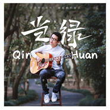

《当·绿》全创作作品集—在浮夸的年代 做纯粹的音乐—
============================

|  |  |
| :--: | :-- |
| [ 《当·绿》全创作作品集—在浮夸的年代 做纯粹的音乐—](https://emumo.xiami.com/album/2102709324) | **艺人**: [秦欢](../index.md) **语种**: 国语 **唱片公司**: 回声文化 **发行时间**: 2017年03月15日 **专辑类别**: 录音室专辑 **专辑风格**: 流行 Pop, 国语流行 Mandarin Pop, 独立流行 Indie Pop **播放数**: 732163 **收藏数**: 9 **评论数**: 4  |

## 简介

  
全创作作品集《当·绿》  
<u>—在浮夸的年代 做纯粹的音乐—</u>  
收录14首原创作品  
我-Me（9首）/他-He（5首）  
关于《当·绿》  
跌跌撞撞5年，恍如隔世。  
曾几何时，  
当时的我们还抱着课本，篮球、兄弟，恋爱和音乐，  
当然还有教室……  
那时的我还不善言辞，也只是默默记录。  
而今咫尺天涯，我们却各安东西。  
每当我再次怀念的时候，  
便把这一路写下的记住的，翻出来，唱成了一首又一首我们的歌……  
想着等某天我们老来忆，  
这就是我们全部的青春了吧，  
它或许并没有，其实也不用多么的绚烂夺目、万丈光芒，  
但是只要一想到它，  
就犹如春苗一直绿到了我的枕畔…… 

## 曲目

## 评论

|  |  |  |
| :-- | :-- | :-- |
|  [虾米用户](https://emumo.xiami.com/u/102920506) 本人来自火星喜欢原创音乐... 2017-08-23 22:52 赞(0) 踩(0) | 
支持大神
 |
|  [虾米用户](https://emumo.xiami.com/u/135204896)  2017-04-05 20:42 赞(0) 踩(0) | 
每一首都是不同的感觉，好听！支持原创 
 |
|  [虾米用户](https://emumo.xiami.com/u/96967928)  2017-04-03 20:28 赞(0) 踩(0) | 
秦大师 
 |
|  [虾米用户](https://emumo.xiami.com/u/17095491) 音乐人 秦欢 2017-03-11 04:35 赞(2) 踩(0) | 
支持原创
 |
