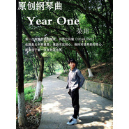

荣玮
============================

|  |  |
| :--: | :-- |
| [ 荣玮](https://i.xiami.com/rongwei) | **播放数**: 1727193 **粉丝数**: 146 **评论数**: 7 **地区**: China 中国大陆 **风格**: 当代唱作人 Contemporary Singer-Songwriter, 独立流行 Indie Pop, 华语唱作人 Chinese Singer-Songwriter  |

## 档案

荣玮 男 
别名：腊肠叔叔 
英文名：Longer Rong 
身高：180CM  体重：66KG 
星座：天秤座 血型：O 
民族： 汉族 
出生日期：10月23日 
出生地：江苏，南京 
江苏省音乐家协会会员，南京市音乐家协会会员，南京江北新区音乐舞蹈家协会主席，南京市音乐文学学会理事，2014南京青奥会志愿者推广大使 
荣玮音乐工作室负责人 
2011年创作原创歌曲《夜泊秦淮》被邀请参加 江苏省旅游节开幕式《百年辛亥 魅力南京》大型交响音画演出获得好评 
2012年创作《南京欢迎你》获得巨大反响被现代快报 扬子晚报 金陵晚报 南京晨报以及江苏综艺频道江苏教育频道江苏广播电台等等争相报道。 
2012年8月16日受南京市委共青团之邀请创作《2014青奥2周年暨亚青会1周年文艺晚会》主题歌曲《我和南京有个约会》并担任2014南京青奥会志愿者推广大使，任期两年。 
2013年词曲创作《大厂不是厂》在南京江北地区引发强烈反响，相继被江苏电视台，南京电视台，扬子晚报，现代快报，南京发布等众多媒体广泛报道，并导演拍摄该曲MV，给江北地区做了一次良好的地域性宣传推广 
2013年词曲创作演唱的《南京欢迎你》获首届唱响南京原创歌曲大赛十大人气奖 
2014年词曲创作《青春之歌》参加2014青奥歌曲征集大赛，在来自全球5000首音乐作品中，入围最终50强，并获颁证书 
2014年收青奥会志愿者部之邀请词曲创作《么么哒小青柠》被指定为青奥会志愿者官方主题歌，在2014年8月8日召开新闻发布会，CCTV5，以及江苏南京各大电视台均做了报道 
2014年11月发布南京话神曲《鸭血粉丝汤》这首融合方言小吃，周星驰元素的歌曲一经发布，就被媒体冠以南京新神曲，扬子晚报，现代快报，南京电视台等媒体均有报道，并在电台滚动播放 
2015年12月创作《江北！江北！》献礼国家第十三新区，被龙虎网，南报网，等媒体报道 
2015爱奇艺，优酷平台全线推广《可一儿歌》音乐总监 
2016年1月词曲创作演唱江苏城市频道《南京零距离》14周年主题歌，并录制MV在江苏城市频道播出。 
2016年跟随江苏省城市频道《德行天下》栏目组去南通探访“感动中国，磨刀老人”吴锦泉，创作歌曲《您好，吴爷爷》 
荣获2015-2016年度江苏电视文艺原创歌曲节目三等奖 
2017年 作曲并演唱《爸爸》收录于南京市《雨花魂 信仰之歌》歌曲专辑，并获得江苏省五个一工程奖以及江苏省委组织部我最喜爱的微党课比赛一等奖

## 专辑

| 名称 | 语种 | 唱片公司 | 发行时间 | 专辑类别 | 专辑风格 |
| :--: | :-- | :-- | :-- | :-- | :-- |
| [ 太子山](./albums/5021922182.md) | 国语 | 听见音乐 | 2020年11月13日 | EP, 单曲 | 国语流行 Mandarin Pop |
| [ 老子要减肥](./albums/5021904971.md) | 国语 | 听见音乐 | 2020年11月12日 | EP, 单曲 | 国语流行 Mandarin Pop |
| [ 少年爱情故事](./albums/2104777920.md) | 国语 |  | 2019年04月14日 | 录音室专辑 | 阳光流行 Sunshine Pop, 民谣流行 Folk Pop |
| [ 小城](./albums/2100344978.md) | 国语 | 独立发行 | 2016年05月26日 | 录音室专辑 |  |
| [ 可是，有些儿歌一不小心是这么唱](./albums/2100269760.md) | 国语 | 可一儿歌 | 2016年02月02日 | 录音室专辑 | 国语流行 Mandarin Pop, 儿歌 Nursery Rhyme, 儿童音乐 Children's Music |
| [ Year one钢琴记事](./albums/2100231976.md) | 国语 | 独立发行 | 2015年11月04日 | 原声带, 影视音乐 | 新世纪音乐 New Age, 国语流行 Mandarin Pop |
| [ 如果我有时光机月光下的童年](./albums/1537613755.md) | 国语 | 独立发行 | 2015年06月01日 | 录音室专辑 | 城市民谣 Urban Folk, 当代民谣 Contemporary Folk, 国语流行 Mandarin Pop |
| [ 南京小神曲写给南京](./albums/2037722084.md) | 国语 | 独立发行 | 2014年08月16日 | 录音室专辑 | 流行说唱 Pop Rap, 流行摇滚 Pop Rock, 国语流行 Mandarin Pop |
| [ 金陵三部曲 荣玮](./albums/774495133.md) | 国语 | 独立发行 | 2012年09月01日 | 录音室专辑 |  |
| [ 金陵三部曲](./albums/5022457125.md) | 国语 |  | 2012年06月01日 | 录音室专辑 |  |
| [ 荣玮[LET'S FIGHT]](./albums/574496263.md) | 国语 | 独立发行 | 2009年09月01日 | 录音室专辑 |  |
| [ 新红集给红歌穿上流行的“外衣”](./albums/2104777930.md) | 国语 |  | 不详 | 录音室专辑 | 青少年流行 Teen Pop, 民谣流行 Folk Pop |
| [ 从南京到拉萨](./albums/5021376577.md) | 国语 | 独立发行 | 不详 | 录音室专辑 | 流行 Pop |

## 评论

|  |  |  |  |
| :-- | :-- | :-- | :-- |
|  [虾米用户](https://emumo.xiami.com/u/408921160)  2018-12-26 11:19 赞(2) 踩(0) | 
我是个宝妈，也很喜欢听你这首歌，在烦扰的工作和生活中给我带来一缕纯净和活泼，支持你点的原创！    
 |
|  [虾米用户](https://emumo.xiami.com/u/377695197)  2018-11-08 12:56 赞(1) 踩(0) | 
儿歌都很好听，粉了
 |
|  [虾米用户](https://emumo.xiami.com/u/337195718)  2018-03-24 06:06 赞(2) 踩(0) | 
巧了，我也姓荣名金富。
 |
|  [虾米用户](https://emumo.xiami.com/u/16813531)  2017-09-25 19:47 赞(1) 踩(0) | 
我是南京人，不爱粉色爱烤鸭，嘿嘿
 |
|  [虾米用户](https://emumo.xiami.com/u/116021818) 外婆‘出远门了’，天长地... 2017-09-12 19:56 赞(1) 踩(0) | 
挺好听的
 |
|  [虾米用户](https://emumo.xiami.com/u/53553195)  2015-07-26 20:48 赞(0) 踩(0) | 
大哥阿恒顶你 
 |
|  [虾米用户](https://emumo.xiami.com/u/52873987)  2015-07-23 14:03 赞(0) 踩(0) | 
哥顶你哦 
 |
