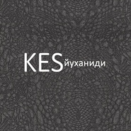
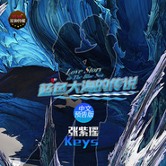
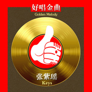

张紫瑶
============================

|  |  |
| :--: | :-- |
| [ 张紫瑶](https://i.xiami.com/zhangziyao) | **地区**: China 中国大陆 **风格**: 民谣流行 Folk Pop, 流行灵魂乐 Pop Soul, 流行摇滚 Pop Rock, 国语流行 Mandarin Pop, 电音流行 Electropop **播放数**: 2373635 **粉丝数**: 196 **评论数**: 16  |

## 档案

张紫瑶（Keys），内地唱作型女歌手、音乐人。 
现签约星和传媒（StarAD China）. 
1992年3月29日生于中国山东淄博，张紫瑶13岁开始学习声乐表演（歌剧），18岁受西方音乐影响开始尝试创作音乐， 
19岁完成学业来到北京继续音乐梦想。 代表作品：《每一秒的幸福》、《如果你不爱我》和《我不要离开》等，荣誉奖项：中国原创金曲榜冠军及最受欢迎歌手奖。 
★明星档案 
中文名：张紫瑶 
外文名：Keys 
国籍：中国 
民族：汉族 
星座：白羊座 
出生地：淄博 
身高：168cm 
血型：A 
出生日期：1992年3月29日 
职业：歌手 演员 
代表作品：《每一秒的幸福》 
所在地：北京 
早期经历 
白羊座的张紫瑶个性直爽、豪迈中不乏性感和可爱。张紫瑶才华横溢，自由就是为校争光的好榜样。19岁的张紫瑶在当地荣获所有荣誉的她怀揣梦想只身来到北京继续发展自己的音乐梦想。初到北京她曾靠在酒吧唱歌及为他人创作歌曲坚持自己的音乐梦想，由于长期为他人创作歌曲并演唱歌曲Demo使得众多音乐人高度关注她的声音，一时成为各大录音棚的专属录音歌手。曾得到台湾著名音乐人《龙的传人》《酒干倘卖无》等歌曲的创作者侯德健老师的认可和赞赏。 
2010年张紫瑶凭借自己的实力加入内地某知名乐团并担任主唱，从幕后到舞台前，张紫瑶与生俱来具有爆发力的中高音和挥洒自如的现场表演也给整个乐团带来了一股新鲜的力量。 
演艺经历 
2010年张紫瑶（Keys）正式出道，同年随乐团推出同名专辑。随即与谢娜、黄征等众多歌手参加杭州 群星演会 
2010年8月18日，张紫瑶（Keys）与乐团北京地坛公园 无限星空音乐节，同月每年一季的北京国际动漫展开展，Keys与乐团受邀参加并出席发布会，媒体采访到她的时候她说到：“希望自己未来的音乐发展像今天所有动漫一样受年轻人喜爱，音乐也可以成为每个年轻人深爱的游戏”。 
2010年9月13日，张紫瑶（Keys）出席《我们恋爱吧》电影首映媒体发布会，开始自己的影视上的事业发展。同月张紫瑶（Keys）与乐团在王府井FAB我和明星共度中秋专辑首听会首度献唱。 
2010年10月3日，朝阳公园 世界城市音乐节发来邀请，随即张紫瑶（Keys）与乐团在各大排行榜与人气飙升。单曲《Play Go》上榜第58期中国摇滚榜并作客直播间接受采访。2011年 1月 3日---单曲《Play Go》上榜中国摇滚榜并连续蝉联夺得4期冠军。 
2011年 1月 5日，张紫瑶(Keys)接受《美国联合通讯社》采访。期间乐团参与众多卫视节目录制:北京台《北京客》《星夜故事秀》、CCTV-3《我要上春晚》《欢乐英雄》《一起音乐吧》、凤凰卫视《完全时尚手册》《鲁豫有约》以及国外媒体意大利电视台专访等，随即与乐团发展辉煌两年的张紫瑶(Keys)因为个人音乐理念问题对外宣布正式退出乐团，回到幕后继续做自己的音乐。 
2014年4月，张紫瑶Key时隔两年她带着自己的音乐正式宣布再次回到阔别已久的舞台。

## 专辑

| 名称 | 语种 | 唱片公司 | 发行时间 | 专辑类别 | 专辑风格 |
| :--: | :-- | :-- | :-- | :-- | :-- |
| [ COMBINE (feat. Clinton Sparks)](./albums/2103887823.md) | 英语 | Kesh | 2017年07月04日 | EP, 单曲 | 世界音乐 World Music |
| [ Workout](./albums/2103974547.md) | 英语 | FOX FUSE | 2017年02月03日 | EP, 单曲 | 舞厅 Dancehall |
| [ Йуханиди](./albums/2103867580.md) | 英语 | Omega Records | 2017年01月21日 | EP, 单曲 |  |
| [ 蓝色大海的传说（Love Story in The Blue Sea） 韩剧《蓝色大海的传说》主题曲中文摇滚版](./albums/2102659838.md) | 国语 | 星和传媒 | 2016年12月06日 | 录音室专辑 |  |
| [ 蓝色大海的传说（中文预告版）Love Story in The Blue Sea （intro Version）](./albums/2102659686.md) | 国语 | 星和传媒 | 2016年12月05日 | 录音室专辑 |  |
| [ 爱的进行曲对你说I Do](./albums/2100376978.md) | 国语 | 星和传媒 | 2016年08月08日 | 录音室专辑 |  |
| [ 别说话，吻我2016贺岁金曲合辑](./albums/2100250752.md) | 国语 | 星和传媒 | 2015年12月25日 | 录音室专辑 | 民谣流行 Folk Pop, 独立电子乐 Indietronica, 国语流行 Mandarin Pop |
| [ 最美的时光遇见最好的你](./albums/2100180741.md) | 国语 | 星和传媒 | 2015年08月20日 | EP, 单曲 | 国语流行 Mandarin Pop |
| [ 好唱金曲Golden Melody](./albums/1620367063.md) | 国语 | 独立发行 | 2015年01月05日 | 现场专辑 | 国语流行 Mandarin Pop |
| [ 你我游戏The Luv Game](./albums/1016257853.md) | 国语 | 星和传媒 | 2014年11月18日 | EP, 单曲 | 流行摇滚 Pop Rock, 国语流行 Mandarin Pop, 电音流行 Electropop |
| [ 我不要离开为孩子圆梦公益歌曲](./albums/300728020.md) | 国语 | 星和传媒 | 2014年05月22日 | 录音室专辑 | 国语流行 Mandarin Pop |
| [ 如果你不爱我520](./albums/600570180.md) | 国语 | 星和传媒 | 2014年05月20日 | EP, 单曲 | 国语流行 Mandarin Pop |
| [ 每一秒的幸福Every Moment](./albums/1597732183.md) | 国语 | 星和传媒 | 2014年04月18日 | EP, 单曲 | 国语流行 Mandarin Pop |
| [ Black Brown Green Grey White](./albums/2103775247.md) | 英语 | Mistletone | 2010年09月24日 | 录音室专辑 |  |

## 评论

|  |  |  |
| :-- | :-- | :-- |
|  [虾米用户](https://emumo.xiami.com/u/358104299) 悲观的唯心存在现实解构虚... 2021-01-20 11:31 赞(0) 踩(0) | 
46992
 |
|  [虾米用户](https://emumo.xiami.com/u/338718668)  2019-04-16 00:51 赞(0) 踩(0) | 
听着这么干净美妙的歌声，真舒服！
 |
|  [虾米用户](https://emumo.xiami.com/u/346976008) 我还没想好要写什么... 2019-01-23 03:13 赞(0) 踩(0) | 
舒服的声音
 |
|  [虾米用户](https://emumo.xiami.com/u/203240572) 千载勋名身外影   百年... 2017-07-10 00:08 赞(0) 踩(0) | 
 
 |
|  [虾米用户](https://emumo.xiami.com/u/72666568)  2017-06-06 22:42 赞(0) 踩(0) | 
蛮好的
 |
|  [虾米用户](https://emumo.xiami.com/u/254237131)   2016-12-14 03:02 赞(0) 踩(0) | 
女神的歌曲都喜欢，声音动听！最喜欢你的新歌《蓝色大海的传说》
 |
|  [虾米用户](https://emumo.xiami.com/u/7001821)  2016-12-07 23:16 赞(0) 踩(0) | 
女神么么哒(｡･ω･｡)ﾉ♡
 |
|  [虾米用户](https://emumo.xiami.com/u/13211311) 公安喊你坐后排的中间 2016-08-16 23:13 赞(0) 踩(0) | 
不错。
 |
| ⇒ |  [虾米用户](https://emumo.xiami.com/u/35166481) 从心出发…… 2016-12-05 16:32 赞(0) 踩(0) | 
感谢你的支持~
 |
|  [虾米用户](https://emumo.xiami.com/u/7001821)  2016-01-01 05:43 赞(0) 踩(0) | 
支持女神，新歌《别说话吻我》超好听
 |
|  [虾米用户](https://emumo.xiami.com/u/7001821)  2015-08-20 12:14 赞(0) 踩(0) | 
     
 |
|  [虾米用户](https://emumo.xiami.com/u/4400366) 再也不见 2015-05-20 15:39 赞(0) 踩(0) | 
囍
 |
|  [虾米用户](https://emumo.xiami.com/u/7235462)  2014-12-25 21:01 赞(0) 踩(0) | 
不错，加油
 |
|  [虾米用户](https://emumo.xiami.com/u/35072182) 分享最新韩流音源欢迎来扰 2014-11-22 17:42 赞(0) 踩(0) | 
keys呢
 |
|  [虾米用户](https://emumo.xiami.com/u/28866854)  2014-04-19 18:09 赞(0) 踩(0) | 
好听！
 |
|  [虾米用户](https://emumo.xiami.com/u/35166481) 从心出发…… 2014-04-15 16:14 赞(4) 踩(0) | 
我刚入驻了虾米音乐人，欢迎大家来我的个人主页，收听我的最新音乐
 |
