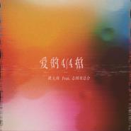
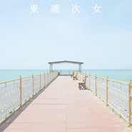

志国ZG Club
============================

|  |  |
| :--: | :-- |
| [ 志国ZG Club](https://i.xiami.com/juggler) | **播放数**: 1445084 **粉丝数**: 3465 **评论数**: 143 **地区**: China 中国大陆 **风格**: 合成器流行 Synthpop, 实验音乐 Experimental, 沙发音乐 Lounge  |

## 档案

Producer/DJ

## 专辑

| 名称 | 语种 | 唱片公司 | 发行时间 | 专辑类别 | 专辑风格 |
| :--: | :-- | :-- | :-- | :-- | :-- |
| [ 假面舞会Masque](./albums/5022243793.md) | 纯音乐 | 海蝶音乐 | 2020年12月21日 | EP, 单曲 | 电子 Electronic, 电子迪斯科 Electro-Disco |
| [ 爱的四四拍（Feat.志国ZG Club）](./albums/5022556418.md) | 国语 |  | 2020年09月17日 | EP, 单曲 |  |
| [ Palmare](./albums/2108201011.md) | 英语 | 独立发行 | 2020年03月16日 | EP, 单曲 | 蒸汽波 Vaporwave, 工业音乐 Industrial music, 自由即兴 Free Improvisation |
| [ 淑女（Disco Rmx）](./albums/2104083265.md) | 韩语 | 独立发行 | 2018年10月07日 | 录音室专辑 | 流行舞曲 Dance-Pop |
| [ 大飒蜜](./albums/2104082413.md) | 国语 | 独立发行 | 2018年10月06日 | EP, 单曲 | 流行舞曲 Dance-Pop |
| [ 東 凛 次 女](./albums/2104055391.md) | 日语 | 独立发行 | 2018年09月26日 | EP, 单曲 | 实验音乐 Experimental |
| [ 志 國  M I X原创编曲作品集](./albums/2104053102.md) | 英语 | 独立发行 | 2018年09月25日 | 录音室专辑 | 放克 Funk, 爵士 Jazz |
| [ 周末情人夜总会](./albums/2103727658.md) | 国语 | 独立发行 | 2018年06月02日 | 精选集 | 迪斯科 Disco |
| [ Vaporwave精选](./albums/2103471056.md) | 国语 | 独立发行 | 2018年01月06日 | 精选集 | 实验音乐 Experimental, 磁带音乐 Tape Music, 蒸汽波 Vaporwave |
| [ Remix精选集](./albums/2103471061.md) | 国语 | 独立发行 | 2018年01月06日 | 精选集 | 浩室舞曲 House |
| [ Kesmond's gun (Original)](./albums/5022574353.md) | 纯音乐 |  | 2017年07月30日 | 录音室专辑 |  |
| [ R&B All Night In 1994](./albums/2105917839.md) | 国语 | 独立发行 | 不详 | EP, 单曲 | 都市流行 City Pop, 流行 Pop, 节奏布鲁斯 R&B |
| [ 让她降落&非法入境](./albums/2420384185.md) | 国语 | 独立发行 | 不详 | 录音室专辑 | 迷幻流行 Psychedelic Pop, 蒸汽波 Vaporwave |
| [ 周末情人夜总会Vol.2](./albums/2105021032.md) | 粤语 |  | 不详 | 合集, 杂锦 | 蒸汽波 Vaporwave |

## 评论

|  |  |  |  |
| :-- | :-- | :-- | :-- |
|  [虾米用户](https://emumo.xiami.com/u/154994950) last dance  2021-01-05 22:16 赞(1) 踩(0) | 
以後可以在哪裡聽你的歌
 |
|  [虾米用户](https://emumo.xiami.com/u/2761419) 镜中之花，水影倒月. 2020-12-21 00:47 赞(0) 踩(0) | 

 |
|  [虾米用户](https://emumo.xiami.com/u/54676006) 冷記憶 2020-12-18 11:00 赞(0) 踩(0) | 
：
 |
|  [虾米用户](https://emumo.xiami.com/u/96960270) 天，将降大任于斯人。 2020-11-10 21:12 赞(0) 踩(0) | 
B啊 老哥
 |
|  [虾米用户](https://emumo.xiami.com/u/37228708) 人间烟火 2020-10-27 15:12 赞(0) 踩(0) | 
常石磊
 |
|  [虾米用户](https://emumo.xiami.com/u/154994950) last dance  2020-09-01 18:13 赞(1) 踩(0) | 
Drop我的名字on你guest list
 |
|  [虾米用户](https://emumo.xiami.com/u/320107119) 这里藏着唯一能够治愈我的... 2020-08-28 10:37 赞(0) 踩(0) | 
班主任叫杨治国
 |
|  [虾米用户](https://emumo.xiami.com/u/276944698) 不要自我设限..... 2020-08-19 19:15 赞(0) 踩(0) | 
✔️✔️✔️
 |
|  [虾米用户](https://emumo.xiami.com/u/68156560) 你要的我都没有 2020-08-03 19:41 赞(0) 踩(0) | 
你用she的歌试试  什么半糖主义之类的  我觉得可以
 |
|  [虾米用户](https://emumo.xiami.com/u/380323993)  2020-07-24 10:47 赞(1) 踩(0) | 
请问可以把林忆莲的寂寞流星群做一个曲吗？想听。
 |
|  [虾米用户](https://emumo.xiami.com/u/17302196)  2020-06-27 02:45 赞(2) 踩(0) | 
2018.07.20 Arkham我在现场哦！今天突然想起来你当时蒸了那首突如其来的爱情 现在网上能找得到吗？谢谢
 |
|  [虾米用户](https://emumo.xiami.com/u/3444549) 我还没想好要写什么... 2020-05-29 08:38 赞(2) 踩(0) | 
港范儿蒸汽波，感觉比日本范儿的高级多了
 |
|  [虾米用户](https://emumo.xiami.com/u/14745470) 陪伴了我7年时间的虾米 ... 2020-04-14 17:40 赞(0) 踩(0) | 
还是喜欢听这里的 
 |
|  [虾米用户](https://emumo.xiami.com/u/35328214) 朝生暮死，日复一日。没有... 2020-03-31 11:38 赞(2) 踩(0) | 
喧囂又寂寥。這種感覺是別的音樂人不能給我的。
 |
|  [虾米用户](https://emumo.xiami.com/u/66823378)  2020-03-29 16:06 赞(0) 踩(0) | 
我爱听
 |
|  [虾米用户](https://emumo.xiami.com/u/337831135) 我爱的是人 不是性别 2020-03-18 14:41 赞(0) 踩(0) | 
会一直支持的
 |
|  [虾米用户](https://emumo.xiami.com/u/355403256) cold 2020-03-07 08:41 赞(0) 踩(0) | 
爱你
 |
|  [虾米用户](https://emumo.xiami.com/u/356763773) 我还没想好要写什么... 2019-12-29 12:35 赞(0) 踩(0) | 
~
 |
|  [虾米用户](https://emumo.xiami.com/u/48501718) 我还没想好要写什么... 2019-11-10 02:00 赞(1) 踩(0) | 
今年您来武汉演出的时候有幸跟您一起吃了海底捞可惜的是现在没能和她在一起了
 |
|  [虾米用户](https://emumo.xiami.com/u/412486902) Nothing but ... 2019-09-18 22:31 赞(2) 踩(0) | 
迷離中的一絲頹廢，一絲不捨
 |
|  [虾米用户](https://emumo.xiami.com/u/478527) 好想跟衣服在洗衣机里滚 2019-09-17 23:29 赞(0) 踩(0) | 
弱弱问：志国是个人名吗？
 |
|  [虾米用户](https://emumo.xiami.com/u/666000) 我会永远爱你，虾米的朋友... 2019-09-12 11:26 赞(0) 踩(0) | 
周六周六！
 |
|  [虾米用户](https://emumo.xiami.com/u/318880194) 我还没想好要写什么... 2019-08-22 12:15 赞(0) 踩(0) | 
！
 |
|  [虾米用户](https://emumo.xiami.com/u/234572903)  2019-06-23 02:20 赞(1) 踩(0) | 
622合肥otw打卡
 |
|  [虾米用户](https://emumo.xiami.com/u/27061286) 云ID:韩沐熙 2019-05-19 23:11 赞(0) 踩(0) | 
蒽
 |
|  [虾米用户](https://emumo.xiami.com/u/411058641) 取之不尽 用之不竭 2019-05-13 13:32 赞(0) 踩(0) | 
哈哈哈厉害了
 |
|  [虾米用户](https://emumo.xiami.com/u/46467302)  2019-05-07 16:56 赞(0) 踩(0) | 
*
 |
|  [虾米用户](https://emumo.xiami.com/u/56193100) ♡ 2019-04-27 18:23 赞(0) 踩(0) | 
*
 |
|  [虾米用户](https://emumo.xiami.com/u/3138155)  2019-04-18 13:06 赞(0) 踩(0) | 
拥有过就好。
 |
|  [虾米用户](https://emumo.xiami.com/u/36362304)   2019-02-25 13:54 赞(0) 踩(0) | 

 |
|  [虾米用户](https://emumo.xiami.com/u/73860436)  2019-02-14 14:17 赞(10) 踩(0) | 
希望我喜欢的女孩也喜欢听志国夜总会
 |
| ⇒ |  [虾米用户](https://emumo.xiami.com/u/241475569) 我还没想好要写什么... 2019-02-20 13:04 赞(0) 踩(0) | 
希望喜欢听志国夜总会的女孩也是我的女孩
 |
| ⇒ |  [虾米用户](https://emumo.xiami.com/u/73860436)  2019-02-20 22:06 赞(0) 踩(0) | 
<q><b>梦死醉生说：</b></q>
 |
| ⇒ |  [虾米用户](https://emumo.xiami.com/u/11099680) 心若浮沉，浅笑安然。 2020-12-24 13:16 赞(0) 踩(0) | 
希望我喜欢的男孩子也听志国夜总会
 |
|  [虾米用户](https://emumo.xiami.com/u/595867) 我还没想好要写什么... 2019-02-05 20:08 赞(0) 踩(0) | 
什么时候来北京啊
 |
|  [虾米用户](https://emumo.xiami.com/u/49365982) 当断则断 2019-01-21 00:58 赞(1) 踩(0) | 
deidei 老哥 多发歌到虾米吧
 |
|  [虾米用户](https://emumo.xiami.com/u/38752771)   2019-01-11 15:13 赞(2) 踩(0) | 
19年还有live吗！
 |
| ⇒ |  [虾米用户](https://emumo.xiami.com/u/26361906) 绝口不提，向平白倒去。 2019-03-07 15:00 赞(0) 踩(0) | 
有。
 |
|  [虾米用户](https://emumo.xiami.com/u/16551745) byebye｛wb/in... 2018-10-25 14:34 赞(6) 踩(0) | 
11/10 重庆坚果Livehouse 探测计划 见！
 |
|  [虾米用户](https://emumo.xiami.com/u/346492287) 虾米不要离开我！ 2018-10-22 17:01 赞(0) 踩(0) | 
再见男孩 歌名没空格
 |
|  [虾米用户](https://emumo.xiami.com/u/20147189) 嘘 2018-10-20 10:17 赞(1) 踩(0) | 
10/19 MAO livehouse so cool
 |
|  [虾米用户](https://emumo.xiami.com/u/8468754) @ddazedconfu... 2018-10-17 19:56 赞(2) 踩(0) | 
吸吸
 |
|  [虾米用户](https://emumo.xiami.com/u/24838376) ++++++++++++ 2018-10-04 11:33 赞(1) 踩(0) | 
刮了胡子太似王建国啦
 |
|  [虾米用户](https://emumo.xiami.com/u/181285288) 你选择了生 我选择了死 2018-09-13 22:23 赞(2) 踩(0) | 
周六见
 |
| ⇒ |  [虾米用户](https://emumo.xiami.com/u/42315988) @神秘手艺人 2018-09-15 00:12 赞(0) 踩(0) | 
请问明天演出在哪里呀
 |
| ⇒ |  [虾米用户](https://emumo.xiami.com/u/181285288) 你选择了生 我选择了死 2018-09-15 18:09 赞(0) 踩(0) | 
杭州
 |
|  [虾米用户](https://emumo.xiami.com/u/1681032)  2018-09-07 00:37 赞(0) 踩(0) | 
什么时候再来上海，期待
 |
|  [虾米用户](https://emumo.xiami.com/u/2739505) Doppelgänger... 2018-08-18 17:09 赞(0) 踩(0) | 
&amp;middot;
 |
|  [虾米用户](https://emumo.xiami.com/u/4353208)   2018-08-13 11:04 赞(0) 踩(0) | 
好酷哈哈
 |
|  [虾米用户](https://emumo.xiami.com/u/285049473) 剛拿起酒杯想和你碰杯 才... 2018-07-27 17:31 赞(0) 踩(0) | 
有意思呦
 |
|  [虾米用户](https://emumo.xiami.com/u/1996955)   2018-06-29 08:16 赞(6) 踩(0) | 
你合成作曲时候在roll吗？要不就是喝大了 曲名全是你或者和她)去过的地方吧。
 |
| ⇒ |  [虾米用户](https://emumo.xiami.com/u/5401882)  2018-06-29 18:20 赞(0) 踩(0) | 
这是给我算了一卦嘛
 |
| ⇒ |  [虾米用户](https://emumo.xiami.com/u/1996955)   2018-06-30 09:45 赞(0) 踩(0) | 
<q><b>志国夜总会说：</b></q>
 |
| ⇒ |  [虾米用户](https://emumo.xiami.com/u/1996955)   2018-06-30 09:58 赞(0) 踩(0) | 
<q><b>志国夜总会说：</b></q>
 |
|  [虾米用户](https://emumo.xiami.com/u/197493114) 如自由无尽头 2018-06-26 09:55 赞(0) 踩(0) | 
记得你的美
 |
|  [虾米用户](https://emumo.xiami.com/u/24838376) ++++++++++++ 2018-06-20 00:37 赞(2) 踩(0) | 
你和su都好性感
 |
|  [虾米用户](https://emumo.xiami.com/u/2993956) 可掌握奇異能量 2018-06-18 22:47 赞(0) 踩(0) | 
唉这时候就觉着还是大城市好
 |
|  [虾米用户](https://emumo.xiami.com/u/190082558) 我还没想好要吃什么... 2018-06-18 20:42 赞(0) 踩(0) | 
我看看周几
 |
|  [虾米用户](https://emumo.xiami.com/u/190082558) 我还没想好要吃什么... 2018-06-18 20:42 赞(0) 踩(0) | 
我靠！！！！
 |
|  [虾米用户](https://emumo.xiami.com/u/87398) 藏不住的是你最珍贵的倔强 2018-06-11 18:48 赞(25) 踩(0) | 
给我一张vip卡，每天来夜总会坐台。
 |
| ⇒ |  [虾米用户](https://emumo.xiami.com/u/23652964) 相由心生 2018-06-20 08:50 赞(0) 踩(0) | 
666
 |
| ⇒ |  [虾米用户](https://emumo.xiami.com/u/185955665) 脱水后的三体星人 2020-03-07 11:28 赞(0) 踩(0) | 
那我每天点你的台
 |
|  [虾米用户](https://emumo.xiami.com/u/85371808)   2018-06-04 11:17 赞(0) 踩(0) | 
嘻嘻嘻嘻
 |
|  [虾米用户](https://emumo.xiami.com/u/114458052) 吞下无意义想法 2018-06-03 12:15 赞(0) 踩(0) | 
喜欢了
 |
|  [虾米用户](https://emumo.xiami.com/u/6076438) 起身見頭暈，行路打倒褪。... 2018-06-03 09:57 赞(1) 踩(0) | 
新专辑炒鸭熹欢
 |
|  [虾米用户](https://emumo.xiami.com/u/10121087) 天涼好個秋 2018-06-03 09:56 赞(0) 踩(0) | 
.
 |
|  [虾米用户](https://emumo.xiami.com/u/284400935) trance/synth... 2018-05-29 09:05 赞(2) 踩(0) | 
朋友 音乐很不错 加油!
 |
|  [虾米用户](https://emumo.xiami.com/u/1197493) 我想我还听的太少 2018-05-21 19:45 赞(2) 踩(0) | 
老兄，你多发点歌到虾米吧，求求你了。
 |
|  [虾米用户](https://emumo.xiami.com/u/20177386) 感谢一切美好的遇见❤️ 2018-05-21 10:32 赞(0) 踩(0) | 

 |
|  [虾米用户](https://emumo.xiami.com/u/190082558) 我还没想好要吃什么... 2018-05-16 14:19 赞(0) 踩(0) | 
炒鸡喜欢
 |
|  [虾米用户](https://emumo.xiami.com/u/50702694) 后颈滚烫 2018-05-16 01:28 赞(3) 踩(0) | 
耳机里循环的有时犯规见证了几天内所有嬉笑与泪水
 |
|  [虾米用户](https://emumo.xiami.com/u/71178106) 塵世や 酒、風呂を抜け ... 2018-04-29 19:18 赞(2) 踩(0) | 
♡
 |
|  [虾米用户](https://emumo.xiami.com/u/13111079) 有缘再见 2018-04-25 15:10 赞(1) 踩(0) | 

 |
|  [虾米用户](https://emumo.xiami.com/u/335763493) 不戴墨镜  2018-04-20 15:43 赞(3) 踩(0) | 
遇到你便是犯規
 |
|  [虾米用户](https://emumo.xiami.com/u/335763493) 不戴墨镜  2018-04-20 15:42 赞(1) 踩(0) | 

 |
|  [虾米用户](https://emumo.xiami.com/u/20147189) 嘘 2018-04-20 02:24 赞(0) 踩(0) | 
帅了
 |
|  [虾米用户](https://emumo.xiami.com/u/18480366) 我还没想好要写什么... 2018-04-18 22:46 赞(0) 踩(0) | 
有微博嘛！
 |
|  [虾米用户](https://emumo.xiami.com/u/7399498) I remain in ... 2018-04-18 06:09 赞(0) 踩(0) | 
發現個好聽的
 |
|  [虾米用户](https://emumo.xiami.com/u/242443016) 波光粼粼的河滩 2018-04-16 18:23 赞(0) 踩(0) | 
喜欢
 |
|  [虾米用户](https://emumo.xiami.com/u/85501218)   2018-04-14 23:44 赞(0) 踩(0) | 
阔以
 |
|  [虾米用户](https://emumo.xiami.com/u/17148756) IG: xr.somet... 2018-04-10 22:13 赞(0) 踩(0) | 

 |
|  [虾米用户](https://emumo.xiami.com/u/1411486) ♠︎ 2018-04-09 22:20 赞(0) 踩(0) | 
❤
 |
|  [虾米用户](https://emumo.xiami.com/u/5076525) 听歌养生 2018-04-07 12:31 赞(0) 踩(0) | 
Good luck to you too
 |
|  [虾米用户](https://emumo.xiami.com/u/124879246) Hello. This ... 2018-04-06 09:21 赞(0) 踩(0) | 
Cool
 |
|  [虾米用户](https://emumo.xiami.com/u/33634014) 网易云音乐：乌昂科尔 2018-03-19 21:11 赞(0) 踩(0) | 
～
 |
|  [虾米用户](https://emumo.xiami.com/u/48485091) 祝 你 开 ★ 2018-03-10 14:13 赞(0) 踩(0) | 
★
 |
|  [虾米用户](https://emumo.xiami.com/u/269663530)  2018-03-05 21:39 赞(1) 踩(0) | 
唯一聽到國內做synthwave的！
 |
|  [虾米用户](https://emumo.xiami.com/u/10471420)  2018-03-05 15:19 赞(0) 踩(0) | 

 |
|  [虾米用户](https://emumo.xiami.com/u/2418238) weibo: @尤米口 2018-03-03 11:55 赞(2) 踩(0) | 
(ᵒ̤̑ ₀̑ ᵒ̤̑)
 |
|  [虾米用户](https://emumo.xiami.com/u/242443016) 波光粼粼的河滩 2018-02-27 18:25 赞(2) 踩(0) | 
一种很高大上的夜总会
 |
| ⇒ |  [虾米用户](https://emumo.xiami.com/u/355403256) cold 2020-03-07 08:46 赞(0) 踩(0) | 
平平常常打动人的歌厅，在里面会发生各种各样的故事。
 |
|  [虾米用户](https://emumo.xiami.com/u/45659582) TRIBUTE TO J... 2018-02-26 15:09 赞(1) 踩(0) | 
哈哈哈哈哈前男友叫志国
 |
|  [虾米用户](https://emumo.xiami.com/u/46960248) Cor cordium. 2018-02-22 17:46 赞(0) 踩(0) | 
什么时候上传芳心！！！
 |
|  [虾米用户](https://emumo.xiami.com/u/40208599) 我很聪明什么也没留下 2018-02-16 09:37 赞(0) 踩(0) | 
|
 |
|  [虾米用户](https://emumo.xiami.com/u/41254793) ⠀     ⠀     ... 2018-02-06 23:07 赞(0) 踩(0) | 
+ /.
 |
|  [虾米用户](https://emumo.xiami.com/u/42154756) 我还没想好要写什么... 2018-01-29 21:50 赞(0) 踩(0) | 
我的志国！
 |
|  [虾米用户](https://emumo.xiami.com/u/237765277) tropical Fis... 2018-01-28 22:37 赞(0) 踩(0) | 
重新上虾米了 开心
 |
|  [虾米用户](https://emumo.xiami.com/u/18480366) 我还没想好要写什么... 2018-01-27 22:45 赞(0) 踩(0) | 
好听
 |
|  [虾米用户](https://emumo.xiami.com/u/121910914) 我想好好睡个觉 2018-01-18 02:01 赞(0) 踩(0) | 
爱
 |
|  [虾米用户](https://emumo.xiami.com/u/337221725)  我是街上的游魂，你是闻... 2018-01-06 18:24 赞(16) 踩(0) | 
把你尝过之后 我刷了两遍牙 哭了三十九次 从一月睡到太阳回归 重新拥有七个情人 吃光了他们所有的糖 可你的苦阿 还攀在我的心尖上&amp;hellip;&amp;hellip;
 |
|  [虾米用户](https://emumo.xiami.com/u/42783618) Miss u more ... 2018-01-06 11:11 赞(0) 踩(0) | 
！！！！！！
 |
|  [虾米用户](https://emumo.xiami.com/u/5419635) 他之所以会飞，是因为他把... 2018-01-06 08:57 赞(0) 踩(0) | 
新年大礼包！！！！！
 |
|  [虾米用户](https://emumo.xiami.com/u/45385073) 爱虾米期待再相遇为新：t... 2018-01-06 07:54 赞(0) 踩(0) | 
早
 |
|  [虾米用户](https://emumo.xiami.com/u/50122346) i hate you a... 2018-01-04 16:44 赞(0) 踩(0) | 
为什么删掉了5555
 |
|  [虾米用户](https://emumo.xiami.com/u/7172775) 有个性没签名 2018-01-02 23:51 赞(0) 踩(0) | 
我想要夏夜星辉
 |
| ⇒ |  [虾米用户](https://emumo.xiami.com/u/5419635) 他之所以会飞，是因为他把... 2018-01-06 08:57 赞(0) 踩(0) | 
又看到你了 贾宝玉 
 |
|  [虾米用户](https://emumo.xiami.com/u/17146554) weibo：@L1RRO... 2017-12-14 13:58 赞(1) 踩(0) | 
被遗忘的虾米
 |
|  [虾米用户](https://emumo.xiami.com/u/339614043) 孤独且長命百歲 2017-12-13 09:14 赞(0) 踩(0) | 
我想要有时犯规
 |
| ⇒ |  [虾米用户](https://emumo.xiami.com/u/49161453) WECHAT：44162... 2017-12-18 12:37 赞(0) 踩(0) | 
+1
 |
|  [虾米用户](https://emumo.xiami.com/u/85148548)  2017-12-06 18:21 赞(0) 踩(0) | 

 |
|  [虾米用户](https://emumo.xiami.com/u/8468754) @ddazedconfu... 2017-12-03 05:41 赞(0) 踩(0) | 
嘻嘻嘻
 |
|  [虾米用户](https://emumo.xiami.com/u/50030763) 老王之子 2017-11-17 22:45 赞(1) 踩(0) | 
我真的很喜欢志国夜总会这个名字
 |
|  [虾米用户](https://emumo.xiami.com/u/42783618) Miss u more ... 2017-10-28 00:34 赞(0) 踩(0) | 
虾米被你忘了吗
 |
|  [虾米用户](https://emumo.xiami.com/u/6076438) 起身見頭暈，行路打倒褪。... 2017-10-23 09:49 赞(0) 踩(0) | 
又一个很好的灵魂乐曲创作歌手，很意外的……… 
 |
|  [虾米用户](https://emumo.xiami.com/u/5419635) 他之所以会飞，是因为他把... 2017-10-10 11:29 赞(2) 踩(0) | 
为什么不上传虾米
 |
|  [虾米用户](https://emumo.xiami.com/u/45385073) 爱虾米期待再相遇为新：t... 2017-09-21 17:01 赞(0) 踩(0) | 
哇
 |
|  [虾米用户](https://emumo.xiami.com/u/311481518) 我还没想好要写什么... 2017-08-01 20:05 赞(0) 踩(0) | 
来抱一个
 |
|  [虾米用户](https://emumo.xiami.com/u/194795371)  2017-07-23 01:07 赞(0) 踩(0) | 
为什么郁真下架了pwp超好听
 |
|  [虾米用户](https://emumo.xiami.com/u/6634570) 两个氦原子 2017-07-13 17:23 赞(0) 踩(0) | 
赞！！
 |
|  [虾米用户](https://emumo.xiami.com/u/5419635) 他之所以会飞，是因为他把... 2017-07-03 17:49 赞(0) 踩(0) | 
valuable
 |
|  [虾米用户](https://emumo.xiami.com/u/56349445) 高龄少女病 2017-05-11 11:32 赞(0) 踩(0) | 
啊 中奖
 |
|  [虾米用户](https://emumo.xiami.com/u/79701394) 妈的，我认了。 2017-05-01 17:11 赞(2) 踩(0) | 
1980&amp;#39;s Toyota crown
 |
|  [虾米用户](https://emumo.xiami.com/u/10154695) VanGogh Aliv... 2017-02-21 00:23 赞(0) 踩(0) | 

 |
|  [虾米用户](https://emumo.xiami.com/u/38662280) 不懂装懂中度患者 2017-02-17 09:23 赞(0) 踩(0) | 
u_u
 |
|  [虾米用户](https://emumo.xiami.com/u/157660126) 我宁愿孤独终老的是我 2017-02-14 23:33 赞(0) 踩(0) | 
好听
 |
|  [虾米用户](https://emumo.xiami.com/u/43418234) ^_−☆ 2017-01-23 11:35 赞(0) 踩(0) | 
哈哈哈
 |
|  [虾米用户](https://emumo.xiami.com/u/7729258)  2016-11-08 00:42 赞(1) 踩(0) | 
******
 |
| ⇒ |  [虾米用户](https://emumo.xiami.com/u/5401882)  2016-11-29 23:03 赞(0) 踩(0) | 
改电动的了我的哥
 |
|  [虾米用户](https://emumo.xiami.com/u/50046431) baby 2016-09-07 03:19 赞(0) 踩(0) | 
英 雄 本 色
 |
| ⇒ |  [虾米用户](https://emumo.xiami.com/u/5401882)  2016-09-24 23:20 赞(0) 踩(0) | 
看出来了
 |
| ⇒ |  [虾米用户](https://emumo.xiami.com/u/50046431) baby 2016-09-26 03:24 赞(0) 踩(0) | 
<q><b>志国夜总会说：</b></q>
 |
|  [虾米用户](https://emumo.xiami.com/u/7417345)  2016-08-10 16:00 赞(0) 踩(0) | 
改名字差点没找到！
 |
| ⇒ |  [虾米用户](https://emumo.xiami.com/u/268148454) 我还没想好要写什么... 2018-05-09 19:49 赞(0) 踩(0) | 
之前叫啥名字？
 |
|  [虾米用户](https://emumo.xiami.com/u/32174773)   2016-07-22 11:31 赞(0) 踩(0) | 
非常好哦
 |
|  [虾米用户](https://emumo.xiami.com/u/36673521) a shi sou r ... 2016-07-08 17:42 赞(0) 踩(0) | 
w 改名啦
 |
|  [虾米用户](https://emumo.xiami.com/u/36673521) a shi sou r ... 2015-11-27 23:13 赞(0) 踩(0) | 
！
 |
|  [虾米用户](https://emumo.xiami.com/u/45328382) 我还没想好要写什么... 2015-10-28 23:45 赞(0) 踩(0) | 
马多~好听
 |
|  [虾米用户](https://emumo.xiami.com/u/7417345)  2014-09-17 15:42 赞(1) 踩(0) | 
好！！！好！！！听！！！！！
 |
|  [虾米用户](https://emumo.xiami.com/u/10064615) 签名中…… 2014-09-10 17:14 赞(1) 踩(0) | 
32个赞、、、、、、、、、、、、、、、、、、、、、、、、、、、、、、、、真的是32个点哦。
 |
|  [虾米用户](https://emumo.xiami.com/u/7779460) 真实，是通向快乐的最佳路... 2014-08-12 18:28 赞(0) 踩(0) | 
哇唔
 |
|  [虾米用户](https://emumo.xiami.com/u/7779460) 真实，是通向快乐的最佳路... 2014-08-12 18:28 赞(0) 踩(0) | 
不错！
 |
|  [虾米用户](https://emumo.xiami.com/u/1812115)   2014-08-07 21:57 赞(1) 踩(0) | 
赞！ 哈哈
 |
|  [虾米用户](https://emumo.xiami.com/u/5191209)  2014-08-07 18:51 赞(1) 踩(0) | 
推荐  邱比~
 |
