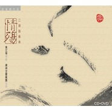

情殇
============================

|  |  |
| :--: | :-- |
| [ 情殇](https://emumo.xiami.com/album/32704) | **艺人**: [邓伟标](../index.md) **语种**: 国语 **唱片公司**: 豪杰唱片 **发行时间**: 2007年09月11日 **专辑类别**: 录音室专辑 **专辑风格**: 轻音乐 Easy Listening **播放数**: 56008 **收藏数**: 518 **评论数**: 32  |

## 简介

&nbsp;&nbsp;&nbsp; 从创作到制作历时整整一年的大型二胡协奏曲《情殇》于2007年9月11日全面上市。  
&nbsp;&nbsp;&nbsp; 《情殇》由广州音像出版社出版、珠海豪杰文化艺术传播有限公司制作，《情殇》由邓伟标创作，黄江琴演奏，广州交响乐团协奏，全曲总长25分17秒，为单乐章大型协奏曲，亦是广东最大型的二胡协奏作品。  
&nbsp;&nbsp; 《情殇》包装精美，内附音乐制作花絮DVD以及二胡演奏曲谱。  
  
<strong>01 序曲&nbsp;&nbsp; 2:27"  
</strong>“序曲”音乐一开始，合成器释放出一种偏温暖的接近弦乐声音的“宇宙”声凝造时光倒流的效果，Bom Boh大鼓暗喻着正在战争的时代背景，弦乐团演奏的主题B断忽然出现，让《情殇》的故事正式展开－－“吴国”王宫破了，越军来了，西施消耗了十年的青春，终于等到情人带领故国的军队迎接自己回国团聚。  
  
<strong>02 主题 2:05"&nbsp;&nbsp; 2:27"  
</strong>主题的第一次完整出现，音乐是缓慢而平和的，甚至有点温暖和甜蜜，因为西施终于等到了惜别十年的情人范蠡的出现，但这十年包含的情感因子实在太多太复杂了，任何一种单一的情绪都是有欠缺的，音乐将所有的复杂情绪深深隐藏在舒缓的平和中，一如千言万语无从说起。  
  
<strong>03 第一变奏&nbsp;&nbsp; 2:08"</strong>  
这是乐曲的第一次主题变奏，西施的倾诉与回忆，  
  
<strong>04 惊变&nbsp;&nbsp; 1：15"&nbsp;  
</strong>温存过后，当范蠡说出西施将面临的下一段人生竟是如此的冷酷，等待十年的期盼完全是一场空洞的遐想……&nbsp;  
  
<strong>05 醒悟&nbsp;&nbsp; 1：44"  
</strong>在残酷的，无法逆转的现实面前，西施终于明白到，吴王夫差被自己害死后，世界上已经没有一个男人是真心爱自己的，自己不过是政治家们手中的一颗棋子，复国的工具。明白到这一切之后，西施的心境反而平静了下来，她终于有了自己的决定－－勇敢地投向了五里湖心。中提琴、大提琴与法国号在反复平缓地交织着西施的主题乐句，一切都是那么的平静而舒缓，但隐藏在这平静舒缓的背后，是二胡那不为人道的无法用文字或语言表述的悲绝心境。此时的二胡，在不断重复着世界上最简单的几个长音，这几个音，是任何二胡初学者都能准确拉奏的，但在如此简单的几个长音中饱含的复杂情感，却只有黄江琴能够做得好。  
  
<strong>06 祭舞&nbsp;&nbsp; 1：45"  
</strong>哀怨的二胡与急速的鼓点。后人对西施的怀念、拜祭以及对无情者的控诉。这段音乐动态非常大，各种打击乐的结像颗粒清晰有序，很发烧的一个小乐段，对器材的中、低频段表现力十分考究。&nbsp;  
  
<strong>07 乐团的再次主题变奏&nbsp;&nbsp; 2:34"  
</strong>述事性强烈的变奏旋律是后人对西施的怀念与传诵。铜管乐强烈的金属色彩将音乐带回到西施的主题旋律上，西施的形象已经超越了一个女子婀娜美丽的形象，被赋予了复国英雄的色彩强烈地烙印在后人的心中，被千古传诵。  
  
<strong>08 华彩&nbsp;&nbsp; 2:10"  
</strong>定音鼓过后，由哀怨的二胡带出一段刚毅而华丽的乐段，大段的铜管乐主题重复，在急速的二胡与弦乐变奏中穿插，反复升华着后人对西施的崇拜。这是段艰难的快速演奏，无论弦乐团还是二胡声部  
  
<strong>09 主题再现，结束部&nbsp;&nbsp; 1：15"  
</strong>西施的故事结束了，在辉煌的铜管乐衬托下弦乐团用温暖宽厚的音色在光亮的大和弦中结束了整个故事。西施的一生是悲凉的，她为了一个单纯的情感目的却走过了复杂而短暂的政治人生，但后人却只愿意记住她的美丽，没有任何内容的单纯的美丽。&nbsp;  
  
  
 

## 曲目

- [情殇 - 二胡协奏曲](./32704/cmQqVef090.md)
- [情殇 - 伴奏音乐](./32704/QVws4b9e5.md)

## 评论

|  |  |  |
| :-- | :-- | :-- |
|  [虾米用户](https://emumo.xiami.com/u/412456396)  2020-04-12 20:18 赞(0) 踩(0) | 
舒展，震撼！
 |
|  [虾米用户](https://emumo.xiami.com/u/46235090)  2016-06-15 09:01 赞(0) 踩(0) | 
强强联手演绎现代梁祝！
 |
|  [虾米用户](https://emumo.xiami.com/u/1850008) Fsen 2016-01-03 23:57 赞(0) 踩(0) | 
听完此曲我已成泪人！感叹世事无常，老天不公，生命脆弱。（弟弟去年11.17因白血病英年早逝。一路走好，天堂没有病疼）
 |
|  [虾米用户](https://emumo.xiami.com/u/43286643)  2015-10-09 00:00 赞(0) 踩(0) | 
国粹！经典！大师之作！震撼！扣人心弦！
 |
|  [虾米用户](https://emumo.xiami.com/u/44050484)  2015-05-01 11:23 赞(0) 踩(0) | 
悲悯 空灵 感人至深
 |
|  [虾米用户](https://emumo.xiami.com/u/44050484)  2015-05-01 11:22 赞(0) 踩(0) | 
悲悯 空灵 感人
 |
|  [虾米用户](https://emumo.xiami.com/u/32031632)  2015-04-29 20:25 赞(0) 踩(0) | 
好曲目，赞！
 |
|  [虾米用户](https://emumo.xiami.com/u/32031632)  2015-03-18 08:21 赞(0) 踩(0) | 
优美、动听，赞！
 |
|  [虾米用户](https://emumo.xiami.com/u/25106903)  2015-02-03 11:26 赞(0) 踩(0) | 
国粹！
 |
|  [虾米用户](https://emumo.xiami.com/u/1411716)  2014-12-21 15:19 赞(0) 踩(0) | 
好吧，梁祝的姊妹篇。
 |
|  [虾米用户](https://emumo.xiami.com/u/8108180)  2014-10-21 06:16 赞(0) 踩(0) | 
悲感交集催人泪下
 |
|  [虾米用户](https://emumo.xiami.com/u/5165479)  2014-03-29 12:22 赞(0) 踩(0) | 
的确许多地方都借鉴了《梁祝》哦
 |
|  [虾米用户](https://emumo.xiami.com/u/2721745)  2014-02-10 22:23 赞(0) 踩(0) | 
有借鉴《梁祝》之嫌哦
 |
|  [虾米用户](https://emumo.xiami.com/u/9599912)  2014-01-28 02:07 赞(1) 踩(0) | 
从创作到制作历时整整一年的大型二胡协奏曲《情殇》于2007年9月11日全面上市。 《情殇》由广州音像出版社出版、珠海豪杰文化艺术传播有限公司制作，《情殇》由邓伟标创作，黄江琴演奏，广州交响乐团协奏，全曲总长25分17秒，为单乐章大型协奏曲，亦是广东最大型的二胡协奏作品。
 |
|  [虾米用户](https://emumo.xiami.com/u/23377590) 行走中 2014-01-15 22:16 赞(0) 踩(0) | 
好听
 |
|  [虾米用户](https://emumo.xiami.com/u/18773012) 卫道东升 2013-12-29 18:33 赞(0) 踩(0) | 
非常喜欢
 |
|  [虾米用户](https://emumo.xiami.com/u/18773012) 卫道东升 2013-12-24 11:35 赞(0) 踩(0) | 
非常喜欢
 |
|  [虾米用户](https://emumo.xiami.com/u/6969605)  2013-11-26 00:03 赞(0) 踩(0) | 
一碟空，惊为天人。即使情执为毒药，也停下来听一听音乐吧。
 |
|  [虾米用户](https://emumo.xiami.com/u/17912544)  2013-09-10 00:29 赞(0) 踩(0) | 
hao
 |
|  [虾米用户](https://emumo.xiami.com/u/8337431) 以乐会友 2013-04-17 04:47 赞(1) 踩(0) | 
国乐交响精粹
 |
|  [虾米用户](https://emumo.xiami.com/u/13299122) 道法自然 2013-03-01 15:50 赞(0) 踩(0) | 
二胡
 |
|  [虾米用户](https://emumo.xiami.com/u/10951828) 琴心剑魄 2013-02-12 10:35 赞(0) 踩(0) | 
情，永恒的主题，诠释在于个人。
 |
|  [虾米用户](https://emumo.xiami.com/u/6709681) 热爱生活 享受生活 2012-08-21 04:54 赞(0) 踩(0) | 
好听，很打动的
 |
|  [虾米用户](https://emumo.xiami.com/u/6653400)  2012-08-20 21:17 赞(0) 踩(0) | 
痛定思痛。叹！痴情一曲千千结但凭后人说
 |
|  [虾米用户](https://emumo.xiami.com/u/3756706)   2012-06-27 01:14 赞(0) 踩(0) | 
难得被一首曲子打动，久久不能脱离⋯⋯唯《梁祝小提琴协奏曲》可与之媲美~
 |
|  [虾米用户](https://emumo.xiami.com/u/3756706)   2012-06-27 01:13 赞(0) 踩(0) | 
百转愁肠，缠绵哀伤，欲哭无泪
 |
|  [虾米用户](https://emumo.xiami.com/u/602771)  2012-05-08 20:33 赞(0) 踩(0) | 
好听
 |
|  [虾米用户](https://emumo.xiami.com/u/7889313)  2012-03-28 20:15 赞(0) 踩(0) | 
好听
 |
|  [虾米用户](https://emumo.xiami.com/u/7366460) 音乐，是心灵的感受，是心... 2012-02-19 17:13 赞(0) 踩(0) | 
喜欢！
 |
|  [虾米用户](https://emumo.xiami.com/u/3682424) 暂无签名~ 2011-11-04 21:31 赞(0) 踩(0) | 
柔腸寸斷
 |
|  [虾米用户](https://emumo.xiami.com/u/1091908) 一切随缘 2011-09-04 15:39 赞(0) 踩(0) | 
情殇
 |
|  [虾米用户](https://emumo.xiami.com/u/638083)  2011-07-28 18:03 赞(0) 踩(0) | 
很美
 |
