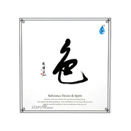

色
============================

|  |  |
| :--: | :-- |
| [ 色](https://emumo.xiami.com/album/740) | **艺人**: [邓伟标](../index.md) **语种**: 国语 **唱片公司**: 雨林音乐 **发行时间**: 2006年10月25日 **专辑类别**: 录音室专辑 **专辑风格**: 轻音乐 Easy Listening **播放数**: 5636866 **收藏数**: 2653 **评论数**: 110  |

## 简介

  
<strong>序言</strong>  
  
有人说这是个毫不诗意的物质时代，但邓伟标的音乐，却总是淋漓尽致地流露出一种诗歌般抒情又深刻的音乐意蕴--无论是他前期创作的《空》《千江汇流》或《古城今昔》专辑还是现在的这张《色》。 与大多数音乐家不同，邓伟标似乎不愿满足于严格遵循任何音乐流派既定的规则。虽然他那悦耳的音乐韵味仍然穿透心灵，而他对动摇和颠覆传统审美观所作的许多尝试却源自他独具诗人气质的音乐灵感和自觉的人文关怀。  
在这张融合了传统与现代多种音乐风格的温暖的音乐专辑背后，是邓伟标打破流派界限的一种文化创造，是一颗不被物质与传统驯服之心的优雅追求。但愿由他心灵深处流畅出的蜿蜒情绪，不会被大量音响创造的宽广音场所淹没，从而让人在音乐的感染下能重获生命最初的感动。  
  
<strong>邓伟标自述</strong>  
  
当物欲恣意横行，人类思想的自由便遭禁锢，任何艺术在物质与欲望的诱惑下皆可能变成浮华俗世一“策划”。  
“色”在英文中通常被翻译为Substance（物质世界），其实“色”在中国哲学中包含着更广泛的含义，比如“Substance”一词所没有涵盖的“思想”与“欲望”，当然也包括一切的艺术和没有物理形态的音乐。  
滚滚红尘演绎的是凡人的居所，还是福祉的家园？而音乐所演绎的能不能是“色”所无法涵盖的那一份纯净？  
—— 邓伟标 2005年11月4日  
  
<strong>01 前世今生 Previous And Present Life</strong>  
  
谁说“色非空”？前世的千回眷恋，仅换得今生的擦肩而过。这阙歌带着几分幽怨，却又带着几分淡然，几分超脱，仿佛那伫立在奈何桥头的倩影，诉说着一份跨越千年的爱情，来来又去去……  
邓伟标创作的这首歌曲令人耳边一亮。琅琅上口的旋律，清新质朴的风格，为这部作品叙述浮世色相、人间百态的主旨做了一个完美的注脚，亦为整张专辑画了一个完满的句号。  
  
（作曲、作词：邓伟标，念白：马小倩，演唱：陈洁丽）  
  
读白：修千世才可同舟，修万世方能共济，芸芸众生里。  
没有谁是谁的唯一，却总有人是你一生心甘情愿的迷失。  
  
A1：遥远的记忆，江中的月影，和秋风翻起的情思。  
临行的女子，手心的发丝，所有的固执转眼已是千年。  
  
A2：合合又离离，来来又去去，像无法自控的棋子。  
相望不相语，相聚不相依，这是否一场轮回的过失？  
  
B1：前世今生的痴，问谁可以洞悉，难道此生此情，只是同舟未能共济？  
我愿把握此生，再约来世，请求相知。  
来来又去去，来来又去去……  
  
<strong>02 在云端 Beyond The Clouds</strong>  
漫步在云端，你会看见什么？古筝锵锵，拨弄的是流云飞霞，是日月星辰；歌声缈缈，感叹的是芸芸众生，碌碌凡尘；洞箫悠悠，吹奏的是内心的一份平和安宁，一份逍遥自在。  
  
<strong>03 流动的影 Flowing Shadow</strong>  
若说前半张专辑延续了《空》安详空灵的出世主旨，那么后半张就是邓伟标描绘自然绝“色”，记录人间最令人感动的瞬间，展现出一种入世的新风格。  
从来没想过邓伟标会创作如此浪漫富有诗意的钢琴曲，乐曲后半部加入的二胡和箫更是锦上添花。即使不必看那充满着印象派意味的名字，闭上眼睛聆听音乐，仿佛已独坐窗边，看见午后的暖阳越过窗台徐徐散下，窗帘和着风儿飘起，然后落下……这一刻，我看见时间在琴键上停歇，光在起舞，影子在流动。这静止的刹那，凝结了永恒的美丽。  
  
<strong>04 新生 New Blood～To My Coming Child</strong>  
—— 仅以此曲献给我未来的孩子  
无论你何时跌落凡间，你都将走进茫茫人海，展开多彩而漫长的跋涉。尽管阳光总能驱走夜的迷茫，但它并不能到达心灵所有的角落。当细雨涤去世间的浊流，会尽显风清云淡的美丽。感谢上苍！期盼着你的来临——阿门！  
—— 邓伟标 2005年4月
 

  
<strong>05 无极 Infinite</strong>  
邓伟标突破传统桎梏，匠心独运地创作出这首由自然音效、合成器、爵士鼓、管弦乐等多种元素结合而成的单乐章琵琶协奏曲。而缪晓筝的琵琶挥洒自若，张驰有道，时而铿锵高歌如百锤炼钢，时而轻语低诉如绕指柔。思绪随着音乐起飞，仿佛超脱了一切极限，逍遥物外。  
  
<strong>06 求索 Way Of Seeking  
</strong>木鱼轻叩，空明之音却如镜花水月，捉摸不定。直至古筝、箫和钢琴划破了这层迷雾，像促膝对谈的三贤人，弹奏出行云流水般的旋律，直叩心扉，不禁扪心自问——“路漫漫其修远兮，吾将上下而求索。”然而人生碌碌不过百年，到头来，求了多少，得了多少，又失去了多少？  
  
<strong>07 听潮 Listening To Tide</strong>  
大提琴和二胡如同形影相吊，如泣如诉的旋律交迭在一起，叫人不忍卒听。坐听潮起潮落，笑看风起云灭，才明白人生何曾不像那沙滩上的城池——即使如何金碧辉煌，也不过转眼云烟。浪花淘尽，一切终被冲刷得消散无痕。  
  
<strong>08 色 Substance Desire &amp; Spirit</strong>  
谁言“色即空”？我们是欲望的孩子，也是物质的奴隶；我们生于尘世，也归于尘土。琵琶和提琴的旋律在彼此的弦上缠绕，仿佛怀抱孩子的母亲的双臂，是如此的温柔，如此的深情，绽放出动人心魄的色彩。若要我说，那音色必是粉红的，那是滚滚红尘的颜色，是呱呱落地的婴儿的颜色，是梦幻而温馨的颜色。  
  
<strong>09 太极 Taichi</strong>  
太初有道，道化太极。流水潺潺，古琴悠悠，信手之间勾勒出好一幅云峰鹤谷的泼墨山水。此不若大道无形，大音若希之境乎？  
  
<strong>10 风之语 Whisper Of The Wind</strong>  
若说潮水是大海的呼吸，那么风声便是天空的话语。宽厚的大提琴铺开了一片广袤的大地，轻灵的琵琶在其上忽高忽低的盘旋，宛如御风飞扬的鸟儿，又似那无拘无束的风。你听，那是从上苍传来的——风儿的低语。

## 曲目

- [前世今生Previous And Present Life](./740/h7Ob67b5.md)
- [在云端Beyond The Clouds](./740/xj942fbb.md)
- [流动的影Flowing Shadow](./740/h7Qd7032.md)
- [新生New Blood-To My Coming Child](./740/h7Rcb863.md)
- [无极Infinite](./740/u8u38dc9.md)
- [求索Way Of Seeking](./740/xjD40369.md)
- [听潮Listening To Tide](./740/zKW46d55.md)
- [色Substance Desire & Spirit](./740/h7Vdd08a.md)
- [太极MVTaichi](./740/h7Wa9d56.md)
- [风之语Whisper Of The Wind](./740/eWF836fd.md)

## 评论

|  |  |  |  |
| :-- | :-- | :-- | :-- |
|  [虾米用户](https://emumo.xiami.com/u/431474729)  2020-05-03 07:05 赞(0) 踩(0) | 
一直在听和舞十几年
 |
|  [虾米用户](https://emumo.xiami.com/u/276944698) 不要自我设限..... 2020-02-05 17:26 赞(1) 踩(0) | 

 |
|  [虾米用户](https://emumo.xiami.com/u/344548710)  2019-12-01 11:17 赞(0) 踩(0) | 
仿佛魂牵梦绕，如醉如痴的感觉。
 |
|  [虾米用户](https://emumo.xiami.com/u/420591127)  2019-10-26 22:29 赞(0) 踩(0) | 
融入到了另一个世界里！心情平和愉悦！
 |
|  [虾米用户](https://emumo.xiami.com/u/420508771) 我还没想好要写什么... 2019-06-17 09:36 赞(0) 踩(0) | 
挺不错的
 |
|  [虾米用户](https://emumo.xiami.com/u/129800848) 只想聆听 2019-03-14 09:09 赞(0) 踩(0) | 
奇才公子。
 |
|  [虾米用户](https://emumo.xiami.com/u/3710549)  2018-05-02 15:01 赞(0) 踩(0) | 
闲来抚琴山涧鸣，醒时尘满旧时裳。是梦？似梦，亦是梦。
 |
|  [虾米用户](https://emumo.xiami.com/u/11888819) red 2017-12-18 11:12 赞(0) 踩(0) | 
邓伟标的艺人档案1990年开始从事流行音乐创作，是中国流行音乐明星制造体系中的第一代音乐制作人，相继制造过的流行音乐明星有王瑥、王磊、光头李进、柳云龙等。邓伟标一直从事音乐创作，并获得包括“中国流行音乐十年成就奖”在内的全国、省、市等各项音乐评奖与流行音乐排行榜奖项30多项。
 |
|  [虾米用户](https://emumo.xiami.com/u/330811586)  2017-10-24 22:48 赞(0) 踩(0) | 
再次聆听，依然喜欢。
 |
|  [虾米用户](https://emumo.xiami.com/u/9814533)  2017-08-03 09:13 赞(0) 踩(0) | 
声色滋味全有
 |
|  [虾米用户](https://emumo.xiami.com/u/295717418) 語晨林音 2017-06-26 10:11 赞(0) 踩(0) | 
好聽
 |
|  [虾米用户](https://emumo.xiami.com/u/304812639)  2017-06-15 23:22 赞(1) 踩(0) | 
色即是空
 |
|  [虾米用户](https://emumo.xiami.com/u/55228777)  2017-06-15 10:45 赞(1) 踩(0) | 
中国新世纪音乐珍品---《空色戒》
 |
|  [虾米用户](https://emumo.xiami.com/u/10000700) 听，这个世界很美 2017-04-13 21:34 赞(0) 踩(0) | 

 |
|  [虾米用户](https://emumo.xiami.com/u/10000700) 听，这个世界很美 2017-04-13 21:32 赞(0) 踩(0) | 
花了钱，却下载不了，怎么搞的
 |
|  [虾米用户](https://emumo.xiami.com/u/273271906)  2017-02-13 22:10 赞(1) 踩(0) | 
自古风以多韵事，儿女情长流入音。
 |
|  [虾米用户](https://emumo.xiami.com/u/16229370)  2016-12-20 08:56 赞(0) 踩(0) | 
收藏下~
 |
|  [虾米用户](https://emumo.xiami.com/u/45151689) 走路，多望望阳光... 2016-11-12 14:11 赞(1) 踩(0) | 
不是风动，不是幡动，仁者心动~~
 |
|  [虾米用户](https://emumo.xiami.com/u/58011866)  2016-08-24 20:26 赞(0) 踩(0) | 
收了~~~
 |
|  [虾米用户](https://emumo.xiami.com/u/165276214)  2016-07-09 18:06 赞(0) 踩(0) | 
..
 |
|  [虾米用户](https://emumo.xiami.com/u/28016736)  2016-06-05 21:43 赞(0) 踩(0) | 
非常气愤，我已经是会员了，为什么还要收费
 |
|  [虾米用户](https://emumo.xiami.com/u/7721396) 我还没想好要写什么... 2016-04-02 11:49 赞(1) 踩(0) | 
good
 |
|  [虾米用户](https://emumo.xiami.com/u/9933215)  2016-03-13 01:04 赞(0) 踩(0) | 
幡动心动心动幡动
 |
|  [虾米用户](https://emumo.xiami.com/u/7969730)  2015-12-06 00:23 赞(1) 踩(0) | 
比空好听。前世今生、色都很喜欢。看来我不喜欢空，只喜欢色233333
 |
|  [虾米用户](https://emumo.xiami.com/u/81500022)  2015-11-09 21:40 赞(0) 踩(0) | 
阿弥陀佛
 |
|  [虾米用户](https://emumo.xiami.com/u/2295513)  2015-09-05 09:51 赞(0) 踩(0) | 
愿我随着旋律………流动，进入灵魂的洗礼
 |
|  [虾米用户](https://emumo.xiami.com/u/45127856)  2015-06-14 18:50 赞(0) 踩(0) | 
店铺音乐
 |
|  [虾米用户](https://emumo.xiami.com/u/45163221) lth 2015-05-20 09:14 赞(0) 踩(0) | 
很棒
 |
|  [虾米用户](https://emumo.xiami.com/u/3317317) 半俗半禅半随缘！ 2015-05-10 11:29 赞(0) 踩(0) | 
邓伟标,色,中国风.
 |
|  [虾米用户](https://emumo.xiami.com/u/32031632)  2015-04-24 21:46 赞(0) 踩(0) | 
好曲目，赞！
 |
|  [虾米用户](https://emumo.xiami.com/u/44050484)  2015-04-13 14:18 赞(0) 踩(0) | 
中国风，既古典又现代！唯美！
 |
|  [虾米用户](https://emumo.xiami.com/u/44050484)  2015-04-13 14:18 赞(0) 踩(0) | 
中国风，既古典又现代！唯美！
 |
|  [虾米用户](https://emumo.xiami.com/u/44050484)  2015-04-13 14:17 赞(0) 踩(0) | 
与空对应的专辑，太好听！净化心灵！
 |
|  [虾米用户](https://emumo.xiami.com/u/48272699)  2015-03-19 00:25 赞(0) 踩(0) | 
听过太极 永生 非常喜欢
 |
|  [虾米用户](https://emumo.xiami.com/u/32031632)  2015-03-03 10:49 赞(0) 踩(0) | 
顶你 邓伟标 ！
 |
|  [虾米用户](https://emumo.xiami.com/u/31182386)  2015-02-08 07:42 赞(0) 踩(0) | 
邓伟标的都很好听
 |
|  [虾米用户](https://emumo.xiami.com/u/46405548) 走多了路就有了 2015-01-25 21:13 赞(0) 踩(0) | 
好
 |
|  [虾米用户](https://emumo.xiami.com/u/32031632)  2015-01-25 12:40 赞(0) 踩(0) | 
南无阿弥陀佛
 |
|  [虾米用户](https://emumo.xiami.com/u/37025949)   2015-01-09 19:35 赞(0) 踩(0) | 
好听
 |
|  [虾米用户](https://emumo.xiami.com/u/13057292)  2014-12-31 13:01 赞(0) 踩(0) | 
喜爱
 |
|  [虾米用户](https://emumo.xiami.com/u/9933215)  2014-11-10 12:12 赞(0) 踩(0) | 
真正的国乐！瞬间穿越！
 |
|  [虾米用户](https://emumo.xiami.com/u/32031632)  2014-11-03 20:43 赞(0) 踩(0) | 
南无阿弥陀佛
 |
|  [虾米用户](https://emumo.xiami.com/u/1019654) 我还没想好要写什么... 2014-09-13 12:34 赞(0) 踩(0) | 
太美了！！！！！
 |
|  [虾米用户](https://emumo.xiami.com/u/1019654) 我还没想好要写什么... 2014-09-13 12:34 赞(0) 踩(0) | 
这也太好听了吧……
 |
|  [虾米用户](https://emumo.xiami.com/u/899963)  2014-07-16 11:55 赞(0) 踩(0) | 
舒缓，唯美。
 |
|  [虾米用户](https://emumo.xiami.com/u/14469499) 追逐星辰，莫似金鱼在缸中... 2014-06-15 14:38 赞(0) 踩(0) | 
心静 心镜 心境 新境。
 |
|  [虾米用户](https://emumo.xiami.com/u/14469499) 追逐星辰，莫似金鱼在缸中... 2014-06-15 14:38 赞(0) 踩(0) | 
心静 心镜 心境 新境。
 |
|  [虾米用户](https://emumo.xiami.com/u/1001242)  2014-06-09 12:53 赞(0) 踩(0) | 
邓伟标
 |
|  [虾米用户](https://emumo.xiami.com/u/10543816) 暂无签名~ 2014-05-13 15:27 赞(0) 踩(0) | 
静
 |
|  [虾米用户](https://emumo.xiami.com/u/1609946) 一即一切 2014-05-01 10:23 赞(0) 踩(0) | 
心 境不二
 |
|  [虾米用户](https://emumo.xiami.com/u/5866984)  2014-04-16 20:33 赞(0) 踩(0) | 
太优美了！
 |
|  [虾米用户](https://emumo.xiami.com/u/13551633) 宁静致远 2014-02-14 11:57 赞(0) 踩(0) | 
非常的棒。。。
 |
|  [虾米用户](https://emumo.xiami.com/u/30900788)  2014-02-12 23:25 赞(0) 踩(0) | 
中国风
 |
|  [虾米用户](https://emumo.xiami.com/u/9618554)  2014-02-06 18:46 赞(0) 踩(0) | 
。。。。。。
 |
|  [虾米用户](https://emumo.xiami.com/u/8341400)  2014-01-24 11:06 赞(0) 踩(0) | 
好
 |
|  [虾米用户](https://emumo.xiami.com/u/11076669) 走出户外 享受阳光 2014-01-20 22:10 赞(0) 踩(0) | 
宁静，清心……
 |
|  [虾米用户](https://emumo.xiami.com/u/23377590) 行走中 2014-01-15 22:17 赞(0) 踩(0) | 
好听
 |
|  [虾米用户](https://emumo.xiami.com/u/316901)  2013-12-29 10:04 赞(0) 踩(0) | 
支持民乐
 |
|  [虾米用户](https://emumo.xiami.com/u/18773012) 卫道东升 2013-12-24 11:37 赞(0) 踩(0) | 
非常喜欢
 |
|  [虾米用户](https://emumo.xiami.com/u/12563953) 不知所措才是人生 2013-12-19 13:57 赞(0) 踩(0) | 
轻音乐
 |
|  [虾米用户](https://emumo.xiami.com/u/10421439) 我的血肉腐烂 鲜花盛开 2013-10-30 19:12 赞(0) 踩(0) | 
嗯嗯
 |
|  [虾米用户](https://emumo.xiami.com/u/6177336)  2013-08-26 07:00 赞(0) 踩(0) | 
静思
 |
|  [虾米用户](https://emumo.xiami.com/u/13163737)  2013-07-26 11:25 赞(0) 踩(0) | 
经典国乐~~
 |
|  [虾米用户](https://emumo.xiami.com/u/9483194)  2013-06-08 09:27 赞(0) 踩(0) | 
不一样的弦、不一样的乐、不一样的境
 |
|  [虾米用户](https://emumo.xiami.com/u/3966605) 暂无签名~ 2013-05-31 10:13 赞(19) 踩(0) | 
有人说，这是一个毫无诗意的世界；有人说，别怕，还有音乐
 |
| ⇒ |  [虾米用户](https://emumo.xiami.com/u/32031632)  2015-05-07 13:04 赞(0) 踩(0) | 
没错的！
 |
| ⇒ |  [虾米用户](https://emumo.xiami.com/u/32031632)  2015-05-17 07:37 赞(0) 踩(0) | 
是的，没错！
 |
| ⇒ |  [虾米用户](https://emumo.xiami.com/u/32031632)  2015-07-23 10:31 赞(0) 踩(0) | 
顶你！
 |
|  [虾米用户](https://emumo.xiami.com/u/11699681)  2013-04-28 23:51 赞(0) 踩(0) | 
收了
 |
|  [虾米用户](https://emumo.xiami.com/u/13907780) 追求一种快乐 2013-04-10 16:44 赞(0) 踩(0) | 
偶遇邓老师的音乐，一下午的心境顿时空寂、宁静的安逸。
 |
|  [虾米用户](https://emumo.xiami.com/u/12041690) 坐看云起 2013-03-29 11:31 赞(0) 踩(0) | 
《心经》云：“色即是空，空即是色”
 |
|  [虾米用户](https://emumo.xiami.com/u/13465363)  2013-03-26 18:16 赞(0) 踩(0) | 
空灵
 |
|  [虾米用户](https://emumo.xiami.com/u/2959963) . 2013-03-24 14:25 赞(0) 踩(0) | 
谁不是谁的唯一，却
 |
|  [虾米用户](https://emumo.xiami.com/u/13623832)  2013-03-21 18:44 赞(0) 踩(0) | 
se
 |
|  [虾米用户](https://emumo.xiami.com/u/535286) to be a rock 2013-03-20 14:31 赞(0) 踩(0) | 
喜欢
 |
|  [虾米用户](https://emumo.xiami.com/u/13299122) 道法自然 2013-03-01 15:42 赞(0) 踩(0) | 
色
 |
|  [虾米用户](https://emumo.xiami.com/u/10951828) 琴心剑魄 2013-02-12 10:43 赞(0) 踩(0) | 
有韵味，有深意。
 |
|  [虾米用户](https://emumo.xiami.com/u/12637005)  2013-01-23 23:34 赞(0) 踩(0) | 
很喜欢太极！
 |
|  [虾米用户](https://emumo.xiami.com/u/9585727) 温柔待这世界。 2012-08-30 20:57 赞(0) 踩(0) | 
云水禅音。
 |
|  [虾米用户](https://emumo.xiami.com/u/9345743)  2012-08-02 19:44 赞(0) 踩(0) | 
好喜欢这种风格。。。。超爱。。用我的琵琶来弹这些曲子不错。
 |
|  [虾米用户](https://emumo.xiami.com/u/9900623)  2012-07-21 18:36 赞(0) 踩(0) | 
喜欢他的空灵！
 |
|  [虾米用户](https://emumo.xiami.com/u/9765361)  2012-07-13 05:00 赞(0) 踩(0) | 
很喜欢“太极”，谢谢了！
 |
|  [虾米用户](https://emumo.xiami.com/u/4057522) 难怪了，至少1/3的收藏... 2012-07-06 10:40 赞(0) 踩(0) | 
很安静
 |
|  [虾米用户](https://emumo.xiami.com/u/602771)  2012-05-08 20:30 赞(0) 踩(0) | 
好听
 |
|  [虾米用户](https://emumo.xiami.com/u/8337431) 以乐会友 2012-04-22 23:10 赞(0) 踩(0) | 
风之语
 |
|  [虾米用户](https://emumo.xiami.com/u/4261281)  2012-04-13 19:56 赞(0) 踩(0) | 
欣赏！
 |
|  [虾米用户](https://emumo.xiami.com/u/689316)  2012-04-04 12:11 赞(0) 踩(0) | 
太極
 |
|  [虾米用户](https://emumo.xiami.com/u/3793634) 微信号 jcl76225 2012-03-22 20:39 赞(0) 踩(0) | 
太极那首曲子太美了
 |
|  [虾米用户](https://emumo.xiami.com/u/8481025) 平凡简单，安于平凡，真不... 2012-03-20 11:58 赞(0) 踩(0) | 
色
 |
|  [虾米用户](https://emumo.xiami.com/u/381844)  2012-03-05 10:44 赞(0) 踩(0) | 
空灵而寂静
 |
|  [虾米用户](https://emumo.xiami.com/u/7366460) 音乐，是心灵的感受，是心... 2012-02-19 17:32 赞(0) 踩(0) | 
喜欢！
 |
|  [虾米用户](https://emumo.xiami.com/u/7768554)  2012-02-19 00:48 赞(0) 踩(0) | 
在云端很棒
 |
|  [虾米用户](https://emumo.xiami.com/u/5710850) 宋金泽 2012-01-18 14:13 赞(0) 踩(0) | 
美餐
 |
|  [虾米用户](https://emumo.xiami.com/u/3037130)  2012-01-16 21:20 赞(0) 踩(0) | 
我大概还活在八十年代
 |
|  [虾米用户](https://emumo.xiami.com/u/7006257)  2011-11-28 20:17 赞(0) 踩(0) | 
听听再说
 |
|  [虾米用户](https://emumo.xiami.com/u/6911189)   2011-11-23 15:57 赞(0) 踩(0) | 
值得一听
 |
|  [虾米用户](https://emumo.xiami.com/u/6911189)   2011-11-23 15:51 赞(0) 踩(0) | 
典范
 |
|  [虾米用户](https://emumo.xiami.com/u/3693952)  2011-11-21 21:30 赞(1) 踩(0) | 
不怎么地，有些做作的音乐，堆砌元素而已。
 |
| ⇒ |  [虾米用户](https://emumo.xiami.com/u/3948414) 灯下草虫鸣 2011-12-06 17:02 赞(0) 踩(0) | 
同意你的说法
 |
|  [虾米用户](https://emumo.xiami.com/u/6683937)  2011-11-21 10:30 赞(0) 踩(0) | 
中国古典音乐的典范
 |
|  [虾米用户](https://emumo.xiami.com/u/6744967) 音乐无国界，你爱我也爱。 2011-11-19 21:48 赞(0) 踩(0) | 
就是喜欢
 |
|  [虾米用户](https://emumo.xiami.com/u/6683937)  2011-11-19 16:37 赞(0) 踩(0) | 
中国轻音乐的典范啊
 |
|  [虾米用户](https://emumo.xiami.com/u/3452694)  2011-10-20 14:18 赞(0) 踩(0) | 
很喜欢
 |
|  [虾米用户](https://emumo.xiami.com/u/3452694)  2011-10-18 18:38 赞(0) 踩(0) | 
经典音乐
 |
|  [虾米用户](https://emumo.xiami.com/u/4152961)  2011-06-19 10:23 赞(0) 踩(0) | 
色即是空
 |
|  [虾米用户](https://emumo.xiami.com/u/1482988)  2011-06-01 11:51 赞(0) 踩(0) | 
五蕴皆空啊！南无阿弥陀佛！
 |
|  [虾米用户](https://emumo.xiami.com/u/3395113)   2011-04-25 20:19 赞(0) 踩(0) | 
可以
 |
|  [虾米用户](https://emumo.xiami.com/u/2471507)  2011-04-06 15:43 赞(0) 踩(0) | 
空灵的音乐
 |
|  [虾米用户](https://emumo.xiami.com/u/865954) The look of ... 2011-02-14 11:14 赞(0) 踩(0) | 
听出中国人自豪感！那个底蕴--深啊！
 |
|  [虾米用户](https://emumo.xiami.com/u/28080)  2009-06-19 13:25 赞(0) 踩(0) | 
清静的歌，悠远的心，空灵的世界。
 |
