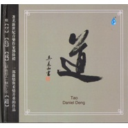
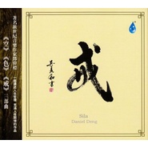
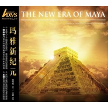
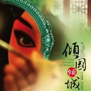
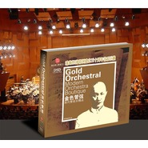
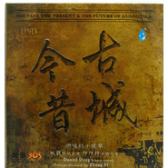
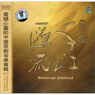
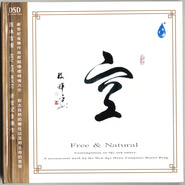

邓伟标
============================

|  |  |
| :--: | :-- |
| [ 邓伟标](https://i.xiami.com/dengweibiao) | **地区**: China 中国大陆 **风格**: 轻音乐 Easy Listening **播放数**: 17643766 **粉丝数**: 12795 **评论数**: 315  |

## 档案

中国广东省广州市人，作曲家，中国新世纪音乐代表人物之一。 
1990年开始从事流行音乐创作，是中国流行音乐明星制造体系中的第一代音乐制作人，相继制造过的流行音乐明星有王瑥、王磊、光头李进、柳云龙等。 
邓伟标一直以来从事音乐创作，并获得包括“中国流行音乐十年成就奖”在内的全国、省、市等各项音乐评奖与流行音乐排行榜奖项30多项。 
2005年开始从事新世纪音乐创作、制作，相继出版个人音乐作品专辑《空》、《千江汇流》、《古城今昔》、《红楼十二钗》、《新世纪粤曲I》、《色》、《情殇》、《古情记》、《寒风镇电影原声大碟》等。

## 专辑

| 名称 | 语种 | 唱片公司 | 发行时间 | 专辑类别 | 专辑风格 |
| :--: | :-- | :-- | :-- | :-- | :-- |
| [ 道](./albums/2102712030.md) | 其他 | 星外星音乐 | 2017年03月07日 | 录音室专辑 |  |
| [ 戒](./albums/563819.md) | 国语 | 雨林音乐 | 2012年11月01日 | 录音室专辑 |  |
| [ 玛雅新纪元](./albums/532953.md) | 国语 | 星外星音乐 | 2012年07月20日 | 录音室专辑 |  |
| [ 倾国倾城](./albums/445934.md) | 国语 | 红音堂 | 2011年02月19日 | 录音室专辑 | 轻音乐 Easy Listening |
| [ 金色管弦](./albums/442526.md) | 国语 | 独立发行 | 2010年12月23日 | 录音室专辑 | 轻音乐 Easy Listening |
| [ 寒风镇](./albums/315059.md) | 其他 | 豪杰唱片 | 2008年04月24日 | 原声带, 影视音乐 | 轻音乐 Easy Listening, 中国风 China-Wave |
| [ 情殇](./albums/32704.md) | 国语 | 豪杰唱片 | 2007年09月11日 | 录音室专辑 | 轻音乐 Easy Listening |
| [ 色](./albums/740.md) | 国语 | 雨林音乐 | 2006年10月25日 | 录音室专辑 | 轻音乐 Easy Listening |
| [ 新世纪粤曲](./albums/32702.md) | 国语 | 豪杰唱片 | 2006年09月29日 | 录音室专辑 | 中国曲艺 Chinese Quyi, 粤剧 Cantonese Opera |
| [ 古城今昔](./albums/741.md) | 国语 | 雨林音乐 | 2005年12月01日 | 录音室专辑 | 轻音乐 Easy Listening |
| [ 千江汇流](./albums/32703.md) | 国语 | 雨林音乐 | 2005年09月13日 | 录音室专辑 | 轻音乐 Easy Listening |
| [ 空](./albums/742.md) | 国语 | 雨林音乐 | 2005年03月01日 | 录音室专辑 | 轻音乐 Easy Listening |

## 评论

|  |  |  |
| :-- | :-- | :-- |
|  [虾米用户](https://emumo.xiami.com/u/427384237) 我还没想好要写什么... 2020-06-28 00:30 赞(0) 踩(0) | 
➕
 |
|  [虾米用户](https://emumo.xiami.com/u/413538952) 你好！再见。 2020-05-21 17:09 赞(1) 踩(0) | 
很久以前就听过，好听，空灵幽静
 |
|  [虾米用户](https://emumo.xiami.com/u/29531642) 别担心，人类孩子，我与你... 2020-03-27 08:33 赞(0) 踩(0) | 
吾与众生同风共雨，实为欣慰怡然之事
 |
|  [虾米用户](https://emumo.xiami.com/u/434152246) 聪明少一些大智慧多一些，... 2020-02-24 07:03 赞(0) 踩(0) | 

 |
|  [虾米用户](https://emumo.xiami.com/u/325374787)  2020-01-05 17:51 赞(0) 踩(0) | 
好棒棒糖！
 |
|  [虾米用户](https://emumo.xiami.com/u/4401950)  2019-12-15 10:42 赞(1) 踩(0) | 

 |
|  [虾米用户](https://emumo.xiami.com/u/419786582) 青青子衿，悠悠我心，但为... 2019-11-05 07:51 赞(1) 踩(0) | 
麓湖，是我记忆里那熟悉的家园 魂牵梦绕，总是想着能回到它的怀抱
 |
|  [虾米用户](https://emumo.xiami.com/u/276944698) 不要自我设限..... 2019-08-25 16:24 赞(3) 踩(0) | 

 |
|  [虾米用户](https://emumo.xiami.com/u/340903899) 我还没想好要写什么... 2019-08-23 09:02 赞(1) 踩(0) | 
，
 |
|  [虾米用户](https://emumo.xiami.com/u/311861246)  2019-07-14 17:22 赞(1) 踩(0) | 
应该谢谢你！因为有你们这些真正的音乐人中国的音乐才有希望。
 |
|  [虾米用户](https://emumo.xiami.com/u/193235171) 饭能养身  歌能养心 2019-07-11 10:31 赞(1) 踩(0) | 
原创作品就是牛X
 |
|  [虾米用户](https://emumo.xiami.com/u/411452607) 不可思议 2019-06-15 19:35 赞(1) 踩(0) | 
大师作品，必需精神
 |
|  [虾米用户](https://emumo.xiami.com/u/14207124) 翲然穆行，文观正经，曲听... 2019-06-14 11:30 赞(1) 踩(0) | 
有心比较，听了几首真不输乔瓦尼
 |
|  [虾米用户](https://emumo.xiami.com/u/346952592) 行如风  做如松  最美... 2019-04-22 07:11 赞(3) 踩(0) | 
颜容更加成熟，想当年清瘦许多，只是不相信中国当时会有如此优秀的音乐制作人！
 |
|  [虾米用户](https://emumo.xiami.com/u/421435489)  2019-03-19 10:48 赞(1) 踩(0) | 
歌曲付费都下载不了 版权怎么考虑的
 |
|  [虾米用户](https://emumo.xiami.com/u/54959843) 未必爱我所听~ 2019-03-02 22:43 赞(1) 踩(0) | 
超喜欢《秋霞》
 |
|  [虾米用户](https://emumo.xiami.com/u/402287253)  2018-12-08 20:42 赞(2) 踩(0) | 
你是一名出色的音乐家，听你的音乐使心灵得到净化，仿如进入一个超凡脱俗的世界。你的配乐非常出色，是传统与现代的完美结合，期待听到你更多优秀的作品。
 |
|  [虾米用户](https://emumo.xiami.com/u/407121592)  2018-10-27 21:13 赞(2) 踩(0) | 
很喜欢你的作品，希望能多所到你的佳作！
 |
|  [虾米用户](https://emumo.xiami.com/u/406218912) 我还没想好要写什么... 2018-10-23 22:32 赞(2) 踩(0) | 
非常喜欢听
 |
|  [虾米用户](https://emumo.xiami.com/u/52415194) ♬♩♫♪♡ 2018-10-06 21:34 赞(2) 踩(0) | 
功力好
 |
|  [虾米用户](https://emumo.xiami.com/u/351102905)  2018-10-02 18:59 赞(3) 踩(0) | 
绵绵如海&amp;hellip;&amp;hellip;&amp;hellip;、空空如也&amp;hellip;&amp;hellip;、事事如水&amp;hellip;&amp;hellip;
 |
|  [虾米用户](https://emumo.xiami.com/u/335354045)  2018-08-28 12:06 赞(2) 踩(0) | 
沁人心脾
 |
|  [虾米用户](https://emumo.xiami.com/u/8337431) 以乐会友 2018-08-09 00:29 赞(2) 踩(0) | 
292
 |
|  [虾米用户](https://emumo.xiami.com/u/376867064) 杜园园 2018-07-04 13:44 赞(0) 踩(0) | 
你有病
 |
| ⇒ |  [虾米用户](https://emumo.xiami.com/u/376867064) 杜园园 2018-07-04 13:44 赞(0) 踩(0) | 
非让你唱的
 |
|  [虾米用户](https://emumo.xiami.com/u/375874337) D&B/wemix.co... 2018-06-24 06:58 赞(0) 踩(0) | 
为什么才两个人关注你？
 |
|  [虾米用户](https://emumo.xiami.com/u/243883828) 可以无傲视之才，但需有济... 2018-06-11 15:19 赞(2) 踩(0) | 
入世高人，膜拜
 |
|  [虾米用户](https://emumo.xiami.com/u/316609181) 情理之中，情理之外 2018-06-04 22:10 赞(2) 踩(0) | 
期待你有好作品，时刻关注你 
 |
|  [虾米用户](https://emumo.xiami.com/u/355976556)  2018-05-29 22:42 赞(2) 踩(0) | 
收藏他所有的曲子 听着是一种享受
 |
|  [虾米用户](https://emumo.xiami.com/u/294213400)  2018-05-29 21:59 赞(1) 踩(0) | 
很多年前偶然听见空这首曲子，就再也没有忘记过，喜欢！
 |
|  [虾米用户](https://emumo.xiami.com/u/44191355) Bidalaska 2018-05-27 08:05 赞(1) 踩(0) | 
从来都没听过...
 |
|  [虾米用户](https://emumo.xiami.com/u/31229034) 无论世界怎样，我只选择善... 2018-05-12 19:42 赞(1) 踩(0) | 
每首都好听，有气势恢宏，有清心寡欲～
 |
|  [虾米用户](https://emumo.xiami.com/u/360601151)  2018-05-01 21:43 赞(1) 踩(0) | 
很喜欢邓老师的太极音乐
 |
|  [虾米用户](https://emumo.xiami.com/u/260526431) 我是真的 2018-04-18 18:54 赞(1) 踩(0) | 
一个人的时候听，有吗
 |
|  [虾米用户](https://emumo.xiami.com/u/354945851)  2018-03-21 07:57 赞(0) 踩(0) | 
喜欢，沉醉&amp;hellip;
 |
|  [虾米用户](https://emumo.xiami.com/u/2241336)  2017-12-28 05:45 赞(2) 踩(0) | 
识得真谛方称仙&amp;middot;信手拈来皆神曲&amp;middot;&amp;middot;&amp;middot;&amp;middot;&amp;middot;&amp;middot;
 |
|  [虾米用户](https://emumo.xiami.com/u/332039151)  2017-12-09 08:51 赞(1) 踩(0) | 
此曲只应天上有，人间能得几人闻。
 |
|  [虾米用户](https://emumo.xiami.com/u/1458528) 欣赏就是用心去读音符 2017-10-30 10:22 赞(1) 踩(0) | 
喜贺邓伟标入驻虾米！
 |
|  [虾米用户](https://emumo.xiami.com/u/8135330) 浓尽必枯  淡者屡深 2017-10-30 10:22 赞(13) 踩(0) | 
欢迎邓伟标入驻！ 你的曲子，我在北京已引入北京千龙网—北京拍客，网易，腾讯摄影空间，新浪博客摄影空间，我引入你的曲子时，标名了曲作家邓伟标，北京很多摄影博友，拍客都喜欢你的作品，祝你快乐，
 |
|  [虾米用户](https://emumo.xiami.com/u/1741617)  2017-10-28 00:23 赞(2) 踩(0) | 
不闹腾，适合需要安静又有点背景的时候听，比如学习的时候
 |
|  [虾米用户](https://emumo.xiami.com/u/804578)  2017-10-27 23:31 赞(2) 踩(0) | 
最开始听他的音乐史去年，通过itunes里面的《声行漫步》，一段讲述上海的合辑，里面用到了他的音乐，后来通过询问朵拉，才弄到了名为《悟》的这段音乐，最终知道了邓伟标，现在来虾米里，能听到这些优美的音乐，很知足啦！
 |
|  [虾米用户](https://emumo.xiami.com/u/6464598)  2017-10-27 23:08 赞(1) 踩(0) | 
欣赏邓伟标的为人，沉醉于他的音乐
 |
|  [虾米用户](https://emumo.xiami.com/u/331181352)  2017-10-26 12:34 赞(2) 踩(0) | 
三生石上影何顾，芳魂，问芳魂谁束？
 |
|  [虾米用户](https://emumo.xiami.com/u/274518280)  2017-10-22 18:09 赞(2) 踩(0) | 
新生 让我发自内心的感动 不自觉的流泪 对心灵的洗涤感恩   
 |
|  [虾米用户](https://emumo.xiami.com/u/323660235)  2017-10-02 14:14 赞(2) 踩(0) | 
真的很好听
 |
|  [虾米用户](https://emumo.xiami.com/u/12412464)   2017-08-17 08:00 赞(2) 踩(0) | 
不知为何泪流满面
 |
|  [虾米用户](https://emumo.xiami.com/u/259114857)  2017-08-17 00:23 赞(2) 踩(0) | 
天哪，太美好了！激发出我内心里面最美好的感情与愿景！感恩邓先生制作出这么美的音乐！洗涤心灵！
 |
|  [虾米用户](https://emumo.xiami.com/u/9891050) 大同 2017-08-02 15:12 赞(4) 踩(0) | 
找到了佛的音乐，如今又找到了道的音乐，带我去把儒释道凑齐。 
 |
|  [虾米用户](https://emumo.xiami.com/u/308792577)  2017-07-19 16:14 赞(2) 踩(0) | 
喜欢这份宁静。
 |
|  [虾米用户](https://emumo.xiami.com/u/282931347)  2017-07-13 08:59 赞(2) 踩(0) | 
喜欢他的音乐！
 |
|  [虾米用户](https://emumo.xiami.com/u/308821509)  2017-07-04 22:47 赞(1) 踩(0) | 
修心养性，邓老师的音乐最好了！
 |
|  [虾米用户](https://emumo.xiami.com/u/308821509)  2017-07-04 22:45 赞(2) 踩(0) | 
非常优美！
 |
|  [虾米用户](https://emumo.xiami.com/u/308821509)  2017-07-04 22:45 赞(1) 踩(0) | 
说真的，邓老师给我们带来了一些非要优美的太极音乐，如空、太极等！谢谢你！
 |
|  [虾米用户](https://emumo.xiami.com/u/304812639)  2017-06-15 23:06 赞(0) 踩(0) | 
轻音乐 Easy Listening
 |
|  [虾米用户](https://emumo.xiami.com/u/10608998)  2017-06-03 21:04 赞(0) 踩(0) | 
喜欢
 |
|  [虾米用户](https://emumo.xiami.com/u/275114423)  2017-06-03 13:55 赞(0) 踩(0) | 
听了那么多禅意音乐，还是邓老师的音乐最打动我心，阿弥陀佛，感恩   
 |
|  [虾米用户](https://emumo.xiami.com/u/10707847)  2017-05-30 01:56 赞(2) 踩(0) | 
多才多艺优秀音乐家
 |
|  [虾米用户](https://emumo.xiami.com/u/4376156) 暂无签名~ 2017-05-29 09:50 赞(2) 踩(0) | 
终于遇见一位中国乐坛牛人！顶礼了！
 |
|  [虾米用户](https://emumo.xiami.com/u/287413981)  2017-05-10 23:24 赞(10) 踩(0) | 
非常喜欢邓伟标的音乐   关注有4   5年了吧   支持   
 |
|  [虾米用户](https://emumo.xiami.com/u/9164592)  2017-04-16 22:51 赞(1) 踩(0) | 
每次打太极必用这曲音乐，听入迷了  
 |
|  [虾米用户](https://emumo.xiami.com/u/281519681)  2017-04-13 00:44 赞(1) 踩(0) | 
这才是中华的精髓，听500年不淘汰，不厌倦。
 |
|  [虾米用户](https://emumo.xiami.com/u/4120609)  2017-03-29 08:32 赞(2) 踩(0) | 
一直追他的专辑，都爱。
 |
|  [虾米用户](https://emumo.xiami.com/u/259214077)  2017-01-20 09:19 赞(2) 踩(0) | 
浮躁的心慢慢沉静下来啦！ 仿佛外界一切纷扰与我无关…
 |
|  [虾米用户](https://emumo.xiami.com/u/59177224)  2016-10-23 22:41 赞(1) 踩(0) | 
喜欢他音乐的中国元素的风格！
 |
|  [虾米用户](https://emumo.xiami.com/u/59177224)  2016-10-23 22:41 赞(3) 踩(0) | 
喜欢他音乐的中国元素的风格！
 |
|  [虾米用户](https://emumo.xiami.com/u/238935450) 宁静☆致远 2016-10-21 22:56 赞(2) 踩(0) | 
空灵
 |
|  [虾米用户](https://emumo.xiami.com/u/122688364) 生在愤坑，长在赤圈；挣脱 2016-07-22 22:51 赞(1) 踩(0) | 
2214
 |
|  [虾米用户](https://emumo.xiami.com/u/375612)  2016-05-03 10:58 赞(1) 踩(0) | 
安静到让人可以专心读书
 |
|  [虾米用户](https://emumo.xiami.com/u/17071024) 生命應該浪費在美好事物上 2016-05-02 10:30 赞(1) 踩(0) | 
空灵 自在
 |
|  [虾米用户](https://emumo.xiami.com/u/102082406)   2016-04-19 23:10 赞(3) 踩(0) | 
古琴本有意境，可惜错配劣质鸟叫，一朵白莲花被大妈擦踏成一曲广场舞的感觉。
 |
| ⇒ |  [虾米用户](https://emumo.xiami.com/u/587531)  2016-04-28 13:07 赞(0) 踩(0) | 
呵呵
 |
| ⇒ |  [虾米用户](https://emumo.xiami.com/u/587531)  2016-04-28 13:08 赞(0) 踩(0) | 
说的太好了 呵呵
 |
|  [虾米用户](https://emumo.xiami.com/u/23618525) 心净无染  自然 2016-04-01 22:44 赞(2) 踩(0) | 
常常一个人听悟，仿佛入定般，醒来有想流泪的感觉。本来无一物，何处惹尘埃
 |
|  [虾米用户](https://emumo.xiami.com/u/97526062)  2016-03-28 14:06 赞(2) 踩(0) | 
纯音乐，就是有让人心灵纯净的力量
 |
|  [虾米用户](https://emumo.xiami.com/u/10517016)  2016-03-03 09:47 赞(0) 踩(0) | 
欣赏
 |
|  [虾米用户](https://emumo.xiami.com/u/36081194) 酷狗音乐，一个有老歌的地... 2016-02-22 09:25 赞(1) 踩(0) | 
喜欢
 |
|  [虾米用户](https://emumo.xiami.com/u/52777200)  2016-02-04 21:39 赞(0) 踩(0) | 
治愈系
 |
|  [虾米用户](https://emumo.xiami.com/u/43534357) 我还没想好要写什么... 2016-01-13 20:21 赞(0) 踩(0) | 
多了份美好和向往
 |
|  [虾米用户](https://emumo.xiami.com/u/89852816)  2015-12-08 23:44 赞(0) 踩(0) | 
谁能告诉我一下，我进到这里来的，花钱 吗，我有点晕，不知道下次怎么打开，特别喜欢这里的东西
 |
|  [虾米用户](https://emumo.xiami.com/u/13012891) Musicneverce... 2015-12-05 20:04 赞(1) 踩(0) | 
还行吧，有股淡薄味
 |
|  [虾米用户](https://emumo.xiami.com/u/32678228)   2015-11-16 21:38 赞(0) 踩(0) | 
音乐绵柔
 |
|  [虾米用户](https://emumo.xiami.com/u/10270975) 好好学习天天向上 2015-10-31 14:19 赞(0) 踩(0) | 
喜欢
 |
|  [虾米用户](https://emumo.xiami.com/u/46235090)  2015-10-16 15:36 赞(0) 踩(0) | 
空、色、戒人生三部曲！妙不可言！！！
 |
|  [虾米用户](https://emumo.xiami.com/u/69985980) 听说虾米要关停了，好难过... 2015-10-13 03:18 赞(0) 踩(0) | 
hello!亲爱的，人家过来看你了呢，记得回访互粉哦，或者叫你的粉丝去粉人家呢，人家刚注册粉丝好少呀，好可怜
 |
|  [虾米用户](https://emumo.xiami.com/u/49360758) 我还没想好要写什么... 2015-07-01 00:50 赞(2) 踩(0) | 
比林海音乐更美、更打动心灵。   
 |
|  [虾米用户](https://emumo.xiami.com/u/12876004) ` 2015-06-01 16:54 赞(0) 踩(0) | 
~~
 |
|  [虾米用户](https://emumo.xiami.com/u/3489311)  2015-05-23 23:33 赞(0) 踩(0) | 
nice
 |
|  [虾米用户](https://emumo.xiami.com/u/4380909)  2015-05-13 20:42 赞(0) 踩(0) | 
shishi
 |
|  [虾米用户](https://emumo.xiami.com/u/3149830)  2015-05-08 19:23 赞(0) 踩(0) | 
收着慢慢听
 |
|  [虾米用户](https://emumo.xiami.com/u/3502219) 爷做事，一为名，二为利，... 2015-04-02 09:45 赞(1) 踩(0) | 
中国新世纪音乐
 |
|  [虾米用户](https://emumo.xiami.com/u/7941671) 让眼睛清澈的唯一办法,就... 2015-01-31 20:04 赞(34) 踩(0) | 
无意听到邓伟标的曲子，总带有空灵的感觉，让人不忍不听…又怕长时间听，听的人无欲无求，怕都要成道了…
 |
| ⇒ |  [虾米用户](https://emumo.xiami.com/u/281266491)  2017-04-11 09:05 赞(0) 踩(0) | 
有种上瘾的感觉吧?戒不了。
 |
| ⇒ |  [虾米用户](https://emumo.xiami.com/u/323666952)  2017-11-26 23:13 赞(0) 踩(0) | 
哈哈 
 |
|  [虾米用户](https://emumo.xiami.com/u/6946692) 我多想看到你，那依旧灿烂... 2015-01-22 17:13 赞(0) 踩(0) | 
邓伟标
 |
| ⇒ |  [虾米用户](https://emumo.xiami.com/u/274841301) 音乐欣赏是最大的精神享受 2017-04-19 19:56 赞(0) 踩(0) | 
美妙幽静空灵养心。
 |
|  [虾米用户](https://emumo.xiami.com/u/35370514) 音乐拯救人生～ 2015-01-11 23:13 赞(0) 踩(0) | 
中国音乐的大师～
 |
|  [虾米用户](https://emumo.xiami.com/u/43196334) 好久没有好好看过一次天空... 2014-12-24 23:46 赞(2) 踩(0) | 
好音乐，却鲜少有人听甚至难以知道。
 |
|  [虾米用户](https://emumo.xiami.com/u/45067009)  2014-12-19 18:32 赞(0) 踩(0) | 
订单
 |
|  [虾米用户](https://emumo.xiami.com/u/21323418) 暂无签名~ 2014-12-05 07:11 赞(0) 踩(0) | 

 |
|  [虾米用户](https://emumo.xiami.com/u/8128176) 好好活着 2014-11-30 02:18 赞(0) 踩(0) | 
玛雅新纪元下架了
 |
|  [虾米用户](https://emumo.xiami.com/u/31399475) 我还没想好要写什么... 2014-11-29 12:39 赞(44) 踩(0) | 
很欣慰听到中国NEW AGE在世界舞台上的这么一个独特的声音，虽然还没有那么嘹亮和精致，但是个好开始。就像《大鱼 海棠》将在中国动画里的位置一样。代表着中国文化在各种产业领域里复苏发扬的曙光。我相信我们的明天是美好的，历经5000年的中华文化不会如此轻易沉沦消散。
 |
| ⇒ |  [虾米用户](https://emumo.xiami.com/u/29114921) 追寻自由的音符 2016-01-06 14:09 赞(0) 踩(0) | 
唉？《大鱼海棠》上映了吗？
 |
| ⇒ |  [虾米用户](https://emumo.xiami.com/u/1137473) 我还没想好要写什么... 2016-04-16 11:15 赞(0) 踩(0) | 
大鱼海棠？ 跳票狂魔？
 |
| ⇒ |  [虾米用户](https://emumo.xiami.com/u/1985500)  2020-09-06 00:42 赞(0) 踩(0) | 
大鱼海棠就是画面好，故事讲的稀烂&amp;hellip;现在最缺的还是好编剧，会讲故事，才能出好作品。
 |
|  [虾米用户](https://emumo.xiami.com/u/26150922) @ 2014-11-28 15:46 赞(0) 踩(0) | 
宝宝吧x
 |
|  [虾米用户](https://emumo.xiami.com/u/13552)  2014-10-08 12:47 赞(0) 踩(0) | 
空
 |
|  [虾米用户](https://emumo.xiami.com/u/15335367)  2014-08-30 21:46 赞(1) 踩(0) | 
分享
 |
| ⇒ |  [虾米用户](https://emumo.xiami.com/u/26150922) @ 2014-11-28 15:47 赞(0) 踩(0) | 
r   Dmvc.  J Em
 |
|  [虾米用户](https://emumo.xiami.com/u/2106005)  2014-08-24 20:42 赞(0) 踩(0) | 
。
 |
|  [虾米用户](https://emumo.xiami.com/u/5478249)  2014-08-21 15:22 赞(1) 踩(0) | 
修心养性
 |
|  [虾米用户](https://emumo.xiami.com/u/21316486) 暂无签名~ 2014-07-11 16:28 赞(0) 踩(0) | 
邓伟标
 |
|  [虾米用户](https://emumo.xiami.com/u/1001242)  2014-07-03 12:35 赞(1) 踩(0) | 
邓伟标
 |
|  [虾米用户](https://emumo.xiami.com/u/10528974)  2014-06-18 03:36 赞(0) 踩(0) | 
宁静致远 相见恨晚！
 |
| ⇒ |  [虾米用户](https://emumo.xiami.com/u/26150922) @ 2014-11-28 15:46 赞(0) 踩(0) | 
跑 4briujs qju去
 |
| ⇒ |  [虾米用户](https://emumo.xiami.com/u/281266491)  2017-04-11 09:08 赞(0) 踩(0) | 
晚一点, 正好是时候。
 |
|  [虾米用户](https://emumo.xiami.com/u/9485620)  2014-06-15 23:07 赞(19) 踩(0) | 
空灵加缠绵深情。中西合璧。
 |
|  [虾米用户](https://emumo.xiami.com/u/16300022)  2014-06-10 13:32 赞(1) 踩(0) | 
很浓的中国味道,好喜欢
 |
|  [虾米用户](https://emumo.xiami.com/u/6666474) shuiruyan 2014-05-24 19:56 赞(2) 踩(0) | 
中国新世纪音乐代表人物之一
 |
|  [虾米用户](https://emumo.xiami.com/u/4240907)  2014-05-12 16:12 赞(0) 踩(0) | 
中国新世纪音乐代表人物之一
 |
|  [虾米用户](https://emumo.xiami.com/u/35771161)  2014-05-10 22:57 赞(0) 踩(0) | 
《古城今惜》，粤之韵！身为广州人，我倍感自豪！
 |
|  [虾米用户](https://emumo.xiami.com/u/4906195) Open-minded 2014-04-23 17:07 赞(1) 踩(0) | 
喜欢就是喜欢，回归很重要
 |
|  [虾米用户](https://emumo.xiami.com/u/7773476)  2014-04-10 15:36 赞(0) 踩(0) | 
空灵
 |
|  [虾米用户](https://emumo.xiami.com/u/35158914)  2014-04-10 15:35 赞(0) 踩(0) | 
听着清新，舒服！
 |
|  [虾米用户](https://emumo.xiami.com/u/21666043) 平淡温暖 2014-04-09 23:40 赞(0) 踩(0) | 
平静
 |
|  [虾米用户](https://emumo.xiami.com/u/15263310)  2014-03-29 12:52 赞(1) 踩(0) | 
早就喜欢上他至灵至性的音乐。
 |
|  [虾米用户](https://emumo.xiami.com/u/11892617)  2014-03-29 01:34 赞(0) 踩(0) | 
国人国乐
 |
|  [虾米用户](https://emumo.xiami.com/u/12172755)  2014-03-27 19:55 赞(0) 踩(0) | 
my favorite
 |
|  [虾米用户](https://emumo.xiami.com/u/32189164) 寻找，发现，倾听，惊喜 2014-03-17 11:36 赞(2) 踩(0) | 
有点像偏向佛家音乐。说不上很喜欢，能听就是了。 还是觉得林海更对咱胃口。
 |
|  [虾米用户](https://emumo.xiami.com/u/21097241)  2014-03-12 15:49 赞(0) 踩(0) | 
清新、典雅、安静
 |
|  [虾米用户](https://emumo.xiami.com/u/8315733)  2014-03-10 20:43 赞(0) 踩(0) | 
静静静
 |
|  [虾米用户](https://emumo.xiami.com/u/3040279) 昆明大黄瓜 2014-03-10 12:30 赞(0) 踩(0) | 
相见恨晚
 |
|  [虾米用户](https://emumo.xiami.com/u/31299502) 梦幻天使helen966 2014-03-07 09:46 赞(0) 踩(0) | 
古风音乐
 |
|  [虾米用户](https://emumo.xiami.com/u/437003)   2014-03-06 11:06 赞(0) 踩(0) | 
中国
 |
|  [虾米用户](https://emumo.xiami.com/u/28886477)  2014-02-24 14:47 赞(1) 踩(0) | 
清幽、飘逸、天籁、禅意
 |
|  [虾米用户](https://emumo.xiami.com/u/3912760) 用嘻哈的蓝调过二胡一样的... 2014-02-24 11:44 赞(0) 踩(0) | 
好听
 |
|  [虾米用户](https://emumo.xiami.com/u/3912760) 用嘻哈的蓝调过二胡一样的... 2014-02-24 11:42 赞(0) 踩(0) | 
很不错很不错啊
 |
|  [虾米用户](https://emumo.xiami.com/u/11249484) harmony 2014-02-22 20:45 赞(0) 踩(0) | 
氣機
 |
|  [虾米用户](https://emumo.xiami.com/u/33008433)  2014-02-22 11:49 赞(0) 踩(0) | 
喜欢
 |
|  [虾米用户](https://emumo.xiami.com/u/2307526) 连接比特与像素的造梦师！ 2014-02-22 11:13 赞(0) 踩(0) | 
禅！
 |
|  [虾米用户](https://emumo.xiami.com/u/630760) 感谢11年来的陪伴，我爱... 2014-02-10 17:35 赞(1) 踩(0) | 
相见恨晚
 |
|  [虾米用户](https://emumo.xiami.com/u/1925003)  2014-02-10 15:54 赞(0) 踩(0) | 
有点禅味的音乐﹏﹏空灵、如天空般纯真！
 |
|  [虾米用户](https://emumo.xiami.com/u/1925003)  2014-02-10 15:45 赞(0) 踩(0) | 
空灵、闲暇无事时候听听！
 |
|  [虾米用户](https://emumo.xiami.com/u/11076669) 走出户外 享受阳光 2014-01-20 22:09 赞(0) 踩(0) | 
自然空灵……
 |
|  [虾米用户](https://emumo.xiami.com/u/144619)   2014-01-17 20:01 赞(0) 踩(0) | 
好听死啦！！中国风+新世纪。
 |
|  [虾米用户](https://emumo.xiami.com/u/144619)   2014-01-17 20:01 赞(0) 踩(0) | 
WA 哇！好棒啊！好听死啦！
 |
|  [虾米用户](https://emumo.xiami.com/u/30442011)  2014-01-17 13:57 赞(0) 踩(0) | 
路过
 |
|  [虾米用户](https://emumo.xiami.com/u/216808) supin37033 2014-01-13 12:19 赞(0) 踩(0) | 
喜欢
 |
|  [虾米用户](https://emumo.xiami.com/u/2950288)  2014-01-10 23:15 赞(0) 踩(0) | 
好音乐~相见恨晚
 |
|  [虾米用户](https://emumo.xiami.com/u/7839577)   2014-01-08 18:38 赞(2) 踩(0) | 
最近开始循环，真心沉醉的音乐，琴声自有悠悠，余音袅袅，音乐有有历史变迁，岁月沉淀，城市深厚的文化底蕴和历史气息。
 |
|  [虾米用户](https://emumo.xiami.com/u/8337431) 以乐会友 2014-01-07 01:46 赞(2) 踩(0) | 
再听老邓 685172,3295,171
 |
|  [虾米用户](https://emumo.xiami.com/u/21599622)  2014-01-01 17:13 赞(0) 踩(0) | 
淡雅、空幽名族风
 |
|  [虾米用户](https://emumo.xiami.com/u/11967559)   2013-12-17 16:22 赞(0) 踩(0) | 
喜欢
 |
|  [虾米用户](https://emumo.xiami.com/u/9138832)  2013-12-13 14:45 赞(0) 踩(0) | 
ok
 |
|  [虾米用户](https://emumo.xiami.com/u/5604569)  2013-12-01 18:41 赞(0) 踩(0) | 
vvv
 |
|  [虾米用户](https://emumo.xiami.com/u/9459029)  2013-11-26 20:42 赞(1) 踩(0) | 
旋律舒缓悠扬，声音中有意境，冥冥中有禅意，使人平心静气
 |
|  [虾米用户](https://emumo.xiami.com/u/2446953)  2013-11-26 09:22 赞(0) 踩(0) | 
岭南的音乐人才还真不少，而且比起北方的那些玩摇滚的来是比较令我容易接受的那种。
 |
|  [虾米用户](https://emumo.xiami.com/u/8443562)  2013-11-22 13:32 赞(0) 踩(0) | 
好听
 |
|  [虾米用户](https://emumo.xiami.com/u/1969646) 我心有猛虎 细嗅蔷薇 2013-11-17 10:21 赞(0) 踩(0) | 
禅 悟
 |
|  [虾米用户](https://emumo.xiami.com/u/18773012) 卫道东升 2013-11-16 11:47 赞(0) 踩(0) | 
听他音乐我醉了。
 |
|  [虾米用户](https://emumo.xiami.com/u/374450) GAME MAKER！！ 2013-11-07 11:28 赞(0) 踩(0) | 
空
 |
|  [虾米用户](https://emumo.xiami.com/u/1340231) 质实之心，风雅之趣 2013-11-06 20:49 赞(0) 踩(0) | 
禅
 |
|  [虾米用户](https://emumo.xiami.com/u/7007254) 你要的我都有啊~~ 2013-11-06 10:27 赞(0) 踩(0) | 
民族的就是世界的！
 |
|  [虾米用户](https://emumo.xiami.com/u/13231022)  2013-11-05 10:02 赞(0) 踩(0) | 
温馨
 |
|  [虾米用户](https://emumo.xiami.com/u/24394522) 无为而无不为 2013-10-13 17:10 赞(0) 踩(0) | 
需要慢慢来题为啊。
 |
|  [虾米用户](https://emumo.xiami.com/u/10581838) yuRita 2013-10-06 15:09 赞(0) 踩(0) | 
美哉！
 |
|  [虾米用户](https://emumo.xiami.com/u/13603354) 非诚勿扰 2013-09-21 11:00 赞(0) 踩(0) | 
邓伟标
 |
|  [虾米用户](https://emumo.xiami.com/u/10547530) 生于白昼，隐与黑夜。 2013-09-18 22:35 赞(1) 踩(0) | 
禅的意蕴。空的凝练。Master。
 |
|  [虾米用户](https://emumo.xiami.com/u/11722170) Eve 2013-09-06 11:12 赞(0) 踩(0) | 
Very relaxing music. Love it!
 |
|  [虾米用户](https://emumo.xiami.com/u/15463579) 微信公众账号：的和了 2013-09-04 12:35 赞(0) 踩(0) | 
洗涤心灵
 |
|  [虾米用户](https://emumo.xiami.com/u/20005876)  2013-08-22 22:42 赞(1) 踩(0) | 
从古城今昔就喜欢上他的音乐
 |
|  [虾米用户](https://emumo.xiami.com/u/11084566)  2013-08-12 23:25 赞(0) 踩(0) | 
小提琴
 |
|  [虾米用户](https://emumo.xiami.com/u/11084566)  2013-08-12 23:25 赞(0) 踩(0) | 
小提琴
 |
|  [虾米用户](https://emumo.xiami.com/u/17734321)  2013-07-25 19:21 赞(1) 踩(0) | 
最喜欢何莹古筝的那首《倾心 河莲》，作曲人在表现手法上的确可圈可点。
 |
|  [虾米用户](https://emumo.xiami.com/u/15882383) 春暖花尤盛/时光依然最美 2013-07-23 14:50 赞(0) 踩(0) | 
纯纯的音乐
 |
|  [虾米用户](https://emumo.xiami.com/u/353) 强迫症确诊 2013-07-10 22:36 赞(0) 踩(0) | 
邓老师也入驻了，哇哇
 |
|  [虾米用户](https://emumo.xiami.com/u/10392414)  2013-07-05 21:25 赞(0) 踩(0) | 
空寂露脆音
 |
|  [虾米用户](https://emumo.xiami.com/u/2098169)  2013-07-03 10:47 赞(1) 踩(0) | 
非常喜欢邓老师的音乐。期待更多美好的作品。
 |
|  [虾米用户](https://emumo.xiami.com/u/8889219)  2013-06-27 06:59 赞(0) 踩(0) | 
nice music
 |
|  [虾米用户](https://emumo.xiami.com/u/3391916) 紫燕骄舞怡情趣 吟风唱完... 2013-06-23 15:48 赞(0) 踩(0) | 
是中国流行音乐明星制造体系中的第一代音乐制作人，相继制造过的流行音乐明星有王瑥、王磊、光头李进、柳云龙等。
 |
|  [虾米用户](https://emumo.xiami.com/u/7118654)  2013-06-18 14:11 赞(0) 踩(0) | 
古雅悠远、空灵之音
 |
|  [虾米用户](https://emumo.xiami.com/u/2208838) 愿我永生 2013-06-16 22:30 赞(0) 踩(0) | 
又找到个好的
 |
|  [虾米用户](https://emumo.xiami.com/u/5143195)  2013-06-12 17:17 赞(0) 踩(0) | 
唯美之音
 |
|  [虾米用户](https://emumo.xiami.com/u/9912438)  2013-05-29 12:28 赞(0) 踩(0) | 
谢谢您！
 |
|  [虾米用户](https://emumo.xiami.com/u/4412959) fresh steame... 2013-05-24 18:02 赞(0) 踩(0) | 
跟我一個姓。不錯~我喜歡~
 |
|  [虾米用户](https://emumo.xiami.com/u/555029)  2013-05-13 16:17 赞(0) 踩(0) | 
静心
 |
|  [虾米用户](https://emumo.xiami.com/u/6770643) 谨言慎行，戒急用忍 2013-05-11 21:44 赞(0) 踩(0) | 
版权问题终于解决了么。。。我等发烧友可以一饱耳福
 |
|  [虾米用户](https://emumo.xiami.com/u/672537) 我还没想好要写什么... 2013-05-11 09:45 赞(0) 踩(0) | 
赞
 |
|  [虾米用户](https://emumo.xiami.com/u/9575413) 我还没想好要写什么... 2013-05-10 22:45 赞(0) 踩(0) | 
喜欢您
 |
|  [虾米用户](https://emumo.xiami.com/u/5135402)  2013-05-10 17:52 赞(0) 踩(0) | 
喜欢您的每一张专辑！谢谢您的辛苦创作！祝好！
 |
|  [虾米用户](https://emumo.xiami.com/u/3367) 错在不会错 2013-05-10 10:05 赞(0) 踩(0) | 
呀。邓老师来了
 |
|  [虾米用户](https://emumo.xiami.com/u/9086126)  2013-05-09 16:53 赞(0) 踩(0) | 
来 亲一个
 |
|  [虾米用户](https://emumo.xiami.com/u/3265314) 用音乐致青春 2013-05-09 16:52 赞(0) 踩(0) | 
从 问道 开始
 |
|  [虾米用户](https://emumo.xiami.com/u/2198269) 是大厨- 2013-05-09 16:31 赞(1) 踩(0) | 
发来贺电！ 真希望大陆有更多像标哥这样的纯音系大师！！！ 吐槽几句，岛国的纯音大师比天朝多多了
 |
|  [虾米用户](https://emumo.xiami.com/u/736684) 我还没想好要写什么... 2013-05-09 15:26 赞(0) 踩(0) | 
恭喜邓老师入驻！ 很喜欢您的《寒风镇》和《色》
 |
|  [虾米用户](https://emumo.xiami.com/u/6801243) 没什么可给你但求凭这阙歌 2013-05-09 13:52 赞(0) 踩(0) | 
恭喜标哥入驻
 |
|  [虾米用户](https://emumo.xiami.com/u/5797645) 又来了？ 2013-05-09 13:05 赞(1) 踩(0) | 
鼓掌！！
 |
|  [虾米用户](https://emumo.xiami.com/u/6136520)  2013-05-09 11:09 赞(1) 踩(0) | 
祝贺！
 |
|  [虾米用户](https://emumo.xiami.com/u/1992993) 喝高山流水，做下里巴人 2013-05-09 10:24 赞(1) 踩(0) | 
欢迎
 |
|  [虾米用户](https://emumo.xiami.com/u/5475877) 低调说话，高调听歌…… 2013-05-09 10:01 赞(1) 踩(0) | 
欢迎标哥入驻！
 |
|  [虾米用户](https://emumo.xiami.com/u/29) 耍中偶得 2013-05-09 10:01 赞(0) 踩(0) | 
耶！
 |
|  [虾米用户](https://emumo.xiami.com/u/713835) 何妨吟啸且徐行 2013-05-09 09:24 赞(1) 踩(0) | 
向标哥致敬！
 |
|  [虾米用户](https://emumo.xiami.com/u/8337431) 以乐会友 2013-05-09 09:20 赞(0) 踩(0) | 
祝贺标哥入驻！！！ 2343
 |
|  [虾米用户](https://emumo.xiami.com/u/3932979)   2013-05-08 10:45 赞(1) 踩(0) | 
芊指轻捻，弹一季风华倦怠，一曲梵音，诉几许浮缘薄凉。。。
 |
|  [虾米用户](https://emumo.xiami.com/u/1700002) V5_ORZZZZZ 2013-04-27 16:39 赞(0) 踩(0) | 
Easy Listening
 |
| ⇒ |  [虾米用户](https://emumo.xiami.com/u/13985492)  2013-05-08 22:16 赞(0) 踩(0) | 
大神，我看见你了
 |
| ⇒ |  [虾米用户](https://emumo.xiami.com/u/1700002) V5_ORZZZZZ 2013-05-08 22:36 赞(0) 踩(0) | 
<q><b>浅唱、小情调说：</b></q>
 |
|  [虾米用户](https://emumo.xiami.com/u/5044438) 今天白嘟出雙人曲了嗎？ 2013-04-22 21:28 赞(0) 踩(0) | 
居然能搜到标叔叔……震惊QLQ
 |
|  [虾米用户](https://emumo.xiami.com/u/8337431) 以乐会友 2013-04-17 03:41 赞(2) 踩(0) | 
再顶标哥，重听《古城今昔》感触良多。极力推荐《流花的湖》、《粤之城》、《情殇》........
 |
|  [虾米用户](https://emumo.xiami.com/u/13636174) 爱音乐爱生活 2013-04-15 18:32 赞(0) 踩(0) | 
中国新世纪
 |
|  [虾米用户](https://emumo.xiami.com/u/12321533)  2013-04-13 14:12 赞(0) 踩(0) | 
好听
 |
|  [虾米用户](https://emumo.xiami.com/u/7352991)  2013-04-10 15:28 赞(0) 踩(0) | 
清静
 |
|  [虾米用户](https://emumo.xiami.com/u/9735422) 爱音乐 2013-04-09 17:56 赞(0) 踩(0) | 
1
 |
|  [虾米用户](https://emumo.xiami.com/u/13869720)  2013-04-08 23:23 赞(0) 踩(0) | 
喜歡他ㄉ樂風
 |
|  [虾米用户](https://emumo.xiami.com/u/13741013)  2013-03-30 17:08 赞(0) 踩(0) | 
想起了童年居住的地方
 |
|  [虾米用户](https://emumo.xiami.com/u/3886305) 就一男的 2013-03-21 00:46 赞(0) 踩(0) | 
空灵,
 |
|  [虾米用户](https://emumo.xiami.com/u/2138262)  2013-03-20 19:27 赞(0) 踩(0) | 
美，很沉醉。
 |
|  [虾米用户](https://emumo.xiami.com/u/12201447) hi～ 2013-03-17 18:00 赞(0) 踩(0) | 
纯音乐
 |
|  [虾米用户](https://emumo.xiami.com/u/13441493) 勇者无敌 2013-03-16 01:13 赞(0) 踩(0) | 
喜欢这种
 |
|  [虾米用户](https://emumo.xiami.com/u/13505650) 暂无签名~ 2013-03-15 08:51 赞(0) 踩(0) | 
中国风
 |
|  [虾米用户](https://emumo.xiami.com/u/10201994)  2013-03-11 13:08 赞(0) 踩(0) | 
深情 穿透力,古风,纯音乐,
 |
|  [虾米用户](https://emumo.xiami.com/u/7821750)  2013-03-10 11:39 赞(0) 踩(0) | 
空灵
 |
|  [虾米用户](https://emumo.xiami.com/u/9627351) 嗯哼！ 2013-03-05 19:14 赞(0) 踩(0) | 
喜欢呢感觉！
 |
|  [虾米用户](https://emumo.xiami.com/u/2982825)  2013-03-03 23:18 赞(0) 踩(0) | 
空
 |
|  [虾米用户](https://emumo.xiami.com/u/7997065)  2013-03-03 14:28 赞(0) 踩(0) | 
啊！让这种音乐成为主流吧！【虽然不可能
 |
|  [虾米用户](https://emumo.xiami.com/u/3235848)  2013-03-03 11:51 赞(0) 踩(0) | 
空 色 戒
 |
|  [虾米用户](https://emumo.xiami.com/u/3882880)  2013-03-03 04:31 赞(0) 踩(0) | 
囧为什么我听哭了。。。。。
 |
|  [虾米用户](https://emumo.xiami.com/u/13284138) 很好 2013-02-28 11:15 赞(0) 踩(0) | 
古筝
 |
|  [虾米用户](https://emumo.xiami.com/u/1417991)  2013-02-28 10:56 赞(0) 踩(0) | 
佛音
 |
|  [虾米用户](https://emumo.xiami.com/u/10712167) xueran 2013-02-27 07:46 赞(0) 踩(0) | 
纯净的音乐，让人心静。
 |
|  [虾米用户](https://emumo.xiami.com/u/3133819) 竹青 2013-02-25 13:17 赞(0) 踩(0) | 
古乐
 |
|  [虾米用户](https://emumo.xiami.com/u/4490197)  2013-02-25 11:26 赞(0) 踩(0) | 
使人心静的音乐！！
 |
|  [虾米用户](https://emumo.xiami.com/u/13200657) 不去思考，去感受 2013-02-23 16:24 赞(0) 踩(0) | 
如天空般纯真。
 |
|  [虾米用户](https://emumo.xiami.com/u/11291385)  2013-02-23 09:53 赞(0) 踩(0) | 
xihuan
 |
|  [虾米用户](https://emumo.xiami.com/u/13122390)  2013-02-22 21:05 赞(0) 踩(0) | 
空
 |
|  [虾米用户](https://emumo.xiami.com/u/13174017)  2013-02-22 00:51 赞(0) 踩(0) | 
减压、缓神，乐风听起来顺。
 |
|  [虾米用户](https://emumo.xiami.com/u/6463750) 清风拂山岗 2013-01-30 10:36 赞(0) 踩(0) | 
音乐清新、放松！
 |
|  [虾米用户](https://emumo.xiami.com/u/5446882)  2013-01-24 15:28 赞(0) 踩(0) | 
色、空、戒
 |
|  [虾米用户](https://emumo.xiami.com/u/7293762) 乐声悠悠伴我行 2013-01-12 20:15 赞(2) 踩(0) | 
2012年下半年曾经全部下架，想听都听不了，现恢复正常，乐迷的福音~~空灵、清澈、纯净的音乐，必须顶起~~
 |
|  [虾米用户](https://emumo.xiami.com/u/6909243)  2012-12-21 09:54 赞(0) 踩(0) | 
******
 |
|  [虾米用户](https://emumo.xiami.com/u/1162143)  2012-12-20 20:26 赞(0) 踩(0) | 
怎么还会下架？......
 |
|  [虾米用户](https://emumo.xiami.com/u/448235)  2012-12-09 16:46 赞(0) 踩(0) | 
有点禅味的音乐
 |
|  [虾米用户](https://emumo.xiami.com/u/10231881) 天天UP~~!~~ 2012-11-27 00:34 赞(1) 踩(0) | 
又是bq问题~！
 |
|  [虾米用户](https://emumo.xiami.com/u/2249339) 聆听绝美动听的音符 2012-11-20 20:32 赞(0) 踩(0) | 
为啥下架了？？
 |
|  [虾米用户](https://emumo.xiami.com/u/3265314) 用音乐致青春 2012-11-20 09:23 赞(0) 踩(0) | 
全下架了？！
 |
|  [虾米用户](https://emumo.xiami.com/u/11566617)  2012-11-19 21:21 赞(0) 踩(0) | 
他的音乐大气
 |
|  [虾米用户](https://emumo.xiami.com/u/1315500)  2012-11-18 18:40 赞(0) 踩(0) | 
******
 |
|  [虾米用户](https://emumo.xiami.com/u/2300237)  2012-11-14 21:19 赞(0) 踩(0) | 
为什么全下架了！！
 |
|  [虾米用户](https://emumo.xiami.com/u/11391237)  2012-11-11 23:49 赞(0) 踩(0) | 
全下架了，唉
 |
|  [虾米用户](https://emumo.xiami.com/u/10516209)  2012-09-28 13:08 赞(0) 踩(0) | 
邓伟标
 |
|  [虾米用户](https://emumo.xiami.com/u/4424986) 有约不来过夜半，闲敲棋子... 2012-09-03 13:46 赞(0) 踩(0) | 
28
 |
|  [虾米用户](https://emumo.xiami.com/u/9147187)  2012-08-30 15:51 赞(0) 踩(0) | 
哪得有中国音乐人写出这么柔这么美的曲子
 |
|  [虾米用户](https://emumo.xiami.com/u/9633662) ज्ञापारिमता 2012-08-20 09:29 赞(0) 踩(0) | 
支持中国的新世纪音乐
 |
|  [虾米用户](https://emumo.xiami.com/u/3914624)  2012-08-01 10:14 赞(0) 踩(0) | 
古典与现代的结合
 |
|  [虾米用户](https://emumo.xiami.com/u/9543598)  2012-06-27 10:51 赞(0) 踩(0) | 
Music
 |
|  [虾米用户](https://emumo.xiami.com/u/9329746) 今古有神奉志士 2012-06-17 18:20 赞(0) 踩(0) | 
可以一听
 |
|  [虾米用户](https://emumo.xiami.com/u/1987316)  2012-06-06 11:44 赞(0) 踩(0) | 
关于邓伟标，最早听闻过《流花的湖》，而后《色》《空》，喜欢
 |
|  [虾米用户](https://emumo.xiami.com/u/971091) 我还没想好要写什么... 2012-05-28 17:12 赞(0) 踩(0) | 
国乐精粹！值得永久珍藏！
 |
|  [虾米用户](https://emumo.xiami.com/u/2249408)  2012-05-17 10:29 赞(0) 踩(0) | 
邓粉.
 |
|  [虾米用户](https://emumo.xiami.com/u/684743)  2012-05-15 18:06 赞(0) 踩(0) | 
清新 幽静
 |
|  [虾米用户](https://emumo.xiami.com/u/9164504)   2012-05-13 19:03 赞(0) 踩(0) | 
古典
 |
|  [虾米用户](https://emumo.xiami.com/u/5983325)  2012-05-11 14:09 赞(1) 踩(0) | 
喜欢邓伟标的古典与现代完美结合
 |
|  [虾米用户](https://emumo.xiami.com/u/5590682)  2012-05-10 20:22 赞(0) 踩(0) | 
好听
 |
|  [虾米用户](https://emumo.xiami.com/u/9129008)  2012-05-10 10:56 赞(0) 踩(0) | 
可是无法下载
 |
|  [虾米用户](https://emumo.xiami.com/u/8337431) 以乐会友 2012-04-22 23:41 赞(2) 踩(0) | 
邓伟标的记忆源自新世纪粤曲，有五六年没听老邓了，看来这几年算是白活了，为我们现在还有这样优秀的民族音乐家而庆幸并致敬。
 |
|  [虾米用户](https://emumo.xiami.com/u/6755152)  2012-04-17 15:28 赞(0) 踩(0) | 
好听极了
 |
|  [虾米用户](https://emumo.xiami.com/u/8717657)  2012-04-06 22:23 赞(0) 踩(0) | 
好听
 |
|  [虾米用户](https://emumo.xiami.com/u/8741719)  2012-04-05 13:13 赞(0) 踩(0) | 
流花的湖非常好听
 |
|  [虾米用户](https://emumo.xiami.com/u/8018643)  2012-04-01 18:23 赞(0) 踩(0) | 
べ_べ
 |
|  [虾米用户](https://emumo.xiami.com/u/6894036)  2012-03-21 10:22 赞(0) 踩(0) | 
喜欢
 |
|  [虾米用户](https://emumo.xiami.com/u/8481025) 平凡简单，安于平凡，真不... 2012-03-21 00:11 赞(0) 踩(0) | 
空，色
 |
|  [虾米用户](https://emumo.xiami.com/u/1591181)  2012-03-07 19:26 赞(0) 踩(0) | 
美乐
 |
|  [虾米用户](https://emumo.xiami.com/u/8298630)  2012-03-06 23:04 赞(1) 踩(0) | 
太极
 |
|  [虾米用户](https://emumo.xiami.com/u/6969605)  2012-03-03 10:06 赞(0) 踩(0) | 
喜欢邓伟标的音乐，
 |
|  [虾米用户](https://emumo.xiami.com/u/8208910)  2012-02-27 16:49 赞(0) 踩(0) | 
轻柔
 |
|  [虾米用户](https://emumo.xiami.com/u/8169166)  2012-02-24 21:35 赞(0) 踩(0) | 
乱世凈土
 |
|  [虾米用户](https://emumo.xiami.com/u/719311)  2012-02-24 14:36 赞(0) 踩(0) | 
i沉吟。。。
 |
|  [虾米用户](https://emumo.xiami.com/u/8135330) 浓尽必枯  淡者屡深 2012-02-23 20:38 赞(0) 踩(0) | 
真好
 |
|  [虾米用户](https://emumo.xiami.com/u/4962958)  2012-02-18 01:31 赞(0) 踩(0) | 
清音
 |
|  [虾米用户](https://emumo.xiami.com/u/3433034)  2012-02-15 10:15 赞(0) 踩(0) | 
空灵
 |
|  [虾米用户](https://emumo.xiami.com/u/4319914)   2012-02-09 15:18 赞(0) 踩(0) | 
适合“通灵推杆”时的训练~
 |
|  [虾米用户](https://emumo.xiami.com/u/7366460) 音乐，是心灵的感受，是心... 2012-02-07 02:30 赞(0) 踩(0) | 
音乐优美
 |
|  [虾米用户](https://emumo.xiami.com/u/5455002)  2012-02-06 09:13 赞(0) 踩(0) | 
行
 |
|  [虾米用户](https://emumo.xiami.com/u/326173)  2012-01-30 19:15 赞(0) 踩(0) | 
第一首 空
 |
|  [虾米用户](https://emumo.xiami.com/u/7547702)  2012-01-16 15:02 赞(0) 踩(0) | 
安静　清纯
 |
|  [虾米用户](https://emumo.xiami.com/u/7424378)  2011-12-30 21:07 赞(0) 踩(0) | 
中国音乐有你真好
 |
|  [虾米用户](https://emumo.xiami.com/u/4217241)  2011-12-25 10:49 赞(0) 踩(0) | 
静思
 |
|  [虾米用户](https://emumo.xiami.com/u/7213961)  2011-12-13 19:26 赞(1) 踩(0) | 
音乐有没有内涵，是不是用心在做，是不是能够引发心灵的共鸣。一听便知。
 |
|  [虾米用户](https://emumo.xiami.com/u/5108830)  2011-12-11 20:33 赞(0) 踩(0) | 
偏民乐多些
 |
|  [虾米用户](https://emumo.xiami.com/u/5108830)  2011-12-11 20:17 赞(0) 踩(0) | 
new age
 |
|  [虾米用户](https://emumo.xiami.com/u/682917)  2011-12-10 19:35 赞(0) 踩(0) | 
历史的回眸一笑
 |
|  [虾米用户](https://emumo.xiami.com/u/1906959)  2011-12-09 23:45 赞(0) 踩(0) | 
动听
 |
|  [虾米用户](https://emumo.xiami.com/u/7127471)  2011-12-06 19:10 赞(0) 踩(0) | 
纯音乐,中国风,太极 柔美,民乐,
 |
|  [虾米用户](https://emumo.xiami.com/u/2733026)  2011-11-30 09:26 赞(1) 踩(0) | 
曾经的痴迷，记忆中的大气磅礴，柔情是水合奏。
 |
|  [虾米用户](https://emumo.xiami.com/u/2249383)  2011-11-26 18:20 赞(0) 踩(0) | 
問道 別有意境...
 |
|  [虾米用户](https://emumo.xiami.com/u/6911189)   2011-11-23 15:41 赞(0) 踩(0) | 
很喜欢他的专辑《空》
 |
|  [虾米用户](https://emumo.xiami.com/u/6545702)  2011-11-01 11:30 赞(0) 踩(0) | 
``
 |
|  [虾米用户](https://emumo.xiami.com/u/5883746)  2011-09-19 16:24 赞(0) 踩(0) | 
空灵的音乐带给我的是无比的享受
 |
|  [虾米用户](https://emumo.xiami.com/u/5182755) I like xiami 2011-08-17 23:01 赞(0) 踩(0) | 
like
 |
|  [虾米用户](https://emumo.xiami.com/u/5177691)  2011-08-09 10:08 赞(0) 踩(0) | 
空灵
 |
|  [虾米用户](https://emumo.xiami.com/u/5067808)  2011-07-30 10:51 赞(0) 踩(0) | 
最喜欢他的那首“无觉”
 |
|  [虾米用户](https://emumo.xiami.com/u/5035482)  2011-07-27 17:53 赞(0) 踩(0) | 
喜欢民族音乐
 |
|  [虾米用户](https://emumo.xiami.com/u/105091)   2011-07-19 11:52 赞(0) 踩(0) | 
民族
 |
|  [虾米用户](https://emumo.xiami.com/u/654245) 不是知音者，难教爱此声。 2011-06-30 18:13 赞(0) 踩(0) | 
顶起！华丽新世纪中国风！
 |
|  [虾米用户](https://emumo.xiami.com/u/2754685)  2011-06-27 10:26 赞(0) 踩(0) | 
原来他是广州人，我最喜欢他的那首《希望》了
 |
|  [虾米用户](https://emumo.xiami.com/u/590781)  2011-06-15 01:35 赞(1) 踩(0) | 
很值得关注的中国本土古典音乐制作人！
 |
|  [虾米用户](https://emumo.xiami.com/u/1155186)  2011-06-07 17:40 赞(0) 踩(0) | 
喜欢这样的音乐
 |
|  [虾米用户](https://emumo.xiami.com/u/1052461) @blinK4sy- 2011-04-14 17:26 赞(0) 踩(0) | 
休息一下·
 |
|  [虾米用户](https://emumo.xiami.com/u/2001909)  2011-04-06 23:13 赞(0) 踩(0) | 
能把二胡和钢琴融合的这么好，没话说，喜欢你。
 |
|  [虾米用户](https://emumo.xiami.com/u/1102881)  2011-03-22 15:31 赞(0) 踩(0) | 
广州
 |
|  [虾米用户](https://emumo.xiami.com/u/1213651)  2011-03-02 05:55 赞(0) 踩(0) | 
色即是 空
 |
|  [虾米用户](https://emumo.xiami.com/u/2474803)  2011-03-01 23:41 赞(0) 踩(0) | 
静~
 |
|  [虾米用户](https://emumo.xiami.com/u/2847502)  2011-02-23 07:42 赞(0) 踩(0) | 
原创
 |
|  [虾米用户](https://emumo.xiami.com/u/687576) 分享疲惫灵魂中高贵的梦想 2011-01-16 21:38 赞(0) 踩(0) | 
中国特色的新世纪音乐
 |
|  [虾米用户](https://emumo.xiami.com/u/1342581)  2011-01-15 03:28 赞(1) 踩(0) | 
好听的就是喜欢的!
 |
|  [虾米用户](https://emumo.xiami.com/u/888659)  2010-08-01 11:05 赞(0) 踩(0) | 
音樂意境不錯.我喜歡
 |
