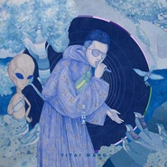

演.说.家
============================

|  |  |
| :--: | :-- |
| [ 演.说.家](https://emumo.xiami.com/album/2105349510) | **艺人**: [王以太](../index.md) **语种**: 国语 **唱片公司**: 第四音乐 **发行时间**: 2019年10月10日 **专辑类别**: 录音室专辑 **专辑风格**:  **播放数**: 6593 **收藏数**: 42 **评论数**: 17  |

## 简介

王以太签约第四音乐的首张全新概念音乐大碟《演.说.家》  
演说家≥说唱歌手？！  
——打通科幻与写实的隧道，王以太“演”绎他最擅长的角色  
演，是本我人性艺术最直观的表达  
每一部作品的诞生，每一个角色的创作，演标志着主观原点的开始  
灵感迸发自每一帧热情的表演  
他与生俱来，是驱力能量的来源  
——链接Hip Hop音乐的信仰，且听王以太评“说”寓言的真理  
说，是自我说唱音乐的本分，亦是说唱歌手自我的剖析与救赎  
不论是情感宣泄还是现世的歌颂与讽刺  
他沟通、传递、交流着人性最基本的执行需要  
调和出意识的存在与觉醒  
——精神寄托还是避风港湾，王以太用唱作诠释“家”的概念  
家，是超我内在最走心的判断  
他如同一棵大树开枝散叶，组合出一个共同体形成不可分割的完整  
人与人之间微妙的化学反应是一种共鸣  
他将永不停止去追求更完美的境界  
2019/10/10全面解构王以太 尽情剖析《演.说.家》

## 曲目

## 评论

|  |  |  |  |
| :-- | :-- | :-- | :-- |
|  [虾米用户](https://emumo.xiami.com/u/96296322)  2020-08-18 08:47 赞(0) 踩(0) | 
.
 |
|  [虾米用户](https://emumo.xiami.com/u/443134180)  2020-05-26 02:09 赞(0) 踩(0) | 
爱3ho
 |
|  [虾米用户](https://emumo.xiami.com/u/441985665)  2020-04-05 13:47 赞(0) 踩(0) | 
2019年最佳
 |
|  [虾米用户](https://emumo.xiami.com/u/279344057)  2020-02-14 16:17 赞(0) 踩(0) | 
qq跟虾米都没有版权 只有网易有  很恶心
 |
| ⇒ |  [虾米用户](https://emumo.xiami.com/u/43745157) 潮流瞬息万变而风格永存。... 2020-02-18 00:23 赞(0) 踩(0) | 
本来版权就是看平台重视程度，网易云买王以太新专辑恶心在哪了。。。
 |
|  [虾米用户](https://emumo.xiami.com/u/435135649)  2020-01-04 08:47 赞(0) 踩(0) | 
炸裂
 |
|  [虾米用户](https://emumo.xiami.com/u/363256896) さよなら 2019-12-07 16:43 赞(1) 踩(0) | 
人间天堂太顶了 
 |
|  [虾米用户](https://emumo.xiami.com/u/274465818)  2019-12-05 09:39 赞(0) 踩(0) | 
循环起来，3ho太吊了
 |
|  [虾米用户](https://emumo.xiami.com/u/432660251)  2019-11-24 22:11 赞(2) 踩(0) | 
艺术家
 |
|  [虾米用户](https://emumo.xiami.com/u/432660251)  2019-11-24 22:11 赞(0) 踩(0) | 
杨和苏的也没有 王以太的也没有
 |
|  [虾米用户](https://emumo.xiami.com/u/287815898) 高考去了88 2019-11-09 21:36 赞(0) 踩(0) | 
我佛了
 |
|  [虾米用户](https://emumo.xiami.com/u/43434591)  2019-11-09 17:01 赞(0) 踩(0) | 
一样  
 |
|  [虾米用户](https://emumo.xiami.com/u/245053672)  2019-11-04 18:12 赞(0) 踩(0) | 
为什么我好多喜欢的歌手，虾米都没有版权。。 我要这会员有何用
 |
| ⇒ |  [虾米用户](https://emumo.xiami.com/u/43434591)  2019-11-09 17:01 赞(0) 踩(0) | 
太难了 
 |
| ⇒ |  [虾米用户](https://emumo.xiami.com/u/20415507)  2020-03-27 11:18 赞(0) 踩(0) | 
免送的也就这样吧 88会员除了ELM每个月给的餐票红包和YouK会员 其他的都打酱油 已经回本了
 |
|  [虾米用户](https://emumo.xiami.com/u/6644327) 而我知道 2019-10-24 17:18 赞(0) 踩(0) | 
求版權啊
 |
|  [虾米用户](https://emumo.xiami.com/u/203017284)  2019-10-23 17:08 赞(0) 踩(0) | 
爱他❤
 |
