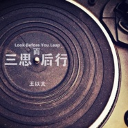
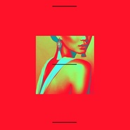
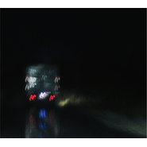
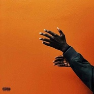

王以太
============================

|  |  |
| :--: | :-- |
| [ 王以太](https://i.xiami.com/allenwan) | **地区**: China 中国大陆 **风格**: 另类说唱 Alternative Hip Hop, 地下说唱 Underground Hip Hop **播放数**: 19829213 **粉丝数**: 10320 **评论数**: 244  |

## 档案

CDC

## 专辑

| 名称 | 语种 | 唱片公司 | 发行时间 | 专辑类别 | 专辑风格 |
| :--: | :-- | :-- | :-- | :-- | :-- |
| [ Sorry](./albums/5020838895.md) | 国语 |  | 2020年06月08日 | 录音室专辑 |  |
| [ 石头剪刀布](./albums/5020408903.md) | 国语 |  | 2020年04月08日 | 录音室专辑 |  |
| [ 演.说.家](./albums/2105349510.md) | 国语 | 第四音乐 | 2019年10月10日 | 录音室专辑 |  |
| [ Lords没在怕](./albums/2105349504.md) | 国语 | 第四音乐 | 2019年07月18日 | EP, 单曲 |  |
| [ Shout It Out](./albums/2105349503.md) | 国语 | 第四音乐 | 2018年12月21日 | EP, 单曲 |  |
| [ 三思而后行](./albums/2104095312.md) | 国语 | 第四音乐 | 2018年10月07日 | EP, 单曲 | 嘻哈 Hip-Hop |
| [ 铁血战士](./albums/2104068249.md) | 国语 | 燃音乐 | 2018年09月30日 | EP, 单曲 |  |
| [ Dream Girl](./albums/2104045998.md) | 国语 | 海蝶音乐 | 2018年09月21日 | EP, 单曲 |  |
| [ PUMA](./albums/2108394020.md) | 国语 | Jwb Digital Music | 2018年08月25日 |  | 世界音乐 World Music |
| [ Feel & Sight](./albums/2103627847.md) | 国语 | C.D.C说唱会馆 | 2018年03月19日 | 合集, 杂锦 | 中国地下说唱 Chinese Underground Hip Hop, 嘻哈 Hip-Hop |
| [ Mask Off Remix (freestyle)](./albums/2102738522.md) | 国语 | C.D.C说唱会馆 | 2017年04月26日 | EP, 单曲 | 嘻哈 Hip-Hop, 陷阱说唱 Trap Rap, 中国地下说唱 Chinese Underground Hip Hop |
| [ 闪火mixtape](./albums/2102672018.md) | 国语 | C.D.C说唱会馆 | 2016年12月25日 | 合集, 杂锦 | 中国地下说唱 Chinese Underground Hip Hop, 迪斯科 Disco |
| [ 天黑了](./albums/2100378321.md) | 国语 | 说唱会馆 | 2016年08月11日 | EP, 单曲 |  |
| [ Oh My (Remix)](./albums/2100364928.md) | 国语 | 说唱会馆 | 2016年07月09日 | EP, 单曲 |  |
| [ Skrr (SKRT Remix)](./albums/2100314034.md) | 国语 | 说唱会馆 | 2016年04月15日 | EP, 单曲 | 流行说唱 Pop Rap |
| [ Liqour Whisper](./albums/2100295090.md) | 国语 | 说唱会馆 | 2016年03月17日 | EP, 单曲 | 爵士说唱 Jazz Rap, 唱盘主义 Turntablism |
| [ GloryFeat.Fat Shady](./albums/2100242496.md) | 国语 | 说唱会馆 | 2015年11月27日 | EP, 单曲 | 嘻哈 Hip-Hop, 地下说唱 Underground Hip Hop |
| [ 老子就爱呆到成都（Remix）](./albums/32949238.md) | 国语 | AllenWan | 2015年05月30日 | EP, 单曲 | 流行说唱 Pop Rap, 地下说唱 Underground Hip Hop |
| [ Ready To Flow Mixtape](./albums/1125449767.md) | 国语 | 独立发行 | 2015年03月05日 | 合集, 杂锦 | 另类说唱 Alternative Hip Hop, 爵士说唱 Jazz Rap, 老派说唱 Old-school Hip Hop |
| [ R.I.P Nujabes](./albums/2102613967.md) | 其他 | 独立发行 | 2015年02月12日 | 录音室专辑 |  |

## 评论

|  |  |  |
| :-- | :-- | :-- |
|  [虾米用户](https://emumo.xiami.com/u/412751719)  2021-01-06 10:10 赞(1) 踩(0) | 
诶  拜
 |
|  [虾米用户](https://emumo.xiami.com/u/71839580) 极其业余音乐爱好者. 2020-12-16 20:44 赞(0) 踩(0) | 
不错哦 
 |
|  [虾米用户](https://emumo.xiami.com/u/246693214) 以后好好活 2020-05-28 17:55 赞(0) 踩(0) | 
很好吃
 |
|  [虾米用户](https://emumo.xiami.com/u/427425348) David chen  2019-08-03 10:47 赞(0) 踩(0) | 
很棒的創作 
 |
|  [虾米用户](https://emumo.xiami.com/u/411058641) 取之不尽 用之不竭 2019-06-02 22:05 赞(0) 踩(0) | 

 |
|  [虾米用户](https://emumo.xiami.com/u/400599435) 我的品位真好 2019-05-12 14:23 赞(0) 踩(0) | 
DJ呢
 |
|  [虾米用户](https://emumo.xiami.com/u/347954013) my own priva... 2019-04-03 14:51 赞(0) 踩(0) | 
来看看我老公
 |
|  [虾米用户](https://emumo.xiami.com/u/273844623) 2016说唱救了我，20... 2019-03-15 22:59 赞(0) 踩(0) | 
闪闪闪火
 |
|  [虾米用户](https://emumo.xiami.com/u/405107682) 蛋堡 2019-01-22 12:43 赞(2) 踩(0) | 
长得很无辜，旋律拽拽的，emmmmmmm，想盘你
 |
|  [虾米用户](https://emumo.xiami.com/u/47440608) 踮起脚尖，窥视天堂… 2018-12-03 02:03 赞(0) 踩(0) | 
喜欢你的时间是金 
 |
|  [虾米用户](https://emumo.xiami.com/u/3102003)  2018-11-29 17:51 赞(2) 踩(0) | 
一位蛮棒的rapper，不过喜欢《目不转睛》的新人可以试试《It's been a long time》, Rakim的。陪伴了高中的歌。听完会回来赞我的。
 |
|  [虾米用户](https://emumo.xiami.com/u/407766792)  2018-11-03 23:28 赞(0) 踩(0) | 
听你的歌，第一首第一遍就喜欢上了，从来没有想过自己会这么喜欢一位rap歌手，喜欢你，喜欢hip-hop
 |
|  [虾米用户](https://emumo.xiami.com/u/375305451) noʎ ssıɯ ı u... 2018-10-30 05:09 赞(0) 踩(0) | 
真好听
 |
|  [虾米用户](https://emumo.xiami.com/u/359861256) 从未提起那些年 2018-10-17 21:39 赞(1) 踩(0) | 
CDC！   
 |
|  [虾米用户](https://emumo.xiami.com/u/405974508)  2018-10-13 09:55 赞(0) 踩(0) | 
闪火第一
 |
| ⇒ |  [虾米用户](https://emumo.xiami.com/u/405974508)  2018-10-13 09:57 赞(0) 踩(0) | 
闪火喜欢你的声音 喜欢你的歌词 喜欢你的表演
 |
|  [虾米用户](https://emumo.xiami.com/u/405974508)  2018-10-13 09:53 赞(0) 踩(0) | 
王闪火最帅
 |
|  [虾米用户](https://emumo.xiami.com/u/121910914) 我想好好睡个觉 2018-10-10 15:41 赞(0) 踩(0) | 
.
 |
|  [虾米用户](https://emumo.xiami.com/u/131576052) 什么都听 2018-10-09 16:49 赞(0) 踩(0) | 
闪火照片的名字叫做：我和秃鹰
 |
|  [虾米用户](https://emumo.xiami.com/u/40002478) 机智的间歇性精神分裂症患... 2018-10-07 10:39 赞(0) 踩(0) | 
ˊ_&amp;gt;ˋ
 |
|  [虾米用户](https://emumo.xiami.com/u/285271155) 当局者迷，过犹不及 2018-10-03 19:44 赞(0) 踩(0) | 
❤️
 |
|  [虾米用户](https://emumo.xiami.com/u/403403600) 用爱对待身边的每一个人无... 2018-10-02 08:27 赞(0) 踩(0) | 
好喜欢你
 |
|  [虾米用户](https://emumo.xiami.com/u/323347844) 等我等我！！！宁波说唱一... 2018-09-30 21:21 赞(1) 踩(0) | 
喜欢
 |
|  [虾米用户](https://emumo.xiami.com/u/405226103)  2018-09-30 19:54 赞(1) 踩(0) | 
棒的很！有品位的人都在虾米呢！大家都快来围观呀！ 
 |
|  [虾米用户](https://emumo.xiami.com/u/283942447) 我还没想好要写什么... 2018-09-30 11:19 赞(1) 踩(0) | 
超有才 每首都值得慢慢听。歌词会被证实的 
 |
|  [虾米用户](https://emumo.xiami.com/u/404910341)  2018-09-25 22:34 赞(2) 踩(0) | 
QQ音乐闪火的歌不全，网易的歌词不对，用虾米专听闪火的歌。
 |
|  [虾米用户](https://emumo.xiami.com/u/11936265)  一个什么都听的艺术家 2018-09-24 00:01 赞(0) 踩(0) | 
不客气哦
 |
|  [虾米用户](https://emumo.xiami.com/u/344658729)  2018-09-20 17:01 赞(0) 踩(0) | 
中毒这个旋律，上下班都是单曲循环 小哥不错哦 
 |
|  [虾米用户](https://emumo.xiami.com/u/378637624) 我还没想好要写什么... 2018-09-19 06:40 赞(0) 踩(0) | 
好喜欢啊 
 |
|  [虾米用户](https://emumo.xiami.com/u/404251432)  2018-09-17 22:25 赞(0) 踩(0) | 
我爱你 真好听 夸你 不吝啬
 |
|  [虾米用户](https://emumo.xiami.com/u/91066116) 我还没想好要写什么... 2018-09-17 10:45 赞(0) 踩(0) | 
这首歌听得我心动了
 |
|  [虾米用户](https://emumo.xiami.com/u/283942447) 我还没想好要写什么... 2018-09-16 17:46 赞(1) 踩(0) | 
舒服 自由 耐听 有趣 live更好过录音棚。。
 |
|  [虾米用户](https://emumo.xiami.com/u/2381) 心放寬 2018-09-15 19:19 赞(1) 踩(0) | 
目不转睛 可以可以
 |
|  [虾米用户](https://emumo.xiami.com/u/403939545)  2018-09-12 20:46 赞(1) 踩(0) | 
超级喜欢你的歌！ 我就看着你 看着你 目不转睛～
 |
|  [虾米用户](https://emumo.xiami.com/u/360094545)  2018-09-11 21:31 赞(0) 踩(0) | 
黑马
 |
|  [虾米用户](https://emumo.xiami.com/u/8960234)   2018-09-11 20:49 赞(30) 踩(0) | 
闪火最有才华，歌词都值得慢慢品味，去他妈的四大平台！用户在这里！
 |
| ⇒ |  [虾米用户](https://emumo.xiami.com/u/405297637)  2018-10-04 05:12 赞(0) 踩(0) | 
说的太好了 找来的都四五十的油腻大爷大妈跟我们说市场什么流行&amp;hellip;我都服了&amp;hellip;
 |
|  [虾米用户](https://emumo.xiami.com/u/20481828)   2018-09-10 22:11 赞(0) 踩(0) | 
3ho必火
 |
|  [虾米用户](https://emumo.xiami.com/u/7803596) it's ok 2018-09-09 14:34 赞(3) 踩(0) | 
走心闪火boy！童年无忌真的惊到我，淘汰真的是没眼光，跟马爸爸就够了。   
 |
|  [虾米用户](https://emumo.xiami.com/u/3133473)  2018-09-09 14:22 赞(0) 踩(0) | 
牛逼
 |
|  [虾米用户](https://emumo.xiami.com/u/403775611)  2018-09-09 09:50 赞(1) 踩(0) | 
你好，闪火
 |
|  [虾米用户](https://emumo.xiami.com/u/349458977) 如果可以，WAN 2018-09-09 00:16 赞(4) 踩(0) | 
你用一首歌，诠释了你的内心和灵魂，你让每一个年轻人在追梦的路上都得到了动力，你安静的表达，也好像一双温柔的手轻抚心上的伤，你用干净的声音铺出一条通往童年时光回忆的小道，让人觉得甚是美好、恬静。王以太，加油，我们都在背后支持你！   
 |
|  [虾米用户](https://emumo.xiami.com/u/323903587)  2018-09-07 22:22 赞(0) 踩(0) | 
喜欢你表演唱歌的投入
 |
|  [虾米用户](https://emumo.xiami.com/u/121369268)  2018-09-04 11:39 赞(0) 踩(0) | 
Jazzhiphop
 |
|  [虾米用户](https://emumo.xiami.com/u/50668193) 666 2018-09-03 19:16 赞(0) 踩(0) | 
听着听着 突然觉得很色情
 |
|  [虾米用户](https://emumo.xiami.com/u/87006916) 自律+坚持 2018-09-02 22:07 赞(0) 踩(0) | 
闪火，爱你❤
 |
|  [虾米用户](https://emumo.xiami.com/u/292800995) 你说是就是咯，我说不是不... 2018-09-01 01:10 赞(1) 踩(0) | 
目不转睛唱得那么浪漫 
 |
|  [虾米用户](https://emumo.xiami.com/u/6586753) 冷起来是个迷 2018-08-31 20:29 赞(1) 踩(0) | 
喜欢目不转睛
 |
|  [虾米用户](https://emumo.xiami.com/u/117966578) 山茶的红色归根结底只是海... 2018-08-31 08:04 赞(0) 踩(0) | 
 
 |
|  [虾米用户](https://emumo.xiami.com/u/309255323)   2018-08-30 20:58 赞(2) 踩(0) | 
很喜欢你的声音，每天开车上班都在循环，简直不要太爽
 |
|  [虾米用户](https://emumo.xiami.com/u/328492001) 不能回头，就走的更远吧。 2018-08-29 22:08 赞(0) 踩(0) | 
打破整数5000收藏 耶
 |
|  [虾米用户](https://emumo.xiami.com/u/48642213) 我还没想好要写什么... 2018-08-29 12:39 赞(0) 踩(0) | 
真的舒服声音
 |
|  [虾米用户](https://emumo.xiami.com/u/43002084) 永恒的不再的0828 2018-08-27 19:18 赞(0) 踩(0) | 

 |
|  [虾米用户](https://emumo.xiami.com/u/49640493) 网易云SAINTDONT... 2018-08-26 10:00 赞(0) 踩(0) | 
3
 |
|  [虾米用户](https://emumo.xiami.com/u/1124507) 嘢 2018-08-25 23:55 赞(0) 踩(0) | 
10 bands 下了？
 |
|  [虾米用户](https://emumo.xiami.com/u/3513351) Games We Pla... 2018-08-16 12:37 赞(0) 踩(0) | 
可爱
 |
|  [虾米用户](https://emumo.xiami.com/u/278670250) SLATTT 2018-08-11 22:03 赞(1) 踩(0) | 
特喜欢你的风格最牛逼声音就是skrr
 |
|  [虾米用户](https://emumo.xiami.com/u/377831795)  2018-08-11 21:54 赞(2) 踩(0) | 
才知道这个rapper，听了Feel N Sight有种Chinese Macklemore(歌词比较critical) + Mainland 蛋堡(melody很轻松很comfy)的感觉。以前听CDC都没注意到你是我的不对。王以太最无敌的地方在于他在唱这些critical and in-depth的歌词的时候用的是一种颇为轻松的陈述调。
 |
|  [虾米用户](https://emumo.xiami.com/u/331101673)  2018-08-07 07:57 赞(0) 踩(0) | 
OK
 |
|  [虾米用户](https://emumo.xiami.com/u/17146554) weibo：@L1RRO... 2018-08-06 07:45 赞(86) 踩(0) | 
原来你是我初中同学的小学同学&amp;hellip;&amp;hellip;世界太小
 |
|  [虾米用户](https://emumo.xiami.com/u/90698622) 我就吃吃吃 我就耍耍耍 2018-08-05 09:03 赞(0) 踩(0) | 
终于！
 |
|  [虾米用户](https://emumo.xiami.com/u/671249) 我还没想好要写什么... 2018-08-03 22:45 赞(2) 踩(0) | 
今天默默小可爱给我分享的你 
 |
|  [虾米用户](https://emumo.xiami.com/u/368530626)  2018-07-30 15:41 赞(1) 踩(0) | 
好多歌越听越好听，
 |
|  [虾米用户](https://emumo.xiami.com/u/340426822) me  2018-07-30 01:28 赞(3) 踩(0) | 
每首作品每一秒都是王闪火的味道
 |
|  [虾米用户](https://emumo.xiami.com/u/15438819) 我还没想好要写什么... 2018-07-29 15:42 赞(0) 踩(0) | 
支持闪火支持ty
 |
|  [虾米用户](https://emumo.xiami.com/u/285049473) 剛拿起酒杯想和你碰杯 才... 2018-07-27 12:51 赞(0) 踩(0) | 
~~~愛心的二分之一
 |
|  [虾米用户](https://emumo.xiami.com/u/35104334)  2018-07-27 12:07 赞(0) 踩(0) | 
加油
 |
|  [虾米用户](https://emumo.xiami.com/u/207298847) 这是生活一部分。 2018-07-25 23:37 赞(0) 踩(0) | 
太占了，你的歌。
 |
|  [虾米用户](https://emumo.xiami.com/u/297937978) 我还没想好要写什么... 2018-07-25 16:33 赞(0) 踩(0) | 
闪火牛p
 |
|  [虾米用户](https://emumo.xiami.com/u/45571863)  2018-07-24 18:52 赞(0) 踩(0) | 
求您beat上点心 会起飞
 |
|  [虾米用户](https://emumo.xiami.com/u/85868814) love is biu ... 2018-07-24 16:17 赞(1) 踩(0) | 
你长得很像我前男友，我会说吗？
 |
|  [虾米用户](https://emumo.xiami.com/u/111096626) 我还没想好要写什么... 2018-07-22 20:37 赞(0) 踩(0) | 
这些人真的惹不起 cdc还是依然牛批 加油
 |
|  [虾米用户](https://emumo.xiami.com/u/375515314)  2018-07-21 23:45 赞(0) 踩(0) | 
新说唱那边找过来了
 |
|  [虾米用户](https://emumo.xiami.com/u/30848228) 所有不与人言的隐秘欢喜 2018-07-21 00:13 赞(2) 踩(0) | 
18.07.21 写给目前欣赏的歌手王以太  因为朋友A玩RAP，然后从朋友Z收藏的歌单里面看到这个名字。 以太福音？或者其它意义，我并不清楚。然后发现和自己印象中的此类音乐不同，很舒服的样子。 下午窝在小阳台的地毯上，拉上窗帘缩在抱枕围成的角落，用掉了一整支中性笔芯，喝完了一整盒脱脂牛奶。耳机声音被调到最小，歌手的声音像从遥远的地方飘过来。不自知已经过了很久很久的样子。 好了，没有什么其它要讲的。单曲循环的后遗症就是误以为你有男朋友（别笑）。 晚安。
 |
|  [虾米用户](https://emumo.xiami.com/u/8991656) 偶尔合群 2018-07-09 23:38 赞(0) 踩(0) | 
emmm夏天要爆
 |
|  [虾米用户](https://emumo.xiami.com/u/341356355) Awesoming  2018-07-08 17:27 赞(0) 踩(0) | 
3ho莫耽搁
 |
|  [虾米用户](https://emumo.xiami.com/u/268617263)  2018-07-08 09:36 赞(4) 踩(0) | 
节目播出后，你们会发现自己一直喜欢的人，比你想象的还优秀，虽然不希望他火，好自私。。。
 |
|  [虾米用户](https://emumo.xiami.com/u/44226617) qnmd 2018-07-03 17:37 赞(2) 踩(0) | 
据说已经是前六了
 |
|  [虾米用户](https://emumo.xiami.com/u/12687092) 就让我沉入海底 2018-07-03 13:49 赞(0) 踩(0) | 
能想象你在舞台上特别吸引我
 |
|  [虾米用户](https://emumo.xiami.com/u/84807422) 爱与诚 2018-06-29 16:38 赞(0) 踩(0) | 
up
 |
|  [虾米用户](https://emumo.xiami.com/u/375697253)  2018-06-21 21:12 赞(0) 踩(0) | 
Yxyybhszdly
 |
|  [虾米用户](https://emumo.xiami.com/u/296024703) . 2018-06-12 14:30 赞(0) 踩(0) | 
(。
 |
|  [虾米用户](https://emumo.xiami.com/u/217947981)  2018-06-09 12:17 赞(0) 踩(0) | 
火钳刘明
 |
|  [虾米用户](https://emumo.xiami.com/u/29443983) Hello 2018-05-23 01:55 赞(0) 踩(0) | 
好听
 |
|  [虾米用户](https://emumo.xiami.com/u/320759350) 我还没想好要写什么... 2018-05-19 01:43 赞(0) 踩(0) | 
注定会火
 |
|  [虾米用户](https://emumo.xiami.com/u/50291916) 音乐国里再相见 2018-05-05 08:42 赞(0) 踩(0) | 
3ho~现场很棒棒了！
 |
|  [虾米用户](https://emumo.xiami.com/u/331618880)  2018-05-02 22:15 赞(0) 踩(0) | 
火起来
 |
|  [虾米用户](https://emumo.xiami.com/u/343187616) 我还没想好要写什么... 2018-04-29 20:59 赞(0) 踩(0) | 
come on
 |
|  [虾米用户](https://emumo.xiami.com/u/49125712)   2018-04-28 20:05 赞(0) 踩(0) | 
闪火今年有嘻哈加油儿！最看好你啦！！
 |
|  [虾米用户](https://emumo.xiami.com/u/349346106)  2018-04-22 12:29 赞(0) 踩(0) | 
牛逼
 |
|  [虾米用户](https://emumo.xiami.com/u/49737152) 我还没想好要写什么... 2018-04-20 22:03 赞(0) 踩(0) | 
王闪火，重要的事莫耽搁
 |
|  [虾米用户](https://emumo.xiami.com/u/347000730)  2018-04-16 13:13 赞(0) 踩(0) | 
闪火王可不是吹的...
 |
|  [虾米用户](https://emumo.xiami.com/u/996277) ‏‏ 2018-03-23 22:09 赞(0) 踩(0) | 
哇
 |
|  [虾米用户](https://emumo.xiami.com/u/211850328)  2018-03-21 23:13 赞(1) 踩(0) | 
什么时候还来海口？
 |
|  [虾米用户](https://emumo.xiami.com/u/13111079) 有缘再见 2018-03-21 15:30 赞(1) 踩(0) | 
ෆ
 |
|  [虾米用户](https://emumo.xiami.com/u/113164888) 我还没想好要写什么... 2018-03-19 21:37 赞(0) 踩(0) | 
王闪火该火了
 |
|  [虾米用户](https://emumo.xiami.com/u/45988101) 回忆也会随着季节淡去 2018-03-18 18:33 赞(0) 踩(0) | 
虾米还没有
 |
|  [虾米用户](https://emumo.xiami.com/u/326279057) 除却巫山不是云 2018-03-18 12:28 赞(0) 踩(0) | 
小强不是说新专已经发布了吗
 |
|  [虾米用户](https://emumo.xiami.com/u/17146554) weibo：@L1RRO... 2018-01-27 23:50 赞(1) 踩(0) | 
nice
 |
|  [虾米用户](https://emumo.xiami.com/u/345456353) No body pray... 2018-01-20 19:47 赞(4) 踩(0) | 
闪火的歌首首好听啊。。以前用网易虽然也听过几首，但下了虾米才发现闪火首首好听。。cdc隐藏boss
 |
|  [虾米用户](https://emumo.xiami.com/u/342260558)  2017-12-31 14:07 赞(3) 踩(0) | 
最爱闪火和孟子 几爷子加油我们给会馆捧起
 |
|  [虾米用户](https://emumo.xiami.com/u/57445862) 玩得不是说唱，是TMD希... 2017-12-31 10:18 赞(2) 踩(0) | 
3ho是会馆绝对不能缺少的一位，是会馆多样性和深度的担当
 |
|  [虾米用户](https://emumo.xiami.com/u/214674898) 是否还没找到自己的方向 2017-12-27 09:45 赞(0) 踩(0) | 
这波diss参不参加   闪火
 |
|  [虾米用户](https://emumo.xiami.com/u/197821706) 不知名高中生 2017-12-22 22:28 赞(0) 踩(0) | 
好
 |
|  [虾米用户](https://emumo.xiami.com/u/309532650) 喜欢音乐  2017-12-19 16:39 赞(0) 踩(0) | 
天黑了哈哈哈哈哈哈哈哈哈
 |
|  [虾米用户](https://emumo.xiami.com/u/52359874) wubba lubba ... 2017-12-02 03:35 赞(0) 踩(0) | 
非常厉害
 |
|  [虾米用户](https://emumo.xiami.com/u/2978853) 生 2017-12-01 00:49 赞(0) 踩(0) | 
我觉得你首首歌都好听～
 |
|  [虾米用户](https://emumo.xiami.com/u/57185056) From 0872cit... 2017-10-22 12:27 赞(0) 踩(0) | 
完全被豹子洗脑了
 |
|  [虾米用户](https://emumo.xiami.com/u/57185056) From 0872cit... 2017-10-17 12:12 赞(1) 踩(0) | 
第一次听3ho是cdc16年的mv 之后基本没关注 四天前一首豹子真的炸到我 对不起3ho来晚了
 |
|  [虾米用户](https://emumo.xiami.com/u/329327704)  2017-10-09 22:51 赞(0) 踩(0) | 
我第一次听说也是听到3ho是在diss玻璃湾湾的mixtape里，听完歪哥和谢老板的，感觉就是爆炸，闪火就是低调且屌，加油YiTai 精神导师
 |
|  [虾米用户](https://emumo.xiami.com/u/329327704)  2017-10-09 22:48 赞(0) 踩(0) | 
3Ho精神导师 
 |
|  [虾米用户](https://emumo.xiami.com/u/209266583) Dab 2017-10-07 15:37 赞(1) 踩(0) | 
3ho
 |
|  [虾米用户](https://emumo.xiami.com/u/234102265)  2017-10-04 20:02 赞(0) 踩(0) | 
！
 |
|  [虾米用户](https://emumo.xiami.com/u/278503970)   2017-10-02 12:11 赞(0) 踩(0) | 
3ho do it big！ 
 |
|  [虾米用户](https://emumo.xiami.com/u/22881143) ㅤㅤㅤㅤ 2017-09-30 23:52 赞(0) 踩(0) | 
。
 |
|  [虾米用户](https://emumo.xiami.com/u/983135) 我还没想好要写什么... 2017-09-07 07:36 赞(0) 踩(0) | 
以太和莉莉周
 |
|  [虾米用户](https://emumo.xiami.com/u/49307108) 把所有悲伤全部都给歼灭 2017-08-09 01:08 赞(0) 踩(0) | 
3ho来首新歌噻，迫不及待的想要听你的新歌
 |
|  [虾米用户](https://emumo.xiami.com/u/31514407) 夜太深  把手给你牵 2017-08-06 11:02 赞(0) 踩(0) | 
 
 |
|  [虾米用户](https://emumo.xiami.com/u/282938169) 现在 2017-08-05 20:56 赞(0) 踩(0) | 

 |
|  [虾米用户](https://emumo.xiami.com/u/226334751)  2017-07-22 14:49 赞(1) 踩(0) | 
现在的低调是实力的沉淀，终会受人瞩目
 |
|  [虾米用户](https://emumo.xiami.com/u/214674898) 是否还没找到自己的方向 2017-07-03 23:09 赞(1) 踩(0) | 
被掩盖的金子
 |
|  [虾米用户](https://emumo.xiami.com/u/40208599) 我很聪明什么也没留下 2017-05-26 00:31 赞(0) 踩(0) | 
|
 |
|  [虾米用户](https://emumo.xiami.com/u/288649269)  2017-05-12 17:49 赞(1) 踩(0) | 
闪火你看你的努力被更多人看到了，你的迷妹也会比马师多的，啊哈哈到那天我就在那些迷妹的后面微笑
 |
|  [虾米用户](https://emumo.xiami.com/u/212210128)  2017-05-07 08:13 赞(44) 踩(0) | 
以太绝对是会馆最被低估的一位
 |
|  [虾米用户](https://emumo.xiami.com/u/250091502) PEACE 2017-05-02 23:12 赞(2) 踩(0) | 
闪火keep real 会一直支持你 会馆未来的强大power 我真的非常非常非常爱你
 |
|  [虾米用户](https://emumo.xiami.com/u/288649269)  2017-04-28 18:30 赞(1) 踩(0) | 
你的歌词已经出现在我的脑海不管白天还是黑夜
 |
|  [虾米用户](https://emumo.xiami.com/u/288649269)  2017-04-24 20:49 赞(1) 踩(0) | 
闪火继续加油吧，做的纯粹，下一首说不定就被认可了
 |
|  [虾米用户](https://emumo.xiami.com/u/288649269)  2017-04-17 21:38 赞(0) 踩(0) | 
加油，闪火越来越棒
 |
|  [虾米用户](https://emumo.xiami.com/u/288649269)  2017-04-17 21:38 赞(0) 踩(0) | 
hello
 |
|  [虾米用户](https://emumo.xiami.com/u/115122308) 就读于四川师范大学舞蹈学... 2017-04-16 04:47 赞(1) 踩(0) | 
你会火的
 |
|  [虾米用户](https://emumo.xiami.com/u/115122308) 就读于四川师范大学舞蹈学... 2017-04-16 04:46 赞(0) 踩(0) | 
支持哈！
 |
|  [虾米用户](https://emumo.xiami.com/u/115122308) 就读于四川师范大学舞蹈学... 2017-04-16 04:45 赞(0) 踩(0) | 
一如既往的支持
 |
|  [虾米用户](https://emumo.xiami.com/u/288649269)  2017-04-14 19:22 赞(1) 踩(0) | 
加油，你会火的，记住我给你讲过的那个定理啊哈哈哈
 |
|  [虾米用户](https://emumo.xiami.com/u/288649269)  2017-04-14 18:14 赞(0) 踩(0) | 
超级喜欢你，闪火
 |
|  [虾米用户](https://emumo.xiami.com/u/288649269)  2017-04-14 18:14 赞(0) 踩(0) | 
加油
 |
|  [虾米用户](https://emumo.xiami.com/u/6558316) 冷眼旁观同样有罪 2017-04-09 00:18 赞(1) 踩(0) | 
吼听 是用心搞音乐的
 |
|  [虾米用户](https://emumo.xiami.com/u/9028760) 豆瓣见 spotify ... 2017-04-06 14:04 赞(0) 踩(0) | 
⚋̤̫⃝
 |
|  [虾米用户](https://emumo.xiami.com/u/68874526) Back to back 2017-03-07 13:04 赞(1) 踩(0) | 
很有实力
 |
|  [虾米用户](https://emumo.xiami.com/u/15990065)  2017-02-26 13:55 赞(1) 踩(0) | 
想知道昨天在小酒馆他唱的那首歌叫什么名字
 |
| ⇒ |  [虾米用户](https://emumo.xiami.com/u/17100112) 我是个分心的rapper... 2017-03-27 14:15 赞(0) 踩(0) | 
他唱了很多首阿
 |
|  [虾米用户](https://emumo.xiami.com/u/4797475)  2017-02-20 17:58 赞(2) 踩(0) | 
个人的范儿正！ 
 |
|  [虾米用户](https://emumo.xiami.com/u/42290430)  2017-01-28 13:30 赞(1) 踩(0) | 
膜拜
 |
|  [虾米用户](https://emumo.xiami.com/u/143619790) Skrr~ 2017-01-01 10:15 赞(1) 踩(0) | 
改名了 王以太
 |
|  [虾米用户](https://emumo.xiami.com/u/30812316)  2016-12-31 18:27 赞(1) 踩(0) | 
喜欢！！！
 |
|  [虾米用户](https://emumo.xiami.com/u/39924023)  2016-12-30 21:23 赞(1) 踩(0) | 
为啥子换名字？3ho
 |
|  [虾米用户](https://emumo.xiami.com/u/45385073) 爱虾米期待再相遇为新：t... 2016-12-29 01:46 赞(0) 踩(0) | 
为啥子改名字
 |
|  [虾米用户](https://emumo.xiami.com/u/112020044)  2016-11-27 03:49 赞(1) 踩(0) | 
凭啥子天都黑了你都还不火
 |
|  [虾米用户](https://emumo.xiami.com/u/85275918) CPG/Sukana 2016-11-19 21:55 赞(1) 踩(0) | 
最喜欢的就是闪火！
 |
|  [虾米用户](https://emumo.xiami.com/u/34887175) interesting 2016-11-10 23:39 赞(2) 踩(0) | 
长得好帅
 |
|  [虾米用户](https://emumo.xiami.com/u/138509388)  2016-11-10 18:08 赞(0) 踩(0) | 
有点意思 
 |
|  [虾米用户](https://emumo.xiami.com/u/216373213)   2016-10-29 14:20 赞(1) 踩(0) | 
垃圾
 |
| ⇒ |  [虾米用户](https://emumo.xiami.com/u/231386180)  2017-03-31 11:57 赞(0) 踩(0) | 
闭嘴
 |
|  [虾米用户](https://emumo.xiami.com/u/93408636) 革命家 2016-09-30 07:06 赞(1) 踩(0) | 
强
 |
|  [虾米用户](https://emumo.xiami.com/u/16994867)   2016-09-28 08:51 赞(1) 踩(0) | 
网易云也多点闪火歌就好啦
 |
|  [虾米用户](https://emumo.xiami.com/u/10944859) ‏‏‏‏‏‏‏‏ 2016-09-25 14:30 赞(0) 踩(0) | 
⍢⃝
 |
|  [虾米用户](https://emumo.xiami.com/u/9352472) 不想当rocker的sk... 2016-09-08 01:30 赞(0) 踩(0) | 
现在喜欢闪火和猫儿师。话说闪火9几年的呢
 |
|  [虾米用户](https://emumo.xiami.com/u/37609187) 唯有痛苦产生意义 2016-09-02 12:51 赞(0) 踩(0) | 
看了三次会馆都没注意到 。。 没想到虾米听反而是最喜欢勒
 |
|  [虾米用户](https://emumo.xiami.com/u/43547593) ♡ 2016-08-17 09:57 赞(0) 踩(0) | 
⅋
 |
|  [虾米用户](https://emumo.xiami.com/u/47902661) 虾米体验很不好，很少用虾... 2016-08-14 03:32 赞(0) 踩(0) | 
※
 |
|  [虾米用户](https://emumo.xiami.com/u/79257056) 我还没想好要写什么... 2016-08-03 21:24 赞(26) 踩(0) | 
其实闪火一直很用心，技巧也够。但是，未到时机
 |
| ⇒ |  [虾米用户](https://emumo.xiami.com/u/47341892)   2016-10-12 18:19 赞(0) 踩(0) | 
嗯！
 |
| ⇒ |  [虾米用户](https://emumo.xiami.com/u/365243440) 吾求吾失且不暇何暇论人哉 2018-08-31 22:05 赞(0) 踩(0) | 
现在是2018，该到了
 |
| ⇒ |  [虾米用户](https://emumo.xiami.com/u/89193492)   2019-12-23 23:05 赞(0) 踩(0) | 
现在已经到了
 |
|  [虾米用户](https://emumo.xiami.com/u/202231441)  2016-07-31 01:19 赞(3) 踩(0) | 
16年的cypher，迟到了一年的拽娃儿！
 |
|  [虾米用户](https://emumo.xiami.com/u/41399580) 我好想推荐你灵魂的收敛水 2016-06-26 23:21 赞(2) 踩(0) | 
我觉得口吃可以从新来一次
 |
|  [虾米用户](https://emumo.xiami.com/u/51756141)  2016-06-14 14:56 赞(0) 踩(0) | 
∞
 |
|  [虾米用户](https://emumo.xiami.com/u/52579752)  2016-06-04 21:18 赞(2) 踩(0) | 
在Ty现场看了闪火表演才知道闪火有多牛逼～
 |
|  [虾米用户](https://emumo.xiami.com/u/12023636) 人活着不一定要有意义，但... 2016-06-03 20:34 赞(0) 踩(0) | 
立马关注
 |
|  [虾米用户](https://emumo.xiami.com/u/12023636) 人活着不一定要有意义，但... 2016-06-03 20:34 赞(0) 踩(0) | 
除了屌，我还能说什么呢～
 |
|  [虾米用户](https://emumo.xiami.com/u/31081356)  2016-05-29 22:43 赞(2) 踩(0) | 
妈的，听一下立马关注了！ 
 |
|  [虾米用户](https://emumo.xiami.com/u/46697934) 哦 2016-05-29 15:21 赞(1) 踩(0) | 
加油啊 闪火
 |
|  [虾米用户](https://emumo.xiami.com/u/49756738) 嘻哈药剂师 Aka神农 2016-05-28 03:38 赞(1) 踩(0) | 
这是我听过最走心的作品 技巧跟歌词内容都很高超
 |
| ⇒ |  [虾米用户](https://emumo.xiami.com/u/104340382) 系统维护 2016-08-03 16:40 赞(0) 踩(0) | 
英雄所见略同
 |
|  [虾米用户](https://emumo.xiami.com/u/39788841)  . 2016-05-26 19:05 赞(0) 踩(0) | 
#
 |
|  [虾米用户](https://emumo.xiami.com/u/124992314) 我所闻所见所感所想，看生... 2016-05-23 14:21 赞(0) 踩(0) | 
太无敌了
 |
|  [虾米用户](https://emumo.xiami.com/u/13919998)   2016-05-17 19:26 赞(1) 踩(0) | 
本人真诚又可爱 歌都很用心
 |
|  [虾米用户](https://emumo.xiami.com/u/13919998)   2016-05-17 19:25 赞(0) 踩(0) | 
真的好听
 |
|  [虾米用户](https://emumo.xiami.com/u/42426726)  2016-05-15 22:28 赞(0) 踩(0) | 
思想 镀金
 |
|  [虾米用户](https://emumo.xiami.com/u/5493286) 。 2016-05-09 13:06 赞(1) 踩(0) | 
skr,skr~
 |
|  [虾米用户](https://emumo.xiami.com/u/45298985) Wechat:dqx19... 2016-05-01 19:52 赞(0) 踩(0) | 
+
 |
|  [虾米用户](https://emumo.xiami.com/u/13127780)   2016-04-23 22:57 赞(58) 踩(0) | 
2016年最屌的四川rapper 百闻不如一见！
 |
|  [虾米用户](https://emumo.xiami.com/u/46109054) 暂无签名~ 2016-04-22 23:13 赞(0) 踩(0) | 
厉害
 |
|  [虾米用户](https://emumo.xiami.com/u/146493384)   2016-04-21 11:19 赞(0) 踩(0) | 
  
 |
|  [虾米用户](https://emumo.xiami.com/u/45363258)   2016-04-19 08:09 赞(0) 踩(0) | 
免费下载啊！兄弟！可以！
 |
|  [虾米用户](https://emumo.xiami.com/u/36083697) 这家伙很懒,只留下一滴泪 2016-04-18 08:04 赞(0) 踩(0) | 
贵州崽儿 ，666
 |
|  [虾米用户](https://emumo.xiami.com/u/46109054) 暂无签名~ 2016-04-14 09:19 赞(0) 踩(0) | 
好歌手一枚
 |
|  [虾米用户](https://emumo.xiami.com/u/42426726)  2016-04-07 22:47 赞(0) 踩(0) | 
In
 |
|  [虾米用户](https://emumo.xiami.com/u/29230195) Gubba nub nu... 2016-04-07 12:46 赞(0) 踩(0) | 
可以的
 |
|  [虾米用户](https://emumo.xiami.com/u/52648643) liusimin1997 2016-04-02 20:11 赞(0) 踩(0) | 
真的好听
 |
|  [虾米用户](https://emumo.xiami.com/u/52648643) liusimin1997 2016-04-02 20:11 赞(0) 踩(0) | 
真的好听
 |
|  [虾米用户](https://emumo.xiami.com/u/52648643) liusimin1997 2016-04-02 20:11 赞(0) 踩(0) | 
真的好听
 |
|  [虾米用户](https://emumo.xiami.com/u/48987749) Til infinity... 2016-03-31 21:22 赞(0) 踩(0) | 
太强
 |
|  [虾米用户](https://emumo.xiami.com/u/50869110) IG：77richiee... 2016-03-25 15:44 赞(0) 踩(0) | 

 |
|  [虾米用户](https://emumo.xiami.com/u/50260743)   2016-03-23 23:03 赞(177) 踩(0) | 
会馆最不受瞩目也是最有思想和内涵的一位
 |
| ⇒ |  [虾米用户](https://emumo.xiami.com/u/8089994) 这家伙很蠢萌什么也没留下... 2017-07-16 07:50 赞(0) 踩(0) | 
隐藏boss
 |
| ⇒ |  [虾米用户](https://emumo.xiami.com/u/340669299) 某云Lilw 2018-02-05 01:21 赞(0) 踩(0) | 
谢老板别忘了哈哈哈
 |
| ⇒ |  [虾米用户](https://emumo.xiami.com/u/255592770) 听过的越多，没听过的也就... 2018-04-05 13:02 赞(0) 踩(0) | 
<q><b>Lil_w说：</b></q>
 |
| ⇒ |  [虾米用户](https://emumo.xiami.com/u/445522285) 一头肥猪 2020-10-25 00:12 赞(0) 踩(0) | 
16年的评论到2020年，变成了成都集团最受瞩目也是最思想最内涵的一位
 |
|  [虾米用户](https://emumo.xiami.com/u/45696575) Xac 2016-01-28 02:20 赞(0) 踩(0) | 
喜欢！不多解释 
 |
|  [虾米用户](https://emumo.xiami.com/u/98028532)  2016-01-06 22:33 赞(0) 踩(0) | 
听了首Diss就喜欢上了
 |
|  [虾米用户](https://emumo.xiami.com/u/52478185) KID 2015-12-18 02:08 赞(0) 踩(0) | 
太喜欢你了
 |
|  [虾米用户](https://emumo.xiami.com/u/44003760) 聪明伶俐快高长大 2015-12-01 17:01 赞(0) 踩(0) | 
帅
 |
|  [虾米用户](https://emumo.xiami.com/u/37840483) 再說吧 2015-11-17 13:02 赞(0) 踩(0) | 
加油
 |
|  [虾米用户](https://emumo.xiami.com/u/44858319) 永远是我最爱的虾米 2015-10-28 23:17 赞(0) 踩(0) | 
。
 |
|  [虾米用户](https://emumo.xiami.com/u/44842334)  2015-10-10 00:53 赞(1) 踩(0) | 
吉他版好听
 |
|  [虾米用户](https://emumo.xiami.com/u/55405511) 瞎逼逼啥呢 2015-10-09 21:50 赞(0) 踩(0) | 
.....求吉他版 谱子......
 |
|  [虾米用户](https://emumo.xiami.com/u/55405511) 瞎逼逼啥呢 2015-10-09 13:14 赞(0) 踩(0) | 
期待新歌 循环好多遍了
 |
|  [虾米用户](https://emumo.xiami.com/u/55405511) 瞎逼逼啥呢 2015-10-09 13:13 赞(0) 踩(0) | 
吉他版太好听
 |
|  [虾米用户](https://emumo.xiami.com/u/39052743) BadA$$ 2015-10-06 03:36 赞(1) 踩(0) | 
你会红得无法无天。
 |
|  [虾米用户](https://emumo.xiami.com/u/50510321)  2015-10-03 22:48 赞(0) 踩(0) | 
声音迷人
 |
|  [虾米用户](https://emumo.xiami.com/u/6790400)  2015-09-13 11:21 赞(0) 踩(0) | 
期待你的新动态。
 |
|  [虾米用户](https://emumo.xiami.com/u/52562525) 屁股是圆是肥在梦里我都拥... 2015-09-12 00:01 赞(0) 踩(0) | 
好有内容 
 |
|  [虾米用户](https://emumo.xiami.com/u/607980) 我还没想好要写什么... 2015-08-26 10:54 赞(1) 踩(0) | 
昨晚演出很赞
 |
|  [虾米用户](https://emumo.xiami.com/u/38558738) HipHop/R&B/F... 2015-08-22 02:34 赞(0) 踩(0) | 
可以嘛，支持一下
 |
|  [虾米用户](https://emumo.xiami.com/u/52586273) 宇宙第一傻 2015-08-19 17:14 赞(0) 踩(0) | 
好
 |
|  [虾米用户](https://emumo.xiami.com/u/31309952) 暂无签名~ 2015-08-01 16:41 赞(0) 踩(0) | 
流弊
 |
|  [虾米用户](https://emumo.xiami.com/u/41399580) 我好想推荐你灵魂的收敛水 2015-07-30 10:54 赞(1) 踩(0) | 
啊啊啊啊啊好听好听 中文真的也很棒             
 |
|  [虾米用户](https://emumo.xiami.com/u/30995708) 一张足以和时间抗衡的经典 2015-07-26 15:49 赞(0) 踩(0) | 
他真挚，他认真，他用心
 |
|  [虾米用户](https://emumo.xiami.com/u/16429514)   2015-07-24 06:05 赞(0) 踩(0) | 
好喜欢以太，每天晚上洗脑循环
 |
|  [虾米用户](https://emumo.xiami.com/u/2418238) weibo: @尤米口 2015-07-16 05:34 赞(0) 踩(0) | 
就爱呆到成都耍～
 |
|  [虾米用户](https://emumo.xiami.com/u/44003760) 聪明伶俐快高长大 2015-06-30 05:23 赞(0) 踩(0) | 
帅
 |
|  [虾米用户](https://emumo.xiami.com/u/5762942) 人类为何要互相伤害 2015-06-28 17:37 赞(0) 踩(0) | 
有点意思
 |
|  [虾米用户](https://emumo.xiami.com/u/5490437) 女士优先 2015-06-25 10:18 赞(0) 踩(0) | 
Ü
 |
|  [虾米用户](https://emumo.xiami.com/u/46158797) 我还没想好要写什么... 2015-06-16 12:30 赞(0) 踩(0) | 
可以发一下10bands 伴奏么 
 |
|  [虾米用户](https://emumo.xiami.com/u/47682597) 暂无签名~ 2015-04-21 21:56 赞(0) 踩(0) | 
词汇量非常屌啊
 |
|  [虾米用户](https://emumo.xiami.com/u/45928128)  超可爱并且品德高尚的成... 2015-04-06 12:31 赞(0) 踩(0) | 
男神 爱你么么哒 继续加油 一直在你身后支持你哟
 |
|  [虾米用户](https://emumo.xiami.com/u/7682881) 普通话不好的小卢卡 2015-03-26 17:59 赞(0) 踩(0) | 
牛 好听
 |
|  [虾米用户](https://emumo.xiami.com/u/32320260) kiss me 2015-03-21 18:12 赞(0) 踩(0) | 
nice Zion的封面也很赞
 |
|  [虾米用户](https://emumo.xiami.com/u/7915878) 随意的快乐 2015-03-20 13:05 赞(0) 踩(0) | 
～
 |
|  [虾米用户](https://emumo.xiami.com/u/861207) listen to me 2015-03-11 14:14 赞(0) 踩(0) | 
nice
 |
|  [虾米用户](https://emumo.xiami.com/u/3560625) :( 2015-03-05 18:24 赞(0) 踩(0) | 
棒
 |
|  [虾米用户](https://emumo.xiami.com/u/40544421)  2015-03-05 16:38 赞(0) 踩(0) | 
可能是朋友的朋友吧 无意听到了 感觉还不错哟
 |
|  [虾米用户](https://emumo.xiami.com/u/6530837) 新浪微博 王闪火3ho 2015-03-03 11:35 赞(207) 踩(0) | 
我刚入驻了虾米音乐人，欢迎大家来我的个人主页，收听我的最新音乐
 |
| ⇒ |  [虾米用户](https://emumo.xiami.com/u/50598226) 支持国产说唱，无论方言或... 2015-10-25 17:15 赞(0) 踩(0) | 
什么时候出新歌
 |
| ⇒ |  [虾米用户](https://emumo.xiami.com/u/186213445)  2017-09-14 23:04 赞(0) 踩(0) | 
什么时候出新歌
 |
| ⇒ |  [虾米用户](https://emumo.xiami.com/u/278737452)  2017-11-22 10:01 赞(0) 踩(0) | 
什么时候出新歌
 |
| ⇒ |  [虾米用户](https://emumo.xiami.com/u/339795942) 喜欢风 2017-12-23 03:28 赞(0) 踩(0) | 
什么时候出新歌
 |
| ⇒ |  [虾米用户](https://emumo.xiami.com/u/315184217) 这家伙很聪明什么都没留下 2018-07-22 00:38 赞(0) 踩(0) | 
什么时候出新歌
 |
| ⇒ |  [虾米用户](https://emumo.xiami.com/u/345239403)  2018-08-02 16:39 赞(0) 踩(0) | 
好喜欢你 你要加油 
 |
| ⇒ |  [虾米用户](https://emumo.xiami.com/u/252923075) 不做就不做，闲云野鹤也不... 2018-09-06 10:08 赞(0) 踩(0) | 
新歌警告
 |
| ⇒ |  [虾米用户](https://emumo.xiami.com/u/9342446) 风中传来的声音。。。 2018-09-09 18:56 赞(0) 踩(0) | 
喜欢你的格调
 |
| ⇒ |  [虾米用户](https://emumo.xiami.com/u/405401929)  2018-10-03 21:44 赞(0) 踩(0) | 
你不闪我不服
 |
| ⇒ |  [虾米用户](https://emumo.xiami.com/u/52034644) 身体会跳舞 2019-05-04 00:09 赞(0) 踩(0) | 
喜欢
 |
| ⇒ |  [虾米用户](https://emumo.xiami.com/u/426244373)  2021-01-10 17:37 赞(0) 踩(0) | 
闪火！！！！要在虾米跟你说拜拜了
 |
