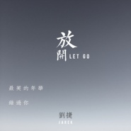

放开
============================

|  |  |
| :--: | :-- |
| [ 放开](https://emumo.xiami.com/album/2100325730) | **艺人**: [刘捷](../index.md) **语种**: 纯音乐 **唱片公司**: 独立发行 **发行时间**: 2011年06月16日 **专辑类别**: EP, 单曲 **专辑风格**: 轻音乐 Easy Listening **播放数**: 13807 **收藏数**: 8 **评论数**: 2  |

## 简介

最美的年华，错过你。

## 曲目

## 评论

|  |  |  |
| :-- | :-- | :-- |
|  [虾米用户](https://emumo.xiami.com/u/337404670)  2017-11-26 19:18 赞(0) 踩(0) | 
支持
 |
|  [虾米用户](https://emumo.xiami.com/u/287300852)  2017-04-09 00:47 赞(0) 踩(0) | 
不错
 |
