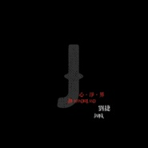

心净界
============================

|  |  |
| :--: | :-- |
| [ 心净界](https://emumo.xiami.com/album/2102665485) | **艺人**: [刘捷](../index.md) **语种**: 纯音乐 **唱片公司**: 独立发行 **发行时间**: 2017年03月29日 **专辑类别**: 录音室专辑 **专辑风格**: 轻音乐 Easy Listening, 新世纪音乐 New Age **播放数**: 31934 **收藏数**: 29 **评论数**: 13  |

## 简介

心净界

## 曲目

## 评论

|  |  |  |
| :-- | :-- | :-- |
|  [虾米用户](https://emumo.xiami.com/u/403063019) 为红海而来 2019-05-25 21:25 赞(0) 踩(0) | 
挺不错的，每个整首曲子里有出彩的部分，但是也有部分觉得可以加强或者稍改善，有提升空间，十分以示鼓励
 |
|  [虾米用户](https://emumo.xiami.com/u/236713480) 没有什么能够阻挡，我对自... 2018-08-28 20:21 赞(0) 踩(0) | 
这张专辑里面最喜欢【旧相册】和【涟漪】这两首从头到尾的喜欢  感觉很棒 听着舒心  从第二首到第六首算都是我个人比较喜欢的几首 全部听了一下 才来评论的 一如既往的支持你 加油[中国旗帜]
 |
| ⇒ |  [虾米用户](https://emumo.xiami.com/u/48006229) 我还没想好要写什么... 2018-08-30 07:45 赞(0) 踩(0) | 
谢谢支持 
 |
|  [虾米用户](https://emumo.xiami.com/u/337405561)  2017-11-26 19:21 赞(0) 踩(0) | 
加油
 |
|  [虾米用户](https://emumo.xiami.com/u/337404670)  2017-11-26 19:17 赞(0) 踩(0) | 
支持
 |
|  [虾米用户](https://emumo.xiami.com/u/66823378)  2017-11-20 22:54 赞(1) 踩(0) | 

 |
|  [虾米用户](https://emumo.xiami.com/u/125790174)  2017-04-24 22:21 赞(0) 踩(0) | 
厉害了老铁！
 |
|  [虾米用户](https://emumo.xiami.com/u/287300852)  2017-04-09 00:39 赞(0) 踩(0) | 
坚持和不断的写歌是积累成功的源动力，快乐了自己，同时机会是留给有准备的人，加油！
 |
|  [虾米用户](https://emumo.xiami.com/u/287300852)  2017-04-09 00:34 赞(0) 踩(0) | 
很棒！
 |
|  [虾米用户](https://emumo.xiami.com/u/228352363) 每天晚上看看繁天，也许会... 2017-02-13 16:24 赞(0) 踩(0) | 
如果我哪天弹钢琴的水平能好到这样就好了
 |
|  [虾米用户](https://emumo.xiami.com/u/228352363) 每天晚上看看繁天，也许会... 2017-02-13 16:19 赞(0) 踩(0) | 
好听
 |
|  [虾米用户](https://emumo.xiami.com/u/248683736)  2017-01-29 09:38 赞(0) 踩(0) | 
支持
 |
|  [虾米用户](https://emumo.xiami.com/u/118001670)   2017-01-19 15:03 赞(1) 踩(0) | 
加油！
 |
