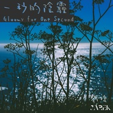
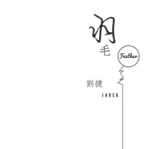

刘捷
============================

|  |  |
| :--: | :-- |
| [ 刘捷](https://i.xiami.com/liujie) | **播放数**: 1308675 **粉丝数**: 1155 **评论数**: 121 **地区**: China 中国大陆 **风格**: 新世纪音乐 New Age, 器乐独奏 Solo Instrumental, 轻音乐 Easy Listening, 国语流行 Mandarin Pop, 华语唱作人 Chinese Singer-Songwriter  |

## 档案

词曲作者、制作人。OP核心音乐/SP华纳音乐  合作艺人：鞠婧祎、范逸臣、王治平、F.I.R.飞儿乐团阿沁、黄霄云、F4朱孝天等  主要作品；  鞠婧祎《古画》（电视剧《如意芳霏》插曲）  范逸臣《还你自由》（电影《海雾》推广曲）  范世錡《为爱不朽》（电视剧《我有特殊的沟通技巧》主题曲）  明日之子-邓泽鸣《记号》（电视剧《乘风少年》插曲）

## 专辑

| 名称 | 语种 | 唱片公司 | 发行时间 | 专辑类别 | 专辑风格 |
| :--: | :-- | :-- | :-- | :-- | :-- |
| [ 一秒的阴霾](./albums/2104867357.md) | 纯音乐 | 独立发行 | 2019年03月13日 | EP, 单曲 | 器乐独奏 Solo Instrumental, 轻音乐 Easy Listening, 轻音乐流行 Light Pop |
| [ Spoondrift](./albums/2104117832.md) | 纯音乐 | 独立发行 | 2018年10月18日 | EP, 单曲 | 器乐独奏 Solo Instrumental, 轻音乐 Easy Listening, 轻音乐流行 Light Pop |
| [ 隐匿之境](./albums/2103909060.md) | 纯音乐 | 独立发行 | 2018年08月11日 | EP, 单曲 | 轻音乐 Easy Listening, 新世纪音乐 New Age, 轻音乐流行 Light Pop |
| [ ONE DAY](./albums/2102892871.md) | 纯音乐 | 独立发行 | 2017年12月25日 | 录音室专辑 | 轻音乐 Easy Listening, 轻音乐流行 Light Pop, 器乐独奏 Solo Instrumental |
| [ 心净界](./albums/2102665485.md) | 纯音乐 | 独立发行 | 2017年03月29日 | 录音室专辑 | 轻音乐 Easy Listening, 新世纪音乐 New Age |
| [ 入梦而行](./albums/2102663129.md) | 纯音乐 | 独立发行 | 2016年11月27日 | EP, 单曲 | 轻音乐 Easy Listening |
| [ 羽毛](./albums/2102412333.md) | 纯音乐 | 独立发行 | 2016年10月10日 | EP, 单曲 | 轻音乐 Easy Listening |
| [ 沿途风景](./albums/2100379914.md) | 纯音乐 | 独立发行 | 2016年08月18日 | EP, 单曲 | 轻音乐 Easy Listening |
| [ 四季(Four Seasons)](./albums/2100204702.md) | 纯音乐 | 独立发行 | 2015年09月21日 | EP, 单曲 | 轻音乐 Easy Listening |
| [ 放开](./albums/2100325730.md) | 纯音乐 | 独立发行 | 2011年06月16日 | EP, 单曲 | 轻音乐 Easy Listening |
| [ 成长日记](./albums/26345690.md) | 国语 | 独立发行 | 2010年05月20日 | EP, 单曲 | 流行 Pop, 国语流行 Mandarin Pop |
| [ 刘捷的专辑](./albums/5022626286.md) | 其他 |  | 不详 |  |  |

## 评论

|  |  |  |  |
| :-- | :-- | :-- | :-- |
|  [虾米用户](https://emumo.xiami.com/u/247927998)  2019-08-08 22:49 赞(0) 踩(0) | 
好听
 |
|  [虾米用户](https://emumo.xiami.com/u/337404670)  2019-05-26 22:02 赞(0) 踩(0) | 
很棒的音乐人！
 |
|  [虾米用户](https://emumo.xiami.com/u/95269814) 植物在生长，小鸟在飞翔，... 2018-12-17 20:17 赞(1) 踩(0) | 
微信还给人加，不怕炸？
 |
|  [虾米用户](https://emumo.xiami.com/u/51866569)   2018-08-18 22:01 赞(0) 踩(0) | 
你的钢琴曲很好听啊 
 |
|  [虾米用户](https://emumo.xiami.com/u/106109168) 你并不特别 2018-08-11 14:48 赞(0) 踩(0) | 
耶 加油
 |
|  [虾米用户](https://emumo.xiami.com/u/70625648)  2018-05-16 18:40 赞(0) 踩(0) | 
加油，坚持下去
 |
|  [虾米用户](https://emumo.xiami.com/u/342449948) 追逐梦想 2018-04-29 10:02 赞(0) 踩(0) | 
做更好的音乐，加油
 |
|  [虾米用户](https://emumo.xiami.com/u/144620702)  2018-03-20 11:12 赞(0) 踩(0) | 
（   ）
 |
|  [虾米用户](https://emumo.xiami.com/u/337404670)  2018-02-14 06:10 赞(0) 踩(0) | 
夜空上一颗明亮的星！加油！
 |
|  [虾米用户](https://emumo.xiami.com/u/113603262) 我还没想好要写什么... 2018-01-26 00:41 赞(0) 踩(0) | 
欧巴可以教我弹钢琴吗
 |
| ⇒ |  [虾米用户](https://emumo.xiami.com/u/48006229) 我还没想好要写什么... 2018-01-26 23:54 赞(0) 踩(0) | 
行啊，在飞机上教啊，fasten your seat belt
 |
|  [虾米用户](https://emumo.xiami.com/u/313076660)  2018-01-16 23:15 赞(0) 踩(0) | 
为你打call
 |
|  [虾米用户](https://emumo.xiami.com/u/284722379) 我还没想好要写什么... 2018-01-05 13:42 赞(0) 踩(0) | 
加油
 |
|  [虾米用户](https://emumo.xiami.com/u/330614960)   2017-12-28 16:23 赞(0) 踩(0) | 
加油呀
 |
|  [虾米用户](https://emumo.xiami.com/u/66823378)  2017-11-20 22:56 赞(0) 踩(0) | 
很好听啊
 |
|  [虾米用户](https://emumo.xiami.com/u/234236935) 我和我的仙人掌在等你 2017-11-19 16:57 赞(0) 踩(0) | 
新的纯音乐好棒啊  超级喜欢了
 |
|  [虾米用户](https://emumo.xiami.com/u/229490650) 就像他在游戏中所追求的排... 2017-11-11 19:53 赞(0) 踩(0) | 
加油
 |
| ⇒ |  [虾米用户](https://emumo.xiami.com/u/48006229) 我还没想好要写什么... 2017-11-12 00:11 赞(0) 踩(0) | 
谢谢！
 |
|  [虾米用户](https://emumo.xiami.com/u/319511062)  2017-11-11 06:39 赞(0) 踩(0) | 
加油↖(^&amp;omega;^)↗
 |
| ⇒ |  [虾米用户](https://emumo.xiami.com/u/48006229) 我还没想好要写什么... 2017-11-12 00:12 赞(0) 踩(0) | 
感谢支持
 |
|  [虾米用户](https://emumo.xiami.com/u/305138433) 日月光华，旦复旦兮 2017-11-09 11:49 赞(0) 踩(0) | 
加油↖(^&amp;omega;^)↗
 |
|  [虾米用户](https://emumo.xiami.com/u/21624258) 我还没想好要写什么... 2017-11-05 17:31 赞(0) 踩(0) | 
挺好的 加油
 |
|  [虾米用户](https://emumo.xiami.com/u/294483433)  2017-11-05 10:00 赞(0) 踩(0) | 
加油哦
 |
|  [虾米用户](https://emumo.xiami.com/u/55492339)  2017-11-04 22:10 赞(0) 踩(0) | 
喜欢～
 |
|  [虾米用户](https://emumo.xiami.com/u/48645859) 一一 2017-11-04 20:39 赞(0) 踩(0) | 
(&amp;lowast;❛ั&amp;forall;❛ั&amp;lowast;)✧*。加油！
 |
|  [虾米用户](https://emumo.xiami.com/u/266393772) 嘿咻嘿咻嘿咻 2017-07-31 07:43 赞(0) 踩(0) | 
加油  喜欢你的歌曲
 |
|  [虾米用户](https://emumo.xiami.com/u/47078211) 前方是绝路，希望在转角 2017-07-05 07:49 赞(0) 踩(0) | 
加油！
 |
|  [虾米用户](https://emumo.xiami.com/u/283127902) JK is rio. 2017-07-02 18:29 赞(0) 踩(0) | 
就是想给东北汉子留个言. 加油. 
 |
|  [虾米用户](https://emumo.xiami.com/u/287300852)  2017-07-01 06:54 赞(1) 踩(0) | 
你一定会成为真正有才华的音乐人，持之一恒地坚持你的创作，积累的过程很乏味，但成功是为有准备的人提供的舞台，加油！你一定行！
 |
|  [虾米用户](https://emumo.xiami.com/u/263754110)  2017-05-02 20:56 赞(0) 踩(0) | 
支持 
 |
|  [虾米用户](https://emumo.xiami.com/u/225376701) 好好的生活，努力完成自己... 2017-04-30 20:08 赞(1) 踩(0) | 
欧巴可以教我制作小样嘛
 |
|  [虾米用户](https://emumo.xiami.com/u/257930075) 快开门啊，我是你们的队长... 2017-04-28 07:52 赞(0) 踩(0) | 
加油
 |
|  [虾米用户](https://emumo.xiami.com/u/245265978)  2017-04-17 23:03 赞(0) 踩(0) | 
不会专业的评论，只是觉得挺好听的，加油！祝你越来越好！
 |
|  [虾米用户](https://emumo.xiami.com/u/47484664) 从别后，忆相逢，几回魂梦... 2017-04-16 14:46 赞(0) 踩(0) | 
加油 给你鼓励~
 |
|  [虾米用户](https://emumo.xiami.com/u/287300852)  2017-04-09 01:04 赞(0) 踩(0) | 
不忘初心，方得始终。加油，你一定行。
 |
|  [虾米用户](https://emumo.xiami.com/u/56682102)  2017-03-15 17:33 赞(0) 踩(0) | 
加油！
 |
|  [虾米用户](https://emumo.xiami.com/u/183330044) 太浓了吧 2017-03-11 11:05 赞(0) 踩(0) | 
挺好的加油呀
 |
|  [虾米用户](https://emumo.xiami.com/u/190198077)  2017-03-07 22:33 赞(0) 踩(0) | 
支持你
 |
|  [虾米用户](https://emumo.xiami.com/u/46352589) One another ... 2017-03-05 18:00 赞(0) 踩(0) | 
加油
 |
|  [虾米用户](https://emumo.xiami.com/u/48211246) 知足 2017-03-05 12:50 赞(1) 踩(0) | 
特别欣赏独立音乐人，希望你不忘初心
 |
| ⇒ |  [虾米用户](https://emumo.xiami.com/u/86893042) 一生爱你们@五月天@八三... 2017-04-06 19:03 赞(0) 踩(0) | 
偶遇五亲   
 |
| ⇒ |  [虾米用户](https://emumo.xiami.com/u/48211246) 知足 2017-04-10 13:25 赞(0) 踩(0) | 
<q><b>倔强主唱大人说：</b></q>
 |
|  [虾米用户](https://emumo.xiami.com/u/208221276) 讲真虾米在我喜欢的方面比... 2017-03-04 18:21 赞(0) 踩(0) | 
讲真我以为是说唱。不过还是好听。
 |
|  [虾米用户](https://emumo.xiami.com/u/124248670)  2017-02-28 21:03 赞(0) 踩(0) | 
歌很好听啊，突然发现咱们同一天生日，加油 
 |
|  [虾米用户](https://emumo.xiami.com/u/234236935) 我和我的仙人掌在等你 2017-02-28 19:03 赞(0) 踩(0) | 
好听哦 加油～ 
 |
|  [虾米用户](https://emumo.xiami.com/u/230673745)   2017-02-28 13:25 赞(0) 踩(0) | 
好听诶 加油～
 |
|  [虾米用户](https://emumo.xiami.com/u/258310222) ⁽⁽(*꒪ั❥꒪ั*)⁾... 2017-02-25 21:24 赞(2) 踩(0) | 
评论里看见你的，好听哦，挺你～
 |
|  [虾米用户](https://emumo.xiami.com/u/264328479) 爱死邓紫棋了 2017-02-25 20:07 赞(0) 踩(0) | 
加油
 |
|  [虾米用户](https://emumo.xiami.com/u/1098921) 我还没想好要写什么... 2017-02-24 22:52 赞(0) 踩(0) | 
加油哟
 |
|  [虾米用户](https://emumo.xiami.com/u/157261) 我还没想好要写什么... 2017-02-24 19:04 赞(0) 踩(0) | 
期待更多好作品
 |
|  [虾米用户](https://emumo.xiami.com/u/157261) 我还没想好要写什么... 2017-02-24 19:03 赞(0) 踩(0) | 
顶起来 
 |
|  [虾米用户](https://emumo.xiami.com/u/157261) 我还没想好要写什么... 2017-02-24 19:02 赞(0) 踩(0) | 
挺不错的，一会儿分享下 
 |
|  [虾米用户](https://emumo.xiami.com/u/190745246) 温柔.上进.知足 2017-02-23 21:39 赞(0) 踩(0) | 
如果你火了 不要忘记我啊
 |
|  [虾米用户](https://emumo.xiami.com/u/244767734) 我还没想好要写什么... 2017-02-22 23:26 赞(0) 踩(0) | 
评论里来的，不管如何加油
 |
|  [虾米用户](https://emumo.xiami.com/u/43979060) 活着才值得 2017-02-22 20:59 赞(0) 踩(0) | 
加油（比心）
 |
|  [虾米用户](https://emumo.xiami.com/u/86893042) 一生爱你们@五月天@八三... 2017-02-22 19:59 赞(0) 踩(0) | 
加油
 |
|  [虾米用户](https://emumo.xiami.com/u/86893042) 一生爱你们@五月天@八三... 2017-02-22 19:58 赞(0) 踩(0) | 
加油，顶你，万一你火了呢
 |
|  [虾米用户](https://emumo.xiami.com/u/248979474) 冷静，要乐观哦(o´ω`... 2017-02-22 19:00 赞(0) 踩(0) | 
加油哦，加油吧
 |
|  [虾米用户](https://emumo.xiami.com/u/199022178) 上帝从来不会没收你的任何... 2017-02-22 09:33 赞(0) 踩(0) | 
fighting！
 |
|  [虾米用户](https://emumo.xiami.com/u/103816434) 我还没想好要写什么... 2017-02-21 23:25 赞(0) 踩(0) | 
加油加油↖(^&amp;omega;^)↗
 |
|  [虾米用户](https://emumo.xiami.com/u/125790174)  2017-02-21 18:06 赞(0) 踩(0) | 
这个小年轻不错哟。
 |
|  [虾米用户](https://emumo.xiami.com/u/188039507) 준회の팬들 2017-02-20 19:59 赞(0) 踩(0) | 
很温暖的音乐 想起最好的我们大结局了qwq
 |
|  [虾米用户](https://emumo.xiami.com/u/188039507) 준회の팬들 2017-02-20 19:58 赞(0) 踩(0) | 
同城 加油
 |
|  [虾米用户](https://emumo.xiami.com/u/42083568)  2017-02-20 12:37 赞(0) 踩(0) | 
很敬佩像你一样在坎坷的人生路上还坚持梦想的人
 |
|  [虾米用户](https://emumo.xiami.com/u/47014665) 如同时光 总是滚滚向黄昏... 2017-02-19 22:13 赞(0) 踩(0) | 
加油啊。
 |
|  [虾米用户](https://emumo.xiami.com/u/192167741) 多谢你如此精彩耀眼做我平... 2017-02-19 21:28 赞(0) 踩(0) | 
加油
 |
|  [虾米用户](https://emumo.xiami.com/u/236713480) 没有什么能够阻挡，我对自... 2017-02-18 23:23 赞(14) 踩(0) | 
不忘初心方得始终，要想让所有人都知道你喜欢你，那么你肯定也要付出很多，可能路途不会那么顺利，但只要付出就肯定会有收获。希望你像赵雷像陈粒他们那样一直坚持自己的初心并为之努力，加油！
 |
|  [虾米用户](https://emumo.xiami.com/u/97288172)   2017-02-18 22:25 赞(0) 踩(0) | 
加油啊
 |
|  [虾米用户](https://emumo.xiami.com/u/165360318)  2017-02-18 14:54 赞(0) 踩(0) | 
加油
 |
|  [虾米用户](https://emumo.xiami.com/u/107616728) T A C I T  C... 2017-02-18 13:23 赞(0) 踩(0) | 
加油哦！~
 |
|  [虾米用户](https://emumo.xiami.com/u/84174724) 我会有更多:） 2017-02-18 08:47 赞(0) 踩(0) | 
加油！ ง(*Ӧ)ว
 |
|  [虾米用户](https://emumo.xiami.com/u/226225159)  2017-02-17 23:05 赞(0) 踩(0) | 
看评论里看到的，你很努力呀，加油吧！
 |
|  [虾米用户](https://emumo.xiami.com/u/273766517) 要你 2017-02-17 22:56 赞(0) 踩(0) | 
万一火了呢
 |
|  [虾米用户](https://emumo.xiami.com/u/17248142)  2017-02-17 20:05 赞(0) 踩(0) | 
老乡 加油
 |
|  [虾米用户](https://emumo.xiami.com/u/46823769) 我的人生没有休闲，不是在... 2017-02-17 18:13 赞(0) 踩(0) | 
万一没火，也要留下足迹，顶刘婕
 |
|  [虾米用户](https://emumo.xiami.com/u/256995039) . 2017-02-17 17:35 赞(0) 踩(0) | 
喜欢你的音乐，加油加油
 |
|  [虾米用户](https://emumo.xiami.com/u/165613534) 我想好了，我他妈的就什么... 2017-02-17 04:44 赞(0) 踩(0) | 
万一火了呢
 |
|  [虾米用户](https://emumo.xiami.com/u/209790653)  2017-02-16 21:45 赞(0) 踩(0) | 
万一火了呢！
 |
|  [虾米用户](https://emumo.xiami.com/u/59709164) 路     人     ... 2017-02-16 21:25 赞(0) 踩(0) | 
加油
 |
|  [虾米用户](https://emumo.xiami.com/u/261545337) 来自xback星球的小小... 2017-02-16 17:22 赞(0) 踩(0) | 
点赞吧！让刘捷看看还是有很多人支持他的！
 |
|  [虾米用户](https://emumo.xiami.com/u/214774157)  2017-02-15 20:42 赞(0) 踩(0) | 
看好你
 |
|  [虾米用户](https://emumo.xiami.com/u/261927035) 我还没想好要写什么... 2017-02-15 15:53 赞(0) 踩(0) | 

 |
|  [虾米用户](https://emumo.xiami.com/u/207677693)  2017-02-14 14:37 赞(0) 踩(0) | 
评论里看到，不过感觉确实不错(ง •̀_•́)ง
 |
|  [虾米用户](https://emumo.xiami.com/u/184663170)  2017-02-13 19:20 赞(0) 踩(0) | 
码住这个小帅哥
 |
|  [虾米用户](https://emumo.xiami.com/u/71137232) 谢谢你 2017-02-13 18:25 赞(0) 踩(0) | 
先码
 |
|  [虾米用户](https://emumo.xiami.com/u/228352363) 每天晚上看看繁天，也许会... 2017-02-13 16:16 赞(0) 踩(0) | 
应该说是前途无量
 |
|  [虾米用户](https://emumo.xiami.com/u/228352363) 每天晚上看看繁天，也许会... 2017-02-13 16:16 赞(0) 踩(0) | 
不错不错加油 你有前途！
 |
|  [虾米用户](https://emumo.xiami.com/u/69587208)  2017-02-09 21:25 赞(0) 踩(0) | 
加油！你可以的
 |
|  [虾米用户](https://emumo.xiami.com/u/66517952) 这里是一面 2017-02-07 23:10 赞(0) 踩(0) | 
加油
 |
|  [虾米用户](https://emumo.xiami.com/u/240768503) 恰逢其会. 2017-02-07 20:37 赞(21) 踩(0) | 
路上可能会起风 别气馁 别放弃坚持住本心 风过后 其实挺美
 |
|  [虾米用户](https://emumo.xiami.com/u/232225535) 私信一直都有看 非常感谢 2017-02-06 21:04 赞(0) 踩(0) | 
 
 |
|  [虾米用户](https://emumo.xiami.com/u/256491405)  2017-02-05 14:31 赞(0) 踩(0) | 
加油，坚持做音乐的音乐人是最好的！
 |
|  [虾米用户](https://emumo.xiami.com/u/185608695) 愿十月善待那个10号少年 2017-01-31 12:57 赞(0) 踩(0) | 
加油    
 |
|  [虾米用户](https://emumo.xiami.com/u/89190252) 对不起啊，我真的不知道我... 2017-01-31 11:54 赞(0) 踩(0) | 
支持呦，坚持做下去就好，加油
 |
|  [虾米用户](https://emumo.xiami.com/u/104177716)  2017-01-30 23:05 赞(0) 踩(0) | 
你的歌真的很好听，加油
 |
|  [虾米用户](https://emumo.xiami.com/u/7937138)  2017-01-22 11:25 赞(0) 踩(0) | 
黑白照有点儿像白客 歌正在听
 |
|  [虾米用户](https://emumo.xiami.com/u/143742408)         2017-01-18 13:13 赞(0) 踩(0) | 
加油！
 |
|  [虾米用户](https://emumo.xiami.com/u/79084270) 她一个人 2017-01-17 15:14 赞(0) 踩(0) | 
遇见静茹，遇见幸福
 |
|  [虾米用户](https://emumo.xiami.com/u/79084270) 她一个人 2017-01-17 15:14 赞(0) 踩(0) | 
加油
 |
|  [虾米用户](https://emumo.xiami.com/u/252087869) 听喜欢的歌，做喜欢的事，... 2017-01-17 11:54 赞(0) 踩(0) | 
嘿嘿，加油哟！
 |
|  [虾米用户](https://emumo.xiami.com/u/124248670)  2017-01-15 21:53 赞(0) 踩(0) | 
加油 
 |
|  [虾米用户](https://emumo.xiami.com/u/189846134) 什么是人？欲望满身。 2017-01-13 14:15 赞(0) 踩(0) | 
 
 |
|  [虾米用户](https://emumo.xiami.com/u/189846134) 什么是人？欲望满身。 2017-01-13 14:14 赞(0) 踩(0) | 
加油哦  [文字cool]
 |
|  [虾米用户](https://emumo.xiami.com/u/189846134) 什么是人？欲望满身。 2017-01-13 14:14 赞(0) 踩(0) | 
加油哦  [文字cool]
 |
|  [虾米用户](https://emumo.xiami.com/u/241280469)   2017-01-12 22:19 赞(0) 踩(0) | 
加油
 |
|  [虾米用户](https://emumo.xiami.com/u/121746000)   2017-01-12 03:22 赞(0) 踩(0) | 
加油  
 |
|  [虾米用户](https://emumo.xiami.com/u/211270609) 再吃一颗苹果吧！西瓜也可... 2017-01-09 22:02 赞(0) 踩(0) | 
加油，努力坚持音乐的人总是最帅的！
 |
|  [虾米用户](https://emumo.xiami.com/u/54581633)   2016-12-18 23:41 赞(0) 踩(0) | 
 
 |
|  [虾米用户](https://emumo.xiami.com/u/233572418) 人生苦短及时行乐 2016-10-05 14:30 赞(0) 踩(0) | 
 
 |
|  [虾米用户](https://emumo.xiami.com/u/184491829)  2016-06-01 16:26 赞(0) 踩(0) | 

 |
|  [虾米用户](https://emumo.xiami.com/u/7428132) 遗世独立 2016-05-24 20:24 赞(0) 踩(0) | 
太棒了！
 |
|  [虾米用户](https://emumo.xiami.com/u/128617828)   2016-04-29 10:38 赞(0) 踩(0) | 
加油  
 |
|  [虾米用户](https://emumo.xiami.com/u/128617828)   2016-04-29 10:38 赞(0) 踩(0) | 
[文字up][文字up]
 |
|  [虾米用户](https://emumo.xiami.com/u/154444854) 只有我最摇摆 2016-04-28 16:05 赞(0) 踩(0) | 
 
 |
|  [虾米用户](https://emumo.xiami.com/u/59725974)  2015-08-31 20:23 赞(0) 踩(0) | 
最近也不走了 哼
 |
|  [虾米用户](https://emumo.xiami.com/u/55109215)   2015-08-12 21:26 赞(0) 踩(0) | 
我是刘捷全宇宙后援会办公室主任❤️
 |
|  [虾米用户](https://emumo.xiami.com/u/55109215)   2015-08-12 21:24 赞(0) 踩(0) | 
捷大大最棒！宇宙第一帅，我们好爱你 
 |
|  [虾米用户](https://emumo.xiami.com/u/2880333) 9 2015-08-11 16:05 赞(1) 踩(0) | 
刘捷拿刀阻我脖子上逼我的
 |
|  [虾米用户](https://emumo.xiami.com/u/52506839)  2015-07-12 16:23 赞(0) 踩(0) | 

 |
|  [虾米用户](https://emumo.xiami.com/u/48006229) 我还没想好要写什么... 2015-03-14 22:54 赞(55) 踩(0) | 
我刚入驻了虾米音乐人，欢迎大家来我的个人主页，收听我的最新音乐
 |
| ⇒ |  [虾米用户](https://emumo.xiami.com/u/81232782)  2019-09-03 17:33 赞(0) 踩(0) | 
你一定行！相信会成为大师！ 
 |
