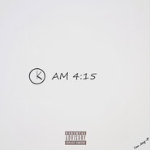

AM 4:15凌晨四点一刻
============================

|  |  |
| :--: | :-- |
| [ AM 4:15凌晨四点一刻](https://emumo.xiami.com/album/2102806213) | **艺人**: [张瀚杰](../index.md) **语种**: 国语 **唱片公司**: 独立发行 **发行时间**: 2017年08月01日 **专辑类别**: 录音室专辑 **专辑风格**: 流行说唱 Pop Rap, 地下说唱 Underground Hip Hop, 陷阱说唱 Trap Rap **播放数**: 1647 **收藏数**: 0 **评论数**: 0  |

## 简介

那些在半夜的记录，实际是凌晨录的歌...AM 4:15 凌晨四点一刻

## 曲目

## 评论

|  |  |  |  |
| :-- | :-- | :-- | :-- |
