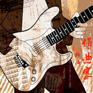
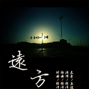

徐泽
============================

|  |  |
| :--: | :-- |
| [ 徐泽](https://i.xiami.com/xuze) | **地区**: China 中国大陆 **风格**: 国语流行 Mandarin Pop **播放数**: 3407419 **粉丝数**: 60 **评论数**: 47  |

## 档案

徐泽，华语男歌手 徐泽是山东临沂“众声音乐工作室”的创始人。并开创了临沂市的首家歌友俱乐部。 徐泽的演唱风格粗犷而不失细腻，刚劲带有柔情的音色。擅长伤感歌曲演绎。 2010年推出全新全新社会写实新曲《真的好累》，歌手富有悲凉带着刚毅和沧桑的嗓音，细腻而动情的演唱使得更加深入人心，赢得了广大爱乐人士的支持。

## 专辑

| 名称 | 语种 | 唱片公司 | 发行时间 | 专辑类别 | 专辑风格 |
| :--: | :-- | :-- | :-- | :-- | :-- |
| [ 一个人旅行](./albums/5021765166.md) | 国语 | 酷狗繁星 | 2021年05月20日 | EP, 单曲 | 国语流行 Mandarin Pop |
| [ 往后余生](./albums/5021772556.md) | 国语 | 通力唱片 | 2020年10月01日 | 录音室专辑 | 国语流行 Mandarin Pop |
| [ 刻骨的思念](./albums/5021427363.md) | 国语 | 通力唱片 | 2020年07月15日 | EP, 单曲 | 国语流行 Mandarin Pop |
| [ 思念的泪光EP单曲](./albums/2103510737.md) | 国语 | 通力唱片 | 2018年02月03日 | EP, 单曲 | 国语流行 Mandarin Pop |
| [ 魅力广州](./albums/2102653110.md) | 国语 | 广州音像 | 2016年11月18日 | EP, 单曲 |  |
| [ 黄金血道30集连续剧《黄金血道》片尾曲](./albums/2100384888.md) | 国语 | 中大传媒 | 2016年08月27日 | 原声带, 影视音乐 |  |
| [ 黄金血道](./albums/2100193312.md) | 国语 | 通力唱片 | 2016年08月27日 | EP, 单曲 |  |
| [ 入党申请书红歌](./albums/2100380403.md) | 国语 | 通力唱片 | 2016年08月10日 | EP, 单曲 |  |
| [ 蜀道难](./albums/2100358951.md) | 国语 | 通力唱片 | 2016年06月29日 | EP, 单曲 |  |
| [ 不孤单](./albums/2100285674.md) | 国语 | 音尚律动 | 2016年03月02日 | 录音室专辑 |  |
| [ 我的爱2016EP单曲](./albums/2100263126.md) | 国语 | 通力唱片 | 2016年01月22日 | EP, 单曲 | 国语流行 Mandarin Pop |
| [ 作曲家翻唱](./albums/2100196320.md) | 国语 | 独立发行 | 2015年09月10日 | 录音室专辑 | 国语流行 Mandarin Pop |
| [ 笙歌翻唱辑精选](./albums/535003071.md) | 国语 | 独立发行 | 2015年08月20日 | EP, 单曲 | 国语流行 Mandarin Pop |
| [ 远方励志歌曲](./albums/537559723.md) | 国语 | 独立发行 | 2015年07月21日 | EP, 单曲 | 国语流行 Mandarin Pop |
| [ 有你真好](./albums/2100203790.md) | 国语 | 通力唱片 | 2015年07月20日 | 录音室专辑 | 国语流行 Mandarin Pop |
| [ 她不知道](./albums/36755253.md) | 国语 | 独立发行 | 2015年07月12日 | EP, 单曲 | 国语流行 Mandarin Pop |
| [ 找个安静的地方想你](./albums/1636631333.md) | 国语 | 独立发行 | 2015年07月11日 | EP, 单曲 | 民谣流行 Folk Pop |
| [ 无法用一生的时间忘记你](./albums/634681643.md) | 国语 | 独立发行 | 2015年06月19日 | EP, 单曲 | 国语流行 Mandarin Pop |
| [ 无风的时光遇见你](./albums/534251920.md) | 国语 | 独立发行 | 2015年06月14日 | EP, 单曲 | 音乐剧 Musical theatre, 国语流行 Mandarin Pop |
| [ 真的好累](./albums/2034113553.md) | 国语 | 独立发行 | 2015年06月13日 | EP, 单曲 | 国语流行 Mandarin Pop |
| [ 在爱里等你](./albums/833474261.md) | 国语 | 独立发行 | 2015年06月05日 | 精选集 | 国语流行 Mandarin Pop |
| [ 化身孤岛的鲸](./albums/1833075410.md) | 国语 | 独立发行 | 2015年05月29日 | EP, 单曲 | 国语流行 Mandarin Pop |
| [ 一个人](./albums/1931570833.md) | 国语 | 独立发行 | 2015年04月17日 | 录音室专辑 | 国语流行 Mandarin Pop |

## 评论

|  |  |  |
| :-- | :-- | :-- |
|  [虾米用户](https://emumo.xiami.com/u/358104299) 悲观的唯心存在现实解构虚... 2020-12-28 03:17 赞(0) 踩(0) | 
44387
 |
|  [虾米用户](https://emumo.xiami.com/u/7128609)  2018-05-29 01:45 赞(0) 踩(0) | 
是《爱宜淡写》那个徐泽吗～
 |
|  [虾米用户](https://emumo.xiami.com/u/38716899)  2018-02-21 00:25 赞(0) 踩(0) | 
有没有实体专辑
 |
|  [虾米用户](https://emumo.xiami.com/u/290654658)  2017-04-22 20:03 赞(0) 踩(0) | 
完美！
 |
|  [虾米用户](https://emumo.xiami.com/u/112552990)  2016-12-04 18:53 赞(2) 踩(0) | 
◐踩踩◐ 踩踩踩踩 踩踩踩踩 踩踩踩踩踩 踩 踩 踩踩 踩踩 踩踩 踩 踩 踩 踩 踩∩∩ 踩 踩 踩
 |
|  [虾米用户](https://emumo.xiami.com/u/112552990)  2016-12-04 18:53 赞(2) 踩(0) | 
踩 ◎U◎踩 踩踩 踩踩踩踩 踩踩踩.踩.踩.踩.踩滴漂亮吧..
 |
|  [虾米用户](https://emumo.xiami.com/u/112552990)  2016-12-04 18:52 赞(1) 踩(0) | 
......飘过 .....飘过 ....飘过 ...飘过 ..飘过 .飘过 .飘过 .飘过 ..飘过 ...飘过 ....飘过 .....飘过 ......飘过 .......飘过 ........飘过 ........飘过 ........飘过 .......飘过 ......飘过 .....飘过 ....飘过 ...飘过 ..飘过
 |
|  [虾米用户](https://emumo.xiami.com/u/112552990)  2016-12-04 18:51 赞(1) 踩(0) | 
.飘过 .飘过 .飘过 ..飘过 ...飘过 ....飘过 .....飘过 ......飘过 .......飘过 ........飘过 ........飘过 ........飘过 .......飘过 ......飘过 .....飘过 ....飘过 ...飘过 ..飘过 .飘过 .飘过 .飘过 ..飘过 ...飘过 ....飘过 .....飘过 ......飘过 .......飘过 ........飘过 ........飘过 ........飘过 .......飘过
 |
|  [虾米用户](https://emumo.xiami.com/u/112552990)  2016-12-04 18:51 赞(1) 踩(0) | 
.......飘过 ........飘过 ........飘过 ........飘过 .......飘过 ......飘过 .....飘过 ....飘过 ...飘过 ..飘过 .飘过 .飘过 .飘过 ..飘过 ...飘过 ....飘过 .....飘过 ......飘过 .......飘过
 |
|  [虾米用户](https://emumo.xiami.com/u/112552990)  2016-12-04 18:51 赞(1) 踩(0) | 
......飘过 .....飘过 ....飘过 ...飘过 ..飘过 .飘过 .飘过 .飘过 ..飘过 ...飘过 ....飘过 .....飘过 ......飘过 .......飘过 ........飘过 ........飘过 ........飘过 .......飘过 ......飘过 .....飘过 ....飘过 ...飘过 ..飘过
 |
|  [虾米用户](https://emumo.xiami.com/u/112552990)  2016-12-04 18:51 赞(1) 踩(0) | 
.飘过 .飘过 .飘过 ..飘过 ...飘过 ....飘过 .....飘过 ......飘过 .......飘过 ........飘过 ........飘过 ........飘过 .......飘过 ......飘过 .....飘过 ....飘过 ...飘过 ..飘过 .飘过 .飘过 .飘过 ..飘过 ...飘过 ....飘过 .....飘过 ......飘过 .......飘过 ........飘过 ........飘过 ........飘过 .......飘过
 |
|  [虾米用户](https://emumo.xiami.com/u/112552990)  2016-12-04 18:50 赞(1) 踩(0) | 
.......飘过 ........飘过 ........飘过 ........飘过 .......飘过 ......飘过 .....飘过 ....飘过 ...飘过 ..飘过 .飘过 .飘过 .飘过 ..飘过 ...飘过 ....飘过 .....飘过 ......飘过 .......飘过
 |
|  [虾米用户](https://emumo.xiami.com/u/112552990)  2016-12-04 18:50 赞(1) 踩(0) | 
......飘过 .....飘过 ....飘过 ...飘过 ..飘过 .飘过 .飘过 .飘过 ..飘过 ...飘过 ....飘过 .....飘过 ......飘过 .......飘过 ........飘过 ........飘过 ........飘过 .......飘过 ......飘过 .....飘过 ....飘过 ...飘过 ..飘过
 |
|  [虾米用户](https://emumo.xiami.com/u/112552990)  2016-12-04 18:50 赞(1) 踩(0) | 
.飘过 .飘过 .飘过 ..飘过 ...飘过 ....飘过 .....飘过 ......飘过 .......飘过 ........飘过 ........飘过 ........飘过 .......飘过 ......飘过 .....飘过 ....飘过 ...飘过 ..飘过 .飘过 .飘过 .飘过 ..飘过 ...飘过 ....飘过 .....飘过 ......飘过 .......飘过 ........飘过 ........飘过 ........飘过 .......飘过
 |
|  [虾米用户](https://emumo.xiami.com/u/112552990)  2016-12-04 18:50 赞(0) 踩(0) | 
.......飘过 ........飘过 ........飘过 ........飘过 .......飘过 ......飘过 .....飘过 ....飘过 ...飘过 ..飘过 .飘过 .飘过 .飘过 ..飘过 ...飘过 ....飘过 .....飘过 ......飘过 .......飘过
 |
|  [虾米用户](https://emumo.xiami.com/u/112552990)  2016-12-04 18:23 赞(1) 踩(0) | 
任何一种心情， 都可以找一首歌来代替。 听歌的人欣赏沿途的风景， 却不忘感受耳机里的浪漫； 听歌的人细数着昨日的失落， 却也不忘重燃起背后的烟火； 听歌的人观赏着别人的故事， 却在歌声中回味着自己的经历。 音乐,文字.在这里,静静的聆听音乐,感受着每个人的心情, 在一张张画面里找寻自己..... 我喜欢沉醉在这样的音乐中，丢弃红尘的无奈， 忘记现实的不快，在音乐的海洋里，畅快淋漓诠释...
 |
|  [虾米用户](https://emumo.xiami.com/u/112552990)  2016-12-04 18:23 赞(0) 踩(0) | 
任何一种心情， 都可以找一首歌来代替。 听歌的人欣赏沿途的风景， 却不忘感受耳机里的浪漫； 听歌的人细数着昨日的失落， 却也不忘重燃起背后的烟火； 听歌的人观赏着别人的故事， 却在歌声中回味着自己的经历。 音乐,文字.在这里,静静的聆听音乐,感受着每个人的心情, 在一张张画面里找寻自己..... 我喜欢沉醉在这样的音乐中，丢弃红尘的无奈， 忘记现实的不快，在音乐的海洋里，畅快淋漓诠释。
 |
|  [虾米用户](https://emumo.xiami.com/u/112552990)  2016-12-04 18:23 赞(0) 踩(0) | 
任何一种心情， 都可以找一首歌来代替。 听歌的人欣赏沿途的风景， 却不忘感受耳机里的浪漫； 听歌的人细数着昨日的失落， 却也不忘重燃起背后的烟火； 听歌的人观赏着别人的故事， 却在歌声中回味着自己的经历。 音乐,文字.在这里,静静的聆听音乐,感受着每个人的心情, 在一张张画面里找寻自己..... 我喜欢沉醉在这样的音乐中，丢弃红尘的无奈， 忘记现实的不快，在音乐的海洋里，畅快淋漓诠释。。。。。
 |
|  [虾米用户](https://emumo.xiami.com/u/112552990)  2016-12-04 18:22 赞(0) 踩(0) | 
任何一种心情， 都可以找一首歌来代替。 听歌的人欣赏沿途的风景， 却不忘感受耳机里的浪漫； 听歌的人细数着昨日的失落， 却也不忘重燃起背后的烟火； 听歌的人观赏着别人的故事， 却在歌声中回味着自己的经历。 音乐,文字.在这里,静静的聆听音乐,感受着每个人的心情, 在一张张画面里找寻自己..... 我喜欢沉醉在这样的音乐中，丢弃红尘的无奈， 忘记现实的不快，在音乐的海洋里，畅快淋漓诠释....
 |
|  [虾米用户](https://emumo.xiami.com/u/112552990)  2016-12-04 18:22 赞(0) 踩(0) | 
任何一种心情， 都可以找一首歌来代替。 听歌的人欣赏沿途的风景， 却不忘感受耳机里的浪漫； 听歌的人细数着昨日的失落， 却也不忘重燃起背后的烟火； 听歌的人观赏着别人的故事， 却在歌声中回味着自己的经历。 音乐,文字.在这里,静静的聆听音乐,感受着每个人的心情, 在一张张画面里找寻自己..... 我喜欢沉醉在这样的音乐中，丢弃红尘的无奈， 忘记现实的不快，在音乐的海洋里，畅快淋漓诠释。
 |
|  [虾米用户](https://emumo.xiami.com/u/112552990)  2016-12-04 18:22 赞(0) 踩(0) | 
ＯＯ═══∩═══ＯＯ  ╭╬╮　　　　　　　　　 ◢ -▁╭▅▇□□█▇▆▅▄▃▂▁(╳)█╮ O(∩_∩)O 聆听精彩☆★☆★☆----- ╰═▃_满分支持▁∠════▔▔▔  ~~~~~~╙O ╙O~~~~~~
 |
|  [虾米用户](https://emumo.xiami.com/u/112552990)  2016-12-04 18:22 赞(0) 踩(0) | 
ＯＯ═══∩═══ＯＯ  ╭╬╮　　　　　　　　　 ◢ -▁╭▅▇□□█▇▆▅▄▃▂▁(╳)█╮ O(∩_∩)O 聆听精彩☆★☆★☆----- ╰═▃_满分支持▁∠════▔▔▔  ~~~~~╙O ╙O~~~~~
 |
|  [虾米用户](https://emumo.xiami.com/u/112552990)  2016-12-04 18:22 赞(0) 踩(0) | 
ＯＯ═══∩═══ＯＯ  ╭╬╮　　　　　　　　　 ◢ -▁╭▅▇□□█▇▆▅▄▃▂▁(╳)█╮ O(∩_∩)O 聆听精彩☆★☆★☆----- ╰═▃_满分支持▁∠════▔▔▔  ~~~~╙O ╙O~~~~
 |
|  [虾米用户](https://emumo.xiami.com/u/112552990)  2016-12-04 18:21 赞(0) 踩(0) | 
ＯＯ═══∩═══ＯＯ  ╭╬╮　　　　　　　　　 ◢ -▁╭▅▇□□█▇▆▅▄▃▂▁(╳)█╮ O(∩_∩)O 聆听精彩☆★☆★☆----- ╰═▃_满分支持▁∠════▔▔▔  ~~~~~~~~╙O ╙O~~~~~~~~
 |
|  [虾米用户](https://emumo.xiami.com/u/112552990)  2016-12-04 18:21 赞(0) 踩(0) | 
ＯＯ═══∩═══ＯＯ  ╭╬╮　　　　　　　　　 ◢ -▁╭▅▇□□█▇▆▅▄▃▂▁(╳)█╮ O(∩_∩)O 聆听精彩☆★☆★☆----- ╰═▃_满分支持▁∠════▔▔▔  ~~~~~╙O ╙O~~~~~
 |
|  [虾米用户](https://emumo.xiami.com/u/112552990)  2016-12-04 18:21 赞(0) 踩(0) | 
ＯＯ═══∩═══ＯＯ  ╭╬╮　　　　　　　　　 ◢ -▁╭▅▇□□█▇▆▅▄▃▂▁(╳)█╮ O(∩_∩)O 聆听精彩☆★☆★☆----- ╰═▃_满分支持▁∠════▔▔▔  ~~~~╙O ╙O~~~~
 |
|  [虾米用户](https://emumo.xiami.com/u/112552990)  2016-12-04 18:21 赞(0) 踩(0) | 
ＯＯ═══∩═══ＯＯ  ╭╬╮　　　　　　　　　 ◢ -▁╭▅▇□□█▇▆▅▄▃▂▁(╳)█╮ O(∩_∩)O 聆听精彩☆★☆★☆----- ╰═▃_满分支持▁∠════▔▔▔  ~~~~~~~~╙O ╙O~~~~~~~~
 |
|  [虾米用户](https://emumo.xiami.com/u/112552990)  2016-12-04 18:20 赞(0) 踩(0) | 
ＯＯ═══∩═══ＯＯ  ╭╬╮　　　　　　　　　 ◢ -▁╭▅▇□□█▇▆▅▄▃▂▁(╳)█╮ O(∩_∩)O 聆听精彩☆★☆★☆----- ╰═▃_满分支持▁∠════▔▔▔  ~~~~~~~╙O ╙O~~~~~~~
 |
|  [虾米用户](https://emumo.xiami.com/u/112552990)  2016-12-04 18:20 赞(0) 踩(0) | 
ＯＯ═══∩═══ＯＯ  ╭╬╮　　　　　　　　　 ◢ -▁╭▅▇□□█▇▆▅▄▃▂▁(╳)█╮ O(∩_∩)O 聆听精彩☆★☆★☆----- ╰═▃_满分支持▁∠════▔▔▔  ~~~~~╙O ╙O~~~~~
 |
|  [虾米用户](https://emumo.xiami.com/u/112552990)  2016-12-04 18:20 赞(0) 踩(0) | 
ＯＯ═══∩═══ＯＯ  ╭╬╮　　　　　　　　　 ◢ -▁╭▅▇□□█▇▆▅▄▃▂▁(╳)█╮ O(∩_∩)O 聆听精彩☆★☆★☆----- ╰═▃_满分支持▁∠════▔▔▔  ~~~~~~~╙O ╙O~~~~~~
 |
|  [虾米用户](https://emumo.xiami.com/u/112552990)  2016-12-04 18:20 赞(0) 踩(0) | 
ＯＯ═══∩═══ＯＯ  ╭╬╮　　　　　　　　　 ◢ -▁╭▅▇□□█▇▆▅▄▃▂▁(╳)█╮ O(∩_∩)O 聆听精彩☆★☆★☆----- ╰═▃_满分支持▁∠════▔▔▔  ~~~~~╙O ╙O~~~~~
 |
|  [虾米用户](https://emumo.xiami.com/u/112552990)  2016-12-04 18:20 赞(0) 踩(0) | 
ＯＯ═══∩═══ＯＯ  ╭╬╮　　　　　　　　　 ◢ -▁╭▅▇□□█▇▆▅▄▃▂▁(╳)█╮ O(∩_∩)O 聆听精彩☆★☆★☆----- ╰═▃_满分支持▁∠════▔▔▔  ....~~~╙O ╙O~~~....
 |
|  [虾米用户](https://emumo.xiami.com/u/112552990)  2016-12-04 18:19 赞(0) 踩(0) | 
ＯＯ═══∩═══ＯＯ  ╭╬╮　　　　　　　　　 ◢ -▁╭▅▇□□█▇▆▅▄▃▂▁(╳)█╮ O(∩_∩)O 聆听精彩☆★☆★☆----- ╰═▃_满分支持▁∠════▔▔▔  ~~~╙O ╙O~~~
 |
|  [虾米用户](https://emumo.xiami.com/u/112552990)  2016-12-04 18:19 赞(0) 踩(0) | 
ＯＯ═══∩═══ＯＯ  ╭╬╮　　　　　　　　　 ◢ -▁╭▅▇□□█▇▆▅▄▃▂▁(╳)█╮ O(∩_∩)O 聆听精彩☆★☆★☆----- ╰═▃_满分支持▁∠════▔▔▔  . ~~~╙O ╙O~~~.
 |
|  [虾米用户](https://emumo.xiami.com/u/112552990)  2016-12-04 18:18 赞(0) 踩(0) | 
ＯＯ═══∩═══ＯＯ  ╭╬╮　　　　　　　　　 ◢ -▁╭▅▇□□█▇▆▅▄▃▂▁(╳)█╮ O(∩_∩)O 聆听精彩☆★☆★☆----- ╰═▃_满分支持▁∠════▔▔▔  ~~~╙O ╙O~~~
 |
|  [虾米用户](https://emumo.xiami.com/u/198717374) 书写感动自己的音乐！ 2016-11-30 23:24 赞(0) 踩(0) | 
此人“徐泽”，盗用我作词作曲，隆熙俊（也为网易音乐人）编曲、制作伴奏和演唱的歌曲《秋千》，该人仅仅是赤裸裸地下载了我和隆熙俊合作的版本，然后上传至网站，全部署上了他名字！由于此人恶劣行径，该人已被其推广方“爱原创音乐网”屏蔽，其拒不接本人电话。本人已经准备走法律程序！
 |
|  [虾米用户](https://emumo.xiami.com/u/223448201)  2016-09-06 13:53 赞(2) 踩(0) | 
在繁华的都市，有一种白天叫热热闹闹的喧嚣， 却又一种夜晚叫冷冷清清时的安静， 安静可以打破并想起对一个人的内疚和悔恨， 往事虽已过去却把自己的感情发挥到淋漓尽致， 有些忘不掉的承诺却变成了心里长久不能忘怀的抑， 带着自己曾经受伤的心和爱莫能助的情唱出了他内心深处的情感。。。。
 |
|  [虾米用户](https://emumo.xiami.com/u/223303052)  2016-09-06 01:29 赞(5) 踩(0) | 
现实中有的东西我们再喜欢也不会属于我们，有的东西我们再留恋也注定要放弃，人生中有许多种爱，但别让爱成为一种伤害。有些人，我们原本以为可以见面的。有些事，我们原本以为可以一直继续的。然后，也许在我们转身的那个刹那。有些人，我们就再也见不到了。当太阳落下又升起来的时候，一切都变了。我们一不小心就再也回不去了。
 |
|  [虾米用户](https://emumo.xiami.com/u/223297421)  2016-09-06 00:44 赞(7) 踩(0) | 
任何一种心情， 都可以找一首歌来代替。 听歌的人欣赏沿途的风景， 却不忘感受耳机里的浪漫； 听歌的人细数着昨日的失落， 却也不忘重燃起背后的烟火； 听歌的人观赏着别人的故事， 却在歌声中回味着自己的经历。 音乐,文字.在这里,静静的聆听音乐,感受着每个人的心情, 在一张张画面里找寻自己..... 我喜欢沉醉在这样的音乐中，丢弃红尘的无奈， 忘记现实的不快，在音乐的海洋里，畅快淋漓诠释。 --------------------------------------------------------------------
 |
|  [虾米用户](https://emumo.xiami.com/u/144596616)   2016-07-24 23:07 赞(2) 踩(0) | 
那么好听怎么都没人？
 |
|  [虾米用户](https://emumo.xiami.com/u/112601900)  2016-02-10 20:33 赞(6) 踩(0) | 
ＯＯ═══∩═══ＯＯ  ╭╬╮　　　　　　　　　 ◢ -▁╭▅▇□□█▇▆▅▄▃▂▁(╳)█╮ O(∩_∩)O 聆听精彩☆★☆★☆----- ╰═▃_满分支持▁∠════▔▔▔  ~~~╙O ╙O~~~祝福朋友永远快乐！！！~~~~永远支持好朋友精彩演绎 ！！！
 |
|  [虾米用户](https://emumo.xiami.com/u/112601900)  2016-02-10 20:33 赞(2) 踩(0) | 
ＯＯ═══∩═══ＯＯ  ╭╬╮　　　　　　　　　 ◢ -▁╭▅▇□□█▇▆▅▄▃▂▁(╳)█╮ O(∩_∩)O 聆听精彩☆★☆★☆----- ╰═▃_满分支持▁∠════▔▔▔  ~~~╙O ╙O~~~祝福朋友永远快乐！！！~~~~永远支持好朋友精彩演绎 ！！！
 |
|  [虾米用户](https://emumo.xiami.com/u/112601900)  2016-02-10 20:32 赞(2) 踩(0) | 
ＯＯ═══∩═══ＯＯ  ╭╬╮　　　　　　　　　 ◢ -▁╭▅▇□□█▇▆▅▄▃▂▁(╳)█╮ O(∩_∩)O 聆听精彩☆★☆★☆----- ╰═▃_满分支持▁∠════▔▔▔  ~~~╙O ╙O~~~祝福朋友永远快乐！！！~~~~永远支持好朋友精彩演绎 ！！！
 |
|  [虾米用户](https://emumo.xiami.com/u/112601900)  2016-02-10 20:32 赞(4) 踩(0) | 
ＯＯ═══∩═══ＯＯ  ╭╬╮　　　　　　　　　 ◢ -▁╭▅▇□□█▇▆▅▄▃▂▁(╳)█╮ O(∩_∩)O 聆听精彩☆★☆★☆----- ╰═▃_满分支持▁∠════▔▔▔  ~~~╙O ╙O~~~祝福朋友永远快乐！！！~~~~永远支持好朋友精彩演绎 ！！！
 |
|  [虾米用户](https://emumo.xiami.com/u/112595158)  2016-02-10 19:23 赞(2) 踩(0) | 
啊啊啊啊啊啊终于找到你了！超爱你唱的歌！以前都是在网页上现在终于可以用手机了！么么哒…希望可以认识一下！等你回信
 |
|  [虾米用户](https://emumo.xiami.com/u/38716899)  2016-01-09 18:27 赞(2) 踩(0) | 
你好 你的专辑想买 有吗？
 |
|  [虾米用户](https://emumo.xiami.com/u/49878782) 静静聆听心底的声音～～～... 2015-05-14 09:17 赞(2) 踩(0) | 
我刚入驻了虾米音乐人，欢迎大家来我的个人主页，收听我的最新音乐
 |
