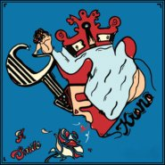
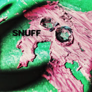
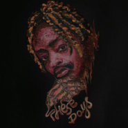
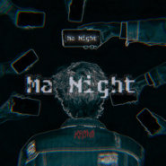
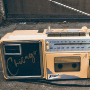
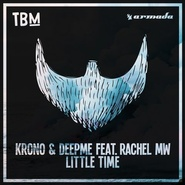
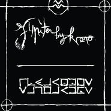
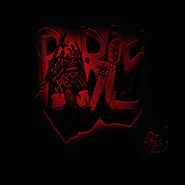

Krono
============================

|  |  |
| :--: | :-- |
| [ Krono](https://i.xiami.com/krono) | **播放数**: 2436773 **粉丝数**: 946 **评论数**: 45 **地区**: France 法国 **风格**: 电音流行 Electropop, 电子 Electronic, 深浩室舞曲 Deep House, 弛放 Chillout  |

## 档案

KRONO是法国知名电子音乐制作人、DJ。早期作品受Daft Punk影响，有鲜明的french touch特色。随着代表作《DANCIN》在YOUTUBE上点击量破亿，KRONO的法电魅力也逐渐走向国际舞台。 
合作邮箱：manager. tan@foxmail.com

## 专辑

| 名称 | 语种 | 唱片公司 | 发行时间 | 专辑类别 | 专辑风格 |
| :--: | :-- | :-- | :-- | :-- | :-- |
| [ Give a Smile](./albums/5022230698.md) | 其他 | KRONO MUSIC | 2020年12月19日 | 录音室专辑 | 法国流行 French Pop |
| [ Snuff](./albums/5021632970.md) | 其他 | KRONO MUSIC | 2020年10月09日 | 录音室专辑 | 嘻哈 Hip-Hop |
| [ These Days](./albums/5021624245.md) | 其他 | Independent | 2020年08月28日 | 录音室专辑 | 嘻哈 Hip-Hop |
| [ Ma Night](./albums/5021748196.md) | 其他 | KRONO MUSIC | 2020年07月24日 | 录音室专辑 | 嘻哈 Hip-Hop |
| [ So High](./albums/5021794096.md) | 其他 | Independent | 2020年06月19日 | 录音室专辑 | 嘻哈 Hip-Hop |
| [ Avant Biarritz](./albums/5022230602.md) | 其他 | KRONO MUSIC | 2020年05月24日 | 录音室专辑 | 电子 Electronic |
| [ Chicago](./albums/2108185078.md) | 其他 | Merlin Records | 2020年03月16日 | EP, 单曲 | 电子 Electronic |
| [ Save the Rap](./albums/2420325800.md) | 英语 | Merlin Records | 2020年03月02日 | EP, 单曲 | 嘻哈 Hip-Hop |
| [ Lesson Learned](./albums/2105798634.md) | 英语 | Merlin Records | 2020年01月31日 | EP, 单曲 | 法国流行 French Pop |
| [ On The Way](./albums/2105732311.md) | 英语 | Independent | 2020年01月15日 | EP, 单曲 | 合成器流行 Synthpop |
| [ Little Time](./albums/2102760852.md) | 英语 | The Bearded Man | 2017年05月31日 | EP, 单曲 |  |
| [ You're Beautiful](./albums/2102686278.md) | 英语 | The Bearded Man | 2017年01月26日 | EP, 单曲 |  |
| [ You're Beautiful](./albums/2103166912.md) | 英语 | Armada Music B.V. | 2017年01月26日 | EP, 单曲 | 流行舞曲 Dance-Pop |
| [ The Way Back](./albums/2102655277.md) | 英语 | The Bearded Man | 2016年09月15日 | EP, 单曲 |  |
| [ Starships](./albums/2100345324.md) | 英语 | The Bearded Man | 2016年05月26日 | EP, 单曲 |  |
| [ We Are So Animal](./albums/2100271310.md) | 英语 | The Bearded Man | 2016年02月02日 | EP, 单曲 |  |
| [ Metamorphoze](./albums/1835711448.md) | 英语 | Armada Music | 2015年06月30日 | 录音室专辑 |  |
| [ Sweet Goodbye  [Androma Remix]](./albums/2103347841.md) | 英语 | Armada Music B.V. | 2015年05月13日 | EP, 单曲 | 流行舞曲 Dance-Pop |
| [ Dancin(Krono Remix)](./albums/2106059651.md) | 英语 |  | 2015年04月19日 |  |  |
| [ Redlight (Emdeka Remix)](./albums/2103347842.md) | 英语 | Armada Music B.V. | 2015年04月16日 | EP, 单曲 | 浩室舞曲 House |
| [ Redlight (Ferreck Dawn Remix)](./albums/2103347844.md) | 英语 | Armada Music B.V. | 2015年03月30日 | EP, 单曲 | 浩室舞曲 House |
| [ Redlight (Ferreck Dawn Remix)](./albums/2108242403.md) | 其他 | Armada Deep | 2015年03月02日 | EP, 单曲 |  |
| [ Redlight (Marlon Hoffstadt Remix)](./albums/2103347845.md) | 英语 | Armada Music B.V. | 2015年02月02日 | EP, 单曲 | 浩室舞曲 House |
| [ Thunder (Original Mix)](./albums/2103691192.md) | 英语 | 看见音乐 (上海) | 2014年12月22日 | EP, 单曲 | 电子 Electronic |
| [ Run](./albums/2100204960.md) | 英语 | The Bearded Man | 2014年10月21日 | EP, 单曲 |  |
| [ Run (Maniezzl Remix)](./albums/2103347847.md) | 英语 | Armada Music B.V. | 2014年09月18日 | EP, 单曲 | 流行舞曲 Dance-Pop |
| [ Liberty City (Lost Frequencies Remix)](./albums/2108222796.md) | 其他 | Merlin Records | 2014年08月12日 | EP, 单曲 | 轻音乐 Easy Listening |
| [ Sweet Goodbye](./albums/2105648611.md) | 英语 | Merlin Records | 2014年08月07日 | EP, 单曲 |  |
| [ Redlight (Pretty Pink Remix)](./albums/2103166913.md) | 英语 | Armada Music B.V. | 2014年07月01日 | EP, 单曲 | 浩室舞曲 House |
| [ Liberty City](./albums/2100210412.md) | 其他 | The Bearded Man | 2014年06月26日 | EP, 单曲 |  |
| [ Dancin (Krono Remix)](./albums/335830692.md) | 英语 | Self-Released | 2013年03月20日 | EP, 单曲 |  |
| [ Bulletproof](./albums/2103166916.md) | 英语 | Bassacre Records | 2013年01月03日 | EP, 单曲 | 电子 Electronic |
| [ Miami Retrograde](./albums/2103166917.md) | 英语 | Self-Released | 2012年10月26日 | 录音室专辑 | 浩室舞曲 House |
| [ Bow Down](./albums/2103166919.md) | 英语 | Bassacre Records | 2012年10月08日 | EP, 单曲 | 电子 Electronic |
| [ Slide](./albums/2103166920.md) | 英语 | Self-Released | 2012年05月12日 | EP, 单曲 | 流行舞曲 Dance-Pop |
| [ Jupiter](./albums/2103166922.md) | 英语 | Self-Released | 2012年02月14日 | 录音室专辑 | 成人另类 Adult Alternative |
| [ Paris](./albums/2103347846.md) | 英语 | Ffbde | 2011年08月08日 | EP, 单曲 | 电子 Electronic |
| [ Redlight](./albums/5020673710.md) | 英语 |  | 不详 | 录音室专辑 |  |

## 评论

|  |  |  |  |
| :-- | :-- | :-- | :-- |
|  [虾米用户](https://emumo.xiami.com/u/315890155)   2020-08-07 23:31 赞(0) 踩(0) | 
有dp朋克的一点神韵
 |
|  [虾米用户](https://emumo.xiami.com/u/441091689) 杠精上场，请速避让 2020-06-19 22:28 赞(0) 踩(0) | 
那个鼻孔有点大
 |
|  [虾米用户](https://emumo.xiami.com/u/443207675)  2020-06-15 21:20 赞(0) 踩(0) | 
I love you
 |
|  [虾米用户](https://emumo.xiami.com/u/50625743) SO ROSÉ SO C... 2020-05-31 15:04 赞(0) 踩(0) | 
mark
 |
|  [虾米用户](https://emumo.xiami.com/u/376633276) 虾米  拜拜喽  我永远... 2020-03-18 18:11 赞(0) 踩(0) | 
酷啊老哥
 |
|  [虾米用户](https://emumo.xiami.com/u/306291497) 后悔带来的苦涩，是对过去... 2020-02-27 12:58 赞(0) 踩(0) | 

 |
|  [虾米用户](https://emumo.xiami.com/u/48156160) 我还没想好要写什么... 2020-02-24 19:47 赞(0) 踩(0) | 

 |
|  [虾米用户](https://emumo.xiami.com/u/340903899) 我还没想好要写什么... 2020-02-16 19:59 赞(0) 踩(0) | 
，
 |
|  [虾米用户](https://emumo.xiami.com/u/14088243) Tomorrow is ... 2019-12-05 00:20 赞(0) 踩(0) | 
-
 |
|  [虾米用户](https://emumo.xiami.com/u/405276435) 愿你出走半生，归来仍是少... 2019-11-23 10:58 赞(0) 踩(0) | 
加油(ง •̀_•́)ง，希望有更多的听见你们的声音！
 |
|  [虾米用户](https://emumo.xiami.com/u/52056952) 人生即是到來、相遇、陪伴... 2019-10-27 22:52 赞(0) 踩(0) | 

 |
|  [虾米用户](https://emumo.xiami.com/u/324879742)   2018-07-29 23:48 赞(0) 踩(0) | 
.
 |
|  [虾米用户](https://emumo.xiami.com/u/251403070)  2017-11-03 16:30 赞(0) 踩(0) | 
混音，韵律。。
 |
|  [虾米用户](https://emumo.xiami.com/u/35586392) SHOCKEDYOURS... 2017-05-28 21:23 赞(1) 踩(0) | 

 |
|  [虾米用户](https://emumo.xiami.com/u/9513422) 虾米歌单迁徙到网易☁️:... 2017-01-19 04:00 赞(0) 踩(0) | 
Back
 |
|  [虾米用户](https://emumo.xiami.com/u/45317800) 暂无签名~ 2016-10-08 00:04 赞(0) 踩(0) | 
路过
 |
|  [虾米用户](https://emumo.xiami.com/u/84571136) 唯有音乐不离不弃 2016-09-14 21:55 赞(0) 踩(0) | 
KRONO feat. Andrew Hunt – The Way Back
 |
| ⇒ |  [虾米用户](https://emumo.xiami.com/u/126933296)  2016-09-26 21:57 赞(0) 踩(0) | 
新歌好赞！
 |
|  [虾米用户](https://emumo.xiami.com/u/52536056) (◉ω◉υ)⁼³₌₃悄咪... 2016-08-12 17:28 赞(1) 踩(0) | 
吸吸∠( ᐛ 」∠)＿
 |
| ⇒ |  [虾米用户](https://emumo.xiami.com/u/84571136) 唯有音乐不离不弃 2016-09-14 21:56 赞(0) 踩(0) | 
KRONO feat. Andrew Hunt – The Way Back
 |
|  [虾米用户](https://emumo.xiami.com/u/35714790)  2016-05-19 14:32 赞(1) 踩(0) | 
⚈้̤͡ ˌ̫̮ ⚈้̤͡" Ｉ Lᵒᵛᵉᵧₒᵤ❤
 |
|  [虾米用户](https://emumo.xiami.com/u/4844432) 听到high为止 2016-05-16 17:47 赞(0) 踩(0) | 
开口爱
 |
|  [虾米用户](https://emumo.xiami.com/u/42695089) vb：吴浣甜甜 2016-05-10 14:38 赞(0) 踩(0) | 
。
 |
|  [虾米用户](https://emumo.xiami.com/u/126933296)  2016-04-21 00:22 赞(1) 踩(0) | 
我发现了一篇专门介绍KRONO的文章！！！在此分享给大家：<a href="http://mp.weixin.qq.com/s?__biz=MzA3OTE0Mjk1MQ==&amp;amp;mid=2649286461&amp;amp;idx=1&amp;amp;sn=b25c799f121cbdee9cae0684bf05c370&amp;amp;scene=2&amp;amp;srcid=0420Gp7u1uDyPbWsZAMdUkgB&amp;amp;from=timeline&amp;amp;isappinstalled=0#wechat_redirect" target="_blank" rel="nofollow noreferrer noopener">http://mp.weixin.qq.com/s?__biz=MzA3OTE0Mjk1MQ==&amp;amp;mid=2649286461&amp;amp;idx=1&amp;amp;sn=b25c799f121cbdee9cae0684bf05c370&amp;amp;scene=2&amp;amp;srcid=0420Gp7u1uDyPbWsZAMdUkgB&amp;amp;from=timeline&amp;amp;isappinstalled=0#wechat_redirect</a>这篇原创文章在孚兰勒艺术机构的公众号（flaneurart)上发表,共分三篇，还有独家发布的《country mile》视听！！！超赞！！！
 |
|  [虾米用户](https://emumo.xiami.com/u/3428058) 我还没想好要写什么... 2016-04-11 09:11 赞(0) 踩(0) | 
dancin...拜托上架
 |
| ⇒ |  [虾米用户](https://emumo.xiami.com/u/126933296)  2016-04-21 00:29 赞(0) 踩(0) | 
腾讯视频可以搜到
 |
| ⇒ |  [虾米用户](https://emumo.xiami.com/u/3428058) 我还没想好要写什么... 2016-04-22 07:47 赞(0) 踩(0) | 
<q><b>邐鲤。说：</b></q>
 |
| ⇒ |  [虾米用户](https://emumo.xiami.com/u/126933296)  2016-04-22 16:45 赞(0) 踩(0) | 
<q><b>ネコチン中毒说：</b></q>
 |
|  [虾米用户](https://emumo.xiami.com/u/3428058) 我还没想好要写什么... 2016-04-11 09:11 赞(0) 踩(0) | 
单词
 |
|  [虾米用户](https://emumo.xiami.com/u/22881143) ㅤㅤㅤㅤ 2016-04-10 01:57 赞(1) 踩(0) | 
。
 |
|  [虾米用户](https://emumo.xiami.com/u/42661055) ✨ 2016-03-12 10:00 赞(0) 踩(0) | 
❁
 |
|  [虾米用户](https://emumo.xiami.com/u/103468666)        2016-03-04 21:31 赞(1) 踩(0) | 
一定会火
 |
|  [虾米用户](https://emumo.xiami.com/u/9028760) 豆瓣见 spotify ... 2016-02-25 10:17 赞(1) 踩(0) | 
☄
 |
|  [虾米用户](https://emumo.xiami.com/u/2452157) ଲ 2015-12-16 22:33 赞(0) 踩(0) | 
cool
 |
|  [虾米用户](https://emumo.xiami.com/u/15581208) Avicii 2015-12-08 22:51 赞(0) 踩(0) | 
等火
 |
|  [虾米用户](https://emumo.xiami.com/u/41163024) I’m done. 2015-12-05 12:37 赞(1) 踩(0) | 
惹 法电
 |
|  [虾米用户](https://emumo.xiami.com/u/11917054) 『常年卧底医院并乔装成医... 2015-10-23 14:28 赞(0) 踩(0) | 
get√ U
 |
|  [虾米用户](https://emumo.xiami.com/u/40254483)  2015-09-24 14:21 赞(0) 踩(0) | 
hot
 |
|  [虾米用户](https://emumo.xiami.com/u/36517683)  2015-09-23 14:43 赞(1) 踩(0) | 
  
 |
|  [虾米用户](https://emumo.xiami.com/u/16396509)  2015-09-01 17:18 赞(1) 踩(0) | 
俩帅哥
 |
|  [虾米用户](https://emumo.xiami.com/u/12714877)   2015-08-05 12:01 赞(0) 踩(0) | 
音质好差
 |
|  [虾米用户](https://emumo.xiami.com/u/9320764) 吃饭时要开心 2015-07-05 13:55 赞(1) 踩(0) | 
:)
 |
|  [虾米用户](https://emumo.xiami.com/u/39057609) 0x1d12er 2015-07-01 13:27 赞(0) 踩(0) | 
w
 |
|  [虾米用户](https://emumo.xiami.com/u/20862728) 柯男 2015-07-01 11:58 赞(2) 踩(0) | 
(⊙o⊙)好的
 |
|  [虾米用户](https://emumo.xiami.com/u/12068445) · 2015-07-01 08:41 赞(2) 踩(0) | 
Krono今日发布
 |
