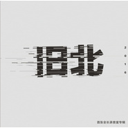

旧北同名专辑
============================

|  |  |
| :--: | :-- |
| [ 旧北同名专辑](https://emumo.xiami.com/album/2100345914) | **艺人**: [旧北乐队](../index.md) **语种**: 国语 **唱片公司**: 独立发行 **发行时间**: 2016年06月04日 **专辑类别**: 录音室专辑 **专辑风格**:  **播放数**: 509535 **收藏数**: 108 **评论数**: 14  |

## 简介

这是一张沉淀十年的专辑，它的面市离不开某些无名英雄的鼎力相助，我们铭记于心！
 

它是某些小城人共同合作的产物。
 

仅以此专辑纪念我们即将逝去的青春！

## 曲目

## 评论

|  |  |  |  |
| :-- | :-- | :-- | :-- |
|  [虾米用户](https://emumo.xiami.com/u/379162683) 我想要记住你们，我想要你... 2020-08-11 10:49 赞(0) 踩(0) | 
✧*｡
 |
|  [虾米用户](https://emumo.xiami.com/u/3921021) 平淡的生活不能将我们击倒 2019-07-03 15:13 赞(0) 踩(0) | 
挺好听的啊
 |
|  [虾米用户](https://emumo.xiami.com/u/346165752)  2019-05-21 10:30 赞(0) 踩(0) | 

 |
|  [虾米用户](https://emumo.xiami.com/u/54588641) 想靠近我的只有人类 2019-03-10 19:40 赞(2) 踩(0) | 
真可惜，才听到
 |
|  [虾米用户](https://emumo.xiami.com/u/25783230) WEYS 2019-02-04 22:07 赞(0) 踩(0) | 
动听
 |
|  [虾米用户](https://emumo.xiami.com/u/6593610)  2018-07-03 02:12 赞(3) 踩(0) | 
不知道CD在哪买得到2333
 |
|  [虾米用户](https://emumo.xiami.com/u/331213925)  2018-05-24 01:11 赞(1) 踩(0) | 
给本土乐队打call
 |
|  [虾米用户](https://emumo.xiami.com/u/34021537) 我这该死的 无处安放的魅... 2017-06-05 22:11 赞(1) 踩(0) | 
值得推荐，流行原创
 |
|  [虾米用户](https://emumo.xiami.com/u/100281412) 如果世界太危险，只有音乐... 2017-04-09 23:27 赞(1) 踩(0) | 
好听！我们会在怎样的宜昌老去&amp;hellip;&amp;hellip;
 |
|  [虾米用户](https://emumo.xiami.com/u/3491810) There is ART... 2016-11-24 07:25 赞(2) 踩(0) | 
支持我们宜昌的乐队
 |
|  [虾米用户](https://emumo.xiami.com/u/11029014)  （   救我又杀我 2016-10-22 01:02 赞(3) 踩(0) | 
来自宜昌，虽然很早知道，可一直没好好听过。还是被另一个吉他手安利！支持本土乐队！加油
 |
|  [虾米用户](https://emumo.xiami.com/u/188028067)  2016-06-12 21:16 赞(1) 踩(0) | 
给你101!不怕你骄傲.
 |
|  [虾米用户](https://emumo.xiami.com/u/1019008)  2016-06-09 18:25 赞(0) 踩(0) | 
 
 |
|  [虾米用户](https://emumo.xiami.com/u/92405566)  2016-06-06 17:46 赞(0) 踩(0) | 
支持，孙杨加油 
 |
