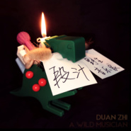

段汁．野生音乐家
============================

|  |  |
| :--: | :-- |
| [ 段汁．野生音乐家](https://emumo.xiami.com/album/2104931661) | **艺人**: [旧北乐队](../index.md) **语种**: 国语 **唱片公司**: 独立发行 **发行时间**: 2019年06月07日 **专辑类别**: 录音室专辑 **专辑风格**: 独立摇滚 Indie Rock, 国语流行 Mandarin Pop **播放数**: 351756 **收藏数**: 117 **评论数**: 7  |

## 简介

1993年夏，一盘租来的录像带领我走进了电声乐队，此后我扔下耕耘多年的乒乓球拍，消失在球场……&nbsp;  
1995年，家里的音乐磁带基本可以供应整个周边的童年小伙伴，童年小伙伴和磁带都是正版.&nbsp;  
1997年秋，汉正街的服饰潮流仍以“古惑仔”风格当道，我妈给我买了人生第一把吉他，那天风很大，我猜她应该花光了几个月工资！&nbsp;  
1998年，偶尔想出一段旋律又不会记谱，生怕忘记而骑车飞奔回家录卡带的那个少年开始写歌了……&nbsp;  
2000年夏，在家里倒腾了三年后终于拜了第一个吉他老师，他叫“梁双喜”，跟我小时候比赛用的球拍品牌差不多厉害.&nbsp;  
2001年冬，还是鼓手的我在夷陵中学的后舞台认识了一个会弹原版加州的男子，多年以后他是我这张专辑的出品人，传闻夷陵中学还出品了“胡吗个”.&nbsp;  
2003年，我成为CAKEWALK早期用户，第一次接触到MIDI，这年夏天录制了一张完整Demo，其中唯一还记得的歌曲雏形叫「宜昌西」.&nbsp;  
2005年，寻秦记在国内热映。我是酒仙，外号“善饮”，江湖地位是那时候打下的，现在一喝就醉但安全.&nbsp;  
2008年北京，是的，北京开了奥运会，然后我走丢了女朋友.&nbsp;  
2009-2018这十年我做了两个队，发了五张EP两张全长，除了旧北另一只叫“Tenacious&nbsp;pain&nbsp;of&nbsp;balls”顽强的蛋疼！&nbsp;  
2019年，我可以做音乐生产的全流程案。我是段汁，一个让烧烤开口说话，让音乐开始冒烟的爷们儿！&nbsp;——「野生音乐家」

## 曲目

## 评论

|  |  |  |  |
| :-- | :-- | :-- | :-- |
|  [虾米用户](https://emumo.xiami.com/u/379162683) 我想要记住你们，我想要你... 2021-01-07 17:08 赞(0) 踩(0) | 

 |
|  [虾米用户](https://emumo.xiami.com/u/303811163)  2021-01-07 14:40 赞(0) 踩(0) | 
nkmmmmmm
 |
|  [虾米用户](https://emumo.xiami.com/u/405805505)  2021-01-06 08:22 赞(0) 踩(0) | 
没369996633699966399有888589253涂抹855我也999w的吧
 |
|  [虾米用户](https://emumo.xiami.com/u/24592107) 独角兽 2021-01-05 12:34 赞(2) 踩(0) | 
最后的五星 再见虾米
 |
|  [虾米用户](https://emumo.xiami.com/u/244599343) 关门，开窗。 2019-06-14 03:32 赞(1) 踩(0) | 
一瓶酿了26年的酒。酒开了，花开了，醇香赠人。为数不多听得多的轻滚。在酒杯的歌里看到了脚在地上的生活，以及埋起来的种子在蕴发，绽放只是自己的事，但与他人有关更加美好，充满力量。无论是帮助浇灌梦想的家人朋友，还是只是听歌的网友。
 |
|  [虾米用户](https://emumo.xiami.com/u/50721064) 我还没想好要写什么... 2019-06-09 01:09 赞(1) 踩(0) | 
开酒的定位有点模糊，白日梦就好多了。可能是乐队的风格吧，喜欢在歌曲里加入别人的话
 |
|  [虾米用户](https://emumo.xiami.com/u/159140) 我还没想好要写什么... 2019-06-08 06:31 赞(1) 踩(0) | 
果断十分！旧北太好了！
 |
