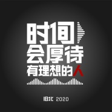
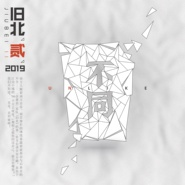

旧北乐队
============================

|  |  |
| :--: | :-- |
| [ 旧北乐队](https://i.xiami.com/jiubei) | **播放数**: 977917 **粉丝数**: 1790 **评论数**: 53 **地区**: China 中国大陆 **风格**: 后摇 Post-Rock, 流行摇滚 Pop Rock, 独立摇滚 Indie Rock, 迷幻摇滚 Psychedelic Rock, 流行 Pop  |

## 档案

旧北乐队： 
一个中国乐队 
2016.6.4 发行乐队首张全长录音室专辑《旧北》 
2016.12.27 发行EP专辑《平峦先生》 
2017.5.30 发行EP专辑《一首情歌》 
2017.6.6 发行EP专辑《框框少年时》 
2017.12.7 发行EP专辑《铁路坝》 
2018.4.28 发行EP专辑《叫我第一名》 
2019.6.7 发行EP专辑《段汁·野生音乐家》 
2019.6.18 发行第二张全长录音室专辑《旧北贰》 
2020.7.26 发行EP专辑《时间会厚待有理想的人》

## 专辑

| 名称 | 语种 | 唱片公司 | 发行时间 | 专辑类别 | 专辑风格 |
| :--: | :-- | :-- | :-- | :-- | :-- |
| [ 时间会厚待有理想的人](./albums/5021176568.md) | 国语 | 独立发行 | 2020年07月26日 | 录音室专辑 | 国语流行 Mandarin Pop, 独立摇滚 Indie Rock |
| [ 旧北贰](./albums/2104983807.md) | 国语 |  | 2019年06月18日 | 录音室专辑 | 流行摇滚 Pop Rock, 独立摇滚 Indie Rock, 英伦摇滚 Britpop |
| [ 段汁．野生音乐家](./albums/2104931661.md) | 国语 | 独立发行 | 2019年06月07日 | 录音室专辑 | 独立摇滚 Indie Rock, 国语流行 Mandarin Pop |
| [ 叫我第一名](./albums/2103698209.md) | 国语 | 独立发行 | 2018年04月28日 | EP, 单曲 | 流行 Pop |
| [ 一首情歌](./albums/2102759974.md) | 国语 | 独立发行 | 2017年05月28日 | EP, 单曲 | 独立民谣 Indie Folk |
| [ 旧北同名专辑](./albums/2100345914.md) | 国语 | 独立发行 | 2016年06月04日 | 录音室专辑 |  |

## 评论

|  |  |  |  |
| :-- | :-- | :-- | :-- |
|  [虾米用户](https://emumo.xiami.com/u/427664995)  2021-01-29 02:10 赞(1) 踩(0) | 
虾米的音乐风格不错，能发现一些小众的好歌、谢谢虾米陪我度过的时光！
 |
|  [虾米用户](https://emumo.xiami.com/u/8337431) 以乐会友 2021-01-10 07:26 赞(0) 踩(0) | 
湖北旧北20210110.52
 |
|  [虾米用户](https://emumo.xiami.com/u/379162683) 我想要记住你们，我想要你... 2021-01-07 17:09 赞(0) 踩(0) | 
✧*｡
 |
|  [虾米用户](https://emumo.xiami.com/u/338032733) 極 度 理 智 2020-07-30 05:09 赞(0) 踩(0) | 
发现宝藏！
 |
|  [虾米用户](https://emumo.xiami.com/u/7736041) 老子是来听音乐的。老子没... 2020-07-15 13:58 赞(0) 踩(0) | 
如去年一样的伤悲，听一次哭一次是什么情况。。。
 |
|  [虾米用户](https://emumo.xiami.com/u/301458701)  2020-07-14 11:04 赞(0) 踩(0) | 
曲高和寡 应者寥寥，这乐队TM就好听
 |
|  [虾米用户](https://emumo.xiami.com/u/36952815) music & life 2020-05-17 12:00 赞(0) 踩(0) | 
虾米猜你喜欢播了一首歌，转而听了其他歌，终于知道了这个乐队，好厉害，旋律抓耳，歌词走心
 |
|  [虾米用户](https://emumo.xiami.com/u/220963598) 因为我是那么的喜欢你们❤ 2019-12-31 22:53 赞(1) 踩(0) | 
‍♀️b站跨年
 |
|  [虾米用户](https://emumo.xiami.com/u/12128984) 我讨厌一切不押韵的歌，感... 2019-08-26 13:08 赞(0) 踩(0) | 
看人生一串发现一个旋律挺喜欢的乐队。但歌听起来的感觉，离&amp;ldquo;极致&amp;rdquo;总还差那么点东西。挺可惜的。
 |
|  [虾米用户](https://emumo.xiami.com/u/2807048) 噢 乖 2019-06-15 03:14 赞(0) 踩(0) | 
我才看人生一串
 |
|  [虾米用户](https://emumo.xiami.com/u/346165752)  2019-05-21 10:29 赞(0) 踩(0) | 

 |
|  [虾米用户](https://emumo.xiami.com/u/4752654) 签名太短输不完我的一首诗 2018-11-23 11:10 赞(1) 踩(0) | 
乐队成员全是宜昌的吗？？
 |
|  [虾米用户](https://emumo.xiami.com/u/15306839) # 2018-11-12 13:07 赞(2) 踩(0) | 
刚看了人生一串第五集，听了想看现场
 |
|  [虾米用户](https://emumo.xiami.com/u/2140851) 心向遠 2018-10-28 12:14 赞(1) 踩(0) | 
加油
 |
|  [虾米用户](https://emumo.xiami.com/u/4929299) 音楽と生きよう 2018-10-14 18:12 赞(1) 踩(0) | 
为什么我的下载里 会有一首框框少年时
 |
|  [虾米用户](https://emumo.xiami.com/u/246678154)   2018-09-19 08:42 赞(0) 踩(0) | 
乐队为啥叫旧北
 |
| ⇒ |  [虾米用户](https://emumo.xiami.com/u/4255426)  2019-07-25 13:04 赞(0) 踩(0) | 
酒杯？
 |
|  [虾米用户](https://emumo.xiami.com/u/189197892)   2018-08-15 00:57 赞(2) 踩(0) | 
人生一串突然发现了居然有来自宜昌的乐队，太开心啦
 |
|  [虾米用户](https://emumo.xiami.com/u/8415624)  2018-08-04 15:54 赞(0) 踩(0) | 
人生一串打卡打卡
 |
|  [虾米用户](https://emumo.xiami.com/u/362733287) 做自己。 2018-07-26 17:06 赞(0) 踩(0) | 
人生一串来打卡，发现了个很酷的摇滚乐队！
 |
|  [虾米用户](https://emumo.xiami.com/u/610315)  2018-07-20 21:41 赞(0) 踩(0) | 
人生一串来打卡，歌很好听。问下节目里那个美女是成员嘛
 |
|  [虾米用户](https://emumo.xiami.com/u/34492016)  2018-07-19 14:50 赞(0) 踩(0) | 
加油
 |
|  [虾米用户](https://emumo.xiami.com/u/9181319)  2018-06-24 11:50 赞(38) 踩(0) | 
有没有《人生一串》来打卡的？
 |
| ⇒ |  [虾米用户](https://emumo.xiami.com/u/9445406) 瑞典H.E.A.T.QQ... 2018-07-12 19:07 赞(0) 踩(0) | 
有，茄子妹哈哈
 |
| ⇒ |  [虾米用户](https://emumo.xiami.com/u/8769818)  2018-07-14 15:46 赞(0) 踩(0) | 
我
 |
| ⇒ |  [虾米用户](https://emumo.xiami.com/u/54042061)  2018-07-19 21:56 赞(0) 踩(0) | 
<q><b>大口花生酱说：</b></q>
 |
| ⇒ |  [虾米用户](https://emumo.xiami.com/u/246443161)  2018-07-22 00:00 赞(0) 踩(0) | 
＋1
 |
| ⇒ |  [虾米用户](https://emumo.xiami.com/u/1389984)  2019-08-21 16:41 赞(0) 踩(0) | 
+1
 |
|  [虾米用户](https://emumo.xiami.com/u/20177386) 感谢一切美好的遇见❤️ 2018-03-31 01:17 赞(0) 踩(0) | 

 |
|  [虾米用户](https://emumo.xiami.com/u/257036397) 我还没想好要写什么... 2018-03-16 08:55 赞(0) 踩(0) | 
弹幕之王乐队，你们有看过他们现场吗真的差
 |
|  [虾米用户](https://emumo.xiami.com/u/302771856) 我还没想好要写什么... 2017-12-12 08:27 赞(1) 踩(0) | 
这么好听怎么能不火呀魂淡  人气up！up！up！
 |
|  [虾米用户](https://emumo.xiami.com/u/91054420)  2017-10-16 13:54 赞(0) 踩(0) | 
学长好   我是夷陵的哇
 |
|  [虾米用户](https://emumo.xiami.com/u/290033622) 自由自私 自私高尚 2017-07-18 09:23 赞(0) 踩(0) | 
#
 |
|  [虾米用户](https://emumo.xiami.com/u/2418238) weibo: @尤米口 2017-07-12 02:57 赞(0) 踩(0) | 
火钳刘明
 |
|  [虾米用户](https://emumo.xiami.com/u/305889613)  2017-06-19 22:42 赞(0) 踩(0) | 
  
 |
|  [虾米用户](https://emumo.xiami.com/u/180809220) 独立音乐的爱好者！ 2016-07-05 10:54 赞(0) 踩(0) | 
直觉
 |
|  [虾米用户](https://emumo.xiami.com/u/2260098)  2016-06-08 00:13 赞(0) 踩(0) | 
应该是2016年6月4日发的专辑吧，艺人档案里……
 |
|  [虾米用户](https://emumo.xiami.com/u/41833605) 三冗禾日 2016-06-07 12:29 赞(2) 踩(0) | 
好听，高亢
 |
|  [虾米用户](https://emumo.xiami.com/u/186036485)  2016-06-05 12:37 赞(22) 踩(0) | 
昨天去看了旧北的现场，坦承说不是特别来感觉，贝斯有几个音弹错、歌手有些地方没踏准点、主唱有走调，吉他比较喜欢。开场歌还行，但歌词为什么不通过投影打出来。主唱咬字不清一句歌词都没听太懂。我是宜昌爷们，支持你们，摇滚乐可以更有点技术含量，能否不要几个和弦就全下来的歌，但若如此，更应聚焦歌词的感染和演唱的灵魂。希望你们能加油磨砺技术。期待明年看到你们作品有明显进步，到那时老乡会因为喜欢你们的音乐买专辑，而不是现在凭着“宜昌”2个字。
 |
|  [虾米用户](https://emumo.xiami.com/u/51629548) 爱世人所恨，恨你所爱 2016-06-03 16:25 赞(4) 踩(0) | 
想听赞美诗，不，全都想听！旧北快录，没有你们的歌听都嗨不起来啦
 |
|  [虾米用户](https://emumo.xiami.com/u/47449271)  2016-03-07 10:20 赞(1) 踩(0) | 
操  牛逼！  就指着挺你们活了！    以后请带着我们自发合奏乐队演出啊~
 |
|  [虾米用户](https://emumo.xiami.com/u/10080766) 我还没想好要写什么... 2015-12-06 21:13 赞(3) 踩(0) | 
南湖   如去年一样伤悲呢  快录
 |
|  [虾米用户](https://emumo.xiami.com/u/10080766) 我还没想好要写什么... 2015-12-06 21:09 赞(2) 踩(0) | 
发现
 |
|  [虾米用户](https://emumo.xiami.com/u/7809449)   2015-12-05 19:17 赞(2) 踩(0) | 
期待你们的演出
 |
|  [虾米用户](https://emumo.xiami.com/u/18705)   2015-11-30 21:18 赞(2) 踩(0) | 
阿黄，老师，加油~！
 |
|  [虾米用户](https://emumo.xiami.com/u/1019008)  2015-08-01 17:40 赞(0) 踩(0) | 
好听
 |
|  [虾米用户](https://emumo.xiami.com/u/11092689)   2015-07-26 21:58 赞(1) 踩(0) | 
俊杰唱的刚翻了[带墨镜笑]
 |
|  [虾米用户](https://emumo.xiami.com/u/16003491) Music icon 2015-07-24 23:32 赞(0) 踩(0) | 
带感
 |
|  [虾米用户](https://emumo.xiami.com/u/38887612)   2015-07-24 23:08 赞(0) 踩(0) | 
没有如去年一样伤悲，差评
 |
| ⇒ |  [虾米用户](https://emumo.xiami.com/u/512881) 中国独立乐队 2015-07-25 23:22 赞(0) 踩(0) | 
等我们重新录音，会呈现一首更好的 如去年一样伤悲~~谢谢支持
 |
| ⇒ |  [虾米用户](https://emumo.xiami.com/u/38887612)   2015-09-14 23:40 赞(0) 踩(0) | 
<q><b>旧北乐队说：</b></q>
 |
|  [虾米用户](https://emumo.xiami.com/u/512881) 中国独立乐队 2015-07-21 00:21 赞(4) 踩(0) | 
我刚入驻了阿里音乐人，欢迎大家来我的个人主页，收听我的最新音乐
 |
