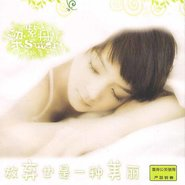

放弃也是一种美丽
============================

|  |  |
| :--: | :-- |
| [ 放弃也是一种美丽](https://emumo.xiami.com/album/334494) | **艺人**: [梁紫丹](../index.md) **语种**: 国语 **唱片公司**: 广东飞讯 **发行时间**: 2009年05月01日 **专辑类别**: 合集, 杂锦 **专辑风格**:  **播放数**: 20985 **收藏数**: 16 **评论数**: 3  |

## 简介

续发烧碟《紫色的声音》得到好评后，梁紫丹再次静下心来制作全新的EP《放弃也是一种美丽》。为胡歌、弦子、陈小春、罗志祥等著名艺人作词编曲的资深音乐人薛永嘉再次担任本张EP的监制，使专辑中溶入更多的音乐风格。通过本张EP更大程度地发掘梁紫丹的音乐天赋。新的作品中紫丹也作出了大胆的尝试。不但尝试了国语，粤语以及英文歌曲的演绎，还尝试了多种的风格。  
在专辑歌曲的收录中也别有用心，歌曲虽有不同的风格及语言去演唱，但背后区会有一个故事。歌曲从轻松的BASS风格的《我的世界不能没有你》开始，讲述了恋人初识时的甜蜜。从这首歌开始除了听歌外还能感受到恋人间的各种故事。  
  
什么是爱？爱是非常抽象的东西，是一种感觉，一种体味、爱牵动着整个身心和悲喜情绪。  
什么是爱？爱是一种思绪，似蓝天里飘荡的白云。爱是阳光，是风，空气。 

## 曲目

- [我的世界不能没有你MV](./334494/U55rIz2c3e5.md)
- [最遥远的距离](./334494/8FZufq292a6.md)
- [放弃也是一种美丽](./334494/xLovqHabba1.md)
- [Sorry For You](./334494/xLovqI9b604.md)
- [天仙缘](./334494/xLovqJ1093c.md)
- [我的世界不能没有你(伴奏)](./334494/JAKsTU1e817.md)
- [最遥远的距离(纯音乐)](./334494/mQ3w2l6fcaa.md)
- [放弃也是一种美丽(纯音乐)](./334494/mQ3w2m16841.md)

## 评论

|  |  |  |
| :-- | :-- | :-- |
|  [虾米用户](https://emumo.xiami.com/u/54959843) 未必爱我所听~ 2017-10-31 00:08 赞(0) 踩(0) | 
各方面条件都可棒，感觉就是缺少专业团队包装，否则在这个演而优则唱的年代肯定能火~
 |
|  [虾米用户](https://emumo.xiami.com/u/37677412)  2015-11-05 12:10 赞(0) 踩(0) | 
那麽久沒有紫丹的消息和新專輯，她是否真的放棄也是一種美麗？
 |
|  [虾米用户](https://emumo.xiami.com/u/44139433) Roland_1969 2014-12-02 22:35 赞(0) 踩(0) | 
声音纯净
 |
