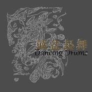
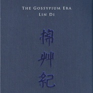
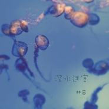
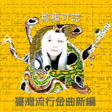
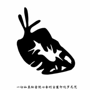

林笛
============================

|  |  |
| :--: | :-- |
| [ 林笛](https://i.xiami.com/lindi) | **播放数**: 2781417 **粉丝数**: 5302 **评论数**: 155 **地区**: China 中国大陆 **风格**: 世界融合 World Fusion, 艺术流行 Art Pop, 华语唱作人 Chinese Singer-Songwriter  |

## 档案

林笛，琵琶演奏者/歌者/词曲创作者/编曲师，出生于上海，四岁学习琵琶，十岁进入上海音乐学院附小，毕业于上海音乐学院民乐系。擅长民族器乐演奏，合成器编曲，管弦乐作曲编配。 
1994年开始作曲编曲。 
2001年组建冷酷仙境乐队，担任歌手和键盘手，琵琶演奏。曾带领乐队和代表个人出访过荷兰，日本，芬兰，西班牙等国家进行表演。 
并在中国各主要城市，进行过上百场音乐会，并参加过各种大型音乐节的表演。 
目前，集歌手，演奏，作曲，编曲以及视觉影像工作为一身的林笛，将更多地从事个人音乐创作和舞台表演工作。 
个人专辑作品 
魔境十日 
迷路新娘 
秘密花园的邂逅 
佛经

## 专辑

| 名称 | 语种 | 唱片公司 | 发行时间 | 专辑类别 | 专辑风格 |
| :--: | :-- | :-- | :-- | :-- | :-- |
| [ Divine](./albums/5021946888.md) | 英语 | Scantraxx | 2020年11月18日 | EP, 单曲 | 流行舞曲 Dance-Pop |
| [ 鼓盆起舞Dancing Drums](./albums/2100256646.md) | 其他 | 独立发行 | 2016年01月08日 | EP, 单曲 | 世界融合 World Fusion, 现代古典 Modern Classical |
| [ 背叛者的乐园Betrayer's Paradise](./albums/2029700451.md) | 国语 | 独立发行 | 2015年04月22日 | EP, 单曲 | 迷幻流行 Psychedelic Pop, 神游舞曲 Trip Hop, 另类唱作人 Alternative Singer-Songwriter |
| [ 独木成林Single Forest](./albums/328402472.md) | 国语 | 独立发行 | 2015年04月08日 | 录音室专辑 | 民族融合新世纪 Ethnic Fusion New Age, 新世纪音乐 New Age, 另类唱作人 Alternative Singer-Songwriter |
| [ 棉草纪The Gossypium Era](./albums/874745330.md) | 其他 | 树音乐 | 2013年07月26日 | 录音室专辑 | 世界融合 World Fusion, 中国民乐 Chinese Folk Music |
| [ 魔琴功法Practice Magic](./albums/274733953.md) | 其他 | 林笛 | 2013年07月25日 | EP, 单曲 | 中国民乐 Chinese Folk Music, 中国风 China-Wave |
| [ 深水迷宫](./albums/1774735339.md) | 其他 | 独立发行 | 2013年07月25日 | EP, 单曲 |  |
| [ 柠檬可诺台湾流行金曲新编](./albums/485028.md) | 闽南语 | 台湾惊爆点 | 2011年12月24日 | 录音室专辑 |  |
| [ 秘密花园的邂逅Meet in Secret Garden](./albums/320498.md) | 国语 | 林笛 | 2009年02月14日 | 录音室专辑 | 氛围音乐 Ambient, 独立流行 Indie Pop, 独立电子乐 Indietronica |
| [ 佛经一切如来秘密随心舍利宝箧陀罗尼咒](./albums/420368.md) | 其他 | 独立发行 | 2009年01月01日 | 录音室专辑 | 民族融合新世纪 Ethnic Fusion New Age, 放松新世纪 Relaxation New Age, 新古典新世纪 Neoclassical New Age, 中国民乐 Chinese Folk Music, 佛教音乐 Buddhist Music |
| [ 迷路新娘Bride in Legend](./albums/10166.md) | 国语 | 风潮音乐 | 2004年03月01日 | 录音室专辑 | 民族融合新世纪 Ethnic Fusion New Age, 华语唱作人 Chinese Singer-Songwriter, 新古典新世纪 Neoclassical New Age |
| [ 魔境十日Ten Days in Magicland](./albums/14865.md) | 国语 | 风潮音乐 | 2002年03月01日 | 录音室专辑 | 民族融合新世纪 Ethnic Fusion New Age, 自然新世纪 Nature New Age, 新世纪音乐 New Age |

## 评论

|  |  |  |  |
| :-- | :-- | :-- | :-- |
|  [虾米用户](https://emumo.xiami.com/u/376828556) n 2020-03-17 21:14 赞(1) 踩(0) | 
好
 |
|  [虾米用户](https://emumo.xiami.com/u/344018512) 我还没想好要写什么... 2019-05-08 18:12 赞(0) 踩(0) | 
D
 |
|  [虾米用户](https://emumo.xiami.com/u/342100450)  2018-05-30 07:31 赞(0) 踩(0) | 
m，
 |
|  [虾米用户](https://emumo.xiami.com/u/351250803)  2018-04-24 23:10 赞(0) 踩(0) | 
想到了窦唯
 |
|  [虾米用户](https://emumo.xiami.com/u/348023966)  2018-04-14 10:27 赞(1) 踩(0) | 
林笛？这么巧，我也姓林，说不定n年前咱俩是一家
 |
|  [虾米用户](https://emumo.xiami.com/u/347362372) 大漠风飞沙，冷眼看世界；... 2018-03-03 14:19 赞(2) 踩(0) | 
作为喜欢多元素曲风、资深乐迷、&amp;ldquo;杂家&amp;rdquo;的我，想说:林笛，你的声音太棒了！！！你的作品太棒了！！                                                      
 |
|  [虾米用户](https://emumo.xiami.com/u/321106962) 心若莲花，芬芳自来！ 2017-09-08 14:52 赞(1) 踩(0) | 
心生莲花，芬芳自来！
 |
|  [虾米用户](https://emumo.xiami.com/u/225133733) 我还没想好要写什么... 2017-07-30 17:44 赞(0) 踩(0) | 
能不能把凌晨三点上架了&amp;hellip;&amp;hellip; 
 |
|  [虾米用户](https://emumo.xiami.com/u/251013566)  2017-07-10 10:32 赞(0) 踩(0) | 
南无阿尼陀佛
 |
|  [虾米用户](https://emumo.xiami.com/u/11752665) 。 2016-11-27 02:07 赞(0) 踩(0) | 
棒的新世纪
 |
|  [虾米用户](https://emumo.xiami.com/u/44161162) 音乐人生 2016-07-03 15:35 赞(0) 踩(0) | 
关于歌唱，他来自心里，最美的声音。我不唱都胜过你N倍，信不信由你，哈哈哈
 |
|  [虾米用户](https://emumo.xiami.com/u/44161162) 音乐人生 2016-05-29 09:06 赞(0) 踩(0) | 
唱歌就算了，真的很难听。把你的才气都给淹没了。
 |
|  [虾米用户](https://emumo.xiami.com/u/44161162) 音乐人生 2016-05-29 08:48 赞(0) 踩(0) | 
我怎么觉得他的笛吹吹出了丝丝中东风格，哈哈哈哈，真不错，赞美，
 |
|  [虾米用户](https://emumo.xiami.com/u/44161162) 音乐人生 2016-05-29 08:41 赞(0) 踩(0) | 
相反，那个长笛演奏手，演奏的真不错，好搭档，哈哈哈
 |
|  [虾米用户](https://emumo.xiami.com/u/44161162) 音乐人生 2016-05-29 08:38 赞(0) 踩(0) | 
因为你的骨子里似乎是boy性格，干脆历练，哈哈哈哈哈哈
 |
|  [虾米用户](https://emumo.xiami.com/u/44161162) 音乐人生 2016-05-29 08:37 赞(0) 踩(0) | 
那个贵族气息是中国古典文化的熏陶所成就的，一颦一笑，举手抬足都是贵族的优雅美，如果想成为灵魂的音乐贵族，还是可以修炼的，哈哈哈哈
 |
|  [虾米用户](https://emumo.xiami.com/u/44161162) 音乐人生 2016-05-29 08:31 赞(0) 踩(0) | 
我怎么感觉，琵琶的贵族宫廷味浓缩了，颠覆同时，少了贵族气息。多了时尚的媚俗，得不偿失。有利就有弊。不错，还是赞美，因为年轻。活力！
 |
|  [虾米用户](https://emumo.xiami.com/u/44161162) 音乐人生 2016-05-29 08:27 赞(0) 踩(0) | 
年轻充满活力，似乎要颠覆传统
 |
|  [虾米用户](https://emumo.xiami.com/u/122688364) 生在愤坑，长在赤圈；挣脱 2016-05-14 00:53 赞(0) 踩(0) | 
664
 |
|  [虾米用户](https://emumo.xiami.com/u/11785324)  2016-04-30 23:38 赞(0) 踩(0) | 
喜欢棉草纪，也喜欢旁边配的小诗。守护也喜欢。当时推首页专题的时候，听了，耳目一新，从此喜欢上这样的曲子。可惜啊，等穷屌再上来，好多都下架了……单曲循环已存乐章……
 |
| ⇒ |  [虾米用户](https://emumo.xiami.com/u/457240) 林笛LD 2016-05-04 19:57 赞(0) 踩(0) | 
谢谢！
 |
|  [虾米用户](https://emumo.xiami.com/u/2753337) 想念虾米，可惜“再回首 ... 2016-04-03 10:06 赞(0) 踩(0) | 
好听！俺超低空悄悄掠过～
 |
|  [虾米用户](https://emumo.xiami.com/u/17538006) 意识流形态..... 2016-02-28 23:45 赞(1) 踩(0) | 
真是棒！！如果不是今天幸运的搜风格分类就听不到这么棒的音乐了！！火速关注！！！
 |
|  [虾米用户](https://emumo.xiami.com/u/36081194) 酷狗音乐，一个有老歌的地... 2015-11-19 13:50 赞(0) 踩(0) | 
喜欢
 |
|  [虾米用户](https://emumo.xiami.com/u/2993130) 暂无签名~ 2015-10-31 10:13 赞(1) 踩(0) | 
果断关注！能治疗偏头痛
 |
|  [虾米用户](https://emumo.xiami.com/u/32031632)  2015-10-05 17:05 赞(0) 踩(0) | 
南无阿弥陀佛
 |
|  [虾米用户](https://emumo.xiami.com/u/43646185)  2015-09-05 18:40 赞(0) 踩(0) | 
安静的享受音乐
 |
|  [虾米用户](https://emumo.xiami.com/u/1450180)  2015-09-04 21:46 赞(0) 踩(0) | 
喜欢喜欢，空灵，缥缈，净化灵魂
 |
|  [虾米用户](https://emumo.xiami.com/u/37098145) 这个家伙太蠢了不会留下什... 2015-09-03 05:15 赞(0) 踩(0) | 
加油
 |
|  [虾米用户](https://emumo.xiami.com/u/8135330) 浓尽必枯  淡者屡深 2015-08-09 19:47 赞(1) 踩(0) | 
人总是想追求平静，当你放下了身边的一切执着时，可能心静了，但并没有真正的静，忽然想到听听林笛《大明咒》。
 |
|  [虾米用户](https://emumo.xiami.com/u/13407945) 我愿似一块扣肉 2015-08-08 17:43 赞(1) 踩(0) | 
为何此人的歌封面都有点诡异
 |
|  [虾米用户](https://emumo.xiami.com/u/32448108)  2015-08-08 01:24 赞(0) 踩(0) | 
小琵琶精
 |
|  [虾米用户](https://emumo.xiami.com/u/81818)  2015-06-18 21:15 赞(1) 踩(0) | 
永远喜欢你和冷酷仙境~~~~~
 |
|  [虾米用户](https://emumo.xiami.com/u/7833858)  2015-06-14 12:42 赞(0) 踩(0) | 
赞
 |
|  [虾米用户](https://emumo.xiami.com/u/25497309) hey 2015-05-02 23:39 赞(1) 踩(0) | 
爱你
 |
|  [虾米用户](https://emumo.xiami.com/u/7716639)  2015-04-21 11:33 赞(0) 踩(0) | 
只听你唱了一句，就喜欢上了 
 |
| ⇒ |  [虾米用户](https://emumo.xiami.com/u/457240) 林笛LD 2015-04-22 18:53 赞(0) 踩(0) | 
谢谢！
 |
| ⇒ |  [虾米用户](https://emumo.xiami.com/u/407117)  2016-07-01 15:52 赞(0) 踩(0) | 
<q><b>林笛说：</b></q>
 |
|  [虾米用户](https://emumo.xiami.com/u/27840965) 暂无签名~ 2015-04-05 22:26 赞(1) 踩(0) | 
第一次听林笛是高一，有一次在网上下载音乐，搜索里一下子跳出一首叫《秘密花园的邂逅》，我点开一听，觉得有种不太容易接受的异域感，但是为着里面神秘的人声吟唱，我竟然渐渐的就喜欢上了，然后就一步一步路转粉了。就找来她的全部作品并且这些年来持续关注竭力向身边的人推荐。林笛真是高能全才。
 |
| ⇒ |  [虾米用户](https://emumo.xiami.com/u/457240) 林笛LD 2015-04-06 17:50 赞(0) 踩(0) | 
谢谢支持
 |
|  [虾米用户](https://emumo.xiami.com/u/17236190) shenmegui? 2015-03-31 13:02 赞(1) 踩(0) | 
境由心生，林笛真的好棒，期待你更多的作品，阿弥陀佛
 |
|  [虾米用户](https://emumo.xiami.com/u/46859856)  2015-02-02 22:14 赞(1) 踩(0) | 
听她歌七年了，听她的歌心总能平静下来。
 |
|  [虾米用户](https://emumo.xiami.com/u/46087244)  2015-01-31 05:16 赞(0) 踩(0) | 
凌晨听到 很棒
 |
|  [虾米用户](https://emumo.xiami.com/u/2813128) 我还没想好要写什么...... 2014-11-28 15:32 赞(0) 踩(0) | 
想问问林姐怎么给琵琶加上效果器的呢？   在琵琶上怎么加拾音器的呢？
 |
| ⇒ |  [虾米用户](https://emumo.xiami.com/u/457240) 林笛LD 2014-11-29 12:47 赞(0) 踩(0) | 
我的琵琶用的是电吉他拾音器，是在芬兰找手工师傅开洞加的，国内似乎没什么人能这么做
 |
| ⇒ |  [虾米用户](https://emumo.xiami.com/u/7594713) trust no one 2015-06-01 23:57 赞(0) 踩(0) | 
<q><b>林笛说：</b></q>
 |
|  [虾米用户](https://emumo.xiami.com/u/11831632) 寡人有疾！ 2014-11-23 12:18 赞(0) 踩(0) | 
正路
 |
|  [虾米用户](https://emumo.xiami.com/u/8150482)   2014-08-21 13:03 赞(1) 踩(0) | 
听好几年了~~~嘿嘿
 |
|  [虾米用户](https://emumo.xiami.com/u/34466895) 那年仲夏 你背上行囊离开 2014-07-09 12:17 赞(0) 踩(0) | 
佛音
 |
|  [虾米用户](https://emumo.xiami.com/u/1091908) 一切随缘 2014-06-25 15:15 赞(0) 踩(0) | 
Nice ~
 |
|  [虾米用户](https://emumo.xiami.com/u/18095771) 暂无签名~ 2014-06-18 10:37 赞(0) 踩(0) | 
爱
 |
|  [虾米用户](https://emumo.xiami.com/u/36558178)  2014-05-25 21:50 赞(0) 踩(0) | 
不要用音乐讲道理，听着很累。
 |
|  [虾米用户](https://emumo.xiami.com/u/35865268)  2014-04-26 02:13 赞(0) 踩(0) | 
郭大师推荐系列
 |
|  [虾米用户](https://emumo.xiami.com/u/24021146)  2014-04-25 08:28 赞(0) 踩(0) | 
聆听这样的琵琶曲，有感动，有感伤，有感慨……
 |
|  [虾米用户](https://emumo.xiami.com/u/5603243) 琵琶控的薛力 2014-04-22 17:03 赞(1) 踩(0) | 
预祝冷酷仙境专场音乐会风靡成功，新音乐文化在国內外**！！
 |
|  [虾米用户](https://emumo.xiami.com/u/3967926) 因果造化 众生皆苦 2014-04-10 12:43 赞(0) 踩(0) | 
正是我喜欢的风格 我的作品也有一些类似 分享
 |
|  [虾米用户](https://emumo.xiami.com/u/618871) 行在长安城  时常背包客 2014-03-18 13:41 赞(0) 踩(0) | 
好听的音乐，净土梵音源自佛缘，支持了！
 |
|  [虾米用户](https://emumo.xiami.com/u/5800282) 无常逐一升起与熄灭。 2014-03-06 22:16 赞(0) 踩(0) | 
鲜明的个人风格。
 |
|  [虾米用户](https://emumo.xiami.com/u/5800282) 无常逐一升起与熄灭。 2014-03-06 21:54 赞(0) 踩(0) | 
第一次听林笛是在安妮宝贝的《春宴》附带的光碟中。一首叫《爱》的歌。后来又听到了她的《羊齿》。这些年来百听不厌。
 |
| ⇒ |  [虾米用户](https://emumo.xiami.com/u/457240) 林笛LD 2014-03-10 14:00 赞(0) 踩(0) | 
谢谢！
 |
|  [虾米用户](https://emumo.xiami.com/u/18773012) 卫道东升 2014-01-12 18:13 赞(0) 踩(0) | 
非常喜欢
 |
|  [虾米用户](https://emumo.xiami.com/u/661757) 我还没想好要写什么... 2014-01-11 21:26 赞(0) 踩(0) | 
米老师，最近怎样？
 |
| ⇒ |  [虾米用户](https://emumo.xiami.com/u/457240) 林笛LD 2014-01-13 14:26 赞(0) 踩(0) | 
冬眠
 |
|  [虾米用户](https://emumo.xiami.com/u/10435106) 听靓歌 2013-12-17 00:43 赞(1) 踩(0) | 
生日快乐！
 |
|  [虾米用户](https://emumo.xiami.com/u/5520525) 我还没想好要写什么... 2013-12-16 18:49 赞(0) 踩(0) | 
生日快乐！美丽永驻！
 |
| ⇒ |  [虾米用户](https://emumo.xiami.com/u/457240) 林笛LD 2013-12-20 16:45 赞(0) 踩(0) | 
谢谢！努力！
 |
|  [虾米用户](https://emumo.xiami.com/u/5807749)  2013-12-16 15:10 赞(1) 踩(0) | 
林笛姐姐生日快乐...
 |
| ⇒ |  [虾米用户](https://emumo.xiami.com/u/457240) 林笛LD 2013-12-20 16:46 赞(0) 踩(0) | 
谢谢！
 |
|  [虾米用户](https://emumo.xiami.com/u/7091878)  2013-12-16 07:26 赞(0) 踩(0) | 
渡我走过高中3年，生日快乐！NO.2
 |
| ⇒ |  [虾米用户](https://emumo.xiami.com/u/457240) 林笛LD 2013-12-20 16:45 赞(0) 踩(0) | 
谢谢啊！
 |
|  [虾米用户](https://emumo.xiami.com/u/4444582)  2013-12-16 07:24 赞(0) 踩(0) | 
哎哟，第一个~~~生日快乐~
 |
| ⇒ |  [虾米用户](https://emumo.xiami.com/u/457240) 林笛LD 2013-12-20 16:46 赞(0) 踩(0) | 
这里也有人祝寿啊！感动！
 |
| ⇒ |  [虾米用户](https://emumo.xiami.com/u/4444582)  2013-12-22 00:59 赞(0) 踩(0) | 
<q><b>林笛说：</b></q>
 |
|  [虾米用户](https://emumo.xiami.com/u/2289075)  2013-12-07 16:30 赞(0) 踩(0) | 
发
 |
|  [虾米用户](https://emumo.xiami.com/u/7982477) 属于你我的极品音乐 2013-11-30 12:14 赞(1) 踩(0) | 
我现在也成为了林笛的粉丝了，收藏了，时刻关注！
 |
|  [虾米用户](https://emumo.xiami.com/u/7982477) 属于你我的极品音乐 2013-11-30 12:13 赞(0) 踩(0) | 
收藏了
 |
|  [虾米用户](https://emumo.xiami.com/u/7616503) 暂无签名~ 2013-11-20 21:35 赞(0) 踩(0) | 
期待冷酷仙境和林笛的大展拳脚
 |
| ⇒ |  [虾米用户](https://emumo.xiami.com/u/457240) 林笛LD 2013-12-05 14:42 赞(0) 踩(0) | 
谢谢！
 |
|  [虾米用户](https://emumo.xiami.com/u/5604569)  2013-11-18 22:55 赞(0) 踩(0) | 
nice
 |
|  [虾米用户](https://emumo.xiami.com/u/76752)  2013-10-30 22:00 赞(0) 踩(0) | 
还是从冷酷仙境这儿才知道的林笛的。
 |
|  [虾米用户](https://emumo.xiami.com/u/2154370) 松岛枫过 2013-10-12 22:22 赞(1) 踩(0) | 
太棒了，像西湖龙井一样！
 |
|  [虾米用户](https://emumo.xiami.com/u/2295572)  2013-10-06 11:29 赞(1) 踩(0) | 
很棒的音乐
 |
|  [虾米用户](https://emumo.xiami.com/u/525702)  2013-09-21 20:15 赞(1) 踩(0) | 
虽然豆瓣上的活动邀请我因为距离都不方便去，但是还是会一直支持你的，虽然个人并不是很喜欢佛教 ，但是作为音乐元素确实很不错。
 |
| ⇒ |  [虾米用户](https://emumo.xiami.com/u/457240) 林笛LD 2013-10-04 16:25 赞(0) 踩(0) | 
谢谢
 |
|  [虾米用户](https://emumo.xiami.com/u/10354376)  2013-09-16 18:33 赞(1) 踩(0) | 
在现在繁忙的都市生活和紧凑的工作节奏下，能听到如此天籁，算是一种对心灵的净化。非常享受你的音乐，加油~
 |
|  [虾米用户](https://emumo.xiami.com/u/10605732) 暂无签名~ 2013-09-06 18:43 赞(0) 踩(0) | 
您好
 |
|  [虾米用户](https://emumo.xiami.com/u/8135330) 浓尽必枯  淡者屡深 2013-08-08 22:16 赞(0) 踩(0) | 
《般若波罗蜜多心经》， 一沙一世界，便是如此。怪不得，很多成佛的人，都是由各种境遇，各种环境，各种地点，悟出了同样的佛，同样的真。
 |
|  [虾米用户](https://emumo.xiami.com/u/8135330) 浓尽必枯  淡者屡深 2013-08-08 22:12 赞(1) 踩(0) | 
喜欢《般若波罗蜜多心经 》我已引入北京千龙网—北京拍客栏目，僧家原来毕尽空----重庆大足圣寿寺实拍，
 |
|  [虾米用户](https://emumo.xiami.com/u/1153116)  2013-08-06 18:51 赞(1) 踩(0) | 
******
 |
|  [虾米用户](https://emumo.xiami.com/u/17918830)  2013-08-04 11:05 赞(1) 踩(0) | 
太棒了
 |
|  [虾米用户](https://emumo.xiami.com/u/7365010) 超然 2013-07-03 16:18 赞(1) 踩(0) | 
不错，喜欢你的音乐，加油！
 |
|  [虾米用户](https://emumo.xiami.com/u/12473701) 米米虾 2013-06-03 17:06 赞(0) 踩(0) | 
让人听了心境平和，很舒服
 |
|  [虾米用户](https://emumo.xiami.com/u/1192824) （づ￣3￣）づ╭❤～ 2013-05-22 01:58 赞(0) 踩(0) | 
林笛，看过你好几次现场，喜欢你，期待你的新作呀！
 |
| ⇒ |  [虾米用户](https://emumo.xiami.com/u/457240) 林笛LD 2013-05-29 16:06 赞(0) 踩(0) | 
谢谢你，我一直在努力的！
 |
|  [虾米用户](https://emumo.xiami.com/u/9805455)  2013-05-11 19:01 赞(0) 踩(0) | 
~~
 |
|  [虾米用户](https://emumo.xiami.com/u/8135330) 浓尽必枯  淡者屡深 2013-04-28 22:03 赞(1) 踩(0) | 
林笛你好！！
 |
| ⇒ |  [虾米用户](https://emumo.xiami.com/u/457240) 林笛LD 2013-05-09 19:51 赞(0) 踩(0) | 
你好
 |
| ⇒ |  [虾米用户](https://emumo.xiami.com/u/457240) 林笛LD 2013-05-09 20:26 赞(0) 踩(0) | 
<q><b>行旅人说：</b></q>
 |
| ⇒ |  [虾米用户](https://emumo.xiami.com/u/8135330) 浓尽必枯  淡者屡深 2017-10-30 10:22 赞(0) 踩(0) | 
<q><b>林笛说：</b></q>
 |
|  [虾米用户](https://emumo.xiami.com/u/5077522)  2013-04-28 10:10 赞(1) 踩(0) | 
(⊙o⊙)……欢迎入驻。。
 |
|  [虾米用户](https://emumo.xiami.com/u/457240) 林笛LD 2013-04-27 18:46 赞(82) 踩(0) | 
虾米的音乐人自主管理站终于上线了，希望能够像Bandcamp一样给音乐人带来推广和音乐作品下载的收益！
 |
| ⇒ |  [虾米用户](https://emumo.xiami.com/u/73) 等风景都看透 谁陪我看细... 2013-04-27 18:57 赞(0) 踩(0) | 
欢迎林笛老师~~~
 |
| ⇒ |  [虾米用户](https://emumo.xiami.com/u/318132) 抠啦 2013-04-28 10:16 赞(0) 踩(0) | 
哈哈，美女你后面那句话真可爱
 |
| ⇒ |  [虾米用户](https://emumo.xiami.com/u/12270910) 楼上有只猫咪。 2013-04-28 21:24 赞(0) 踩(0) | 
终于迎来了：）
 |
| ⇒ |  [虾米用户](https://emumo.xiami.com/u/141825) drowned. 2013-04-29 00:56 赞(0) 踩(0) | 
非常期待可以发展成bandcamp那种模式! 如果这样, 虾米推出无损下载也是指日可待啦. ヾ(*´∀｀*)ﾉ゛
 |
| ⇒ |  [虾米用户](https://emumo.xiami.com/u/5007699) 我所有的美好回忆 2015-04-07 20:17 赞(0) 踩(0) | 
支持
 |
| ⇒ |  [虾米用户](https://emumo.xiami.com/u/73) 等风景都看透 谁陪我看细... 2016-02-15 18:01 赞(0) 踩(0) | 
收到你的站内信，要有一段时间看不到你，会想你，好好休息，保重身体，迎接小宝宝！
 |
| ⇒ |  [虾米用户](https://emumo.xiami.com/u/13330601) 致虚极，守静笃。 2016-05-19 21:42 赞(0) 踩(0) | 
中国人做新世纪还是做佛教心灵方面的新世纪比较切合。东方重于养其心性，西方强调究其根理。
 |
| ⇒ |  [虾米用户](https://emumo.xiami.com/u/2025451) 我还没想好要写什么... 2019-09-03 04:21 赞(0) 踩(0) | 
姐，不知道你会不会上虾米，想给你说一声，你微博被盗号了
 |
| ⇒ |  [虾米用户](https://emumo.xiami.com/u/49587699)  2019-10-17 02:02 赞(0) 踩(0) | 
爱你  
 |
|  [虾米用户](https://emumo.xiami.com/u/6362689)  2013-04-27 18:41 赞(0) 踩(0) | 
O(∩_∩)O~
 |
|  [虾米用户](https://emumo.xiami.com/u/141825) drowned. 2013-04-27 12:02 赞(14) 踩(0) | 
嗷嗷嗷嗷林笛也来了!!! 刘星, 冷酷仙境, 我的童年啊!!! 〒A〒 大欢迎进驻虾米!!!
 |
|  [虾米用户](https://emumo.xiami.com/u/5603243) 琵琶控的薛力 2013-04-27 11:44 赞(1) 踩(0) | 
自由自在
 |
|  [虾米用户](https://emumo.xiami.com/u/2361171) 音乐响起.又是美好的一天 2013-04-27 10:53 赞(1) 踩(0) | 
热烈欢迎林笛老师!~ ~~~
 |
|  [虾米用户](https://emumo.xiami.com/u/73) 等风景都看透 谁陪我看细... 2013-04-27 10:34 赞(1) 踩(0) | 
欢迎林笛老师~~~
 |
|  [虾米用户](https://emumo.xiami.com/u/6826783)  2013-04-10 19:47 赞(0) 踩(0) | 
南无阿弥陀佛。
 |
|  [虾米用户](https://emumo.xiami.com/u/457240) 林笛LD 2013-04-02 20:14 赞(0) 踩(0) | 
虾米上的作品还是很全的
 |
|  [虾米用户](https://emumo.xiami.com/u/3958139)  2013-03-25 23:00 赞(0) 踩(0) | 
加油林笛
 |
|  [虾米用户](https://emumo.xiami.com/u/7070792)  2013-01-29 20:46 赞(0) 踩(0) | 
很不错
 |
|  [虾米用户](https://emumo.xiami.com/u/7960409) 暂无签名~ 2012-09-28 11:49 赞(0) 踩(0) | 
行！
 |
|  [虾米用户](https://emumo.xiami.com/u/1608936) JAPON³ 2012-09-19 16:46 赞(0) 踩(0) | 
标签：中国  古时候   琵琶   精    林笛牛**
 |
|  [虾米用户](https://emumo.xiami.com/u/3487489) 多想想 2012-06-09 22:38 赞(0) 踩(0) | 
琵琶新弹
 |
|  [虾米用户](https://emumo.xiami.com/u/1266558)  2012-05-15 21:32 赞(0) 踩(0) | 
心境
 |
|  [虾米用户](https://emumo.xiami.com/u/7802422) 生命是音乐 2012-05-09 23:37 赞(0) 踩(0) | 
佛经
 |
|  [虾米用户](https://emumo.xiami.com/u/535936)  2012-05-09 12:47 赞(0) 踩(0) | 
佛经
 |
|  [虾米用户](https://emumo.xiami.com/u/2642512)   2012-03-31 19:33 赞(0) 踩(0) | 
最受不了这种手扶琵琶半遮面诱惑了
 |
|  [虾米用户](https://emumo.xiami.com/u/2642512)   2012-03-31 19:33 赞(0) 踩(0) | 
对这种手扶琵琶半遮面的女人完全没抗拒力
 |
|  [虾米用户](https://emumo.xiami.com/u/1624065)   2012-03-19 09:26 赞(0) 踩(0) | 
琵琶行 in shanghai
 |
|  [虾米用户](https://emumo.xiami.com/u/4266284)  2012-03-12 12:51 赞(0) 踩(0) | 
欢快清澈
 |
|  [虾米用户](https://emumo.xiami.com/u/7199003)  2012-02-22 17:49 赞(0) 踩(0) | 
哎 危险
 |
|  [虾米用户](https://emumo.xiami.com/u/7986320)  2012-02-16 23:36 赞(0) 踩(0) | 
没理由
 |
|  [虾米用户](https://emumo.xiami.com/u/7843287)  2012-02-08 20:26 赞(0) 踩(0) | 
心经如此行云流水，可以解我迷惑。
 |
|  [虾米用户](https://emumo.xiami.com/u/1971090)  2012-01-07 10:14 赞(0) 踩(0) | 
轻音乐，琵琶弹出来的声音在这个充斥着重金属的社会里听着很舒服 ，中国的古典音乐就是棒！
 |
|  [虾米用户](https://emumo.xiami.com/u/1091908) 一切随缘 2012-01-03 21:51 赞(0) 踩(0) | 
脱俗
 |
|  [虾米用户](https://emumo.xiami.com/u/964093)   2011-12-27 14:48 赞(0) 踩(0) | 
不错嘿~
 |
|  [虾米用户](https://emumo.xiami.com/u/575732) 落花无言 人淡如菊 2011-12-23 13:34 赞(0) 踩(0) | 
冷酷仙境
 |
|  [虾米用户](https://emumo.xiami.com/u/141825) drowned. 2011-12-15 18:29 赞(0) 踩(0) | 
作曲棒啊~有才！
 |
|  [虾米用户](https://emumo.xiami.com/u/5996119)  2011-09-27 06:25 赞(0) 踩(0) | 
哈哈，先认识村上，再认识冷酷，然后从FACE上勾搭上了这位同乡才女。。。她很普通地玩着FACE，展示怎样制作上海春卷。。。哈哈~~~
 |
| ⇒ |  [虾米用户](https://emumo.xiami.com/u/457240) 林笛LD 2011-10-06 14:15 赞(0) 踩(0) | 
这个做春卷的视频你也看到了？？囧！
 |
| ⇒ |  [虾米用户](https://emumo.xiami.com/u/109081)  2011-10-07 21:57 赞(0) 踩(0) | 
在哪里看阿,分享下地址阿
 |
|  [虾米用户](https://emumo.xiami.com/u/2759713)  2011-09-21 21:18 赞(0) 踩(0) | 
珍重
 |
|  [虾米用户](https://emumo.xiami.com/u/2759713)  2011-07-28 22:16 赞(0) 踩(0) | 
还好吗？身体还好吗？挺忙的吧，很想你朋友，注意身体，多休息。保重。
 |
|  [虾米用户](https://emumo.xiami.com/u/2418454) 在地狱里称王，胜于在天堂... 2011-07-06 13:41 赞(0) 踩(0) | 
迷路新娘
 |
|  [虾米用户](https://emumo.xiami.com/u/4158224)  2011-06-03 02:32 赞(0) 踩(0) | 
修身养性
 |
|  [虾米用户](https://emumo.xiami.com/u/3802345)  2011-05-03 16:26 赞(0) 踩(0) | 
1
 |
|  [虾米用户](https://emumo.xiami.com/u/3395113)   2011-04-26 21:00 赞(0) 踩(0) | 
支持
 |
|  [虾米用户](https://emumo.xiami.com/u/36029) ½ 2011-02-23 07:21 赞(0) 踩(0) | 
米亚嘟嘟
 |
|  [虾米用户](https://emumo.xiami.com/u/298615) 暂无签名~ 2011-02-19 17:23 赞(1) 踩(0) | 
音乐挺不错，就是封面太差了，以为是二流作品。
 |
|  [虾米用户](https://emumo.xiami.com/u/661757) 我还没想好要写什么... 2010-12-16 09:35 赞(0) 踩(0) | 
生日快乐
 |
|  [虾米用户](https://emumo.xiami.com/u/1527797)  2010-10-08 17:44 赞(0) 踩(0) | 
啊  我也想去。。。。找同行
 |
|  [虾米用户](https://emumo.xiami.com/u/74947)  2010-09-10 15:38 赞(0) 踩(0) | 
:) 老任office我们有见否？
 |
| ⇒ |  [虾米用户](https://emumo.xiami.com/u/457240) 林笛LD 2010-09-14 20:59 赞(0) 踩(0) | 
哪一天，可能吧
 |
|  [虾米用户](https://emumo.xiami.com/u/661757) 我还没想好要写什么... 2010-08-23 10:26 赞(0) 踩(0) | 
被现场俘获
 |
|  [虾米用户](https://emumo.xiami.com/u/249963) 谈恋爱不如追星。 2010-01-03 19:15 赞(0) 踩(0) | 
回楼上，我也有相同疑问哎。。。不管咋样，还是很开心看到这里的！！
 |
|  [虾米用户](https://emumo.xiami.com/u/399944)  2009-12-19 23:52 赞(0) 踩(0) | 
虽然没报很大希望，还是想问一句。。真的是本人吗？偷偷告诉我就好，我非常喜欢sea rose
 |
