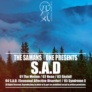

S.A.DThe Genki Project Vol.1
============================

|  |  |
| :--: | :-- |
| [ S.A.DThe Genki Project Vol.1](https://emumo.xiami.com/album/2100293856) | **艺人**: [王利夫](../index.md) **语种**: 其他 **唱片公司**: 独立发行 **发行时间**: 2016年03月15日 **专辑类别**: 录音室专辑 **专辑风格**: 嘻哈 Hip-Hop, 后摇 Post-Rock **播放数**: 108060 **收藏数**: 402 **评论数**: 66  |

## 简介

<strong style="font-size: 18px; line-height: 1.5;">「元気计划」The Genki Project Vol.1</strong>
 

<strong>S.A.D</strong>

## 曲目

## 评论

|  |  |  |
| :-- | :-- | :-- |
|  [虾米用户](https://emumo.xiami.com/u/407859749)  2020-03-07 10:19 赞(0) 踩(0) | 
老王可以的。
 |
|  [虾米用户](https://emumo.xiami.com/u/43492923) 行到水穷我才开始害怕，夕... 2019-05-09 19:03 赞(0) 踩(0) | 
。
 |
|  [虾米用户](https://emumo.xiami.com/u/13560634) 暂无签名~ 2017-10-22 09:47 赞(0) 踩(0) | 
请问 音质只有HQ吗
 |
|  [虾米用户](https://emumo.xiami.com/u/18432432) 想除了音乐什么也不了解 2017-10-06 17:26 赞(0) 踩(0) | 
ASD
 |
|  [虾米用户](https://emumo.xiami.com/u/7206504) 一天两包中南海 2017-06-05 19:44 赞(0) 踩(0) | 
听萨满也有3年。原谅我今天才来发现！
 |
|  [虾米用户](https://emumo.xiami.com/u/192656341)   2016-08-21 19:41 赞(0) 踩(0) | 
皮肤都听高潮了 
 |
|  [虾米用户](https://emumo.xiami.com/u/31071098)  2016-05-04 00:23 赞(0) 踩(0) | 
坐等live
 |
|  [虾米用户](https://emumo.xiami.com/u/159534826)  2016-05-02 22:56 赞(0) 踩(0) | 
555555555555555555555555555555 555555555555555555555555555555 555555555好听到
 |
|  [虾米用户](https://emumo.xiami.com/u/143274)  2016-05-02 22:47 赞(0) 踩(0) | 
对酒当歌 人生几何
 |
|  [虾米用户](https://emumo.xiami.com/u/22804355)   2016-04-17 12:10 赞(0) 踩(0) | 
这张最喜欢 天啦
 |
|  [虾米用户](https://emumo.xiami.com/u/6654069) mutherfacker... 2016-03-26 01:43 赞(0) 踩(0) | 
awesome
 |
|  [虾米用户](https://emumo.xiami.com/u/38626334) 可能 或许 大概 是个好... 2016-03-18 21:27 赞(1) 踩(0) | 
王老师你真飞
 |
|  [虾米用户](https://emumo.xiami.com/u/78055580) . 2016-03-18 17:20 赞(12) 踩(0) | 
最近生活忙乱的一团糟. 新裤子毫无新意的首发和许巍令人作呕的诗和远方让我有一种砸手机的欲望. 睡醒之后抱着试一试的心态点开了王老师的新专. 虽然我不懂Trip-hop. 但只有你暖的像一束光.
 |
|  [虾米用户](https://emumo.xiami.com/u/10118761)  2016-03-18 16:00 赞(4) 踩(0) | 
终于听到一位中国的制作人做出这么有空间想象感的trip hop乐曲，强烈赞！
 |
|  [虾米用户](https://emumo.xiami.com/u/5973810) 我虽瞑目眉头仍热烫 2016-03-17 23:09 赞(0) 踩(0) | 
请您演绎。请您演绎。请您演绎。
 |
|  [虾米用户](https://emumo.xiami.com/u/5493286) 。 2016-03-17 13:48 赞(0) 踩(0) | 
大大开始做beat了！
 |
|  [虾米用户](https://emumo.xiami.com/u/13931269)  2016-03-17 13:05 赞(0) 踩(0) | 
帅爆了！！！！！！！！！！！！！！
 |
|  [虾米用户](https://emumo.xiami.com/u/722202) 大家人海无名里 2016-03-17 12:47 赞(0) 踩(0) | 
  
 |
|  [虾米用户](https://emumo.xiami.com/u/2605906) 电影原声、后摇、电音、说... 2016-03-17 12:35 赞(0) 踩(0) | 
不管是做采样混录还是单独听，都是很棒的曲子！
 |
|  [虾米用户](https://emumo.xiami.com/u/32116326)  2016-03-17 12:16 赞(0) 踩(0) | 
coooooooool
 |
|  [虾米用户](https://emumo.xiami.com/u/35097468) 屋里起火了，我赶紧抱起孩... 2016-03-17 11:32 赞(0) 踩(0) | 
.，.
 |
|  [虾米用户](https://emumo.xiami.com/u/16244860) 听得越多越苛刻 2016-03-16 23:15 赞(1) 踩(0) | 
后摇咩
 |
|  [虾米用户](https://emumo.xiami.com/u/33032778) 梦是唯一的现实 2016-03-16 22:42 赞(0) 踩(0) | 
⊙o⊙
 |
|  [虾米用户](https://emumo.xiami.com/u/4312902) 听到涛声 2016-03-16 22:31 赞(0) 踩(0) | 
真的棒
 |
|  [虾米用户](https://emumo.xiami.com/u/21418678)  2016-03-16 20:15 赞(0) 踩(0) | 
听起来，感觉像在空中
 |
|  [虾米用户](https://emumo.xiami.com/u/2069608) 尋找志同道合的朋友…… 2016-03-16 16:08 赞(0) 踩(0) | 
很棒
 |
|  [虾米用户](https://emumo.xiami.com/u/33782038) Hello,strang... 2016-03-16 15:13 赞(1) 踩(0) | 
王老师新专！   
 |
|  [虾米用户](https://emumo.xiami.com/u/46366785) 我还没想好要写什么... 2016-03-16 13:29 赞(1) 踩(0) | 
太赞   
 |
|  [虾米用户](https://emumo.xiami.com/u/3601926) 到了独自行走的时候。 2016-03-16 13:05 赞(0) 踩(0) | 
这将会是一种强有力的号召。
 |
|  [虾米用户](https://emumo.xiami.com/u/7524706) 我还没想好要写什么... 2016-03-16 11:42 赞(0) 踩(0) | 
太棒了 
 |
|  [虾米用户](https://emumo.xiami.com/u/1604445) 凡音之起，由人心生也。人... 2016-03-16 11:29 赞(0) 踩(0) | 
太全能了
 |
|  [虾米用户](https://emumo.xiami.com/u/834131) Gone for goo... 2016-03-16 11:07 赞(0) 踩(0) | 
sweet
 |
|  [虾米用户](https://emumo.xiami.com/u/1677112) 我还没想好要写什么... 2016-03-16 10:57 赞(0) 踩(0) | 
良心
 |
|  [虾米用户](https://emumo.xiami.com/u/10006020) 很难 2016-03-16 10:29 赞(0) 踩(0) | 

 |
|  [虾米用户](https://emumo.xiami.com/u/34456354) 何必久睡 自会长眠 2016-03-16 10:08 赞(0) 踩(0) | 
男神！
 |
|  [虾米用户](https://emumo.xiami.com/u/42327462)  2016-03-16 08:36 赞(0) 踩(0) | 
蹭楼留名～   
 |
|  [虾米用户](https://emumo.xiami.com/u/30876025) 暂无签名~ 2016-03-16 01:04 赞(1) 踩(0) | 
第一反应，越来越多样了啊~有意思。第二反应，卧槽居然还是开源的！
 |
|  [虾米用户](https://emumo.xiami.com/u/33687536) 暂无签名~ 2016-03-16 00:59 赞(0) 踩(0) | 
天 老王都开始做rap的beat了 老王真酷！
 |
|  [虾米用户](https://emumo.xiami.com/u/42339537) 微博:善良的墨菲斯托，分... 2016-03-16 00:06 赞(18) 踩(0) | 
元気计划是本人及数位客座producer在此名义下所制作的一系列Hip-hop/Trap/Trip-hop纯器乐曲目之总称。此系列虽是独立的器乐作品，但对rapper无偿开放部分版权，您可以对原作品进行截取、改编或采样并应用到您自己的作品当中。
 |
|  [虾米用户](https://emumo.xiami.com/u/10079475) 有过太多纯粹的快乐 才会... 2016-03-15 23:55 赞(0) 踩(0) | 
(´D`* (´D`*(´D`*)
 |
|  [虾米用户](https://emumo.xiami.com/u/20839708) 灬 2016-03-15 23:33 赞(0) 踩(0) | 
灬灬灬
 |
|  [虾米用户](https://emumo.xiami.com/u/85422794)   2016-03-15 22:44 赞(0) 踩(0) | 
王老师草莓音乐节来吗
 |
|  [虾米用户](https://emumo.xiami.com/u/85422794)   2016-03-15 22:43 赞(0) 踩(0) | 
nice！
 |
|  [虾米用户](https://emumo.xiami.com/u/49392764)  2016-03-15 22:41 赞(0) 踩(0) | 
留名
 |
|  [虾米用户](https://emumo.xiami.com/u/5161648) 没错我就是很聪明什么也没... 2016-03-15 22:40 赞(0) 踩(0) | 
留名 
 |
|  [虾米用户](https://emumo.xiami.com/u/8812672) be but 2016-03-15 22:38 赞(0) 踩(0) | 
哇
 |
|  [虾米用户](https://emumo.xiami.com/u/11477264)   2016-03-15 22:36 赞(1) 踩(0) | 
“对rapper无偿开放部分版权”，王老师太酷了！
 |
|  [虾米用户](https://emumo.xiami.com/u/39001340) 这家伙很懒 2016-03-15 22:16 赞(0) 踩(0) | 
新砖!火钳
 |
|  [虾米用户](https://emumo.xiami.com/u/16671108)  2016-03-15 22:12 赞(0) 踩(0) | 
！！先留名再听
 |
|  [虾米用户](https://emumo.xiami.com/u/43386535) 我有条污浊的河 2016-03-15 22:11 赞(0) 踩(0) | 

 |
|  [虾米用户](https://emumo.xiami.com/u/35815985) skmt♡ 2016-03-15 22:03 赞(1) 踩(0) | 
我爱王老师！！！！！！٩(๑òωó๑)۶
 |
|  [虾米用户](https://emumo.xiami.com/u/47456900) 我还没想好要写什么... 2016-03-15 21:53 赞(0) 踩(0) | 
火钳刘明！
 |
|  [虾米用户](https://emumo.xiami.com/u/50696402) 山水有清音。 2016-03-15 21:50 赞(0) 踩(0) | 
哇！！！！前排留名儿
 |
|  [虾米用户](https://emumo.xiami.com/u/39861541) 音乐是世界上最美的语言 2016-03-15 21:50 赞(0) 踩(0) | 
留名！ 
 |
|  [虾米用户](https://emumo.xiami.com/u/16810881) 你在我混浊的生命里营造过... 2016-03-15 21:44 赞(0) 踩(0) | 
哟吼～
 |
|  [虾米用户](https://emumo.xiami.com/u/39239522) 热乎乎 2016-03-15 21:43 赞(0) 踩(0) | 
好听！
 |
|  [虾米用户](https://emumo.xiami.com/u/7187271) Invoke(this)... 2016-03-15 21:43 赞(0) 踩(0) | 
Trip-hop！
 |
|  [虾米用户](https://emumo.xiami.com/u/5032986) Private 2016-03-15 21:42 赞(5) 踩(0) | 
哼！
 |
|  [虾米用户](https://emumo.xiami.com/u/32362730) 5はいいぞ~~ 2016-03-15 21:39 赞(0) 踩(0) | 
ȏ.̮ȏ
 |
|  [虾米用户](https://emumo.xiami.com/u/37083761)   2016-03-15 21:39 赞(0) 踩(0) | 
！
 |
|  [虾米用户](https://emumo.xiami.com/u/21065034) 我还没想好要写什么... 2016-03-15 21:35 赞(0) 踩(0) | 
板凳～么么哒！
 |
|  [虾米用户](https://emumo.xiami.com/u/8135538)  2016-03-15 21:33 赞(0) 踩(0) | 
啧啧
 |
|  [虾米用户](https://emumo.xiami.com/u/5967031) 我想好要写什么... 2016-03-15 21:32 赞(0) 踩(0) | 
第一
 |
