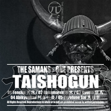

Taishogun 大將軍The Genki Project Vol.3
============================

|  |  |
| :--: | :-- |
| [ Taishogun 大將軍The Genki Project Vol.3](https://emumo.xiami.com/album/2102419599) | **艺人**: [王利夫](../index.md) **语种**: 英语 **唱片公司**:  **发行时间**: 2016年10月27日 **专辑类别**: 录音室专辑 **专辑风格**: 大节拍 Big Beat, 鼓打贝斯 Drum & Bass **播放数**: 60191 **收藏数**: 284 **评论数**: 42  |

## 简介

 
 

 
 

01 Tenchu 天誅
 

 
 

02 Bakumatsu 幕末
 

 
 

03 Ryoma 龍馬
 

 
 

04 Abikyoukan 阿鼻叫喚
 

 
 

05 Kurofune sai 黒船祭
 

 
 

 
 

版权所有©  
  

 

 
 

 

## 曲目

## 评论

|  |  |  |  |
| :-- | :-- | :-- | :-- |
|  [虾米用户](https://emumo.xiami.com/u/43492923) 行到水穷我才开始害怕，夕... 2019-05-09 19:03 赞(0) 踩(0) | 
。
 |
|  [虾米用户](https://emumo.xiami.com/u/407828391) 呀！ 2019-01-06 19:36 赞(0) 踩(0) | 
光荣需要你 
 |
|  [虾米用户](https://emumo.xiami.com/u/27766706) last days of... 2018-04-24 12:48 赞(0) 踩(0) | 
nice bigbeat
 |
|  [虾米用户](https://emumo.xiami.com/u/43492923) 行到水穷我才开始害怕，夕... 2018-02-06 07:18 赞(0) 踩(0) | 
嗯哼
 |
|  [虾米用户](https://emumo.xiami.com/u/4406065) （闷树） 2017-10-12 18:53 赞(2) 踩(0) | 
国产神作。
 |
|  [虾米用户](https://emumo.xiami.com/u/7343217)   2017-07-03 13:50 赞(3) 踩(0) | 
最近听过最好听的Drum &amp;amp; Bass
 |
|  [虾米用户](https://emumo.xiami.com/u/13063907) 嗷 2017-04-29 12:33 赞(0) 踩(0) | 
总有种在玩如龙的感觉??)
 |
|  [虾米用户](https://emumo.xiami.com/u/45926009)  2016-12-16 16:16 赞(0) 踩(0) | 
游戏音乐
 |
|  [虾米用户](https://emumo.xiami.com/u/13603829) 喜欢就行 2016-11-11 18:31 赞(0) 踩(0) | 
嗷嗷嗷
 |
|  [虾米用户](https://emumo.xiami.com/u/7014158)  2016-11-09 23:22 赞(0) 踩(0) | 
还是厉害了！
 |
|  [虾米用户](https://emumo.xiami.com/u/534922) 愚蠢的人类 2016-11-09 15:59 赞(0) 踩(0) | 
嗷
 |
|  [虾米用户](https://emumo.xiami.com/u/45752336) AKA SulfirE 2016-11-09 13:51 赞(0) 踩(0) | 
.
 |
|  [虾米用户](https://emumo.xiami.com/u/7703827) 在生活之外。 2016-11-08 16:42 赞(5) 踩(0) | 
老王的音乐没的说，高达屹立于大地，老王不败于时间，时间带给老王的更多是积淀和内涵，从而让老王的音乐在这样滥造选秀的大环境下更具有生命力和人性色彩。
 |
|  [虾米用户](https://emumo.xiami.com/u/7703827) 在生活之外。 2016-11-08 16:31 赞(0) 踩(0) | 
大超特来给老王顶一发！
 |
|  [虾米用户](https://emumo.xiami.com/u/10079475) 有过太多纯粹的快乐 才会... 2016-11-08 14:04 赞(1) 踩(0) | 
和信长协奏曲那张ost里的几首精品曲子难分伯仲
 |
|  [虾米用户](https://emumo.xiami.com/u/10079475) 有过太多纯粹的快乐 才会... 2016-11-08 13:31 赞(1) 踩(0) | 
很多时候不下无损的原因是………太大了_(:з」∠)_
 |
|  [虾米用户](https://emumo.xiami.com/u/30522360)   2016-11-08 12:39 赞(0) 踩(0) | 

 |
|  [虾米用户](https://emumo.xiami.com/u/13080214) fly me to …… 2016-11-07 11:34 赞(1) 踩(0) | 
收到豆油才知道老王又做新东西了，听着呢~~
 |
|  [虾米用户](https://emumo.xiami.com/u/3689158) 待解救 2016-11-02 22:37 赞(0) 踩(0) | 
老王屌炸天了
 |
|  [虾米用户](https://emumo.xiami.com/u/5493286) 。 2016-11-02 21:43 赞(0) 踩(0) | 
hhh 我爱老王
 |
|  [虾米用户](https://emumo.xiami.com/u/3468208)   2016-10-31 15:18 赞(0) 踩(0) | 
老王我来支援你了！！！
 |
|  [虾米用户](https://emumo.xiami.com/u/12069393)  2016-10-29 17:14 赞(0) 踩(0) | 
黑船祭
 |
|  [虾米用户](https://emumo.xiami.com/u/222344863)  2016-10-29 15:15 赞(0) 踩(0) | 
新发的!
 |
|  [虾米用户](https://emumo.xiami.com/u/40740538) 持续的阴霾让我忽起忽落。 2016-10-29 01:59 赞(0) 踩(0) | 
感谢老王微博分享
 |
|  [虾米用户](https://emumo.xiami.com/u/1125672) 你二大爷的。 2016-10-28 13:48 赞(0) 踩(0) | 
幕末浪漫，战国无双。
 |
|  [虾米用户](https://emumo.xiami.com/u/155947) 一期一会 2016-10-28 13:45 赞(0) 踩(0) | 
收到豆油，发来贺电
 |
|  [虾米用户](https://emumo.xiami.com/u/22133782)  2016-10-28 06:29 赞(1) 踩(0) | 
做什么音乐都爱
 |
|  [虾米用户](https://emumo.xiami.com/u/102942790) 脆弱 2016-10-27 22:19 赞(0) 踩(0) | 
陷入萨满与利夫不可自拔
 |
|  [虾米用户](https://emumo.xiami.com/u/28853980) Life is toug... 2016-10-27 22:13 赞(0) 踩(0) | 
可以的❤
 |
|  [虾米用户](https://emumo.xiami.com/u/50120744)   2016-10-27 20:28 赞(0) 踩(0) | 
老王老王我爱你，就像老鼠爱大米。。嘻嘻嘻嘻嘻嘻嘻嘻嘻嘻
 |
|  [虾米用户](https://emumo.xiami.com/u/38861141) 别怕，我是来救你们的 2016-10-27 20:25 赞(0) 踩(0) | 

 |
|  [虾米用户](https://emumo.xiami.com/u/35815985) skmt♡ 2016-10-27 20:24 赞(0) 踩(0) | 
先买了！有wifi再听www王老师真高产2333
 |
|  [虾米用户](https://emumo.xiami.com/u/84818572)   2016-10-27 20:14 赞(0) 踩(0) | 
先买了，慢慢听 
 |
|  [虾米用户](https://emumo.xiami.com/u/21423864)   2016-10-27 20:06 赞(1) 踩(0) | 
你们走开 王老师是我的 
 |
|  [虾米用户](https://emumo.xiami.com/u/228345700) 美漫译者，车迷，影迷，英... 2016-10-27 19:55 赞(11) 踩(0) | 
这次少了三味线，但是整体完成度却比Hagakure更高。闭上眼睛听，会感觉自己变成了本多忠胜站在荒原上瞎B砍。
 |
| ⇒ |  [虾米用户](https://emumo.xiami.com/u/30930520)  2017-01-19 18:19 赞(0) 踩(0) | 
哈哈，要不要再配个武田信玄跟你对着瞎B抡。
 |
|  [虾米用户](https://emumo.xiami.com/u/184276207) . 2016-10-27 19:52 赞(4) 踩(0) | 
我喜欢老王 老王喜欢做音乐 我喜欢老王做的音乐@王利夫野萨满
 |
|  [虾米用户](https://emumo.xiami.com/u/212488866) metalhead 2016-10-27 19:50 赞(0) 踩(0) | 
.
 |
|  [虾米用户](https://emumo.xiami.com/u/42721382)  2016-10-27 19:48 赞(1) 踩(0) | 
支持萨满和老王，先买为敬～
 |
|  [虾米用户](https://emumo.xiami.com/u/12258961) 暂无签名~ 2016-10-27 19:42 赞(1) 踩(0) | 
前
 |
|  [虾米用户](https://emumo.xiami.com/u/46366785) 我还没想好要写什么... 2016-10-27 19:29 赞(1) 踩(0) | 
支持王老师 
 |
|  [虾米用户](https://emumo.xiami.com/u/81479484)   2016-10-27 18:29 赞(1) 踩(0) | 
鉴赏中，先买了再说
 |
