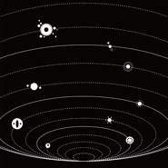

朝闻道 Die Enlightened (2016 Remaster)2015第十七届上海国际艺术节多媒体剧场《朝闻道》原声音乐
============================

|  |  |
| :--: | :-- |
| [ 朝闻道 Die Enlightened (2016 Remaster)2015第十七届上海国际艺术节多媒体剧场《朝闻道》原声音乐](https://emumo.xiami.com/album/2102659348) | **艺人**: [王利夫](../index.md) **语种**: 国语 **唱片公司**: 独立发行 **发行时间**: 2015年10月16日 **专辑类别**: 现场专辑 **专辑风格**:  **播放数**: 32759 **收藏数**: 145 **评论数**: 7  |

## 简介

 
 

<strong>马俊丰导演作品，2015第十七届上海国际艺术节多媒体剧场《朝闻道》原声部分重制版</strong>
 

 
 

导演：马俊丰
 

<em>Directed by Junfeng Ma</em>
 

作曲&amp;声音设计：王利夫
 

<em>Composing &amp; Sound Design by Lifu Wang</em>
 

编剧：马俊丰、崔妤、应照宜
 

<em>Screenwriting by Junfeng Ma, Yu Cui, Zhaoyi Ying</em>
 

交互设计：程欣
 

<em>Interaction Design by Xin Cheng</em>
 

导演助理：王楚雯、高爽
 

<em>Director Assistant: Chuwen Wang, Shuang Gao</em>
 

平面设计：孟洋洋
 

<em>Graphic Design by Yangyang Meng</em>
 

---------
 

<strong>Session Crew：</strong>
 

程序&amp;采样：赵晨楚
 

<em>Program &amp; Sampling by Liia Zhao</em>
 

合成器&amp;键盘：王利夫
 

<em>Synth &amp; Keyboards by Lifu Wang</em>
 

吉他：申达
 

<em>Guitar by Da Shen</em>
 

吉他&amp;贝司：高涵
 

<em>Guitar &amp; Bass by Han Gao</em>
 

 
 

<strong>风格：</strong>
 

环境音乐/器乐摇滚
 

<em>Ambient/Instrumental-Rock</em>
 

 
 

<strong>版权归属：中国上海国际艺术节组委会&amp;扶持青年艺术家计划</strong>
 

 
 

 
 

 

## 曲目

## 评论

|  |  |  |  |
| :-- | :-- | :-- | :-- |
|  [虾米用户](https://emumo.xiami.com/u/13842060) 音乐与文字 2019-06-28 19:02 赞(0) 踩(0) | 
20190628 19:01 长春 长新街坐在车里，合着窗外雨滴落下的声音完美契合我的目标在哪里宇宙的目的是什么是啊，谁知道呢
 |
|  [虾米用户](https://emumo.xiami.com/u/43492923) 行到水穷我才开始害怕，夕... 2019-05-09 19:02 赞(0) 踩(0) | 
▽
 |
|  [虾米用户](https://emumo.xiami.com/u/198266248) （，，） 2017-08-03 16:03 赞(1) 踩(0) | 
封面有错觉
 |
|  [虾米用户](https://emumo.xiami.com/u/32558701) bo ku wa～虛菩提... 2017-03-24 21:00 赞(0) 踩(0) | 
夕死可矣
 |
|  [虾米用户](https://emumo.xiami.com/u/6269068)  2017-03-20 14:23 赞(1) 踩(0) | 
原来有上传！
 |
|  [虾米用户](https://emumo.xiami.com/u/16244860) 听得越多越苛刻 2016-12-05 17:44 赞(0) 踩(0) | 
遥想去年下了飞机，赶着
 |
