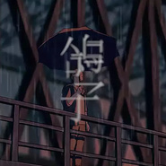

鸽子 原声音乐
============================

|  |  |
| :--: | :-- |
| [ 鸽子 原声音乐](https://emumo.xiami.com/album/2102871506) | **艺人**: [王利夫](../index.md) **语种**: 纯音乐 **唱片公司**: 独立发行 **发行时间**: 2017年10月13日 **专辑类别**: 原声带, 影视音乐 **专辑风格**: 原声 Soundtrack, 卡通配乐 Cartoon Music **播放数**: 25926 **收藏数**: 81 **评论数**: 18  |

## 简介

 
 

<strong>第六届中国独立动画论坛金敏奖获奖作品/2017TIAF台中国际动画影展/官渡国际动画电影节入围动画短片《鸽子》 原声音乐</strong>
 

 
 

导演：商田园 张家诚
 

音乐：王利夫
 

声音设计：张家诚 商田园
 

键盘/吉他/合成器/MIDI：王利夫
 

录音：刘子超@MusicCenter现代音乐中心
 

 
 

 

## 曲目

## 评论

|  |  |  |  |
| :-- | :-- | :-- | :-- |
|  [虾米用户](https://emumo.xiami.com/u/746612)  2020-08-18 00:33 赞(0) 踩(0) | 
动画地址：<a href="https://www.sohu.com/a/204139562_482993" target="_blank" rel="nofollow noreferrer noopener">https://www.sohu.com/a/204139562_482993</a>
 |
|  [虾米用户](https://emumo.xiami.com/u/43492923) 行到水穷我才开始害怕，夕... 2019-05-09 19:04 赞(0) 踩(0) | 
-
 |
|  [虾米用户](https://emumo.xiami.com/u/423106301)  2019-04-19 12:59 赞(0) 踩(0) | 
紧张时听这个，很放松。
 |
|  [虾米用户](https://emumo.xiami.com/u/3736991) 别反抗，笑笑 2019-01-17 13:41 赞(0) 踩(0) | 
能文能武的音乐人
 |
|  [虾米用户](https://emumo.xiami.com/u/400661196) 已经是很长很好的一生 2018-08-15 18:30 赞(0) 踩(0) | 
真的太有才了 
 |
|  [虾米用户](https://emumo.xiami.com/u/9631533)   2017-12-24 16:47 赞(0) 踩(0) | 
 
 |
|  [虾米用户](https://emumo.xiami.com/u/78522298) 私の啓蒙残死 2017-10-28 09:34 赞(3) 踩(0) | 
音乐奇才80后的骄子  
 |
|  [虾米用户](https://emumo.xiami.com/u/44361726) He was liyin... 2017-10-14 15:07 赞(3) 踩(0) | 
动画短片《鸽子》：av10581318
 |
|  [虾米用户](https://emumo.xiami.com/u/45830411) 我还没想好要写什么... 2017-10-14 10:08 赞(0) 踩(0) | 

 |
|  [虾米用户](https://emumo.xiami.com/u/72052732)   2017-10-14 01:46 赞(3) 踩(0) | 
给王老师打call
 |
|  [虾米用户](https://emumo.xiami.com/u/124999710) 电子音乐人 2017-10-12 23:27 赞(0) 踩(0) | 
留
 |
|  [虾米用户](https://emumo.xiami.com/u/5851736) 我们来聊章北海！ 2017-10-12 21:24 赞(0) 踩(0) | 
post!
 |
|  [虾米用户](https://emumo.xiami.com/u/13927598) Metal 2017-10-12 20:45 赞(1) 踩(0) | 
老王我来啦~
 |
|  [虾米用户](https://emumo.xiami.com/u/46366785) 我还没想好要写什么... 2017-10-12 19:33 赞(0) 踩(0) | 

 |
|  [虾米用户](https://emumo.xiami.com/u/31531934) 恋の道に近道はない 2017-10-12 19:32 赞(1) 踩(0) | 

 |
|  [虾米用户](https://emumo.xiami.com/u/4859103) 忘了 2017-10-12 19:29 赞(0) 踩(0) | 
好听
 |
|  [虾米用户](https://emumo.xiami.com/u/32125734) weibo：白菜y少女  2017-10-12 19:28 赞(1) 踩(0) | 
~
 |
