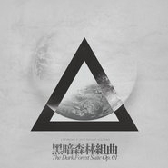

黑暗森林组曲The Dark Forest Suite Op. 01
============================

|  |  |
| :--: | :-- |
| [ 黑暗森林组曲The Dark Forest Suite Op. 01](https://emumo.xiami.com/album/2103545691) | **艺人**: [王利夫](../index.md) **语种**: 国语 **唱片公司**: 独立发行 **发行时间**: 2018年02月23日 **专辑类别**: 原声带, 影视音乐 **专辑风格**: 原声 Soundtrack, 黑暗氛围 Dark Ambient **播放数**: 288172 **收藏数**: 1490 **评论数**: 104  |

## 简介

---------虾米独家首发---------
 

<strong>新年快乐。</strong>
 

<strong>2016冬-2018春重读三体随想笔记，与同名电影不相关。</strong>
 

 
 

<strong>这次的风格延续了《隔空现场》的ambient/drone并再一次进行了“音乐音响化”的尝试。orchestration的部分并非主要内容，但结尾剪辑了一首“太长不听版”作为title，供偏爱简单粗暴风格的朋友听个热闹。创作过程采用图形记谱（Graphic Score），乐谱待整理后奉上。</strong>
 
  

Composed, multi-instruments, sound design and engineering by 王利夫
 

 
 

Recording by 刘子超@MusicCenter现代音乐
 

<strong>  
</strong>
 

鸣谢：
 

平面设计师@遥远的火山、太空堡垒张小北&amp;田明、张思阳、赵颖老师、八光分文化戴浩然、赛凡科幻空间孙悦、《后浪漫》德宗浩、作家傅强、萨满乐队和朋友们。
 

<strong>  
</strong>
 

致敬大刘
 

 
 

<em>消灭人类暴政，世界属于三体</em>
 

 
 

 
 

<strong>  
</strong>
 

<strong>  
</strong>

## 曲目

## 评论

|  |  |  |
| :-- | :-- | :-- |
|  [虾米用户](https://emumo.xiami.com/u/38541500) 乐 喜时入耳 哀时入心。 2020-12-17 16:28 赞(0) 踩(0) | 
收藏有两年了 每当打开一次 都有新鲜的感觉 这种感觉很奇妙 你感受一下
 |
|  [虾米用户](https://emumo.xiami.com/u/174945068) 物来顺应 当时不杂   ... 2020-10-10 21:08 赞(0) 踩(0) | 
黑！真tmd黑！
 |
|  [虾米用户](https://emumo.xiami.com/u/17726411)  2020-08-13 21:41 赞(0) 踩(0) | 
我看三体只觉的太搞笑了！
 |
| ⇒ |  [虾米用户](https://emumo.xiami.com/u/17726411)  2020-08-13 21:42 赞(0) 踩(0) | 
尤其什么质子展开那点，笑喷了
 |
|  [虾米用户](https://emumo.xiami.com/u/42739476)  2020-06-21 16:47 赞(0) 踩(0) | 
惊艳！
 |
|  [虾米用户](https://emumo.xiami.com/u/375746871)  2020-05-17 11:25 赞(0) 踩(0) | 
我只想听你的音乐，谢谢，只有你的音乐让我的灵魂呼吸
 |
|  [虾米用户](https://emumo.xiami.com/u/352485392)  2020-04-03 19:20 赞(1) 踩(0) | 
不通读几遍三体真听不懂。。。。。
 |
|  [虾米用户](https://emumo.xiami.com/u/66823378)  2019-11-25 22:25 赞(0) 踩(0) | 

 |
|  [虾米用户](https://emumo.xiami.com/u/359391614)  2019-08-02 23:01 赞(0) 踩(0) | 
好，老王很赞
 |
|  [虾米用户](https://emumo.xiami.com/u/347308573)  2019-08-02 15:56 赞(1) 踩(0) | 
具有场面感
 |
|  [虾米用户](https://emumo.xiami.com/u/340094565)  2019-06-02 20:29 赞(2) 踩(0) | 
空灵深邃唯美
 |
|  [虾米用户](https://emumo.xiami.com/u/29279049) 我们的征途是星辰大海 2019-06-01 17:27 赞(2) 踩(0) | 
很喜欢这个专辑。北海也不错
 |
|  [虾米用户](https://emumo.xiami.com/u/43492923) 行到水穷我才开始害怕，夕... 2019-05-09 19:05 赞(0) 踩(0) | 
-
 |
|  [虾米用户](https://emumo.xiami.com/u/346165752)  2019-05-06 12:10 赞(0) 踩(0) | 

 |
|  [虾米用户](https://emumo.xiami.com/u/285122604) 一个啥歌都听的逗逼 2019-04-27 19:35 赞(0) 踩(0) | 
会出实体唱片吗？35买电子版有点小贵 
 |
|  [虾米用户](https://emumo.xiami.com/u/144634866) Same old sam... 2019-04-08 00:07 赞(0) 踩(0) | 
现在想配着这张专辑再重读一遍三体
 |
|  [虾米用户](https://emumo.xiami.com/u/144634866) Same old sam... 2019-04-08 00:04 赞(0) 踩(0) | 
T T 感人至深，让我重温了三体带给我的那种震撼. 当时是听着loner这个游戏的soundtrack看的书，也很符合三体的气质
 |
|  [虾米用户](https://emumo.xiami.com/u/380136099)  2019-04-05 09:28 赞(0) 踩(0) | 
深邃
 |
|  [虾米用户](https://emumo.xiami.com/u/377038394) 孤独者的世界 2019-03-16 12:55 赞(0) 踩(0) | 
好听
 |
|  [虾米用户](https://emumo.xiami.com/u/343319956)  2019-02-17 08:17 赞(0) 踩(0) | 
深沉，大气蓬勃，符合原书的气质
 |
|  [虾米用户](https://emumo.xiami.com/u/357148798)  2019-02-01 22:16 赞(1) 踩(0) | 
为什么没有大低谷
 |
|  [虾米用户](https://emumo.xiami.com/u/48964462)  2018-12-10 17:12 赞(1) 踩(0) | 
op1，难道还有op2？！
 |
|  [虾米用户](https://emumo.xiami.com/u/344428496)  2018-09-23 15:37 赞(0) 踩(0) | 
真TM牛 
 |
|  [虾米用户](https://emumo.xiami.com/u/516791) 假酒喝多了 2018-09-16 22:15 赞(0) 踩(0) | 

 |
|  [虾米用户](https://emumo.xiami.com/u/303243403) 怎么能越长大越卑微 2018-08-13 23:04 赞(0) 踩(0) | 
钢印没有我想象的那种无奈和束缚的窒息感  破壁人倒给我一种面壁的感觉了 醉醉 是我看书没看明白么
 |
|  [虾米用户](https://emumo.xiami.com/u/247229852)  2018-07-28 21:26 赞(1) 踩(0) | 
这张专辑比以前的有很大飞跃
 |
|  [虾米用户](https://emumo.xiami.com/u/55054741) 决不投降 2018-04-12 00:12 赞(4) 踩(0) | 
也许是我接触三体的年龄太早（小学毕业那个暑假读的），黑暗森林在我脑海里就像个没有深浅的洞，越想看清反而越发让人害怕，也许我理解的黑暗森林更加光明......
 |
| ⇒ |  [虾米用户](https://emumo.xiami.com/u/37697328) 意识流的呓语 2018-05-11 22:40 赞(0) 踩(0) | 
同小学毕业读的
 |
| ⇒ |  [虾米用户](https://emumo.xiami.com/u/266109449) Dark side  2018-06-15 21:48 赞(0) 踩(0) | 
早吗？我小学五年级看的，黑暗森林嘛，不是一个洞，而是一栋房子，在外面看房子，又可以看见全局，可又不能理解，在房子里面的人，则和外面相反。黑暗森林并不黑暗，只是当局者迷，旁观者清&amp;hellip;我现在才五年级&amp;hellip;呵&amp;hellip;
 |
| ⇒ |  [虾米用户](https://emumo.xiami.com/u/55054741) 决不投降 2018-09-02 23:30 赞(0) 踩(0) | 
<q><b>Have I not seen the sun..说：</b></q>
 |
|  [虾米用户](https://emumo.xiami.com/u/43492923) 行到水穷我才开始害怕，夕... 2018-04-05 21:08 赞(0) 踩(0) | 
▼
 |
|  [虾米用户](https://emumo.xiami.com/u/50100408) 且行且歌 2018-03-30 20:17 赞(3) 踩(0) | 
仿佛回到了当年看小说时的快感 
 |
|  [虾米用户](https://emumo.xiami.com/u/3618050) 我还没想好要写什么... 2018-03-19 16:55 赞(8) 踩(0) | 
fabulous！ 面对伟大的作品，任何语言都是苍白。
 |
|  [虾米用户](https://emumo.xiami.com/u/272296438)  2018-03-19 16:47 赞(17) 踩(0) | 
大刘和小王是绝配呀，哈哈
 |
| ⇒ |  [虾米用户](https://emumo.xiami.com/u/251272636)  2018-11-02 21:00 赞(0) 踩(0) | 
老王 
 |
|  [虾米用户](https://emumo.xiami.com/u/1383972) 世事如歌，而我偏爱这一首 2018-03-11 13:56 赞(3) 踩(0) | 
活久见系列，虽然已经循环好几遍了，但还没有一首首的认真听。无比羡慕，崇拜王大大，拥有表达的能力和欲望真是一件幸福的事！
 |
|  [虾米用户](https://emumo.xiami.com/u/8631728)  2018-03-10 11:24 赞(1) 踩(0) | 
在日出前毁灭
 |
|  [虾米用户](https://emumo.xiami.com/u/27678844)  2018-03-10 00:58 赞(6) 踩(0) | 
刚刚刷完北海，抬头一看？特么的，居然还有黑森？还居然是2月份刚出的？再定睛一看，居然有老王在昨天回复了网友那么长的一大串有关&amp;ldquo;大面积的铺盖&amp;rdquo;？我还能说什么，当然是选择原谅老王啦！╮(╯▽╰)╭
 |
|  [虾米用户](https://emumo.xiami.com/u/6064450)   2018-03-05 01:29 赞(11) 踩(0) | 
不知道是我们之中哪一方变得浮躁急躁了点，买了之后反而听的不多，倒是回去反复的听三体ost。感觉相比之下，可能为了场景营造，大面积的铺盖增多，整张砖的叙事性和起承转合不及三体ost。但肯定是高质量上乘的配乐砖，王老师威武！说这么多吹毛求疵的东西，可能是因为太喜欢了，但愿没有人掐我...
 |
| ⇒ |  [虾米用户](https://emumo.xiami.com/u/16365190) 混蛋的另一种 2018-03-09 21:42 赞(0) 踩(0) | 
新年快乐。谢谢中肯的意见，为你点赞。音乐语言三分共通七分私密，请原谅我没办法同时在间隔六七年的两张专辑里照顾到大家的听觉习惯，借用郭德纲的话那不科学。作为一名创作者我唯一需要达成的目的，是用一副音景来重现此刻我且只有我自己心目中三体世界的样子。&amp;ldquo;起承转合&amp;rdquo;和&amp;ldquo;场景营造&amp;rdquo;，其实都在你说的&amp;ldquo;大面积的铺盖&amp;rdquo;里，或者说&amp;ldquo;大面积铺盖&amp;rdquo;才是这张砖的本体，管弦的部分倒更像是&amp;ldquo;听觉友好&amp;rdquo;的功能性陪衬，因为与前者相比，它实现起来难度更小。不轻动宫商却在波澜不惊的表面下隐藏大量细节的ambient，是我音乐修为的下一个方向，它与之前偏小品化的&amp;ldquo;三体OST&amp;rdquo;并不朝向同一个地方，却是我全部兴致所在。或许有天我的作品会越发让人觉得不知所云，但我保证此时彼时的表达同样真诚。那时候肯讲一句&amp;ldquo;我听懂了&amp;rdquo;的素未谋面的路人甲，和今天所有将注意力集中在&amp;ldquo;大面积铺盖&amp;rdquo;的路人乙一样，都将是我创作生涯中心照神交惟我与子的知音。再次感谢，namaste~~！
 |
| ⇒ |  [虾米用户](https://emumo.xiami.com/u/423106301)  2019-04-10 22:26 赞(0) 踩(0) | 
<q><b>王利夫说：</b></q>
 |
|  [虾米用户](https://emumo.xiami.com/u/20177386) 感谢一切美好的遇见❤️ 2018-03-04 17:46 赞(0) 踩(0) | 

 |
|  [虾米用户](https://emumo.xiami.com/u/116859382)  2018-03-02 23:19 赞(12) 踩(0) | 
王利夫老师是天才了
 |
|  [虾米用户](https://emumo.xiami.com/u/40853557)  2018-03-02 15:16 赞(1) 踩(0) | 
blade runner 2049第二部？
 |
|  [虾米用户](https://emumo.xiami.com/u/2943953)  2018-03-01 23:55 赞(15) 踩(0) | 
终极的数学也好，物理也好，化学也好。他们都离不开哲学。哲学是认识一切事物的基础。万事万物都离不开哲学 
 |
| ⇒ |  [虾米用户](https://emumo.xiami.com/u/2264733)  2018-03-11 15:12 赞(0) 踩(0) | 
哲学之所以是终极基础因为它是超验的...验了后就不再是哲学..三体这书中哲学最后塌缩成了科学
 |
| ⇒ |  [虾米用户](https://emumo.xiami.com/u/2943953)  2018-03-12 20:03 赞(0) 踩(0) | 
<q><b>说：</b></q>
 |
|  [虾米用户](https://emumo.xiami.com/u/10266843) 我还没想好要写什么... 2018-02-28 19:50 赞(22) 踩(0) | 
听《黑》时回忆着文中三次低吟出的那句：&amp;ldquo;黑，真TM黑&amp;rdquo;。编曲有史诗和宗教的风韵，历史的厚重，星空的深邃，皆能感受到。
 |
|  [虾米用户](https://emumo.xiami.com/u/246558212)   2018-02-28 12:00 赞(1) 踩(0) | 
这么少人，是因为他们过年没来逛三体啊 
 |
|  [虾米用户](https://emumo.xiami.com/u/267699955)  2018-02-27 19:50 赞(14) 踩(0) | 
惊艳国人的绝佳之作，顶级大师水准。
 |
|  [虾米用户](https://emumo.xiami.com/u/50137068) 我们摒弃填满半生的沉默，... 2018-02-26 12:39 赞(2) 踩(0) | 
给岁月以文明，最喜欢的一句话。
 |
|  [虾米用户](https://emumo.xiami.com/u/350531555)  2018-02-25 21:39 赞(0) 踩(0) | 
双方的vs的
 |
|  [虾米用户](https://emumo.xiami.com/u/2605906) 电影原声、后摇、电音、说... 2018-02-25 21:25 赞(3) 踩(0) | 
以后我拍三体一定要找王老师配乐！
 |
|  [虾米用户](https://emumo.xiami.com/u/264283064) bye  2018-02-25 11:33 赞(0) 踩(0) | 
△
 |
|  [虾米用户](https://emumo.xiami.com/u/31709801) 还活着，真的是太好了..... 2018-02-25 10:22 赞(0) 踩(0) | 
十分酷！
 |
|  [虾米用户](https://emumo.xiami.com/u/841215) 万人如海一身藏 2018-02-24 22:41 赞(0) 踩(0) | 
编曲越来越成熟了，有个音效略轰头，不过，爽
 |
|  [虾米用户](https://emumo.xiami.com/u/3658219) 恐惧 / 狂喜 2018-02-24 18:16 赞(2) 踩(0) | 
三体&amp;mdash;王利夫 黑暗森林组曲&amp;mdash;刘慈欣 嗯哪里没对？？
 |
|  [虾米用户](https://emumo.xiami.com/u/9025665)  2018-02-24 14:00 赞(0) 踩(0) | 
老王牛！想二刷三体了！
 |
|  [虾米用户](https://emumo.xiami.com/u/1885315) ｜他身来做水仙王｜ 2018-02-24 09:24 赞(1) 踩(0) | 
时隔七年 剑刃锋芒
 |
|  [虾米用户](https://emumo.xiami.com/u/304353894) 扒掉你狗皮。 2018-02-24 03:18 赞(4) 踩(0) | 
越来越期待死神永生组曲了 
 |
| ⇒ |  [虾米用户](https://emumo.xiami.com/u/27678844)  2018-03-10 00:51 赞(0) 踩(0) | 
同期待同期待！！！！
 |
|  [虾米用户](https://emumo.xiami.com/u/1899802) 你好，我是臭听歌儿的 2018-02-24 02:29 赞(1) 踩(0) | 
谢谢雨啸 
 |
|  [虾米用户](https://emumo.xiami.com/u/27678903) 让银疯一会儿 2018-02-23 23:14 赞(39) 踩(0) | 
终极的化学一定是物理，因为它只是原子核外电子的配对与分布，终极的物理一定是数学，因为物理的极限其实都是数学问题，终极的数学是什么？终极的数学描述的是空间规律。三体，个人认为百年内无法超越，至少五十年内人类的物理想像还无法超越，三体可以看作是当前的人类向百年之后的人类发出的问候，这才是我向大刘致敬的原因，如果选一首当前人类的音乐去向百年后的人类发出问候，我觉得只能是三体的音乐
 |
| ⇒ |  [虾米用户](https://emumo.xiami.com/u/405239171)  2019-02-08 03:03 赞(0) 踩(0) | 
终极的科学一定是哲学，终极的哲学是什么呢？也许是无法解释的神学！
 |
| ⇒ |  [虾米用户](https://emumo.xiami.com/u/403094975)  2019-02-08 07:08 赞(0) 踩(0) | 
<q><b>诸神黄昏说：</b></q>
 |
| ⇒ |  [虾米用户](https://emumo.xiami.com/u/405239171)  2019-02-08 22:31 赞(0) 踩(0) | 
<q><b>随遇而安26878828说：</b></q>
 |
| ⇒ |  [虾米用户](https://emumo.xiami.com/u/80762084)  2019-02-12 20:47 赞(0) 踩(0) | 
<q><b>诸神黄昏说：</b></q>
 |
| ⇒ |  [虾米用户](https://emumo.xiami.com/u/405239171)  2019-02-16 00:42 赞(0) 踩(0) | 
<q><b>金蛇狂舞说：</b></q>
 |
|  [虾米用户](https://emumo.xiami.com/u/4400366) 再也不见 2018-02-23 19:56 赞(0) 踩(0) | 
囍
 |
|  [虾米用户](https://emumo.xiami.com/u/35097468) 屋里起火了，我赶紧抱起孩... 2018-02-23 19:50 赞(0) 踩(0) | 
牛逼！支持王哥！ 
 |
|  [虾米用户](https://emumo.xiami.com/u/738508)   2018-02-23 18:05 赞(4) 踩(0) | 
艺术家需要支持，已购入，希望能有更多优秀作品问世！ 
 |
|  [虾米用户](https://emumo.xiami.com/u/9385254) FireBugs 火灾现... 2018-02-23 17:23 赞(6) 踩(0) | 
相比《三体OST》，这张专辑更加注重营造氛围，更加偏向影视配乐的手法，非常喜欢。
 |
|  [虾米用户](https://emumo.xiami.com/u/39493090) 我还没想好要写什么... 2018-02-23 16:24 赞(0) 踩(0) | 

 |
|  [虾米用户](https://emumo.xiami.com/u/196313669) 呵呵 2018-02-23 15:28 赞(1) 踩(0) | 

 |
|  [虾米用户](https://emumo.xiami.com/u/155947) 一期一会 2018-02-23 15:05 赞(0) 踩(0) | 
高度还原，疯狂打call
 |
|  [虾米用户](https://emumo.xiami.com/u/29) 耍中偶得 2018-02-23 14:31 赞(12) 踩(0) | 
佩服王老师，非常三体，非常画面，非常超人类，宏观音乐。
 |
|  [虾米用户](https://emumo.xiami.com/u/10279932) 我是一片连月亮也厌恶的墓... 2018-02-23 14:13 赞(0) 踩(0) | 
来晚了！
 |
|  [虾米用户](https://emumo.xiami.com/u/3556002) wubba lubba 2018-02-23 13:37 赞(0) 踩(0) | 
来晚了
 |
|  [虾米用户](https://emumo.xiami.com/u/45907678) 别了虾米 2018-02-23 12:27 赞(0) 踩(0) | 
这么高产
 |
|  [虾米用户](https://emumo.xiami.com/u/4477103) 完全没有匆忙的必要 2018-02-23 12:17 赞(0) 踩(0) | 

 |
|  [虾米用户](https://emumo.xiami.com/u/7687667)   2018-02-23 12:06 赞(1) 踩(0) | 
来给大王打call
 |
|  [虾米用户](https://emumo.xiami.com/u/43386535) 我有条污浊的河 2018-02-23 11:21 赞(0) 踩(0) | 
天
 |
|  [虾米用户](https://emumo.xiami.com/u/13560634) 暂无签名~ 2018-02-23 10:59 赞(0) 踩(0) | 
啊啊啊啊啊啊啊!
 |
|  [虾米用户](https://emumo.xiami.com/u/31531934) 恋の道に近道はない 2018-02-23 10:57 赞(0) 踩(0) | 
新年的禮讚 
 |
|  [虾米用户](https://emumo.xiami.com/u/285129054) 我还没想好要写什么... 2018-02-23 10:56 赞(1) 踩(0) | 
醒来就看到老王发歌 真幸福
 |
|  [虾米用户](https://emumo.xiami.com/u/29006027) 认真才美丽，执着才帅气。 2018-02-23 10:48 赞(3) 踩(0) | 
清晨起来看到王大大发了两张专辑，先听了预告片那一首，非常地短，意犹未尽地点开了这张专辑，感受得出每首都是花了很多功夫。跟上一张的北海有很大的变化，听到了更多的鼓点和乐器，有些地方听得头皮发麻。  听老王的歌在拖地的时候，像是在皇家大教堂里拖着大理石地板，估计这地我能拖它个一年吧   
 |
|  [虾米用户](https://emumo.xiami.com/u/44385452)  2018-02-23 10:36 赞(0) 踩(0) | 
哇
 |
|  [虾米用户](https://emumo.xiami.com/u/43492923) 行到水穷我才开始害怕，夕... 2018-02-23 10:25 赞(0) 踩(0) | 
嗯哼
 |
|  [虾米用户](https://emumo.xiami.com/u/7380494) 音律者，波动也 2018-02-23 10:13 赞(0) 踩(0) | 
太棒了 刚还在听北海
 |
|  [虾米用户](https://emumo.xiami.com/u/27678903) 让银疯一会儿 2018-02-23 09:54 赞(0) 踩(0) | 
听完这张，再把前二张一起听了遍，明显感觉这张进步太大了，张力饱满远胜前二张
 |
|  [虾米用户](https://emumo.xiami.com/u/330359997)  2018-02-23 09:51 赞(0) 踩(0) | 
hello
 |
|  [虾米用户](https://emumo.xiami.com/u/84329000) 我不怕千万人阻挡  只怕... 2018-02-23 09:46 赞(3) 踩(0) | 
消灭人类暴政 世界属于三体
 |
|  [虾米用户](https://emumo.xiami.com/u/59367130) 天地不仁 以万物为刍狗 2018-02-23 09:33 赞(0) 踩(0) | 
早安 。
 |
|  [虾米用户](https://emumo.xiami.com/u/344296866) 我不想死。死了就不能听音... 2018-02-23 08:58 赞(0) 踩(0) | 
前排
 |
|  [虾米用户](https://emumo.xiami.com/u/10242579) 长亭外，古道边，一行白鹭... 2018-02-23 08:42 赞(0) 踩(0) | 
老王你太棒辣 
 |
|  [虾米用户](https://emumo.xiami.com/u/32558701) bo ku wa～虛菩提... 2018-02-23 08:31 赞(0) 踩(0) | 
前排
 |
|  [虾米用户](https://emumo.xiami.com/u/52962458) 外向孤独患者 2018-02-23 07:40 赞(0) 踩(0) | 
太喜欢了
 |
|  [虾米用户](https://emumo.xiami.com/u/27678903) 让银疯一会儿 2018-02-23 06:58 赞(35) 踩(0) | 
3体，是种信仰。这是年后意外的惊喜
 |
| ⇒ |  [虾米用户](https://emumo.xiami.com/u/267517259) 超级无敌大美女哈哈哈 2018-03-21 15:34 赞(0) 踩(0) | 
 
 |
|  [虾米用户](https://emumo.xiami.com/u/319048) 向死而生 2018-02-23 06:49 赞(0) 踩(0) | 
先买为敬_(:з)&amp;ang;)_
 |
|  [虾米用户](https://emumo.xiami.com/u/47021710)  2018-02-23 06:49 赞(0) 踩(0) | 
新年礼物 
 |
|  [虾米用户](https://emumo.xiami.com/u/4341982)  2018-02-23 06:41 赞(2) 踩(0) | 
潜藏在意识里的影像迅速有了自己的形状，蠢蠢欲动
 |
|  [虾米用户](https://emumo.xiami.com/u/46366785) 我还没想好要写什么... 2018-02-23 06:22 赞(0) 踩(0) | 
支持！
 |
|  [虾米用户](https://emumo.xiami.com/u/83069340)   2018-02-23 06:19 赞(0) 踩(0) | 
先评论再听歌！
 |
