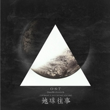

三体OST
============================

|  |  |
| :--: | :-- |
| [ 三体OST](https://emumo.xiami.com/album/372239388) | **艺人**: [王利夫](../index.md) **语种**: 国语 **唱片公司**: 独立发行 **发行时间**: 2011年12月01日 **专辑类别**: 原声带, 影视音乐 **专辑风格**: 太空新世纪 Space New Age, 原声 Soundtrack, 电影原声 Film Score **播放数**: 5765436 **收藏数**: 9920 **评论数**: 733  |

## 简介

列表中多为五年前随手记录的demo，权作读书笔记之用，与《三体》电影无干系（也不想有），亦不代表作者工作态度及实际水平。希望你脑海中的三体与我脑海中的契合。
 

  
编曲/制作/后期：DasWeltreich  
平面设计：遥远的火山 
 

 
 

「鸣谢」  
《科幻世界》杂志社  
豆瓣音乐  
落网 www.luoo.net  
中央人民广播电台文艺之声FM106.6  
「星之所在」科幻书店  
平面设计师@遥远的火山  
星云工坊  
来自三体OST豆瓣小站的朋友们 

## 曲目

## 评论

|  |  |  |  |
| :-- | :-- | :-- | :-- |
|  [虾米用户](https://emumo.xiami.com/u/3225064)  2021-01-10 15:11 赞(0) 踩(0) | 
虾米要关了，这张专辑以后在哪里可以听到？
 |
|  [虾米用户](https://emumo.xiami.com/u/10373162) be happy 2021-01-08 11:18 赞(0) 踩(0) | 
虾米消失了，是不是听不到了
 |
|  [虾米用户](https://emumo.xiami.com/u/328295122) 给岁月以文明，给文明以岁... 2020-10-23 23:49 赞(0) 踩(0) | 
很好，符合原著，喜欢
 |
|  [虾米用户](https://emumo.xiami.com/u/444752973) 这个世界太喧哗，让沉默的... 2020-10-07 23:29 赞(0) 踩(0) | 
三体是最顶级的科幻巨作！！看完书后感觉学到了好多。 
 |
|  [虾米用户](https://emumo.xiami.com/u/353116797) put you hand... 2020-10-03 19:38 赞(0) 踩(0) | 
买这个专辑是计划的一部分
 |
|  [虾米用户](https://emumo.xiami.com/u/307896667)  2020-09-30 21:41 赞(0) 踩(0) | 
绝对的神作
 |
|  [虾米用户](https://emumo.xiami.com/u/443503536) 水瓶一只 2020-09-18 00:29 赞(1) 踩(0) | 
❤️维德
 |
|  [虾米用户](https://emumo.xiami.com/u/441232153) D.W. 2020-08-28 11:20 赞(0) 踩(0) | 
和蠢朋克的TRON专辑是真的象
 |
|  [虾米用户](https://emumo.xiami.com/u/441232153) D.W. 2020-08-28 11:20 赞(0) 踩(0) | 
和蠢朋克的TRON专辑是真的象
 |
|  [虾米用户](https://emumo.xiami.com/u/378109034) 这是系统分配的名字，其实... 2020-07-30 08:48 赞(0) 踩(0) | 
瑰丽的想象力，有技术有新意。
 |
|  [虾米用户](https://emumo.xiami.com/u/42739476)  2020-06-21 16:53 赞(0) 踩(0) | 
惊艳！
 |
|  [虾米用户](https://emumo.xiami.com/u/1004321) 听喜欢的音乐，爱值得爱的... 2020-06-13 15:43 赞(0) 踩(0) | 
编曲优秀的老王是有趣的灵魂。
 |
|  [虾米用户](https://emumo.xiami.com/u/88769390) Raining Bloo... 2020-06-12 20:49 赞(0) 踩(0) | 
淦，我怎么现在才发现
 |
|  [虾米用户](https://emumo.xiami.com/u/15395436)   2020-04-27 21:17 赞(0) 踩(0) | 
听了N遍。不花钱是真的对不起作者。有能力的条件下，认可就应该付费。否则...
 |
|  [虾米用户](https://emumo.xiami.com/u/11534611) 歌单之后再细分 2020-04-14 03:17 赞(0) 踩(0) | 
牛逼 没别的话说了 就真的牛逼
 |
|  [虾米用户](https://emumo.xiami.com/u/441232153) D.W. 2020-04-03 11:05 赞(0) 踩(0) | 
专辑不错
 |
|  [虾米用户](https://emumo.xiami.com/u/177068738) 我还没想好要写什么... 2020-02-22 00:29 赞(0) 踩(0) | 
音乐鬼才
 |
|  [虾米用户](https://emumo.xiami.com/u/4401950)  2020-02-08 03:23 赞(1) 踩(0) | 
看三体小说的时候就是听着这张专看的，真的非常有带入感呐～
 |
|  [虾米用户](https://emumo.xiami.com/u/400715332) 留白 2020-02-07 23:38 赞(3) 踩(0) | 
·
 |
|  [虾米用户](https://emumo.xiami.com/u/43892016)  2020-02-07 19:48 赞(0) 踩(0) | 
有心的人可以齐心做完三体，有几首音乐少点氛围，游泳音乐的感觉太多，最主要是少了民族元素显得苍白，中国灵魂在哪里？这是中国式的科幻电影音乐好吧！不过让我看到了国产音乐崛起不远了，鼓励8分。
 |
|  [虾米用户](https://emumo.xiami.com/u/9258243) PeterPan症候群患... 2020-01-23 15:04 赞(0) 踩(0) | 
哥出实体专辑呗！想买来收藏啊！！！！
 |
|  [虾米用户](https://emumo.xiami.com/u/46366785) 我还没想好要写什么... 2019-12-12 23:59 赞(3) 踩(0) | 
看三体必听的四张专辑《三体ost》《章北海》《黑暗森林》《隔空现场》，这些就是我心中默认的「官方」ost，真的，听其他同人ost都听不进去，老王的ost已经先入为主了。2013年也是偶然听到一首专辑里的《面壁者》才了解到三体，永远忘不了当时那种震撼。
 |
|  [虾米用户](https://emumo.xiami.com/u/25767298) 我还没想好要写什么... 2019-12-11 22:20 赞(1) 踩(0) | 
听得血脉喷张好奇为啥没有罗辑的主题曲
 |
|  [虾米用户](https://emumo.xiami.com/u/360581062)  2019-12-06 09:50 赞(1) 踩(0) | 
喜马拉雅切芒果推荐来的。
 |
|  [虾米用户](https://emumo.xiami.com/u/66823378)  2019-11-25 22:26 赞(1) 踩(0) | 

 |
|  [虾米用户](https://emumo.xiami.com/u/298728249) 八号 2019-11-17 22:36 赞(0) 踩(0) | 
今天是三体pv正式版出的一天，是距离翻开三体一过去了接近四年的时间点，我敲下渺不足道的文字，像虫子用触角轻碰石板以留下气味
 |
|  [虾米用户](https://emumo.xiami.com/u/378139986) 一切好的音乐都是为了拨动... 2019-09-22 21:50 赞(0) 踩(0) | 
‍♂️‍♀️死亡不是你的敌人，永恒才是。——   刘慈欣
 |
| ⇒ |  [虾米用户](https://emumo.xiami.com/u/292002586) 心里宁静的异次元在这里 2020-02-22 13:20 赞(0) 踩(0) | 
大刘已经战胜敌人了，在世界科幻史上留下重重的脚印
 |
|  [虾米用户](https://emumo.xiami.com/u/19668196)  2019-09-22 06:50 赞(0) 踩(0) | 
啥也不说了，老王赛高！
 |
|  [虾米用户](https://emumo.xiami.com/u/7707219) 我想知道如何用爱换取爱，... 2019-08-26 01:06 赞(0) 踩(0) | 
再来打个分～～
 |
|  [虾米用户](https://emumo.xiami.com/u/427004034)  2019-08-20 20:53 赞(1) 踩(0) | 
棒
 |
|  [虾米用户](https://emumo.xiami.com/u/347308573)  2019-08-02 12:42 赞(1) 踩(0) | 
震撼人心
 |
|  [虾米用户](https://emumo.xiami.com/u/16178749) 愿各自安好………………  2019-07-23 05:52 赞(0) 踩(0) | 

 |
|  [虾米用户](https://emumo.xiami.com/u/74211068)   2019-07-10 16:48 赞(0) 踩(0) | 
很棒啊！第一次听还没有完全了解《三体》的内容，只觉得很燃，看完书再听，感触更深！棒！
 |
|  [虾米用户](https://emumo.xiami.com/u/402096149)  2019-07-06 00:01 赞(0) 踩(0) | 
超爱这一张专辑，每次听到都会有心潮澎湃，难以平复内心激动的感觉
 |
|  [虾米用户](https://emumo.xiami.com/u/41345992) 含散持实 2019-06-27 13:56 赞(3) 踩(0) | 
听了五年都没买专辑今天突然的契机想起来了来买了 白嫖太久对不起！音乐实在太棒了
 |
|  [虾米用户](https://emumo.xiami.com/u/340094565)  2019-06-02 18:05 赞(0) 踩(0) | 
神配乐！
 |
|  [虾米用户](https://emumo.xiami.com/u/15477519) 爱  是生命的和弦，而不... 2019-05-29 09:22 赞(14) 踩(0) | 
国人的音乐，惊艳与震撼感并存… 王利夫太牛…
 |
| ⇒ |  [虾米用户](https://emumo.xiami.com/u/236020725) 勿扰…… 2019-12-02 23:05 赞(0) 踩(0) | 
是的   我特别喜欢王老师的音乐……
 |
|  [虾米用户](https://emumo.xiami.com/u/401330458) 一颗心碎过，总会有裂痕 2019-05-24 21:46 赞(0) 踩(0) | 
好听
 |
|  [虾米用户](https://emumo.xiami.com/u/43492923) 行到水穷我才开始害怕，夕... 2019-05-09 19:00 赞(0) 踩(0) | 
-
 |
|  [虾米用户](https://emumo.xiami.com/u/347206092) 我还没想好要写什么... 2019-04-30 20:21 赞(0) 踩(0) | 
完美还原！
 |
|  [虾米用户](https://emumo.xiami.com/u/41851691)   2019-04-27 09:03 赞(2) 踩(0) | 
给水滴写一首吧！
 |
|  [虾米用户](https://emumo.xiami.com/u/253083344)  2019-04-13 11:10 赞(0) 踩(0) | 
很贴合
 |
|  [虾米用户](https://emumo.xiami.com/u/414076941)  2019-03-22 06:26 赞(0) 踩(0) | 
感谢王利夫。
 |
|  [虾米用户](https://emumo.xiami.com/u/334350270) 沉迷音乐 2019-03-19 17:13 赞(0) 踩(0) | 
震撼，无限循环
 |
|  [虾米用户](https://emumo.xiami.com/u/36096284) 少年人生 自创前程。 2019-02-21 02:44 赞(0) 踩(0) | 
真的是画面感比较强，表现力真的棒，同时也很喜欢萨满乐队，这张专辑让我看到了王利夫的另一面，加油。
 |
|  [虾米用户](https://emumo.xiami.com/u/93199374) 哈哈签名真是够了 2019-02-19 21:39 赞(0) 踩(0) | 
新奇
 |
|  [虾米用户](https://emumo.xiami.com/u/345256356)  2019-02-12 21:38 赞(2) 踩(0) | 
王利夫搞什么金属乐队，专心为电影做配乐吧~  中国版汉斯寂寞！
 |
|  [虾米用户](https://emumo.xiami.com/u/8703719)  2019-02-12 00:59 赞(5) 踩(0) | 
大学听的，现在流浪地球爆了，三体什么时候上！！
 |
|  [虾米用户](https://emumo.xiami.com/u/77515248)   2019-02-09 12:08 赞(0) 踩(0) | 
好听！最喜欢联合舰队
 |
|  [虾米用户](https://emumo.xiami.com/u/20971903) 吃了我也填不饱肚子 2019-02-06 09:46 赞(0) 踩(0) | 
大一时听的，现在我已经研究生毕业了。
 |
|  [虾米用户](https://emumo.xiami.com/u/43826769) 哪吒 2019-01-31 13:46 赞(0) 踩(0) | 
吹爆
 |
|  [虾米用户](https://emumo.xiami.com/u/92417692) 我还没想好要写什么... 2019-01-31 04:23 赞(0) 踩(0) | 

 |
|  [虾米用户](https://emumo.xiami.com/u/302019615)  2019-01-07 23:25 赞(1) 踩(0) | 
人类是不可能达到道德自觉的，就像人不可能拔着自己的头离开地面一样(我该好好读一读)。7/1/2019
 |
|  [虾米用户](https://emumo.xiami.com/u/19996714) What's the p... 2019-01-05 08:05 赞(0) 踩(0) | 
今年寒假要二刷三体！
 |
|  [虾米用户](https://emumo.xiami.com/u/10649765) 那些心脏有刺的少年 2018-12-23 09:42 赞(0) 踩(0) | 
为什么听不了了
 |
|  [虾米用户](https://emumo.xiami.com/u/346091211)  2018-11-26 18:09 赞(1) 踩(0) | 
肥肠好
 |
|  [虾米用户](https://emumo.xiami.com/u/336583154) 文字，音乐，摩旅 2018-11-11 10:29 赞(1) 踩(0) | 
听着这个看着小说真是太带感了，就像自己当初玩EVE时一样震撼 
 |
|  [虾米用户](https://emumo.xiami.com/u/3583995) 一個人的戰爭 2018-11-07 11:34 赞(0) 踩(0) | 
.
 |
|  [虾米用户](https://emumo.xiami.com/u/239020993)  2018-09-30 23:03 赞(0) 踩(0) | 
看外国网购评论，三体在美国挺遭白眼的啊，有人说2很好但3套作太多，有人说是年度最佳，但各种歧视还是占了大多数。3没得雨果奖估计是因为文化差异吧
 |
|  [虾米用户](https://emumo.xiami.com/u/52300480)  2018-09-09 20:16 赞(0) 踩(0) | 
******
 |
| ⇒ |  [虾米用户](https://emumo.xiami.com/u/17928833) 藏于落花间，瓜牛不冷吗？ 2018-09-09 23:45 赞(0) 踩(0) | 
你欣赏的来嘛？，哈哈，三体
 |
| ⇒ |  [虾米用户](https://emumo.xiami.com/u/52300480)  2018-09-09 23:52 赞(0) 踩(0) | 
<q><b>鼠一属二说：</b></q>
 |
|  [虾米用户](https://emumo.xiami.com/u/7345510) 我真的喜欢吃虾 2018-07-27 20:55 赞(0) 踩(0) | 
三体小说看了六年了吧！听起来还是很有代入感，很牛逼。
 |
|  [虾米用户](https://emumo.xiami.com/u/247229852)  2018-07-04 12:36 赞(0) 踩(0) | 
不够大气震撼，跟汉斯季默还是有挺大差距，另外不太喜欢其中的摇滚元素
 |
| ⇒ |  [虾米用户](https://emumo.xiami.com/u/240420369) 我还没想好要写什么... 2018-07-12 14:27 赞(0) 踩(0) | 
其实我觉得张弛有度挺好的，要是真喜欢epic music，推荐你几个史诗牌子，CM，POS，HF，LQC，可以燃爆炸
 |
| ⇒ |  [虾米用户](https://emumo.xiami.com/u/19668196)  2018-07-14 18:15 赞(0) 踩(0) | 
三体的整体基调本身也不是漫威那种拯救地球的feel，更多的是一种绝望的氛围
 |
|  [虾米用户](https://emumo.xiami.com/u/289832588) 天下万物生于有，有生于无... 2018-06-18 01:55 赞(0) 踩(0) | 
不知道王利夫听没听过N社的ost，真是怀念
 |
|  [虾米用户](https://emumo.xiami.com/u/266109449) Dark side  2018-06-15 21:19 赞(1) 踩(0) | 
喜欢维德，真心，兽性造就不同，不同造就速度，速度造就了他的成功&amp;hellip;
 |
|  [虾米用户](https://emumo.xiami.com/u/349949497) 忘曾留痕 2018-05-09 20:33 赞(1) 踩(0) | 
你们说要是黑胶该多好啊！
 |
|  [虾米用户](https://emumo.xiami.com/u/11367823) lacrimosa 2018-05-04 20:57 赞(4) 踩(0) | 
最近又看了一遍三体，观感变了，发现叶文洁和维德的可贵之处。维德没有普通意义上的道德感，却在最后遵守了对于程心的承诺，应该是自己也不确定最重要的是活下去这一点，想到他为此付出的代价，能够执着到这个地步也不曾欺骗自己的人，真的很好。最喜欢的还是冥王星的雪，冥王星除名这件事在心里停留了很久。
 |
|  [虾米用户](https://emumo.xiami.com/u/3250268) 一首好歌都比爱一个人长久... 2018-04-11 20:24 赞(1) 踩(0) | 
大神请收下我的膝盖
 |
|  [虾米用户](https://emumo.xiami.com/u/43714694) WeChat：96529... 2018-04-06 01:05 赞(0) 踩(0) | 
吱/音
 |
|  [虾米用户](https://emumo.xiami.com/u/169196916) 久仰 2018-04-03 06:20 赞(1) 踩(0) | 
每次都把王利夫看成王利发
 |
| ⇒ |  [虾米用户](https://emumo.xiami.com/u/48382211) - 2018-06-04 09:32 赞(0) 踩(0) | 
谢啦哈哈哈 
 |
|  [虾米用户](https://emumo.xiami.com/u/141696592) ㊄忧伤才刚刚开始，我以为... 2018-03-13 14:31 赞(3) 踩(0) | 
差距啊差距&amp;hellip;&amp;hellip;想当年我看完就是给人到处安利，人家看完专辑都几张了   
 |
|  [虾米用户](https://emumo.xiami.com/u/219141119) 江湖人称天才小笼包 2018-03-11 10:57 赞(0) 踩(0) | 
&amp;radic;
 |
|  [虾米用户](https://emumo.xiami.com/u/81905414)   2018-03-09 10:39 赞(0) 踩(0) | 
太棒了
 |
|  [虾米用户](https://emumo.xiami.com/u/43492923) 行到水穷我才开始害怕，夕... 2018-02-06 07:14 赞(0) 踩(0) | 
嗯哼
 |
|  [虾米用户](https://emumo.xiami.com/u/320037486)  2018-01-29 22:59 赞(0) 踩(0) | 
用音乐还原文字巨著！
 |
|  [虾米用户](https://emumo.xiami.com/u/7687667)   2018-01-24 11:12 赞(1) 踩(0) | 
为大刘和老王打个call
 |
|  [虾米用户](https://emumo.xiami.com/u/6644327) 而我知道 2018-01-19 16:13 赞(6) 踩(0) | 
刚刚发现可以购买 赶紧买了一下。免费听了这么多年，必须付费。
 |
|  [虾米用户](https://emumo.xiami.com/u/14080524)  2018-01-11 15:42 赞(2) 踩(0) | 
太单薄了，难怪这么流行
 |
|  [虾米用户](https://emumo.xiami.com/u/15973817)  2017-12-25 02:35 赞(0) 踩(0) | 
我们的星星是重新混音的版本？感觉还是上一版好
 |
|  [虾米用户](https://emumo.xiami.com/u/13622646) 澄寂名空，动摇名尘。 2017-12-15 12:31 赞(0) 踩(0) | 
难以置信的超高水准
 |
|  [虾米用户](https://emumo.xiami.com/u/119132224) 本真朋也不言語，就是要砸... 2017-11-10 20:18 赞(0) 踩(0) | 
you keyboard musicians don't have mothers
 |
|  [虾米用户](https://emumo.xiami.com/u/9506649)  2017-11-03 09:06 赞(12) 踩(0) | 
曾经在15年左右的时候初听这专辑，我记得有个曲目叫夕阳，叶文洁的主题曲，然而再开听却发现不见了，怎么搜也搜不到。有没有人曾经听过的？曲风有点像革命时期的那种感觉，但听的人惆怅。
 |
|  [虾米用户](https://emumo.xiami.com/u/11173791) 我还没想好要写什么... 2017-10-28 00:33 赞(3) 踩(0) | 
面壁者真很带感～整张专辑都很酷～～原来是因为三体才接触到的，现在因为制作者的用心，而更加喜欢三体。 ～加油！看好你们！要是电影版也能用进几首就能让更多人听到啦！我相信大家会很喜欢的！加油！
 |
|  [虾米用户](https://emumo.xiami.com/u/299765597)  2017-10-28 00:14 赞(1) 踩(0) | 
致敬三体音乐前辈王利夫。同三体主题原创音乐专辑，持续更新中，欢迎各位体校校友试听品鉴~三体同人OST陈君劼_在线试听 - 虾米音乐 <a href="http://www.xiami.com/album/2102755527?spm=a1z1s.7775823.226669510.13.z6Z13b&amp;from=search_popup_album" target="_blank" rel="nofollow noreferrer noopener">http://www.xiami.com/album/2102755527?spm=a1z1s.7775823.226669510.13.z6Z13b&amp;from=search_popup_album</a>
 |
|  [虾米用户](https://emumo.xiami.com/u/7827122) Back pure re... 2017-10-27 23:51 赞(0) 踩(0) | 
小时候想象我们的世界是高级外星智慧从实验室捏出来玩耍和研究“进化”的，从宇宙边缘飞出去就是一个更大的世界，倒是有点像四维理论，感觉自己小时候还蛮超前的，不过，非官方ost短片都比官方的好很多的话是不是很打脸？
 |
|  [虾米用户](https://emumo.xiami.com/u/7827122) Back pure re... 2017-10-27 23:51 赞(3) 踩(0) | 
小时候觉得我们的世界是外星高级智慧捏出来玩儿的或者拿来研究的，从宇宙边缘飞出去就是一个更大的世界，有点像一个简陋的四维理论，感觉小时候还蛮超前的，不过，非官方ost短片都比电影好很多的话，是不是很打脸？
 |
| ⇒ |  [虾米用户](https://emumo.xiami.com/u/292002586) 心里宁静的异次元在这里 2020-02-22 13:24 赞(0) 踩(0) | 
科幻世界有期里面的短篇故事就是你说的那样，我们的世界是某文明小孩子的玩具
 |
|  [虾米用户](https://emumo.xiami.com/u/48390509) 名词or陈述句 2017-10-27 23:49 赞(2) 踩(0) | 
总体不错该有的意境表现得还是不错。但有一个巨大的欠缺。很多关键的地方还没有表现四维空间的背景音乐希望有人尽早做出来；章北海也该有段背景音乐。还有更为关键的人物，云天明呢，歌者呢？
 |
|  [虾米用户](https://emumo.xiami.com/u/38716328) It's time to... 2017-10-27 23:44 赞(2) 踩(0) | 
这是标准的制式单曲循环，对于列表播放并不兼容，会影响中二病性能的！！！
 |
|  [虾米用户](https://emumo.xiami.com/u/6784423)  2017-10-27 23:32 赞(1) 踩(0) | 
自从前段时间在豆瓣电影上看到穿越回来的《三体》影评后，现在居然又发现了一张穿越回来的《三体OST》，真是觉得有点诡异啊。除了炫酷的《大史》、喜感的《丁仪》有点不符合我心中的印象外，其他曲子基本都很贴切。
 |
|  [虾米用户](https://emumo.xiami.com/u/7451905) fat man & li... 2017-10-27 23:22 赞(0) 踩(0) | 
以非官方水平来说真的不错了……智子和黑暗森林棒哦！个人感觉总体还是大气不足，可以减少一点鼓点节奏的使用，加多空灵的元素。维德那首的开头不错，后面有变奏就更好了。然后程心和我们的星星为何如此日系（（（（
 |
|  [虾米用户](https://emumo.xiami.com/u/7451905) fat man & li... 2017-10-27 23:22 赞(2) 踩(0) | 
以非官方的水平来说真的不错……智子和黑暗森林棒哦。个人感觉整体不够大气，可以减少鼓点节奏的使用，加些空灵的元素。维德那首后面可以变奏。然后程心和我们的星星为什么这么日系（（（（（（
 |
|  [虾米用户](https://emumo.xiami.com/u/87050704)  2017-10-06 11:37 赞(0) 踩(0) | 
符合
 |
|  [虾米用户](https://emumo.xiami.com/u/247358999) 在荒野上跳舞 2017-10-05 20:56 赞(0) 踩(0) | 

 |
|  [虾米用户](https://emumo.xiami.com/u/236020725) 勿扰…… 2017-09-15 22:57 赞(0) 踩(0) | 
【三体】是刘慈欣所著，包括【三体】【黑暗森林】和【死神永生】这部作品讲述了地球文明在宇宙中的兴衰历程，书中对人类历史、物理学、天文学、社会学、哲学、宗教都有涉及，从科幻的角度对人性进行了深入探讨，格局宏大，立意高远，从某种意义上说想象力远远超越【阿凡达】和【星际穿越】，如果说【星际穿越】阐述的是人类的信仰和爱能走多远，那么【三体】更是站在大宇宙的背景下看待问题，向人类提出了一个新的疑问 ？在宇宙中人类是何其的渺小，主流科学是何其的无力，如果人类想在宇宙中生存，那么依照现有的知识和爱去看宇宙，可能等待我们的就是颠覆性的毁灭。【三体】出版后更是对当下互联网经济有着生远的影响  ...
 |
|  [虾米用户](https://emumo.xiami.com/u/70292024)   2017-08-05 20:46 赞(0) 踩(0) | 
太棒了
 |
|  [虾米用户](https://emumo.xiami.com/u/16337726)  2017-08-05 18:18 赞(0) 踩(0) | 
)
 |
|  [虾米用户](https://emumo.xiami.com/u/91107230) 此生唯一自传 如同诗一般 2017-08-01 10:18 赞(0) 踩(0) | 
会员曲库发现了这个&amp;hellip;意外惊喜
 |
|  [虾米用户](https://emumo.xiami.com/u/47092422)  2017-07-21 00:10 赞(0) 踩(0) | 
喜欢
 |
|  [虾米用户](https://emumo.xiami.com/u/244223726)  2017-07-11 18:50 赞(0) 踩(0) | 
惊喜
 |
|  [虾米用户](https://emumo.xiami.com/u/51737258) 签名正在赶来中Σ(っ °... 2017-07-11 16:49 赞(0) 踩(0) | 
好听，喜欢
 |
|  [虾米用户](https://emumo.xiami.com/u/279894719) 我还没想好要写什么... 2017-07-05 23:18 赞(1) 踩(0) | 
以音刻形，栩栩如生。
 |
|  [虾米用户](https://emumo.xiami.com/u/49288405)  2017-06-28 22:24 赞(0) 踩(0) | 
用心做的
 |
|  [虾米用户](https://emumo.xiami.com/u/1699228)  每当四目相对，就会有奇... 2017-06-10 23:50 赞(3) 踩(0) | 
主题先行，印象深刻，作者懂大刘。整张专辑，氛围营造精准，有几首用音乐语言呈现出原作里见微知著，遇水化龙的决定性瞬间，从最纤微到最洪荒转化的一瞬间，不但入耳，也会入心。
 |
|  [虾米用户](https://emumo.xiami.com/u/1236908) 此处别过，后会无期。 2017-06-10 18:24 赞(0) 踩(0) | 
有点意思。
 |
|  [虾米用户](https://emumo.xiami.com/u/39256343) 网易云账号：ViaMis... 2017-06-09 00:26 赞(0) 踩(0) | 
17 good
 |
|  [虾米用户](https://emumo.xiami.com/u/39256343) 网易云账号：ViaMis... 2017-06-09 00:25 赞(0) 踩(0) | 
.
 |
|  [虾米用户](https://emumo.xiami.com/u/60261886)  2017-06-08 12:32 赞(3) 踩(0) | 
哇没有章北海就很气
 |
|  [虾米用户](https://emumo.xiami.com/u/299011437)  2017-05-26 21:46 赞(0) 踩(0) | 
这是三体啥的ost啊？
 |
|  [虾米用户](https://emumo.xiami.com/u/288835801) 信仰一种力量 2017-05-08 20:13 赞(1) 踩(0) | 
]《三休》可以很震撼。
 |
|  [虾米用户](https://emumo.xiami.com/u/522214) 我还没想好要写什么... 2017-05-05 14:18 赞(0) 踩(0) | 
可以可以，大作的旋律！
 |
|  [虾米用户](https://emumo.xiami.com/u/3623060)   2017-05-03 13:55 赞(0) 踩(0) | 
为什么没有水滴？
 |
|  [虾米用户](https://emumo.xiami.com/u/103083) 最近虾米推很走心，倦怠了... 2017-04-21 07:27 赞(0) 踩(0) | 
.看封面就想到了三体.在看字真是三体
 |
|  [虾米用户](https://emumo.xiami.com/u/4131849) 网易云：非人類兔子Agy... 2017-04-04 12:44 赞(0) 踩(0) | 
ಠ_ಠ
 |
| ⇒ |  [虾米用户](https://emumo.xiami.com/u/236020725) 勿扰…… 2017-09-15 23:00 赞(0) 踩(0) | 
你好  真没想到可以在这里遇见你  哈哈，从三维降到二维了 
 |
|  [虾米用户](https://emumo.xiami.com/u/251639381)   2017-03-22 13:12 赞(0) 踩(0) | 
好像使命召唤
 |
|  [虾米用户](https://emumo.xiami.com/u/1650765) 五色全味 2017-03-20 10:26 赞(12) 踩(0) | 
看到有些朋友拿老王的作品跟Hans Zimmer作对比，我觉得有点替老王喊冤，单单制作费用就大同小异，何况这两者在音乐上的&amp;ldquo;初衷&amp;rdquo;也不同。老王在一些旋律上的设计一点也不差（主观了），你给他一个管弦乐团，硬件到位而且他也愿意干的话，那么作品肯定会比现在更灵。
 |
|  [虾米用户](https://emumo.xiami.com/u/8243401)  2017-03-16 21:38 赞(2) 踩(0) | 
恕我直言，表现的有些浅。
 |
| ⇒ |  [虾米用户](https://emumo.xiami.com/u/54367807) 666次的轮回 2017-10-28 00:43 赞(0) 踩(0) | 
深的难度，比拍电影的难度大的多。符合维度，科技，空间，高智慧这些高冷词的前车之鉴还是有的。但是真正符合未来的音乐，符合表现这些词的背景声音，难比登天
 |
|  [虾米用户](https://emumo.xiami.com/u/162792732) SASA 2017-03-11 10:36 赞(0) 踩(0) | 

 |
|  [虾米用户](https://emumo.xiami.com/u/68406128) 我还没想好要写什么... 2017-03-02 07:56 赞(0) 踩(0) | 
我跟著逼哥來
 |
|  [虾米用户](https://emumo.xiami.com/u/272296438)  2017-02-21 09:40 赞(0) 踩(0) | 
超级棒！！！仙剑、轩辕剑、星际魂斗罗、梦幻模拟战之后再度让我如此感动的OST！！
 |
|  [虾米用户](https://emumo.xiami.com/u/28425482)  2017-02-19 17:56 赞(4) 踩(0) | 
几年来，每次重听都喜欢，每一首都不错。听过网上很多所谓三体配乐，还是觉得这张和我脑中的三体最符合。
 |
|  [虾米用户](https://emumo.xiami.com/u/572463)  2017-02-14 00:13 赞(2) 踩(0) | 
没有章北海呀
 |
|  [虾米用户](https://emumo.xiami.com/u/204970127) 这家伙很聪明什么也没留下... 2017-02-10 22:09 赞(14) 踩(0) | 
几天后，托马斯维德在高能激光中被气化
 |
|  [虾米用户](https://emumo.xiami.com/u/264283064) bye  2017-01-31 13:39 赞(0) 踩(0) | 
△
 |
|  [虾米用户](https://emumo.xiami.com/u/265175979)  2017-01-20 17:48 赞(0) 踩(0) | 
@北京厨子新新号 @空间设计师陈秋汐 @CUN锦衣夜行 @韩寒 @许子东 @高晓松
 |
|  [虾米用户](https://emumo.xiami.com/u/6288971)  2017-01-19 04:03 赞(0) 踩(0) | 
下架了？
 |
|  [虾米用户](https://emumo.xiami.com/u/4251711) 等春暖花开，开满我们阳台... 2017-01-13 10:52 赞(1) 踩(0) | 
每一首单独听都不错，人物、场景都有曲者自己的理解并很好的对应，但整体听一遍下来，配器编曲太平淡，太强的重复感，即使大史那里有funk的加入……怎么表达我的感受呢……就是太电音吧，缺少多样性的表达，单首都很好，整体听很累！
 |
|  [虾米用户](https://emumo.xiami.com/u/260747931)  2017-01-09 23:10 赞(1) 踩(0) | 
唔。。。跟我的脑补不太一样。。。
 |
|  [虾米用户](https://emumo.xiami.com/u/91613292) 微信号：bln_8708... 2016-12-31 02:24 赞(1) 踩(0) | 
這個深夜！耳朵和心靈正在被老王@王利夫野萨满   的音樂洗滌著，太讚了！
 |
|  [虾米用户](https://emumo.xiami.com/u/91613292) 微信号：bln_8708... 2016-12-31 02:22 赞(1) 踩(0) | 
這個深夜！耳朵和心靈正在被老王@王利夫野萨满的洗滌著，太讚了！
 |
|  [虾米用户](https://emumo.xiami.com/u/253984475)  2016-12-30 12:21 赞(0) 踩(0) | 
三体三体！给力
 |
|  [虾米用户](https://emumo.xiami.com/u/203419341) 我还没想好要写什么... 2016-12-24 11:54 赞(1) 踩(0) | 
2012年第一次听到，每次听都会一整天循环播放整个歌单，网易云音乐下架了，追随着来到了虾米 
 |
|  [虾米用户](https://emumo.xiami.com/u/6574111)   2016-12-15 13:24 赞(3) 踩(0) | 
对，为什么没有叶文洁。这是关键啊！！！
 |
|  [虾米用户](https://emumo.xiami.com/u/666000) 我会永远爱你，虾米的朋友... 2016-12-15 10:35 赞(0) 踩(0) | 
最近重温，给岁月以文明。
 |
|  [虾米用户](https://emumo.xiami.com/u/49773032)   2016-12-14 22:09 赞(0) 踩(0) | 
向全世界安利这张非官方ost和每首ost里面的评论
 |
|  [虾米用户](https://emumo.xiami.com/u/7714008) A good man d... 2016-10-31 11:31 赞(1) 踩(0) | 
王老师真的很厉害
 |
|  [虾米用户](https://emumo.xiami.com/u/240420369) 我还没想好要写什么... 2016-10-26 14:07 赞(1) 踩(0) | 
少一首叶文洁的
 |
|  [虾米用户](https://emumo.xiami.com/u/116859382)  2016-10-18 15:10 赞(0) 踩(0) | 
网易的三体不知道什么时候没的 吓一跳qwq 三体原声只认王利夫巨巨一个人一张碟
 |
|  [虾米用户](https://emumo.xiami.com/u/234872274)  2016-10-08 23:41 赞(38) 踩(0) | 
从蜜汁消失的网易云来这儿找三体ost的我难道是一个人吗……？
 |
| ⇒ |  [虾米用户](https://emumo.xiami.com/u/193452248) 六千毫升的蓝。 2018-09-15 23:12 赞(0) 踩(0) | 
网易云没王利夫版权
 |
| ⇒ |  [虾米用户](https://emumo.xiami.com/u/347308573)  2019-08-02 12:48 赞(0) 踩(0) | 
你不是一个人
 |
|  [虾米用户](https://emumo.xiami.com/u/1334681)  2016-09-25 11:06 赞(1) 踩(0) | 
《地球往事》这个专辑力荐
 |
|  [虾米用户](https://emumo.xiami.com/u/39905617)  2016-09-20 11:35 赞(0) 踩(0) | 
三体
 |
|  [虾米用户](https://emumo.xiami.com/u/38623406)   2016-09-10 11:29 赞(1) 踩(0) | 
还可以再听100遍
 |
|  [虾米用户](https://emumo.xiami.com/u/7264359) For ever. 2016-08-27 23:48 赞(3) 踩(0) | 
现在，我们是同志啦！
 |
|  [虾米用户](https://emumo.xiami.com/u/35214293)   2016-08-24 10:56 赞(0) 踩(0) | 
为了这个我才来的虾米！
 |
|  [虾米用户](https://emumo.xiami.com/u/203872491)  2016-08-19 01:59 赞(0) 踩(0) | 
默默的问一句付费是在哪儿付？买会员还是单独给专辑付费啊？
 |
|  [虾米用户](https://emumo.xiami.com/u/33718856) 我还没想好要写什么... 2016-08-12 23:14 赞(1) 踩(0) | 
伟大难以名状的三体！
 |
|  [虾米用户](https://emumo.xiami.com/u/201876669) ️️ 2016-08-03 23:50 赞(0) 踩(0) | 
DEAD END...
 |
|  [虾米用户](https://emumo.xiami.com/u/201876669) ️️ 2016-08-03 23:48 赞(0) 踩(0) | 
DEAD END
 |
|  [虾米用户](https://emumo.xiami.com/u/8759414)  2016-07-28 03:07 赞(0) 踩(0) | 
睁不开眼睛看书的时候就听这个吧。。。
 |
|  [虾米用户](https://emumo.xiami.com/u/202492400)  2016-07-18 22:24 赞(0) 踩(0) | 
感觉evil最帅
 |
|  [虾米用户](https://emumo.xiami.com/u/3422450) 最爱看你们絮叨 2016-07-05 20:32 赞(0) 踩(0) | 
卧槽 这么牛逼！！！
 |
|  [虾米用户](https://emumo.xiami.com/u/3468124) 来自生人勿近。 2016-06-28 20:28 赞(31) 踩(0) | 
以前三体还没拿奖的时候，专辑下面的评论还挺和谐。果然是人红是非多，才多久没来，专辑评论里一堆装逼的。
 |
| ⇒ |  [虾米用户](https://emumo.xiami.com/u/577845) 兼职连环杀手研究 2020-04-12 19:01 赞(0) 踩(0) | 
之前是真看过的，从无名就在追。如今树大招风。
 |
|  [虾米用户](https://emumo.xiami.com/u/49037462)   2016-06-27 10:18 赞(0) 踩(0) | 
！！！
 |
|  [虾米用户](https://emumo.xiami.com/u/27678903) 让银疯一会儿 2016-06-22 23:14 赞(0) 踩(0) | 
三体出过这个？先收再听吧，希望不会失望。        听完后说实话还是没达到自己想像中的高度，其实不能怪作曲，应当说他很努力了，只是大刘的高度太高了，很难有人能再次摸到那高度。三体真正的高度不是宇宙的大和星空的广。而是微观领域里的空间结构/温度/时间等等，物理学最先突破这几维的应当是在微观领域而非宏观领域。终极大杀器二向箔，三维向二维的塌陷，首先是微观领域的连锁反应，不然没那么大的能量供应去拍遍整个大星系。
 |
|  [虾米用户](https://emumo.xiami.com/u/6498513) 行了 2016-06-12 21:34 赞(0) 踩(0) | 
找说书的  居然找来了这个  惊喜
 |
|  [虾米用户](https://emumo.xiami.com/u/72050496)  2016-06-04 20:34 赞(0) 踩(0) | 
震撼
 |
|  [虾米用户](https://emumo.xiami.com/u/6280555) This is good... 2016-06-03 01:02 赞(1) 踩(0) | 
国人作OST，看到希望了
 |
|  [虾米用户](https://emumo.xiami.com/u/841215) 万人如海一身藏 2016-05-24 17:59 赞(0) 踩(0) | 
更新的几首都很不错
 |
|  [虾米用户](https://emumo.xiami.com/u/154835748)   2016-05-15 22:16 赞(1) 踩(0) | 
我们何时才能征服他？
 |
|  [虾米用户](https://emumo.xiami.com/u/3261315)   2016-05-06 20:35 赞(0) 踩(0) | 
我来签到了
 |
|  [虾米用户](https://emumo.xiami.com/u/159534826)  2016-05-02 23:04 赞(2) 踩(0) | 
建议喜欢三体这张的朋友能去听一下其他专辑，张张有惊喜。
 |
|  [虾米用户](https://emumo.xiami.com/u/143274)  2016-05-02 22:53 赞(1) 踩(0) | 
最好做电影原声
 |
|  [虾米用户](https://emumo.xiami.com/u/3536302) 网易云同名 2016-04-29 01:27 赞(1) 踩(0) | 
虽然王利夫是男神 然而这是配乐 不够好
 |
|  [虾米用户](https://emumo.xiami.com/u/119496984)  2016-04-27 15:02 赞(1) 踩(0) | 
黑暗战役的曲名 无人幸存就贴合了这一事件，在这场混战里，真的无人存活了下来，因为活下来的已经不能算人类了
 |
|  [虾米用户](https://emumo.xiami.com/u/119496984)  2016-04-27 15:00 赞(1) 踩(0) | 
黑暗战役那首真是入神了，宇宙的深邃 宇宙与人性的黑暗 最终的壮阔的舰队混战，配合着背景中女性的咏叹调，最后几个节奏收尾，无一不展示出这一事件的影响与无可名状的悲哀感.....
 |
|  [虾米用户](https://emumo.xiami.com/u/5903398) 不惑 2016-04-24 18:30 赞(0) 踩(0) | 
有意思啊
 |
|  [虾米用户](https://emumo.xiami.com/u/38729910)   2016-04-20 20:09 赞(0) 踩(0) | 
完全就是书中的场面
 |
|  [虾米用户](https://emumo.xiami.com/u/11858601) 被斥力吸进参宿四 2016-04-16 18:53 赞(0) 踩(0) | 
不要回答
 |
|  [虾米用户](https://emumo.xiami.com/u/5867733)  2016-04-08 22:42 赞(0) 踩(0) | 
热门第一说得挺中肯的
 |
|  [虾米用户](https://emumo.xiami.com/u/128268200)  2016-04-07 20:11 赞(0) 踩(0) | 
必须支持
 |
|  [虾米用户](https://emumo.xiami.com/u/102507142)  2016-04-06 18:42 赞(0) 踩(0) | 
去听听minecraft、bloodmoon的bgm
 |
|  [虾米用户](https://emumo.xiami.com/u/102507142)  2016-04-06 18:41 赞(0) 踩(0) | 
有些其实不太好听
 |
|  [虾米用户](https://emumo.xiami.com/u/94979028)   2016-03-06 21:44 赞(0) 踩(0) | 
半个三体厨先收为敬。
 |
|  [虾米用户](https://emumo.xiami.com/u/84329000) 我不怕千万人阻挡  只怕... 2016-03-05 13:37 赞(1) 踩(0) | 
电影原声音乐要是用这个不错
 |
| ⇒ |  [虾米用户](https://emumo.xiami.com/u/1950284) 溪云初起日沉阁，山雨欲来... 2016-04-02 22:21 赞(0) 踩(0) | 
你确定？这可是数码宝贝奥特曼风啊！
 |
| ⇒ |  [虾米用户](https://emumo.xiami.com/u/84329000) 我不怕千万人阻挡  只怕... 2016-04-03 10:31 赞(0) 踩(0) | 
<q><b>麦尔说：</b></q>
 |
| ⇒ |  [虾米用户](https://emumo.xiami.com/u/84329000) 我不怕千万人阻挡  只怕... 2016-04-04 13:10 赞(0) 踩(0) | 
<q><b>麦尔说：</b></q>
 |
| ⇒ |  [虾米用户](https://emumo.xiami.com/u/84329000) 我不怕千万人阻挡  只怕... 2016-04-04 13:10 赞(0) 踩(0) | 
<q><b>麦尔说：</b></q>
 |
| ⇒ |  [虾米用户](https://emumo.xiami.com/u/1950284) 溪云初起日沉阁，山雨欲来... 2017-10-27 22:59 赞(0) 踩(0) | 
<q><b>苗兴仁说：</b></q>
 |
|  [虾米用户](https://emumo.xiami.com/u/28482920) 混吃等死少喝酒 2016-03-01 19:50 赞(2) 踩(0) | 
第一次听到如此大气的国产音乐 良心 赞赞赞 真的太棒了 这样的音乐人不少 但都被埋没了 感谢作者为我带来如此精彩的音乐
 |
|  [虾米用户](https://emumo.xiami.com/u/2385722)  2016-02-27 17:11 赞(2) 踩(0) | 
脱水 迅速脱水 层次感还好，高潮部分不够，需要有头皮发麻的感觉，有时候轰轰头挺好
 |
|  [虾米用户](https://emumo.xiami.com/u/46102833)   2016-02-24 15:32 赞(4) 踩(0) | 
如果现在拍的三体电影版邀请你重制配乐......我觉得会飞
 |
| ⇒ |  [虾米用户](https://emumo.xiami.com/u/33268418) 谁 从哪来 到哪去 2017-04-29 06:41 赞(0) 踩(0) | 
给一坨屎加再多辣子也是入不了嘴的
 |
|  [虾米用户](https://emumo.xiami.com/u/7827122) Back pure re... 2016-02-20 15:31 赞(1) 踩(0) | 
小时候觉得我们的世界是外星高级智慧捏出来玩儿的或者拿来研究的，从宇宙边缘飞出去就是一个更大的世界，有点像一个简陋的思维理论，感觉自己还蛮超前的，不过，非官方ost短片都比电影好很多的话，是不是很打脸？
 |
|  [虾米用户](https://emumo.xiami.com/u/7827122) Back pure re... 2016-02-20 15:07 赞(0) 踩(0) | 
小时候就想象我们的世界是更智慧的高级外星人从实验室捏出来用来研究“蚂蚁”的进化进程的，跟对四维想象其实相通吧，忽然觉得自己小时候的思想蛮超前的，不过，非官方ost和短片做的都比官方好，是不是很打脸？
 |
|  [虾米用户](https://emumo.xiami.com/u/10135948) ⭐️ 2016-02-17 12:49 赞(1) 踩(0) | 
老子最喜欢的罗辑
 |
|  [虾米用户](https://emumo.xiami.com/u/20407295) 很聪明的家伙呀 2016-02-16 18:13 赞(1) 踩(0) | 
我要章北海！章北海！
 |
|  [虾米用户](https://emumo.xiami.com/u/39806922)  2016-02-07 16:01 赞(0) 踩(0) | 
再看一遍三体！
 |
|  [虾米用户](https://emumo.xiami.com/u/7853914)  2016-02-04 23:19 赞(0) 踩(0) | 
感觉很带感，喜欢
 |
|  [虾米用户](https://emumo.xiami.com/u/13234359)  2016-01-27 10:10 赞(0) 踩(0) | 
冰冷的太空感
 |
|  [虾米用户](https://emumo.xiami.com/u/4058237)  2016-01-26 20:59 赞(0) 踩(0) | 
主题主题，泪流满面
 |
|  [虾米用户](https://emumo.xiami.com/u/4058237)  2016-01-26 20:39 赞(0) 踩(0) | 
赞了再说，慢慢听
 |
|  [虾米用户](https://emumo.xiami.com/u/12062945) 不管生活给你再多折磨，都... 2016-01-25 21:55 赞(1) 踩(0) | 
666
 |
|  [虾米用户](https://emumo.xiami.com/u/42773225)  2016-01-25 19:07 赞(0) 踩(0) | 
感觉不错
 |
|  [虾米用户](https://emumo.xiami.com/u/7130268)  2016-01-25 00:55 赞(2) 踩(0) | 
太累了躺床上就睡着了 半夜醒过来 一些未了的事还在心中纠结 听这张砖能让人心里平静 对每个人物或者群体的刻画都入木三分 要是能有罗辑和章北海的theme就更好了
 |
|  [虾米用户](https://emumo.xiami.com/u/39861541) 音乐是世界上最美的语言 2016-01-20 13:11 赞(1) 踩(0) | 
卧槽这专太流弊了！特别喜欢第2首叛军，简直6666666得飞起！另外第4、 8、 11、 14、 17等都很不错！和小说太搭衬了，话说导演不打算用用里面的音乐嘛！！！
 |
|  [虾米用户](https://emumo.xiami.com/u/39861541) 音乐是世界上最美的语言 2016-01-19 23:41 赞(0) 踩(0) | 
尼玛第九和第十，大史与丁仪的曲子笑抽我了！！！ 
 |
|  [虾米用户](https://emumo.xiami.com/u/43617494) 沉迷工作无法自拔…… 2016-01-14 22:08 赞(0) 踩(0) | 
大部分感觉都挺棒的，有几首人物主题倒是“画风不对”，总体还是挺有单听循环的价值的
 |
|  [虾米用户](https://emumo.xiami.com/u/3857632)  2016-01-13 14:54 赞(2) 踩(0) | 
不是很符合对三体的感受，印象中bgm应该更空灵宏大，悲燃交加，富有哲意，就像那个很出名的留学生自制的三体视频里的BGM一样
 |
|  [虾米用户](https://emumo.xiami.com/u/3556002) wubba lubba 2016-01-11 11:52 赞(0) 踩(0) | 
太棒了。音乐美哭我
 |
|  [虾米用户](https://emumo.xiami.com/u/3556002) wubba lubba 2016-01-11 11:51 赞(0) 踩(0) | 
原来你就是萨满的主唱啊（泪流满面） 被自己蠢哭
 |
|  [虾米用户](https://emumo.xiami.com/u/7265450)  2016-01-05 09:39 赞(0) 踩(0) | 
情景式的音乐，很不错，也很气势，能非常准确的表达相应的场景。100赞~~
 |
|  [虾米用户](https://emumo.xiami.com/u/52286434) 不要温和地走进那个良夜，... 2015-12-30 20:34 赞(1) 踩(0) | 
还没听 冲这名也得给个赞
 |
|  [虾米用户](https://emumo.xiami.com/u/8239914) 我还没想好要写什么... 2015-12-25 15:40 赞(0) 踩(0) | 
乐队的豆瓣小站比这里多几首曲子，小站叫T.S.O萨满·ONE
 |
|  [虾米用户](https://emumo.xiami.com/u/108761)   2015-12-23 03:47 赞(0) 踩(0) | 
这盘怎么夸都不过 国货良心品质
 |
|  [虾米用户](https://emumo.xiami.com/u/6378808) 微博/b站：零兮Lind... 2015-12-23 00:23 赞(0) 踩(0) | 
已经一天至少三小时循环三个月了！中毒了怎么办。。。最爱Opening Theme，叛军，危机纪元！简直牛B得无以复加！希望有一天能跟王大大合作一首歌我也算圆满了 @王利夫野萨满
 |
|  [虾米用户](https://emumo.xiami.com/u/13327916)   2015-12-19 23:05 赞(1) 踩(0) | 
现在听发现王利夫真的牛逼，音乐如书，各种风格都有涉猎，电子为主各个人物的theme里古典放客爵士嘻哈等，海纳百川
 |
|  [虾米用户](https://emumo.xiami.com/u/11390098)   2015-12-09 15:51 赞(0) 踩(0) | 
赞同楼下有人说的层次不足问题，但是很棒很棒了，至少我做不出
 |
|  [虾米用户](https://emumo.xiami.com/u/89483950)  2015-12-07 17:28 赞(0) 踩(0) | 
支持王利夫 支持大刘！
 |
|  [虾米用户](https://emumo.xiami.com/u/7859399)  2015-12-07 16:26 赞(0) 踩(0) | 
好听，但感觉有点像beats
 |
|  [虾米用户](https://emumo.xiami.com/u/848740)  2015-12-04 10:48 赞(0) 踩(0) | 
棒棒棒 无限循环 算是音乐届的三体同人？
 |
|  [虾米用户](https://emumo.xiami.com/u/4830498)  2015-12-02 00:38 赞(2) 踩(0) | 
这个专辑适合三体.exe 不适合三体.avi(可以作游戏配乐烘托气氛，作为电影原声在场面的渲染上略单调)；较多重复循环无感；推荐叛军。
 |
|  [虾米用户](https://emumo.xiami.com/u/13144671) 巴赫 贝多芬 马勒 勃拉... 2015-11-20 23:24 赞(0) 踩(0) | 
大用管风琴和单线条的人声吟咏，反复单调乐句的铜管来撑起大场面… 如同一堆排比句，小句乏善可陈，可能量上也会制胜…电影混音与其说是从音乐角度不如说是从心理角度带来效果？  无论如何，致敬三体 ~
 |
|  [虾米用户](https://emumo.xiami.com/u/41037575)  2015-11-20 00:10 赞(0) 踩(0) | 
实在是非常的非官方。。。。
 |
|  [虾米用户](https://emumo.xiami.com/u/41037575)  2015-11-20 00:04 赞(0) 踩(0) | 
看看音乐怎么样
 |
|  [虾米用户](https://emumo.xiami.com/u/72798786)  2015-11-19 17:55 赞(0) 踩(0) | 
为什么没有一首大调的！！！
 |
|  [虾米用户](https://emumo.xiami.com/u/51935500) 预约过去 回忆未来… 2015-11-15 11:09 赞(0) 踩(0) | 
回聆…⊙ω⊙
 |
|  [虾米用户](https://emumo.xiami.com/u/31920220) 送你一场大骗局。 2015-11-11 20:02 赞(2) 踩(0) | 
以全部下载！！请下架！！！
 |
|  [虾米用户](https://emumo.xiami.com/u/7011872) 暂无签名~ 2015-11-10 17:20 赞(0) 踩(0) | 
面壁者   好听   旋律  节奏  很神秘   
 |
|  [虾米用户](https://emumo.xiami.com/u/32362730) 5はいいぞ~~ 2015-11-03 18:16 赞(1) 踩(0) | 
(•̀⌄•́)
 |
|  [虾米用户](https://emumo.xiami.com/u/46421909) all i loved 2015-10-26 21:30 赞(1) 踩(0) | 
让中国音乐有更多可能
 |
|  [虾米用户](https://emumo.xiami.com/u/11865653) 要成为理想世界的缔造者和... 2015-10-24 17:47 赞(2) 踩(0) | 
非常吊炸天的一张国货
 |
|  [虾米用户](https://emumo.xiami.com/u/9144182) 京阿尼挺住！！！冲鸭！！... 2015-10-23 21:22 赞(1) 踩(0) | 
好好好，正愁着补看三体时没有背景音乐呢 
 |
|  [虾米用户](https://emumo.xiami.com/u/11904144) 废柴 2015-10-18 10:28 赞(1) 踩(0) | 
这配乐把我听彪了
 |
| ⇒ |  [虾米用户](https://emumo.xiami.com/u/4406065) （闷树） 2015-10-24 17:12 赞(0) 踩(0) | 
安阳来，俺真让嫩惊shi了！！！
 |
|  [虾米用户](https://emumo.xiami.com/u/74375748)  2015-10-17 13:01 赞(1) 踩(0) | 
不得不说，非官方配乐，也已经深得小说的精髓！喜欢这个专辑！
 |
|  [虾米用户](https://emumo.xiami.com/u/6922589)  2015-10-14 08:39 赞(0) 踩(0) | 
虽然是非官方的
 |
|  [虾米用户](https://emumo.xiami.com/u/8993494)   2015-10-12 20:19 赞(0) 踩(0) | 
王利夫-萨满乐队
 |
|  [虾米用户](https://emumo.xiami.com/u/8993494)   2015-10-12 20:18 赞(0) 踩(0) | 
王利夫
 |
|  [虾米用户](https://emumo.xiami.com/u/25771) 为看云而看云 2015-10-12 10:43 赞(1) 踩(0) | 
据徒儿港，“开俩播放器，一个放这个，一个放有声小说，贼带劲”。
 |
|  [虾米用户](https://emumo.xiami.com/u/880490) 其实我姓“曰” 2015-10-12 09:43 赞(2) 踩(0) | 
开俩播放器，一个放这个，一个放有声小说，贼带劲
 |
|  [虾米用户](https://emumo.xiami.com/u/72480798) 庭动 2015-10-09 12:42 赞(0) 踩(0) | 
三体 第一张CD
 |
|  [虾米用户](https://emumo.xiami.com/u/11257220) 再见了，虾米。 2015-10-07 22:09 赞(0) 踩(0) | 
不错的配乐！
 |
|  [虾米用户](https://emumo.xiami.com/u/49826126) 一笔雕凿的朋克青年。 2015-10-06 20:19 赞(0) 踩(0) | 
原来个人爱好之间都是有关联的，真好。无论是萨满还是这张专辑都有一种相见恨晚的感觉。对不起，我来晚了 
 |
|  [虾米用户](https://emumo.xiami.com/u/12194481) 敲击的不是音符,是心率;... 2015-09-28 23:15 赞(0) 踩(0) | 
竟然意外的很有感觉，大史那里好搞笑，太棒了
 |
|  [虾米用户](https://emumo.xiami.com/u/43091966)   2015-09-27 02:21 赞(1) 踩(0) | 
此时此刻，我正在看《三体》的原著，听着私人电台，切歌突然切到了这儿……真好。
 |
|  [虾米用户](https://emumo.xiami.com/u/38578169)   2015-09-26 00:02 赞(0) 踩(0) | 
这张专辑，真是最近的睡前良药。
 |
|  [虾米用户](https://emumo.xiami.com/u/2725178) ╮(╯▽╰)╭ 2015-09-22 11:35 赞(1) 踩(0) | 
大史出来我抖了三抖~
 |
|  [虾米用户](https://emumo.xiami.com/u/66405114)  2015-09-18 20:32 赞(0) 踩(0) | 
三体都有配乐啦，还不错
 |
|  [虾米用户](https://emumo.xiami.com/u/32457471) 富有想象力的，情感的音乐 2015-09-18 00:32 赞(0) 踩(0) | 
大家都说程心圣母啊什么的，但是王利夫给她的配乐还是很暖的。
 |
|  [虾米用户](https://emumo.xiami.com/u/8541401) 我还没想好要写什么... 2015-09-17 22:15 赞(2) 踩(0) | 
水滴 Waterdrop<a href="http://www.project-57.org/" target="_blank" rel="nofollow noreferrer noopener">http://www.project-57.org/</a>
 |
|  [虾米用户](https://emumo.xiami.com/u/5087867)  2015-09-17 20:14 赞(0) 踩(0) | 
啊啊啊啊，老王你太流弊了。。。复习复习
 |
|  [虾米用户](https://emumo.xiami.com/u/2047500)  2015-09-13 00:26 赞(0) 踩(0) | 
三体非官方配乐，有几首感觉确实对了
 |
|  [虾米用户](https://emumo.xiami.com/u/31130420) 暂无签名~ 2015-09-12 01:38 赞(0) 踩(0) | 
第一次听未看三体，高三那年用Nokia功能机看完的，直到大半年后才想起再去听这个，留下的只有感触..欸
 |
|  [虾米用户](https://emumo.xiami.com/u/31130420) 暂无签名~ 2015-09-12 01:38 赞(0) 踩(0) | 
第一次听未看三体，高三那年用Nokia功能机看完的，直到大半年后才想起再去听这个，留下的只有感触..欸
 |
|  [虾米用户](https://emumo.xiami.com/u/1011672) 虾米除了歌，其他都是垃圾 2015-09-11 09:09 赞(0) 踩(0) | 
原来是萨满
 |
|  [虾米用户](https://emumo.xiami.com/u/6936854)  2015-09-09 11:47 赞(0) 踩(0) | 
新世纪，太空新纪元，
 |
|  [虾米用户](https://emumo.xiami.com/u/42778860)  2015-09-08 19:40 赞(1) 踩(0) | 
收藏这张ost的时候，大概也预感到总有一天会去看看原著的
 |
|  [虾米用户](https://emumo.xiami.com/u/42778860)  2015-09-08 19:38 赞(0) 踩(0) | 
收藏这张ost的时候，大概也预感到总有一天会去看三体原著
 |
|  [虾米用户](https://emumo.xiami.com/u/52303679) 蹦蹦 2015-09-08 09:03 赞(0) 踩(0) | 

 |
|  [虾米用户](https://emumo.xiami.com/u/47495875) 爱音乐，爱生活 2015-09-07 16:34 赞(0) 踩(0) | 
三体，，，我的天，，，给力
 |
|  [虾米用户](https://emumo.xiami.com/u/13917172) Findyourself 2015-09-02 23:46 赞(0) 踩(0) | 
大赞～每一首都有燃点～尤其是面壁者～
 |
|  [虾米用户](https://emumo.xiami.com/u/13917172) Findyourself 2015-09-02 23:38 赞(0) 踩(0) | 
每首都好赞～尤其是面壁者～
 |
|  [虾米用户](https://emumo.xiami.com/u/7380494) 音律者，波动也 2015-09-02 16:00 赞(0) 踩(0) | 
哎呦居然有更新， 滚进来听歌~
 |
|  [虾米用户](https://emumo.xiami.com/u/14213293)  2015-09-01 03:13 赞(0) 踩(0) | 
程心和庄颜的曲好听得一塌糊涂
 |
|  [虾米用户](https://emumo.xiami.com/u/11645121)  2015-08-31 11:54 赞(0) 踩(0) | 
找到一张特别好的专辑！
 |
|  [虾米用户](https://emumo.xiami.com/u/46366785) 我还没想好要写什么... 2015-08-30 17:21 赞(0) 踩(0) | 
读三体小说专用ost  不过为什么没有《叶文洁主题-落日》啊
 |
|  [虾米用户](https://emumo.xiami.com/u/33268418) 谁 从哪来 到哪去 2015-08-30 15:11 赞(0) 踩(0) | 
捐多少钱能出高采样的版本？  真是可惜
 |
|  [虾米用户](https://emumo.xiami.com/u/50994)  2015-08-29 23:03 赞(0) 踩(0) | 
刘慈欣科幻史诗《三体》非官方配乐
 |
|  [虾米用户](https://emumo.xiami.com/u/58610302) 只在洗澡和做梦的时候思考... 2015-08-29 07:58 赞(0) 踩(0) | 
然而这只是非官方配乐而已呀…
 |
|  [虾米用户](https://emumo.xiami.com/u/9693054) 3.1415926535 2015-08-28 14:01 赞(0) 踩(0) | 
旋律 非常厉害
 |
|  [虾米用户](https://emumo.xiami.com/u/39970496)  2015-08-28 11:07 赞(0) 踩(0) | 
电影主唱徐静蕾 
 |
|  [虾米用户](https://emumo.xiami.com/u/6904691)  2015-08-28 10:12 赞(0) 踩(0) | 
喜爱
 |
|  [虾米用户](https://emumo.xiami.com/u/1169598) 围脖：ARI阿蕉桑 2015-08-27 20:27 赞(0) 踩(0) | 
三体，真的是神作，没有之一~ 灵魂音乐
 |
|  [虾米用户](https://emumo.xiami.com/u/1169598) 围脖：ARI阿蕉桑 2015-08-27 20:19 赞(0) 踩(0) | 
三体  真的是神作~
 |
|  [虾米用户](https://emumo.xiami.com/u/46275623)  2015-08-26 21:57 赞(0) 踩(0) | 
一直在循环听，很带感。但是，作为衬托的配乐，BGM，会不会太抢眼。
 |
|  [虾米用户](https://emumo.xiami.com/u/3256553)   2015-08-26 19:13 赞(4) 踩(0) | 
这是得多少爱才做出这样的非官方音乐……
 |
|  [虾米用户](https://emumo.xiami.com/u/10585203)  2015-08-26 08:56 赞(1) 踩(0) | 
无比提高工作效率（躺
 |
|  [虾米用户](https://emumo.xiami.com/u/10847698) beta than b4 2015-08-25 15:10 赞(1) 踩(0) | 
单从音乐本身，我给7分，非常不错。加上题材&amp;lt;三体&amp;gt;我只能给3分。三体是好小说，配乐略显失望。
 |
|  [虾米用户](https://emumo.xiami.com/u/10847698) beta than b4 2015-08-25 15:08 赞(0) 踩(0) | 
感觉确实差太多了。明明要用交响的模式搞出气势恢宏，却就是差太多。想法都很好，混进了电子音乐，非常适合主题。但是如@肘子片所言。太单薄。单薄得让我以为不是宇宙大片，更像是，赛博情景剧。深度不够。深度不够。深度不够。
 |
| ⇒ |  [虾米用户](https://emumo.xiami.com/u/22725646)  2015-08-28 19:32 赞(0) 踩(0) | 
完全同感不得不顶，他需要跟寂寞汉子学习一下，还是有希望成为中国配乐界翘楚的。
 |
| ⇒ |  [虾米用户](https://emumo.xiami.com/u/11886545) 暂无签名~ 2017-10-30 09:56 赞(0) 踩(0) | 
很像电子游戏乐，确实需要交响乐来提升一下品质，
 |
|  [虾米用户](https://emumo.xiami.com/u/54702098) 穿过星门的水滴在漂浮 2015-08-25 14:56 赞(0) 踩(0) | 
比想象中要好！原本我对国内音乐人的科幻作品配乐不报信心，这张专辑让我看到了希望！
 |
|  [虾米用户](https://emumo.xiami.com/u/54702098) 穿过星门的水滴在漂浮 2015-08-25 14:56 赞(0) 踩(0) | 
比想象中要好！原本我对国内音乐人的科幻作品配乐不报信心，这张专辑让我看到了希望！
 |
|  [虾米用户](https://emumo.xiami.com/u/2339603) 别给我推radiohea... 2015-08-25 11:52 赞(0) 踩(0) | 
王利夫你是智子派来的吗？组织欢迎您。
 |
|  [虾米用户](https://emumo.xiami.com/u/2339603) 别给我推radiohea... 2015-08-25 11:52 赞(0) 踩(0) | 
王利夫你是智子派来的吗？组织欢迎您。
 |
|  [虾米用户](https://emumo.xiami.com/u/13737744) 暂无签名~ 2015-08-25 11:31 赞(0) 踩(0) | 
占个不太前排的位置
 |
|  [虾米用户](https://emumo.xiami.com/u/57600806)  2015-08-25 11:13 赞(0) 踩(0) | 
恭贺三体获雨果奖。ost实在太好听了！当然还有很多可以改进的地方！再大气一点的话不用作电影bgm简直天理难容！
 |
|  [虾米用户](https://emumo.xiami.com/u/6898357)  2015-08-25 00:52 赞(1) 踩(0) | 
雨果奖撒花！*★,°*:.☆\(￣▽￣)/$:*.°★* 。
 |
|  [虾米用户](https://emumo.xiami.com/u/33049242) 爱音乐爱生活 2015-08-24 23:40 赞(0) 踩(0) | 
很带感b(￣▽￣)d
 |
|  [虾米用户](https://emumo.xiami.com/u/51680480)   2015-08-24 22:16 赞(0) 踩(0) | 
有才 
 |
|  [虾米用户](https://emumo.xiami.com/u/526267) 爱音乐 2015-08-24 19:15 赞(1) 踩(0) | 
听起来还是不错的，我也超喜欢三体，看过两遍以上，见人就推荐
 |
|  [虾米用户](https://emumo.xiami.com/u/12415112)   2015-08-24 11:00 赞(2) 踩(0) | 
氛围很好 但是编曲还是欠缺些火候 毕竟只是demo啦 期待明年的电影 这专辑拿来做BGM可是极好的
 |
|  [虾米用户](https://emumo.xiami.com/u/666544)  2015-08-23 21:24 赞(1) 踩(0) | 
维德帅得一塌糊涂酷得乱七八糟，不解释，彪悍的人生不需要解释。
 |
|  [虾米用户](https://emumo.xiami.com/u/10345973) 我还没想好要写什么... 2015-08-23 14:53 赞(0) 踩(0) | 
。
 |
|  [虾米用户](https://emumo.xiami.com/u/7748360)  2015-08-23 14:36 赞(3) 踩(0) | 
热烈祝贺三体获雨果奖最佳长篇！
 |
|  [虾米用户](https://emumo.xiami.com/u/48327231) lie here wit... 2015-08-23 13:21 赞(0) 踩(0) | 
…因为这张砖打算去看《三体》，卧槽我好激动好酷啊啊啊啊啊
 |
|  [虾米用户](https://emumo.xiami.com/u/49294028) 为金属而狂 2015-08-21 23:32 赞(1) 踩(0) | 
真的，我是大刘的铁杆粉丝，尽管我是文科生。我看过三体，球状闪电。大刘的文笔很有气势，同时也很血腥，很暴力，很刺激但也很解恨，看了真是痛快淋漓。不过三体的第三部一直看不懂，不知程圣母和罗辑最后的结局到底是怎样。
 |
|  [虾米用户](https://emumo.xiami.com/u/32357100) How dare you 2015-08-21 17:22 赞(0) 踩(0) | 
作为三体的OST还可以深挖很多…略失望…【真是站着说话不腰疼_(:_」∠)_
 |
|  [虾米用户](https://emumo.xiami.com/u/715502)   2015-08-17 05:32 赞(0) 踩(0) | 
写作业的时候喜欢整张loop
 |
|  [虾米用户](https://emumo.xiami.com/u/47086768) PossEssed 2015-08-14 21:10 赞(0) 踩(0) | 
听了这张专辑，简直历历在目
 |
|  [虾米用户](https://emumo.xiami.com/u/47086768) PossEssed 2015-08-14 21:05 赞(0) 踩(0) | 
简直历历在目！
 |
|  [虾米用户](https://emumo.xiami.com/u/27982180) You deserve ... 2015-08-09 12:07 赞(0) 踩(0) | 
萨满真的是屌！ 作为三体的ost可能少了点恢宏的感觉但是曲子真的好棒啊 循环无数遍了已经
 |
|  [虾米用户](https://emumo.xiami.com/u/11665682) 这个家伙很聪明~ 2015-08-03 01:19 赞(0) 踩(0) | 
居然有专辑！！
 |
|  [虾米用户](https://emumo.xiami.com/u/52566560)  2015-07-30 00:40 赞(0) 踩(0) | 
真的好希望出专辑！！！！这么棒的音乐必须支持
 |
|  [虾米用户](https://emumo.xiami.com/u/16927435) 嗯，就是这样 2015-07-25 19:49 赞(0) 踩(0) | 
掩体纪元67年，银河系猎户旋臂，最终歌者
 |
|  [虾米用户](https://emumo.xiami.com/u/16927435) 嗯，就是这样 2015-07-25 19:49 赞(0) 踩(0) | 
掩体纪元67年，银河系猎户旋臂，最终歌者
 |
|  [虾米用户](https://emumo.xiami.com/u/16927435) 嗯，就是这样 2015-07-25 19:49 赞(1) 踩(0) | 
掩体纪元67年，银河系猎户旋臂，最终歌者
 |
|  [虾米用户](https://emumo.xiami.com/u/30269543) 我还没想好要写什么... 2015-07-19 19:34 赞(0) 踩(0) | 
又被电台推送了这张OST的一首……当年深夜趴在被子里看朝圣 看着李应最后的回忆与沉眠 掩体67年声音一出来 眼泪简直止不住……【顺便试听最多的居然是罗辑的theme……真的这张OST里红岸是最赞的啊 17秒之后简直没有我【
 |
|  [虾米用户](https://emumo.xiami.com/u/8009847) 就这样 2015-07-16 13:32 赞(0) 踩(0) | 
电视配乐
 |
|  [虾米用户](https://emumo.xiami.com/u/12961146)  2015-07-11 23:28 赞(0) 踩(0) | 
有一定的深度
 |
|  [虾米用户](https://emumo.xiami.com/u/9079735)  2015-07-11 11:51 赞(0) 踩(0) | 
很好听
 |
|  [虾米用户](https://emumo.xiami.com/u/4830132)  2015-07-09 20:48 赞(0) 踩(0) | 
看到电影选角了..........我还是再来推下这个吧...........
 |
|  [虾米用户](https://emumo.xiami.com/u/4767945) 身在樊笼里 2015-07-08 18:26 赞(0) 踩(0) | 
!!!马克听！！！！
 |
|  [虾米用户](https://emumo.xiami.com/u/50000099)   2015-06-30 15:18 赞(0) 踩(0) | 
！!   !
 |
|  [虾米用户](https://emumo.xiami.com/u/50000099)   2015-06-30 15:17 赞(0) 踩(0) | 
!!!
 |
|  [虾米用户](https://emumo.xiami.com/u/8108384) 理想主义死硬派 2015-06-28 22:54 赞(0) 踩(0) | 
循环播放，耳朵快听瞎了啊~~~求高品质音源~~~&amp;gt;v&amp;lt;
 |
|  [虾米用户](https://emumo.xiami.com/u/20862728) 柯男 2015-06-27 14:51 赞(0) 踩(0) | 
(๑•̀ㅂ•́)و✧
 |
|  [虾米用户](https://emumo.xiami.com/u/51708520)  2015-06-25 01:12 赞(0) 踩(0) | 
兴许大家都喜欢%……听听无妨^分享乐pad
 |
|  [虾米用户](https://emumo.xiami.com/u/51708520)  2015-06-25 01:05 赞(0) 踩(0) | 
喜欢新奇稀奇的有韵味的东西，听起来舒服有力量
 |
|  [虾米用户](https://emumo.xiami.com/u/49055541)  2015-06-24 16:24 赞(0) 踩(0) | 
超赞啊！！！
 |
|  [虾米用户](https://emumo.xiami.com/u/49055541)  2015-06-24 16:18 赞(0) 踩(0) | 
超赞啊！！！
 |
|  [虾米用户](https://emumo.xiami.com/u/10857026)  2015-06-15 15:48 赞(0) 踩(0) | 
喜欢！特别是第二首！黑暗战役。  哪里有高品质的？这个压得太厉害了
 |
|  [虾米用户](https://emumo.xiami.com/u/44968015)   2015-06-12 23:47 赞(0) 踩(0) | 
伴着这些看三体，真带感，而且速度很快（看第一遍）
 |
|  [虾米用户](https://emumo.xiami.com/u/50501920)  2015-06-11 16:28 赞(0) 踩(0) | 
魔幻，奇幻的音乐
 |
|  [虾米用户](https://emumo.xiami.com/u/7871053) 星火相传，奋飞不辍。 2015-06-10 19:52 赞(0) 踩(0) | 
原来这么早就有这个虽然不是官方的...【笑cry
 |
|  [虾米用户](https://emumo.xiami.com/u/8293666)  2015-06-07 11:00 赞(0) 踩(0) | 
坐等老王发实体版支持
 |
|  [虾米用户](https://emumo.xiami.com/u/43321728) 暂无签名~ 2015-06-06 09:22 赞(0) 踩(0) | 
没有罗辑！没有章北海！！
 |
| ⇒ |  [虾米用户](https://emumo.xiami.com/u/27678844)  2015-06-16 12:38 赞(0) 踩(0) | 
有的。黑暗战役献给北海，面壁者献给罗辑
 |
|  [虾米用户](https://emumo.xiami.com/u/6830586)  2015-05-29 01:48 赞(0) 踩(0) | 
这个有点意思
 |
|  [虾米用户](https://emumo.xiami.com/u/35097468) 屋里起火了，我赶紧抱起孩... 2015-05-22 11:10 赞(0) 踩(0) | 
神！
 |
|  [虾米用户](https://emumo.xiami.com/u/26921783)  2015-05-17 17:12 赞(0) 踩(0) | 
感觉还有更广阔的提升空间啊
 |
|  [虾米用户](https://emumo.xiami.com/u/939885) 我还没想好要写什么... 2015-05-14 17:15 赞(2) 踩(0) | 
萨满乐队大王的神作，配上大刘的三体，我实在不晓得世界上还有撒比这个更美妙的组合！
 |
|  [虾米用户](https://emumo.xiami.com/u/4400366) 再也不见 2015-05-11 20:47 赞(0) 踩(0) | 
囍
 |
|  [虾米用户](https://emumo.xiami.com/u/49945964) 慎独 2015-05-09 22:24 赞(0) 踩(0) | 
是，不错
 |
|  [虾米用户](https://emumo.xiami.com/u/38635022) 暂无签名~ 2015-05-08 00:38 赞(0) 踩(0) | 
章北海呢？！！
 |
|  [虾米用户](https://emumo.xiami.com/u/24067215) 日月翻转 2015-05-07 12:10 赞(0) 踩(0) | 
震撼
 |
|  [虾米用户](https://emumo.xiami.com/u/33001467)  2015-05-06 21:51 赞(1) 踩(0) | 
然而四年过去了，还没等来电影
 |
|  [虾米用户](https://emumo.xiami.com/u/40172808)  2015-05-02 22:19 赞(1) 踩(0) | 
这专辑水准简直没得说！音乐加文字直接就呈现画面了！不过我就想问一下为啥丁仪和庄颜有一段旋律是一样的啊？难道其中有什么……
 |
|  [虾米用户](https://emumo.xiami.com/u/43100715)  2015-04-30 16:56 赞(0) 踩(0) | 
太吊了
 |
|  [虾米用户](https://emumo.xiami.com/u/27903950) chrisey88 2015-04-28 17:12 赞(0) 踩(0) | 
很棒！
 |
|  [虾米用户](https://emumo.xiami.com/u/1178399)  2015-04-28 14:17 赞(0) 踩(0) | 
好想买~
 |
|  [虾米用户](https://emumo.xiami.com/u/35649387)   2015-04-27 21:28 赞(4) 踩(0) | 
这张专辑在虾米是SpaceNewAge流派的代表啊..某种程度来说太空乐也很迷幻 我的最爱..自从我发现了戴上1000度眼镜就像磕了药一样爽之后我就更加想试试戴着眼镜听迷幻乐了...啊 我的致幻剂
 |
|  [虾米用户](https://emumo.xiami.com/u/53990)  2015-04-25 10:25 赞(0) 踩(0) | 
三体
 |
|  [虾米用户](https://emumo.xiami.com/u/16939071)   2015-04-24 22:42 赞(0) 踩(0) | 
此专辑基本就是摞了一堆预告片罐头乐
 |
|  [虾米用户](https://emumo.xiami.com/u/24950815)  2015-04-24 17:49 赞(0) 踩(0) | 
何以一听
 |
|  [虾米用户](https://emumo.xiami.com/u/10222146) 音乐是彼岸。 2015-04-21 14:28 赞(0) 踩(0) | 
消灭人类暴政，地球属于三体！
 |
|  [虾米用户](https://emumo.xiami.com/u/8218530) 加油！ 2015-04-21 11:41 赞(0) 踩(0) | 
。。。
 |
|  [虾米用户](https://emumo.xiami.com/u/47451994)  2015-04-19 22:41 赞(0) 踩(0) | 
人类因为爱在宇宙的无边黑暗里湮没，也因为爱能够有力量与之抗衡，并且重生。
 |
|  [虾米用户](https://emumo.xiami.com/u/36760100) 精分国家队队员 2015-04-16 23:46 赞(0) 踩(0) | 
每一首都是惊喜，好听到完全不想停。我要抓紧时间看完「三体」
 |
|  [虾米用户](https://emumo.xiami.com/u/13110071)  2015-04-14 20:31 赞(0) 踩(0) | 
要说理由吗，惊艳
 |
|  [虾米用户](https://emumo.xiami.com/u/8253349)  2015-04-13 15:45 赞(1) 踩(0) | 
好的我打算听着音乐看第四遍三体 
 |
|  [虾米用户](https://emumo.xiami.com/u/13953258) MUSICヽ(*´з｀*... 2015-04-13 11:40 赞(0) 踩(0) | 
超赞！
 |
|  [虾米用户](https://emumo.xiami.com/u/9778107)  2015-04-12 21:47 赞(0) 踩(0) | 
这个配乐 是为三体书配乐的？ 还是三体电影要出来了？
 |
|  [虾米用户](https://emumo.xiami.com/u/10884132) 女的 活的 2015-04-12 18:30 赞(0) 踩(0) | 
还有这种鬼...
 |
|  [虾米用户](https://emumo.xiami.com/u/9945083)  2015-04-12 00:44 赞(0) 踩(0) | 
最喜欢章北海，希望以后会有章北海 theme
 |
|  [虾米用户](https://emumo.xiami.com/u/1415200)  2015-04-11 23:26 赞(0) 踩(0) | 
听到音乐，又回想起了好多小说的内容，电子和管弦乐结合，有科技感又有悲壮感，很符合书的风格啊，好书好配乐。
 |
|  [虾米用户](https://emumo.xiami.com/u/4106015) 3.1415926535 2015-04-11 18:54 赞(1) 踩(0) | 
很有个性的OST！不过说实话作为电影配乐的话稍嫌单薄，作为游戏或者动漫版的OST那就刚刚好了。作者加油，再接再厉！
 |
|  [虾米用户](https://emumo.xiami.com/u/35876854)   2015-04-11 10:32 赞(0) 踩(0) | 
牛逼
 |
|  [虾米用户](https://emumo.xiami.com/u/4257928) “这是你的罪孽，亦是你的... 2015-04-10 21:01 赞(0) 踩(0) | 
老王么么哒~ 
 |
|  [虾米用户](https://emumo.xiami.com/u/12260543) Without Musi... 2015-04-10 15:48 赞(0) 踩(0) | 
: o
 |
|  [虾米用户](https://emumo.xiami.com/u/822110) 中观般若，瑜伽唯识。 2015-04-10 14:32 赞(2) 踩(0) | 
很可惜看三体的时候没有发现这么好的OST，不然配着乐来看就更代感了！夫大大，如果三体电影原声不用你的，应该很难超越了。
 |
|  [虾米用户](https://emumo.xiami.com/u/22444238) 邱比官方虾米 2015-04-07 14:11 赞(1) 踩(0) | 
get .
 |
|  [虾米用户](https://emumo.xiami.com/u/1439976)  2015-04-06 05:53 赞(0) 踩(0) | 
不狗血，有taste
 |
|  [虾米用户](https://emumo.xiami.com/u/20852399) 又一年 天空都变了 2015-04-05 23:15 赞(2) 踩(0) | 
个人认为此专辑里有几首曲子是可以利用到电影里的。电影已经开拍，希望可以在电影中听到！
 |
| ⇒ |  [虾米用户](https://emumo.xiami.com/u/16365190) 混蛋的另一种 2015-04-06 01:06 赞(0) 踩(0) | 
签名不错~ 么么
 |
| ⇒ |  [虾米用户](https://emumo.xiami.com/u/13898959) 如果我疯了。 2015-04-17 16:07 赞(0) 踩(0) | 
<q><b>王利夫说：</b></q>
 |
|  [虾米用户](https://emumo.xiami.com/u/16939071)   2015-03-31 22:41 赞(0) 踩(0) | 
同意楼下 肘子片 ，罐头音乐要听有的是，随便拿个预告片公司的专辑放这都差不多
 |
|  [虾米用户](https://emumo.xiami.com/u/1350208) 暂无签名~ 2015-03-30 22:59 赞(0) 踩(0) | 
期待三体电影版
 |
|  [虾米用户](https://emumo.xiami.com/u/12574920) 我还没想好要写什么... 2015-03-26 14:51 赞(0) 踩(0) | 
屌屌屌
 |
|  [虾米用户](https://emumo.xiami.com/u/5764907) Mushroom,lot... 2015-03-22 19:54 赞(1) 踩(0) | 
三体看了看过3遍样子
 |
|  [虾米用户](https://emumo.xiami.com/u/2892686) 来吧伴我飞 2015-03-21 11:06 赞(0) 踩(0) | 
这都有了
 |
|  [虾米用户](https://emumo.xiami.com/u/29798455)  2015-03-19 16:26 赞(0) 踩(0) | 
谁不眷恋这一词一曲的光辉。面壁者确实赞
 |
|  [虾米用户](https://emumo.xiami.com/u/7809994) 云 2015-03-19 10:52 赞(0) 踩(0) | 
@三体电影
 |
|  [虾米用户](https://emumo.xiami.com/u/885752) 再见了。 一个墓碑 2015-03-16 11:37 赞(0) 踩(0) | 
= = 三体为什么会有这个。。 本来是看到黑暗森林的分享才点进来的 没想到真的是三体ost
 |
|  [虾米用户](https://emumo.xiami.com/u/1742487)  2015-03-13 10:20 赞(0) 踩(0) | 
内容已删除
 |
| ⇒ |  [虾米用户](https://emumo.xiami.com/u/9385254) FireBugs 火灾现... 2015-03-20 17:07 赞(0) 踩(0) | 
大史那布鲁斯段子倒是给我一种老流氓的感觉 想了想好像也蛮符合他的个性
 |
|  [虾米用户](https://emumo.xiami.com/u/988338) 平凡之路的指南针 2015-03-12 20:54 赞(0) 踩(0) | 
一场杀戮，一段征途……作为史诗般的存在，#三体#以其恢弘的格局、深邃的智慧、透彻的思辨和伟岸的精神，带给人的心灵震撼与感动，也许从音乐角度可以得到更全面的诠释。非官配OST，整张专辑都很不错！
 |
|  [虾米用户](https://emumo.xiami.com/u/10209523)  2015-03-11 16:49 赞(1) 踩(0) | 
早发现的话就边听边看《三体》啦，能更带感一点！
 |
|  [虾米用户](https://emumo.xiami.com/u/988338) 平凡之路的指南针 2015-03-11 00:12 赞(0) 踩(0) | 
非官方OST，先来感受下。
 |
|  [虾米用户](https://emumo.xiami.com/u/2937820) 也好 2015-03-10 16:03 赞(1) 踩(0) | 
赞赞赞！
 |
|  [虾米用户](https://emumo.xiami.com/u/3148533)   2015-03-10 10:10 赞(0) 踩(0) | 
为什么很多调子似曾相识
 |
|  [虾米用户](https://emumo.xiami.com/u/12807416)  2015-03-05 16:05 赞(1) 踩(0) | 
听哭了简直 大赞 神BGM！
 |
|  [虾米用户](https://emumo.xiami.com/u/8550071)  2015-03-04 22:54 赞(0) 踩(0) | 
从耳到心，都感动到你！
 |
|  [虾米用户](https://emumo.xiami.com/u/5862093) 我还没想好要写什么... 2015-03-04 10:49 赞(1) 踩(0) | 
柴静的雾霾纪录片里用了起码两首耶 韦德和黑暗森林
 |
| ⇒ |  [虾米用户](https://emumo.xiami.com/u/28160282)  2015-03-06 08:22 赞(0) 踩(0) | 
还有丁仪 :-)
 |
|  [虾米用户](https://emumo.xiami.com/u/47811541)  2015-03-04 09:52 赞(1) 踩(0) | 
就是喜欢科幻，配乐很酷很赞
 |
|  [虾米用户](https://emumo.xiami.com/u/32257023) 死去何所道，托体同山阿。 2015-03-03 23:09 赞(0) 踩(0) | 
太棒w
 |
|  [虾米用户](https://emumo.xiami.com/u/3148533)   2015-03-03 19:53 赞(1) 踩(0) | 
旋律可以，就是不够饱满，单薄了点…
 |
|  [虾米用户](https://emumo.xiami.com/u/44948751) 曾经的bass guit... 2015-03-03 13:01 赞(0) 踩(0) | 
黑暗森林被柴静的穹顶之下用了
 |
|  [虾米用户](https://emumo.xiami.com/u/8620536)  2015-03-03 10:54 赞(0) 踩(0) | 
拯救了被隔壁屌丝精神污染的大家
 |
|  [虾米用户](https://emumo.xiami.com/u/2705572) . 2015-03-03 09:01 赞(1) 踩(0) | 
电音太多了，感觉有那么些 浮夸？多用些交响可能更大气一点
 |
|  [虾米用户](https://emumo.xiami.com/u/41505554)  2015-03-02 00:54 赞(0) 踩(0) | 
Ost
 |
|  [虾米用户](https://emumo.xiami.com/u/43535737) 暂无签名~ 2015-02-27 01:38 赞(1) 踩(0) | 
因为ost对《三体》路转粉的有多少……
 |
| ⇒ |  [虾米用户](https://emumo.xiami.com/u/35041309) 烦忧无门，惟人自扰。 2015-03-03 22:28 赞(0) 踩(0) | 
我倒见过不少粉转路
 |
| ⇒ |  [虾米用户](https://emumo.xiami.com/u/43535737) 暂无签名~ 2015-03-04 18:17 赞(0) 踩(0) | 
<q><b>＇电扇＇惊魂说：</b></q>
 |
|  [虾米用户](https://emumo.xiami.com/u/10945109) 豆瓣kingkim123 2015-02-26 20:37 赞(0) 踩(0) | 
好棒
 |
|  [虾米用户](https://emumo.xiami.com/u/5146300)  2015-02-26 16:40 赞(0) 踩(0) | 
太帅了
 |
|  [虾米用户](https://emumo.xiami.com/u/15452208) 虾米是这几年唯一的听歌软... 2015-02-24 20:43 赞(0) 踩(0) | 
d
 |
|  [虾米用户](https://emumo.xiami.com/u/14276375)  2015-02-24 08:44 赞(1) 踩(0) | 
音乐远比文字和画面来得震撼
 |
| ⇒ |  [虾米用户](https://emumo.xiami.com/u/16011970)   2015-03-01 22:46 赞(0) 踩(0) | 
我觉得还是文字最震撼啊
 |
|  [虾米用户](https://emumo.xiami.com/u/6167306) 我还没想好要写什么… 2015-02-14 12:40 赞(0) 踩(0) | 
莫名酷炫
 |
|  [虾米用户](https://emumo.xiami.com/u/2626044)  2015-02-13 00:05 赞(2) 踩(0) | 
面壁者的苍凉和决绝 以及那种背负的沉重使命感 冲击着鼓膜 在脑海形成的岛屿之间不断翻涌。 小说人物，在听觉层面立体展开了他们的维度。
 |
|  [虾米用户](https://emumo.xiami.com/u/10758152) 我还没想好要写什么... 2015-02-09 15:53 赞(0) 踩(0) | 
三体非官方配乐，还是值得一听的
 |
|  [虾米用户](https://emumo.xiami.com/u/5611659) 安静在沸腾 2015-02-07 20:43 赞(0) 踩(0) | 
非官方OST是？？
 |
|  [虾米用户](https://emumo.xiami.com/u/8459549) spotify: st9... 2015-02-07 14:23 赞(0) 踩(0) | 
看《三体》的时候可以配着听有点小爽
 |
|  [虾米用户](https://emumo.xiami.com/u/9719142) 我还没想好要写什么... 2015-02-07 09:43 赞(0) 踩(0) | 
总要有那么几天单曲循环
 |
|  [虾米用户](https://emumo.xiami.com/u/478527) 好想跟衣服在洗衣机里滚 2015-02-05 23:36 赞(0) 踩(0) | 
完美！！掩体67年-冥王星的雪美到没朋友！！
 |
|  [虾米用户](https://emumo.xiami.com/u/279902)  2015-02-05 21:27 赞(0) 踩(0) | 
大赞UP~
 |
|  [虾米用户](https://emumo.xiami.com/u/4160754)   2015-02-05 14:36 赞(0) 踩(0) | 
无，话，可，说。
 |
|  [虾米用户](https://emumo.xiami.com/u/10055365) 这个家伙很聪明，什么都没... 2015-02-03 20:32 赞(0) 踩(0) | 
妈蛋，这么久了，听着还是那么带感
 |
|  [虾米用户](https://emumo.xiami.com/u/2442701) 认真听音乐 2015-02-01 14:15 赞(1) 踩(0) | 
有谁觉得好多根tron的原声好像啊。。没有黑的意思
 |
| ⇒ |  [虾米用户](https://emumo.xiami.com/u/35041309) 烦忧无门，惟人自扰。 2015-03-03 22:28 赞(0) 踩(0) | 
是啊，有点太像了。。。
 |
|  [虾米用户](https://emumo.xiami.com/u/3824905)  2015-02-01 00:26 赞(0) 踩(0) | 
非常屌
 |
|  [虾米用户](https://emumo.xiami.com/u/8591810)  2015-01-28 00:40 赞(0) 踩(0) | 
黑暗战役跟星际穿越真像 特别喜欢这种感觉
 |
| ⇒ |  [虾米用户](https://emumo.xiami.com/u/43521522) 暂无签名~ 2015-01-30 16:03 赞(0) 踩(0) | 
越听越有味道
 |
|  [虾米用户](https://emumo.xiami.com/u/13347075) 安静 2015-01-26 12:08 赞(0) 踩(0) | 
一秒脑残粉
 |
|  [虾米用户](https://emumo.xiami.com/u/46322011)  2015-01-24 22:22 赞(0) 踩(0) | 
。。
 |
|  [虾米用户](https://emumo.xiami.com/u/5053034) 热爱摇滚 珍爱生命 2015-01-22 03:26 赞(2) 踩(0) | 
已把专辑推荐给了张番番导演，希望能看的到，特效八成达不到自己期望值，如果采用了《三体OST》但至少配乐可以让我满意～～～能帮的只能到这了
 |
|  [虾米用户](https://emumo.xiami.com/u/6459694)  2015-01-20 11:21 赞(0) 踩(0) | 
好喜欢!!!
 |
|  [虾米用户](https://emumo.xiami.com/u/5696852)  2015-01-19 19:22 赞(0) 踩(0) | 
很好听啊~喜欢
 |
|  [虾米用户](https://emumo.xiami.com/u/46191735)  2015-01-18 16:48 赞(0) 踩(0) | 
期待。。
 |
|  [虾米用户](https://emumo.xiami.com/u/11927422) 爱摄影，爱音乐，,爱户外... 2015-01-16 18:58 赞(0) 踩(0) | 
不错
 |
|  [虾米用户](https://emumo.xiami.com/u/6136731) 爱就是在一起 吃好多顿饭 2015-01-14 23:44 赞(1) 踩(0) | 
太赞！
 |
|  [虾米用户](https://emumo.xiami.com/u/6064450)   2015-01-12 06:34 赞(0) 踩(0) | 
相对来讲还不错
 |
|  [虾米用户](https://emumo.xiami.com/u/27678844)  2015-01-08 13:33 赞(1) 踩(0) | 
没什么多说，支持民间独立音乐为三体做的贡献。
 |
|  [虾米用户](https://emumo.xiami.com/u/27678844)  2015-01-08 12:42 赞(0) 踩(0) | 
冥王星的雪，大史，叛军，首首经典，首首燃！niubility！
 |
|  [虾米用户](https://emumo.xiami.com/u/5161648) 没错我就是很聪明什么也没... 2015-01-05 11:59 赞(1) 踩(0) | 
体验一番穿越的感觉，三体ost
 |
|  [虾米用户](https://emumo.xiami.com/u/32851215)  2015-01-04 21:03 赞(0) 踩(0) | 
三体主题曲系列。挺有意思
 |
|  [虾米用户](https://emumo.xiami.com/u/635108)  2015-01-03 14:09 赞(0) 踩(0) | 
棒……
 |
|  [虾米用户](https://emumo.xiami.com/u/3834757)  2015-01-03 09:24 赞(0) 踩(0) | 
M
 |
|  [虾米用户](https://emumo.xiami.com/u/8012393) 并不是一个人在战斗 2015-01-02 22:04 赞(1) 踩(0) | 
三体非官方也超级厉害啊
 |
|  [虾米用户](https://emumo.xiami.com/u/6784423)  2014-12-30 22:35 赞(0) 踩(0) | 
自从前段时间在豆瓣电影上看到穿越回来的《三体》影评后，现在居然又发现了一张穿越回来的《三体OST》，真是觉得有点诡异啊。
 |
|  [虾米用户](https://emumo.xiami.com/u/9724931)  2014-12-30 15:01 赞(0) 踩(0) | 
just like it
 |
|  [虾米用户](https://emumo.xiami.com/u/7264359) For ever. 2014-12-29 08:30 赞(0) 踩(0) | 
小二，来屉三位灌汤包！
 |
|  [虾米用户](https://emumo.xiami.com/u/8341670) 签名什么的最不好想了。 2014-12-26 06:30 赞(0) 踩(0) | 
挺喜欢里面几首的。
 |
|  [虾米用户](https://emumo.xiami.com/u/2958995)  2014-12-22 21:54 赞(0) 踩(0) | 
德伊奥
 |
|  [虾米用户](https://emumo.xiami.com/u/12923814) 一个内向的人 2014-12-22 01:37 赞(1) 踩(0) | 
我操太牛逼了
 |
|  [虾米用户](https://emumo.xiami.com/u/9104674) HOHO 2014-12-21 23:01 赞(0) 踩(0) | 
居然还有这个。。。
 |
|  [虾米用户](https://emumo.xiami.com/u/42994047) peace 2014-12-21 20:30 赞(0) 踩(0) | 
因为三体
 |
|  [虾米用户](https://emumo.xiami.com/u/21366348)  2014-12-13 23:09 赞(1) 踩(0) | 
科幻需要非凡的想象，为科幻配乐就更需要～ 如此，已经很棒了！
 |
|  [虾米用户](https://emumo.xiami.com/u/44779515)  2014-12-13 16:37 赞(0) 踩(0) | 
爱科幻同时又爱音乐的人的佳品
 |
|  [虾米用户](https://emumo.xiami.com/u/13490716) 为善最乐 读书便佳 2014-12-06 15:37 赞(0) 踩(0) | 
音乐好，书也好
 |
|  [虾米用户](https://emumo.xiami.com/u/155947) 一期一会 2014-12-06 13:41 赞(0) 踩(0) | 
落网的专访：一本小说引发的科幻热潮 <a href="http://www.luoo.net/essay/39" target="_blank" rel="nofollow noreferrer noopener">http://www.luoo.net/essay/39</a>
 |
|  [虾米用户](https://emumo.xiami.com/u/155947) 一期一会 2014-12-06 13:16 赞(0) 踩(0) | 
内容已删除
 |
| ⇒ |  [虾米用户](https://emumo.xiami.com/u/43221786) 在天堂里仰望地狱 2014-12-22 21:06 赞(0) 踩(0) | 
你6
 |
|  [虾米用户](https://emumo.xiami.com/u/10269927) 诶呀我说命运呐~ 2014-12-06 01:37 赞(0) 踩(0) | 
哇哦。
 |
|  [虾米用户](https://emumo.xiami.com/u/3076596) 老子从来不上班~ 2014-12-04 06:54 赞(0) 踩(0) | 
神作不解释~
 |
|  [虾米用户](https://emumo.xiami.com/u/14287714) 这是人类的落日 2014-12-03 18:16 赞(0) 踩(0) | 
燃到起鸡皮疙瘩
 |
|  [虾米用户](https://emumo.xiami.com/u/42769664) 规划好的人生不是真正的人... 2014-12-01 19:39 赞(0) 踩(0) | 
哪年出的？怎么感觉受环太平洋的音乐影响有点明显？但是够赞了。
 |
| ⇒ |  [虾米用户](https://emumo.xiami.com/u/1498306) 喧哗上等 夜路西苦 2014-12-20 19:45 赞(0) 踩(0) | 
2011年的....环太平洋 2013....
 |
| ⇒ |  [虾米用户](https://emumo.xiami.com/u/42769664) 规划好的人生不是真正的人... 2014-12-20 20:44 赞(0) 踩(0) | 
<q><b>SE7EN-HORSE说：</b></q>
 |
|  [虾米用户](https://emumo.xiami.com/u/7590660)  2014-11-29 23:15 赞(1) 踩(0) | 
画面感得鼻子都酸了……T T
 |
|  [虾米用户](https://emumo.xiami.com/u/6629972) 饿 2014-11-29 22:33 赞(0) 踩(0) | 
俏皮，大杂煲，顶级享受
 |
|  [虾米用户](https://emumo.xiami.com/u/4319375) 我还没想好要写什么... 2014-11-25 16:00 赞(0) 踩(0) | 
大史是布鲁斯！！太合适了哈哈哈哈
 |
|  [虾米用户](https://emumo.xiami.com/u/4319375) 我还没想好要写什么... 2014-11-25 15:51 赞(0) 踩(0) | 
第一首就是the xx嘛
 |
|  [虾米用户](https://emumo.xiami.com/u/11873617) 不耐听的都不算好歌。 2014-11-20 21:20 赞(1) 踩(0) | 
每首歌各有各的感觉，但又可以整张专辑一口气听下来。
 |
|  [虾米用户](https://emumo.xiami.com/u/43521522) 暂无签名~ 2014-11-17 11:13 赞(1) 踩(0) | 
远征这首太棒了！！！ 一千艘星际战舰，七片宇宙尘埃 四光年的旅程，两百轮文明的欲火重生，画面感太强了！
 |
|  [虾米用户](https://emumo.xiami.com/u/16291346) 找自己 2014-11-16 00:12 赞(0) 踩(0) | 
之前有听说过三体。。今天竟然看到还有配乐。。期中考试之后准备看三体
 |
|  [虾米用户](https://emumo.xiami.com/u/11381991)  2014-11-15 21:05 赞(0) 踩(0) | 
人人上听到【黑暗森林】，一搜居然有专辑……
 |
|  [虾米用户](https://emumo.xiami.com/u/672449) 爱护耳朵 2014-11-13 11:41 赞(1) 踩(0) | 
我的音箱自动升级了？！不科学啊，音质刚刚的。 我幻听了......
 |
|  [虾米用户](https://emumo.xiami.com/u/5100718)  2014-11-13 11:18 赞(1) 踩(0) | 
智子，仿佛看到三体人在低维展开的智子上蚀刻电路。
 |
|  [虾米用户](https://emumo.xiami.com/u/28450301) 遗址 2014-11-10 22:55 赞(0) 踩(0) | 
11年就有这张了，现在才看到。cool哇！
 |
|  [虾米用户](https://emumo.xiami.com/u/43439444)  2014-11-07 19:09 赞(0) 踩(0) | 
三体读者
 |
|  [虾米用户](https://emumo.xiami.com/u/10922341)  2014-11-02 15:22 赞(0) 踩(0) | 
很有画面感！
 |
|  [虾米用户](https://emumo.xiami.com/u/18796373) 开始有点尴尬和伤心吧 2014-10-23 22:14 赞(0) 踩(0) | 
好神奇…
 |
|  [虾米用户](https://emumo.xiami.com/u/9251238)  2014-10-21 00:04 赞(0) 踩(0) | 
很棒！
 |
|  [虾米用户](https://emumo.xiami.com/u/8689327)   2014-10-20 23:06 赞(0) 踩(0) | 
自己玩玩还行吧。层次感不强，氛围和灵气都不足，总之就是不够厉害。也是我要求太高了，因为原著实在太好。
 |
|  [虾米用户](https://emumo.xiami.com/u/10894709) 不喜欢摇滚乐 2014-10-15 21:42 赞(1) 踩(0) | 
王！利！夫！好！吊！！！
 |
|  [虾米用户](https://emumo.xiami.com/u/3601926) 到了独自行走的时候。 2014-10-14 16:09 赞(0) 踩(0) | 
为何没有圣诞快乐？
 |
|  [虾米用户](https://emumo.xiami.com/u/37733444) 蘑菇安 2014-10-13 01:59 赞(0) 踩(0) | 
哇啊这都有了！！简直太棒TUT
 |
|  [虾米用户](https://emumo.xiami.com/u/10956963)  2014-09-29 21:35 赞(0) 踩(0) | 
怎么有点泽野的味道
 |
|  [虾米用户](https://emumo.xiami.com/u/39559325)  2014-09-25 21:08 赞(0) 踩(0) | 
极具画面感
 |
|  [虾米用户](https://emumo.xiami.com/u/41505762) 手抓17牌，不见当年恰屏... 2014-09-21 16:51 赞(0) 踩(0) | 
卧槽，超棒。
 |
|  [虾米用户](https://emumo.xiami.com/u/15936677) mouse22fx 2014-09-19 06:58 赞(0) 踩(0) | 
国内配乐也越来越厉害，这是我听完这个专辑的感觉。特别是智子、危机纪元，非常帮，要为国内的制作加油！
 |
|  [虾米用户](https://emumo.xiami.com/u/10547530) 生于白昼，隐与黑夜。 2014-09-15 15:23 赞(2) 踩(0) | 
大抵好书都让电影翻拍给虐成渣了。翻拍的电影不敢看，就怕丧失原著在脑海里的印象。这张OST气势是有的，但在耳朵里一过，也就消散了七八成，无法留下太深刻的印象。
 |
|  [虾米用户](https://emumo.xiami.com/u/1176618)  2014-09-12 19:06 赞(0) 踩(0) | 
真是好听
 |
|  [虾米用户](https://emumo.xiami.com/u/4353968) cocking ear! 2014-09-11 15:15 赞(0) 踩(0) | 
爱屋及乌，大刘加油，ost加油
 |
|  [虾米用户](https://emumo.xiami.com/u/7971186)  2014-09-11 09:18 赞(0) 踩(0) | 
有空时候来听听
 |
|  [虾米用户](https://emumo.xiami.com/u/32828984) 暂无签名~ 2014-09-04 23:45 赞(1) 踩(0) | 
怎么没有水滴的
 |
|  [虾米用户](https://emumo.xiami.com/u/32828984) 暂无签名~ 2014-09-04 23:27 赞(0) 踩(0) | 
没想到有，没想到如此棒！尤其是联合舰队，我没看名字就猜到了舰队！
 |
|  [虾米用户](https://emumo.xiami.com/u/1231287) 唯除一生所系 2014-09-04 02:22 赞(0) 踩(0) | 
对于一个时代经典的礼敬
 |
|  [虾米用户](https://emumo.xiami.com/u/18006545)  2014-08-28 09:57 赞(0) 踩(0) | 
好棒
 |
|  [虾米用户](https://emumo.xiami.com/u/3073009) 我还没想好要写什么... 2014-08-26 23:17 赞(0) 踩(0) | 
即便是科幻也应该由历史的厚重感，但是丝毫没感觉到
 |
|  [虾米用户](https://emumo.xiami.com/u/2231671) 我还没想好要写什么... 2014-08-26 17:52 赞(0) 踩(0) | 
超棒！
 |
|  [虾米用户](https://emumo.xiami.com/u/1640372)  2014-08-11 14:08 赞(0) 踩(0) | 
我靠！居然是给三体的配乐 必须顶一个
 |
|  [虾米用户](https://emumo.xiami.com/u/39598231)  2014-08-01 21:10 赞(0) 踩(0) | 
无，爱屋及乌
 |
|  [虾米用户](https://emumo.xiami.com/u/39598231)  2014-08-01 21:09 赞(0) 踩(0) | 
无
 |
|  [虾米用户](https://emumo.xiami.com/u/11886545) 暂无签名~ 2014-07-20 01:54 赞(0) 踩(0) | 
个人集合了一张三体自制ost欢迎大家试听啊
 |
|  [虾米用户](https://emumo.xiami.com/u/7981491)   2014-07-19 22:14 赞(0) 踩(0) | 
最近又在看三体了
 |
|  [虾米用户](https://emumo.xiami.com/u/795218) we are on ou... 2014-07-17 23:31 赞(0) 踩(0) | 
配着小说看会怎样。。
 |
|  [虾米用户](https://emumo.xiami.com/u/12293336)  2014-07-15 22:08 赞(0) 踩(0) | 
还有这么神奇的专辑。。。
 |
|  [虾米用户](https://emumo.xiami.com/u/24468426) 虾米再见！ 2014-07-14 15:38 赞(0) 踩(0) | 
地球往事。两个文明数百年的恩怨情仇
 |
|  [虾米用户](https://emumo.xiami.com/u/36372145) vip我来了 2014-07-10 17:20 赞(0) 踩(0) | 
听了一下还是欠火候，有点像当年的灌篮高手bgm风格。还是保持我自己内心的样子吧。
 |
| ⇒ |  [虾米用户](https://emumo.xiami.com/u/11886545) 暂无签名~ 2014-07-19 22:51 赞(0) 踩(0) | 
电子风格不太成熟，你说的对，欠火候
 |
|  [虾米用户](https://emumo.xiami.com/u/36372145) vip我来了 2014-07-10 17:11 赞(0) 踩(0) | 
！。居然有这个。可是会不会被剧透了啊。
 |
|  [虾米用户](https://emumo.xiami.com/u/34128625) lost u 2014-06-29 20:16 赞(0) 踩(0) | 
居然是国人的！配上小说更爽！
 |
| ⇒ |  [虾米用户](https://emumo.xiami.com/u/32264766) 我现在只想平静地听歌膜春 2014-08-06 10:25 赞(0) 踩(0) | 
为何不可能是国人的呢？
 |
|  [虾米用户](https://emumo.xiami.com/u/6309836) Finally we a... 2014-06-27 23:28 赞(0) 踩(0) | 
NB…居然是给小说配BGM，虽说不官方不过配给三体够格
 |
|  [虾米用户](https://emumo.xiami.com/u/7236023)  2014-06-23 23:22 赞(0) 踩(0) | 
很赞！可以说是相当赞的一张辑！任何类型都可以找到！
 |
|  [虾米用户](https://emumo.xiami.com/u/6641201)  2014-06-21 15:04 赞(0) 踩(0) | 
我的天！之好听！圣母程心，面壁者这两首最棒！哎呀……听说要拍【超新星纪元】，嘤嘤嘤期待
 |
|  [虾米用户](https://emumo.xiami.com/u/2377053)   2014-06-13 01:04 赞(0) 踩(0) | 
质量不评论（懂），我是三体的脑残粉
 |
|  [虾米用户](https://emumo.xiami.com/u/10594554) 我们还在，一直都在 2014-06-01 18:54 赞(0) 踩(0) | 
人类光荣
 |
| ⇒ |  [虾米用户](https://emumo.xiami.com/u/12415112)   2014-06-08 20:29 赞(0) 踩(0) | 
看着原著听，别有风味。٩(˃̶͈̀௰˂̶͈́)و
 |
|  [虾米用户](https://emumo.xiami.com/u/13738726) Melody Death 2014-05-26 09:49 赞(0) 踩(0) | 
听 红岸和危机纪元不下百次了~怒赞！
 |
|  [虾米用户](https://emumo.xiami.com/u/6305793) 我还没想好要写什么... 2014-05-20 12:07 赞(0) 踩(0) | 
怎么只有48秒  之前两分钟的
 |
|  [虾米用户](https://emumo.xiami.com/u/2319907) All I want i... 2014-05-19 13:17 赞(1) 踩(0) | 
正在重温三体。
 |
|  [虾米用户](https://emumo.xiami.com/u/30622616) 这个人什么都不想留下 2014-05-17 00:51 赞(0) 踩(0) | 
好音乐不分形式，环太平洋主题曲还不是电子系，一样恢弘
 |
|  [虾米用户](https://emumo.xiami.com/u/519140) 去你该去的地方： 2014-05-08 13:55 赞(0) 踩(0) | 
哇哦
 |
|  [虾米用户](https://emumo.xiami.com/u/4078361)  2014-05-08 01:05 赞(0) 踩(0) | 
不错的基础和构架，似乎还有可以发散的余地
 |
|  [虾米用户](https://emumo.xiami.com/u/4078361)  2014-05-08 01:04 赞(1) 踩(0) | 
概念和想法都不错，打起了一个稳固的框架。P.S.如果是电影中的经典场景（古筝行动、末日战役、二向箔），那又该怎样表现呢？
 |
|  [虾米用户](https://emumo.xiami.com/u/15809456)  2014-05-07 16:24 赞(0) 踩(0) | 
国内的牛逼
 |
|  [虾米用户](https://emumo.xiami.com/u/5713490)  2014-05-05 10:01 赞(0) 踩(0) | 
质量很赞！！！大爱智子和面壁者这两首
 |
|  [虾米用户](https://emumo.xiami.com/u/3724941) 我还没想好要写什么... 2014-04-21 20:07 赞(0) 踩(0) | 
虽然不太记得人物了 但还是觉得有点厉害
 |
|  [虾米用户](https://emumo.xiami.com/u/1278590)  2014-04-20 17:25 赞(0) 踩(0) | 
我去，三体还有OST，那什么时候开拍啊。。
 |
|  [虾米用户](https://emumo.xiami.com/u/72936) 汝身重生是吾乡 2014-04-19 15:19 赞(0) 踩(0) | 
我不轻易推荐专辑的
 |
|  [虾米用户](https://emumo.xiami.com/u/364269) 我的身体内爬满了许多的虫... 2014-04-13 18:52 赞(0) 踩(0) | 
啥也不说了，恶补恶补嘞！！！！！！！
 |
|  [虾米用户](https://emumo.xiami.com/u/364269) 我的身体内爬满了许多的虫... 2014-04-13 18:50 赞(0) 踩(0) | 
感觉我在看关于UFO的视频里的音乐，是来自这里的啊，我的天啊，竟然都不知道这是国内的音乐人做的音乐啊，失敬失敬！！！
 |
|  [虾米用户](https://emumo.xiami.com/u/2580418)  2014-04-08 04:53 赞(0) 踩(0) | 
这才是真爱啊，FANS自制OST 大爱 面壁者
 |
|  [虾米用户](https://emumo.xiami.com/u/30216124)  2014-04-07 12:15 赞(0) 踩(0) | 
燃燃燃燃燃燃燃！！！！！！！！！！！！！！！
 |
|  [虾米用户](https://emumo.xiami.com/u/30622616) 这个人什么都不想留下 2014-04-06 21:00 赞(0) 踩(0) | 
封面美翻！直接脑补概念图！
 |
|  [虾米用户](https://emumo.xiami.com/u/4809774) 暂无签名~ 2014-04-05 22:31 赞(0) 踩(0) | 
配合剧情食用效果更佳ww
 |
|  [虾米用户](https://emumo.xiami.com/u/3871700)  2014-04-04 19:24 赞(0) 踩(0) | 
看过故事的人都值得听听。
 |
|  [虾米用户](https://emumo.xiami.com/u/2876237) 闹呢 2014-03-28 16:54 赞(0) 踩(0) | 
只想说制作的人太厉害了 致敬
 |
|  [虾米用户](https://emumo.xiami.com/u/2640323)   2014-03-27 17:31 赞(0) 踩(0) | 
！
 |
|  [虾米用户](https://emumo.xiami.com/u/721272)  2014-03-26 18:22 赞(0) 踩(0) | 
三体啊啊啊
 |
|  [虾米用户](https://emumo.xiami.com/u/9405485)  2014-03-26 09:03 赞(0) 踩(0) | 
【每日一辑】既然一早就转发了条关于三体的微博，所以今天就来听听OST吧~
 |
|  [虾米用户](https://emumo.xiami.com/u/6242925) 叶生叶落，云卷云舒。 2014-03-22 16:12 赞(0) 踩(0) | 
三体、危机纪元、面壁者三个曲子非常有感觉，可是为什么木有罗辑的个人单曲呢？现在的每首都太短了，感觉就像是前奏，强烈建议原作者王利夫将每首都扩充为5-10分钟长的完整版，然后出CD吧，绝对支持！
 |
| ⇒ |  [虾米用户](https://emumo.xiami.com/u/1498306) 喧哗上等 夜路西苦 2014-04-06 22:53 赞(0) 踩(0) | 
个人觉得 面壁者=罗辑
 |
| ⇒ |  [虾米用户](https://emumo.xiami.com/u/6242925) 叶生叶落，云卷云舒。 2014-04-07 01:58 赞(0) 踩(0) | 
<q><b>SE7EN-HORSE说：</b></q>
 |
|  [虾米用户](https://emumo.xiami.com/u/10182573)  2014-03-21 09:59 赞(0) 踩(0) | 
＠我們都在deng雨停 前幾天看到的(´-ω-`)
 |
|  [虾米用户](https://emumo.xiami.com/u/34198951)  2014-03-20 17:35 赞(0) 踩(0) | 
太帅了！尤其喜欢联合舰队！
 |
|  [虾米用户](https://emumo.xiami.com/u/894700) 我一直假装自己是个NPC 2014-03-18 14:24 赞(1) 踩(0) | 
颇有《Oblivion》风范啊~
 |
|  [虾米用户](https://emumo.xiami.com/u/5198052) 小横截面扫描 2014-03-18 00:48 赞(0) 踩(0) | 
是星辰大海
 |
|  [虾米用户](https://emumo.xiami.com/u/4244860)  2014-03-12 21:42 赞(0) 踩(0) | 
awesome
 |
|  [虾米用户](https://emumo.xiami.com/u/3939328)   2014-03-04 13:19 赞(0) 踩(0) | 
还是以前在豆瓣听过，没想到虾米也有！
 |
|  [虾米用户](https://emumo.xiami.com/u/3985183)  2014-03-01 21:57 赞(0) 踩(0) | 
偶然听到的，三体非官方ost。咦？没电影哪来的ost？不管了。很赞就是了。
 |
|  [虾米用户](https://emumo.xiami.com/u/9527997)  2014-03-01 20:41 赞(1) 踩(0) | 
纯电子配乐。。坦率地说感觉有点落后时代，和现在那些蓬勃大气的交响乐配乐比略显寒酸，当然了成本问题
 |
|  [虾米用户](https://emumo.xiami.com/u/32199919)  2014-03-01 12:10 赞(0) 踩(0) | 
居然有OST。。。质量不错
 |
|  [虾米用户](https://emumo.xiami.com/u/12777461)  2014-02-26 15:18 赞(0) 踩(0) | 
之前看过三体，虽说是同人音乐，但这素质相当碉堡啊！！！！！
 |
|  [虾米用户](https://emumo.xiami.com/u/4408203)  2014-02-25 23:06 赞(0) 踩(0) | 
音乐很带感~很燃~推荐~
 |
|  [虾米用户](https://emumo.xiami.com/u/24976200)  2014-02-25 21:46 赞(0) 踩(0) | 
居然扒拉到这个
 |
|  [虾米用户](https://emumo.xiami.com/u/33029614)  2014-02-20 22:25 赞(0) 踩(0) | 
不能更赞！
 |
|  [虾米用户](https://emumo.xiami.com/u/764068)  2014-02-18 20:04 赞(0) 踩(0) | 
偶然翻到这张专辑，还蛮有亮点，列位听众自己听看看吧。
 |
|  [虾米用户](https://emumo.xiami.com/u/758347)  2014-02-17 22:51 赞(1) 踩(0) | 
今晚找到的好音乐，刘慈欣科幻史诗《三体》。音乐专辑名称三体OST。电音，大气，高端，时尚，神秘。在这张专辑你，你能听到宇宙的呼唤。在音乐里，我们是渺小的。在音乐里，我们是强大的。适合冥想的一张音乐。人和宇宙的对话，变得畅快淋漓。
 |
|  [虾米用户](https://emumo.xiami.com/u/4908989) 生活，基于你的态度 2014-02-17 16:01 赞(0) 踩(0) | 
今天随机听到面壁者，我了个去，一看，《三体》， 这书看完后，还来回重复看了三次，刚听完面壁者，非常带感，先怒赞一个，慢慢听
 |
|  [虾米用户](https://emumo.xiami.com/u/6061771)   2014-02-17 12:46 赞(0) 踩(0) | 
小说也要找来看一下啊！
 |
|  [虾米用户](https://emumo.xiami.com/u/2041087) 请叫我土星二叔 2014-02-17 10:48 赞(0) 踩(0) | 
小说 看了第一部，后面的没时间看。。一直没搞明白为啥还没翻拍成 电影。。
 |
| ⇒ |  [虾米用户](https://emumo.xiami.com/u/24468426) 虾米再见！ 2014-02-28 00:11 赞(0) 踩(0) | 
这玩意儿就第一部能翻拍，后面2部都不行，场面太宏大了特别是第三部，现有技术水平完全不可能拍出来
 |
| ⇒ |  [虾米用户](https://emumo.xiami.com/u/2523233) 太热 2014-03-01 18:57 赞(0) 踩(0) | 
<q><b>尽职的韭菜说：</b></q>
 |
| ⇒ |  [虾米用户](https://emumo.xiami.com/u/2041087) 请叫我土星二叔 2014-03-01 22:45 赞(0) 踩(0) | 
<q><b>ROARRRRoyals说：</b></q>
 |
| ⇒ |  [虾米用户](https://emumo.xiami.com/u/2523233) 太热 2014-03-02 07:54 赞(0) 踩(0) | 
<q><b>尽职的韭菜说：</b></q>
 |
| ⇒ |  [虾米用户](https://emumo.xiami.com/u/4908989) 生活，基于你的态度 2014-04-01 08:49 赞(0) 踩(0) | 
<q><b>尽职的韭菜说：</b></q>
 |
| ⇒ |  [虾米用户](https://emumo.xiami.com/u/2041087) 请叫我土星二叔 2014-04-01 10:41 赞(0) 踩(0) | 
<q><b>aniye说：</b></q>
 |
| ⇒ |  [虾米用户](https://emumo.xiami.com/u/4908989) 生活，基于你的态度 2014-04-01 11:52 赞(0) 踩(0) | 
<q><b>尽职的韭菜说：</b></q>
 |
| ⇒ |  [虾米用户](https://emumo.xiami.com/u/2041087) 请叫我土星二叔 2017-10-28 00:33 赞(0) 踩(0) | 
<q><b>霸逼说：</b></q>
 |
|  [虾米用户](https://emumo.xiami.com/u/1675267) 人丑就得多读书！ 2014-02-15 22:14 赞(0) 踩(0) | 
我觉得这本书一定要静下心来才看的下去，可惜我一直都没有看完。真心希望能拍成电影！
 |
|  [虾米用户](https://emumo.xiami.com/u/10728442)  2014-02-13 21:19 赞(0) 踩(0) | 
喜欢不需要理由，不喜欢才需要理由！
 |
|  [虾米用户](https://emumo.xiami.com/u/30269543) 我还没想好要写什么... 2014-02-03 17:32 赞(0) 踩(0) | 
那个星球的光芒，非常，非常明亮。
 |
|  [虾米用户](https://emumo.xiami.com/u/12097041)  2014-02-01 16:09 赞(0) 踩(0) | 
喜欢这个！有点慢又有点快【什么形容啊喂！
 |
|  [虾米用户](https://emumo.xiami.com/u/9783703) 晃眼 2014-01-29 21:19 赞(0) 踩(0) | 
怎么越听越觉得不原创？总觉得在哪里听过的赶脚
 |
|  [虾米用户](https://emumo.xiami.com/u/6447042) +v: xiamitin... 2014-01-28 23:12 赞(0) 踩(0) | 
竟有如此神奇的东西！！！
 |
| ⇒ |  [虾米用户](https://emumo.xiami.com/u/11533573) 哦呵呵 2014-02-12 15:06 赞(0) 踩(0) | 
巧〜
 |
|  [虾米用户](https://emumo.xiami.com/u/3516796)  2014-01-21 21:48 赞(0) 踩(0) | 
还不错，只是电影如何拍好
 |
|  [虾米用户](https://emumo.xiami.com/u/3516796)  2014-01-21 21:05 赞(1) 踩(0) | 
有些punk tron的感觉，但彰显的力度还差些火候
 |
|  [虾米用户](https://emumo.xiami.com/u/3516796)  2014-01-21 21:02 赞(0) 踩(0) | 
听了几曲，怎么说呢，国外的音乐元素很多，只是觉的应不了中国科幻的政治的体，但如若仅是三体的话，要配这个音乐 可要进行大的改编喽
 |
|  [虾米用户](https://emumo.xiami.com/u/5911863)  2014-01-18 20:54 赞(0) 踩(0) | 
脑残粉原来在豆瓣小站听过，这次完整听下来好兴奋！对原著精气神的把握还是很到位的。
 |
|  [虾米用户](https://emumo.xiami.com/u/25824884) 你已经死了 2014-01-18 14:07 赞(0) 踩(0) | 
三体脑残粉 顶了！
 |
|  [虾米用户](https://emumo.xiami.com/u/1383972) 世事如歌，而我偏爱这一首 2014-01-17 14:59 赞(0) 踩(0) | 
之前偶然在豆瓣听过，居然发啦啦啦！爱死虾米了
 |
|  [虾米用户](https://emumo.xiami.com/u/4053715) 风杳杳，何处寻 2014-01-17 14:39 赞(0) 踩(0) | 
好流弊！
 |
|  [虾米用户](https://emumo.xiami.com/u/11184583)  2014-01-16 23:07 赞(0) 踩(0) | 
《黑暗森林》的意思真正到位了，底噪上偶尔几个音符是黑暗森林中猎人或无知种族发出的试探讯号，一阵充满危机感的弦乐揭露了宇宙生存竞技场的残酷事实，最后又归于灭迹，绝赞。
 |
| ⇒ |  [虾米用户](https://emumo.xiami.com/u/31343796) 自持 2014-09-30 17:15 赞(0) 踩(0) | 

 |
|  [虾米用户](https://emumo.xiami.com/u/1697672) 暂无签名~ 2014-01-14 21:58 赞(0) 踩(0) | 
@老纸才是丑丑
 |
|  [虾米用户](https://emumo.xiami.com/u/1643981) 电子音乐人 2014-01-11 20:05 赞(0) 踩(0) | 
写得很棒~
 |
|  [虾米用户](https://emumo.xiami.com/u/5162515) 不満は意志の衰弱である 2014-01-11 13:43 赞(0) 踩(0) | 
艾玛艾玛艾玛艾玛这什么！！！！怎么会有三体的专辑...印象音乐吗？！！OTZZZ
 |
|  [虾米用户](https://emumo.xiami.com/u/667092)   2014-01-08 18:01 赞(0) 踩(0) | 
很用心的配樂。真愛才懂。
 |
|  [虾米用户](https://emumo.xiami.com/u/4286515) 呵呵。 2014-01-06 23:56 赞(0) 踩(0) | 
感觉不错，就是偏弱了。有些地方气氛把握的不太好，不够形象。
 |
|  [虾米用户](https://emumo.xiami.com/u/4286515) 呵呵。 2014-01-06 23:49 赞(0) 踩(0) | 
这到底是什么的OST。。电影如果还没拍出来，OST是哪儿来的⊙﹏⊙
 |
|  [虾米用户](https://emumo.xiami.com/u/11437584) 已被摔死 2014-01-05 17:42 赞(0) 踩(0) | 
霸王色开启
 |
|  [虾米用户](https://emumo.xiami.com/u/1950284) 溪云初起日沉阁，山雨欲来... 2014-01-03 10:23 赞(0) 踩(0) | 
期待哪位导演能够将三体搬上荧幕。
 |
|  [虾米用户](https://emumo.xiami.com/u/60446)  2014-01-02 00:04 赞(0) 踩(0) | 
竟然有这个？！拍电影？！！！好想看三维被拍成二维的特效～～～
 |
|  [虾米用户](https://emumo.xiami.com/u/1354288) 都好 都爱 不买 2013-12-25 21:49 赞(1) 踩(0) | 
花擦，三体要拍成电影了，这是我今年知道的最喜忧参半的消息没有之一
 |
|  [虾米用户](https://emumo.xiami.com/u/5936781)  2013-12-23 13:11 赞(0) 踩(0) | 
喜欢
 |
|  [虾米用户](https://emumo.xiami.com/u/16025899) Meteor 2013-12-21 16:51 赞(0) 踩(0) | 
...这是要干嘛...拍电影么 OST都有了
 |
|  [虾米用户](https://emumo.xiami.com/u/3701222) 欣赏是一道绝美的风景 2013-12-17 14:05 赞(0) 踩(0) | 
科幻史诗《三体》
 |
|  [虾米用户](https://emumo.xiami.com/u/5662544)  2013-12-15 13:33 赞(0) 踩(0) | 
三体
 |
|  [虾米用户](https://emumo.xiami.com/u/20602269) 一期一会。 2013-12-10 21:41 赞(0) 踩(0) | 
居然今天才发现真是……泪流满面啊燃死了T^T
 |
|  [虾米用户](https://emumo.xiami.com/u/788418) 在基友的怂恿下充了Vip 2013-12-09 08:55 赞(0) 踩(0) | 
虾米居然有这个！之前有在豆瓣小站听过一部分，感觉混音部分不够大气但是气氛处理的相当到位。其实挺期待三体真的拍电影，但又不敢如此期待，因为感觉无论怎样都不可能拍出不令人失望的改编作。倒不如就听听读者制作的主题音乐，在脑中自己拍一部电影吧。
 |
|  [虾米用户](https://emumo.xiami.com/u/24012195) 暂无签名~ 2013-12-02 14:33 赞(0) 踩(0) | 
居然有读者搞出ost来了，超屌的！
 |
|  [虾米用户](https://emumo.xiami.com/u/13085731)   2013-12-01 14:41 赞(0) 踩(0) | 
大气！
 |
|  [虾米用户](https://emumo.xiami.com/u/15899573) 我还没想好要写什么... 2013-11-24 23:18 赞(0) 踩(0) | 
这种电子风好带感~你国国产民间音乐太OK了
 |
|  [虾米用户](https://emumo.xiami.com/u/8649134)  2013-11-21 12:51 赞(0) 踩(0) | 
<a href="http://emumo.xiami.com/u/4835674" target="_blank" rel="nofollow" name_card="4835674">@invisible</a>
 |
| ⇒ |  [虾米用户](https://emumo.xiami.com/u/4835674)  2013-11-22 05:28 赞(0) 踩(0) | 
求电影版
 |
|  [虾米用户](https://emumo.xiami.com/u/38037)  2013-11-19 21:07 赞(0) 踩(0) | 
非常好，有不少亮点很有feel
 |
|  [虾米用户](https://emumo.xiami.com/u/586434) 音乐是一种无法言说的感觉 2013-11-15 18:59 赞(0) 踩(0) | 
看过《三体》朋友们，听听吧，每段音乐都能让你再次回想起那些一个个鲜活的生命。
 |
|  [虾米用户](https://emumo.xiami.com/u/12485794)  2013-11-13 08:16 赞(0) 踩(0) | 
三体小说不错原创，赞！搭调！
 |
|  [虾米用户](https://emumo.xiami.com/u/841215) 万人如海一身藏 2013-11-12 15:09 赞(165) 踩(0) | 
16年重听。内容和曲名基本对号入座，更新的几首配器很赞，维德主题的弦乐相当惊艳，加上明快强烈的节奏，像极了这个古代穿越而来少一条胳膊岩石一样只知道前进的男人。叛军很燃，简直有EVA大战使徒既视感，黑暗森林的管风琴也恰到好处，但这两首不如维德主题浑然天成。作为《三体幻想曲》是四星半作品，介绍里也已经说明这张专辑和电影没有关系，然而名称叫OST是什么鬼。。抹胸而论即便用电影配乐的标准，即便我并不很喜欢贯穿其中的摇滚元素（不负责任的个人观点，有些鼓点比较显时代痕迹，对刻画未来感不利）这张专辑依然是四星水准，向作者致敬。这么说起来名称叫OST也没什么不妥，再修改下把这张专辑做到五星plus，然后拿去拯救电影吧！**上次评论的分隔线**曲子和曲名基本对号入座，作为《三体幻想曲》挺好，作为配乐还有欠缺。大场面配器单薄，层次感不强（混音问题？），以致给人感觉欠恢弘；另外各曲目风格迥异，少了些能够贯穿始末的元素，好比一锅杂烩，主题如果不能凸显，终究成不了名菜。单论音乐两分，题材加一分。我知道站着说话不腰疼可我就是爱深责切嘛。。
 |
| ⇒ |  [虾米用户](https://emumo.xiami.com/u/841215) 万人如海一身藏 2014-04-17 14:43 赞(0) 踩(0) | 
<q><b>carolyin说：</b></q>
 |
| ⇒ |  [虾米用户](https://emumo.xiami.com/u/9385254) FireBugs 火灾现... 2015-03-20 17:06 赞(0) 踩(0) | 
评论的好 我想毕竟王利夫是做摇滚乐的 在配乐方面风格更偏向于他所熟知的风格吧还有我貌似被曲子里的旋律剧透了……比如丁仪前半段和庄颜前半段旋律一样 庄颜后半段和叛军后半段旋律一样 似乎王利夫想表达各个事件或人物之间的联系
 |
| ⇒ |  [虾米用户](https://emumo.xiami.com/u/9369153)  2015-11-04 11:55 赞(0) 踩(0) | 
说得挺中肯的。
 |
| ⇒ |  [虾米用户](https://emumo.xiami.com/u/13327916)   2015-12-19 23:07 赞(0) 踩(0) | 
风格多样我觉得是他过人之处啊，适合放进游戏配乐这种，电影只可选几首
 |
| ⇒ |  [虾米用户](https://emumo.xiami.com/u/87240768) 陆地太宽广，我的钢琴弹不... 2016-01-15 00:46 赞(0) 踩(0) | 
真觉得作为配乐的话还不够，配乐不应该只是电子和交响的结合，个人观点而已，请轻喷！
 |
| ⇒ |  [虾米用户](https://emumo.xiami.com/u/11656456) 自然，纯净，变化无穷 2017-10-27 23:24 赞(0) 踩(0) | 
理解，看过原著的粉就是千挑万挑心里也还是梗得慌，毕竟神作要具现化成物质实体本身就是一件很容易戳雷点的事……再者硬科幻迷＋理论物理牛人＋音乐疯子＋哲学境界高逼几乎就是不存在的嘛！
 |
| ⇒ |  [虾米用户](https://emumo.xiami.com/u/11656456) 自然，纯净，变化无穷 2017-10-27 23:24 赞(0) 踩(0) | 
理解，原著粉千挑万挑都不为过，毕竟神作具现化为物质实体本来就是一件很容易戳雷点的事……再者硬科幻迷＋音乐疯子＋物理哲学高逼几乎不存在的嘛～
 |
| ⇒ |  [虾米用户](https://emumo.xiami.com/u/4142885) 我还没想好要写什么... 2018-07-10 21:02 赞(0) 踩(0) | 
作为配乐确实略显单薄
 |
| ⇒ |  [虾米用户](https://emumo.xiami.com/u/332941576) 我还没想好要写什么... 2018-07-28 14:07 赞(0) 踩(0) | 
ost针对音乐的啦，和ETO没有关系的～
 |
|  [虾米用户](https://emumo.xiami.com/u/199381) 一日而尽尝八苦 2013-11-12 14:17 赞(0) 踩(0) | 
我擦嗷嗷嗷嗷嗷嗷嗷！我居然今天才发现这个东西！我到底得有多么不关注三体啊喂！我错了三体大神，我认错我认错我认错……拖走膜拜去……为了三体，为了刘慈欣，我先激动一个&amp;gt;v&amp;lt;
 |
|  [虾米用户](https://emumo.xiami.com/u/2918355) 我还没想好要写什么... 2013-11-09 20:58 赞(0) 踩(0) | 
三体的非官方配乐，不错！为了时刻保持不掉队，我也打算搞一套刘慈欣的《三体》来读一读
 |
|  [虾米用户](https://emumo.xiami.com/u/1677112) 我还没想好要写什么... 2013-11-07 00:07 赞(0) 踩(0) | 
还不错.
 |
|  [虾米用户](https://emumo.xiami.com/u/1912348)  2013-11-05 20:47 赞(0) 踩(0) | 
才发现，居然是三体的配乐
 |
|  [虾米用户](https://emumo.xiami.com/u/6013859)  2013-11-05 17:34 赞(0) 踩(0) | 
不错哦~ 挺带感的~ 关键是小说实在太经典了不能不顶！
 |
|  [虾米用户](https://emumo.xiami.com/u/10685138)  2013-11-05 15:12 赞(0) 踩(0) | 
震撼
 |
|  [虾米用户](https://emumo.xiami.com/u/8669114)  2013-11-04 21:51 赞(0) 踩(0) | 
太油菜花了，引人入胜，佩服得五体投地！
 |
|  [虾米用户](https://emumo.xiami.com/u/8517298)  2013-11-04 20:56 赞(0) 踩(0) | 
非官方OST
 |
|  [虾米用户](https://emumo.xiami.com/u/6955810) 若离去，后会无期。 2013-11-03 10:09 赞(1) 踩(0) | 
QAQ求官方别渣这部经典嘤嘤 音乐太美了
 |
| ⇒ |  [虾米用户](https://emumo.xiami.com/u/199381) 一日而尽尝八苦 2013-11-12 14:26 赞(0) 踩(0) | 
TAT 电影什么的千万别渣掉啊……毁经典什么的最讨厌了……
 |
|  [虾米用户](https://emumo.xiami.com/u/25643798)  2013-10-29 16:26 赞(0) 踩(0) | 
最爱的科幻小说
 |
|  [虾米用户](https://emumo.xiami.com/u/2772247) d(˙_˙)b 2013-10-29 14:45 赞(2) 踩(0) | 
妈呀幸亏一个偶然虾米给我推荐了冥王星的雪，听了一下点进来看到这是三体的OST，然后一查发现是一个小说系列，貌似评价颇高，就借来看了。然后……我就……彻底跪了……感谢虾米！
 |
|  [虾米用户](https://emumo.xiami.com/u/7782901)   2013-10-29 14:09 赞(0) 踩(0) | 
非官方OST……电影还不见影儿竟然就有这种东西……而且还很好听呢！
 |
|  [虾米用户](https://emumo.xiami.com/u/9085742)  2013-10-24 22:28 赞(0) 踩(0) | 
今天偶然听到这张，太棒了，五星推荐给大家！
 |
|  [虾米用户](https://emumo.xiami.com/u/9997321) 有一种爱叫等待的快乐 2013-10-22 19:57 赞(0) 踩(0) | 
才发现虾米上居然有一个这样的伪电影原声带，冥王星的雪那首最好听。
 |
|  [虾米用户](https://emumo.xiami.com/u/18288056)  2013-10-21 21:25 赞(0) 踩(0) | 
给岁月以文明，而不是给文明以岁月
 |
|  [虾米用户](https://emumo.xiami.com/u/7852200) 暂无签名~ 2013-10-21 08:03 赞(0) 踩(0) | 
没电影有原声，莫非是三体时间公映了
 |
|  [虾米用户](https://emumo.xiami.com/u/3484844)  2013-10-21 00:44 赞(0) 踩(0) | 
可以的
 |
|  [虾米用户](https://emumo.xiami.com/u/1094181) 冬眠了，音乐最安全。 2013-10-18 15:27 赞(0) 踩(0) | 
三体！
 |
|  [虾米用户](https://emumo.xiami.com/u/79157)  2013-10-16 18:06 赞(0) 踩(0) | 
绝赞
 |
|  [虾米用户](https://emumo.xiami.com/u/8701634) 泽野弘之+小林未郁脑残粉... 2013-10-16 12:29 赞(0) 踩(0) | 
原来就在豆瓣上听过，终于有了~~~大赞！
 |
|  [虾米用户](https://emumo.xiami.com/u/7380494) 音律者，波动也 2013-10-16 10:38 赞(0) 踩(0) | 
来支持！
 |
|  [虾米用户](https://emumo.xiami.com/u/3813263)  2013-10-12 16:35 赞(0) 踩(0) | 
空幻
 |
|  [虾米用户](https://emumo.xiami.com/u/3670982)  2013-10-09 17:58 赞(0) 踩(0) | 
对了，推荐一部科幻电影的原声《Donnie Darko（死亡幻觉）》<a href="http://www.xiami.com/album/372239388" target="_blank" rel="nofollow noreferrer noopener">http://www.xiami.com/album/372239388</a>
 |
|  [虾米用户](https://emumo.xiami.com/u/3670982)  2013-10-09 17:57 赞(0) 踩(0) | 
听完全篇，赞！大赞！作为挑剔的三体迷，我得挑点儿毛病，勿怪。电子音与节奏确实是蛮适合三体的，不过这个篇章的编辑有很多地方节奏过浓，搞得跟好莱坞的英雄主义很像，三体本身，尤其是黑暗森林这种宇宙法则下的冷峻少了很多，另外很多地方要是加点古典乐器进去，比如大提琴，钢琴，长笛等，对于刻画人物应该有很好的效果（纯粹猜测）。最后再说一遍大爱啊
 |
|  [虾米用户](https://emumo.xiami.com/u/609877)  2013-10-08 23:08 赞(96) 踩(0) | 
今天在虾米歌单听到了，一听就感觉很熟悉，一看发现竟然是《三体OST》。。支持三体，听说三体要拍电影了，是个名不见经传的导演，曾经拍过两部恐怖片，而且大刘不参与编剧，寄给他的剧本他都没看。看来，这么好的电影，要被渣渣制作给糟蹋了！！！
 |
| ⇒ |  [虾米用户](https://emumo.xiami.com/u/4908989) 生活，基于你的态度 2015-04-29 22:43 赞(0) 踩(0) | 
先不说编剧了。。。。。你想想，科幻片啊．．．．这特效能少得了？　当年传说的龙门飞甲，请了好莱坞的特效队，花了上千万，还是一个破特效，  啧啧，　这么多太空的镜头，还有舰队，啧啧！！！脑补一下
 |
| ⇒ |  [虾米用户](https://emumo.xiami.com/u/45791411) 好男人就是我，我就是大政... 2016-06-27 16:58 赞(0) 踩(0) | 
那是挂羊头卖狗肉！而且那不叫三体，而是三休！   
 |
| ⇒ |  [虾米用户](https://emumo.xiami.com/u/356454935)  2019-09-23 21:31 赞(0) 踩(0) | 
所以最后没拍成
 |
|  [虾米用户](https://emumo.xiami.com/u/10404469) 知其然，知其所以然。 2013-10-08 21:42 赞(0) 踩(0) | 
三体OST
 |
|  [虾米用户](https://emumo.xiami.com/u/12433589)  2013-10-07 02:40 赞(0) 踩(0) | 
三体非官方OST
 |
|  [虾米用户](https://emumo.xiami.com/u/7461713)  2013-09-30 11:55 赞(0) 踩(0) | 
= =!!!!!!!!!!!  居然还有这个 一瞬间我以为真的拍出电影来了。。
 |
|  [虾米用户](https://emumo.xiami.com/u/5226161)  2013-09-26 23:07 赞(0) 踩(0) | 
维德 theme，用来当闹钟是在是太惊艳了。。。
 |
|  [虾米用户](https://emumo.xiami.com/u/8012308)  2013-09-25 11:18 赞(0) 踩(0) | 
哎呦喂
 |
|  [虾米用户](https://emumo.xiami.com/u/8761211)  2013-09-24 11:26 赞(0) 踩(0) | 
挺有三体感觉
 |
|  [虾米用户](https://emumo.xiami.com/u/5139881) 热… 2013-09-21 02:01 赞(0) 踩(0) | 
居然还有这种东西……
 |
|  [虾米用户](https://emumo.xiami.com/u/2982533)  2013-09-18 19:36 赞(0) 踩(0) | 
居然有这样的东西
 |
|  [虾米用户](https://emumo.xiami.com/u/2668707) 专注奶妈30年 2013-09-15 16:41 赞(0) 踩(0) | 
我靠这都有！？
 |
|  [虾米用户](https://emumo.xiami.com/u/11698995)  2013-09-13 16:07 赞(0) 踩(0) | 
带感
 |
|  [虾米用户](https://emumo.xiami.com/u/4034462)  2013-09-13 15:42 赞(1) 踩(0) | 
专辑类别：同人音乐
 |
|  [虾米用户](https://emumo.xiami.com/u/11698995)  2013-09-13 15:06 赞(0) 踩(0) | 
超赞
 |
|  [虾米用户](https://emumo.xiami.com/u/10220605)  2013-09-13 14:46 赞(0) 踩(0) | 
这电影要不好好拍对不起这OST啊= =
 |
|  [虾米用户](https://emumo.xiami.com/u/2388363)  2013-09-12 19:12 赞(0) 踩(0) | 
听哭了。
 |
|  [虾米用户](https://emumo.xiami.com/u/5573068)  2013-09-12 18:35 赞(0) 踩(0) | 
卧槽这都有~！？
 |
|  [虾米用户](https://emumo.xiami.com/u/7185208) 我想喜欢你 2013-09-12 15:20 赞(0) 踩(0) | 
刘慈欣科幻史诗《三体》非官方配乐编曲/制作/后期：DasWeltreich平面设计：遥远的火山
 |
|  [虾米用户](https://emumo.xiami.com/u/12797026) All is well 2013-09-10 16:28 赞(0) 踩(0) | 
泽野弘之的风格？ 赞
 |
|  [虾米用户](https://emumo.xiami.com/u/2942388) ACG NewAge向 2013-09-10 15:35 赞(0) 踩(0) | 
底下没人说我还没发现，细细听来是有点泽野大神的风格。 作为三体迷，赞！
 |
|  [虾米用户](https://emumo.xiami.com/u/7010600) 相知相爱莫相忘 2013-09-09 20:22 赞(0) 踩(0) | 
EXCELLENT!
 |
|  [虾米用户](https://emumo.xiami.com/u/5172441)   2013-09-09 20:20 赞(0) 踩(0) | 
好评！
 |
|  [虾米用户](https://emumo.xiami.com/u/13927906) 路漫漫其修远吾将上下而其... 2013-09-09 10:42 赞(0) 踩(0) | 
热热闹闹，人气颇高啊哈哈~
 |
|  [虾米用户](https://emumo.xiami.com/u/9296785)  2013-09-09 01:29 赞(0) 踩(0) | 
因为个画面感太强太诱人去看了书。。
 |
|  [虾米用户](https://emumo.xiami.com/u/9296785)  2013-09-09 01:29 赞(0) 踩(0) | 
因为歌所以去看书。。非常震撼，画面感很强的原声带
 |
|  [虾米用户](https://emumo.xiami.com/u/765783)  2013-09-07 10:55 赞(0) 踩(0) | 
这也有？？？
 |
|  [虾米用户](https://emumo.xiami.com/u/20719144) masked 2013-09-07 09:08 赞(0) 踩(0) | 
有点泽野风哦
 |
|  [虾米用户](https://emumo.xiami.com/u/11071841)  2013-09-04 11:34 赞(0) 踩(0) | 
非官方配乐=__,=
 |
|  [虾米用户](https://emumo.xiami.com/u/14567756)  2013-09-04 00:51 赞(0) 踩(0) | 
悠远有内涵的音乐，能唤醒灵魂深处的悸动~
 |
|  [虾米用户](https://emumo.xiami.com/u/2458107) 很奇怪吗？一个从来没写过... 2013-09-01 21:16 赞(0) 踩(0) | 
虽然只听了一个但是很带感啊，收着慢慢听
 |
|  [虾米用户](https://emumo.xiami.com/u/540559) . 2013-09-01 17:20 赞(0) 踩(0) | 
我又震惊了~
 |
|  [虾米用户](https://emumo.xiami.com/u/6071880)  2013-09-01 08:11 赞(0) 踩(0) | 
居然还有这种东西..........
 |
|  [虾米用户](https://emumo.xiami.com/u/4101081) 随喜之泪 2013-08-31 17:49 赞(0) 踩(0) | 
我很烦
 |
|  [虾米用户](https://emumo.xiami.com/u/16090767)  2013-08-31 09:56 赞(0) 踩(0) | 
知者自知
 |
|  [虾米用户](https://emumo.xiami.com/u/11000002)  2013-08-30 23:45 赞(0) 踩(0) | 
卧槽居然这个也有！
 |
|  [虾米用户](https://emumo.xiami.com/u/18519514)  2013-08-30 23:33 赞(0) 踩(0) | 
期待电影早点上线
 |
|  [虾米用户](https://emumo.xiami.com/u/10354279)  2013-08-29 12:12 赞(0) 踩(0) | 
喜欢三体
 |
|  [虾米用户](https://emumo.xiami.com/u/1544437)  2013-08-29 09:17 赞(0) 踩(0) | 
封面好漂亮
 |
|  [虾米用户](https://emumo.xiami.com/u/13833250) 顺从得令人发指 2013-08-28 09:49 赞(0) 踩(0) | 
三体人都懂得
 |
|  [虾米用户](https://emumo.xiami.com/u/1792102)  2013-08-27 20:32 赞(0) 踩(0) | 
什么情况
 |
|  [虾米用户](https://emumo.xiami.com/u/2771944)  2013-08-27 19:15 赞(0) 踩(0) | 
哈，居然有这种拼盘神物
 |
|  [虾米用户](https://emumo.xiami.com/u/13142893) not to do 2013-08-27 14:07 赞(0) 踩(0) | 
科幻深沉风格，金属元素
 |
|  [虾米用户](https://emumo.xiami.com/u/13142893) not to do 2013-08-27 14:02 赞(0) 踩(0) | 
这个OST是怎么来的？三体拍成影视了么
 |
|  [虾米用户](https://emumo.xiami.com/u/9357428)  2013-08-24 18:00 赞(0) 踩(0) | 
可以加入番外篇的圣诞劳伦斯就好了。感觉所有变奏中就这个和吉他版那个最打动
 |
|  [虾米用户](https://emumo.xiami.com/u/6094113) 罪域的骨终为王 2013-08-19 20:19 赞(0) 踩(0) | 
这个怎么添加不喜欢的艺人（听多了不想听） 发现没垃圾桶
 |
|  [虾米用户](https://emumo.xiami.com/u/520729)  2013-08-19 19:40 赞(0) 踩(0) | 
三体永生~
 |
|  [虾米用户](https://emumo.xiami.com/u/7223221) 某只爱吃音乐的吃货 2013-08-17 12:32 赞(0) 踩(0) | 
灰官芳亮了
 |
|  [虾米用户](https://emumo.xiami.com/u/28621) 夜间出没习性 2013-08-16 21:12 赞(0) 踩(0) | 
非官方三体OST 电子多了点 其他还不错
 |
|  [虾米用户](https://emumo.xiami.com/u/19463803) 纪念风姿物语 2013-08-16 18:47 赞(0) 踩(0) | 
大爱大刘
 |
|  [虾米用户](https://emumo.xiami.com/u/6039943)  2013-08-16 14:17 赞(0) 踩(0) | 
科幻
 |
|  [虾米用户](https://emumo.xiami.com/u/13927906) 路漫漫其修远吾将上下而其... 2013-08-16 13:35 赞(0) 踩(0) | 
但我很费解为森么这个是根据梶浦由记推荐给我的...
 |
| ⇒ |  [虾米用户](https://emumo.xiami.com/u/10026708)  2013-08-17 19:13 赞(0) 踩(0) | 
和你同个情况
 |
| ⇒ |  [虾米用户](https://emumo.xiami.com/u/8487499)  2013-08-19 14:58 赞(0) 踩(0) | 
同样~
 |
| ⇒ |  [虾米用户](https://emumo.xiami.com/u/8749537) 嘿。 2013-08-19 23:02 赞(0) 踩(0) | 
+1
 |
| ⇒ |  [虾米用户](https://emumo.xiami.com/u/11136270) 我还没想好要写什么... 2013-08-21 17:42 赞(0) 踩(0) | 
是啊, 理解不能
 |
| ⇒ |  [虾米用户](https://emumo.xiami.com/u/1431175)  2013-08-22 14:29 赞(0) 踩(0) | 
+1，不明觉厉
 |
| ⇒ |  [虾米用户](https://emumo.xiami.com/u/11020435) Yoooo!! 2013-08-24 19:15 赞(0) 踩(0) | 
我是根据菅野大神……
 |
| ⇒ |  [虾米用户](https://emumo.xiami.com/u/20193301)  2013-08-25 08:54 赞(0) 踩(0) | 
<q><b>豆毬说：</b></q>
 |
| ⇒ |  [虾米用户](https://emumo.xiami.com/u/10909508)  2013-08-26 14:36 赞(0) 踩(0) | 
同上
 |
| ⇒ |  [虾米用户](https://emumo.xiami.com/u/14388451) 江南散人。 2013-09-06 14:10 赞(0) 踩(0) | 
我的是泽野。。。不过这个听过很久了
 |
|  [虾米用户](https://emumo.xiami.com/u/13927906) 路漫漫其修远吾将上下而其... 2013-08-16 09:03 赞(0) 踩(0) | 
惊呆
 |
|  [虾米用户](https://emumo.xiami.com/u/15379789) 我还没想好要写什么... 2013-08-14 18:53 赞(0) 踩(0) | 
看到这俩字就鸡冻了
 |
|  [虾米用户](https://emumo.xiami.com/u/11350226)   2013-08-14 13:21 赞(0) 踩(0) | 
虽说水准不错啦，但这对好莱坞的模仿痕迹未免也太重了吧？
 |
|  [虾米用户](https://emumo.xiami.com/u/12553058)  2013-08-14 09:15 赞(0) 踩(0) | 
三体！非官方音乐做成这样真是不错了~
 |
|  [虾米用户](https://emumo.xiami.com/u/1614558)  2013-08-14 08:59 赞(0) 踩(0) | 
这个太强悍了，没想到三体有OST的
 |
|  [虾米用户](https://emumo.xiami.com/u/18282659)  2013-08-13 11:33 赞(0) 踩(0) | 
三体必须顶！
 |
|  [虾米用户](https://emumo.xiami.com/u/10674325) 急性失语症 2013-08-12 13:40 赞(0) 踩(0) | 
真的是。。好好听。
 |
|  [虾米用户](https://emumo.xiami.com/u/8146595)  2013-08-11 22:59 赞(0) 踩(0) | 
我和我的小伙伴们都惊呆了#三体OST#
 |
|  [虾米用户](https://emumo.xiami.com/u/2275336) 寒灯纸上，梨花雨凉，我等... 2013-08-10 20:17 赞(0) 踩(0) | 
才发现《三体》都有同人音乐！！！
 |
|  [虾米用户](https://emumo.xiami.com/u/6005918) 网易云账号同名：pans... 2013-08-10 19:03 赞(0) 踩(0) | 
配乐相当大气啊~同人逼死官方的节奏
 |
|  [虾米用户](https://emumo.xiami.com/u/997412)  2013-08-10 01:20 赞(0) 踩(0) | 
@谷开来去自如 这个必须艾特你
 |
|  [虾米用户](https://emumo.xiami.com/u/9633354) 铁甲依然在 2013-08-09 00:18 赞(0) 踩(0) | 
三体竟然出同人了
 |
|  [虾米用户](https://emumo.xiami.com/u/8510292)  2013-08-07 14:50 赞(0) 踩(0) | 
艾嘛，三体竟然出了非官方（也就是同人？）OST。有一部分感觉模仿的痕迹有点重，不过几个角色Theme都还不错，而且推荐黑暗森林（虽然感觉盗梦空间OST的元素有点多）。不赶紧跪进来试听 @coffin666
 |
|  [虾米用户](https://emumo.xiami.com/u/8510292)  2013-08-07 14:41 赞(0) 踩(0) | 
艾嘛，三体竟然出了非官方（也就是同人？）OST。不敢进跪进来试听 @coffin666
 |
|  [虾米用户](https://emumo.xiami.com/u/9522365)  2013-08-07 11:30 赞(0) 踩(0) | 
适合做配乐
 |
|  [虾米用户](https://emumo.xiami.com/u/5887666)  2013-07-31 18:35 赞(3) 踩(0) | 
编曲过于电子化了，强调科技感的同时却忽略了人性。“给岁月以文明，而不是给文明以岁月”的感觉几乎没有。混音也有些小问题。只有少数曲子堪称优秀，比较遗憾。
 |
|  [虾米用户](https://emumo.xiami.com/u/1719295)  2013-07-21 09:45 赞(0) 踩(0) | 
居然沒收。。
 |
|  [虾米用户](https://emumo.xiami.com/u/13738726) Melody Death 2013-07-20 16:53 赞(0) 踩(0) | 
面壁者透出一股诡异的气息，程心所代表人类柔情之美抒发的淋漓尽致，大史玩funk，感谢大刘。
 |
|  [虾米用户](https://emumo.xiami.com/u/5423579)  2013-07-19 11:16 赞(0) 踩(0) | 
@BD互恒
 |
|  [虾米用户](https://emumo.xiami.com/u/681414)  2013-07-18 19:31 赞(1) 踩(0) | 
三体OST，可棒了，喜欢书的筒子可以来听
 |
|  [虾米用户](https://emumo.xiami.com/u/1375269) 吾识郁 2013-07-15 15:24 赞(1) 踩(0) | 
ETO必听砖
 |
|  [虾米用户](https://emumo.xiami.com/u/3216736) 暂无签名~ 2013-07-11 22:46 赞(1) 踩(0) | 
超级赞！！！快快来听
 |
|  [虾米用户](https://emumo.xiami.com/u/3378649) Hmm.... 2013-07-10 12:01 赞(1) 踩(0) | 
好棒啊！！！！！！
 |
|  [虾米用户](https://emumo.xiami.com/u/8375675) 是谁来自山川湖海 2013-07-09 22:01 赞(50) 踩(0) | 
智子大人的上午茶
 |
|  [虾米用户](https://emumo.xiami.com/u/1483116) 就让我电死吧 2013-07-08 20:02 赞(1) 踩(0) | 
三体非官方OST 还不错哦 支持下 同时期望三体电影早点出来。。。
 |
|  [虾米用户](https://emumo.xiami.com/u/7044993) 王菲卢巧音杨千嬅 2013-07-06 21:36 赞(1) 踩(0) | 
冥王星的雪，短暂的陪伴和永生的思念，我们的星星。
 |
|  [虾米用户](https://emumo.xiami.com/u/13929642)  2013-07-05 09:40 赞(1) 踩(0) | 
史诗
 |
|  [虾米用户](https://emumo.xiami.com/u/9452191)  2013-07-04 12:17 赞(1) 踩(0) | 
最爱三体
 |
|  [虾米用户](https://emumo.xiami.com/u/16667690) 去过去，来未来 2013-07-01 20:54 赞(1) 踩(0) | 
超~~喜欢面壁者那首。无限循环ing
 |
|  [虾米用户](https://emumo.xiami.com/u/1251823) 这是一个美少女 2013-06-28 20:15 赞(0) 踩(0) | 
=A=发现好东西！！！！！！！！
 |
|  [虾米用户](https://emumo.xiami.com/u/7832821)  2013-06-28 14:17 赞(1) 踩(0) | 
我特别偏爱大史的那首.......一直觉得大史略屌。面壁者掩体和黑暗森林等等也喜欢！！(还是看到圣母的名字就烦
 |
|  [虾米用户](https://emumo.xiami.com/u/1335022)  2013-06-27 22:56 赞(0) 踩(0) | 
奇妙的感觉
 |
|  [虾米用户](https://emumo.xiami.com/u/5804913)   2013-06-27 09:45 赞(0) 踩(0) | 
刚还想怎么少了一些，原来没进对地方
 |
|  [虾米用户](https://emumo.xiami.com/u/308011)  2013-06-27 01:32 赞(0) 踩(0) | 
做的超级好啊！！真赞！！要是拍了电影什么的一定要用这些
 |
|  [虾米用户](https://emumo.xiami.com/u/1646675)  2013-06-26 23:17 赞(0) 踩(0) | 
支持！！！也很喜欢封面！电子和摇滚元素的融入比较多·觉得庄颜的主题多了份活泼少了份恬静。冥王星的雪确实写出了那种空灵孤寂辽阔感！最后，我们的星星很有RPG游戏人物煽情时的赶脚！哈哈！！
 |
|  [虾米用户](https://emumo.xiami.com/u/2830748) 虽苦还望莫作 2013-06-26 21:28 赞(1) 踩(0) | 
全面支持！！
 |
|  [虾米用户](https://emumo.xiami.com/u/1344060)  2013-06-26 19:58 赞(1) 踩(0) | 
希望赶紧拍电影！
 |
|  [虾米用户](https://emumo.xiami.com/u/2575615) 逆风起航，踏刃而行。 2013-06-26 19:04 赞(1) 踩(0) | 
从豆瓣转微博再占虾米，坐个板凳。已保留《冥王星的雪》
 |
| ⇒ |  [虾米用户](https://emumo.xiami.com/u/16365190) 混蛋的另一种 2013-06-26 21:37 赞(0) 踩(0) | 
谢谢各位
 |
|  [虾米用户](https://emumo.xiami.com/u/1361811) “我是与声音相遇” 2013-06-26 18:37 赞(1) 踩(0) | 
杀花。新作《掩体67年-冥王星的雪》绝赞。
 |
| ⇒ |  [虾米用户](https://emumo.xiami.com/u/16365190) 混蛋的另一种 2013-06-26 21:37 赞(0) 踩(0) | 
谢谢！
 |
