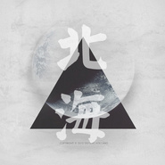
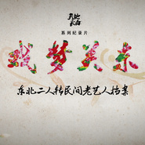
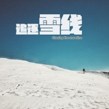
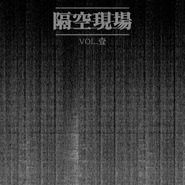
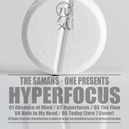

王利夫
============================

|  |  |
| :--: | :-- |
| [ 王利夫](https://i.xiami.com/tbost) | **地区**: China 中国大陆 **风格**: 原声 Soundtrack, 电影原声 Film Score, 电视原声 Television Music, 游戏配乐 Video Game Music **播放数**: 11305595 **粉丝数**: 12316 **评论数**: 615  |

## 档案

影视/游戏作曲 & 萨满乐队主唱 
Film / TV / Video Game Composer & Frontman of the Samans 
**因配乐作品的版权通常由甲方持有，大部分案例没有上传至此，索取试听片段请发邮件至 dasweltreich@gmail.com 。

## 专辑

| 名称 | 语种 | 唱片公司 | 发行时间 | 专辑类别 | 专辑风格 |
| :--: | :-- | :-- | :-- | :-- | :-- |
| [ 戏梦关东 独立季 原声音乐](./albums/2104936317.md) | 国语 |  | 2019年06月09日 | 原声带, 影视音乐 | 电视原声 Television Music, 中国曲艺 Chinese Quyi, 原声 Soundtrack |
| [ What The FunkThe Genki Project Vol.7](./albums/2104564610.md) | 英语 |  | 2019年02月04日 | 录音室专辑 | 合成器放克 Synth Funk, 器乐嘻哈 Instrumental Hip Hop |
| [ 乐·读](./albums/2104042458.md) | 国语 | 独立发行 | 2018年09月20日 | 有声书 | 有声书 Audio Book, 原声 Soundtrack |
| [ 王八念经The Genki Project Vol.6](./albums/2103644380.md) | 国语 | 独立发行 | 2018年03月27日 | 录音室专辑 | 陷阱舞曲 Trap, 陷阱说唱 Trap Rap |
| [ 黑暗森林组曲The Dark Forest Suite Op. 01](./albums/2103545691.md) | 国语 | 独立发行 | 2018年02月23日 | 原声带, 影视音乐 | 原声 Soundtrack, 黑暗氛围 Dark Ambient |
| [ 三体OST之北海](./albums/2103491639.md) | 国语 | 独立发行 | 2018年01月16日 | 原声带, 影视音乐 | 原声 Soundtrack, 同人音乐 DouJin |
| [ 戏梦关东 第二季 原声音乐东北二人转民间老艺人档案](./albums/2102943626.md) | 国语 | 独立发行 | 2017年11月18日 | 原声带, 影视音乐 | 中国戏曲 Chinese Opera, 原声 Soundtrack, 电视原声 Television Music |
| [ 鸽子 原声音乐](./albums/2102871506.md) | 纯音乐 | 独立发行 | 2017年10月13日 | 原声带, 影视音乐 | 原声 Soundtrack, 卡通配乐 Cartoon Music |
| [ 追逐雪线 原声音乐Chasing The Snowline TV Original Soundtrack](./albums/2102871262.md) | 纯音乐 | 独立发行 | 2017年10月12日 | 原声带, 影视音乐 | 原声 Soundtrack, 电视原声 Television Music |
| [ 隔空现场Vol.1 声音中的三体知乎LIVE 2017.03.17](./albums/2102716626.md) | 国语 | 独立发行 | 2017年03月17日 | 现场专辑 | 实验音乐 Experimental, 黑暗氛围 Dark Ambient, 蜂鸣 Drone |
| [ Out of The Ashes We Rise电影《走出尘埃》预告片主题音乐](./albums/2103545503.md) | 国语 | 独立发行 | 2017年03月03日 | 原声带, 影视音乐 | 原声 Soundtrack, 电影原声 Film Score |
| [ 戏梦关东 原声音乐东北二人转民间老艺人档案](./albums/2102656298.md) | 国语 | 独立发行 | 2016年11月24日 | 原声带, 影视音乐 | 电视原声 Television Music |
| [ HyperfocusThe Genki Project Vol.5](./albums/2102653522.md) | 英语 | 独立发行 | 2016年11月17日 | 录音室专辑 | 浩室舞曲 House, 科技舞曲 Techno |
| [ Bullets and ZenThe Genki Project Vol.4](./albums/2102644532.md) | 英语 |  | 2016年11月07日 | 录音室专辑 | 雷鬼 Reggae, 回响 Dub |
| [ Taishogun 大將軍The Genki Project Vol.3](./albums/2102419599.md) | 英语 |  | 2016年10月27日 | 录音室专辑 | 大节拍 Big Beat, 鼓打贝斯 Drum & Bass |
| [ One Shot One Kill 一击一杀The Genki Project Vol.2](./albums/2100296128.md) | 英语 | 独立发行 | 2016年03月19日 | 录音室专辑 | 器乐嘻哈 Instrumental Hip Hop |
| [ S.A.DThe Genki Project Vol.1](./albums/2100293856.md) | 其他 | 独立发行 | 2016年03月15日 | 录音室专辑 | 嘻哈 Hip-Hop, 后摇 Post-Rock |
| [ 秋收冬藏电视纪录片《过年》第二季原声音乐](./albums/2100272778.md) | 国语 | 独立发行 | 2016年02月06日 | 原声带, 影视音乐 | 原声 Soundtrack, 电视原声 Television Music, 中国民乐 Chinese Folk Music |
| [ 朝闻道 Die Enlightened (2016 Remaster)2015第十七届上海国际艺术节多媒体剧场《朝闻道》原声音乐](./albums/2102659348.md) | 国语 | 独立发行 | 2015年10月16日 | 现场专辑 |  |
| [ Fight Song（腾讯《雷霆战机》主题曲）](./albums/428475613.md) | 国语 | 独立发行 | 2015年04月07日 | 原声带, 影视音乐 | 游戏配乐 Video Game Music |
| [ 过年《天地长白》系列电视纪录片之《过年》原声音乐](./albums/928293012.md) | 国语 | 独立发行 | 2015年04月05日 | 原声带, 影视音乐 | 原声 Soundtrack, 电视原声 Television Music, 中国民乐 Chinese Folk Music |
| [ Farewell Song (Special Edition)Special Edition With Studio Multitracks](./albums/121462381.md) | 英语 | 独立发行 | 2015年01月17日 | EP, 单曲 | 民谣金属 Folk Metal |
| [ A Heart Gone Wild (Special Edition)Special Edition With Studio Multitracks](./albums/221467758.md) | 英语 | 独立发行 | 2015年01月17日 | EP, 单曲 | 民谣金属 Folk Metal |
| [ 春雪「月海·丰饶之海」 预告单曲](./albums/1813814676.md) | 国语 | 独立发行 | 2014年10月20日 | EP, 单曲 | 新世纪音乐 New Age, 世界音乐 World Music |
| [ Hello World你好世界/哈喽我的儿](./albums/1707498463.md) | 英语 | 独立发行 | 2013年12月29日 | 录音室专辑 | 电音流行 Electropop |
| [ DUBSTEP屠杀现场 2013 LIVE @FUZZBOX](./albums/807501900.md) | 英语 | 独立发行 | 2013年11月24日 | 现场专辑 | 回响贝斯 Dubstep |
| [ SUICIDE NOTE (2018 Remastered)](./albums/2103580001.md) | 国语 | 独立发行 | 2013年10月28日 | EP, 单曲 | 脉冲 Glitch, 缓拍 Downtempo |
| [ Red Cloud 2012 Promo「赤芸」2012宣传片主题音乐](./albums/2103560722.md) | 国语 | 独立发行 | 2012年10月20日 | 原声带, 影视音乐 | 爵士说唱 Jazz Rap, 民谣金属 Folk Metal |
| [ 三体OST](./albums/372239388.md) | 国语 | 独立发行 | 2011年12月01日 | 原声带, 影视音乐 | 太空新世纪 Space New Age, 原声 Soundtrack, 电影原声 Film Score |

## 评论

|  |  |  |
| :-- | :-- | :-- |
|  [虾米用户](https://emumo.xiami.com/u/1437884)   2021-01-23 12:47 赞(2) 踩(0) | 
虾米要关了 以后去哪里听你的音乐呢 
 |
| ⇒ |  [虾米用户](https://emumo.xiami.com/u/347440988)  2021-01-31 20:32 赞(0) 踩(0) | 
moo音乐app上有他的歌&amp;hellip;
 |
|  [虾米用户](https://emumo.xiami.com/u/4131599)  2021-01-13 09:27 赞(3) 踩(0) | 
虾米要关了，哪里可以再听到你的音乐 
 |
|  [虾米用户](https://emumo.xiami.com/u/44361726) He was liyin... 2021-01-11 21:43 赞(3) 踩(0) | 
去哪一定说一声，等着你
 |
|  [虾米用户](https://emumo.xiami.com/u/934480) 这是计划的一部分 2021-01-11 20:38 赞(3) 踩(0) | 
虾米要关了，哪里能找到你
 |
|  [虾米用户](https://emumo.xiami.com/u/279828134) . 2021-01-10 00:13 赞(3) 踩(0) | 
虾米没了，去哪里听三体？
 |
|  [虾米用户](https://emumo.xiami.com/u/446506306)  2021-01-08 12:03 赞(3) 踩(0) | 
虾米二月五号关张大吉，敢问以后上哪里听戏梦关东？
 |
|  [虾米用户](https://emumo.xiami.com/u/47569650) 聆听洋溢在指尖上的诗 2021-01-07 12:06 赞(2) 踩(0) | 
王老师，你去哪，我就去哪。永远喜欢你的音乐。
 |
|  [虾米用户](https://emumo.xiami.com/u/34880365)   2021-01-07 10:15 赞(1) 踩(0) | 
希望以后还能在其它平台听春雪
 |
|  [虾米用户](https://emumo.xiami.com/u/6844036)  2021-01-06 19:21 赞(1) 踩(0) | 
你去哪老王
 |
|  [虾米用户](https://emumo.xiami.com/u/430790239)  2021-01-06 01:48 赞(2) 踩(0) | 
求您了！请将所有的作品上传到网易云音乐吧！我在虾米这里最割舍不下的就是老师您的音乐了！如今虾米音乐即将停运，我不想这些优秀的作品丢失在互联网的记忆中！
 |
|  [虾米用户](https://emumo.xiami.com/u/250427419) 画画时候来听歌 2021-01-05 18:59 赞(2) 踩(0) | 
5555以后在哪才能听到老师的新歌啊！！！Q-Q
 |
|  [虾米用户](https://emumo.xiami.com/u/4831039)  2021-01-05 18:48 赞(1) 踩(0) | 
我在虾米最钟情的音乐人，以后去哪听这些歌呢？
 |
|  [虾米用户](https://emumo.xiami.com/u/247472434) 余生不求多指教，开心最好... 2021-01-05 16:19 赞(3) 踩(0) | 
王老师，接下来您想去哪个平台玩音乐？
 |
|  [虾米用户](https://emumo.xiami.com/u/6628637)  2021-01-05 13:43 赞(0) 踩(0) | 
王老师，你是我在虾米最钟情的人。
 |
|  [虾米用户](https://emumo.xiami.com/u/272175919) 失语的森林 2020-12-08 19:47 赞(0) 踩(0) | 
我是第六百条评论
 |
|  [虾米用户](https://emumo.xiami.com/u/13927906) 路漫漫其修远吾将上下而其... 2020-11-12 16:40 赞(0) 踩(0) | 
今年没有作品上船吗
 |
|  [虾米用户](https://emumo.xiami.com/u/260102619)  2020-11-02 22:37 赞(0) 踩(0) | 
之前只是听过冥王星的雪，今天过来听了其他的作品，先献出膝盖。然后我只想说，这是我第二个献出膝盖的音乐人，第一个是Stive Morgan。
 |
|  [虾米用户](https://emumo.xiami.com/u/442883474) 我还没想好要写什么... 2020-10-13 15:15 赞(0) 踩(0) | 
电影视频少了这些背后渲染场景的人可还怎么活？顶王老师 还原前奏一起鼻子就酸了
 |
|  [虾米用户](https://emumo.xiami.com/u/2822702) ↖ 2020-07-16 08:33 赞(0) 踩(0) | 
《主不在乎》
 |
|  [虾米用户](https://emumo.xiami.com/u/44743196) 听虾米记得收藏～ 2020-07-14 21:48 赞(0) 踩(0) | 
不会评论的虾米网友不配听歌
 |
|  [虾米用户](https://emumo.xiami.com/u/2422101)  2020-05-28 01:34 赞(0) 踩(0) | 
《大数据时代》第一集的开场片段就抓住了我的耳朵  用了听歌识曲很多遍还是识别不出来  突然想到结尾部分应该会有曲目表  拉到最后只看到  【作曲：王利夫】  于是开始听您的歌  这大概是和别人都不太一样的音乐经历把   记录一下~ 虽然我还是没找到开场的BGM[x
 |
|  [虾米用户](https://emumo.xiami.com/u/186428103) 光年之外，记忆之底，谁在... 2020-04-28 14:49 赞(1) 踩(0) | 
我好喜欢您的Attila，第一次在网易听到的，翻来覆去听了好多遍，后来没了，以为再也找不到了，没想到在虾米听到了，感谢您！这首歌真的适合夜深人静，一个人静静听！听得好想回到小时候玩红白机的时候，即使回忆让人沉沦而又孤独。。。
 |
|  [虾米用户](https://emumo.xiami.com/u/3162517) 再见，songtaste 2020-04-25 14:26 赞(0) 踩(0) | 
啊啊啊啊啊啊太幸运了竟然有这样对胃口的一个音乐人！！
 |
|  [虾米用户](https://emumo.xiami.com/u/34109654)  2020-03-16 02:12 赞(0) 踩(0) | 
来这里找找有合适的手机铃声吗
 |
|  [虾米用户](https://emumo.xiami.com/u/400661196) 已经是很长很好的一生 2020-02-12 10:23 赞(0) 踩(0) | 
王老师真的太帅辽！！
 |
|  [虾米用户](https://emumo.xiami.com/u/358104299) 悲观的唯心存在现实解构虚... 2020-02-10 08:44 赞(1) 踩(0) | 
14683
 |
|  [虾米用户](https://emumo.xiami.com/u/400715332) 留白 2020-02-07 23:38 赞(0) 踩(0) | 
·
 |
|  [虾米用户](https://emumo.xiami.com/u/31709801) 还活着，真的是太好了..... 2020-02-04 10:30 赞(0) 踩(0) | 
老哥头像又换回去了。
 |
|  [虾米用户](https://emumo.xiami.com/u/9530407) 白露暖空，素月流天 2020-01-20 15:04 赞(1) 踩(0) | 
收藏了整张专辑，太喜欢听利夫哥哥朗读啦，对不起，这么迟才听到你。我很好奇，收藏会有感谢反馈，都是系统自动的吧？当然自动啦。如果是利夫哥哥亲自回复，我会疯的   
 |
| ⇒ |  [虾米用户](https://emumo.xiami.com/u/16365190) 混蛋的另一种 2020-04-07 08:56 赞(0) 踩(0) | 
祝你平安~~
 |
| ⇒ |  [虾米用户](https://emumo.xiami.com/u/9530407) 白露暖空，素月流天 2020-04-09 19:21 赞(0) 踩(0) | 
<q><b>王利夫说：</b></q>
 |
|  [虾米用户](https://emumo.xiami.com/u/423947424) Wnt to be ma... 2020-01-17 13:24 赞(0) 踩(0) | 
哈啊哈哈哈哈王八念经
 |
|  [虾米用户](https://emumo.xiami.com/u/400715332) 留白 2020-01-14 22:11 赞(0) 踩(0) | 
知悉多种乐风，棒！
 |
|  [虾米用户](https://emumo.xiami.com/u/8876167) 向沸腾的生活致敬WeCh... 2019-12-23 11:36 赞(0) 踩(0) | 
你的音乐很有内容bro  
 |
|  [虾米用户](https://emumo.xiami.com/u/46802952)  2019-12-18 23:42 赞(1) 踩(0) | 
实在太喜欢《戏梦关东》和《秋收冬藏》啦
 |
|  [虾米用户](https://emumo.xiami.com/u/66823378)  2019-11-25 22:02 赞(0) 踩(0) | 

 |
|  [虾米用户](https://emumo.xiami.com/u/352114606)  2019-11-18 14:06 赞(0) 踩(0) | 
每一次的远征世界，必然都会从故土出发。 所以说“东北味十足”这样的谬论，是站不住脚的。 支持一下，继续深入，继续加油。
 |
|  [虾米用户](https://emumo.xiami.com/u/32392807)   2019-11-07 19:50 赞(1) 踩(0) | 
王老师，敢不敢把咱们东北的摇篮曲做个牛比的时长4分钟的音乐。你是我们的大神啊，东北的大神。
 |
|  [虾米用户](https://emumo.xiami.com/u/13927598) Metal 2019-10-17 19:56 赞(0) 踩(0) | 
最近听了很多版本的钢铁洪流进行曲(70周年国庆阅兵的一段BGM) 好想听老王版本的~
 |
|  [虾米用户](https://emumo.xiami.com/u/1318015)  2019-09-23 13:14 赞(3) 踩(0) | 
买了《三体》专辑送给我身边喜欢这类型的朋友，陆续又听了王八念经、乐读，想为王老师把钱包都掏空啊，这样的音乐我都不敢随便写评论，总觉得不管什么样的赞美都是对音乐的不尊重，听就完了，掏钱就完了。
 |
|  [虾米用户](https://emumo.xiami.com/u/360086118) 8letters why... 2019-09-21 21:54 赞(2) 踩(0) | 
鴿子 這首歌使人沉思
 |
|  [虾米用户](https://emumo.xiami.com/u/2957283) 我还没想好要写什么... 2019-08-28 03:46 赞(0) 踩(0) | 
牛逼
 |
|  [虾米用户](https://emumo.xiami.com/u/20177386) 感谢一切美好的遇见❤️ 2019-07-19 00:16 赞(0) 踩(0) | 

 |
|  [虾米用户](https://emumo.xiami.com/u/324879742)   2019-07-10 05:23 赞(0) 踩(0) | 
.
 |
|  [虾米用户](https://emumo.xiami.com/u/767077)  2019-07-08 09:17 赞(0) 踩(0) | 
除了在蝦米上銷售外，還有什麼渠道能買到三體的
 |
|  [虾米用户](https://emumo.xiami.com/u/325374787)  2019-07-04 16:48 赞(1) 踩(0) | 
好
 |
|  [虾米用户](https://emumo.xiami.com/u/95368824)  2019-06-09 20:08 赞(0) 踩(0) | 
好听
 |
|  [虾米用户](https://emumo.xiami.com/u/425420094) 我是人 2019-06-08 08:54 赞(1) 踩(0) | 
完美
 |
|  [虾米用户](https://emumo.xiami.com/u/15477519) 爱  是生命的和弦，而不... 2019-05-29 09:54 赞(5) 踩(0) | 
期待王老师现场见…！您太牛了…
 |
| ⇒ |  [虾米用户](https://emumo.xiami.com/u/13927598) Metal 2019-08-03 22:36 赞(0) 踩(0) | 
哪儿都能遇到你..
 |
|  [虾米用户](https://emumo.xiami.com/u/425103965) 我还没想好要写什么... 2019-05-28 06:09 赞(0) 踩(0) | 
吾王。
 |
|  [虾米用户](https://emumo.xiami.com/u/7343217)   2019-05-26 04:42 赞(0) 踩(0) | 
但求一场三天三夜不停止的live
 |
|  [虾米用户](https://emumo.xiami.com/u/50847813) 我还没想好要写什么... 2019-05-20 03:35 赞(0) 踩(0) | 
老王真实啥都会
 |
|  [虾米用户](https://emumo.xiami.com/u/346165752)  2019-05-06 12:08 赞(0) 踩(0) | 

 |
|  [虾米用户](https://emumo.xiami.com/u/7198615) 那天是你用一块红布，蒙住... 2019-04-10 13:57 赞(4) 踩(0) | 
真是罪过，这么长时间才发现还有个人作品。我要大循环一遍！ 感谢您全国巡演沈阳站中场时给了我一个单独合影的机会，谢谢！
 |
|  [虾米用户](https://emumo.xiami.com/u/377198486) to do someth... 2019-04-04 15:27 赞(1) 踩(0) | 
想拜王老师为师
 |
|  [虾米用户](https://emumo.xiami.com/u/283472451)  2019-03-26 13:40 赞(0) 踩(0) | 
<a href="http://emumo.xiami.com/u/12985289" target="_blank" rel="nofollow" name_card="12985289">@Ver啦 </a>三体系列
 |
|  [虾米用户](https://emumo.xiami.com/u/7343217)   2019-03-17 19:30 赞(0) 踩(0) | 
听了三年什么时候能看一次现场听一遍大将军此生足矣
 |
|  [虾米用户](https://emumo.xiami.com/u/2491956) 我还没想好要写什么... 2019-03-08 11:09 赞(0) 踩(0) | 
还没火？应该火 啊
 |
|  [虾米用户](https://emumo.xiami.com/u/345256356)  2019-02-12 16:24 赞(1) 踩(0) | 
流浪的地球应该找他来配音的！中国的汉斯寂寞
 |
| ⇒ |  [虾米用户](https://emumo.xiami.com/u/400661196) 已经是很长很好的一生 2020-02-12 10:26 赞(0) 踩(0) | 
对对对 老王完全是碾压那谁谁的存在（小声bb）
 |
|  [虾米用户](https://emumo.xiami.com/u/46467302)  2018-12-28 05:54 赞(0) 踩(0) | 

 |
|  [虾米用户](https://emumo.xiami.com/u/352096167)  2018-11-04 16:49 赞(2) 踩(0) | 
心有猛虎，细嗅蔷薇
 |
|  [虾米用户](https://emumo.xiami.com/u/403895496)  2018-11-02 16:47 赞(0) 踩(0) | 
今晚红糖去见老王
 |
|  [虾米用户](https://emumo.xiami.com/u/5846733) 音乐最忠诚 2018-10-22 19:11 赞(0) 踩(0) | 
一直很喜欢并且尊敬的音乐人 曲子超级棒 献上我的小❤️❤️ 十一月南京见
 |
|  [虾米用户](https://emumo.xiami.com/u/377783394)  2018-10-15 21:29 赞(0) 踩(0) | 
我好喜欢
 |
|  [虾米用户](https://emumo.xiami.com/u/402627599) 勇敢的做好每一天的自己! 2018-10-05 21:11 赞(1) 踩(0) | 
谢谢您，王利夫先生，在我收藏您的作品后回复了我  
 |
|  [虾米用户](https://emumo.xiami.com/u/403803440)  2018-10-05 18:08 赞(0) 踩(0) | 
加油，我们10月7日广州见，我在广州的你们来！
 |
|  [虾米用户](https://emumo.xiami.com/u/36340888)  2018-09-30 17:26 赞(0) 踩(0) | 
卧槽，这只怪兽用深喉袭击了我的耳朵，好求诡异 
 |
|  [虾米用户](https://emumo.xiami.com/u/403823740) 你就像屎. 2018-09-22 21:51 赞(0) 踩(0) | 
一个集才华与颜值的男人哈哈 爱王老师
 |
|  [虾米用户](https://emumo.xiami.com/u/182400198) 版权逃亡冷感钝化人 2018-09-22 07:27 赞(0) 踩(0) | 
我去了西北呜呜呜下次不知道啥时候还能看见王老师在舞台上淌汗珠子了
 |
|  [虾米用户](https://emumo.xiami.com/u/12501921) 众生轮回 因果循环 2018-09-21 01:32 赞(1) 踩(0) | 
期待更多作品！
 |
|  [虾米用户](https://emumo.xiami.com/u/11927341)   2018-09-20 21:51 赞(0) 踩(0) | 
不然你以为我为啥下虾米
 |
|  [虾米用户](https://emumo.xiami.com/u/242100318) 新的一天 我还有你 2018-09-20 13:37 赞(0) 踩(0) | 
利夫王，可以说你是天才吗？
 |
|  [虾米用户](https://emumo.xiami.com/u/4142885) 我还没想好要写什么... 2018-07-10 20:32 赞(1) 踩(0) | 
我心中真正的音乐人。
 |
|  [虾米用户](https://emumo.xiami.com/u/297999609) 去克洛里吧 2018-06-23 18:08 赞(0) 踩(0) | 

 |
|  [虾米用户](https://emumo.xiami.com/u/330202577) 我还没想好要写什么... 2018-06-02 13:54 赞(1) 踩(0) | 
感谢您让我听到了未来，宇宙的浩瀚无垠，生命的短暂和绚烂
 |
|  [虾米用户](https://emumo.xiami.com/u/8098168) 天上寂静 2018-05-21 12:51 赞(0) 踩(0) | 
一个粉
 |
|  [虾米用户](https://emumo.xiami.com/u/201391232) 最快的方法是先抱抱 2018-05-05 13:21 赞(0) 踩(0) | 
彡
 |
|  [虾米用户](https://emumo.xiami.com/u/235129125) それじゃ、もう行くよ 2018-05-03 22:03 赞(4) 踩(0) | 
质量极高的国产艺人。
 |
|  [虾米用户](https://emumo.xiami.com/u/228843687) 懒惰统治人间 2018-04-30 23:12 赞(0) 踩(0) | 
:-O
 |
|  [虾米用户](https://emumo.xiami.com/u/334790543) 声波涤荡净化心灵 2018-04-26 21:28 赞(0) 踩(0) | 
NB利夫！
 |
|  [虾米用户](https://emumo.xiami.com/u/527772)  2018-04-16 17:59 赞(0) 踩(0) | 
我想买秋收冬藏的无损音质，怎么和王老师联系
 |
|  [虾米用户](https://emumo.xiami.com/u/43492923) 行到水穷我才开始害怕，夕... 2018-04-05 21:13 赞(0) 踩(0) | 
▲
 |
|  [虾米用户](https://emumo.xiami.com/u/13431467)  2018-03-26 16:00 赞(2) 踩(0) | 
希望有天我做的游戏能有萨满配乐。
 |
|  [虾米用户](https://emumo.xiami.com/u/31709801) 还活着，真的是太好了..... 2018-03-14 10:34 赞(0) 踩(0) | 
老哥微博互关啦，卧*，我激动的无以复加啊             ，mmp，好感动！     [中国旗帜][中国旗帜][中国旗帜]。
 |
|  [虾米用户](https://emumo.xiami.com/u/979465) 潇洒走一回 2018-03-03 17:45 赞(2) 踩(0) | 
老王我爱你
 |
|  [虾米用户](https://emumo.xiami.com/u/27167709)  2018-02-11 15:14 赞(11) 踩(0) | 
不能给王老师生猴子的人生，还有什么意义
 |
|  [虾米用户](https://emumo.xiami.com/u/27167709)  2018-02-11 15:13 赞(0) 踩(0) | 
要死了要死了
 |
|  [虾米用户](https://emumo.xiami.com/u/344296866) 我不想死。死了就不能听音... 2018-02-07 12:34 赞(0) 踩(0) | 
身体发麻
 |
|  [虾米用户](https://emumo.xiami.com/u/347568255)  2018-02-03 21:12 赞(0) 踩(0) | 
好燃啊啊啊啊
 |
|  [虾米用户](https://emumo.xiami.com/u/347568255)  2018-02-03 21:12 赞(0) 踩(0) | 
网易已阵亡
 |
|  [虾米用户](https://emumo.xiami.com/u/49695836)  2018-01-29 01:37 赞(0) 踩(0) | 
豆瓣上有一首收藏了一年多的歌叫attila，一直以为是国外乐队，今天自己在电视上放看到头像才发现是我们自己的乐队，又放了乐队的几首歌发现竟然是黑嗓，牛逼哈哈，我们自己的乐队，厉害！
 |
| ⇒ |  [虾米用户](https://emumo.xiami.com/u/49695836)  2018-01-29 01:39 赞(0) 踩(0) | 
那么问题来了，什么时候来广深走一遭[带墨镜笑]
 |
| ⇒ |  [虾米用户](https://emumo.xiami.com/u/36275) 萨满乐队采样 2018-09-21 07:50 赞(0) 踩(0) | 
<q><b>范恒伟0863说：</b></q>
 |
|  [虾米用户](https://emumo.xiami.com/u/31709801) 还活着，真的是太好了..... 2018-01-18 08:49 赞(0) 踩(0) | 
又换封面啦！
 |
|  [虾米用户](https://emumo.xiami.com/u/344785837)  2018-01-15 20:15 赞(67) 踩(0) | 
我觉得  像窦唯   王利夫   谢玉岗这样的人   玩得了乐队也开得了个人音乐会   不骄不躁   不卑不亢  这种人才是真正做音乐的人
 |
| ⇒ |  [虾米用户](https://emumo.xiami.com/u/336422830)  2018-02-20 14:20 赞(0) 踩(0) | 
嘤嘤嘤
 |
| ⇒ |  [虾米用户](https://emumo.xiami.com/u/37866414) Night Rider 2018-03-08 01:55 赞(0) 踩(0) | 
<q><b>未知生物说：</b></q>
 |
| ⇒ |  [虾米用户](https://emumo.xiami.com/u/3044055)  2020-04-19 11:22 赞(0) 踩(0) | 
不骄不躁 不卑不亢 ，总结得漂亮
 |
|  [虾米用户](https://emumo.xiami.com/u/338150932)  2018-01-07 12:11 赞(0) 踩(0) | 
这音乐，，厉害，好听
 |
|  [虾米用户](https://emumo.xiami.com/u/780045)  2017-12-28 09:05 赞(17) 踩(0) | 
有幸和王老师聊过天，是一位谦和又极具才华的音乐人 
 |
|  [虾米用户](https://emumo.xiami.com/u/450276) 我本渔樵孟诸野 一生自是... 2017-12-24 15:03 赞(1) 踩(0) | 
好厉害的音乐人 加油
 |
|  [虾米用户](https://emumo.xiami.com/u/54434609) 这家伙很聪明 2017-12-20 10:32 赞(1) 踩(0) | 
     
 |
|  [虾米用户](https://emumo.xiami.com/u/285555196)  2017-12-01 09:54 赞(2) 踩(0) | 
老王，爱你啊 
 |
|  [虾米用户](https://emumo.xiami.com/u/238777294)  2017-11-25 15:40 赞(0) 踩(0) | 
内容已删除
 |
| ⇒ |  [虾米用户](https://emumo.xiami.com/u/17909558) 今日方知我是我 2017-12-27 01:20 赞(0) 踩(0) | 
知乎上都说 未来的日子 不会再以萨满的名义出新歌 。。。
 |
|  [虾米用户](https://emumo.xiami.com/u/13927598) Metal 2017-11-18 20:16 赞(0) 踩(0) | 
桶哥今年身体不好不能刷屏! 换老王了~
 |
|  [虾米用户](https://emumo.xiami.com/u/8375741) 我还没想好要写什么... 2017-11-01 03:42 赞(1) 踩(0) | 
老王！！我要匿名表白！！我是你的大迷妹！！
 |
|  [虾米用户](https://emumo.xiami.com/u/947031)  2017-10-27 23:59 赞(0) 踩(0) | 
王老师牛逼哈哈
 |
|  [虾米用户](https://emumo.xiami.com/u/321406)  2017-10-27 23:45 赞(4) 踩(0) | 
其实很喜欢叶文洁在红案基地的那一段时光，历经人心恶毒、世事无常的一段光怪陆离的暴虐岁月之后，在封闭且神秘，漫山森林之中的发射塔上，既孤独心中却有百转心思，望着无边森林的起伏，却想着人类与这个星球的何去何从，这个场景应该以怎样的BGM来渲染情绪？
 |
|  [虾米用户](https://emumo.xiami.com/u/38487610)   2017-10-27 23:23 赞(3) 踩(0) | 
评论第200？三体和德国战车脑残粉表示瞎了氪金狗眼~
 |
|  [虾米用户](https://emumo.xiami.com/u/3977502) 中音毒患癌晚期者…… 2017-10-27 23:18 赞(3) 踩(0) | 
我一直觉得，我听音乐掉眼泪的次数远远超过看电影掉泪的次数，《红岸》充满了宇宙无边的深邃华丽，磅礴大气，关键是里面还有挥之不去的宿命感。
 |
|  [虾米用户](https://emumo.xiami.com/u/262748474)  2017-10-22 01:19 赞(0) 踩(0) | 
萨满主唱
 |
|  [虾米用户](https://emumo.xiami.com/u/238597258)  2017-10-21 17:27 赞(39) 踩(0) | 
不会英语的法学硕士不是一个好主唱
 |
|  [虾米用户](https://emumo.xiami.com/u/253737324)   2017-10-19 00:05 赞(0) 踩(0) | 
老王的好多曲子都想用钢琴弹，但鉴于网上找不到谱子，趴着琴上YY半天无果。
 |
|  [虾米用户](https://emumo.xiami.com/u/31709801) 还活着，真的是太好了..... 2017-10-18 10:43 赞(1) 踩(0) | 
我跟你们讲，上次我和王老哥聊天了！开心的我和朋友吹了好几天牛逼！我超级崇拜王老哥。
 |
| ⇒ |  [虾米用户](https://emumo.xiami.com/u/31709801) 还活着，真的是太好了..... 2017-10-19 19:14 赞(0) 踩(0) | 
<q><b>说：</b></q>
 |
| ⇒ |  [虾米用户](https://emumo.xiami.com/u/31709801) 还活着，真的是太好了..... 2017-10-28 21:08 赞(0) 踩(0) | 
<q><b>说：</b></q>
 |
|  [虾米用户](https://emumo.xiami.com/u/7187271) Invoke(this)... 2017-10-17 06:24 赞(2) 踩(0) | 
做民谣金属的同时还能玩得起电子和OST……隔壁老王屌屌屌【等等标签里的泽野弘之是要闹哪样23333
 |
|  [虾米用户](https://emumo.xiami.com/u/13927598) Metal 2017-10-13 12:24 赞(1) 踩(0) | 
换头像啦?
 |
|  [虾米用户](https://emumo.xiami.com/u/42219987) … 2017-10-13 11:30 赞(2) 踩(0) | 
慢慢适应新头像
 |
|  [虾米用户](https://emumo.xiami.com/u/31920220) 送你一场大骗局。 2017-10-11 22:31 赞(2) 踩(0) | 
给老王大法跪了！！！
 |
|  [虾米用户](https://emumo.xiami.com/u/329694721) 摇滚，jazzhipho... 2017-10-11 22:00 赞(3) 踩(0) | 
内容已删除
 |
| ⇒ |  [虾米用户](https://emumo.xiami.com/u/12350884)  2017-10-12 13:23 赞(0) 踩(0) | 
我也是..
 |
| ⇒ |  [虾米用户](https://emumo.xiami.com/u/329694721) 摇滚，jazzhipho... 2017-10-12 14:01 赞(0) 踩(0) | 
<q><b>行者说：</b></q>
 |
| ⇒ |  [虾米用户](https://emumo.xiami.com/u/16365190) 混蛋的另一种 2017-10-12 15:05 赞(0) 踩(0) | 
辛苦辛苦
 |
|  [虾米用户](https://emumo.xiami.com/u/245029428) 你是什么狗 2017-10-11 07:55 赞(2) 踩(0) | 
新大陆 老王不止萨满牛逼
 |
|  [虾米用户](https://emumo.xiami.com/u/44467699)  2017-09-21 13:01 赞(0) 踩(0) | 
老王还有个身份是萨满的主唱，他把所有对生活和梦想的理解都放进了音乐里
 |
|  [虾米用户](https://emumo.xiami.com/u/245616225)  2017-09-21 11:53 赞(2) 踩(0) | 
我好像发现了新大陆
 |
|  [虾米用户](https://emumo.xiami.com/u/236020725) 勿扰…… 2017-09-15 23:26 赞(2) 踩(0) | 
内容已删除
 |
| ⇒ |  [虾米用户](https://emumo.xiami.com/u/3295748) 苁蓉燃烧 2017-09-24 22:08 赞(0) 踩(0) | 
看着名字熟悉，评论里找答案，我还有一张全体签名的鲸歌[带墨镜笑][带墨镜笑]
 |
|  [虾米用户](https://emumo.xiami.com/u/232142357) 山本无忧，因雪白头。水本... 2017-09-02 21:04 赞(1) 踩(0) | 
大赞   
 |
|  [虾米用户](https://emumo.xiami.com/u/9480638) 我还没想好要写什么... 2017-08-29 14:01 赞(2) 踩(0) | 
汉斯&amp;middot;季莫&amp;middot;利夫&amp;middot;王&amp;hellip;
 |
|  [虾米用户](https://emumo.xiami.com/u/2461087) 暂无签名~ 2017-08-27 23:13 赞(0) 踩(0) | 
今天听老王的这几个电台真的超级爽  爽爆了都！！！  感谢王利夫！感谢萨满！
 |
|  [虾米用户](https://emumo.xiami.com/u/236021447) 满少逛微博，哈哈··· 2017-08-14 16:07 赞(0) 踩(0) | 
关注
 |
|  [虾米用户](https://emumo.xiami.com/u/31709801) 还活着，真的是太好了..... 2017-08-05 21:35 赞(0) 踩(0) | 
偶像，签个名吧！
 |
|  [虾米用户](https://emumo.xiami.com/u/70292024)   2017-08-05 20:49 赞(0) 踩(0) | 
真的不敢相信，竟然还是萨满主唱，太牛逼了！！！
 |
|  [虾米用户](https://emumo.xiami.com/u/759386) 终与俗别，一尘不染 2017-08-05 18:00 赞(0) 踩(0) | 
老王还是金属玩得好，是我最喜欢的黑嗓，说实话《三体》一般，这种音乐还是Two Steps From Hell做得最好，当然气势音乐是我认为所有音乐的顶端，也许是每个有理想的音乐家的最终归宿。
 |
|  [虾米用户](https://emumo.xiami.com/u/12682307) 我还没想好要写什么... 2017-06-18 10:25 赞(0) 踩(0) | 
老王，专辑封面那套黑胶是咋回事？给我整一套。
 |
|  [虾米用户](https://emumo.xiami.com/u/12682307) 我还没想好要写什么... 2017-06-18 10:20 赞(0) 踩(0) | 
隔壁老王，你可以在长春组织一场大型Rave party了！
 |
|  [虾米用户](https://emumo.xiami.com/u/2732949) 心中一撮小火 身体离地三... 2017-06-14 01:55 赞(0) 踩(0) | 
我怎么记得萨满的人不都是我们大蒙古的吗
 |
| ⇒ |  [虾米用户](https://emumo.xiami.com/u/193452248) 六千毫升的蓝。 2017-08-17 23:17 赞(0) 踩(0) | 
东北，内蒙
 |
|  [虾米用户](https://emumo.xiami.com/u/36303608) 有情有义又是无米之炊，潮... 2017-05-30 08:38 赞(3) 踩(0) | 
神了 突然听到首雷鬼 还有隔壁老王不会搞得风格吗
 |
|  [虾米用户](https://emumo.xiami.com/u/13927598) Metal 2017-04-25 20:50 赞(0) 踩(0) | 
神老王 神萨满 !!
 |
|  [虾米用户](https://emumo.xiami.com/u/7068097) 暂无签名~ 2017-04-22 01:31 赞(8) 踩(0) | 
那是人类的落日，死死地拖着剩余的光辉，跌落地平线。 怕是在也无法起身，再也无法在灰烬中寻找过往的辉煌。 老王是真的厉害
 |
|  [虾米用户](https://emumo.xiami.com/u/34720399) 看尽纷薄，方得悟空。谁知... 2017-04-18 17:33 赞(0) 踩(0) | 

 |
|  [虾米用户](https://emumo.xiami.com/u/83069340)   2017-04-03 20:05 赞(31) 踩(0) | 
我的天 我一直以为老王只是玩金属的....直到我来到这里发现了新世界.....
 |
|  [虾米用户](https://emumo.xiami.com/u/54367807) 666次的轮回 2017-03-31 18:20 赞(2) 踩(0) | 
《三体》这种继往开来的科幻大作，不论哪个国家的导演和原声作曲家想要搞出来同等高度之意境的作品，我看起码要搭上半条命。 王利夫是不是也在执着于此？或者是不是只有王利夫执着于此，只有天知道。
 |
| ⇒ |  [虾米用户](https://emumo.xiami.com/u/16365190) 混蛋的另一种 2017-03-31 18:29 赞(0) 踩(0) | 
倒也没有。我在玩儿，并且玩儿的很开心。
 |
|  [虾米用户](https://emumo.xiami.com/u/100057540) 需要爱的人才会去关心他人... 2017-03-25 20:51 赞(0) 踩(0) | 
加油
 |
|  [虾米用户](https://emumo.xiami.com/u/49748006) Fly me to th... 2017-03-24 17:53 赞(0) 踩(0) | 
&amp;ldquo;&amp;rdquo;
 |
|  [虾米用户](https://emumo.xiami.com/u/48276337) 22世纪不道德 2017-03-22 22:10 赞(0) 踩(0) | 

 |
|  [虾米用户](https://emumo.xiami.com/u/186815001) O ever youth... 2017-03-11 00:44 赞(0) 踩(0) | 
老！王！ 
 |
|  [虾米用户](https://emumo.xiami.com/u/13279293) 我还没想好要写什么... 2017-03-05 01:46 赞(0) 踩(0) | 
催眠曲
 |
|  [虾米用户](https://emumo.xiami.com/u/22444238) 邱比官方虾米 2017-03-05 01:03 赞(11) 踩(0) | 
GET.
 |
| ⇒ |  [虾米用户](https://emumo.xiami.com/u/285129054) 我还没想好要写什么... 2018-02-05 11:58 赞(0) 踩(0) | 
活捉 
 |
|  [虾米用户](https://emumo.xiami.com/u/253737324)   2017-02-20 15:41 赞(0) 踩(0) | 
8-bit Remix 有点旋死的感觉啊
 |
|  [虾米用户](https://emumo.xiami.com/u/51906201) 长路向西我们无人为伴 ​ 2017-02-14 10:58 赞(0) 踩(0) | 
王老师 喜欢死你了
 |
|  [虾米用户](https://emumo.xiami.com/u/23794844) 喜欢任何音乐梦想是成为 ... 2017-02-01 18:30 赞(0) 踩(0) | 
突然被人安利了！
 |
|  [虾米用户](https://emumo.xiami.com/u/6968033) 什么都听，最爱死核。 2017-01-24 20:23 赞(0) 踩(0) | 
表白老王（比心
 |
|  [虾米用户](https://emumo.xiami.com/u/319604) ♥BROWN SUGAR... 2017-01-01 15:26 赞(1) 踩(0) | 
HAPPY NEW YEAR王利夫!!!
 |
|  [虾米用户](https://emumo.xiami.com/u/666000) 我会永远爱你，虾米的朋友... 2016-12-15 10:35 赞(0) 踩(0) | 
。
 |
|  [虾米用户](https://emumo.xiami.com/u/19272191) only fucking 2016-12-08 14:25 赞(0) 踩(0) | 
做商业音乐就是高产啊！！厉害王哥！！
 |
|  [虾米用户](https://emumo.xiami.com/u/42219987) … 2016-12-07 16:14 赞(26) 踩(0) | 
王老师说坚持用虾米的都是乖宝贝 
 |
| ⇒ |  [虾米用户](https://emumo.xiami.com/u/222802757) 单循控  搬去酷狗  想... 2020-05-29 09:41 赞(0) 踩(0) | 
为啥？
 |
|  [虾米用户](https://emumo.xiami.com/u/238805920) 尘世间迷茫小书童 2016-11-30 19:16 赞(0) 踩(0) | 
加油
 |
|  [虾米用户](https://emumo.xiami.com/u/947031)  2016-11-10 09:31 赞(57) 踩(0) | 
喊麦三省的一股清流
 |
| ⇒ |  [虾米用户](https://emumo.xiami.com/u/88300726) 我还没想好要写什么... 2017-12-21 20:22 赞(0) 踩(0) | 
你一说喊麦三省我作为吉林省的人，人，我委屈的想哭，并不是只有东三省才有大虾壁好吧，
 |
|  [虾米用户](https://emumo.xiami.com/u/839387)  2016-10-30 19:25 赞(0) 踩(0) | 
智子 豆瓣有一版  找不到
 |
|  [虾米用户](https://emumo.xiami.com/u/27824615) 俗人。 2016-10-29 21:56 赞(1) 踩(0) | 
无意中翻到的。贼激霸棒啊！我控鸡不住我鸡几啊！
 |
|  [虾米用户](https://emumo.xiami.com/u/319604) ♥BROWN SUGAR... 2016-09-17 13:02 赞(0) 踩(0) | 
王先生什麼時候來香港阿！深圳也是極好der   
 |
|  [虾米用户](https://emumo.xiami.com/u/12520481) skullcheng 2016-09-16 11:53 赞(0) 踩(0) | 
老王我爱你！昨天演出超棒！三体还能上映嘛 等到绝望
 |
|  [虾米用户](https://emumo.xiami.com/u/2888769)  2016-09-06 12:55 赞(0) 踩(0) | 
hi
 |
|  [虾米用户](https://emumo.xiami.com/u/50029031)   2016-08-30 13:16 赞(0) 踩(0) | 
老王，啥时候萨满巡演啊！
 |
|  [虾米用户](https://emumo.xiami.com/u/13927906) 路漫漫其修远吾将上下而其... 2016-07-16 16:52 赞(0) 踩(0) | 
我去，终于又发现好听的了
 |
|  [虾米用户](https://emumo.xiami.com/u/73140414)  2016-07-12 23:57 赞(0) 踩(0) | 
为什么不吼几句..
 |
|  [虾米用户](https://emumo.xiami.com/u/49748006) Fly me to th... 2016-06-28 22:39 赞(0) 踩(0) | 
好厉害！
 |
|  [虾米用户](https://emumo.xiami.com/u/49141193) loading… 2016-06-16 17:02 赞(0) 踩(0) | 
王利夫真的太牛逼了 喔！
 |
|  [虾米用户](https://emumo.xiami.com/u/190373582)  2016-06-16 12:18 赞(2) 踩(0) | 
这首歌甚至能让我想起那天老师奖励我的小红花
 |
|  [虾米用户](https://emumo.xiami.com/u/3808041)   2016-05-29 00:49 赞(0) 踩(0) | 
太牛逼了！！！
 |
|  [虾米用户](https://emumo.xiami.com/u/39548287) Spotify&QQ同名... 2016-05-16 22:20 赞(0) 踩(0) | 
⌬
 |
|  [虾米用户](https://emumo.xiami.com/u/722202) 大家人海无名里 2016-05-13 20:59 赞(0) 踩(0) | 
老王我爱你
 |
| ⇒ |  [虾米用户](https://emumo.xiami.com/u/16365190) 混蛋的另一种 2016-05-15 12:55 赞(0) 踩(0) | 
去去去。身体怎么样最近。
 |
| ⇒ |  [虾米用户](https://emumo.xiami.com/u/13603829) 喜欢就行 2016-07-23 12:14 赞(0) 踩(0) | 
<q><b>王利夫说：</b></q>
 |
|  [虾米用户](https://emumo.xiami.com/u/2019831) 沉默者 2016-05-13 16:30 赞(0) 踩(0) | 
滚进来～
 |
|  [虾米用户](https://emumo.xiami.com/u/141894532)  2016-05-10 16:00 赞(0) 踩(0) | 
艺术家
 |
| ⇒ |  [虾米用户](https://emumo.xiami.com/u/16365190) 混蛋的另一种 2016-05-10 16:53 赞(0) 踩(0) | 
just not that good yet
 |
|  [虾米用户](https://emumo.xiami.com/u/8865162) Freedom 2016-05-10 15:14 赞(0) 踩(0) | 
周六晚上在电音趴被我眼尖的看到老王…求合影了(觉得长春人就这点幸福了
 |
| ⇒ |  [虾米用户](https://emumo.xiami.com/u/16365190) 混蛋的另一种 2016-05-10 16:52 赞(0) 踩(0) | 
哈。那天是去看著名性冷淡魔怔女DJ<a href="http://emumo.xiami.com/u/37083761" target="_blank" rel="nofollow" name_card="37083761">@赵大力</a>
 |
|  [虾米用户](https://emumo.xiami.com/u/158989722)   2016-05-02 14:51 赞(0) 踩(0) | 
全是梗
 |
|  [虾米用户](https://emumo.xiami.com/u/22804355)   2016-04-17 11:58 赞(0) 踩(0) | 
电音狗到此一游
 |
|  [虾米用户](https://emumo.xiami.com/u/2339603) 别给我推radiohea... 2016-04-06 20:17 赞(1) 踩(0) | 
太棒了最近迷上8bit
 |
|  [虾米用户](https://emumo.xiami.com/u/38861141) 别怕，我是来救你们的 2016-03-31 12:19 赞(0) 踩(0) | 
来重庆吧我哭
 |
|  [虾米用户](https://emumo.xiami.com/u/38861141) 别怕，我是来救你们的 2016-03-31 12:19 赞(0) 踩(0) | 
王老师王老师王老师
 |
|  [虾米用户](https://emumo.xiami.com/u/1217515) 我还没想好要写什么... 2016-03-29 00:35 赞(0) 踩(0) | 
王利夫
 |
|  [虾米用户](https://emumo.xiami.com/u/8943891) 你咋那么可爱？ 2016-03-21 15:58 赞(0) 踩(0) | 
I
 |
|  [虾米用户](https://emumo.xiami.com/u/193273) 看来虾米得换玩法了 2016-03-20 21:07 赞(0) 踩(0) | 
三体编曲很棒！！！
 |
|  [虾米用户](https://emumo.xiami.com/u/13060161) Only the end... 2016-03-19 21:43 赞(0) 踩(0) | 
orz受小辈一拜，真的好全能！
 |
|  [虾米用户](https://emumo.xiami.com/u/391795) 夏日虫鸣，隐邃星空 2016-03-18 09:16 赞(3) 踩(0) | 
牛逼啊，萨满主唱做的一手好电音。
 |
|  [虾米用户](https://emumo.xiami.com/u/14703454)  2016-03-16 22:30 赞(0) 踩(0) | 
老王，啥时候巡演，等着看呢！
 |
|  [虾米用户](https://emumo.xiami.com/u/16888725) 952711 2016-03-14 10:33 赞(0) 踩(0) | 
摇篮曲好啊，作为东北人斗知道这个，利夫加油
 |
|  [虾米用户](https://emumo.xiami.com/u/4123238)  2016-02-16 16:31 赞(0) 踩(0) | 
喜欢这种沸腾但不“燥”的音乐，所以我决定了听腻一首在听下首，我怕耳朵以后会挑食！
 |
|  [虾米用户](https://emumo.xiami.com/u/5493286) 。 2016-02-16 00:43 赞(1) 踩(0) | 
过来听喜庆的过年新歌了！
 |
|  [虾米用户](https://emumo.xiami.com/u/8475225)  2016-02-15 12:54 赞(0) 踩(0) | 
美
 |
|  [虾米用户](https://emumo.xiami.com/u/8475225)  2016-02-15 12:21 赞(0) 踩(0) | 
[[[[[[[[[[[[oooooOooooo]]]]]]]]]]]]
 |
|  [虾米用户](https://emumo.xiami.com/u/58573018)   2016-02-12 23:19 赞(0) 踩(0) | 
王利夫飞大了！
 |
|  [虾米用户](https://emumo.xiami.com/u/54354813) Wow... 2016-02-06 11:36 赞(0) 踩(0) | 
太棒了！
 |
| ⇒ |  [虾米用户](https://emumo.xiami.com/u/16365190) 混蛋的另一种 2016-02-11 18:12 赞(0) 踩(0) | 
新年快乐
 |
|  [虾米用户](https://emumo.xiami.com/u/27704827) 音乐爱好者 2016-02-05 17:51 赞(0) 踩(0) | 
震撼
 |
| ⇒ |  [虾米用户](https://emumo.xiami.com/u/16365190) 混蛋的另一种 2016-02-11 18:13 赞(0) 踩(0) | 
谢谢 新年快乐
 |
|  [虾米用户](https://emumo.xiami.com/u/3256844) 恩斯波肯 多姆 2016-01-28 02:05 赞(0) 踩(0) | 
法学硕士
 |
| ⇒ |  [虾米用户](https://emumo.xiami.com/u/16365190) 混蛋的另一种 2016-02-11 18:13 赞(0) 踩(0) | 
新年快乐
 |
| ⇒ |  [虾米用户](https://emumo.xiami.com/u/3256844) 恩斯波肯 多姆 2016-02-11 21:43 赞(0) 踩(0) | 
<q><b>王利夫说：</b></q>
 |
|  [虾米用户](https://emumo.xiami.com/u/36897148) 私信➕v请备注 2016-01-16 12:01 赞(0) 踩(0) | 
有才！！
 |
| ⇒ |  [虾米用户](https://emumo.xiami.com/u/16365190) 混蛋的另一种 2016-02-11 18:13 赞(0) 踩(0) | 
谢谢 新年快乐
 |
|  [虾米用户](https://emumo.xiami.com/u/3556002) wubba lubba 2016-01-11 11:49 赞(0) 踩(0) | 
啊啊啊啊啊啊啊啊啊啊啊啊啊啊啊啊老夫愚钝阿。听了N久才发现原来你就是萨满的主唱啊！
 |
| ⇒ |  [虾米用户](https://emumo.xiami.com/u/16365190) 混蛋的另一种 2016-02-11 18:13 赞(0) 踩(0) | 
哈 新年快乐
 |
|  [虾米用户](https://emumo.xiami.com/u/15971738)  2015-12-30 16:27 赞(0) 踩(0) | 
爱上他的音乐了怎么办
 |
| ⇒ |  [虾米用户](https://emumo.xiami.com/u/16365190) 混蛋的另一种 2016-02-11 18:13 赞(0) 踩(0) | 
谢谢 新年快乐
 |
|  [虾米用户](https://emumo.xiami.com/u/7969607) 低头笑微微 2015-12-30 13:58 赞(0) 踩(0) | 
哇~副歌非常棒
 |
| ⇒ |  [虾米用户](https://emumo.xiami.com/u/16365190) 混蛋的另一种 2016-02-11 18:13 赞(0) 踩(0) | 
新年快乐
 |
|  [虾米用户](https://emumo.xiami.com/u/2052156) … 2015-12-27 10:42 赞(0) 踩(0) | 
救世萨满啥时候来成都演一发？
 |
| ⇒ |  [虾米用户](https://emumo.xiami.com/u/5493286) 。 2016-01-07 20:01 赞(0) 踩(0) | 
来成都必须有啊…
 |
| ⇒ |  [虾米用户](https://emumo.xiami.com/u/16365190) 混蛋的另一种 2016-02-11 18:13 赞(0) 踩(0) | 
新年快乐 今年争取巡一圈儿
 |
| ⇒ |  [虾米用户](https://emumo.xiami.com/u/2052156) … 2016-02-11 23:02 赞(0) 踩(0) | 
<q><b>王利夫说：</b></q>
 |
|  [虾米用户](https://emumo.xiami.com/u/2208838) 愿我永生 2015-12-13 22:33 赞(0) 踩(0) | 
过年
 |
| ⇒ |  [虾米用户](https://emumo.xiami.com/u/16365190) 混蛋的另一种 2016-02-11 18:13 赞(0) 踩(0) | 
新年快乐
 |
| ⇒ |  [虾米用户](https://emumo.xiami.com/u/3680698)  2016-05-05 19:22 赞(0) 踩(0) | 
<q><b>王利夫说：</b></q>
 |
|  [虾米用户](https://emumo.xiami.com/u/30622616) 这个人什么都不想留下 2015-12-06 14:04 赞(0) 踩(0) | 
老王行！好久来巡演哇
 |
| ⇒ |  [虾米用户](https://emumo.xiami.com/u/16365190) 混蛋的另一种 2016-02-11 18:14 赞(0) 踩(0) | 
新年快乐 今年有这计划就看大伙能不能凑一块儿了
 |
| ⇒ |  [虾米用户](https://emumo.xiami.com/u/30622616) 这个人什么都不想留下 2016-02-13 23:03 赞(0) 踩(0) | 
<q><b>王利夫说：</b></q>
 |
| ⇒ |  [虾米用户](https://emumo.xiami.com/u/50029031)   2016-08-30 13:17 赞(0) 踩(0) | 
<q><b>王利夫说：</b></q>
 |
| ⇒ |  [虾米用户](https://emumo.xiami.com/u/6445430) 当来笑 2017-06-03 19:40 赞(0) 踩(0) | 
<q><b>王利夫说：</b></q>
 |
|  [虾米用户](https://emumo.xiami.com/u/4207597) 我不想吃药 2015-11-21 18:35 赞(1) 踩(0) | 
好厉害
 |
|  [虾米用户](https://emumo.xiami.com/u/1950284) 溪云初起日沉阁，山雨欲来... 2015-11-18 14:43 赞(0) 踩(0) | 
不得不说和汉斯季默不是一个档次
 |
| ⇒ |  [虾米用户](https://emumo.xiami.com/u/4715251) 愿屁屁在喵星开开心心还有... 2015-11-19 09:34 赞(0) 踩(0) | 
呵呵，你这个对比也是会玩
 |
| ⇒ |  [虾米用户](https://emumo.xiami.com/u/1950284) 溪云初起日沉阁，山雨欲来... 2015-11-19 09:37 赞(0) 踩(0) | 
<q><b>你的小姨大人说：</b></q>
 |
| ⇒ |  [虾米用户](https://emumo.xiami.com/u/4715251) 愿屁屁在喵星开开心心还有... 2015-11-19 09:41 赞(0) 踩(0) | 
<q><b>麦尔说：</b></q>
 |
| ⇒ |  [虾米用户](https://emumo.xiami.com/u/3256844) 恩斯波肯 多姆 2016-01-28 02:05 赞(0) 踩(0) | 
<q><b>麦尔说：</b></q>
 |
| ⇒ |  [虾米用户](https://emumo.xiami.com/u/35505513)  2016-02-03 08:02 赞(0) 踩(0) | 
<q><b>godtoldmeto说：</b></q>
 |
| ⇒ |  [虾米用户](https://emumo.xiami.com/u/3256844) 恩斯波肯 多姆 2016-02-03 16:02 赞(0) 踩(0) | 
<q><b>alterose晨说：</b></q>
 |
| ⇒ |  [虾米用户](https://emumo.xiami.com/u/1604445) 凡音之起，由人心生也。人... 2016-02-03 21:55 赞(0) 踩(0) | 
naive,汉斯那是一个团队的功劳，你真以为他一人操办？这是老王一个人做的。
 |
| ⇒ |  [虾米用户](https://emumo.xiami.com/u/1950284) 溪云初起日沉阁，山雨欲来... 2016-02-05 23:31 赞(0) 踩(0) | 
<q><b>White Dreams说：</b></q>
 |
| ⇒ |  [虾米用户](https://emumo.xiami.com/u/1604445) 凡音之起，由人心生也。人... 2016-02-06 09:46 赞(0) 踩(0) | 
<q><b>麦尔说：</b></q>
 |
| ⇒ |  [虾米用户](https://emumo.xiami.com/u/46775984) 鼠年大吉吧 2017-10-28 00:26 赞(0) 踩(0) | 
<q><b>麦尔说：</b></q>
 |
|  [虾米用户](https://emumo.xiami.com/u/51935500) 预约过去 回忆未来… 2015-11-15 11:08 赞(0) 踩(0) | 
赞…
 |
|  [虾米用户](https://emumo.xiami.com/u/8550460)   2015-11-01 23:25 赞(0) 踩(0) | 
牛逼
 |
|  [虾米用户](https://emumo.xiami.com/u/673004) 矮油不错嘛 2015-10-29 14:30 赞(0) 踩(0) | 
老王，有一次在虾米跟着你的听歌听了一些非常不错的，对味，再上来如果你没在线就没法跟你听歌了， 能不能有个地方做个推荐常听的曲子或者渠道？拜托了
 |
|  [虾米用户](https://emumo.xiami.com/u/16857293) 中二病后期患者 2015-10-18 22:07 赞(1) 踩(0) | 
恭喜！老王的音乐作品《大史theme》，《联合舰队》等多个曲目被用于央视《面对面》的“刘慈欣——想象与现实”一期！老王的音乐正伴随这三体走向世界！恭喜！
 |
|  [虾米用户](https://emumo.xiami.com/u/7022294)  2015-10-12 11:15 赞(1) 踩(0) | 
智子一放，就感觉没错，是这个音色没错！
 |
|  [虾米用户](https://emumo.xiami.com/u/50646227) 舔啊 2015-10-11 00:05 赞(1) 踩(0) | 
老王why are you so屌
 |
|  [虾米用户](https://emumo.xiami.com/u/38914697)  2015-10-08 11:13 赞(0) 踩(0) | 
电影配乐
 |
|  [虾米用户](https://emumo.xiami.com/u/49826126) 一笔雕凿的朋克青年。 2015-10-06 20:14 赞(0) 踩(0) | 
牛逼
 |
|  [虾米用户](https://emumo.xiami.com/u/37128344) 如果你看到了这个 那你应... 2015-10-05 21:18 赞(0) 踩(0) | 
卧槽利夫哥牛哔啊……各路通吃
 |
|  [虾米用户](https://emumo.xiami.com/u/36083601)  2015-10-03 09:39 赞(0) 踩(0) | 
留留留！！
 |
|  [虾米用户](https://emumo.xiami.com/u/33989205)  2015-09-30 08:54 赞(0) 踩(0) | 
8bit
 |
|  [虾米用户](https://emumo.xiami.com/u/45850370) Thrashing to... 2015-09-26 16:41 赞(0) 踩(0) | 
最爱的金属和三体，虽然不能结合，但萨满让我看到了。
 |
|  [虾米用户](https://emumo.xiami.com/u/50728228) Music is my ... 2015-09-21 21:22 赞(0) 踩(0) | 
好久没有这种感觉了。
 |
|  [虾米用户](https://emumo.xiami.com/u/8541401) 我还没想好要写什么... 2015-09-17 22:14 赞(0) 踩(0) | 
<a href="http://www.project-57.org/" target="_blank" rel="nofollow noreferrer noopener">http://www.project-57.org/</a> 水滴 Waterdrop
 |
|  [虾米用户](https://emumo.xiami.com/u/1920972)  2015-09-12 22:00 赞(1) 踩(0) | 
炸了。你们是虫子。
 |
|  [虾米用户](https://emumo.xiami.com/u/10784295) 忠实于疏离旁观的自我 2015-09-11 19:46 赞(0) 踩(0) | 
牛逼  
 |
|  [虾米用户](https://emumo.xiami.com/u/13719439)  2015-09-10 15:59 赞(0) 踩(0) | 
王老师牛逼。没别的要说了。
 |
|  [虾米用户](https://emumo.xiami.com/u/45460750) 无 2015-09-04 22:33 赞(0) 踩(0) | 
哥们你好，是不是有人在12期live橙投诉你了？我也被投诉了，第2  3  4  5名都被第一名恶意投诉了。我觉得我们应该联合起来投诉南方小镇，找回公平，看到请回信。
 |
| ⇒ |  [虾米用户](https://emumo.xiami.com/u/16365190) 混蛋的另一种 2015-09-06 12:46 赞(0) 踩(0) | 
哎？我不知道啊？啥情况
 |
|  [虾米用户](https://emumo.xiami.com/u/16575191) 美术生拯救世界 2015-09-01 15:27 赞(2) 踩(0) | 
从萨满滚过来的
 |
|  [虾米用户](https://emumo.xiami.com/u/7187271) Invoke(this)... 2015-08-30 22:56 赞(0) 踩(0) | 
王老爷生日快乐~
 |
|  [虾米用户](https://emumo.xiami.com/u/3784916)  2015-08-28 14:12 赞(0) 踩(0) | 
红岸感觉对！
 |
|  [虾米用户](https://emumo.xiami.com/u/12209323) 煙火 2015-08-27 16:45 赞(0) 踩(0) | 
哎呦，不错哦
 |
|  [虾米用户](https://emumo.xiami.com/u/51868769)  2015-08-27 15:20 赞(0) 踩(0) | 
这张专辑很屌！！
 |
|  [虾米用户](https://emumo.xiami.com/u/43831828) 暂无签名~ 2015-08-27 01:36 赞(0) 踩(0) | 
厉害
 |
|  [虾米用户](https://emumo.xiami.com/u/53968660)  2015-08-26 20:16 赞(0) 踩(0) | 
一一
 |
|  [虾米用户](https://emumo.xiami.com/u/33978126)  2015-08-25 22:42 赞(0) 踩(0) | 
因为好听
 |
|  [虾米用户](https://emumo.xiami.com/u/8675881) Quid pro quo... 2015-08-24 23:45 赞(0) 踩(0) | 
我们是不是应该留一句：火钳刘明？！！）））））））笑
 |
|  [虾米用户](https://emumo.xiami.com/u/1886864) Where words ... 2015-08-24 17:06 赞(0) 踩(0) | 
趁着三体火起来了卖一发安利
 |
|  [虾米用户](https://emumo.xiami.com/u/39861541) 音乐是世界上最美的语言 2015-08-24 12:17 赞(0) 踩(0) | 
留名！
 |
|  [虾米用户](https://emumo.xiami.com/u/7274116) Mercy 2015-08-24 09:59 赞(0) 踩(0) | 
跪了，屌
 |
|  [虾米用户](https://emumo.xiami.com/u/6654069) mutherfacker... 2015-08-23 21:47 赞(0) 踩(0) | 
王哥王哥～
 |
| ⇒ |  [虾米用户](https://emumo.xiami.com/u/16365190) 混蛋的另一种 2015-08-23 22:07 赞(0) 踩(0) | 
懿哥懿哥
 |
| ⇒ |  [虾米用户](https://emumo.xiami.com/u/6654069) mutherfacker... 2015-08-23 22:09 赞(0) 踩(0) | 
<q><b>王利夫说：</b></q>
 |
|  [虾米用户](https://emumo.xiami.com/u/28189399)   2015-07-15 20:35 赞(0) 踩(0) | 
王老师做什么像什么 没有罗马军团？
 |
|  [虾米用户](https://emumo.xiami.com/u/4406065) （闷树） 2015-07-15 17:56 赞(0) 踩(0) | 
《三体 Opening Theme》里听到了一点傻朋克的影子~  ^ ^
 |
|  [虾米用户](https://emumo.xiami.com/u/12690979)  2015-07-14 15:29 赞(0) 踩(0) | 
我得去好好听听萨满了
 |
|  [虾米用户](https://emumo.xiami.com/u/52566560)  2015-07-14 09:52 赞(0) 踩(0) | 
等着出专辑啊啊啊啊啊啊。
 |
|  [虾米用户](https://emumo.xiami.com/u/8501522) 欲将心事付瑶琴 2015-07-10 01:25 赞(0) 踩(0) | 
在看三体 爱屋及乌
 |
|  [虾米用户](https://emumo.xiami.com/u/43617494) 沉迷工作无法自拔…… 2015-06-16 21:24 赞(0) 踩(0) | 
听听看？？
 |
|  [虾米用户](https://emumo.xiami.com/u/43617494) 沉迷工作无法自拔…… 2015-06-16 21:24 赞(0) 踩(0) | 
听听看？？
 |
|  [虾米用户](https://emumo.xiami.com/u/6699090) Trust the pr... 2015-06-12 10:26 赞(0) 踩(0) | 
`
 |
|  [虾米用户](https://emumo.xiami.com/u/16255463) @Revolution9... 2015-06-09 23:39 赞(0) 踩(0) | 
？
 |
|  [虾米用户](https://emumo.xiami.com/u/7595724)  2015-05-29 13:41 赞(0) 踩(0) | 
建议听听zack hemsey
 |
|  [虾米用户](https://emumo.xiami.com/u/50341867)  2015-05-26 07:06 赞(0) 踩(0) | 
享受这一刻
 |
|  [虾米用户](https://emumo.xiami.com/u/1904608)  2015-05-25 10:21 赞(0) 踩(0) | 
不是人！
 |
|  [虾米用户](https://emumo.xiami.com/u/35097468) 屋里起火了，我赶紧抱起孩... 2015-05-22 11:08 赞(0) 踩(0) | 
大爱王哥！！上次音乐节没合影可惜了！！！
 |
|  [虾米用户](https://emumo.xiami.com/u/6495272) With pain. 2015-05-17 06:02 赞(0) 踩(0) | 
太喜欢
 |
|  [虾米用户](https://emumo.xiami.com/u/1200215) sec/2 2015-05-15 18:14 赞(0) 踩(0) | 
赞赞赞赞！
 |
|  [虾米用户](https://emumo.xiami.com/u/9085891)  2015-05-15 14:13 赞(0) 踩(0) | 
好喜欢啊 王老师
 |
|  [虾米用户](https://emumo.xiami.com/u/4400366) 再也不见 2015-05-11 20:43 赞(0) 踩(0) | 
牛逼
 |
|  [虾米用户](https://emumo.xiami.com/u/49945964) 慎独 2015-05-09 22:10 赞(0) 踩(0) | 
中国科幻配乐，虽然非官方，但觉得还不错
 |
|  [虾米用户](https://emumo.xiami.com/u/20597831) be water my ... 2015-05-02 19:20 赞(0) 踩(0) | 
王老师我真的太爱你了
 |
|  [虾米用户](https://emumo.xiami.com/u/11108770) 再见 青春 2015-05-02 13:30 赞(0) 踩(0) | 
喜欢配乐的画面感
 |
|  [虾米用户](https://emumo.xiami.com/u/47684644)  2015-04-30 15:54 赞(1) 踩(0) | 
王老师，把东北民乐这边做个成熟的系列吧，《摇篮曲》那个demo挺好的。为什么《大西厢》那么短？和纪录片中的片头不一样啊。
 |
| ⇒ |  [虾米用户](https://emumo.xiami.com/u/16365190) 混蛋的另一种 2015-04-30 17:05 赞(0) 踩(0) | 
谢谢兄弟。片头的BGM第二季还要用就没传完整版上来~ 李导准备把这个系列拍完之后发原声砖呢
 |
|  [虾米用户](https://emumo.xiami.com/u/45762426) 暂无签名~ 2015-04-30 10:55 赞(0) 踩(0) | 
like
 |
|  [虾米用户](https://emumo.xiami.com/u/645218) 任性逍遥于有欲无欲之间 2015-04-28 16:42 赞(0) 踩(0) | 
喜欢这个调调
 |
|  [虾米用户](https://emumo.xiami.com/u/4267592)  2015-04-28 14:59 赞(0) 踩(0) | 
作为三体粉，觉得这配乐着实还需要再花些心思。不了解作者本人，并不对作者下定论。但是这配乐太泛泛了，很多都与日本几个配乐大师作品相似啊。这是让人很难接受的。如果是粉丝自制，本人拜服！若真是影片制作方放出的版本，那我真的要劝制作方千万别省钱啊别省钱！！！
 |
| ⇒ |  [虾米用户](https://emumo.xiami.com/u/13080214) fly me to …… 2015-05-12 10:23 赞(0) 踩(0) | 
嗯是自制，不是官方~
 |
| ⇒ |  [虾米用户](https://emumo.xiami.com/u/5421499)  2015-06-24 04:24 赞(0) 踩(0) | 
三体粉了不起啊？
 |
|  [虾米用户](https://emumo.xiami.com/u/53990)  2015-04-25 10:17 赞(0) 踩(0) | 
三体
 |
|  [虾米用户](https://emumo.xiami.com/u/13863508)  2015-04-23 23:37 赞(0) 踩(0) | 
可是为什么有好几首都觉得仿佛在哪听过呢……
 |
|  [虾米用户](https://emumo.xiami.com/u/43213234) 暂无签名~ 2015-04-23 22:32 赞(0) 踩(0) | 
三体爱死了，第一次见到中国大陆的配乐大神
 |
|  [虾米用户](https://emumo.xiami.com/u/33687536) 暂无签名~ 2015-04-23 21:08 赞(0) 踩(0) | 
老王啊！这张盘什么时候出啊！
 |
|  [虾米用户](https://emumo.xiami.com/u/33687536) 暂无签名~ 2015-04-23 21:08 赞(0) 踩(0) | 
老王啊！这张盘什么时候出啊！
 |
|  [虾米用户](https://emumo.xiami.com/u/9185112)  2015-04-13 16:08 赞(0) 踩(0) | 
快去问一下汉斯寂寞还招人不
 |
|  [虾米用户](https://emumo.xiami.com/u/28048339)  2015-04-13 13:55 赞(0) 踩(0) | 
厉害，原来是萨满的主唱
 |
|  [虾米用户](https://emumo.xiami.com/u/11476085)  2015-04-12 21:50 赞(0) 踩(0) | 
原声制作优秀，编曲涉猎风格较广。
 |
|  [虾米用户](https://emumo.xiami.com/u/6105898) on and on an... 2015-04-12 12:53 赞(0) 踩(0) | 
必须来赞一个。
 |
|  [虾米用户](https://emumo.xiami.com/u/10871644) 听歌向~~~ 2015-04-12 10:48 赞(0) 踩(0) | 
叛军不错！一股恢弘的感觉，不比泽野的差啊
 |
|  [虾米用户](https://emumo.xiami.com/u/21607375)   2015-04-11 11:14 赞(0) 踩(0) | 
这张和尚雯婕的那张in咋那么像呢？！
 |
|  [虾米用户](https://emumo.xiami.com/u/49089835)  2015-04-11 00:11 赞(0) 踩(0) | 
三体
 |
|  [虾米用户](https://emumo.xiami.com/u/35183867) 音乐不是命题作文~ 2015-04-10 22:31 赞(0) 踩(0) | 
简直大师啊~~~真是只能膜拜了~~~
 |
|  [虾米用户](https://emumo.xiami.com/u/11275778) 不会忘了你 2015-04-10 17:44 赞(0) 踩(0) | 
今天才偶然听到，作为三体粉不得不推啊。
 |
|  [虾米用户](https://emumo.xiami.com/u/11275778) 不会忘了你 2015-04-10 17:44 赞(0) 踩(0) | 
今天才偶然听到，作为三体粉不得不推啊。
 |
|  [虾米用户](https://emumo.xiami.com/u/1232927)  2015-04-10 15:16 赞(0) 踩(0) | 
酷！
 |
|  [虾米用户](https://emumo.xiami.com/u/32558701) bo ku wa～虛菩提... 2015-04-02 22:37 赞(0) 踩(0) | 
面壁者神了
 |
|  [虾米用户](https://emumo.xiami.com/u/12329003)  2015-04-02 17:44 赞(0) 踩(0) | 
有趣
 |
|  [虾米用户](https://emumo.xiami.com/u/5764907) Mushroom,lot... 2015-03-22 19:29 赞(0) 踩(0) | 
绝赞，求推荐同类型国人音乐人
 |
| ⇒ |  [虾米用户](https://emumo.xiami.com/u/22048630)  2015-03-23 15:34 赞(0) 踩(0) | 
老王就一个，哈哈
 |
| ⇒ |  [虾米用户](https://emumo.xiami.com/u/19606022) 唯美和风控 2015-04-27 21:16 赞(0) 踩(0) | 
稍微有点相似的音乐人只想到这两个 <a href="http://www.xiami.com/artist/109780" target="_blank" rel="nofollow noreferrer noopener">http://www.xiami.com/artist/109780</a> <a href="http://www.xiami.com/artist/490446256" target="_blank" rel="nofollow noreferrer noopener">http://www.xiami.com/artist/490446256</a>
 |
| ⇒ |  [虾米用户](https://emumo.xiami.com/u/5764907) Mushroom,lot... 2015-04-28 17:40 赞(0) 踩(0) | 
<q><b>陈俊琪说：</b></q>
 |
|  [虾米用户](https://emumo.xiami.com/u/30622616) 这个人什么都不想留下 2015-03-19 21:21 赞(0) 踩(0) | 
改名啦~~支持老王
 |
|  [虾米用户](https://emumo.xiami.com/u/29798455)  2015-03-19 16:25 赞(0) 踩(0) | 
听到吗，音乐也是有颜色的。面壁者确实好赞！@借物少年宋胖胖_
 |
|  [虾米用户](https://emumo.xiami.com/u/16857293) 中二病后期患者 2015-03-14 18:16 赞(0) 踩(0) | 
那啥，老王，你对于柴圣母在她的片子里用了你的1.丁仪theme 2.黑暗森林 3.维德theme 有什么看法么 还有，根据一些不可名状的证据和“叛军”、“黑暗战役”这两首带有其他曲子旋律变奏的歌，老王你已经在给孔二狗写歌了对吧对吧对吧？
 |
| ⇒ |  [虾米用户](https://emumo.xiami.com/u/12868731)   2015-04-25 02:43 赞(0) 踩(0) | 
really？？？
 |
|  [虾米用户](https://emumo.xiami.com/u/6578967)   2015-03-11 17:52 赞(0) 踩(0) | 
老王太牛了！炒鸡喜欢他的风格
 |
|  [虾米用户](https://emumo.xiami.com/u/31120772) 暂无签名~ 2015-03-10 09:47 赞(1) 踩(0) | 
我去
 |
|  [虾米用户](https://emumo.xiami.com/u/5781838)  2015-03-07 21:25 赞(0) 踩(0) | 
支持原味！
 |
|  [虾米用户](https://emumo.xiami.com/u/47859419)  2015-03-05 19:37 赞(0) 踩(0) | 
相见恨晚tooQAQ
 |
|  [虾米用户](https://emumo.xiami.com/u/1091873) 最多12个字符。 2015-03-04 00:31 赞(0) 踩(0) | 
相见恨晚
 |
|  [虾米用户](https://emumo.xiami.com/u/45114114)  2015-03-03 19:50 赞(0) 踩(0) | 
果然是ETO柴
 |
|  [虾米用户](https://emumo.xiami.com/u/43697036) 唔w 2015-03-03 17:07 赞(1) 踩(0) | 
老王好厉害！同为金属狗和交响狗已听醉ˊ_&amp;gt;ˋ
 |
|  [虾米用户](https://emumo.xiami.com/u/11099650)  2015-03-01 21:33 赞(0) 踩(0) | 
《三体》三部曲非官方配乐
 |
|  [虾米用户](https://emumo.xiami.com/u/15452208) 虾米是这几年唯一的听歌软... 2015-02-24 20:43 赞(0) 踩(0) | 
d
 |
|  [虾米用户](https://emumo.xiami.com/u/5569588) 一个人的交响乐 2015-02-19 12:04 赞(0) 踩(0) | 
我在央视播出的“中国人的一天”纪录短片尾看到萨满音乐工作室和王利夫了。
 |
|  [虾米用户](https://emumo.xiami.com/u/11146063) 我还没想好要写什么... 2015-02-18 11:40 赞(1) 踩(0) | 
我擦  HELLO WORLD 要逆天了。。。真心喜欢 8BIT
 |
|  [虾米用户](https://emumo.xiami.com/u/12957200)   2015-02-11 18:04 赞(0) 踩(0) | 
晋升脑残粉
 |
|  [虾米用户](https://emumo.xiami.com/u/12258961) 暂无签名~ 2015-02-11 12:40 赞(0) 踩(0) | 
王老牛
 |
|  [虾米用户](https://emumo.xiami.com/u/3710363) 我还没想好要写什么... 2015-02-11 04:24 赞(1) 踩(0) | 
嘿嘿 老王你猜猜我谁
 |
| ⇒ |  [虾米用户](https://emumo.xiami.com/u/16365190) 混蛋的另一种 2015-02-11 12:06 赞(0) 踩(0) | 
嘿嘿嘿 小年儿快乐啊S
 |
| ⇒ |  [虾米用户](https://emumo.xiami.com/u/3710363) 我还没想好要写什么... 2015-02-11 18:22 赞(0) 踩(0) | 
<q><b>王利夫说：</b></q>
 |
|  [虾米用户](https://emumo.xiami.com/u/4160754)   2015-02-05 17:32 赞(0) 踩(0) | 
王老师简直屌
 |
|  [虾米用户](https://emumo.xiami.com/u/1169834) 侧耳倾听 2015-02-05 13:30 赞(0) 踩(0) | 
好想听“虫子”theme 笑
 |
|  [虾米用户](https://emumo.xiami.com/u/478527) 好想跟衣服在洗衣机里滚 2015-01-27 07:19 赞(1) 踩(0) | 
2015的第1个虾米愿望：我想认识王利夫！！！
 |
| ⇒ |  [虾米用户](https://emumo.xiami.com/u/3468208)   2015-02-06 06:29 赞(0) 踩(0) | 
哈哈哈，看到wiki了~
 |
| ⇒ |  [虾米用户](https://emumo.xiami.com/u/478527) 好想跟衣服在洗衣机里滚 2015-02-06 11:15 赞(0) 踩(0) | 
<q><b>Frankenstein说：</b></q>
 |
|  [虾米用户](https://emumo.xiami.com/u/11927422) 爱摄影，爱音乐，,爱户外... 2015-01-24 01:04 赞(0) 踩(0) | 
不错
 |
|  [虾米用户](https://emumo.xiami.com/u/13347075) 安静 2015-01-20 14:33 赞(0) 踩(0) | 
一秒变脑残粉~~
 |
| ⇒ |  [虾米用户](https://emumo.xiami.com/u/11146063) 我还没想好要写什么... 2015-02-18 11:45 赞(0) 踩(0) | 
8BIT 刚一发声 我就彻底完犊子了！
 |
|  [虾米用户](https://emumo.xiami.com/u/5496870)  2015-01-16 21:20 赞(0) 踩(0) | 
原来还有这么牛逼的OST
 |
|  [虾米用户](https://emumo.xiami.com/u/7670576)  2015-01-14 16:11 赞(0) 踩(0) | 
听得浑身起鸡皮疙瘩TAT太牛逼了。。。
 |
|  [虾米用户](https://emumo.xiami.com/u/7670576)  2015-01-14 16:08 赞(0) 踩(0) | 
膜拜中。。。。。。竟然有如此牛逼之人物，在民间！！！！！热泪盈眶啊！相见恨晚啊！！！！艾玛从此变成脑残粉！！！！膜拜膜拜
 |
|  [虾米用户](https://emumo.xiami.com/u/4768524) HELLO WORLD 2015-01-06 21:54 赞(0) 踩(0) | 
The lullaby能做长一点吗···这个编曲真是太好听了~LOOP好多遍了
 |
|  [虾米用户](https://emumo.xiami.com/u/13085731)   2015-01-06 14:52 赞(0) 踩(0) | 
diao
 |
|  [虾米用户](https://emumo.xiami.com/u/16857293) 中二病后期患者 2015-01-01 00:41 赞(1) 踩(0) | 
老王的歌的两大毛病:太少，太短(╯‵□′)╯︵┻━┻
 |
|  [虾米用户](https://emumo.xiami.com/u/7349643) 一个很独的人 2014-12-28 02:56 赞(2) 踩(0) | 
我爱老王！！！
 |
|  [虾米用户](https://emumo.xiami.com/u/43221786) 在天堂里仰望地狱 2014-12-22 21:05 赞(0) 踩(0) | 
草草草 这都有 太神奇了…
 |
|  [虾米用户](https://emumo.xiami.com/u/3468208)   2014-12-18 07:20 赞(0) 踩(0) | 
才发现改本名了阿鲁
 |
| ⇒ |  [虾米用户](https://emumo.xiami.com/u/866962)  2015-01-22 22:37 赞(0) 踩(0) | 
惊现银他妈粉阿鲁~~
 |
|  [虾米用户](https://emumo.xiami.com/u/12076873) Wowgogogogo 2014-12-17 21:15 赞(1) 踩(0) | 
哎才发现虾米还有这么个鬼 诶嘿棒棒哒
 |
|  [虾米用户](https://emumo.xiami.com/u/13739884)  2014-12-16 16:39 赞(0) 踩(0) | 
嗯
 |
|  [虾米用户](https://emumo.xiami.com/u/16857293) 中二病后期患者 2014-12-14 08:53 赞(205) 踩(0) | 
王利夫是我见过的最凶悍的音乐人，曲风包括电音，轻摇滚，FC风格，甚至有史诗风格的，日本风，唐风——还有的我不知道怎么分类了，总之，这个音乐人Nubility.最重要的是每一首都是洗脑循环级别的好听♬ 还不快点滚进来听歌(╯‵□′)╯︵┻━┻
 |
| ⇒ |  [虾米用户](https://emumo.xiami.com/u/7187271) Invoke(this)... 2014-12-14 11:17 赞(0) 踩(0) | 
别忘了老王萨满那边的工业金和民谣金~【hhhhh点个赞先
 |
| ⇒ |  [虾米用户](https://emumo.xiami.com/u/672449) 爱护耳朵 2014-12-14 13:15 赞(0) 踩(0) | 
还有，游戏配乐风 影视配乐风 文理不分家，大综合
 |
| ⇒ |  [虾米用户](https://emumo.xiami.com/u/16365190) 混蛋的另一种 2014-12-15 20:57 赞(0) 踩(0) | 
赵本山讲话儿知识都学杂了。。  谢谢你，还有楼上两位~ 我继续努力~
 |
| ⇒ |  [虾米用户](https://emumo.xiami.com/u/13656786)  2017-11-03 10:56 赞(0) 踩(0) | 
<q><b>王利夫说：</b></q>
 |
| ⇒ |  [虾米用户](https://emumo.xiami.com/u/296315206) 你看起来充满了掘森（死） 2019-02-18 15:36 赞(0) 踩(0) | 
<q><b>王利夫说：</b></q>
 |
| ⇒ |  [虾米用户](https://emumo.xiami.com/u/746612)  2020-08-17 23:14 赞(0) 踩(0) | 
王总真牛逼！
 |
|  [虾米用户](https://emumo.xiami.com/u/19606022) 唯美和风控 2014-12-13 11:55 赞(0) 踩(0) | 
吓....王先生就是萨满的主唱? 先关注下, 稍后再来慢慢收集....
 |
| ⇒ |  [虾米用户](https://emumo.xiami.com/u/6037106)   2014-12-17 23:02 赞(0) 踩(0) | 
是的 简直碉堡 曲风跨度简直可怕
 |
|  [虾米用户](https://emumo.xiami.com/u/43991013) 感谢虾米，让耳朵遇见节奏... 2014-12-10 18:05 赞(1) 踩(0) | 
恩，好看的星空收下了。
 |
|  [虾米用户](https://emumo.xiami.com/u/155947) 一期一会 2014-12-06 13:17 赞(0) 踩(0) | 
支持楼下建议
 |
|  [虾米用户](https://emumo.xiami.com/u/355865) Let it go, l... 2014-12-06 12:44 赞(64) 踩(0) | 
目前艺人名已修改，没有问题了。 ———— 我对这个音乐人的艺名有异议，如果注册申请这个音乐人账号的人是王利夫本人的话，那么请保持艺人名为王利夫，而不是什么三体OST。
 |
| ⇒ |  [虾米用户](https://emumo.xiami.com/u/12243940) 向前进… 2014-12-07 16:22 赞(0) 踩(0) | 
支持！
 |
| ⇒ |  [虾米用户](https://emumo.xiami.com/u/66) 六楼后座 2014-12-08 18:32 赞(0) 踩(0) | 
恩，这个我觉得可以的，<a href="http://emumo.xiami.com/u/213501" target="_blank" rel="nofollow" name_card="213501">@小朴</a> 是不是联系下对方改一下名字？
 |
| ⇒ |  [虾米用户](https://emumo.xiami.com/u/355865) Let it go, l... 2014-12-09 13:54 赞(0) 踩(0) | 
<q><b>evillions说：</b></q>
 |
| ⇒ |  [虾米用户](https://emumo.xiami.com/u/66) 六楼后座 2014-12-09 15:39 赞(0) 踩(0) | 
<q><b>Desperado说：</b></q>
 |
| ⇒ |  [虾米用户](https://emumo.xiami.com/u/355865) Let it go, l... 2014-12-09 15:48 赞(0) 踩(0) | 
<q><b>evillions说：</b></q>
 |
| ⇒ |  [虾米用户](https://emumo.xiami.com/u/12243940) 向前进… 2014-12-09 16:10 赞(0) 踩(0) | 
T.S.O. 萨满·ONE / 三体OST / T.S.O The Samans-One  第一个和第三个是重复的。  而且从作者本人的回复来看，他肯定更喜欢第三个。
 |
| ⇒ |  [虾米用户](https://emumo.xiami.com/u/355865) Let it go, l... 2014-12-09 16:35 赞(0) 踩(0) | 
<q><b>angerman说：</b></q>
 |
| ⇒ |  [虾米用户](https://emumo.xiami.com/u/16365190) 混蛋的另一种 2014-12-10 02:10 赞(0) 踩(0) | 
哈哈哈我当真觉得你们虾米小编实在是太闲了……
 |
| ⇒ |  [虾米用户](https://emumo.xiami.com/u/7187271) Invoke(this)... 2014-12-10 16:19 赞(0) 踩(0) | 
<q><b>王利夫说：</b></q>
 |
| ⇒ |  [虾米用户](https://emumo.xiami.com/u/355865) Let it go, l... 2014-12-11 19:34 赞(0) 踩(0) | 
<q><b>王利夫说：</b></q>
 |
| ⇒ |  [虾米用户](https://emumo.xiami.com/u/16365190) 混蛋的另一种 2014-12-11 21:52 赞(0) 踩(0) | 
<q><b>Desperado说：</b></q>
 |
| ⇒ |  [虾米用户](https://emumo.xiami.com/u/478527) 好想跟衣服在洗衣机里滚 2015-01-27 08:42 赞(0) 踩(0) | 
同意，这个名字好诡异的说，这点还是应该沿用豆瓣音乐人的方式
 |
| ⇒ |  [虾米用户](https://emumo.xiami.com/u/6654069) mutherfacker... 2015-08-25 13:46 赞(0) 踩(0) | 
就是王哥本人啊 …
 |
| ⇒ |  [虾米用户](https://emumo.xiami.com/u/355865) Let it go, l... 2015-08-25 14:48 赞(0) 踩(0) | 
<q><b>xKOMAx说：</b></q>
 |
|  [虾米用户](https://emumo.xiami.com/u/559177) 郑力健 2014-12-06 10:33 赞(0) 踩(0) | 
赞一下 喜欢
 |
|  [虾米用户](https://emumo.xiami.com/u/2826937)   2014-12-05 20:39 赞(0) 踩(0) | 
今天第一次知道还有这个专辑！！！！
 |
|  [虾米用户](https://emumo.xiami.com/u/321406)  2014-11-25 09:21 赞(0) 踩(0) | 
真的没有想到原声就已经有了，如此看《三体》更有代入感了，收！
 |
|  [虾米用户](https://emumo.xiami.com/u/967884) 视觉上的听觉容器 2014-11-22 14:21 赞(0) 踩(0) | 
很棒 加油
 |
| ⇒ |  [虾米用户](https://emumo.xiami.com/u/722202) 大家人海无名里 2014-12-13 02:17 赞(0) 踩(0) | 
l
 |
|  [虾米用户](https://emumo.xiami.com/u/43673231)  2014-11-14 14:01 赞(0) 踩(0) | 
爱屋及乌
 |
|  [虾米用户](https://emumo.xiami.com/u/3488844)  2014-11-12 11:11 赞(0) 踩(0) | 
大格局，世界观，幻境
 |
|  [虾米用户](https://emumo.xiami.com/u/38755427) Be happy 2014-11-09 14:22 赞(0) 踩(0) | 
nice！
 |
|  [虾米用户](https://emumo.xiami.com/u/43436569)  2014-11-07 17:38 赞(0) 踩(0) | 
三体粉
 |
|  [虾米用户](https://emumo.xiami.com/u/2764643)  2014-11-07 01:24 赞(0) 踩(0) | 
不收藏这个还好意思自称三体脑残粉吗？
 |
|  [虾米用户](https://emumo.xiami.com/u/7232515)  2014-11-04 13:43 赞(0) 踩(0) | 
拍成电影没什么不好，反正科幻迷脑补能力是很强的，不会被电影固化思维，而且电影可以注重推理和对手戏，第一部拍成悬疑小说只要导演功力够强完全可以看，大场面不要太纠结，大刘自己都没法描写的很细腻。  然后b站那里有人给冥王星的雪作词了，听完一遍也是相当日式，我超喜欢，泪流满面有没有TVT，艾aa的声优竟然是锐雯的声优，你敢信！三体fans和撸狗千万不要错过了  原著结局让我到现在都难以忘怀，蛋疼的换妻play，整个人都不好了
 |
| ⇒ |  [虾米用户](https://emumo.xiami.com/u/4908989) 生活，基于你的态度 2014-11-25 10:31 赞(0) 踩(0) | 
一部电影很难能把情节拍出来，就算分成几部去拍的话， 特效是国产永远的痛， 既然是科幻片， 太空，飞船等。。。  我估计三体粉有可能当场砸电影院，哈哈
 |
| ⇒ |  [虾米用户](https://emumo.xiami.com/u/3692892)  2014-11-28 02:47 赞(0) 踩(0) | 
<a href="http://video.sina.com.cn/p/ent/m/c/2014-11-27/174864302655.html" target="_blank" rel="nofollow noreferrer noopener">http://video.sina.com.cn/p/ent/m/c/2014-11-27/174864302655.html</a>
 |
| ⇒ |  [虾米用户](https://emumo.xiami.com/u/39056739)   2014-12-23 22:40 赞(0) 踩(0) | 
<q><b>aniye说：</b></q>
 |
|  [虾米用户](https://emumo.xiami.com/u/7232515)  2014-11-04 13:31 赞(0) 踩(0) | 
我觉得我们的星星和程心theme是最好的，看了评论说这两首最日式，难道我哈日=X=
 |
|  [虾米用户](https://emumo.xiami.com/u/41739788)  2014-11-02 16:05 赞(0) 踩(0) | 
三体要拍电影 一代神作要毁了
 |
|  [虾米用户](https://emumo.xiami.com/u/654245) 不是知音者，难教爱此声。 2014-10-29 19:56 赞(1) 踩(0) | 
大神请受我一拜！！！我也有个OST梦想~
 |
|  [虾米用户](https://emumo.xiami.com/u/8952806)  2014-10-22 17:03 赞(0) 踩(0) | 
nice每一首都不错~~
 |
|  [虾米用户](https://emumo.xiami.com/u/12344329) 荡气回肠是为了最美的平凡 2014-10-22 01:04 赞(0) 踩(0) | 
《三体》的走红已经够让我心塞的了，听说它要被拍成电影我的心情就更加复杂了……但是听完萨满配的原声之后，我才好歹舒了一小口气。
 |
|  [虾米用户](https://emumo.xiami.com/u/9251238)  2014-10-21 00:02 赞(0) 踩(0) | 
喜欢面壁者和冥王星的雪
 |
|  [虾米用户](https://emumo.xiami.com/u/12520631) ↓↓SAN Pts↓↓ 2014-10-18 18:57 赞(0) 踩(0) | 
太棒了!!
 |
|  [虾米用户](https://emumo.xiami.com/u/32493512) 我是自己故事的不可靠叙述... 2014-10-17 23:49 赞(0) 踩(0) | 
这么久了才知道这是萨满做的.........
 |
|  [虾米用户](https://emumo.xiami.com/u/12258961) 暂无签名~ 2014-10-13 18:18 赞(0) 踩(0) | 
王老师
 |
|  [虾米用户](https://emumo.xiami.com/u/655921)  2014-10-09 20:21 赞(0) 踩(0) | 
萨满做的吗？ 叼爆了~
 |
|  [虾米用户](https://emumo.xiami.com/u/9317218) 无法想象没有音乐的日子。 2014-10-01 21:35 赞(0) 踩(0) | 
awesome！
 |
|  [虾米用户](https://emumo.xiami.com/u/5100718)  2014-09-27 19:01 赞(0) 踩(0) | 
谁是谁的破壁人？
 |
|  [虾米用户](https://emumo.xiami.com/u/41518029) 平淡为真 2014-09-23 20:24 赞(0) 踩(0) | 
三体！
 |
|  [虾米用户](https://emumo.xiami.com/u/7383058) 挂着虾米工作。 2014-09-23 15:54 赞(0) 踩(0) | 
颇有那种颓废绝望的感觉
 |
|  [虾米用户](https://emumo.xiami.com/u/11699776) 这个世界好安静…… 2014-09-23 10:41 赞(0) 踩(0) | 
。。成熟
 |
|  [虾米用户](https://emumo.xiami.com/u/17571184)  2014-09-18 18:53 赞(0) 踩(0) | 
中意
 |
|  [虾米用户](https://emumo.xiami.com/u/12575)  2014-09-15 16:17 赞(0) 踩(0) | 
好赞的OST！非常期待三体电影
 |
|  [虾米用户](https://emumo.xiami.com/u/24468426) 虾米再见！ 2014-09-08 02:15 赞(0) 踩(0) | 
这是萨满做的？
 |
|  [虾米用户](https://emumo.xiami.com/u/2389511) 好有道理 竟然无法反驳 2014-08-27 16:23 赞(0) 踩(0) | 
如同二向箔一样迷の音乐
 |
|  [虾米用户](https://emumo.xiami.com/u/2231671) 我还没想好要写什么... 2014-08-26 17:50 赞(0) 踩(0) | 
随便搜的，竟然真的有！收了……
 |
|  [虾米用户](https://emumo.xiami.com/u/12565786)  2014-08-16 22:47 赞(0) 踩(0) | 
吾王万岁
 |
|  [虾米用户](https://emumo.xiami.com/u/5737300)  2014-08-13 14:09 赞(0) 踩(0) | 
123
 |
|  [虾米用户](https://emumo.xiami.com/u/4001494)  2014-08-13 13:11 赞(0) 踩(0) | 
我靠这也有
 |
|  [虾米用户](https://emumo.xiami.com/u/2850028) 期待本溪申奥成功 2014-08-11 18:37 赞(1) 踩(0) | 
赶紧变官方吧
 |
|  [虾米用户](https://emumo.xiami.com/u/18216761) 中毒很深的ppter 2014-08-09 09:20 赞(0) 踩(0) | 
最近正在看三体小说~~
 |
|  [虾米用户](https://emumo.xiami.com/u/9446975)  2014-08-08 00:28 赞(0) 踩(0) | 
要恶补小说了，音乐真的不错
 |
|  [虾米用户](https://emumo.xiami.com/u/39786606)  2014-08-07 14:45 赞(0) 踩(0) | 
三体嘛
 |
|  [虾米用户](https://emumo.xiami.com/u/3485684) ~ 2014-08-02 11:42 赞(1) 踩(0) | 
今日再听，倒是发现了有不少的 Daft Punk 的感觉...电子味甚浓 参照《 TRON: Legacy (Original Motion Picture Soundtrack) 》
 |
|  [虾米用户](https://emumo.xiami.com/u/144126)  2014-07-30 20:01 赞(0) 踩(0) | 
还以为三体的好莱坞科幻大片拍好了,不过这非官方OST非常有大制作风范.
 |
|  [虾米用户](https://emumo.xiami.com/u/37679556) 不忘初心，方能始终。 2014-07-28 18:49 赞(0) 踩(0) | 
再看一边，边看小说边听吧
 |
|  [虾米用户](https://emumo.xiami.com/u/3083305)  2014-07-24 13:05 赞(2) 踩(0) | 
音乐人还是不要直接取【三体OST】这个名字，我一瞬间也以为是三体的好莱坞电影出的原声！吓了一大跳！还以为电影真拍好了……………………………………………………………………………………  结果发现只是【非】官方配乐= = 这样误解好大= =
 |
|  [虾米用户](https://emumo.xiami.com/u/5604492) ‪‪♬✧訂閱號：Morn... 2014-07-22 18:57 赞(0) 踩(0) | 
又要重看三体了
 |
|  [虾米用户](https://emumo.xiami.com/u/7981491)   2014-07-19 22:13 赞(0) 踩(0) | 
最近又在看三体了，回来听
 |
|  [虾米用户](https://emumo.xiami.com/u/6259921)   2014-07-08 17:51 赞(0) 踩(0) | 
屌炸天
 |
|  [虾米用户](https://emumo.xiami.com/u/4935021) 没有音乐不能呼吸、 2014-06-30 17:28 赞(0) 踩(0) | 
!!
 |
|  [虾米用户](https://emumo.xiami.com/u/10595696)  2014-06-29 20:08 赞(0) 踩(0) | 
和最近的状态非常匹配
 |
|  [虾米用户](https://emumo.xiami.com/u/11278177)   2014-06-29 10:57 赞(0) 踩(0) | 
其实吧，我觉得作者能为三体作曲还是值得庆贺的一件事的。只不过，个人以为乐曲的曲风过于随意、单薄，感觉作者并不了解三体，只是大概知道个剧情，然后就抡起袖子开始作曲……唉，这么说实在有点不敬，但却是真实的感受。当然，《智子》还是相当棒的！我以为《三体》总体曲风不能走磅薄大气的高达星战路线，应强调玄妙、阴柔的一面，节奏也不宜太快。
 |
| ⇒ |  [虾米用户](https://emumo.xiami.com/u/2567986) / 2014-07-13 09:02 赞(0) 踩(0) | 
估计这个也跟每个人的喜好有关系吧，虽然我也比较赞同
 |
| ⇒ |  [虾米用户](https://emumo.xiami.com/u/12868731)   2014-07-28 01:25 赞(0) 踩(0) | 
制作人是刘欣慈死忠粉 没看过制作人豆瓣别来哔哔哔说一大堆
 |
| ⇒ |  [虾米用户](https://emumo.xiami.com/u/11278177)   2014-08-10 03:02 赞(0) 踩(0) | 
<q><b>($!^说：</b></q>
 |
| ⇒ |  [虾米用户](https://emumo.xiami.com/u/11278177)   2014-08-10 03:15 赞(0) 踩(0) | 
<q><b>($!^说：</b></q>
 |
|  [虾米用户](https://emumo.xiami.com/u/412540) - 织梦者 - 2014-06-18 20:18 赞(0) 踩(0) | 
三体 OST
 |
|  [虾米用户](https://emumo.xiami.com/u/30622616) 这个人什么都不想留下 2014-06-18 17:41 赞(0) 踩(0) | 
叶文洁的那首落日居然有点感动
 |
|  [虾米用户](https://emumo.xiami.com/u/37033073)  2014-05-25 20:53 赞(0) 踩(0) | 
三体
 |
|  [虾米用户](https://emumo.xiami.com/u/15796467) 我还没想好要写什么... 2014-05-05 00:19 赞(1) 踩(0) | 
免费开放下载？业界良心
 |
|  [虾米用户](https://emumo.xiami.com/u/695549) atomake 2014-05-03 05:13 赞(0) 踩(0) | 
最近在看，准备边听边看
 |
|  [虾米用户](https://emumo.xiami.com/u/12565786)  2014-04-24 17:16 赞(0) 踩(0) | 
萨满！！老王万岁！
 |
|  [虾米用户](https://emumo.xiami.com/u/31438186) oﾟωﾟo 2014-04-16 13:49 赞(0) 踩(0) | 
粗糙了一点，少经加工必成大器
 |
|  [虾米用户](https://emumo.xiami.com/u/3478997)  2014-04-09 15:41 赞(0) 踩(0) | 
三体
 |
|  [虾米用户](https://emumo.xiami.com/u/3478997)  2014-04-09 15:29 赞(0) 踩(0) | 
支持下~~~
 |
|  [虾米用户](https://emumo.xiami.com/u/8720991)  2014-04-07 14:54 赞(0) 踩(0) | 
大赞！！！
 |
|  [虾米用户](https://emumo.xiami.com/u/9490135) 荒原 2014-04-05 23:45 赞(0) 踩(0) | 
其实还是有点小作坊  不能说demo感但还是没完全打开 层次感也好声场也好  略显单薄 曲子本身很悦耳很有灵气 但和人物性格有偏差
 |
|  [虾米用户](https://emumo.xiami.com/u/6171336) 谢谢9年陪伴，你依然是我... 2014-04-01 22:21 赞(0) 踩(0) | 
技术宅
 |
|  [虾米用户](https://emumo.xiami.com/u/277444)  2014-04-01 10:12 赞(1) 踩(0) | 
<a href="http://site.douban.com/TBOST/room/1333345/" target="_blank" rel="nofollow noreferrer noopener">http://site.douban.com/TBOST/room/1333345/</a>豆瓣音乐人小站里还有几首没收录进虾米的三体原声
 |
|  [虾米用户](https://emumo.xiami.com/u/10168877) trancer,stan 2014-03-29 22:10 赞(0) 踩(0) | 
Freaking 屌！
 |
|  [虾米用户](https://emumo.xiami.com/u/5963690)  2014-03-27 09:15 赞(0) 踩(0) | 
@滥好人有毛用 听听这个
 |
|  [虾米用户](https://emumo.xiami.com/u/7460176) 눈_눈 2014-03-26 17:33 赞(0) 踩(0) | 
.
 |
|  [虾米用户](https://emumo.xiami.com/u/1036566)  2014-03-25 12:48 赞(0) 踩(0) | 
大史简直简明易懂啊！一下就听出来了！哈哈哈哈！！！！
 |
|  [虾米用户](https://emumo.xiami.com/u/4908989) 生活，基于你的态度 2014-03-25 10:39 赞(0) 踩(0) | 
冥王星的雪,超赞， 就像在看一场雪，真空，无声无息。文明的荒漠一遍孤寂
 |
| ⇒ |  [虾米用户](https://emumo.xiami.com/u/5767700) 甘肃兰州重型金属乐队 2014-06-24 19:09 赞(0) 踩(0) | 
大爱冥王星的雪，我愿死在冥王星上
 |
|  [虾米用户](https://emumo.xiami.com/u/4019258)  2014-03-25 00:37 赞(0) 踩(0) | 
哇 居然有这种东西 先顶后听~~
 |
|  [虾米用户](https://emumo.xiami.com/u/7345510) 我真的喜欢吃虾 2014-03-07 09:16 赞(0) 踩(0) | 
说三体写的不好的人，我个人觉得基本都是出于对自己怎么没写出来的那种无奈的愤怒。这本书作者追求的绝对不是文学上或者文字上的把戏，这绝对是一种大格局的呈现。我服了！
 |
|  [虾米用户](https://emumo.xiami.com/u/7345510) 我真的喜欢吃虾 2014-03-07 09:09 赞(0) 踩(0) | 
几年前就看了三体，一套书三本，一礼拜就看完了，晚上熬夜看，那是一种自初中时看古龙看金庸后很久没有的热情。所以一听到面壁者，我瞬间找到了那种面壁的感觉。听这张之前，最好把三体先看了。
 |
|  [虾米用户](https://emumo.xiami.com/u/4351107) 美的全称是“不完美” 2014-03-06 09:56 赞(0) 踩(0) | 
三体居然有OST！！ 挺好听的，赞一个！
 |
|  [虾米用户](https://emumo.xiami.com/u/5425175)  2014-03-04 10:32 赞(0) 踩(0) | 
萨满的主唱真心要玩电子去了么，为《三体》赞一个~
 |
|  [虾米用户](https://emumo.xiami.com/u/8565272) hi， 2014-03-03 22:17 赞(0) 踩(0) | 
为什么现在才发现，果然自己有时候对喜欢的东西也挺不上心的。。。好听
 |
|  [虾米用户](https://emumo.xiami.com/u/11507859)  2014-02-28 21:28 赞(0) 踩(0) | 
很有爱，支持
 |
|  [虾米用户](https://emumo.xiami.com/u/508128)  2014-02-26 17:37 赞(0) 踩(0) | 
有种幽幽星空宇宙，人类渺小，历史不在的感觉。如果能够更庞大些，增加气势恢宏的战场theme就更好了！
 |
|  [虾米用户](https://emumo.xiami.com/u/6922118) 多还想更多就会失去一切 2014-02-24 21:17 赞(0) 踩(0) | 
超级好听，膜拜！
 |
|  [虾米用户](https://emumo.xiami.com/u/1501318) We stand alo... 2014-02-24 20:54 赞(0) 踩(0) | 
好神奇啊好神奇，发现了OST的感觉跟发现了UFO一样~
 |
|  [虾米用户](https://emumo.xiami.com/u/16518846) Fuck the wor... 2014-02-23 00:37 赞(0) 踩(0) | 
免费的吗？
 |
|  [虾米用户](https://emumo.xiami.com/u/9770497) 跟着一道沉默的光环 像一... 2014-02-21 00:18 赞(0) 踩(0) | 
哇，三体居然有张音乐专辑
 |
|  [虾米用户](https://emumo.xiami.com/u/5555587) 东厂 2014-02-19 16:13 赞(1) 踩(0) | 
面壁者，总感觉在哪听过，却稍有不同。
 |
|  [虾米用户](https://emumo.xiami.com/u/5555587) 东厂 2014-02-19 16:11 赞(0) 踩(0) | 
喜欢空灵＋鼓点。，加油老乡
 |
|  [虾米用户](https://emumo.xiami.com/u/4908989) 生活，基于你的态度 2014-02-17 16:33 赞(2) 踩(0) | 
有程心  维德  智子，是不是罗辑也要有一首，还是面壁者就算是罗辑了
 |
|  [虾米用户](https://emumo.xiami.com/u/4908989) 生活，基于你的态度 2014-02-17 16:33 赞(0) 踩(0) | 
《三体》脑残粉，怒赞
 |
|  [虾米用户](https://emumo.xiami.com/u/2128218) 让风将它埋葬 2014-02-17 12:51 赞(0) 踩(0) | 
Σ(っ °Д °;)っ竟然还有这个！
 |
|  [虾米用户](https://emumo.xiami.com/u/6902000)  2014-02-06 05:22 赞(44) 踩(0) | 
冥王星的冷寂清幽；面壁者的压抑孤注和绝地反击的气场；三体人作为高科技外星人大举入侵的不可阻挡（三体人这段开头听起来稍微有点悲壮，它们终究是敌人，再强势压迫一点就好了）；程心的曲子相对明快，就如她在故事中也是一抹亮色；表现维德那段似乎应该再阴沉一点；大史那段少了份痞气，像个香港警察，有点不接地气。~个人观点
 |
| ⇒ |  [虾米用户](https://emumo.xiami.com/u/193452248) 六千毫升的蓝。 2017-08-17 23:16 赞(0) 踩(0) | 
我觉得大史那感觉很不错啊 
 |
|  [虾米用户](https://emumo.xiami.com/u/6902000)  2014-02-06 05:21 赞(0) 踩(0) | 
音乐是种很有气氛的东西，有很多音乐听起来是带有故事性的，做音乐的人看到任何东西，心里如果有共鸣，应该都会在脑子里将其音乐化，这些作品应该就是这个音乐人对三体这部作品中比较具有代表性的人事物所体现出特点的一种抒发，贴切的音乐表达能够帮助听众在心里描摹出故事中人事物的轮廓。三体三部曲本人都拜读过了，这些音乐结合书中的故事听来颇有感触，一些意象也基本传达出来了。
 |
|  [虾米用户](https://emumo.xiami.com/u/4246244)   2014-01-31 20:05 赞(0) 踩(0) | 
@索拉荔斯 不知道凹凸了没有。原来还有这么狂热的粉呢！
 |
|  [虾米用户](https://emumo.xiami.com/u/6447042) +v: xiamitin... 2014-01-28 23:26 赞(0) 踩(0) | 
啊咧 真是非常有趣的尝试啊
 |
|  [虾米用户](https://emumo.xiami.com/u/5007427) 暂无签名~ 2014-01-25 23:01 赞(0) 踩(0) | 
竟然还有这种奇怪的东西……
 |
|  [虾米用户](https://emumo.xiami.com/u/16000254)  2014-01-24 09:19 赞(0) 踩(0) | 
黑暗森林那首编的赞
 |
|  [虾米用户](https://emumo.xiami.com/u/1087009)  2014-01-22 14:53 赞(0) 踩(0) | 
整张专辑还是很不错的，面壁者分量不怎么足，大史的感觉有点搞笑过头了……我还好奇罗辑这家伙的角色歌是什么呢，结果没有╮(╯_╰)╭
 |
|  [虾米用户](https://emumo.xiami.com/u/149686)  2014-01-20 09:47 赞(0) 踩(0) | 
罗辑和叶文洁都该有一曲吧？
 |
|  [虾米用户](https://emumo.xiami.com/u/8019728)  2014-01-19 14:11 赞(0) 踩(0) | 
快点出电影吧，自制soundtrack都出来了！
 |
|  [虾米用户](https://emumo.xiami.com/u/12083353)  2014-01-17 09:49 赞(0) 踩(0) | 
怎么少了几首呢？谁能告诉我怎么回事吗？
 |
|  [虾米用户](https://emumo.xiami.com/u/2653845) 都是被害者 2014-01-10 11:55 赞(0) 踩(0) | 
三体
 |
|  [虾米用户](https://emumo.xiami.com/u/10073365) 我还没想好要写什么... 2014-01-07 15:01 赞(1) 踩(0) | 
冥王星的雪特别冷 夜里听会害怕 不过还是赞这首
 |
|  [虾米用户](https://emumo.xiami.com/u/588121) 我还没想好要写什么... 2014-01-05 22:21 赞(0) 踩(0) | 
制作跟不上 构思可以赞
 |
|  [虾米用户](https://emumo.xiami.com/u/8093526) 从前有座山,名曰关彳山~ 2014-01-05 14:52 赞(0) 踩(0) | 
三体赞！
 |
|  [虾米用户](https://emumo.xiami.com/u/577845) 兼职连环杀手研究 2014-01-03 11:22 赞(0) 踩(0) | 
非常棒!
 |
|  [虾米用户](https://emumo.xiami.com/u/577845) 兼职连环杀手研究 2014-01-03 11:13 赞(0) 踩(0) | 
不错
 |
|  [虾米用户](https://emumo.xiami.com/u/517871)  2014-01-01 09:01 赞(0) 踩(0) | 
有几首挺好的，不过《红岸》的电子风是不是有些突兀，其实我很期待叶文洁往事的配乐要弄成什么风格
 |
|  [虾米用户](https://emumo.xiami.com/u/28309399)  2013-12-30 11:26 赞(0) 踩(0) | 
这也有！！这就有了！！抢先分享！！
 |
|  [虾米用户](https://emumo.xiami.com/u/2591366)  2013-12-27 01:40 赞(0) 踩(0) | 
睡不着在虾米乱逛，竟然看到这个！还以为电影拍了吓死我了！看了下作者的豆瓣，太牛逼了。。。水准什么我不懂，单说这份构思就很了不起了。何况还有维德theme这种可以经得住LOOP的~哈哈哈哈哈，这灵感都哪儿来的啊
 |
|  [虾米用户](https://emumo.xiami.com/u/1354288) 都好 都爱 不买 2013-12-25 21:50 赞(0) 踩(0) | 
致敬！
 |
|  [虾米用户](https://emumo.xiami.com/u/8987256) 结了冰的长河 2013-12-21 08:23 赞(0) 踩(0) | 
支持国产
 |
|  [虾米用户](https://emumo.xiami.com/u/1229271)  2013-12-19 15:04 赞(0) 踩(0) | 
很不错啊，三体迷收藏了
 |
|  [虾米用户](https://emumo.xiami.com/u/10889239) 对，错 2013-12-14 12:31 赞(0) 踩(0) | 
三体
 |
|  [虾米用户](https://emumo.xiami.com/u/7461490)  2013-12-07 17:44 赞(0) 踩(0) | 
《地球往事》
 |
|  [虾米用户](https://emumo.xiami.com/u/1613626) 且行且珍惜 2013-11-30 20:02 赞(0) 踩(0) | 
听过之后，除了只会说牛逼，竟无语凝噎。
 |
|  [虾米用户](https://emumo.xiami.com/u/15512394)  2013-11-30 17:16 赞(0) 踩(0) | 
致敬
 |
|  [虾米用户](https://emumo.xiami.com/u/5042916)  2013-11-27 15:40 赞(0) 踩(0) | 
很喜欢天风啊，很有程心那种感觉
 |
|  [虾米用户](https://emumo.xiami.com/u/27843707)  2013-11-20 22:19 赞(0) 踩(0) | 
好赞~三体脑残粉坐等电影……
 |
|  [虾米用户](https://emumo.xiami.com/u/1949345) Skong(司空) 2013-11-20 21:44 赞(0) 踩(0) | 
刘慈欣为国产科幻争光了，可否与凡尔纳同坐？
 |
|  [虾米用户](https://emumo.xiami.com/u/3485684) ~ 2013-11-18 14:35 赞(0) 踩(0) | 
音乐本身不错，但和我心中的&amp;lt;三体&amp;gt;不符合，只能这么说吧...
 |
|  [虾米用户](https://emumo.xiami.com/u/1258806)  2013-11-17 21:37 赞(1) 踩(0) | 
赶紧拍电影吧！！！
 |
|  [虾米用户](https://emumo.xiami.com/u/1209138) 这个男人来自地球 2013-11-13 11:46 赞(0) 踩(0) | 
这将是人类的末日。
 |
|  [虾米用户](https://emumo.xiami.com/u/983234)  2013-11-12 18:22 赞(0) 踩(0) | 
卧槽好棒 抄送统帅 @三体-叶文洁
 |
|  [虾米用户](https://emumo.xiami.com/u/11299385) 原来自己也不了解 2013-11-12 16:55 赞(0) 踩(0) | 
三体脑残粉
 |
|  [虾米用户](https://emumo.xiami.com/u/722202) 大家人海无名里 2013-11-10 16:07 赞(0) 踩(0) | 
萨满乐队做的....其实挺好
 |
|  [虾米用户](https://emumo.xiami.com/u/10954794) 舍本逐末? 2013-11-07 18:11 赞(0) 踩(0) | 
因为三体
 |
|  [虾米用户](https://emumo.xiami.com/u/142027)  2013-11-02 00:25 赞(5) 踩(0) | 
有点简陋的感觉？没有史诗的意思啊。也许有1000个人就有1000个《三体》？
 |
| ⇒ |  [虾米用户](https://emumo.xiami.com/u/1226831) 这个舞池即将结束营业，关... 2013-11-09 08:19 赞(0) 踩(0) | 
很简陋。作者明显是按他老本行的思维方式去做的，曲子本身缺少特征，混音少点儿空间感。 但难在他第一个想到的，而且做完了，这个创意和对小说的热爱本身就很赞
 |
| ⇒ |  [虾米用户](https://emumo.xiami.com/u/788418) 在基友的怂恿下充了Vip 2013-12-09 08:56 赞(0) 踩(0) | 
无限同意最后一句。 音乐的感觉气氛不错但是确实混音配器简陋了一些。
 |
| ⇒ |  [虾米用户](https://emumo.xiami.com/u/11670365)  2014-01-24 11:24 赞(0) 踩(0) | 
******
 |
|  [虾米用户](https://emumo.xiami.com/u/8484336)   2013-10-31 12:21 赞(0) 踩(0) | 
喜欢，很喜欢
 |
|  [虾米用户](https://emumo.xiami.com/u/25010559)  2013-10-21 12:34 赞(0) 踩(0) | 
这隐隐有hans zimmer的范儿啊。没想到我们也有这么牛的音乐人，平时都被选秀们弄吐了。
 |
|  [虾米用户](https://emumo.xiami.com/u/4277042) 不是非要飘扬。 2013-10-20 11:23 赞(0) 踩(0) | 
这才是跟国际氛围音乐接轨了的中国唱片，高端大气上档次啊············难得好评。
 |
|  [虾米用户](https://emumo.xiami.com/u/24680657)  2013-10-19 05:09 赞(0) 踩(0) | 
轻音乐
 |
|  [虾米用户](https://emumo.xiami.com/u/980335) 我还没想好要写什么... 2013-10-18 15:41 赞(0) 踩(0) | 
支持一下啊啊
 |
|  [虾米用户](https://emumo.xiami.com/u/5397199)  2013-10-16 10:38 赞(0) 踩(0) | 
santi
 |
|  [虾米用户](https://emumo.xiami.com/u/8701634) 泽野弘之+小林未郁脑残粉... 2013-10-14 23:01 赞(0) 踩(0) | 
终于有了！赞！
 |
|  [虾米用户](https://emumo.xiami.com/u/9357601) 星辰大海 2013-10-12 09:26 赞(0) 踩(0) | 
太帅了
 |
|  [虾米用户](https://emumo.xiami.com/u/7634846)  2013-10-10 06:26 赞(0) 踩(0) | 
好屌……
 |
|  [虾米用户](https://emumo.xiami.com/u/13010776) 没了JROCK会吃不下饭 2013-10-10 01:50 赞(0) 踩(0) | 
不经意戳进来的 没看过小说 但是歌都好听的要命啊！！
 |
|  [虾米用户](https://emumo.xiami.com/u/13096359) 菜鸟 2013-09-29 21:41 赞(0) 踩(0) | 
看过小说- -，好书
 |
|  [虾米用户](https://emumo.xiami.com/u/23316707)  2013-09-29 17:51 赞(0) 踩(0) | 
喜欢三体
 |
|  [虾米用户](https://emumo.xiami.com/u/23220174)  2013-09-28 14:30 赞(0) 踩(0) | 
很喜欢，谢谢！
 |
|  [虾米用户](https://emumo.xiami.com/u/9327494) http://www.x... 2013-09-26 14:03 赞(0) 踩(0) | 
三体 Opening Theme
 |
|  [虾米用户](https://emumo.xiami.com/u/21033534)  2013-09-20 18:06 赞(0) 踩(0) | 
******
 |
|  [虾米用户](https://emumo.xiami.com/u/14527631)  2013-09-17 13:37 赞(0) 踩(0) | 
完美，很有感觉~
 |
|  [虾米用户](https://emumo.xiami.com/u/4362700)  2013-09-14 18:43 赞(0) 踩(0) | 
平行的人
 |
|  [虾米用户](https://emumo.xiami.com/u/6821000) 日式/口味多样 2013-09-11 15:31 赞(0) 踩(0) | 
很有剧情感，期待三体电影【如果真有的话】
 |
|  [虾米用户](https://emumo.xiami.com/u/2162020)  2013-09-07 09:45 赞(0) 踩(0) | 
很棒的ost！
 |
|  [虾米用户](https://emumo.xiami.com/u/4017941)  2013-08-30 14:11 赞(0) 踩(0) | 
居然有这个！！
 |
|  [虾米用户](https://emumo.xiami.com/u/4192497)  2013-08-30 12:39 赞(0) 踩(0) | 
三体？这是什么情况?
 |
|  [虾米用户](https://emumo.xiami.com/u/5943437) wait and see 2013-08-28 22:39 赞(0) 踩(0) | 
三体！
 |
|  [虾米用户](https://emumo.xiami.com/u/770184)  2013-08-27 18:34 赞(0) 踩(0) | 
喜欢就是喜欢  没有为什么
 |
|  [虾米用户](https://emumo.xiami.com/u/5842095)  2013-08-27 18:14 赞(0) 踩(0) | 
三体。超棒。
 |
|  [虾米用户](https://emumo.xiami.com/u/1326729)  2013-08-23 17:33 赞(0) 踩(0) | 
特别喜欢红岸，落日！！我是叶文洁的脑残粉！！Q0Q
 |
|  [虾米用户](https://emumo.xiami.com/u/13249534) 人们多么仇恨音乐，才会用... 2013-08-21 19:27 赞(1) 踩(0) | 
……泪流满面啊，三体也就罢了，竟然是萨满乐队……真哭了
 |
|  [虾米用户](https://emumo.xiami.com/u/19463803) 纪念风姿物语 2013-08-16 18:49 赞(0) 踩(0) | 
大刘大赞··再出新书！
 |
|  [虾米用户](https://emumo.xiami.com/u/7238386)  2013-08-16 15:00 赞(0) 踩(0) | 
等电影。。。
 |
|  [虾米用户](https://emumo.xiami.com/u/296546)  2013-08-16 11:30 赞(0) 踩(0) | 
大爱！不过《红岸》跟《创战纪》主旋律有点像，浓浓的电子乐也很带感。
 |
|  [虾米用户](https://emumo.xiami.com/u/15379789) 我还没想好要写什么... 2013-08-14 18:58 赞(0) 踩(0) | 
点赞！
 |
|  [虾米用户](https://emumo.xiami.com/u/6235157)  2013-08-14 13:18 赞(0) 踩(0) | 
泪流满面！消灭人类**，世界属于三体
 |
|  [虾米用户](https://emumo.xiami.com/u/6235157)  2013-08-14 13:18 赞(0) 踩(0) | 
消灭人类**，世界属于三体
 |
|  [虾米用户](https://emumo.xiami.com/u/6235157)  2013-08-14 13:18 赞(0) 踩(0) | 
消灭人类**，世界属于三体
 |
|  [虾米用户](https://emumo.xiami.com/u/15035468)  2013-08-12 15:26 赞(0) 踩(0) | 
diyici
 |
|  [虾米用户](https://emumo.xiami.com/u/15035468)  2013-08-12 15:26 赞(0) 踩(0) | 
diyici
 |
|  [虾米用户](https://emumo.xiami.com/u/5053236)  2013-08-11 18:46 赞(0) 踩(0) | 
很带感哦！
 |
|  [虾米用户](https://emumo.xiami.com/u/340970) ◕‿◕✿ 2013-08-10 12:53 赞(0) 踩(0) | 
还不错^_^
 |
|  [虾米用户](https://emumo.xiami.com/u/17650)  2013-08-07 16:57 赞(0) 踩(0) | 
强烈支持！
 |
|  [虾米用户](https://emumo.xiami.com/u/3779422) 我就是爱音乐 2013-07-27 00:30 赞(0) 踩(0) | 
期待三体的电影。。。别辜负了这么好的配乐
 |
|  [虾米用户](https://emumo.xiami.com/u/4281474)  2013-07-25 22:05 赞(0) 踩(0) | 
世界属于三体！
 |
|  [虾米用户](https://emumo.xiami.com/u/6607782)   2013-07-24 11:30 赞(0) 踩(0) | 
刘慈欣科幻史诗《三体》三部曲非官方配乐。哦？听说你读过三体？
 |
|  [虾米用户](https://emumo.xiami.com/u/6607782)   2013-07-24 11:21 赞(0) 踩(0) | 
yoho~
 |
|  [虾米用户](https://emumo.xiami.com/u/29) 耍中偶得 2013-07-22 16:57 赞(0) 踩(0) | 
小王老师 了不起呀
 |
|  [虾米用户](https://emumo.xiami.com/u/7225933)  2013-07-21 19:59 赞(0) 踩(0) | 
三体科技风
 |
|  [虾米用户](https://emumo.xiami.com/u/2384562)  2013-07-21 19:24 赞(0) 踩(0) | 
好赞！！！！！！
 |
|  [虾米用户](https://emumo.xiami.com/u/2384562)  2013-07-21 19:21 赞(0) 踩(0) | 
哦草好赞！
 |
|  [虾米用户](https://emumo.xiami.com/u/491566)  2013-07-21 18:17 赞(0) 踩(0) | 
做得好用心，每个灵魂人物都有主题配乐，关键的事件和场景也有贴切的诠释
 |
|  [虾米用户](https://emumo.xiami.com/u/629937)  2013-07-20 14:40 赞(1) 踩(0) | 
大爱三体。配乐很带感啊^_^ 冒昧问一句，如果我拿OST用来做MV的话，大大不介意吧？
 |
|  [虾米用户](https://emumo.xiami.com/u/5813788)  2013-07-18 09:19 赞(0) 踩(0) | 
啊前年看这三部的时候要是配上这个就带感了！
 |
|  [虾米用户](https://emumo.xiami.com/u/7706681) 闹歌荒 2013-07-16 11:35 赞(0) 踩(0) | 
科学 宇宙 飞行
 |
|  [虾米用户](https://emumo.xiami.com/u/17277745)   2013-07-14 14:46 赞(0) 踩(0) | 
就是喜欢这种感觉
 |
|  [虾米用户](https://emumo.xiami.com/u/11746558)  2013-07-13 10:42 赞(0) 踩(0) | 
很有感觉
 |
|  [虾米用户](https://emumo.xiami.com/u/13736447)  2013-07-12 21:05 赞(0) 踩(0) | 
喜欢三体
 |
|  [虾米用户](https://emumo.xiami.com/u/1427894) 再见 虾米       ... 2013-07-11 02:09 赞(0) 踩(0) | 
不得不说有点样子
 |
|  [虾米用户](https://emumo.xiami.com/u/722202) 大家人海无名里 2013-07-10 17:48 赞(1) 踩(0) | 
虽然是非官方配乐，超棒，不做官方配乐简直天理不容。
 |
|  [虾米用户](https://emumo.xiami.com/u/8076034) 我还没想好要写什么... 2013-07-10 14:19 赞(0) 踩(0) | 
边看那部书边听这个直接嗨翻！
 |
|  [虾米用户](https://emumo.xiami.com/u/5120008)  2013-07-09 20:35 赞(0) 踩(0) | 
我去这个什么情况？！
 |
|  [虾米用户](https://emumo.xiami.com/u/392222)  2013-07-08 22:23 赞(0) 踩(0) | 
不能更爱！！！LOOP了好多遍！
 |
|  [虾米用户](https://emumo.xiami.com/u/980641) 万物相连，化作千风 2013-07-08 19:05 赞(0) 踩(0) | 
DB主页还说是非官方OST呢【笑。嗯 牛逼的配乐
 |
|  [虾米用户](https://emumo.xiami.com/u/1162143)  2013-07-07 18:44 赞(0) 踩(0) | 
因为是三体
 |
|  [虾米用户](https://emumo.xiami.com/u/14012098)  2013-07-07 18:43 赞(0) 踩(0) | 
就是喜欢呀
 |
|  [虾米用户](https://emumo.xiami.com/u/650322)  2013-07-07 11:45 赞(1) 踩(0) | 
三体、萨满不多说
 |
|  [虾米用户](https://emumo.xiami.com/u/2559317) 我还没想好要写什么... 2013-07-06 21:58 赞(0) 踩(0) | 
已哭 太好听
 |
|  [虾米用户](https://emumo.xiami.com/u/2559317) 我还没想好要写什么... 2013-07-06 21:51 赞(0) 踩(0) | 
！！！！！！！！！！！！
 |
|  [虾米用户](https://emumo.xiami.com/u/16808734) ~~ 2013-07-04 20:12 赞(1) 踩(0) | 
喜欢大刘的书，爱屋及乌~
 |
|  [虾米用户](https://emumo.xiami.com/u/1700002) V5_ORZZZZZ 2013-07-04 17:46 赞(0) 踩(0) | 
听听
 |
|  [虾米用户](https://emumo.xiami.com/u/4724544)  2013-07-04 10:35 赞(0) 踩(0) | 
喜欢
 |
|  [虾米用户](https://emumo.xiami.com/u/16756261) ADIOS！ 2013-07-03 17:53 赞(0) 踩(0) | 
黑暗森林
 |
|  [虾米用户](https://emumo.xiami.com/u/16747319) 不懂80后的音乐 2013-07-03 15:14 赞(0) 踩(0) | 
根本下载不下来。
 |
|  [虾米用户](https://emumo.xiami.com/u/317004) 2019十年生死两茫茫,... 2013-07-01 19:24 赞(0) 踩(0) | 
竟然搬来虾米了！这个一定要顶！
 |
|  [虾米用户](https://emumo.xiami.com/u/9493811)  2013-07-01 11:56 赞(0) 踩(0) | 
真心让人想到平克弗洛伊德了
 |
|  [虾米用户](https://emumo.xiami.com/u/11091053) 万物皆虚，诸行皆可。 2013-06-30 10:47 赞(0) 踩(0) | 
三体
 |
|  [虾米用户](https://emumo.xiami.com/u/1158363) 我还没想好要写什么... 2013-06-28 23:17 赞(0) 踩(0) | 
这个一定要支持，永远~~~
 |
|  [虾米用户](https://emumo.xiami.com/u/5198535) 时间如波浪，变化无常 2013-06-28 22:20 赞(0) 踩(0) | 
好喜欢大史的theme啊！！！！
 |
|  [虾米用户](https://emumo.xiami.com/u/3548547)  2013-06-28 22:09 赞(0) 踩(0) | 
三体
 |
|  [虾米用户](https://emumo.xiami.com/u/8093509)  2013-06-28 20:54 赞(1) 踩(0) | 
#三体#啊啊啊代入感好强！超喜欢！！
 |
|  [虾米用户](https://emumo.xiami.com/u/10511411) 愿思无邪 2013-06-28 20:14 赞(0) 踩(0) | 
好棒!
 |
|  [虾米用户](https://emumo.xiami.com/u/13057456)  2013-06-28 20:06 赞(0) 踩(0) | 
三体人来报道。
 |
|  [虾米用户](https://emumo.xiami.com/u/16505942)  2013-06-28 17:06 赞(0) 踩(0) | 
很悦耳的！
 |
|  [虾米用户](https://emumo.xiami.com/u/309242)   2013-06-28 15:46 赞(0) 踩(0) | 
开场就被震到了
 |
|  [虾米用户](https://emumo.xiami.com/u/1125971) Restless 2013-06-27 23:20 赞(0) 踩(0) | 
好
 |
|  [虾米用户](https://emumo.xiami.com/u/3468208)   2013-06-27 13:18 赞(0) 踩(0) | 
嘻嘻嘻嘻嘻
 |
|  [虾米用户](https://emumo.xiami.com/u/2575615) 逆风起航，踏刃而行。 2013-06-27 10:37 赞(0) 踩(0) | 
加油加油↖(^ω^)↗
 |
|  [虾米用户](https://emumo.xiami.com/u/5804913)   2013-06-27 09:31 赞(0) 踩(0) | 
火前留名
 |
|  [虾米用户](https://emumo.xiami.com/u/5471161) Martínezolov... 2013-06-26 23:11 赞(0) 踩(0) | 
最近正在第三遍重温三体，若是能拍摄成电影，我首推斯特拉文斯基和平克弗洛伊德!不过这张OST做得很赞，氛围把握得不错呀
 |
|  [虾米用户](https://emumo.xiami.com/u/2830748) 虽苦还望莫作 2013-06-26 21:27 赞(0) 踩(0) | 
欧耶！！
 |
|  [虾米用户](https://emumo.xiami.com/u/310953)  2013-06-26 21:22 赞(0) 踩(0) | 
屌炸天！前排！！！
 |
|  [虾米用户](https://emumo.xiami.com/u/6171336) 谢谢9年陪伴，你依然是我... 2013-06-26 20:40 赞(0) 踩(0) | 
地板……
 |
|  [虾米用户](https://emumo.xiami.com/u/10960478) Welcome to n... 2013-06-26 20:33 赞(0) 踩(0) | 
咦那我板凳好了XD
 |
|  [虾米用户](https://emumo.xiami.com/u/2564846)  2013-06-26 18:33 赞(0) 踩(0) | 
咦居然没人那我来沙个发 加油！
 |
