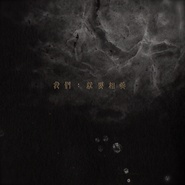

我们：就要相爱CHIU PI 1
============================

|  |  |
| :--: | :-- |
| [ 我们：就要相爱CHIU PI 1](https://emumo.xiami.com/album/1575236283) | **艺人**: [邱比](../index.md) **语种**: 国语 **唱片公司**: 独立发行 **发行时间**: 2013年08月02日 **专辑类别**: 录音室专辑 **专辑风格**:  **播放数**: 1957076 **收藏数**: 1896 **评论数**: 240  |

## 简介

CHIU PI 1

## 曲目

## 评论

|  |  |  |
| :-- | :-- | :-- |
|  [虾米用户](https://emumo.xiami.com/u/127131130)   2021-01-28 11:59 赞(0) 踩(0) | 
情人节快乐 亲爱的比比
 |
|  [虾米用户](https://emumo.xiami.com/u/23469324) 我还没想好要写什么... 2021-01-05 23:41 赞(2) 踩(0) | 
虾米要和我们说再见了，这张专辑还能在哪里聆听呢？
 |
|  [虾米用户](https://emumo.xiami.com/u/426284833)  2021-01-05 22:50 赞(0) 踩(0) | 
比比 不知道还能在哪再遇见你 ，这张专辑该去哪听呢
 |
|  [虾米用户](https://emumo.xiami.com/u/405635778)  2020-12-28 11:42 赞(0) 踩(0) | 
2021虾米不在了的话，这些还可以在哪里听呢？
 |
|  [虾米用户](https://emumo.xiami.com/u/53480717)  2020-11-30 14:24 赞(2) 踩(0) | 
21歲的邱比 關於死亡、虛榮、慾望、純真，和回憶裡的熱烈愛情。
 |
|  [虾米用户](https://emumo.xiami.com/u/252626203) 本來是個快樂的人 2020-04-24 04:13 赞(2) 踩(0) | 
好愛好愛
 |
|  [虾米用户](https://emumo.xiami.com/u/440071845)  2020-03-05 08:36 赞(1) 踩(0) | 
渗透。邱比是树，从我碰撞到他的时候，以后，没有节制。他是向内的 浮在心的洞口
 |
|  [虾米用户](https://emumo.xiami.com/u/38623875) 比正还正，正中之正。 2020-02-29 11:41 赞(0) 踩(0) | 
从头往下一首一首听，整张专辑太完整了，我被狠狠迷住！
 |
|  [虾米用户](https://emumo.xiami.com/u/9926954) 我还没想好要写什么... 2020-02-25 09:46 赞(2) 踩(0) | 
好多年前的专辑了，后面的专辑大多数都听过，唯独没有听到这张专辑，好听哭了！
 |
|  [虾米用户](https://emumo.xiami.com/u/1400679) 在音樂里做著漫長的白日夢 2019-12-21 14:12 赞(0) 踩(0) | 
最高！最爱！
 |
|  [虾米用户](https://emumo.xiami.com/u/8144207) 我还没想好要写什么... 2019-11-18 09:23 赞(1) 踩(0) | 
还是最喜欢这张专辑 希望在将来还能听到现场
 |
|  [虾米用户](https://emumo.xiami.com/u/330508355)  2019-09-09 09:14 赞(1) 踩(0) | 
我和我爱的你们:就要相爱
 |
|  [虾米用户](https://emumo.xiami.com/u/221940611) 氛围   摇滚  后摇 ... 2019-08-19 17:14 赞(0) 踩(0) | 
来自外太空的小王几~
 |
|  [虾米用户](https://emumo.xiami.com/u/221940611) 氛围   摇滚  后摇 ... 2019-08-11 10:38 赞(0) 踩(0) | 
我要是哪天能创作出这样的音乐，死了都值了。
 |
|  [虾米用户](https://emumo.xiami.com/u/85389256) 我是失去了悲痛的悲剧作家 2019-08-01 11:01 赞(4) 踩(0) | 
我现在正是邱比出这张专辑时的年龄
 |
|  [虾米用户](https://emumo.xiami.com/u/294770557)  2019-07-09 05:56 赞(0) 踩(0) | 
让我安稳，这张专辑让我觉得安稳。
 |
|  [虾米用户](https://emumo.xiami.com/u/8741301) still walkin... 2019-05-21 00:00 赞(2) 踩(0) | 
推荐给朋友。朋友说太好听了，是不知所措的好听。
 |
|  [虾米用户](https://emumo.xiami.com/u/125488788) 当感受内心  话语便显苍... 2019-05-17 10:55 赞(0) 踩(0) | 
不能拥有实专，是多少粉的痛！
 |
|  [虾米用户](https://emumo.xiami.com/u/307737864) keep cool, k... 2019-05-13 17:49 赞(1) 踩(0) | 
13年发布的。。。。太前卫了。。。太厉害了
 |
|  [虾米用户](https://emumo.xiami.com/u/358534096) 一個人 2019-05-08 15:46 赞(0) 踩(0) | 
我 迷恋 我们
 |
|  [虾米用户](https://emumo.xiami.com/u/221940611) 氛围   摇滚  后摇 ... 2019-05-02 12:08 赞(0) 踩(0) | 
孤独的你，多么迷人。
 |
|  [虾米用户](https://emumo.xiami.com/u/11857416) 瓦屋~ 2019-04-29 15:39 赞(0) 踩(0) | 
请问哪里可以买到这张的实体专辑~ 同时，，哪里还能买到正正的实体专辑..
 |
|  [虾米用户](https://emumo.xiami.com/u/400484838) 走路别玩手机 2019-04-17 08:29 赞(1) 踩(0) | 
天才
 |
|  [虾米用户](https://emumo.xiami.com/u/48276337) 22世纪不道德 2019-04-06 10:56 赞(0) 踩(0) | 
内容已删除
 |
| ⇒ |  [虾米用户](https://emumo.xiami.com/u/48276337) 22世纪不道德 2019-04-11 20:18 赞(0) 踩(0) | 
<q><b>说：</b></q>
 |
| ⇒ |  [虾米用户](https://emumo.xiami.com/u/257103143) 音乐爱好者~ 2019-05-08 12:11 赞(0) 踩(0) | 
<q><b>踱说：</b></q>
 |
| ⇒ |  [虾米用户](https://emumo.xiami.com/u/257103143) 音乐爱好者~ 2019-05-08 12:14 赞(0) 踩(0) | 
比比一直觉得爱是很伟大的事，所以我真的之前一直以为是“我们一定要相爱”.抱歉哈 
 |
| ⇒ |  [虾米用户](https://emumo.xiami.com/u/257103143) 音乐爱好者~ 2019-05-20 00:20 赞(0) 踩(0) | 
<q><b>说：</b></q>
 |
|  [虾米用户](https://emumo.xiami.com/u/96296322)  2019-03-17 13:53 赞(0) 踩(0) | 
.
 |
|  [虾米用户](https://emumo.xiami.com/u/404405724) 暖风过醉阁，你是让我沉醉... 2019-03-16 20:55 赞(1) 踩(0) | 
我不会忘记2016年听这部专辑它给我带来的落泪的感动。 
 |
|  [虾米用户](https://emumo.xiami.com/u/198225863) 乐于分享 2019-03-15 16:50 赞(1) 踩(0) | 
很喜欢这种自由的状态
 |
|  [虾米用户](https://emumo.xiami.com/u/362970194) 我还没想好要写什么... 2019-03-06 23:50 赞(0) 踩(0) | 
真的好愛這張專 它發行的日子剛好是我生日呢~
 |
|  [虾米用户](https://emumo.xiami.com/u/410397799)  2019-02-18 00:24 赞(0) 踩(0) | 
来补一补
 |
|  [虾米用户](https://emumo.xiami.com/u/221940611) 氛围   摇滚  后摇 ... 2019-02-15 16:49 赞(0) 踩(0) | 
几乎都要打红心 的哦
 |
|  [虾米用户](https://emumo.xiami.com/u/221940611) 氛围   摇滚  后摇 ... 2019-02-15 16:48 赞(0) 踩(0) | 
自认为这是邱比最牛最仙最惊艳的一张专辑。
 |
| ⇒ |  [虾米用户](https://emumo.xiami.com/u/183563324) 当你做你自己你是神一般的... 2019-03-28 00:18 赞(0) 踩(0) | 
我觉得正正才是最惊艳的
 |
|  [虾米用户](https://emumo.xiami.com/u/221940611) 氛围   摇滚  后摇 ... 2019-01-28 17:06 赞(0) 踩(0) | 
好美好美
 |
|  [虾米用户](https://emumo.xiami.com/u/66823378)  2019-01-10 20:26 赞(3) 踩(0) | 
这专是宝！独立发行的，全是邱比的味道。
 |
|  [虾米用户](https://emumo.xiami.com/u/55119842) 唯有音乐和文字不可遗落。 2019-01-08 02:50 赞(0) 踩(0) | 
又来回味了。
 |
|  [虾米用户](https://emumo.xiami.com/u/217822883) 我们外太空再见啦✧٩(ˊ... 2018-12-26 11:25 赞(0) 踩(0) | 
美妙
 |
|  [虾米用户](https://emumo.xiami.com/u/362970194) 我还没想好要写什么... 2018-12-22 22:13 赞(0) 踩(0) | 
我愛你
 |
|  [虾米用户](https://emumo.xiami.com/u/344026750) 我还没想好要写什么... 2018-10-19 03:18 赞(0) 踩(0) | 
太美了這張專輯
 |
|  [虾米用户](https://emumo.xiami.com/u/221940611) 氛围   摇滚  后摇 ... 2018-08-31 11:14 赞(0) 踩(0) | 
最好听了了了了了
 |
|  [虾米用户](https://emumo.xiami.com/u/339191478)   2018-08-02 00:52 赞(0) 踩(0) | 
❤
 |
|  [虾米用户](https://emumo.xiami.com/u/40836732)  2018-07-10 10:26 赞(0) 踩(0) | 
越听 越爱
 |
|  [虾米用户](https://emumo.xiami.com/u/66264174)  2018-06-03 16:02 赞(0) 踩(0) | 

 |
|  [虾米用户](https://emumo.xiami.com/u/342929031)  2018-06-01 20:54 赞(0) 踩(0) | 

 |
|  [虾米用户](https://emumo.xiami.com/u/222940608) 住的那户人家，他们不常说... 2018-05-04 13:07 赞(0) 踩(0) | 
爱～
 |
|  [虾米用户](https://emumo.xiami.com/u/72529860) 很不错 2018-04-29 18:50 赞(1) 踩(0) | 
我望着你
 |
|  [虾米用户](https://emumo.xiami.com/u/227385156)  2018-04-22 15:34 赞(1) 踩(0) | 
惊喜    欣喜     心喜 不厌    不倦     新鲜
 |
|  [虾米用户](https://emumo.xiami.com/u/340866388) 我还没想好要写什么... 2018-04-14 19:16 赞(4) 踩(0) | 
还是最喜欢这张碟，大放已经不安静了
 |
|  [虾米用户](https://emumo.xiami.com/u/55119842) 唯有音乐和文字不可遗落。 2018-04-03 23:42 赞(0) 踩(0) | 
我想听《比比》这首歌~♬ ♬ ♬
 |
|  [虾米用户](https://emumo.xiami.com/u/19877911) 暂无签名~ 2018-01-27 15:27 赞(1) 踩(0) | 
啊！！！4.4就能见到你了
 |
|  [虾米用户](https://emumo.xiami.com/u/15270473) 听到喜欢的歌 身体不跟着... 2018-01-02 19:16 赞(0) 踩(0) | 
-
 |
|  [虾米用户](https://emumo.xiami.com/u/125488788) 当感受内心  话语便显苍... 2017-12-21 23:39 赞(0) 踩(0) | 
拨动
 |
|  [虾米用户](https://emumo.xiami.com/u/8731730) 今夜你不关心人类 2017-12-12 00:27 赞(0) 踩(0) | 
ಠ.ಠ
 |
|  [虾米用户](https://emumo.xiami.com/u/53590447) 梦归隐 2017-12-11 17:03 赞(0) 踩(0) | 
.
 |
|  [虾米用户](https://emumo.xiami.com/u/273156876) 他的人生 浪漫迷幻 2017-11-22 17:00 赞(0) 踩(0) | 
1330 
 |
|  [虾米用户](https://emumo.xiami.com/u/125593446) no gender 2017-11-18 15:21 赞(0) 踩(0) | 
我怕是要爱上迷恋我的人了
 |
|  [虾米用户](https://emumo.xiami.com/u/66823378)  2017-11-05 22:33 赞(7) 踩(0) | 
本来心烦意乱的我听了比比的歌却是如此心平气和了：）
 |
|  [虾米用户](https://emumo.xiami.com/u/1187450) 给我老实点 2017-10-27 23:57 赞(3) 踩(0) | 
我就是爱这个男孩 就像我爱着张悬 薛凯琪 魏如萱那样 我爱他的敏感 爱他在阳光下显得轻薄像是羽毛那样洁白的睫毛 爱他在耳畔的碎碎念像是未来空间里传达美妙电波 爱他纤细的身体单薄的嘴唇亲吻时如同蜜桃 爱他炙热的眼神发射的火焰遍布全身的触感 爱他在遥不可及的未来期盼着一份完美的爱
 |
|  [虾米用户](https://emumo.xiami.com/u/15934597) 我还能说什么呢？？ 2017-10-27 23:47 赞(1) 踩(0) | 
我太想念你了，所以把爱你都念成了梦中的呓语，可是却还是无法缩短我们之间哪怕一厘米的距离，站在你面前，我们都害怕，像无法靠近的刺猬，忘了之前的熟悉
 |
|  [虾米用户](https://emumo.xiami.com/u/80774058) 自 由 散 漫 2017-10-27 21:27 赞(1) 踩(0) | 
love covers all wrongs
 |
|  [虾米用户](https://emumo.xiami.com/u/309012166) 奇妙的世界，邂逅CHIU... 2017-09-10 20:41 赞(0) 踩(0) | 
此时此刻，只有听这张专辑来缓解心里的不适了
 |
|  [虾米用户](https://emumo.xiami.com/u/6252735) 会飞 2017-08-21 11:42 赞(0) 踩(0) | 
比比
 |
|  [虾米用户](https://emumo.xiami.com/u/6252735) 会飞 2017-08-21 11:40 赞(0) 踩(0) | 
赦免
 |
|  [虾米用户](https://emumo.xiami.com/u/268673694) chiu pi 2017-08-12 21:05 赞(0) 踩(0) | 
:）
 |
|  [虾米用户](https://emumo.xiami.com/u/5188664)   2017-06-26 04:17 赞(0) 踩(0) | 
❤️
 |
|  [虾米用户](https://emumo.xiami.com/u/264283064) bye  2017-01-30 22:04 赞(3) 踩(0) | 
△
 |
|  [虾米用户](https://emumo.xiami.com/u/10627804)   2017-01-08 16:46 赞(1) 踩(0) | 
有时 痴迷 你
 |
|  [虾米用户](https://emumo.xiami.com/u/14219505) 不辞而别是最洒脱的方式。 2016-12-19 11:46 赞(2) 踩(0) | 
为什么都要付费了…
 |
|  [虾米用户](https://emumo.xiami.com/u/170211738) 上帝在开始爱着了 2016-11-04 06:32 赞(4) 踩(0) | 
我爱你 我爱 也只爱你
 |
|  [虾米用户](https://emumo.xiami.com/u/185890531)  2016-10-25 17:45 赞(15) 踩(0) | 
愚爱 &amp;quot;无畏的追悔与恨&amp;quot; 轻飘灵透的声调连绵.看得通透,看得见纷纷繁繁在手中静静演绎 &amp;quot;让大自然一刀刀地刮向你吧&amp;quot; 视察他人的迷与悲 切肤之感 缠绕心肺 清清透透 赤子之柔 雨降与义人，也降与不义人 爱 &amp;quot;以真乱假&amp;quot; 一针见血 明晰 奈何 幽淡  爱至情.情极,爱如孩童,才至愚爱 请赦免我啊 请赦免我的愚爱 这个世界是以真乱假 真真假假 清清迷迷... Had I not seen the Sun I could have borne the shade 你不是艺术家 我们怎么相爱(78) 准备好了吗 我的朋友 这样  诉说 珍珠  眼泪 我可以拥有你的爱吗  21岁遇见21岁 真好啊 --艺
 |
|  [虾米用户](https://emumo.xiami.com/u/33203895) Neutral Mind... 2016-09-29 02:45 赞(21) 踩(0) | 
邱比先生的自制味好足，如果摒除外表，他一定是一个专心玩garageband的宅男
 |
|  [虾米用户](https://emumo.xiami.com/u/124116232) 比比說愛是妳來到世上的原... 2016-07-20 23:32 赞(1) 踩(0) | 
再次相遇
 |
|  [虾米用户](https://emumo.xiami.com/u/49997905)  2016-05-28 17:31 赞(2) 踩(0) | 
为什么不能整张专辑买……非要一首一首买
 |
|  [虾米用户](https://emumo.xiami.com/u/124116232) 比比說愛是妳來到世上的原... 2016-05-11 02:19 赞(1) 踩(0) | 
遊吟詩人
 |
|  [虾米用户](https://emumo.xiami.com/u/13634431)  2016-04-30 17:08 赞(1) 踩(0) | 
聽了一次，就有買實體專輯的衝動，就買了。
 |
|  [虾米用户](https://emumo.xiami.com/u/47940626)  2016-04-26 22:44 赞(1) 踩(0) | 
每一次听都像是第一次听，随时随地充满了期待:)
 |
|  [虾米用户](https://emumo.xiami.com/u/5188664)   2016-04-25 00:13 赞(1) 踩(0) | 
睡觉前听
 |
|  [虾米用户](https://emumo.xiami.com/u/55280080)   2016-04-09 22:01 赞(7) 踩(0) | 
我喜欢你的名字
 |
|  [虾米用户](https://emumo.xiami.com/u/49430489) no need to l... 2016-03-31 16:55 赞(1) 踩(0) | 
反复听了很多次 已经开始想要去恋爱了的感觉。 嗯 先从爱上比比（的音乐）开始
 |
|  [虾米用户](https://emumo.xiami.com/u/127504084)   2016-03-31 09:31 赞(1) 踩(0) | 
走入心脏的音乐
 |
|  [虾米用户](https://emumo.xiami.com/u/3125663)  2016-03-29 09:55 赞(1) 踩(0) | 
好听
 |
|  [虾米用户](https://emumo.xiami.com/u/124745128) 一个秘密 2016-03-28 13:13 赞(1) 踩(0) | 
我记得有一首歌叫《比比》，我看mv的时候他说是在“我们：就要相爱”这张专辑里的，但是却找不到，是不是删除了？？
 |
|  [虾米用户](https://emumo.xiami.com/u/123104844) 不能舍弃音乐 2016-03-25 22:30 赞(1) 踩(0) | 
看着我 我的亲爱的 你要勇敢 你会快乐 
 |
|  [虾米用户](https://emumo.xiami.com/u/122308760) 没关系。我也想这么说。 2016-03-14 14:39 赞(1) 踩(0) | 
我的亲爱的
 |
|  [虾米用户](https://emumo.xiami.com/u/49997905)  2016-03-11 13:25 赞(1) 踩(0) | 
邱比实在太高产了
 |
|  [虾米用户](https://emumo.xiami.com/u/4878604) 我还没想好要写什么... 2016-03-09 15:42 赞(1) 踩(0) | 
又发现一个不接地气特立独行的小孩儿，有几分仙风道骨
 |
|  [虾米用户](https://emumo.xiami.com/u/50206030)   2016-03-05 20:49 赞(1) 踩(0) | 
每一首都是诗
 |
|  [虾米用户](https://emumo.xiami.com/u/35139489)  2016-02-17 17:30 赞(1) 踩(0) | 
立体音乐感，不失旋律美，无形胜有形。
 |
|  [虾米用户](https://emumo.xiami.com/u/8573800) 签名如昵称 2015-12-26 22:57 赞(1) 踩(0) | 
爱你
 |
|  [虾米用户](https://emumo.xiami.com/u/7156658) 听歌是人世间最美好的事情... 2015-12-17 12:31 赞(1) 踩(0) | 
“在宁静而安详的时刻你听见；在追求繁华世俗的时刻你听见”这一句话足以让我为你鼓掌！
 |
|  [虾米用户](https://emumo.xiami.com/u/5675442) 不痛的人不受煎熬 2015-11-21 13:46 赞(2) 踩(0) | 
听一天都不腻。
 |
|  [虾米用户](https://emumo.xiami.com/u/37877820) 但将痛饮酬风月，莫放离歌... 2015-11-13 00:34 赞(1) 踩(0) | 
感觉邱比在经历的和我在经历的是一样的东西。都加油吧
 |
|  [虾米用户](https://emumo.xiami.com/u/40836732)  2015-11-06 23:01 赞(1) 踩(0) | 
最爱这张，可以好好感受你
 |
|  [虾米用户](https://emumo.xiami.com/u/11294471)  2015-11-06 00:46 赞(1) 踩(0) | 
意识飘啊飘...
 |
|  [虾米用户](https://emumo.xiami.com/u/2027278) 我还没想好要写什么... 2015-10-05 16:57 赞(1) 踩(0) | 
歌倒是喜歡的哈
 |
|  [虾米用户](https://emumo.xiami.com/u/2027278) 我还没想好要写什么... 2015-10-03 23:05 赞(1) 踩(0) | 
專輯名略蠢
 |
|  [虾米用户](https://emumo.xiami.com/u/26109705) 温柔且酷 2015-10-03 16:43 赞(0) 踩(0) | 
迷幻如你 抓不住的你。。
 |
|  [虾米用户](https://emumo.xiami.com/u/7241111) 我还没想好要写什么... 2015-09-16 21:49 赞(1) 踩(0) | 
有点意思
 |
|  [虾米用户](https://emumo.xiami.com/u/5382689) I have no do... 2015-07-19 01:06 赞(1) 踩(0) | 
充满爱意的歌曲 听完跟他说了无数个我爱你
 |
|  [虾米用户](https://emumo.xiami.com/u/3169477)  2015-07-09 10:57 赞(1) 踩(0) | 
在你這張裡找到我的初衷
 |
|  [虾米用户](https://emumo.xiami.com/u/4907480)  2015-06-19 23:15 赞(1) 踩(0) | 
omg。。好喜欢好喜欢好喜欢
 |
|  [虾米用户](https://emumo.xiami.com/u/10117624)  2015-06-03 20:38 赞(0) 踩(0) | 
hao
 |
|  [虾米用户](https://emumo.xiami.com/u/18435211) 我还没想好要写什么... 2015-05-06 19:10 赞(1) 踩(0) | 
好听
 |
|  [虾米用户](https://emumo.xiami.com/u/1628381) 耳朵会吃人 2015-04-20 19:29 赞(1) 踩(0) | 
中国这样的迷幻真少，很赞每一首，每首都听不够，极简。好在产量太高！ 
 |
|  [虾米用户](https://emumo.xiami.com/u/1628381) 耳朵会吃人 2015-04-20 19:04 赞(1) 踩(0) | 
声音像女生的谜一样的男子，迷幻迷幻！
 |
|  [虾米用户](https://emumo.xiami.com/u/43186525) ... 2015-02-27 01:02 赞(1) 踩(0) | 
好有才情 喜欢声音
 |
|  [虾米用户](https://emumo.xiami.com/u/17310230) 暂无签名~ 2015-01-07 08:25 赞(1) 踩(0) | 
帅 .
 |
|  [虾米用户](https://emumo.xiami.com/u/478527) 好想跟衣服在洗衣机里滚 2015-01-05 12:57 赞(1) 踩(0) | 
你的作品
 |
|  [虾米用户](https://emumo.xiami.com/u/40836732)  2014-11-30 00:13 赞(18) 踩(0) | 
听着听着，一个人跳起舞来，做饭的时候，太迷人了，电子，迷幻，清新，诗意，奇特的融合，贴心贴肺，激发充满能量的,闪闪发光的寂寞。我爱你！
 |
|  [虾米用户](https://emumo.xiami.com/u/1126146) 我还没想好要写什么... 2014-10-02 12:50 赞(1) 踩(0) | 
虾米寻光集推了你这么久我都没听，太傻了我。 到今天才听你的专辑，好听到炸裂！ 我上一次会无限循环一个音乐人听一整天还是nujabes！ 你真的太棒啦，恨不得向所有朋友安利你！！
 |
| ⇒ |  [虾米用户](https://emumo.xiami.com/u/41583873) 哈哈哈哈 2014-11-21 20:17 赞(0) 踩(0) | 
恭喜你
 |
|  [虾米用户](https://emumo.xiami.com/u/1730251)  2014-09-16 22:20 赞(0) 踩(0) | 
想要《你的作品》的吉他谱
 |
|  [虾米用户](https://emumo.xiami.com/u/6087472)  2014-08-07 18:17 赞(1) 踩(0) | 
@测量学家 极简主义的新电子。
 |
|  [虾米用户](https://emumo.xiami.com/u/6087472)  2014-08-07 18:15 赞(0) 踩(0) | 
喜欢这种电子。@测量学家 你觉得呢？
 |
|  [虾米用户](https://emumo.xiami.com/u/40820)   2014-08-05 21:21 赞(1) 踩(0) | 
这个 虾米最近力推的 邱比 确实不错 音乐做的很有视觉感。
 |
|  [虾米用户](https://emumo.xiami.com/u/2332621) SELF. 2014-08-05 11:41 赞(1) 踩(0) | 
我们 很喜欢
 |
|  [虾米用户](https://emumo.xiami.com/u/2332621) SELF. 2014-08-05 11:39 赞(1) 踩(0) | 
很好啊第一首就很迷人
 |
|  [虾米用户](https://emumo.xiami.com/u/9362729) Rilkean Hear... 2014-08-05 00:16 赞(0) 踩(0) | 

 |
|  [虾米用户](https://emumo.xiami.com/u/11221879) time comes a... 2014-07-24 14:53 赞(1) 踩(0) | 
专辑换封面了?
 |
| ⇒ |  [虾米用户](https://emumo.xiami.com/u/22444238) 邱比官方虾米 2014-07-24 16:18 赞(0) 踩(0) | 
每一段時間想改一次，今年覺得可以有顏色
 |
| ⇒ |  [虾米用户](https://emumo.xiami.com/u/11221879) time comes a... 2014-07-25 14:42 赞(0) 踩(0) | 
<q><b>邱比 CHOVBE说：</b></q>
 |
| ⇒ |  [虾米用户](https://emumo.xiami.com/u/22444238) 邱比官方虾米 2014-07-25 16:13 赞(0) 踩(0) | 
<q><b>采桑木兰说：</b></q>
 |
|  [虾米用户](https://emumo.xiami.com/u/13973489) 黑白 2014-07-21 23:11 赞(0) 踩(0) | 
美而成熟  归于寂静的音乐
 |
| ⇒ |  [虾米用户](https://emumo.xiami.com/u/22444238) 邱比官方虾米 2014-07-22 13:32 赞(0) 踩(0) | 
:)
 |
|  [虾米用户](https://emumo.xiami.com/u/9630627) www.ttang.tw 2014-07-13 23:14 赞(0) 踩(0) | 
想請問邱比這張有報今年的金曲獎嗎? 這樣的實驗專輯在臺灣不多見了，真希望有更多人聽見你。
 |
| ⇒ |  [虾米用户](https://emumo.xiami.com/u/22444238) 邱比官方虾米 2014-07-13 23:47 赞(0) 踩(0) | 
謝謝，你的嘉許讓我有得獎的感覺
 |
|  [虾米用户](https://emumo.xiami.com/u/7333559) dream machin... 2014-06-28 13:57 赞(0) 踩(0) | 
已飘飘然矣
 |
| ⇒ |  [虾米用户](https://emumo.xiami.com/u/22444238) 邱比官方虾米 2014-07-13 23:59 赞(0) 踩(0) | 
放心一次風箏
 |
|  [虾米用户](https://emumo.xiami.com/u/37601963)  2014-06-15 10:56 赞(0) 踩(0) | 
如果能早几年遇见你多好 可是那时你还那么小 被浸染的 已经不知去感悟 理解你 只能自私的享受你带来的美好 多希望时间可以定格在那个下午 蓝天 白云 音乐荡漾 还有你 在舞台上  谢谢你 QB LU
 |
| ⇒ |  [虾米用户](https://emumo.xiami.com/u/22444238) 邱比官方虾米 2014-06-15 12:31 赞(0) 踩(0) | 
生命充滿變數
 |
| ⇒ |  [虾米用户](https://emumo.xiami.com/u/37601963)  2014-06-19 23:28 赞(0) 踩(0) | 
<q><b>邱比 CHOVBE说：</b></q>
 |
| ⇒ |  [虾米用户](https://emumo.xiami.com/u/22444238) 邱比官方虾米 2014-06-20 14:09 赞(0) 踩(0) | 
<q><b>秋瞳宛木说：</b></q>
 |
| ⇒ |  [虾米用户](https://emumo.xiami.com/u/37601963)  2014-06-20 22:10 赞(0) 踩(0) | 
<q><b>邱比 CHOVBE说：</b></q>
 |
|  [虾米用户](https://emumo.xiami.com/u/36775690)  2014-05-19 10:25 赞(0) 踩(0) | 
好听
 |
|  [虾米用户](https://emumo.xiami.com/u/2815764)  2014-05-17 16:05 赞(0) 踩(0) | 
羽毛一样的歌声。好听得飞起来。好喜欢《傻》和《我看不见你了》！进入循环模式
 |
| ⇒ |  [虾米用户](https://emumo.xiami.com/u/22444238) 邱比官方虾米 2014-05-19 20:14 赞(0) 踩(0) | 
me too
 |
|  [虾米用户](https://emumo.xiami.com/u/11122048)  2014-05-12 23:46 赞(0) 踩(0) | 
今年真只有22吗？
 |
| ⇒ |  [虾米用户](https://emumo.xiami.com/u/22444238) 邱比官方虾米 2014-07-13 23:50 赞(0) 踩(0) | 
是，過了十月十七滿23
 |
| ⇒ |  [虾米用户](https://emumo.xiami.com/u/11306291)   2014-08-05 00:08 赞(0) 踩(0) | 
<q><b>邱比 CHOVBE说：</b></q>
 |
|  [虾米用户](https://emumo.xiami.com/u/16110590)  2014-05-04 09:38 赞(0) 踩(0) | 
实验音乐，爱听的都是孤独症患者
 |
| ⇒ |  [虾米用户](https://emumo.xiami.com/u/22444238) 邱比官方虾米 2014-07-13 23:50 赞(0) 踩(0) | 
新穎的觀點
 |
|  [虾米用户](https://emumo.xiami.com/u/1609946) 一即一切 2014-04-17 21:12 赞(0) 踩(0) | 
心 境不二
 |
|  [虾米用户](https://emumo.xiami.com/u/1450951) 我还没想好要写什么... 2014-04-14 18:18 赞(0) 踩(0) | 
久违的亲密与疏离并存的感觉 上次在歌里感受到和歌手有亲密关系还是六七年前高中的时候！
 |
| ⇒ |  [虾米用户](https://emumo.xiami.com/u/22444238) 邱比官方虾米 2014-07-13 23:50 赞(0) 踩(0) | 
：）
 |
|  [虾米用户](https://emumo.xiami.com/u/7521506) 沉睡在安静的世界 2014-04-12 12:44 赞(0) 踩(0) | 
上帝在开始爱着了 单曲循环一天现在有点儿想飞
 |
| ⇒ |  [虾米用户](https://emumo.xiami.com/u/22444238) 邱比官方虾米 2014-07-13 23:50 赞(0) 踩(0) | 
請飛
 |
|  [虾米用户](https://emumo.xiami.com/u/2278977) the owner of... 2014-04-11 12:59 赞(0) 踩(0) | 
全推荐 全部好喜欢
 |
|  [虾米用户](https://emumo.xiami.com/u/10687459)  2014-04-09 02:04 赞(56) 踩(0) | 
一直觉得你的名字起得很好，今天突然想想了为什么 让我联想到佛教比邱的清雅闲适，信仰的饱满热烈 行过万物，万物生于我心 还有就是哈利波特里的精灵多比了，哈哈 森林里真善美的化身，无所不能，却自律虔诚   谢谢你也对你喜欢你音乐的人这么好；D 支持，对我们来讲是让更多人有享受空灵曼妙的机会
 |
|  [虾米用户](https://emumo.xiami.com/u/14626273) 暂无签名~ 2014-04-08 09:32 赞(0) 踩(0) | 
亲爱的邱比 你的音乐 你的文字被我深深喜爱着 携起万分期待你的小说和新专辑
 |
|  [虾米用户](https://emumo.xiami.com/u/2109049) 我的死亡們對生存局部誤解 2014-04-05 14:45 赞(0) 踩(0) | 
誰給的“女聲”這個標籤。
 |
| ⇒ |  [虾米用户](https://emumo.xiami.com/u/187341) 不管我本人多么平庸 2014-04-05 15:50 赞(0) 踩(0) | 
啊哈哈哈哈哈哈哈哈哈哈哈哈怪不得脑中总有&amp;quot;邱比是我女神 惠婷是我男神&amp;quot;的想法
 |
| ⇒ |  [虾米用户](https://emumo.xiami.com/u/2109049) 我的死亡們對生存局部誤解 2014-04-05 15:59 赞(0) 踩(0) | 
<q><b>在这颗行星所有的菌说：</b></q>
 |
| ⇒ |  [虾米用户](https://emumo.xiami.com/u/1071832) 我还没想好要写什么... 2014-04-06 17:52 赞(0) 踩(0) | 
<q><b>在这颗行星所有的菌说：</b></q>
 |
| ⇒ |  [虾米用户](https://emumo.xiami.com/u/187341) 不管我本人多么平庸 2014-04-07 00:48 赞(0) 踩(0) | 
<q><b>o-range-wage说：</b></q>
 |
| ⇒ |  [虾米用户](https://emumo.xiami.com/u/1450951) 我还没想好要写什么... 2014-04-14 18:11 赞(0) 踩(0) | 
<q><b>在这颗行星所有的菌说：</b></q>
 |
| ⇒ |  [虾米用户](https://emumo.xiami.com/u/2809730)  2014-07-28 14:36 赞(0) 踩(0) | 
<q><b>在这颗行星所有的菌说：</b></q>
 |
|  [虾米用户](https://emumo.xiami.com/u/32135023)  2014-04-04 14:57 赞(1) 踩(0) | 
21岁的邱比以恼海中挥之不去的印象为创作灵感将生命之海的画面整理成你我都似曾熟悉的旋律
 |
|  [虾米用户](https://emumo.xiami.com/u/187341) 不管我本人多么平庸 2014-04-04 13:59 赞(0) 踩(0) | 
闻到余晖 清风 绿荫 海浪一遍遍冲刷眼睛
 |
|  [虾米用户](https://emumo.xiami.com/u/18703112)  2014-04-04 13:47 赞(0) 踩(0) | 
飞了打开虾米随便听，听到这个简直太棒 舒服到无话可说 简直在云中
 |
|  [虾米用户](https://emumo.xiami.com/u/11201904)   2014-04-04 13:19 赞(0) 踩(0) | 
简到深处，就有种是魂是魄的惊艳。
 |
|  [虾米用户](https://emumo.xiami.com/u/33538264)  2014-04-04 12:32 赞(0) 踩(0) | 
脱俗的音乐，越听赿入心。
 |
|  [虾米用户](https://emumo.xiami.com/u/8672694) 我还没想好要写什么... 2014-04-03 21:25 赞(1) 踩(0) | 
你让我觉得生活即使很平淡 也美的像首诗
 |
|  [虾米用户](https://emumo.xiami.com/u/33450248) 荷马和我在丹吉尔城门分手... 2014-04-02 23:21 赞(0) 踩(0) | 
简单而深刻
 |
|  [虾米用户](https://emumo.xiami.com/u/31410106)   2014-04-01 22:57 赞(0) 踩(0) | 
你怎么形容你的音乐风格呀？听起来很有意思，很抓人！
 |
|  [虾米用户](https://emumo.xiami.com/u/8300839)   2014-04-01 10:06 赞(0) 踩(0) | 
聽了第一遍，最喜歡：上帝在开始爱着了  聽得要飛起來啦，愛你的音樂
 |
| ⇒ |  [虾米用户](https://emumo.xiami.com/u/22444238) 邱比官方虾米 2014-04-01 11:17 赞(0) 踩(0) | 
我也很喜欢这一首歌
 |
|  [虾米用户](https://emumo.xiami.com/u/1220899) 夜是飞行好时机。 2014-03-31 21:56 赞(0) 踩(0) | 
第一次听，听了一天～
 |
| ⇒ |  [虾米用户](https://emumo.xiami.com/u/22444238) 邱比官方虾米 2014-03-31 23:10 赞(0) 踩(0) | 
偶尔听听其他音乐人，换换口味
 |
| ⇒ |  [虾米用户](https://emumo.xiami.com/u/1220899) 夜是飞行好时机。 2014-03-31 23:54 赞(0) 踩(0) | 
<q><b>邱比 CHOVBE说：</b></q>
 |
|  [虾米用户](https://emumo.xiami.com/u/6331728)  2014-03-31 17:49 赞(0) 踩(0) | 
大爱此专辑。邱比的声音美得没话说啊！
 |
| ⇒ |  [虾米用户](https://emumo.xiami.com/u/22444238) 邱比官方虾米 2014-03-31 19:52 赞(0) 踩(0) | 
谢谢鼓励，你最喜欢哪一首歌呢？
 |
| ⇒ |  [虾米用户](https://emumo.xiami.com/u/6331728)  2014-04-02 19:08 赞(0) 踩(0) | 
<q><b>邱比 CHOVBE说：</b></q>
 |
|  [虾米用户](https://emumo.xiami.com/u/6331728)  2014-03-31 17:43 赞(0) 踩(0) | 
我喜欢邱比的声音。
 |
|  [虾米用户](https://emumo.xiami.com/u/16011241)  2014-03-31 15:59 赞(0) 踩(0) | 
曲子都好有画面感~~总能在你的音乐里看到类似电影的桥段~有时像看慢镜头回放，有时就高潮迭起或催人泪下~~好像听到了你的情感~
 |
| ⇒ |  [虾米用户](https://emumo.xiami.com/u/22444238) 邱比官方虾米 2014-03-31 19:52 赞(0) 踩(0) | 
非常浓烈的各种感情如果打出了文字就怕煽情了，拿来唱一唱比较和缓
 |
| ⇒ |  [虾米用户](https://emumo.xiami.com/u/16011241)  2014-04-02 14:55 赞(0) 踩(0) | 
<q><b>邱比 CHOVBE说：</b></q>
 |
|  [虾米用户](https://emumo.xiami.com/u/5569055)  2014-03-31 11:06 赞(1) 踩(0) | 
类似耳语  模糊但是内心清晰的声音 氲氤雾气  灵秀间不知不觉浸湿了心灵 游离迷幻  最简单的就是最直接的本性需求 梦幻重复  舞动的梦境也许才是另一番真实 用灵魂舞着  唱着  行走着  非常棒！非常爱！
 |
| ⇒ |  [虾米用户](https://emumo.xiami.com/u/22444238) 邱比官方虾米 2014-03-31 11:30 赞(0) 踩(0) | 
我们就要相爱 , 看来如此了
 |
|  [虾米用户](https://emumo.xiami.com/u/11577553)   2014-03-30 21:20 赞(0) 踩(0) | 
第一次看到那么亲民的歌手啊~~也是第一次听他的歌 封面每个都好特别，歌手长得也好干净，歌曲也很纯静。 哎妈呀，好可爱
 |
|  [虾米用户](https://emumo.xiami.com/u/7647547) 垂死的岁末 2014-03-30 17:51 赞(0) 踩(0) | 
我在学习，看英文教程，听你的专辑我无法用心学习~
 |
| ⇒ |  [虾米用户](https://emumo.xiami.com/u/22444238) 邱比官方虾米 2014-03-30 23:04 赞(0) 踩(0) | 
那就需要更大的觉知去读英文了，是门修行呀！
 |
|  [虾米用户](https://emumo.xiami.com/u/5470345) 人生天地间，忽如远行客。 2014-03-29 23:37 赞(0) 踩(0) | 
极简主义 这个理念太迷人~  甚爱
 |
|  [虾米用户](https://emumo.xiami.com/u/2773871) 无定义男子 2014-03-28 11:53 赞(0) 踩(0) | 
有人说过声线很像青峰么？不得不赞一个啊！一个人在看书，一个人晒着太阳，或者晚上关灯后睁着眼睛看天花板，听这些歌，都会在某些莫名的时刻被hit到，莫名的就repeat了一遍又一遍。
 |
| ⇒ |  [虾米用户](https://emumo.xiami.com/u/22444238) 邱比官方虾米 2014-03-30 23:03 赞(0) 踩(0) | 
谢谢小肥君诚意的分享心得给我
 |
|  [虾米用户](https://emumo.xiami.com/u/34464349)  2014-03-26 16:09 赞(0) 踩(0) | 
好听
 |
|  [虾米用户](https://emumo.xiami.com/u/33678789)  2014-03-19 08:49 赞(0) 踩(0) | 
真的超贴心~ 一直回复评论，加油~
 |
| ⇒ |  [虾米用户](https://emumo.xiami.com/u/22444238) 邱比官方虾米 2014-03-19 17:12 赞(0) 踩(0) | 
：）
 |
|  [虾米用户](https://emumo.xiami.com/u/14626273) 暂无签名~ 2014-02-14 17:55 赞(1) 踩(0) | 
把所有的专辑和demo循环好几遍 仍有意犹未尽之感 相信它们能伴我度过好些日夜 谢谢你 邱比
 |
|  [虾米用户](https://emumo.xiami.com/u/14626273) 暂无签名~ 2014-02-12 15:51 赞(1) 踩(0) | 
很是喜欢。让我想到夏宇的诗
 |
| ⇒ |  [虾米用户](https://emumo.xiami.com/u/22444238) 邱比官方虾米 2014-02-12 16:40 赞(0) 踩(0) | 
您可以听听看我和夏宇诗人合作的歌曲“整夜大雨”
 |
| ⇒ |  [虾米用户](https://emumo.xiami.com/u/14626273) 暂无签名~ 2014-02-12 17:22 赞(0) 踩(0) | 
<q><b>邱比 CHOVBE说：</b></q>
 |
| ⇒ |  [虾米用户](https://emumo.xiami.com/u/22444238) 邱比官方虾米 2014-02-12 17:28 赞(0) 踩(0) | 
<q><b>LakeDaum说：</b></q>
 |
| ⇒ |  [虾米用户](https://emumo.xiami.com/u/14626273) 暂无签名~ 2014-02-12 17:36 赞(0) 踩(0) | 
<q><b>邱比 CHOVBE说：</b></q>
 |
| ⇒ |  [虾米用户](https://emumo.xiami.com/u/621451)  2014-02-26 23:40 赞(0) 踩(0) | 
<q><b>邱比 CHOVBE说：</b></q>
 |
|  [虾米用户](https://emumo.xiami.com/u/361604)  2014-02-11 21:58 赞(0) 踩(0) | 
你的很多 可以做成小片 我愿意给你配图
 |
| ⇒ |  [虾米用户](https://emumo.xiami.com/u/22444238) 邱比官方虾米 2014-02-11 21:59 赞(0) 踩(0) | 
谢谢，交给您試試了？
 |
| ⇒ |  [虾米用户](https://emumo.xiami.com/u/361604)  2014-02-11 22:05 赞(0) 踩(0) | 
<q><b>邱比 CHOVBE说：</b></q>
 |
| ⇒ |  [虾米用户](https://emumo.xiami.com/u/22444238) 邱比官方虾米 2014-02-11 22:17 赞(0) 踩(0) | 
<q><b>cc说：</b></q>
 |
|  [虾米用户](https://emumo.xiami.com/u/7284384)  2014-02-10 21:46 赞(0) 踩(0) | 
都说感觉很重要也很可贵 此刻 我只想说 好有感觉
 |
| ⇒ |  [虾米用户](https://emumo.xiami.com/u/22444238) 邱比官方虾米 2014-02-11 11:18 赞(0) 踩(0) | 
谢谢你，希望你听听我的最新单曲：东京铁塔
 |
|  [虾米用户](https://emumo.xiami.com/u/13489190) 喜欢的拜托请靠近 2014-02-09 11:46 赞(0) 踩(0) | 
~~~~
 |
| ⇒ |  [虾米用户](https://emumo.xiami.com/u/22444238) 邱比官方虾米 2014-02-11 11:11 赞(0) 踩(0) | 
：）
 |
| ⇒ |  [虾米用户](https://emumo.xiami.com/u/13489190) 喜欢的拜托请靠近 2014-02-11 14:25 赞(0) 踩(0) | 
<q><b>邱比 CHOVBE说：</b></q>
 |
| ⇒ |  [虾米用户](https://emumo.xiami.com/u/22444238) 邱比官方虾米 2014-02-11 14:41 赞(0) 踩(0) | 
<q><b>MorgenSchon说：</b></q>
 |
|  [虾米用户](https://emumo.xiami.com/u/4139973)  2014-02-08 11:16 赞(0) 踩(0) | 
很有画面感的音乐
 |
|  [虾米用户](https://emumo.xiami.com/u/369803) 我在天堂你在看 2014-02-07 21:00 赞(0) 踩(0) | 
凡是概念完整，让人感觉到心意的专辑，都值得推荐。
 |
|  [虾米用户](https://emumo.xiami.com/u/8991415) 以为奋力的奔向远方，其实... 2014-02-07 12:29 赞(0) 踩(0) | 
有趣
 |
|  [虾米用户](https://emumo.xiami.com/u/6507607) 请把我的尸体埋在音乐里。 2014-01-31 15:23 赞(1) 踩(0) | 
女声是谁呀？
 |
| ⇒ |  [虾米用户](https://emumo.xiami.com/u/22444238) 邱比官方虾米 2014-02-02 16:38 赞(0) 踩(0) | 
您好，是我的声音
 |
| ⇒ |  [虾米用户](https://emumo.xiami.com/u/6507607) 请把我的尸体埋在音乐里。 2014-02-02 18:16 赞(0) 踩(0) | 
<q><b>邱比 CHOVBE说：</b></q>
 |
| ⇒ |  [虾米用户](https://emumo.xiami.com/u/22444238) 邱比官方虾米 2014-02-02 20:57 赞(0) 踩(0) | 
<q><b>mengonly13说：</b></q>
 |
| ⇒ |  [虾米用户](https://emumo.xiami.com/u/6507607) 请把我的尸体埋在音乐里。 2014-02-02 22:16 赞(0) 踩(0) | 
<q><b>邱比 CHOVBE说：</b></q>
 |
| ⇒ |  [虾米用户](https://emumo.xiami.com/u/22444238) 邱比官方虾米 2014-02-11 11:26 赞(0) 踩(0) | 
<q><b>mengonly13说：</b></q>
 |
|  [虾米用户](https://emumo.xiami.com/u/11635754) Beacon 2014-01-21 16:34 赞(0) 踩(0) | 
好玩
 |
|  [虾米用户](https://emumo.xiami.com/u/7890606)  2013-11-14 21:43 赞(0) 踩(0) | 
从他的歌声里，你可以听到你的全世界～
 |
|  [虾米用户](https://emumo.xiami.com/u/1053121)  2013-11-03 06:51 赞(0) 踩(0) | 
喜欢
 |
|  [虾米用户](https://emumo.xiami.com/u/22444238) 邱比官方虾米 2013-09-20 01:38 赞(306) 踩(0) | 
稍早已將全數歌曲上傳，謝謝內地熱愛藝術的朋友，我愛你們
 |
| ⇒ |  [虾米用户](https://emumo.xiami.com/u/7890606)  2013-11-14 21:44 赞(0) 踩(0) | 
期待你更多的作品可以在大陆上市～ 爱你～
 |
| ⇒ |  [虾米用户](https://emumo.xiami.com/u/22444238) 邱比官方虾米 2013-11-19 00:18 赞(0) 踩(0) | 
<q><b>2088102139719216说：</b></q>
 |
| ⇒ |  [虾米用户](https://emumo.xiami.com/u/2838931) 暂无签名~ 2014-04-01 10:07 赞(0) 踩(0) | 
cd哪里可以卖了？
 |
| ⇒ |  [虾米用户](https://emumo.xiami.com/u/22444238) 邱比官方虾米 2014-04-01 11:16 赞(0) 踩(0) | 
<q><b>Zimmer说：</b></q>
 |
| ⇒ |  [虾米用户](https://emumo.xiami.com/u/8108665) - 2015-04-17 08:30 赞(0) 踩(0) | 
加油
 |
| ⇒ |  [虾米用户](https://emumo.xiami.com/u/1801715) 我还没想好要写什么... 2015-04-21 20:03 赞(0) 踩(0) | 
比比我爱死你了怎么办
 |
| ⇒ |  [虾米用户](https://emumo.xiami.com/u/13640189) 我还没想好要写什么... 2017-02-08 04:17 赞(0) 踩(0) | 
也爱你
 |
| ⇒ |  [虾米用户](https://emumo.xiami.com/u/122664704) Be silence. 2017-05-05 09:39 赞(0) 踩(0) | 
我也爱！
 |
| ⇒ |  [虾米用户](https://emumo.xiami.com/u/66823378)  2017-11-05 22:30 赞(0) 踩(0) | 
我也爱你
 |
| ⇒ |  [虾米用户](https://emumo.xiami.com/u/28429878) 我还没想好要写什么... 2017-11-27 23:39 赞(0) 踩(0) | 
我也爱你！！
 |
| ⇒ |  [虾米用户](https://emumo.xiami.com/u/277448110)   2018-01-22 15:01 赞(0) 踩(0) | 
太爱你w
 |
| ⇒ |  [虾米用户](https://emumo.xiami.com/u/13126400)  2018-05-03 17:56 赞(0) 踩(0) | 
我爱你❤:)
 |
| ⇒ |  [虾米用户](https://emumo.xiami.com/u/221940611) 氛围   摇滚  后摇 ... 2018-08-04 18:40 赞(0) 踩(0) | 
我爱你！ ！
 |
| ⇒ |  [虾米用户](https://emumo.xiami.com/u/368445488)  2018-08-04 23:57 赞(0) 踩(0) | 
我爱你，邱比，很爱很爱你。
 |
| ⇒ |  [虾米用户](https://emumo.xiami.com/u/50830665) Pray to the ... 2019-05-20 02:35 赞(0) 踩(0) | 
谢谢你的艺术，我爱你
 |
| ⇒ |  [虾米用户](https://emumo.xiami.com/u/411218928) 喜欢电子音乐 2019-08-06 00:13 赞(0) 踩(0) | 
欣赏你
 |
| ⇒ |  [虾米用户](https://emumo.xiami.com/u/47264619)  2019-10-25 16:27 赞(0) 踩(0) | 
我们也爱你，谢谢你的作品
 |
|  [虾米用户](https://emumo.xiami.com/u/4129448)  2013-09-17 16:01 赞(0) 踩(0) | 
内容已删除
 |
| ⇒ |  [虾米用户](https://emumo.xiami.com/u/22444238) 邱比官方虾米 2013-09-21 14:41 赞(0) 踩(0) | 
已上傳該首歌曲
 |
| ⇒ |  [虾米用户](https://emumo.xiami.com/u/4129448)  2013-09-21 18:43 赞(0) 踩(0) | 
<q><b>邱比 CHOVBE说：</b></q>
 |
|  [虾米用户](https://emumo.xiami.com/u/10607840)  2013-09-15 17:32 赞(0) 踩(0) | 
版主， 请记得更新哦~ 在youtube 听了邱比的音乐， 深深地被吸引着。 浓浓的new age气息~
 |
| ⇒ |  [虾米用户](https://emumo.xiami.com/u/22444238) 邱比官方虾米 2013-09-21 14:41 赞(0) 踩(0) | 
已全數更新
 |
