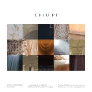

隐园之美 echo of SPLENDOR
============================

|  |  |
| :--: | :-- |
| [ 隐园之美 echo of SPLENDOR](https://emumo.xiami.com/album/2103722330) | **艺人**: [邱比](../index.md) **语种**: 纯音乐 **唱片公司**: ROKON滚石电音 **发行时间**: 2018年06月01日 **专辑类别**: 录音室专辑 **专辑风格**: 电子 Electronic **播放数**: 326850 **收藏数**: 1129 **评论数**: 217  |

## 简介

隐园之美 echo of SPLENDOR  
  
亚洲华语乐坛3地乐评人齐声认证  
2017年度10大华语专辑“大放 SPLENDOR”  
  
2017年12月22日全网上架  
2018年03月07日实体发行  
2018年06月01日继续进化  
  
解构再建构  
“创新艺术家”CHIU PI邱比  
纯音乐角度重新诠释、重新阅读“大放 SPLENDOR”里15首歌曲、15个文本  
推出“隐园之美 echo of SPLENDOR”  
  
美国新世代饶舌王者：Kendrick Lamar本人曾向媒体表示，他在2017年推出的专辑“DAMN.”最有趣的地方在于：“顺着歌曲顺序听，它是一张专辑，从最后一首歌曲往前听到第一首歌曲，它又是另外一张专辑。Kendrick Lamar如此前卫、极具概念性的宏观创作思维，催生出特别发行的“DAMN. Collectors Edition”原本14首曲目顺序颠倒，完全展现创作初衷和概念之余；更让人能聆听到“另外一张全新专辑！”  
  
而90后的华语电子音乐制作人、歌手：CHIU PI邱比，则更进一步发扬光大，将“大放 SPLENDOR”里的15首歌曲再以纯音乐角度重新改编，继续用诗意的电音语言表现无尽无休的平衡；致敬前作“大放 SPLENDOR”，借由翻新前作聚集回声，让属于电子音符的花影众声喧哗，开创全新格局与创作企图。  
  
CHIU PI邱比在长期接触音乐、美术、影像、表演、武术和现代舞等动态训练后于二○一三年起陆续推出标志鲜明的作品，在亚洲发行了16张数字专辑、3张华语唱碟，和“最后安慰”科幻寓言。  
  
加盟滚石首届电子厂牌：ROKON滚石电音后，CHIU PI邱比将既有的艺术风格升华至更加隽永和灵性：侧重于内心世界的精气神和谐，以内观敞开自由可能性。  
  
他将空灵禅意和前卫时尚重塑出极简的梦幻电音；以实验原创平衡了古老自然与数位技术，使刻板与多元之间的两极相系。并在哲学、诗与神话的背景下，重新构想人类经验的未来，如平地一声雷觉醒艺坛。  
  
而CHIU PI邱比的“上下一方”TOUR 2018北京反场，将于6月8日晚上在疆进酒举行，台北首演，也将于7月27日晚上在永丰 Legacy 传 音乐展演空间举行。  
  
 

## 曲目

## 评论

|  |  |  |
| :-- | :-- | :-- |
|  [虾米用户](https://emumo.xiami.com/u/421180295)  2020-08-24 12:34 赞(1) 踩(0) | 
听了很久之后，最爱这盘！
 |
|  [虾米用户](https://emumo.xiami.com/u/49689813) DJ/Live/时装秀/... 2019-11-08 22:32 赞(1) 踩(0) | 
非常不错
 |
|  [虾米用户](https://emumo.xiami.com/u/45323236) 必有所获 2019-09-19 22:42 赞(0) 踩(0) | 
谓之“高级”
 |
|  [虾米用户](https://emumo.xiami.com/u/7709271) 音乐是我的生命 2019-05-04 20:57 赞(0) 踩(0) | 
去年听现场的时候，就在期待会不会出纯音乐版本，不仅出了，而且在原来的曲子上再创新～
 |
|  [虾米用户](https://emumo.xiami.com/u/43796342) 我还没想好要写什么... 2019-05-02 12:03 赞(0) 踩(0) | 
好听
 |
|  [虾米用户](https://emumo.xiami.com/u/96296322)  2019-04-03 22:02 赞(0) 踩(0) | 
.
 |
|  [虾米用户](https://emumo.xiami.com/u/325374787)  2019-04-01 21:54 赞(0) 踩(0) | 
好
 |
|  [虾米用户](https://emumo.xiami.com/u/46185492) 音乐和自然 2019-02-16 20:58 赞(0) 踩(0) | 
个人感觉整专下来没有古典园林的那种感觉，也表现不出其他意境，纯属自嗨的感觉。
 |
| ⇒ |  [虾米用户](https://emumo.xiami.com/u/16923888)   2019-02-22 03:45 赞(0) 踩(0) | 
无关乎古典园林 我理解的这张隐园 每一首都构建了不同的空间（如果你了解一些极简音乐的话 能够明白最初这种音乐类型用声音材料建构空间的表达理念）有恢弘广阔的 也有幽秘的 几何状簇突变的 也有一些会让我一直想到宇宙。这就是我感受到的美妙之处 我觉得太空里如果能够有音乐大概就会是这种状态的 希望经由我的表述你能领会到一点
 |
| ⇒ |  [虾米用户](https://emumo.xiami.com/u/46185492) 音乐和自然 2019-02-24 21:31 赞(0) 踩(0) | 
<q><b>Wikimedia说：</b></q>
 |
| ⇒ |  [虾米用户](https://emumo.xiami.com/u/46185492) 音乐和自然 2019-02-25 08:58 赞(0) 踩(0) | 
<q><b>Wikimedia说：</b></q>
 |
| ⇒ |  [虾米用户](https://emumo.xiami.com/u/423581370) Dire-vrai.  2019-05-24 23:38 赞(0) 踩(0) | 
《隐园之美》是《大放SPLENDOR》的阴面，抽掉了后者中的人声和电子的部分，因为艺术家觉得，人只有在隐园中才能更深刻地了解自己。
 |
| ⇒ |  [虾米用户](https://emumo.xiami.com/u/45323236) 必有所获 2019-09-19 22:48 赞(0) 踩(0) | 
这感觉本就应该存在，不会有太多人感觉得到。这张专辑本就不和古典园林有多么大的联系。 很建议你看一下介绍。 我大概知道你要这么评论的原因。隐园可不一定是“古典园林”。 总之因人而异。“自嗨”在这篇评论区里应该只有你。
 |
| ⇒ |  [虾米用户](https://emumo.xiami.com/u/45323236) 必有所获 2019-09-19 22:49 赞(0) 踩(0) | 
<q><b>悠久华说：</b></q>
 |
| ⇒ |  [虾米用户](https://emumo.xiami.com/u/46185492) 音乐和自然 2019-09-23 20:25 赞(0) 踩(0) | 
<q><b>纡余说：</b></q>
 |
| ⇒ |  [虾米用户](https://emumo.xiami.com/u/45323236) 必有所获 2019-09-23 22:36 赞(0) 踩(0) | 
<q><b>悠久华说：</b></q>
 |
| ⇒ |  [虾米用户](https://emumo.xiami.com/u/46185492) 音乐和自然 2019-10-10 12:25 赞(0) 踩(0) | 
<q><b>纡余说：</b></q>
 |
|  [虾米用户](https://emumo.xiami.com/u/6331728)  2019-01-23 15:49 赞(3) 踩(0) | 
每一首都不同，每一首都有特色的美，邱比是个天才。
 |
|  [虾米用户](https://emumo.xiami.com/u/47139708) 我还没想好要写什么... 2018-12-26 03:10 赞(2) 踩(0) | 
13 15
 |
|  [虾米用户](https://emumo.xiami.com/u/344348888) 我还没想好要写什么... 2018-12-04 00:08 赞(2) 踩(0) | 
❤️
 |
|  [虾米用户](https://emumo.xiami.com/u/45323236) 必有所获 2018-11-11 21:11 赞(1) 踩(0) | 
偶尔将TA与《大放》放在一起听又会是第三组蔓延开来的感觉与想象道路的开端。
 |
|  [虾米用户](https://emumo.xiami.com/u/246180685) 打包我的心当午餐吧宝贝 2018-10-30 16:14 赞(7) 踩(0) | 
相比于「大放」的闪烁耀眼，我認為這張要隐秘很多。 它安静不直白，却又蕴含无穷力量，每一个鼓点都在释放讯息，很丰富，但也夠空旷。外人或許只能道其“空”，而无法体会它的「格局宏大」與「廣闊無垠」。  还好，我们還有一个「邱比」。
 |
|  [虾米用户](https://emumo.xiami.com/u/50289273) 我还没想好要写什么... 2018-10-27 07:07 赞(3) 踩(0) | 
世界行进着它的庞大，出口不断涌现的蝴蝶在扑闪
 |
|  [虾米用户](https://emumo.xiami.com/u/42893179) 叫我珍子就行。 2018-10-25 18:38 赞(1) 踩(0) | 
太适合去做电影配乐了
 |
|  [虾米用户](https://emumo.xiami.com/u/166586472) 我还没想好要写什么... 2018-09-17 05:12 赞(1) 踩(0) | 
⭐️
 |
|  [虾米用户](https://emumo.xiami.com/u/54950259) Fluidflux 2018-08-13 13:04 赞(2) 踩(0) | 
每次不知道听什么好的时候，就想起这张
 |
|  [虾米用户](https://emumo.xiami.com/u/221940611) 氛围   摇滚  后摇 ... 2018-08-10 17:49 赞(1) 踩(0) | 
比比都有26张专辑啦
 |
|  [虾米用户](https://emumo.xiami.com/u/126872994)   2018-07-27 11:11 赞(1) 踩(0) | 
get
 |
|  [虾米用户](https://emumo.xiami.com/u/75474800) 你发现我了，憨憨 2018-07-19 01:11 赞(1) 踩(0) | 
棒！
 |
|  [虾米用户](https://emumo.xiami.com/u/49423107) 普通女士。 2018-07-13 17:28 赞(0) 踩(0) | 
好～
 |
|  [虾米用户](https://emumo.xiami.com/u/11767299) weirdo 2018-07-05 10:47 赞(2) 踩(0) | 
封面太美
 |
|  [虾米用户](https://emumo.xiami.com/u/49423107) 普通女士。 2018-07-03 12:54 赞(1) 踩(0) | 
好。
 |
|  [虾米用户](https://emumo.xiami.com/u/358534096) 一個人 2018-07-02 12:42 赞(4) 踩(0) | 
换掉听大放的耳朵 其实又是另一种声音
 |
|  [虾米用户](https://emumo.xiami.com/u/1496867) 我还没想好要写什么... 2018-06-23 11:31 赞(2) 踩(0) | 
邱比 又爱上你
 |
|  [虾米用户](https://emumo.xiami.com/u/5541880) ⌇ 2018-06-19 10:00 赞(1) 踩(0) | 

 |
|  [虾米用户](https://emumo.xiami.com/u/1496867) 我还没想好要写什么... 2018-06-18 11:23 赞(1) 踩(0) | 
专辑的封面能激发我对摄影的热情
 |
|  [虾米用户](https://emumo.xiami.com/u/1496867) 我还没想好要写什么... 2018-06-18 11:21 赞(2) 踩(0) | 
耐人玩味
 |
|  [虾米用户](https://emumo.xiami.com/u/33454317) 暂无签名~ 2018-06-13 09:27 赞(1) 踩(0) | 
重新以理性的角度去看待它，發現更有趣。
 |
|  [虾米用户](https://emumo.xiami.com/u/49423107) 普通女士。 2018-06-12 22:38 赞(1) 踩(0) | 
好。
 |
|  [虾米用户](https://emumo.xiami.com/u/202045622) 喜家庆亲长命。 2018-06-10 17:43 赞(3) 踩(0) | 
我会一直传递快乐的，邱哥 
 |
|  [虾米用户](https://emumo.xiami.com/u/12930904) 月亮与六便士 2018-06-06 16:13 赞(0) 踩(0) | 
zeze
 |
|  [虾米用户](https://emumo.xiami.com/u/35798007) famous 2018-06-06 11:17 赞(1) 踩(0) | 
亲爱的邱比特
 |
|  [虾米用户](https://emumo.xiami.com/u/50830665) Pray to the ... 2018-06-05 15:56 赞(3) 踩(0) | 
邱员外 我爱你！
 |
|  [虾米用户](https://emumo.xiami.com/u/317892566)  2018-06-05 11:37 赞(3) 踩(0) | 
是把从前的歌曲隐藏的魅力放大给我们听吗 名字&amp;ldquo;隐园之美&amp;rdquo;真的很好嗯
 |
|  [虾米用户](https://emumo.xiami.com/u/33427657) ？ 2018-06-04 17:54 赞(3) 踩(0) | 
奔封面来的
 |
|  [虾米用户](https://emumo.xiami.com/u/34141156) 你好，操你 2018-06-03 19:16 赞(0) 踩(0) | 
我敲？？？
 |
|  [虾米用户](https://emumo.xiami.com/u/268152771)  2018-06-03 17:24 赞(2) 踩(0) | 
希望之光
 |
|  [虾米用户](https://emumo.xiami.com/u/66823378)  2018-06-03 17:20 赞(15) 踩(0) | 
根据比比公众号里给出的每首歌对应的图片，经过仔细观察，排出了顺序：  1   8  7  4  5 6  10  9  2  13 11  3  14 12 15  （一开始以为是从左到右，从上到下顺序1到15排列的，并不是，打乱顺序后更有趣了，听者可以根据自己的观察和想象去寻找想要的答案，当然每个人的想象的对应的图片应该会不一样哦 ）
 |
|  [虾米用户](https://emumo.xiami.com/u/66264174)  2018-06-03 15:59 赞(5) 踩(0) | 
可爱的作品 
 |
|  [虾米用户](https://emumo.xiami.com/u/227385156)  2018-06-03 11:18 赞(8) 踩(0) | 
chiu-pi 一夜清风就能揉碎 一并波澜就能惊醒 一隐海浪就是沉往 一园星繁就是寻光 一只猫咪可以柔软 一枚花朵醉意净养
 |
|  [虾米用户](https://emumo.xiami.com/u/298510932)   2018-06-03 10:13 赞(3) 踩(0) | 
少有的能在看书时不被关停的音乐
 |
|  [虾米用户](https://emumo.xiami.com/u/292149061)   2018-06-03 10:10 赞(2) 踩(0) | 
喜欢
 |
|  [虾米用户](https://emumo.xiami.com/u/48935681) 樓閣新晨花欲語，夢中誰是... 2018-06-03 07:33 赞(0) 踩(0) | 
凑合
 |
|  [虾米用户](https://emumo.xiami.com/u/191909058) 浓墨重彩一笔过，轻描淡写... 2018-06-02 22:52 赞(2) 踩(0) | 
封面很美！音樂很棒！繼續加油！
 |
|  [虾米用户](https://emumo.xiami.com/u/191884415)  2018-06-02 22:49 赞(2) 踩(0) | 
進入一個乾淨，簡單，純粹的世界。肅然起敬！
 |
|  [虾米用户](https://emumo.xiami.com/u/230454395)  2018-06-02 22:46 赞(3) 踩(0) | 
藝術品
 |
|  [虾米用户](https://emumo.xiami.com/u/189872653)  2018-06-02 19:18 赞(5) 踩(0) | 
內心世界是有多麼豐富啊！可愛的邱比！感謝妳！我愛妳！
 |
|  [虾米用户](https://emumo.xiami.com/u/189891206) 我就是我 2018-06-02 19:16 赞(3) 踩(0) | 
驚艷
 |
|  [虾米用户](https://emumo.xiami.com/u/374438868)  2018-06-02 19:14 赞(4) 踩(0) | 
邱比，我愛妳！
 |
|  [虾米用户](https://emumo.xiami.com/u/71356146) 欣赏真的人 2018-06-02 19:13 赞(3) 踩(0) | 

 |
|  [虾米用户](https://emumo.xiami.com/u/346854614)  2018-06-02 19:12 赞(2) 踩(0) | 
邱比，我愛妳！謝謝妳帶來的佳作！美到極致！在身後默默支持妳，為妳加油！記得我對妳的承諾，永遠愛妳，家人的愛&amp;hellip;&amp;hellip;
 |
|  [虾米用户](https://emumo.xiami.com/u/260385252)  2018-06-02 18:48 赞(2) 踩(0) | 
棉里裹电，邱比！
 |
|  [虾米用户](https://emumo.xiami.com/u/277448110)   2018-06-02 16:16 赞(3) 踩(0) | 
谢谢比比为小书童们准备的六一礼物&amp;mdash;&amp;mdash;卡拉ok伴奏碟✅
 |
|  [虾米用户](https://emumo.xiami.com/u/202045622) 喜家庆亲长命。 2018-06-02 14:06 赞(1) 踩(0) | 
平衡探险者:)
 |
|  [虾米用户](https://emumo.xiami.com/u/125488788) 当感受内心  话语便显苍... 2018-06-02 12:25 赞(1) 踩(0) | 

 |
|  [虾米用户](https://emumo.xiami.com/u/43714694) WeChat：96529... 2018-06-02 11:01 赞(0) 踩(0) | 
吱/音
 |
|  [虾米用户](https://emumo.xiami.com/u/246180685) 打包我的心当午餐吧宝贝 2018-06-02 10:21 赞(5) 踩(0) | 
&amp;ldquo;惟在隐园，人的自我缩小极简才能真正大放&amp;rdquo;
 |
|  [虾米用户](https://emumo.xiami.com/u/172902)   2018-06-02 10:12 赞(2) 踩(0) | 
无声胜有声
 |
|  [虾米用户](https://emumo.xiami.com/u/224590506)   2018-06-01 22:52 赞(9) 踩(0) | 
语言的局限被消融，音符此次成为主角。灵魂的距离如此之近，真身却己隐匿。如此优美，优美地令人伤感。如此自由，自由地令人要挣脱。
 |
|  [虾米用户](https://emumo.xiami.com/u/342929031)  2018-06-01 20:44 赞(1) 踩(0) | 

 |
|  [虾米用户](https://emumo.xiami.com/u/50830665) Pray to the ... 2018-06-01 20:39 赞(3) 踩(0) | 
隐园之美 感受到了 
 |
|  [虾米用户](https://emumo.xiami.com/u/2928117) 你好 2018-06-01 20:01 赞(6) 踩(0) | 
感觉邱比很有文化底蕴。
 |
|  [虾米用户](https://emumo.xiami.com/u/373075406)  2018-06-01 19:50 赞(1) 踩(0) | 
看好你哦！
 |
|  [虾米用户](https://emumo.xiami.com/u/336273558) 追逐邱比而来虾米 2018-06-01 18:45 赞(3) 踩(0) | 

 |
|  [虾米用户](https://emumo.xiami.com/u/9725504) 千江有水千江月，万里无云... 2018-06-01 18:20 赞(3) 踩(0) | 
刚刚被本尊赞了好开心 好像每个评论都赞了哈哈哈，敢不敢再赞一次[带墨镜笑]
 |
|  [虾米用户](https://emumo.xiami.com/u/43705606)  2018-06-01 18:03 赞(3) 踩(0) | 
将这张艺术品细心呵护 小心珍藏
 |
|  [虾米用户](https://emumo.xiami.com/u/170211738) 上帝在开始爱着了 2018-06-01 17:39 赞(2) 踩(0) | 
封面非常喜欢了
 |
|  [虾米用户](https://emumo.xiami.com/u/4122967) 守得云开见月明 2018-06-01 15:09 赞(2) 踩(0) | 
非常之高产了！
 |
|  [虾米用户](https://emumo.xiami.com/u/9152998) 我还没想好要写什么... 2018-06-01 14:38 赞(3) 踩(0) | 
所有事物都在灰色薄暮里，只有一束光自某处曲折而来
 |
|  [虾米用户](https://emumo.xiami.com/u/2442271) 脱了壳的虾 2018-06-01 14:11 赞(1) 踩(0) | 
是不想取歌名嗎哈哈哈哈哈
 |
|  [虾米用户](https://emumo.xiami.com/u/80774058) 自 由 散 漫 2018-06-01 13:24 赞(2) 踩(0) | 
封面太惊喜了
 |
|  [虾米用户](https://emumo.xiami.com/u/80774058) 自 由 散 漫 2018-06-01 13:24 赞(2) 踩(0) | 
！！！
 |
|  [虾米用户](https://emumo.xiami.com/u/10384607) 空山無人，水流花開。 2018-06-01 12:51 赞(5) 踩(0) | 
Echo of Monastery.
 |
|  [虾米用户](https://emumo.xiami.com/u/20177386) 感谢一切美好的遇见❤️ 2018-06-01 12:04 赞(2) 踩(0) | 
  哇  喜欢～
 |
|  [虾米用户](https://emumo.xiami.com/u/1018) 口哨魔法師 2018-06-01 11:28 赞(10) 踩(0) | 
&amp;ldquo;惟在隐园，人的自我缩小极简才能真正大放。&amp;rdquo;&amp;mdash;&amp;mdash;邱比
 |
|  [虾米用户](https://emumo.xiami.com/u/201391232) 最快的方法是先抱抱 2018-06-01 11:11 赞(2) 踩(0) | 
彡
 |
|  [虾米用户](https://emumo.xiami.com/u/196313669) 呵呵 2018-06-01 11:10 赞(1) 踩(0) | 

 |
|  [虾米用户](https://emumo.xiami.com/u/349299788) 我们就要相爱 不可思愚。 2018-06-01 09:28 赞(7) 踩(0) | 
问候邱比。
 |
|  [虾米用户](https://emumo.xiami.com/u/43648786) 安静的知了 2018-06-01 09:19 赞(87) 踩(0) | 
《隐园之美》 Echo1.裸模 Echo2.采光 Echo3.神秘 Echo4.反射 Echo5.没有 Echo6.狩猎 Echo7.电影 Echo8.麻绳 Echo9.孽缘 Echo10.永恒 Echo11.现在 Echo12.妈妈 Echo13.蓝海 Echo14.铁塔 Echo15.北京
 |
| ⇒ |  [虾米用户](https://emumo.xiami.com/u/66823378)  2018-06-01 21:50 赞(0) 踩(0) | 
齐了 只有神秘和铁塔不那么确定啦，充满神秘感
 |
| ⇒ |  [虾米用户](https://emumo.xiami.com/u/66823378)  2018-06-01 21:52 赞(0) 踩(0) | 
不对，用排除法我也该猜到第三首是神秘的 
 |
| ⇒ |  [虾米用户](https://emumo.xiami.com/u/43648786) 安静的知了 2018-06-02 09:24 赞(0) 踩(0) | 
<q><b>Dreamer.说：</b></q>
 |
| ⇒ |  [虾米用户](https://emumo.xiami.com/u/360319741) 呵，可笑 2018-06-09 08:14 赞(0) 踩(0) | 
哦
 |
| ⇒ |  [虾米用户](https://emumo.xiami.com/u/302188921)  2018-06-10 10:27 赞(0) 踩(0) | 
6
 |
| ⇒ |  [虾米用户](https://emumo.xiami.com/u/361897731)  2018-07-05 04:30 赞(0) 踩(0) | 
j.7.u6jjjj um.n  uj.huunjj
 |
| ⇒ |  [虾米用户](https://emumo.xiami.com/u/6331728)  2019-01-23 15:49 赞(0) 踩(0) | 
Echo4.教堂
 |
|  [虾米用户](https://emumo.xiami.com/u/45830411) 我还没想好要写什么... 2018-06-01 08:46 赞(3) 踩(0) | 
好喜欢
 |
|  [虾米用户](https://emumo.xiami.com/u/41199583)   2018-06-01 08:42 赞(1) 踩(0) | 
w
 |
|  [虾米用户](https://emumo.xiami.com/u/43648786) 安静的知了 2018-06-01 08:25 赞(6) 踩(0) | 
滂沱大雨后天空出现了双霓虹 
 |
|  [虾米用户](https://emumo.xiami.com/u/5526289) 开心小甜豆 2018-06-01 08:03 赞(4) 踩(0) | 
☆
 |
|  [虾米用户](https://emumo.xiami.com/u/124116232) 比比說愛是妳來到世上的原... 2018-06-01 07:37 赞(11) 踩(0) | 
邱比的隱園之美，讓我的心靈再次得到洗滌和昇華。借助您的音樂帶我去旅行，這是一件多麼有意義的事情！感謝上天恩賜，有緣認識您，並鑑賞您的佳作，實屬幸事！
 |
|  [虾米用户](https://emumo.xiami.com/u/42606578) 反对菠菜 永远拥护带壳的... 2018-06-01 07:31 赞(2) 踩(0) | 
早上好
 |
|  [虾米用户](https://emumo.xiami.com/u/13419610)  2018-06-01 07:29 赞(2) 踩(0) | 
get.
 |
|  [虾米用户](https://emumo.xiami.com/u/124116232) 比比說愛是妳來到世上的原... 2018-06-01 07:27 赞(6) 踩(0) | 
神秘而莊嚴！靜靜享受這一份美好！
 |
|  [虾米用户](https://emumo.xiami.com/u/127131130)   2018-06-01 07:14 赞(4) 踩(0) | 
六一快乐
 |
|  [虾米用户](https://emumo.xiami.com/u/43648786) 安静的知了 2018-06-01 07:12 赞(4) 踩(0) | 

 |
|  [虾米用户](https://emumo.xiami.com/u/42936819) 网易云搜索恶法lex i... 2018-06-01 05:38 赞(4) 踩(0) | 
儿童节快乐啊！
 |
|  [虾米用户](https://emumo.xiami.com/u/266367589) 逃避向安静与沉默走去。 2018-06-01 02:29 赞(7) 踩(0) | 
隐园之美来得刚刚好，六一。 但是也特别适合送给同届的高三党小伙伴以达静心效果，旗开得胜~~还有要中考的小朋友呀~
 |
|  [虾米用户](https://emumo.xiami.com/u/9882024) 直到你发现  我 （再也... 2018-06-01 01:57 赞(2) 踩(0) | 
&amp;hearts;️
 |
|  [虾米用户](https://emumo.xiami.com/u/7709271) 音乐是我的生命 2018-06-01 01:34 赞(6) 踩(0) | 
live的时候听到纯音乐就在想后面会不会推出，没想到实现了。
 |
|  [虾米用户](https://emumo.xiami.com/u/431422)  2018-06-01 01:33 赞(6) 踩(0) | 
通往秘境之路
 |
|  [虾米用户](https://emumo.xiami.com/u/246180685) 打包我的心当午餐吧宝贝 2018-06-01 01:25 赞(7) 踩(0) | 
凌晨1:25分，安静听完了整张《隐园之美》，它们是大放的回声，也是住在园子里发光的珍宝，而我们在邱比的指引下，才得以有缘亲眼所见亲耳所闻。
 |
|  [虾米用户](https://emumo.xiami.com/u/43511541) 要做到最完美，还需要无数... 2018-06-01 01:24 赞(3) 踩(0) | 
玲珑心的可人，一个有完整世界的&amp;ldquo;另类&amp;rdquo;爱神
 |
|  [虾米用户](https://emumo.xiami.com/u/266367589) 逃避向安静与沉默走去。 2018-06-01 01:23 赞(4) 踩(0) | 
比比恭喜你！这次我是不会把第2首和第12首弄混了。因为大放在巡演的时候听着采光和妈妈很像~
 |
|  [虾米用户](https://emumo.xiami.com/u/191249481) 一个美好的人永远不会去阻... 2018-06-01 01:19 赞(3) 踩(0) | 
听着入睡啦 大家以及邱员外儿童节快乐 晚安～
 |
|  [虾米用户](https://emumo.xiami.com/u/191249481) 一个美好的人永远不会去阻... 2018-06-01 01:18 赞(3) 踩(0) | 
每一首都赋予了新的生命
 |
|  [虾米用户](https://emumo.xiami.com/u/33923461) 00:00 2018-06-01 01:14 赞(3) 踩(0) | 
電子 禪 異域風情 開闊 空曠 脫俗 與 神秘
 |
|  [虾米用户](https://emumo.xiami.com/u/30980397) 爱憎分明 2018-06-01 01:14 赞(4) 踩(0) | 
書僮在此收下邱員外的六一禮物啦~ 員外早些休息吧
 |
|  [虾米用户](https://emumo.xiami.com/u/238063757)   2018-06-01 01:11 赞(3) 踩(0) | 
每一首都熟悉 但是她们又是不一样的
 |
|  [虾米用户](https://emumo.xiami.com/u/144297538) 二次元唱见 QQ群：93... 2018-06-01 01:10 赞(3) 踩(0) | 
棒棒
 |
|  [虾米用户](https://emumo.xiami.com/u/351198911) Love you 300... 2018-06-01 01:07 赞(3) 踩(0) | 
签到
 |
|  [虾米用户](https://emumo.xiami.com/u/43511541) 要做到最完美，还需要无数... 2018-06-01 01:05 赞(3) 踩(0) | 
get
 |
|  [虾米用户](https://emumo.xiami.com/u/259752704) :) 2018-06-01 00:57 赞(3) 踩(0) | 
wow!!! 来报道啦!&amp;cap;▽&amp;cap;
 |
|  [虾米用户](https://emumo.xiami.com/u/374158246)  2018-06-01 00:53 赞(3) 踩(0) | 

 |
|  [虾米用户](https://emumo.xiami.com/u/765377) 世界原本就是你脑中的投影 2018-06-01 00:53 赞(5) 踩(0) | 
get
 |
|  [虾米用户](https://emumo.xiami.com/u/334161857) ThatGirlCome... 2018-06-01 00:52 赞(3) 踩(0) | 
對大放的重新詮釋 很用心的在做音樂 很愛員外
 |
|  [虾米用户](https://emumo.xiami.com/u/362970194) 我还没想好要写什么... 2018-06-01 00:47 赞(19) 踩(0) | 
像是从遥远疆域传来的歌声在耳畔回响，捕捉到转瞬即逝的极光，迷雾深林，海市蜃楼。神秘而孤寂，空旷而辽远。
 |
|  [虾米用户](https://emumo.xiami.com/u/33454317) 暂无签名~ 2018-06-01 00:46 赞(21) 踩(0) | 
&amp;ldquo;把风景藏起来，流成十五幅画。&amp;rdquo;
 |
|  [虾米用户](https://emumo.xiami.com/u/1018) 口哨魔法師 2018-06-01 00:46 赞(14) 踩(0) | 
封面看起来像是邱比巡演出去走走逛逛拍的照片的局部拼图～就像一幅大大的藏宝地图～
 |
|  [虾米用户](https://emumo.xiami.com/u/1765259) 抽你抽的烟 2018-06-01 00:45 赞(7) 踩(0) | 
必有回响。
 |
|  [虾米用户](https://emumo.xiami.com/u/30691635) - 天気がいいから、我请... 2018-06-01 00:45 赞(4) 踩(0) | 
带入了一个纯粹干净的世界
 |
|  [虾米用户](https://emumo.xiami.com/u/280218470) 鐵石 2018-06-01 00:44 赞(2) 踩(0) | 
你是跟建築師在一起了嗎 
 |
|  [虾米用户](https://emumo.xiami.com/u/125615076) 青絲慢掠獨披塵 2018-06-01 00:44 赞(3) 踩(0) | 
三歲～節日快樂～～～安啦～期待現場～ 
 |
|  [虾米用户](https://emumo.xiami.com/u/33246301) 世间万物，向心公转。 2018-06-01 00:44 赞(3) 踩(0) | 
-
 |
|  [虾米用户](https://emumo.xiami.com/u/55119842) 唯有音乐和文字不可遗落。 2018-06-01 00:43 赞(4) 踩(0) | 
♬
 |
|  [虾米用户](https://emumo.xiami.com/u/45298985) Wechat:dqx19... 2018-06-01 00:42 赞(4) 踩(0) | 
+
 |
|  [虾米用户](https://emumo.xiami.com/u/5520016)   2018-06-01 00:41 赞(3) 踩(0) | 
Get
 |
|  [虾米用户](https://emumo.xiami.com/u/50830665) Pray to the ... 2018-06-01 00:39 赞(5) 踩(0) | 
太爱了，宁静而有力量，每一首都是礼物，谢谢比比 
 |
|  [虾米用户](https://emumo.xiami.com/u/357419049) 我还没想好要写什么... 2018-06-01 00:39 赞(4) 踩(0) | 
真實的平靜 謝謝你的節日禮物 晚安❤️
 |
|  [虾米用户](https://emumo.xiami.com/u/39754495) - 2018-06-01 00:37 赞(3) 踩(0) | 
我爱你
 |
|  [虾米用户](https://emumo.xiami.com/u/26650799)   2018-06-01 00:35 赞(5) 踩(0) | 
空间的层次感扩散
 |
|  [虾米用户](https://emumo.xiami.com/u/262861568) 我还没想好要写什么... 2018-06-01 00:35 赞(6) 踩(0) | 
依旧丰沛好玩～
 |
|  [虾米用户](https://emumo.xiami.com/u/26650799)   2018-06-01 00:35 赞(3) 踩(0) | 
配上想象力食用更佳
 |
|  [虾米用户](https://emumo.xiami.com/u/41778799) 用脚写日记 2018-06-01 00:33 赞(3) 踩(0) | 
封面也太好看了
 |
|  [虾米用户](https://emumo.xiami.com/u/30691635) - 天気がいいから、我请... 2018-06-01 00:32 赞(3) 踩(0) | 
⚛︎
 |
|  [虾米用户](https://emumo.xiami.com/u/61827588)  2018-06-01 00:31 赞(3) 踩(0) | 
  
 |
|  [虾米用户](https://emumo.xiami.com/u/1018) 口哨魔法師 2018-06-01 00:29 赞(11) 踩(0) | 
相比大放的沉浸和一种逐渐深入内心的静谧感，这张Echo竟让我有种特别舒展释放的心情！
 |
|  [虾米用户](https://emumo.xiami.com/u/278616463) 并不是每年的机场都会被淹... 2018-06-01 00:27 赞(4) 踩(0) | 
赞美！！(*&amp;acute;艸`*)
 |
|  [虾米用户](https://emumo.xiami.com/u/13688294) 我还没想好要写什么... 2018-06-01 00:25 赞(3) 踩(0) | 
酷
 |
|  [虾米用户](https://emumo.xiami.com/u/66823378)  2018-06-01 00:24 赞(23) 踩(0) | 
爱的不得了！越去体悟就越能感受到这种音乐带来的使人觉醒的妙处！最近对这种音乐好像有种收藏癖，找了很多很多，能触动内心的还是甚少的，比比这张专来的刚刚好，谢谢你，带给我喜悦和自信 
 |
|  [虾米用户](https://emumo.xiami.com/u/51640098) 扇子拟杯酌几巡 2018-06-01 00:23 赞(29) 踩(0) | 
&amp;ldquo;谛听情爱密室里亘古的失约与无用&amp;rdquo;。
 |
| ⇒ |  [虾米用户](https://emumo.xiami.com/u/170850088)  2018-07-27 23:10 赞(0) 踩(0) | 
你的头像我很喜欢~虫师非常棒！
 |
| ⇒ |  [虾米用户](https://emumo.xiami.com/u/51640098) 扇子拟杯酌几巡 2018-07-28 15:16 赞(0) 踩(0) | 
<q><b>已未雨说：</b></q>
 |
|  [虾米用户](https://emumo.xiami.com/u/147668358) 重抚旧琴弦，晴空落雨点 2018-06-01 00:19 赞(3) 踩(0) | 
好久不见你啦（挥手手） 六一快乐哈哈
 |
|  [虾米用户](https://emumo.xiami.com/u/122664704) Be silence. 2018-06-01 00:19 赞(3) 踩(0) | 
下周见
 |
|  [虾米用户](https://emumo.xiami.com/u/85389256) 我是失去了悲痛的悲剧作家 2018-06-01 00:17 赞(7) 踩(0) | 
刚听仿佛内敛了许多。然而转念感到纯音乐却是最外放的，因为纯粹，就更加随心所欲，无论是创作者还是听众，都更能把自己的想法投入到音乐当中去。
 |
|  [虾米用户](https://emumo.xiami.com/u/66823378)  2018-06-01 00:17 赞(39) 踩(0) | 
封面，关于宅邸，关于宅邸里发生的所有美好，你能看到的，听到的，闻到的，感受到的，想象到的。。。每一首都像置身于梦境，神秘而清醒。
 |
| ⇒ |  [虾米用户](https://emumo.xiami.com/u/328498649)  2018-06-16 13:54 赞(0) 踩(0) | 
1
 |
|  [虾米用户](https://emumo.xiami.com/u/23555578)  2018-06-01 00:16 赞(4) 踩(0) | 
比比送的儿童节
 |
|  [虾米用户](https://emumo.xiami.com/u/2208847)  2018-06-01 00:16 赞(4) 踩(0) | 
好开心啊，还没听，是新专辑么
 |
|  [虾米用户](https://emumo.xiami.com/u/48485091) 祝 你 开 ★ 2018-06-01 00:15 赞(3) 踩(0) | 
★
 |
|  [虾米用户](https://emumo.xiami.com/u/266367589) 逃避向安静与沉默走去。 2018-06-01 00:14 赞(4) 踩(0) | 
⭐⭐⭐⭐⭐更安静更自然！
 |
|  [虾米用户](https://emumo.xiami.com/u/78171806)  2018-06-01 00:14 赞(4) 踩(0) | 

 |
|  [虾米用户](https://emumo.xiami.com/u/190743936) 我哪里也不去，我一直都在... 2018-06-01 00:11 赞(3) 踩(0) | 
儿童，快乐哦
 |
|  [虾米用户](https://emumo.xiami.com/u/91037730) DOIT 2018-06-01 00:11 赞(5) 踩(0) | 
哇啊啊熟悉的旋律一起感动了我愿意一直听下去呀      以及六一快乐  。 
 |
|  [虾米用户](https://emumo.xiami.com/u/1018) 口哨魔法師 2018-06-01 00:11 赞(16) 踩(0) | 
太棒了bibi纯音乐系列居然跟大放对应！互相呼应又完全是新的感受！
 |
|  [虾米用户](https://emumo.xiami.com/u/73638642) 再见了各位 我永远爱虾米... 2018-06-01 00:10 赞(3) 踩(0) | 
节日快乐
 |
|  [虾米用户](https://emumo.xiami.com/u/340864101) 邱 2018-06-01 00:10 赞(3) 踩(0) | 
六一快乐
 |
|  [虾米用户](https://emumo.xiami.com/u/196319240) 你站着 2018-06-01 00:09 赞(3) 踩(0) | 
bb，兒童節快樂  感謝你給我們的禮物 哈哈哈 今晚是聽著它入眠的一晚
 |
|  [虾米用户](https://emumo.xiami.com/u/85389256) 我是失去了悲痛的悲剧作家 2018-06-01 00:08 赞(3) 踩(0) | 
suki
 |
|  [虾米用户](https://emumo.xiami.com/u/354380264)  2018-06-01 00:07 赞(2) 踩(0) | 
终于等来了新专辑
 |
|  [虾米用户](https://emumo.xiami.com/u/57069582)  2018-06-01 00:07 赞(2) 踩(0) | 

 |
|  [虾米用户](https://emumo.xiami.com/u/124515996)  2018-06-01 00:06 赞(2) 踩(0) | 
嘻嘻嘻
 |
|  [虾米用户](https://emumo.xiami.com/u/354380264)  2018-06-01 00:06 赞(2) 踩(0) | 
准时收听哈哈哈
 |
|  [虾米用户](https://emumo.xiami.com/u/33923461) 00:00 2018-06-01 00:06 赞(3) 踩(0) | 
6/1 12:00 準時 等到你
 |
|  [虾米用户](https://emumo.xiami.com/u/261709179) 我还没想好要写什么... 2018-06-01 00:06 赞(4) 踩(0) | 
书童来啦
 |
|  [虾米用户](https://emumo.xiami.com/u/66823378)  2018-06-01 00:06 赞(3) 踩(0) | 
第42个，迟到5分钟 
 |
|  [虾米用户](https://emumo.xiami.com/u/261709179) 我还没想好要写什么... 2018-06-01 00:05 赞(2) 踩(0) | 
封面，名字都好喜欢～pick!
 |
|  [虾米用户](https://emumo.xiami.com/u/48923530)  2018-06-01 00:04 赞(4) 踩(0) | 
祝邱比永远保持一颗童真的探索之心❤
 |
|  [虾米用户](https://emumo.xiami.com/u/244465657) 我不只是有趣。 2018-06-01 00:04 赞(2) 踩(0) | 
哇塞 这个很对我胃口
 |
|  [虾米用户](https://emumo.xiami.com/u/13740776)   2018-06-01 00:04 赞(3) 踩(0) | 
/
 |
|  [虾米用户](https://emumo.xiami.com/u/49765922)  2018-06-01 00:03 赞(2) 踩(0) | 
准时聆听
 |
|  [虾米用户](https://emumo.xiami.com/u/41199583)   2018-06-01 00:03 赞(2) 踩(0) | 
w
 |
|  [虾米用户](https://emumo.xiami.com/u/22881143) ㅤㅤㅤㅤ 2018-06-01 00:02 赞(3) 踩(0) | 
Get
 |
|  [虾米用户](https://emumo.xiami.com/u/40096090)   2018-06-01 00:02 赞(3) 踩(0) | 
惊喜 
 |
|  [虾米用户](https://emumo.xiami.com/u/51498543) 我还没想好要写什么... 2018-06-01 00:02 赞(3) 踩(0) | 

 |
|  [虾米用户](https://emumo.xiami.com/u/4163870)  2018-06-01 00:02 赞(2) 踩(0) | 
好听！
 |
|  [虾米用户](https://emumo.xiami.com/u/339191478)   2018-06-01 00:02 赞(2) 踩(0) | 
邱員外兒童節快樂哦
 |
|  [虾米用户](https://emumo.xiami.com/u/312738997)   2018-06-01 00:02 赞(2) 踩(0) | 
在教室里听
 |
|  [虾米用户](https://emumo.xiami.com/u/13126400)  2018-06-01 00:02 赞(4) 踩(0) | 
邱员外&amp;amp;书僮们六一快乐
 |
| ⇒ |  [虾米用户](https://emumo.xiami.com/u/13126400)  2018-06-01 00:31 赞(0) 踩(0) | 
配图超美～！音乐好好听 喜欢！
 |
|  [虾米用户](https://emumo.xiami.com/u/47355043)  2018-06-01 00:02 赞(2) 踩(0) | 
占位
 |
|  [虾米用户](https://emumo.xiami.com/u/362970194) 我还没想好要写什么... 2018-06-01 00:01 赞(2) 踩(0) | 
好开心！！！
 |
|  [虾米用户](https://emumo.xiami.com/u/51640098) 扇子拟杯酌几巡 2018-06-01 00:01 赞(4) 踩(0) | 
Get ！
 |
|  [虾米用户](https://emumo.xiami.com/u/7292098) 我們不斷相遇 在未來里 2018-06-01 00:01 赞(13) 踩(0) | 
ECHO
 |
|  [虾米用户](https://emumo.xiami.com/u/339191478)   2018-06-01 00:01 赞(2) 踩(0) | 
迟了一分钟&amp;hellip;
 |
|  [虾米用户](https://emumo.xiami.com/u/162792732) SASA 2018-06-01 00:01 赞(3) 踩(0) | 

 |
|  [虾米用户](https://emumo.xiami.com/u/10627804)   2018-06-01 00:01 赞(2) 踩(0) | 
yeah!
 |
|  [虾米用户](https://emumo.xiami.com/u/41888001) 呵呵呵呵呵呵哈哈哈哈哈哈... 2018-06-01 00:01 赞(2) 踩(0) | 

 |
|  [虾米用户](https://emumo.xiami.com/u/9725504) 千江有水千江月，万里无云... 2018-06-01 00:01 赞(3) 踩(0) | 
来啦 
 |
| ⇒ |  [虾米用户](https://emumo.xiami.com/u/9725504) 千江有水千江月，万里无云... 2018-06-01 18:22 赞(0) 踩(0) | 
美滋滋 
 |
|  [虾米用户](https://emumo.xiami.com/u/242022847) 你当独立且自由。  2018-06-01 00:01 赞(2) 踩(0) | 
哦呦
 |
|  [虾米用户](https://emumo.xiami.com/u/340866388) 我还没想好要写什么... 2018-06-01 00:01 赞(2) 踩(0) | 

 |
|  [虾米用户](https://emumo.xiami.com/u/7829793) Whisper_chac... 2018-06-01 00:01 赞(2) 踩(0) | 
-
 |
|  [虾米用户](https://emumo.xiami.com/u/43838497) 陈奕迅神经研究所 2018-06-01 00:01 赞(2) 踩(0) | 
12点的邱比 儿童节快乐！
 |
|  [虾米用户](https://emumo.xiami.com/u/30788105) 从不失手 2018-06-01 00:01 赞(2) 踩(0) | 
你们这么快
 |
|  [虾米用户](https://emumo.xiami.com/u/49640493) 网易云SAINTDONT... 2018-06-01 00:01 赞(3) 踩(0) | 
儿童节快乐
 |
|  [虾米用户](https://emumo.xiami.com/u/8731730) 今夜你不关心人类 2018-06-01 00:01 赞(2) 踩(0) | 
节日快乐 
 |
|  [虾米用户](https://emumo.xiami.com/u/266367589) 逃避向安静与沉默走去。 2018-06-01 00:01 赞(3) 踩(0) | 
准点报道！！
 |
|  [虾米用户](https://emumo.xiami.com/u/103926044) 请你杀了我吧，我不反抗 2018-06-01 00:01 赞(2) 踩(0) | 
爱您
 |
|  [虾米用户](https://emumo.xiami.com/u/277448110)   2018-06-01 00:01 赞(2) 踩(0) | 
终于等到啦！
 |
|  [虾米用户](https://emumo.xiami.com/u/35931743) 我还没想好要写什么... 2018-06-01 00:01 赞(2) 踩(0) | 
爆哭！呜呜呜
 |
|  [虾米用户](https://emumo.xiami.com/u/125615076) 青絲慢掠獨披塵 2018-06-01 00:00 赞(8) 踩(0) | 
搬著小板凳來聽兒童節禮物～耶(≧&amp;nabla;≦)
 |
|  [虾米用户](https://emumo.xiami.com/u/35931743) 我还没想好要写什么... 2018-06-01 00:00 赞(2) 踩(0) | 
前排！
 |
|  [虾米用户](https://emumo.xiami.com/u/2792567) 我还没想好要写什么... 2018-06-01 00:00 赞(2) 踩(0) | 

 |
|  [虾米用户](https://emumo.xiami.com/u/7496296) 迷幻 电子 冥想 2018-06-01 00:00 赞(2) 踩(0) | 
我！！！！
 |
|  [虾米用户](https://emumo.xiami.com/u/255359360) 全部感官按部就班地失常 2018-06-01 00:00 赞(5) 踩(0) | 

 |
