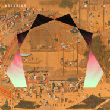

新年 AQUARIUS
============================

|  |  |
| :--: | :-- |
| [ 新年 AQUARIUS](https://emumo.xiami.com/album/2104300747) | **艺人**: [邱比](../index.md) **语种**: 国语 **唱片公司**: ROKON滚石电音 **发行时间**: 2018年12月04日 **专辑类别**: EP, 单曲 **专辑风格**: 电子乐 Electronica **播放数**: 106286 **收藏数**: 175 **评论数**: 132  |

## 简介

迎向未来的电子音乐时代  
邱比 最新单曲〈新年Aquarius〉抢先贯耳  
  
凭藉2017年《大放》专辑获奖无数：年度最佳电子艺人、年度最佳电音专辑、年度最佳创作歌手、年度最佳电音单曲等等；2018年十八场个人巡回演唱会与全碟拍摄MV，好评不断！  
  
邱比在ROKON滚石电音的第2张演唱专辑《Martyr 中离》即将登场，开创华语电子音乐的先锋唱作人，穿越水瓶纪元提前到来！  
  
邱比再度担任唱片制作人及全专辑词曲创作，用当代的优雅展现古老的文化，以全新的唱歌方式，创造了万花筒一样的电音世界影响当代乐界无数！  
  
〈新年〉收录在《Martyr 中离》专辑中，这首歌不同于过去的跨年单曲：他认为人能够因为特别安静的状态而获得超越时间的能力去重整万象与世界的律法！  
  
〈新年〉中可以听见『梦想』『梦境』『前世今生』『混沌』『轮回』的隧道之声，让听者跳跃一世又一世的聚散，终于发现：万物皆我，但我只有我一个！  
  
放眼全球，饮水思源  
邱比用自古最美的语言  
辅以全新的歌唱技巧  
向乐坛流行榜寄出挑战  
  
最复杂的逻辑 + 最高难的文法 + 最艰涩的字汇 + 最古老的智慧 = 最经典的邱比  
  
  
 

## 曲目

## 评论

|  |  |  |  |
| :-- | :-- | :-- | :-- |
|  [虾米用户](https://emumo.xiami.com/u/45867408) n o n e . 2020-01-01 05:50 赞(0) 踩(0) | 
新的一年到了
 |
|  [虾米用户](https://emumo.xiami.com/u/325374787)  2019-04-01 21:53 赞(0) 踩(0) | 
美美
 |
|  [虾米用户](https://emumo.xiami.com/u/410489503) 南极鳗鱼 2018-12-23 02:06 赞(2) 踩(0) | 
很喜欢你的歌！
 |
|  [虾米用户](https://emumo.xiami.com/u/266367589) 逃避向安静与沉默走去。 2018-12-10 01:12 赞(1) 踩(0) | 
闲下来听新年感觉像过年。一听就不想休息哇。。。。睡这种事情有什么吸引力？醒，多美比比，新年了~快到舞台蹦蹦跳跳嗨呀！咦，不对。天气很冷，为啥听了新年热得一身汗。
 |
|  [虾米用户](https://emumo.xiami.com/u/342220696)  2018-12-08 22:13 赞(2) 踩(0) | 
新年快樂（提前説一聲） 
 |
|  [虾米用户](https://emumo.xiami.com/u/201391232) 最快的方法是先抱抱 2018-12-08 12:07 赞(2) 踩(0) | 

 |
|  [虾米用户](https://emumo.xiami.com/u/124116232) 比比說愛是妳來到世上的原... 2018-12-08 00:05 赞(2) 踩(0) | 
萬物皆我，但我只有我一個。
 |
|  [虾米用户](https://emumo.xiami.com/u/17925875)   2018-12-07 20:16 赞(1) 踩(0) | 
get～好听！
 |
|  [虾米用户](https://emumo.xiami.com/u/223845151) _(:* ｣∠)_ 2018-12-07 20:02 赞(1) 踩(0) | 
惊喜
 |
|  [虾米用户](https://emumo.xiami.com/u/105749784) 我还没想好要写什么... 2018-12-06 00:55 赞(1) 踩(0) | 
期待很久的新曲
 |
|  [虾米用户](https://emumo.xiami.com/u/105749784) 我还没想好要写什么... 2018-12-06 00:55 赞(1) 踩(0) | 
 
 |
|  [虾米用户](https://emumo.xiami.com/u/2961074) 听两首歌 2018-12-05 01:56 赞(3) 踩(0) | 
get✔️
 |
|  [虾米用户](https://emumo.xiami.com/u/49920812)   2018-12-04 23:36 赞(0) 踩(0) | 
清明上河图？
 |
| ⇒ |  [虾米用户](https://emumo.xiami.com/u/195832566) 平衡探险者 2018-12-07 13:10 赞(0) 踩(0) | 
在构建什么东西。
 |
| ⇒ |  [虾米用户](https://emumo.xiami.com/u/49920812)   2018-12-07 13:18 赞(0) 踩(0) | 
<q><b>暮渰.说：</b></q>
 |
| ⇒ |  [虾米用户](https://emumo.xiami.com/u/48276337) 22世纪不道德 2018-12-29 18:10 赞(0) 踩(0) | 
<q><b>SkyFeather说：</b></q>
 |
| ⇒ |  [虾米用户](https://emumo.xiami.com/u/49920812)   2018-12-29 18:13 赞(0) 踩(0) | 
<q><b>踱说：</b></q>
 |
|  [虾米用户](https://emumo.xiami.com/u/12973080) 上帝保佑精神自由的人 梦... 2018-12-04 22:35 赞(1) 踩(0) | 
想了一天为什么是Aquarius 刚刚突然有个大胆猜想，也许新专结构是12首歌 对应十二星座？
 |
| ⇒ |  [虾米用户](https://emumo.xiami.com/u/54583815) 一点都不神圣 2018-12-05 00:38 赞(0) 踩(0) | 
那我自私的希望不是这个结构，因为想要不止12首歌哈哈哈
 |
| ⇒ |  [虾米用户](https://emumo.xiami.com/u/12973080) 上帝保佑精神自由的人 梦... 2018-12-05 01:31 赞(0) 踩(0) | 
<q><b>Absence_7说：</b></q>
 |
|  [虾米用户](https://emumo.xiami.com/u/49507640) 我还没想好要写什么... 2018-12-04 22:06 赞(2) 踩(0) | 
❤️
 |
|  [虾米用户](https://emumo.xiami.com/u/164629064) 给我一把吉他和一肩风里飘... 2018-12-04 16:17 赞(2) 踩(0) | 
期待已久的比比，还是这个味道
 |
|  [虾米用户](https://emumo.xiami.com/u/43714694) WeChat：96529... 2018-12-04 15:30 赞(0) 踩(0) | 
吱/音
 |
|  [虾米用户](https://emumo.xiami.com/u/42434204)  2018-12-04 12:52 赞(1) 踩(0) | 
想见你啊比比
 |
|  [虾米用户](https://emumo.xiami.com/u/50228074) 不要丧失表达欲 2018-12-04 12:45 赞(3) 踩(0) | 
最近有很多惊喜，嘻嘻。
 |
|  [虾米用户](https://emumo.xiami.com/u/13911932) 暂冇签名~ 2018-12-04 12:06 赞(0) 踩(0) | 
水瓶？
 |
|  [虾米用户](https://emumo.xiami.com/u/1496867) 我还没想好要写什么... 2018-12-04 10:38 赞(1) 踩(0) | 
你这封面设计真是太太太太：好了！这首歌给你换一个歌词 真的可以有千万种可能性
 |
|  [虾米用户](https://emumo.xiami.com/u/1496867) 我还没想好要写什么... 2018-12-04 10:35 赞(2) 踩(0) | 
音乐精湛！结构精密的壳和自由不羁的灵魂
 |
|  [虾米用户](https://emumo.xiami.com/u/127131130)   2018-12-04 10:03 赞(3) 踩(0) | 
比心
 |
|  [虾米用户](https://emumo.xiami.com/u/76029894) 我还没想好要写什么... 2018-12-04 09:57 赞(1) 踩(0) | 
我为什么在昨天睡去
 |
|  [虾米用户](https://emumo.xiami.com/u/4783281) It's feel so... 2018-12-04 09:24 赞(1) 踩(0) | 
love you
 |
|  [虾米用户](https://emumo.xiami.com/u/125488788) 当感受内心  话语便显苍... 2018-12-04 08:53 赞(1) 踩(0) | 

 |
|  [虾米用户](https://emumo.xiami.com/u/125488788) 当感受内心  话语便显苍... 2018-12-04 08:53 赞(1) 踩(0) | 

 |
|  [虾米用户](https://emumo.xiami.com/u/125488788) 当感受内心  话语便显苍... 2018-12-04 08:53 赞(1) 踩(0) | 
新年  快活
 |
|  [虾米用户](https://emumo.xiami.com/u/400594250) 科班艺术设计，迷幻电子，... 2018-12-04 08:36 赞(1) 踩(0) | 

 |
|  [虾米用户](https://emumo.xiami.com/u/49765922)  2018-12-04 08:35 赞(1) 踩(0) | 

 |
|  [虾米用户](https://emumo.xiami.com/u/11421497) dont act lik... 2018-12-04 08:19 赞(1) 踩(0) | 
好
 |
|  [虾米用户](https://emumo.xiami.com/u/255359360) 全部感官按部就班地失常 2018-12-04 08:10 赞(2) 踩(0) | 

 |
|  [虾米用户](https://emumo.xiami.com/u/297681691) “年轻人要多听音乐才不会... 2018-12-04 07:38 赞(1) 踩(0) | 
❤️
 |
|  [虾米用户](https://emumo.xiami.com/u/42434204)  2018-12-04 07:32 赞(1) 踩(0) | 
很爱你。
 |
|  [虾米用户](https://emumo.xiami.com/u/42434204)  2018-12-04 07:29 赞(2) 踩(0) | 
听着听着就哭了出来，泪流满面。前两天一个人从医院出来，仿佛麻木而失去了情感，整个人都愣愣呆呆的。
 |
|  [虾米用户](https://emumo.xiami.com/u/12973080) 上帝保佑精神自由的人 梦... 2018-12-04 05:38 赞(2) 踩(0) | 
太喜欢 有你我的心灵游荡 这句了！！！
 |
|  [虾米用户](https://emumo.xiami.com/u/277373257) 想当然！ 2018-12-04 01:37 赞(2) 踩(0) | 
中离什么时候出来呀
 |
| ⇒ |  [虾米用户](https://emumo.xiami.com/u/22444238) 邱比官方虾米 2018-12-04 02:03 赞(0) 踩(0) | 
12月⋯某天
 |
| ⇒ |  [虾米用户](https://emumo.xiami.com/u/277373257) 想当然！ 2018-12-04 11:46 赞(0) 踩(0) | 
<q><b>邱比 CHOVBE说：</b></q>
 |
|  [虾米用户](https://emumo.xiami.com/u/346655241) 人类无法忍受太多的真实 2018-12-04 01:30 赞(1) 踩(0) | 
大愛！
 |
|  [虾米用户](https://emumo.xiami.com/u/346655241) 人类无法忍受太多的真实 2018-12-04 01:29 赞(1) 踩(0) | 
Get～
 |
|  [虾米用户](https://emumo.xiami.com/u/344026750) 我还没想好要写什么... 2018-12-04 01:24 赞(1) 踩(0) | 
大愛 chiupi
 |
|  [虾米用户](https://emumo.xiami.com/u/46704933) H E L L O  T... 2018-12-04 01:10 赞(2) 踩(0) | 
玩house了还不错，对新砖更加期待了。
 |
|  [虾米用户](https://emumo.xiami.com/u/1018) 口哨魔法師 2018-12-04 01:04 赞(2) 踩(0) | 
来来又去去 你在我心里游荡
 |
|  [虾米用户](https://emumo.xiami.com/u/33454317) 暂无签名~ 2018-12-04 00:49 赞(1) 踩(0) | 
比比的音乐让我觉得每一天都是新的开始
 |
|  [虾米用户](https://emumo.xiami.com/u/91037730) DOIT 2018-12-04 00:45 赞(1) 踩(0) | 
新年好新年好新年到了，祝大家新年快乐哈哈哈，我太开心了！
 |
|  [虾米用户](https://emumo.xiami.com/u/171894620) 靜心 2018-12-04 00:45 赞(1) 踩(0) | 
cool
 |
|  [虾米用户](https://emumo.xiami.com/u/91037730) DOIT 2018-12-04 00:43 赞(1) 踩(0) | 
睡前来了新歌 我不睡了  一起过新年(ﾉ"◑ڡ◑)ﾉ
 |
|  [虾米用户](https://emumo.xiami.com/u/257103143) 音乐爱好者~ 2018-12-04 00:42 赞(1) 踩(0) | 
我给你美好的五星啦
 |
|  [虾米用户](https://emumo.xiami.com/u/260992790) I'll Be Your... 2018-12-04 00:40 赞(1) 踩(0) | 
，
 |
|  [虾米用户](https://emumo.xiami.com/u/13126400)  2018-12-04 00:35 赞(1) 踩(0) | 
「…人能够因为特别安静的状态而获得超越时间的能力去重组万象与世界的律法！」在这重复循环又渐进的音乐中让你我游荡的心灵得到一种平静的状态 迎接自己的新年～✨
 |
|  [虾米用户](https://emumo.xiami.com/u/55119842) 唯有音乐和文字不可遗落。 2018-12-04 00:33 赞(2) 踩(0) | 
今天过年！！！
 |
|  [虾米用户](https://emumo.xiami.com/u/191249481) 一个美好的人永远不会去阻... 2018-12-04 00:32 赞(1) 踩(0) | 
发新歌啦～新年来啦～～
 |
|  [虾米用户](https://emumo.xiami.com/u/315904079) 不论过往，只看去处。 2018-12-04 00:32 赞(1) 踩(0) | 
Get
 |
|  [虾米用户](https://emumo.xiami.com/u/277448110)   2018-12-04 00:26 赞(1) 踩(0) | 
比比带我们迎来新年  有你就足够ww
 |
|  [虾米用户](https://emumo.xiami.com/u/340864101) 邱 2018-12-04 00:22 赞(1) 踩(0) | 
❤️
 |
|  [虾米用户](https://emumo.xiami.com/u/266367589) 逃避向安静与沉默走去。 2018-12-04 00:21 赞(2) 踩(0) | 
这该是一个很燃的新年！     
 |
|  [虾米用户](https://emumo.xiami.com/u/125615076) 青絲慢掠獨披塵 2018-12-04 00:19 赞(1) 踩(0) | 
愿心灵游荡
 |
|  [虾米用户](https://emumo.xiami.com/u/96296322)  2018-12-04 00:18 赞(1) 踩(0) | 
封面换风格了诶
 |
|  [虾米用户](https://emumo.xiami.com/u/20177386) 感谢一切美好的遇见❤️ 2018-12-04 00:18 赞(2) 踩(0) | 
好酷的封
 |
|  [虾米用户](https://emumo.xiami.com/u/30788105) 从不失手 2018-12-04 00:18 赞(3) 踩(0) | 
要从今天听到圣诞到元旦再到新年然后继续下一年
 |
| ⇒ |  [虾米用户](https://emumo.xiami.com/u/22444238) 邱比官方虾米 2018-12-04 00:23 赞(0) 踩(0) | 
直至過大年。
 |
| ⇒ |  [虾米用户](https://emumo.xiami.com/u/309776502) ———Riverside... 2019-12-27 23:45 赞(0) 踩(0) | 
又开始听了
 |
|  [虾米用户](https://emumo.xiami.com/u/51640098) 扇子拟杯酌几巡 2018-12-04 00:13 赞(2) 踩(0) | 
有你的陪伴就是新年
 |
| ⇒ |  [虾米用户](https://emumo.xiami.com/u/22444238) 邱比官方虾米 2018-12-04 00:15 赞(0) 踩(0) | 
雲牽手
 |
|  [虾米用户](https://emumo.xiami.com/u/8226204) ≡ 2018-12-04 00:12 赞(3) 踩(0) | 
还没睡
 |
| ⇒ |  [虾米用户](https://emumo.xiami.com/u/22444238) 邱比官方虾米 2018-12-04 00:15 赞(0) 踩(0) | 
当然，我也要听！这么酷的事情
 |
|  [虾米用户](https://emumo.xiami.com/u/6062632) ੯ੑ∙ʔ 2018-12-04 00:12 赞(2) 踩(0) | 
੯ੑ∙ʔ
 |
|  [虾米用户](https://emumo.xiami.com/u/362970194) 我还没想好要写什么... 2018-12-04 00:12 赞(2) 踩(0) | 

 |
|  [虾米用户](https://emumo.xiami.com/u/343192734)  2018-12-04 00:10 赞(2) 踩(0) | 

 |
|  [虾米用户](https://emumo.xiami.com/u/409909405) Ying Hui 2018-12-04 00:10 赞(2) 踩(0) | 
在這個寂寞的城市裡有你我的心靈游蕩⋯
 |
| ⇒ |  [虾米用户](https://emumo.xiami.com/u/22444238) 邱比官方虾米 2018-12-04 00:11 赞(0) 踩(0) | 
新
 |
|  [虾米用户](https://emumo.xiami.com/u/349498586) ａ spacetime ... 2018-12-04 00:09 赞(2) 踩(0) | 
发光！
 |
| ⇒ |  [虾米用户](https://emumo.xiami.com/u/22444238) 邱比官方虾米 2018-12-04 00:16 赞(0) 踩(0) | 

 |
|  [虾米用户](https://emumo.xiami.com/u/73638642) 再见了各位 我永远爱虾米... 2018-12-04 00:08 赞(2) 踩(0) | 
我来啦呀
 |
|  [虾米用户](https://emumo.xiami.com/u/44162801) 塵 2018-12-04 00:08 赞(3) 踩(0) | 
期待后续
 |
| ⇒ |  [虾米用户](https://emumo.xiami.com/u/22444238) 邱比官方虾米 2018-12-04 00:15 赞(0) 踩(0) | 
12月
 |
|  [虾米用户](https://emumo.xiami.com/u/6106220) 我还没想好要写什么... 2018-12-04 00:08 赞(0) 踩(0) | 
啥话也不说了 听就完事儿了
 |
|  [虾米用户](https://emumo.xiami.com/u/71356146) 欣赏真的人 2018-12-04 00:08 赞(2) 踩(0) | 

 |
|  [虾米用户](https://emumo.xiami.com/u/30980397) 爱憎分明 2018-12-04 00:07 赞(2) 踩(0) | 
你就是我每天的新年
 |
|  [虾米用户](https://emumo.xiami.com/u/123415560) 我还没想好要写什么... 2018-12-04 00:07 赞(3) 踩(0) | 
我们都经过同一个城市，同一条马路，看着同一个月亮。
 |
|  [虾米用户](https://emumo.xiami.com/u/55119842) 唯有音乐和文字不可遗落。 2018-12-04 00:07 赞(3) 踩(0) | 
新歌真好听哇！！！
 |
| ⇒ |  [虾米用户](https://emumo.xiami.com/u/22444238) 邱比官方虾米 2018-12-04 00:16 赞(0) 踩(0) | 

 |
|  [虾米用户](https://emumo.xiami.com/u/315340938) 孤独无碍 2018-12-04 00:06 赞(2) 踩(0) | 

 |
|  [虾米用户](https://emumo.xiami.com/u/33923461) 00:00 2018-12-04 00:05 赞(3) 踩(0) | 

 |
|  [虾米用户](https://emumo.xiami.com/u/339191478)   2018-12-04 00:05 赞(2) 踩(0) | 
終於！
 |
|  [虾米用户](https://emumo.xiami.com/u/344348888) 我还没想好要写什么... 2018-12-04 00:05 赞(2) 踩(0) | 
❤️
 |
|  [虾米用户](https://emumo.xiami.com/u/215698051) CHIU PI  2018-12-04 00:04 赞(2) 踩(0) | 
“在这个寂寞的城市里 有你我的心灵游荡为它填上来来又去去”
 |
|  [虾米用户](https://emumo.xiami.com/u/22444238) 邱比官方虾米 2018-12-04 00:04 赞(76) 踩(0) | 
新
 |
| ⇒ |  [虾米用户](https://emumo.xiami.com/u/248466247)  2018-12-04 00:12 赞(0) 踩(0) | 
Get.
 |
| ⇒ |  [虾米用户](https://emumo.xiami.com/u/266367589) 逃避向安静与沉默走去。 2018-12-04 00:18 赞(0) 踩(0) | 
喜欢喜欢！
 |
| ⇒ |  [虾米用户](https://emumo.xiami.com/u/400410955)  2018-12-04 00:18 赞(0) 踩(0) | 
好听～全新的旋律还是我爱的邱比  晚安啦 
 |
| ⇒ |  [虾米用户](https://emumo.xiami.com/u/257103143) 音乐爱好者~ 2018-12-04 00:26 赞(0) 踩(0) | 
得到了
 |
| ⇒ |  [虾米用户](https://emumo.xiami.com/u/344971686) 我还没想好要写什么... 2018-12-04 12:07 赞(0) 踩(0) | 
啊啊啊等邱比的巡回啊！！
 |
| ⇒ |  [虾米用户](https://emumo.xiami.com/u/238801092)  2018-12-14 09:55 赞(0) 踩(0) | 
终于说了“Get.”之外的评论
 |
| ⇒ |  [虾米用户](https://emumo.xiami.com/u/41021800)  2019-07-10 21:18 赞(0) 踩(0) | 
非常喜欢，感谢
 |
|  [虾米用户](https://emumo.xiami.com/u/10825322) @Bside1 2018-12-04 00:03 赞(2) 踩(0) | 

 |
|  [虾米用户](https://emumo.xiami.com/u/31531934) 恋の道に近道はない 2018-12-04 00:03 赞(2) 踩(0) | 
大推
 |
|  [虾米用户](https://emumo.xiami.com/u/48485091) 祝 你 开 ★ 2018-12-04 00:01 赞(2) 踩(0) | 
★
 |
|  [虾米用户](https://emumo.xiami.com/u/10627804)   2018-12-04 00:01 赞(2) 踩(0) | 
来啦来啦
 |
|  [虾米用户](https://emumo.xiami.com/u/7292098) 我們不斷相遇 在未來里 2018-12-04 00:01 赞(4) 踩(0) | 
中离
 |
|  [虾米用户](https://emumo.xiami.com/u/238063757)   2018-12-04 00:00 赞(2) 踩(0) | 
来啦！
 |
|  [虾米用户](https://emumo.xiami.com/u/7292098) 我們不斷相遇 在未來里 2018-12-03 23:59 赞(4) 踩(0) | 
新年有你。
 |
|  [虾米用户](https://emumo.xiami.com/u/266367589) 逃避向安静与沉默走去。 2018-12-03 23:58 赞(3) 踩(0) | 
新专辑新专辑！！！
 |
|  [虾米用户](https://emumo.xiami.com/u/47712421) 无 2018-12-03 23:55 赞(2) 踩(0) | 
18年末听新年
 |
|  [虾米用户](https://emumo.xiami.com/u/8166257) 米青分five 2018-12-03 23:25 赞(2) 踩(0) | 
就在明天 
 |
|  [虾米用户](https://emumo.xiami.com/u/255359360) 全部感官按部就班地失常 2018-12-03 22:16 赞(3) 踩(0) | 

 |
|  [虾米用户](https://emumo.xiami.com/u/15162781)  2018-12-03 15:50 赞(2) 踩(0) | 
等着www
 |
| ⇒ |  [虾米用户](https://emumo.xiami.com/u/344348888) 我还没想好要写什么... 2018-12-04 00:02 赞(0) 踩(0) | 
❤️❤️
 |
|  [虾米用户](https://emumo.xiami.com/u/55119842) 唯有音乐和文字不可遗落。 2018-12-02 23:05 赞(4) 踩(0) | 
♬
 |
|  [虾米用户](https://emumo.xiami.com/u/293664474)  2018-12-01 23:12 赞(2) 踩(0) | 
期待。
 |
|  [虾米用户](https://emumo.xiami.com/u/322344849) 我还没想好要写什么... 2018-12-01 16:26 赞(2) 踩(0) | 
啾咪惹
 |
|  [虾米用户](https://emumo.xiami.com/u/49128620) 人类不会原谅我 2018-12-01 16:25 赞(2) 踩(0) | 
️
 |
|  [虾米用户](https://emumo.xiami.com/u/246180685) 打包我的心当午餐吧宝贝 2018-12-01 08:44 赞(4) 踩(0) | 
新年有邱比，就很刚好：）
 |
|  [虾米用户](https://emumo.xiami.com/u/374158246)  2018-12-01 08:35 赞(2) 踩(0) | 
           
 |
|  [虾米用户](https://emumo.xiami.com/u/264283064) bye  2018-12-01 06:12 赞(3) 踩(0) | 

 |
|  [虾米用户](https://emumo.xiami.com/u/344026750) 我还没想好要写什么... 2018-12-01 01:17 赞(2) 踩(0) | 
期待
 |
|  [虾米用户](https://emumo.xiami.com/u/22444238) 邱比官方虾米 2018-12-01 00:50 赞(57) 踩(0) | 
Get
 |
|  [虾米用户](https://emumo.xiami.com/u/13126400)  2018-11-30 18:55 赞(1) 踩(0) | 
✨
 |
|  [虾米用户](https://emumo.xiami.com/u/252626203) 本來是個快樂的人 2018-11-29 23:19 赞(2) 踩(0) | 
提前说声新年快乐啊，比！
 |
|  [虾米用户](https://emumo.xiami.com/u/339191478)   2018-11-29 21:40 赞(3) 踩(0) | 

 |
|  [虾米用户](https://emumo.xiami.com/u/125615076) 青絲慢掠獨披塵 2018-11-29 21:10 赞(3) 踩(0) | 
新年，好！ 
 |
|  [虾米用户](https://emumo.xiami.com/u/43648786) 安静的知了 2018-11-29 21:02 赞(4) 踩(0) | 

 |
|  [虾米用户](https://emumo.xiami.com/u/66823378)  2018-11-29 20:57 赞(4) 踩(0) | 

 |
|  [虾米用户](https://emumo.xiami.com/u/44421787) 长期单身 2018-11-29 20:03 赞(2) 踩(0) | 
激动
 |
|  [虾米用户](https://emumo.xiami.com/u/257103143) 音乐爱好者~ 2018-11-29 18:46 赞(3) 踩(0) | 
Get
 |
