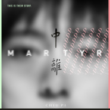

中离 Martyr
============================

|  |  |
| :--: | :-- |
| [ 中离 Martyr](https://emumo.xiami.com/album/2104416622) | **艺人**: [邱比](../index.md) **语种**: 国语 **唱片公司**: ROKON滚石电音 **发行时间**: 2018年12月28日 **专辑类别**: 录音室专辑 **专辑风格**: 电子乐 Electronica **播放数**: 961061 **收藏数**: 1719 **评论数**: 640  |

## 简介

中离！  
——生活是一句哑谜，在你想都还没想好问题究竟是什么，答案却呼之欲出。  
  
“中离”是网路时代流行术语，  
意指那些游戏才玩到一半，各种因故离开的玩家。  
  
这一生就像是线上游戏，当每接到一个任务，就意味将要拓荒一部分阴影地图，或解锁更新的关卡。这款游戏的目标只有一个：认识你自己。直到你“登出”的那天，你能回馈给游戏的，就是你每次做选择时，你内心中的信念和专注。  
  
在这场长达“六十万小时”的开放任务里，你可能会玩到一场别人已经玩过的游戏；也不一定你玩得很吃力，却透过和同在的玩家们一起狂欢过、争吵过，而合解过、道别过。  
  
有一条特别窄的道路在这款游戏，专门服务那些不满足于普通玩法的职业型选手，他们走上这条路，就像点选高难度模式。纵使每一次战斗都可能旋即输尽，但不同的惊险历程却也伴随最高意志的低语，只要你准备好，祂便会告诉你那把终极钥匙在何处。  
  
从最高难度游戏过关的人，即自动中离且不受到任何游戏惩罚！中离者将与每一世代的中离者们相遇；正因为他们都曾展现同一种过人勇气，所以他们是心心相映的。他们也将永驻青春，在隐藏的伺服器里携手维持有意识的和谐，而他们获得的奖赏？是接近无所不能。  
  
邱比沉迷于时空之外，透过写歌和内心的真我连结，从混乱臣服当下。  
  
11首独特视角的先锋歌词跟未来世代无缝接轨，邱比的极简之曲透过沈安华丽的西岸风格，共谱当今流行之最；邱比邀请义大利电音诗人Alfa Hydri为《中离》作序、平面设计师龙佑玟再度设计专辑封面。  
  
一面是刚烈真情的激流，一面是遗世独立的雍容。邱比把他最大的希望寄托在未知，用《中离》携手他的乐迷们一起脱胎换骨，成为出凡入圣的平衡探险者。  
  
“这张新专辑声音听起来非常清脆、干净、瞬态好！『纯粹』是最高赞誉。听众可以第一次好好地认识我的歌声。利用全新的麦克风与有别以往的唱歌方式，全辑在人声处理上做到了自然的现场感，一口气听完，像一趟神奇的旅程。”—— 邱比  
  
当你一鼓作气听完《中离》，你全身的小细胞都会开始用最鲜活的方式运作，最初可能有点辛苦，但不久后你就会越来越舒缓。紧追那无声的悸动，他会引领你穿越时空，发现古老的无限矿藏！  
  
  
 

## 曲目

## 评论

|  |  |  |
| :-- | :-- | :-- |
|  [虾米用户](https://emumo.xiami.com/u/374464453) 没 事 2021-01-24 00:22 赞(0) 踩(0) | 
读《三体》，想到中离的专辑概念（科幻小说才是最恐怖的
 |
|  [虾米用户](https://emumo.xiami.com/u/55881258) 今日任公子 2020-12-26 15:24 赞(0) 踩(0) | 
你知道吗 我小号叫冈比比
 |
|  [虾米用户](https://emumo.xiami.com/u/348251605) 我还没想好要写什么... 2020-07-12 10:51 赞(1) 踩(0) | 
邱比离邓丽君的地步越来越近了。
 |
|  [虾米用户](https://emumo.xiami.com/u/5083146)   2020-04-05 16:57 赞(0) 踩(0) | 
邱比是男孩子？？？
 |
| ⇒ |  [虾米用户](https://emumo.xiami.com/u/263625478)  2020-12-01 22:51 赞(0) 踩(0) | 
哈哈哈，你猜
 |
|  [虾米用户](https://emumo.xiami.com/u/206274873) 别对我放电，我全家都有来... 2020-04-04 23:28 赞(2) 踩(0) | 
听过中国人做得最好的电音！人声如果往高频上调一些就更和我口味了，期待！
 |
|  [虾米用户](https://emumo.xiami.com/u/33521922) 可能比较情绪化 2020-01-22 20:05 赞(0) 踩(0) | 
sorry邱比，个人觉得这张可能要略逊色一筹，但仍然是如此有神韵。
 |
|  [虾米用户](https://emumo.xiami.com/u/121702052) 超脱 2020-01-22 14:33 赞(1) 踩(0) | 

 |
|  [虾米用户](https://emumo.xiami.com/u/427840279) 购买诗集《落日飞奔术》电... 2019-12-17 09:50 赞(0) 踩(0) | 
封面伍佰
 |
|  [虾米用户](https://emumo.xiami.com/u/280663961)  2019-12-02 19:03 赞(2) 踩(0) | 
就喜欢这种感觉
 |
|  [虾米用户](https://emumo.xiami.com/u/14669970) 氛围，古典，流行，电子.... 2019-11-23 12:33 赞(1) 踩(0) | 
忘了从上周还是上上周开始一直在循环比比的新专。去年到南京感受了上下一方巡演，很棒。很喜欢那种艺术氛围，没有喧嚣感。新专好像比之前突破些什么一样，我也说不出来，很喜欢。听去过比比今年巡演的朋友说，比比的巡演像展一样，很棒。希望，有机会还能去比比的现场，祝愿比比越来越好。
 |
|  [虾米用户](https://emumo.xiami.com/u/53590447) 梦归隐 2019-08-17 13:05 赞(1) 踩(0) | 
❤
 |
|  [虾米用户](https://emumo.xiami.com/u/71497184)  2019-06-07 23:39 赞(1) 踩(0) | 
最开始的时候，我是个好孩子，大家听什么我就听什么；后来，我很愤怒，听的也很愤怒；再后来在想，是否可以用另外的角度去看待问题。就是现在了。
 |
|  [虾米用户](https://emumo.xiami.com/u/101414258)   2019-06-04 02:04 赞(0) 踩(0) | 
爱了爱了
 |
|  [虾米用户](https://emumo.xiami.com/u/9891176) 我还没想好要写什么... 2019-05-29 13:40 赞(0) 踩(0) | 
俺喜欢喜欢喜欢喜欢喜欢喜欢喜欢欢欢欢欢
 |
|  [虾米用户](https://emumo.xiami.com/u/221940611) 氛围   摇滚  后摇 ... 2019-05-26 15:24 赞(1) 踩(0) | 
中离中离 
 |
|  [虾米用户](https://emumo.xiami.com/u/266367589) 逃避向安静与沉默走去。 2019-05-26 08:37 赞(0) 踩(0) | 
比比，你最时髦~ 
 |
|  [虾米用户](https://emumo.xiami.com/u/14669970) 氛围，古典，流行，电子.... 2019-05-23 09:21 赞(1) 踩(0) | 
这张专辑太棒！
 |
|  [虾米用户](https://emumo.xiami.com/u/347999920)  2019-05-22 21:32 赞(2) 踩(0) | 
喜欢邱比的声音，喜欢邱比的词，喜欢邱比的风格
 |
|  [虾米用户](https://emumo.xiami.com/u/1993517)  2019-05-20 19:53 赞(1) 踩(0) | 
Get.
 |
|  [虾米用户](https://emumo.xiami.com/u/203810848) 一一 2019-05-19 19:56 赞(2) 踩(0) | 
20190518广州中央车站被邱比现场震撼
 |
|  [虾米用户](https://emumo.xiami.com/u/7709271) 音乐是我的生命 2019-05-18 11:11 赞(3) 踩(0) | 
深圳的我：看了上海场，明天还要去广州。 他：明天广州见。 我跑掉了
 |
|  [虾米用户](https://emumo.xiami.com/u/299709071)  2019-05-18 08:35 赞(1) 踩(0) | 
一年end/还在中离
 |
|  [虾米用户](https://emumo.xiami.com/u/403886546) 走走停停 2019-05-18 00:03 赞(2) 踩(0) | 
希望昨天和我聊天的人都会听到这张album 于我而言是从昨天又是一个新的阶段 “真实人生中，我们往往在大势底定无可更改时才迟迟进场，却又在胜败未分的浑沌境地中提早离席。” 昨日总结：平淡又有一丢丢特别kkkkkkkk
 |
|  [虾米用户](https://emumo.xiami.com/u/7585765) 微光闪烁 2019-05-18 00:01 赞(2) 踩(0) | 
真，百听不厌
 |
|  [虾米用户](https://emumo.xiami.com/u/300750919)  2019-05-10 15:56 赞(4) 踩(0) | 
今晚疆进酒见啦<a href="http://emumo.xiami.com/u/22444238" target="_blank" rel="nofollow" name_card="22444238">@CHIU PI</a>
 |
| ⇒ |  [虾米用户](https://emumo.xiami.com/u/351220575) Help me find... 2019-05-14 21:05 赞(0) 踩(0) | 
5.10，晚上完美
 |
| ⇒ |  [虾米用户](https://emumo.xiami.com/u/85389256) 我是失去了悲痛的悲剧作家 2019-06-06 00:57 赞(0) 踩(0) | 
所以说老乡能不能理理我我也去了疆进酒
 |
|  [虾米用户](https://emumo.xiami.com/u/266367589) 逃避向安静与沉默走去。 2019-05-07 00:13 赞(2) 踩(0) | 
中离听起来！
 |
|  [虾米用户](https://emumo.xiami.com/u/25368698) ˊ_ˋ 2019-05-06 15:04 赞(2) 踩(0) | 
5.18广州见
 |
|  [虾米用户](https://emumo.xiami.com/u/26236216) 我还没想好要写什么... 2019-05-05 19:10 赞(1) 踩(0) | 
：/
 |
|  [虾米用户](https://emumo.xiami.com/u/129719360) 我还没想好要写什么... 2019-05-05 10:06 赞(2) 踩(0) | 
紧张消散，等待下一次的重启，祝剩余的每一站都顺利 。
 |
|  [虾米用户](https://emumo.xiami.com/u/12011017) 那你呢 2019-04-30 17:12 赞(2) 踩(0) | 
get
 |
|  [虾米用户](https://emumo.xiami.com/u/66823378)  2019-04-27 23:49 赞(2) 踩(0) | 
很少有听不腻，反而越听越入迷的音乐了！也许这就是梦境，甜蜜浪漫，又危机四伏。 
 |
|  [虾米用户](https://emumo.xiami.com/u/422850277) 我还没想好要写什么... 2019-04-27 18:22 赞(2) 踩(0) | 
如果所有的音乐都这样好听，我就再也不玩游戏了。
 |
|  [虾米用户](https://emumo.xiami.com/u/129719360) 我还没想好要写什么... 2019-04-27 15:59 赞(2) 踩(0) | 
邱先生，今天也是期待您到来的一天，可是时间越是临近却越紧张，这样的期盼却又很美妙～
 |
|  [虾米用户](https://emumo.xiami.com/u/7709271) 音乐是我的生命 2019-04-25 22:56 赞(2) 踩(0) | 
余音绕梁
 |
|  [虾米用户](https://emumo.xiami.com/u/400484838) 走路别玩手机 2019-04-24 13:39 赞(4) 踩(0) | 
Get
 |
|  [虾米用户](https://emumo.xiami.com/u/102554796)  2019-04-21 11:26 赞(3) 踩(0) | 
昨晚在杭州见了比比 此后的日子都仙气满满 
 |
|  [虾米用户](https://emumo.xiami.com/u/129719360) 我还没想好要写什么... 2019-04-20 00:35 赞(2) 踩(0) | 
哈哈，快了，竟有一些无法克制的激动～
 |
|  [虾米用户](https://emumo.xiami.com/u/29119620) 夜幕海岸線/藍色大門後/... 2019-04-11 22:39 赞(3) 踩(0) | 
这张专辑太强了。
 |
|  [虾米用户](https://emumo.xiami.com/u/125615076) 青絲慢掠獨披塵 2019-04-05 21:40 赞(2) 踩(0) | 
聽起來好像置身於十八世紀中葉歐洲的宮殿，眼前的畫面像油畫的質感，有奢華宏偉的建築，也有精心修剪的綠植花園，廣場中有一個噴泉，頹廢、破敗卻美的心動……
 |
|  [虾米用户](https://emumo.xiami.com/u/325374787)  2019-04-01 21:53 赞(2) 踩(0) | 
美
 |
|  [虾米用户](https://emumo.xiami.com/u/335763493) 不戴墨镜  2019-03-28 08:33 赞(3) 踩(0) | 
中離
 |
|  [虾米用户](https://emumo.xiami.com/u/38764527) 我还没想好要写什么... 2019-03-27 15:37 赞(5) 踩(0) | 
邱比音乐不只是小众值得更多人听到，愿意跟朋友家人推荐分享邱比音乐，真爱你的我，一点也不老实。
 |
|  [虾米用户](https://emumo.xiami.com/u/54950259) Fluidflux 2019-03-22 14:29 赞(4) 踩(0) | 
这是一张越听越有味的专辑，虽然第一次听的时候有点恍惚，但是多品几遍，发现还是我最爱的邱比的风格
 |
|  [虾米用户](https://emumo.xiami.com/u/94203)   2019-03-19 11:48 赞(1) 踩(0) | 
意大利...不是义大利吧....发现一个错字
 |
| ⇒ |  [虾米用户](https://emumo.xiami.com/u/54950259) Fluidflux 2019-03-22 14:18 赞(0) 踩(0) | 
台湾对Italy的翻译就是义大利啊
 |
|  [虾米用户](https://emumo.xiami.com/u/224606302) 质本洁来还洁去 2019-03-19 08:56 赞(3) 踩(0) | 
在邱比正式步入流行音乐圈的《中离》面前，我真是又一次被抓住了手脚。溢美之词我打10分五颗星就已经不用再说其他的了，美中不足以我在音乐方面的道行也说不出来什么一二三，总之很喜欢，纳西瑟斯一定去看。
 |
|  [虾米用户](https://emumo.xiami.com/u/15750454)  2019-03-17 05:13 赞(2) 踩(0) | 
金曲30要有比比的姓名！！！
 |
|  [虾米用户](https://emumo.xiami.com/u/48393403) 一丁的远方有音乐 2019-03-16 23:58 赞(3) 踩(0) | 
真的好喜欢这张专辑！
 |
|  [虾米用户](https://emumo.xiami.com/u/404405724) 暖风过醉阁，你是让我沉醉... 2019-03-16 20:36 赞(3) 踩(0) | 
听了bibi的解释我还是不是很明白“中离”的含义，我理解的是“云在晴天水在瓶”，嗯，很喜欢这部专辑。
 |
|  [虾米用户](https://emumo.xiami.com/u/3410945) I'm the mirt... 2019-03-15 00:23 赞(3) 踩(0) | 
隔了许久 以为快忘记了你的声音  但拾起来的时候竟还是如此温热……  在你的歌里总可以偶遇“真我”，十分感激！
 |
|  [虾米用户](https://emumo.xiami.com/u/269276735) 富强民主文明和谐自由平等... 2019-03-09 20:45 赞(2) 踩(0) | 
生活 时态
 |
|  [虾米用户](https://emumo.xiami.com/u/338727596) 人前人后光景两重 2019-03-04 20:48 赞(0) 踩(0) | 
。
 |
|  [虾米用户](https://emumo.xiami.com/u/51786512) 我还没想好要写什么... 2019-03-03 21:30 赞(1) 踩(0) | 
首首好听
 |
|  [虾米用户](https://emumo.xiami.com/u/9981373)  2019-03-03 15:28 赞(1) 踩(0) | 
喜欢春晓
 |
|  [虾米用户](https://emumo.xiami.com/u/10717140)  2019-02-22 07:10 赞(2) 踩(0) | 
每一首都让我惊喜，喜欢。
 |
|  [虾米用户](https://emumo.xiami.com/u/317319560) 我摘青辉冷月为锋芒收入鞘... 2019-02-21 11:27 赞(3) 踩(0) | 
《夜厅》《随意》《没变》
 |
|  [虾米用户](https://emumo.xiami.com/u/49574663) 你 愛 了 整 個 宇 ... 2019-02-19 17:11 赞(2) 踩(0) | 
这张真的太好听了！
 |
|  [虾米用户](https://emumo.xiami.com/u/48485091) 祝 你 开 ★ 2019-02-19 13:29 赞(3) 踩(0) | 
如果虾米能关闭评论。
 |
|  [虾米用户](https://emumo.xiami.com/u/139393368) 喜欢 朴树王菲 she ... 2019-02-19 00:22 赞(4) 踩(0) | 
邱比一直有他所想表达的东西。表达出来就好。他不需要去讨好别人。
 |
|  [虾米用户](https://emumo.xiami.com/u/289298016)  2019-02-15 23:43 赞(1) 踩(0) | 

 |
|  [虾米用户](https://emumo.xiami.com/u/2036679) ， 2019-02-13 16:21 赞(2) 踩(0) | 
最近这张专辑是我歌单大热，几乎每次上下班路上都循环着听，，，
 |
|  [虾米用户](https://emumo.xiami.com/u/2791514) 此处禁言 2019-02-13 11:03 赞(0) 踩(0) | 
大家好，我的名字叫：收藏了哪首歌哪首歌就会被下架的魔咒。 谢谢大家！
 |
|  [虾米用户](https://emumo.xiami.com/u/221940611) 氛围   摇滚  后摇 ... 2019-02-11 21:01 赞(0) 踩(0) | 
为什么 中离 收听量不如 大放 的三分之一？对此很疑惑。。
 |
| ⇒ |  [虾米用户](https://emumo.xiami.com/u/114458052) 吞下无意义想法 2019-02-17 14:56 赞(0) 踩(0) | 
因为中离去年年末才刚刚发行呀
 |
| ⇒ |  [虾米用户](https://emumo.xiami.com/u/221940611) 氛围   摇滚  后摇 ... 2019-02-17 14:57 赞(0) 踩(0) | 
<q><b>Beano说：</b></q>
 |
| ⇒ |  [虾米用户](https://emumo.xiami.com/u/17925875)   2019-02-20 20:51 赞(0) 踩(0) | 
中离这张年底才上，大放那张专辑虾米给了很大的曝光！2张专辑都很不错，谢谢支持邱比！
 |
|  [虾米用户](https://emumo.xiami.com/u/59697226)  2019-02-10 20:03 赞(2) 踩(0) | 
从好歌曲就关注他了，确实是特别耐听的一张专辑。
 |
|  [虾米用户](https://emumo.xiami.com/u/16071194) 岁月浓淡总相宜   人生... 2019-02-10 15:24 赞(0) 踩(0) | 
。
 |
|  [虾米用户](https://emumo.xiami.com/u/410308600) 嗯…… 2019-02-09 18:55 赞(2) 踩(0) | 
很喜欢Random（以及Intro），Chiu Pi继续加油
 |
|  [虾米用户](https://emumo.xiami.com/u/47699537) 上摆下荡 左右摇晃 2019-02-08 03:28 赞(2) 踩(0) | 
快来杭州开演唱会
 |
|  [虾米用户](https://emumo.xiami.com/u/127164666) 慧与德的天才 学说 2019-02-03 13:25 赞(2) 踩(0) | 

 |
|  [虾米用户](https://emumo.xiami.com/u/49775454)  2019-02-02 22:38 赞(2) 踩(0) | 
有很喜欢的，正在听，谢谢邱比
 |
|  [虾米用户](https://emumo.xiami.com/u/322235515) 在音乐里澎湃，在玩笑里开... 2019-01-31 18:50 赞(2) 踩(0) | 
非常实验的感觉，如一枚漂浮的杏仁，吃到嘴里会欣喜和兴奋。我很喜欢。
 |
|  [虾米用户](https://emumo.xiami.com/u/401818610) 我还没想好要写什么... 2019-01-30 11:18 赞(1) 踩(0) | 
这张专辑堪称完美，前提是只看目录。
 |
|  [虾米用户](https://emumo.xiami.com/u/7709271) 音乐是我的生命 2019-01-28 23:25 赞(1) 踩(0) | 
没有永恒，是最大的可能性
 |
|  [虾米用户](https://emumo.xiami.com/u/40836732)  2019-01-27 21:09 赞(3) 踩(0) | 
喜欢“思愚”，超想跟唱。
 |
|  [虾米用户](https://emumo.xiami.com/u/40836732)  2019-01-27 20:56 赞(1) 踩(0) | 
爱你的声音，你的特质，但你在削弱你自己， 一路走来，一张专，一点 那时你唱：“怎么说”“易碎的吻” 那气息 好纯粹 美极
 |
|  [虾米用户](https://emumo.xiami.com/u/96862668) 这个人很聪明，只留下了一... 2019-01-26 22:38 赞(1) 踩(0) | 
喜欢
 |
|  [虾米用户](https://emumo.xiami.com/u/341716880)   2019-01-25 23:53 赞(0) 踩(0) | 
Vocal是败笔
 |
|  [虾米用户](https://emumo.xiami.com/u/214261242) 爱胜过一切 2019-01-25 14:04 赞(0) 踩(0) | 
内容已删除
 |
| ⇒ |  [虾米用户](https://emumo.xiami.com/u/12604635) 我还没想好要写什么... 2019-01-27 18:39 赞(0) 踩(0) | 
那你非要在人家专辑下面评论一下显得自己很不一样咯‍♂️
 |
| ⇒ |  [虾米用户](https://emumo.xiami.com/u/214261242) 爱胜过一切 2019-01-27 19:47 赞(0) 踩(0) | 
<q><b>souneko说：</b></q>
 |
| ⇒ |  [虾米用户](https://emumo.xiami.com/u/22444238) 邱比官方虾米 2019-01-28 17:13 赞(0) 踩(0) | 
<q><b>WC说：</b></q>
 |
| ⇒ |  [虾米用户](https://emumo.xiami.com/u/214261242) 爱胜过一切 2019-01-28 20:50 赞(0) 踩(0) | 
<q><b>邱比 CHOVBE说：</b></q>
 |
|  [虾米用户](https://emumo.xiami.com/u/166302128) 冷冷清清的风风火火. 2019-01-25 11:35 赞(1) 踩(0) | 
点开评论 邱比：get
 |
| ⇒ |  [虾米用户](https://emumo.xiami.com/u/166302128) 冷冷清清的风风火火. 2019-01-25 20:05 赞(0) 踩(0) | 
“CHIU PI赞了你的评论”嗯，这人有点眼熟，退出，后知后觉地又点开艺人页。。。尴尬
 |
|  [虾米用户](https://emumo.xiami.com/u/299588679) 我还没想好要写什么... 2019-01-25 01:24 赞(3) 踩(0) | 
我最爱听邱比的歌，是爱，不仅仅是喜欢
 |
|  [虾米用户](https://emumo.xiami.com/u/337232897)  2019-01-24 23:41 赞(1) 踩(0) | 
丘比特？？
 |
|  [虾米用户](https://emumo.xiami.com/u/1496867) 我还没想好要写什么... 2019-01-24 18:54 赞(1) 踩(0) | 
内容已删除
 |
| ⇒ |  [虾米用户](https://emumo.xiami.com/u/343911678)  2019-01-24 23:47 赞(0) 踩(0) | 
926
 |
| ⇒ |  [虾米用户](https://emumo.xiami.com/u/343911678)  2019-01-24 23:48 赞(0) 踩(0) | 
<q><b>qaz说：</b></q>
 |
| ⇒ |  [虾米用户](https://emumo.xiami.com/u/146577846) 我还没想好要写什么... 2019-01-25 10:37 赞(0) 踩(0) | 
流行？建议多听几首
 |
|  [虾米用户](https://emumo.xiami.com/u/51853071) 一個世界兩個永恆的主題。 2019-01-24 18:20 赞(1) 踩(0) | 
  
 |
|  [虾米用户](https://emumo.xiami.com/u/51853071) 一個世界兩個永恆的主題。 2019-01-24 18:19 赞(5) 踩(0) | 
2019永遠的邱比   。
 |
|  [虾米用户](https://emumo.xiami.com/u/49464238) 有一个绝望而痛苦的事实 2019-01-24 18:04 赞(0) 踩(0) | 
收藏都收藏不了？虾米这次更新真的是烂
 |
|  [虾米用户](https://emumo.xiami.com/u/341124198)  2019-01-24 17:57 赞(2) 踩(0) | 
邱比要火了
 |
|  [虾米用户](https://emumo.xiami.com/u/96862668) 这个人很聪明，只留下了一... 2019-01-24 16:24 赞(9) 踩(0) | 
喷他的都是不懂音乐的，真不知道这些人怎么想的，自己听不懂不懂欣赏就别说话，找存在感？
 |
|  [虾米用户](https://emumo.xiami.com/u/3052330) 我还没想好要写什么... 2019-01-24 16:20 赞(8) 踩(0) | 
初听邱比是《整夜大雨》，简直惊艳到刷新了我的音乐口味，也是我对寻光集最直面的了解，这个新生音乐人让我对国内音乐重新燃起了希望。希望这样有灵性的音乐可以多一些，再多一些。走向世界。
 |
| ⇒ |  [虾米用户](https://emumo.xiami.com/u/403926992)  2019-01-25 09:07 赞(0) 踩(0) | 
Kmilkuyi q
 |
|  [虾米用户](https://emumo.xiami.com/u/11017456) i only wanna... 2019-01-24 15:54 赞(13) 踩(0) | 
邱比的电子更突出空灵迷幻的人声有什么问题吗，不是燥的发疯的音乐就叫电子
 |
| ⇒ |  [虾米用户](https://emumo.xiami.com/u/13541059)  2019-01-28 15:03 赞(0) 踩(0) | 
对呀对呀！
 |
|  [虾米用户](https://emumo.xiami.com/u/214208363) 打手槍直至流眼淚 2019-01-24 15:44 赞(7) 踩(0) | 
我永远爱你 
 |
|  [虾米用户](https://emumo.xiami.com/u/214208363) 打手槍直至流眼淚 2019-01-24 15:44 赞(4) 踩(0) | 
19年邱還是好乖啊
 |
|  [虾米用户](https://emumo.xiami.com/u/2761419) 镜中之花，水影倒月. 2019-01-24 15:21 赞(0) 踩(0) | 
打开软件蹦出来吓人的么？
 |
| ⇒ |  [虾米用户](https://emumo.xiami.com/u/214208363) 打手槍直至流眼淚 2019-01-24 15:43 赞(0) 踩(0) | 
？
 |
|  [虾米用户](https://emumo.xiami.com/u/25456368) 因 2019-01-24 13:54 赞(8) 踩(0) | 
加油 一起加油，你做邱比，我做穆多
 |
|  [虾米用户](https://emumo.xiami.com/u/99465068) Spotify : Yo... 2019-01-24 13:43 赞(6) 踩(0) | 
电子音乐代表 不至于吧
 |
| ⇒ |  [虾米用户](https://emumo.xiami.com/u/1496867) 我还没想好要写什么... 2019-01-24 18:51 赞(0) 踩(0) | 
写着个标题的人应该是音盲
 |
|  [虾米用户](https://emumo.xiami.com/u/11761284) 听歌只听丢菜卡” 2019-01-24 13:20 赞(2) 踩(0) | 
内容已删除
 |
| ⇒ |  [虾米用户](https://emumo.xiami.com/u/258186903)   2019-01-24 13:42 赞(0) 踩(0) | 
装逼
 |
| ⇒ |  [虾米用户](https://emumo.xiami.com/u/357403920)  2019-01-24 15:41 赞(0) 踩(0) | 
丘比特
 |
| ⇒ |  [虾米用户](https://emumo.xiami.com/u/412952039)  2019-01-24 18:46 赞(0) 踩(0) | 
没素质的请走开 谢谢
 |
| ⇒ |  [虾米用户](https://emumo.xiami.com/u/11761284) 听歌只听丢菜卡” 2019-01-24 19:11 赞(0) 踩(0) | 
丘比特没素质
 |
| ⇒ |  [虾米用户](https://emumo.xiami.com/u/11761284) 听歌只听丢菜卡” 2019-01-24 19:11 赞(0) 踩(0) | 
丘比特没素质”
 |
|  [虾米用户](https://emumo.xiami.com/u/223845151) _(:* ｣∠)_ 2019-01-24 13:13 赞(3) 踩(0) | 
喜欢封面照片
 |
|  [虾米用户](https://emumo.xiami.com/u/223845151) _(:* ｣∠)_ 2019-01-24 13:11 赞(7) 踩(0) | 
超级喜欢邱比   偶然见认识的    但却一发不可收拾     超级喜欢    期待更好的邱比
 |
|  [虾米用户](https://emumo.xiami.com/u/199325834)   2019-01-24 13:00 赞(7) 踩(0) | 
反正以前第一次听寻光集 就对他最有印象
 |
|  [虾米用户](https://emumo.xiami.com/u/8697915)  2019-01-24 12:51 赞(1) 踩(0) | 
你好野～
 |
|  [虾米用户](https://emumo.xiami.com/u/40903129) 有个性的签名 2019-01-24 12:48 赞(1) 踩(0) | 
有feel
 |
|  [虾米用户](https://emumo.xiami.com/u/410513145)  2019-01-24 12:21 赞(1) 踩(0) | 
真难听
 |
| ⇒ |  [虾米用户](https://emumo.xiami.com/u/22444238) 邱比官方虾米 2019-01-28 17:14 赞(0) 踩(0) | 
那你还开通虾米会员，还来。还打字。
 |
| ⇒ |  [虾米用户](https://emumo.xiami.com/u/356186208) 不经常用，活动区在网易，... 2019-02-12 21:22 赞(0) 踩(0) | 
刚才看了一下你的历史播放记录，兄弟，你来错地方了。
 |
| ⇒ |  [虾米用户](https://emumo.xiami.com/u/19084475) June还没想好他要写什... 2019-04-15 18:13 赞(0) 踩(0) | 
<q><b>邱比 CHOVBE说：</b></q>
 |
| ⇒ |  [虾米用户](https://emumo.xiami.com/u/351220575) Help me find... 2019-05-14 21:01 赞(0) 踩(0) | 
<q><b>邱比 CHOVBE说：</b></q>
 |
| ⇒ |  [虾米用户](https://emumo.xiami.com/u/94006248) "虽千万难,吾俱往矣" 2019-05-17 19:14 赞(0) 踩(0) | 
<q><b>邱比 CHOVBE说：</b></q>
 |
| ⇒ |  [虾米用户](https://emumo.xiami.com/u/221940611) 氛围   摇滚  后摇 ... 2019-05-26 15:24 赞(0) 踩(0) | 
<q><b>邱比 CHOVBE说：</b></q>
 |
| ⇒ |  [虾米用户](https://emumo.xiami.com/u/35128081) 带着我逃到黑暗的尽头 2019-10-26 21:32 赞(0) 踩(0) | 
<q><b>邱比 CHOVBE说：</b></q>
 |
| ⇒ |  [虾米用户](https://emumo.xiami.com/u/162979530)  2020-02-14 09:53 赞(0) 踩(0) | 
<q><b>邱比 CHOVBE说：</b></q>
 |
|  [虾米用户](https://emumo.xiami.com/u/96007710)  2019-01-24 12:14 赞(1) 踩(0) | 
house.dance.trance.
 |
|  [虾米用户](https://emumo.xiami.com/u/23120337)   2019-01-24 11:41 赞(12) 踩(0) | 
要“碰瓷打瓷 biubiu duangduang”蹦迪的请出门换场。这里只有我们的邱比～
 |
|  [虾米用户](https://emumo.xiami.com/u/346978181)  2019-01-24 11:29 赞(4) 踩(0) | 
这是极少数我迷幻➕电子能够听完整首的歌手了，感觉不过分把迷幻电子做的很突出，把歌做的很容和，让我这种不迷电子的也觉得很好。
 |
|  [虾米用户](https://emumo.xiami.com/u/13902387) 重度电音爱好者 2019-01-24 11:01 赞(9) 踩(0) | 
电子音乐代表 额… 不敢恭维
 |
| ⇒ |  [虾米用户](https://emumo.xiami.com/u/43233561) 沉迷幻想，逃离现实 2019-01-24 16:57 赞(0) 踩(0) | 
至少代表了一批不傻乐，诗意，平静，友好的声音
 |
| ⇒ |  [虾米用户](https://emumo.xiami.com/u/13541059)  2019-01-28 15:00 赞(0) 踩(0) | 
的确不是你常听的电子音乐，这是富有邱比的特色的，用心做自己喜欢的风格和音乐这是最酷的事情。一开始我也不能接受邱比的个人风格，可当我仔细聆听他的歌曲后发现之前对整体的难以接受，到现在对每个音符、每个细节的喜爱的过程都这么自然、特别。而且听他的音乐有之前从未有过的奇妙的感觉，原来印象中的“好听”还可以这么呈现，还有这种“好听”！是其他歌手都没有给我的感受，所以我认为邱比的独树一帜的艺术流行、极简主义风格就是我心目中妥妥的电子音乐代表！幸好时间让我认识了一个这么好这么特别的邱比！ 
 |
|  [虾米用户](https://emumo.xiami.com/u/338179055) 没有不听的 只有还没听到... 2019-01-24 10:28 赞(2) 踩(0) | 
什么时候巡演鸭
 |
|  [虾米用户](https://emumo.xiami.com/u/411827501) 一个人的生活方式就是这样... 2019-01-24 08:41 赞(2) 踩(0) | 
莫名其妙的被套来这里评论的感觉 也说不出什么所以然来吧
 |
|  [虾米用户](https://emumo.xiami.com/u/37216155) 流星 2019-01-24 08:23 赞(8) 踩(0) | 
能够沉浸到你的音乐中是件多么幸运的事，因为你过分迷幻。
 |
| ⇒ |  [虾米用户](https://emumo.xiami.com/u/411568375)  2019-01-24 11:33 赞(0) 踩(0) | 
light666
 |
|  [虾米用户](https://emumo.xiami.com/u/100990808)   2019-01-24 08:03 赞(2) 踩(0) | 
你是我移动的灯塔
 |
|  [虾米用户](https://emumo.xiami.com/u/43184500) 摇曳多姿，正中下怀 2019-01-24 07:57 赞(3) 踩(0) | 
惊叹❗️我一直以为邱比是女孩！
 |
| ⇒ |  [虾米用户](https://emumo.xiami.com/u/51464416) 爱北京爱五月天爱蓝色爱星... 2019-01-24 10:00 赞(0) 踩(0) | 
难道不是吗
 |
| ⇒ |  [虾米用户](https://emumo.xiami.com/u/43184500) 摇曳多姿，正中下怀 2019-01-24 11:47 赞(0) 踩(0) | 
<q><b>starlet乐乐说：</b></q>
 |
|  [虾米用户](https://emumo.xiami.com/u/5708563) 虚幻未来诗意公众号:21... 2019-01-24 06:27 赞(4) 踩(0) | 
这就是“高雅点儿”的土味电子吗？真的不好听
 |
| ⇒ |  [虾米用户](https://emumo.xiami.com/u/22444238) 邱比官方虾米 2019-01-28 17:15 赞(0) 踩(0) | 
没有土何来雅，反之亦然，双双生敬，生出梦幻世界！
 |
|  [虾米用户](https://emumo.xiami.com/u/230218174) 我还没想好要写什么... 2019-01-24 03:07 赞(3) 踩(0) | 
从大雨认识的邱比
 |
|  [虾米用户](https://emumo.xiami.com/u/10081975) weibo@winnin... 2019-01-24 01:08 赞(4) 踩(0) | 
哇第一首就惊喜
 |
|  [虾米用户](https://emumo.xiami.com/u/89115402)  2019-01-24 00:29 赞(4) 踩(0) | 
无愧“音乐人”称号
 |
|  [虾米用户](https://emumo.xiami.com/u/48485091) 祝 你 开 ★ 2019-01-24 00:23 赞(1) 踩(0) | 
★
 |
|  [虾米用户](https://emumo.xiami.com/u/51560899) 红豆生南国，春来发几枝？ 2019-01-24 00:22 赞(4) 踩(0) | 
封面好帅
 |
|  [虾米用户](https://emumo.xiami.com/u/337501446)  2019-01-23 23:59 赞(7) 踩(0) | 
听不懂音乐 更不懂邱比
 |
|  [虾米用户](https://emumo.xiami.com/u/2469317) 每个人心中都有一团火，路... 2019-01-23 23:55 赞(1) 踩(0) | 
听歌声，我一直以为邱比是个女的
 |
|  [虾米用户](https://emumo.xiami.com/u/260852781) 等爱的美男子 2019-01-23 23:28 赞(5) 踩(0) | 
我在早点摊门口吃油条，对面的妹子一口吞下去半根。。当时脑抽，我也试了下，就感觉一下捅到了扁桃体，差点把肺都咳出来！！！看着她那鄙视的神情，我才知道什么叫………… 入口柔，一线喉 
 |
|  [虾米用户](https://emumo.xiami.com/u/300942080)  2019-01-23 23:10 赞(3) 踩(0) | 
美男子
 |
|  [虾米用户](https://emumo.xiami.com/u/43648786) 安静的知了 2019-01-23 23:07 赞(2) 踩(0) | 
我们相约未来。
 |
|  [虾米用户](https://emumo.xiami.com/u/343181089) 言语不及不济 2019-01-23 22:55 赞(3) 踩(0) | 
「你的一切都是我的风格」邱比确如是说.
 |
|  [虾米用户](https://emumo.xiami.com/u/412819531) 爱你是我唯一的弱点 2019-01-23 22:32 赞(13) 踩(0) | 
打开虾米看到封面，感觉……恩……恋爱了
 |
|  [虾米用户](https://emumo.xiami.com/u/41432312) 不知是遗忘还是想念 2019-01-23 22:09 赞(3) 踩(0) | 
想要封面照片呀~
 |
|  [虾米用户](https://emumo.xiami.com/u/14055183) to be elegan... 2019-01-23 22:03 赞(4) 踩(0) | 
来自月球的小王子
 |
|  [虾米用户](https://emumo.xiami.com/u/3496718) idle space 2019-01-23 22:02 赞(2) 踩(0) | 
我发现自己跟这个小哥哥那么像   
 |
|  [虾米用户](https://emumo.xiami.com/u/39754495) - 2019-01-23 21:50 赞(6) 踩(0) | 
最后一句get真是太可爱了，是有缘听同一首歌的欢愉 很期待科学家去验证一下听电子乐的人体是否趋同
 |
|  [虾米用户](https://emumo.xiami.com/u/237522351) 今年主打   青峰绿  ... 2019-01-23 21:33 赞(1) 踩(0) | 
看到封面   激动了一下 
 |
|  [虾米用户](https://emumo.xiami.com/u/344971686) 我还没想好要写什么... 2019-01-23 20:40 赞(7) 踩(0) | 
封面看到比比 感觉好骄傲啊 啊啊啊啊啊！
 |
|  [虾米用户](https://emumo.xiami.com/u/45699409) 暗街燈也在想你 2019-01-23 20:20 赞(7) 踩(0) | 
这个专题名让我想起一本书：Why be happy when you could be normal
 |
| ⇒ |  [虾米用户](https://emumo.xiami.com/u/31046600) B-positive  2019-01-23 20:22 赞(0) 踩(0) | 
Oranges are not the only fruit
 |
|  [虾米用户](https://emumo.xiami.com/u/370735783) 我还没想好要写什么... 2019-01-23 19:58 赞(1) 踩(0) | 

 |
|  [虾米用户](https://emumo.xiami.com/u/39951385) 像无名小卒吃久违的苦，和... 2019-01-23 19:43 赞(3) 踩(0) | 
邱式电子风格
 |
|  [虾米用户](https://emumo.xiami.com/u/212356465) 庸人罢了 2019-01-23 19:24 赞(4) 踩(0) | 
找寻自我，其实也就是成为另一个人。
 |
| ⇒ |  [虾米用户](https://emumo.xiami.com/u/412031285)  2019-01-23 21:50 赞(0) 踩(0) | 
去。。  -     。。你那个才吃早餐 。
 |
|  [虾米用户](https://emumo.xiami.com/u/189284668) ^/(⌒-⌒; ) 没有... 2019-01-23 19:09 赞(2) 踩(0) | 
又见到你了
 |
|  [虾米用户](https://emumo.xiami.com/u/412813255)  2019-01-23 18:57 赞(2) 踩(0) | 
你好，请多多指教
 |
| ⇒ |  [虾米用户](https://emumo.xiami.com/u/412813255)  2019-01-23 19:04 赞(0) 踩(0) | 
你说我潇洒。我说你漂亮
 |
|  [虾米用户](https://emumo.xiami.com/u/46917052)  我夢寐以求，是肺癌和自... 2019-01-23 18:53 赞(2) 踩(0) | 
我爱邱比。
 |
|  [虾米用户](https://emumo.xiami.com/u/202045622) 喜家庆亲长命。 2019-01-23 18:27 赞(3) 踩(0) | 
平衡探险者
 |
|  [虾米用户](https://emumo.xiami.com/u/196396347) . 2019-01-23 18:07 赞(4) 踩(0) | 
一点进来就看到弹屏！仙子真美
 |
|  [虾米用户](https://emumo.xiami.com/u/7017570) 不知不觉就长大，只是我还... 2019-01-23 17:52 赞(8) 踩(0) | 
好帅  
 |
|  [虾米用户](https://emumo.xiami.com/u/1776437)   2019-01-23 17:33 赞(28) 踩(0) | 
如果可以做丘比特，你为什么还要做沙拉酱？
 |
| ⇒ |  [虾米用户](https://emumo.xiami.com/u/11767299) weirdo 2019-01-23 20:43 赞(0) 踩(0) | 
服了
 |
| ⇒ |  [虾米用户](https://emumo.xiami.com/u/40361163) 我还没想好要写什么... 2019-03-09 13:56 赞(0) 踩(0) | 
邱比倒过来是比丘
 |
| ⇒ |  [虾米用户](https://emumo.xiami.com/u/404405724) 暖风过醉阁，你是让我沉醉... 2019-03-16 20:38 赞(0) 踩(0) | 
<q><b>_月亮的手说：</b></q>
 |
|  [虾米用户](https://emumo.xiami.com/u/403016339) 世 不 可 避。 2019-01-23 15:21 赞(8) 踩(0) | 
那就 跟着光。
 |
|  [虾米用户](https://emumo.xiami.com/u/98423670) 不二女生嘻嘻 2019-01-23 15:13 赞(14) 踩(0) | 
看封皮以为是千玺呢？近来发现是邱比，他真的是百变啊 
 |
| ⇒ |  [虾米用户](https://emumo.xiami.com/u/22444238) 邱比官方虾米 2019-01-28 17:17 赞(0) 踩(0) | 
大家好，我是王源。
 |
| ⇒ |  [虾米用户](https://emumo.xiami.com/u/405285415)  2019-01-28 18:52 赞(0) 踩(0) | 
<q><b>邱比 CHOVBE说：</b></q>
 |
| ⇒ |  [虾米用户](https://emumo.xiami.com/u/19084475) June还没想好他要写什... 2019-04-15 18:15 赞(0) 踩(0) | 
<q><b>邱比 CHOVBE说：</b></q>
 |
|  [虾米用户](https://emumo.xiami.com/u/376127613) 我还没想好要写什么... 2019-01-23 15:08 赞(4) 踩(0) | 
  
 |
|  [虾米用户](https://emumo.xiami.com/u/320070879) 我在活着 2019-01-23 14:30 赞(3) 踩(0) | 
会再相见
 |
|  [虾米用户](https://emumo.xiami.com/u/103268810)   2019-01-23 13:54 赞(2) 踩(0) | 
你可以做范玮琪
 |
|  [虾米用户](https://emumo.xiami.com/u/403016339) 世 不 可 避。 2019-01-23 13:34 赞(2) 踩(0) | 
爱。
 |
|  [虾米用户](https://emumo.xiami.com/u/49655313) 除了再见还可以说些什么呢 2019-01-23 13:22 赞(4) 踩(0) | 
你是我們的線 下次還要去見你(^ ^)
 |
|  [虾米用户](https://emumo.xiami.com/u/44539750)  2019-01-23 12:57 赞(6) 踩(0) | 
你是光你是电 你是唯一的神话
 |
|  [虾米用户](https://emumo.xiami.com/u/339191478)   2019-01-23 12:51 赞(3) 踩(0) | 

 |
|  [虾米用户](https://emumo.xiami.com/u/55119842) 唯有音乐和文字不可遗落。 2019-01-23 12:51 赞(3) 踩(0) | 
期待与你再次相见✨
 |
|  [虾米用户](https://emumo.xiami.com/u/1018) 口哨魔法師 2019-01-23 12:39 赞(15) 踩(0) | 
那麼邱比的2019年巡演什麼時候開始呀！？迫不及待沈浸仙樂啦！
 |
|  [虾米用户](https://emumo.xiami.com/u/1018) 口哨魔法師 2019-01-23 12:33 赞(14) 踩(0) | 
這樣的蝦米專訪，也只有邱比的回答這樣生動天才了吧！
 |
|  [虾米用户](https://emumo.xiami.com/u/49107516) take you to ... 2019-01-23 12:19 赞(1) 踩(0) | 
竟然还挺帅的
 |
|  [虾米用户](https://emumo.xiami.com/u/30980397) 爱憎分明 2019-01-23 12:00 赞(3) 踩(0) | 
大家好，這是我的寶藏邱比，多多指教。
 |
|  [虾米用户](https://emumo.xiami.com/u/409929335) 我还没想好要写什么... 2019-01-23 11:54 赞(2) 踩(0) | 
仙子 比
 |
|  [虾米用户](https://emumo.xiami.com/u/105749784) 我还没想好要写什么... 2019-01-23 11:54 赞(4) 踩(0) | 
首页看到推荐邱比，我的宝藏男孩
 |
|  [虾米用户](https://emumo.xiami.com/u/42891884) 置若罔闻。 2019-01-22 20:21 赞(1) 踩(0) | 
还行
 |
|  [虾米用户](https://emumo.xiami.com/u/266207022)  2019-01-22 17:07 赞(2) 踩(0) | 
足够生动
 |
|  [虾米用户](https://emumo.xiami.com/u/400594250) 科班艺术设计，迷幻电子，... 2019-01-21 00:57 赞(2) 踩(0) | 
总是 治愈 我  
 |
|  [虾米用户](https://emumo.xiami.com/u/15489958) 无 2019-01-17 08:43 赞(2) 踩(0) | 
会出实体么...
 |
|  [虾米用户](https://emumo.xiami.com/u/8364606) never stop s... 2019-01-16 19:27 赞(3) 踩(0) | 
get.  看到上面这样评论的次数也就那么几百次吧。于是我终于还是决定来试一下你的作品。
 |
|  [虾米用户](https://emumo.xiami.com/u/33673116) 鸟儿是永远关不住的因身上... 2019-01-16 12:05 赞(1) 踩(0) | 
喜欢
 |
|  [虾米用户](https://emumo.xiami.com/u/162655)  2019-01-16 11:46 赞(1) 踩(0) | 
这张专辑真的很喜欢。
 |
|  [虾米用户](https://emumo.xiami.com/u/1250150) 个 2019-01-15 09:26 赞(0) 踩(0) | 
emmmmm……
 |
|  [虾米用户](https://emumo.xiami.com/u/143495118)   2019-01-15 03:02 赞(1) 踩(0) | 
好听 我喜欢
 |
|  [虾米用户](https://emumo.xiami.com/u/130958690) 独往 2019-01-13 12:31 赞(1) 踩(0) | 

 |
|  [虾米用户](https://emumo.xiami.com/u/405846105) 越美丽的，越不想碰 2019-01-11 10:06 赞(1) 踩(0) | 
不算邱比最好的，但应该是风格多变的一张
 |
|  [虾米用户](https://emumo.xiami.com/u/113933348) 创想主义 2019-01-10 10:57 赞(2) 踩(0) | 
值得学习
 |
|  [虾米用户](https://emumo.xiami.com/u/378377389) to be able t... 2019-01-08 02:13 赞(4) 踩(0) | 
滚石电音负责人说，当时想和邱比合作，是认为他有主流的可能性。 而《中离》这张专辑，从作曲编曲的悦耳程度上，能看到邱比向听众靠近的努力。 我最近和不能沟通的人沟通，被消耗了很多。再听一听邱比，感觉到恢复。
 |
| ⇒ |  [虾米用户](https://emumo.xiami.com/u/54583815) 一点都不神圣 2019-01-09 02:47 赞(0) 踩(0) | 
其实要我推荐的话，我反而会觉得《正正》是最容易被人接受的
 |
|  [虾米用户](https://emumo.xiami.com/u/12576793) 我还没想好要写什么... 2019-01-07 04:17 赞(8) 踩(0) | 
我就知道，一旦适应了，就会上瘾的。
 |
|  [虾米用户](https://emumo.xiami.com/u/128136896)  2019-01-06 21:28 赞(2) 踩(0) | 
可以反复听的一张砖，还在慢慢体会中，非常敬佩邱比的自律自己自省，Get.
 |
|  [虾米用户](https://emumo.xiami.com/u/405366327) 我还没想好要写什么... 2019-01-05 23:54 赞(2) 踩(0) | 
对下一年有极强的启示性，这份新年礼物我就收下啦！
 |
|  [虾米用户](https://emumo.xiami.com/u/125607522) 结一个黄瓜，开一朵谎花 2019-01-05 22:28 赞(1) 踩(0) | 
Be better
 |
|  [虾米用户](https://emumo.xiami.com/u/9643752) 做音乐的工科僧 2019-01-05 20:39 赞(3) 踩(0) | 
get
 |
|  [虾米用户](https://emumo.xiami.com/u/9862141) 善待自己 2019-01-05 19:45 赞(3) 踩(0) | 
是来自神秘者的一河星光呢
 |
|  [虾米用户](https://emumo.xiami.com/u/361881486)    Light，Dus... 2019-01-05 19:35 赞(4) 踩(0) | 
一双耳朵听 邱比 ‘惯坏’ 彻底地。
 |
|  [虾米用户](https://emumo.xiami.com/u/342467671) 我还没想好要写什么... 2019-01-05 18:45 赞(2) 踩(0) | 
迷朦又清晰  每一刻都朦胧又每一点都清晰 中离不离（比比发新歌前就有心里的定位和预设了，一如既往的好，喜欢，我的比）
 |
|  [虾米用户](https://emumo.xiami.com/u/7799720) ー５０５ー 2019-01-05 02:13 赞(2) 踩(0) | 
你是神吧
 |
|  [虾米用户](https://emumo.xiami.com/u/343192734)  2019-01-04 23:12 赞(2) 踩(0) | 
喜欢灰色的海
 |
|  [虾米用户](https://emumo.xiami.com/u/1628381) 耳朵会吃人 2019-01-04 22:32 赞(2) 踩(0) | 
每首都好
 |
|  [虾米用户](https://emumo.xiami.com/u/10734748) 我还没想好要写什么... 2019-01-04 10:33 赞(2) 踩(0) | 
不错的风格，喜欢
 |
|  [虾米用户](https://emumo.xiami.com/u/34762402) 暂无签名~ 2019-01-04 09:57 赞(6) 踩(0) | 
最喜欢 高热 夜厅 随意
 |
|  [虾米用户](https://emumo.xiami.com/u/196722023) 这个家伙一点也不聪明。 2019-01-03 23:18 赞(2) 踩(0) | 
邱比 爱就对了
 |
|  [虾米用户](https://emumo.xiami.com/u/9006696) 没有音乐生活就是一个谬误 2019-01-03 23:08 赞(1) 踩(0) | 
喜欢Intro和新年
 |
|  [虾米用户](https://emumo.xiami.com/u/308596765)  2019-01-03 18:25 赞(1) 踩(0) | 
中离偏锋
 |
|  [虾米用户](https://emumo.xiami.com/u/184356871) 汪 2019-01-03 14:43 赞(1) 踩(0) | 
我可以
 |
|  [虾米用户](https://emumo.xiami.com/u/166586472) 我还没想好要写什么... 2019-01-03 03:27 赞(1) 踩(0) | 

 |
|  [虾米用户](https://emumo.xiami.com/u/26016400) :) 2019-01-03 00:48 赞(1) 踩(0) | 
已经开始期待现场
 |
|  [虾米用户](https://emumo.xiami.com/u/264829096) 我还没想好要写什么... 2019-01-03 00:05 赞(1) 踩(0) | 
是我喜欢的风格，词曲都特别喜欢。 去年的大放 今年的中离 期待以后以后更多的好听的音乐
 |
|  [虾米用户](https://emumo.xiami.com/u/44384518) なぜ私の動き決まられる!... 2019-01-02 23:32 赞(1) 踩(0) | 
真的好
 |
|  [虾米用户](https://emumo.xiami.com/u/181572228) 我还没想好要写什么... 2019-01-02 23:09 赞(1) 踩(0) | 
我就想知道实体啥时候出
 |
|  [虾米用户](https://emumo.xiami.com/u/402545310) 健身 2019-01-02 19:59 赞(1) 踩(0) | 
hello world
 |
|  [虾米用户](https://emumo.xiami.com/u/106230276) 我还没想好要写什么... 2019-01-02 17:56 赞(1) 踩(0) | 
感觉比比又进步了 仙气满满
 |
|  [虾米用户](https://emumo.xiami.com/u/1018) 口哨魔法師 2019-01-02 16:27 赞(8) 踩(0) | 
邱比是一个好的引导者 一个不断迭代更新的艺术家  他越发迷人的强大磁场 构建起越来越完整的邱比体系 拉近那些与他“心心相印”的灵魂 让关注和欣赏邱比的人 得到启发、共鸣、成长  他带给世人观赏体验的 是五感沉浸式的美  邱比与我们 绝不仅仅是单纯的被听与看的关系
 |
| ⇒ |  [虾米用户](https://emumo.xiami.com/u/66823378)  2019-01-02 21:02 赞(0) 踩(0) | 

 |
|  [虾米用户](https://emumo.xiami.com/u/50228074) 不要丧失表达欲 2019-01-02 14:49 赞(2) 踩(0) | 
喜欢思愚
 |
|  [虾米用户](https://emumo.xiami.com/u/279543098) Vaporwave gi... 2019-01-02 14:07 赞(1) 踩(0) | 
很棒的电子音乐
 |
|  [虾米用户](https://emumo.xiami.com/u/248466247)  2019-01-02 13:49 赞(1) 踩(0) | 
因為你是邱比
 |
|  [虾米用户](https://emumo.xiami.com/u/283366666)  2019-01-02 13:14 赞(1) 踩(0) | 
风格不一样了，超爱，不一样的邱比，新专质量超高。
 |
|  [虾米用户](https://emumo.xiami.com/u/218236167)  2019-01-02 07:58 赞(2) 踩(0) | 
心心相印
 |
|  [虾米用户](https://emumo.xiami.com/u/43249352)  2019-01-01 22:00 赞(2) 踩(0) | 
多元风格的大胆尝试
 |
|  [虾米用户](https://emumo.xiami.com/u/288847093)  2019-01-01 21:27 赞(2) 踩(0) | 
很多变了，但是。。。 是在向pop靠拢吗?有一丢丢听不惯。但是很开心的是越来越多彩多元了，很棒！！！ 请下次。。。More &amp; More!!!
 |
| ⇒ |  [虾米用户](https://emumo.xiami.com/u/288847093)  2019-01-02 14:24 赞(0) 踩(0) | 
我被idol点赞了！
 |
| ⇒ |  [虾米用户](https://emumo.xiami.com/u/189284668) ^/(⌒-⌒; ) 没有... 2019-01-03 21:15 赞(0) 踩(0) | 
hhhha 哈哈哈我也是诶
 |
| ⇒ |  [虾米用户](https://emumo.xiami.com/u/288847093)  2019-01-04 00:15 赞(0) 踩(0) | 
<q><b>Angelyouth说：</b></q>
 |
| ⇒ |  [虾米用户](https://emumo.xiami.com/u/288847093)  2019-01-04 00:15 赞(0) 踩(0) | 
<q><b>Angelyouth说：</b></q>
 |
|  [虾米用户](https://emumo.xiami.com/u/66823378)  2019-01-01 20:43 赞(3) 踩(0) | 
此刻收听量11.11万，今天1月1日
 |
|  [虾米用户](https://emumo.xiami.com/u/11458530) 顾曼桢 2019-01-01 20:31 赞(1) 踩(0) | 
还没听完啦
 |
|  [虾米用户](https://emumo.xiami.com/u/9843042) 区区12字符也想禁锢我！ 2019-01-01 20:30 赞(1) 踩(0) | 
宛如走过半生
 |
|  [虾米用户](https://emumo.xiami.com/u/244652591)  2019-01-01 13:23 赞(1) 踩(0) | 
爱
 |
|  [虾米用户](https://emumo.xiami.com/u/187223463) 嗯 2019-01-01 12:35 赞(1) 踩(0) | 
看到中离才发现离大放已经一年了 日子好快啊，都一年啦 又是新的一年啦
 |
|  [虾米用户](https://emumo.xiami.com/u/45499296) 你陪我留在天黑的世界。 2019-01-01 12:06 赞(2) 踩(0) | 
“在黑暗中漫舞”
 |
|  [虾米用户](https://emumo.xiami.com/u/51833360)  2019-01-01 10:15 赞(1) 踩(0) | 
比比。
 |
|  [虾米用户](https://emumo.xiami.com/u/52055555) Words and de... 2019-01-01 09:43 赞(68) 踩(0) | 
贏家中離/Victor Martyr  你是永恆的平衡宇宙冒險家 /Intro 你是甜蜜的天天便利店男孩 /Amber 你是堅韌的城市靈魂探索者 /Aquarius 你是通透的暗夜百變哲學家 /Chanel 你是豁達的感官戀愛自然者 /Foolish 你是安靜的靈魂客棧傾聽者 /Hearing 你是儼然的馬戲人生中離者 /Martyr 你是隨意的悠游壯闊痴迷者 /Random 你是灑脫的苦田園落花詩人 /Reality 你是真實的顛簸網絡明智者 /Recluse 你是荒唐的高溫冀盼衝撞者 /Summer 你是冷酷的笑容谷雲端騎士 /Viewer
 |
| ⇒ |  [虾米用户](https://emumo.xiami.com/u/66823378)  2019-01-01 20:50 赞(0) 踩(0) | 
哇，好棒，看着好感动的感觉
 |
| ⇒ |  [虾米用户](https://emumo.xiami.com/u/43648786) 安静的知了 2019-01-01 23:37 赞(0) 踩(0) | 

 |
| ⇒ |  [虾米用户](https://emumo.xiami.com/u/223845151) _(:* ｣∠)_ 2020-02-29 20:40 赞(0) 踩(0) | 
♡
 |
|  [虾米用户](https://emumo.xiami.com/u/43705606)  2019-01-01 09:27 赞(1) 踩(0) | 
仙人的又一神作
 |
|  [虾米用户](https://emumo.xiami.com/u/45323236) 必有所获 2019-01-01 00:34 赞(3) 踩(0) | 
丝毫不必吝啬评分。
 |
|  [虾米用户](https://emumo.xiami.com/u/305733906) 一念无上，如来无相，应无... 2019-01-01 00:34 赞(0) 踩(0) | 
2019跨年夜听遥远慵懒地歌声。没有新愿望。没有新能量
 |
|  [虾米用户](https://emumo.xiami.com/u/369210758) 随缘 2019-01-01 00:16 赞(1) 踩(0) | 
惊喜？恩
 |
|  [虾米用户](https://emumo.xiami.com/u/19084475) June还没想好他要写什... 2019-01-01 00:14 赞(1) 踩(0) | 
邱比新年快乐或者不快乐，看着你赞我就知道你肯定是顺着一溜赞下去了，都好
 |
|  [虾米用户](https://emumo.xiami.com/u/125615076) 青絲慢掠獨披塵 2018-12-31 23:09 赞(2) 踩(0) | 
每一首都如此抓耳，請問你是怎麼做到的～獎勵優秀小紅花一朵～
 |
|  [虾米用户](https://emumo.xiami.com/u/130958690) 独往 2018-12-31 22:06 赞(1) 踩(0) | 
如禅音入心
 |
|  [虾米用户](https://emumo.xiami.com/u/74665690)   2018-12-31 19:36 赞(1) 踩(0) | 
.
 |
|  [虾米用户](https://emumo.xiami.com/u/325291554)  2018-12-31 19:01 赞(2) 踩(0) | 
用心的人
 |
|  [虾米用户](https://emumo.xiami.com/u/316415286) Free 2018-12-31 17:00 赞(2) 踩(0) | 
❤
 |
|  [虾米用户](https://emumo.xiami.com/u/255359360) 全部感官按部就班地失常 2018-12-31 16:42 赞(1) 踩(0) | 

 |
|  [虾米用户](https://emumo.xiami.com/u/107632876) Empty Swimmi... 2018-12-31 14:44 赞(1) 踩(0) | 
天天都盼著你
 |
|  [虾米用户](https://emumo.xiami.com/u/139393368) 喜欢 朴树王菲 she ... 2018-12-31 14:33 赞(2) 踩(0) | 
邱比真的 细腻 精准 独我
 |
|  [虾米用户](https://emumo.xiami.com/u/29285843) 潜鱼水底传心诀，栖鸟枝头... 2018-12-31 13:49 赞(1) 踩(0) | 

 |
|  [虾米用户](https://emumo.xiami.com/u/410472948) 我还没想好要写什么... 2018-12-31 13:47 赞(1) 踩(0) | 
好听，我没事的时候就听听音乐放松一下心情，很好
 |
|  [虾米用户](https://emumo.xiami.com/u/195832566) 平衡探险者 2018-12-31 13:19 赞(0) 踩(0) | 
有时候，重新编曲不一定就是更好的尝试
 |
|  [虾米用户](https://emumo.xiami.com/u/24285818) 我还没想好要写什么... 2018-12-31 12:13 赞(1) 踩(0) | 
极棒的新砖
 |
|  [虾米用户](https://emumo.xiami.com/u/49765922)  2018-12-31 11:26 赞(1) 踩(0) | 
好
 |
|  [虾米用户](https://emumo.xiami.com/u/340866388) 我还没想好要写什么... 2018-12-31 10:20 赞(0) 踩(0) | 
ennnnn 没有很惊艳
 |
|  [虾米用户](https://emumo.xiami.com/u/19084475) June还没想好他要写什... 2018-12-31 08:07 赞(1) 踩(0) | 

 |
|  [虾米用户](https://emumo.xiami.com/u/84973826)  2018-12-31 05:11 赞(1) 踩(0) | 
几年来都在听比比的歌
 |
|  [虾米用户](https://emumo.xiami.com/u/50846385) 再会 2018-12-31 04:33 赞(1) 踩(0) | 
可爱
 |
|  [虾米用户](https://emumo.xiami.com/u/316099275) 你是我心里挥之不去的彩虹 2018-12-31 00:10 赞(2) 踩(0) | 
满分惊喜  创造力 细节处理 整体的味道 很出彩！
 |
|  [虾米用户](https://emumo.xiami.com/u/70074084)  2018-12-30 23:46 赞(2) 踩(0) | 
我只觉得性感得睡不着。
 |
|  [虾米用户](https://emumo.xiami.com/u/33923461) 00:00 2018-12-30 23:02 赞(1) 踩(0) | 
邱比 n.
 |
|  [虾米用户](https://emumo.xiami.com/u/5983196)  2018-12-30 22:28 赞(1) 踩(0) | 
年度最佳
 |
|  [虾米用户](https://emumo.xiami.com/u/295141284) 语虚何以言知 2018-12-30 21:16 赞(3) 踩(0) | 
第一次打分，很喜欢邱比的风格
 |
|  [虾米用户](https://emumo.xiami.com/u/12698665) 但也许人生也就这么差不多... 2018-12-30 20:41 赞(1) 踩(0) | 
喜欢夜厅
 |
| ⇒ |  [虾米用户](https://emumo.xiami.com/u/12698665) 但也许人生也就这么差不多... 2019-01-01 18:46 赞(0) 踩(0) | 
我的天！邱比本人竟然点赞我！
 |
|  [虾米用户](https://emumo.xiami.com/u/215911403) もも 2018-12-30 18:54 赞(1) 踩(0) | 
好
 |
|  [虾米用户](https://emumo.xiami.com/u/35798007) famous 2018-12-30 18:51 赞(4) 踩(0) | 
听邱比不会后悔只会感叹自己身边怎么没有这么棒的人当朋友，转念一想，他不是已经在这里了吗？我不知道他的情绪，自己反而常常是没什么开心的心情，但是却想把最好的，正能量的话用在和邱比交流上，相隔千里，不曾相识，不是盐酸舍曲林，却可以提高五氰色胺
 |
|  [虾米用户](https://emumo.xiami.com/u/122859720) 您好 2018-12-30 18:02 赞(1) 踩(0) | 
ii
 |
|  [虾米用户](https://emumo.xiami.com/u/54583815) 一点都不神圣 2018-12-30 17:28 赞(0) 踩(0) | 
缺少上一样那样系统的概念，感觉自从找了别的编曲以后，不太像完整的“邱比”。
 |
|  [虾米用户](https://emumo.xiami.com/u/378377389) to be able t... 2018-12-30 17:21 赞(1) 踩(0) | 
比上一张专辑更丰富
 |
|  [虾米用户](https://emumo.xiami.com/u/54670799) 我还没想好要写什么... 2018-12-30 17:09 赞(1) 踩(0) | 
好
 |
|  [虾米用户](https://emumo.xiami.com/u/356679259) 给我爱吧 2018-12-30 16:57 赞(1) 踩(0) | 
惊艳
 |
|  [虾米用户](https://emumo.xiami.com/u/8539366) 我们在网易云音乐相见，网... 2018-12-30 14:37 赞(1) 踩(0) | 
优秀满分
 |
|  [虾米用户](https://emumo.xiami.com/u/170211738) 上帝在开始爱着了 2018-12-30 14:36 赞(1) 踩(0) | 
邱比总能惊艳到我
 |
|  [虾米用户](https://emumo.xiami.com/u/53590447) 梦归隐 2018-12-30 13:28 赞(2) 踩(0) | 
永远不会阻挡多样性和爱。
 |
|  [虾米用户](https://emumo.xiami.com/u/11741479) 我还没想好要写什么... 2018-12-30 13:20 赞(2) 踩(0) | 
内容已删除
 |
| ⇒ |  [虾米用户](https://emumo.xiami.com/u/357717266)  2018-12-31 16:14 赞(0) 踩(0) | 
好听与否，有时只是因为音乐是否符合你当下的心境。也许过段时间再听，你会有不同的感受。而邱比的丰富，远远不止他所创作的音乐部分，还有他的文字所透露的精神世界，他的设计所透露的美学品味，他是宝藏，等待有心人欣赏。
 |
|  [虾米用户](https://emumo.xiami.com/u/80691018) 侨中的爱饼人士 2018-12-30 12:01 赞(1) 踩(0) | 
独特又吸耳，百听不厌，新时代的音乐，与众不同
 |
|  [虾米用户](https://emumo.xiami.com/u/223845151) _(:* ｣∠)_ 2018-12-30 10:38 赞(1) 踩(0) | 
获得力量
 |
|  [虾米用户](https://emumo.xiami.com/u/66823378)  2018-12-30 10:20 赞(4) 踩(0) | 
这张，尾音好听死。就像现场即兴哼唱的，不经意间的啦啦啦~空灵飘逸，又纯真无邪，有种清水出芙蓉，天然去雕饰的美感 
 |
|  [虾米用户](https://emumo.xiami.com/u/6385566) 我还没想好要写什么... 2018-12-30 10:08 赞(1) 踩(0) | 
喜欢，新年快乐
 |
|  [虾米用户](https://emumo.xiami.com/u/409336294) 我係碌葛 2018-12-30 10:03 赞(1) 踩(0) | 

 |
|  [虾米用户](https://emumo.xiami.com/u/189284668) ^/(⌒-⌒; ) 没有... 2018-12-30 09:59 赞(1) 踩(0) | 
爱！！2019新年要快乐！
 |
| ⇒ |  [虾米用户](https://emumo.xiami.com/u/189284668) ^/(⌒-⌒; ) 没有... 2018-12-30 19:00 赞(0) 踩(0) | 
天！！你赞我啦！一定要快乐我们！！
 |
| ⇒ |  [虾米用户](https://emumo.xiami.com/u/189284668) ^/(⌒-⌒; ) 没有... 2018-12-30 20:03 赞(0) 踩(0) | 
<q><b>Angelyouth说：</b></q>
 |
|  [虾米用户](https://emumo.xiami.com/u/223845151) _(:* ｣∠)_ 2018-12-30 07:50 赞(1) 踩(0) | 
超级惊喜了
 |
|  [虾米用户](https://emumo.xiami.com/u/95998810) Sweet/桃 2018-12-30 07:40 赞(1) 踩(0) | 
挺好的
 |
|  [虾米用户](https://emumo.xiami.com/u/299588679) 我还没想好要写什么... 2018-12-30 02:53 赞(1) 踩(0) | 
比比太棒了，每一次的专辑风格都会有变化，而且每一次都那么好听。爱你。
 |
|  [虾米用户](https://emumo.xiami.com/u/36053484) dog man star 2018-12-30 00:22 赞(1) 踩(0) | 
2018年底的惊喜，喜欢一个人坐公交听着这样的声音，沉醉不知归路。
 |
|  [虾米用户](https://emumo.xiami.com/u/46522326) 学艺术很聪明 2018-12-30 00:18 赞(1) 踩(0) | 
歌唱元素多了
 |
|  [虾米用户](https://emumo.xiami.com/u/16939973) weirdo 2018-12-30 00:14 赞(1) 踩(0) | 
蛮完整，有惊喜，可听度更高
 |
|  [虾米用户](https://emumo.xiami.com/u/193310196) 萝卜蹲完我来蹲 2018-12-30 00:11 赞(1) 踩(0) | 
棒！
 |
|  [虾米用户](https://emumo.xiami.com/u/936186) 拜王菲教 2018-12-29 23:21 赞(0) 踩(0) | 
没觉得风格有太多突破，不过还是挺牛的，偶像王菲的影子还是挺多的
 |
|  [虾米用户](https://emumo.xiami.com/u/201391232) 最快的方法是先抱抱 2018-12-29 23:05 赞(1) 踩(0) | 
I'm ......
 |
|  [虾米用户](https://emumo.xiami.com/u/33358995)  2018-12-29 22:59 赞(1) 踩(0) | 
妙！
 |
|  [虾米用户](https://emumo.xiami.com/u/317951207)  2018-12-29 22:40 赞(2) 踩(0) | 
音乐长在身体上 音乐长在皮肤里 脑袋上有犄角
 |
|  [虾米用户](https://emumo.xiami.com/u/233044466) 五迷 2018-12-29 22:18 赞(1) 踩(0) | 
多样
 |
|  [虾米用户](https://emumo.xiami.com/u/726072) 此起，彼浮 2018-12-29 21:53 赞(1) 踩(0) | 
悲欣交集
 |
|  [虾米用户](https://emumo.xiami.com/u/405413644) 如果你明白，这就是写给你... 2018-12-29 21:20 赞(4) 踩(0) | 
中离专辑 （尝试着代入自己） 01Intro 弦乐的层层递进，空灵飘逸，荒诞，虚无又饱满，是由古典到时尚的升腾。 02天天 疏离高冷的傲娇随性的调，唱出了一位平衡中的探险者。 03新年 新年==万物皆我，但我只有一个。 04夜厅 A chanel girl 押韵Rap?! 05思愚 继 愚爱 之后 治愈最佳，因此净化，朦胧又恍惚，直至明哲。 06听你 宛如 电影 克制又汹涌，新鲜又恒定。 07中离 最后人人都会成为中离者，心心相印般…… 08随意 冷冽敲打，撞我空旷地域。多样的邱比，无限的可能，不可思议的旷远 09春眠 李白 孟浩然双诗跃动衔接。俏皮的不被人理解。已成平衡的探险者唯一的自豪。 10没变 纤尘不染的凉意，Like a game. Where is my 线？ 11高热 个人觉得与 狩猎 很搭 大气又俏皮，左右摇晃。 12笑容 这张专辑的最后一曲，带入邱比一向青睐的古典元素，意境模糊了歌词，你求而不得的笑容。  即离又入，离则非离，入而非入。  感觉唤醒  邱比独一无二的声音  音融于心，饮水思源。
 |
|  [虾米用户](https://emumo.xiami.com/u/10832139) VIIII 2018-12-29 19:47 赞(3) 踩(0) | 
.•.  的确做到某种纯粹、优雅、有序与平衡。可以感知到内在变得越发成熟了。
 |
|  [虾米用户](https://emumo.xiami.com/u/82734792)  2018-12-29 19:08 赞(1) 踩(0) | 

 |
|  [虾米用户](https://emumo.xiami.com/u/309776502) ———Riverside... 2018-12-29 18:17 赞(1) 踩(0) | 
干净的歌，干净的人儿:D
 |
|  [虾米用户](https://emumo.xiami.com/u/4460763) Lovely God 2018-12-29 17:54 赞(1) 踩(0) | 
♥️
 |
|  [虾米用户](https://emumo.xiami.com/u/13753488) 自始至终，也只有音乐最懂... 2018-12-29 17:47 赞(1) 踩(0) | 
先锋音乐系列
 |
|  [虾米用户](https://emumo.xiami.com/u/51398233)  2018-12-29 17:34 赞(1) 踩(0) | 
邱比的才华不应被埋没！
 |
|  [虾米用户](https://emumo.xiami.com/u/221940611) 氛围   摇滚  后摇 ... 2018-12-29 17:32 赞(2) 踩(0) | 
我真是爱死您了~~~
 |
|  [虾米用户](https://emumo.xiami.com/u/13640189) 我还没想好要写什么... 2018-12-29 17:01 赞(1) 踩(0) | 
这次感觉比之前有种升华的感觉 我爱邱比！！！
 |
|  [虾米用户](https://emumo.xiami.com/u/208162822) 無氧呼吸 2018-12-29 16:48 赞(1) 踩(0) | 

 |
|  [虾米用户](https://emumo.xiami.com/u/409496984) Break the hy... 2018-12-29 16:36 赞(1) 踩(0) | 
诗意的呢喃
 |
|  [虾米用户](https://emumo.xiami.com/u/1628323)   2018-12-29 15:40 赞(1) 踩(0) | 
专业
 |
|  [虾米用户](https://emumo.xiami.com/u/76029894) 我还没想好要写什么... 2018-12-29 15:22 赞(1) 踩(0) | 
还好我有好耳机
 |
|  [虾米用户](https://emumo.xiami.com/u/234298853) 风声和心跳让人感觉窒息 2018-12-29 14:56 赞(1) 踩(0) | 
啊 nice
 |
|  [虾米用户](https://emumo.xiami.com/u/344971686) 我还没想好要写什么... 2018-12-29 14:04 赞(1) 踩(0) | 
超好听啊
 |
|  [虾米用户](https://emumo.xiami.com/u/57174102) 明人不说暗话，原子弹会爆... 2018-12-29 14:04 赞(2) 踩(0) | 
最温柔的入侵者。
 |
| ⇒ |  [虾米用户](https://emumo.xiami.com/u/355859678) 邱比的柏拉图粉丝 2019-01-04 21:05 赞(0) 踩(0) | 
嗨，你在啊
 |
|  [虾米用户](https://emumo.xiami.com/u/277373257) 想当然！ 2018-12-29 12:52 赞(1) 踩(0) | 
中离的时代来了
 |
|  [虾米用户](https://emumo.xiami.com/u/236020725) 勿扰…… 2018-12-29 12:32 赞(11) 踩(0) | 
看见邱就收藏了   
 |
|  [虾米用户](https://emumo.xiami.com/u/17925875)   2018-12-29 11:58 赞(1) 踩(0) | 
你怎么这么棒…！
 |
|  [虾米用户](https://emumo.xiami.com/u/41904056) 关于音乐，这世界仅存的聊... 2018-12-29 11:50 赞(1) 踩(0) | 
非常惊艳的，耳目一新的歌曲。
 |
|  [虾米用户](https://emumo.xiami.com/u/10183109) 我一直假装自己是个学霸… 2018-12-29 11:10 赞(1) 踩(0) | 
CHIU PI
 |
|  [虾米用户](https://emumo.xiami.com/u/323769612)  2018-12-29 11:09 赞(1) 踩(0) | 
新年礼物，许愿新年不歌荒
 |
|  [虾米用户](https://emumo.xiami.com/u/49655313) 除了再见还可以说些什么呢 2018-12-29 10:29 赞(1) 踩(0) | 
凛冬里的一场暴风雪
 |
|  [虾米用户](https://emumo.xiami.com/u/49655313) 除了再见还可以说些什么呢 2018-12-29 10:28 赞(1) 踩(0) | 
在凛冬的一场大雪里听着你 空气那么冷也那么好闻 谢谢
 |
|  [虾米用户](https://emumo.xiami.com/u/53590447) 梦归隐 2018-12-29 10:07 赞(1) 踩(0) | 
耐。
 |
|  [虾米用户](https://emumo.xiami.com/u/3099323) 我还没想好要写什么... 2018-12-29 09:52 赞(0) 踩(0) | 
好多欲望啊
 |
|  [虾米用户](https://emumo.xiami.com/u/358534096) 一個人 2018-12-29 09:08 赞(2) 踩(0) | 
走的每一步都是精妙的关卡。
 |
|  [虾米用户](https://emumo.xiami.com/u/338034189) 你是简简 我是单单... 2018-12-29 08:37 赞(1) 踩(0) | 
你的音乐 灵魂的伴侣...
 |
|  [虾米用户](https://emumo.xiami.com/u/100056314) your jinji 2018-12-29 07:51 赞(1) 踩(0) | 
好棒啊 居然还免费 QAQ
 |
|  [虾米用户](https://emumo.xiami.com/u/83667984) 让我感谢你 2018-12-29 06:07 赞(1) 踩(0) | 
6:07
 |
|  [虾米用户](https://emumo.xiami.com/u/409909405) Ying Hui 2018-12-29 00:19 赞(2) 踩(0) | 
超越2039的音樂
 |
|  [虾米用户](https://emumo.xiami.com/u/111096626) 我还没想好要写什么... 2018-12-29 00:03 赞(1) 踩(0) | 
邱比单就音乐理念来说，大多华语音乐人难以企及。
 |
|  [虾米用户](https://emumo.xiami.com/u/237522351) 今年主打   青峰绿  ... 2018-12-28 23:01 赞(2) 踩(0) | 
越到年末   惊喜越多
 |
|  [虾米用户](https://emumo.xiami.com/u/113023062) 虾米体验点不满50不代表... 2018-12-28 22:54 赞(2) 踩(0) | 
这个邱比怎么这么好听呀
 |
|  [虾米用户](https://emumo.xiami.com/u/330508355)  2018-12-28 22:49 赞(1) 踩(0) | 
遵从本心 不忘初心
 |
|  [虾米用户](https://emumo.xiami.com/u/400822237)  2018-12-28 22:17 赞(1) 踩(0) | 
******
 |
|  [虾米用户](https://emumo.xiami.com/u/1303705) 现在基本活在spotif... 2018-12-28 21:40 赞(1) 踩(0) | 
听了一遍 不错的 请一直加油吧
 |
|  [虾米用户](https://emumo.xiami.com/u/15370787) What to love 2018-12-28 21:31 赞(3) 踩(0) | 
这个专辑该叫《任性》哪。
 |
|  [虾米用户](https://emumo.xiami.com/u/377605354) 。 2018-12-28 21:15 赞(1) 踩(0) | 
依舊愛你的音樂
 |
|  [虾米用户](https://emumo.xiami.com/u/400822237)  2018-12-28 20:33 赞(0) 踩(0) | 
******
 |
|  [虾米用户](https://emumo.xiami.com/u/1400679) 在音樂里做著漫長的白日夢 2018-12-28 20:30 赞(2) 踩(0) | 
太喜欢了。需要反复听。
 |
|  [虾米用户](https://emumo.xiami.com/u/71780328) 简单物种 2018-12-28 19:54 赞(3) 踩(0) | 
把整个冬天的寒冷都驱散了
 |
|  [虾米用户](https://emumo.xiami.com/u/48393403) 一丁的远方有音乐 2018-12-28 19:38 赞(1) 踩(0) | 
很好
 |
|  [虾米用户](https://emumo.xiami.com/u/400233437) ‭ 2018-12-28 19:38 赞(2) 踩(0) | 
惊艳 温柔 自由
 |
|  [虾米用户](https://emumo.xiami.com/u/319156) 孤獨的自我認同 2018-12-28 19:28 赞(12) 踩(0) | 
製作比以前好，主題也清晰很多。比較真實的一張專輯。
 |
|  [虾米用户](https://emumo.xiami.com/u/48393403) 一丁的远方有音乐 2018-12-28 19:24 赞(4) 踩(0) | 
他的音乐一直没让我失望过
 |
|  [虾米用户](https://emumo.xiami.com/u/35128081) 带着我逃到黑暗的尽头 2018-12-28 19:10 赞(1) 踩(0) | 
本来不想给评分的，我真的没资格评判，新专辑很好，可我心中的整夜大雨恐怕不会停了太好听
 |
| ⇒ |  [虾米用户](https://emumo.xiami.com/u/5968552) 虾小米，我爱你所以讲不出... 2018-12-29 23:23 赞(0) 踩(0) | 
竟然在评论区看到我微博的同款头像！超激动！！！
 |
| ⇒ |  [虾米用户](https://emumo.xiami.com/u/35128081) 带着我逃到黑暗的尽头 2018-12-29 23:24 赞(0) 踩(0) | 
<q><b>Flora说：</b></q>
 |
|  [虾米用户](https://emumo.xiami.com/u/409361492) 一个废物 2018-12-28 18:57 赞(1) 踩(0) | 

 |
|  [虾米用户](https://emumo.xiami.com/u/65988992)  2018-12-28 18:53 赞(1) 踩(0) | 
才听两首，感觉回到了古典，与电子碰撞。 在回环的世界里，在雨点倾注的电音里。在我的耳朵里下起了雨，感觉是冷色的蓝雨。 感觉到在我的城市，我的流浪，似乎变成了一场飞行。 感觉到在谁的城市，他的游荡，似乎变成了一场自由的不归漂泊。 感觉到我随便自由自在的听歌，所写的文字，竟带点冷蓝的温暖与快乐。 所以，我写了写，我听了听，任随文字与音乐流转。
 |
|  [虾米用户](https://emumo.xiami.com/u/341583616) 一切共性只能存在于两个相... 2018-12-28 18:42 赞(1) 踩(0) | 
几首听下来，真舒服
 |
|  [虾米用户](https://emumo.xiami.com/u/326222677) 我还没想好要写什么... 2018-12-28 18:35 赞(4) 踩(0) | 
摇摇晃晃的人间 到底是慵懒着松散 还是计较着认真 我不知道 但我当我意识到我不知道的时候 我已经在思考了  这就是造物的魅力
 |
|  [虾米用户](https://emumo.xiami.com/u/12906971) 贝斯手 2018-12-28 18:04 赞(2) 踩(0) | 
好听
 |
|  [虾米用户](https://emumo.xiami.com/u/5501281) # yriA 2018-12-28 17:56 赞(3) 踩(0) | 
若非我猜疑，从“新年”到“春眠”再到“高热”，这不过是从晚冬到盛夏的踱步。 还有足足半年的音符，可以再做描绘。  贪心如我，一边循环着 中离， 一边期待着夏天即将结束的某一天，再度爆发的内敛之美。
 |
|  [虾米用户](https://emumo.xiami.com/u/61827588)  2018-12-28 17:39 赞(1) 踩(0) | 
nice...
 |
|  [虾米用户](https://emumo.xiami.com/u/49905125)  2018-12-28 17:31 赞(1) 踩(0) | 
必须满分
 |
|  [虾米用户](https://emumo.xiami.com/u/49905125)  2018-12-28 17:05 赞(1) 踩(0) | 
必须满分
 |
|  [虾米用户](https://emumo.xiami.com/u/13729120) 高光 2018-12-28 17:00 赞(2) 踩(0) | 
很不错哦
 |
|  [虾米用户](https://emumo.xiami.com/u/7031762) 电影厨房食物烹制采样～A... 2018-12-28 16:50 赞(3) 踩(0) | 
邱比真的绝对的宝藏男孩儿 旺盛的创作灵感 探索的意识  更厉害的是 每一张专辑都与前一张的概念完全不同 情绪和表达非常高级 天生为艺术而生的人  这一张 很游戏化  很激烈  与大放的对内撕扯比起来 更外化的犀利
 |
| ⇒ |  [虾米用户](https://emumo.xiami.com/u/1018) 口哨魔法師 2018-12-28 19:48 赞(0) 踩(0) | 
天生为艺术而生+1
 |
|  [虾米用户](https://emumo.xiami.com/u/750559)  2018-12-28 16:46 赞(2) 踩(0) | 
高热。
 |
|  [虾米用户](https://emumo.xiami.com/u/330272345)  2018-12-28 16:39 赞(1) 踩(0) | 
邱比的细腻敏锐，在他的音乐里真的可见一斑
 |
|  [虾米用户](https://emumo.xiami.com/u/43714694) WeChat：96529... 2018-12-28 16:21 赞(0) 踩(0) | 
吱/音
 |
|  [虾米用户](https://emumo.xiami.com/u/196396347) . 2018-12-28 16:19 赞(2) 踩(0) | 
我会全情投入 亦会及时止损 愿你懂有所为 亦懂有所不为
 |
|  [虾米用户](https://emumo.xiami.com/u/27643247) 我还没想好要写什么... 2018-12-28 16:10 赞(3) 踩(0) | 
中 離 幻 境 吞 噬 靈 魂
 |
|  [虾米用户](https://emumo.xiami.com/u/307737864) keep cool, k... 2018-12-28 15:56 赞(2) 踩(0) | 
神仙
 |
|  [虾米用户](https://emumo.xiami.com/u/410489503) 南极鳗鱼 2018-12-28 15:33 赞(1) 踩(0) | 
So  nice
 |
|  [虾米用户](https://emumo.xiami.com/u/49326350) 英特纳雄耐尔就一定要实现 2018-12-28 15:30 赞(1) 踩(0) | 
更新了
 |
|  [虾米用户](https://emumo.xiami.com/u/164629064) 给我一把吉他和一肩风里飘... 2018-12-28 15:20 赞(1) 踩(0) | 
每一张专都是熟悉的味道，满满的，全是邱比
 |
|  [虾米用户](https://emumo.xiami.com/u/36089186) 我还没想好要写什么.. 2018-12-28 15:17 赞(1) 踩(0) | 
注入我冰冷僵硬身体的暖流♥︎
 |
|  [虾米用户](https://emumo.xiami.com/u/324161969) 玩的是艺术，被历史记住。 2018-12-28 15:12 赞(3) 踩(0) | 
你简直是太厉害了
 |
|  [虾米用户](https://emumo.xiami.com/u/315904079) 不论过往，只看去处。 2018-12-28 15:09 赞(3) 踩(0) | 
喜欢玩我的世界这种模拟游戏，就像见证了整个世界的演变。从历史里的人文演变，到地理课堂上地球的分割，还有哲学里的发展规律，这个世界很美妙。
 |
|  [虾米用户](https://emumo.xiami.com/u/246689266)  2018-12-28 15:05 赞(1) 踩(0) | 
寻找自己❤
 |
|  [虾米用户](https://emumo.xiami.com/u/49036812) 我就当你死了，也当我死了... 2018-12-28 15:04 赞(1) 踩(0) | 
才起大放 灵气逼人
 |
|  [虾米用户](https://emumo.xiami.com/u/242022847) 你当独立且自由。  2018-12-28 15:04 赞(1) 踩(0) | 
美。
 |
|  [虾米用户](https://emumo.xiami.com/u/71356146) 欣赏真的人 2018-12-28 14:43 赞(1) 踩(0) | 
慢慢爱上 美妙
 |
|  [虾米用户](https://emumo.xiami.com/u/131900144)  2018-12-28 14:42 赞(1) 踩(0) | 
一直喜欢你的风格，你的态度❤
 |
|  [虾米用户](https://emumo.xiami.com/u/361881486)    Light，Dus... 2018-12-28 14:28 赞(4) 踩(0) | 
延续一贯的邱比风格，细腻而精准。更多人声的部分，相较以往更具流行意味。喜欢邱比的惜物，呈现方式，令其中的脉络清晰可感。
 |
|  [虾米用户](https://emumo.xiami.com/u/632700)   2018-12-28 14:05 赞(2) 踩(0) | 
音乐始于思考、感受到了思想的邱比和邱比的思想，不仅仅是音乐，碰撞出最直白的感动。
 |
|  [虾米用户](https://emumo.xiami.com/u/202045622) 喜家庆亲长命。 2018-12-28 13:48 赞(1) 踩(0) | 
牛皮
 |
|  [虾米用户](https://emumo.xiami.com/u/1018) 口哨魔法師 2018-12-28 13:47 赞(11) 踩(0) | 
虾米首页推中离啦~封面看小图好像佛眼垂视，白字成了眼白的部分~
 |
|  [虾米用户](https://emumo.xiami.com/u/202045622) 喜家庆亲长命。 2018-12-28 13:37 赞(2) 踩(0) | 
在学校调课了补课，还好有邱哥，平衡探险者:）
 |
|  [虾米用户](https://emumo.xiami.com/u/4783281) It's feel so... 2018-12-28 13:35 赞(1) 踩(0) | 
来了来了，中离支撑我走完2018吧。
 |
|  [虾米用户](https://emumo.xiami.com/u/374158246)  2018-12-28 13:13 赞(1) 踩(0) | 
足够幸运听到此音乐
 |
|  [虾米用户](https://emumo.xiami.com/u/283366666)  2018-12-28 13:05 赞(2) 踩(0) | 
十個邱比九個在你的聽視里
 |
|  [虾米用户](https://emumo.xiami.com/u/71780328) 简单物种 2018-12-28 12:53 赞(1) 踩(0) | 
太适合年底听了
 |
|  [虾米用户](https://emumo.xiami.com/u/4460763) Lovely God 2018-12-28 12:53 赞(2) 踩(0) | 
&amp;hearts;️
 |
|  [虾米用户](https://emumo.xiami.com/u/193400978) Dreams are m... 2018-12-28 12:47 赞(2) 踩(0) | 
The best gift
 |
|  [虾米用户](https://emumo.xiami.com/u/374158246)  2018-12-28 12:46 赞(1) 踩(0) | 
来虾米看看   
 |
|  [虾米用户](https://emumo.xiami.com/u/211851112) 我还没想好要写什么... 2018-12-28 11:53 赞(1) 踩(0) | 
是新的风格，觉得这次的风格变得更活泼了，邱比在变得越来越好，他的音乐也是
 |
|  [虾米用户](https://emumo.xiami.com/u/222940608) 住的那户人家，他们不常说... 2018-12-28 11:30 赞(1) 踩(0) | 
我的亲爱的
 |
|  [虾米用户](https://emumo.xiami.com/u/91037730) DOIT 2018-12-28 11:09 赞(2) 踩(0) | 
谢谢您把长久以来的调研心得与我们分享 今天什么都不干 循环播放 
 |
|  [虾米用户](https://emumo.xiami.com/u/96296322)  2018-12-28 11:02 赞(1) 踩(0) | 
.
 |
|  [虾米用户](https://emumo.xiami.com/u/344026750) 我还没想好要写什么... 2018-12-28 10:59 赞(1) 踩(0) | 
2018收尾福利
 |
|  [虾米用户](https://emumo.xiami.com/u/10832139) VIIII 2018-12-28 10:53 赞(2) 踩(0) | 
.•.
 |
|  [虾米用户](https://emumo.xiami.com/u/5968552) 虾小米，我爱你所以讲不出... 2018-12-28 10:46 赞(1) 踩(0) | 
极棒，完美的新年礼物。从寻光集到2018的倒数第四天，期间现场听了三次，作品在虾米听了无数，因为这张感谢明年还将是与邱比的歌相爱的一年
 |
|  [虾米用户](https://emumo.xiami.com/u/226090070) Aoeiuü.    B... 2018-12-28 10:27 赞(0) 踩(0) | 
刚取回梦里花落知多少线
 |
|  [虾米用户](https://emumo.xiami.com/u/245304136) 永远爱您 2018-12-28 10:26 赞(2) 踩(0) | 
来了
 |
|  [虾米用户](https://emumo.xiami.com/u/13911932) 暂冇签名~ 2018-12-28 10:25 赞(1) 踩(0) | 

 |
|  [虾米用户](https://emumo.xiami.com/u/584812) 可能也许大概是 2018-12-28 10:20 赞(0) 踩(0) | 
好恐怖的封面
 |
|  [虾米用户](https://emumo.xiami.com/u/400594250) 科班艺术设计，迷幻电子，... 2018-12-28 10:01 赞(1) 踩(0) | 
开始循环了，不行停不下了，，可我还要去学习 再听一会就一会 
 |
|  [虾米用户](https://emumo.xiami.com/u/264283064) bye  2018-12-28 09:40 赞(1) 踩(0) | 
mua
 |
|  [虾米用户](https://emumo.xiami.com/u/78559696) 一切安好 不缺烦恼 2018-12-28 09:38 赞(1) 踩(0) | 
I’m Cha’
 |
|  [虾米用户](https://emumo.xiami.com/u/105749784) 我还没想好要写什么... 2018-12-28 09:33 赞(4) 踩(0) | 
爱你，一如既往
 |
|  [虾米用户](https://emumo.xiami.com/u/339191478)   2018-12-28 09:30 赞(2) 踩(0) | 
終於(◍ ´꒳` ◍)
 |
|  [虾米用户](https://emumo.xiami.com/u/339191478)   2018-12-28 09:28 赞(2) 踩(0) | 
遲到
 |
|  [虾米用户](https://emumo.xiami.com/u/215018860) 各自愈合 2018-12-28 09:28 赞(1) 踩(0) | 
中离者
 |
|  [虾米用户](https://emumo.xiami.com/u/1496867) 我还没想好要写什么... 2018-12-28 09:17 赞(2) 踩(0) | 
保持你的激情 大胆释放 没有终点
 |
|  [虾米用户](https://emumo.xiami.com/u/3879971)  2018-12-28 09:17 赞(2) 踩(0) | 

 |
|  [虾米用户](https://emumo.xiami.com/u/224590506)   2018-12-28 09:15 赞(22) 踩(0) | 
人若能如弃绝他者一般自我信赖，必将幸福。
 |
|  [虾米用户](https://emumo.xiami.com/u/30980397) 爱憎分明 2018-12-28 09:13 赞(2) 踩(0) | 
i love u
 |
|  [虾米用户](https://emumo.xiami.com/u/34979680) 生活在别处 2018-12-28 09:09 赞(3) 踩(0) | 
承接多元的性质，更复杂的元素，专辑中探讨的问题非常有意思，编曲和词作均为上乘。
 |
|  [虾米用户](https://emumo.xiami.com/u/1496867) 我还没想好要写什么... 2018-12-28 09:01 赞(2) 踩(0) | 
好像冥冥中预感 我爱上了amber这个名字 第一听 天天 有了深刻的感动
 |
|  [虾米用户](https://emumo.xiami.com/u/85389256) 我是失去了悲痛的悲剧作家 2018-12-28 08:54 赞(5) 踩(0) | 
电子游戏是假的，但我们仍拼命掌握其规律。
 |
|  [虾米用户](https://emumo.xiami.com/u/50289273) 我还没想好要写什么... 2018-12-28 08:38 赞(2) 踩(0) | 
感觉到了好多元素，被一些隐秘的小细节惊喜可爱到
 |
|  [虾米用户](https://emumo.xiami.com/u/8226204) ≡ 2018-12-28 08:19 赞(2) 踩(0) | 
昨晚居然听着睡着了|•'-'•)
 |
|  [虾米用户](https://emumo.xiami.com/u/340864101) 邱 2018-12-28 08:06 赞(3) 踩(0) | 
听了之后 我开始期待新年
 |
|  [虾米用户](https://emumo.xiami.com/u/50289273) 我还没想好要写什么... 2018-12-28 07:57 赞(2) 踩(0) | 
编曲
 |
|  [虾米用户](https://emumo.xiami.com/u/260992790) I'll Be Your... 2018-12-28 07:52 赞(1) 踩(0) | 
。
 |
|  [虾米用户](https://emumo.xiami.com/u/238470549) 我还没想好要写什么... 2018-12-28 07:50 赞(2) 踩(0) | 
全专听下来，只有高热点了❤
 |
|  [虾米用户](https://emumo.xiami.com/u/19297981)             ... 2018-12-28 07:49 赞(1) 踩(0) | 
我也来get。
 |
|  [虾米用户](https://emumo.xiami.com/u/49507640) 我还没想好要写什么... 2018-12-28 07:46 赞(3) 踩(0) | 
无论是听歌还是读书，封面、装帧的设计都是使我亲近的第一步。❤️
 |
|  [虾米用户](https://emumo.xiami.com/u/52055555) Words and de... 2018-12-28 07:45 赞(3) 踩(0) | 
中途半离 审视周遭
 |
|  [虾米用户](https://emumo.xiami.com/u/196396347) . 2018-12-28 07:27 赞(2) 踩(0) | 
仙子！
 |
|  [虾米用户](https://emumo.xiami.com/u/196396347) . 2018-12-28 07:27 赞(2) 踩(0) | 
终于！
 |
|  [虾米用户](https://emumo.xiami.com/u/297681691) “年轻人要多听音乐才不会... 2018-12-28 06:32 赞(2) 踩(0) | 
早安。❤️
 |
|  [虾米用户](https://emumo.xiami.com/u/330508355)  2018-12-28 05:27 赞(1) 踩(0) | 
今夜的第一件事： 4：25突然爬起来 听完了
 |
|  [虾米用户](https://emumo.xiami.com/u/127520124)  2018-12-28 05:07 赞(3) 踩(0) | 
一种阅后即焚的愉悦.
 |
|  [虾米用户](https://emumo.xiami.com/u/127520124)  2018-12-28 04:59 赞(3) 踩(0) | 
一个人久了以后不仅容易陷入虚无,更容易发现自己和自己也难以相处.这张的邱比多了一份阅后即焚的愉悦.
 |
|  [虾米用户](https://emumo.xiami.com/u/1940881)   2018-12-28 04:13 赞(1) 踩(0) | 
❤️❤️❤️
 |
|  [虾米用户](https://emumo.xiami.com/u/431422)  2018-12-28 03:43 赞(2) 踩(0) | 
天天思愚夏天，邱比的缪斯啊
 |
|  [虾米用户](https://emumo.xiami.com/u/125488788) 当感受内心  话语便显苍... 2018-12-28 03:06 赞(1) 踩(0) | 
最美，最酷，最暖
 |
|  [虾米用户](https://emumo.xiami.com/u/50289273) 我还没想好要写什么... 2018-12-28 02:15 赞(1) 踩(0) | 
才听完专辑已经脑补了巡演的激动场面 晚安
 |
|  [虾米用户](https://emumo.xiami.com/u/66823378)  2018-12-28 01:42 赞(53) 踩(0) | 
第一首intro就像是人生游戏的登场，一出场便不同凡响，能感受到强大的磁场，随后几首就像是在人生游戏中经历了各种人生百态，人情冷暖，其中有过开心，甜蜜，浪漫，爱恋，苦涩，怀疑，孤独，自省，回归最原始本真的自己，在离场前还给世界一个最美丽的笑容。。这是给我的感觉，还有待循环多遍，可以说每一首都很喜欢了！还有，听的过程中，很多小伙伴发现了有一些歌曲是邱比早期作品的进化版，有《正正》里的作品，有《我们都要相爱》，有《剧痛》，正如作者说的，这是一张他给自己这些年来修行的一个总结，串联起来的灵魂，如此纯粹透亮，怎一个巧妙的构思，怎一个精妙的邱比！晚安。
 |
| ⇒ |  [虾米用户](https://emumo.xiami.com/u/187482714)  2018-12-28 13:21 赞(0) 踩(0) | 
兄弟，你的评论简直细致的像个托
 |
| ⇒ |  [虾米用户](https://emumo.xiami.com/u/1018) 口哨魔法師 2018-12-28 13:50 赞(0) 踩(0) | 
<q><b>行走的人形音叉说：</b></q>
 |
| ⇒ |  [虾米用户](https://emumo.xiami.com/u/66823378)  2018-12-28 14:36 赞(0) 踩(0) | 
<q><b>行走的人形音叉说：</b></q>
 |
| ⇒ |  [虾米用户](https://emumo.xiami.com/u/66823378)  2018-12-28 14:37 赞(0) 踩(0) | 
<q><b>cloverps说：</b></q>
 |
|  [虾米用户](https://emumo.xiami.com/u/49234941) 我还没想好要写什么... 2018-12-28 01:36 赞(1) 踩(0) | 
好歌
 |
|  [虾米用户](https://emumo.xiami.com/u/357419049) 我还没想好要写什么... 2018-12-28 01:34 赞(2) 踩(0) | 
我愛了 無法不愛
 |
|  [虾米用户](https://emumo.xiami.com/u/40531824) 喜欢：迷幻浪漫，一点爵士... 2018-12-28 01:33 赞(3) 踩(0) | 
这才叫电音呐
 |
|  [虾米用户](https://emumo.xiami.com/u/1018) 口哨魔法師 2018-12-28 01:31 赞(5) 踩(0) | 
美妙
 |
|  [虾米用户](https://emumo.xiami.com/u/325730663) 甜不起来 2018-12-28 01:30 赞(4) 踩(0) | 
天天我甜了 思愚我哭了
 |
|  [虾米用户](https://emumo.xiami.com/u/1018) 口哨魔法師 2018-12-28 01:29 赞(24) 踩(0) | 
听完两轮，跟大家一起守夜“跨年”，今夜的滋味太好了
 |
|  [虾米用户](https://emumo.xiami.com/u/66823378)  2018-12-28 01:15 赞(39) 踩(0) | 
整张专，人声非常慵懒，随意，就像是一个喝醉酒的诗人庭中漫步，山中抚琴，随口吟唱出一个个美妙的音符，让你跟随歌者一起迷醉其中。
 |
|  [虾米用户](https://emumo.xiami.com/u/124116232) 比比說愛是妳來到世上的原... 2018-12-28 01:11 赞(9) 踩(0) | 
外星來的小王子，你的內心世界該有多豐富啊！每次都給我們無限驚喜！
 |
|  [虾米用户](https://emumo.xiami.com/u/26650799)   2018-12-28 01:06 赞(3) 踩(0) | 
值得一听的迷幻电子乐
 |
|  [虾米用户](https://emumo.xiami.com/u/362970194) 我还没想好要写什么... 2018-12-28 01:05 赞(2) 踩(0) | 
一直在突破精进的邱比。 新专太好了，没办法不爱。
 |
|  [虾米用户](https://emumo.xiami.com/u/30980397) 爱憎分明 2018-12-28 01:03 赞(4) 踩(0) | 
你是我今年最最最大的快樂，也是我以後最最最新的血液。謝謝你的作品，愛你。
 |
|  [虾米用户](https://emumo.xiami.com/u/300750919)  2018-12-28 01:01 赞(1) 踩(0) | 
打十分
 |
|  [虾米用户](https://emumo.xiami.com/u/31531934) 恋の道に近道はない 2018-12-28 00:59 赞(1) 踩(0) | 
邱比的用心希望你能收到,年度大碟2018歲末你值得收藏的Top 1 專輯
 |
|  [虾米用户](https://emumo.xiami.com/u/346984365) 404 2018-12-28 00:58 赞(1) 踩(0) | 
喜欢极了
 |
|  [虾米用户](https://emumo.xiami.com/u/7829793) Whisper_chac... 2018-12-28 00:57 赞(1) 踩(0) | 
谢谢你 邱比
 |
|  [虾米用户](https://emumo.xiami.com/u/49765922)  2018-12-28 00:55 赞(1) 踩(0) | 
晚安 收获满满
 |
|  [虾米用户](https://emumo.xiami.com/u/49128620) 人类不会原谅我 2018-12-28 00:51 赞(1) 踩(0) | 
️
 |
|  [虾米用户](https://emumo.xiami.com/u/410397799)  2018-12-28 00:49 赞(3) 踩(0) | 
纯 粹
 |
|  [虾米用户](https://emumo.xiami.com/u/15844202) 别烦我 2018-12-28 00:44 赞(1) 踩(0) | 
有惊喜，有变幻，至少喜欢看你的尝试，喜欢尝试不同的你
 |
|  [虾米用户](https://emumo.xiami.com/u/143495118)   2018-12-28 00:44 赞(1) 踩(0) | 
邱比 谢谢你 
 |
|  [虾米用户](https://emumo.xiami.com/u/26650799)   2018-12-28 00:44 赞(2) 踩(0) | 
最好的新年礼物
 |
|  [虾米用户](https://emumo.xiami.com/u/40945662) 扬海 2018-12-28 00:43 赞(2) 踩(0) | 
我来了！！
 |
|  [虾米用户](https://emumo.xiami.com/u/31039410) ______∅_____... 2018-12-28 00:40 赞(1) 踩(0) | 
nb
 |
|  [虾米用户](https://emumo.xiami.com/u/50289273) 我还没想好要写什么... 2018-12-28 00:39 赞(1) 踩(0) | 
还没听到一半已经忍不住想说太好听lar 
 |
|  [虾米用户](https://emumo.xiami.com/u/46474772) 我还没想好要写什么... 2018-12-28 00:37 赞(1) 踩(0) | 
无话可说
 |
|  [虾米用户](https://emumo.xiami.com/u/12288566) ▤▥▦▧▩ 2018-12-28 00:35 赞(1) 踩(0) | 
‍♂️
 |
|  [虾米用户](https://emumo.xiami.com/u/926931)  2018-12-28 00:34 赞(4) 踩(0) | 
u r A Chanel girl i am a Gucci boy?
 |
|  [虾米用户](https://emumo.xiami.com/u/125615076) 青絲慢掠獨披塵 2018-12-28 00:34 赞(2) 踩(0) | 
純粹
 |
|  [虾米用户](https://emumo.xiami.com/u/266367589) 逃避向安静与沉默走去。 2018-12-28 00:33 赞(2) 踩(0) | 
每一个鼓点都把我的节奏感变得超级好！
 |
|  [虾米用户](https://emumo.xiami.com/u/11857416) 瓦屋~ 2018-12-28 00:31 赞(1) 踩(0) | 
等待現場～～～..～～  
 |
|  [虾米用户](https://emumo.xiami.com/u/129719360) 我还没想好要写什么... 2018-12-28 00:31 赞(1) 踩(0) | 
终于
 |
|  [虾米用户](https://emumo.xiami.com/u/122664704) Be silence. 2018-12-28 00:31 赞(0) 踩(0) | 
这张没有卖数字专辑吗
 |
|  [虾米用户](https://emumo.xiami.com/u/122664704) Be silence. 2018-12-28 00:29 赞(1) 踩(0) | 
全新的感觉，好棒
 |
|  [虾米用户](https://emumo.xiami.com/u/55045601)   2018-12-28 00:28 赞(1) 踩(0) | 
太美了
 |
|  [虾米用户](https://emumo.xiami.com/u/207618425) 被邱比迷惑了好多年 2018-12-28 00:28 赞(2) 踩(0) | 
滿分滿分，必須滿分，完完全全抓住我的心，必須奉獻出我的靈魂
 |
|  [虾米用户](https://emumo.xiami.com/u/125488788) 当感受内心  话语便显苍... 2018-12-28 00:27 赞(4) 踩(0) | 
在生日这天，窝在被子里拥抱最爱的中离，幸福就要从凌晨到天明
 |
| ⇒ |  [虾米用户](https://emumo.xiami.com/u/349299788) 我们就要相爱 不可思愚。 2018-12-28 00:51 赞(0) 踩(0) | 
生日快乐呀！
 |
| ⇒ |  [虾米用户](https://emumo.xiami.com/u/125488788) 当感受内心  话语便显苍... 2018-12-28 03:04 赞(0) 踩(0) | 
<q><b>随喜他善说：</b></q>
 |
|  [虾米用户](https://emumo.xiami.com/u/8226204) ≡ 2018-12-28 00:27 赞(2) 踩(0) | 
大家新年快乐！！
 |
|  [虾米用户](https://emumo.xiami.com/u/53562399) 胸怀大志，却又虚掷光阴 2018-12-28 00:26 赞(1) 踩(0) | 
邱比是惊喜！！！！
 |
|  [虾米用户](https://emumo.xiami.com/u/124116232) 比比說愛是妳來到世上的原... 2018-12-28 00:26 赞(1) 踩(0) | 
越來越愛你！比比
 |
|  [虾米用户](https://emumo.xiami.com/u/114458052) 吞下无意义想法 2018-12-28 00:25 赞(1) 踩(0) | 
还没听完，但是忍不住先说一声：“太妙啦”
 |
|  [虾米用户](https://emumo.xiami.com/u/410397799)  2018-12-28 00:22 赞(4) 踩(0) | 
就想把你藏起来
 |
|  [虾米用户](https://emumo.xiami.com/u/346655241) 人类无法忍受太多的真实 2018-12-28 00:20 赞(3) 踩(0) | 
嗚嗚嗚 喜極而泣 我現在是世界上最幸福的人兒 太棒 比比！！！
 |
|  [虾米用户](https://emumo.xiami.com/u/52445607) 设想漫步于大地而非道路 2018-12-28 00:19 赞(2) 踩(0) | 
谢谢比比为我们带来一个又一个的惊喜 
 |
|  [虾米用户](https://emumo.xiami.com/u/7235839)  爱甄  2018-12-28 00:18 赞(1) 踩(0) | 
真是超棒的新年礼物哇
 |
|  [虾米用户](https://emumo.xiami.com/u/315481870) “字是黄金、乳香和没药。... 2018-12-28 00:18 赞(1) 踩(0) | 
喜欢
 |
|  [虾米用户](https://emumo.xiami.com/u/66823378)  2018-12-28 00:17 赞(3) 踩(0) | 
我不想睡 我要看看有没有哪一首不是第一秒就开始沉醉的
 |
|  [虾米用户](https://emumo.xiami.com/u/7292098) 我們不斷相遇 在未來里 2018-12-28 00:17 赞(1) 踩(0) | 
充满头脑
 |
|  [虾米用户](https://emumo.xiami.com/u/79846770) 我还没想好要写什么... 2018-12-28 00:17 赞(11) 踩(0) | 
《中离》来了   “新年到了”！☄️☄️ 一怒之下拔下苹果耳机 刨出来搁置了好久久久久的头戴！
 |
|  [虾米用户](https://emumo.xiami.com/u/227385156)  2018-12-28 00:17 赞(8) 踩(0) | 
这个世界上  有关于你的  关于我的   种种 这样人世间充满   各样  不知名  共性  个性 这样我们安静游离也酷做喧闹 这样我们幸福吟歌也故作存在 这样我们陪伴也独自成长 在侧面衬托你  写满你   满生亲昵 各自爱我  我向往你的向往  去想你的去向 完美至极  艺术高宠
 |
| ⇒ |  [虾米用户](https://emumo.xiami.com/u/124745128) 一个秘密 2018-12-30 12:30 赞(0) 踩(0) | 
源依
 |
|  [虾米用户](https://emumo.xiami.com/u/400410955)  2018-12-28 00:16 赞(3) 踩(0) | 
最爱的邱比 新鲜又美好的味道 一切都恰到好处 ❤
 |
|  [虾米用户](https://emumo.xiami.com/u/121710900) jealous clut 2018-12-28 00:15 赞(1) 踩(0) | 
thank you.
 |
|  [虾米用户](https://emumo.xiami.com/u/409929335) 我还没想好要写什么... 2018-12-28 00:15 赞(1) 踩(0) | 
我比 完美的比 吹爆我比
 |
|  [虾米用户](https://emumo.xiami.com/u/40096090)   2018-12-28 00:13 赞(1) 踩(0) | 
新年快乐
 |
|  [虾米用户](https://emumo.xiami.com/u/362970194) 我还没想好要写什么... 2018-12-28 00:13 赞(1) 踩(0) | 
coming!
 |
|  [虾米用户](https://emumo.xiami.com/u/66823378)  2018-12-28 00:13 赞(1) 踩(0) | 
12月是个幸福的一月！有种美梦成真的感觉
 |
|  [虾米用户](https://emumo.xiami.com/u/346655241) 人类无法忍受太多的真实 2018-12-28 00:13 赞(1) 踩(0) | 
聽一萬遍吧～
 |
|  [虾米用户](https://emumo.xiami.com/u/308336261) 心在千禧前 2018-12-28 00:12 赞(1) 踩(0) | 
～
 |
|  [虾米用户](https://emumo.xiami.com/u/217822883) 我们外太空再见啦✧٩(ˊ... 2018-12-28 00:12 赞(1) 踩(0) | 
今天不听完，打死也不睡觉 
 |
|  [虾米用户](https://emumo.xiami.com/u/266367589) 逃避向安静与沉默走去。 2018-12-28 00:11 赞(2) 踩(0) | 
又有要执着单曲循环一整夜，一年，到要看到你现场唱的一首歌了！
 |
|  [虾米用户](https://emumo.xiami.com/u/102514820) 我还没想好要写什么... 2018-12-28 00:11 赞(1) 踩(0) | 
get
 |
|  [虾米用户](https://emumo.xiami.com/u/334161857) ThatGirlCome... 2018-12-28 00:10 赞(4) 踩(0) | 
昨日洗澡更衣时还在哼唱着《天天bioscope》新专竟然真的收录了！  新的尝试 新的风格 每一个音符都是新的惊艳  伟大的艺术家追求着心灵的共鸣 喜爱着对方便是彼此的贤者圣人 无关身份  今夜无眠
 |
|  [虾米用户](https://emumo.xiami.com/u/198225863) 乐于分享 2018-12-28 00:10 赞(1) 踩(0) | 
喜欢邱比的新专辑
 |
|  [虾米用户](https://emumo.xiami.com/u/315340938) 孤独无碍 2018-12-28 00:10 赞(2) 踩(0) | 
极致听感
 |
|  [虾米用户](https://emumo.xiami.com/u/124116232) 比比說愛是妳來到世上的原... 2018-12-28 00:09 赞(2) 踩(0) | 
《中離》來了，聽到你的聲音就很開心！謝謝你的音樂一直陪伴我們！祝你一切都好！
 |
|  [虾米用户](https://emumo.xiami.com/u/9152998) 我还没想好要写什么... 2018-12-28 00:09 赞(2) 踩(0) | 
报道
 |
|  [虾米用户](https://emumo.xiami.com/u/47026156) I am not a m... 2018-12-28 00:09 赞(1) 踩(0) | 
来了
 |
|  [虾米用户](https://emumo.xiami.com/u/8731730) 今夜你不关心人类 2018-12-28 00:09 赞(1) 踩(0) | 
来了
 |
|  [虾米用户](https://emumo.xiami.com/u/277448110)   2018-12-28 00:08 赞(2) 踩(0) | 
比比，谢谢你给我的生日前礼+年末礼+新年礼！ 新年中离
 |
|  [虾米用户](https://emumo.xiami.com/u/125488788) 当感受内心  话语便显苍... 2018-12-28 00:07 赞(2) 踩(0) | 
一定要带上耳机，进入，进入，进入，一颗心全部
 |
|  [虾米用户](https://emumo.xiami.com/u/23469324) 我还没想好要写什么... 2018-12-28 00:07 赞(1) 踩(0) | 
wow
 |
|  [虾米用户](https://emumo.xiami.com/u/276515467) 虾停了我也废了…… 2018-12-28 00:07 赞(1) 踩(0) | 
+
 |
|  [虾米用户](https://emumo.xiami.com/u/11235021) 纵贯线王菲熊光KOKIA... 2018-12-28 00:07 赞(1) 踩(0) | 
高产的邱比！
 |
|  [虾米用户](https://emumo.xiami.com/u/44162801) 塵 2018-12-28 00:06 赞(1) 踩(0) | 
2018的答案 2019的谜语
 |
|  [虾米用户](https://emumo.xiami.com/u/22444238) 邱比官方虾米 2018-12-28 00:06 赞(250) 踩(0) | 
“中离”是网路时代流行术语。  这一生就像是线上游戏，直到你“登出”的那天，你能回馈给游戏的，就是你每次做选择时，你内心中的信念和专注。  每一次战斗都可能旋即输尽，但不同的惊险历程却也伴随最高意志的低语，只要你准备好，祂便会说那把终极钥匙在何方。  中离者将与每一世代的中离者们相遇，他们是心心相映的。
 |
| ⇒ |  [虾米用户](https://emumo.xiami.com/u/49920812)   2018-12-28 00:09 赞(0) 踩(0) | 
intro写的很好 第一印象就给我很不错的感觉哈哈啥
 |
| ⇒ |  [虾米用户](https://emumo.xiami.com/u/346655241) 人类无法忍受太多的真实 2018-12-28 00:09 赞(0) 踩(0) | 
想趴間
 |
| ⇒ |  [虾米用户](https://emumo.xiami.com/u/66823378)  2018-12-28 00:12 赞(0) 踩(0) | 
<q><b>未知生物说：</b></q>
 |
| ⇒ |  [虾米用户](https://emumo.xiami.com/u/410397799)  2018-12-28 00:12 赞(0) 踩(0) | 
超棒 真的 真的 超棒
 |
| ⇒ |  [虾米用户](https://emumo.xiami.com/u/215698051) CHIU PI  2018-12-28 00:13 赞(0) 踩(0) | 
“你能回馈给游戏的 就是你每次做选择时 你内心中的信念和专注” 这句话 真的好
 |
| ⇒ |  [虾米用户](https://emumo.xiami.com/u/51640098) 扇子拟杯酌几巡 2018-12-28 00:26 赞(0) 踩(0) | 
中离太让我惊喜了！
 |
| ⇒ |  [虾米用户](https://emumo.xiami.com/u/131900144)  2018-12-28 14:38 赞(0) 踩(0) | 
一直很喜欢你的音乐风格❤ 三年了❤
 |
| ⇒ |  [虾米用户](https://emumo.xiami.com/u/100056314) your jinji 2018-12-29 07:53 赞(0) 踩(0) | 
好喜欢 
 |
| ⇒ |  [虾米用户](https://emumo.xiami.com/u/47907636) ruozzdog.xyz 2019-02-12 11:10 赞(0) 踩(0) | 
我有很多小号
 |
|  [虾米用户](https://emumo.xiami.com/u/11235021) 纵贯线王菲熊光KOKIA... 2018-12-28 00:06 赞(1) 踩(0) | 
12月出专辑的好多
 |
|  [虾米用户](https://emumo.xiami.com/u/33454317) 暂无签名~ 2018-12-28 00:06 赞(1) 踩(0) | 
期待听到相似又不相同的你
 |
|  [虾米用户](https://emumo.xiami.com/u/277373257) 想当然！ 2018-12-28 00:06 赞(1) 踩(0) | 
！！！
 |
|  [虾米用户](https://emumo.xiami.com/u/346655241) 人类无法忍受太多的真实 2018-12-28 00:06 赞(1) 踩(0) | 
滿分滿分 最棒的比比
 |
|  [虾米用户](https://emumo.xiami.com/u/217822883) 我们外太空再见啦✧٩(ˊ... 2018-12-28 00:06 赞(2) 踩(0) | 
好听
 |
|  [虾米用户](https://emumo.xiami.com/u/215698051) CHIU PI  2018-12-28 00:05 赞(1) 踩(0) | 
满分是多少给多少 真的服气。
 |
|  [虾米用户](https://emumo.xiami.com/u/124116232) 比比說愛是妳來到世上的原... 2018-12-28 00:05 赞(2) 踩(0) | 
太棒了！太奇妙！
 |
|  [虾米用户](https://emumo.xiami.com/u/349299788) 我们就要相爱 不可思愚。 2018-12-28 00:05 赞(3) 踩(0) | 
我们开始邱比的奇幻之旅。
 |
|  [虾米用户](https://emumo.xiami.com/u/375141327) 我还没想好要写什么... 2018-12-28 00:05 赞(1) 踩(0) | 
新年好
 |
|  [虾米用户](https://emumo.xiami.com/u/257908344) 我还没想好要写什么... 2018-12-28 00:04 赞(1) 踩(0) | 
哟吼吼  终于等到
 |
|  [虾米用户](https://emumo.xiami.com/u/252626203) 本來是個快樂的人 2018-12-28 00:04 赞(1) 踩(0) | 
必須五星啊啊啊啊啊
 |
|  [虾米用户](https://emumo.xiami.com/u/217822883) 我们外太空再见啦✧٩(ˊ... 2018-12-28 00:04 赞(2) 踩(0) | 
很喜欢了，听到你的声音就开心了，要加油呀，做自己，everyday happy
 |
|  [虾米用户](https://emumo.xiami.com/u/6995888)  2018-12-28 00:04 赞(1) 踩(0) | 
新年快乐
 |
|  [虾米用户](https://emumo.xiami.com/u/349498586) ａ spacetime ... 2018-12-28 00:04 赞(1) 踩(0) | 
！
 |
|  [虾米用户](https://emumo.xiami.com/u/409929335) 我还没想好要写什么... 2018-12-28 00:04 赞(1) 踩(0) | 
get！！
 |
|  [虾米用户](https://emumo.xiami.com/u/410397799)  2018-12-28 00:04 赞(2) 踩(0) | 
好棒
 |
|  [虾米用户](https://emumo.xiami.com/u/409929335) 我还没想好要写什么... 2018-12-28 00:04 赞(1) 踩(0) | 
中离啊啊 来了 啊啊啊！！
 |
|  [虾米用户](https://emumo.xiami.com/u/380062986) :$ 2018-12-28 00:04 赞(1) 踩(0) | 
新年不要悲观要快乐。
 |
|  [虾米用户](https://emumo.xiami.com/u/49765922)  2018-12-28 00:04 赞(1) 踩(0) | 
等等等，终于出来了
 |
|  [虾米用户](https://emumo.xiami.com/u/344389119)  2018-12-28 00:04 赞(1) 踩(0) | 
get!
 |
|  [虾米用户](https://emumo.xiami.com/u/13126400)  2018-12-28 00:03 赞(3) 踩(0) | 
新年快乐～！✨
 |
|  [虾米用户](https://emumo.xiami.com/u/147668358) 重抚旧琴弦，晴空落雨点 2018-12-28 00:03 赞(1) 踩(0) | 
中离来啦 盼望已久
 |
|  [虾米用户](https://emumo.xiami.com/u/346655241) 人类无法忍受太多的真实 2018-12-28 00:03 赞(1) 踩(0) | 
中離！
 |
|  [虾米用户](https://emumo.xiami.com/u/10223494) 再见了。 2018-12-28 00:03 赞(2) 踩(0) | 
来了
 |
|  [虾米用户](https://emumo.xiami.com/u/7292098) 我們不斷相遇 在未來里 2018-12-28 00:03 赞(3) 踩(0) | 
生活是哑谜，答案呼之欲出。
 |
|  [虾米用户](https://emumo.xiami.com/u/191249481) 一个美好的人永远不会去阻... 2018-12-28 00:03 赞(2) 踩(0) | 
《中离》来了 新年到了～
 |
|  [虾米用户](https://emumo.xiami.com/u/355859678) 邱比的柏拉图粉丝 2018-12-28 00:03 赞(1) 踩(0) | 
听到有种力量
 |
|  [虾米用户](https://emumo.xiami.com/u/279543098) Vaporwave gi... 2018-12-28 00:03 赞(2) 踩(0) | 
还在熬夜写论文，不过有比比的新歌陪着，很开心耶✌
 |
|  [虾米用户](https://emumo.xiami.com/u/66823378)  2018-12-28 00:02 赞(2) 踩(0) | 
很喜欢封面的字体，是比比写的吧 
 |
|  [虾米用户](https://emumo.xiami.com/u/78171806)  2018-12-28 00:02 赞(2) 踩(0) | 
  
 |
|  [虾米用户](https://emumo.xiami.com/u/255359360) 全部感官按部就班地失常 2018-12-28 00:02 赞(3) 踩(0) | 
新年快乐！！爱你久久  
 |
|  [虾米用户](https://emumo.xiami.com/u/258164516)   2018-12-28 00:02 赞(1) 踩(0) | 
过年啦
 |
|  [虾米用户](https://emumo.xiami.com/u/125707490)   2018-12-28 00:02 赞(1) 踩(0) | 
2018.12.28
 |
|  [虾米用户](https://emumo.xiami.com/u/43648786) 安静的知了 2018-12-28 00:02 赞(2) 踩(0) | 
棒棒棒！
 |
|  [虾米用户](https://emumo.xiami.com/u/30980397) 爱憎分明 2018-12-28 00:02 赞(1) 踩(0) | 
全宇宙最好聽!  繼續新年快樂!
 |
|  [虾米用户](https://emumo.xiami.com/u/10363461) 该来的来，该走的走。 2018-12-28 00:02 赞(1) 踩(0) | 
厉害了，不是单曲 
 |
|  [虾米用户](https://emumo.xiami.com/u/91037730) DOIT 2018-12-28 00:02 赞(1) 踩(0) | 
开启美妙之旅！
 |
|  [虾米用户](https://emumo.xiami.com/u/51909427)   2018-12-28 00:02 赞(2) 踩(0) | 

 |
|  [虾米用户](https://emumo.xiami.com/u/353730068)  2018-12-28 00:02 赞(1) 踩(0) | 
  
 |
|  [虾米用户](https://emumo.xiami.com/u/73638642) 再见了各位 我永远爱虾米... 2018-12-28 00:01 赞(1) 踩(0) | 
来也！
 |
|  [虾米用户](https://emumo.xiami.com/u/251880831)  2018-12-28 00:01 赞(1) 踩(0) | 

 |
|  [虾米用户](https://emumo.xiami.com/u/344348888) 我还没想好要写什么... 2018-12-28 00:01 赞(1) 踩(0) | 
❤️❤️❤️
 |
|  [虾米用户](https://emumo.xiami.com/u/23507896) WHAT! 2018-12-28 00:01 赞(1) 踩(0) | 
兴奋
 |
|  [虾米用户](https://emumo.xiami.com/u/48485091) 祝 你 开 ★ 2018-12-28 00:01 赞(1) 踩(0) | 
★
 |
|  [虾米用户](https://emumo.xiami.com/u/40464323) Seizeyourday 2018-12-28 00:01 赞(2) 踩(0) | 
Get 
 |
|  [虾米用户](https://emumo.xiami.com/u/56834030) 我还没想好要写什么... 2018-12-28 00:01 赞(1) 踩(0) | 
来听听
 |
|  [虾米用户](https://emumo.xiami.com/u/217822883) 我们外太空再见啦✧٩(ˊ... 2018-12-28 00:01 赞(1) 踩(0) | 
来了
 |
|  [虾米用户](https://emumo.xiami.com/u/400410955)  2018-12-28 00:01 赞(1) 踩(0) | 
太棒了！！终于等到了      
 |
|  [虾米用户](https://emumo.xiami.com/u/57069582)  2018-12-28 00:01 赞(2) 踩(0) | 

 |
|  [虾米用户](https://emumo.xiami.com/u/66823378)  2018-12-28 00:01 赞(2) 踩(0) | 

 |
|  [虾米用户](https://emumo.xiami.com/u/344971686) 我还没想好要写什么... 2018-12-28 00:01 赞(1) 踩(0) | 
等！巡！回！
 |
|  [虾米用户](https://emumo.xiami.com/u/122313210) 。 2018-12-28 00:01 赞(1) 踩(0) | 
✌
 |
|  [虾米用户](https://emumo.xiami.com/u/344348888) 我还没想好要写什么... 2018-12-28 00:01 赞(1) 踩(0) | 
❤️等到了
 |
|  [虾米用户](https://emumo.xiami.com/u/211851112) 我还没想好要写什么... 2018-12-28 00:01 赞(1) 踩(0) | 
我来啦
 |
|  [虾米用户](https://emumo.xiami.com/u/196319240) 你站着 2018-12-28 00:01 赞(2) 踩(0) | 
过年了提前过年了！睡前循环
 |
|  [虾米用户](https://emumo.xiami.com/u/76029894) 我还没想好要写什么... 2018-12-28 00:01 赞(1) 踩(0) | 
！
 |
|  [虾米用户](https://emumo.xiami.com/u/47744094) 我还没想好要写什么... 2018-12-28 00:01 赞(1) 踩(0) | 
哇
 |
|  [虾米用户](https://emumo.xiami.com/u/40096090)   2018-12-28 00:01 赞(1) 踩(0) | 
get
 |
|  [虾米用户](https://emumo.xiami.com/u/30788105) 从不失手 2018-12-28 00:01 赞(1) 踩(0) | 
高级
 |
|  [虾米用户](https://emumo.xiami.com/u/7235839)  爱甄  2018-12-28 00:01 赞(1) 踩(0) | 
来咯 
 |
|  [虾米用户](https://emumo.xiami.com/u/410397799)  2018-12-28 00:00 赞(2) 踩(0) | 
签到!!
 |
|  [虾米用户](https://emumo.xiami.com/u/33923461) 00:00 2018-12-28 00:00 赞(1) 踩(0) | 
温暖一个冬季❄️
 |
|  [虾米用户](https://emumo.xiami.com/u/13740776)   2018-12-28 00:00 赞(1) 踩(0) | 
收
 |
|  [虾米用户](https://emumo.xiami.com/u/357419049) 我还没想好要写什么... 2018-12-28 00:00 赞(2) 踩(0) | 
謝謝 ❤️
 |
|  [虾米用户](https://emumo.xiami.com/u/50473559) Lucid Dreami... 2018-12-28 00:00 赞(1) 踩(0) | 
□
 |
|  [虾米用户](https://emumo.xiami.com/u/49423107) 普通女士。 2018-12-28 00:00 赞(2) 踩(0) | 
好。
 |
|  [虾米用户](https://emumo.xiami.com/u/52445607) 设想漫步于大地而非道路 2018-12-28 00:00 赞(1) 踩(0) | 

 |
|  [虾米用户](https://emumo.xiami.com/u/10050273) 暂无签名~ 2018-12-28 00:00 赞(1) 踩(0) | 
hi
 |
|  [虾米用户](https://emumo.xiami.com/u/252626203) 本來是個快樂的人 2018-12-28 00:00 赞(1) 踩(0) | 
滴滴滴~我来啦
 |
|  [虾米用户](https://emumo.xiami.com/u/346655241) 人类无法忍受太多的真实 2018-12-28 00:00 赞(1) 踩(0) | 
愛愛愛
 |
|  [虾米用户](https://emumo.xiami.com/u/114458052) 吞下无意义想法 2018-12-28 00:00 赞(1) 踩(0) | 
来啦来啦!
 |
|  [虾米用户](https://emumo.xiami.com/u/344971686) 我还没想好要写什么... 2018-12-28 00:00 赞(1) 踩(0) | 
来了来了来了啊啊啊啊啊
 |
|  [虾米用户](https://emumo.xiami.com/u/20177386) 感谢一切美好的遇见❤️ 2018-12-28 00:00 赞(2) 踩(0) | 
呼～
 |
|  [虾米用户](https://emumo.xiami.com/u/47712421) 无 2018-12-28 00:00 赞(1) 踩(0) | 
呜呜呜终于等到了
 |
|  [虾米用户](https://emumo.xiami.com/u/11773373) 我还没想好要写什么... 2018-12-28 00:00 赞(1) 踩(0) | 
滴！来啦！
 |
|  [虾米用户](https://emumo.xiami.com/u/215698051) CHIU PI  2018-12-28 00:00 赞(1) 踩(0) | 
来啦！！我的新朋友！！
 |
|  [虾米用户](https://emumo.xiami.com/u/32720137) slow but kin... 2018-12-28 00:00 赞(1) 踩(0) | 
来啦！
 |
|  [虾米用户](https://emumo.xiami.com/u/43648786) 安静的知了 2018-12-28 00:00 赞(2) 踩(0) | 
来啦
 |
|  [虾米用户](https://emumo.xiami.com/u/114458052) 吞下无意义想法 2018-12-28 00:00 赞(1) 踩(0) | 
哇!
 |
|  [虾米用户](https://emumo.xiami.com/u/49640493) 网易云SAINTDONT... 2018-12-28 00:00 赞(2) 踩(0) | 
get
 |
|  [虾米用户](https://emumo.xiami.com/u/49920812)   2018-12-28 00:00 赞(2) 踩(0) | 
前！
 |
|  [虾米用户](https://emumo.xiami.com/u/277448110)   2018-12-28 00:00 赞(1) 踩(0) | 
比比！我来啦
 |
|  [虾米用户](https://emumo.xiami.com/u/171894620) 靜心 2018-12-28 00:00 赞(1) 踩(0) | 
滴~学生卡
 |
|  [虾米用户](https://emumo.xiami.com/u/124116232) 比比說愛是妳來到世上的原... 2018-12-28 00:00 赞(2) 踩(0) | 
邱比《中離》
 |
|  [虾米用户](https://emumo.xiami.com/u/7709271) 音乐是我的生命 2018-12-28 00:00 赞(1) 踩(0) | 
滴！生日快乐！
 |
|  [虾米用户](https://emumo.xiami.com/u/266367589) 逃避向安静与沉默走去。 2018-12-28 00:00 赞(2) 踩(0) | 
来啦！
 |
|  [虾米用户](https://emumo.xiami.com/u/125615076) 青絲慢掠獨披塵 2018-12-28 00:00 赞(2) 踩(0) | 
快來收禮物啦～
 |
|  [虾米用户](https://emumo.xiami.com/u/2792567) 我还没想好要写什么... 2018-12-28 00:00 赞(1) 踩(0) | 
～
 |
|  [虾米用户](https://emumo.xiami.com/u/257103143) 音乐爱好者~ 2018-12-28 00:00 赞(1) 踩(0) | 
Get
 |
|  [虾米用户](https://emumo.xiami.com/u/48923530)  2018-12-28 00:00 赞(1) 踩(0) | 
新年好
 |
|  [虾米用户](https://emumo.xiami.com/u/340866388) 我还没想好要写什么... 2018-12-28 00:00 赞(1) 踩(0) | 

 |
|  [虾米用户](https://emumo.xiami.com/u/55119842) 唯有音乐和文字不可遗落。 2018-12-28 00:00 赞(3) 踩(0) | 
♬
 |
|  [虾米用户](https://emumo.xiami.com/u/55045601)   2018-12-28 00:00 赞(2) 踩(0) | 
沙发！
 |
