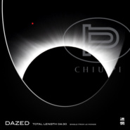

迷惘 DAZED
============================

|  |  |
| :--: | :-- |
| [ 迷惘 DAZED](https://emumo.xiami.com/album/2105363782) | **艺人**: [邱比](../index.md) **语种**: 国语 **唱片公司**: ROKON滚石电音 **发行时间**: 2019年10月24日 **专辑类别**: EP, 单曲 **专辑风格**:  **播放数**: 85611 **收藏数**: 99 **评论数**: 67  |

## 简介

我在星空下的誓言，你在月之海的依恋。  
  
穿梭在我们之间的微风吹，捎来箴言。  
忘了那些未来的往事，投进我的怀中。  
写下最永恒的故事，投放你在睡梦中。  
  
明天的事永远都在那，  
但我对你的爱在当下，  
我的爱在时间的长河里，闪耀着彩色的光亮。  
  
春分的时候，  
我在盛开中失望，  
夏至的时候，  
我在战斗里投降。  
  
你不再说漂亮的话，只为寻找蜕变你的魔法，  
你也不紧盯着他乡，再躲入回忆不可能有办法。  
  
愿风之神倾心于你，愿小径也守候你，  
回家的路不必急往，也许，流连忘返才是真相！  
  
秋分的时候，我在寂寞中盼望，  
冬至的最后，我在你手心里迷惘。  
  
 

## 曲目

## 评论

|  |  |  |  |
| :-- | :-- | :-- | :-- |
|  [虾米用户](https://emumo.xiami.com/u/12333086) 人从一个蛋壳跳进另一个蛋... 2020-03-25 13:19 赞(1) 踩(0) | 
いつも自分が正しいと思うのは危険です
 |
|  [虾米用户](https://emumo.xiami.com/u/8333239) 虾米我永远爱你！ 2019-11-27 01:43 赞(0) 踩(0) | 
你把尘都净化，把爱都坚定。谢谢邱比。
 |
|  [虾米用户](https://emumo.xiami.com/u/49823588)  2019-11-22 16:12 赞(0) 踩(0) | 
谢谢你了邱比
 |
|  [虾米用户](https://emumo.xiami.com/u/30691635) - 天気がいいから、我请... 2019-11-17 16:53 赞(0) 踩(0) | 
云开雾散便见东方之日出 此时的迷惘也不迷惘了
 |
|  [虾米用户](https://emumo.xiami.com/u/1496867) 我还没想好要写什么... 2019-11-14 18:51 赞(1) 踩(0) | 
你写下的每一句歌词 我都是说 是的 
 |
|  [虾米用户](https://emumo.xiami.com/u/196396347) . 2019-11-09 22:36 赞(0) 踩(0) | 
my love❤️
 |
|  [虾米用户](https://emumo.xiami.com/u/10832139) VIIII 2019-11-06 16:02 赞(1) 踩(0) | 
.•.
 |
|  [虾米用户](https://emumo.xiami.com/u/357717266)  2019-11-04 08:25 赞(2) 踩(0) | 
如果说《大放》和《中离》时期邱比，告诉我的是，如何从自律中获得自由。那么这一次的——他用浅显的话语和悦耳的曲调，告诉我的是，如何从不同中获得宽容。看到此刻心底充满着爱与宽容的邱比，看到此刻越来越多元丰富的邱比，看到一直精进刻苦突破的邱比，期待着宝藏歌手被越来越被更多人珍视的时候。
 |
|  [虾米用户](https://emumo.xiami.com/u/299588679) 我还没想好要写什么... 2019-10-28 02:37 赞(3) 踩(0) | 
我什么时候才能遇到值得放手一搏的爱呢
 |
|  [虾米用户](https://emumo.xiami.com/u/428112105)  2019-10-25 20:37 赞(1) 踩(0) | 
太美了 
 |
|  [虾米用户](https://emumo.xiami.com/u/411106967)  2019-10-25 18:54 赞(1) 踩(0) | 
我要打十星！
 |
|  [虾米用户](https://emumo.xiami.com/u/407075949)  2019-10-25 14:50 赞(0) 踩(0) | 
不知道为什么，我听这首歌就觉得牙疼 
 |
|  [虾米用户](https://emumo.xiami.com/u/13704947) 豆瓣见：无悲渊。 2019-10-25 09:16 赞(0) 踩(0) | 
专辑简介太出戏了。
 |
|  [虾米用户](https://emumo.xiami.com/u/125615076) 青絲慢掠獨披塵 2019-10-25 08:38 赞(2) 踩(0) | 
「愛就愛了，不怕沒來過」
 |
|  [虾米用户](https://emumo.xiami.com/u/191909058) 浓墨重彩一笔过，轻描淡写... 2019-10-25 01:18 赞(1) 踩(0) | 
停下来，举起手，静下来，松开手。很有仪式感，每个人都值得被温柔对待！比比展现的大爱～～
 |
|  [虾米用户](https://emumo.xiami.com/u/191884415)  2019-10-25 01:12 赞(1) 踩(0) | 
我只是想要认识你，揭穿你的迷惘，我用一道光驱散你眼前的冷漠。词写的很好！唱的很温柔！
 |
|  [虾米用户](https://emumo.xiami.com/u/124116232) 比比說愛是妳來到世上的原... 2019-10-25 01:04 赞(70) 踩(0) | 
邱比说：“人在生命中经过不断刻苦的锻炼而活出的真实价值，会大大造福这个世界，世界始终向我们敞开心灵，但是人因为固执、不珍惜，而错失了生活中的美意。”
 |
| ⇒ |  [虾米用户](https://emumo.xiami.com/u/406040023) 我还没想好要写什么... 2019-10-30 07:40 赞(0) 踩(0) | 
加油
 |
| ⇒ |  [虾米用户](https://emumo.xiami.com/u/14855872)  2019-11-05 20:04 赞(0) 踩(0) | 
好听 
 |
| ⇒ |  [虾米用户](https://emumo.xiami.com/u/375924459)  2019-12-01 14:55 赞(0) 踩(0) | 
好的
 |
| ⇒ |  [虾米用户](https://emumo.xiami.com/u/434998590)  2020-01-03 21:28 赞(0) 踩(0) | 
还不错
 |
| ⇒ |  [虾米用户](https://emumo.xiami.com/u/435015488) 有一种幸福是看尽花开花落... 2020-01-06 11:40 赞(0) 踩(0) | 
好听
 |
|  [虾米用户](https://emumo.xiami.com/u/68954378)  2019-10-25 00:40 赞(1) 踩(0) | 
听到好听的歌也要记得加班嗷
 |
|  [虾米用户](https://emumo.xiami.com/u/71356146) 欣赏真的人 2019-10-25 00:20 赞(2) 踩(0) | 
陪我玩吧
 |
|  [虾米用户](https://emumo.xiami.com/u/9322022) 不和你谈论玄妙复杂的隐喻 2019-10-25 00:05 赞(1) 踩(0) | 
冬天的礼物又来到了
 |
|  [虾米用户](https://emumo.xiami.com/u/45323236) 必有所获 2019-10-24 22:11 赞(1) 踩(0) | 
也许需要你自己去做
 |
|  [虾米用户](https://emumo.xiami.com/u/45323236) 必有所获 2019-10-24 22:10 赞(1) 踩(0) | 
无需吝啬
 |
|  [虾米用户](https://emumo.xiami.com/u/478527) 好想跟衣服在洗衣机里滚 2019-10-24 21:35 赞(1) 踩(0) | 
先M一下等充实
 |
|  [虾米用户](https://emumo.xiami.com/u/40096090)   2019-10-24 20:16 赞(1) 踩(0) | 
OK
 |
|  [虾米用户](https://emumo.xiami.com/u/353365886) 何须计较……什是因果……... 2019-10-24 18:53 赞(4) 踩(0) | 
这首歌把我此时此刻的心情刻画得淋漓尽致…不知道到为什么总是能心意相通...我着实已感到一束光照进我的心里...感谢你邱比...请时常保持你内心的光，因为你不知道谁会借此走出黑暗。——秋阳创巴仁波切&nbsp;
 |
|  [虾米用户](https://emumo.xiami.com/u/266367589) 逃避向安静与沉默走去。 2019-10-24 18:16 赞(2) 踩(0) | 
太酷了！
 |
|  [虾米用户](https://emumo.xiami.com/u/215698051) CHIU PI  2019-10-24 17:25 赞(3) 踩(0) | 
刚下课啦 立刻就来听了！真的每首歌 都好喜欢！感谢您替我更新一个月没变过的歌单！
 |
|  [虾米用户](https://emumo.xiami.com/u/66823378)  2019-10-24 17:21 赞(4) 踩(0) | 
这个世界每个人都有自己的世界虽然不同也可以找到心的连结。多美好的词啊!
 |
|  [虾米用户](https://emumo.xiami.com/u/54576317) 音乐爱好者  2019-10-24 16:37 赞(1) 踩(0) | 
okay
 |
|  [虾米用户](https://emumo.xiami.com/u/1018) 口哨魔法師 2019-10-24 16:29 赞(18) 踩(0) | 
大概这么多年关注且偶有接触邱比的原因，邱比的创作在我周遭已经形成了一种类似能量磁场上的沉浸感，故而新歌有一种对我的心灵浸入式理解后的发声。
 |
|  [虾米用户](https://emumo.xiami.com/u/49655313) 除了再见还可以说些什么呢 2019-10-24 16:06 赞(1) 踩(0) | 
:P
 |
|  [虾米用户](https://emumo.xiami.com/u/33923461) 00:00 2019-10-24 14:38 赞(4) 踩(0) | 
爱的广阔与浩瀚
 |
|  [虾米用户](https://emumo.xiami.com/u/48276337) 22世纪不道德 2019-10-24 14:28 赞(1) 踩(0) | 
午觉刚睡醒，发现发新歌啦！!!!!哈哈哈哈
 |
|  [虾米用户](https://emumo.xiami.com/u/5541880) ⌇ 2019-10-24 14:16 赞(1) 踩(0) | 

 |
|  [虾米用户](https://emumo.xiami.com/u/170850088)  2019-10-24 13:49 赞(4) 踩(0) | 
溫柔純真的本質，驅散迷惘之後，世界在這首歌裡如此嶄新。
 |
|  [虾米用户](https://emumo.xiami.com/u/726072) 此起，彼浮 2019-10-24 13:47 赞(2) 踩(0) | 
问题描述得足够庞细，但解决的办法约为无。。
 |
|  [虾米用户](https://emumo.xiami.com/u/30980397) 爱憎分明 2019-10-24 13:42 赞(2) 踩(0) | 
為什麼懂我的，還是你啊。
 |
|  [虾米用户](https://emumo.xiami.com/u/31531934) 恋の道に近道はない 2019-10-24 13:05 赞(2) 踩(0) | 
必须大家都来聆听收藏你的分享收藏是给音乐人最大的鼓舞 谢谢大家支持邱比
 |
|  [虾米用户](https://emumo.xiami.com/u/255359360) 全部感官按部就班地失常 2019-10-24 13:05 赞(1) 踩(0) | 

 |
|  [虾米用户](https://emumo.xiami.com/u/43648786) 安静的知了 2019-10-24 12:55 赞(25) 踩(0) | 
正在经历的 、久远过去的、 还未到来的 『迷惘』都被你唱尽。爱到来的时候，我们仍会奋不顾身。谢谢你，再次把我治愈。 
 |
| ⇒ |  [虾米用户](https://emumo.xiami.com/u/406040023) 我还没想好要写什么... 2019-11-03 15:58 赞(0) 踩(0) | 
祝你幸福
 |
| ⇒ |  [虾米用户](https://emumo.xiami.com/u/412512121) 达成某种永恒。Formi... 2019-11-04 06:54 赞(0) 踩(0) | 
还未到来的总会到来 
 |
| ⇒ |  [虾米用户](https://emumo.xiami.com/u/43648786) 安静的知了 2019-11-04 23:12 赞(0) 踩(0) | 
<q><b>里尚达说：</b></q>
 |
| ⇒ |  [虾米用户](https://emumo.xiami.com/u/43648786) 安静的知了 2019-11-04 23:13 赞(0) 踩(0) | 
<q><b>卍修緣卍说：</b></q>
 |
|  [虾米用户](https://emumo.xiami.com/u/346655241) 人类无法忍受太多的真实 2019-10-24 12:53 赞(1) 踩(0) | 

 |
|  [虾米用户](https://emumo.xiami.com/u/407085769) 脱离了高级趣味的人 2019-10-24 12:46 赞(1) 踩(0) | 
到此一游
 |
|  [虾米用户](https://emumo.xiami.com/u/216685496) 我还没想好要写什么... 2019-10-24 12:46 赞(3) 踩(0) | 
好喜欢用节气来类比感情
 |
|  [虾米用户](https://emumo.xiami.com/u/403886546) 走走停停 2019-10-24 12:34 赞(2) 踩(0) | 
闪闪发光的新歌点亮感觉不太好的中午哈哈
 |
|  [虾米用户](https://emumo.xiami.com/u/201391232) 最快的方法是先抱抱 2019-10-24 12:24 赞(6) 踩(0) | 
在我的世界里 我们的心意相通。若再勇敢一点 我们可以成为朋友吗？
 |
|  [虾米用户](https://emumo.xiami.com/u/44550418) . 2019-10-24 12:18 赞(1) 踩(0) | 
⭐️
 |
|  [虾米用户](https://emumo.xiami.com/u/221940611) 氛围   摇滚  后摇 ... 2019-10-24 12:18 赞(2) 踩(0) | 
你知道我莫名爱你
 |
|  [虾米用户](https://emumo.xiami.com/u/349299788) 我们就要相爱 不可思愚。 2019-10-24 12:16 赞(3) 踩(0) | 
我们都因你而快乐。
 |
|  [虾米用户](https://emumo.xiami.com/u/3553665) We can be He... 2019-10-24 12:13 赞(2) 踩(0) | 
❤️
 |
|  [虾米用户](https://emumo.xiami.com/u/196878182) 。 2019-10-24 12:07 赞(3) 踩(0) | 
  
 |
|  [虾米用户](https://emumo.xiami.com/u/316415286) Free 2019-10-24 12:04 赞(4) 踩(0) | 
Get❤️
 |
|  [虾米用户](https://emumo.xiami.com/u/47712421) 无 2019-10-24 12:03 赞(2) 踩(0) | 

 |
|  [虾米用户](https://emumo.xiami.com/u/124116232) 比比說愛是妳來到世上的原... 2019-10-24 12:01 赞(5) 踩(0) | 
get
 |
|  [虾米用户](https://emumo.xiami.com/u/111096626) 我还没想好要写什么... 2019-10-24 12:01 赞(3) 踩(0) | 
来了
 |
|  [虾米用户](https://emumo.xiami.com/u/30980397) 爱憎分明 2019-10-24 12:00 赞(3) 踩(0) | 
夸！！！！
 |
|  [虾米用户](https://emumo.xiami.com/u/264283064) bye  2019-10-24 12:00 赞(4) 踩(0) | 
ł
 |
|  [虾米用户](https://emumo.xiami.com/u/257103143) 音乐爱好者~ 2019-10-24 12:00 赞(3) 踩(0) | 
Get
 |
