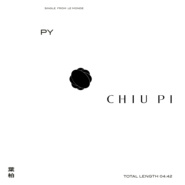

叶柏 PY
============================

|  |  |
| :--: | :-- |
| [ 叶柏 PY](https://emumo.xiami.com/album/2105473646) | **艺人**: [邱比](../index.md) **语种**: 国语 **唱片公司**: ROKON滚石电音 **发行时间**: 2019年11月22日 **专辑类别**: EP, 单曲 **专辑风格**: 国语流行 Mandarin Pop **播放数**: 420240 **收藏数**: 124 **评论数**: 100  |

## 简介

让我们谈谈英国！谈谈那些歌，  
谈谈那边席卷全球的礼节风格，  
谈谈你。  
  
我曾经帮刘美惠的自创品牌 Victim Fashion Street，  
走过两场时装秀，一场男装、一场女装，  
她的先生是 AllSaints 创意总监 Wil Beedle。  
但我只想谈谈你。  
  
我喜欢披头四的灵性格调，  
我也欣赏巴宝莉风衣、Barbour猎装；  
我的衣柜中藏有一件庞克马甲。  
但现在若要提到英国先想到的却全是你。  
  
虽然还没去有机会去，  
但我读过那边不少的散文，  
以及你在学时期那堆照片的空间。  
  
我的歌，创作完成可以等一百年。  
  
曾经替你写张纯音乐，  
存在或不存在，有或没有，  
发生过或永远不会发生，  
我也无法忽略。  
  
起雾了？  
 

## 曲目

## 评论

|  |  |  |
| :-- | :-- | :-- |
|  [虾米用户](https://emumo.xiami.com/u/36089186) 我还没想好要写什么.. 2020-06-15 01:35 赞(1) 踩(0) | 
bb miss u
 |
|  [虾米用户](https://emumo.xiami.com/u/430792759)  2019-12-29 23:02 赞(1) 踩(0) | 
好听我喜欢
 |
|  [虾米用户](https://emumo.xiami.com/u/39754495) - 2019-12-17 13:26 赞(5) 踩(0) | 
感觉您恋爱了:)
 |
|  [虾米用户](https://emumo.xiami.com/u/50004159) 天亮了，我们就都回来了 2019-11-28 16:29 赞(3) 踩(0) | 
很多时候可以平静
 |
|  [虾米用户](https://emumo.xiami.com/u/412567653) 我还没想好要写什么... 2019-11-28 14:52 赞(3) 踩(0) | 
我们就要相爱！
 |
|  [虾米用户](https://emumo.xiami.com/u/13942851)   2019-11-27 18:08 赞(1) 踩(0) | 
抓耳
 |
|  [虾米用户](https://emumo.xiami.com/u/30980397) 爱憎分明 2019-11-27 13:45 赞(1) 踩(0) | 
反正我做不到。 我只会一次次去爱。
 |
|  [虾米用户](https://emumo.xiami.com/u/7172775) 有个性没签名 2019-11-26 22:53 赞(1) 踩(0) | 
和我的失恋 很配
 |
|  [虾米用户](https://emumo.xiami.com/u/41060340)  2019-11-26 21:32 赞(1) 踩(0) | 
今年听的最喜欢的音乐人1/3。 大爱大爱❤️
 |
| ⇒ |  [虾米用户](https://emumo.xiami.com/u/41060340)  2019-11-27 21:09 赞(0) 踩(0) | 
天哪，邱比给我点赞了。啊啊啊啊啊，我在朋友圈里分享邱比的歌曲时，说我太幸运，什么都没有做，仅仅是因为恰好知晓邱比和他的歌曲，就可以获得如此美妙的享受，这么美的音乐，太幸福了。
 |
|  [虾米用户](https://emumo.xiami.com/u/43443614) 微信M7-Bonnie，... 2019-11-26 14:58 赞(1) 踩(0) | 
pop song
 |
|  [虾米用户](https://emumo.xiami.com/u/40096090)   2019-11-26 12:01 赞(1) 踩(0) | 
美哭了...在这个冬天听到，很暖和
 |
|  [虾米用户](https://emumo.xiami.com/u/43714694) WeChat：96529... 2019-11-25 16:34 赞(0) 踩(0) | 
吱/音
 |
|  [虾米用户](https://emumo.xiami.com/u/357647732)  2019-11-24 22:33 赞(2) 踩(0) | 
但我不像你。。。
 |
|  [虾米用户](https://emumo.xiami.com/u/7031762) 电影厨房食物烹制采样～A... 2019-11-24 10:00 赞(12) 踩(0) | 
邱比越来越暖了 触觉越来越温柔 真棒
 |
|  [虾米用户](https://emumo.xiami.com/u/300750919)  2019-11-23 23:02 赞(1) 踩(0) | 
听不够，再来100首！！
 |
|  [虾米用户](https://emumo.xiami.com/u/189284668) ^/(⌒-⌒; ) 没有... 2019-11-23 16:45 赞(2) 踩(0) | 
太喜欢了！！！可以听这首做任何事情！不会变忧伤 因为里面有力量在
 |
|  [虾米用户](https://emumo.xiami.com/u/103926044) 请你杀了我吧，我不反抗 2019-11-23 15:53 赞(4) 踩(0) | 
邱比can do everything
 |
|  [虾米用户](https://emumo.xiami.com/u/478527) 好想跟衣服在洗衣机里滚 2019-11-23 14:46 赞(1) 踩(0) | 
古德
 |
|  [虾米用户](https://emumo.xiami.com/u/5486926) 阿 梭 2019-11-23 14:10 赞(1) 踩(0) | 

 |
|  [虾米用户](https://emumo.xiami.com/u/30911605) 也许没有用 2019-11-23 12:31 赞(2) 踩(0) | 
我也喜欢披头四的灵性格调！
 |
|  [虾米用户](https://emumo.xiami.com/u/212356465) 庸人罢了 2019-11-23 11:55 赞(1) 踩(0) | 
灵气
 |
|  [虾米用户](https://emumo.xiami.com/u/47744094) 我还没想好要写什么... 2019-11-23 09:14 赞(2) 踩(0) | 
( ´ꁖ ` )太喜欢了已经循环好多遍了
 |
|  [虾米用户](https://emumo.xiami.com/u/7719989) 保持距離。 2019-11-23 08:31 赞(3) 踩(0) | 
一如既往的是邱比，也一如既往地喜欢。
 |
|  [虾米用户](https://emumo.xiami.com/u/12011017) 那你呢 2019-11-23 08:22 赞(1) 踩(0) | 
get
 |
|  [虾米用户](https://emumo.xiami.com/u/298512237)  2019-11-23 08:10 赞(1) 踩(0) | 

 |
|  [虾米用户](https://emumo.xiami.com/u/66264174)  2019-11-23 07:46 赞(2) 踩(0) | 

 |
|  [虾米用户](https://emumo.xiami.com/u/342929031)  2019-11-23 07:41 赞(2) 踩(0) | 

 |
|  [虾米用户](https://emumo.xiami.com/u/206703958) Ins:lulululu... 2019-11-23 01:12 赞(1) 踩(0) | 
哇~
 |
|  [虾米用户](https://emumo.xiami.com/u/44550418) . 2019-11-23 00:35 赞(1) 踩(0) | 
⭐️
 |
|  [虾米用户](https://emumo.xiami.com/u/216685496) 我还没想好要写什么... 2019-11-22 23:49 赞(1) 踩(0) | 
没有办法不爱
 |
|  [虾米用户](https://emumo.xiami.com/u/71356146) 欣赏真的人 2019-11-22 22:50 赞(2) 踩(0) | 
满满的诚恳和小心翼翼
 |
|  [虾米用户](https://emumo.xiami.com/u/5983196)  2019-11-22 21:57 赞(2) 踩(0) | 
一点一点看到邱比的变化，这是他的能力。自由表达。
 |
|  [虾米用户](https://emumo.xiami.com/u/257107690)  2019-11-22 19:56 赞(1) 踩(0) | 
无限循环
 |
|  [虾米用户](https://emumo.xiami.com/u/13045828)   2019-11-22 18:51 赞(2) 踩(0) | 
摇滚比比 魅力无敌
 |
|  [虾米用户](https://emumo.xiami.com/u/257103143) 音乐爱好者~ 2019-11-22 17:01 赞(3) 踩(0) | 
比比终于有一首歌的音域可以让我轻松地唱出来了.
 |
|  [虾米用户](https://emumo.xiami.com/u/439746)   2019-11-22 15:43 赞(1) 踩(0) | 
前奏就喜欢
 |
|  [虾米用户](https://emumo.xiami.com/u/192218876)  2019-11-22 15:11 赞(1) 踩(0) | 
MV也绝美
 |
|  [虾米用户](https://emumo.xiami.com/u/125615076) 青絲慢掠獨披塵 2019-11-22 14:50 赞(1) 踩(0) | 
把我聽哭了
 |
|  [虾米用户](https://emumo.xiami.com/u/419620895) 命由己造，相由心生。 2019-11-22 14:06 赞(1) 踩(0) | 
  
 |
|  [虾米用户](https://emumo.xiami.com/u/344971686) 我还没想好要写什么... 2019-11-22 13:24 赞(3) 踩(0) | 
你在哪啊 你正悄悄地在我心里呀
 |
|  [虾米用户](https://emumo.xiami.com/u/260992790) I'll Be Your... 2019-11-22 13:24 赞(1) 踩(0) | 
。
 |
|  [虾米用户](https://emumo.xiami.com/u/346984365) 404 2019-11-22 13:17 赞(1) 踩(0) | 
我们在哪儿/我们在那儿
 |
|  [虾米用户](https://emumo.xiami.com/u/264829096) 我还没想好要写什么... 2019-11-22 13:05 赞(2) 踩(0) | 
比比空降地下室二层真的很让人欣喜呀！一如既往地喜欢这首歌，带给人一种温暖柔和舒适的心情，也带给了我们新的变化。
 |
|  [虾米用户](https://emumo.xiami.com/u/201019140) 畫畫寫作到死去，多迷人 2019-11-22 13:04 赞(1) 踩(0) | 
邱比值得。
 |
|  [虾米用户](https://emumo.xiami.com/u/66823378)  2019-11-22 13:03 赞(1) 踩(0) | 
爱你
 |
|  [虾米用户](https://emumo.xiami.com/u/10832139) VIIII 2019-11-22 13:03 赞(2) 踩(0) | 
.•.
 |
|  [虾米用户](https://emumo.xiami.com/u/379345942) 一天不听邱比都 不行 2019-11-22 12:59 赞(1) 踩(0) | 
一直爱比比，希望他每天都愉快
 |
|  [虾米用户](https://emumo.xiami.com/u/257103143) 音乐爱好者~ 2019-11-22 12:55 赞(3) 踩(0) | 
Get.
 |
|  [虾米用户](https://emumo.xiami.com/u/234292903)  2019-11-22 12:55 赞(1) 踩(0) | 
太美啦
 |
|  [虾米用户](https://emumo.xiami.com/u/408430722) 很幼稚吗？ 2019-11-22 12:49 赞(1) 踩(0) | 
单曲循环
 |
|  [虾米用户](https://emumo.xiami.com/u/85389256) 我是失去了悲痛的悲剧作家 2019-11-22 12:46 赞(1) 踩(0) | 
之前的demo就很爱了！这版编曲也赞！
 |
|  [虾米用户](https://emumo.xiami.com/u/14669970) 氛围，古典，流行，电子.... 2019-11-22 12:45 赞(1) 踩(0) | 
从迷惘发出后，就一直期待以后的新单，今天终于出来了，果然没失望！！！好听！！！歌词依然那么走心！！！强推～
 |
|  [虾米用户](https://emumo.xiami.com/u/349299788) 我们就要相爱 不可思愚。 2019-11-22 12:37 赞(1) 踩(0) | 
平行空间的具像，很美。
 |
|  [虾米用户](https://emumo.xiami.com/u/57069582)  2019-11-22 12:31 赞(2) 踩(0) | 
❤️温良如丝却也能灼身
 |
|  [虾米用户](https://emumo.xiami.com/u/331175784) 梦醒前你不要走. 2019-11-22 12:26 赞(2) 踩(0) | 
起雾了。
 |
|  [虾米用户](https://emumo.xiami.com/u/357717266)  2019-11-22 12:21 赞(2) 踩(0) | 
冬日，南国，午后，蓝天，阳光和树影下的斑驳，轻快的曲调，让心愉悦而轻盈地跳跃，感觉邱比唱的是珍贵的友谊，这情感不仅可以迸发出彼此最真实最放松的状态，而且还能够成就对方成为最好的自己。我想，曾遇到的人，走过的一段时光，都是上天的恩赐，当它离开时，你同样也要有放手而淡然的勇气。
 |
|  [虾米用户](https://emumo.xiami.com/u/346485708)  2019-11-22 12:21 赞(1) 踩(0) | 
超棒！
 |
|  [虾米用户](https://emumo.xiami.com/u/343167354) 我还没想好要写什么... 2019-11-22 12:19 赞(1) 踩(0) | 

 |
|  [虾米用户](https://emumo.xiami.com/u/9189771) 我还没想好要写什么... 2019-11-22 12:19 赞(1) 踩(0) | 
终于等到！！
 |
|  [虾米用户](https://emumo.xiami.com/u/3553665) We can be He... 2019-11-22 12:15 赞(1) 踩(0) | 

 |
|  [虾米用户](https://emumo.xiami.com/u/375611121)  2019-11-22 12:14 赞(1) 踩(0) | 
邱比值得。
 |
|  [虾米用户](https://emumo.xiami.com/u/44923439) CHIU PI 2019-11-22 12:13 赞(1) 踩(0) | 
hi 比比
 |
|  [虾米用户](https://emumo.xiami.com/u/330508355)  2019-11-22 12:13 赞(1) 踩(0) | 
花来了～
 |
|  [虾米用户](https://emumo.xiami.com/u/8333239) 虾米我永远爱你！ 2019-11-22 12:13 赞(2) 踩(0) | 
比比！我不忙，我们要相爱:)
 |
|  [虾米用户](https://emumo.xiami.com/u/9613683) 我还没想好要写什么... 2019-11-22 12:12 赞(1) 踩(0) | 
来了来了！！我爱邱比！！
 |
|  [虾米用户](https://emumo.xiami.com/u/196396347) . 2019-11-22 12:11 赞(1) 踩(0) | 
my love
 |
|  [虾米用户](https://emumo.xiami.com/u/424159324)  2019-11-22 12:11 赞(1) 踩(0) | 
越来越向流行靠拢的邱比，也好听～
 |
|  [虾米用户](https://emumo.xiami.com/u/266367589) 逃避向安静与沉默走去。 2019-11-22 12:11 赞(2) 踩(0) | 
等到了等到了！！！
 |
|  [虾米用户](https://emumo.xiami.com/u/334161857) ThatGirlCome... 2019-11-22 12:11 赞(1) 踩(0) | 
新的编曲总是能带来惊喜，期待全专！
 |
|  [虾米用户](https://emumo.xiami.com/u/91037730) DOIT 2019-11-22 12:10 赞(1) 踩(0) | 
树影婆娑荡在人群中走在校道上 听第一遍就沦陷~比比♡
 |
|  [虾米用户](https://emumo.xiami.com/u/302567423) 冷暖我不念你，江河知道你... 2019-11-22 12:10 赞(1) 踩(0) | 
我来啦！！！！
 |
|  [虾米用户](https://emumo.xiami.com/u/95018014) 升迷 2019-11-22 12:09 赞(1) 踩(0) | 
我也想炽热地与你相爱
 |
|  [虾米用户](https://emumo.xiami.com/u/47712421) 无 2019-11-22 12:09 赞(1) 踩(0) | 
 
 |
|  [虾米用户](https://emumo.xiami.com/u/125288140) 我的星球有一颗最亮的星星... 2019-11-22 12:08 赞(1) 踩(0) | 
❤️❤️❤️
 |
|  [虾米用户](https://emumo.xiami.com/u/291336036)  2019-11-22 12:08 赞(1) 踩(0) | 
今晚见 
 |
|  [虾米用户](https://emumo.xiami.com/u/111096626) 我还没想好要写什么... 2019-11-22 12:07 赞(2) 踩(0) | 
我太爱歌词了
 |
|  [虾米用户](https://emumo.xiami.com/u/51833360)  2019-11-22 12:06 赞(1) 踩(0) | 
哦！邱比先生。
 |
|  [虾米用户](https://emumo.xiami.com/u/410539446) 我还没想好要写什么... 2019-11-22 12:05 赞(2) 踩(0) | 
都是爱意，
 |
|  [虾米用户](https://emumo.xiami.com/u/72421752)  2019-11-22 12:05 赞(1) 踩(0) | 
爱您！
 |
|  [虾米用户](https://emumo.xiami.com/u/410539446) 我还没想好要写什么... 2019-11-22 12:05 赞(2) 踩(0) | 
天呐，我太激动了
 |
|  [虾米用户](https://emumo.xiami.com/u/347713244)     ☄ 2019-11-22 12:04 赞(2) 踩(0) | 
能够欣赏一个人，却又可以不爱。但邱比，我怎能不爱 
 |
|  [虾米用户](https://emumo.xiami.com/u/430588161) 我还没想好要写什么... 2019-11-22 12:04 赞(1) 踩(0) | 
好爱啊
 |
|  [虾米用户](https://emumo.xiami.com/u/8144207) 我还没想好要写什么... 2019-11-22 12:04 赞(1) 踩(0) | 
ةةةةةةة
 |
|  [虾米用户](https://emumo.xiami.com/u/71489732)  2019-11-22 12:03 赞(1) 踩(0) | 
我们在哪  我们都忙
 |
|  [虾米用户](https://emumo.xiami.com/u/29119620) 夜幕海岸線/藍色大門後/... 2019-11-22 12:03 赞(1) 踩(0) | 
go
 |
|  [虾米用户](https://emumo.xiami.com/u/7292098) 我們不斷相遇 在未來里 2019-11-22 12:03 赞(2) 踩(0) | 

 |
|  [虾米用户](https://emumo.xiami.com/u/422850277) 我还没想好要写什么... 2019-11-22 12:03 赞(1) 踩(0) | 
邱比冲冲冲！！ 一年后，等来了全新的邱比！
 |
|  [虾米用户](https://emumo.xiami.com/u/50297891) Where is whe... 2019-11-22 12:03 赞(1) 踩(0) | 
又是单曲循环的一天～
 |
|  [虾米用户](https://emumo.xiami.com/u/106131078) 很高兴遇到你 2019-11-22 12:03 赞(1) 踩(0) | 
一首很温柔的英摇 
 |
|  [虾米用户](https://emumo.xiami.com/u/50297891) Where is whe... 2019-11-22 12:02 赞(1) 踩(0) | 
来了来了！！！！
 |
|  [虾米用户](https://emumo.xiami.com/u/78171806)  2019-11-22 12:02 赞(1) 踩(0) | 

 |
|  [虾米用户](https://emumo.xiami.com/u/176710716) 无也 2019-11-22 12:02 赞(1) 踩(0) | 
开心
 |
|  [虾米用户](https://emumo.xiami.com/u/176710716) 无也 2019-11-22 12:01 赞(1) 踩(0) | 
啊啊啊啊啊啊啊 激动
 |
|  [虾米用户](https://emumo.xiami.com/u/76029894) 我还没想好要写什么... 2019-11-22 12:01 赞(1) 踩(0) | 
比比冲冲冲！
 |
|  [虾米用户](https://emumo.xiami.com/u/248466247)  2019-11-22 12:01 赞(1) 踩(0) | 
是你
 |
|  [虾米用户](https://emumo.xiami.com/u/4798838) ～ 2019-11-22 12:01 赞(1) 踩(0) | 
❤️
 |
|  [虾米用户](https://emumo.xiami.com/u/264283064) bye  2019-11-22 12:00 赞(2) 踩(0) | 
ł
 |
|  [虾米用户](https://emumo.xiami.com/u/49640493) 网易云SAINTDONT... 2019-11-22 12:00 赞(3) 踩(0) | 
love
 |
