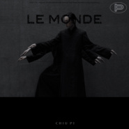

至繁 LE MONDE至於那些繁琐的未来
============================

|  |  |
| :--: | :-- |
| [ 至繁 LE MONDE至於那些繁琐的未来](https://emumo.xiami.com/album/2105584647) | **艺人**: [邱比](../index.md) **语种**: 国语 **唱片公司**: ROKON滚石电音 **发行时间**: 2019年12月20日 **专辑类别**: 录音室专辑 **专辑风格**: 国语流行 Mandarin Pop, 迷幻氛围 Psybient, 极简合成器 Minimal Synth **播放数**: 896089 **收藏数**: 1318 **评论数**: 574  |

## 简介

邱比：至繁之简  
邱比被誉为台湾最优秀的一位实验音乐、电子音乐和氛围音乐的艺术家代表之一，属于非典型的先锋人物。  
  
邱比是一个创作天才，他很有个性，遵循自我的想法且独一无二。他的音乐很美好，充满了禅意，歌词像诗一样且美又残酷。他的歌里没有泾渭分明、没有燃烧的爱意。他用一种遗世独立的雍容去演绎“有意识的和谐之音”。  
2013年，邱比与大用签下第一纸7年长约，开始了他作为一位音乐与身体表演者的全职生涯。邱比以不定形的舞蹈、戏剧执导及独特的音乐品味演示了跨界合作的多元可能，透过不断反市场其道而行，邱比的艺术因而很难用语言精准形容，但他始终是位乐于实验、擅于创新的艺术家。  
邱比将《正正》视为他的第一张正式专辑，并在心中默默描绘属于他个人的”华语电音四部曲”。这个有耐心的计划于2019年末《至繁》出版后正式完结。  
  
邱比四张大碟的首字部可集结成“大中至正”这四个字，它象征着东方人的精神境界，也是邱比音乐的傲骨与本位。他擅用重复的音节、持续的变化，以及低敛的叠加手法不断形成精彩的起承转合，营造呼应内心世界的层次空间感，并对当下流行的市场风格提出自觉与省察的回应。  
曾被颁发和入围过：最佳年度电子艺人、最佳创作歌手、最佳电音专辑、最佳现场演出、最佳电音单曲的邱比大量创作出各种不同类型的音乐。曾经引起各界关注并成为首张互联网唱片《寻光集》中力推的极简电子乐艺术家。  
  
一连串的音乐发展并未让他裹足不前，他率先公开表示自己也是一名科幻小说迷，在大块文化董事长的力荐下，来年停下音乐事业果断发行《最后安慰》这本社会未来预言。  
他曾说：“我理想中的音乐对一切事物都有公正的答案。” 邱比的词曲风格从实验到电子再到摇滚，搭配上时尚精准的平面设计，其严谨又自律的态度源自其于高中至大学所受的道艺合一训练经历。  
  
透过研读葛氏的精神世界，邱比沉浸于历史、文学、电影、心理学的养分中温实成长，用富饶诗意的语境和肢体表达，向观众展现一面截然不同的白镜，映照当下心的超凡入圣。  
邱比的《至繁》亦可以念读为：“至于那些繁琐的未来。”这张专辑是他近年来最自我颠覆，同时却也最贴合生活所思的一张概念唱片。  
  
制作上不乏邱比独特的标签手法，例如：声音相位的特殊空间位移、部落般不断堆叠的人声、对称的琶音序列、摩登而魅惑的驰放、关怀社会弱势的中性歌词、和对东方文化的一种灵性诠释。  
邱比的歌词乍看直白实则不然。邱比的歌曲是两岸乐评人口中“最难被翻唱的创作。”其难度在于由他写下来的音符往往需要歌手性格色彩中极为罕见的一种特质相应，才能真正体会并唱好邱比音乐里的那股不羁与艺术力道，那股特质的关键就是邱比与生具来的浪漫情怀。  
  
邱比对世界有既具象又符号化的个人理解。他不时以全新的标志设计来让自己的音乐在不需发声的情况下就能传递人心并引发共鸣。  
  
邱比也从不受类型局限，他被视为少数将音乐、影像、表演、文学等创作都已达到高度个人色彩的艺术家。  
邱比用极简的音乐直视世界的本质。并透过抽象的故事与概念。向他的乐迷指引一条通往真实不虚的自信的勇者无惧之路。  
  
如此表达方式深受同期音乐就工作者肯定，邱比在受邀签约滚石唱片的子品牌滚石电音后，一年一张的发行不曾间断，并大胆去革新音乐录影带的既定限制。不眠不休地建构属于他的艺术语汇，邱比已经开始迈向国际化的过程，并走着一条前人从未走过的新路。  
邱比的最新创作《至繁》推出10首新歌。从第一首就开始震撼你的观感、颠覆你对音乐的想象。“热寂”用粗犷与纯实色调，展现邱比歌声自带的金属声。“睡梦”一首长达8分41秒的梦回单曲疗愈现代人因焦虑失眠的漫漫长夜。“基地”记录着这个崇拜时代下的偶像副作用。“一念”他的第一首国风单曲，述说一段湿婆的修行者故事。“柔黄”用沉重的解嘲，一一回顾过去的专辑名称。“夜光”宛如电影中出现的禁忌仪式，标志着宗教的复活主义。“迷惘”献给失调时代的瑰宝之歌，呼吁和平至上的原谅精神。“忽略”作为新专辑中最前卫的一首歌，可以听见最鲜明的个性元素。“叶柏”被预测为年度金曲，是邱比迄今最诚恳的情思告白。“至繁”邱比音乐生涯的压轴之歌，献给一路上偶遇且愿意为他驻足的乐迷，也是专辑的同名主打歌曲。  
  
邱比以直觉但有序的方式，用一黑一白两色作为两波为专辑量身订制的先发预告，宣示他将再一次义无反顾地做自己。他钟爱世界上最深的黑色，因为黑色是不起眼的一粒沙、是最微弱的星、是记忆里最角落的一片模糊、是谣传，也是隐匿的传奇。  
发迹自《中国好歌曲》的邱比首度浅尝被众人注目的感受，他也不断递交更新的代表作，从“整夜大雨”“你的一切都是我的风格”到获奖无数的《大放》及“中离”和最新的《至繁》。  
  
除了受古今优秀低限主义音乐家启发，邱比也开始用他独到的哲学问题自觉觉人。邱比每年不止一次的探寻并挖掘全新而未知的音乐表现形式，已让他的专辑、演出被赋予一种特殊意义。

## 曲目

## 评论

|  |  |  |
| :-- | :-- | :-- |
|  [虾米用户](https://emumo.xiami.com/u/156056836) 我还没想好要写什么... 2021-01-31 01:37 赞(0) 踩(0) | 
❤️
 |
|  [虾米用户](https://emumo.xiami.com/u/85389256) 我是失去了悲痛的悲剧作家 2021-01-30 17:52 赞(0) 踩(0) | 
才意识到LE MONDE有&amp;ldquo;红尘&amp;rdquo;的意思，跟我的名字&amp;ldquo;红辰&amp;rdquo;谐音！好快乐，我宣布《至繁》是我最爱的专辑。 几年前计划过30岁以后出一张专辑，名字叫《世俗快乐》，但是有邱比做了类似的，我可以不用做了，真好啊
 |
|  [虾米用户](https://emumo.xiami.com/u/379162683) 我想要记住你们，我想要你... 2021-01-30 12:56 赞(2) 踩(0) | 

 |
|  [虾米用户](https://emumo.xiami.com/u/335926107) 当你不断追求卓越，成功就... 2021-01-08 08:38 赞(4) 踩(0) | 
以后就要流浪了 
 |
|  [虾米用户](https://emumo.xiami.com/u/125615076) 青絲慢掠獨披塵 2020-12-06 23:20 赞(2) 踩(0) | 
To Starry 
 |
|  [虾米用户](https://emumo.xiami.com/u/7757144) 懒癌晚期 2020-09-04 00:51 赞(4) 踩(0) | 
翻转宇宙每一道漪涟的邱比美学
 |
|  [虾米用户](https://emumo.xiami.com/u/263625478)  2020-08-27 10:58 赞(3) 踩(0) | 
超越技法层面的优秀，和真诚
 |
|  [虾米用户](https://emumo.xiami.com/u/279414417) 京津冀斤斤计较斤斤计较 2020-08-06 23:15 赞(2) 踩(0) | 
太棒了
 |
|  [虾米用户](https://emumo.xiami.com/u/36089186) 我还没想好要写什么.. 2020-06-15 11:11 赞(5) 踩(0) | 
一进到您的世界 我就忘了外界的一切
 |
|  [虾米用户](https://emumo.xiami.com/u/122664704) Be silence. 2020-05-27 10:25 赞(9) 踩(0) | 
偶然间知道邱比这位音乐人的时候我在读高三，现在我马上要大学毕业了。生活也在由简至繁
 |
|  [虾米用户](https://emumo.xiami.com/u/122664704) Be silence. 2020-05-27 10:22 赞(5) 踩(0) | 
从“极简”到入世多年后的“繁”，邱比的音乐加入了越来越多的人情味。每一种邱比我都好爱
 |
|  [虾米用户](https://emumo.xiami.com/u/48841601)  2020-05-16 01:50 赞(2) 踩(0) | 

 |
|  [虾米用户](https://emumo.xiami.com/u/939624) slide. 2020-05-08 10:08 赞(3) 踩(0) | 
这张专辑我大概也就循环了两百遍吧
 |
|  [虾米用户](https://emumo.xiami.com/u/43492923) 行到水穷我才开始害怕，夕... 2020-05-03 15:39 赞(3) 踩(0) | 
。
 |
| ⇒ |  [虾米用户](https://emumo.xiami.com/u/48346829)  2020-10-27 23:12 赞(0) 踩(0) | 
又看到你，喜欢张雨生又喜欢邱比的人！缘分啊
 |
|  [虾米用户](https://emumo.xiami.com/u/405337099) Ataraxia 2020-04-27 14:17 赞(3) 踩(0) | 
至繁：至于那些繁琐的未来。在期待之中。
 |
|  [虾米用户](https://emumo.xiami.com/u/53590447) 梦归隐 2020-04-24 12:31 赞(1) 踩(0) | 
好浪漫哦
 |
|  [虾米用户](https://emumo.xiami.com/u/10717140)  2020-04-22 07:32 赞(1) 踩(0) | 
每一首都好听到让我后悔这么晚才打开了这张专辑。
 |
|  [虾米用户](https://emumo.xiami.com/u/433993243) 我还没想好要写什么... 2020-04-17 11:24 赞(1) 踩(0) | 
一直觉得自己是极繁主义 可为什么会被极简主义吸引
 |
|  [虾米用户](https://emumo.xiami.com/u/433993243) 我还没想好要写什么... 2020-04-17 11:21 赞(1) 踩(0) | 
听到邱比的音乐第一感觉就是有极强的共情力。我大概是个不怎么坚定的黑格尔主义者，相信理念高于生命，人活着就是这个社会道德伦理的承担者，对爱嗤之以鼻 时常对一些事物充满憎恶，但对外却表现出虚假的 为了维护秩序的共情。之前一直觉得最美的东西莫过于在热烈中燃烧灵魂创造世俗意义上的价值然后迅速消耗殆尽，直到发现世间还有这样一种美，是无孔不入全面包裹被救赎的感觉。无法用语言形容，于是在这样纯粹的东西面前自形惭秽。开始用另一个角度思考生命并且不再那么排斥爱。明白&amp;ldquo;真正的无限是在别物中即是在自己中，或者从过程方面来表述，就是在别物中返回到自己。&amp;rdquo;这类的道理，但是一直缺乏主观感受，听了邱比的歌以后深切体会到了。
 |
|  [虾米用户](https://emumo.xiami.com/u/431591210) 嘘 别让人发现我。 2020-03-19 17:46 赞(1) 踩(0) | 
喜欢这张专辑 也喜欢邱比的用心 平淡生活里的一点慰藉
 |
|  [虾米用户](https://emumo.xiami.com/u/20177386) 感谢一切美好的遇见❤️ 2020-03-18 23:30 赞(2) 踩(0) | 
卡哇伊比 
 |
|  [虾米用户](https://emumo.xiami.com/u/54950259) Fluidflux 2020-03-06 14:54 赞(1) 踩(0) | 
换一双眼睛去看，发现你的音乐仍是我的最爱，你的美学依然是我心中最高级的美学。
 |
|  [虾米用户](https://emumo.xiami.com/u/411218928) 喜欢电子音乐 2020-03-06 01:01 赞(0) 踩(0) | 
我一直觉得声音像王菲呢
 |
|  [虾米用户](https://emumo.xiami.com/u/411218928) 喜欢电子音乐 2020-03-06 00:59 赞(1) 踩(0) | 
才子
 |
|  [虾米用户](https://emumo.xiami.com/u/309287338) 自我救赎 2020-02-26 12:47 赞(1) 踩(0) | 
这张多元化的专真的太棒了，我好爱，邱比是神仙啊
 |
|  [虾米用户](https://emumo.xiami.com/u/45323236) 必有所获 2020-02-18 19:44 赞(1) 踩(0) | 
邱比的每一张专辑几乎都可以被看成一个故事或者故事集
 |
|  [虾米用户](https://emumo.xiami.com/u/1745528)   2020-02-07 21:00 赞(1) 踩(0) | 
宗教般的魔力 一直听一直听
 |
|  [虾米用户](https://emumo.xiami.com/u/39955054) 我还没想好要写什么... 2020-02-04 13:37 赞(4) 踩(0) | 
每天至少 聽一遍整張專輯 成為我的日常  日常想念比比
 |
|  [虾米用户](https://emumo.xiami.com/u/436431755)  2020-01-27 00:46 赞(3) 踩(0) | 
堪称完美的一张专辑…循环听了好久好久
 |
|  [虾米用户](https://emumo.xiami.com/u/33521922) 可能比较情绪化 2020-01-22 20:02 赞(2) 踩(0) | 
不能再好了
 |
|  [虾米用户](https://emumo.xiami.com/u/82904854) 我还没想好要写什么... 2020-01-20 02:57 赞(4) 踩(0) | 
封神之作。无需多评论也无法多评论，此刻最担心的莫过于这是邱比的最后一张。
 |
|  [虾米用户](https://emumo.xiami.com/u/14669970) 氛围，古典，流行，电子.... 2020-01-18 13:49 赞(2) 踩(0) | 
下午的办公室好像冬眠一样，让脑袋空空归心似箭的人儿的心到处飘~飘~飘~  逛微博里的关注，看到了比比新专好听的歌，打开了虾米再次循环，虽然已经听了很多很多次，还是听不够。比比的歌，是很多的时候会想起打开听。  很期待2020的巡演，许个愿：希望3月份在上海。
 |
|  [虾米用户](https://emumo.xiami.com/u/187223463) 嗯 2020-01-17 22:21 赞(4) 踩(0) | 
前几天是邱比在翻牌吗，我酸。 好喜欢新专辑 刚发的时候就听了 今天在夜里独自坐在窗前 认真看了歌词 感觉突然变得强烈 最后一首至繁 是我最喜欢的 平静而热烈的感觉 是简单真实的 从心里流淌出来的
 |
|  [虾米用户](https://emumo.xiami.com/u/48598136)   2020-01-16 07:24 赞(3) 踩(0) | 
半夜的辗转反侧令我失去了入睡的耐心，我带上耳机试着让音乐来平复自己的情绪，距离上一次发生同样的事情已经过去了一年，与其在不断的辗转反侧中徒增焦虑倒不如欣赏一张未曾听过的专辑，我在收藏的专辑中挑选出了这张至繁，也正是一年后相同事情的再次发生让我依然觉得只有在深夜才是欣赏一张专辑的最好时间，当屋内和屋外的噪声消失殆尽，躺在床上，戴上耳机，闭上眼睛，耳边只有音乐的声音在徘徊，歌曲的细节得以纤毫毕现，也才可以完整的去认识一张专辑及其创作者想表达的想法和态度，因此音乐带给我令人震撼的听觉感受也常常来自深夜，此时感受到的不仅仅是音乐带来的震撼，也是震撼过后对创作者的敬佩，感谢邱比的至繁让我寻回这久违的感觉
 |
|  [虾米用户](https://emumo.xiami.com/u/356323534)  2020-01-15 20:13 赞(2) 踩(0) | 
中国最棒迷幻 
 |
|  [虾米用户](https://emumo.xiami.com/u/189284668) ^/(⌒-⌒; ) 没有... 2020-01-14 21:13 赞(3) 踩(0) | 
我又掉进去咯 专辑棒！
 |
|  [虾米用户](https://emumo.xiami.com/u/336144730) 我还没想好要写什么... 2020-01-14 20:08 赞(2) 踩(0) | 
比比是最好的，至繁让人感觉到比比的温暖，谢谢你的音乐带给我们的温暖
 |
|  [虾米用户](https://emumo.xiami.com/u/49807230) 我还没想好要写什么... 2020-01-12 19:59 赞(2) 踩(0) | 
音乐就应该是这种简洁又至繁的迷幻，始终保持改变，所谓局限才能一次又一次的突破，毕竟我们在地球上只能活一次。
 |
|  [虾米用户](https://emumo.xiami.com/u/124116232) 比比說愛是妳來到世上的原... 2020-01-12 09:04 赞(3) 踩(0) | 
想你了
 |
|  [虾米用户](https://emumo.xiami.com/u/303923431) u. 2020-01-11 11:03 赞(0) 踩(0) | 
这段时间可真难受。很抱歉才发现新歌。过去两年都听了你的live，想想也是过去两年难得的放松。你的歌很有魔力啦。喜欢基地。真的超diao
 |
|  [虾米用户](https://emumo.xiami.com/u/2446250)  2020-01-09 20:49 赞(0) 踩(0) | 
电子的氛围渲染得到位，旋律也好听，创作力也非常突出。就是有的曲目唱功一般。PS：好吧，我不能对唱作人的唱功要求太高。
 |
|  [虾米用户](https://emumo.xiami.com/u/419463373) 我还没想好要写什么... 2020-01-09 01:00 赞(2) 踩(0) | 
比比是怎么做到这么可爱又性感又美丽的啊啊啊杀人犯法知道吗！！！
 |
|  [虾米用户](https://emumo.xiami.com/u/223845151) _(:* ｣∠)_ 2020-01-05 18:08 赞(1) 踩(0) | 
！
 |
|  [虾米用户](https://emumo.xiami.com/u/17149618) 。 2020-01-01 14:09 赞(0) 踩(0) | 
我来听听看
 |
|  [虾米用户](https://emumo.xiami.com/u/288847093)  2020-01-01 09:34 赞(3) 踩(0) | 
很酷！好像是对整个华语音乐发展史的一种致敬。 够PoP了。
 |
|  [虾米用户](https://emumo.xiami.com/u/236165393) 松竹思一友，梅香故人心 2020-01-01 07:45 赞(4) 踩(0) | 
新专格局考究，简单而隆重，如隐含巨大能量的七彩射线向四周发散，吸引更多喜欢音乐的人，引起高频率和低频率人的默契相投。
 |
|  [虾米用户](https://emumo.xiami.com/u/266367589) 逃避向安静与沉默走去。 2020-01-01 07:44 赞(0) 踩(0) | 
声音性感 可爱又甜 沙拉酱没错了！
 |
|  [虾米用户](https://emumo.xiami.com/u/266367589) 逃避向安静与沉默走去。 2020-01-01 07:38 赞(0) 踩(0) | 
一大早醒来依然热爱你的音乐。
 |
|  [虾米用户](https://emumo.xiami.com/u/434045435)  2020-01-01 00:25 赞(1) 踩(0) | 
2020第一条~
 |
|  [虾米用户](https://emumo.xiami.com/u/434045435)  2019-12-31 22:56 赞(0) 踩(0) | 
比比2020快乐 祝你健康 自在 顺遂 感谢你惊奇了这个时代
 |
|  [虾米用户](https://emumo.xiami.com/u/9854093) 虾米再见，各位听友江湖再... 2019-12-30 17:16 赞(3) 踩(0) | 
nice
 |
| ⇒ |  [虾米用户](https://emumo.xiami.com/u/22444238) 邱比官方虾米 2019-12-30 23:23 赞(0) 踩(0) | 
想念你哦。你的WeChat是？
 |
| ⇒ |  [虾米用户](https://emumo.xiami.com/u/9854093) 虾米再见，各位听友江湖再... 2020-01-01 20:19 赞(0) 踩(0) | 
<q><b>邱比 CHOVBE说：</b></q>
 |
|  [虾米用户](https://emumo.xiami.com/u/3449737) ww 2019-12-30 15:29 赞(2) 踩(0) | 
越听越觉得像恋爱的状态，更有生活气了，一些语调和尾音带着娇俏
 |
|  [虾米用户](https://emumo.xiami.com/u/432815657)  2019-12-30 14:04 赞(0) 踩(0) | 
太爱了!!!
 |
|  [虾米用户](https://emumo.xiami.com/u/49655313) 除了再见还可以说些什么呢 2019-12-30 12:57 赞(1) 踩(0) | 
第521条！
 |
|  [虾米用户](https://emumo.xiami.com/u/7662812) 再见 2019-12-30 10:49 赞(1) 踩(0) | 
❤️比比
 |
|  [虾米用户](https://emumo.xiami.com/u/142804868) 我还没想好要写什么... 2019-12-30 10:05 赞(0) 踩(0) | 
不饱满
 |
|  [虾米用户](https://emumo.xiami.com/u/124116232) 比比說愛是妳來到世上的原... 2019-12-30 01:44 赞(2) 踩(0) | 
比比，我爱你！
 |
|  [虾米用户](https://emumo.xiami.com/u/80774058) 自 由 散 漫 2019-12-29 12:14 赞(1) 踩(0) | 
喜欢您！！
 |
|  [虾米用户](https://emumo.xiami.com/u/13526500) Comment ça v... 2019-12-29 01:00 赞(1) 踩(0) | 
来咯[带墨镜笑]
 |
|  [虾米用户](https://emumo.xiami.com/u/54236132) 我不要回忆 要的话 我只... 2019-12-28 23:18 赞(1) 踩(0) | 
依旧可爱依旧飞依旧很gay 但就是爱这个感觉
 |
|  [虾米用户](https://emumo.xiami.com/u/162979530)  2019-12-28 23:01 赞(1) 踩(0) | 
感情好
 |
|  [虾米用户](https://emumo.xiami.com/u/162979530)  2019-12-28 23:01 赞(2) 踩(0) | 
小姑娘喜欢你!
 |
|  [虾米用户](https://emumo.xiami.com/u/35486019)   2019-12-28 21:56 赞(1) 踩(0) | 
太太太太太太可了
 |
|  [虾米用户](https://emumo.xiami.com/u/257103143) 音乐爱好者~ 2019-12-28 18:57 赞(1) 踩(0) | 
听到现在，我最喜欢的是夜光.
 |
|  [虾米用户](https://emumo.xiami.com/u/186259374) 若你喜欢怪人. 2019-12-28 18:11 赞(1) 踩(0) | 
我被杀死了
 |
|  [虾米用户](https://emumo.xiami.com/u/3019455) 火烧的寂寞，冷冻的承诺 2019-12-28 16:38 赞(0) 踩(0) | 
爱好装逼？
 |
|  [虾米用户](https://emumo.xiami.com/u/345053431) 你看那天上的云，聚了又散... 2019-12-28 15:48 赞(1) 踩(0) | 
Tout le monde
 |
|  [虾米用户](https://emumo.xiami.com/u/66823378)  2019-12-28 15:23 赞(2) 踩(0) | 
大中至正，就在你让我们猜想新专名字的时候，谁也没有料想到你早已设定好既定的轨迹，就像完成一次绝美的旅程。《正正》的佛系淡然，《大放》的共鸣震撼，《中离》的时尚融入，《至繁》的回归本真。我们见证了一个隐匿的传奇。
 |
|  [虾米用户](https://emumo.xiami.com/u/424213103) 不生不灭不垢不净不增不减 2019-12-28 15:21 赞(0) 踩(0) | 
低限主义？没看懂。期待邱比的访谈。
 |
|  [虾米用户](https://emumo.xiami.com/u/66823378)  2019-12-28 15:20 赞(2) 踩(0) | 
至繁MV我会联想到窦唯的《窗外》，就像一开始，第一次看到你，听到你，就感受到那种熟悉的美，有些东西可能是冥冥之中的。谢谢你，这几年听你也丰富了我的内心。
 |
|  [虾米用户](https://emumo.xiami.com/u/52917190)   2019-12-28 13:52 赞(1) 踩(0) | 
第一次听邱比，喜欢至极
 |
|  [虾米用户](https://emumo.xiami.com/u/49927219) 飞马腿 2019-12-28 13:18 赞(1) 踩(0) | 
电子音乐天然自带未来感，是百搭基酒，混搭其他音乐元素成就了多种味道，就像自创一款鸡尾酒一样，呵呵。很有趣。
 |
|  [虾米用户](https://emumo.xiami.com/u/377605354) 。 2019-12-28 11:21 赞(1) 踩(0) | 
来晚了！比的音乐真的是每一次，绝对是每一次都会让我惊喜到快要飞起来，真的是太太太喜欢了！比的音乐也陪伴我很久了，谢谢你，可爱的前卫艺术家。
 |
|  [虾米用户](https://emumo.xiami.com/u/40821921) "盘旋直到涅槃" 2019-12-28 04:49 赞(2) 踩(0) | 
get☑️
 |
|  [虾米用户](https://emumo.xiami.com/u/346929298) You are in m... 2019-12-28 01:42 赞(2) 踩(0) | 
邱比～特～
 |
|  [虾米用户](https://emumo.xiami.com/u/35354013)  2019-12-27 23:37 赞(1) 踩(0) | 
听歌悟道
 |
|  [虾米用户](https://emumo.xiami.com/u/135789222)  2019-12-27 18:16 赞(1) 踩(0) | 
所以，，，邱比是都会回复吗？ 
 |
|  [虾米用户](https://emumo.xiami.com/u/38764527) 我还没想好要写什么... 2019-12-27 15:13 赞(1) 踩(0) | 
完美
 |
|  [虾米用户](https://emumo.xiami.com/u/39955054) 我还没想好要写什么... 2019-12-26 21:52 赞(4) 踩(0) | 
每日三次 每次十首 必要時再次服用 已經六天 一個療程
 |
|  [虾米用户](https://emumo.xiami.com/u/124999710) 电子音乐人 2019-12-25 23:10 赞(3) 踩(0) | 
我爱你
 |
|  [虾米用户](https://emumo.xiami.com/u/403548147) 。 2019-12-25 18:26 赞(1) 踩(0) | 
圣诞快乐。
 |
|  [虾米用户](https://emumo.xiami.com/u/265935714) 没有人能抢走我的耳机！！ 2019-12-25 16:34 赞(8) 踩(0) | 
一直觉得认识世界有很多路径，数学物理文学戏剧，音乐是其中之一。做音乐也有很多路径，古典摇滚原生态，电子是其中之一，人声是乐器之一。新的创作总是同时做着关联过往和开辟新路的事，人的记忆和智识这样积累成繁，我们共享的历史和社会也这样趋向纷杂。比说这是他做流行音乐市场研究的年度报告，于是我可以理解了，他走在某一条分岔的小径上，用这一边的方法表达那一边的主题，在贴近流行分解流行之后，用最为流行的做出了个人阐释的流行。于是在电光火石之间新的神经结点产生，关照了整个网络。
 |
|  [虾米用户](https://emumo.xiami.com/u/357383986)  2019-12-25 09:01 赞(3) 踩(0) | 
候车的时候把邱比的专辑听一遍就好
 |
|  [虾米用户](https://emumo.xiami.com/u/2847661) 我爱摇滚乐 2019-12-25 08:54 赞(0) 踩(0) | 
留名
 |
|  [虾米用户](https://emumo.xiami.com/u/34213463)  2019-12-25 00:37 赞(1) 踩(0) | 
还有什么比把全世界都献给爱人更勇敢的创作呢？爱既是礼物，也是打开礼物的钥匙。
 |
|  [虾米用户](https://emumo.xiami.com/u/428970537)  2019-12-24 22:45 赞(1) 踩(0) | 
感觉对爱有了更深一层的理解，心被平静地充满，但又欲辩忘言
 |
|  [虾米用户](https://emumo.xiami.com/u/8886069)  2019-12-24 20:58 赞(1) 踩(0) | 
必须用[带墨镜笑]
 |
|  [虾米用户](https://emumo.xiami.com/u/408592196)  2019-12-24 20:53 赞(1) 踩(0) | 
觉得你活的更轻松愉快了，我多听一听这个专辑也就会这样啦
 |
|  [虾米用户](https://emumo.xiami.com/u/434045435)  2019-12-24 20:05 赞(2) 踩(0) | 
圣诞快乐比比！
 |
|  [虾米用户](https://emumo.xiami.com/u/404405724) 暖风过醉阁，你是让我沉醉... 2019-12-24 16:20 赞(1) 踩(0) | 
喜欢《至繁》和《一念》这两首<a href="http://emumo.xiami.com/u/22444238" target="_blank" rel="nofollow" name_card="22444238">@CHIU PI </a>
 |
|  [虾米用户](https://emumo.xiami.com/u/200748661)  2019-12-24 13:28 赞(1) 踩(0) | 
舍不得你 感谢你的音乐在无数个孤寂的日子里治愈我
 |
|  [虾米用户](https://emumo.xiami.com/u/356193586)  2019-12-24 13:02 赞(2) 踩(0) | 

 |
|  [虾米用户](https://emumo.xiami.com/u/54583815) 一点都不神圣 2019-12-24 11:42 赞(0) 踩(0) | 
以后不会再做音乐了吗……
 |
|  [虾米用户](https://emumo.xiami.com/u/126570136)   2019-12-24 11:41 赞(1) 踩(0) | 
已经分享到好几个群了，邱比比值得拥有更多粉丝才对
 |
|  [虾米用户](https://emumo.xiami.com/u/426259647)  2019-12-24 02:12 赞(0) 踩(0) | 
确实强嗷铁子，希望你的Minimal可以做的更深
 |
|  [虾米用户](https://emumo.xiami.com/u/8166257) 米青分five 2019-12-23 23:00 赞(0) 踩(0) | 
喜欢比比的心情大概可以这样形容：我要是能早点知道你和你的音乐该多好啊！！！【拍膝盖.jpg】 新专好好听啊，《至繁》有种“最后致意”的感觉，谢谢比比治愈了作为粉丝的我。
 |
|  [虾米用户](https://emumo.xiami.com/u/2957283) 我还没想好要写什么... 2019-12-23 22:57 赞(0) 踩(0) | 
啥時後巡演？
 |
|  [虾米用户](https://emumo.xiami.com/u/38871838)  2019-12-23 22:02 赞(1) 踩(0) | 
哎哟我比   
 |
|  [虾米用户](https://emumo.xiami.com/u/377525299) 生命一直向前，爱与心跳并... 2019-12-23 21:30 赞(1) 踩(0) | 
比比，明年北京见 
 |
|  [虾米用户](https://emumo.xiami.com/u/377525299) 生命一直向前，爱与心跳并... 2019-12-23 21:25 赞(1) 踩(0) | 
真的是很善良很温暖的人写出的很温柔很美好的歌啊
 |
|  [虾米用户](https://emumo.xiami.com/u/361881486)    Light，Dus... 2019-12-23 20:26 赞(4) 踩(0) | 
丰富。谢谢比和比的伙伴们，奇妙音。
 |
|  [虾米用户](https://emumo.xiami.com/u/11463682) 再见，再也不见 2019-12-23 10:49 赞(0) 踩(0) | 
极简·无限循环……爱比比❤❤❤
 |
|  [虾米用户](https://emumo.xiami.com/u/162792732) SASA 2019-12-23 10:31 赞(9) 踩(0) | 
听了邱比三四年 才开始认识到他的格局和野心 他所展现出的每部作品 是一个个具有核心构架并且能够单独拿来欣赏的艺术品 但它仅是邱比的一个元素 就像一副卷轴 在它未完全展开之前 你赞叹它局部的细腻 感叹它的不多不少 并且也能从中找到不同作品之间的分界点和度 但是 你必须跟随着它 一步一步将它打开 而邱比的魅力在于 他让你没有办法停下来 他就像是一个局外的操控者 在你沉迷之际正在规划着下一步 而当下 你自以为整幅画的展开已迫在眉睫 而你却无法体悟到邱比作为一个艺术引导者的伟大  这不是简单的拼凑 而是合一  这不仅是来自于感官的震撼 而是来自心灵的回响  《正正》《大放》《中离》《至繁》  谢谢邱比
 |
|  [虾米用户](https://emumo.xiami.com/u/162792732) SASA 2019-12-23 10:30 赞(4) 踩(0) | 
听了邱比三四年 才开始认识到他的格局和野心 他所展现出的每部作品 是一个个具有核心构架并且能够单独拿来欣赏的艺术品 但它仅是邱比的一个元素 就像一副卷轴 在它未完全展开之前 你赞叹它局部的细腻 感叹它的不多不少 并且也能从中找到不同作品之间的分界点和度 但是 你必须跟随着它 一步一步将它打开 而邱比的魅力在于 他让你没有办法停下来 他就像是一个局外的操控者 在你沉迷之际正在规划着下一步 而当下 你自以为整幅画的展开已迫在眉睫 而你却无法体悟到邱比作为一个艺术引导者的伟大  这不是简单的拼凑 而是合一  这不仅是来自于感官的震撼 而是来自心灵的回响  《正正》《大放》《中离》《至繁》 谢谢邱比
 |
|  [虾米用户](https://emumo.xiami.com/u/266367589) 逃避向安静与沉默走去。 2019-12-23 10:18 赞(0) 踩(0) | 
好了，闲下来才是真正认真听整张专辑的时候！然后要写小作文了哦！
 |
|  [虾米用户](https://emumo.xiami.com/u/1669981) 我还没想好要写什么... 2019-12-23 09:12 赞(0) 踩(0) | 
今年难得的一张打动心灵的专辑
 |
|  [虾米用户](https://emumo.xiami.com/u/9551649) 勿为迎合丢风格 2019-12-23 02:33 赞(0) 踩(0) | 
我要听着这张专辑进入21世纪第3个十年
 |
|  [虾米用户](https://emumo.xiami.com/u/339755089) 所有答案 2019-12-23 02:32 赞(1) 踩(0) | 
以电音为线  串起了多种风格  加最后两首摇滚，整专一路听下来惊喜不断。每一个熟悉邱比的人更是能从邱比的这张新专辑中感受到邱比满满的诚意。即使是不曾听过邱比作品的人，完整听完这张专辑，也定会觉得这个音乐人才华横溢。
 |
|  [虾米用户](https://emumo.xiami.com/u/299840536) 行藏在我。 2019-12-23 00:05 赞(3) 踩(0) | 
如果能得到比比的回复我会开心死的！‍♂️
 |
|  [虾米用户](https://emumo.xiami.com/u/817294) 我还没想好要写什么... 2019-12-23 00:05 赞(0) 踩(0) | 
所以至繁之后是... 
 |
|  [虾米用户](https://emumo.xiami.com/u/47139708) 我还没想好要写什么... 2019-12-23 00:03 赞(0) 踩(0) | 
可爱～
 |
|  [虾米用户](https://emumo.xiami.com/u/127520124)  2019-12-22 23:53 赞(1) 踩(0) | 
从13年开始听邱比，邱比一路走来展现出的音乐素养太让人惊喜，很感慨每一次的他的变化带给我的创作灵感和好的体验心情，每一张专辑都感觉在突破曾经的他，尝试更多新鲜的.我之前说过邱比是一棵高大的杉木，内敛而又醇厚.而现在我觉得邱比是在空中蝴蝶,灵动而又禅意.
 |
|  [虾米用户](https://emumo.xiami.com/u/127520124)  2019-12-22 23:46 赞(0) 踩(0) | 
等邱比的现场了，这次一定要签到名才走了
 |
|  [虾米用户](https://emumo.xiami.com/u/406018086)  2019-12-22 23:06 赞(0) 踩(0) | 
于是邱比没有出乎预料的出乎了我们的预料
 |
|  [虾米用户](https://emumo.xiami.com/u/428445610)  2019-12-22 22:11 赞(0) 踩(0) | 
写了好多话在微博里，记得去看看吧。
 |
|  [虾米用户](https://emumo.xiami.com/u/288123175)  2019-12-22 20:20 赞(1) 踩(0) | 
比比不是仙子 他是我的小可爱
 |
|  [虾米用户](https://emumo.xiami.com/u/20849831) zZz 2019-12-22 17:01 赞(0) 踩(0) | 
听听
 |
|  [虾米用户](https://emumo.xiami.com/u/4998513) 觉得失去不是舍不得。 2019-12-22 15:39 赞(1) 踩(0) | 
第一次听你的专辑，感觉可以循环很久！
 |
|  [虾米用户](https://emumo.xiami.com/u/12840494)  2019-12-22 14:57 赞(1) 踩(0) | 
我听了好久的他的歌，一直以为他是个女的，，，
 |
|  [虾米用户](https://emumo.xiami.com/u/403764717) 我还没想好要写什么... 2019-12-22 13:29 赞(1) 踩(0) | 
这两天一直在听，冬至快乐。借一把野火取暖。
 |
|  [虾米用户](https://emumo.xiami.com/u/348765559)  2019-12-22 12:57 赞(2) 踩(0) | 
年尾业绩冲得令人十分愉悦
 |
|  [虾米用户](https://emumo.xiami.com/u/356193586)  2019-12-22 11:56 赞(2) 踩(0) | 
至于那些繁琐的未来，我和你都不会例外
 |
| ⇒ |  [虾米用户](https://emumo.xiami.com/u/22444238) 邱比官方虾米 2019-12-22 11:59 赞(0) 踩(0) | 
太隐晦了，没听懂。
 |
| ⇒ |  [虾米用户](https://emumo.xiami.com/u/356193586)  2019-12-22 12:03 赞(0) 踩(0) | 
<q><b>邱比 CHOVBE说：</b></q>
 |
| ⇒ |  [虾米用户](https://emumo.xiami.com/u/356193586)  2019-12-22 12:25 赞(0) 踩(0) | 
<q><b>邱比 CHOVBE说：</b></q>
 |
|  [虾米用户](https://emumo.xiami.com/u/260167529) 爱音乐的疯子 2019-12-22 10:58 赞(1) 踩(0) | 
电子氛围很棒 嗓音也很特别 不错 推荐《一念》《柔黄》《夜光》《叶柏》《至繁》
 |
| ⇒ |  [虾米用户](https://emumo.xiami.com/u/22444238) 邱比官方虾米 2019-12-22 11:59 赞(0) 踩(0) | 
很高兴能荣获你的推荐。
 |
| ⇒ |  [虾米用户](https://emumo.xiami.com/u/260167529) 爱音乐的疯子 2019-12-25 15:14 赞(0) 踩(0) | 
<q><b>邱比 CHOVBE说：</b></q>
 |
|  [虾米用户](https://emumo.xiami.com/u/428445610)  2019-12-22 09:17 赞(0) 踩(0) | 
邱先生在自己的领域里修行，每一首都是一祯美丽的风景。已经循环播放了N遍，十分喜欢！
 |
|  [虾米用户](https://emumo.xiami.com/u/66823378)  2019-12-22 08:35 赞(0) 踩(0) | 
冬至快乐。
 |
| ⇒ |  [虾米用户](https://emumo.xiami.com/u/22444238) 邱比官方虾米 2019-12-22 11:59 赞(0) 踩(0) | 
要吃汤圆喔！
 |
| ⇒ |  [虾米用户](https://emumo.xiami.com/u/66823378)  2019-12-22 23:13 赞(0) 踩(0) | 
<q><b>邱比 CHOVBE说：</b></q>
 |
|  [虾米用户](https://emumo.xiami.com/u/9568026)  2019-12-22 05:08 赞(0) 踩(0) | 
今天点开了比比的首页 竟然发见共同爱好有三十  占据我的总关注三分之一 很是惊喜了（默默佯装自己也是hin有品味的人´◡`）十分送上 享受这份美好的同时 亦期盼下一次精彩延续
 |
|  [虾米用户](https://emumo.xiami.com/u/1018) 口哨魔法師 2019-12-22 01:10 赞(4) 踩(0) | 
至繁的封面，将邱比内在与外在视觉化得精准雍容，看得见的气韵、磁场、能量、宏大的道之空间，都在伺机而动。  一直感叹，邱比身上具备的神性与人性融合得极为精妙，才成就了这颇有些遗世独立的容貌和不断羽化迭新的灵魂，罕见的姿态可以百变如繁花盛开，内核则不断精进强大始终归一。  在名叫“邱比”的艺术世界里，至繁，至简，高度统一的细节都是对美执拗的态度。  如果说邱比具备宗教性，那他构建的教义体系似乎都围绕一种对广博宇宙自然万物的大爱展开，敏感又克制，古早又前卫。  在这张专辑里，我听到了一个多么爱自己爱人类的邱比，也彷佛看到了一个虔诚又叛逆的爱之信徒，以燃烧生命的勇气去追求永恒，等爱的姿态，极可爱。
 |
|  [虾米用户](https://emumo.xiami.com/u/42606578) 反对菠菜 永远拥护带壳的... 2019-12-22 00:03 赞(1) 踩(0) | 
基地那首歌真的太可爱啦 将来我也是这样一位妈妈叭
 |
| ⇒ |  [虾米用户](https://emumo.xiami.com/u/22444238) 邱比官方虾米 2019-12-22 12:00 赞(0) 踩(0) | 
千万别。
 |
|  [虾米用户](https://emumo.xiami.com/u/299588679) 我还没想好要写什么... 2019-12-21 23:30 赞(3) 踩(0) | 
昨晚入睡前听完了整张专辑，专辑表面上写的是至繁，但我听到的是简单与纯粹，在这个纷繁复杂的世界里，我们从一出生就开始逐步地去“迎合”这个复杂的世界，同时我们也在逐渐迷失“本我”，不妨在“至繁”中静下心来，找回最初也最简单的自己，哪怕只是在此刻而已。
 |
| ⇒ |  [虾米用户](https://emumo.xiami.com/u/22444238) 邱比官方虾米 2019-12-22 12:00 赞(0) 踩(0) | 
“至繁归于至简”这句话的深层含义有哪些?
 |
|  [虾米用户](https://emumo.xiami.com/u/3510038) 海天之恋 2019-12-21 21:45 赞(0) 踩(0) | 
忽然在想你的下一张专辑是不是可以叫《比比皆是》 
 |
| ⇒ |  [虾米用户](https://emumo.xiami.com/u/22444238) 邱比官方虾米 2019-12-22 12:00 赞(0) 踩(0) | 
不可。
 |
|  [虾米用户](https://emumo.xiami.com/u/362970194) 我还没想好要写什么... 2019-12-21 20:22 赞(1) 踩(0) | 
（比迷都好会表达爱，大家都是诗人。）
 |
|  [虾米用户](https://emumo.xiami.com/u/55881258) 今日任公子 2019-12-21 19:57 赞(0) 踩(0) | 
诶 讨厌鬼比比 我笑得像个傻瓜 我要好好珍藏我的宝贝比
 |
|  [虾米用户](https://emumo.xiami.com/u/135789222)  2019-12-21 18:21 赞(2) 踩(0) | 
嗯ヽ(○^㉨^)ﾉ♪，喜欢
 |
|  [虾米用户](https://emumo.xiami.com/u/53006422) 不是个好人 2019-12-21 17:58 赞(0) 踩(0) | 
这些回复不像邱比的风格啊。。。。
 |
| ⇒ |  [虾米用户](https://emumo.xiami.com/u/369210758) 随缘 2019-12-22 09:39 赞(0) 踩(0) | 
可爱的呀，一个人可以有很多面 有时候快乐，可爱无法抑制 比比大多时候都是及其冷静克制的呢 在极冷极热之间方能寻到本身 是真真切切的人 
 |
| ⇒ |  [虾米用户](https://emumo.xiami.com/u/22444238) 邱比官方虾米 2019-12-22 12:01 赞(0) 踩(0) | 
您已获得虾米AI的答覆。
 |
|  [虾米用户](https://emumo.xiami.com/u/5191209)  2019-12-21 17:22 赞(0) 踩(0) | 
太惊喜了， 一直这么喜欢着邱比， 可在壹零年代结束的時候，聽到這張專輯作品，每一首都有不一樣的感覺在，相同的是可以讓我墜入一個只有音樂的宇宙中心
 |
| ⇒ |  [虾米用户](https://emumo.xiami.com/u/22444238) 邱比官方虾米 2019-12-22 12:01 赞(0) 踩(0) | 
可以拔升，大家不要一直坠入。
 |
|  [虾米用户](https://emumo.xiami.com/u/51545742)  2019-12-21 17:14 赞(1) 踩(0) | 
美到起鸡皮疙瘩那种
 |
| ⇒ |  [虾米用户](https://emumo.xiami.com/u/22444238) 邱比官方虾米 2019-12-22 12:01 赞(0) 踩(0) | 
別冷到。
 |
| ⇒ |  [虾米用户](https://emumo.xiami.com/u/51545742)  2019-12-22 21:52 赞(0) 踩(0) | 
<q><b>邱比 CHOVBE说：</b></q>
 |
|  [虾米用户](https://emumo.xiami.com/u/434045435)  2019-12-21 16:58 赞(2) 踩(0) | 
十分钟的步行，选哪首。
 |
| ⇒ |  [虾米用户](https://emumo.xiami.com/u/22444238) 邱比官方虾米 2019-12-22 12:01 赞(0) 踩(0) | 
不要听睡梦就好，不太安全。
 |
| ⇒ |  [虾米用户](https://emumo.xiami.com/u/434045435)  2019-12-22 15:37 赞(0) 踩(0) | 
<q><b>邱比 CHOVBE说：</b></q>
 |
|  [虾米用户](https://emumo.xiami.com/u/330508355)  2019-12-21 16:52 赞(4) 踩(0) | 
邱比比你老实交代 在梦里收到过多少房产
 |
| ⇒ |  [虾米用户](https://emumo.xiami.com/u/22444238) 邱比官方虾米 2019-12-22 12:02 赞(0) 踩(0) | 
我要的那一栋还没盖好。
 |
|  [虾米用户](https://emumo.xiami.com/u/408430722) 很幼稚吗？ 2019-12-21 15:59 赞(3) 踩(0) | 
从这张专辑听到了温度
 |
| ⇒ |  [虾米用户](https://emumo.xiami.com/u/22444238) 邱比官方虾米 2019-12-22 12:02 赞(0) 踩(0) | 
幾度？
 |
| ⇒ |  [虾米用户](https://emumo.xiami.com/u/66823378)  2019-12-22 23:19 赞(0) 踩(0) | 
<q><b>邱比 CHOVBE说：</b></q>
 |
|  [虾米用户](https://emumo.xiami.com/u/12011017) 那你呢 2019-12-21 15:37 赞(1) 踩(0) | 
get
 |
|  [虾米用户](https://emumo.xiami.com/u/4780612) 人生顺其自然 2019-12-21 14:11 赞(1) 踩(0) | 
还可以
 |
| ⇒ |  [虾米用户](https://emumo.xiami.com/u/22444238) 邱比官方虾米 2019-12-22 12:02 赞(0) 踩(0) | 
人生顺其自然。
 |
|  [虾米用户](https://emumo.xiami.com/u/122596418) you can be a... 2019-12-21 13:53 赞(1) 踩(0) | 
我的神
 |
|  [虾米用户](https://emumo.xiami.com/u/350640207)  2019-12-21 13:51 赞(1) 踩(0) | 
谢谢你 我很喜欢你的作品！！
 |
|  [虾米用户](https://emumo.xiami.com/u/359174407)  2019-12-21 13:31 赞(3) 踩(0) | 
总是可以在你这里嗅到天才的味道。
 |
| ⇒ |  [虾米用户](https://emumo.xiami.com/u/22444238) 邱比官方虾米 2019-12-22 12:02 赞(0) 踩(0) | 
香还是臭？
 |
| ⇒ |  [虾米用户](https://emumo.xiami.com/u/359174407)  2019-12-22 17:20 赞(0) 踩(0) | 
<q><b>邱比 CHOVBE说：</b></q>
 |
|  [虾米用户](https://emumo.xiami.com/u/428970537)  2019-12-21 13:14 赞(1) 踩(0) | 
好！做得好！
 |
|  [虾米用户](https://emumo.xiami.com/u/5968552) 虾小米，我爱你所以讲不出... 2019-12-21 12:29 赞(2) 踩(0) | 
听邱比从2014年的虾米寻光集起，而后每次北京巡演都没错过，去年这时候被《思愚》温暖，今年严冬十二月依旧被比比的音乐照拂着。  预告歌名时最期待柔黄与夜光，听完整张必然是都爱，最爱最爱是基地夜光与至繁。  “就丰富了我的生活”，这一句的氛围莫名能够连接到《整夜大雨》，这一切就像一个循环。没错，你的音乐丰富了我的耳朵我的生活   20年代我们还是好需要你。
 |
|  [虾米用户](https://emumo.xiami.com/u/378461542) 学习好苦 2019-12-21 12:24 赞(1) 踩(0) | 
我晕邱比邱比邱比你看我！我爱你！谢谢你的光呜呜呜呜呜呜
 |
|  [虾米用户](https://emumo.xiami.com/u/47699537) 上摆下荡 左右摇晃 2019-12-21 12:22 赞(1) 踩(0) | 
巡演我们又可以见面了
 |
|  [虾米用户](https://emumo.xiami.com/u/47699537) 上摆下荡 左右摇晃 2019-12-21 12:21 赞(0) 踩(0) | 
夜厅-基地
 |
|  [虾米用户](https://emumo.xiami.com/u/8433395) poper 2019-12-21 11:48 赞(1) 踩(0) | 
小王子越发自在
 |
|  [虾米用户](https://emumo.xiami.com/u/44923439) CHIU PI 2019-12-21 11:46 赞(2) 踩(0) | 
等待⌛️比比的消息和現場已經成為生活的一部分。
 |
|  [虾米用户](https://emumo.xiami.com/u/376052505) 我喜欢外星人。 2019-12-21 11:45 赞(3) 踩(0) | 
想看邱比比的现场！！！！！！！！！！
 |
|  [虾米用户](https://emumo.xiami.com/u/299840536) 行藏在我。 2019-12-21 11:35 赞(3) 踩(0) | 
高三这半年来比比的很多歌都带给我了力量！希望大学了可以去看比比现场！‍♂️新专辑太棒啦！
 |
|  [虾米用户](https://emumo.xiami.com/u/15370787) What to love 2019-12-21 11:23 赞(1) 踩(0) | 
每次总想邱比该江郎才尽了吧，结果还是会被新专的新意与诚意惊到。´_&gt;`
 |
| ⇒ |  [虾米用户](https://emumo.xiami.com/u/22444238) 邱比官方虾米 2019-12-22 12:03 赞(0) 踩(0) | 
你⋯⋯好吧，怎麽可以这样想我。
 |
| ⇒ |  [虾米用户](https://emumo.xiami.com/u/15370787) What to love 2019-12-22 12:27 赞(0) 踩(0) | 
<q><b>邱比 CHOVBE说：</b></q>
 |
|  [虾米用户](https://emumo.xiami.com/u/540665)  2019-12-21 11:02 赞(4) 踩(0) | 
会员最后一天看到这张专辑，下载完正好会员到期——虾米VIP再见！
 |
| ⇒ |  [虾米用户](https://emumo.xiami.com/u/22444238) 邱比官方虾米 2019-12-22 12:03 赞(0) 踩(0) | 
虾米会哭的，但你看不见。
 |
|  [虾米用户](https://emumo.xiami.com/u/52835258) 不热爱生活家 2019-12-21 11:02 赞(2) 踩(0) | 
都给我听
 |
|  [虾米用户](https://emumo.xiami.com/u/50830665) Pray to the ... 2019-12-21 10:59 赞(1) 踩(0) | 
你最可爱了
 |
|  [虾米用户](https://emumo.xiami.com/u/267030742) 发现了新大陆 2019-12-21 10:14 赞(1) 踩(0) | 
真不错  这才是音乐
 |
|  [虾米用户](https://emumo.xiami.com/u/47504940)   2019-12-21 10:00 赞(1) 踩(0) | 
簡單講一下，我愛你
 |
|  [虾米用户](https://emumo.xiami.com/u/125607522) 结一个黄瓜，开一朵谎花 2019-12-21 08:58 赞(1) 踩(0) | 
真的四年了哈哈，在20世纪10年代的最后一段日子，我实现了当编剧的愿望（虽然只是一部微电影），我希望下一个十年，我也可以像比比一样实现更多的愿望。 爱您
 |
| ⇒ |  [虾米用户](https://emumo.xiami.com/u/433474362) 少数派异类者的接界 2019-12-21 09:28 赞(0) 踩(0) | 
我也想当编剧啊
 |
| ⇒ |  [虾米用户](https://emumo.xiami.com/u/125607522) 结一个黄瓜，开一朵谎花 2019-12-21 12:33 赞(0) 踩(0) | 
<q><b>奇类说：</b></q>
 |
| ⇒ |  [虾米用户](https://emumo.xiami.com/u/433474362) 少数派异类者的接界 2019-12-21 14:14 赞(0) 踩(0) | 
<q><b>颜丸yeye说：</b></q>
 |
| ⇒ |  [虾米用户](https://emumo.xiami.com/u/125607522) 结一个黄瓜，开一朵谎花 2019-12-21 18:28 赞(0) 踩(0) | 
<q><b>奇类说：</b></q>
 |
|  [虾米用户](https://emumo.xiami.com/u/49574663) 你 愛 了 整 個 宇 ... 2019-12-21 08:58 赞(1) 踩(0) | 
我应该留在平安夜里听 想象这是一个被我提早打开的圣诞礼物
 |
|  [虾米用户](https://emumo.xiami.com/u/430792759)  2019-12-21 08:39 赞(1) 踩(0) | 
滚石牛逼
 |
| ⇒ |  [虾米用户](https://emumo.xiami.com/u/22444238) 邱比官方虾米 2019-12-22 12:04 赞(0) 踩(0) | 
是滚石电音。
 |
|  [虾米用户](https://emumo.xiami.com/u/279725770)  2019-12-21 08:38 赞(1) 踩(0) | 
邱比确实是我一道光
 |
|  [虾米用户](https://emumo.xiami.com/u/1628323)   2019-12-21 08:28 赞(1) 踩(0) | 
高产啊
 |
|  [虾米用户](https://emumo.xiami.com/u/434045435)  2019-12-21 08:09 赞(3) 踩(0) | 
下个十年一定要去听比比的现场！
 |
|  [虾米用户](https://emumo.xiami.com/u/215911403) もも 2019-12-21 03:41 赞(6) 踩(0) | 
真的一点没有失望，听到“而我会是你的定时炸弹吗”就想哭了。这张专辑里有一种无以复加的温柔。感受到了爱的流淌，一种以为已经死去却以梦的形式注入生命的诗。
 |
| ⇒ |  [虾米用户](https://emumo.xiami.com/u/22444238) 邱比官方虾米 2019-12-22 12:04 赞(0) 踩(0) | 
好多人喜欢第一首歌，说明我曲序排得不错！
 |
|  [虾米用户](https://emumo.xiami.com/u/122664704) Be silence. 2019-12-21 02:43 赞(0) 踩(0) | 
未来有多复杂，邱比就有多少面
 |
| ⇒ |  [虾米用户](https://emumo.xiami.com/u/22444238) 邱比官方虾米 2019-12-22 12:04 赞(0) 踩(0) | 
大碗宽面。
 |
| ⇒ |  [虾米用户](https://emumo.xiami.com/u/265935714) 没有人能抢走我的耳机！！ 2019-12-25 16:50 赞(0) 踩(0) | 
<q><b>邱比 CHOVBE说：</b></q>
 |
| ⇒ |  [虾米用户](https://emumo.xiami.com/u/15844202) 别烦我 2019-12-25 22:14 赞(0) 踩(0) | 
<q><b>邱比 CHOVBE说：</b></q>
 |
| ⇒ |  [虾米用户](https://emumo.xiami.com/u/9854093) 虾米再见，各位听友江湖再... 2019-12-30 17:18 赞(0) 踩(0) | 
<q><b>邱比 CHOVBE说：</b></q>
 |
|  [虾米用户](https://emumo.xiami.com/u/73638642) 再见了各位 我永远爱虾米... 2019-12-21 02:41 赞(2) 踩(0) | 
听哭了
 |
|  [虾米用户](https://emumo.xiami.com/u/54670799) 我还没想好要写什么... 2019-12-21 02:24 赞(1) 踩(0) | 
呜呜呜呜
 |
|  [虾米用户](https://emumo.xiami.com/u/54670799) 我还没想好要写什么... 2019-12-21 02:23 赞(1) 踩(0) | 
啊啊啊啊啊啊啊啊
 |
|  [虾米用户](https://emumo.xiami.com/u/122664704) Be silence. 2019-12-21 02:17 赞(1) 踩(0) | 
想哭
 |
|  [虾米用户](https://emumo.xiami.com/u/105749784) 我还没想好要写什么... 2019-12-21 02:07 赞(1) 踩(0) | 
永远爱你
 |
|  [虾米用户](https://emumo.xiami.com/u/279543098) Vaporwave gi... 2019-12-21 02:07 赞(2) 踩(0) | 
还在熬夜作图的我，刚打开虾米就看到比比的新专，好开心（*＾ワ＾*）
 |
|  [虾米用户](https://emumo.xiami.com/u/71497184)  2019-12-21 02:05 赞(1) 踩(0) | 
听着新的专辑，一段新的生活开始了
 |
|  [虾米用户](https://emumo.xiami.com/u/71497184)  2019-12-21 01:54 赞(0) 踩(0) | 
2019这一年，我把《中离》听了近二百遍，《大放》也听了几十遍。我听着邱比的这些音乐做了两件事以及一件事。两件事分别是把一天两包的烟戒掉，以及减肥五十斤从一个胖子回归到健康生活。一件事就是我寻找到了我存在的价值与意义，我不会再受到外界纷杂的影响，而可以专心做我自己想做的事情。 感谢你的音乐伴我成长。
 |
| ⇒ |  [虾米用户](https://emumo.xiami.com/u/22444238) 邱比官方虾米 2019-12-22 12:05 赞(0) 踩(0) | 
不要抽菸，这样对肺更健康哦。
 |
|  [虾米用户](https://emumo.xiami.com/u/55119842) 唯有音乐和文字不可遗落。 2019-12-21 01:30 赞(1) 踩(0) | 
邱比比，简直太可爱啦:)
 |
|  [虾米用户](https://emumo.xiami.com/u/266367589) 逃避向安静与沉默走去。 2019-12-21 01:11 赞(1) 踩(0) | 
我舍不得听至繁的那一刻只想要抓住你，抱住你，不想让你中离。我们正正回到最初，在结局里大放。
 |
|  [虾米用户](https://emumo.xiami.com/u/356193586)  2019-12-21 01:05 赞(1) 踩(0) | 
我听的睡不着了，我不管，一把老骨头的我你得负责。
 |
|  [虾米用户](https://emumo.xiami.com/u/39385376) always be wi... 2019-12-21 00:50 赞(0) 踩(0) | 
噢不对 邱比哥哥 
 |
|  [虾米用户](https://emumo.xiami.com/u/39385376) always be wi... 2019-12-21 00:50 赞(0) 踩(0) | 
2020上海mao再见吧 正正 至繁太好听了趴
 |
|  [虾米用户](https://emumo.xiami.com/u/15844202) 别烦我 2019-12-21 00:45 赞(0) 踩(0) | 
大半夜的一直持续这种惊艳，实在不能描述，我在享受这个狂欢，不多说了，继续……
 |
|  [虾米用户](https://emumo.xiami.com/u/5541880) ⌇ 2019-12-21 00:28 赞(0) 踩(0) | 

 |
|  [虾米用户](https://emumo.xiami.com/u/44539750)  2019-12-21 00:16 赞(1) 踩(0) | 
亲爱的 别太注意不美好的评论 今天是个好日子
 |
| ⇒ |  [虾米用户](https://emumo.xiami.com/u/22444238) 邱比官方虾米 2019-12-22 12:06 赞(0) 踩(0) | 
好，但根本没有不好的评论啊。
 |
|  [虾米用户](https://emumo.xiami.com/u/8175224)  2019-12-21 00:12 赞(1) 踩(0) | 
看了4月的演出 明年还能再见到比比吗
 |
|  [虾米用户](https://emumo.xiami.com/u/124116232) 比比說愛是妳來到世上的原... 2019-12-21 00:11 赞(2) 踩(0) | 
希望一直停留，至於那些繁瑣的未來，記得邱比說過喜歡簡單是因為對複雜的熱愛！一切都因愛而生，感恩邱比帶來每一次不一樣的視覺體驗！這一次的音樂更有禪意更加多元化！我的暗你要珍藏，絕美的人啊！3年多的陪伴，繼續陪伴，簡單的陪伴。衷心祝愿偉大的邱比藝術家越來越好！
 |
| ⇒ |  [虾米用户](https://emumo.xiami.com/u/22444238) 邱比官方虾米 2019-12-22 12:06 赞(0) 踩(0) | 
谢谢，你是大留言家。
 |
|  [虾米用户](https://emumo.xiami.com/u/1496867) 我还没想好要写什么... 2019-12-21 00:11 赞(1) 踩(0) | 
感谢！让我做一个很宽的梦
 |
|  [虾米用户](https://emumo.xiami.com/u/5520722) 我不想写什么... 2019-12-21 00:01 赞(2) 踩(0) | 
加油。
 |
|  [虾米用户](https://emumo.xiami.com/u/46404804) ： 2019-12-20 23:59 赞(1) 踩(0) | 
2020见
 |
|  [虾米用户](https://emumo.xiami.com/u/300750919)  2019-12-20 23:51 赞(2) 踩(0) | 
个人风格依旧，封面美爆，旋律欲罢不能，像是对着窗户哈出了雾气的那种朦胧奇幻。另外问下邱比，邱氏说唱是不是在以后的专辑中会成为一个固定单元，哈哈哈，酷
 |
| ⇒ |  [虾米用户](https://emumo.xiami.com/u/22444238) 邱比官方虾米 2019-12-22 12:06 赞(0) 踩(0) | 
固定安元？看起来可以哦。
 |
| ⇒ |  [虾米用户](https://emumo.xiami.com/u/300750919)  2019-12-22 21:45 赞(0) 踩(0) | 
<q><b>邱比 CHOVBE说：</b></q>
 |
|  [虾米用户](https://emumo.xiami.com/u/10832139) VIIII 2019-12-20 23:33 赞(1) 踩(0) | 
.•.
 |
|  [虾米用户](https://emumo.xiami.com/u/400048082) 最冷一天 2019-12-20 23:27 赞(0) 踩(0) | 
你的歌陪着我从初中一直到现在，高三，最难熬的冬日里，谢谢你给了我如此多的温暖与力量  静静听这个男孩子的歌，就是一种享受
 |
| ⇒ |  [虾米用户](https://emumo.xiami.com/u/22444238) 邱比官方虾米 2019-12-22 12:07 赞(0) 踩(0) | 
冬至愉快，常常来玩哦。
 |
| ⇒ |  [虾米用户](https://emumo.xiami.com/u/13126400)  2019-12-22 16:04 赞(0) 踩(0) | 
<q><b>邱比 CHOVBE说：</b></q>
 |
|  [虾米用户](https://emumo.xiami.com/u/45867408) n o n e . 2019-12-20 23:25 赞(0) 踩(0) | 
AWSL
 |
|  [虾米用户](https://emumo.xiami.com/u/432684135) 我还没想好要写什么... 2019-12-20 23:20 赞(2) 踩(0) | 
《至繁》冬日里的礼物是惊喜是温暖
 |
|  [虾米用户](https://emumo.xiami.com/u/8741301) still walkin... 2019-12-20 23:03 赞(1) 踩(0) | 
明天奔波的路上听！暗搓搓期待第二天！
 |
|  [虾米用户](https://emumo.xiami.com/u/317721251) 不胖10斤不改签名٩(*... 2019-12-20 22:59 赞(2) 踩(0) | 
比比你好呀 比比晚安呀
 |
|  [虾米用户](https://emumo.xiami.com/u/379345942) 一天不听邱比都 不行 2019-12-20 22:47 赞(56) 踩(0) | 
你是邱比的歌迷，他每在十二月底发新专辑，你都觉得像是他给你的平安夜礼物，圣诞礼物或者新年礼物。于是你耳机循环着每一首歌，走路、写字、去咖啡厅  《夜光》里的光和暗你都想珍藏，《一念》的禅意来自于旧时差和新神话，《睡梦》像是他在对你说晚安，听到《基地》你会笑出声来，他太可爱，听《至繁》你会掉眼泪，因为他唱道这是写给你的歌，是最后一首歌  你脑海中浮现你追逐他的每个瞬间，跑去北京看他的巡演，夹在日记本里的那张巡演门票，相册里保存的他给你每句留言的回复…你不愿去面对这场告别  今天很特别，于是你在日记本写下： 2019.12.20  大风天 今天邱比发专辑 谢谢他的光，我要珍藏
 |
| ⇒ |  [虾米用户](https://emumo.xiami.com/u/22444238) 邱比官方虾米 2019-12-22 12:07 赞(0) 踩(0) | 
每一年都可以拆开礼物的感觉，超级快乐吧！
 |
|  [虾米用户](https://emumo.xiami.com/u/191249481) 一个美好的人永远不会去阻... 2019-12-20 22:45 赞(1) 踩(0) | 
谢谢你 我的耳朵又听到一张好听的专辑啦
 |
|  [虾米用户](https://emumo.xiami.com/u/49655313) 除了再见还可以说些什么呢 2019-12-20 22:34 赞(0) 踩(0) | 
爱比比
 |
|  [虾米用户](https://emumo.xiami.com/u/49655313) 除了再见还可以说些什么呢 2019-12-20 22:33 赞(1) 踩(0) | 
耶！从今往后的一个月是我23岁最后的尾巴了！爱比比
 |
|  [虾米用户](https://emumo.xiami.com/u/45323236) 必有所获 2019-12-20 22:32 赞(1) 踩(0) | 
是该放学了。的确放学了。
 |
|  [虾米用户](https://emumo.xiami.com/u/356193586)  2019-12-20 22:26 赞(2) 踩(0) | 
我来了
 |
|  [虾米用户](https://emumo.xiami.com/u/299588679) 我还没想好要写什么... 2019-12-20 22:24 赞(1) 踩(0) | 
先打分再听歌，提前好评^_^
 |
|  [虾米用户](https://emumo.xiami.com/u/5730341)  2019-12-20 22:22 赞(1) 踩(0) | 
比比喜欢古典音乐，喜欢古琴，我也一样，哈哈。
 |
|  [虾米用户](https://emumo.xiami.com/u/207618425) 被邱比迷惑了好多年 2019-12-20 22:12 赞(0) 踩(0) | 
等明年的相见
 |
|  [虾米用户](https://emumo.xiami.com/u/207618425) 被邱比迷惑了好多年 2019-12-20 22:08 赞(1) 踩(0) | 
想要静静坐着听邱比唱歌，可以翘课，可以翘班，可以不顾一切。都已准备好，只要你来
 |
|  [虾米用户](https://emumo.xiami.com/u/40936242) 我还没想好要写什么... 2019-12-20 21:58 赞(2) 踩(0) | 
贫瘠的我只能说出一句，好绝
 |
|  [虾米用户](https://emumo.xiami.com/u/342467671) 我还没想好要写什么... 2019-12-20 21:49 赞(0) 踩(0) | 
浪漫电子 我爱邱比
 |
| ⇒ |  [虾米用户](https://emumo.xiami.com/u/22444238) 邱比官方虾米 2019-12-20 21:57 赞(0) 踩(0) | 
22:00 官方趴間有一起聽的活動哦！
 |
|  [虾米用户](https://emumo.xiami.com/u/309776502) ———Riverside... 2019-12-20 21:47 赞(0) 踩(0) | 
哇 邱比的歌儿越来越好听惹
 |
| ⇒ |  [虾米用户](https://emumo.xiami.com/u/22444238) 邱比官方虾米 2019-12-20 21:49 赞(0) 踩(0) | 
我也要學習！才能跟上你的品味。
 |
|  [虾米用户](https://emumo.xiami.com/u/424615002)  2019-12-20 21:47 赞(0) 踩(0) | 
十点趴间想听邱比唱几句一念
 |
|  [虾米用户](https://emumo.xiami.com/u/49998100) 我还没想好要写什么... 2019-12-20 21:40 赞(0) 踩(0) | 
邱比是听了一年的蔡健雅嘛！！ 
 |
| ⇒ |  [虾米用户](https://emumo.xiami.com/u/22444238) 邱比官方虾米 2019-12-20 21:47 赞(0) 踩(0) | 
没有，最近一整年比较常时间听的是《至繁》
 |
|  [虾米用户](https://emumo.xiami.com/u/116178934) 音乐人尔奇 2019-12-20 21:23 赞(1) 踩(0) | 
拥抱邱比熏陶。
 |
| ⇒ |  [虾米用户](https://emumo.xiami.com/u/22444238) 邱比官方虾米 2019-12-20 21:57 赞(0) 踩(0) | 
OK :)
 |
|  [虾米用户](https://emumo.xiami.com/u/90831704) 我还没想好要写什么... 2019-12-20 21:21 赞(0) 踩(0) | 
第一次听到邱比这个名字是几年前朋友推荐。可惜当时随意听了bibi系列的几首，觉得过于实验就没继续关注。 直到去年YSL的展偶然看到演出，听中离这张专辑才疯狂爱上。感叹于邱比音乐里的真诚，发现原来每一张专辑都在进步，而且越来丰富。 很幸运没有错过比比的音乐。已经开始期待新的巡演啦，就巡演见啰◉‿◉
 |
| ⇒ |  [虾米用户](https://emumo.xiami.com/u/22444238) 邱比官方虾米 2019-12-20 21:46 赞(0) 踩(0) | 
赶紧的，跟上我们天使的步伐！
 |
|  [虾米用户](https://emumo.xiami.com/u/211851112) 我还没想好要写什么... 2019-12-20 21:19 赞(1) 踩(0) | 
明年约好了哦
 |
|  [虾米用户](https://emumo.xiami.com/u/342467671) 我还没想好要写什么... 2019-12-20 21:19 赞(0) 踩(0) | 
我太爱你了，我的天   ，你呢你呢，赶紧反向一下，或者反弹也行  ，整天整天整夜循环专辑，直至见面为止…
 |
|  [虾米用户](https://emumo.xiami.com/u/257103143) 音乐爱好者~ 2019-12-20 21:16 赞(0) 踩(0) | 
我最喜欢基地！太酷了！
 |
| ⇒ |  [虾米用户](https://emumo.xiami.com/u/22444238) 邱比官方虾米 2019-12-20 21:46 赞(0) 踩(0) | 
献给我的电～音～老～师～。
 |
|  [虾米用户](https://emumo.xiami.com/u/23161876) 让滂沱大雨都变成玫瑰花瓣 2019-12-20 21:06 赞(2) 踩(0) | 
作为4张专辑的最后一张，像是在完成一种行为艺术。多种风格的演绎，眼前一亮的创新形式。发人深省的歌词，让人着迷的旋律。我知道，这就是邱比，不用再寻找词汇去形容他，任何的词都不够准确。这就是邱比。
 |
| ⇒ |  [虾米用户](https://emumo.xiami.com/u/22444238) 邱比官方虾米 2019-12-20 21:45 赞(0) 踩(0) | 
哪一天，这就不是邱比了怎麽办呢？
 |
| ⇒ |  [虾米用户](https://emumo.xiami.com/u/23161876) 让滂沱大雨都变成玫瑰花瓣 2019-12-20 22:16 赞(0) 踩(0) | 
<q><b>邱比 CHOVBE说：</b></q>
 |
|  [虾米用户](https://emumo.xiami.com/u/248466247)  2019-12-20 21:05 赞(1) 踩(0) | 
择你
 |
| ⇒ |  [虾米用户](https://emumo.xiami.com/u/424615002)  2019-12-20 21:35 赞(0) 踩(0) | 
喜欢这个词
 |
|  [虾米用户](https://emumo.xiami.com/u/115920120)  2019-12-20 21:05 赞(0) 踩(0) | 
能和喜欢的人分享比的专辑真的太美好了。
 |
| ⇒ |  [虾米用户](https://emumo.xiami.com/u/22444238) 邱比官方虾米 2019-12-20 21:45 赞(0) 踩(0) | 
我也乐於跟喜欢的人分享我喜欢的音乐。
 |
|  [虾米用户](https://emumo.xiami.com/u/357383986)  2019-12-20 21:03 赞(1) 踩(0) | 
非常享受你的音乐，浪漫，爱，美，艺术，就像长久未见的挚友突然出现，想拥抱，想哭，期待巡演！谢谢邱比带来的快乐！
 |
| ⇒ |  [虾米用户](https://emumo.xiami.com/u/22444238) 邱比官方虾米 2019-12-20 21:45 赞(0) 踩(0) | 
太好了，我喜欢带给人快乐。
 |
|  [虾米用户](https://emumo.xiami.com/u/196423839) 我还没想好要写什么... 2019-12-20 21:03 赞(0) 踩(0) | 
很满足！看到了不一样的比比
 |
|  [虾米用户](https://emumo.xiami.com/u/196423839) 我还没想好要写什么... 2019-12-20 21:01 赞(0) 踩(0) | 
不知道说什么，就祝你冬至快乐圣诞节快乐新年快乐好了(｡•ﻌ•｡)还有就是专辑很棒噢！
 |
| ⇒ |  [虾米用户](https://emumo.xiami.com/u/22444238) 邱比官方虾米 2019-12-20 21:44 赞(0) 踩(0) | 
也祝你平安夜愉悦喔。
 |
|  [虾米用户](https://emumo.xiami.com/u/49507640) 我还没想好要写什么... 2019-12-20 20:58 赞(2) 踩(0) | 
从正正到这里，走过四季，说故事的人的头发也在慢慢变长。自己如同搭上了一列向前行驶的火车，如梦似幻，无数的脸庞、景色、灯火叠映闪烁。在这个高速移动却又静止的梦里，我们的命运与这四张交织、相融、难舍难分。感谢讲故事的人带给我的自觉，期待下一个故事！
 |
| ⇒ |  [虾米用户](https://emumo.xiami.com/u/22444238) 邱比官方虾米 2019-12-20 21:44 赞(0) 踩(0) | 
下一个故事更高，更远。
 |
|  [虾米用户](https://emumo.xiami.com/u/424615002)  2019-12-20 20:55 赞(0) 踩(0) | 
单曲着一念，翻看着邱比回复的评论，眼睛湿润了，欣赏你，多才的邱比
 |
|  [虾米用户](https://emumo.xiami.com/u/424615002)  2019-12-20 20:48 赞(0) 踩(0) | 
惊喜，惊艳
 |
|  [虾米用户](https://emumo.xiami.com/u/410397799)  2019-12-20 20:47 赞(0) 踩(0) | 
我的妈呀，我的妈呀，太棒了吧，太棒了吧。
 |
| ⇒ |  [虾米用户](https://emumo.xiami.com/u/410397799)  2019-12-21 00:04 赞(0) 踩(0) | 
<q><b>说：</b></q>
 |
|  [虾米用户](https://emumo.xiami.com/u/421213416) 我还没想好要写什么... 2019-12-20 20:38 赞(0) 踩(0) | 
挥挥手，邱比我在这里，我们明年会见的！
 |
|  [虾米用户](https://emumo.xiami.com/u/344573668)  2019-12-20 20:37 赞(0) 踩(0) | 
梦幻
 |
|  [虾米用户](https://emumo.xiami.com/u/322160897) 我还没想好要写什么... 2019-12-20 20:36 赞(3) 踩(0) | 
明年巡演我不逃课了，乖乖给辅导员请假，然后给他认真介绍一下我的邱比
 |
|  [虾米用户](https://emumo.xiami.com/u/316415286) Free 2019-12-20 20:35 赞(1) 踩(0) | 
㊗️2020年比比拥有香吻嘻嘻 
 |
|  [虾米用户](https://emumo.xiami.com/u/421213416) 我还没想好要写什么... 2019-12-20 20:33 赞(0) 踩(0) | 
天啊！看看我错过了什么！我要表白！我爱邱比（超大声）
 |
|  [虾米用户](https://emumo.xiami.com/u/30862827) 理想丢弃 方堕暮年。 2019-12-20 20:28 赞(0) 踩(0) | 
我好喜欢睡梦。
 |
| ⇒ |  [虾米用户](https://emumo.xiami.com/u/22444238) 邱比官方虾米 2019-12-20 20:30 赞(0) 踩(0) | 
ME TOO.
 |
|  [虾米用户](https://emumo.xiami.com/u/13126400)  2019-12-20 20:22 赞(0) 踩(0) | 
边蹦迪边给你留言
 |
| ⇒ |  [虾米用户](https://emumo.xiami.com/u/22444238) 邱比官方虾米 2019-12-22 12:08 赞(0) 踩(0) | 
新手机摔到ing。
 |
| ⇒ |  [虾米用户](https://emumo.xiami.com/u/13126400)  2019-12-22 15:28 赞(0) 踩(0) | 
<q><b>邱比 CHOVBE说：</b></q>
 |
|  [虾米用户](https://emumo.xiami.com/u/429084056) 随意 2019-12-20 20:19 赞(2) 踩(0) | 
比比您会在明年七八月巡演吗，很想看到您的演出，若有打扰您，抱歉
 |
| ⇒ |  [虾米用户](https://emumo.xiami.com/u/22444238) 邱比官方虾米 2019-12-20 20:30 赞(0) 踩(0) | 
還在思考。七八月似乎很多青年學子在準備考試。
 |
|  [虾米用户](https://emumo.xiami.com/u/30862827) 理想丢弃 方堕暮年。 2019-12-20 20:18 赞(0) 踩(0) | 
好美！！！！今天考完试听新专辑真的好快乐乐乐乐乐乐！！！！
 |
| ⇒ |  [虾米用户](https://emumo.xiami.com/u/22444238) 邱比官方虾米 2019-12-20 20:30 赞(0) 踩(0) | 
泣泣泣泣！
 |
|  [虾米用户](https://emumo.xiami.com/u/429084056) 随意 2019-12-20 20:17 赞(1) 踩(0) | 
内容已删除
 |
| ⇒ |  [虾米用户](https://emumo.xiami.com/u/22444238) 邱比官方虾米 2019-12-20 20:20 赞(0) 踩(0) | 
孤单是一个常态吧，但是找找乐子也很重要。
 |
|  [虾米用户](https://emumo.xiami.com/u/330994270) 我还没想好要写什么... 2019-12-20 20:17 赞(0) 踩(0) | 
一直期待着. CHIU PI
 |
|  [虾米用户](https://emumo.xiami.com/u/196878182) 。 2019-12-20 20:17 赞(1) 踩(0) | 
好了好了，我知道你在手机屏幕边回复边笑，看看我  
 |
|  [虾米用户](https://emumo.xiami.com/u/6995888)  2019-12-20 20:14 赞(0) 踩(0) | 
四部曲的终章好多温暖治愈的歌，比呀比你是不是，想要给我们留够过冬的口粮再转身？
 |
| ⇒ |  [虾米用户](https://emumo.xiami.com/u/22444238) 邱比官方虾米 2019-12-20 20:19 赞(0) 踩(0) | 
高温的温度，像是温泉一样，疗愈最重要！
 |
|  [虾米用户](https://emumo.xiami.com/u/171894620) 靜心 2019-12-20 20:13 赞(0) 踩(0) | 
比比 你説 你彔夜光 是不是跳舞來著 我都聽飄了
 |
| ⇒ |  [虾米用户](https://emumo.xiami.com/u/22444238) 邱比官方虾米 2019-12-20 20:19 赞(0) 踩(0) | 
对啊，要边运动边听。
 |
|  [虾米用户](https://emumo.xiami.com/u/351782105) 我已想好要写什么... 2019-12-20 20:12 赞(0) 踩(0) | 
嘿嘿我悄悄想了下 如果比想换换签售的形式 可以试试“大家对我讲1⃣️句话/大家唱1⃣️句我的歌词” ！
 |
|  [虾米用户](https://emumo.xiami.com/u/305360587) 谈天说地 2019-12-20 20:10 赞(0) 踩(0) | 
今天虾米和地下室都好像过年的家庭聚会噢哈哈哈，比比新年快乐 永远 快乐喔！
 |
| ⇒ |  [虾米用户](https://emumo.xiami.com/u/22444238) 邱比官方虾米 2019-12-20 20:11 赞(0) 踩(0) | 
至繁远比所有时间都更快！
 |
| ⇒ |  [虾米用户](https://emumo.xiami.com/u/305360587) 谈天说地 2019-12-20 20:28 赞(0) 踩(0) | 
<q><b>邱比 CHOVBE说：</b></q>
 |
|  [虾米用户](https://emumo.xiami.com/u/316415286) Free 2019-12-20 20:09 赞(1) 踩(0) | 
好绝一个邱比比 听太多了会上头 哈哈哈哈哈
 |
|  [虾米用户](https://emumo.xiami.com/u/198225863) 乐于分享 2019-12-20 20:07 赞(0) 踩(0) | 
新的专辑，新的感动，谢谢邱比可以陪伴我，谢谢在冬季又给我一个美好的礼物。我愿意接受你的光与暗，一直陪你下去，支持你。
 |
| ⇒ |  [虾米用户](https://emumo.xiami.com/u/22444238) 邱比官方虾米 2019-12-20 20:12 赞(0) 踩(0) | 
又刺眼，又看不见。越美丽越看得开心。
 |
|  [虾米用户](https://emumo.xiami.com/u/50297891) Where is whe... 2019-12-20 20:07 赞(0) 踩(0) | 
我又可以整天听邱比了！（考完试后 
 |
| ⇒ |  [虾米用户](https://emumo.xiami.com/u/22444238) 邱比官方虾米 2019-12-20 20:12 赞(0) 踩(0) | 
好的，我在这里等你。
 |
| ⇒ |  [虾米用户](https://emumo.xiami.com/u/50297891) Where is whe... 2019-12-20 20:14 赞(0) 踩(0) | 
<q><b>邱比 CHOVBE说：</b></q>
 |
|  [虾米用户](https://emumo.xiami.com/u/19297981)             ... 2019-12-20 20:02 赞(1) 踩(0) | 
明天要考试了，说不紧张是假的，想着那听听歌才是好的吧。点开新专辑听着就不自觉的晃腿的时候，大脑会不会新鲜一点，再多记一些知识。好奇怪，似乎每次考试都是邱比陪我一直撑过专注、喜悦、烦恼、空白、叹息，很多白天夜晚还有晨昏交界。前年也是这样。又或者年末的新鲜声音总是伴随一些容易被记住的事情，所以记住的那么牢固。
 |
| ⇒ |  [虾米用户](https://emumo.xiami.com/u/22444238) 邱比官方虾米 2019-12-20 20:12 赞(0) 踩(0) | 
祝福考试顺利！
 |
|  [虾米用户](https://emumo.xiami.com/u/196878182) 。 2019-12-20 20:02 赞(1) 踩(0) | 
邱比比你好！
 |
|  [虾米用户](https://emumo.xiami.com/u/46415415)   2019-12-20 20:01 赞(0) 踩(0) | 
可爱，我爱。
 |
| ⇒ |  [虾米用户](https://emumo.xiami.com/u/46415415)   2019-12-20 20:24 赞(0) 踩(0) | 
<q><b>说：</b></q>
 |
|  [虾米用户](https://emumo.xiami.com/u/39955054) 我还没想好要写什么... 2019-12-20 20:00 赞(0) 踩(0) | 
已经迫不及待明年的巡演 好想看到可爱的比比
 |
|  [虾米用户](https://emumo.xiami.com/u/196878182) 。 2019-12-20 20:00 赞(1) 踩(0) | 
请大家珍惜2019年 因为2020年没有1
 |
| ⇒ |  [虾米用户](https://emumo.xiami.com/u/22444238) 邱比官方虾米 2019-12-20 20:03 赞(0) 踩(0) | 
什麽典故。
 |
| ⇒ |  [虾米用户](https://emumo.xiami.com/u/196878182) 。 2019-12-20 20:13 赞(0) 踩(0) | 
<q><b>邱比 CHOVBE说：</b></q>
 |
| ⇒ |  [虾米用户](https://emumo.xiami.com/u/46415415)   2019-12-20 20:17 赞(0) 踩(0) | 
再忍耐一年就好了 2021 就能平均分配了
 |
| ⇒ |  [虾米用户](https://emumo.xiami.com/u/39955054) 我还没想好要写什么... 2019-12-20 20:19 赞(0) 踩(0) | 
<q><b>ChoiceG说：</b></q>
 |
|  [虾米用户](https://emumo.xiami.com/u/47712421) 无 2019-12-20 19:59 赞(1) 踩(0) | 
想之后看现场，听着基地，看你蹦跳的样子哈哈哈
 |
| ⇒ |  [虾米用户](https://emumo.xiami.com/u/47712421) 无 2019-12-20 20:05 赞(0) 踩(0) | 
<q><b>说：</b></q>
 |
|  [虾米用户](https://emumo.xiami.com/u/316415286) Free 2019-12-20 19:58 赞(0) 踩(0) | 
等翻牌 
 |
|  [虾米用户](https://emumo.xiami.com/u/170850088)  2019-12-20 19:58 赞(1) 踩(0) | 
哈哈哈哈居然聊起天来了 
 |
|  [虾米用户](https://emumo.xiami.com/u/424159324)  2019-12-20 19:58 赞(0) 踩(0) | 
10年代最美的尾声，20年代的现场见～
 |
|  [虾米用户](https://emumo.xiami.com/u/143495118)   2019-12-20 19:57 赞(0) 踩(0) | 
比比好温柔
 |
| ⇒ |  [虾米用户](https://emumo.xiami.com/u/143495118)   2019-12-20 20:18 赞(0) 踩(0) | 
<q><b>说：</b></q>
 |
|  [虾米用户](https://emumo.xiami.com/u/196319240) 你站着 2019-12-20 19:54 赞(0) 踩(0) | 
这是我今年最爱的专辑，明年也会是的哈哈哈哈
 |
| ⇒ |  [虾米用户](https://emumo.xiami.com/u/22444238) 邱比官方虾米 2019-12-20 19:57 赞(0) 踩(0) | 
听着跨年，很不错的建议。
 |
|  [虾米用户](https://emumo.xiami.com/u/307515982) 再見，謝謝你們的魚 2019-12-20 19:53 赞(0) 踩(0) | 
比比的新专真是每年十二月的礼物，让冬天和年末都多了一份期待，记得你说过实验音乐人是先锋，是替审美做出革新的人。在我眼中你做到啦，新专辑从未让我失望过，每一张专辑都有旧的延续和新的突破，我也真诚地相信，你就是音乐。还有过几天就要考高数了，希望能考个好成绩，也提前祝比比圣诞快乐新年快乐。
 |
| ⇒ |  [虾米用户](https://emumo.xiami.com/u/22444238) 邱比官方虾米 2019-12-20 19:56 赞(0) 踩(0) | 
我们的音乐来自好多我的好朋友一起协力调研，制作。您喜欢真的太好了哦。
 |
| ⇒ |  [虾米用户](https://emumo.xiami.com/u/307515982) 再見，謝謝你們的魚 2019-12-20 19:58 赞(0) 踩(0) | 
谢谢你们一直以来的努力给我们带来了那么多好听的音乐，辛苦啦。我会一直喜欢和支持你们的！
 |
| ⇒ |  [虾米用户](https://emumo.xiami.com/u/22444238) 邱比官方虾米 2019-12-20 20:03 赞(0) 踩(0) | 
<q><b>-等待戈多说：</b></q>
 |
|  [虾米用户](https://emumo.xiami.com/u/42485783) 我还没想好要写什么... 2019-12-20 19:51 赞(0) 踩(0) | 
我全部都要下载下来
 |
| ⇒ |  [虾米用户](https://emumo.xiami.com/u/22444238) 邱比官方虾米 2019-12-20 19:52 赞(0) 踩(0) | 
常常过来用这个播放听！我们才可以相见啊。
 |
|  [虾米用户](https://emumo.xiami.com/u/39955054) 我还没想好要写什么... 2019-12-20 19:50 赞(0) 踩(0) | 
想把比比偷偷藏起来
 |
| ⇒ |  [虾米用户](https://emumo.xiami.com/u/22444238) 邱比官方虾米 2019-12-20 19:52 赞(0) 踩(0) | 
这个心态有问题。
 |
| ⇒ |  [虾米用户](https://emumo.xiami.com/u/183563324) 当你做你自己你是神一般的... 2020-01-11 01:57 赞(0) 踩(0) | 
<q><b>邱比 CHOVBE说：</b></q>
 |
|  [虾米用户](https://emumo.xiami.com/u/47712421) 无 2019-12-20 19:50 赞(0) 踩(0) | 
爱您第五年，之后继续！
 |
| ⇒ |  [虾米用户](https://emumo.xiami.com/u/22444238) 邱比官方虾米 2019-12-20 19:52 赞(0) 踩(0) | 
准！
 |
|  [虾米用户](https://emumo.xiami.com/u/196878182) 。 2019-12-20 19:48 赞(0) 踩(0) | 
邱比去天津了吗 
 |
| ⇒ |  [虾米用户](https://emumo.xiami.com/u/22444238) 邱比官方虾米 2019-12-20 19:49 赞(0) 踩(0) | 
还没有去过的样子。
 |
| ⇒ |  [虾米用户](https://emumo.xiami.com/u/196878182) 。 2019-12-20 19:49 赞(0) 踩(0) | 
<q><b>邱比 CHOVBE说：</b></q>
 |
|  [虾米用户](https://emumo.xiami.com/u/432618973) 好好生活 2019-12-20 19:46 赞(2) 踩(0) | 
晕晕，最可气的是没有在13年开始听你的音乐啦！那时候我大概在童谣。但现在也不晚啦，听歌取向就是邱比，邱比的所有音乐都是我的礼物。小邱的现场迷人到我捂心口，对视一眼我都想立刻拨打120自掐人中。
 |
| ⇒ |  [虾米用户](https://emumo.xiami.com/u/22444238) 邱比官方虾米 2019-12-20 19:47 赞(0) 踩(0) | 
看播单，对耳，正确的人。确认过专辑。
 |
|  [虾米用户](https://emumo.xiami.com/u/55284379) / 2019-12-20 19:43 赞(0) 踩(0) | 
歌还是一如既往好听！那就顺便夸一下比比可爱！
 |
| ⇒ |  [虾米用户](https://emumo.xiami.com/u/22444238) 邱比官方虾米 2019-12-20 19:45 赞(0) 踩(0) | 
收到了顺丰快递寄来的一声可爱，你刚刚说的吗？
 |
| ⇒ |  [虾米用户](https://emumo.xiami.com/u/55284379) / 2019-12-20 19:46 赞(0) 踩(0) | 
<q><b>邱比 CHOVBE说：</b></q>
 |
|  [虾米用户](https://emumo.xiami.com/u/432618973) 好好生活 2019-12-20 19:41 赞(2) 踩(0) | 
之前比比的音乐大多给我的感觉是，神秘的空灵的冷艳的远距离的，这张专辑让我体验到了很多新的东西，浪漫的温柔的大气的俏皮的可爱的，同时也感觉距离拉进了一些些。每一首歌都像是颜色和温度都不一样的光芒，照在我的各个角落，可以说，你成全了我，你是我的底气。不管之后你会挑战什麽新领域，相信你都能做得很好，都能做出你自己，想做什麽就去做吧！总之我的2020年你的音乐注定会陪伴和见证我的很多有意义的无意义的时刻，非常感谢这份礼物。你好珍贵，有你真好，拥抱你，拥抱你的光与暗。(开始一场伟大的单恋)
 |
| ⇒ |  [虾米用户](https://emumo.xiami.com/u/432618973) 好好生活 2019-12-20 19:53 赞(0) 踩(0) | 
<q><b>说：</b></q>
 |
|  [虾米用户](https://emumo.xiami.com/u/205195976) 暂时想不到什么矫情的话。 2019-12-20 19:41 赞(0) 踩(0) | 
棒！
 |
|  [虾米用户](https://emumo.xiami.com/u/128810542) 网易云:每天170912 2019-12-20 19:39 赞(0) 踩(0) | 
周末来听这张专，感谢！赞歌！
 |
| ⇒ |  [虾米用户](https://emumo.xiami.com/u/22444238) 邱比官方虾米 2019-12-20 19:41 赞(0) 踩(0) | 
有感觉！
 |
| ⇒ |  [虾米用户](https://emumo.xiami.com/u/128810542) 网易云:每天170912 2019-12-20 19:44 赞(0) 踩(0) | 
<q><b>邱比 CHOVBE说：</b></q>
 |
|  [虾米用户](https://emumo.xiami.com/u/39955054) 我还没想好要写什么... 2019-12-20 19:36 赞(1) 踩(0) | 
《热寂》第一个音符开始 仿佛置身一个漆黑剧院 于陌生的环境存在疑虑 《睡梦》的梵音令人逐渐安定 《基地》俏皮可爱的控诉 想帮我妈手机存满比比的照片 《一念》之间剧院舞台钟鼓声起 水墙高台顺势而筑 《柔黄》《夜光》…… 一切都在比比营造气氛中  直到 《至繁》最后一次间奏 一道暖黄色的灯光打向舞台 比比出现 我想义无反顾奔向舞台 拥抱比比 用力拥抱 告诉你 我爱你 比比
 |
| ⇒ |  [虾米用户](https://emumo.xiami.com/u/22444238) 邱比官方虾米 2019-12-20 19:41 赞(0) 踩(0) | 
真有想像力，之後拍电影要找我配乐哦。
 |
|  [虾米用户](https://emumo.xiami.com/u/34141156) 你好，操你 2019-12-20 19:29 赞(0) 踩(0) | 
不辛苦☺
 |
| ⇒ |  [虾米用户](https://emumo.xiami.com/u/22444238) 邱比官方虾米 2019-12-20 19:48 赞(0) 踩(0) | 
你是说你打开app听歌吗？当然不能辛苦啦，要享受。
 |
| ⇒ |  [虾米用户](https://emumo.xiami.com/u/34141156) 你好，操你 2019-12-31 23:20 赞(0) 踩(0) | 
<q><b>邱比 CHOVBE说：</b></q>
 |
|  [虾米用户](https://emumo.xiami.com/u/196396347) . 2019-12-20 19:23 赞(0) 踩(0) | 
my lover
 |
| ⇒ |  [虾米用户](https://emumo.xiami.com/u/22444238) 邱比官方虾米 2019-12-20 19:48 赞(0) 踩(0) | 
你也是火山情人吗？
 |
| ⇒ |  [虾米用户](https://emumo.xiami.com/u/196396347) . 2019-12-20 19:50 赞(0) 踩(0) | 
<q><b>邱比 CHOVBE说：</b></q>
 |
|  [虾米用户](https://emumo.xiami.com/u/374158246)  2019-12-20 19:21 赞(1) 踩(0) | 
《热寂》: 火山&amp;炸弹，一起爆炸？一起沉寂？ 《睡梦》: 原始宁静。 《基地》: 又飒又可爱的旁观者。突然想到高级动物。 《一念》: 编钟会怎么想呢？它们会不会觉得知己在这里。 《柔黄》: 我视网膜上的黄色也是你看到的那抹黄色吗？ 《夜光》: 精准识别。 《迷惘》: 宇宙至高法则-爱。 《忽略》: 虚空寂然。 《叶柏》: 虫洞。 《至繁》: 不是因为冲动喜欢你，所以也不会随便离开你。
 |
| ⇒ |  [虾米用户](https://emumo.xiami.com/u/22444238) 邱比官方虾米 2019-12-20 19:41 赞(0) 踩(0) | 
这是简短文字评语吗，好高深哦。
 |
|  [虾米用户](https://emumo.xiami.com/u/4798838) ～ 2019-12-20 19:20 赞(0) 踩(0) | 

 |
|  [虾米用户](https://emumo.xiami.com/u/17147147)  2019-12-20 19:16 赞(0) 踩(0) | 
萨顶顶？？？
 |
|  [虾米用户](https://emumo.xiami.com/u/43648786) 安静的知了 2019-12-20 19:12 赞(0) 踩(0) | 

 |
|  [虾米用户](https://emumo.xiami.com/u/421358180) (o^^o)♪ 2019-12-20 19:08 赞(0) 踩(0) | 
至繁，名副其实，新专的内容果然很丰富呢。每一次听完都会再次感受到那股，通过音乐与世界总体生命合为一体所带来的，共享的永恒的生命的欢欣。 2019冬末收到的最开心的礼物(｡･ω･｡)ﾉ♡感谢比比
 |
| ⇒ |  [虾米用户](https://emumo.xiami.com/u/22444238) 邱比官方虾米 2019-12-20 19:40 赞(0) 踩(0) | 
丰富最好了，尤其是当一碗热汤喝下去。
 |
| ⇒ |  [虾米用户](https://emumo.xiami.com/u/421358180) (o^^o)♪ 2019-12-20 22:41 赞(0) 踩(0) | 
<q><b>邱比 CHOVBE说：</b></q>
 |
|  [虾米用户](https://emumo.xiami.com/u/85389256) 我是失去了悲痛的悲剧作家 2019-12-20 18:40 赞(2) 踩(0) | 
出世。无数难熬的日夜，是邱比教会我的东西让我坚持，并更好地去做我该做的。谢谢你，谢谢你，邱比。新专辑每首都很爱，我会去推荐给身边的人听的～
 |
| ⇒ |  [虾米用户](https://emumo.xiami.com/u/85389256) 我是失去了悲痛的悲剧作家 2019-12-20 19:41 赞(0) 踩(0) | 
为什么我的评论只截取了一半发出来，上面一部分发完被屏蔽了！
 |
| ⇒ |  [虾米用户](https://emumo.xiami.com/u/85389256) 我是失去了悲痛的悲剧作家 2019-12-20 19:44 赞(0) 踩(0) | 
发到×易云了
 |
|  [虾米用户](https://emumo.xiami.com/u/85389256) 我是失去了悲痛的悲剧作家 2019-12-20 18:38 赞(1) 踩(0) | 
欲简必先繁，欲出世必先入世。（写于2018年9月塞舌尔）大概是因为那时候看到邱比的采访，他说：“崇尚简单是因为对复杂的热爱”。那个时候一天最多只能蹭到一小时10kb/s的网，近乎于回归“原始”，上网的时间没有了，取而代之的是思考，我想只有真正处于世俗过，累计了无数的经验，才能真正心安理得地出世。无数难熬的日夜，是邱比教会我的东西让我坚持，并更好地去做我该做的。谢谢你，谢谢你，邱比。新专辑每首都很爱，我会去推荐给身边的人听的～
 |
|  [虾米用户](https://emumo.xiami.com/u/288561888) 这是迷。 2019-12-20 18:33 赞(0) 踩(0) | 
艺术家呀
 |
|  [虾米用户](https://emumo.xiami.com/u/117527814) 没有更多内容了。 2019-12-20 18:19 赞(0) 踩(0) | 
来了
 |
|  [虾米用户](https://emumo.xiami.com/u/7544760)  陪伴者 2019-12-20 18:10 赞(0) 踩(0) | 
来了来了爱你
 |
|  [虾米用户](https://emumo.xiami.com/u/32942628) 扶摇 2019-12-20 18:05 赞(1) 踩(0) | 

 |
|  [虾米用户](https://emumo.xiami.com/u/326772496)  2019-12-20 17:57 赞(1) 踩(0) | 
喜歡比比居然快4年，時間穿梭太快，我也還在變化
 |
| ⇒ |  [虾米用户](https://emumo.xiami.com/u/22444238) 邱比官方虾米 2019-12-20 19:39 赞(0) 踩(0) | 
保养品擦勤劳一点。心眼也宽一点。哈哈，老了一岁。
 |
|  [虾米用户](https://emumo.xiami.com/u/6754388) lar jia bor 2019-12-20 17:47 赞(0) 踩(0) | 
最爱忽略♥️
 |
| ⇒ |  [虾米用户](https://emumo.xiami.com/u/22444238) 邱比官方虾米 2019-12-20 19:39 赞(0) 踩(0) | 
也是我的爱歌。
 |
|  [虾米用户](https://emumo.xiami.com/u/926931)  2019-12-20 17:36 赞(0) 踩(0) | 
+
 |
|  [虾米用户](https://emumo.xiami.com/u/130958690) 独往 2019-12-20 17:34 赞(0) 踩(0) | 
等了好久
 |
| ⇒ |  [虾米用户](https://emumo.xiami.com/u/22444238) 邱比官方虾米 2019-12-20 19:39 赞(0) 踩(0) | 
我不怕让你等，因为更不怕让你失望。
 |
| ⇒ |  [虾米用户](https://emumo.xiami.com/u/130958690) 独往 2019-12-20 21:53 赞(0) 踩(0) | 
<q><b>邱比 CHOVBE说：</b></q>
 |
|  [虾米用户](https://emumo.xiami.com/u/96775922) 天真有邪 2019-12-20 17:08 赞(0) 踩(0) | 
爱邱比
 |
|  [虾米用户](https://emumo.xiami.com/u/15855514) 莫非我还依然年轻。 2019-12-20 17:07 赞(0) 踩(0) | 
啊！（尖叫
 |
| ⇒ |  [虾米用户](https://emumo.xiami.com/u/22444238) 邱比官方虾米 2019-12-20 19:38 赞(0) 踩(0) | 
前方分贝过大，苹果手表叫我离开现场。
 |
|  [虾米用户](https://emumo.xiami.com/u/198225863) 乐于分享 2019-12-20 16:59 赞(0) 踩(0) | 
内容已删除
 |
| ⇒ |  [虾米用户](https://emumo.xiami.com/u/22444238) 邱比官方虾米 2019-12-20 19:38 赞(0) 踩(0) | 
好温暖，我收下了喔。
 |
|  [虾米用户](https://emumo.xiami.com/u/7709271) 音乐是我的生命 2019-12-20 16:44 赞(0) 踩(0) | 
对于最终章抱有一个小愿望：希望下次巡演能更好地，把时空都记录下来。谢谢邱比！谢谢多年相伴！祝好！
 |
| ⇒ |  [虾米用户](https://emumo.xiami.com/u/22444238) 邱比官方虾米 2019-12-20 19:38 赞(0) 踩(0) | 
去买一台莱卡相机拍我。
 |
| ⇒ |  [虾米用户](https://emumo.xiami.com/u/7709271) 音乐是我的生命 2019-12-20 21:19 赞(0) 踩(0) | 
<q><b>邱比 CHOVBE说：</b></q>
 |
|  [虾米用户](https://emumo.xiami.com/u/8226204) ≡ 2019-12-20 16:39 赞(2) 踩(0) | 
至于那些繁琐的未来，我们终会再见。
 |
| ⇒ |  [虾米用户](https://emumo.xiami.com/u/22444238) 邱比官方虾米 2019-12-20 19:37 赞(0) 踩(0) | 
再见？不如在心中长久一直见。
 |
| ⇒ |  [虾米用户](https://emumo.xiami.com/u/8226204) ≡ 2019-12-20 19:41 赞(0) 踩(0) | 
<q><b>邱比 CHOVBE说：</b></q>
 |
|  [虾米用户](https://emumo.xiami.com/u/409496984) Break the hy... 2019-12-20 16:32 赞(0) 踩(0) | 
Q：会有人把这几首音乐做得更好吗？ A：当然会有，不过只会是明年的那位邱比。
 |
| ⇒ |  [虾米用户](https://emumo.xiami.com/u/22444238) 邱比官方虾米 2019-12-20 19:37 赞(0) 踩(0) | 
自问自答的艺术。
 |
|  [虾米用户](https://emumo.xiami.com/u/66880994) 如果你在前方回頭，而我不... 2019-12-20 16:28 赞(0) 踩(0) | 
一首一首更好听
 |
| ⇒ |  [虾米用户](https://emumo.xiami.com/u/22444238) 邱比官方虾米 2019-12-20 19:37 赞(0) 踩(0) | 
那才是我的本分啊。
 |
|  [虾米用户](https://emumo.xiami.com/u/95018014) 升迷 2019-12-20 16:26 赞(0) 踩(0) | 
谢谢你一直没有停下脚步。
 |
| ⇒ |  [虾米用户](https://emumo.xiami.com/u/22444238) 邱比官方虾米 2019-12-20 19:37 赞(0) 踩(0) | 
可能我都用翅膀的。
 |
|  [虾米用户](https://emumo.xiami.com/u/4460763) Lovely God 2019-12-20 16:21 赞(0) 踩(0) | 
❤️
 |
|  [虾米用户](https://emumo.xiami.com/u/428445610)  2019-12-20 16:14 赞(0) 踩(0) | 
新专，超爱！无限循环中～～
 |
| ⇒ |  [虾米用户](https://emumo.xiami.com/u/22444238) 邱比官方虾米 2019-12-20 19:36 赞(0) 踩(0) | 
手机记得充电！
 |
| ⇒ |  [虾米用户](https://emumo.xiami.com/u/428445610)  2019-12-20 20:37 赞(0) 踩(0) | 
<q><b>邱比 CHOVBE说：</b></q>
 |
|  [虾米用户](https://emumo.xiami.com/u/71356146) 欣赏真的人 2019-12-20 16:14 赞(0) 踩(0) | 
明年的现场见叭
 |
| ⇒ |  [虾米用户](https://emumo.xiami.com/u/22444238) 邱比官方虾米 2019-12-20 19:36 赞(0) 踩(0) | 
可以啊，就怕你約好不来。
 |
| ⇒ |  [虾米用户](https://emumo.xiami.com/u/71356146) 欣赏真的人 2019-12-21 10:06 赞(0) 踩(0) | 
<q><b>邱比 CHOVBE说：</b></q>
 |
|  [虾米用户](https://emumo.xiami.com/u/316415286) Free 2019-12-20 16:13 赞(0) 踩(0) | 
要慢慢的浪漫的感受 
 |
|  [虾米用户](https://emumo.xiami.com/u/42891884) 置若罔闻。 2019-12-20 15:50 赞(0) 踩(0) | 
宇宙会在能量彻底耗散，而所有物体和空间的温度都趋于一致的「热寂」中死亡。
 |
|  [虾米用户](https://emumo.xiami.com/u/71489732)  2019-12-20 15:49 赞(1) 踩(0) | 
「你的暗我要珍藏 」 「来到你身边 告诉你不用再害怕了」  愿意一直为比比驻足
 |
| ⇒ |  [虾米用户](https://emumo.xiami.com/u/22444238) 邱比官方虾米 2019-12-20 19:36 赞(0) 踩(0) | 
跟我一起跑，不要停！
 |
| ⇒ |  [虾米用户](https://emumo.xiami.com/u/71489732)  2019-12-20 20:52 赞(0) 踩(0) | 
<q><b>邱比 CHOVBE说：</b></q>
 |
|  [虾米用户](https://emumo.xiami.com/u/369210758) 随缘 2019-12-20 15:37 赞(0) 踩(0) | 
！！！！
 |
|  [虾米用户](https://emumo.xiami.com/u/8226204) ≡ 2019-12-20 15:31 赞(0) 踩(0) | 
第101条，101分。
 |
|  [虾米用户](https://emumo.xiami.com/u/96636718) 所謂風格 要獨特都要代價 2019-12-20 15:07 赞(0) 踩(0) | 
求实体
 |
| ⇒ |  [虾米用户](https://emumo.xiami.com/u/22444238) 邱比官方虾米 2019-12-20 19:35 赞(0) 踩(0) | 
美女设计正在赶稿中，不会让您失望或等太久的！
 |
|  [虾米用户](https://emumo.xiami.com/u/31531934) 恋の道に近道はない 2019-12-20 15:05 赞(1) 踩(0) | 
終於等到了 請大家聆聽收藏
 |
|  [虾米用户](https://emumo.xiami.com/u/221388626)  2019-12-20 14:41 赞(1) 踩(0) | 
想买实体专辑啊啊啊！
 |
| ⇒ |  [虾米用户](https://emumo.xiami.com/u/22444238) 邱比官方虾米 2019-12-20 19:35 赞(0) 踩(0) | 
设计师正在北京熬夜赶稿中！再等等。
 |
|  [虾米用户](https://emumo.xiami.com/u/11969859) 别逃跑 2019-12-20 14:40 赞(0) 踩(0) | 
刚刚坐上车，有一点点失落。拿出手机看到新专辑听到第一句，嗯，是挺适合这段失落的BGM。
 |
| ⇒ |  [虾米用户](https://emumo.xiami.com/u/22444238) 邱比官方虾米 2019-12-20 19:35 赞(0) 踩(0) | 
不要失落，快去放风筝。
 |
|  [虾米用户](https://emumo.xiami.com/u/143495118)   2019-12-20 14:39 赞(0) 踩(0) | 
感谢邱比
 |
|  [虾米用户](https://emumo.xiami.com/u/346655241) 人类无法忍受太多的真实 2019-12-20 14:38 赞(0) 踩(0) | 
我爱你
 |
|  [虾米用户](https://emumo.xiami.com/u/78171806)  2019-12-20 14:27 赞(0) 踩(0) | 
 
 |
|  [虾米用户](https://emumo.xiami.com/u/66823378)  2019-12-20 14:14 赞(0) 踩(0) | 
还没听，一看到迷幻氛围这个标签 ，就是我的菜啊呜呜呜~虽然昨晚等啊等的，没等到虾米更新，现在可以好好一饱耳福啦！
 |
| ⇒ |  [虾米用户](https://emumo.xiami.com/u/22444238) 邱比官方虾米 2019-12-20 19:34 赞(0) 踩(0) | 
虾米就是为你而生的！
 |
|  [虾米用户](https://emumo.xiami.com/u/212356465) 庸人罢了 2019-12-20 14:13 赞(0) 踩(0) | 
总感觉有种宗教感，不管是歌曲还是封面
 |
| ⇒ |  [虾米用户](https://emumo.xiami.com/u/22444238) 邱比官方虾米 2019-12-20 19:34 赞(0) 踩(0) | 
是单纯的几何神圣，不是宗教。这边没有教宗哦。
 |
| ⇒ |  [虾米用户](https://emumo.xiami.com/u/212356465) 庸人罢了 2019-12-21 14:01 赞(0) 踩(0) | 
<q><b>邱比 CHOVBE说：</b></q>
 |
|  [虾米用户](https://emumo.xiami.com/u/66823378)  2019-12-20 14:12 赞(1) 踩(0) | 
晚了点，第149个珍藏 
 |
|  [虾米用户](https://emumo.xiami.com/u/22444238) 邱比官方虾米 2019-12-20 14:06 赞(168) 踩(0) | 
极简电子，至繁世界。
 |
| ⇒ |  [虾米用户](https://emumo.xiami.com/u/289298016)  2019-12-20 17:32 赞(0) 踩(0) | 
想买实体 。 啊啊啊啊啊啊啊阿
 |
| ⇒ |  [虾米用户](https://emumo.xiami.com/u/1496867) 我还没想好要写什么... 2019-12-21 00:16 赞(0) 踩(0) | 
封面设计一流！
 |
|  [虾米用户](https://emumo.xiami.com/u/96296322)  2019-12-20 13:37 赞(0) 踩(0) | 
.
 |
|  [虾米用户](https://emumo.xiami.com/u/216685496) 我还没想好要写什么... 2019-12-20 13:36 赞(0) 踩(0) | 
每次都有不同的惊喜和感动
 |
|  [虾米用户](https://emumo.xiami.com/u/410489503) 南极鳗鱼 2019-12-20 13:32 赞(0) 踩(0) | 
谢谢邱比
 |
|  [虾米用户](https://emumo.xiami.com/u/211851112) 我还没想好要写什么... 2019-12-20 13:32 赞(0) 踩(0) | 
至繁則簡，輸入框打了那麼多句話，也不過是想說我愛你。
 |
| ⇒ |  [虾米用户](https://emumo.xiami.com/u/22444238) 邱比官方虾米 2019-12-20 19:34 赞(0) 踩(0) | 
爱人很好，爱己更重要！
 |
| ⇒ |  [虾米用户](https://emumo.xiami.com/u/211851112) 我还没想好要写什么... 2019-12-20 21:11 赞(0) 踩(0) | 
<q><b>邱比 CHOVBE说：</b></q>
 |
|  [虾米用户](https://emumo.xiami.com/u/296165874)   2019-12-20 13:23 赞(0) 踩(0) | 
这个专辑，说是电音，但是好像还缺少电音最中心的探索欲。邱比在寻找自我，而这片自我和专辑封面相似，大多数是黑暗，仔细寻找还是能听出值得拥有的音乐瞬间。
 |
| ⇒ |  [虾米用户](https://emumo.xiami.com/u/362970194) 我还没想好要写什么... 2019-12-20 19:43 赞(0) 踩(0) | 
<q><b>说：</b></q>
 |
| ⇒ |  [虾米用户](https://emumo.xiami.com/u/14669970) 氛围，古典，流行，电子.... 2019-12-21 09:49 赞(0) 踩(0) | 
<q><b>说：</b></q>
 |
| ⇒ |  [虾米用户](https://emumo.xiami.com/u/377525299) 生命一直向前，爱与心跳并... 2019-12-23 21:26 赞(0) 踩(0) | 
<q><b>说：</b></q>
 |
|  [虾米用户](https://emumo.xiami.com/u/252551) ＿形無 2019-12-20 13:18 赞(1) 踩(0) | 
△
 |
|  [虾米用户](https://emumo.xiami.com/u/411106967)  2019-12-20 13:15 赞(0) 踩(0) | 
好感动…
 |
| ⇒ |  [虾米用户](https://emumo.xiami.com/u/22444238) 邱比官方虾米 2019-12-20 19:33 赞(0) 踩(0) | 
男儿有泪不轻⋯⋯
 |
|  [虾米用户](https://emumo.xiami.com/u/50830665) Pray to the ... 2019-12-20 13:15 赞(0) 踩(0) | 
我爱邱比
 |
|  [虾米用户](https://emumo.xiami.com/u/33246301) 世间万物，向心公转。 2019-12-20 13:14 赞(0) 踩(0) | 
_
 |
|  [虾米用户](https://emumo.xiami.com/u/9635066) to be 2019-12-20 13:12 赞(0) 踩(0) | 
wowᵞ♡ᵕ̈*
 |
|  [虾米用户](https://emumo.xiami.com/u/49640493) 网易云SAINTDONT... 2019-12-20 13:12 赞(2) 踩(0) | 
love
 |
| ⇒ |  [虾米用户](https://emumo.xiami.com/u/22444238) 邱比官方虾米 2019-12-20 19:33 赞(0) 踩(0) | 
你的头像好帅，希望你本人也很帅，我喜欢帅的人听我的帅音乐。
 |
| ⇒ |  [虾米用户](https://emumo.xiami.com/u/49640493) 网易云SAINTDONT... 2019-12-20 19:46 赞(0) 踩(0) | 
<q><b>邱比 CHOVBE说：</b></q>
 |
|  [虾米用户](https://emumo.xiami.com/u/39955054) 我还没想好要写什么... 2019-12-20 13:11 赞(0) 踩(0) | 
我爱你比比……
 |
|  [虾米用户](https://emumo.xiami.com/u/362223668)  2019-12-20 13:10 赞(0) 踩(0) | 
aaaaaaAaaaaaaaaaawsl
 |
|  [虾米用户](https://emumo.xiami.com/u/340866388) 我还没想好要写什么... 2019-12-20 13:09 赞(0) 踩(0) | 

 |
|  [虾米用户](https://emumo.xiami.com/u/125615076) 青絲慢掠獨披塵 2019-12-20 13:04 赞(1) 踩(0) | 
賴在邱比的音樂懷抱中 哪都不想去
 |
| ⇒ |  [虾米用户](https://emumo.xiami.com/u/22444238) 邱比官方虾米 2019-12-20 19:32 赞(0) 踩(0) | 
可以去吃晚餐。
 |
|  [虾米用户](https://emumo.xiami.com/u/1400679) 在音樂里做著漫長的白日夢 2019-12-20 13:04 赞(0) 踩(0) | 
终于等来了
 |
| ⇒ |  [虾米用户](https://emumo.xiami.com/u/22444238) 邱比官方虾米 2019-12-20 19:32 赞(0) 踩(0) | 
都会等到的，不是吗。
 |
| ⇒ |  [虾米用户](https://emumo.xiami.com/u/1400679) 在音樂里做著漫長的白日夢 2019-12-21 14:03 赞(0) 踩(0) | 
是的(=^^=)
 |
|  [虾米用户](https://emumo.xiami.com/u/9189771) 我还没想好要写什么... 2019-12-20 13:04 赞(0) 踩(0) | 
周末可以在家沉下心享受整张新专辑，好开心好开心~
 |
| ⇒ |  [虾米用户](https://emumo.xiami.com/u/22444238) 邱比官方虾米 2019-12-20 19:32 赞(0) 踩(0) | 
这就是我选在周五发行唱片的原因！
 |
|  [虾米用户](https://emumo.xiami.com/u/379345942) 一天不听邱比都 不行 2019-12-20 12:56 赞(0) 踩(0) | 
内容已删除
 |
| ⇒ |  [虾米用户](https://emumo.xiami.com/u/22444238) 邱比官方虾米 2019-12-20 19:32 赞(0) 踩(0) | 
艺术是永不止息。
 |
|  [虾米用户](https://emumo.xiami.com/u/20855052)  2019-12-20 12:53 赞(0) 踩(0) | 
get
 |
|  [虾米用户](https://emumo.xiami.com/u/403886546) 走走停停 2019-12-20 12:52 赞(0) 踩(0) | 
听到了邱比老师想表达的le monde
 |
| ⇒ |  [虾米用户](https://emumo.xiami.com/u/22444238) 邱比官方虾米 2019-12-20 19:31 赞(0) 踩(0) | 
这是马赛塔罗牌的最後一张卡片纸喔。
 |
| ⇒ |  [虾米用户](https://emumo.xiami.com/u/403886546) 走走停停 2019-12-20 23:44 赞(0) 踩(0) | 
<q><b>邱比 CHOVBE说：</b></q>
 |
|  [虾米用户](https://emumo.xiami.com/u/129719360) 我还没想好要写什么... 2019-12-20 12:51 赞(22) 踩(0) | 
停留在這裡，希望一直停留。 至於那些繁瑣的未來，就讓它們越來越簡單，一切都只是因愛而生，因愛而駐，因愛而往。 邱比的「好看」，不單單只是好看而已。 都在這裡了，眼睛是心的耳朵，繼續陪伴，簡單的陪伴。
 |
|  [虾米用户](https://emumo.xiami.com/u/50228074) 不要丧失表达欲 2019-12-20 12:42 赞(0) 踩(0) | 
可以是年度最佳
 |
| ⇒ |  [虾米用户](https://emumo.xiami.com/u/22444238) 邱比官方虾米 2019-12-20 19:31 赞(0) 踩(0) | 
好喔！
 |
|  [虾米用户](https://emumo.xiami.com/u/433474362) 少数派异类者的接界 2019-12-20 12:33 赞(2) 踩(0) | 
哈哈！跑到餐馆厕所听新歌，见缝插针，真怪自己美考虑周全，把耳机带在身上，自己好像心思不在吃饭上，真想听歌，等下还要搬家啊，累死了，早知道戴耳机搬家肯定很幸福
 |
|  [虾米用户](https://emumo.xiami.com/u/305360587) 谈天说地 2019-12-20 12:31 赞(3) 踩(0) | 
昨夜下载了久违的Apple Music，守着比比的新专，着实惊艳！竟舍不得睡去，直直循环至今！没有看手机动态，只留一盏灯和耳机中的旋律，第一次发现生活竟可以如此平静同时又有着极致的鲜活！抑制不住的心动，是「至繁」，是「邱比」。
 |
| ⇒ |  [虾米用户](https://emumo.xiami.com/u/22444238) 邱比官方虾米 2019-12-20 19:30 赞(0) 踩(0) | 
你是第一波听到音乐的人，还来这边留言给我，太棒了，感谢您啦！
 |
|  [虾米用户](https://emumo.xiami.com/u/44508529) 我想好了要写什么... 2019-12-20 12:31 赞(0) 踩(0) | 

 |
|  [虾米用户](https://emumo.xiami.com/u/433474362) 少数派异类者的接界 2019-12-20 12:28 赞(3) 踩(0) | 
气死了搬家忘记把耳机带在身上，现在外面吃饭，无聊中休息，好像听邱比的新歌，好想问餐馆老板娘要耳机，迫不及待想去外面听歌，饭都不想吃了，好想邱比来张家界采风，好想邱比帮我搬家，哈哈哈
 |
|  [虾米用户](https://emumo.xiami.com/u/28283155) . 2019-12-20 12:28 赞(0) 踩(0) | 
年度专辑
 |
| ⇒ |  [虾米用户](https://emumo.xiami.com/u/22444238) 邱比官方虾米 2019-12-20 19:30 赞(0) 踩(0) | 
感谢！
 |
|  [虾米用户](https://emumo.xiami.com/u/111096626) 我还没想好要写什么... 2019-12-20 12:27 赞(0) 踩(0) | 
内容已删除
 |
| ⇒ |  [虾米用户](https://emumo.xiami.com/u/22444238) 邱比官方虾米 2019-12-20 19:30 赞(0) 踩(0) | 
快去游泳池，尝试一下法术吧！
 |
|  [虾米用户](https://emumo.xiami.com/u/51786512) 我还没想好要写什么... 2019-12-20 12:27 赞(0) 踩(0) | 
永远爱邱比
 |
|  [虾米用户](https://emumo.xiami.com/u/3553665) We can be He... 2019-12-20 12:25 赞(0) 踩(0) | 
❤️
 |
|  [虾米用户](https://emumo.xiami.com/u/331175784) 梦醒前你不要走. 2019-12-20 12:21 赞(1) 踩(0) | 
符合近期心境，感动。
 |
| ⇒ |  [虾米用户](https://emumo.xiami.com/u/22444238) 邱比官方虾米 2019-12-20 19:29 赞(0) 踩(0) | 
当下总是流转的，希望专辑陪你度过一段时间！
 |
|  [虾米用户](https://emumo.xiami.com/u/433474362) 少数派异类者的接界 2019-12-20 12:18 赞(26) 踩(0) | 
今天二十号搬家今天终于等到邱比的新专辑陪着我过新生活了，离开了压抑的房东，压抑的高楼，终于可以有自己的独家大院啦，预告听了无数次，终于可以在新家泡木桶澡，跑步机的时候听新歌了
 |
| ⇒ |  [虾米用户](https://emumo.xiami.com/u/22444238) 邱比官方虾米 2019-12-20 19:29 赞(0) 踩(0) | 
感觉超级棒的，我也好想要打造一个自己的小屋，养一只可爱的猫。
 |
| ⇒ |  [虾米用户](https://emumo.xiami.com/u/433474362) 少数派异类者的接界 2019-12-20 20:17 赞(0) 踩(0) | 
<q><b>邱比 CHOVBE说：</b></q>
 |
| ⇒ |  [虾米用户](https://emumo.xiami.com/u/433474362) 少数派异类者的接界 2019-12-20 20:19 赞(0) 踩(0) | 
<q><b>邱比 CHOVBE说：</b></q>
 |
| ⇒ |  [虾米用户](https://emumo.xiami.com/u/433474362) 少数派异类者的接界 2019-12-20 20:20 赞(0) 踩(0) | 
终于可以听新歌，收拾整理房间，超级有灵感，愉悦身心
 |
| ⇒ |  [虾米用户](https://emumo.xiami.com/u/3510038) 海天之恋 2019-12-20 21:44 赞(0) 踩(0) | 
<q><b>奇类说：</b></q>
 |
| ⇒ |  [虾米用户](https://emumo.xiami.com/u/433474362) 少数派异类者的接界 2020-01-05 16:56 赞(0) 踩(0) | 
<q><b>邱比 CHOVBE说：</b></q>
 |
|  [虾米用户](https://emumo.xiami.com/u/257103143) 音乐爱好者~ 2019-12-20 12:17 赞(1) 踩(0) | 
Get
 |
|  [虾米用户](https://emumo.xiami.com/u/217822883) 我们外太空再见啦✧٩(ˊ... 2019-12-20 12:16 赞(1) 踩(0) | 
亭亭一如你风致
 |
|  [虾米用户](https://emumo.xiami.com/u/343167354) 我还没想好要写什么... 2019-12-20 12:16 赞(0) 踩(0) | 
愛愛愛愛愛
 |
|  [虾米用户](https://emumo.xiami.com/u/106131078) 很高兴遇到你 2019-12-20 12:16 赞(0) 踩(0) | 
新专辑太让人着迷了！
 |
| ⇒ |  [虾米用户](https://emumo.xiami.com/u/22444238) 邱比官方虾米 2019-12-20 19:29 赞(0) 踩(0) | 
谢谢鼓励，我会好好的接收你的建议的。
 |
|  [虾米用户](https://emumo.xiami.com/u/221940611) 氛围   摇滚  后摇 ... 2019-12-20 12:15 赞(0) 踩(0) | 
artist CHIU PI  
 |
|  [虾米用户](https://emumo.xiami.com/u/7292098) 我們不斷相遇 在未來里 2019-12-20 12:15 赞(2) 踩(0) | 
愛，對邱比的。
 |
| ⇒ |  [虾米用户](https://emumo.xiami.com/u/22444238) 邱比官方虾米 2019-12-20 19:28 赞(0) 踩(0) | 
谢谢罗成协助管理邱比群组，明年也请多多指教。愛你！
 |
|  [虾米用户](https://emumo.xiami.com/u/255359360) 全部感官按部就班地失常 2019-12-20 12:15 赞(0) 踩(0) | 

 |
|  [虾米用户](https://emumo.xiami.com/u/46415415)   2019-12-20 12:14 赞(0) 踩(0) | 
风格多元，听完又是新的心路历程。
 |
| ⇒ |  [虾米用户](https://emumo.xiami.com/u/22444238) 邱比官方虾米 2019-12-20 19:28 赞(0) 踩(0) | 
今年的音乐市场研究，才有了这一份丰富的报告专辑。
 |
|  [虾米用户](https://emumo.xiami.com/u/125607522) 结一个黄瓜，开一朵谎花 2019-12-20 12:11 赞(0) 踩(0) | 
你好美
 |
|  [虾米用户](https://emumo.xiami.com/u/217822883) 我们外太空再见啦✧٩(ˊ... 2019-12-20 12:11 赞(0) 踩(0) | 

 |
|  [虾米用户](https://emumo.xiami.com/u/47712421) 无 2019-12-20 12:11 赞(0) 踩(0) | 

 |
|  [虾米用户](https://emumo.xiami.com/u/346984365) 404 2019-12-20 12:11 赞(0) 踩(0) | 

 |
|  [虾米用户](https://emumo.xiami.com/u/12576793) 我还没想好要写什么... 2019-12-20 12:10 赞(0) 踩(0) | 
Get！
 |
|  [虾米用户](https://emumo.xiami.com/u/45686435) 一壺飛鳧 尋山夢鶴   ... 2019-12-20 12:09 赞(0) 踩(0) | 
✔️
 |
|  [虾米用户](https://emumo.xiami.com/u/9189771) 我还没想好要写什么... 2019-12-20 12:09 赞(0) 踩(0) | 

 |
|  [虾米用户](https://emumo.xiami.com/u/40464323) Seizeyourday 2019-12-20 12:09 赞(1) 踩(0) | 
get
 |
| ⇒ |  [虾米用户](https://emumo.xiami.com/u/22444238) 邱比官方虾米 2019-12-20 19:27 赞(0) 踩(0) | 
好久不见，我也来啦。
 |
| ⇒ |  [虾米用户](https://emumo.xiami.com/u/40464323) Seizeyourday 2019-12-21 08:53 赞(0) 踩(0) | 
<q><b>邱比 CHOVBE说：</b></q>
 |
|  [虾米用户](https://emumo.xiami.com/u/412567653) 我还没想好要写什么... 2019-12-20 12:08 赞(0) 踩(0) | 
一个！闪现！必杀技！！
 |
|  [虾米用户](https://emumo.xiami.com/u/47712421) 无 2019-12-20 12:08 赞(0) 踩(0) | 

 |
|  [虾米用户](https://emumo.xiami.com/u/412567653) 我还没想好要写什么... 2019-12-20 12:08 赞(0) 踩(0) | 
一个！闪现！必杀技
 |
| ⇒ |  [虾米用户](https://emumo.xiami.com/u/22444238) 邱比官方虾米 2019-12-20 19:27 赞(0) 踩(0) | 
华丽转身回哪里？
 |
| ⇒ |  [虾米用户](https://emumo.xiami.com/u/412567653) 我还没想好要写什么... 2019-12-20 21:53 赞(0) 踩(0) | 
<q><b>邱比 CHOVBE说：</b></q>
 |
|  [虾米用户](https://emumo.xiami.com/u/1018) 口哨魔法師 2019-12-20 12:08 赞(8) 踩(0) | 
是你好 也是再见  对这世界的爱 感人至深
 |
| ⇒ |  [虾米用户](https://emumo.xiami.com/u/22444238) 邱比官方虾米 2019-12-20 19:27 赞(0) 踩(0) | 
是过去也是现在。
 |
| ⇒ |  [虾米用户](https://emumo.xiami.com/u/1018) 口哨魔法師 2019-12-20 21:21 赞(0) 踩(0) | 
<q><b>邱比 CHOVBE说：</b></q>
 |
|  [虾米用户](https://emumo.xiami.com/u/125288140) 我的星球有一颗最亮的星星... 2019-12-20 12:07 赞(0) 踩(0) | 
❤️❤️❤️
 |
|  [虾米用户](https://emumo.xiami.com/u/316415286) Free 2019-12-20 12:07 赞(0) 踩(0) | 
 
 |
|  [虾米用户](https://emumo.xiami.com/u/260992790) I'll Be Your... 2019-12-20 12:06 赞(0) 踩(0) | 

 |
|  [虾米用户](https://emumo.xiami.com/u/76029894) 我还没想好要写什么... 2019-12-20 12:06 赞(0) 踩(0) | 
谢谢比比呀！
 |
| ⇒ |  [虾米用户](https://emumo.xiami.com/u/22444238) 邱比官方虾米 2019-12-20 19:27 赞(0) 踩(0) | 
铃木，不客气，常常来玩喔。
 |
|  [虾米用户](https://emumo.xiami.com/u/3510038) 海天之恋 2019-12-20 12:06 赞(0) 踩(0) | 
巫师比
 |
| ⇒ |  [虾米用户](https://emumo.xiami.com/u/22444238) 邱比官方虾米 2019-12-20 19:26 赞(0) 踩(0) | 
我不是巫师，但我很喜欢看魔术。
 |
| ⇒ |  [虾米用户](https://emumo.xiami.com/u/3510038) 海天之恋 2019-12-20 21:58 赞(0) 踩(0) | 
<q><b>邱比 CHOVBE说：</b></q>
 |
|  [虾米用户](https://emumo.xiami.com/u/125607522) 结一个黄瓜，开一朵谎花 2019-12-20 12:05 赞(0) 踩(0) | 

 |
|  [虾米用户](https://emumo.xiami.com/u/252626203) 本來是個快樂的人 2019-12-20 12:05 赞(0) 踩(0) | 

 |
|  [虾米用户](https://emumo.xiami.com/u/21925844) 我还没想好要写什么... 2019-12-20 12:04 赞(0) 踩(0) | 
♡
 |
|  [虾米用户](https://emumo.xiami.com/u/125607522) 结一个黄瓜，开一朵谎花 2019-12-20 12:04 赞(0) 踩(0) | 
就在出新专的那一刻，我找到了跟我一样喜欢邱比的人，就坐在我的身边 
 |
| ⇒ |  [虾米用户](https://emumo.xiami.com/u/22444238) 邱比官方虾米 2019-12-20 19:26 赞(0) 踩(0) | 
怎麽这麽刚好，莫非，是老天爷的安排？
 |
|  [虾米用户](https://emumo.xiami.com/u/307737864) keep cool, k... 2019-12-20 12:04 赞(0) 踩(0) | 
来了！！！！
 |
|  [虾米用户](https://emumo.xiami.com/u/21925844) 我还没想好要写什么... 2019-12-20 12:03 赞(0) 踩(0) | 
爱你！
 |
|  [虾米用户](https://emumo.xiami.com/u/21925844) 我还没想好要写什么... 2019-12-20 12:03 赞(0) 踩(0) | 
爱你！
 |
|  [虾米用户](https://emumo.xiami.com/u/36988418) 我还没想好要写什么... 2019-12-20 12:03 赞(1) 踩(0) | 

 |
|  [虾米用户](https://emumo.xiami.com/u/30980397) 爱憎分明 2019-12-20 12:02 赞(0) 踩(0) | 
厲害了！邱比！
 |
|  [虾米用户](https://emumo.xiami.com/u/87307424)  2019-12-20 12:02 赞(0) 踩(0) | 
终于 
 |
|  [虾米用户](https://emumo.xiami.com/u/4836049)   2019-12-20 12:02 赞(0) 踩(0) | 

 |
|  [虾米用户](https://emumo.xiami.com/u/47159727) 涩 2019-12-20 12:02 赞(0) 踩(0) | 
爱！
 |
|  [虾米用户](https://emumo.xiami.com/u/47159727) 涩 2019-12-20 12:01 赞(0) 踩(0) | 
爱！
 |
|  [虾米用户](https://emumo.xiami.com/u/22444238) 邱比官方虾米 2019-12-20 12:01 赞(33) 踩(0) | 
内容已删除
 |
| ⇒ |  [虾米用户](https://emumo.xiami.com/u/96296322)  2019-12-20 13:18 赞(0) 踩(0) | 
大中至正
 |
| ⇒ |  [虾米用户](https://emumo.xiami.com/u/38752332) 放 人 自 流 2019-12-20 13:20 赞(0) 踩(0) | 
谢谢你 让我们能听到这么好的音乐 一起坚持自我吧
 |
| ⇒ |  [虾米用户](https://emumo.xiami.com/u/412512121) 达成某种永恒。Formi... 2019-12-20 13:58 赞(0) 踩(0) | 
大中至正啦
 |
| ⇒ |  [虾米用户](https://emumo.xiami.com/u/22444238) 邱比官方虾米 2019-12-20 19:25 赞(0) 踩(0) | 
<q><b>里尚达说：</b></q>
 |
|  [虾米用户](https://emumo.xiami.com/u/125607522) 结一个黄瓜，开一朵谎花 2019-12-20 12:01 赞(0) 踩(0) | 

 |
|  [虾米用户](https://emumo.xiami.com/u/245115833) ☁️ID:安那般那209 2019-12-20 12:01 赞(1) 踩(0) | 

 |
|  [虾米用户](https://emumo.xiami.com/u/95018014) 升迷 2019-12-20 12:01 赞(1) 踩(0) | 
我来了！！！！！！！
 |
|  [虾米用户](https://emumo.xiami.com/u/331175784) 梦醒前你不要走. 2019-12-20 12:01 赞(0) 踩(0) | 
！激动
 |
| ⇒ |  [虾米用户](https://emumo.xiami.com/u/22444238) 邱比官方虾米 2019-12-20 19:25 赞(0) 踩(0) | 
平静地听，可以听见更多声音细节哦。
 |
| ⇒ |  [虾米用户](https://emumo.xiami.com/u/331175784) 梦醒前你不要走. 2019-12-20 21:29 赞(0) 踩(0) | 
<q><b>邱比 CHOVBE说：</b></q>
 |
|  [虾米用户](https://emumo.xiami.com/u/48485091) 祝 你 开 ★ 2019-12-20 12:01 赞(1) 踩(0) | 
★
 |
|  [虾米用户](https://emumo.xiami.com/u/48276337) 22世纪不道德 2019-12-20 12:01 赞(0) 踩(0) | 
   
 |
|  [虾米用户](https://emumo.xiami.com/u/30980397) 爱憎分明 2019-12-20 12:00 赞(0) 踩(0) | 
第一！！
 |
|  [虾米用户](https://emumo.xiami.com/u/12405020) 我还没想好要写什么... 2019-12-20 12:00 赞(2) 踩(0) | 
『』
 |
|  [虾米用户](https://emumo.xiami.com/u/264283064) bye  2019-12-20 12:00 赞(3) 踩(0) | 
ł
 |
|  [虾米用户](https://emumo.xiami.com/u/125607522) 结一个黄瓜，开一朵谎花 2019-12-20 12:00 赞(0) 踩(0) | 
终于让我等到了 
 |
| ⇒ |  [虾米用户](https://emumo.xiami.com/u/22444238) 邱比官方虾米 2019-12-20 19:25 赞(0) 踩(0) | 
我又何尝不是呢！
 |
|  [虾米用户](https://emumo.xiami.com/u/30980397) 爱憎分明 2019-12-20 12:00 赞(1) 踩(0) | 
果然，邱比！
 |
| ⇒ |  [虾米用户](https://emumo.xiami.com/u/22444238) 邱比官方虾米 2019-12-20 19:24 赞(0) 踩(0) | 
您好，我们在这边欢迎你。
 |
| ⇒ |  [虾米用户](https://emumo.xiami.com/u/30980397) 爱憎分明 2019-12-20 20:13 赞(0) 踩(0) | 
<q><b>邱比 CHOVBE说：</b></q>
 |
|  [虾米用户](https://emumo.xiami.com/u/125607522) 结一个黄瓜，开一朵谎花 2019-12-20 12:00 赞(0) 踩(0) | 
来了！第一☝️
 |
| ⇒ |  [虾米用户](https://emumo.xiami.com/u/22444238) 邱比官方虾米 2019-12-20 19:24 赞(0) 踩(0) | 
谢谢，常来坐坐哦。
 |
| ⇒ |  [虾米用户](https://emumo.xiami.com/u/125607522) 结一个黄瓜，开一朵谎花 2019-12-21 09:00 赞(0) 踩(0) | 
<q><b>邱比 CHOVBE说：</b></q>
 |
